# 1. JVM简介
## 1.1 跨平台的语言和跨语言的平台
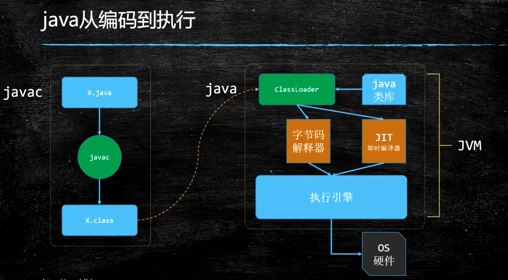

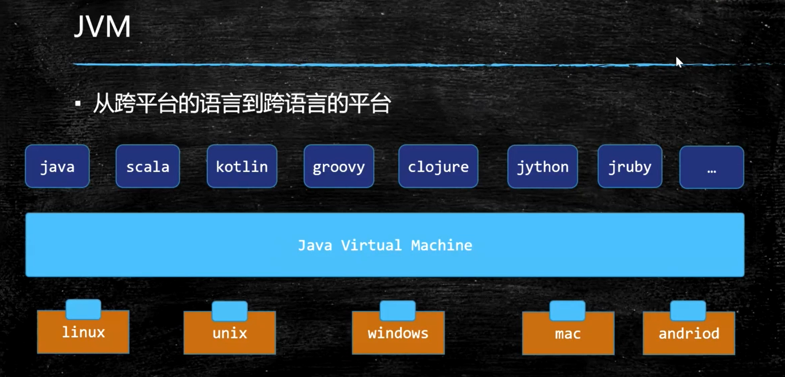

- **JVM与Java独立不相关，其他语言也可以通过特定的编译生成class字节码文件，在JVM上运行** 

- **JVM是一种规范**，是虚构出来的一台计算机：字节码指令集(汇编语言)、内存管理(堆、栈、方法区等)

- **常见JVM的实现：** HotSpot(oracle官方)、Jrockit(BEA，曾号称世界上最快的JVM，后被oracle收购，合并到hotspot)、J9(IBM)、Microsoft VM、TaobaoVM(HotSpot的深度定制版)、LiquidVM(直接针对硬件)、azul zing(最新垃圾回收的业界标杆)

## 1.2 JVM,JRE,JDK
- JDK = JRE + development kit
- JRE = JVM + core lib

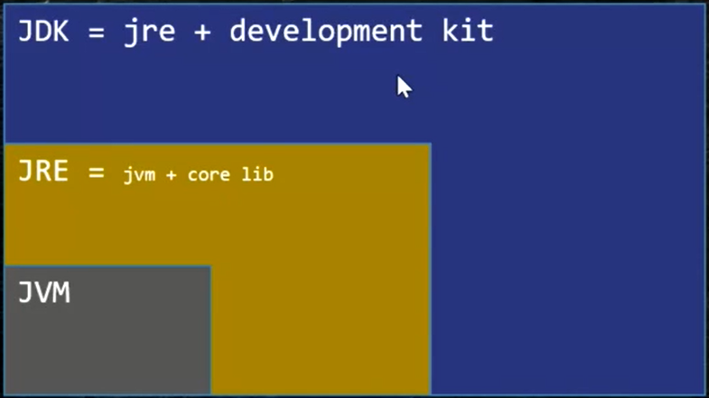

- `JRE`：JRE是指java运行环境。**光有JVM还不能运行class文件**，因为在解释class的时候JVM需要调用解释所需要的类库lib。在JDK的安装目录里你可以找到jre目录，里面有两个文件夹bin和lib,在这里可以认为bin里的就是jvm，lib中则是jvm工作所需要的类库，而jvm和 lib和起来就称为jre
- `JDK`：JDK是java开发工具包。在目录下面有六个文件夹、一个src类库源码压缩包、和其他几个声明文件。其中，真正在运行java时起作用的是以下四个文件夹：`bin、include、lib、 jre`。现在我们可以看出这样一个关系，JDK包含JRE，而JRE包含JVM。
  - bin:最主要的是编译器(javac.exe)
  - include:java和JVM交互用的头文件
  - lib：类库
  - jre:java运行环境（注意：这里的bin、lib文件夹和jre里的bin、lib是不同的）

## 1.3 JVM整体结构
- JVM整体结构：
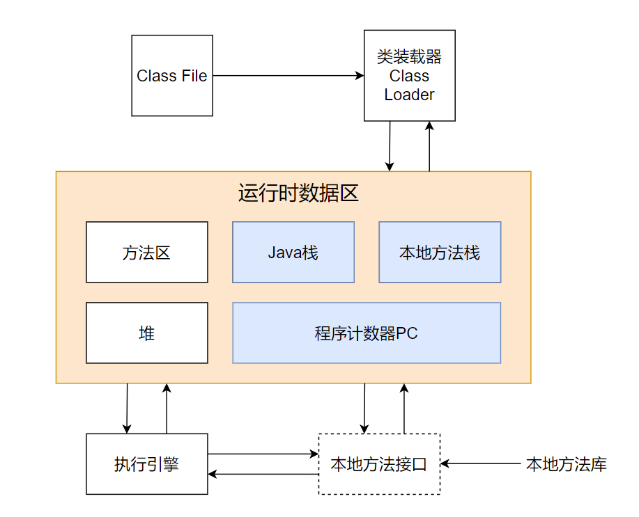
- Java代码执行流程
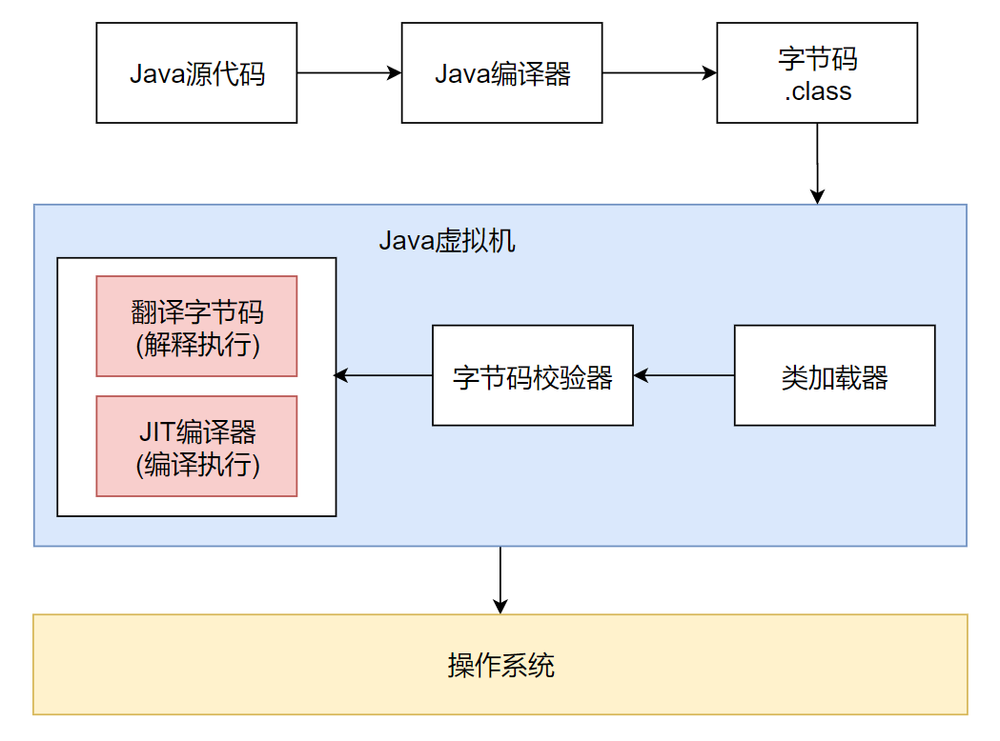
JIT编译器可以对反复执行的热点代码直接编译为机器指令

## 1.4 基于栈的指令集架构
- 由于**跨平台性**的设计，**java的指令都是根据栈来设计的**，不需要硬件支持，避开了寄存器分配难题，可以实现跨平台。不同平台CPU架构不同，所以不能设计成基于寄存器的。
- **优点：跨平台，指令集小，编译器容易实现**
- 缺点：性能下降，实现同样的功能需要更多的指令

## 1.4 JVM的生命周期
**JVM的启动**：JVM的启动是由`引导类加载器(bootstrap classLoader)`创建一个`初始类(initial class)`来完成的，这个类由虚拟机的具体实现来指定，不同虚拟机不一样

**JVM的执行**：运行中的JVM的任务是`执行java程序`，因此程序开始执行时JVM才运行，程序结束时JVM就停止。**执行java程序的时候，真真正正在执行的是JVM进程**

**JVM的退出**：正常执行结束；程序异常终止；操作系统错误；**某线程调用Runtime或System的exit方法，或者Runtime的halt方法**

# 2. Class文件格式
- 魔数：每个Class文件的头4个字节被成为魔数(Magic Number)，它的作用是确定这个文件是为一个能被JVM接收的Class文件：0xCAFEBABE
- 版本号：紧接着魔数的4个字节存储的是Class文件的版本号。前两个字节是次版本号(Minor Version)，后两个字节是主版本号(Major Version)，Java版本号从45开始，每个大版本加1(jdk1.0~1.1使用45.0~45.1)，高级版本的JDK能向下兼容以前版本的Class文件，但不能运行以后版本的Class文件。虚拟机必须拒绝执行超过其版本号的Class文件   
（IDEA可以安装BinEd插件查看字节码，安装jclasslib插件分析class文件的内容）
- 常量池：版本号之后是常量池入口，通常是占据Class文件空间最大的数据项目之一，是Class文件中第一个出现的表类型数据项目。入口需要放置一项u2类型的数据，代表常量池容量计数值(constant_pool_count)。第0个常量空出来是为了后面某些指向常量池的索引值的数据在特定情况下需要表达”不引用任何一个常量池项目“的含义
- 访问标志：常量池之后，两个字节，用于识别类或者接口层次的访问信息。包括：这个Class是类还是接口、是否是public、是否是abstract、类是否final等

# 3. 类的生命周期
- **Class文件加载过程：** 硬盘上的class文件 -> loading -> linking （verfication -> preparation -> resolution） -> initializing -> gc

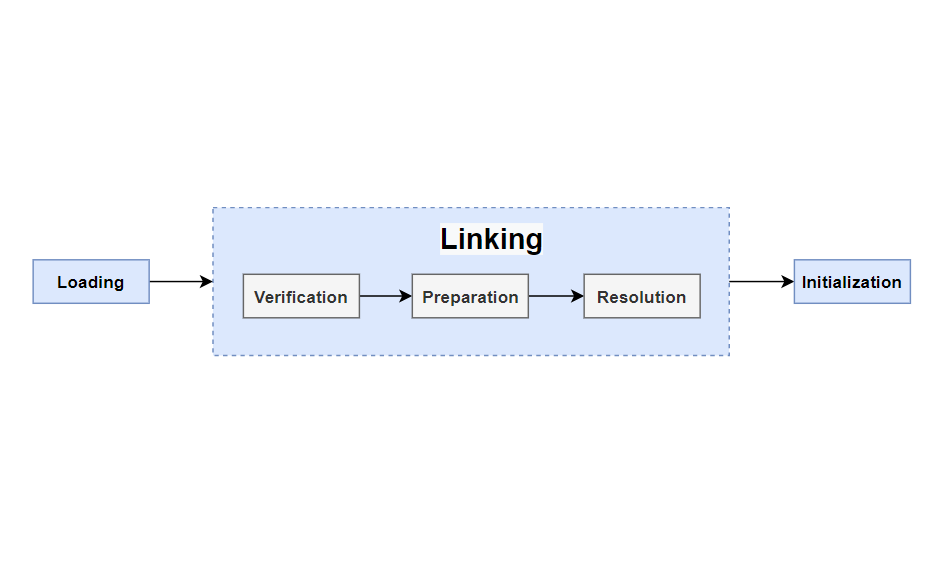

~~~java
public class Test {
    public static void main(String[] args) {
        System.out.println(T.count);
    }
}
class T {
    public static T t = new T();
    public static int count = 2;

    private T() {
        count++;
        System.out.println("--" + count);
    }
}
/** --1
 *  2
 * /
~~~
静态成员加载时，在preparation阶段被赋予了默认值：t=null, count = 0          
到Initializing阶段时被赋予初始值：t=new T()，此时count依然是0，所以count++ 值为1；然后count又被赋予初始值2

## 3.1 Loading
### 3.1.1 什么是类的加载
- 类的加载指的是**将类的.class文件中的二进制数据读入到内存中**，将其放在运行时数据区的**方法区**内，然后在堆中**创建一个java.lang.Class对象作为方法区这个类的各种数据访问入口**，用来封装方法区的数据结构。类的加载的**最终产物是堆中的Class对象**，Class对象封装了类在方法区的数据结构，并且向Java程序员提供了访问方法区内的数据结构的接口

### 3.1.2 类加载子系统的作用
- **加载.class文件的方式**
     - 从本地系统中直接加载
     - 通过网络下载.class文件
     - 从zip，jar，war等归档文件中加载.class文件
     - 运行时计算生成，如动态代理
     - 从专有数据库中提取.class文件
     - 将Java源文件动态编译为.class文件
- ClassLoader只负责class文件的加载，至于是否能运行，则由Execution Engine来决定
- 加载的信息存放到`方法区`，除了类的信息外，方法区还有`运行时常量池`，`字符串字面量`和`数字常量`

- 一开始先判断类是否加载(未加载则ClassLoader加载)，然后开始链接，初始化

### 3.1.3 类加载器的种类
BootStrapClassLoader， ExtensionClasssLoader，ApplicationClassLoader，....三者具有层级关系，但不是继承的关系

Java虚拟机启动后就会初始化 `BootStrapClassLoader`

`BootStrapClassLoader` 负责加载 `ExtClasssLoader` 并且将 ExtClassLoader 的父加载器设置为 BootStrapClassLoader

`BootStrapClassLoader` 加载完 ExtClasssLoader 后，就会加载 `AppClassLoader`， 并且将 AppClassLoader 的父加载器设置为 ExtClassLoader

- JVM支持两种类加载器：`引导类加载器(Bootstrap ClassLoader)`和自定义类加载器(User-Defined ClassLoader)，`Extension ClasssLoader`和`System ClassLoader`都属于自定义类加载器。(继承自ClassLoader)
- `启动类加载器BootstrapClassLoader` 是使用C/C++编写的，并不继承自`java.lang.ClassLoader`，没有父加载器，**只负责加载包名为java，javax，sun等开头的类** 
- `扩展类加载器ExtensionClassLoader` 是由java语言编写，继承自`ClassLoader`，父类是启动类加载器，**用于加载java.ext.dirs指定的目录的类库，或者从jdk安装目录的jre/lib/ext下加载类库，如果用户创建的jar放在此目录，也会自动由扩展类加载器加载**
- `系统类加载器/应用程序类加载器AppClassLoader` 继承自ClassLoader，**负责加载环境变量或者系统属性java.class.path指定路径下的类库，是程序默认的类加载器**
--------
- **自定义类** 的类加载器是系统类加载器`SystemClassLoader`
- **Java核心类** 的类加载器是引导类加载器`BootStrapClassLoader`
~~~java
public class Test {
    public static void main(String[] args) {
        //获取系统类加载器
        ClassLoader systemClassLoader = ClassLoader.getSystemClassLoader();
        System.out.println(systemClassLoader);  //sun.misc.Launcher$AppClassLoader@18b4aac2

        //获取系统类加载器的上层：扩展类加载器
        ClassLoader extClassLoader = systemClassLoader.getParent();
        System.out.println(extClassLoader);  //sun.misc.Launcher$ExtClassLoader@7f31245a

        //获取扩展类加载器的上层：BootstrapClassLoader 获取不到
        ClassLoader bootstrapClassLoader = extClassLoader.getParent();
        System.out.println(bootstrapClassLoader);  //null

        //用户自定义类的类加载器：发现就是系统类加载器
        ClassLoader classLoader = Test.class.getClassLoader();
        System.out.println(classLoader);   //sun.misc.Launcher$AppClassLoader@18b4aac2

        //Java核心类的类加载器是BootstrapClassLoader
        ClassLoader classLoader1 = String.class.getClassLoader();
        System.out.println(classLoader1);   //null
    }
}
~~~

### 3.1.4 双亲委派机制

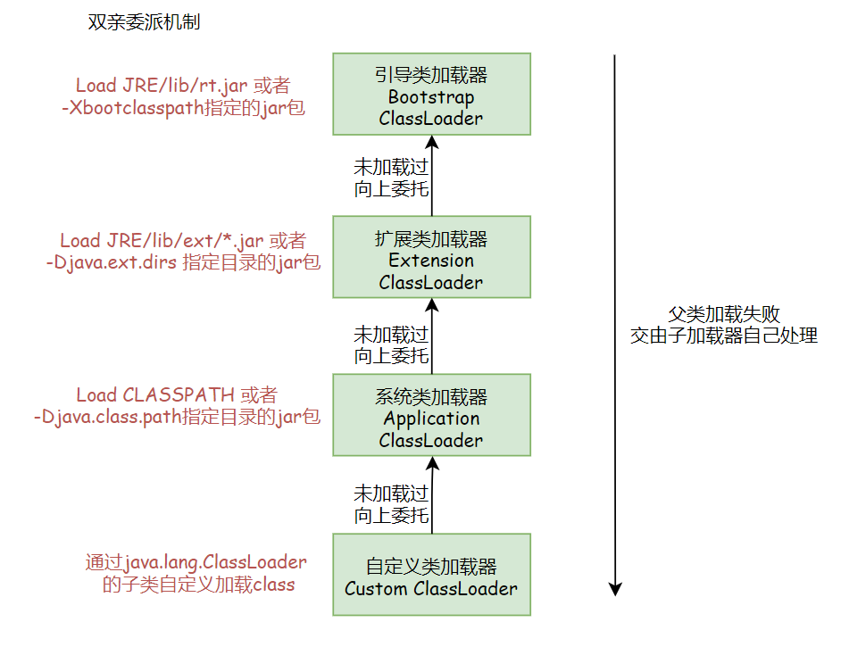

- JVM规范允许类加载器在预料`某个类将要被使用就预先加载`(并不是要等到首次使用才加载)，如果预加载出现错误，必须`在程序首次主动使用该类时才报告错误`(LinkageError)，如果该类一直未被程序主动使用，则类加载器不会报错
- JVM采用按需加载，加载某个类时，JVM采用的是`双亲委派机制`，即**类加载器收到类加载请求时，不会自己去加载，而是把请求交给父类的加载器去处理，直到达到顶层的引导类加载器，如果无法加载，再往下委托**，是一种任务委派模式

- 在JVM中判断两个class对象是否为同一个类的两个必要条件：**全限定类名相同，类的ClassLoader也相同**，也就是说两个类对象来源于同一个Class文件，只要不是被同一个ClassLoader加载，这两个对象就是不同的
- **如果一个对象是被用户类加载器加载的，JVM会把这个类加载器的引用作为类信息的一部分保存到方法区中**，要保证类加载器不变

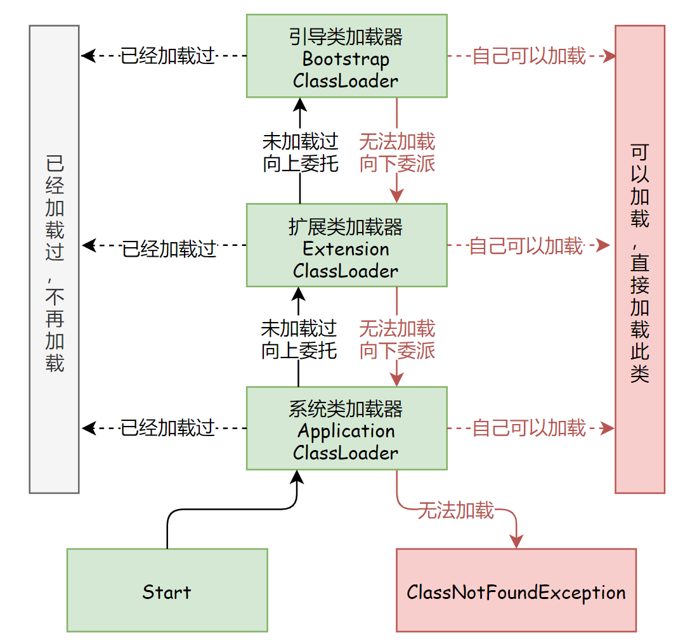

~~~java
package java.lang;

public class String {
    static{
        System.out.println("我是自定义的String类");
    }
}

public class Test {
    public static void main(String[] args) {
        java.lang.String s = new java.lang.String();
    }
}
~~~
发现没有输出，因为首先系统类加载器交给拓展类加载器，拓展类加载器交给引导类加载器，引导类加载器发现是java.lang包的String，于是就把真正的String类给加载了，就不会加载我们自定义的String类了

~~~java
package java.lang;

public class String {
    static{
        System.out.println("我是自定义的String类");
    }

    public static void main(String[] args) {
        System.out.println("111");
    }
}

//错误: 在类 java.lang.String 中找不到 main 方法, 请将 main 方法定义为:public static void main(String[] args)
//否则 JavaFX 应用程序类必须扩展javafx.application.Application
~~~

- **双亲委派的优势**： `避免类重复加载`，`保护程序安全`，防止核心API被随意篡改
- **双亲委派的劣势**：顶层的ClassLoader无法访问底层ClassLoader所加载的类
- **破坏双亲委派机制**：`重写java.lang.ClassLoader.loadClass()方法`可以打破，但是无法破坏核心类库的加载，jdk还提供了额外的保护
  - 1. jdk1.2以前没有双亲委派机制，也破坏了双亲委派机制
  - 2. 启动类加载器通过当前线程的上下文类加载器破坏，线程类加载器默认情况下就是系统类加载器。
  - 3. 热部署
  - `DrvierManager破坏双亲委派机制`：**Driver接口定义在jdk中**，其实现由不同的数据库服务商提供，**DriverManager(也是由jdk提供)** 要加载各个实现了Driver接口的实现类，然后进行管理，但是**DriverManager由启动类加载器加载**，而**Driver接口的实现类**是由服务商提供，需要由**系统类加载器**加载，**根据类加载机制，当被加载的类引用了另一个类的时候，虚拟机就会使用加载第一个类的加载器去加载被引用的另一个类**，但是启动类加载器没法加载Driver的实现类了，所以这时启动类加载器就要委托子类加载器加载Driver的实现，从而破坏双亲委派机制。
  - `Tomcat破坏双亲委派机制`：每个Tomcat的webappClassLoader加载自己目录下的class文件，不会委托给父类加载器，目的是为了对各个webapp中的class和lib相互隔离，避免影响。另外还可以热部署，修改文件不用重启就自动装载类库

## 3.2 Linking
- Linking分为三个步骤：格式校验verfication、静态变量赋予默认值preparation、解析resolution
### 3.2.1 verfication
确保Class文件的字节流包含信息复合当前虚拟机的要求，保证被加载类的正确性，不会危害虚拟机自身安全

- 主要包括四种验证：文件格式验证，元数据验证，字节码验证，符号引用验证

### 3.2.2 preparation 半初始化

- 为变量分配内存，并设置为默认初始值，即零值
- **不包含用final修饰的static变量**，因为final常量在编译的时候就会分配了
- 不会为实例变量初始化

静态变量赋予默认值
- 举例：Double Check Singleton
~~~java
public class Singleton {
    private Singleton() {}  //私有构造函数
    private volatile static Singleton instance = null;  //单例对象
    //静态工厂方法
    public static Singleton getInstance() {
        if (instance == null) {      //双重检测机制
            synchronized (Singleton.class){  //同步锁
                if (instance == null) {     //双重检测机制，避免第一次判空的线程拿到锁后new出对象
                    instance = new Singleton();
                }
            }
        }
        return instance;
      }
}
~~~
**高并发时的问题：** 假设单例对象中有变量 count，初始值设为1000，线程A首先判断单例对象为null，创建对象，但是count的初始化分为两步            

- 第一步在preparation的半初始化阶段赋予默认值count=0
- 第二步在Initializing初始化时才被赋予初始值count=1000
如果线程A在第一步时，线程B来了，判断instance!=null，于是直接返回了count=0的instance，发生了错误

- **volatile防止该变量初始化时指令重排**，确保引用指向内存前实例初始化完毕，而可见性已经由synchronized保证了(https://blog.csdn.net/FU250/article/details/79721197)     
- 其实`instance = new Singleton()` 可以拆分成三部分：
   - a.`new #2 <T>`分配对象的内存空间，**半初始化**对象(java中申请内存就会进行默认初始化)
   - b.`invokespecial #3 <T.<init>>` 初始化，调用了构造方法
   - c.`astore_1` 建立关联，将引用指向对象的地址        
- a→b→c顺序执行不会有什么问题，但是如果JVM和CPU把指令顺序优化为a→c→b，当执行完a,c后，可能另一个线程在第一次判断singleton=null，但此时不为空了(已被赋予默认值)，不用进入synchroniezd，于是就**将未初始化完毕的instance对象返回**了

### 3.2.3 resolution
- 静态解析，**将常量池内的符号引用转换为直接引用**的过程

  符号引用就是一组符号来描述所引用的目标，直接引用就是直接指向目标的指针、相对偏移量或一个间接定位到目标的句柄

- 解析动作主要针对类或接口、字段、类方法、接口方法、方法类型等。对应常量池中的`CONSTANT_Class_info`、`CONSTANT_Fieldref_info`、`CONSTANT_Methodref_info`等

- 是可选阶段。如果不执行，符号解析要等到字节码指令使用这个引用时才会进行

## 3.3 Initializing
静态变量赋予初始值
- 初始化阶段就是执行**类的构造器方法**`<clinit>()`的过程
- 此方法是javac编译器自动收集类中的所有`类变量(静态变量)的赋值动作`和`静态代码块中的语句`合并而来。没有类变量和静态代码块就不会产生`<clinit>()`
- `<clinit>()`不同于类的构造器`<init>`
- 若该类具有父类，JVM会保证子类的`<clinit>()`执行前，父类的`<clinit>()`已经执行完毕
- JVM必须保证一个类的`<clinit>()`方法在多线程下被同步加锁，**保证一个类只被加载一次**

# 4 JVM内存模型 

## 4.1 PC寄存器
- 唯一一个在JVM规范中没有规定OOM情况的区域
- 没有GC
- 访问速度最快
- 线程执行 `Java方法` 时，记录正在执行的 **字节码指令地址**
- 线程执行 `Native方法` 时，计数器为空
- **是线程私有的**，每个线程都分配了一个PC寄存器，PC寄存器的生命周期与线程的生命周期保持一致

## 4.2 虚拟机栈
- 每个线程创建的时候都会创建一个虚拟机栈，其内部保存着一个个的`栈帧(Stack Frame)`，对应着一次次的Java方法调用，是线程私有的
- JVM栈中保存：**局部变量(基本数据类型的值+引用数据类型的引用)，部分结果，方法的调用和返回**
- **栈的访问速度仅次于PC**
- 对于栈来说，不存在GC，但是有可能会OOM
- **栈中可能的异常**： 
  - `StackOverflowError`：采用固定大小的虚拟机栈，线程请求分配的栈容量超过java虚拟机栈允许的最大容量
  - `OutOfMemeryError`：采用动态扩展的虚拟机栈，线程尝试扩展时无法申请到足够的内存，或者线程创建时没有足够内存去创建对应的虚拟机栈
    
    - #### 设置栈的大小：`-Xss256k` 设置线程的最大栈空间，决定了函数调用的最大可达深度

### 4.2.1 栈帧
- JVM栈中的数据都是以栈帧(Stack Frame)的格式存在，**线程上正在执行的每个方法都各自对应一个栈帧**
- **不同线程所包含的栈帧不可以相互引用**
- 栈帧的结构：
  - **局部变量表**
  - **操作数栈（或表达式）**
  - **动态链接**（或指向运行时常量池的方法引用）
  - **方法返回地址**（或方法正常退出或异常退出的定义）
  - 一些附加信息

### 4.2.2 局部变量表
- 也称为局部变量数组，或者本地变量表。定义为一个`数字数组`，存储`方法参数和方法体内的局部变量`
- 局部变量表在**编译期间就分配了内存空间**，可以存放编译器的各种变量类型：基本数据类型、对象的引用、returnAddress类型
- **局部变量表的基本存储单元**是`Slot`，`32位以下的类型占用一个slot(也包括returnAdderss)，64位类型占用两个slot(long和double)`，另外byte、short、char都被转换为int存储，boolean也被转换为int 0，1
- JVM为每个Slot分配了访问索引，**方法调用时，`方法参数`和`局部变量`按声明顺序被复制到局部变量表的每个Slot**
- 如果当前帧是`构造方法或者实例方法`，Slot的`index0`会存放`该对象的引用this`，其余参数按顺序继续存放。故而静态方法不能用this，因为栈帧中根本就没有这个变量
- **Slot可以重复利用：** 当局部变量过了作用域后，重新声明的新局部变量就可以复用过期局部变量的槽位，节省资源
- 局部变量表的大小在编译期就确定了，保存在`code`属性的`maximum local variables`数据项中
- 当方法调用结束后，随着方法栈帧的销毁，局部变量表也随之销毁
- **局部变量表中的变量是重要的垃圾回收根节点（GC ROOTS），被局部变量表中直接或间接引用的对象不会被回收**

### 4.2.3 操作数栈
- `操作数栈`**用于保存计算过程的中间结果，同时作为计算过程中变量临时的存储空间**。
- 在方法执行过程中，根据字节码指令，往栈中写入数据或者提取数据，即入栈出栈。某些指令将值压栈，由其他指令将操作数取出栈，运算后再把结果压栈
- **操作数栈的深度**在编译期就确定好了，保存在`Code`属性的`max_stack`数据项中
- 和slot类似，32bit的类型占用一个栈深度，64bit的类型占用两个栈深度
- 对于`byte`范围内的数，直接按`bipush`单字节入栈，`short`类型就按`sipush`双字节入栈，但是存入局部变量表中都是int了
- 由于**JVM操作码是一个字节的零地址指令**，这意味着指令集的操作码总数不可能超过256条,大部分指令都没有支持 byte、char 和 short 类型，甚至没有任何指令支持 boolean 类型。编译器会在编译器或运行期将 byte 和 short 类型带符号扩展为 int 类型， boolean 和 char 类型零位扩展为相应的 int 类型，
**因此，大多数对于 boolean、byte、char 和 short 类型数据的操作，实际都是使用 int 类型作为运算类型**
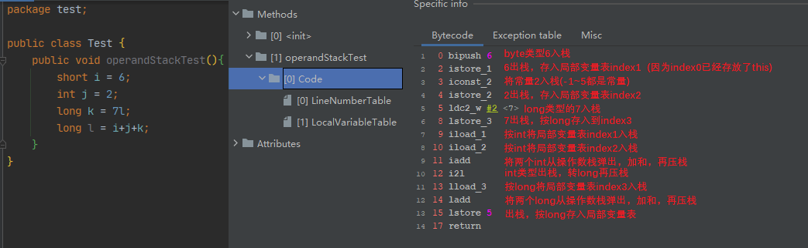

### 4.2.4 动态链接
每个栈帧都包含了一个 **指向运行时常量池中所属的方法的引用**，持有这个引用是为了支持方法调用过程中的 **动态链接**

- **符号引用**通常是用文本/字符串形式来表示的引用关系
- **直接引用**就是JVM所能`直接使用`的形式(指向目标的指针、相对偏移量或一个间接定位到目标的句柄)

`Class`文件的常量池中存在大量的 **符号引用**，字节码中的 **方法调用指令** 就以常量池中指向方法的符号引用为参数。

1. **静态解析**：这些分号引用一部分在 **类加载** 阶段或 **第一次使用** 的时候转化为直接引用(如final、static域等)，称为静态解析
2. **动态解析**：剩下的部分将在每一次的 **运行期间** 转化为直接引用，称为动态连接

- 在java源文件被编译到字节码文件时，所有的`变量和方法引用`都作为`符号引用(symbolic reference)`保存在class文件的常量池中，**动态链接的作用就是将这些符号引用转换为调用方法的直接引用**
- 方法区中的常量池就是为了提供一些符号和常量，便于指令的识别

### 4.2.5 方法的调用
- JVM中，将符号引用转换为调用方法的直接引用与方法的绑定机制相关
- **静态链接**：字节码文件装载进JVM，如果被调用的`目标方法在编译期可知，且运行期保持不变`，这时将调用方法的符号引用转换为直接引用的过程就是静态链接
- **动态链接**：被调用方法在编译期无法被确定下来，也就是`只能在运行期将调用方法的符号引用转换为直接引用`，这种引用转换过程称为动态链接
- 面向对象的语言都具备多态特性，具备早期绑定和晚期绑定两种方式
- 类型构造器和实例构造器：

~~~c#
class myclass{
  static int x;
  //java中不可以用static修饰构造方法，可以用静态代码块达到相同的目的
  static myclass(){ //类型构造器 不能有参数，不能有访问限定符（public,private等）
    x=100;//初始化类静态变量
  }

  private int y; 
  public myclass(int y){  //实例构造器，可以有参数，可以有限定符
    thix.y = y；//初始化实例成员，调用了具体实例this
  }
}
~~~
- **非虚方法**：编译期就确定具体调用版本，该版本运行时不可改变：`静态方法，私有方法，final方法，实例构造器，父类方法`
- **虚方法**：其他在运行时可以体现多态特性的方法
-----
- JVM提供了几种调用方法的指令：
  - `invokestatic`：**非虚方法**。调用静态方法，解析阶段确定唯一方法版本
  - `invokespecial`：**非虚方法**。调用`<init>`方法、`私有方法`和`父类方法`，解析阶段确定唯一方法版本
  - `invokevirtual`：调用所有虚方法，final修饰的方法也会用invokevirtual，除此之外都是虚方法
  - `invokeinterface`：调用接口方法
  - `invokedynamic`：动态解析出需要调用的方法，然后执行。java8的lambda表达式就是通过该指令调用
- 面向对象由于多态特性，会频繁的使用动态分派，如果每次动态分派都要重新在类的方法元数据中搜索到合适的目标的话就会影响到执行效率。
因此为了提高性能，**JVM在类的方法区建立了`虚方法表`，表中存放着各个方法的实际入口，使用索引表来替代查找**

### 4.2.6 方法返回地址
- **存放该方法的调用者的pc寄存器的值**
- **方法正常退出时**，调用者的pc寄存器的值作为返回地址，这样就可以返回到该方法被调用的位置继续执行
- **方法异常退出时**，返回地址通过异常表来确定，栈帧中一般不会保存这部分信息
- 字节码指令中，返回指令包含 `ireturn`(boolean-int), `lreturn`, `freturn`, `dreturn`, `areturn`(引用类型), `return`(void方法，构造方法)

### 4.2.7 附加信息
根据JVM的具体实现而定，可选项，可能包含对程序调试者提供支持的信息

## 4.3 本地方法栈

- `native方法`就是Java调用非Java代码的接口。本地接口的作用是融合不同的语言为java所用
- `Java虚拟机栈`用于管理Java方法的调用，而`本地方法栈`用于管理本地方法（通常是C）的调用
- 本地方法栈也是线程私有的
- 可以设计成固定大小或者可扩展大小。内存溢出方面和java虚拟机栈的情况是一样的，同样会出现StackOverFlowError和OutOfMemoryError
- 当线程调用一个本地方法时，他就进入了一个全新的**不再受虚拟机限制**的世界，它和虚拟机拥有同样的权限！
  - 本地方法可以通过本地方法接口来`访问虚拟机内部的运行时数据区`
  - **可以直接使用本地处理器中的寄存器**
  - **可以直接从本地内存的堆中分配任意数量的内存**
- 并不是所有的java虚拟机都支持本地方法栈
- **HotSpot虚拟机中，直接将本地方法栈和虚拟机栈合二为一了**

## 4.4 堆
- **一个JVM实例只存在一个堆内存**，堆内存是java内存管理的核心区域，**在JVM启动的时候就被创建了，大小也确定了(可调节)**

堆在物理上可以不连续，但是逻辑上应被视为连续的
方法结束后，堆中的对象不会立即消失，要等到gc后才会消失

- 进程的所有线程共享Java堆，但是还可以划分**线程私有的缓冲区**：`TLAB (Thread Local Allocation Buffer)`
- jdk1.7及之前，堆分为：`新生代(Eden:Survivor0:Survivor1=8:1:1)，老年代`，而`永久代`属于方法区
- jdk1.8及之后，**堆分为：新生代，老年代**。`元空间`属于方法区

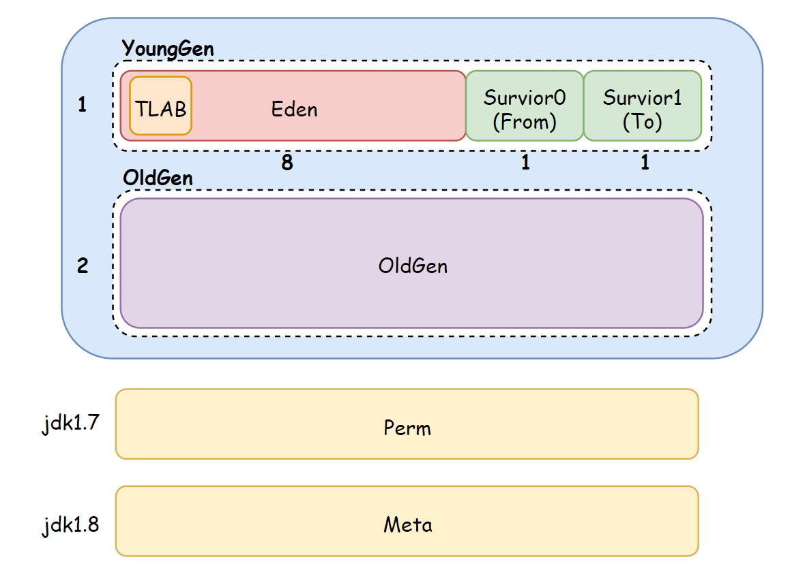

### 4.4.1 设置堆的大小
- 设置堆区起始内存大小：`-Xms`或者`-XX:InitialHeapSize`，默认大小是：电脑物理内存大小/64
- 设置堆区最大内存大小：`-Xmx`或者`-XX:MaxHeapSize`，默认大小是：电脑物理内存大小/4

设置起始堆大小是只包含新生代和老年代的，不包含永久代/元空间
一旦堆区内存大小超过设置的最大内存大小，就会出现OOM     
- 通常将起始内存和最大内存设置相同的值，`不需要在gc清理完堆后重新计算调整堆区大小`，从而提高性能

**查看堆大小相关命令：**
- `jps`：查看java进程的pid
- `jstat -gc pid`：查看pid的内存信息
- 或者直接添加运行参数`-XX:+PrintGCDetails`，在程序执行完显示

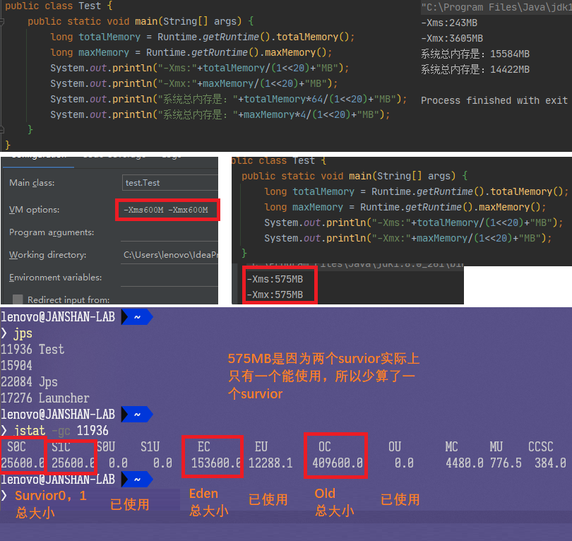

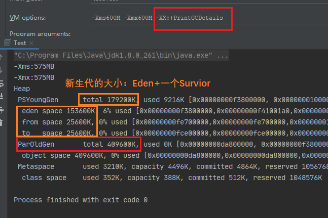

### 4.4.2 年轻代和老年代
- JVM中的对象可分为两类：一类生命周期较短，创建消亡都很快。另一类生命周期很长。分别存放到年轻代和老年代区域
- 默认`新生代：老年代=1：2`，新生代中`Eden：from：to=8：1：1`

- 调整新生代和老年代的占比(一般不去调)：`-XX:NewRatio=4`，表示新生代占1，老年代占4，新生代占整个堆的1/5
  - 查看当前进程新生代和老年代的占比：`jinfo -flag NewRatio pid`
  - 设置新生代空间的大小(一般不设置，用比例就好)：`-Xmn`
- 调整新生代中Eden和Survivor的占比：`-XX:SurvivorRatio=8`，表示Eden占8，两个Survivor各占1
  - 默认有自适应比例的机制：`-XX:-UseAdaptiveSizePolicy`关闭自适应分配策略
  - 查看当前比例：`jinfo -flag SurvivorRatio pid`
- 设置晋升老年代的年龄：`-XX:MaxTenuringThreshold=<N>`，默认值是15
- **当Eden区满的时候就会触发YGC/MinorGC，将Eden和Survivor一起回收，但是Survivor区满的时候不会触发YGC！！！！！**

### 4.4.3 对象分配过程
- **当新对象太大，Eden放不下，YGC之后依然放不下，就会直接晋升到老年代区**
- **当YGC时，Survivor区不够放时，对象会直接晋升到老年代区**
- **动态对象年龄判断/动态年龄计算：** 如果Sruvior区中`从小到大到某个年龄的所有对象大小总和大于Survivor空间的一半`，则年龄`大于等于该年龄`的对象直接进入老年代，无需达到MaxTenuringThreshold，同时会取这个年龄和MaxTenuringThreshold的较小值作为新的晋升阈值。动态年龄计算可以避免我们手动设置的MaxTenuringThreshold过大的问题，防止survivor区溢出。此外防止MaxTenuringThreshold过小，过早晋升导致大量短期对象被晋升到老年代，老年代空间迅速增长，引起频繁的MajorGC，严重影响GC性能
- **大对象直接进入老年代**：大对象需要大量连续内存空间

**担保机制：**

- jdk6以前，**Minor GC前会检查老年代最大可用连续空间是否大于新生代所有对象的总空间**，如果小于就要进行担保机制检查

- 如果有担保机制再检查老年代最大可用连续空间是否大于立即晋升到老年代的对象的平均大小，大于则尝试MinorGC，否则进行FGC

  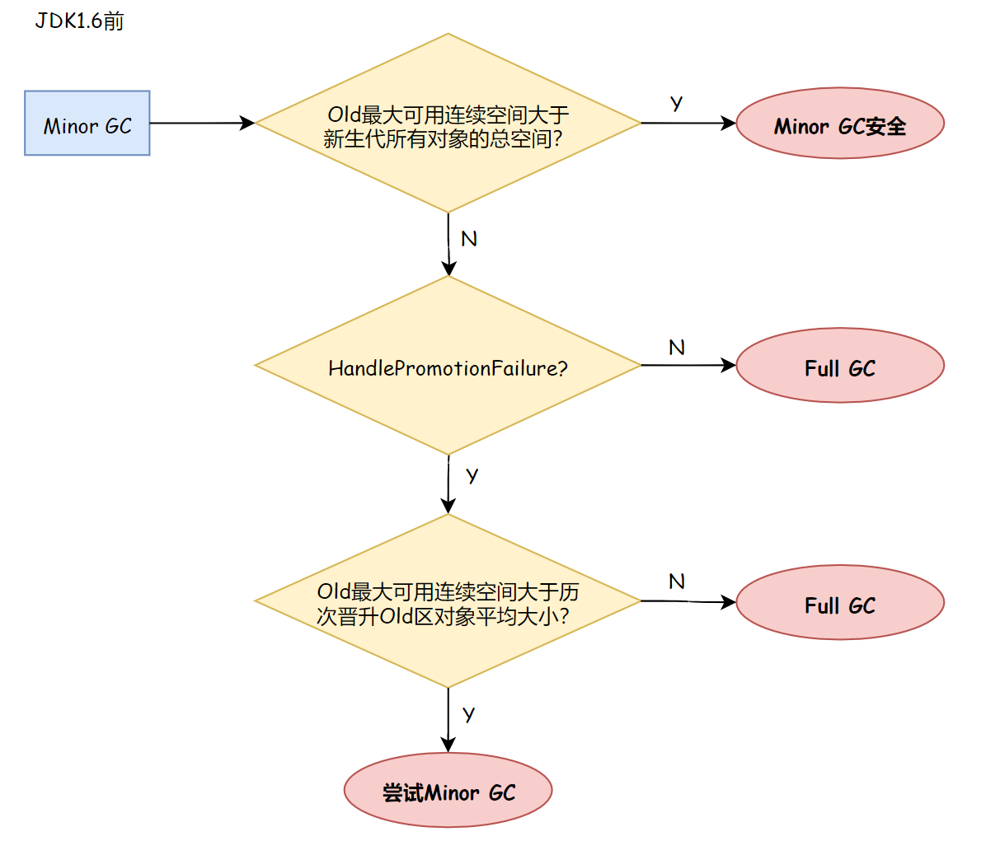

- 但是JDK1.6之后，**只要Old区连续空间大于新生代对象总大小或者历次晋升的平均大小，就会进行MinorGC，否则进行FullGC**，担保失败的参数不再影响虚拟机的空间分配担保策略

### 4.4.4 常用调优工具
- JDK命令
- Eclipse：Memory Analyzer Tool
- Jconsole
- VisualVM
- Jprofiler
- Java Flight Recorder
- GCViewer
- GC Easy

### 4.4.5 MinorGC、MajorGC、FullGC
**JVM进行GC时，并不是每次都对三个内存区域(新生代，老年代；永久代/元空间)一起回收的，大部分时候回收的都是新生代**

针对HotSpot的实现，它里面把GC按照`回收区域`分为两类：`部分收集(Partial GC)`，`完全收集(Full GC)`

- **部分收集**：不是完整收集整个堆的垃圾
  - `新生代收集(Minor GC/Young GC)`：只收集新生代的垃圾
  - `老年代收集(Major GC/Old GC)`：只收集老年代的垃圾
    - 目前只有`CMS GC`会单独收集老年代。**多数时候MajorGC会和FullGC混淆使用，要具体分辨是老年代回收还是整个堆的回收**
  - `混合收集(Mixed GC)`：收集整个新生代以及部分老年代的垃圾。目前只有`G1 GC`会有这种行为
- **整堆收集**：`Full GC`**收集整个java堆和方法区的垃圾**

### 4.4.6 TLAB
- `Thread Local Allocation Buffer(TLAB)`：由于堆区是线程共享的，为了避免多线程操作同一地址，通常需要使用加锁等机制，但是降低了效率。
**于是JVM在Eden区中为每个线程分配了一个私有的缓存区域**，使用TLAB可以避免线程安全问题，提升内存分配的吞吐量，这就是`快速分配策略`
- TLAB区域非常小，只占整个Eden区的1%，**JVM将TLAB作为内存分配的首选**，可以通过`-XX:TLABWasteTargetPercent`设置TLAB空间占Eden的百分比大小
- 一旦对象在TLAB空间分配内存失败时，JVM就会尝试使用`加锁机制`确保数据操作的原子性，从而`直接在Eden空间中分配内存`
- `-XX:UseTLAB`查看是否开启TLAB，默认是开启的

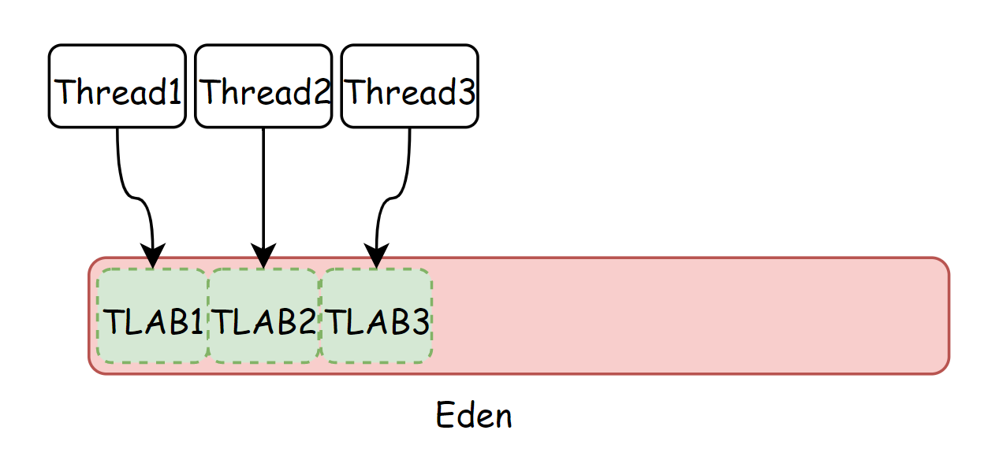

### 4.4.7 堆的参数设置总结
`-XX:+PrintFlagsInitial`：查看所有的参数的默认初始值
`-XX:+PrintFlagsFinal`：查看所有参数的实际值
`-Xms`：设置初始堆空间大小(默认是物理内存/64)
`-Xmx`：设置最大堆空间大小(默认是物理内存/4)
`-Xmn`：设置新生代的大小
`-XX:NewRatio`：设置新生代和老年代的比例(老年代/新生代，默认是2)
`-XX:SurvivorRatio`：设置Eden和Survivor的比例
`-XX:MaxTenuringThreshold`：设置新生代垃圾的最大年龄
`-XX:+PrintGCDetails`：输出详细的GC日志
`-XX:HandlePromotionFailure`：是否设置空间分配担保，jdk6以前

### 4.4.8 堆不是对象分配的唯一选择
- 随着`JIT编译器`的发展和`逃逸分析`技术逐渐成熟，`栈上分配、标量替换优化技术`有可能导致对象分配到栈上
- 如果经过`逃逸分析(Escape Analysis)`后发现，一个对象`没有逃逸出方法`的话，就可能被优化成`栈上分配`，这样就无需在堆上分配，无需进行垃圾回收了

**逃逸：** 如果对象在方法中定义后，只在`方法内部`使用，则没有发生逃逸，否则认为发生了逃逸。

**编译器对未逃逸的代码的优化**：
- **栈上分配：** JIT编译器在编译期间根据逃逸分析的结果，对于没有逃逸的对象，就可能被优化成栈上分配。(目前HotSpot只有标量替换)
- **同步省略 / 锁消除：** JIT编译器在借助逃逸分析判断同步块所使用的`锁对象`是否`只能被一个线程访问而没有被发布到其他线程`，如果是，JIT编译器在编译这个同步代码块时就取消对这部分代码的同步，提高性能，也叫`锁消除`
- **分离对象 / 标量替换：** 有的对象不会被外界访问到，那么对象的部分或全部可以不存储在内存（堆），而是存储到CPU寄存器（栈）中。即`JIT优化把对象拆解成若干标量`，存储到栈上，而不会创建对象
  - 标量：不可以再拆分成更小的数据的数据。Java中原始数据类型都是标量
  - 聚合量：可以拆分为其他聚合量和标量。如Java中的类
- 逃逸分析技术还不成熟(逃逸分析本身消耗性能)，**目前HotSpot并没有栈上分配，但是有标量替换**
- **所以目前为止，Java中对象实例都是分配在堆上的**

## 4.5 方法区

### 4.5.1 堆、栈、方法区的交互
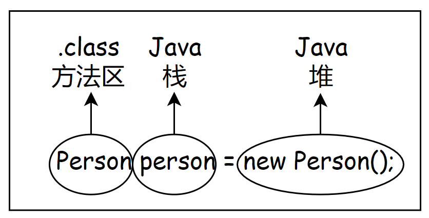

### 4.5.2 方法区的理解
- 《Java虚拟机规范》中提到，方法区逻辑上是堆的一部分，但是具体的实现可能不会对方法区进行垃圾回收。对于HotSpot虚拟机而言，方法区还有一个别名叫`非堆(Non-Heap)`，目的就是要和堆分开
- 方法区和堆一样，**是线程共享的内存区域**
- 方法区的实际物理内存空间和堆一样**可以是不连续的**
- 方法区的大小跟堆一样，**可以固定大小或者可扩展**
- **方法区的大小决定系统可以保存多少个类**，如果系统中定义了太多类(加载大量第三方jar包)，导致方法区溢出，同样会有OOM(PermGen或者Meta space)

jdk8以前的`永久代依然用的是JVM的内存`，容易OOM，所以jdk8使用在`本地内存中实现的元空间`替代了之前的永久代

### 4.5.3 设置方法区的大小
- jdk7设置永久代大小
  - `-XX:PermSize`设置初始大小，默认20.75MB
  - `-XX:MaxPermSize`设置最大空间大小，32位机器默认64MB，64位机器默认82MB
- jdk8设置元空间大小（一般设置最大值。。。）
  - `-XX:MetaspaceSize`默认值是21M
  - `-XX:MaxMetaspaceSize`默认值是-1，即无限制

### 4.5.4 方法区的内部结构
- **方法区存放**：`类型信息`(类，接口，枚举，注解，域信息，方法信息...)，`常量`(运行时常量池)，`静态变量`，`JIT编译后的代码缓存`等

1. **类型信息** 对每个加载的类型，JVM必须在方法区中存储以下类型信息
   - `该类型的全限定名`
   - `该类型直接父类的全限定名`，对于interface和 java.lang.Object 没有父类
   - `该类型的修饰符`，public, abstract, final
   - `该类型的直接接口的有序列表`

2. **域信息**：方法区中保存类型的所有域信息以域的声明顺序。包括域名，域类型，域修饰符
   - 要注意的是，**static的域信息在编译后不会被赋值，等到类加载的Linking的Preparation阶段赋默认值，Initializing时赋初值**
    **而static final的域信息是全局常量，编译为.class后直接就被赋予初值了（常量池）**

3. **方法信息**
   - 方法名
   - 返回值类型
   - 参数的数量和类型
   - 方法的修饰符
   - 方法的字节码、操作数栈、局部变量表及大小(abstract和native方法除外)
   - 方法的异常表(abstract和native方法除外)：每个异常处理的开始位置，结束位置，处理异常的代码位置，被捕获的异常类的常量池索引
  
4. **运行时常量池**
   - **常量池**是字节码文件中的 Constant Pool：包括各种**`字面量（数值，字符串值）`和`对类型、域、方法的符号引用`**
   - 将字节码文件加载到方法区后，常量池加载到方法区，就是运行时常量池（符号引用→直接引用）
   - **JVM为每个已加载的类型(类，接口)维护一个常量池**，池中的数据项像数组一样，可以直接通过索引访问(#)
   - **运行时常量池中的`符号引用`已经在运行期被解析为`真实地址`了**(动态链接)
   - 并非编译期的常量池才能进入运行时常量池，运行期也可以将新的常量放入池中，例如 `String.intern()` 方法

### 4.5.5 方法区结构的演进
首先，只有HotSpot才有永久代，JRockit和J9等没有永久代，Java虚拟机规范没有管束具体方法区的实现细节

- jdk1.6及之前：有永久代，**静态变量存放在永久代上**
- jdk1.7：有永久代，**字符串常量池、静态变量从永久代移除，保存在堆空间中**
- jdk1.8之后：无永久代，**字符串常量池、静态变量保存在堆中。类型信息、字段、方法、常量保存在本地内存的元空间**

**不使用永久代的原因：**
- 永久代空间大小难确定，小了OOM，大了浪费。
- 对永久代调优困难

**字符串常量池调整到堆的原因：**
- 永久代回收效率很低，Full GC时才会触发。而Full GC是老年代的空间不足、永久代不足才会触发，这就导致经常创建的字符串常量被回收的效率不高，`放到堆里可以及时进行回收`！
- java7移动的其他原因，一方面是Perm区太小了，另一方面java8又准备建立原空间，所以移动了

**静态变量调整到堆的原因：**

- 注意：静态变量是指`引用`，对象始终都是在堆中
- 同样是为了提高回收效率吗？

### 4.5.6 方法区的垃圾回收
jvm规范并没有规定要对方法区的垃圾进行回收，HotSpot对方法区也实现了gc。方法区中的类回收效果不好，条件苛刻
- 对常量，不再使用即可回收
- 对类而言，情况比较复杂，需要同时满足三个条件：
  - 该类的所有实例都已被回收，Java堆中不存在该类及其任何派生子类的实例
  - 该类的类加载器已经被回收(类加载器中记录了加载了哪些类)
  - 该类对应的java.lang.Class对象没有任何地方被引用，无法在任何地方通过反射访问该类的方法

## 4.6 对象实例化和内存布局

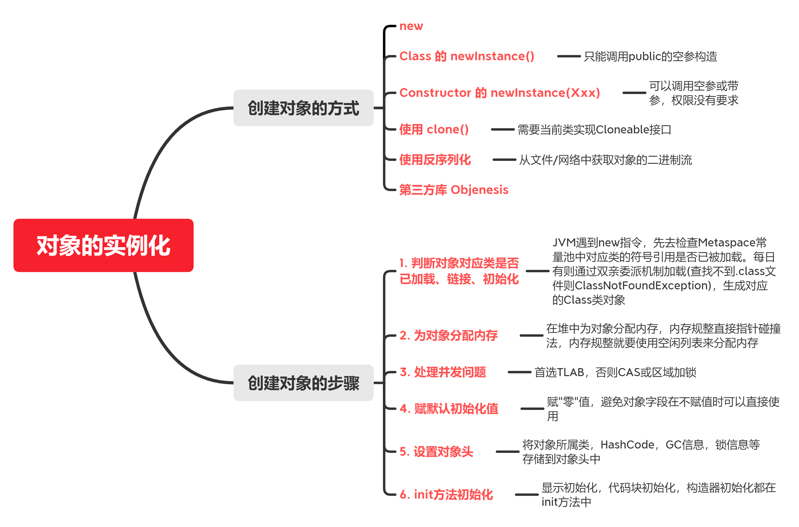

**分配对象**：Java对象地址操作主要使用了Unsafe调用了C的`allocate`和`free`两个函数，分配方法有两种**：**

1. **空闲列表(free list)**：通过额外的存储空间记录空闲的地址，将随机IO变为顺序IO，但是带来了额外的空间消耗
2. **指针碰撞(bump pointer)**：通过一个指针作为空闲区和已分配区的分界点，需要分配内存时，仅需把指针往空闲的一端移动对象大小相等的距离，分配效率高，但是使用场景有限，如果内存是不规整的，已使用的内存和空闲内存相互交错就没办法进行简单的指针碰撞了，必须使用空闲列表

32位jvm下的markword存储结构如下：

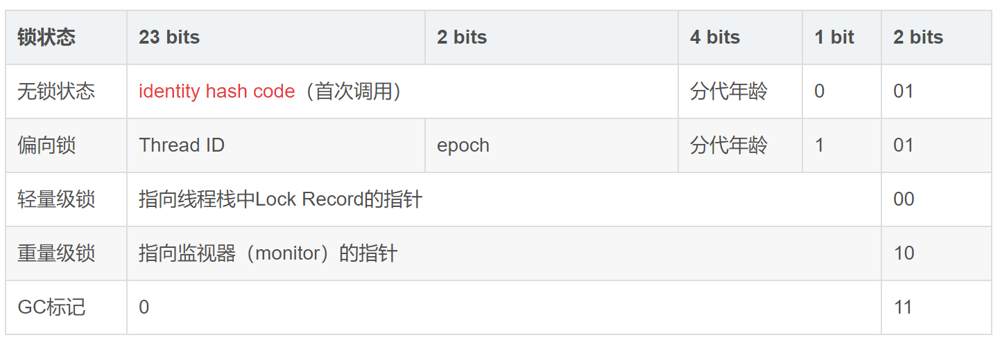

64位jvm下的markword存储结构如下：

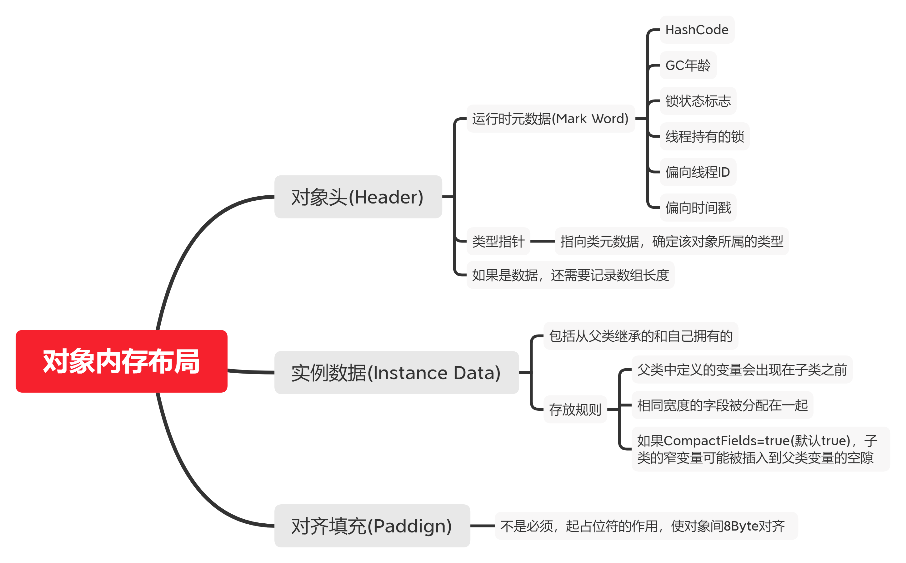

 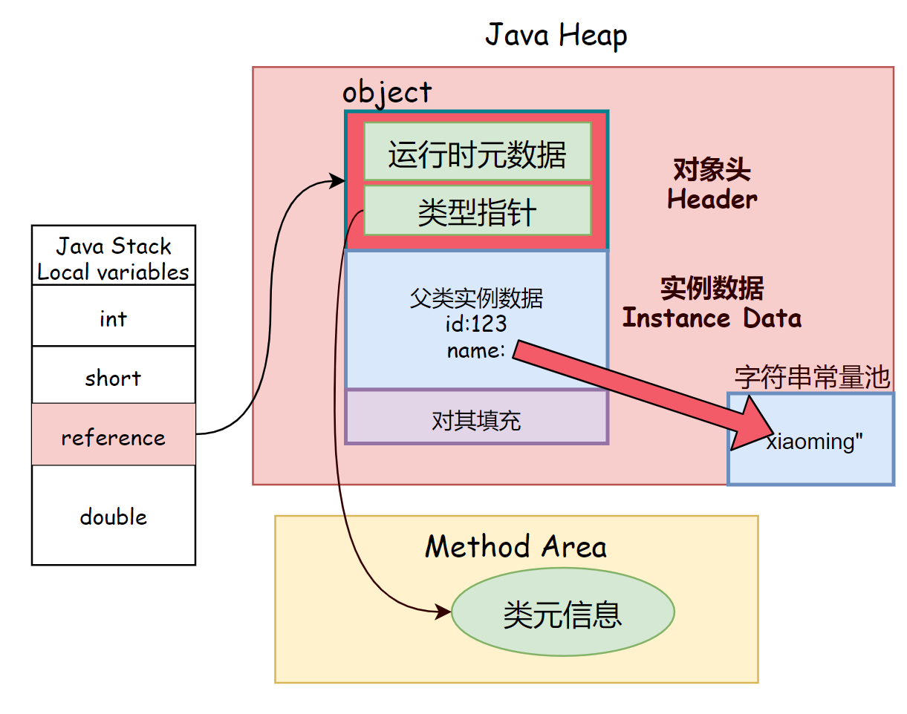

- `Object o = new Object();`new的一个object对象在内存中占多少字节？
8个字节的`markword`(64位的jvm)，接下来4个字节是指向对象所属Class类型的`类型指针`，最后4个字节是为了8字节对齐的填充padding。一共占用16个字节的堆内存
另外如果算上栈上的引用的话，还有8个字节的`引用`。(32位jdk则是4个字节的引用)

# 5. Java多线程内存模型
- **每个线程由自己独立的PC，栈，本地方法栈**
- **线程间共享方法区，堆**
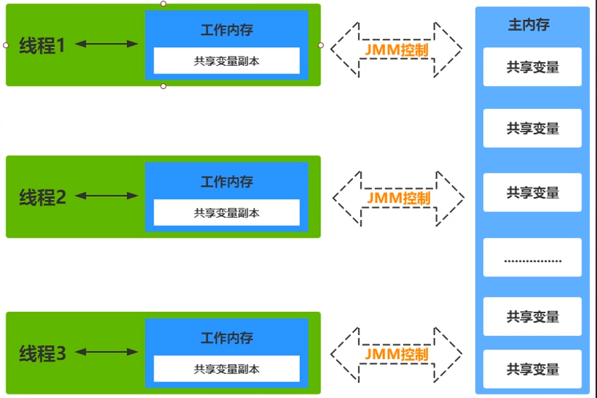

- 每个Thread有一个属于自己的工作内存
- 所有Thread共用一个主内存
- 线程对共享变量的所有操作必须在工作内存中进行，不能直接操作主内存
- 不同线程间不能访问彼此的工作内存中的变量，线程间变量值的传递都必须经过主内存          

如果一个线程1对共享变量x的修改对线程2可见的话，需要经过下列步骤：       
a. 线程1将更改x后的值更新到主内存        
b. 主内存将更新后的x的值更新到线程2的工作内存中x的副本    

**JMM数据原子操作：**
1. read：从主内存读取数据

2. load：将主内存读取的数据写入工作内存

3. use：从工作内存读取数据来计算

4. assign：将计算好的值重新赋值给工作内存

5. store：将工作内存的数据写入主内存

6. write：将store过去的变量赋值给主内存中的变量

7. lock：将主内存变量加锁，标识为线程独占状态

8. unlock：将主内存变量解锁，解锁后其他线程可以锁定该变量

  

  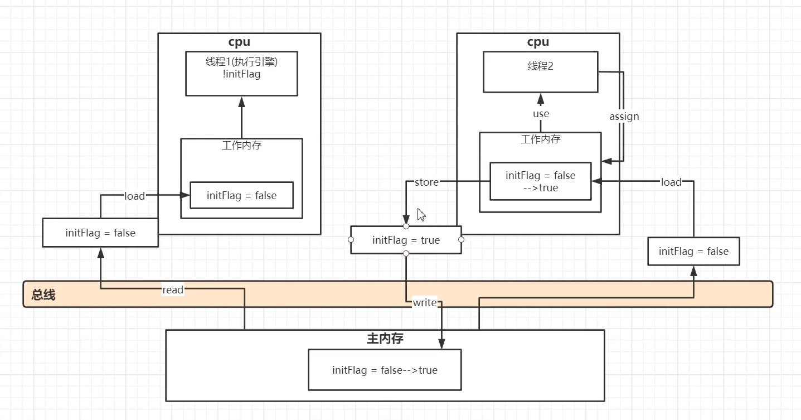

# 6. JVM执行引擎
## 6.1 虚拟机的执行引擎
物理机的执行引擎是直接建立在处理器、缓存、指令集和操作系统层面上的。而`虚拟机的执行引擎是由软件自行实现的`，可以不受物理条件制约地定制指令集和执行引擎的结构体系，`能够执行那些不被硬件直接支持的指令集格式`

JVM的主要任务就是`装载字节码`，由于字节码不能直接运行在操作系统之上，于是JVM使用执行引擎`将字节码指令解释/编译为对应平台上的本地机器指令`

**执行引擎的工作：** **通过存储在局部变量表中的对象引用准确定位到存储在堆中的对象实例信息，以及通过对象头中的元数据指针定位到目标对象的类型信息**

## 6.2 Java代码编译和执行过程
高级语言需要先编译为汇编语言，再经过汇编，变为机器指令，才能被计算机执行

**每个字节码指令有一个字节的操作码和附加的操作数组成**，执行引擎取得一个操作码，然后根据操作数来执行任务，完成后继续执行下一条操作码

字节码可以通过两种方式转换成机器语言：解释器，即时编译器（Just In Time）

- **解释器：** java虚拟机根据预定义的规范，对字节码采用`逐行解释`的方式执行，将每条字节码内容翻译为对应平台的`机器指令`执行。**效率低下，但响应快，立即执行**
- **JIT编译器：** java虚拟机`将源代码直接编译`成和本地机器平台相关的`机器语言`，`缓存到方法区的CodeCache`。**效率提升，但程序启动时需要花费更多时间进行编译**
- HotSpot虚拟机，采用**解释器与即时编译器并存**的架构。JIT编译器采用`基于计数器的热点探测`方法，当`方法调用计数器`(方法调用次数)和`回边计数器`(循环次数)之和超过`阈值`(Client模式为1500, Server模式10000)就会触发JIT编译。如果一个半衰周期时间内方法未被调用，就要进行`热度衰减`，方法调用计数器热度衰减为一半
`-XX:CompileThreshold` 设置计数器触发JIT编译的阈值
`-XX:-UseCounterDecay` 关闭热度衰减
`-XX:CounterHalfLifeTime` 设置半衰周期的时间，秒
`-Xint` 完全采用解释器模式执行程序
`-Xcomp` 完全采用JIT模式执行程序
`-Xmixed` 采用解释器+JIT混合模式执行程序

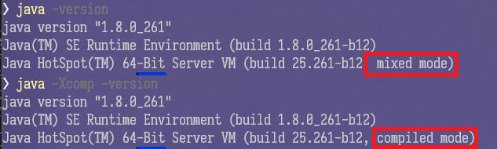

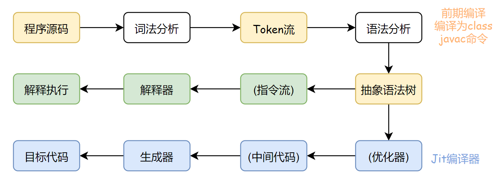

# 7.  GC
- jvirtualvm工具，java自带，查看正在运行的java程序的资源情况
- Arthas，阿里开发的调优工具，常用

- **没有可以解决STW(stop the world)的垃圾收集器** 
- 常见垃圾回收器：整个Java发展过程中的10种垃圾回收器
    - 左边6种分类模型：区分新生代和老年代
    - 后面的3种不再区分新生代和老年代
    - Epsilon 用来调试jdk，生产环境一般不用

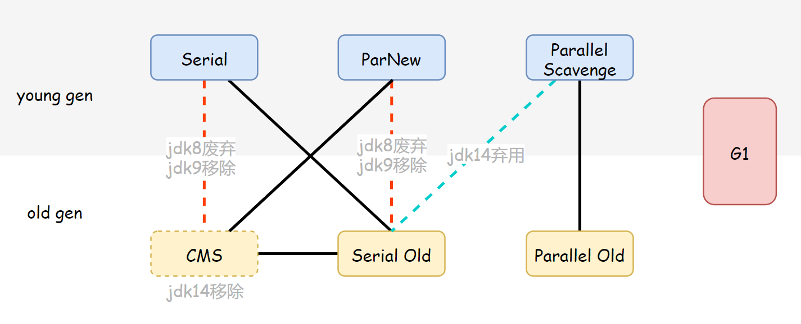
- G1的STW是可控的，使STW的时间最短
## 7.1 相关概念

### 7.1.1 什么是垃圾
- C语言(malloc free)，C++（new delete），Java(new ×)。Java内存自动回收，编程简单，避免：**忘记回收(内存泄漏)**，**多次回收**
- `垃圾(garbage)：`**没有任何引用指向的对象，或者循环指向的一堆对象**

### 7.1.2 如何找到垃圾
- `引用计数(Reference Count)`：记录指向对象的引用数量，不能解决循环指向的问题
- `根可达算法(Root Searching)`：通过一系列名为”GC Roots”的对象作为起始点，从这些节点开始向下搜索，搜索所走过的路径称为引用链(Reference Chain)，当一个对象到GC Roots没有任何引用链相连时，则证明此对象是垃圾
  - **根对象(GC roots)：** **JVM stack中引用的对象**、**本地方法栈引用的对象**、**方法区中类静态属性引用的对象**、**方法区中常量引用的对象**(如String Table里的引用)、**被同步锁synchronized持有的对象**、**jvm内部的引用**(基本数据类型对应的Class对象，常驻的异常对象，系统类加载器)

### 7.1.3 主动垃圾回收
通过`System.gc()`或者`Runtime.getRuntime.gc()`的调用，会显示触发`FullGC`，同时对新生代和老年代进行回收

但是System.gc()无法保证对垃圾收集器的调用。仅仅是提醒jvm，希望进行一次垃圾收集
使用`System.runFinalization()`可以强制调用失去引用的对象的finalize()方法

### 7.1.4 内存溢出和内存泄漏
- **内存溢出(OOM)**：没有空闲内存，并且垃圾收集器也无法提供更多内存时，才会引发内存溢出。
  - 例如堆内存设置太小，或者字符串缓存占用太多空间等
- **内存泄漏(Memory Leak)**：对象不再被程序用到了，但是GC又无法回收它们，才叫内存泄漏。内存泄漏会逐渐蚕食内存，最终可能会出现OOM。
  - **举例**：单例的生命周期和应用程序一样长，如果单例对象持有对外部对象的引用，这个外部对象使用完后就不能被回收，导致内存泄漏
  - 一些提供close的资源未关闭导致内存泄漏，如数据库连接，网络连接，io连接等，必须要手动close，否则是不能被回收的

### 7.1.5 安全点和安全区域
- 程序执行时，并非所有地方都能停顿下来开始GC，只有特定的位置才可以，这些位置称为`安全点`。安全点太少会导致GC等待时间太长，太多会导致程序运行的性能不好，**一般选择执行时间长的指令作为安全点**，如方法调用、循环跳转、异常跳转
- 对于程序不执行的时候，例如Sleep或者Blocked状态，无法响应JVM的中断请求，运行到安全点去中断挂起，所以就需要`安全区域`。安全区域就是在一段代码中，对象的引用关系不会发生变化，在这个区域中的任何位置开始GC都是安全的。

### 7.1.6 强引用，软引用，弱引用，虚引用
四种引用的强度依次减弱
- `强引用(Strong Reference)`：**永远不回收**。无论在任何时候，只要强引用关系还在，垃圾收集器就永远不会回收掉被引用的对象
- `软引用(Soft Reference)`：**内存不足时回收**。在系统将要发生OOM之前，将这些对象列入回收范围之中进行第二次回收，回收后还没有足够内存才会抛出OOM异常。**高速缓存**就用到了软引用。`SoftReference<User> softUser = new SoftReference<User>(new User());`**通过软引用可以访问到对象**
- `弱引用(Weak Reference)`：**只要进行垃圾收集就回收**。被弱引用关联的对象只能存活到下一次垃圾收集，当垃圾收集器工作时，无论内存空间是否足够，都会回收掉弱引用关联的对象。根软引用一样可以直接通过弱引用访问对象，`WeakHashMap`的entry就用到了弱引用
- `虚引用(Phantom Reference)`：又称为幽灵引用，幻影引用。一个对象是否有虚引用，完全不会对其生存时间构成影响，也**无法通过虚引用来获得一个对象的实例**，和没有引用几乎是一样的。**为一个对象设置虚引用的唯一目的是在对象被回收时收到一个系统通知**

## 7.2 垃圾回收算法
- **垃圾标记阶段：** 对象存活判断。`引用计数法`和`可达性分析算法`
- **垃圾清除阶段：** `标记清除算法`,`复制算法`,`标记压缩算法` 

### 7.2.1 标记阶段
- `引用计数(Reference Count)`：记录指向对象的引用数量，引用计数器值为0时就进行回收。
  - 实现简单，效率高，回收没有延迟，但有额外时间空间消耗，**难以解决循环引用的问题，所以没被jvm采用**
  - **强弱引用解决循环引用问题：**若对象A强引用了B，那么B引用A的时候就需要使用弱引用，当判断是否为无用对象时仅需要考虑强引用计数是否为0，不关心弱引用计数的数量
  - **Recyler算法**：黑色(存活对象)，紫色(可能存在环引用的对象)，灰色(垃圾回收器扫描到这个对象，但是在完成扫描所有子节点之前的这段时间内被染成灰色)，绿色(不可能存在环引用的对象)
    - 从紫色节点出发进行子图追踪，同时减少由内部指针产生的引用计数，遍历的对象被标记为灰色（从某个引用开始，尝试解开环）
    - 对所有对象进行检测，如果某个对象引用计数不是0，该对象必然被外面对象引用着，于是将一阶段的操作进行修正（该对象可到达的对象进行修正），重新染色为黑色。若某个引用计数为0，则标记为白色，进行垃圾回收
- `可达性分析(Root Searching)`：通过一系列”GC Roots”对象作为起始点，从这些节点开始向下搜索，搜索所走过的路径称为`引用链`(Reference Chain)，当一个对象到GC Roots没有任何引用链相连时，则证明此对象是垃圾。
  - **可达性分析的过程中要保证一致性**，所以会产生STW，是java和c#采用的方式

Java主要是使用的可达性分析算法

#### 根节点枚举

`根对象(GC roots)：` **JVM stack中引用的对象**、**本地方法栈引用的对象**、**方法区中类静态属性引用的对象**、**方法区中常量引用的对象**(如String Table里的引用)、**被同步锁synchronized持有的对象**、**jvm内部的引用**(基本数据类型对应的Class对象，常驻的异常对象，系统类加载器)。除此之外，还要考虑：例如对于分代回收，**收集新生代的时候，需要将其他非新生代的对象当作是GC Roots**（老年代收集同理）

迄今为止，所有收集器在根节点枚举阶段都必须STW，因为要**保障根节点枚举始终实在一个一致性的快照中进行**（不会出现枚举过程中，根节点集合的对象引用关系还在不断变化，这这会导致结果的准确性无法保证）

#### safe-point和safe-region

安全点机制保证程序执行时，在不太长的时间就会遇到可进入垃圾收集过程的安全点，所以安全点选定既不能太少以至于不能及时收集垃圾，也不能太多导致频繁垃圾回收加重系统负担

安全点选举的位置基本上是以 **是否具有让程序长时间执行的特征** 为标准来选定的，（例如方法调用、循环、异常跳转等 这些就会产生安全点）

程序不执行的时候（Sleep，Blocked），线程无法响应虚拟机的中断请求，不能走到安全的地方去中断挂起自己。对于这种情况引入了 **安全区域(Safe Region)** 的概念

安全区域是指能够确保某段代码片段中，引用关系不会发生变化，因此这个区域中的任意地方开始垃圾收集都是安全的

#### Remembered Set 和 Card Table

分代收集要解决 **跨代引用** 所带来的问题

- 垃圾收集器在新生代中建立了 `Remembered Set` 的数据结构，用以避免把整个老年代加入GC Roots扫描的范围。**Remembered Set 用于记录从非垃圾搜集区域指向垃圾收集区域的指针集合的数据结构**

但是我们没有必要精细到记录每个引用了垃圾收集区域的指针

精度可以是字长、对象、卡精度

以卡精度来记录，就是 `卡表 Card Table`，是 **Remembered Set 的一种实现形式**

记忆集实际上是一种抽象的数据结构，只定义了行为意图，没有定义具体的实现方式。卡表就是一种具体的实现方式

HotSpot默认使用卡表作为记忆集的实现。`Card_Table`中每个元素都对应其表示的内存区域的一块特定大小的内存，称为卡页`Card Page`，一般是512B，一个卡页通常不止一个对象，只要**一个卡页中有一个对象的字段存在着跨代指针**，就把卡表的数组元素的对应位置标记为 `1 (dirty)`

#### 写屏障

Card Table 怎么维护？ 这就是写屏障做的事情

有其他分代区域中对象引用了本区域对象时，其对应项的卡表元素就会变为 dirty，变dirty的时间点原则上应该是发生在**引用类型字段赋值的那一刻**

写屏障可以看作是对 **引用类型字段赋值** 这个动作的 AOP 切面，执行额外的动作

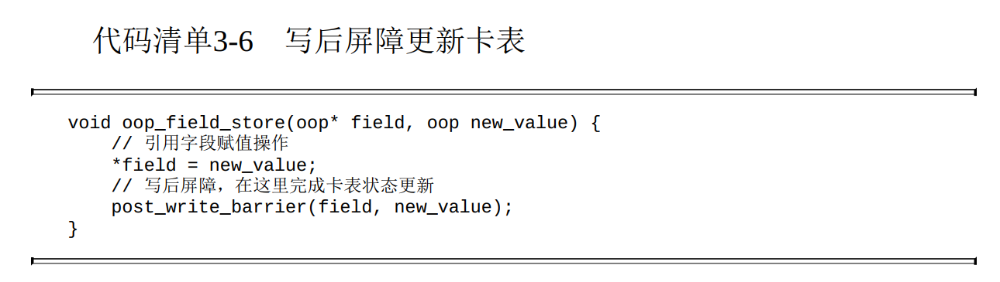

#### 三色标记算法

在扫描根对象的时候，进行了STW，获得了一致性的根对象快照，但是毕竟根对象比较少，STW的时间还好

但是全堆扫描的时候如果STW就会导致很长的停顿时间，所以采用了三色标记算法进行并发标记

- 白色：表示对象尚未被垃圾收集器访问过。显然在可达性分析刚刚开始的阶段，所有的对象都是白色的，若在分析结束的阶段，仍然是白色的对象， 即代表不可达。
- 黑色：表示对象已经被垃圾收集器访问过，且这个对象的所有引用都已经扫描过。黑色的对象代表已经扫描过，它是安全存活的，如果有其他对象引用指向了黑色对象，无须重新扫描一遍。黑色对象不可能直接（不经过灰色对象）指向某个白色对象。
- 灰色：表示对象已经被垃圾收集器访问过，但这个对象上至少存在一个引用还没有被扫描过。  

并发标记有可能发生两种情况：

1. 把原本死亡的对象错误标记为了存活。这其实可以容忍，只不过产生了一点逃过本次垃圾收集的浮动垃圾
2. 把原本存活的对象错误标记为了死亡。这时不能容忍的，程序必然发生错误

强弱三色不变式（详细见go的垃圾收集）：

强三色不变式：不存在黑色对象对白色对象的引用

若三色不变式：可以存在黑色对象对白色对象的引用，但是前提是白色对象上游被灰色对象保护着

**我们只需要满足任意一个，就可以保证不出现错误标记**，于是出现了两套方案：

1. **增量更新(满足强三色不变式)**：当黑色对象插入新的指向白色对象的引用关系时，就`将这个新插入的引用记录`下来，等并发扫描结束后，再将这些记录过的引用关系中的黑色对象作为根，进行`重新扫描`。例如CMS
2. **原始快照(满足弱三色不变式)**：当灰色对象要删除指向白色对象的引用时，就将这个要删除的引用记录下来，在并发结束之后，再将这些记录过的引用关系中的灰色对象作为根，重新扫描一次。例如G1。可以理解为，无论删除与否，都会按照刚开始扫描那一刻的对象图快照来进行搜索

### 7.2.2 清除阶段
- `标记清除(Mark-Sweep)：` 堆中有效内存耗尽时，STW，从根节点开始**标记所有被引用的对象(可达的对象)**，最后对所有不可达对象(没有标记)进行回收。回收时只是把要清除的对象地址保存到空闲地址列表里
  - 效率较低，遍历两遍，**gc时要停止整个程序**，用户体验不好，**产生的空闲内存不连续**，需要额外维护一个空闲列表
- `复制算法(Copying)：` 内存一分为二，需要回收时将一半里的存活对象拷贝到另一半，清除前一半
  - **没有碎片，位置连续，但是浪费空间(同一时间只能用到一半的空间)**，适用于垃圾多，存活对象少的场景(新生代)
- `标记压缩(Mark-Compact)：` 首先标记可达的对象，然后**将所有存活对象压缩到内存的一端**，按顺序排放，之后再清理边界外的所有空间。就相当于标记清除后进行了碎片整理。
  - **没有碎片，但效率较低(每块内存的移动都要进行线程同步)**，移动对象时，如果对象被其他对象引用，还需要调整引用的地址

||Mark-Sweep|Copying|Mark-Compact|
|-------|--------|--------|-------|
|速度|中等|最快|最慢|
|空间开销|少(有碎片)|多(无碎片)|少(无碎片)|
|移动对象|否|是|是|

#### 对象的死亡和finalize

对于不可达对象，也不是非死即可，真正宣告死亡的对象至少要经过两次标记过程，第一次被标记为垃圾，然后筛选此对象是否有必要执行 `finalize` 方法，加入对象没有覆盖 finalize方法，或者已被调用过，就没必要执行了，如果要执行，对象可能会被复活！

`finalize()`： Object类的方法，重写以实现对象被销毁之前的资源释放等处理，**只能被调用一次**

如果对象的finalize()方法中与引用链上的对象建立了联系，对象就会被复活，移出 “即将回收” 的集合，下次再被标记为不可达时，不调用finalize()方法，直接变为不可触及状态，被gc回收

**finalize方法不一定会被执行完成**，只是将对象放到 `F-Queue` 队列中，稍后由一条虚拟机建立的 Finalizer 线程去执行他们的 finalize() 方法，触发该方法运行，但是不承诺一定会等待它运行结束。这时因为有的对象的finalize方法可能执行缓慢或者死循环，导致 `F-Queue` 中其他对象永久等待，整个回收子系统崩溃

**gc回收的是根不可达，并且经过第一次标记后调用finalize()方法依然没有被复活的对象**

官方已不推荐使用！！

### 7.2.3 分代收集算法

没有最好的垃圾收集算法，目前所有的GC都是采用分代收集算法来执行垃圾回收的

- 新生代：区域小，对象生命周期短、存活率低，回收频繁。这种情况下复制算法的回收速度是最快的
- 老年代：区域大，对象生命周期长、存活率高，回收不频繁。一般用标记清除和标记压缩混合实现

### 7.2.4 增量收集算法
- 一次收集所有垃圾，会造成系统长时间的停顿，可以**让垃圾收集线程和应用程序线程交替执行**。**每次垃圾收集线程只收集一小片区域的内存空间**，接着切换到应用程序线程，依次反复，直到垃圾收集完成

- 基础仍然是标记清除和复制算法的思想。通过对线程间冲突的妥善处理，允许垃圾收集线程分阶段完成标记、清理或复制工作。但是**线程切换和上下文切换使得垃圾回收的总体成本上升，使系统吞吐量下降**

### 7.2.5 分区算法
- 将整个堆空间划分为一个个的小的region，每个region都是独立使用，独立回收的
- 可以控制依次回收多少个小区间

## 7.3 垃圾回收器
- **jdk1.8 默认的垃圾回收器是：Parallel Scavenge + Parallel Old** 

7种经典的垃圾收集器：

|垃圾收集器|分类|作用位置|使用算法|特点|适用场景|
|---|---|---|---|---|---|
|Serial|串行收集|新生代|复制算法|响应速度优先|单CPU环境的Client模式|
|Serial Old|串行收集|老年代|标记压缩|响应速度优先|单CPU环境的Client模式|
|ParNew|并行收集|新生代|复制算法|响应速度优先|多CPU环境Server模式与CMS配合使用|
|Parallel|并行收集|新生代|复制算法|吞吐量优先|后台运算多，不需要太多交互|
|Parallel Old|并行收集|老年代|标记压缩|吞吐量优先|后台运算多，不需要太多交互|
|CMS|并发运行|老年代|标记清除|响应速度优先|互联网或B/S业务|
|G1|并发运行|新生代和老年代|标记压缩、复制|响应速度优先|面向服务端应用|

**垃圾回收器按线程数可分为并行收集器和串行收集器**
- 并行收集：多个垃圾收集线程并行进行垃圾收集，此时用户线程处于等待状态，如ParNew，Parallel Scavenge，Parallel Old
- 串行收集：单线程执行垃圾收集，回收完再启动程序的线程，如Serial、Serial Old

**按工作模式分为并发式收集器和独占式收集器**

- 并发式：用户线程和垃圾收集线程并发执行(不一定是并行)，垃圾回收时不会停顿用户程序的运行，如CMS，G1
- 独占式：一旦垃圾回收线程运行，就停止所有的用户线程，直到垃圾回收完成

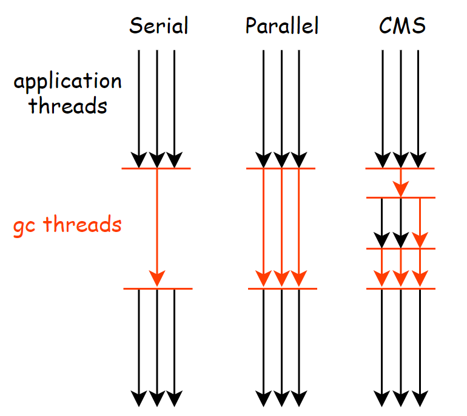

**性能指标：**
- **吞吐量：** 用户代码运行时间占总时间比例
- **暂停时间：** 执行垃圾收集时，用户线程被暂停的时间
- **内存占用：** 堆区所占的内存大小
三者无法同时满足，最多满足两点。

`-XX:+PrintCommandLineFlags`  打印相关参数(包括使用的垃圾收集器)

### 7.3.1 Serial 和 Serial Old
- 运行一段时间后，STW停顿，进行垃圾回收，之后继续运行，一段时间后再进行STW
- **Serial应用于年轻代，串行回收，复制算法**
- **Serial Old应用于老年代，串行回收，标记压缩算法**

单线程效率高，垃圾收集时间短，只要不频繁gc，单核CPU情况下使用串行回收器是可以的
`-XX:+UseSerialGC` 指定年轻代和老年代都使用串行收集器

### 7.3.2 ParNew
- **ParNew应用于年轻代，复制算法，可以配合CMS的并行回收器**
- 多核情况适用，单核时不如Serial

`-XX:+UseParNewGC` 新生代使用ParNew
`-XX:ParallelGCThreads` 设置线程数量，默认和CPU相同的线程数

### 7.3.3 Parallel Scavenge 和 Parallel Old
jdk8的默认垃圾收集器
- **Parallel应用于年轻代，复制算法，多线程并行回收**，和ParNew的区别是可控的吞吐量，是**吞吐量优先的垃圾收集器**
- **高吞吐量适合主要是后台运算而不需要太多交互的任务**(实时性不好)，常在服务器环境中用于执行批量处理、订单处理、工资支付、科学计算的应用程序
- **Parallel Old应用于老年代，标记压缩算法，多线程并行回收**

`-XX:UseParallelGC` 新生代使用Parallel Scavenge GC，默认会激活Parallel Old
`-XX:UseParallelOldGC` 老年代使用Parallel Old GC，默认会激活Parallel Scavenge
`-XX:ParallelGCThreads` 设置线程数量，CPU小于8时默认和CPU相同的线程数，CPU大于8时为 $3+(5*CPU\_Count)/8$
`-XX:MaxGCPauseMillis` 垃圾收集器最大的STW时间，毫秒
`-XX:GCTimeRatio` 垃圾收集时间占总时间的比例。$=1/(N+1)$ 默认为99，即 1%
`-XX:UseAdaptiveSizePolicy` **自适应调节策略，默认开启。自动调节年轻代大小，Eden、Survior比例，晋升老年代的年龄等**

Serial Old 和 Parallel Old 的 FGC 可以长到几个小时....于是有了CMS提高STW时间

### 7.3.4 CMS (Concurrent-Mark-Sweep)
- 垃圾回收器和应用程序在不同的线程中同时运行。是HotSpot推出的第一款并发收集器。**以获取最短挺短时间为目标的垃圾收集器**
- **应用于老年代，并发的，垃圾回收和应用程序同时运行，降低STW的时间(200ms以内)**

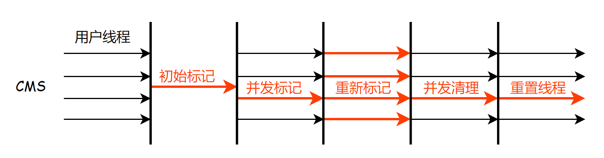

#### 1. 初始标记

**初始标记：** `STW`，**仅仅是标记出从GC Roots出发，能直接关联到的老年代对象**，包含**老年代中所有被GCRoots直接关联的对象（1），和被GCRoots关联的存活的新生代对象直接关联到的老年代对象（2，3)**，标记完后就恢复之前被暂停的所有用户线程，时间非常短暂

此外，由于新生代和老年代是分开回收的，还需要把 **新生代对象** 也作为GC Roots进行扫描。

> 在判断老年代的对象存活的时候，需要把新生代当作自己的 GC Roots
>
> 在判断年轻代的对象存活的时候，需要把老年代当作自己的 GC Roots，这时候并不需要扫描全部老年代，而是扫描 card table

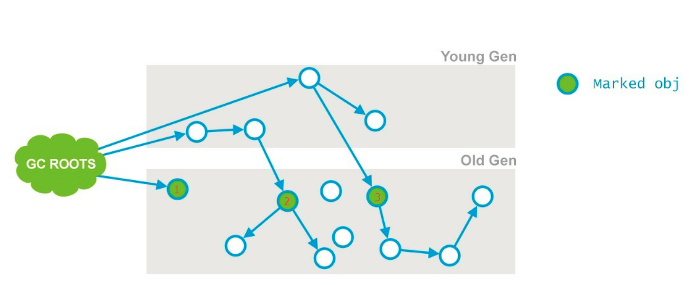

#### 2. 并发标记

**并发标记：** 从上一阶段标记过的对象，开始tracing过程，**遍历整个对象图，找到所有可达(存活)的对象**（4，5）

由于是并发标记，如果由于用户线程的执行，使得`有些新生代晋升为老年代、或者某个老年代对象的引用发生了变化、或者有些直接分配到老年代的对象`，这些则受影响的`老年代对象所在的card会被标记为dirty`，需要后续`重新标记（3）`。并发标记耗时长，但是不需要STW。
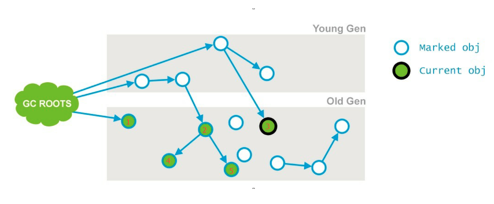

#### 3. 重新标记

**重新标记：** `STW`，**修正并发标记期间因用户程序运行而导致标记变动的那一部分对象的标记记录**，比初始标记阶段稍长

#### 4. 并发清理

**并发清理：** 清理标记阶段判断的已经死亡的对象，释放内存空间。由于不需要移动存活的对象，所以也可以和用户线程并发执行

#### 一些问题

最耗时的并发标记和并发清理阶段都是不需要STW的。也正是由于回收过程中用户线程没有中断，**要确保用户线程有足够的内存，需要堆内存使用率达到某一阈值就开始回收，不能等到老年代几乎满了才回收**。如果用户线程内存不够用，就会`临时启用Serial Old收集器`来进行老年代的垃圾收集

**为什么使用`标记清除`，而不用`标记压缩`？？** 因为并发清除的时候用户线程正在运行，为了保证用户线程继续执行，不能让运行的资源受影响。要使用标记压缩必须要STW

**缺点：**

1. **处理器占用高**，并发标记节点占用部分线程，导致程序运行变慢，降低总吞吐量
2. **无法处理浮动垃圾**，并发标记和并发清理阶段，用户线程还在继续运行，程序在运行自然就会伴随新垃圾对象的不断产生，CMS无法在当次垃圾收集中处理他们，只能等到下一次
3. **`内存碎片`**，标记清除算法的缺点，会导致内存空间不规整，无法存放大对象。

`-XX:+UseConcMaekSweepGC` 使用老年代CMS，同时会自动设置新生代为ParNew
`-XX:CMSInitiatingOccupanyFraction` 设置进行CMS回收的堆内存使用率阈值。默认92%。内存增长缓慢可以设置较大值，内存增长快需要设置较小值，避免FGC和Serial Old收集器
`-XX:+UseCMSCompactAtFullCollection` 指定在FullGC之后对内存进行压缩整理，但会导致更长的停顿时间
`-XX:CMSFullGCsBeforeCompaction` 指定多少次FullGC后进行内存的压缩整理
`-XX:ParallelCMSThreads` 设置CMS的线程数量。默认是 $(ParallelGCThreads+3)/4$ ，ParallelGCThreads是年轻代并行收集器的线程数

### 7.3.5 G1-区域化分代式

G1的出现，是为了`在延迟可控的情况下获得尽可能高的吞吐量`。新生代和老年代一起收集

#### 区域化

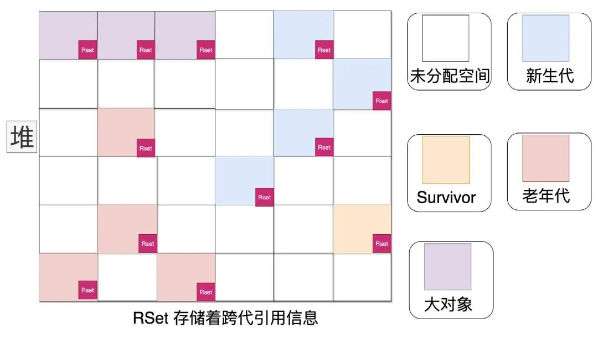

- **把堆内存分为很多个Region**，Region在物理上`可以是不连续的`，用不同的Region表示 Eden、Survivor、Old 以及存放大对象的 Humongous（H区即多个连续的Region，`对象大小超过0.5个Region就放到H`，Region可以设置取值范围为1MB~32MB）。各个Region都可以进行并发的回收
  - H-obj直接分配到了old gen，防止反复拷贝移动
  - 分成Region的目的是为了让各个Region相对独立，可以分别进行GC，而不是一次性的把所有垃圾收集掉
  - Region是垃圾回收的最小单元，每次搜集的内存空间
  
- Region中也有指针碰撞机制，有`TLAB`

- G1跟踪各个Region里的垃圾堆积的 **价值大小**(**回收可获得的空间大小以及回收所需时间**的经验值)，在后台维护了一个**优先级列表**，**每次根据设定的停顿时间，优先回收价值最大的Region**，保证在有限的时间内获得尽可能高的收集效率

- 这种 Region 划分内存空间以及有优先级的区域回收方式，保证了G1回收器在有限的时间内可以获得尽可能高的**内存回收效率**

#### RSet

Java堆分成多个独立Region后，Region里面存在的跨Region引用对象如何解决？这在之前有提过 `Remembered Set` （例如CMS里面有Card Table)，但是在 G1 的实现复杂得多

G1的 `RememberedSet` ：存放 `Region` 之间的 **对象引用**（存放哪些内存区域中有对该Region中对象的引用），从而避免了全堆扫描。

  - 每个Region都有自己的 RSet，记录下**别的 Region 指向自己的指针**，RSet不直接记录对象地址，而是记录这些指针分别在**哪些卡页范围**（`Card 编号`）。Card 是一小块(512B)的内存空间，这里面可能存在不止一个对象，所以只需要扫描RSet中记录的Card中的对象即可，这比扫描全部的存活对象要容易得多
  - RSet的实现实际上就是一个 Card 的 `HashTable`，Key是其他Region的起始地址，Value是卡表的索引号集合。由于Region数量比分代数量显然多得多，所以**会加重内存负担**。 G1 的RSet可能会占整个堆容量的20%乃至更多。。。
  - RSet的维护是通过`写屏障 Write Barrier`，在引用一个对象的时候插入一段代码，进行记录。G1的写屏障实际上只是一个通知，将当前引用的事件放到 `Remember Set Log` 队列中，交给后台专门的GC线程处理

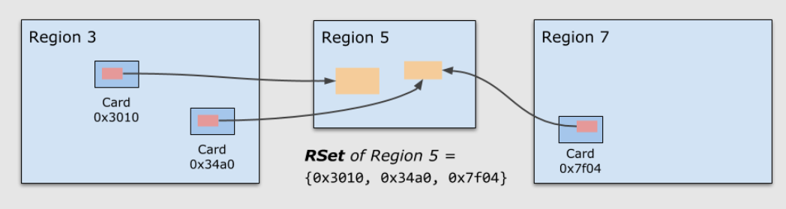

#### TAMS

G1还为每个Region设计了两个名为 `TAMS(Top At Mark Start)` 的指针（在**初始标记阶段设置这两个指针**），把Region中一部分空间划分出来用于并发回收过程中的新对象分配。

并发回收时，新对象地址都必须要在这两个指针位置以上

G1收集器默认在这个地址以上的对象是被隐式标记过的，即**默认他们是存活的**，不纳入回收范围

对于内存回收速度赶不上内存分配的速度时，G1也要被迫冻结用户线程的执行，导致Full GC而产生长时间的STW

#### 分代收集

G1是一个分代的垃圾收集器，它会从逻辑上将Region分为 Young、Old 等不同的Generation，然后针对他们各自特点应用不同的策略

经典的内存布局中，各代的内存区域是完全分开的，而G1的分代只是Region的一个动态标志。**各个Region的Generation是随着GC的进行而不断变化的**，各代有多少Region也是动态变化的

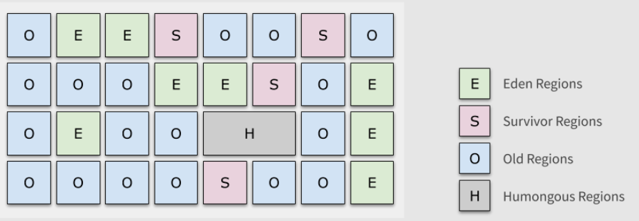

#### Young GC

YoungGC只会设计到 Young Regions，它将 `Eden Region` 中存活的对象移动到一个或多个新分配的 `Survivor Region`，之前的Eden Region就会被归还到 `Free List` 供以后的新对象分配使用

当区域中对象的Survive次数超过阈值，就会晋升到 `Old Region`

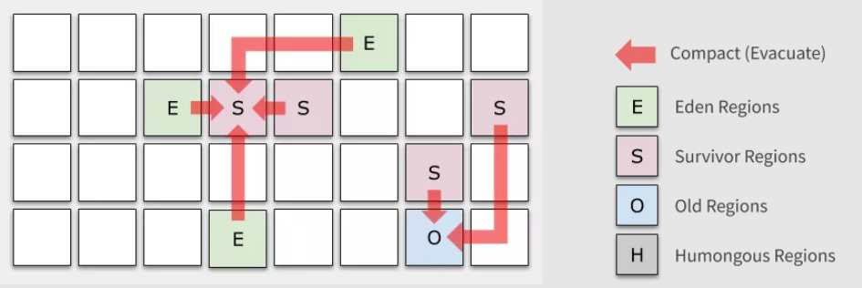

经过多次 Young GC 之后，Old Regions 慢慢积累，当达到阈值之后，就要对 Old Regions 做收集了，这个阈值在G1中是 **根据用户设定的GC停顿时间动态调整** 的（也可以认为干预）

#### Mixed GC

对于Old Regions的收集会同时涉及若干个 `Young 和 Old Regions`，所以被称为 `Mixed GC`

Mixed GC 很多地方和 Young GC 类似，不同之处在于，他还会选择 `垃圾收集效率最高的 Old Regions`（即指定的停顿时间内收集能收集到最多垃圾的区域，这个过程称为Evacuation），这些Region被称为是 `Collection Set (CSet)`，只要控制好 CSet 的规模，就可以在用户设定的停顿时间内收集最多的垃圾

- Evacuation 时，Young Regions 一定会被放到 CSet 中，因为Young Regions中的对象寿命基本都很短，在这个区域做收集往往绝大部分都是垃圾
- 由于Young Regions一定会被扫描和收集，所以RSet的维护不需要考虑Young内的引用修改（RSet只需要关心 `old-to-young` 和 `old-to-old` 的引用），因为RSet本身是为了减少扫描的区域。。Young Regions必然扫描的，就不需要记录 young-to-young 和 young-to-old 了

CSet的收集像CMS一样，进行初始标记、并发标记、重新标记、并发清理

对于来不及收集的Region，只有等到下次GC再收集了

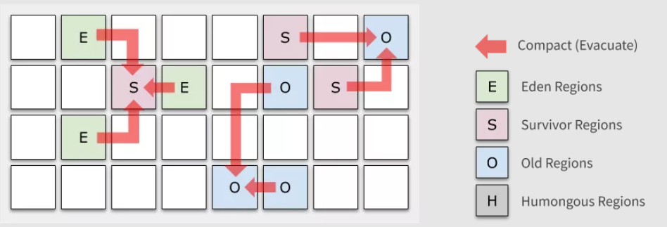

#### Concurrent Marking 和 SATB

在 Evacuation 之前，我们要通过并发标记来确定哪些对象是垃圾、哪些还活着。G1 中的 Concurrent Marking 是以 Region 为单位的，为了保证结果的正确性，这里用到了 `Snapshot-at-the-beginning（SATB）`算法

SATB就是对Marking开始时的一个逻辑上的 Snapshot 进行标记。

使用快照的原因是因为并发标记时不用快照会导致最后误回收（如下图，会误回收X）：

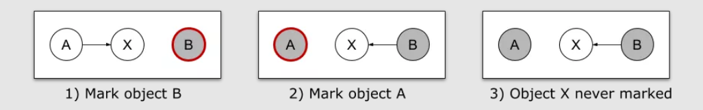

SATB的做法是：在修改引用 `X.f = B` 之前插入了写屏障，记录下**原本的引用地址**，并将原本的引用关系放到SATB的待处理队列中，最后会被Marking线程处理，从而确保所有在Marking开始时的引用一定会被标记到！ 这也就是逻辑上的 Snapshot。 通过这个措施，**SATB确保了Marking开始时存活的对象一定会被标记到**

SATB也是有**副作用**的，如果被删除引用下游的白色对象就是要被搜集的垃圾，这次STAB标记会让他躲过GC，这就是浮动垃圾，因为STAB的做法精度比较低，所以造成的浮动垃圾也比较多。

标记过程和 `CMS` 类似，就是 优化的 `DFS` : 记当前已经标记到的 offset 为 `cur`，随着标记的进行 cur 不断向后推进。每当访问到地址 < cur 的对象，就对它做深度扫描，递归标记所有应用；反之，对于地址 > cur 的对象，只标记不扫描，等到 cur 推进到那边的时候再去做扫描。

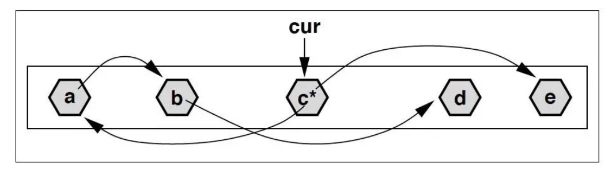

例如上图中，假设当前 cur 指向对象 c，c有两个引用：a 和 e，其中 a 的地址小于 cur，因而做了扫描；而 e 则仅仅是标记。扫描 a 的过程中又发现了对象 b，b 同样被标记并继续扫描。但是 b 引用的 d 在 cur 之后，所以 d 仅仅是被标记，不再继续扫描

最后一个问题是：如何处理 Concurrent Marking 中新产生的对象？因为 SATB 算法只保证能标记到开始时 snapshot 的对象，**对于新出现的那些对象，我们可以简单地认为它们全都是存活的**，毕竟数量不是很多

#### 搜集步骤

总体上和CMS类似，差异如下：

初始标记阶段需要修改 `TAMS` 指针的值，让并发标记时用户线程并发运行时可以正确的在Region中分配新对象

**回收阶段需要STW**：因为要到把存活的对象复制到空的 Region 后再清理旧的Region，这里要对存活对象移动，所以必须要STW

也就是说 G1 除了并发标记阶段，其他阶段都需要STW

它并非纯粹的追求低延迟，而是在延迟可控的情况下获得尽可能高的吞吐量

#### 总结

- **特点：**

  **并行和并发：** 多个gc线程同时并行回收，有效利用了多核计算能力；G1和用户进程交替执行，部分工作和应用程序同时执行，垃圾收集和用户进程并发运行

  **分代收集：** 依然区分年轻代和老年代，年轻代依然有Eden、Survior。但是不再固定大小和数量，物理上不再连续。同时兼顾年轻代和老年代

  **空间整合/不会产生内存碎片：** 以Region为单位进行回收，Region之间是复制算法，整体上可以看作是标记压缩算法，都可以避免内存碎片，有利于程序长时间运行，当堆非常大的时候G1的优势更加明显

  **可预测的停顿时间模型：** G1相比于CMS，除了追求低停顿外，还能建立可预测的停顿时间模型，让使用者指定在M毫秒内垃圾收集时间不得超过N毫秒

- **缺点：** 相较于CMS，没有全方位的优势，G1为了垃圾收集而产生的内存占用和程序运行时的额外负载都比CMS要高。小内存时CMS更有优势，在堆内存超过6~8G时G1表现优于CMS
  **Remembered Set花费额外空间：** RSet记录其他Region中指向该Region的引用，避免收集时全局扫描(避免YGC还要扫描Old区)，在垃圾收集时，**在GC Roots中加入RSet的对象**保证不全局扫描也不遗漏

### 7.3.6 Epsilon
- No-Op 只做内存分配，不做垃圾回收。。

### 7.3.7 Shenandoah
- Open JDK12推出的，由Red Hat研发，Oracle JDK中没有
- 低延迟，但是在高负载下吞吐量下降

### 7.3.8 ZGC
实验阶段
基于Region内存布局的，不设分代，使用了读屏障、染色指针、内存多重映射等计数实现**可并发的标记压缩算法**，以低延迟为首要目标的一款垃圾收集器。只有初始标记需要STW

### 7.3.9 GC日志分析
`-XX:+PrintGC` 输出GC日志信息(只包含堆的总体信息)
`-XX:+PrintGCDetails` 输出GC的详细日志信息
`-XX:+PrintGCTimeStamps` 输出GC的时间戳(基准时间)
`-XX:+PrintGCDateStamps` 输出GC的时间戳(日期形式)
`-XX:+PrintHeapAtGc` 在GC前后打印出堆的信息
`-Xloggc:./logs/gc.log` 输出日志文件到路径

日志分析工具：gcViewer、**gcEasy**

## 7.4 GC Tuning
- JVM的命令行参数参考：https://docs.oracle.com/javase/8/docs/technotes/tools/unix/java.html
- JVM命令的参数分类
> 标准参数：- 开头，所有的 HotSpot 都支持
> 非标准参数：-X 开头，特定版本的HotSpot支持特定命令
> 不稳定参数：-XX 开头，下个版本可能取消
> - 常用的-XX： 
> - -XX:+PrintCommandLineFlags  打印参数
> - -XX:+PrintFlagsFinal  打印最终参数值
> - -XX:+PrintFlagsInitial  打印默认参数值