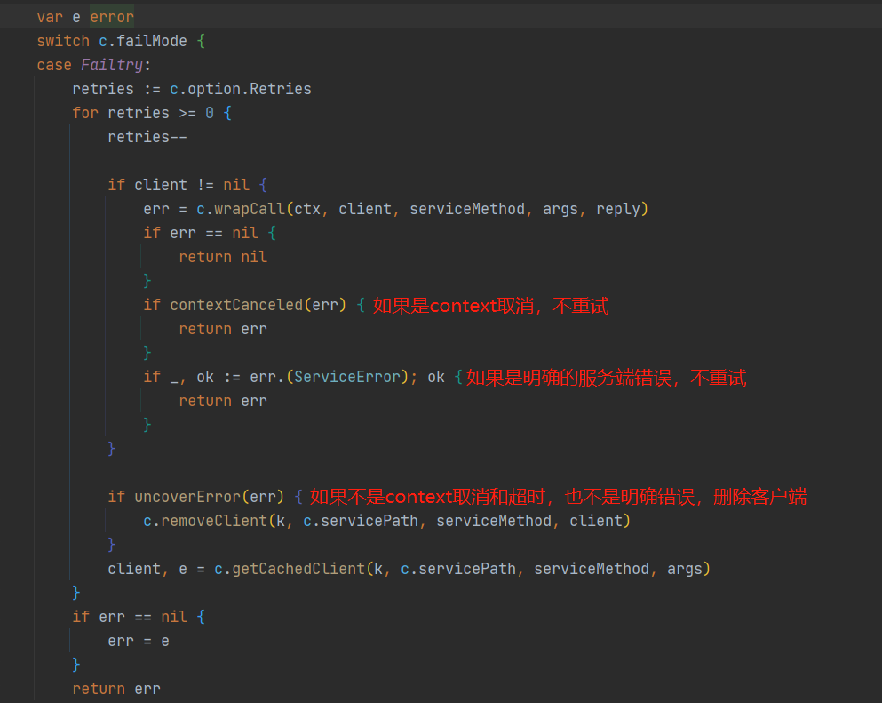
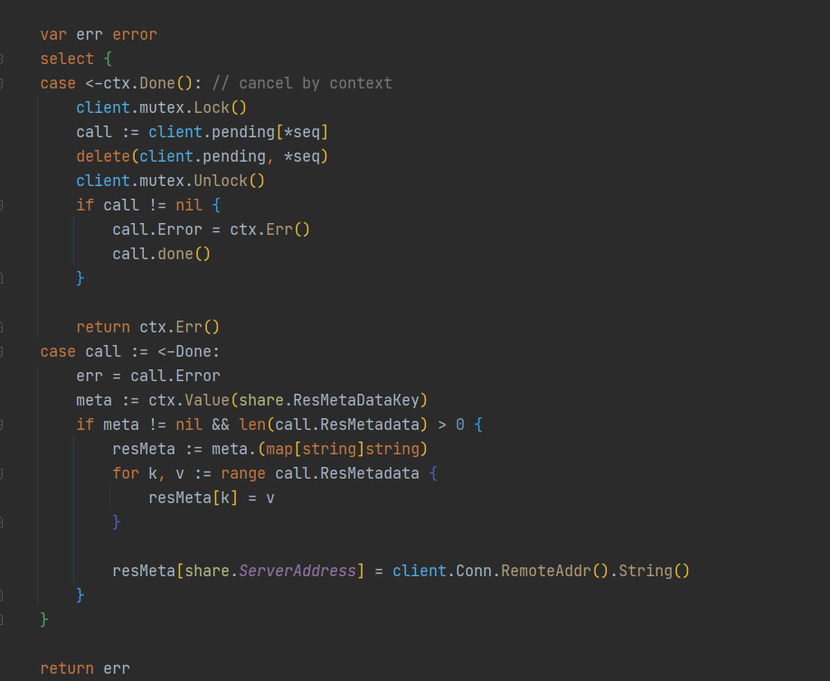
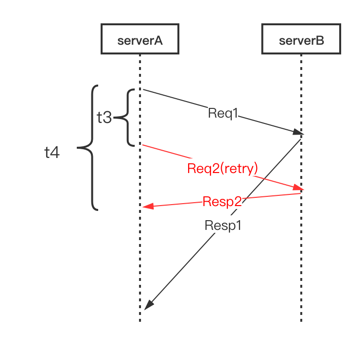

# 一、rpc框架

一个函数需要能够被远程调用，需要满足如下五个条件：

- the method’s type is exported.  //**方法所属类型是导出的**
- the method is exported.  //**方法是导出的**
- the method has two arguments, both exported (or builtin) types. //**两个参数类型是导出的**
- the method’s second argument is a pointer.  //**第二个参数是指针类型**
- the method has return type error.  //**返回error**

```go
func (t *T) MethodName(argType T1, replyType *T2) error
```

## 1. 传输协议

```c
 *   0     1     2     3     4        5     6     7     8         9          10      11     12  13  14   15 16
 *   +-----+-----+-----+-----+--------+----+----+----+------+-----------+-------+----- --+-----+-----+-------+
 *   |   magic   code        |version | full length         | messageType| codec|compress|    RequestId       |
 *   +-----------------------+--------+---------------------+-----------+-----------+-----------+------------+
 *   |                                                                                                       |
 *   |                                         body                                                          |
 *   |                                                                                                       |
 *   |                                        ... ...                                                        |
 *   +-------------------------------------------------------------------------------------------------------+
 * 4B  magic code（魔法数）   1B version（版本）   4B full length（消息长度）    1B messageType（消息类型）
 * 1B compress（压缩类型） 1B codec（序列化类型）   4B  requestId（请求的Id）
```


### protobuf编码

#### 1. varint

`varint`方法是一种使用变长方式表示整数的方法，可以使用一个或者多个字节来表示小整数和大整数，数越小，使用的字节数越少

在`varint`表示的字节中，**除了最后一个字节，前面的字节都有一个bit来表示还有字节需要处理**，这个标记叫做most significant bit (msb) set。低位放在前面。

> 例如 ：
>
> 1表示为    0000 0001
>
> 
>
> 300对应的二进制为 100101100 超过7位了，需要两个字节表示，这里varint使用的是小端序
>
> 表示为     1010 1100   0000 0010

Protobuf编码的实际上是键值对，message就是一系列的键值对，其中键表明了**字段编号和value类型**，其中后三位表示 wire type ，value的数据类型

#### 2. wire type

protobuf只定义了 6 种 **wire类型**，34都被废弃了，目前只使用0，1，2，5

| Type | Meaning          | Used For                                                 |
| ---- | ---------------- | -------------------------------------------------------- |
| 000  | Varint           | int32, int64, uint32, uint64, sint32, sint64, bool, enum |
| 001  | 64-bit           | fixed64, sfixed64, double                                |
| 010  | Length-delimited | string, bytes, embedded message, packed repeated fields  |
| 011  | Start group      | groups（废弃）                                           |
| 100  | End group        | groups（废弃）                                           |
| 101  | 32-bit           | fixed32, sfixed32, float                                 |


#### 3. key的编码方式

key的计算方法：$key=(field\_number << 3) | wire\_type$

对于字段比较少的情况，使用一个字节就可以表示key


value的编码方式比较复杂，要分多种情况：

#### 4. 有符号整数的编码

对于负数，通常会被表示成很大的整数，对于一个很小的负数也会占用很大的空间

protobuf的做法是定义sint32这种类型，采用`zigzag编码`，将所有的数全都映射成无符号整数，然后再采用varint编码，这样绝对值小的数也会有一个比较小的varint编码值


映射方式：


#### 5. 非varint类型数字的编码

对于double，fixed64的wire_type为1，在解析时告诉解析器，该类型的数据需要一个64位大小的数据块即可

对于float和fixed32的wire_type为5，给32位大小的数据块

都是高位在后，低位在前（小端序）

**说protobuf压缩数据没有到极限，原因就在这里，因为并没有压缩float、double这些浮点类型**


#### 6. 字符串编码


wire_type为2的数据，是一种指定长度的编码方式：`key + length + content`

- **key** 的编码方式就是varint编码的field编码左移三位加上wire_type

- **length** 采用varint方式编码

- **content **就是length指定长度的Bytes（UTF8）


#### 7. 嵌入式message

例如定义一个嵌套消息：

```protobuf
message Test1 {
  required int32 a = 1;
}

message Test3 {
  optional Test1 c = 3;
}
```

设置字段为整数150，编码后的字节为：

```
1a 03 08 96 01
```


首先对Test1编码：

int32类型是第1个字段，wire_type是0，所以key编码为： 0000 1000 (1<<3|0) = 0x08

value是150=1001 0110，按varint编码，小端序，所以value为：1001 0110 0000 0001 = 0x9601

所以Test1的编码结果是 0x089601


下面对Test3编码：

嵌入类型是第3个字段，wire_type是010，所以key编码为：0001 1010 = 0x1a

然后对length编码，length显然为3，所以编码为 0x03


所以最终这条消息的编码为 0x1a03089601


#### 优缺点

protocol buffers 在序列化方面，与 XML 相比，有诸多优点：

- 更加简单
- 数据体积小 3- 10 倍
- 更快的反序列化速度，提高 20 - 100 倍
- 可以自动化生成更易于编码方式使用的数据访问类


https://cloud.tencent.com/developer/article/1199069


## 2. 结构体和服务的映射

客户端发来的请求包含ServiceMethod和Argv

```go
{
    "ServiceMethod"： "T.MethodName"
    "Argv"："0101110101..." // 序列化之后的字节流
}
```

硬编码需要每个方法进行判断，编写很多`switch case`代码

好的办法可以借助**反射**，获取结构体的方法，通过方法获取方法的所有参数类型和返回值

例如：

```go
func main() {
	var wg sync.WaitGroup
	typ := reflect.TypeOf(&wg)
	for i := 0; i < typ.NumMethod(); i++ {
		method := typ.Method(i)
		argv := make([]string, 0, method.Type.NumIn())
		returns := make([]string, 0, method.Type.NumOut())
		// j 从 1 开始，第 0 个入参是 wg 自己。
		for j := 1; j < method.Type.NumIn(); j++ {
			argv = append(argv, method.Type.In(j).Name())
		}
		for j := 0; j < method.Type.NumOut(); j++ {
			returns = append(returns, method.Type.Out(j).Name())
		}
		log.Printf("func (w *%s) %s(%s) %s",
			typ.Elem().Name(),
			method.Name,
			strings.Join(argv, ","),
			strings.Join(returns, ","))
    }
}

//结果：
//func (w *WaitGroup) Add(int)
//func (w *WaitGroup) Done()
//func (w *WaitGroup) Wait()
```

**通过反射实现Service**

```go
func (m *methodType) newArgv() reflect.Value {
	var argv reflect.Value
	if m.ArgType.Kind() == reflect.Ptr {
		argv = reflect.New(m.ArgType.Elem()) // reflect.Type.Elem() 获取指针类型的值的类型，相当于 * 操作
	} else {
		argv = reflect.New(m.ArgType).Elem()
	}
	return argv
}

func (s *service) registerMethods() {
	s.method = make(map[string]*methodType)
	for i := 0; i < s.typ.NumMethod(); i++ {
		method := s.typ.Method(i)
		mType := method.Type
		if mType.NumIn() != 3 || mType.NumOut() != 1 {
			continue
		}
		if mType.Out(0) != reflect.TypeOf((*error)(nil)).Elem() {
			continue
		}
		argType, replyType := mType.In(1), mType.In(2)
		if !isExportedOrBuiltinType(argType) || !isExportedOrBuiltinType(replyType) {
			continue
		}
		s.method[method.Name] = &methodType{
			method:    method,
			ArgType:   argType,
			ReplyType: replyType,
		}
		log.Printf("server [registerMethods] rpc server: register %s.%s\n", s.name, method.Name)
	}
}
```


## 3. 超时处理

超时处理是RPC框架的基本能力，缺少超时处理机制的话，无论是客户端还是服务端都容易因为网络或者其他错误导致资源耗尽，大大降低服务的可用性。

整个远程调用中，需要客户端处理的超时有：

1. 与服务端建立连接导致的超时
2. 发送请求到服务端，写报文导致的超时
3. 等待服务端处理时，等待处理导致的超时
4. 从服务端接收响应，读报文导致的超时

需要服务端处理的超时有：

1. 读取客户端请求报文时，读报文导致的超时
2. 发送响应报文时，写报文导致的超时
3. 调用映射服务的方法时，处理报文导致的超时


添加3个超时处理机制：

1. 客户端创建连接时
2. 客户端 `Client.Call()` 整个过程导致的超时（发送，等待处理，接收报文）
3. 服务端处理报文，即 `Server.handleRequest` 超时


## 4. 负载均衡策略

假设有多个服务实例，每个实例都提供相同的功能，为了提高整个系统的吞吐量，每个实例部署在不同的容器中。客户端可以选择任意一个实例进行调用，获取想要的结果。有一下几种策略：

1. 随机选择
2. 轮询(Round Robin)：依次调度不同的服务器，每次调度执行i = (i+1) mod n
3. 加权轮询(Weight Round Robin)：在轮询算法的基础上，为每个服务实例设置一个权重，高性能的机器赋予更高的权重，也可以根据服务实例的当前负载情况做出动态调整
4. 哈希/一致性哈希：根据请求的某些特征，计算hash值，根据hash值将请求发送到对应的机器。一致性hash还可以解决服务实例动态添加情况下调度抖动的问题


## 5. 服务发现和注册中心

负载均衡的前提是有多个服务实例，就需要服务发现模块


有了注册中心之后，客户端和服务端都无需感知对方的存在，只需要感知注册中心的存在即可

1. 服务端启动后，向注册中心发送注册消息，注册中心得知该服务已经启动，处于可用状态。一般来说，服务端还需要定期向注册中心发送心跳，证明自己可用
2. 客户端向注册中心询问哪些服务可用，注册中心将可用的服务列表返回给客户端
3. 客户端根据注册中心得到的服务列表，选择其中一个发起调用

**如果没有注册中心，客户端需要硬编码服务端的地址，而没有机制保证客户端是否处于可用状态**。当然注册中心还有其他功能，比如配置的动态同步、通知机制等，比较常见的注册中心有`etcd`、`zookeeper`、`consul`，一般比较出名的微服务或RPC框架，这些主流的注册中心都是支持的


使用zookeeper作为注册中心

创建永久节点：

```go
servicePath = ZK_REGISTER_ROOT_PATH + "/" + rpcServiceName + inetSocketAddress
```


当我们的服务被注册进ZooKeeper时，我们将完整的服务名称作为根节点，子节点是对应的服务地址(ip:port)


客户端根据完整的服务名称便可以找到对应的服务地址，查出来的地址可能不止一个，就可以根据负载均衡策略选出一个服务地址


## 6. 故障转移 

| **策略**         | **说明**                                           |
| :--------------- | :------------------------------------------------- |
| 重试熔断         | 请求失败 / 成功 > 0.1 时停止重试                   |
| 链路上传错误标志 | 下层重试失败后上传错误标志，上层不再重试           |
| 链路下传重试标志 | 重试请求特殊标记，下层对重试请求不会重试           |
| DDL              | 当剩余时间不够时不再发起重试请求                   |
| 框架熔断         | 微服务框架本身熔断、过载保护等机制也会影响重试效果 |


**失败重试`failtry`：** 需要判断失败的err，如果是**超时**或者是**用户取消**或者是**明确的服务端**的错误，会从client中删除这个call， 所以不重试，返回错误。






**故障转移`failover`：** 和失败重试类似，如果是超时或者取消或者或者明确的错误，不会进行重试

**快速失败`failfast`：** 直接返回错误


**限制链路重试：**链路每层重试都是指数增长，为了避免重试风暴，可以限制每层的重试。理想情况下只有最下一层发生重试，其他层提供一个特殊的错误码`nomore_retry`，表示调用失败但别重试，这样上层收到这个重试码后就停止对这个下游的重试，并将错误码返回给自己的上层

对重试请求打上一个`retry`的flag，使得下游对于**重试请求不重试**，避免连锁效应。避免A因为超时重试B，B又指数的重试C。


**超时的优化：** RPC请求的结果有三种状态：成功、失败、超时。其中超时最难处理却又经常发生。retry flag可以防止指数扩大，但是不能提高请求成功率，如果A和B的超时时间都是1秒，当C负载很高，导致B访问C超时，这时候B会重试C，但是时间已经超过1秒，A也超时了并且断开了和B的连接，所以B这次重试C不管成功与否都是无用功，从A的视角看本次请求已经失败了


这种场景本质原因是链路超时时间设置不合理，上游超时时间小于等于下游超时时间了。实际中如果没有配置超时时间，大家都用默认的，可能都是一样的超时时间

如果A到B的请求平均就是100ms以内，那么超过100ms的请求大改率都是会超时的，可以不用傻等而提前重试，这就是`backup`方案


**Backup Request：** 预先设定阈值t3（RPC请求延时的pct99），当Req1发出去超过t3时间没有返回，直接发起Req2，这样相当于同时又两个请求，然后等待请求返回，只要有任意一个返回成功就结束请求，整体耗时t4，大大减少整体延时。这实际上就是访问量换取低延时。




博客连接：[如何优雅地重试](https://blog.csdn.net/ByteDanceTech/article/details/112256069?spm=1001.2014.3001.5501)


# 二、分布式缓存框架

## 1. 缓存淘汰策略

缓存淘汰策略：FIFO、LFU、LRU
	

- **FIFO**：先进先出，淘汰最老的记录，世界使用队列即可，实现简单，但是很多时候最早添加的也经常被访问，却因为呆的时间太长被淘汰，导致缓存命中率降低
- **LFU**：最少使用，淘汰缓存中访问频率最低的记录，LFU认为数据过去被访问多次，将来被访问的频率也更高，需要维护一个按访问次数排序的队列。该方法命中率较高，但是维护队列成本大，此外如果数据访问模式发生变化，LFU需要花较大时间去适应(例如历史很高，最近很少使用)
- **LRU**：最近最少使用，相对于仅考虑时间的FIFO和仅考虑频率的LFU，LRU相对平衡，LRU认为最近被访问过的话，将来被访问的改率也会更高。实现简单，最近被访问的移动到队尾，每次从队首淘汰


LRU的核心数据结构：


- 字典map：存储键值对映射关系，使得根据key查找value的复杂度是O(1)，在字典中插入的复杂度也是O(1)
- 双向链表：队列，所有值存放在链表中，当访问某个值时，移动到队尾的复杂度是O(1)，在队尾新增和对头删除记录的复杂度也均为O(1)


## 2. 一致性哈希算法

对于分布式缓存来说，当一个节点接收到请求，如果该节点并没有存储缓存值，那么它面临的难题是，从谁那获取数据？自己，还是节点1, 2, 3, 4… 

我们可以对于一个给定的key，使用特定的hash算法（对key取hash后按模选择节点），使得该key每次都访问同一个节点，避免每次访问不同节点都不命中缓存，从而多次从数据源获取数据


但是有一个问题，**如果节点的数量发生了变化，那么缓存值对应的节点几乎都发生了变化**，即几乎所有的缓存值都失效了，节点收到请求时均需去数据源获取数据，容易引起`缓存雪崩`

> **缓存雪崩**：缓存在同一时刻全部失效，造成瞬时DB请求量大、压力骤增，引起雪崩。常因为缓存服务器宕机，或缓存设置了相同的过期时间引起。
>
> **缓存击穿**：一个存在的key，在缓存过期的一刻，同时有大量的请求，这些请求都会击穿到 DB ，造成瞬时DB请求量大、压力骤增。
>
> **缓存穿透**：查询一个不存在的数据，因为不存在则不会写到缓存中，所以每次都会去请求 DB，如果瞬间流量过大，穿透到 DB，导致宕机。

一致性哈希算法就是解决这个问题的。

一致性哈希算法将 key 映射到 2^32 的空间中，将这个数字首尾相连，形成一个环。

- 计算节点/机器(通常使用节点的名称、编号和 IP 地址)的哈希值，放置在环上。
- 计算 key 的哈希值，放置在环上，**顺时针寻找到的第一个节点，就是应选取的节点/机器**。


一致性哈希算法，在新增/删除节点时，**只需要重新定位该节点附近的一小部分数据，而不需要重新定位所有的节点**，这就解决了上述的问题


**数据倾斜问题：**

如果服务器的节点过少，容易引起 key 的倾斜。例如上面例子中的 peer2，peer4，peer6 分布在环的上半部分，下半部分是空的。那么映射到环下半部分的 key 都会被分配给 peer2，key 过度向 peer2 倾斜，缓存节点间负载不均。

为了解决这个问题，引入了**虚拟节点**的概念，一个真实节点对应多个虚拟节点

假设 1 个真实节点对应 3 个虚拟节点，那么 peer1 对应的虚拟节点是 peer1-1、 peer1-2、 peer1-3（通常以添加编号的方式实现），其余节点也以相同的方式操作。

- 第一步，计算虚拟节点的 Hash 值，放置在环上。
- 第二步，计算 key 的 Hash 值，在环上顺时针寻找到应选取的虚拟节点，例如是 peer2-1，那么就对应真实节点 peer2。

虚拟节点扩充了节点的数量，解决了节点较少的情况下数据容易倾斜的问题。而且代价非常小，只需要增加一个字典(map)维护真实节点与虚拟节点的映射关系即可


**虚拟节点还可以解决的问题：**

- 集群中如果有一台机器宕机，会导致该机器上的请求分配到临近的下一个机器上，那么该机器有可能导致负载过高而引起系统雪崩的情况。
- 集群中增加一台机器，并不能够均衡原有所有机器的服务压力，只会分担临近机器的压力，所以不能做到分担整个集群的压力。


