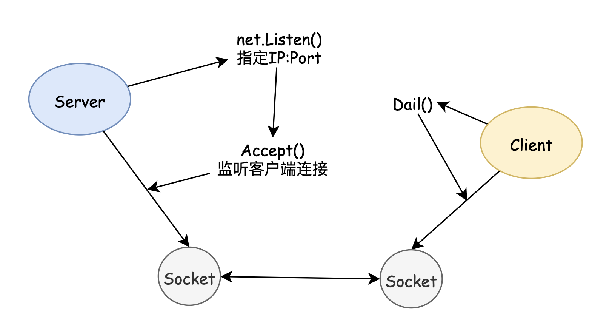

# 一、socket通信



## 1. BIO

1. 

```go
func main() {
   listener, err := net.Listen("tcp", "localhost:8000")
   if err != nil {
      log.Fatal(err)
   }
   for {
      conn, err := listener.Accept()
      if err != nil {
         log.Print(err)
         continue
      }
      go handleConn(conn)
   }
}

func handleConn(conn net.Conn) {
   defer conn.Close()
   for {
      n, err := io.WriteString(conn, time.Now().Format("2006-01-02 15:04:05\n"))
      if err != nil {
         log.Print(conn.RemoteAddr(), " 出现问题，正在退出....")
         return
      }
      log.Print("成功向", conn.RemoteAddr(), "写入", n, "个字节数据")
      time.Sleep(3 * time.Second)
   }
}
```

2. echo的例子

```go
//server
func main() {
   listener, err := net.Listen("tcp", "localhost:8000")
   if err != nil {
      log.Fatal(err)
   }
   for {
      conn, err := listener.Accept()
      if err != nil {
         continue
      }
      go handleConn2(conn)
   }
}

func handleConn2(c net.Conn) {
   defer c.Close()
   input := bufio.NewScanner(c)
   for input.Scan() {
      go echo(c, input.Text(), 2*time.Second)
   }
}

func echo(c net.Conn, shout string, delay time.Duration) {
   fmt.Fprintln(c, "\t", strings.ToUpper(shout))
   time.Sleep(delay)
   fmt.Fprintln(c, "\t", shout)
   time.Sleep(delay)
   fmt.Fprintln(c, "\t", strings.ToLower(shout))
}

//client
func main() {
	conn, err := net.Dial("tcp", "localhost:8000")
	if err != nil {
		log.Fatal(err)
	}

	defer conn.Close()

	done := make(chan struct{})
	for {
		go func() {
			io.Copy(os.Stdout, conn)
			log.Println("done")
			done <- struct{}{}
		}()
		mustCopy(conn, os.Stdin)
	}
	<-done //同步操作，等待后台goroutine完成后，main goroutine才退出
}

func mustCopy(dst io.Writer, src io.Reader) {
	if _, err := io.Copy(dst, src); err != nil {
		log.Fatal(err)
	}
}
```

