# 零、入门

1. ++i是非法的，i++是语句，不能使用a=i++的表达
2. :=声明变量只能在函数内部，对于包的变量必须使用var的形式
3. printf的打印格式

```go
%d          十进制整数
%x, %o, %b  十六进制，八进制，二进制整数。
%f, %g, %e  浮点数： 3.141593 3.141592653589793 3.141593e+00
%t          布尔：true或false
%c          字符（rune） (Unicode码点)
%s          字符串
%p					打印地址
%q          带双引号的字符串"abc"或带单引号的字符'c'
%v          变量的自然形式（natural format），也就是go语言的形式输出
%+v 				先输出字段类型，再输出该字段的值
%#v 				先输出结构体名字值，再输出结构体（字段类型+字段的值）
%T          变量的类型
%%          字面上的百分号标志（无操作数）
```

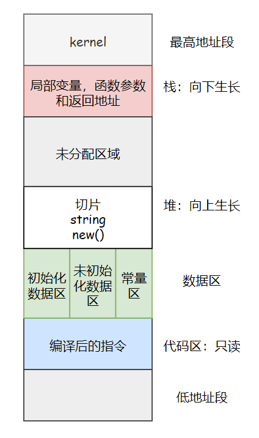


# 一、程序结构

## 1. 命名

函数内部定义的变量只在函数内部有效

函数外部定义的变量在整个包中都有效，变量名的开头字母大小写决定了变量在包外的可见性：对于首字母大写的变量名，它将是**导出的**，即可以被其他包访问到（函数名同理），而对于首字母小写的变量，只能在包内被访问


## 2. 声明

四种类型的生命 var、const、type、func


## 3. 变量


左值与右值

等号左边的变量，代表变量所在的内存空间

等号右边的变量，代表变量内存空间存储的数据(值)

```go
var a,b int
a = 1   //a左值，代表的是a所在的内存空间
b = a   //a右值，代表的是a所在内存空间所存储的数据：1
```


**先计算右值，再赋值给变量：**

```go
func main() {
    x, y := 1, 2
    x, y = y+3, x+2     // 先计算出右值 y+3、x+2，然后再对 x、y 变量赋值。

    println(x, y)   //5 3
}
```


### 3.1 变量声明

- `var 变量名 类型 = 表达式`

在函数内部还可以使用简短的形式声明。   `变量名:=表达式`

零值初始化机制可以确保每个声明的变量总是有一个良好定义的值，因此在Go语言中不存在未初始化的变量

```go
var i, j, k int                 // int, int, int
var b, f, s = true, 2.3, "four" // bool, float64, string
```

- **包级别**声明的变量在main函数执行前完成初始化（所以声明顺序无关紧要）
- **函数级别**的变量（局部变量）在语句被执行到的时候完成初始化（必须先声明后使用）

### 3.2 指针变量

通过指针我们可以直接读取或者修改对应变量的值，而不需要知道变量的名字

如果用“var x int”声明语句声明一个x变量，那么&x表达式（取x变量的内存地址）将产生一个指向该整数变量的指针，指针对应的数据类型是`*int`，指针被称之为“指向int类型的指针”。如果指针名字为p，那么可以说“p指针指向变量x”，或者说“p指针保存了x变量的内存地址”。同时`*p`表达式对应p指针指向的变量的值。一般`*p`表达式读取指针指向的变量的值，这里为int类型的值，同时因为`*p`对应一个变量，所以该表达式也可以出现在赋值语句的左边，表示更新指针所指向的变量的值

```go
x := 1
p := &x         // p, of type *int, points to x
fmt.Println(*p) // "1"
*p = 2          // equivalent to x = 2
fmt.Println(x)  // "2"
```

任何类型的指针的零值都是`nil`

在Go语言中，**返回函数中局部变量的地址也是安全的**。例如下面的代码，调用f函数时创建局部变量v，在局部变量地址被返回之后依然有效，因为指针p依然引用这个变量

```go
var p = f()

func f() *int {
    v := 1
    return &v
}

//每次调用f函数都将返回不同的结果：
fmt.Println(f() == f()) // "false"
```


1. 指针只声明未初始化，则指向内存地址为0的位置。*0，0-255地址为系统占用，不允许用户进行读写操作

```go
var p *int
*p = 123   //panic: runtime error: invalid memory address or nil pointer dereference
```

2. 野指针：指向未知的空间

不允许访问空指针和野指针对应的内存空间。。。


### 3.3 new函数

`new(T)`将会创建一个T类型的匿名变量，同时初始化为T类型的0值，返回变量的地址，即*T类型

```go
p := new(int)   // p, *int 类型, 指向匿名的 int 变量
fmt.Println(*p) // "0"
*p = 2          // 设置 int 匿名变量的值为 2
fmt.Println(*p) // "2"
```

new只是一种语法糖，避免了声明一个临时变量的名字

p := new(int) 也就相当于 var t int,  p := &t


### 3.4 变量的生命周期和逃逸分析


- 包级别声明的变量的生命周期和整个程序的生命周期一致
- **局部变量**有动态的生命周期：从创建该局部变量起，到该变量不再有引用为止。。因此局部变量可能超出其局部作用域，在函数返回之后依然存在。。**对于逃逸的局部变量，必须分配在堆上**，对于没有逃逸的局部变量，编译器可以选择分配在栈上。（也可以分配在堆上由gc进行回收）

发生逃逸的情况主要有两种：

1. 方法逃逸：当一个对象在方法中定义之后，作为参数传递或返回值到其他方法中
2. 线程逃逸：可能被其他线程访问到的变量

这里主要针对**方法逃逸**进行分析，通过逃逸分析判断一个变量到底是分配在栈上还是堆上

**策略**：编译器如果不能证明某个变量在函数返回后不再被引用，则分配在堆上。如果一个变量过大，也可能被分配在堆上

**目的：** 尽量在栈上分配，减少GC压力。栈上分配更高效。未逃逸对象可以进行锁消除


工具：`go run -gcflags "-m -l"`

说明：

moved to heap:xxx 和 xxx escapes to heap 都表示逃逸，前者表示值类型逃逸，后者表示指针类型逃逸


#### 1. 函数返回局部变量地址引起逃逸

函数**返回了局部变量的指针**，这种情况该变量一定发生了逃逸

```go
func f() (int, *int) {
	var a = 2
	var c = 2
	//返回函数局部变量地址
	return a, &c
}

func main() {
	f()
}

/*
$ go run -gcflags "-m -l" addr_escape.go
# command-line-arguments
.\addr_escape.go:5:6: moved to heap: c
*/
```

可以看到 c 逃逸了，而 a 没有逃逸


#### 2. 被已逃逸的指针引用的指针会逃逸

某个值**取地址传递给函数**并不会发生逃逸

```go
func f() (int, *int) {
	var a = 2
	var c = 2
	//返回函数局部变量地址
	return a, &c
}

func add(a *int, b *int) int {
	return *a + *b
}
func main() {
	x, y := f()
	add(&x, y)
}
/*
$ go run -gcflags "-m -l" addr_escape.go
# command-line-arguments
.\addr_escape.go:5:6: moved to heap: c
.\addr_escape.go:10:10: a does not escape
.\addr_escape.go:10:18: b does not escape
*/
```

可以看到 add 函数 传了 x 的地址，不会引起x逃逸


而**被已经逃逸的变量引用的指针一定会发生逃逸**

```go
func f() (int, *int) {
	var a = 2
	var c = 2
	//返回函数局部变量地址
	return a, &c
}

func main() {
	x, y := f()
	fmt.Printf("addr_x: %p\naddr_y: %p\n", &x, y)
}

/*
$ go run -gcflags "-m -l" addr_escape.go
# command-line-arguments
.\addr_escape.go:7:6: moved to heap: c
.\addr_escape.go:13:2: moved to heap: x
.\addr_escape.go:14:12: ... argument does not escape
addr_x: 0xc000012120
addr_y: 0xc000012128
*/
```

```go
type T struct {
	TA *int
	TB int
}

func f() (int, int) {
	var a = 2
	var c = 2
	//返回函数局部变量地址
	return a, c
}

func newT(ta *int, tb int) *T {
	t := T{TA: ta, TB: tb}
	return &t
}

func main() {
	x, y := f()
	t := newT(&x, y)
	_ = t
}

/*
$ go run -gcflags "-m -l" addr_escape.go
# command-line-arguments
.\addr_escape.go:15:11: leaking param: ta
.\addr_escape.go:16:2: moved to heap: t
.\addr_escape.go:21:2: moved to heap: x
*/
```

这里t逃逸了！！ t又引用了x的地址，所以引起 x 逃逸，这才是逃逸的根本原因。。

至于Printf：

fmt.Printf 源码，p这个指针是通过newPrinter返回的，p是逃逸的，而p引用了 arg，arg是指针的时候就会造成arg逃逸

```go
func Fprintf(w io.Writer, format string, a ...interface{}) (n int, err error) {
	p := newPrinter()		// p 逃逸了
	p.doPrintf(format, a)
...
}

func (p *pp) doPrintf(format string, a []interface{}) {
...
p.printArg(a[argNum], rune(c))
...
}

func (p *pp) printArg(arg interface{}, verb rune) {  
	p.arg = arg					// 逃逸的变量p，引用了arg，arg是指针的时候，也就是 x ，逃逸了，不是指针不逃逸
	p.value = reflect.Value{}
...
}
```


#### 3. map、slice、chan引用的指针逃逸

**被指针类型的slice、map和chan引用的指针一定发生逃逸**

> 备注：stack overflow上有人提问为什么使用指针的chan比使用值的chan慢30%，答案就在这里：使用指针的chan发生逃逸，gc拖慢了速度。问题链接https://stackoverflow.com/questions/41178729/why-passing-pointers-to-channel-is-slower

```go
func main() {
	a := make([]*int, 1)
	b := 12
	a[0] = &b

	c := make(map[string]*int)
	d := 14
	c["aaa"] = &d

	e := make(chan *int, 1)
	f := 15
	e <- &f
}

/*
$ go run -gcflags "-m -l" slice_map_chan_escape.go
# command-line-arguments
.\slice_map_chan_escape.go:5:2: moved to heap: b
.\slice_map_chan_escape.go:9:2: moved to heap: d
.\slice_map_chan_escape.go:13:2: moved to heap: f
.\slice_map_chan_escape.go:4:11: make([]*int, 1) does not escape
.\slice_map_chan_escape.go:8:11: make(map[string]*int) does not escape
*/
```


我们得出了指针**必然发生逃逸**的三种情况（go version go1.13.4 darwin/amd64)：

- 在某个函数中new或字面量创建出的变量，将其指针作为函数返回值，则该变量一定发生逃逸（构造函数返回的指针变量一定逃逸）；
- 被已经逃逸的变量引用的指针，一定发生逃逸；
- 被指针类型的slice、map和chan引用的指针，一定发生逃逸；


同时我们也得出一些**必然不会逃逸**的情况：

- 指针被未发生逃逸的变量引用；
- 仅仅在函数内对变量做取址操作，而未将指针传出；


有一些情况**可能发生逃逸，也可能不会发生逃逸**：

- 将指针作为入参传给别的函数；这里还是要看指针在被传入的函数中的处理过程，如果发生了上边的三种情况，则会逃逸；否则不会逃逸；


#### 4. 栈空间不足逃逸

创建较小的slice，没有逃逸：

```go
func main() {
	stack()
}

func stack() {
	s := make([]int, 10, 10)
	s[0] = 1
}

/*
$ go run -gcflags "-m -l" stack_escape.go
# command-line-arguments
.\stack_escape.go:8:11: make([]int, 10, 10) does not escape
*/
```


创建超大slice，逃逸：

```go
func main() {
	stack()
}

func stack() {
	s := make([]int, 10000, 10000)
	s[0] = 1
}

/*
$ go run -gcflags "-m -l" stack_escape.go
# command-line-arguments
.\stack_escape.go:8:11: make([]int, 10000, 10000) escapes to heap
*/
```


#### 5. 动态类型逃逸

```go
func main() {
	dynamic()
}

func dynamic() interface{} {
	i := 0
	return i
}

/*
$ go run -gcflags "-m -l" interface_escape.go
# command-line-arguments
.\interface_escape.go:9:2: i escapes to heap
*/
```


#### 6. 闭包引用逃逸

```go
func main() {
	f := fibonacci()
	for i := 0; i < 10; i++ {
		f()
	}
}
func fibonacci() func() int {
	a, b := 0, 1
	return func() int {
		a, b = b, a+b
		return a
	}
}

/*
$ go run -gcflags "-m" closure_escape.go
# command-line-arguments
.\closure_escape.go:11:9: can inline fibonacci.func1
.\closure_escape.go:10:2: moved to heap: a
.\closure_escape.go:10:5: moved to heap: b
.\closure_escape.go:11:9: func literal escapes to heap
*/
```


### 3.5 赋值

**元组赋值：**在赋值之前，**赋值语句右边的所有表达式将会先进行求值**，然后再统一更新左边对应变量的值

```go
x, y = y, x
```

**丢弃不需要的值**：

```go
_, err = io.Copy(dst, src) // 丢弃字节数
_, ok = x.(T)              // 只检测类型，忽略具体值
```

**可赋值性：**类型必须`完全匹配`才能进行赋值，nil可以赋值给任何指针或引用类型的变量

对于两个值是否可以用`==`或`!=`进行相等比较的能力也和可赋值能力有关系：对于任何类型的值的相等比较，第二个值必须是对第一个值类型对应的变量是可赋值的，反之亦然


**退化赋值：** 简短模式并不总是重新定义变量，也可能是部分退化的赋值操作。（能同时完成**赋值**和**定义新的变量**）

```go
func main() {
    x := 100
    println(&x)

    x, y := 200, "abc"     // 注意: x 退化为赋值操作，仅有 y 是变量定义。

    println(&x, x)
    println(y)
}

/*
0xc00002e770
0xc00002e770 200         // 对比变量内存地址，可以确认 x 属于同一变量。
abc
*/
```


**调整作用域可以修正赋值：**

```go
func main() {
    x := 100
    println(&x, x)

    {                         // 使用大括号定义作用域。
        x, y := 200, 300      // 不同作用域，全部是新变量定义。
        println(&x, x, y)
    }
}

/*
0xc00002e770 100
0xc00002e768 200 300    // 两个x的地址不一样
*/
```


### 3.6 类型

使用type来声明一个新的类型：`type 类型名字 底层类型`

类型声明语句一般出现在包一级，因此如果新创建的类型名字的首字符大写，则在包外部也可以使用

```go
package tempconv

import "fmt"

type Celsius float64    // 摄氏温度
type Fahrenheit float64 // 华氏温度

const (
    AbsoluteZeroC Celsius = -273.15 // 绝对零度
    FreezingC     Celsius = 0       // 结冰点温度
    BoilingC      Celsius = 100     // 沸水温度
)

func CToF(c Celsius) Fahrenheit { return Fahrenheit(c*9/5 + 32) }

func FToC(f Fahrenheit) Celsius { return Celsius((f - 32) * 5 / 9) }
```

它们虽然有着相同的底层类型float64，但是**它们是不同的数据类型**，因此它们**不可以被相互比较**或**混在一个表达式运算**

**类型转换T(x)：** 只有当两个类型的**底层基础类型相同**时，才允许这种转型操作，或者是两者都是指向相同底层结构的指针类型，这些转换只改变类型而不会影响值本身

数值类型之间的转型也是允许的，并且在字符串和一些特定类型的slice之间也是可以转换的

比较运算符`==`和`<`也可以用来比较一个命名类型的变量和另一个有相同类型的变量，或有着相同底层类型的未命名类型的值之间做比较。**但是如果两个值有着不同的类型，则不能直接进行比较**：

```go
var c Celsius
var f Fahrenheit
fmt.Println(c == 0)          // "true"
fmt.Println(f >= 0)          // "true"
fmt.Println(c == f)          // compile error: type mismatch
fmt.Println(c == Celsius(f)) // "true"!
```

**Celsius(f)是类型转换操作，它并不会改变值**，仅仅是改变值的类型而已。测试为真的原因是因为c和g都是零值

底层数据类型决定了内部结构和表达方式，也决定是否可以像底层类型一样对内置运算符的 支持。这意味着，Celsius和Fahrenheit类型的算术运算行为和底层的float64类型是一样的，

### 3.7 包、文件、init函数

对于在包级别声明的变量，如果有初始化表达式则用表达式初始化，还有一些没有初始化表达式的，例如某些表格数据初始化并不是一个简单的赋值过程。在这种情况下，我们可以用一个特殊的init初始化函数来简化初始化工作。**每个文件都可以包含多个init初始化函数**

```go
func init() { /* ... */ }
```

这样的init初始化函数除了**不能被调用或引用**外，其他行为和普通函数类似。在每个文件中的init初始化函数，在程序开始执行时按照它们声明的顺序被自动调用


**初始化工作是自下而上进行的，main包最后被初始化**。以这种方式，可以确保在main函数执行之前，所有依赖的包都已经完成初始化工作了。同时p包若导入了q包，p包初始化的时候就认为q包已经初始化完成了


**main包：** 编译器发现**包名为main的包**，并且**包含main()函数**，才会**将该包编译为二进制可执行文件**。编译时会使用main包的代码所在目录的名字作为二进制可执行文件的文件名


**编译器查找import的包：** 首先查找**Go的安装目录** `GOROOT`，然后按顺序查找`GOPATH`变量里的目录，未找到则会在执行run或者build的时候报错


**命名导入：**

```go
import(
	"fmt"
  myfmt "mylib/fmt"   //命名为新的名
)
```

**空白标识符：** 给导入的包赋予一个空名字`_` ，可以避免不使用该包的报错，但是**init函数依然会执行**，例如数据库驱动包的init函数将自己注册到sql包


**init函数：** 一个包可以包含多个init函数，编译器会保证所有的init函数都在main函数前执行

### 3.8 变量的作用域

一个声明语句将程序中的实体和一个名字关联，比如一个函数或一个变量。声明语句的作用域是指**源代码中可以有效使用这个名字的范围**

**生命周期和作用域：**声明语句的作用域对应的是一个源代码的文本区域；它是一个**编译时的属性**。一个变量的生命周期是指程序运行时变量存在的有效时间段，在此时间区域内它可以被程序的其他部分引用；是一个**运行时的概念**

```go
if x := f(); x == 0 {    //可以执行一个语句之后再进行判断
    fmt.Println(x)
} else if y := g(x); x == y {
    fmt.Println(x, y)
} else {
    fmt.Println(x, y)
}
fmt.Println(x, y) // compile error: x and y are not visible here
```


## 4. 大端和小端

使用go语言判断CPU是大端还是小端：

```go
func main() {
	var i int32 = 0x01020304
	u := unsafe.Pointer(&i)
	pb := (*int8)(u)
	fmt.Println(*pb)
}

/*
	  低地址 ------------> 高地址
小端：	0x04 | 0x03 | 0x02 | 0x01
大端：	0x01 | 0x02 | 0x03 | 0x04
*/

```

大端序，就是高位字节放在低地址，符合人类的阅读习惯

小端序，就是低位字节放在低地址，符合计算机读取内存的方式，从低到高读取


大小端模式各有优势：

- 小端模式强制转换类型时不需要调整字节内容，直接截取低字节即可

- 大端模式由于符号位为第一个字节，很方便判断正负。


java要判断大端还是小端就麻烦很多：

```java
public static void main(String[] args) throws NoSuchFieldException, IllegalAccessException {
    Field field = Unsafe.class.getDeclaredField("theUnsafe"); //Unsafe构造方法私有，自身有个静态的属性是自己的实例
    field.setAccessible(true);
    Unsafe unsafe = (Unsafe) field.get(null); //field.get方法，获取类或者实例的field值，实例要传入实例，类的传什么都可以
    long a = unsafe.allocateMemory(8);
    unsafe.putInt(a, 0x01020304);
    byte b = unsafe.getByte(a);
    System.out.println(b);
    unsafe.freeMemory(a);
}
```


# 二、基本数据类型

## 1. 整形

整形：int8、int16、int32、int64 以及 uint8、uint16、uint32、uint64

int和uint则根据机器字长变化，32或64位

Unicode字符`rune`类型和`int32`类型**等价** `type rune = int32`

`byte`类型和`uint8`类型**等价 ** `type byte = int8`

> **类型别名**：
>
> ```go
> type a int           //a和int是不同类型
> type b = int         //b和int是完全相同的类型
> 
> func main() {
> 	var x a
> 	var y b
> 	x = int(10)     //编译出错
> 	y = int(10)     //正确
> }
> ```
>
> 

uintptr：没有指定具体的bit大小，但是足以容纳指针


`&^`**位清空**运算符：z = x &^ y，如果对应y中bit位为1的话, 表达式 z = x &^ y 结果z的对应的bit位为0，否则z对应的 bit位等于x相应的bit位的值

```go
o := 0666
fmt.Printf("%d %[1]o %#[1]o\n", o) // "438 666 0666"
x := int64(0xdeadbeef)
fmt.Printf("%d %[1]x %#[1]x %#[1]X\n", x)  //3735928559 deadbeef 0xdeadbeef 0XDEADBEEF
```

- %之后的`[1]`副词告诉Printf函数再次使用第一个操作数
- %后的`#`副词告诉Printf在用%o、%x或%X输出时生成0、0x或0X前缀。

```go
ascii := 'a'
fmt.Printf("%d %[1]c %[1]q\n", ascii)   // "97 a 'a'"
```

## 2. 浮点数

go语言提供了两种精度的浮点数：float32和float64

### NaN

- 正无穷大和负无穷大，分别用于表示太大溢出的数字和除零的结果；还有NaN非数，一般用于表示无效的除法操作结果0/0或Sqrt(-1)

```go
var z float64
fmt.Println(z, -z, 1/z, -1/z, z/z) // "0 -0 +Inf -Inf NaN"
```

函数`math.IsNaN`用于测试一个数是否是非数NaN，`math.NaN`则返回非数对应的值

另外NaN和正负无穷大都是不能直接比较的

```go
nan := math.NaN()
fmt.Println(nan == nan, nan < nan, nan > nan) // "false false false"
```

## 3. 复数

go语言提供了两种精度的复数：complex64和complex128，分别对应float32和float64两种精度的浮点数精度

```go
var x complex128 = complex(1, 2) // 1+2i
var y complex128 = complex(3, 4) // 3+4i
fmt.Println(x*y)                 // "(-5+10i)"
fmt.Println(real(x*y))           // "-5"
fmt.Println(imag(x*y))           // "10"
```

## 4. 布尔类型

`true = 0 == 0`  和 `false = 0!= 0`

&&的优先级比｜｜高

**布尔类型不会隐式转换为0，1**，如有需要应该手动进行转换

## 5. 字符串


Go 语言中的字符串只是一个**只读**的字节数组，下图展示了 `"hello"` 字符串在内存中的存储方式：


如果是代码中存在的字符串，编译器会将其标记成只读数据 `SRODATA`，假设我们有以下代码，其中包含了一个字符串，当我们将这段代码编译成汇编语言时，就能够看到 `hello` 字符串有一个 `SRODATA` 的标记：

```bash
$ cat main.go
package main

func main() {
	str := "hello"
	println([]byte(str))
}

$ GOOS=linux GOARCH=amd64 go tool compile -S main.go
...
go.string."hello" SRODATA dupok size=5
	0x0000 68 65 6c 6c 6f                                   hello
...
```

**只读**只意味着字符串会分配到只读的内存空间


### 5.1 数据结构

**字符串类型自身存储了长度，所以不需要`\0`作为结束标志**

字符串底层结构在`reflect.StringHeader`中定义

```go
type StringHeader struct {
	Data uintptr
	Len  int
}
```

可以通过反射获取长度：

```go
s := "hello, world"
fmt.Println((*reflect.StringHeader)(unsafe.Pointer(&s)).Len)
```


字符串是utf8编码的，字符串通常被解释成UTF-8编码的Unicode码点（`rune`）序列(使用**for range循环**即可)

字符串是**不可改变的字节序列**，len函数返回字符串的**字节数目**！所以第i个字节并不一定是字符串的第i个字符，因为对于非ASCII字符的UTF8编码会要两个或多个字节

- **string可以为空（长度为0），但不会是nil**；
- **string对象不可以修改**。

```go
	s := "left foot"
	t := s
	s += "left foot, right foot"[9:]     //支持 切片操作
	fmt.Println(s)  //left foot, right foot
	fmt.Println(t)  //left foot    不改变原来的字符串（因为字符串是不可变的）
```

尝试修改字符串的内部数据的操作是禁止的：`s[0]='L'. // compile error: cannot assign to s[0]`

```go
	m := "你好"
	fmt.Println(len(m))	//6
	fmt.Println(utf8.RuneCountInString(m))  //2
```

**原生字符串：** 使用一对反引号表示原生字符串，原生字符串里想要使用反引号可以通过拼接普通字符串的形式完成

### 5.2 字符串编码

Utf-8编码：

```go
0xxxxxxx                             runes 0-127    (ASCII)
110xxxxx 10xxxxxx                    128-2047       (values <128 unused)
1110xxxx 10xxxxxx 10xxxxxx           2048-65535     (values <2048 unused)
11110xxx 10xxxxxx 10xxxxxx 10xxxxxx  65536-0x10ffff (other values unused)
```

Utf-8编码是前缀编码，没有任何字符的编码是其它字符编码的子串，或是其它编码序列的字串，因此搜索一个字符时只要搜索它的字节编码序列即可，不用担心前后的上下文会对搜索结果产生干扰

**目前rune(unicode码点)只使用了21位**

**utf8解码器**可以帮助我们解码原生的utf8编码的字符串，另外**range循环处理字符串**的时候会隐式的解码utf8

`for range`不支持非utf8编码的字符串的遍历，非utf8编码的字符串可以看做是**只读的二进制数组**

**字符串中实际存储的是utf8编码**，使用for range可以获得rune码点


**如果不想解码utf8字符串**，想直接遍历原始字节码，可以将字符串强转为`[]byte`字节数组，或者直接按照下标顺序访问

```go
	s := "a中国"
	for i := 0; i < len(s); {   //for range 底层其实就是这种方法
		r, size := utf8.DecodeRuneInString(s[i:])
		fmt.Printf("%d\t%c\n", i, r)
		i += size
	}
	fmt.Println()
	for i, r := range s {
		fmt.Printf("%d\t%c\n", i, r)
	}
/*
0       a
1       中
4       国

0       a
1       中
4       国
*/

	str := "世"
	for _, c := range []byte(str) {   //转换为字节数组，，一般没有运行时开销
		fmt.Printf("%x ", c)
	}
	fmt.Println()
	for i := 0; i < len(str); i++ {  //逐字节访问
		fmt.Printf("%x ", str[i])
	}
	fmt.Println()
	for _, c := range str {  				//按rune访问
		fmt.Printf("%x  ", c)
	}
/*
e4 b8 96    // 11100100  10111000 10010110
4e16        //     0100    1110  0001 0110
*/

```

**utf8编码的字符串转换为[]rune的unicode码点序列([]int32)**：程序内部使用rune序列更方便，rune大小一致，支持数组索引和方便切割。

- 直接进行[]rune类型和string类型的转换即可
- **[]rune实际上就是[]int32类型**，只是个别名，不是重新定义的类型

```go
	//[]rune 和 string 的互相转换

	s = "a中🐶"
	fmt.Printf("% x\n", s) // "61 e4 b8 ad f0 9f 90 b6"
	r := []rune(s)
	fmt.Printf("%x\n", r) // "[61 4e2d 1f436]"
	fmt.Println(string(r)) // "a中🐶"

	fmt.Printf("%#v\n", []rune("世界"))    //[]int32{19990, 30028}
	fmt.Printf("%#v\n", string([]rune{'世', '界'}))   //"世界"
```


**Java中char是2字节，所以只能编码到unicode码点的FFFF，即三个字节utf-8编码，四个字节的utf-8编码一个char是装不下的，需要两个char**

**Go的byte类型就是uint8，其他语言的字符实际上是go的rune类型/unicode码点(int32)**

###  5.3 常用包

**字符串和byte切片：bytes、strings、strconv、unicode包**

- strings包提供了许多如字符串的查询、替换、比较、截断、拆分和合并等功能。
- bytes包也提供了很多类似功能的函数，但是针对和字符串有着相同结构的[]byte类型。因为字符串是只读的，因此逐步构建字符串会导致很多分配和复制。在这种情况下，使用`bytes.Buffer`类型将会更有效
- strconv包提供了布尔型、整型数、浮点数和对应字符串的相互转换，还提供了双引号转义相关的转换
- unicode包提供了IsDigit、IsLetter、IsUpper和IsLower等类似功能，它们用于给字符分类。每个函数有一个单一的rune类型的参数，然后返回一个布尔值。而像ToUpper和ToLower之类的转换函数将用于rune字符的大小写转换。所有的这些函数都是遵循Unicode标准定义的字母、数字等分类规范。strings包也有类似的函数，它们是ToUpper和ToLower，将原始字符串的每个字符都做相应的转换，然后返回新的字符串

basename函数

```go
fmt.Println(basename("a/b/c.go")) // "c"
fmt.Println(basename("c.d.go"))   // "c.d"
fmt.Println(basename("abc"))      // "abc"

func basename(s string) string {
    slash := strings.LastIndex(s, "/") // -1 if "/" not found
    s = s[slash+1:]
    if dot := strings.LastIndex(s, "."); dot >= 0 {
        s = s[:dot]
    }
    return s
}
```

一个[]byte(s)转换是分配了一个新的字节数组用于保存字符串数据的拷贝，然后引用这个底层的字节数组.. 因为string是不可变的

**strings提供的函数**如下： 

```go
func Contains(s, substr string) bool   //是否存在指定的子串
func Count(s, sep string) int   //统计sep的数量
func Fields(s string) []string  //去掉空格，并按原空格位置进行切割，切割成字符串数组
func HasPrefix(s, prefix string) bool
func Index(s, sep string) int   //返回指定子串的开始下标，找不到返回-1
func Join(a []string, sep string) string  //将字符串切片使用sep拼接成string
```

**bytes也对应六个函数**：它们之间唯一的区别是字符串类型参数被替换成了字节slice类型的参数。bytes包还提供了Buffer类型用于字节slice的缓存。一个Buffer开始是空的，但是随着string、byte或[]byte等类型数据的写入可以动态增长，一个bytes.Buffer变量并不需要初始化，因为零值也是有效的

```go
func Contains(b, subslice []byte) bool
func Count(s, sep []byte) int
func Fields(s []byte) [][]byte
func HasPrefix(s, prefix []byte) bool
func Index(s, sep []byte) int
func Join(s [][]byte, sep []byte) []byte
```

```go
func intsToString(values []int) string {
    var buf bytes.Buffer
    buf.WriteByte('[')
    for i, v := range values {
        if i > 0 {
            buf.WriteString(", ")
        }
        fmt.Fprintf(&buf, "%d", v)
    }
    buf.WriteByte(']')
    return buf.String()
}
```

**字符串和数字的相互转换**

将一个整数转为字符串，一种方法是用fmt.Sprintf返回一个格式化的字符串；另一个方法是用strconv.Itoa(“整数到ASCII”)：

```go
x := 123
y := fmt.Sprintf("%d", x)
fmt.Println(y, strconv.Itoa(x)) // 123 123
```

`FormatInt`和`FormatUint`函数可以用不同的进制来格式化数字：

```go
fmt.Println(strconv.FormatInt(int64(x), 2)) // "1111011"
```

如果要将一个字符串解析为整数，可以使用strconv包的`Atoi`或`ParseInt`函数，还有用于解析无符号整数的ParseUint函数：

```go
x, err := strconv.Atoi("123")             // x is an int
y, err := strconv.ParseInt("123", 10, 64) // base 10, up to 64 bits
```

## 6.  常量

- 字面值常量

- const声明

- iota常量生成器

**常量赋值后不能进行修改**

常量存储在数据区

### 命名常量和字面值常量

命名常量既可以申明为`无类型`的，也可以申明为`有类型`的，声明一个字面量的时候，其实是声明了一个`匿名的无类型常量`

```go
const untypedInteger       = 12345
const untypedFloatingPoint = 3.141592

const typedInteger int           = 12345
const typedFloatingPoint float64 = 3.141592
```


**常量是完全精确的**，不管是多大的整数或者是浮点数，都是精确的，这点跟变量不一样

声明一个有类型常量时，右边常量的形式必须要与左边常量的类型兼容

```go
// 远远大于 int64 的整数
const myConst = 9223372036854775808543522345    //可以编译通过
const myConst int64 = 9223372036854775808543522345  // overflows int64 不会编译通过
```


**`变量之间`是`不会`进行隐式类型转换的，而`常量与变量会`经常发生隐式类型转换**

```go
var myInt int = 123.0     // 浮点数常量隐式转换为整型变量
var myInt2 = 123   //省略变量类型进行常量-变量转换，，，，默认使用 int
```


**常量的种类提升：** 除了移位运算，如果二元运算的操作数是不同种类的无类型常量，运算结果使用以下种类中最靠后的一个：整数、Unicode 字符、浮点数、复数

```go
var answer = 3 * 0.333     // answer会是浮点数类型 float64
```


**关于数字常量的比较：**

```go
	a := int64(1)
	b := 1
	fmt.Println(a == 1)     // true , 进行隐式类型转换比较
	fmt.Println(b == 1)     // true , 同上
	//fmt.Println(a == b)   // mismatched types int64 and int
```


### 无类型常量

许多常量并没有一个明确的基础类型。编译器为这些没有明确基础类型的数字常量提供比基础类型更高精度的算术运算；你可以认为至少有256bit的运算精度。这里有六种未明确类型的常量类型，分别是无类型的布尔型、无类型的整数、无类型的字符、无类型的浮点数、无类型的复数、无类型的字符串

除法运算符/会根据操作数的类型生成对应类型的结果，不同写法的常量除法可能产生不同的结果

```go
var f float64 = 212
fmt.Println((f - 32) * 5 / 9)     // "100"; (f - 32) * 5 is a float64
fmt.Println(5 / 9 * (f - 32))     // "0";   5/9 is an untyped integer, 0
fmt.Println(5.0 / 9.0 * (f - 32)) // "100"; 5.0/9.0 is an untyped float
```

只有常量可以是无类型的。当一个无类型的常量被赋值给一个变量的时候，就会进行隐式的类型转换

```go
var f float64 = 3 + 0i // untyped complex -> float64 相当于  var f float64 = float64(3 + 0i)
f = 2                  // untyped integer -> float64 相当于  f = float64(2)
```

对于一个没有显式类型的变量声明（包括简短变量声明），常量的形式将隐式决定变量的默认类型。无类型整数常量转换为int，它的内存大小是不确定的，但是无类型浮点数和复数常量则转换为内存大小明确的float64和complex128


# 三、复合数据类型

## 1. 数组

长度固定，所以一般很少用，一般用Slice，可以动态收缩和扩容

**go语言中数组是值语义，一个数组变量就表示整个数组，而不是隐式指向第一个元素的指针(C语言)**

数组变量被赋值或者传递的时候，会**复制整个数组**，为了减少开销，可以传递数组的指针，但是数组指针并不是数组

```go
const (
	apple int = iota
	banana
	orange
)

func main() {
	arr := []int{apple: 3, orange: 1, banana: 2, 10: 10}
	fmt.Println(arr)   //[3 2 1 0 0 0 0 0 0 0 10]
  
  a := [2]int{1, 2}
  b := [...]int{1:2, 0:1}
  c := [3]int{1,2}
  fmt.Println(a == b)   //true
  fmt.Println(a == c)   //Invalid operation: a == c (mismatched types [2]int and [3]int)
}
```

`[...]T{1, 2, 3}` 和 `[3]T{1, 2, 3}` 在运行时是完全等价的，`[...]T` 这种初始化方式也只是 Go 语言为我们提供的一种语法糖，当我们不想计算数组中的元素个数时可以通过这种方法减少一些工作量

数组传的是**值**

```go
	a := [2]int{1, 2}	
	changeArr(a)
	fmt.Println(a)  //[1 2]

func changeArr(arr [2]int) {
	arr = [2]int{9, 9}
}
```

数组类型非常僵化，因为**数组的类型中封装了数组的长度**，只有相同长度相同类型的数组才可以进行函数的参数传递，所以很少使用，除非是对特定长度的数组进行操作。。一般使用Slice来代替数组

对数组来说，`Len()`和`Cap()`的值是永远相等的

还可以定义结构体数组，函数数组，接口数组，通道数组等


**长度为0的数组不占用内存空间，和无类型的空struct一样可以用来控制channel**

### 指针数组

指针数组赋值时浅拷贝，指针指向的是同一片内存


### 数组指针

```go
var arr [5]int{1,2,3,4,5}
var p *[5]int
p = &arr
fmt.Println((*p)[1])    //2
fmt.Println(p[1])		//2
fmt.Println((&arr)[1])	//2
fmt.Println(&arr[0])	//0xc00001a0e0
fmt.Println(&arr)		//&[1 2 3 4 5]
fmt.Printf("%p\n", &arr)//0xc00001a0e0
```

访问成员的方法：`(*p)[index]`，也可以简写为`p[index]`

## 2. Slice

**数组存在的问题：**

	1. 数组容量固定，不能自动拓展，且类型是带着长度的
	2. 数组是值传递，数组作为函数参数时会传递数组的拷贝

Slice（切片）代表变长的序列，序列中每个元素都有相同的类型。一个slice类型一般写作[]T，其中T代表slice中元素的类型。Slice没有固定的长度

一个slice由三个部分构成：**指针、长度和容量**。指针指向第一个slice元素对应的底层数组元素的地址，要注意的是slice的第一个元素并不一定就是数组的第一个元素。长度对应slice中元素的数目；长度不能超过容量，容量一般是从slice的开始位置到底层数据的结尾位置。内置的`len`和`cap`函数分别返回slice的长度和容量

```go
// reflect.SliceHeader
type SliceHeader struct {
	Data uintptr
	Len  int
	Cap  int
}

// runtime.slice
type slice struct {
	array unsafe.Pointer
	len   int
	cap   int
}
```


如果切片操作超出cap(s)的上限将导致一个panic异常，但是超出len(s)则是意味着扩展了slice，因为新slice的长度会变大

和数组不同的是，**slice之间不能比较**，因此我们不能使用==操作符来判断两个slice是否含有全部相等元素。不过标准库提供了高度优化的`bytes.Equal`函数来判断两个字节型slice是否相等（[]byte），但是对于其他类型的slice，我们必须自己展开每个元素进行比较

- **make函数**创建指定len和cap的Slice，省略cap时cap将和len相等...底层就是**创建了一个匿名的数组**，然后返回Slice

```go
make([]T, len)
make([]T, len, cap) // same as make([]T, cap)[:len]
```

- **内置的append函数用于向slice追加元素**：我们不太好知道新的Slice和原Slice是否引用了同一个底层数组（即是否进行了内存的重新分配），所以不能确定在原来Slice上的操作是否会影响到新的Slice。因此通常直接将append返回的结果赋值给输入的Slice变量

```go
runes = append(runes, r)

//append函数也可以追加多个元素，或者追加一个slice
x = append(x, 4, 5, 6)
x = append(x, x...) // append the slice x
```


**cap并不是总容量，而是切片起点到数组右边界的容量**

Slice[i:j] 长度：j-i.  容量：k-i

```go
	a := [5]int{0,1,2,3,4}
	b := a[1:3]
	c := a[2:3]
	fmt.Println(len(b), cap(b))   //2 4
	fmt.Println(len(c), cap(c))   //1 3
```


### 空slice和nil slice

- 为nil的Slice没有底层数组（数组指针是nil），len和cap都是0，可以进行比较。但是非nil的Slice也可以len和cap为0，与普通Slice一样，`Data相同`

```go
var s []int    // len(s) == 0, s == nil
s = nil        // len(s) == 0, s == nil
s = []int(nil) // len(s) == 0, s == nil
s = []int{}    // len(s) == 0, s != nil
s = make([]int, 0) // len(s) == 0, s != nil


func main() {
	var a []int
	var b []int
	c := make([]int, 0)
	d := make([]int, 0)
	d1 := make([]int, 0)
	d2 := make([]int, 0)
	d3 := make([]int, 0)
	d4 := make([]int, 0)
	d5 := make([]int, 0)
	fmt.Println(*(*reflect.SliceHeader)(unsafe.Pointer(&a)))
	fmt.Println(*(*reflect.SliceHeader)(unsafe.Pointer(&b)))
	fmt.Println(*(*reflect.SliceHeader)(unsafe.Pointer(&c)))
	fmt.Println(*(*reflect.SliceHeader)(unsafe.Pointer(&d)))
	fmt.Println(*(*reflect.SliceHeader)(unsafe.Pointer(&d1)))
	fmt.Println(*(*reflect.SliceHeader)(unsafe.Pointer(&d2)))
	fmt.Println(*(*reflect.SliceHeader)(unsafe.Pointer(&d3)))
	fmt.Println(*(*reflect.SliceHeader)(unsafe.Pointer(&d4)))
	fmt.Println(*(*reflect.SliceHeader)(unsafe.Pointer(&d5)))
}

{0 0 0}
{0 0 0}
{824634367496 0 0}
{824634367496 0 0}
{824634367496 0 0}
{824634367496 0 0}
{824634367496 0 0}
{824634367496 0 0}
{824634367496 0 0}
```

除了和nil相等比较外，**一个nil值的slice的行为和其它任意0长度的slice一样**；例如reverse(nil)也是安全的。除了文档已经明确说明的地方，所有的`Go语言函数应该以相同的方式对待nil值的slice和0长度的slice`


**空slice用于实现filter**

```go
func Filter(s []byte, f func(x byte) bool) []byte {
  b := s[:0]
  for _,x := range s {
    if !f(x) {
      b = append(b, x)
    }
  }
  return b
}
```


### 切片指针

切片本身就包含了数组的指针，所以切片的指针是指针的指针

由于是两级指针，所以访问切片成员（即数组成员）只能`(*p)[index]`不能简写


当 slice 作为函数参数时，就是一个普通的结构体。若直接传 slice，在调用者看来，实参 slice 并不会被函数中的操作改变；若传的是 slice 的指针，在调用者看来，是会被改变原 slice 的。

值的注意的是，不管传的是 slice 还是 slice 指针，如果改变了 slice 底层数组的数据，会反应到实参 slice 的底层数据。底层数据在 slice 结构体里是一个指针，仅管 slice 结构体自身不会被改变，也就是说底层数据地址不会被改变。 但是通过指向底层数据的指针，可以改变切片的底层数据

```go
func main() {
	s := []int{1, 1, 1}
	f(s)
	fmt.Println(s)
}

func f(s []int) {
	// i只是一个副本，不能改变s中元素的值
	/*for _, i := range s {
		i++
	}
	*/

	for i := range s {
		s[i] += 1
	}
}
```

运行一下，程序输出：

```go
[2 2 2]
```

果真改变了原始 slice 的底层数据。这里传递的是一个 slice 的副本，在 `f` 函数中，`s` 只是 `main` 函数中 `s` 的一个拷贝。在`f` 函数内部，对 `s` 的作用并不会改变外层 `main` 函数的 `s`。

要想真的改变外层 `slice`，只有将返回的新的 slice 赋值到原始 slice，或者向函数传递一个指向 slice 的指针：

```go
func myAppend(s []int) []int {
	// 这里 s 虽然改变了，但并不会影响外层函数的 s
	s = append(s, 100)
	return s
}

func myAppendPtr(s *[]int) {
	// 会改变外层 s 本身
	*s = append(*s, 100)
	return
}

func main() {
	s := []int{1, 1, 1}
	newS := myAppend(s)

	fmt.Println(s)
	fmt.Println(newS)

	s = newS

	myAppendPtr(&s)
	fmt.Println(s)
}

//运行结果
//[1 1 1]
//[1 1 1 100]
//[1 1 1 100 100]
```


### 切片扩容

源代码位于 runtime/slice.go 中

```go
func growslice(et *_type, old slice, cap int) slice {  //cap是扩容后期望的最小容量，即oldCap+appendCap
 ...
 newcap := old.cap
 doublecap := newcap + newcap
 if cap > doublecap {
  newcap = cap
 } else {
  if old.cap < 1024 {
   newcap = doublecap
  } else {
   for 0 < newcap && newcap < cap {
    newcap += newcap / 4
   }
   if newcap <= 0 {
    newcap = cap
   }
  }
 }
 ...
}
```

如果**期望容量大于当前容量的两倍**就会使用期望容量

否则如果当前切片的长度小于 1024 就会将容量翻倍； 如果当前切片的长度大于 1024 就会每次增加 25% 的容量，直到新容量大于期望容量

```go
  // 例如
	s := []string{"a", "b"}
	s = append(s, "c", "d", "e")
	fmt.Printf("%d %d", len(s), cap(s))  //cap=5 > doublecap=4, 所以计算得到 5，5

	a := []int{1, 2}
	a = append(a, 4, 5, 6)
	fmt.Printf("%d %d", len(a), cap(a))  //运行结果：5,6 ???
```


上面只是确定切片的大致容量，接下来**还需要根据切片中元素的大小对它们进行内存对齐**，所以新Slice的容量会大于等于老Slice的两倍或者1.25倍的

```go
capmem := roundupsize(uintptr(newcap) * uintptr(et.size))
newcap = int(capmem / ptrSize)
```

newcap就是前面计算出的newcap，et.size代表slice中一个元素的大小，**capmem计算出来的是此次扩容需要申请的内存大小**。**roundupsize函数是处理内存对齐的函数**

上面的例子，roundupsize函数会传入 5*8 = 40

```go
func roundupsize(size uintptr) uintptr {
	if size < _MaxSmallSize {
		if size <= smallSizeMax-8 {
			return uintptr(class_to_size[size_to_class8[(size+smallSizeDiv-1)/smallSizeDiv]])
		} else {
			//……
		}
	}
    //……
}

const _MaxSmallSize = 32768
const smallSizeMax = 1024
const smallSizeDiv = 8
```

很明显，我们最终将返回这个式子的结果：

```go
class_to_size[size_to_class8[(size+smallSizeDiv-1)/smallSizeDiv]]
```

(size+smallSizeDiv-1)/smallSizeDiv，其实就是 size➗smallSizeDiv的结果向上取整

这是 `Go` 源码中有关内存分配的两个 `slice`。`class_to_size`通过 `spanClass`获取 `span`划分的 `object`大小。而 `size_to_class8` 表示通过 `size` 获取它的 `spanClass`。

```go
var size_to_class8 = [smallSizeMax/smallSizeDiv + 1]uint8{0, 1, 2, 3, 3, 4, 4, 5, 5, 6, 6, 7, 7, 8, 8, 9, 9, 10, 10, 11, 11, 12, 12, 13, 13, 14, 14, 15, 15, 16, 16, 17, 17, 18, 18, 18, 18, 19, 19, 19, 19, 20, 20, 20, 20, 21, 21, 21, 21, 22, 22, 22, 22, 23, 23, 23, 23, 24, 24, 24, 24, 25, 25, 25, 25, 26, 26, 26, 26, 26, 26, 26, 26, 27, 27, 27, 27, 27, 27, 27, 27, 28, 28, 28, 28, 28, 28, 28, 28, 29, 29, 29, 29, 29, 29, 29, 29, 30, 30, 30, 30, 30, 30, 30, 30, 30, 30, 30, 30, 30, 30, 30, 30, 31, 31, 31, 31, 31, 31, 31, 31, 31, 31, 31, 31, 31, 31, 31, 31}

var class_to_size = [_NumSizeClasses]uint16{0, 8, 16, 32, 48, 64, 80, 96, 112, 128, 144, 160, 176, 192, 208, 224, 240, 256, 288, 320, 352, 384, 416, 448, 480, 512, 576, 640, 704, 768, 896, 1024, 1152, 1280, 1408, 1536, 1792, 2048, 2304, 2688, 3072, 3200, 3456, 4096, 4864, 5376, 6144, 6528, 6784, 6912, 8192, 9472, 9728, 10240, 10880, 12288, 13568, 14336, 16384, 18432, 19072, 20480, 21760, 24576, 27264, 28672, 32768}
```

我们传进去的 `size` 等于 40。所以 `(size+smallSizeDiv-1)/smallSizeDiv = 5`；获取 `size_to_class8` 数组中索引为 `5` 的元素为 `4`；获取 `class_to_size` 中索引为 `4` 的元素为 `48`。

最终，新的 slice 的容量为 `6`：

```go
newcap = int(capmem / ptrSize) // 6
```


### 合并切片与删除元素

```go
	a := [5]int{0, 1, 2, 3, 4}
	b := a[1:]
	c := a[1:2]
	c = append(c, b...)   //解构，将一个切片的所有元素追加到另一个切片里
	fmt.Println(b)  //[1 2 3 4]
	fmt.Println(c)  //[1 1 2 3 4]
```

由于append返回了切片，所以还可以将多个append操作组合起来，实现在切片中间插入元素

```go
var a []int
a = append( a[:i], append([]int{1,2,3}, a[i:]...)... )   //在第i个位置插入切片
```

为了避免append创建中间的临时切片，可以使用`copy()和append()`组合：它们会改变底层数组

```go
a = append(a, x...)   //保证切片 a 扩展到足够的空间,没有可以直接扩展切片的方法
copy(a[i+len(x):], a[i:])
copy(a[i:], x)
```


利用copy()函数实现删除开头元素

```go
a = a[ : copy(a, a[N:] )]   //删除a的前N个元素
```


利用append()删除中间元素

```go
a = append( a[:i], a[i+N:] )   //删除从i开始的N个元素
```


利用copy()删除中间元素

```go
a = a[ : i + copy(a[i:], a[i+N:])]    //删除从i开始的N个元素
```


### 使用第三个索引保护底层数组

未使用第三个索引：

```go
	a := [5]int{0, 1, 2, 3, 4}
	b := a[1:]
	c := a[1:2]
	c = append(c, 200)
	fmt.Println(a)  //[0 1 200 3 4]
	fmt.Println(b)  //[1 200 3 4]
	fmt.Println(c)  //[1 200]
```

使用第三个索引，限制切片的容量，保护底层数组。如果限制新切片容量和长度一样，就可以在第一个append操作创建新的底层数组，与原有数组分离，安全的进行后续的修改

指定切片 slice[i:j:k]，则**长度 j-i， 容量 k-i**

```go
	a := [5]int{0, 1, 2, 3, 4}
	b := a[1:]
	c := a[1:2:2]  //容量为1
	c = append(c, 200)
	fmt.Println(a)  //[0 1 2 3 4]
	fmt.Println(b)  //[1 2 3 4]
	fmt.Println(c)  //[1 200]
```


### range迭代slice的问题

```go
func main() {
	slice := []int{1, 2, 3}
	for i, v := range slice {
		fmt.Printf("v:%d, v_addr:%p, elem_addr:%p\n", v, &v, &slice[i])
	}
}

// v:1, v_addr:0xc000018080, elem_addr:0xc000014180
// v:2, v_addr:0xc000018080, elem_addr:0xc000014188
// v:3, v_addr:0xc000018080, elem_addr:0xc000014190
```

v每次都是slice**对应的值的一个拷贝**，对v修改是不会对原slice起作用的

但**v的地址没有变化**，所以for range里使用闭包会有问题，后面闭包部分详解


### 切片引起内存泄漏问题

```go
func FindPhoneNumber(filename string) []byte {
  b,_ := ioutil.ReadFile(filename)
  return regexp.MustComplile("[0-9]+").Find(b)
}
```

这段代码将加载整个文件到内存，然后搜索第一个出现的电话号码，最后以切片方式返回

但是由于切片引用了整个原始数组，导致垃圾回收期不能及时释放底层数组的空间，需要长时间保存整个文件数据，降低系统的整体性能

```go
func FindPhoneNumber(filename string) []byte {
  b,_ := ioutil.ReadFile(filename)
  b = regexp.MustComplile("[0-9]+").Find(b)
  return append( []byte{}, b...)   //返回一个新分配内存的切片
}
```


再例如，使用 `ioutil.ReadAll` 读取了一个10M的文件，并将其前512K切片为另外一个slice b使用。只要b还被引用，那么其指向的底层数组也不会被释放。

### 切片强制类型转换

将`[]float64` 类型的切片转换为`[]int`类型以进行高速排序

需要`unsafe.Pointer`来连接两个不同类型的指针传递

```go
func SortFloat64V1(a []float64) {
  //强转方法1，将切片起始地址转换为一个较大的数组指针，然后重新切片
  var b []int = ((*[1<<20]int)(unsafe.Pointer(&a[0])))[:len(a):cap(a)]
  sort.Ints(b)
}

func SortFloat64V2(a []float64) {
  var c []int
  //强转方法2，使用reflect
  aHdr := (*reflect.SliceHeader)(unsafe.Pointer(&a))
  cHdr := (*reflect.SliceHeader)(unsafe.Pointer(&c))
	*cHdr = *aHdr
  sort.Ints(c)
}
```


### 切片还是传值

只是切片中包含了 Len Cap 和一个数组指针，所以可以直接修改 切片内容


### append 不是线程安全的

```go
var s []int
    var wg sync.WaitGroup
    for i := 0; i < 10; i++ {
        wg.Add(1)
        go func(i int) {
            s = append(s, i)
            wg.Done()
        }(i)
    }
    wg.Wait()
    fmt.Println(s)
```

一种可能的输出：[0 6 7 9]


### 强行修改Cap后append会不会扩容

```go
	a := [3]int{1, 2, 3}
	c := a[:2]
	fmt.Printf("addr_c[0]: %p\n", &c[0])
	f := (*reflect.SliceHeader)(unsafe.Pointer(&c))
	f.Cap = 10
	g := (*[]int)(unsafe.Pointer(f))
	fmt.Printf("addr_g[0]: %p\n", &(*g)[0])
	fmt.Println(f.Len)
	fmt.Println(f.Cap)
	fmt.Println(len(*g))
	fmt.Println(cap(*g))
	i := append(*g, 2, 2, 2, 2, 2)
	fmt.Printf("addr_i[0]: %p\n", &i[0])


/*
addr_c[0]: 0xc0000a0220
addr_g[0]: 0xc0000a0220
2
10
2
10
addr_i[0]: 0xc0000a0220
*/
```

没有扩容。。。会不会内存不安全?


## 3. Map

map类型可以写为map[K]V，一个map中所有的key都是相同的类型，所有的value也都是相同的类型

**key**可以是任何值，但**必须支持`==`操作**，**切片、函数以及包含切片的结构体**类型具有引用语义，不能作为map的key

结构体支持`==`操作的前提是，结构体的每个成员都支持`==`操作

创建map：

```go
//1.
ages := make(map[string]int) // mapping from strings to ints

//2.
ages := map[string]int{
    "alice":   31,
    "charlie": 34,
}

//3.创建一个空的map
ages := map[string]int{}
```

删除map中的元素：这个操作是安全的，当删除某个map中不存在的key时，会返回value对应的零值，**`但是并不会在map中添加新的键值对`**

```go
delete(ages, "alice") // remove element ages["alice"]
ages["bob"] = ages["bob"] + 1 //不存在bob也是安全的，首次访问返回0值
ages["lili"]++   //和上面意思一样
```

- **对map的元素取址的操作是不允许的**，例如`_ = &ages["bob"]`，这是因为随着map的增长，可能会导致内存重新分配，从而之前的地址失效
- 使用range迭代访问map的访问顺序是不确定的，每次遍历顺序都不相同
- 要排序key的方式输出value，可以先获取全部的key，排序之后再依次获取value

需要注意：**使用var声明的map是一个nil**，不可以进行添加元素操作，应该使用make创建一个不为nil的map

map之间不能进行比较，但可以进行nil的map的比较

```go
	//var ages map[string]int
	ages := make(map[string]int)

	ages["lilei"] = 1  //使用var声明的话，会报 panic: assignment to entry in nil map
	ages["xiaohong"] = 2
	for name, age := range ages {
		fmt.Println(name, age)
	}
```

**判断map中是否包含某个key**

```go
if age, ok := ages["bob"]; !ok { /* ... */ }
```


### 空map和nil map

```go
	var ages map[string]int    // nil
	ages1 := make(map[string]int, 0)  // != nil
	ages2 := map[string]int{}  // != nil
	ages3 := map[string]int(nil)  // nil
```

向nil的map中添加元素会导致 `panic: runtime error: assignment to entry in nil map`


### map的初始化

**字面量：**

```go
hash := map[string]int{
	"1": 2,
	"3": 4,
	"5": 6,
}
```

这种使用字面量初始化的方式最终都会通过 [`cmd/compile/internal/gc.maplit`](https://draveness.me/golang/tree/cmd/compile/internal/gc.maplit) 初始化

当哈希表中的元素数量少于或者等于 25 个时，编译器会将字面量初始化的结构体转换成以下的代码，将所有的键值对一次加入到哈希表中。

```go
hash := make(map[string]int, 3)
hash["1"] = 2
hash["3"] = 4
hash["5"] = 6
```

一旦哈希表中元素的数量超过了 25 个，编译器会创建两个数组分别存储键和值，这些键值对会通过如下所示的 for 循环加入哈希：

```go
hash := make(map[string]int, 26)
vstatk := []string{"1", "2", "3", ... ， "26"}
vstatv := []int{1, 2, 3, ... , 26}
for i := 0; i < len(vstak); i++ {
    hash[vstatk[i]] = vstatv[i]
}
```


**运行时：**

当创建的哈希被分配到栈上并且其容量小于 `BUCKETSIZE = 8` 时，Go 语言在编译阶段会使用如下方式快速初始化哈希，这也是编译器对小容量的哈希做的优化：

```go
var h *hmap
var hv hmap
var bv bmap
h := &hv
b := &bv
h.buckets = b
h.hash0 = fashtrand0()
```

除了上述特定的优化之外，无论 `make` 是从哪里来的，只要我们使用 `make` 创建哈希，Go 语言编译器都会在类型检查期间将它们转换成 `runtime.makemap`，使用字面量初始化哈希也只是语言提供的辅助工具，最后调用的都是 `runtime.makemap`


```go
// makemap implements Go map creation for make(map[k]v, hint).
// If the compiler has determined that the map or the first bucket
// can be created on the stack, h and/or bucket may be non-nil.
// If h != nil, the map can be created directly in h.
// If h.buckets != nil, bucket pointed to can be used as the first bucket.
func makemap(t *maptype, hint int, h *hmap) *hmap {
	mem, overflow := math.MulUintptr(uintptr(hint), t.bucket.size)
	if overflow || mem > maxAlloc {
		hint = 0
	}

	// initialize Hmap
	if h == nil {
		h = new(hmap)
	}
	h.hash0 = fastrand()

	// Find the size parameter B which will hold the requested # of elements.
	// For hint < 0 overLoadFactor returns false since hint < bucketCnt.
    // 主要算出B的值，直到 桶的数量 * 6.5（装载因子） >= hint
	B := uint8(0)
	for overLoadFactor(hint, B) {
		B++
	}
	h.B = B

	// allocate initial hash table
	// if B == 0, the buckets field is allocated lazily later (in mapassign)
	// If hint is large zeroing this memory could take a while.
	if h.B != 0 {
		var nextOverflow *bmap
		h.buckets, nextOverflow = makeBucketArray(t, h.B, nil)
		if nextOverflow != nil {
			h.extra = new(mapextra)
			h.extra.nextOverflow = nextOverflow
		}
	}

	return h
}

// makeBucketArray initializes a backing array for map buckets.
// 1<<b is the minimum number of buckets to allocate.
// dirtyalloc should either be nil or a bucket array previously
// allocated by makeBucketArray with the same t and b parameters.
// If dirtyalloc is nil a new backing array will be alloced and
// otherwise dirtyalloc will be cleared and reused as backing array.
func makeBucketArray(t *maptype, b uint8, dirtyalloc unsafe.Pointer) (buckets unsafe.Pointer, nextOverflow *bmap) {
	base := bucketShift(b)
	nbuckets := base
	// For small b, overflow buckets are unlikely.
	// Avoid the overhead of the calculation.
    // 如果B大于等于0，还要预分配一部分桶用作溢出桶
	if b >= 4 {
		// Add on the estimated number of overflow buckets
		// required to insert the median number of elements
		// used with this value of b.
		nbuckets += bucketShift(b - 4)
		sz := t.bucket.size * nbuckets
		up := roundupsize(sz)
		if up != sz {
			nbuckets = up / t.bucket.size
		}
	}

	if dirtyalloc == nil {
		buckets = newarray(t.bucket, int(nbuckets))
	} else {
		// dirtyalloc was previously generated by
		// the above newarray(t.bucket, int(nbuckets))
		// but may not be empty.
		buckets = dirtyalloc
		size := t.bucket.size * nbuckets
		if t.bucket.ptrdata != 0 {
			memclrHasPointers(buckets, size)
		} else {
			memclrNoHeapPointers(buckets, size)
		}
	}
	// 得到溢出桶的位置
	if base != nbuckets {
		// We preallocated some overflow buckets.
		// To keep the overhead of tracking these overflow buckets to a minimum,
		// we use the convention that if a preallocated overflow bucket's overflow
		// pointer is nil, then there are more available by bumping the pointer.
		// We need a safe non-nil pointer for the last overflow bucket; just use buckets.
		nextOverflow = (*bmap)(add(buckets, base*uintptr(t.bucketsize)))
		last := (*bmap)(add(buckets, (nbuckets-1)*uintptr(t.bucketsize)))
		last.setoverflow(t, (*bmap)(buckets))
	}
	return buckets, nextOverflow
}
```


### map的结构

`runtime.hmap` 是最核心的结构体

```go
type hmap struct {
	count     int      //哈希表中键值对数量
	flags     uint8	   //状态标识：正在写、扩容、oldbuckets遍历等
	B         uint8    //buckets 数量，对数表示，buckets = 2^B，桶的数量都是2的幂
	noverflow uint16   //溢出桶里bmap的大致数量
	hash0     uint32   //哈希种子，引入随机性

	buckets    unsafe.Pointer	//指向 []bmap 数组
	oldbuckets unsafe.Pointer   //扩容时，保存之前的buckets
	nevacuate  uintptr			//分流次数，成倍扩容分流操作计数字段

	extra *mapextra			//溢出桶
}

type mapextra struct {
	overflow    *[]*bmap
	oldoverflow *[]*bmap

	nextOverflow *bmap
}
```


每个`runtime.bmap`都能存储8个键值对，当哈希表存储的数据过多，单个桶已经装满，就会使用`extra.nextOverflow`中桶存储溢出的数据，这两种桶在内存中都是连续存储的，称为正常桶和溢出桶

```go
// A bucket for a Go map.
type bmap struct {
	tophash [bucketCnt]uint8  //bmap中只存放了tophash，即hash的高8位
}
```

运行时，`runtime.bmap`不止这个字段，因为**Go不支持泛型，map可以存放很多种数据类型的键值对，所以键值对占据的内存空间大小只能在编译时进行推导**，所以定义的时候不包含这些字段。根据编译期间的 [`cmd/compile/internal/gc.bmap`](https://draveness.me/golang/tree/cmd/compile/internal/gc.bmap) 函数重建它的结构如下：

```go
type bmap struct {
    topbits  [8]uint8
    keys     [8]keytype
    values   [8]valuetype
    pad      uintptr
    overflow uintptr
}
```

随着哈希表存储数据增多，会扩容哈希表或者使用额外的桶存储溢出的数据，不会让单个桶中的数据超过8个。。溢出桶只是临时方案，过多的溢出桶也会导致哈希表的扩容


### 查找

哈希会依次遍历正常桶和溢出桶中的数据，它会先比较哈希的高 8 位和桶中存储的 `tophash`，后比较传入的和桶中的值以加速数据的读写。用于选择桶序号的是哈希的最低几位，而用于加速访问的是哈希的高 8 位，这种设计能够减少同一个桶中有大量相等 `tophash` 的概率影响性能。

每一个桶都是一整片的内存空间，当发现桶中的 `tophash` 与传入键的 `tophash` 匹配之后，我们会通过指针和偏移量获取哈希中存储的键 `keys[0]` 并与 `key` 比较，如果两者相同就会获取目标值的指针 `values[0]` 并返回。


```go
func mapaccess1(t *maptype, h *hmap, key unsafe.Pointer) unsafe.Pointer {
	//...
	hash := t.hasher(key, uintptr(h.hash0))
	m := bucketMask(h.B)
    //找到对应的bmap地址
	b := (*bmap)(add(h.buckets, (hash&m)*uintptr(t.bucketsize)))
    //存在旧桶，说明在搬迁，去旧桶找
	if c := h.oldbuckets; c != nil {
        // 如果不是同size扩容，说明新 bucket 是原来的2倍
		if !h.sameSizeGrow() {
			m >>= 1
		}
        // key在老map中的 bucket 位置
		oldb := (*bmap)(add(c, (hash&m)*uintptr(t.bucketsize)))
        // tophash[0]如果为2， 3， 4，表示这个bmap已经搬走了，正常的tophash>=5，或者0，1表示为空
		if !evacuatd(oldb) {
        // 如果老的bucket还没有搬迁到新bucket，那么就直接在老的桶找
		if !evacuated(oldb) {
			b = oldb
		}
	}
	top := tophash(hash)	// 计算tophash用于加速
bucketloop:
    //对bmap中的key遍历，如果有溢出桶也要遍历
	for ; b != nil; b = b.overflow(t) {
		for i := uintptr(0); i < bucketCnt; i++ {
            // tophash加速，tophash不相等直接下一个
			if b.tophash[i] != top {
				if b.tophash[i] == emptyRest {
					break bucketloop
				}
				continue
			}
            // 根据key的大小，定位key的位置
			k := add(unsafe.Pointer(b), dataOffset+i*uintptr(t.keysize))
			// key是指针，解引用
            if t.indirectkey() {
				k = *((*unsafe.Pointer)(k))
			}
            // key相等
			if t.key.equal(key, k) {
				// 定位到value，如果value是指针，也要解引用
                e := add(unsafe.Pointer(b), dataOffset+bucketCnt*uintptr(t.keysize)+i*uintptr(t.elemsize))
				if t.indirectelem() {
					e = *((*unsafe.Pointer)(e))
				}
                // 返回value的指针
				return e
			}
		}
	}
	// 如果没有找到，返回key相应的零值，不会返回nil！！！
	return unsafe.Pointer(&zeroVal[0])
}
```


**判断bucket是否搬迁：**

```go
// 空的 cell，也是初始时 bucket 的状态
empty          = 0
// 空的 cell，表示 cell 已经被迁移到新的 bucket
evacuatedEmpty = 1
// key,value 已经搬迁完毕，但是 key 都在新 bucket 前半部分，
// 后面扩容部分会再讲到。
evacuatedX     = 2
// 同上，key 在后半部分
evacuatedY     = 3
// tophash 的最小正常值
minTopHash     = 4

func evacuated(b *bmap) bool {
    h := b.tophash[0]
    return h > empty && h < minTopHash
}
```

判断是否在0-4之间。。不在就说明已经全部搬迁到了新的bucket


### 遍历

每次遍历都会生成一个随机数作为开始的bucket，所以每次遍历的结果都是不同的！

```go
// 生成随机数 r
r := uintptr(fastrand())
if h.B > 31-bucketCntBits {
    r += uintptr(fastrand()) << 31
}
// 从哪个 bucket 开始遍历
it.startBucket = r & (uintptr(1)<<h.B - 1)
// 从 bucket 的哪个 cell 开始遍历
it.offset = uint8(r >> h.B & (bucketCnt - 1))
```


### 写入和扩容

写入和查找差不多，如果当前桶已经满了，调用`runtime.hmap.newoverflow`创建新桶或者使用 [`runtime.hmap`](https://draveness.me/golang/tree/runtime.hmap) 预先在 `noverflow` 中创建好的桶来保存数据，新创建的桶不仅会被追加到已有桶的末尾，还会增加哈希表的 `noverflow` 计数器。

触发扩容的条件：

1. 没有在搬迁
2. 装载因子已经超过 6.5；
3. 哈希使用了太多溢出桶 `noverflow >= uint16(1)<<(min(B, 15)&15)`；

因为 Go 语言哈希的扩容不是一个原子的过程，所以 [`runtime.mapassign`](https://draveness.me/golang/tree/runtime.mapassign) 还需要判断当前哈希是否已经处于扩容状态，避免二次扩容造成混乱

扩容的入口是 [`runtime.hashGrow`](https://draveness.me/golang/tree/runtime.hashGrow)：

1. `2倍扩容`
2. `等量扩容`

```go
func hashGrow(t *maptype, h *hmap) {
	bigger := uint8(1)
    // 如果装载因子没有超过6.5，进行等量扩容
	if !overLoadFactor(h.count+1, h.B) {
		// 进行等量的内存扩容，所以 B 不变
        bigger = 0
		h.flags |= sameSizeGrow
	}
    // 将老 buckets 挂到 buckets 上
	oldbuckets := h.buckets
    // 申请新的 buckets 空间
	newbuckets, nextOverflow := makeBucketArray(t, h.B+bigger, nil)
	
    // 提交 grow 的动作
	h.B += bigger
	h.flags = flags
	h.oldbuckets = oldbuckets
	h.buckets = newbuckets

    // 搬迁进度为 0
	h.nevacuate = 0
    // overflow buckets 数为 0
	h.noverflow = 0

	h.extra.oldoverflow = h.extra.overflow
	h.extra.overflow = nil
	h.extra.nextOverflow = nextOverflow
}
```

`hashGrow`并没有真正的搬迁，指示分配好了新的bucket。真正搬迁的操作是`growWork()`，调用这个操作是在`mapassign和mapdelete`函数中，即 插入、修改、删除key的时候会尝试搬迁bucket。检查oldbuckets是否搬迁完毕，没搬迁完就搬迁

```go
func growWork(t *maptype, h *hmap, bucket uintptr) {
    // 确认搬迁老的 bucket 对应正在使用的 bucket，则搬迁这个桶
    evacuate(t, h, bucket&h.oldbucketmask())
    
    // 再搬迁一个 bucket，以加快搬迁进程
    if h.growing() {
        evacuate(t, h, h.nevacuate)
    }
}

// oldbuckets不为空，说明还没有搬迁完毕
func (h *hmap) growing() bool {
    return h.oldbuckets != nil
}
```


哈希在扩容的过程中会通过 [`runtime.makeBucketArray`](https://draveness.me/golang/tree/runtime.makeBucketArray) 创建一组新桶和预创建的溢出桶，随后将原有的桶数组设置到 `oldbuckets` 上并将新的空桶设置到 `buckets` 上，溢出桶也使用了相同的逻辑更新，下图展示了触发扩容后的哈希：


等量扩容创建的新桶数量和旧桶一样多！之后通过[`runtime.evacuate`](https://draveness.me/golang/tree/runtime.evacuate) 完成数据的迁移，对桶中元素进行再分配

成倍扩容的再分配方式就是将一个旧桶的数据分配到两个新桶中，因为扩容是扩大2倍，对应放进去就好了，多增加一位掩码，多&一位即可

如果是等量扩容的再分配，旧桶和新桶是一对一的


等量扩容是由于溢出桶太多（溢出桶超过常规桶数目）。可能是前面的很多键值对被删除，导致key在桶中分配不均匀了。所以重新迁入新桶中


**扩容的触发：**

在向 map 插入新 key 的时候，会进行条件检测，符合下面这 2 个条件，就会触发扩容：

1. 装载因子超过阈值，源码里定义的阈值是 6.5。
2. overflow 的 bucket 数量过多：当 B 小于 15，也就是 bucket 总数 2^B 小于 2^15 时，如果 overflow 的 bucket 数量超过 2^B，即**溢出桶的数量超过了正常桶的数量**；当 B >= 15，也就是 bucket 总数 2^B 大于等于 2^15，如果 overflow 的 bucket 数量超过 2^15。

对于1的情况，是由于元素过多，所以成倍扩容

对于2的情况，是由于分布不均匀，所以等量扩容（例如插入map的key哈希几乎都一样，落到相同的bucket，产生很多的溢出桶，查找效率接近O(n)了）


### 无法对map的k/v取地址

因为map会涉及扩容，key的value的地址都是会变化的，所以取地址不能通过编译

即使使用其他方式，例如unsafe.Pointer获取到了key或value的地址，也不能长期持有，因为一旦触发扩容，key和value的位置就会变化，之气那保存的地址也就失效了


### 删除

删除和写入逻辑类似，如果删除期间遇到了哈希表迁移，就会分流桶中元素，分流结束之后会找到桶中的目标元素完成键值对的删除操作

```go
func mapdelete(t *maptype, h *hmap, key unsafe.Pointer) {
	// ...
    
    // 检查是否有并发操作，有并发写直接panic
	if h.flags&hashWriting != 0 {
		throw("concurrent map writes")
	}
	hash := t.hasher(key, uintptr(h.hash0))
	
    // 设置写标志
	h.flags ^= hashWriting

	bucket := hash & bucketMask(h.B)
    
    // 在扩容，触发一次迁移操作
	if h.growing() {
		growWork(t, h, bucket)
	}
	b := (*bmap)(add(h.buckets, bucket*uintptr(t.bucketsize)))
	bOrig := b
	top := tophash(hash)
search:
	for ; b != nil; b = b.overflow(t) {
		for i := uintptr(0); i < bucketCnt; i++ {
			if b.tophash[i] != top {
				if b.tophash[i] == emptyRest {
					break search
				}
				continue
			}
			k := add(unsafe.Pointer(b), dataOffset+i*uintptr(t.keysize))
			k2 := k
			if t.indirectkey() {
				k2 = *((*unsafe.Pointer)(k2))
			}
			if !t.key.equal(key, k2) {
				continue
			}
            
            // 如果key是指针，置为nil，如果是非指针，置为零值
			// Only clear key if there are pointers in it.
			if t.indirectkey() {
				*(*unsafe.Pointer)(k) = nil
			} else if t.key.ptrdata != 0 {
				memclrHasPointers(k, t.key.size)
			}
			e := add(unsafe.Pointer(b), dataOffset+bucketCnt*uintptr(t.keysize)+i*uintptr(t.elemsize))
			
            // 如果value是指针，置为nil，如果是非指针，置为零值
            if t.indirectelem() {
				*(*unsafe.Pointer)(e) = nil
			} else if t.elem.ptrdata != 0 {
				memclrHasPointers(e, t.elem.size)
			} else {
				memclrNoHeapPointers(e, t.elem.size)
			}
			b.tophash[i] = emptyOne
			// ...
		}
	}

	if h.flags&hashWriting == 0 {
		throw("concurrent map writes")
	}
	h.flags &^= hashWriting
}

```


### 非线程安全

map不是线程安全的，一旦发现并发写，直接panic

写操作有个标志位，一旦发现标志位被设置了，直接panic。赋值和删除操作在检测完写标志位是复位之后，先将写标志位置位，之后才会进行写操作

```go
	if h.flags&hashWriting != 0 {
		throw("concurrent map writes")
	}

	// Set hashWriting after calling t.hasher, since t.hasher may panic,
	// in which case we have not actually done a write.
	h.flags ^= hashWriting
```


即使是不相同的key也是不能并发写的！

```go
func main() {
	m := make(map[int]int)
	go func() {
		for i := 0; i < 100; i++ {
			m[i] = i
		}
	}()
	for i := 100; i < 200; i++ {
		m[i] = i
	}
	fmt.Println(m)
}

/*
fatal error: concurrent map writes
*/
```


甚至读和写也会panic：

```go
func main() {
	m := make(map[int]int)
	go func() {
		for i := 0; i < 100; i++ {
			m[i] = i
		}
	}()
	for i := 0; i < 100; i++ {
		fmt.Println(m)
	}
}
/*
fatal error: concurrent map iteration and map write
*/
```


[由浅到深，入门Go语言Map实现原理 - Go语言中文网 - Golang中文社区 (studygolang.com)](https://studygolang.com/articles/32943)

[Golang Map实现（一） - 搬砖程序员带你飞 - 博客园 (cnblogs.com)](https://www.cnblogs.com/-lee/p/12777241.html)

[Golang Map 实现 （四） map的赋值和扩容 - Go语言中文网 - Golang中文社区 (studygolang.com)](https://studygolang.com/articles/28350)

[深入理解 Go map：赋值和扩容迁移 - Go语言中文网 - Golang中文社区 (studygolang.com)](https://studygolang.com/articles/19251)


### sync.map

[根据拓扑图理解golang的sync.Map工作原理](https://segmentfault.com/a/1190000020946989)

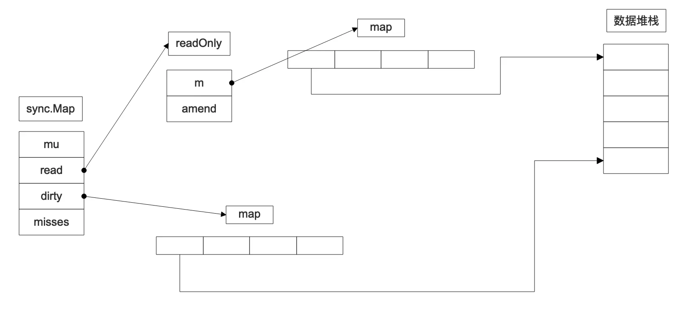

```go
type Map struct {
    //互斥锁，用于锁定dirty map
    mu Mutex    
    
    //优先读map,支持原子操作，注释中有readOnly不是说read是只读，而是它的结构体。read实际上有写的操作
    read atomic.Value 
    
    // dirty是一个当前最新的map，允许读写，会加锁
    dirty map[interface{}]*entry 
    
    // 主要记录read读取不到数据加锁读取read map以及dirty map的次数，当misses等于dirty的长度时，会将dirty复制到read
    misses int 
}

// readOnly 主要用于存储，通过原子操作存储在 Map.read 中元素。
type readOnly struct {
    // read的map, 用于存储所有read数据
    m       map[interface{}]*entry
    
    // 如果数据在dirty中但没有在read中，该值为true,作为修改标识
    amended bool 
}

// entry 为 Map.dirty 的具体map值
type entry struct {
    // nil: 表示为被删除，调用Delete()可以将read map中的元素置为nil
    // expunged: 也是表示被删除，但是该键只在read而没有在dirty中，这种情况出现在将read复制到dirty中，即复制的过程会先将nil标记为expunged，然后不将其复制到dirty
    //  其他: 表示存着真正的数据
    p unsafe.Pointer // *interface{}
}
```

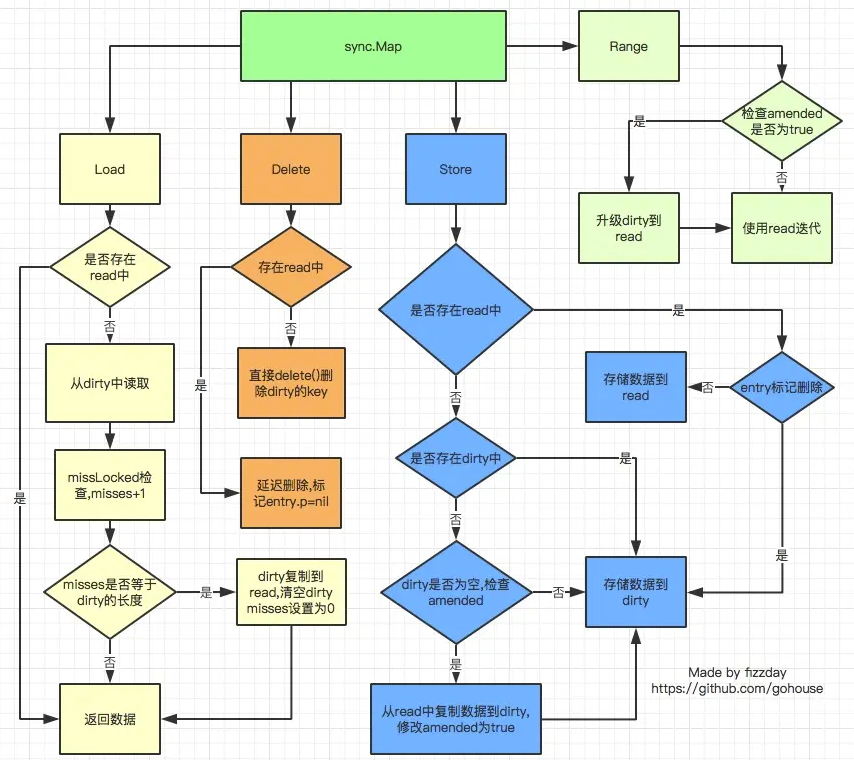


sync.Map的原理很简单，使用了空间换时间策略，通过冗余的两个数据结构(read、dirty),实现加锁对性能的影响。

通过引入两个map将读写分离到不同的map，其中**read map提供并发读和已存元素原子写**，而**dirty map则负责读写**。

这样**read map就可以在不加锁的情况下进行并发读取**,当read map中没有读取到值时,再**加锁进行后续读取,并累加未命中数**。

当未命中数大于等于dirty map长度,将dirty map上升为read map。

从结构体的定义可以发现，虽然引入了两个map，但是底层数据存储的是指针，指向的是同一份值。


在新增的时候，分为四种情况：

1. key原先就存在于`read`中，获取key所对应内存地址，**原子性修改**
2. key存在，但是key所对应的值被标记为 expunged，解锁，解除标记，并更新dirty中的key，与read中进行同步，然后修改key对应的值
3. read中没有key，但是dirty中存在这个key，直接上锁修改dirty中key的值
4. read和dirty中都没有值，先判断自从read上次同步dirty的内容后有没有再修改过dirty的内容，没有的话(`readOnly.amend=false`)，先同步read和dirty的值，然后添加新的key value到dirty上面

关于第四点，因为 read 同步 dirty 数据的时候，是直接把 dirty 指向 map 的指针交给了 read.m，然后将 dirty的指针设置为nil，所以同步之后 dirty就是nil，所以还需要 复制 read 到 dirty


删除的时候：

1. read中没有，且Map存在修改，则尝试删除dirty中的map中的key

2. read中没有，且Map不存在修改，那就是没有这个key，无需操作
3. read中有，尝试**将key对应的值设置为nil**，后面读取的时候就知道被删了，因为dirty中map的值跟read的map中的值指向的都是同一个地址空间，所以，修改了read也就是修改了dirty


range遍历的时候：

遍历的逻辑就比较简单了，Map只有两种状态，被修改过和没有修改过

修改过：将dirty的指针交给read，read就是最新的数据了，然后遍历read的map

没有修改过：遍历read的map就好了


## 4. 结构体

```go
type Employee struct {
    ID        int
    Name,Address      string
    DoB       time.Time
    Position  string
    Salary    int
    ManagerID int
}

var dilbert Employee    // 创建一个结构体并初始化所有的成员为对应的零值！！！  结构体初始值并不是nil
```

所以**不存在没有初始化的结构体变量**

下面的EmployeeByID函数将根据给定的员工ID返回对应的员工信息结构体的指针。我们可以使用点操作符来访问它里面的成员：

```Go
func EmployeeByID(id int) *Employee { /* ... */ }

fmt.Println(EmployeeByID(dilbert.ManagerID).Position) // "Pointy-haired boss"

id := dilbert.ID
EmployeeByID(id).Salary = 0 // fired for... no real reason
```

如果将EmployeeByID函数的返回值从`*Employee`指针类型改为Employee值类型，那么更新语句将不能编译通过，因为在赋值语句的左边并不确定是一个变量（调用函数返回的是值，并不是一个可取地址的变量）

**一个命名为S的结构体类型将不能再包含S类型的成员：因为一个聚合的值不能包含它自身**。但是S类型的结构体**可以包含`*S`指针类型**的成员，这可以让我们创建递归的数据结构，比如链表和树结构等(因为这个特)

- 可以使用空的struct和map来模拟set。**struct{}表示空的struct，它的大小为0，也不包含任何信息**

```go
seen := make(map[string]struct{}) // set of strings
```

### 结构体字面值

两种方式指定字面值

```go
type T struct{ a, b int }
var _ = p.T{a: 1, b: 2}
var _ = p.T{1, 2}  
```


因为结构体通常通过指针处理，可以用下面的写法来创建并初始化一个结构体变量，并返回结构体的地址：

```Go
pp := &Point{1, 2}
```

它和下面的语句是等价的

```Go
pp := new(Point)
*pp = Point{1, 2}
```

### 匿名成员

只声明一个成员对应的数据类型而不指名成员的名字，这类成员就叫匿名成员。得益于匿名嵌入的特性，我们**可以直接访问叶子属性而不需要给出完整的路径**

```go
type Circle struct {
    Point
    Radius int
}

type Wheel struct {
    Circle
    Spokes int
}

var w Wheel
w.X = 8            // equivalent to w.Circle.Point.X = 8
w.Y = 8            // equivalent to w.Circle.Point.Y = 8
w.Radius = 5       // equivalent to w.Circle.Radius = 5
w.Spokes = 20
```

但是，**结构体字面值并没有简短表示匿名成员的语法**， 因此下面的语句都不能编译通过：

```Go
w = Wheel{8, 8, 5, 20}                       // compile error: unknown fields
w = Wheel{X: 8, Y: 8, Radius: 5, Spokes: 20} // compile error: unknown fields
```

可以使用下面两种写法：

```go
w = Wheel{Circle{Point{8, 8}, 5}, 20}

w = Wheel{
    Circle: Circle{
        Point:  Point{X: 8, Y: 8},
        Radius: 5,
    },
    Spokes: 20, // NOTE: trailing comma necessary here (and at Radius)
}
```

匿名成员并不要求是结构体类型，命名类型也可以作为匿名成员。匿名类型的方法集。。.运算不仅可以获得匿名成员的嵌套成员，也可以获得它们的方法


**当匿名嵌入是非公开的时，无法直接通过结构体字面量的方式初始化匿名的内部类型，不过由于类型提升，依然可以设置内部类型的公开成员的值（内部类型的标识符提升到了外部类型）**!!!!!!!!!!!!!!!!!

```go
package important

type a struct {
	aa int
	AA int
}

type B struct {
	a
	bb int
	BB int
}


package main

import (
	"fmt"
	"myLearnProject/important"
)

func main() {
	b := important.B{
		BB: 1,
		//bb: 1,  //Unexported field 'bb' usage in struct literal
		//AA: 1,  //Unknown field 'AA' in struct literal
	}
	b.AA = 2
	fmt.Printf("%v", b) //{{0 2} 0 1}
}
```


### new和make

new：申请了内存，但是不会将内存初始化，只会将内存置零，返回一个指针。

- `newobject`->`mallocgc`

make：申请了内存，返回已初始化的结构体的零值。

- 在编译期间的类型检查阶段，Go 语言会将代表 `make` 关键字的 `OMAKE` 节点根据参数类型的不同转换成了 `OMAKESLICE`、`OMAKEMAP` 和 `OMAKECHAN` 三种不同类型的节点，这些节点会调用不同的运行时函数来初始化相应的数据结构。


## 5. JSON

```go
type Movie struct {
    Title  string
    Year   int  `json:"released"`      //tag可以使成员变为json后的字段名更改
    Color  bool `json:"color,omitempty"`  //omitempty表示当该成员为空或零值时JSON对象不生成该字段
    Actors []string
}

var movies = []Movie{
    {Title: "Casablanca", Year: 1942, Color: false,
        Actors: []string{"Humphrey Bogart", "Ingrid Bergman"}},
    {Title: "Cool Hand Luke", Year: 1967, Color: true,
        Actors: []string{"Paul Newman"}},
    {Title: "Bullitt", Year: 1968, Color: true,
        Actors: []string{"Steve McQueen", "Jacqueline Bisset"}},
    // ...
}
```

这样的数据非常适合json格式，将一个Go语言中类似movies的**结构体slice转为JSON**的过程叫**编组**（marshaling）。编组通过调用`json.Marshal`函数完成，要输出格式化的json可以使用`json.MarshallIndent`函数

```go
data, err := json.Marshal(movies)
if err != nil {
    log.Fatalf("JSON marshaling failed: %s", err)
}
fmt.Printf("%s\n", data)
/*
[{"Title":"Casablanca","released":1942,"Actors":["Humphrey Bogart","Ingr
id Bergman"]},{"Title":"Cool Hand Luke","released":1967,"color":true,"Ac
tors":["Paul Newman"]},{"Title":"Bullitt","released":1968,"color":true,"
Actors":["Steve McQueen","Jacqueline Bisset"]}]
*/
data, err := json.MarshalIndent(movies, "", "    ")  //格式化的json
```

使用`json.Unmarshal`进行解码，将json解码为go语言的数据类型，可以**只解码我们关注的字段**

```go
var titles []struct{ Title string }
if err := json.Unmarshal(data, &titles); err != nil {
    log.Fatalf("JSON unmarshaling failed: %s", err)
}
fmt.Println(titles) // "[{Casablanca} {Cool Hand Luke} {Bullitt}]"
```

## 6. 文本和HTML模版


## 7. golang类型总结

基本类型(内置类型)：数值，字符串，布尔

复合类型：数组和结构体

引用类型：指针、切片、map、channel

接口类型：接口

函数类型


## 8. 关于可等性

`==`操作的前提是两个操作数的**类型必须相同**，如果类型不同，编译时就会报错，而且类型非常严格，不会进行类型的隐式转换，即使底层类型相同也不能直接比较

例如：

```go
    var a int8
    var b int16
    // 编译错误：invalid operation a == b (mismatched types int8 and int16)
    fmt.Println(a == b)
    

    type int8 myint8
    var a int8
    var b myint8
    // 编译错误：invalid operation a == b (mismatched types int8 and myint8)
    fmt.Println(a == b)
```

### 基本类型

基本类型只要类型相同可以直接比较

注意浮点数不能精确表示

```go
var a float64 = 0.1
var b float64 = 0.2
var c float64 = 0.3
fmt.Println(a + b == c) // false
```


### 复合类型

对于数组和结构体这种复合类型，需要逐个元素/逐个字段比较，根据元素的类型再按相应规则进行比较

注意长度不同的两个数组类型不同，不能直接比较

```go
type A struct {
    a int
    b string
}
aa := A { a : 1, b : "test1" }
bb := A { a : 1, b : "test1" }
cc := A { a : 1, b : "test2" }
fmt.Println(aa == bb)   //true
fmt.Println(aa == cc)	//false
```

如果数组或者结构体中含有不可比较类型（例如map，slice等），那么这个数组/结构体也是不可比较的


### 引用类型

引用类型是间接指向他们所引用的数据的，保存的是数据的地址

引用类型的比较实际上是**判断两个变量是不是指向同一份数据**，他们不会比较实际指向的数据

特殊规定：

- `切片`之间不允许比较。`切片`只能与`nil`值比较。
- `map`之间不允许比较。`map`只能与`nil`值比较。

因为interface{}类型的切片可以指向自己，递归引用，如果比较里面的元素，可能会直接爆栈，golang规定**切片不允许比较**，使用`==`操作的时候直接编译报错

对于map，因为map类型的值类型可能是不可比较的类型，所以map也不允许比较

map的key是使用`==`来判断的，所以所有不可比较类型都不可以作为map的key


看看指针的比较：

```go
type A struct {
    a int
    b string
}

aa := &A { a : 1, b : "test1" }
bb := &A { a : 1, b : "test1" }
cc := aa
fmt.Println(aa == bb)
fmt.Println(aa == cc)
```

因为`aa`和`bb`指向的两个不同的结构体，虽然它们指向的值是相等的（见上面复合类型的比较），但是它们不等。 `aa`和`cc`指向相同的结构体，所以它们相等。


再看channel：

```go
ch1 := make(chan int, 1)
ch2 := make(chan int, 1)
ch3 := ch1

fmt.Println(ch1 == ch2)
fmt.Println(ch1 == ch3)
```

`ch1`和`ch2`虽然类型相同，但是指向不同的`channel`，所以它们不等。 `ch1`和`ch3`指向相同的`channel`，所以它们相等。


### 接口类型

接口类型的值是由两个部分组成的：动态类型和动态值

接口比较，必须要**动态类型相同(一个接口可以转化为另一个接口)**，并且**动态值相等**，这两个接口值才是相等的

```go
type A struct {
    a int
    b string
}

var aa interface{} = A { a: 1, b: "test" }
var bb interface{} = A { a: 1, b: "test" }
var cc interface{} = A { a: 2, b: "test" }

fmt.Println(aa == bb) // true
fmt.Println(aa == cc) // false

var dd interface{} = &A { a: 1, b: "test" }
var ee interface{} = &A { a: 1, b: "test" }
fmt.Println(dd == ee) // false
```

`aa`和`bb`动态类型相同（都是`A`），动态值也相同（结构体`A`，见上面复合类型的比较规则），故两者相等。 `aa`和`cc`动态类型相同，动态值不同，故两者不等。

 `dd`和`ee`动态类型相同（都是`*A`），动态值使用指针（引用）类型的比较，由于不是指向同一个地址，故不等。


### 函数类型

不能比较


# 四、函数


## 1. 多返回值

如果一个函数所有的返回值都有显式的变量名，那么该函数的return语句可以省略操作数。这称之为bare return

```Go
func CountWordsAndImages(url string) (words, images int, err error) {
    resp, err := http.Get(url)
    if err != nil {
        return
    }
    doc, err := html.Parse(resp.Body)
    resp.Body.Close()
    if err != nil {
        err = fmt.Errorf("parsing HTML: %s", err)
        return
    }
    words, images = countWordsAndImages(doc)
    return
}
```

每一个return语句等价于：`return words, images, err`

## 2. 错误

### 错误处理策略

1. **错误传播方式**：函数中某个子程序的失败，会变成该函数的失败，即把错误返回给调用者

```go
resp, err := http.Get(url)
if err != nil{
    return nil, err
}
```

或者不直接返回错误，而是构造一个错误信息返回。错误最终由main函数处理时，错误信息应提供清晰的从原因到后果的因果链

```Go
doc, err := html.Parse(resp.Body)
resp.Body.Close()
if err != nil {
    return nil, fmt.Errorf("parsing %s as HTML: %v", url,err)
}
```


2. **重新尝试**：如果错误的发生是偶然性的，或由不可预知的问题导致的。一个明智的选择是重新尝试失败的操作。在重试时，我们需要限制重试的时间间隔或重试的次数，防止无限制的重试

```go
func WaitForServer(url string) error {
    const timeout = 1 * time.Minute
    deadline := time.Now().Add(timeout)
    for tries := 0; time.Now().Before(deadline); tries++ {
        _, err := http.Head(url)
        if err == nil {
            return nil // success
        }
        log.Printf("server not responding (%s);retrying…", err)
        time.Sleep(time.Second << uint(tries)) // exponential back-off
    }
    return fmt.Errorf("server %s failed to respond after %s", url, timeout)
}
```


3. 如果错误发生后程序无法继续执行，就要采用第三种策略**输出错误信息，结束程序**，这种策略只应该在main函数中执行，库函数只应该向上传播，除非该错误意味着程序内部包含不一致性，即遇到了bug，才能在库函数中结束程序

```go
if err := WaitForServer(url); err != nil {
    fmt.Fprintf(os.Stderr, "Site is down: %v\n", err)
    os.Exit(1)
}

//或者采用log.Fatalf，也是一样的效果
if err := WaitForServer(url); err != nil {
    log.Fatalf("Site is down: %v\n", err)
}
```


4. 只输出错误信息，不中断程序

```go
if err := Ping(); err != nil {
    log.Printf("ping failed: %v; networking disabled",err)
}
```


5. 直接忽略掉错误


### 文件结尾错误EOF

io包保证任何由**文件结束引起的读取失败**都返回同一个错误——`io.EOF`

可以以此来判断文件是否读取完毕

```go
in := bufio.NewReader(os.Stdin)
for {
    r, _, err := in.ReadRune()
    if err == io.EOF {
        break // finished reading
    }
    if err != nil {
        return fmt.Errorf("read failed:%v", err)
    }
    // ...use r…
}
```

## 3. 匿名函数和闭包

当匿名函数需要被递归调用时，我们必须首先声明一个变量，再将匿名函数赋值给这个变量。如果不分成两部，函数字面量无法与visitAll绑定，我们也无法递归调用该匿名函数，`因为此时visitAll还没声明`

```go
visitAll := func(items []string) {
    // ...
    visitAll(m[item]) // compile error: undefined: visitAll
    // ...
}
```

应该按下面的格式：

```go
var visitAll func(items []string)
visitAll = func(items []string) {
    // ...
    visitAll(m[item]) // compile error: undefined: visitAll
    // ...
}
```


### 闭包


匿名函数中捕获外部函数的局部变量，这种匿名函数一般称为`闭包`。**闭包对捕获的外部变量并不是以值传递的方式访问，而是以引用传递的方式访问**

```go
func Inc() (i int) {    //最后返回43
  defer func() {i++}
  return 42
}
```

闭包可能带来一些隐含问题：因为是闭包，所以是加上defer执行时都是引用的同一个变量i，结束时i是3

```go
func main() {
  for i:=0; i<3; i++ {
    defer func(){ fmt.Print(i) }()
  }
}
// 333
```

**循环变量作用域问题**：在 for 循环引进的一个块作用域内进行声明。在循环里创建的所有函数变量共享相同的变量，就是一个可访问的存储位置，而不是固定的值

```go
var slice []func()

func main() {
	sli := []int{1, 2, 3, 4, 5}
	var a = 10
	for _, v := range sli {
		fmt.Println(&v)
		slice = append(slice, func(){
			a++
			fmt.Println(v, &v)
			fmt.Println(a, &a) // 直接打印结果
		})
	}

	for _, val  := range slice {
		val()
	}
}

/*
5  0xc00000a0b8
11 0xc00000a098
5  0xc00000a0b8
12 0xc00000a098
5  0xc00000a0b8
13 0xc00000a098
5  0xc00000a0b8
14 0xc00000a098
5  0xc00000a0b8
15 0xc00000a098
*/
```


解决办法：可以**作为参数传递进匿名函数**，而不是直接使用


## 4. 可变参数

```go
func sum(vals...int) int {
    total := 0
    for _, val := range vals {
        total += val
    }
    return total
}
```

vals被看作是[]int的切片，但是实际上并不是切片，和以切片作为参数还是不同的


如果切片作为参数传递的时候，需要**对切片进行结构**，即传入切片的...

**可变参数必须是可变参数函数的最后一个参数**


## 5. defer延迟调用机制

1. 头插法
2. 参数预计算

> `defer` 传入的函数不是在退出代码块的作用域时执行的，它只会在当前函数和方法返回之前被调用。

对于函数或方法前加了difer关键字的，当执行到该条语句时，`函数`和`参数表达式`得到计算，但**直到包含该defer语句的函数执行完毕时，defer后的函数才会被执行**，不论包含defer语句的函数是通过return正常结束，还是由于panic导致的异常结束。你可以在一个函数中执行多条defer语句，它们的**执行顺序与声明顺序相反**。注意**在defer之后执行完毕**才会执行difer语句

```go
//处理文件读写
func ReadFile(filename string) ([]byte, error) {
    f, err := os.Open(filename)
    if err != nil {
        return nil, err
    }
    defer f.Close()
    return ReadAll(f)
}
```

```Go
//处理互斥锁
var mu sync.Mutex
var m = make(map[string]int)
func lookup(key string) int {
    mu.Lock()
    defer mu.Unlock()
    return m[key]
}
```


### 多重defer

注意：

```go
//注意defer加载和传值的时间

func main() {
	a := 10
	defer func() {            
		fmt.Println(a)
	}()

	defer func(a int) {			// 此时，将a=10传递给了func的函数参数，只是函数被延迟执行
		fmt.Println(a)      
	}(a)

	a = 100
}

/*
10
100
*/
```


### 使用defer记录函数执行时间

**记录函数的执行时间：** bigSlowOperation被调时，**trace会返回一个匿名函数func()**，该**函数值会在bigSlowOperation退出时被调用**。通过这种方式， 我们可以只通过一条语句控制函数的入口和所有的出口，甚至可以记录函数的运行时间，如例子中的start。需要注意一点：**不要忘记defer语句后的圆括号**，否则本该在进入时执行的操作会在退出时执行，而本该在退出时执行的，永远不会被执行

```go
func bigSlowOperation() {
    defer trace("bigSlowOperation")() // don't forget the extra parentheses
    // ...lots of work…
    time.Sleep(10 * time.Second) // simulate slow operation by sleeping
}
func trace(msg string) func() {
    start := time.Now()
    log.Printf("enter %s", msg)
    return func() { 
        log.Printf("exit %s (%s)", msg,time.Since(start)) 
    }
}
```

`defer`在**return之后**执行，但是可以修改return返回给调用者的值


### defer的小坑-循环

循环体中的defer语句会被延迟到循环执行完毕之后才会执行，解决方法是把循环体中的defer放到另一个函数中，每次循环调用该函数

```go
for _, filename := range filenames {
    if err := doFile(filename); err != nil {
        return err
    }
}
func doFile(filename string) error {
    f, err := os.Open(filename)
    if err != nil {
        return err
    }
    defer f.Close()
    // ...process f…
}
```


### defer的小坑-返回值

```go
func hello1(i *int) (j int) {
	defer func() {
		j = 19
	}()
	j = *i
	return j
}

func hello2(i *int) (j int) {
	defer func() {
		j = 19
	}()
	return *i
}

func hello3(i *int) int {
	defer func() {
		*i = 19
	}()
	return *i
}

func main() {
	i := 10
	j := hello1(&i)
	fmt.Println(i, j)
	i = 10
	j = hello2(&i)
	fmt.Println(i, j)
	i = 10
	j = hello3(&i)
	fmt.Println(i, j)
}
```

输出：

```go
10 19
10 19
19 10
```

总结：

- **命名返回值：就好比函数参数一样，函数体内对命名返回值的任何修改，都会影响它。**
- **非命名返回值：取决于 return 时候的值**，之后defer的修改不能影响到返回值了


## 6. error 接口

```go
type error interface {
    Error() string
}
```

创建error最简单的方法就是调用errors.New函数，返回一个新的error

```go
err = errors.New("错误信息")
```

**errors包：**

```go
package errors

func New(text string) error { return &errorString{text} }  //返回error对象的地址，避免两个error相等
type errorString struct { text string }		//errorString实现了error接口的全部方法
func (e *errorString) Error() string { return e.text }  //*errorString实现了error接口的Error()方法
```

使用errors.New函数的情况还是比较少

我们一般使用一个更方便的封装函数：**fmt.Errorf**，他还会处理字符串的格式化

```go
func Errorf(format string, args ...interface{}) error {
  return errors.New(Sprintf(format, args...))   //Errorf函数实际上还是调用的errors.New()
}
```


返回错误，调用者自行捕获错误信息


**error返回的是一般性错误，可以进行处理，继续运行。。。panic一般是让程序不能继续运行的错误**

## 7. Panic异常

编译器把panic转换为 `runtime.gopanic`

1. 创建新的 [runtime._panic](https://draveness.me/golang/tree/runtime._panic) 并添加到所在 Goroutine 的 `_panic` 链表的最前面；
2. 在循环中不断从当前 Goroutine 的 `_defer` 中链表获取 [runtime._defer](https://draveness.me/golang/tree/runtime._defer) 并调用 [runtime.reflectcall](https://draveness.me/golang/tree/runtime.reflectcall) 运行延迟调用函数；
3. 调用 [runtime.fatalpanic](https://draveness.me/golang/tree/runtime.fatalpanic) 中止整个程序；
   1. 打印panic的信息
   2. 调用`exit(2)`退出程序

编译器会将关键字 `recover` 转换成 [runtime.gorecover](https://draveness.me/golang/tree/runtime.gorecover)：

```go
func gorecover(argp uintptr) interface{} {
	gp := getg()
	p := gp._panic
	if p != nil && !p.recovered && argp == uintptr(p.argp) {
		p.recovered = true
		return p.arg
	}
	return nil
}
```

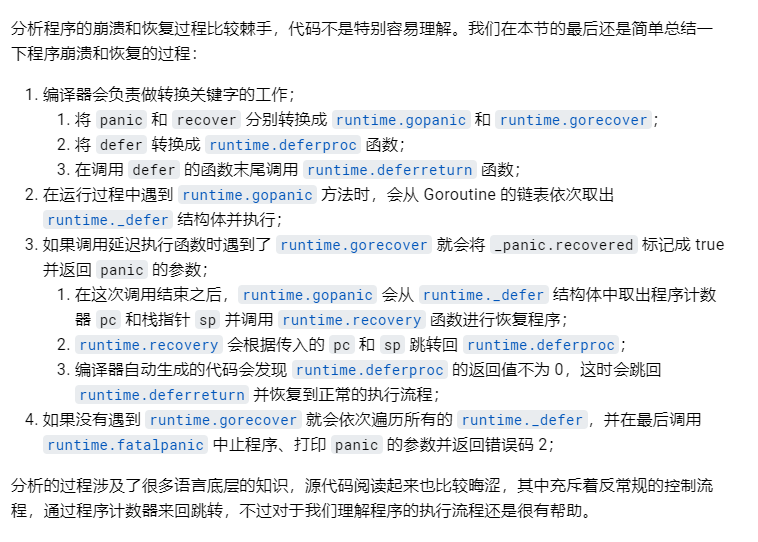


```c
type g struct {
	_panic       *_panic // innermost panic - offset known to liblink
	_defer       *_defer // innermost defer    
}

type _panic struct {
	argp      unsafe.Pointer // pointer to arguments of deferred call run during panic; cannot move - known to liblink
	arg       interface{}    // argument to panic
	link      *_panic        // link to earlier panic
	pc        uintptr        // where to return to in runtime if this panic is bypassed
	sp        unsafe.Pointer // where to return to in runtime if this panic is bypassed
	recovered bool           // whether this panic is over
	aborted   bool           // the panic was aborted
	goexit    bool
}

type _defer struct {
	siz     int32 // includes both arguments and results
	started bool
	heap    bool
	// openDefer indicates that this _defer is for a frame with open-coded
	// defers. We have only one defer record for the entire frame (which may
	// currently have 0, 1, or more defers active).
	openDefer bool
	sp        uintptr  // sp at time of defer
	pc        uintptr  // pc at time of defer
	fn        *funcval // can be nil for open-coded defers
	_panic    *_panic  // panic that is running defer
	link      *_defer

	// If openDefer is true, the fields below record values about the stack
	// frame and associated function that has the open-coded defer(s). sp
	// above will be the sp for the frame, and pc will be address of the
	// deferreturn call in the function.
	fd   unsafe.Pointer // funcdata for the function associated with the frame
	varp uintptr        // value of varp for the stack frame
	// framepc is the current pc associated with the stack frame. Together,
	// with sp above (which is the sp associated with the stack frame),
	// framepc/sp can be used as pc/sp pair to continue a stack trace via
	// gentraceback().
	framepc uintptr
}
```


- `panic` 只会触发**当前** Goroutine 的 `defer`；
- `recover` 只有在 `defer` 中调用才会生效；
- `panic` 允许在 `defer` 中嵌套多次调用；


- Go的类型系统会在编译时捕获很多错误，但有些错误只能在运行时检查，如`数组访问越界、空指针引用`等。这些运行时错误会引起painc异常

一般而言，当panic异常发生时，程序会**中断运行**，并立即执行在该goroutine中**被延迟的函数**（defer 机制）。随后，程序**崩溃并输出日志信息**。日志信息包括panic value和函数调用的堆栈跟踪信息

- **直接调用内置的panic函数也会引发panic异常**，某些不该发生的场景发生时，我们可以主动调用panic表示路径不可达

## 8. recover捕获异常

panic异常一旦发生就会导致程序崩溃。。

go语言为我们提供了专门拦截运行时panic的内建函数 `recover`，它可以使当前程序从运行时panic的状态中恢复，并重新获得流程控制权...

**recover只有在defer调用的函数中有效**，defer直接调用recover不行，**必须包装在另一个函数中**

**包含recover的defer必须在可能出现错误的语句之前声明**

`func recover() interface{}`


```go
func errGenFunc(i int){
    arr := [10]int{}
    
    defer func(){  //defer中通过匿名函数调用recover进行错误拦截
        recover()  //可以从panic异常中重新获取控制权
    }()
    
    fmt.Println(arr[i])  //可能越界，引发panic异常，使程序停止
}

func post(){fmt.Println("post....")}

func main(){
    errGenFunc(100)
    post()
}

/*
post...    //从panic中恢复，正常执行后续程序
*/
```


Go语言库的习惯：即使包内部使用了panic，在导出函数时也会被转化为明确的错误值

```go
//更好的处理方式应该是：
func Xxxx() {
  defer func(){
    if err := recover(); err! = nil{
      fmt.Errorf("Xxx: internal error: %v", err)   //处理错误信息
    }
	}()
  
  .....
} 

```


## 9 for range 


# 五、方法

在函数定义时，函数名前加上一个附加参数，就变成了方法，表示为这种类型定义了一种独占的方法

```go
type Point struct{ X, Y float64 }

// traditional function
func Distance(p, q Point) float64 {
    return math.Hypot(q.X-p.X, q.Y-p.Y)
}

// same thing, but as a method of the Point type
func (p Point) Distance(q Point) float64 {
    return math.Hypot(q.X-p.X, q.Y-p.Y)
}
```

**方法必须定义在与该类型的同一个包下，所以我们不能给int这种内置类型定义方法**

和函数一样，**不支持重载**

## 1. 方法的指针接收者和值接收者

1. **不管是指针接收者还是值接收者实现了一个接口的方法，都可以通过该类型的值和指针调用接口的方法**。go语言会进行自动的类型转换，这实际上是语法糖起作用的。
2. **如果使用指针接收者来实现一个接口，那么只有该类型的指针才能实现对应接口（is interface a）。**
3. **如果使用值接收者来实现一个接口，那么该类型的值和指针都实现了对应接口。**

实现了值接收者的方法，相当于自动实现了指针接收者的方法；而实现了指针接收者的方法是不会自动实现值接收者的方法的。

也就是说：值类型的方法集只包括使用值接收者实现的方法。而指针类型的方法集包含值和指针接收者实现的方法

因为并不是总能获取一个值的地址

| Values | Methods Receivers |
| :----: | :---------------: |
|   T    |       (t T)       |
|   *T   | (t T) and (t *T)  |


例如，使用值接收者实现接口：

```go
type buyer interface {
	buy()
}

type student struct {
	name string
}

func (s student) buy() {
	fmt.Println(s.name, "买买买")
}

func showBuyer(b buyer) {
	fmt.Println(b)
}

func main() {
	s := student{"小明"}
  
  //使用值接收者实现接口，该类型的值和指针都可以调用接口方法
	s.buy()       
	(&s).buy()
	
  //使用值接收者实现接口，该类型的值和指针都实现了该接口
	showBuyer(s)
	showBuyer(&s)
}
```

使用指针接收者实现接口：
```go
type buyer2 interface {
	buy()
}

type student2 struct {
	name string
}

func (s *student2) buy() {
	fmt.Println(s.name, "买买买")
}

func showBuyer2(b buyer2) {
	fmt.Println(b)
}

func main() {
	s := student2{"小明"}
  
  //使用指针接收者实现接口，该类型的值和指针都可以调用接口方法
	(&s).buy()
	s.buy()
	
  //使用指针接口者实现接口，只有该类型的指针才实现了接口
  //所以不能把该类型的值作为 buyer2 接口类型进行传递，它不是该接口类型
	showBuyer2(s) //Cannot use 's' (type student2) as type buyer2Type does not implement 'buyer2' as 'buy' method has a pointer receiver
	showBuyer2(&s)
}

```


## 2. 方法值和方法表达式

```go
func (p point) distance(q point) float64 {...}
func (cp coleredPoint) distance(cp2 coleredPoint) float64 {...}
func (cp coleredPoint) show() {...}
func (c color) distance(c2 color) float64 {...}

func main(){
  	cp := coleredPoint{point{1, 1},"red"}
	cp2 := coleredPoint{point{2, 2}, "green"}

	cpdistance := coleredPoint.distance
	pdistance := cp.point.distance
	cdistance := cp.color.distance

	fmt.Println(cpdistance(cp, cp2)) //func (cp coleredPoint) distance(cp2 coleredPoint) float64{...}

	fmt.Println(pdistance(cp2.point))
	fmt.Println(cdistance(cp2.color))
}
```


## 3. go语言可以方法重写，不能重载

相互嵌套的结构体可以定义相同的方法名，根据自己的类型调用对应的方法

但是同一个结构体不能定义同名的方法（go语言没有重载机制）

```c
type a struct {}
type A struct {}
type B struct {
	A
	a
}

func (*A) gogo() {
	fmt.Println("gogogo")
	return
}

func (*a) gogo() {
	fmt.Println("gagaga")
	return
}

//func (*B) gogo() {
//	fmt.Println("gigigi")
//	return
//}

func main() {
	r := A{}
	b := B{}
	r.gogo()
	(&r).gogo()
	b.gogo()   //出错
	return
}
```


## 4. 方法操作的是副本！

其实就是方法的第一个参数是结构体的对象或者对象的指针

所以就是值传递的

**要修改对象的属性，方法的接收者应该是指针** （***只需要接收者是指针即可，不需要调用者是指针***，就算调用者是对象，也会进行隐式转换，转换为指针）

```go
func main() {
	p := person{
		name: "xiaoming",
		age:  10,
	}
	p.addAge()
	fmt.Printf("%v\n", p)   //{xiaoming 10}
    p.addAgePointer()
	fmt.Printf("%v\n", p)   //{xiaoming 11}
}

func (p *person) addAgePointer() {
	p.age = p.age + 1
}

func (p person) addAge() {
    p.age = p.age + 1
}
```


# 六、接口简介


## 1. 接口基本介绍

Printf和Sprintf底层都是调用了Fprintf：

Printf就是打印到os.Stdout标准输出上

Sprintf就是打印到一个bytes.Buffer，然后返回了buf的string

```go
package fmt

func Fprintf(w io.Writer, format string, args ...interface{}) (int, error)
func Printf(format string, args ...interface{}) (int, error) {
    return Fprintf(os.Stdout, format, args...)
}
func Sprintf(format string, args ...interface{}) string {
    var buf bytes.Buffer
    Fprintf(&buf, format, args...)
    return buf.String()
}
```

**空接口**：interface{}类型，它没有任何方法，空接口类型对实现它的类型没有要求，所以我们可以将任意一个值赋给空接口类型

```go
var any interface{}
any = true
any = 12.34
any = "hello"
any = map[string]int{"one": 1}
any = new(bytes.Buffer)
```


### 接口检查

```go
//1. 空值nil强转为 *GobCodec 类型，再转换(赋值)为Codec接口，IDE就可以帮我们验证GobCodec是否实现了Codec接口
var _ Codec = (*GobCodec)(nil) 

//2. 效果差不多
var _ Codec = new(GobCodec)    
```


## 2. sort接口

`sort.Interface` 接口定义了三个方法，自定义排序规则必须实现这三个接口

```go
package sort
type Interface interface{
  Len() int    //求待排序元素个数的方法
  Less(i, j int) bool     //比较 i j 位置元素大小的方法
  Swap(i, j int)  //交换 i j 位置元素的方法
}
```

对于 int 、 float64 和 string 数组或是分片的排序， go 分别提供了 sort.Ints() 、 sort.Float64s() 和 sort.Strings() 函数， 默认都是从小到大排
go 的 sort 包可以使用 sort.Reverse() 来调换 slice.Interface.Less，交换后调用sort.Sort函数进行排序

```go
intList := [] int {2, 4, 3, 5, 7, 6, 9, 8, 1, 0}
sort.Ints(intList)    //顺序排序
sort.Sort(sort.Reverse(sort.IntSlice(a)))   //逆序排序
```


### 便捷的排序结构

`sort.StringSlice`结构类型可以便捷的对[]string进行排序，`sort.IntSlice`可以便捷的对[]int进行排序（实际上还是[]string和[]int，只是帮我们定义好了自定义排序的三个方法），**类型转换为sort.Interface了，所以支持逆序排序**

也可以直接使用`sort.Strings(a []string)`和`sort.Ints(a []int)`来进行排序，但是类型没有变为sort.Interface，因此**不支持使用 sort.Reverse 进行逆序**

```go
	nums := []int{1, 8, 5, 5, 3, 8}
	s := sort.IntSlice(nums)   //转换为 sort.IntSlice 类型进行排序
	sort.Sort(sort.Reverse(s))
	fmt.Println(s)   // [8 8 5 5 3 1]

	strs := []string{"acd", "ab", "d", "b"}
	sort.Strings(strs)  //使用sort.Strings()函数进行排序
	fmt.Println(strs) // [ab acd b d]
```


### Slice的自定义排序

 sort包提供了三个slice的排序函数 `Slice`, `SliceStable`, `SliceIsSorted`

```go
package sort

func Slice(slice interface{}, less func(i, j int) bool) {
	rv := reflectValueOf(slice)
	swap := reflectSwapper(slice)
	length := rv.Len()
	quickSort_func(lessSwap{less, swap}, 0, length, maxDepth(length))
}

// 稳定排序
func SliceStable(slice interface{}, less func(i, j int) bool) {
	rv := reflectValueOf(slice)
	swap := reflectSwapper(slice)
	stable_func(lessSwap{less, swap}, rv.Len())
}

// 判断是否排序
func SliceIsSorted(slice interface{}, less func(i, j int) bool) bool {
	rv := reflectValueOf(slice)
	n := rv.Len()
	for i := n - 1; i > 0; i-- {
		if less(i, i-1) {
			return false
		}
	}
	return true
}
```

举例： leetcode179，求数组元素拼接组合后的最大数

```go
func largestNumber(nums []int) string {
	strs := make([]string, len(nums))
	for i:=0; i<len(nums); i++{
		strs[i] = strconv.Itoa(nums[i])
	}
	sort.Slice(strs, func(i, j int) bool {
		return strs[i]+strs[j] > strs[j]+strs[i]
	})
	if strs[0] == "0" {
		return "0"
	}
	return strings.Join(strs, "")
}
```


### 结构体自定义排序

结构体切片只要实现了 sort.Interface接口（定义Len，Swap，Less方法），就可以按照自定义的规则进行排序

```go
type Person struct {
    Name string
    Age  int
}

// 按照 Person.Age 从大到小排序
type PersonSlice [] Person

// PersonSlice实现了sort接口的三个方法，所以可以当作sort.Interface来使用
func (a PersonSlice) Len() int {return len(a)}
func (a PersonSlice) Swap(i, j int){a[i], a[j] = a[j], a[i]}
func (a PersonSlice) Less(i, j int) bool {return a[i].Age < a[j].Age}
 
func main() {
    people := [] Person{
        {"zhang san", 12},
        {"li si", 30},
        {"wang wu", 52},
        {"zhao liu", 26},
    }
 
  	//等价于：sort.Sort(sort.Interface(PersonSlice(people)))
    sort.Sort(PersonSlice(people))    // 按照 Age 升序排序
    fmt.Println(people)
 
    sort.Sort(sort.Reverse(PersonSlice(people)))    // 按照 Age 降序排序
    fmt.Println(people)
 
}

// 还可以把 Less 函数和 PersonSlice 封装到 PersonWrapper，使得调用者可以自己传入排序的 Less 方法
```


## 3. http.Handler接口

```go
package http

type Handler interface {
    ServeHTTP(w ResponseWriter, r *Request)
}

func ListenAndServe(address string, h Handler) error
```

**ListenAndServe函数**需要一个例如“localhost:8000”的服务器地址，和一个所有请求都可以分派的Handler接口实例。它会一直运行，直到这个服务因为一个错误而失败（或者启动失败），它的返回值一定是一个非空的错误

```go
func main() {
    db := database{"shoes": 50, "socks": 5}
    log.Fatal(http.ListenAndServe("localhost:8000", db))
}

type dollars float32
func (d dollars) String() string { return fmt.Sprintf("$%.2f", d) }

type database map[string]dollars
func (db database) ServeHTTP(w http.ResponseWriter, req *http.Request) {
    for item, price := range db {
        fmt.Fprintf(w, "%s: %s\n", item, price)
    }
}
```

**ServeMux多路请求器**，位于`net/http`包，可以简化URL和handlers的URL

```go
func main() {
    db := database{"shoes": 50, "socks": 5}
    mux := http.NewServeMux()
    mux.Handle("/list", http.HandlerFunc(db.list))   //将database.list函数转化为http.HandlerFunc类型
    mux.Handle("/price", http.HandlerFunc(db.price))
    log.Fatal(http.ListenAndServe("localhost:8000", mux))
}

type database map[string]dollars

func (db database) list(w http.ResponseWriter, req *http.Request) {
    for item, price := range db {
        fmt.Fprintf(w, "%s: %s\n", item, price)
    }
}

func (db database) price(w http.ResponseWriter, req *http.Request) {
    item := req.URL.Query().Get("item")
    price, ok := db[item]
    if !ok {
        w.WriteHeader(http.StatusNotFound) // 404
        fmt.Fprintf(w, "no such item: %q\n", item)
        return
    }
    fmt.Fprintf(w, "%s\n", price)
}
```

`http.HandlerFunc`接口定义了ServlHttp方法，所有func(w ResponseWriter, r *Request)都可以转化为HandlerFunc

ServeHTTP方法的行为是**调用了它的函数本身**。因此HandlerFunc是一个**让函数值满足一个接口的适配器**，这里函数和这个接口仅有的方法有相同的函数签名。实际上，这个技巧让一个单一的类型例如database以多种方式满足http.Handler接口：一种通过它的list方法，一种通过它的price方法等等

```go
package  

type HandlerFunc func(w ResponseWriter, r *Request)

func (f HandlerFunc) ServeHTTP(w ResponseWriter, r *Request) {
    f(w, r)
}
```

为了方便，net/http包提供了一个**全局的ServeMux实例DefaultServerMux**和**包级别的http.Handle和http.HandleFunc函数**。现在，为了使用DefaultServeMux作为服务器的主handler，我们不需要将它传给ListenAndServe函数；nil值就可以工作。

然后服务器的主函数可以简化成：

```go
func main() {
    db := database{"shoes": 50, "socks": 5}
    http.HandleFunc("/list", db.list)
    http.HandleFunc("/price", db.price)
    log.Fatal(http.ListenAndServe("localhost:8000", nil))
}
```


## 4. 类型断言

**x.(T)被称为断言类型**，这里x表示一个接口的类型和T表示一个类型。一个类型断言检查它操作对象的动态类型是否和断言的类型匹配

1. **如果断言的T是一个具体类型，会检查x的动态类型是否和T相同，断言成功，返回x的动态值，断言失败则抛出panic异常**

```go
var w io.Writer
w = os.Stdout
f := w.(*os.File)      // success: f == os.Stdout
c := w.(*bytes.Buffer) // panic: interface holds *os.File, not *bytes.Buffer
```

2. **如果断言的T是一个接口类型，会检查x的动态类型是否满足T接口，断言成功则会把x的类型转化为T，断言失败则会panic异常，如果T是nil接口值，那么不管x都什么类型都会失败**

```go
var w io.Writer
w = os.Stdout
rw := w.(io.ReadWriter) // success: *os.File has both Read and Write
w = new(ByteCounter)
rw = w.(io.ReadWriter) // panic: *ByteCounter has no Read method
w = rw             // io.ReadWriter is assignable to io.Writer
w = rw.(io.Writer) // fails only if rw == nil
```


对于接口值的动态类型经常是不确定的，我们会去检验它是否是一些特定的类型，这时如果使用两个参数去接受断言的结果，便会得到成功与否的标志

```go
var w io.Writer = os.Stdout
if f, ok := w.(*os.File); ok {
    // ...use f...
}
```


## 5. -----基于类型断言区别错误类型

os包中文件操作返回的错误集合：

```go
package os

func IsExist(err error) bool      //创建文件，文件已存在
func IsNotExist(err error) bool   //读取操作，文件不存在
func IsPermission(err error) bool //权限拒绝
```

可以使用一个专门的类型来描述结构化的错误

```go
package os

// PathError records an error and the operation and file path that caused it.
type PathError struct {
    Op   string
    Path string
    Err  error
}

func (e *PathError) Error() string {
    return e.Op + " " + e.Path + ": " + e.Err.Error()
}

var ErrNotExist = errors.New("file does not exist")
func IsNotExist(err error) bool {
    if pe, ok := err.(*PathError); ok {
        err = pe.Err
    }
    return err == syscall.ENOENT || err == ErrNotExist
}
```


## 6. -----通过类型断言查询接口


## 7. 内部类型和外部类型的接口问题

由于**类型提升**，如果内部类型实现了某个接口，那么内部类型实现的接口会自动**提升到外部类型**，即**外部类型也同样实现了这个接口**

如果内部类型是指针接收者实现的接口，那么对应外部类型的指针才能实现接口


如果内部类型和外部类型实现了同一个接口，那么内部类型实现的接口不会被自动提升，通过外部类型访问外部类型实现的方法，内部类型访问内部类型实现的方法


## 8. 函数、方法、接口总结

函数分为`具名函数`和`匿名函数`

当匿名函数引用了外部作用域中的变量时就成了`闭包函数`，闭包是函数式变成语言的核心

`方法`是绑定到具体类型的特殊函数，必须在编译时`静态绑定`

`接口`定义了方法的集合，这些方法依托于运行时的接口对象，所以是在运行时`动态绑定`的


# 七、Goroutines和Channels

Go语言中的并发程序可以用两种手段来实现：

1. 本章的goroutine和channel，其支持“顺序通信进程”（communicating sequential processes）或被简称为CSP。CSP是一种现代的并发编程模型，在这种编程模型中值会在不同的运行实例（goroutine）中传递，尽管大多数情况下仍然是被限制在单一实例中。
2. 覆盖更为传统的并发模型：多线程共享内存


## 1. Goroutines-并发

Go语言中，每一个并发的执行单元叫做一个goroutine

当一个程序启动的时候，其主函数即在一个单独的goroutine中运行（main goroutine），使用go 语句创建一个新的goroutine.

**goroutine并不是线程，而是对线程的多路复用**

一个goroutine启动时的栈大小仅为2KB，而一个OS线程的栈大小一般是2MB，这个栈会用来存储当前正在被调用或挂起（指在调用其它函数时）的函数的内部变量

当一个goroutine被阻塞时，它**也会阻塞所复用的OS线程**，runtime会把位于被阻塞线程上的**其他goroutine移动到其他未被阻塞的线程上**继续运行


**修改逻辑处理器的数量**

```go
runtime.GOMAXPROCS(1)      //分配一个逻辑处理器给调度器使用
```


```go
runtime.GOMAXPROCS(runtime.NumCPU())   //分配逻辑处理器的数量=cpu核心数，每个cpu核心都分配一个逻辑处理器
```

### 动态栈

固定栈大小的缺陷：太小的栈空间虽然提高了空间利用率，但是递归调用容易栈溢出。太大的栈空间对那些只需要很小栈空间的线程来说是一个巨大的空间浪费

例如Linux中，栈大小默认为8MB，运行内存超过上限时程序就会崩溃，为了解决这个问题，可以调大内核参数中的 stack size，或者在创建线程时显示的传入所需要大小的内存块。前者会影响系统内所有线程，后者又需要精确计算thread大小，都有缺陷

我们可以在函数调用处插桩， 每次调用的时候检查当前栈的空间是否能够满足新函数的执行，满足的话直接执行，否则**创建新的栈空间并将老的栈拷贝到新的栈然后再执行**。但是Linux thread模型不能满足这个条件，实现的话只能在用户空间实现，go语言的runtime就实现了这个特性

goroutine的栈大小可以根据需要动态调整，一个goroutine会以一个很小的栈开始其生命周期，**一般只需要2KB**。一个goroutine的栈，和操作系统线程一样，会保存其活跃或挂起的函数调用的**本地变量**，但是和OS线程不太一样的是，一个goroutine的**栈大小并不是固定的**；栈的大小会根据需要动态地伸缩，**goroutine的栈的最大值有1GB**

由于栈会变化，所以会将之前的数据移动到新的内存空间，所以**指针不再是固定不变的**

此外，一些long running的goroutine可能由于某次函数调用中引发了栈的扩容， 被调用函数返回后很大部分空间都未被利用，为了解决这样的问题，需要能够对栈进行**收缩**，以节约内存提高利用率

### goroutines和线程

每一个**OS线程**都有一个**固定大小的内存**块（一般会是2MB）来做栈，这个栈会用来存储当前正在被调用或挂起（指在调用其它函数时）的函数的内部变量。


## 2. Channels-通信

Go 语言的 Channel 在运行时使用 [runtime.hchan](https://draveness.me/golang/tree/runtime.hchan) 结构体表示。我们在 Go 语言中创建新的 Channel 时，实际上创建的都是如下所示的结构：

```go
type hchan struct {
	qcount   uint
	dataqsiz uint
	buf      unsafe.Pointer
	elemsize uint16
	closed   uint32
	elemtype *_type
	sendx    uint
	recvx    uint
	recvq    waitq
	sendq    waitq

	lock mutex
}
```

[runtime.hchan](https://draveness.me/golang/tree/runtime.hchan) 结构体中的五个字段 `qcount`、`dataqsiz`、`buf`、`sendx`、`recv` 构建底层的循环队列：

- `qcount` — Channel 中的元素个数；

- `dataqsiz` — Channel 中的循环队列的长度；

- `buf` — Channel 的缓冲区数据指针；

- `sendx` — Channel 的发送操作处理到的位置；

- `recvx` — Channel 的接收操作处理到的位置；

- `recvq`和`sendq` ：阻塞g组成的双向链表

  ```go
  type waitq struct {
  	first *sudog
  	last  *sudog
  }
  ```


**发送数据**：

我们在这里可以简单梳理和总结一下使用 `ch <- i` 表达式向 Channel 发送数据时遇到的几种情况：

1. 如果当前 Channel 的 `recvq` 上存在已经被阻塞的 Goroutine，那么会直接将数据发送给当前 Goroutine 并将其设置成下一个运行的 Goroutine；
2. 如果 Channel 存在缓冲区并且其中还有空闲的容量，我们会直接将数据存储到缓冲区 `sendx` 所在的位置上；
3. 如果不满足上面的两种情况，会创建一个 [`runtime.sudog`](https://draveness.me/golang/tree/runtime.sudog) 结构并将其加入 Channel 的 `sendq` 队列中，当前 Goroutine 也会陷入阻塞等待其他的协程从 Channel 接收数据；

发送数据的过程中包含几个会触发 Goroutine 调度的时机：

1. 发送数据时发现 Channel 上存在等待接收数据的 Goroutine，立刻设置处理器的 `runnext` 属性，但是并不会立刻触发调度；
2. 发送数据时并没有找到接收方并且缓冲区已经满了，这时会将自己加入 Channel 的 `sendq` 队列并调用 [`runtime.goparkunlock`](https://draveness.me/golang/tree/runtime.goparkunlock) 触发 Goroutine 的调度让出处理器的使用权；


**接收数据**：

我们梳理一下从 Channel 中接收数据时可能会发生的五种情况：

1. 有发送阻塞g，`读取g`或者`缓冲区的内容`，然后给当前 Goroutine 设置成下一个运行的 Goroutine；
2. 如果 Channel 的缓冲区中包含数据，那么直接读取 `recvx` 索引对应的数据；
3. 在默认情况下会挂起当前的 Goroutine，将 [`runtime.sudog`](https://draveness.me/golang/tree/runtime.sudog) 结构加入 `recvq` 队列并陷入休眠等待调度器的唤醒；

我们总结一下从 Channel 接收数据时，会触发 Goroutine 调度的两个时机：

1. 当 Channel 为空时；
2. 当缓冲区中不存在数据并且也不存在数据的发送者时；


使用make语句创建无buffer的channel：`ch := make(chan int)`或者`ch := make(chan int, 0)`

还可以指定buffer大小：`ch := make(chan int, 3)`，带buffer的channel

channel对应一个make创建的底层数据结构的引用，所以复制或者函数参数传递的时候，拷贝了channel的引用，因此**调用者和被调用者引用了同一个channel对象**，如果两个channel引用的是同一个对象，那么他们==比较的结果为真


**发送和接收：**

```go
ch <- x   //发送到channel，<-写在channel之后
x = <- ch //从channel接收，<-写在channel之前
```

**关闭channel（`写`）：** 使用`close(ch)`可以关闭channel，随后基于该channel的任何发送操作都会导致panic异常，**但是接收操作依然可以进行**


### 无buffer的channel

无buffer的channel的**发送操作**将会导致**发送者goroutine阻塞**，直到另一个goroutine在相同的channel上执行接收操作

同理，接受操作先发生，也会阻塞，直到有另一个goroutine在相同的channel上执行发送操作

所以无buffer的channel也叫做**同步channel**，发送和接收操作都会导致两个goroutine做一次同步操作


- happens-before：并不是说x在时间上先于y时间发生，而是要保证在此之前的时间都已经完成了
- 如果x既不是在y之前，也不是在y事件之后，我们就说x和y是**并发**的，也不一定同时发生，只是不能确定发生的先后顺序


- **空结构体**`struct{}`类型的`channel`，它不能被写入任何数据，只有通过`close()`函数进行关闭操作，才能进行输出操作。`struct`{}类型的`channel`**不占用任何内存**，用来做同步用

```go
	ch := make(chan struct{}) 
	times := make([]struct{}, 10)
	for range times {
		go func() {
			handle()
			ch <- struct{}{}
		}()
	}
	// 如果注释掉这段，函数会立即返回，而这段会让函数等待所有的goroutine执行完成，进行一个同步，再ok 返回
	// 而加上之后，主函数慢慢的排空channel，子goroutine慢慢的进行写入
	//for range times {
	//	<-ch
	//}
	fmt.Println("ok")
```


### 串联的channels(Pipeline)

多个channel串联起来就形成了pipeline

如果发送者知道没有更多的值需要发送到channel了，就可以让接收着也知道没有更多的值可以接收了，这样接收者可以停止不必要的接收等待，这可以通过内置的close函数来关闭channel以实现

但是 **当一个被关闭的channle中已经发送的数据都被接收成功后**，后续的接收操作将不会再阻塞，它们**会立即返回0值**，会收到无休止的0序列，解决办法是接收者多接收一个ok参数，自己进行判断，例如：

```go
	for {
		x, ok := <-squares
		if !ok {
			break
		}
		fmt.Println(x)
	}
```

但是这种方法比较繁琐，更简洁的方法可以直接使用range循环在channel上迭代。**range循环在channel被关闭且没有值可接收时会自动跳出循环**

```go
func counter(out chan<- int) {
    for x := 0; x < 100; x++ {
        out <- x
    }
    close(out)
}

func squarer(out chan<- int, in <-chan int) {
    for v := range in {
        out <- v * v
    }
    close(out)
}

func printer(in <-chan int) {
    for v := range in {
        fmt.Println(v)
    }
}

func main() {
    naturals := make(chan int)
    squares := make(chan int)
    go counter(naturals)
    go squarer(squares, naturals)
    printer(squares)
}
```

**将双向channel赋值给单向channel会进行隐式转换，但是反过来是不可以转换的**


### 带buffer的channel

带buffer的channel内部持有一个元素队列，队列的最大容量在make的时候进行指定

`ch = make(chan string, 3)`

当队列满了的时候，发送操作的goroutine才阻塞，当队列空了的时候，接收操作的goroutine才阻塞

**使用len函数获取channel中有效元素个数，使用cap获得channel的缓存容量**

**带buffer的channel还可以用来管理一组可复用的资源(实现一个pool)**


### 无buffer的channel和buffer大小为1的channel

无buffer的channel必须等待到接收方和发送方同时准备好时才能进行数据传递，否则会阻塞

有buffer的channel当缓冲区满时，发送数据会阻塞，当缓冲区空时，接受数据会阻塞，不需要同时做好准备


**无缓冲通道，如果接收方和发送方在一个程序中，会导致死锁：**容量大小为0，发送方将数据发送到channel后会阻塞自己，直到接收方进行读取为止，反之亦然，一般用于**goroutine同步**

```go
func main() {
	c := make(chan int)
  fmt.Println(len(c))   //0
	c <- 1
	fmt.Println(<-c)    //fatal error: all goroutines are asleep - deadlock!
}
```

**修改为buffer大小为1的channel则不会有这个问题：**容量大小为1，发送方将数据发送到channel后不会阻塞自己(如果buffer容量足够)，一般用于**通信和资源共享**

```go
func main() {
	c := make(chan int, 1)
  fmt.Println(len(c))   //1
	c <- 1
	fmt.Println(<-c) //1
}
```

再看两个例子：

```go
func main() {
    var c = make(chan int) 
    var a string

    go func() {
        a = "hello world" 
        <-c 
    }()

    c <- 0  // 主线程走到这里会堵塞， 直到 c 中的 0 被取走， 所以协程里的 hello world 一定会被输出。
    fmt.Println(a)
}
```

```go
func main() {
    var c = make(chan int, 1) 
    var a string

    go func() {
        a = "hello world" 
        <-c 
    }()

    c <- 0  // 主线程走到这里不会堵塞，也就是 hello world 可能来不及输出，主线程就结束了。
    fmt.Println(a)
}
```


### 基于select的多路复用

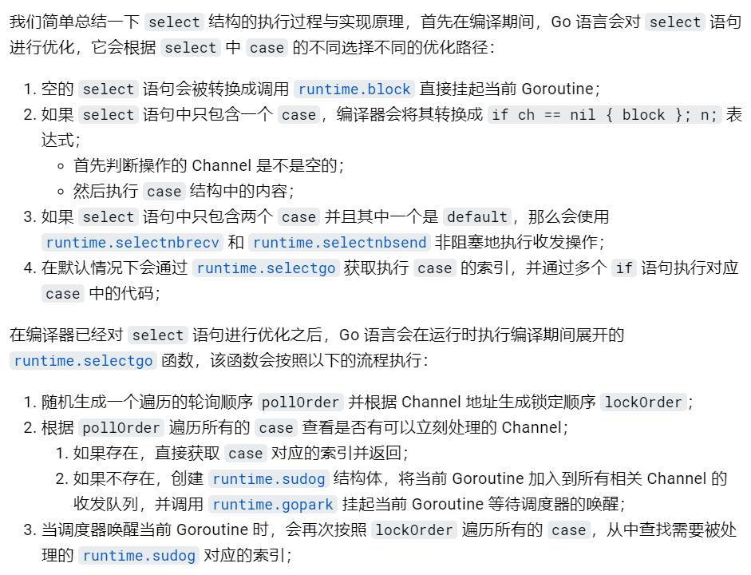

[(5条消息) 【我的架构师之路】- golang源码分析之select的底层实现_GavinXujiacan的博客-CSDN博客](https://blog.csdn.net/qq_25870633/article/details/83339538)

select的基本结构：**如果有default则不会阻塞，如过没有default则是阻塞调用，阻塞直到一个通道有事件为止**（关闭的chan的读操作是直接就绪的）

```go
select {
case <-ch1:
    // ...
case x := <-ch2:
    // ...use x...
case ch3 <- y:
    // ...
default:
    // ...
}
```


`time.Tick`函数返回一个channel，程序会周期性地像一个节拍器一样向这个channel发送事件。每一个事件的值是一个时间戳

但是如果不是整个程序都需要这个channel，可以使用`time.NewTicker`，通过 `time.NewTicker.C`转化为channel，用完之后使用`ticker.Stop()`将ticker的goroutine结束掉

```go
func main() {
	abort := make(chan struct{})
	go func() {
		os.Stdin.Read(make([]byte, 1)) // read a single byte
		abort <- struct{}{}
	}()

	fmt.Println("Commencing countdown.  Press return to abort.")
	ticker := time.NewTicker(1 * time.Second)
	for countdown := 10; countdown > 0; countdown-- {
		fmt.Println(countdown)
		select {
		case <-ticker.C:
			fmt.Println(countdown)
		case <-abort:
			fmt.Println("Launch aborted!")
			return
		}
	}
	fmt.Println("launch....")
}
```


**在for循环里，即使通道被关闭了，依然有机会被select**，通道读取的结果是通道的`零值`和`false`：

```go
const (
	fmtTime = "2006-01-02 15:04:05"
)

func main() {
	c1 := make(chan int, 2)
	c2 := make(chan int, 3)
	var wg sync.WaitGroup
	wg.Add(2)
  
	go func() {
		for i := 0; i < 2; i++ {
			c1 <- i
		}
		close(c1)
		wg.Done()
	}()
	go func() {
		for i := 0; i < 3; i++ {
			c2 <- i
		}
		close(c2)
		wg.Done()
	}()
	wg.Wait()
	
  for i := 0; i < 10; i++ {
		select {
		case x, ok := <-c1:
			fmt.Printf("%s : 从c1读取到 x=%v, ok=%v\n", time.Now().Format(fmtTime), x, ok)
			time.Sleep(500 * time.Millisecond)
		case x, ok := <-c2:
			fmt.Printf("%s : 从c2读取到 x=%v, ok=%v\n", time.Now().Format(fmtTime), x, ok)
			time.Sleep(500 * time.Millisecond)
		default:
			fmt.Printf("%s : 没有读取到信息。。。\n", time.Now().Format(fmtTime))
		}
	}
}

/*
2021-01-25 15:46:46 : 从c2读取到 x=0, ok=true
2021-01-25 15:46:46 : 从c2读取到 x=1, ok=true
2021-01-25 15:46:47 : 从c2读取到 x=2, ok=true
2021-01-25 15:46:47 : 从c1读取到 x=0, ok=true
2021-01-25 15:46:48 : 从c2读取到 x=0, ok=false
2021-01-25 15:46:48 : 从c1读取到 x=1, ok=true
2021-01-25 15:46:49 : 从c2读取到 x=0, ok=false
2021-01-25 15:46:49 : 从c1读取到 x=0, ok=false
2021-01-25 15:46:50 : 从c1读取到 x=0, ok=false
2021-01-25 15:46:50 : 从c1读取到 x=0, ok=false
*/
```


**nil值的channel：** 向nil的channel读或者写都会被永远阻塞，所以select一个nil的channel会永远都select不到，所以可以用来**禁用或者激活case**，例如想要修改上面的for循环，让通道关闭后就不再读取：

```go
	for i := 0; i < 10; i++ {
		select {
		case x, ok := <-c1:
			fmt.Printf("%s : 从c1读取到 x=%v, ok=%v\n", time.Now().Format(fmtTime), x, ok)
			if !ok {
				c1 = nil
			}
			time.Sleep(500 * time.Millisecond)
		case x, ok := <-c2:
			fmt.Printf("%s : 从c2读取到 x=%v, ok=%v\n", time.Now().Format(fmtTime), x, ok)
			if !ok {
				c2 = nil
			}
			time.Sleep(500 * time.Millisecond)
		default:
			fmt.Printf("%s : 没有读取到信息。。。\n", time.Now().Format(fmtTime))
		}
	}

/*
2021-01-25 15:52:06 : 从c2读取到 x=0, ok=true
2021-01-25 15:52:07 : 从c1读取到 x=0, ok=true
2021-01-25 15:52:07 : 从c2读取到 x=1, ok=true
2021-01-25 15:52:08 : 从c2读取到 x=2, ok=true
2021-01-25 15:52:08 : 从c2读取到 x=0, ok=false
2021-01-25 15:52:09 : 从c1读取到 x=1, ok=true
2021-01-25 15:52:09 : 从c1读取到 x=0, ok=false
2021-01-25 15:52:10 : 没有读取到信息。。。
2021-01-25 15:52:10 : 没有读取到信息。。。
2021-01-25 15:52:10 : 没有读取到信息。。。
*/

//如果没有default，则会出现 fatal error: all goroutines are asleep - deadlock!
```


为了避免死锁，我们的for循环条件可以修改为：`for ok1 || ok2 {...}`


### goroutine并发的退出

go语言并没有提供在一个goroutine中终止另一个goroutine的方法，因为这样会导致goroutine之间的共享变量落在为定义的状态上


### 优雅关闭channel

不要从reveiver侧关闭channel（导致发送者panic）

不要在有多个sender的时候关闭channel（同上）

使用sync.Once确保只关闭一次（多次关闭会直接panic）


1. 如果是1个sender：直接sender端关闭
2. 如果多个sender，1个receiver：增加一个传递关闭信号的channel，receiver通过信号channel下达关闭channel的指令，senders监听到关闭信号后停止发送数据。下面代码中sender也没有明确关闭，因为channel会被gc回收的。或者可以使用`context`，也可以达到同样的效果

```go
func main() {
    rand.Seed(time.Now().UnixNano())
    const Max = 100000
    const NumSenders = 1000
    dataCh := make(chan int, 100)
    stopCh := make(chan struct{})
    // senders
    for i := 0; i < NumSenders; i++ {
        go func() {
            for {
                select {
                case <- stopCh:
                    return
                case dataCh <- rand.Intn(Max):
                }
            }
        }()
    }
    // the receiver
    go func() {
        for value := range dataCh {
            if value == Max-1 {
                fmt.Println("send stop signal to senders.")
                close(stopCh)
                return
            }
            fmt.Println(value)
        }
    }()
    select {
    case <- time.After(time.Hour):
    }
}
```


3. 多个sender，多个receiver：如果采用2一样的方案，关闭stopCh也会产生重复关闭，导致panic。因此需要一个中间人。当M个receiver都向它发送dataCh的请求，中间人收到后下达关闭dataCh的指令

```go
func main() {
    rand.Seed(time.Now().UnixNano())
    const Max = 100000
    const NumReceivers = 10
    const NumSenders = 1000
    dataCh := make(chan int, 100)
    stopCh := make(chan struct{})
    // It must be a buffered channel.
    toStop := make(chan string, 1)
    var stoppedBy string
    // moderator
    go func() {
        stoppedBy = <-toStop
        close(stopCh)
    }()
    // senders
    for i := 0; i < NumSenders; i++ {
        go func(id string) {
            for {
                value := rand.Intn(Max)
                if value == 0 {
                    select {
                    case toStop <- "sender#" + id:
                    default:
                    }
                    return
                }
                select {
                case <- stopCh:
                    return
                case dataCh <- value:
                }
            }
        }(strconv.Itoa(i))
    }
    // receivers
    for i := 0; i < NumReceivers; i++ {
        go func(id string) {
            for {
                select {
                case <- stopCh:
                    return
                case value := <-dataCh:
                    if value == Max-1 {
                        select {
                        case toStop <- "receiver#" + id:
                        default:
                        }
                        return
                    }
                    fmt.Println(value)
                }
            }
        }(strconv.Itoa(i))
    }
    select {
    case <- time.After(time.Hour):
    }
}
```


### Channel的数据结构

```go
type hchan struct {
   qcount   uint           // 元素数量
   dataqsiz uint           // 底层环形数组的长度
   buf      unsafe.Pointer // 指向环形数组的指针，只针对有缓冲的channel
   elemsize uint16	// 元素大小
   closed   uint32	// 是否关闭
   elemtype *_type 	// 元素类型
   sendx    uint   		   // 已发送元素索引
   recvx    uint   		   // 已接收元素索引
   recvq    waitq  		   // 等待接收的goroutine队列
   sendq    waitq  		   // 接待发送的goroutine队列
   lock mutex		// 保护字段的锁
}

// waitq 是一个双向链表，sudog实际是goroutine的一个封装
type waitq struct {
    first *sudog
    last  *sudog
}
```

例如创建一个容量6的元素类型int的channel，结构如下：


### channel发送和接收

channel 的发送和接收操作本质上都是 “**值的拷贝**”，无论是从 sender goroutine 的栈到 chan buf，还是从 chan buf 到 receiver goroutine，或者是直接从 sender goroutine 到 receiver goroutine。

```go
type user struct {
    name string
    age int8
}
var u = user{name: "Ankur", age: 25}
var g = &u
func modifyUser(pu *user) {
    fmt.Println("modifyUser Received Vaule", pu)
    pu.name = "Anand"
}
func printUser(u <-chan *user) {
    time.Sleep(2 * time.Second)
    fmt.Println("printUser goRoutine called", <-u)
}
func main() {
    c := make(chan *user, 5)
    c <- g
    fmt.Println(g)
    // modify g
    g = &user{name: "Ankur Anand", age: 100}
    go printUser(c)
    go modifyUser(g)
    time.Sleep(5 * time.Second)
    fmt.Println(g)
}


/*
&{Ankur 25}
modifyUser Received Vaule &{Ankur Anand 100}
printUser goRoutine called &{Ankur 25}
&{Anand 100}
*/
```

一开始构造一个结构体 u，地址是 0x56420，图中地址上方就是它的内容。接着把 `&u` 赋值给指针 `g`，g 的地址是 0x565bb0，它的内容就是一个地址，指向 u。

main 程序里，先把 g 发送到 c，根据 `copy value` 的本质，进入到 chan buf 里的就是 `0x56420`，它是指针 g 的值（不是它指向的内容），所以打印从 channel 接收到的元素时，它就是 `&{Ankur 25}`。因此，这里并不是将指针 g “发送” 到了 channel 里，只是拷贝它的值而已。


向channel发送：

- 如果检测到 channel 是nil的，当前 goroutine 会被挂起。
- 对于不阻塞的发送操作，如果 channel 未关闭并且没有多余的缓冲空间（说明：a. channel 是非缓冲型的，且等待接收队列里没有 goroutine；b. channel 是缓冲型的，但循环数组已经装满了元素）


### channel关闭的过程

```go
func closechan(c *hchan) {
    // 关闭一个 nil channel，panic
    if c == nil {
        panic(plainError("close of nil channel"))
    }
    // 上锁
    lock(&c.lock)
    // 如果 channel 已经关闭
    if c.closed != 0 {
        unlock(&c.lock)
        // panic，不能重复关闭channel
        panic(plainError("close of closed channel"))
    }
    // …………
    // 修改关闭状态
    c.closed = 1
    var glist *g
    // 将 channel 所有等待接收队列的里 sudog 释放
    for {
        // 从接收队列里出队一个 sudog
        sg := c.recvq.dequeue()
        if sg == nil {
            break
        }
        // 如果 elem 不为空，说明此 receiver 未忽略接收数据
        // 给它赋一个相应类型的零值
        if sg.elem != nil {
            typedmemclr(c.elemtype, sg.elem)
            sg.elem = nil
        }
        if sg.releasetime != 0 {
            sg.releasetime = cputicks()
        }
        // 取出 goroutine
        gp := sg.g
        gp.param = nil
        if raceenabled {
            raceacquireg(gp, unsafe.Pointer(c))
        }
        // 相连，形成链表，下面会进行统一唤醒
        gp.schedlink.set(glist)
        glist = gp
    }
    
    // 将 channel 等待发送队列里的 sudog 释放
    // 如果存在，这些 goroutine 之后将会 panic
    for {
        // 从等待发送的队列里出队一个 sudog
        sg := c.sendq.dequeue()
        if sg == nil {
            break
        }
        // 发送者会 panic
        sg.elem = nil
        if sg.releasetime != 0 {
            sg.releasetime = cputicks()
        }
        gp := sg.g
        gp.param = nil
        if raceenabled {
            raceacquireg(gp, unsafe.Pointer(c))
        }
        // 形成链表
        gp.schedlink.set(glist)
        glist = gp
    }
    // 解锁
    unlock(&c.lock)
    // 遍历链表，唤醒所有 等待 的 g
    for glist != nil {
        // 取最后一个
        gp := glist
        // 向前走一步，下一个唤醒的 g
        glist = glist.schedlink.ptr()
        gp.schedlink = 0
        // 唤醒相应 goroutine
        goready(gp, 3)
    }
}
```

close 逻辑比较简单，对于一个 channel，recvq 和 sendq 中分别保存了阻塞的发送者和接收者。关闭 channel 后，会**设置关闭的标志位**，**唤醒那些等待着的goroutine**，对于**等待接收者**而言，会收到一个相应类型的**零值**。对于**等待发送者，会直接 panic**。所以，在不了解 channel 还有没有接收者的情况下，不能贸然关闭 channel。

```go
func chansend(c *hchan, ep unsafe.Pointer, block bool, callerpc uintptr) bool {
        //  ...
        // 当 channel close 之后， send 会直接 panic
        if c.closed != 0 {
            unlock(&c.lock)
            panic(plainError("send on closed channel"))
        }
        //  ...
}
```

close 函数先上一把大锁，接着把所有挂在这个 channel 上的 sender 和 receiver 全都连成一个 sudog 链表，再解锁。最后，再将所有的 sudog 全都唤醒。

唤醒之后，该干嘛干嘛。sender 会继续执行 chansend 函数里 goparkunlock 函数之后的代码，很不幸，检测到 channel 已经关闭了，panic。receiver 则比较幸运，进行一些扫尾工作后，返回。这里，selected 返回 true，而返回值 received 则要根据 channel 是否关闭，返回不同的值。如果 channel 关闭，received 为 false，否则为 true。这我们分析的这种情况下，received 返回 false。


## 3. goroutine调度

半抢占式：当前goroutine发生阻塞时才会导致调度

发生在用户态：切换代价小


# 八、 基于共享变量的并发

一个提供对一个指定的变量通过channel来请求的goroutine叫做这个变量的monitor（监控）goroutine


## 1. sync.Mutex互斥锁

首先我们可以用缓存大小为1的 channel 来实现互斥锁：

```go
var (
    sema    = make(chan struct{}, 1) // a binary semaphore guarding balance
    balance int
)

func Deposit(amount int) {  //存款
    sema <- struct{}{} // acquire token
    balance = balance + amount
    <-sema // release token
}

func Balance() int {  //查询
    sema <- struct{}{} // acquire token
    b := balance
    <-sema // release token
    return b
}
```


**sync包中的Mutex类型直接支持这个操作：** 通过 `Mutex.Lock()` 和 `Mutex.Unlock()` 函数进行加锁和解锁，获取锁失败的goroutine会被阻塞，直到锁可用

**go里没有重入锁**

```go
var (
    mu      sync.Mutex // guards balance
    balance int
)

func Deposit(amount int) {
    mu.Lock()
	  defer mu.Unlock()
    balance = balance + amount
}

func Balance() int {
    mu.Lock()
 		defer mu.Unlock()
    b := balance
    return b
}
```

```go
type Mutex struct {
	state int32
	sema  uint32
}
```

lock：

1. 如果互斥锁处于初始化状态，会通过置位 `mutexLocked` 加锁；
2. 如果互斥锁处于 `mutexLocked` 状态并且在普通模式下工作，会进入自旋，执行 30 次 `PAUSE` 指令消耗 CPU 时间等待锁的释放；
3. 如果当前 Goroutine 等待锁的时间超过了 1ms，互斥锁就会切换到饥饿模式；
4. 互斥锁在正常情况下会通过 [`runtime.sync_runtime_SemacquireMutex`](https://draveness.me/golang/tree/runtime.sync_runtime_SemacquireMutex) 将尝试获取锁的 Goroutine 切换至休眠状态，等待锁的持有者唤醒；
5. 如果当前 Goroutine 是互斥锁上的最后一个等待的协程或者等待的时间小于 1ms，那么它会将互斥锁切换回正常模式；

unlock：

1. 当互斥锁已经被解锁时，调用 [`sync.Mutex.Unlock`](https://draveness.me/golang/tree/sync.Mutex.Unlock) 会直接抛出异常；
2. 当互斥锁处于饥饿模式时，将锁的所有权交给队列中的下一个等待者，等待者会负责设置 `mutexLocked` 标志位；
3. 当互斥锁处于普通模式时，如果没有 Goroutine 等待锁的释放或者已经有被唤醒的 Goroutine 获得了锁，会直接返回；在其他情况下会通过 [`sync.runtime_Semrelease`](https://draveness.me/golang/tree/sync.runtime_Semrelease) 唤醒对应的 Goroutine；


## 2. sync.RWMutex读写锁

允许多个读操作并发执行，但是写操作完全互斥，`RLock()`, `RUnlock()`获取和释放共享锁，

```go
var mu sync.RWMutex
var balance int
func Balance() int {
    mu.RLock() // readers lock
    defer mu.RUnlock()
    return balance
}
```


```go
type RWMutex struct {
	w           Mutex
	writerSem   uint32
	readerSem   uint32
	readerCount int32
	readerWait  int32    //当前写操作阻塞时前面的读操作数
}
```


**写锁**：

当资源的使用者想要获取写锁时，需要调用 [``sync.RWMutex.Lock``](https://draveness.me/golang/tree/sync.RWMutex.Lock) 方法：

```go
func (rw *RWMutex) Lock() {
	rw.w.Lock()
	r := atomic.AddInt32(&rw.readerCount, -rwmutexMaxReaders) + rwmutexMaxReaders
	if r != 0 && atomic.AddInt32(&rw.readerWait, r) != 0 {
		runtime_SemacquireMutex(&rw.writerSem, false, 0)
	}
}
```

1. 调用结构体持有的`sync.Mutex`结构体的`sync.Mutex.Lock`阻塞后续的写操作；
   - 因为互斥锁已经被获取，其他 Goroutine 在获取写锁时会进入自旋或者休眠；
2. 调用 [sync/atomic.AddInt32](https://draveness.me/golang/tree/sync/atomic.AddInt32) 函数阻塞后续的读操作：
3. 如果仍然有其他 Goroutine 持有互斥锁的读锁，该 Goroutine 会调用 [runtime.sync_runtime_SemacquireMutex](https://draveness.me/golang/tree/runtime.sync_runtime_SemacquireMutex) 进入休眠状态等待所有读锁所有者执行结束后释放 `writerSem` 信号量将当前协程唤醒；

写锁的释放会调用 [sync.RWMutex.Unlock](https://draveness.me/golang/tree/sync.RWMutex.Unlock)：

```go
func (rw *RWMutex) Unlock() {
	r := atomic.AddInt32(&rw.readerCount, rwmutexMaxReaders)
	if r >= rwmutexMaxReaders {
		throw("sync: Unlock of unlocked RWMutex")
	}
	for i := 0; i < int(r); i++ {
		runtime_Semrelease(&rw.readerSem, false, 0)
	}
	rw.w.Unlock()
}
```

与加锁的过程正好相反，写锁的释放分以下几个执行：

1. 调用 [sync/atomic.AddInt32](https://draveness.me/golang/tree/sync/atomic.AddInt32) 函数将 `readerCount` 变回正数，释放读锁；
2. 通过 for 循环释放所有因为获取读锁而陷入等待的 Goroutine：
3. 调用 [sync.Mutex.Unlock](https://draveness.me/golang/tree/sync.Mutex.Unlock) 释放写锁；

获取写锁时会先阻塞写锁的获取，后阻塞读锁的获取，这种策略能够保证读操作不会被连续的写操作『饿死』。


**读锁** ：

读锁的加锁方法 [sync.RWMutex.RLock](https://draveness.me/golang/tree/sync.RWMutex.RLock) 很简单，该方法会通过 [sync/atomic.AddInt32](https://draveness.me/golang/tree/sync/atomic.AddInt32) 将 `readerCount` 加一：

```go
func (rw *RWMutex) RLock() {
	if atomic.AddInt32(&rw.readerCount, 1) < 0 {
		runtime_SemacquireMutex(&rw.readerSem, false, 0)
	}
}
```

1. 如果该方法返回负数 — 其他 Goroutine 获得了写锁，当前 Goroutine 就会调用 [runtime.sync_runtime_SemacquireMutex](https://draveness.me/golang/tree/runtime.sync_runtime_SemacquireMutex) 陷入休眠等待锁的释放；
2. 如果该方法的结果为非负数 — 没有 Goroutine 获得写锁，当前方法会成功返回；

当 Goroutine 想要释放读锁时，会调用如下所示的 [sync.RWMutex.RUnlock](https://draveness.me/golang/tree/sync.RWMutex.RUnlock) 方法：

```go
func (rw *RWMutex) RUnlock() {
	if r := atomic.AddInt32(&rw.readerCount, -1); r < 0 {
		rw.rUnlockSlow(r)
	}
}
```


该方法会先减少正在读资源的 `readerCount` 整数，根据 [sync/atomic.AddInt32](https://draveness.me/golang/tree/sync/atomic.AddInt32) 的返回值不同会分别进行处理：

- 如果返回值大于等于零 — 读锁直接解锁成功；
- 如果返回值小于零 — 有一个正在执行的写操作，在这时会调用[sync.RWMutex.rUnlockSlow](https://draveness.me/golang/tree/sync.RWMutex.rUnlockSlow) 方法；

```go
func (rw *RWMutex) rUnlockSlow(r int32) {
	if r+1 == 0 || r+1 == -rwmutexMaxReaders {
		throw("sync: RUnlock of unlocked RWMutex")
	}
	if atomic.AddInt32(&rw.readerWait, -1) == 0 {
		runtime_Semrelease(&rw.writerSem, false, 1)
	}
}
```

[sync.RWMutex.rUnlockSlow](https://draveness.me/golang/tree/sync.RWMutex.rUnlockSlow) 会减少获取锁的写操作等待的读操作数 `readerWait` 并在所有读操作都被释放之后触发写操作的信号量 `writerSem`，该信号量被触发时，调度器就会唤醒尝试获取写锁的 Goroutine。


自己实现的读写锁：

```go
type RWLock struct {
	m sync.Mutex
	readChan chan struct{}
	writeChan chan struct{}
	readerCount int32
	readerToWait int32
}

func (l *RWLock) WLock() {
	l.m.Lock()
	r := atomic.AddInt32(&l.readerCount, -math.MaxInt32) + math.MaxInt32
	if r != 0 && atomic.AddInt32(&l.readerToWait, r) != 0 {
		<- l.writeChan
	}
	return
}

func (l *RWLock) WUnLock() {
	r := atomic.AddInt32(&l.readerCount, math.MaxInt32)
	if r >= math.MaxInt32 {
		panic("unlock of unlocked RWLock")
	}
	for i := 0; i < int(r); i++ {
		l.readChan <- struct{}{}
	}
	l.m.Unlock()
	return
}

func (l *RWLock) RLock() {
	if atomic.AddInt32(&l.readerCount, 1) <= 0 {
		<- l.readChan
	}
	return
}

func (l *RWLock) RUnLock() {
	if r := atomic.AddInt32(&l.readerCount, -1); r <= 0 {
		if r + 1 == 0 || r + 1 == -math.MaxInt32 {
			panic("unlock of unlocked RWLock")
		}
		if atomic.AddInt32(&l.readerToWait, -1) == 0 {
			l.writeChan <- struct{}{}
		}
	}
}
```


## 3. sync.Once 惰性初始化

```go
var loadIconsOnce sync.Once
var icons map[string]image.Image
// Concurrency-safe.
func Icon(name string) image.Image {
    loadIconsOnce.Do(loadIcons)
    return icons[name]
}
```

保证只初始化一次

```go
type Once struct {
	done uint32
	m    Mutex
}

func (o *Once) Do(f func()) {
	if atomic.LoadUint32(&o.done) == 0 {
		o.doSlow(f)
	}
}

func (o *Once) doSlow(f func()) {
	o.m.Lock()
	defer o.m.Unlock()
	if o.done == 0 {
		defer atomic.StoreUint32(&o.done, 1)
		f()
	}
}
```


## 4. atomic原子操作

```go
atomic.AddInt64(&counter, 1)   //原子地对counter加1
```

强制同一时刻只能有一个goroutine运行并完成这个加法操作


`atomic.LoadInt64` 和 `atomic.StoreInt64` 两个函数提供了安全读写一个整型值的方式。这两者之间会互相同步，保证安全，不会进入竞争状态

```go
var (
   // shutdown is a flag to alert running goroutines to shutdown.
   shutdown int64

   // wg is used to wait for the program to finish.
   wg sync.WaitGroup
)

func main() {
   wg.Add(2)

   go doWork("A")
   go doWork("B")

   // Give the goroutines time to run.
   time.Sleep(1 * time.Second)

   // Safely flag it is time to shutdown.
   fmt.Println("Shutdown Now")
   atomic.StoreInt64(&shutdown, 1)

   // Wait for the goroutines to finish.
   wg.Wait()
}

// doWork simulates a goroutine performing work and
// checking the Shutdown flag to terminate early.
func doWork(name string) {
   defer wg.Done()

   for {
      fmt.Printf("Doing %s Work\n", name)
      time.Sleep(250 * time.Millisecond)

      // Do we need to shutdown.
      if atomic.LoadInt64(&shutdown) == 1 {
         fmt.Printf("Shutting %s Down\n", name)
         break
      }
   }
}
```


### 单例：sync.Once就基于atomic实现

```go
type Once struct {
	done uint32
	m    Mutex
}

func (o *Once) Do(f func()) {
	if atomic.LoadUint32(&o.done) == 0 {
		o.doSlow(f)
	}
}

func (o *Once) doSlow(f func()) {
	o.m.Lock()
	defer o.m.Unlock()
	if o.done == 0 {     // DLC
    //重要：必须要保证f执行完才能进行store，否则其他线程可能获取到没有初始化的对象
		defer atomic.StoreUint32(&o.done, 1)   
		f()
	}
}
```


## 5. 顺序一致性内存模型

```go
var a string
var done bool

func setup() {
  a = "hello"
  done = true
}

func main() {
  go setup()
  for !done {}
  fmt.Println(a)
}
```

并发的事件是无法确定发生顺序的。为了最大化并行，go编译器和处理器会在对语句/指令进行重排序，前提是保证 as-if-serial，保证 `happens before` 原则


## 6. happens-before

[Golang 并发编程核心—内存可见性](https://juejin.cn/post/6911126210340716558)

happens-before 是比 **指令重排、内存屏障**这些概念更上层的东西，是语言层面给我们的承诺。我们没有办法穷举在所有计算机架构下重排序会如何发生，也没办法为重排序定义该在什么时候插入屏障来阻止重排序、刷新 cache 的顺序，这个是无法做到的事情。

happens-before表示的是**前一个操作的结果对于后续操作是可见的**，它表达了**多个线程之间对于内存的可见性**，本质上是一种偏序关系，所以满足传递性

> 为什么要有happens-before原则：
>
> 如果Java、Go语言提供内存屏障操作，让开发者自己决定何时插入屏障，那么并发代码的开发将很难写，易出错(C就是)
>
> 对于编译器和CPU来说，这些内存屏障，优化屏障都是约束，让底层无法随心所欲进行优化，这些约束肯定越少越好

happens-before像是几条公理，只有我们开发的时候遵守这些规则，才能保证正确的语义，满足正确的可见性

Channel涉及到的happens-before规则有4跳，最多，Golang里面channel才是保证内存可见性、有序性、代码同步的第一选择：

1. `import package` 的时候，如果 package p 里面执行 `import q` ，那么逻辑顺序上 package q 的 init 函数执行先于 package p 后面执行任何其他代码。
2. `goroutine创建`：goroutine的创建函数本身 happens before 于 goroutine 内的第一行代码执行
3. `goroutine销毁`：goroutine 的 exit 事件并不保证先于所有的程序内的其他事件，或者说某个 goroutine exit 的结果并不保证对其他goroutine可见
4. `channel写入`：向channel写入 happens before 于对应元素的读取操作，无论有没有缓冲的channel
5. `channel关闭`：channel的关闭 happens before 于channel的接收(<-chan)的返回，也就是说channel一定是先关闭了，接收者才能收到关闭的通知
6. `无缓冲channel`：无缓冲channel的接收操作 happens before 发送操作。接收操作没有到来之前，发送操作肯定会被阻塞住，不会完成
7. `有缓冲channel`：缓冲长度为C的channel，第K个元素的接收先于第K+C个元素的发送
8. `锁`：针对任意 `sync.Mutex` 和 `sync.RWMutex` 的锁变量 L，第 n 次调用 `L.Unlock()` 逻辑先于（结果可见于）第 m 次调用 `L.Lock()` 操作 （n<m）。也就是下次加锁必须等待上次的锁释放
9. `读写锁`：针对 `sync.RWMutex` 类型的锁变量 L， `L.Unlock( )` 可见于 `L.Rlock( )` ，第 n 次的 `L.Rlock( )` 先于 第 n+1 次的 `L.Lock()`
10. `once`：`f( )` 函数执行先于 `once.Do(f)` 的返回。换句话说，`f( )` 必定先执行完，`once.Do(f)` 函数调用才能返回


# 九、测试

`go test`命令是一个按照一定的约定和组织来测试代码的程序。在包目录内，所有以`_test.go`为后缀名的源文件在执行go build时不会被构建成包的一部分，它们是go test测试的一部分

`*_test.go`文件中，有三种类型的函数：

- **测试函数**：以`Test`作为函数前缀名(之后必须紧跟**大写字母**)，函数必须接收`*testing.T`，并且不能有返回值，go test会调用这些测试函数，并报告结果为PASS或FAIL

```go
func TestDownload(t *testing.T) {
  ...
}
```


- **基准测试（benchmark）函数**：以Benchmark为函数前缀名，用于衡量一些函数的性能。go test会多次运行基准测试函数，计算平均时间
- **示例函数**

go test命令会遍历所有的`*_test.go`文件中符合上述命名规则的函数，生成一个**临时的main包**用于调用相应的测试函数，接着构建并运行、报告测试结果，最后清理测试中生成的临时文件


## 1. 单元测试

参数`-v`可用于打印**每个测试函数的名字和运行时间**

参数`-run`对应一个正则表达式，只有**测试函数名被它正确匹配的单元测试函数**才会被`go test`测试命令运行

参数`-cover` 展示测试用例对代码的覆盖率


表格驱动的测试案例：

```Go
func TestIsPalindrome(t *testing.T) {
    var tests = []struct {
        input string
        want  bool
    }{
        {"", true},
        {"a", true},
        {"A man, a plan, a canal: Panama", true},
        {"Evil I did dwell; lewd did I live.", true},
        {"Able was I ere I saw Elba", true},
        {"été", true},
        {"Et se resservir, ivresse reste.", true},
    }
    for _, test := range tests {
        if got := IsPalindrome(test.input); got != test.want {
            t.Errorf("IsPalindrome(%q) = %v", test.input, got)
        }
    }
}
```


`testing.T`结构拥有几个非常有用的函数：

- `Log` 将给定文本记录到错误日志，与fmt.Println 类似
- `Logf` 
- `Fail` 将测试函数标记为“已失败”，但允许测试函数继续执行
- `FailNow` 将测试函数标记为“已失败”，并且停止测试函数
- `Error = Log + Fail`，标记失败，继续执行。。。。Errorf = Logf + Fail
- `Fatal = Log + FailNow`，标记失败，立即结束。。。Fatalf = Logf + FailNow


**跳过测试用例**

`t.Skip()` 

```go
func TestEncode(t *testing.T) {
	t.Skip("Skipping encoding for now")
}
```


**并行方式运行测试**

`t.Parallel()`，，同时运行时命令`go test -v -parallel 3` 表示并行方式运行，最多3个任务并行

```go
func TestParallel_1(t *testing.T) {
  t.Parallel()    //三个测试任务并行
  time.Sleep(1 * time.Second)   //模拟需要耗时1秒的任务
}

func TestParallel_2(t *testing.T) {
  t.Parallel()
  time.Sleep(2 * time.Second)   //模拟需要耗时2秒的任务
}

func TestParallel_3(t *testing.T) {
  t.Parallel()
  time.Sleep(3 * time.Second)   //模拟需要耗时3秒的任务
}
```


## 2. 基准测试

基准测试也定义在 xxx_test.go 形式的文件中，基准测试的函数名为`BenchmarkXxxx(b *testing.B)`

测试程序要做的就是将被测试的代码执行 b.N 次，以便检测代码的响应时间，b.N的值是根据被执行代码而改变的，由Go自行决定

运行时的命令`go test -v -bench .` 其中 -bench 传入一个正则表达式用于匹配基准测试函数

```go
func BenchmarkDecode(b *testing.B) {
  for i := 0; i < b.N; i++ {
    decode("post.json") 
  }
}

func BenchmarkUnmarshal(b *testing.B) {
  for i := 0; i < b.N; i++ {
    unmarshal("post.json")
  }
}
```


同时该命令也会执行单元测试函数，如果想要忽略单元测试，只进行基准测试，可以指定 -run 的参数为一个不存在的正则模式，这样所有的功能测试函数都会被忽略

```shell
➜  unit_testing git:(master) ✗ go test -v -cover -run x -bench .     
goos: darwin
goarch: amd64
pkg: github.com/sausheong/gwp/Chapter_8_Testing_Web_Applications/unit_testing
BenchmarkDecode
BenchmarkDecode-8          55884             21660 ns/op
BenchmarkUnmarshal
BenchmarkUnmarshal-8       49724             25388 ns/op
PASS
coverage: 42.4% of statements
ok      github.com/sausheong/gwp/Chapter_8_Testing_Web_Applications/unit_testing        4.143s

```


# 十、接口和反射

```go
func TypeOf(i interface{}) Type {
	eface := *(*emptyInterface)(unsafe.Pointer(&i))
	return toType(eface.typ)
}


func ValueOf(i interface{}) Value {
	if i == nil {
		return Value{}
	}

	// TODO: Maybe allow contents of a Value to live on the stack.
	// For now we make the contents always escape to the heap. It
	// makes life easier in a few places (see chanrecv/mapassign
	// comment below).
	escapes(i)

	return unpackEface(i)
}

type Value struct {
	// typ holds the type of the value represented by a Value.
	typ *rtype
	ptr unsafe.Pointer
	flag
}

// emptyInterface is the header for an interface{} value.
type emptyInterface struct {
	typ  *rtype
	word unsafe.Pointer
}

// nonEmptyInterface is the header for an interface value with methods.
type nonEmptyInterface struct {
	// see ../runtime/iface.go:/Itab
	itab *struct {
		ityp *rtype // static interface type
		typ  *rtype // dynamic concrete type
		hash uint32 // copy of typ.hash
		_    [4]byte
		fun  [100000]unsafe.Pointer // method table
	}
	word unsafe.Pointer
}
```


```go
func (t *rtype) Field(i int) StructField {
	if t.Kind() != Struct {
		panic("reflect: Field of non-struct type " + t.String())
	}
	tt := (*structType)(unsafe.Pointer(t))
	return tt.Field(i)
}
```


程序在编译时，变量被转换为内存地址，变量名不会被编译器写入到可执行部分。在运行程序时，程序无法获取自身的信息

反射是指**在程序运行期间对程序本身进行访问和修改的能力**

支持反射的语言可以**在程序编译期**将变量的**反射信息**，如**字段名称、类型信息、结构体信息等**整合到可执行文件中，并给程序提供接口访问反射信息，这样就可以在程序运行期获取类型的反射信息，并且有能力修改它们

Go语言使用reflect包访问程序的反射信息

reflect包提供了两个重要的类型：`Type`和`Value`，任意接口值在反射中都可以理解为由 `reflect.Type` 和 `reflect.Value` 两部分组成。。reflect 包提供了 `reflect.TypeOf` 和 `reflect.ValueOf` 两个函数来获取任意对象的 Value 和 Type


## 1. unsafe.Pointer

指针类型的转换：

```go
func main() {
	var i *int
	p := 10
	i = &p

	m := (*float64)(i)
}

/*
cannot convert i (type *int) to type *float64
*/
```

正常我们进行指针类型转换的时候，不同的类型是不能转换的

unsafe.Pointer是一种特别定义的指针类型，可以包含任意类型变量的地址，是各个指针类型转换的桥梁，上述转换可以通过unsafe.Pointer实现：

```go
func main() {
	var i *int
	p := 10
	i = &p

	m := (*float64)(unsafe.Pointer(i))
}
```

> unsafe.Pointer指针转换的规则：
>
> - 安全指针可以显示转换为不安全指针，反之亦然
>
> - uintptr值可以显示转换为不安全指针，反之亦然


## 2. uintptr

uintptr是一个可以容纳任何指针类型的整形，可以进行指针运算

正常go的指针是不支持运算的，所以可以转换成uintptr进行指针运算，然后再转换为对应类型的指针

```go
type User struct {
	Name string
	Age int
}

func main() {
	u := new(User)
	name :=(*string)(unsafe.Pointer(u))
	*name = "test"

	age := (*int)(unsafe.Pointer(uintptr(unsafe.Pointer(u)) + unsafe.Offsetof(u.Age)))
	*age = 18
	fmt.Println(u)
}
```

思路：如果对Name和Age赋值，首先要拿到地址，然后对地址的内容进行修改

所以我们可以分别定义一个`string`和`int`的指针，分别指向这个实例的Name和Age字段的地址

u的首地址就是Name的地址，但是u是结构体指针，所以只需要将u转换成*string即可

对于age，我们已经拿到了Name的地址，在此基础上进行偏移即可，也就是`unsafe.Offsetof(u.Age)`的偏移量，但是`Pointer`不能进行指针运算，所以需要将`Pointer`转换成`uintptr`


## 3. interface{}、eface


`runtime.eface` (empty interface) ： 使用interface{}声明的都是empty interface，由于eface不包含方法，所以结构比较简单.

由于`interface{}`值包含了指向底层数据和类型的两个指针，所以任何类型都可以转换成`interafce{}`

```go
type eface struct {
	_type *_type
	data  unsafe.Pointer
}
```


`runtime._type`是go语言类型的运行时表示，包含了很多类型的元信息：例如类型的大小、哈希、对齐、种类等

```go
type _type struct {
	size       uintptr // 存储该type的value需要的空间大小
	ptrdata    uintptr 
	hash       uint32 // 类型的hash值，所有的type会存放在hashType表中，以hash为索引，帮助我们快速确定类型是否相等
	tflag      tflag 
	align      uint8 // 此类型type的对齐
	fieldalign uint8 // 这个type的结构体字段的对齐
	kind       uint8 // 类型编号 定义于runtime/typekind.go
	equal      func(unsafe.Pointer, unsafe.Pointer) bool  // 用于判断当前类型的多个对象是否相等

	gcdata    *byte
	str       nameOff // 类型名字的偏移
	ptrToThis typeOff
}
```


## 4. iface和接口转换

### iface


tab是接口表指针，指向类型信息，也就是接口的**动态类型**

data是数据指针，指向具体数据，也就是接口的**动态值**


`runtime.iface`(带函数的interface)：

```go
type iface struct {
	tab  *itab			// 接口类型的信息
	data unsafe.Pointer
}
```

`runtime.itab`中存放了接口类型的核心数据，每个itab都占32字节

```go
type itab struct {
	inter *interfacetype // interface的类型
	_type *_type // 同上的type
	hash  uint32 // 对_type中的hash的拷贝，用于快速判断接口和具体类型能否转换
	_     [4]byte
	fun   [1]uintptr //具体类型的实现接口的具体方法，fun在栈上偏移地址，因为fun都是指针，所以长度都是4个字节，找到fun的首地址后，每偏移4个地址便存储一个函数地址
}
```

`interfacetype`中存放了接口的相关信息

```go
type interfacetype struct {
	typ     _type
	pkgpath name // 包信息
	mhdr    []imethod // 原本接口的方法，method slice，这里是排序后的，方便检测 struct是否继承了 interface
}
```

`imethod`存放方法相关信息

```go
type imethod struct {
	name nameOff // 函数名字的偏移，这里是int32,后面查找的时候会根据这个数值，计算出偏移量， 存放在 firstmoduledata 这个符号表中
	ityp typeOff // type类型的偏移量，对应interface的_type
}
```


### 接口转换

由于iface包含了接口的类型 interfacetype 和实体类型的类型 _type。也就是说生成一个itab同时需要接口的类型和实体的类型

当判定一种类型是否满足某个接口时，go使用类型的方法集和接口所需要的方法集进行匹配，完全包含接口的方法集就认为实现了该接口

```go
r.tab = getitab(inter, tab._type, false)

func getitab(inter *interfacetype, typ *_type, canfail bool) *itab {
    // ……
    // 根据 inter, typ 计算出 hash 值
    h := itabhash(inter, typ)
    // look twice - once without lock, once with.
    // common case will be no lock contention.
    var m *itab
    var locked int
    for locked = 0; locked < 2; locked++ {
        if locked != 0 {
            lock(&ifaceLock)
        }
        // 遍历哈希表的一个 slot
        for m = (*itab)(atomic.Loadp(unsafe.Pointer(&hash[h]))); m != nil; m = m.link {
            // 如果在 hash 表中已经找到了 itab（inter 和 typ 指针都相同）
            if m.inter == inter && m._type == typ {
                // ……
                if locked != 0 {
                    unlock(&ifaceLock)
                }
                return m
            }
        }
    }
    // 在 hash 表中没有找到 itab，那么新生成一个 itab
    m = (*itab)(persistentalloc(unsafe.Sizeof(itab{})+uintptr(len(inter.mhdr)-1)*sys.PtrSize, 0, &memstats.other_sys))
    m.inter = inter
    m._type = typ
    // 添加到全局的 hash 表中
    additab(m, true, canfail)
    unlock(&ifaceLock)
    if m.bad {
        return nil
    }
    return m
}
```


getitab 函数会根据 `interfacetype` 和 `_type` 去全局的 itab 哈希表中查找，如果能找到，则直接返回；否则，会根据给定的 `interfacetype` 和 `_type` 新生成一个 `itab`，并插入到 itab 哈希表，这样下一次就可以直接拿到 `itab`

这里查找了两次，并且第二次上锁了，这是因为如果第一次没找到，在第二次仍然没有找到相应的 `itab` 的情况下，需要新生成一个，并且写入哈希表，因此需要加锁。这样，其他协程在查找相同的 `itab` 并且也没有找到时，第二次查找时，会被挂住，之后，就会查到第一个协程写入哈希表的 `itab`


## 5. reflect.Type

函数 reflect.TypeOf 接受 interface{} 类型，并以 `reflect.Type` 形式返回其 **动态类型**：

```Go
t := reflect.TypeOf(3)  // a reflect.Type
fmt.Println(t.String()) // "int"
fmt.Println(t)          // "int"
```

这里将3作为接口传递给TypeOf函数，即**将一个具体的值转为接口类型**，会有一个**隐式的接口转换**操作，它会创建一个包含两个信息的接口值：操作数的**动态类型**（这里是 int）和它的**动态的值**（这里是 3）

```go
    var a int
    typeOfA := reflect.TypeOf(a)
    fmt.Println(typeOfA.Name(), typeOfA.Kind())    //int  int
```


### 5.1 Kind和Name

reflect包定义的对象的**反射种类(Kind)**：系统的原生数据类型以及使用type关键字定义的类型

```go
const (
    Invalid Kind = iota  // 非法类型
    Bool                 // 布尔型
    Int                  // 有符号整型
    Int8                 // 有符号8位整型
    Int16                // 有符号16位整型
    Int32                // 有符号32位整型
    Int64                // 有符号64位整型
    Uint                 // 无符号整型
    Uint8                // 无符号8位整型
    Uint16               // 无符号16位整型
    Uint32               // 无符号32位整型
    Uint64               // 无符号64位整型
    Uintptr              // 指针
    Float32              // 单精度浮点数
    Float64              // 双精度浮点数
    Complex64            // 64位复数类型
    Complex128           // 128位复数类型
    Array                // 数组
    Chan                 // 通道
    Func                 // 函数
    Interface            // 接口
    Map                  // 映射
    Ptr                  // 指针
    Slice                // 切片
    String               // 字符串
    Struct               // 结构体
    UnsafePointer        // 底层指针
)
```

Map、Slice、Chan 属于引用类型，使用起来类似于指针，但是在种类常量定义中仍然属于独立的种类，不属于 Ptr。type A struct{} 定义的结构体属于 Struct 种类，*A 属于 Ptr。


获取对象名称和种类等信息：

```go
	m := mmmm{}
	typeOfm := reflect.TypeOf(m)
	fmt.Println(typeOfm.Name())       //mmmm 名称
	fmt.Println(typeOfm.Kind())				//struct 种类
	fmt.Println(typeOfm.String())     //main.mmmm

type Enum int
var Zero Enum = 0
    
	typeOfA := reflect.TypeOf(Zero)
  fmt.Println(typeOfA.Name(), typeOfA.Kind())  // Enum int
```


### 5.2 指针和Elem

对于指针获取反射对象时，可以通过`reflect.Elem()`获取**指针指向的元素的反射对象`reflect.Value`**，相当于于`*`操作

**指针变量的`Name`是空**

```go
	m2 := &mmmm{}
	typeOfm2 := reflect.TypeOf(m2)
	fmt.Println(typeOfm2.Name())    //指针变量的Name都是空
	fmt.Println(typeOfm2.Kind(), typeOfm2.String(), typeOfm2.Elem())  //ptr *main.mmmm main.mmmm
	
	typeOfm2Elem := typeOfm2.Elem()  //获取到指针指向元素的类型
	fmt.Println(typeOfm2Elem.Name(), typeOfm2Elem.Kind())   //mmmm struct
```


### 5.3 反射获取结构体成员类型

任意值通过 reflect.TypeOf() 获得反射对象信息后，如果它的类型是**结构体**，可以通过反射值对象 reflect.Type 的 `NumField()` 和 `Field()` 方法获得结构体成员的详细信息

StructField 的结构如下：

```go
type StructField struct {
    Name string          // 字段名
    PkgPath string       // 字段路径
    Type      Type       // 字段反射类型对象
    Tag       StructTag  // 字段的结构体标签
    Offset    uintptr    // 字段在结构体中的相对偏移
    Index     []int      // Type.FieldByIndex中的返回的索引值
    Anonymous bool       // 是否为匿名字段
}
```


- `Field(i int) StructField`	根据索引 i 返回索引对应的结构体字段的信息，当值不是结构体或索引超界时发生宕机
- `NumField() int`	返回结构体成员字段数量，当类型不是结构体时发生宕机
- `FieldByName(name string) (StructField, bool)`	根据给定字符串返回字符串对应的结构体字段的信息，没有找到时 bool 返回 false，当类型不是结构体或索引超界时发生宕机
- `FieldByIndex(index []int) StructField`	多层成员访问时，根据 []int 提供的每个结构体的字段索引，返回字段的信息，没有找到时返回零值。当类型不是结构体或索引超界时发生宕
- `FieldByNameFunc(match func(string) bool) (StructField,bool)`	根据匹配函数匹配需要的字段，当值不是结构体或索引超界时发生宕机

```go
	type cat struct {
		Name string
		// 带有结构体tag的字段
		Type int `json:"type" id:"100"`
	}
	mycat := cat{Name: "mimi", Type: 1}
	typeOfCat := reflect.TypeOf(mycat)
	// 遍历结构体所有成员
	for i := 0; i < typeOfCat.NumField(); i++ {
		fieldType := typeOfCat.Field(i)
		// 输出成员名和tag
		fmt.Printf("name: %v  tag: '%v'\n", fieldType.Name, fieldType.Tag)
	}
	// 通过字段名, 找到字段类型信息
	if catType, ok := typeOfCat.FieldByName("Type"); ok {
		// 从tag中取出需要的tag
		fmt.Println(catType.Tag.Get("json"), catType.Tag.Get("id"))
	}

/* 结果如下：
  name: Name  tag: ''
  name: Type  tag: 'json:"type" id:"100"'
  type 100
*/
```


### 5.4 reflect.Type是一个接口类型

```go
type Type interface {
        Align() int
        FieldAlign() int
        Method(int) Method
        MethodByName(string) (Method, bool)   //获取指定名字的method的引用
        NumMethod() int
        ...
        Implements(u Type) bool   //判断是否实现了某个接口
        ...
}
```


## 6. reflect.Value

- reflect.Value是一个**结构体类型**，这个结构体没有对外暴露的字段，但是提供了获取或者写入数据的方法

```go
type Value struct {
        // 包含过滤的或者未导出的字段
}

func (v Value) Addr() Value
func (v Value) Bool() bool
func (v Value) Bytes() []byte
```


因为 reflect.TypeOf 返回的是一个动态类型的接口值，它总是**返回具体的类型**。因此，下面的代码将打印 "*os.File" 而不是 "io.Writer"

同样的reflect.Valueof也接收任意的interface{}类型，返回状态其动态值的reflect.Value，也是具体的类型

reflect.Type 和 reflect.Value 都实现了 fmt.Stringer 接口，但是除非 Value 持有的是字符串，否则 String 方法只返回其类型。而使用 fmt 包的 %v 标志参数会对 reflect.Values 特殊处理

```Go
var w io.Writer = os.Stdout
fmt.Println(reflect.TypeOf(w)) // "*os.File"

v := reflect.ValueOf(3) // a reflect.Value
x := v.Interface()      // an interface{}
i := x.(int)            // an int  类型断言
fmt.Printf("%d\n", i)   // "3"
```

 **fmt.Printf 提供的 %T 参数，内部就是使用 reflect.TypeOf 来输出**

Type 和 Value 都有一个名为 Kind 的方法，它会返回一个常量，表示底层数据的类型，常见值有：Uint、Float64、Slice 等。

### 6.1 获取值

```go
    // 声明整型变量a并赋初值
    var a int = 1024
    // 获取变量a的反射值对象
    valueOfA := reflect.ValueOf(a)
    // 获取interface{}类型的值, 通过类型断言转换
    var getA int = valueOfA.Interface().(int)
    // 获取64位的值, 强制类型转换为int类型
    var getA2 int = int(valueOfA.Int())
    fmt.Println(getA, getA2)               // 1024 1024
```


### 6.2 修改数据

Value 类型也有一些类似于 Int、Float 的方法，用来提取底层的数据：

- Int 方法用来提取 int64
- Float 方法用来提取 float64

```go
    var x float64 = 3.4
    v := reflect.ValueOf(x)
    fmt.Println("type:", v.Type())		//type: float64
    fmt.Println("kind is float64:", v.Kind() == reflect.Float64)  //kind is float64: true
    fmt.Println("value:", v.Float())  //value: 3.4
```

还有一些用来修改数据的方法，比如 SetInt、SetFloat。。。但是需要有`“可修改性”（settability）`,

首先要求**可被寻址**(反射第三大法则)，其次必须是**导出的**

 Value 的 getter 和 setter 方法：为了保证 API 的精简，这两个方法操作的是某一组类型**范围最大的那个**。比如，处理任何含符号整型数，都使用 `int64`也就是说 Value 类型的 Int 方法返回值为 int64 类型，SetInt 方法接收的参数类型也是 int64 类型。实际使用时，可能需要转化为实际的类型

```go
    var x uint8 = 'x'
    v := reflect.ValueOf(x)
    fmt.Println("type:", v.Type())                            // uint8.
    fmt.Println("kind is uint8: ", v.Kind() == reflect.Uint8) // true.
    x = uint8(v.Uint())                                       // v.Uint returns a uint64.
```


### 6.3 修改结构体字段值

根据反射的第三法则，我们需要有结构体的指针，才可以修改它的字段

```go
    type T struct {
        A int
        B string
    }
    t := T{23, "skidoo"}
    s := reflect.ValueOf(&t).Elem()  // 获取指针指向元素类型的反射对象 reflect.Value
    typeOfT := s.Type()     // 获取指针指向元素类型的反射对象 reflect.Type
    for i := 0; i < s.NumField(); i++ {
        f := s.Field(i)
        fmt.Printf("%d: %s %s = %v\n", i,
            typeOfT.Field(i).Name, f.Type(), f.Interface())
    }

// 0: A int = 23
// 1: B string = skidoo
```

修改:

```go
    type T struct {
        A int
        B string
    }
    t := T{23, "skidoo"}
    s := reflect.ValueOf(&t).Elem()
    s.Field(0).SetInt(77)
    s.Field(1).SetString("Sunset Strip")
    fmt.Println("t is now", t)    // t is now {77 Sunset Strip}
```


## 7. 反射三大法则

 Go 语言反射的三大法则：

1. 从 `interface{}` 变量可以反射出反射对象；
2. 从反射对象可以获取 `interface{}` 变量；
3. 要修改反射对象，其值必须是可设置的；


### 7.1 反射可以将接口类型变量转换为反射类型对象

`reflect.TypeOf()` 和 `reflect.ValueOf()` 可以**将go语言的 interface{} 对象转化为反射对象**，他们的参数类型都是 interface{}。。所以这可能会进行隐式的类型转换。 如果我们认为 **Go 语言的类型** 和 **反射类型**处于两个不同的世界，那么这两个函数就是连接这两个世界的桥梁

```go
func TypeOf(i interface{}) Type     //接收一切 interface{},返回reflect.Type
func ValueOf(i interface{}) Value 
```


```go
func main() {
	author := "draven"
	fmt.Println("TypeOf author:", reflect.TypeOf(author))   //TypeOf author: string
	fmt.Println("ValueOf author:", reflect.ValueOf(author)) //ValueOf author: draven
}
```

有了变量的类型之后，我们可以通过 `Method` 方法获得类型实现的方法，通过 `Field` 获取类型包含的全部字段。对于不同的类型，我们也可以调用不同的方法获取相关信息：

- 结构体：获取字段的数量并通过下标和字段名获取字段 `StructField`；
- 哈希表：获取哈希表的 `Key` 类型；
- 函数或方法：获取入参和返回值的类型；
- …


### 7.2 反射可以将反射类型对象转换为接口类型变量

反射的第二法则是我们可以从反射对象可以获取 `interface{}` 变量。既然能够将接口类型的变量转换成反射对象，那么一定需要其他方法将反射对象还原成接口类型的变量， `reflect.Value.Interface`就能完成这项工作：

```go
func (v Value) Interface() interface{}    //返回interface{}
```


```go
v := reflect.ValueOf(1)
v.Interface().(int)   //通过类型断言，将 interface{} 类型转化为了 int 类型
```


**无论是接口值到反射对象还是反射对象到接口值，都是需要两次类型转换的**：

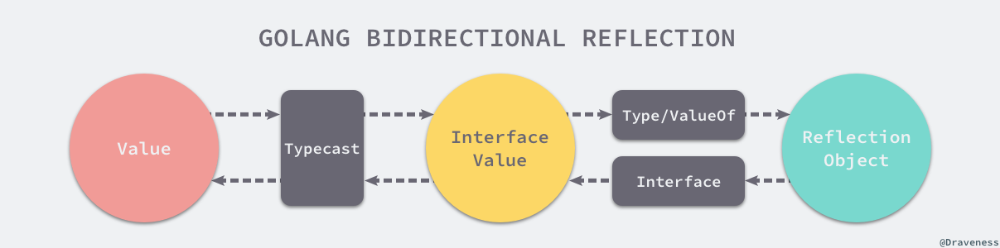

当然如果变量本身就是 `interface{}` 类型的，那么它不需要类型转换，因为类型转换这一过程一般都是隐式的，所以我不太需要关心它，**只有在我们需要将反射对象转换回基本类型时才需要显式的转换操作**


标准库中的 fmt.Println 和 fmt.Printf 等函数都接收空接口变量作为参数，**fmt 包内部会对接口变量进行拆包**，因此 fmt 包的打印函数在打印 reflect.Value 类型变量的数据时，只需要把 Interface 方法的结果传给格式化打印程序：

```go
	fmt.Println(v.Interface())
```


### 7.3 要修改反射类型对象，其值必须是可写的

最后一条法则是与值是否可以被更改有关，如果我们想要更新一个 `reflect.Value`，那么它持有的值一定是可以被更新的。可以通过 `CanSet()` 方法检查一个 `reflect.Value` 类型变量的可写性

```go
func main() {
	i := 1
	v := reflect.ValueOf(i)
  fmt.Println(v.CanSet())  // false
	v.SetInt(10)     //panic: reflect: reflect.flag.mustBeAssignable using unaddressable value
	fmt.Println(i)
}
```

由于go语言的函数调用都是**值传递**，`reflect.ValueOf` 函数的变量 i 实际上只是 i 的一个拷贝，而非i本身。**我们得到的反射对象和最开始的变量没有任何关系**，所以直接修改反射对象无法改变原始变量，程序为了防止错误就会崩溃

**要修改原变量只能使用如下的方法：**

```go
	i := 1
	v := reflect.ValueOf(&i) //调用 reflect.ValueOf       获取变量指针的反射对象
	elem := v.Elem()         //调用 reflect.Value.Elem    获取指针指向的变量
	elem.SetInt(10)          //调用 reflect.Value.SetInt  修改变量的值   ok， i=10
  elem.Set(reflect.ValueOf(20))    //ok, i = 20
  elem.Set(reflect.ValueOf("abc"))   //panic: string is not assignable to int
  
  //或者通过指针修改
	x := 2
	d := reflect.ValueOf(&x).Elem()   // d refers to the variable x
	px := d.Addr().Interface().(*int) // px := &x
	*px = 3                           // x = 3
```

## 8. 类型和值

Go 语言的 `interface{}` 类型在语言内部是通过 `reflect.emptyInterface` 结体表示的，其中的 `rtype` 字段用于表示变量的类型，另一个 `word` 字段指向内部封装的数据：

```go
type emptyInterface struct {
	typ  *rtype
	word unsafe.Pointer
}
```

用于获取变量类型的 `reflect.TypeOf` 函数将传入的变量隐式转换成 `reflect.emptyInterface`类型并获取其中存储的类型信息 `reflect.rtype`：

```go
func TypeOf(i interface{}) Type {
	eface := *(*emptyInterface)(unsafe.Pointer(&i))
	return toType(eface.typ)
}

func toType(t *rtype) Type {
	if t == nil {
		return nil
	}
	return t
} 
```

[Go语言interface实现原理详解 - jimshi - 博客园 (cnblogs.com)](https://www.cnblogs.com/shijingxiang/articles/12201984.html)

[Golang反射机制的实现分析——reflect.Type类型名称_方亮的专栏-CSDN博客](https://blog.csdn.net/breaksoftware/article/details/85995767)

## 9. 通过类型信息创建实例

当已知 reflect.Type 时，可以动态地创建这个类型的实例，实例的类型为指针。例如 reflect.Type 的类型为 int 时，创建 int 的指针，即`*int`

```go
    var a int

    // 取变量a的反射类型对象
    typeOfA := reflect.TypeOf(a)

		// 根据反射类型对象创建类型实例
    aIns := reflect.New(typeOfA)
    
		// 输出Value的类型和种类
    fmt.Println(aIns.Type(), aIns.Kind())     //*int  ptr
```


## 10. 通过反射调用函数

需要构建大量的 reflect.Value 和中间变量，检查参数，还要将参数复制到调用函数的参数内存中，调用完毕再将返回值转换为 reflect.Value ，性能非常差

```go
// 普通函数
func add(a, b int) int {
    return a + b
}

func main() {
    // 将函数包装为反射值对象
    funcValue := reflect.ValueOf(add)

  	// 构造函数参数, 传入两个整型值
    paramList := []reflect.Value{reflect.ValueOf(10), reflect.ValueOf(20)}
    
  	// 反射调用函数
    retList := funcValue.Call(paramList)
    
  	// 获取第一个返回值, 取整数值
    fmt.Println(retList[0].Int())
}
```


# 十一、标准库


## 1. log包

log.Println()  打印到标准日志记录器

log.Fatalln()  调用后会紧接着调用os.Exit(1)

log.Panicln() 调用后会紧接着调用panic()


## 2. json相关


**两种编码和解码方式：**

1. 编码
   `json.NewEncoder(<Writer>).encode(v)`    
   `json.Marshal(&v)`  返回字节切片 []byte ，为了让编码后的json更加易读，还可以使用 `MatshalIndent(&v, "", "\t")`   以更易读的方式解码，第一个字符串是指定前缀，后面一个字符串指定缩进符
2. 解码
   `json.NewDecoder(<Reader>).decode(&v)`     
   `json.Unmarshal([]byte, &v)`     需要传入字节切片


```go
type Person struct {
    Name string `json:"name"`
    Age int `json:"age"`
}

func main()  {
    // 1. 使用 json.Marshal 编码
    person1 := Person{"张三", 24}
    bytes1, err := json.Marshal(&person1)
    if err == nil {
        // 返回的是字节切片 []byte
        fmt.Println("json.Marshal 编码结果: ", string(bytes1))
    }

    // 2. 使用 json.Unmarshal 解码
    str := `{"name":"李四","age":25}`
    // json.Unmarshal 需要字节数组参数, 需要把字符串转为 []byte 类型
    bytes2 := []byte(str) // 字符串转换为字节切片
    var person2 Person    // 用来接收解码后的结果
    if json.Unmarshal(bytes2, &person2) == nil {
        fmt.Println("json.Unmarshal 解码结果: ", person2.Name, person2.Age)
    }

    // 3. 使用 json.NewEncoder 编码
    person3 := Person{"王五", 30}
    // 编码结果暂存到 buffer(为了变成 io.Writer)
    bytes3 := new(bytes.Buffer)
    err = json.NewEncoder(bytes3).Encode(person3)
    if err == nil {
        fmt.Print("json.NewEncoder 编码结果: ", string(bytes3.Bytes()))
    }

    // 4. 使用 json.NewDecoder 解码
    str4 := `{"name":"赵六","age":28}`
    var person4 Person
    // 创建一个 string reader 作为参数
    err = json.NewDecoder(strings.NewReader(str4)).Decode(&person4)
    if err == nil {
        fmt.Println("json.NewDecoder 解码结果: ", person4.Name, person4.Age)
    }
}

//json.Marshal 编码结果:  {"name":"张三","age":24}
//json.Unmarshal 解码结果:  李四 25
//json.NewEncoder 编码结果: {"name":"王五","age":30}
//json.NewDecoder 解码结果:  赵六 28
```


- 对于**json原生字符串**，**反序列化到对象**，需要使用 `json.Unmarshal()` 函数，同时，需要传入的是原生字符串的字节数组，需要进行转换

```go
type Cat struct {
	Color string `json:"color"`
	Name  string `json:"name"`
}

type CatGroup struct {
	Cats  []Cat  `json:"cats"`
	Owner string `json:"owner"`
}

func main() {
	catsOfXiaoming := `{
		"cats" : [
			{"color":"黄色","name":"小黄猫"},
			{"color":"花色","name":"小花猫"}
		],
		"owner" : "小明"
	}`
	var cg CatGroup

	err := json.Unmarshal([]byte(catsOfXiaoming), &cg)
	if err != nil {
		log.Fatal("解码失败")
	}
	fmt.Printf("%+v", cg)
}
```


- 对于实现了 `io.Reader` 接口的对象，可以直接使用 `json.NewDecoder()` 进行反序列化

```go
	catsOfXiaoming := `{
		"cats" : [
			{"color":"黄色","name":"小黄猫"},
			{"color":"花色","name":"小花猫"}
		],
		"owner" : "小明"
	}`
	var cg CatGroup
	
	json.NewDecoder(strings.NewReader(catsOfXiaoming)).Decode(&cg)
	fmt.Printf("%+v", cg)
```


## 3. io.Reader和io.Writer接口

```go
type Writer interface {
  Write(p []byte) (n int, err error)
}
```

**Write方法**

- 将字节切片p里的 **len(p) 字节**的数据写入到**底层数据流**
- 方法返回从p里**成功写入到底层数据流的字节数n (0<=n<=len(p)) **和可能的错误error
- **当n<len(p)时，必须返回一个非nil的error**

- 不管什么情况都**不能修改byte切片里的数据**


```go
type Reader interface {
  Read(p []byte) (n int, err error)
}
```

**Read方法**

- **最多读入len(p)字节的数据到切片p里**
- 方法返回**成功读入的字节数n (0<=n<=len(p))** 和可能的错误error
- 如果 n<len(p) ，Read会**立即返回可用的数据**，而不是等待更多的数据
- n>0时，遇到错误，或者读取完毕的时候，Read方法均会返回成功读入的字节数，**读取完毕返回EOF错误**
- 调用者在返回的n>0的时候，应该**先处理读入的数据，再处理err**，EOF也要这样处理
- 不要返回n=0的时候返回nil的错误,也就是说，没有读到数据的时候应该返回一个错误


**应用的案例**

`bytes.Buffer` 和 `os.File` 都实现了 `Writer` 和 `Reader` 接口

```go
func main() {
	// bytes.Buffer实现了io.Writer接口
	var b bytes.Buffer
	b.Write([]byte("Hello "))

	// 使用Fprintf将一个字符串拼接到buffer里
	fmt.Fprintf(&b, "World!")

	// 将buffer输出到标准输出
	b.WriteTo(os.Stdout)
}
```

几个函数的说明

```go
func (b *Buffer) Write(p []byte) (n int, err error) {
	b.lastRead = opInvalid
	m, ok := b.tryGrowByReslice(len(p))
	if !ok {
		m = b.grow(len(p))     //缓冲区会自动增大
	}
	return copy(b.buf[m:], p), nil   //追加写
}

func Fprintf(w io.Writer, format string, a ...interface{}) (n int, err error) {...}

func (b *Buffer) WriteTo(w io.Writer) (n int64, err error) {...}
```

关于 `os.Stdout`

```go
var (
	Stdin  = NewFile(uintptr(syscall.Stdin), "/dev/stdin")
	Stdout = NewFile(uintptr(syscall.Stdout), "/dev/stdout")   //就是一个文件
	Stderr = NewFile(uintptr(syscall.Stderr), "/dev/stderr")
)

func NewFile(fd uintptr, name string) *File {...}

func (f *File) Write(b []byte) (n int, err error) {  //File也实现了io.Writer接口
	if err := f.checkValid("write"); err != nil {
		return 0, err
	}
	n, e := f.write(b)
	if n < 0 {
		n = 0
	}
	if n != len(b) {
		err = io.ErrShortWrite
	}

	epipecheck(f, e)

	if e != nil {
		err = f.wrapErr("write", e)
	}

	return n, err
}
```


## 4. json和gob编解码

```go
type MyInfo struct {
	S       string
	I, J, K int
}

type MyReadWriter struct {
	Buf *bytes.Buffer
}

func (m MyReadWriter) Write(p []byte) (n int, err error) {
	return m.Buf.Write(p)
}

func (m MyReadWriter) Read(p []byte) (n int, err error) {
	return m.Buf.Read(p)
}

func main() {
	ms := MyInfo{
		S: "aabbccdd",
		I: 1000,
		J: 200,
		K: 10,
	}
	s := MyReadWriter{
		Buf: new(bytes.Buffer),
	}
	var enc = gob.NewEncoder(s.Buf)    //需要一个writer，将编码结果写入
	var dec = gob.NewDecoder(s.Buf)    //需要一个reader，读取解码信息
	if err := enc.Encode(&ms); err != nil {
		fmt.Println("encode error:", err)
	}
	fmt.Println("编码后：", s.Buf)
	var decMsg MyInfo
	dec.Decode(&decMsg)
	fmt.Println("解码得：", decMsg)

	var enc2 = json.NewEncoder(s.Buf)
	var dec2 = json.NewDecoder(s.Buf)
	if err := enc2.Encode(&ms); err != nil {
		fmt.Println("encode error:", err)
	}
	fmt.Println("编码后：", s.Buf)
	var decMsg2 MyInfo
	dec2.Decode(&decMsg2)
	fmt.Println("解码得：", decMsg2)
}
```


## 5. Context

`Context` 是一个接口，定义了 4 个方法，它们都是`幂等`的。也就是说连续多次调用同一个方法，得到的结果都是相同的。

```go
type Context interface {
    // 当 context 被取消或者到了 deadline，返回一个被关闭的 channel
    Done() <-chan struct{}
    // 在 channel Done 关闭后，返回 context 取消原因
    Err() error
    // 返回 context 是否会被取消以及自动取消时间（即 deadline）
    Deadline() (deadline time.Time, ok bool)
    // 获取 key 对应的 value
    Value(key interface{}) interface{}
}
```

- `Done()` 返回一个 channel，可以表示 context 被取消的信号：当这个 channel 被关闭时，说明 context 被取消了。注意，这是一个只读的channel。 我们又知道，读一个关闭的 channel 会读出相应类型的零值。并且源码里没有地方会向这个 channel 里面塞入值。换句话说，这是一个 `receive-only` 的 channel。因此在子协程里读这个 channel，除非被关闭，否则读不出来任何东西。也正是利用了这一点，子协程从 channel 里读出了值（零值）后，就可以做一些收尾工作，尽快退出。

- `Err()` 返回一个错误，表示 channel 被关闭的原因。例如是被取消，还是超时。

- `Deadline()` 返回 context 的截止时间，通过此时间，函数就可以决定是否进行接下来的操作，如果时间太短，就可以不往下做了，否则浪费系统资源。当然，也可以用这个 deadline 来设置一个 I/O 操作的超时时间。

- `Value()` 获取之前设置的 key 对应的 value。

### Context的作用

在 Go 的 server 里，通常每来一个请求都会启动若干个 goroutine 同时工作：有些去数据库拿数据，有些调用下游接口获取相关数据……


这些 goroutine 需要共享这个请求的基本数据，例如登陆的 token，处理请求的最大超时时间（如果超过此值再返回数据，请求方因为超时接收不到）等等。当请求被取消或是处理时间太长，这有可能是使用者关闭了浏览器或是已经超过了请求方规定的超时时间，请求方直接放弃了这次请求结果。这时，所有正在为这个请求工作的 goroutine 需要快速退出，因为它们的“工作成果”不再被需要了。在相关联的 goroutine 都退出后，系统就可以回收相关的资源。

context 包就是为了解决上面所说的这些问题而开发的：在 一组 goroutine 之间传递共享的值、取消信号、deadline……


**传递共享的数据：**

对于 Web 服务端开发，往往希望将一个请求处理的整个过程串起来，这就非常依赖于 Thread Local（对于 Go 可理解为单个协程所独有） 的变量，而在 Go 语言中并没有这个概念，因此需要在函数调用的时候传递 context。


**取消goroutine：**

如果需要实现“取消”功能，并且在不了解 context 功能的前提下，可能会这样做：给函数增加一个指针型的 bool 变量，在 for 语句的开始处判断 bool 变量是否由 true 变为 false，如果改变，则退出循环

上面给出的简单做法，可以实现想要的效果，没有问题，但是并不优雅，并且一旦协程数量多了之后，并且各种嵌套，就会很麻烦。优雅的做法，自然就要用到 context。

```go
func main(){
    ctx, cancel := context.WithTimeout(context.Background(), time.Hour)
    go Perform(ctx)
    // ……
    // app 端返回页面，调用cancel 函数
    cancel()
}

func Perform(ctx context.Context) {
    for {
        calculatePos()
        sendResult()
        select {
        case <-ctx.Done():
            // 被取消，直接返回
            return
        case <-time.After(time.Second):
            // block 1 秒钟 
        }
    }
}
```


### Context.Value的查找过程

通过层层传递 context，最终形成这样一棵树：


和链表有点像，只是它的方向相反：Context 指向它的父节点，链表则指向下一个节点。通过 WithValue 函数，可以创建层层的 valueCtx，存储 goroutine 间可以共享的变量。

取值的过程，实际上是一个递归查找的过程：

```go
func (c *valueCtx) Value(key interface{}) interface{} {
    if c.key == key {
        return c.val
    }
    return c.Context.Value(key)
}
```


# 十二、 IO

Go 基于 I/O multiplexing 和 goroutine scheduler 构建了一个简洁而高性能的原生网络模型(基于 Go 的 I/O 多路复用 `netpoller` )，提供了 `goroutine-per-connection` 这样简单的网络编程模式。在这种模式下，开发者 **使用的是同步的模式去编写异步的逻辑**，极大地降低了开发者编写网络应用时的负担，且借助于 Go runtime scheduler 对 goroutines 的高效调度，这个原生网络模型不论从适用性还是性能上都足以满足绝大部分的应用场景。

事实上 `Go netpoller` 底层就是基于 `epoll(Linux)`/kqueue(freeBSD)/iocp(Windows) 这些 I/O 多路复用技术来做封装的，最终暴露出 `goroutine-per-connection` 这样的极简的开发模式给使用者


IO多路复用：所谓 I/O 多路复用指的就是 `select/poll/epoll` 这一系列的多路选择器：支持 **单一线程同时监听多个文件描述符**（I/O 事件），阻塞等待，并在其中某个文件描述符可读写时收到通知。 I/O 复用其实复用的不是 I/O 连接，而是复用线程，让一个 thread of control 能够处理多个连接（I/O 事件）


## 1. 基本原理

> Go netpoller 通过在底层对 `epoll/kqueue/iocp` 的封装，从而实现了使用 **同步编程模式达到异步执行的效果**。
>
> 总结来说，所有的网络操作都以网络描述符 netFD 为中心实现。netFD 与底层 PollDesc 结构绑定
>
> 当在一个 netFD 上读写遇到 EAGAIN 错误时，就 **将当前 goroutine 存储到这个 netFD 对应的 PollDesc 中，同时调用 gopark 把当前 goroutine 给 park 住**，直到这个 netFD 上再次发生读写事件，才将此 goroutine 给 ready 激活重新运行。显然，在底层通知 goroutine 再次发生读写等事件的方式就是 epoll/kqueue/iocp 等事件驱动机制。


## 2. 数据结构

### netFD 和 poll.FD

```go
// Network file descriptor.
type netFD struct {
    pfd poll.FD

    // immutable until Close
    family      int
    sotype      int
    isConnected bool // handshake completed or use of association with peer
    net         string
    laddr       Addr  // 连接的两个地址
    raddr       Addr
}

// FD 是文件描述符的结构体
type FD struct {
    // Lock sysfd and serialize access to Read and Write methods.
    fdmu fdMutex

    // System file descriptor. Immutable until Close.
    Sysfd int

    // I/O poller.
    pd pollDesc

    // Writev cache.
    iovecs *[]syscall.Iovec

    // Semaphore signaled when file is closed.
    csema uint32

    // Non-zero if this file has been set to blocking mode.
    isBlocking uint32

    // Whether this is a streaming descriptor, as opposed to a
    // packet-based descriptor like a UDP socket. Immutable.
    IsStream bool

    // Whether a zero byte read indicates EOF. This is false for a
    // message based socket connection.
    ZeroReadIsEOF bool

    // Whether this is a file rather than a network socket.
    isFile bool
}
```


### pollDesc

pollDesc 是底层 **事件驱动** 的封装，`netFD` 通过它来完成各种IO相关的操作，定义如下：

```go
type pollDesc struct {
    runtimeCtx uintptr
}

// 具体定义在runtime.pollDesc
type pollDesc struct {
    link *pollDesc // in pollcache, protected by pollcache.lock

    // The lock protects pollOpen, pollSetDeadline, pollUnblock and deadlineimpl operations.
    // This fully covers seq, rt and wt variables. fd is constant throughout the PollDesc lifetime.
    // pollReset, pollWait, pollWaitCanceled and runtime·netpollready (IO readiness notification)
    // proceed w/o taking the lock. So closing, everr, rg, rd, wg and wd are manipulated
    // in a lock-free way by all operations.
    // NOTE(dvyukov): the following code uses uintptr to store *g (rg/wg),
    // that will blow up when GC starts moving objects.
    lock    mutex // protects the following fields
    fd      uintptr
    closing bool
    everr   bool    // marks event scanning error happened
    user    uint32  // user settable cookie
    rseq    uintptr // protects from stale read timers
    rg      uintptr // pdReady, pdWait, G waiting for read or nil
    rt      timer   // read deadline timer (set if rt.f != nil)
    rd      int64   // read deadline
    wseq    uintptr // protects from stale write timers
    wg      uintptr // pdReady, pdWait, G waiting for write or nil
    wt      timer   // write deadline timer
    wd      int64   // write deadline
}
```

其中 `rg` 和 `wg`，是两个万能指针，取值分别是 `pdReady, pdWait, 等待fd就绪的 g， nil 等`，他们是实现唤醒 goroutine 的关键

`runtime.pollDesc` 包含自身类型的指针 `link` ，用来保存下一个 runtime.pollDesc 的地址，实现链表

所有的 runtime.pollDesc 保存在 `runtime.pollCache` 结构体中，定义如下：

```go
type pollCache struct {
   lock  mutex
   first *pollDesc
   // PollDesc objects must be type-stable,
   // because we can get ready notification from epoll/kqueue
   // after the descriptor is closed/reused.
   // Stale notifications are detected using seq variable,
   // seq is incremented when deadlines are changed or descriptor is reused.
}
```

runtime.pollCache 是一个在 runtime 包中的全局变量，用于缓存

Go runtime 会在调用 `poll_runtime_pollOpen` 往 epoll 实例注册 fd 之时首次调用 `runtime.pollCache.alloc`方法时批量初始化大小 4KB 的 `runtime.pollDesc` 结构体的链表，初始化过程中会调用 `runtime.persistentalloc` 来为这些数据结构分配不会被 GC 回收的内存，确保这些数据结构只能被 `epoll`和`kqueue` 在内核空间去引用。

再往后每次调用这个方法则会先判断链表头是否已经分配过值了，若是，则直接返回表头这个 `pollDesc`，这种批量初始化数据进行缓存而后每次都直接从缓存取数据的方式是一种很常见的性能优化手段，在这里这种方式可以有效地提升 netpoller 的吞吐量。


## 3. 原理解析

[从源代码角度看epoll在Go中的使用（一）](https://segmentfault.com/a/1190000021812996)

[Go netpoller 原生网络模型之源码全面揭秘 - SegmentFault 思否](https://segmentfault.com/a/1190000038690758?utm_source=sf-similar-article)


### 阻塞

重点看以下 FD 的 read：

通过类似 `pollDesc.waitRead` 的 `pollDesc.waitWrite` 来 park 住 goroutine 直至期待的 I/O 事件发生才返回恢复执行

```go
func (fd *FD) Read(p []byte) (int, error) {
    if err := fd.readLock(); err != nil {
        return 0, err
    }
    defer fd.readUnlock()
    if len(p) == 0 {
        return 0, nil
    }
    if err := fd.pd.prepareRead(fd.isFile); err != nil {
        return 0, err
    }
    if fd.IsStream && len(p) > maxRW {
        p = p[:maxRW]
    }
    for {
        // 尝试从该 socket 读取数据，因为 socket 在被 listener accept 的时候设置成
        // 了非阻塞 I/O，所以这里同样也是直接返回，不管有没有可读的数据
        n, err := syscall.Read(fd.Sysfd, p)
        if err != nil {
            n = 0
            // err == syscall.EAGAIN 表示当前没有期待的 I/O 事件发生，也就是 socket 不可读
            if err == syscall.EAGAIN && fd.pd.pollable() {
                // 如果当前没有发生期待的 I/O 事件，那么 waitRead 
                // 会通过 park goroutine 让逻辑 block 在这里
                if err = fd.pd.waitRead(fd.isFile); err == nil {
                    continue
                }
            }

            // On MacOS we can see EINTR here if the user
            // pressed ^Z.  See issue #22838.
            if runtime.GOOS == "darwin" && err == syscall.EINTR {
                continue
            }
        }
        err = fd.eofError(n, err)
        return n, err
    }
}
```

`pollDesc.waitRead` 内部调用了 `poll.runtime_pollWait` --> `runtime.poll_runtime_pollWait` 来达成无 I/O 事件时 park 住 goroutine 的目的：

```go
func poll_runtime_pollWait(pd *pollDesc, mode int) int {
    ...
    // 进入 netpollblock 并且判断是否有期待的 I/O 事件发生，这里的 for 循环是为了一直等到 io ready
    for !netpollblock(pd, int32(mode), false) {
        err = netpollcheckerr(pd, int32(mode))
        if err != 0 {
            return err
        }
    }
    return 0
}

func netpollblock(pd *pollDesc, mode int32, waitio bool) bool {
    // gpp 保存的是 goroutine 的数据结构 g，这里会根据 mode 的值决定是 rg 还是 wg，
  // 前面提到过，rg 和 wg 是用来保存等待 I/O 就绪的 gorouine 的，后面调用 gopark 之后，
  // 会把当前的 goroutine 的抽象数据结构 g 存入 gpp 这个指针，也就是 rg 或者 wg
    gpp := &pd.rg
    if mode == 'w' {
        gpp = &pd.wg
    }

    // 这个 for 循环是为了等待 io ready 或者 io wait
    for {
        old := *gpp
        // gpp == pdReady 表示此时已有期待的 I/O 事件发生，
        // 可以直接返回 unblock 当前 goroutine 并执行响应的 I/O 操作
        if old == pdReady {
            *gpp = 0
            return true
        }
        if old != 0 {
            throw("runtime: double wait")
        }
        // 如果没有期待的 I/O 事件发生，则通过原子操作把 gpp 的值置为 pdWait 并退出 for 循环
        if atomic.Casuintptr(gpp, 0, pdWait) {
            break
        }
    }
    
    // waitio 此时是 false，netpollcheckerr 方法会检查当前 pollDesc 对应的 fd 是否是正常的，
    // 通常来说  netpollcheckerr(pd, mode) == 0 是成立的，所以这里会执行 gopark 
    // 把当前 goroutine 给 park 住，直至对应的 fd 上发生可读/可写或者其他『期待的』I/O 事件为止，
    // 然后 unpark 返回，在 gopark 内部会把当前 goroutine 的抽象数据结构 g 存入
    // gpp(pollDesc.rg/pollDesc.wg) 指针里，以便在后面的 netpoll 函数取出 pollDesc 之后，
    // 把 g 添加到链表里返回，接着重新调度 goroutine
    if waitio || netpollcheckerr(pd, mode) == 0 {
        // 注册 netpollblockcommit 回调给 gopark，在 gopark 内部会执行它，保存当前 goroutine 到 gpp
        gopark(netpollblockcommit, unsafe.Pointer(gpp), waitReasonIOWait, traceEvGoBlockNet, 5)
    }
    old := atomic.Xchguintptr(gpp, 0)
    if old > pdWait {
        throw("runtime: corrupted polldesc")
    }
    return old == pdReady
}
```


### 唤醒

> 首先，client 连接 server 的时候，listener 通过 accept 调用接收新 connection
>
> 每一个新 connection 都启动一个 goroutine 处理，accept 调用会把该 connection 的 fd 连带所在的 goroutine 上下文信息封装注册到 epoll 的监听列表里去
>
> 当 goroutine 调用 `conn.Read` 或者 `conn.Write` 等需要阻塞等待的函数时，会被 `gopark` 给封存起来并使之休眠，让 P 去执行本地调度队列里的下一个可执行的 goroutine
>
> 往后 Go scheduler 会在循环调度的 `runtime.schedule()` 函数以及 sysmon 监控线程中调用 `runtime.nepoll` 以获取可运行的 goroutine 列表并通过调用 injectglist 把剩下的 g 放入全局调度队列或者当前 P 本地调度队列去重新执行

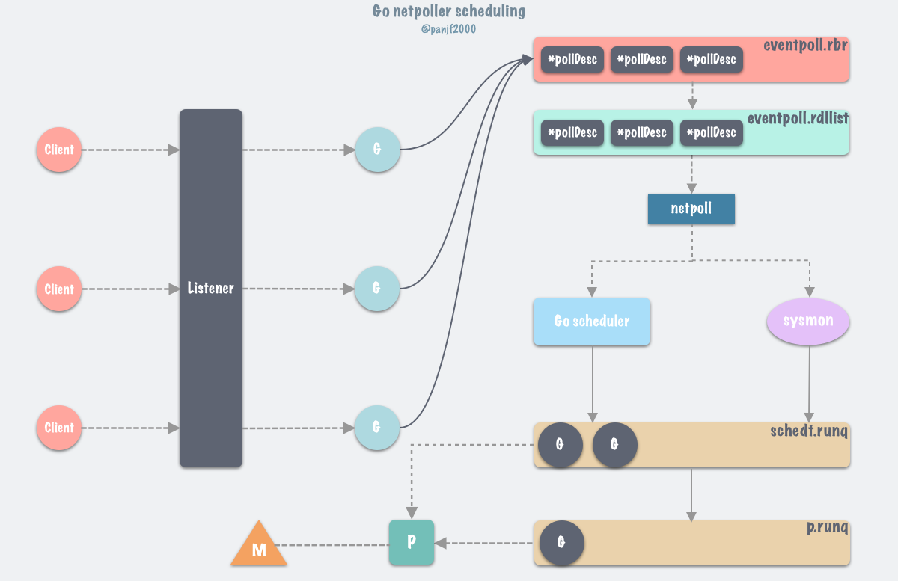


那么当 I/O 事件发生之后，netpoller 是通过什么方式唤醒那些在 I/O wait 的 goroutine 的？答案是通过 `runtime.netpoll`。

`runtime.netpoll` 的核心逻辑是：

1. 根据调用方的入参 delay，设置对应的调用 `epollwait` 的 timeout 值；
2. 调用 `epollwait` 等待发生了可读/可写事件的 fd；
3. 循环 `epollwait` 返回的事件列表，处理对应的事件类型， **组装可运行的 goroutine 链表并返回**。

接下来将就绪的 goroutine 通过调用 `injectglist` 加入到全局调度队列或者 P 的本地调度队列中，启动 M 绑定 P 去执行。

Go scheduler 的核心方法 `runtime.schedule()` 里会调用一个叫 `runtime.findrunable()` 的方法获取可运行的 goroutine 来执行，而在 `runtime.findrunable()` 方法里就调用了 `runtime.netpoll` 获取已就绪的 fd 列表对应的 goroutine 列表

```go
func netpoll(delay int64) gList {
    ...
retry:
    // epollwait 超时等待就绪的 fd 读写事件
    n := epollwait(epfd, &events[0], int32(len(events)), waitms)
    if n < 0 {
        ...
        goto retry
    }

    // toRun 是一个 g 的链表，存储要恢复的 goroutines，最后返回给调用方
    var toRun gList
    for i := int32(0); i < n; i++ {
        ev := &events[i]   // 拿到 events 数组
        ...

        // Go scheduler 在调用 findrunnable() 寻找 goroutine 去执行的时候，
        // 在调用 netpoll 之时会检查当前是否有其他线程同步阻塞在 netpoll，
        // 若是，则调用 netpollBreak 来唤醒那个线程，避免它长时间阻塞
        if *(**uintptr)(unsafe.Pointer(&ev.data)) == &netpollBreakRd {
            ...
            if delay != 0 {
                var tmp [16]byte
                read(int32(netpollBreakRd), noescape(unsafe.Pointer(&tmp[0])), int32(len(tmp)))
                atomic.Store(&netpollWakeSig, 0)
            }
            continue
        }

        // 判断发生的事件类型，读类型或者写类型等，然后给 mode 复制相应的值，
    	// mode 用来决定从 pollDesc 里的 rg 还是 wg 里取出 goroutine
        var mode int32
        if ev.events&(_EPOLLIN|_EPOLLRDHUP|_EPOLLHUP|_EPOLLERR) != 0 {
            mode += 'r'
        }
        if ev.events&(_EPOLLOUT|_EPOLLHUP|_EPOLLERR) != 0 {
            mode += 'w'
        }
        if mode != 0 {
            // 取出保存在 epollevent 里的 pollDesc
            pd := *(**pollDesc)(unsafe.Pointer(&ev.data))
            pd.everr = false
            if ev.events == _EPOLLERR {
                pd.everr = true
            }
            // 调用 netpollready，传入就绪 fd 的 pollDesc，
            // 把 fd 对应的 goroutine 添加到链表 toRun 中
            netpollready(&toRun, pd, mode)
        }
    }
    return toRun
}

// netpollready 调用 netpollunblock 返回就绪 fd 对应的 goroutine 的抽象数据结构 g
func netpollready(toRun *gList, pd *pollDesc, mode int32) {
    var rg, wg *g
    if mode == 'r' || mode == 'r'+'w' {
        rg = netpollunblock(pd, 'r', true)
    }
    if mode == 'w' || mode == 'r'+'w' {
        wg = netpollunblock(pd, 'w', true)
    }
    if rg != nil {
        toRun.push(rg)
    }
    if wg != nil {
        toRun.push(wg)
    }
}

// netpollunblock 会依据传入的 mode 决定从 pollDesc 的 rg 或者 wg 取出当时 gopark 之时存入的
// goroutine 抽象数据结构 g 并返回
func netpollunblock(pd *pollDesc, mode int32, ioready bool) *g {
    // mode == 'r' 代表当时 gopark 是为了等待读事件，而 mode == 'w' 则代表是等待写事件
    gpp := &pd.rg
    if mode == 'w' {
        gpp = &pd.wg
    }

    for {
        // 取出 gpp 存储的 g
        old := *gpp
        if old == pdReady {
            return nil
        }
        if old == 0 && !ioready {
            // Only set READY for ioready. runtime_pollWait
            // will check for timeout/cancel before waiting.
            return nil
        }
        var new uintptr
        if ioready {
            new = pdReady
        }
        // 重置 pollDesc 的 rg 或者 wg
        if atomic.Casuintptr(gpp, old, new) {
      // 如果该 goroutine 还是必须等待，则返回 nil
            if old == pdWait {
                old = 0
            }
            // 通过万能指针还原成 g 并返回
            return (*g)(unsafe.Pointer(old))
        }
    }
}

// netpollBreak 往通信管道里写入信号去唤醒 epollwait
func netpollBreak() {
    // 通过 CAS 避免重复的唤醒信号被写入管道，
    // 从而减少系统调用并节省一些系统资源
    if atomic.Cas(&netpollWakeSig, 0, 1) {
        for {
            var b byte
            n := write(netpollBreakWr, unsafe.Pointer(&b), 1)
            if n == 1 {
                break
            }
            if n == -_EINTR {
                continue
            }
            if n == -_EAGAIN {
                return
            }
            println("runtime: netpollBreak write failed with", -n)
            throw("runtime: netpollBreak write failed")
        }
    }
}
```


### 为什么 netpoll 一定要使用非阻塞IO

为了避免让操作网络 I/O 的 goroutine 陷入到系统调用从而进入内核态，因为一旦进入内核态，整个程序的控制权就会发生转移(到内核)，不再属于用户进程了，那么也就无法借助于 Go 强大的 runtime scheduler 来调度业务程序的并发了；而有了 netpoll 之后，借助于非阻塞 I/O ，G 就再也不会因为系统调用的读写而 (长时间) 陷入内核态，当 G 被阻塞在某个 network I/O 操作上时，实际上它不是因为陷入内核态被阻塞住了，而是被 Go runtime 调用 gopark 给 park 住了，此时 G 会被放置到某个 wait queue 中，而 M 会尝试运行下一个 `_Grunnable` 的 G，如果此时没有 `_Grunnable` 的 G 供 M 运行，那么 M 将解绑 P，并进入 sleep 状态。当 I/O available，在 epoll 的 `eventpoll.rdr` 中等待的 G 会被放到 `eventpoll.rdllist` 链表里并通过 `netpoll` 中的 `epoll_wait` 系统调用返回放置到全局调度队列或者 P 的本地调度队列，标记为 `_Grunnable` ，等待 P 绑定 M 恢复执行


# 十三、Go内存管理、GC

## 1. TCMalloc介绍

Golang的内存分配算法绝大部分都是来自 [TCMalloc](https://www.jianshu.com/p/11082b443ddf)，Golang只针对其中改动了一小部分。可以说TCMalloc就是Golang内存分配的框架。

Thread-Caching Malloc。是谷歌开发的内存分配器。具有现代化内存分配的基本特征：**对抗内存碎片、在多核处理器能够scale**

主要特点：内存分配快，多线程减少了锁机制(小对象没有锁，大对象自旋锁)，对小对象的处理空间效率更好

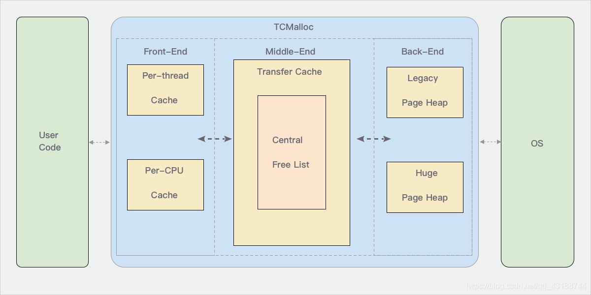

TCMalloc分为三层：Front-End, Middle-End, Back-End 层层递进，最后是OS

- 前端是一个高速缓存，为应用程序提供快速的内存分配和重新分配

- 中端负责重新填充前端缓存
- 后端处理从OS提取的内存


我们运行的程序首先向前端申请内存，前端内存缓存不足时，会向中端请求内存，中端内存不足时会想后端请求内存，后端也内存不足就会向OS申请内存

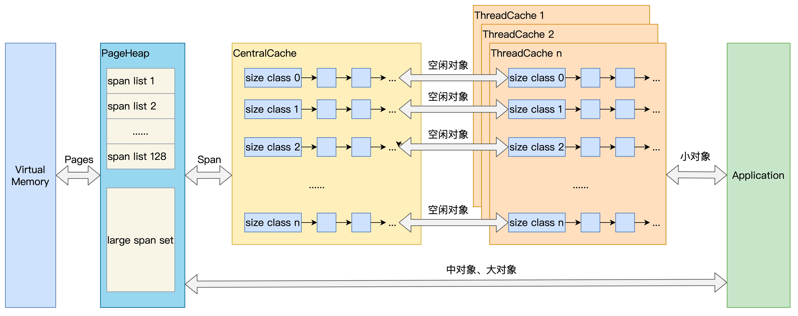

虚拟内存的概念引入后，让内存的并发访问问题的粒度从多进程级别，降低到多线程级别。TCMalloc**为每个线程预分配一块缓存，线程申请小内存时，可以从缓存分配内存**，这样有2个好处：

1. 为线程预分配缓存需要进行1次系统调用，后续线程申请小内存时，从缓存分配，都是在用户态执行，没有系统调用，**缩短了内存总体的分配和释放时间**
2. 多个线程同时申请小内存时，从各自的缓存分配，访问的是不同的地址空间，无需加锁，**把内存并发访问的粒度进一步降低了**。


### 1.1 一些基础概念

#### Page

操作系统对内存管理的单位，TCMalloc也会是以页为单位管理内存，但是TCMalloc中的Page大小是OS中Page的倍数。TCMalloc默认Page大小是8KB，而Linux是4KB。

TCMalloc并非只将堆内存看做是一个个的page，而是将整个虚拟内存空间都看做是page的集合。从内存地址0x0开始，每个page对应一个递增的PageID，如下图（以32位系统为例）：

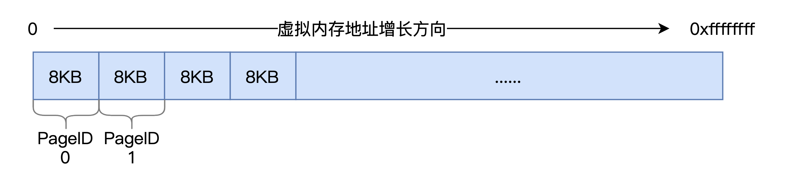

#### Span

Span是 PageHeap 中管理内存页的单位，由**连续的**一个或者多个Page组成，多个Span用链表进行管理

**TCMalloc 以 Span为单位向 OS 申请内存**

一个Span记录了起始page的 PageID，以及所包含的page数量

Span一般用来管理大对象(占多个Page)，或者已拆分为一系列小对象的一组Page (一个或多个Page被Size-Class拆分为固定大小的Object链表，如果Span管理的是小对象，会在Span中记录对象的Size-Class信息)

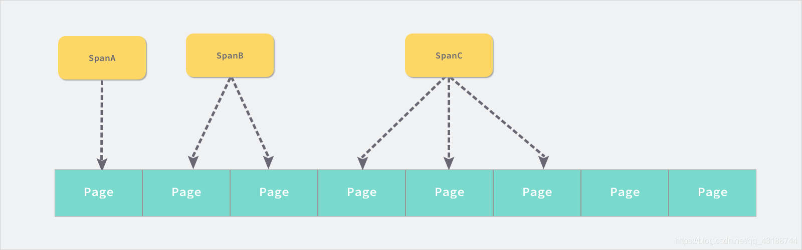

一个span可以处于三种状态：

- `IN_USE`：要么被拆分成小对象分配给了ThreadCache或CentralCache，要么分配给了应用程序。因为span是由PageHeap来管理的，因此即使只是分配给了CentralCache，还没有被应用程序所申请，在PageHeap看来，也是IN_USE了

- `ON_NORMAL_FREELIST`：空闲，但未归还给OS
- `ON_RETURNED_FREELIST`：空闲，span对应内存释放给OS了，虽然归还了，但是下次该虚拟地址依然可以访问，只是会导致 page fault


#### Size-Class

由Span分裂出的对象，由**同一个Span分裂出的SizeClass大小相同**，SizeClass是对象内存实际的载体

小对象被分配到大小不同的Size-Class上，例如一个12字节的对象会被四舍五入分配到16字节的Size-Class。

Size-Class的设计是为了在舍入到下一个最大的size时尽量减少内存浪费

每个Size-Class对应的 FreeList 链表中的Object大小相同，是由Span分割出来的

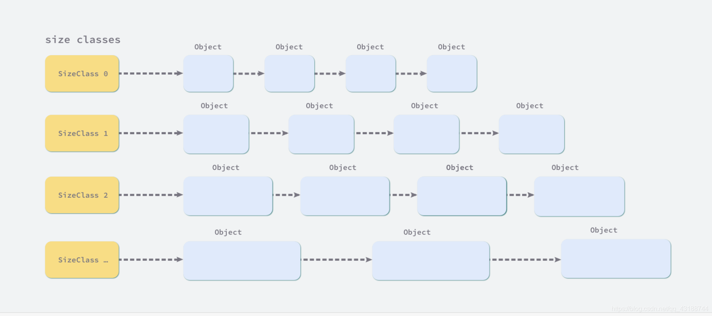

#### ThreadCache

每个线程各自的Cache，一个Cache包含多个空闲内存块链表，每个链表连接的都是内存块，同一个链表上内存块的大小是相同的，也可以说按内存块大小，给内存块分了个类，这样可以根据申请的内存大小，快速从合适的链表选择空闲内存块。由于每个线程有自己的ThreadCache，所以ThreadCache访问是**无锁的**

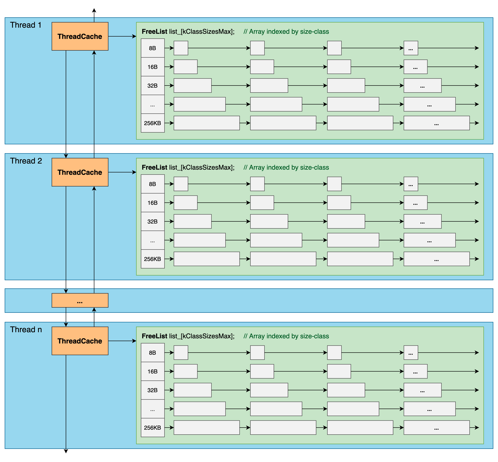

#### CentralCache

是所有线程共享的缓存，也是保存的空闲内存块链表，链表的数量与ThreadCache中链表数量相同，当ThreadCache内存块不足时，可以从CentralCache取，当ThreadCache内存块多时，可以放回CentralCache。由于CentralCache是共享的，所以它的访问是要**加锁的**

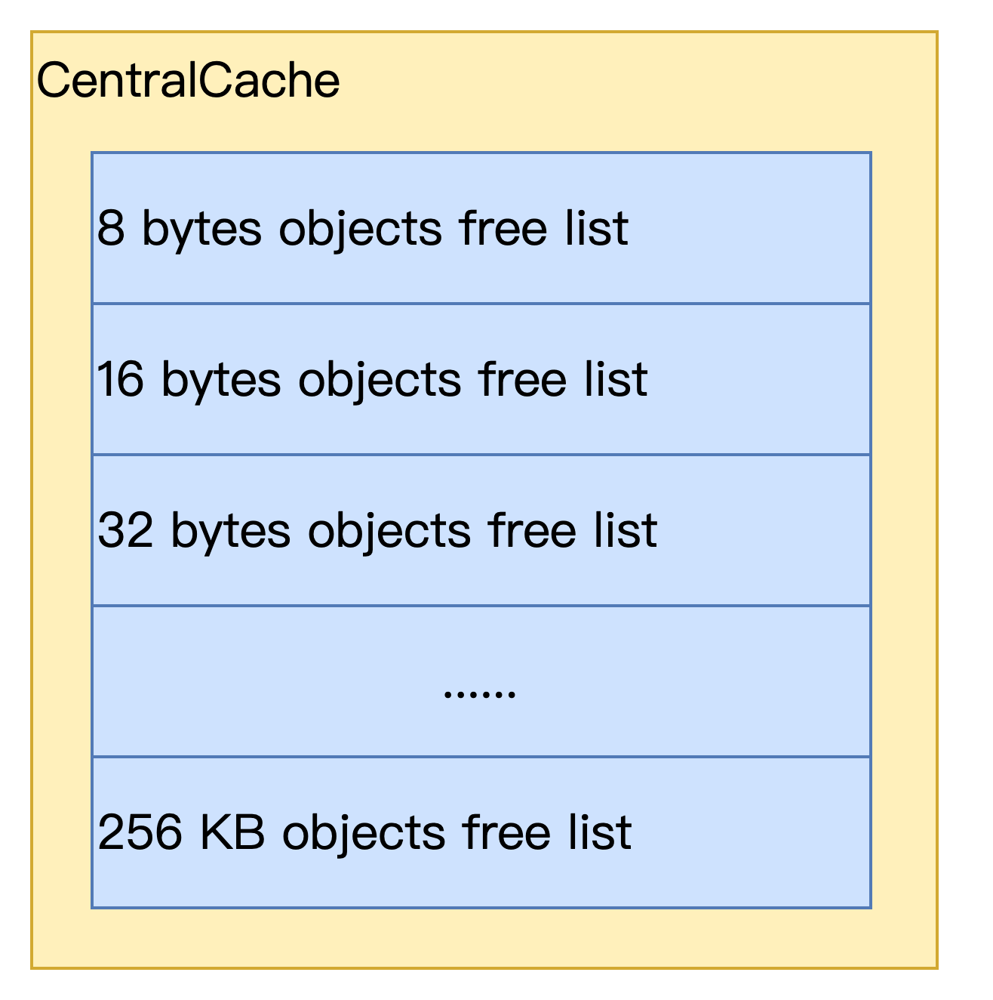

#### Page Heap

PageHeap是堆内存的抽象，PageHeap存的也是若干链表，链表保存的是Span，当CentralCache没有内存的时，会从PageHeap取，把1个Span拆成若干内存块，添加到对应大小的链表中，当CentralCache内存多的时候，会放回PageHeap。如下图，分别是1页Page的Span链表，2页Page的Span链表等，最后是large span set，这个是用来保存中大对象的。毫无疑问，PageHeap也是要**加锁的**

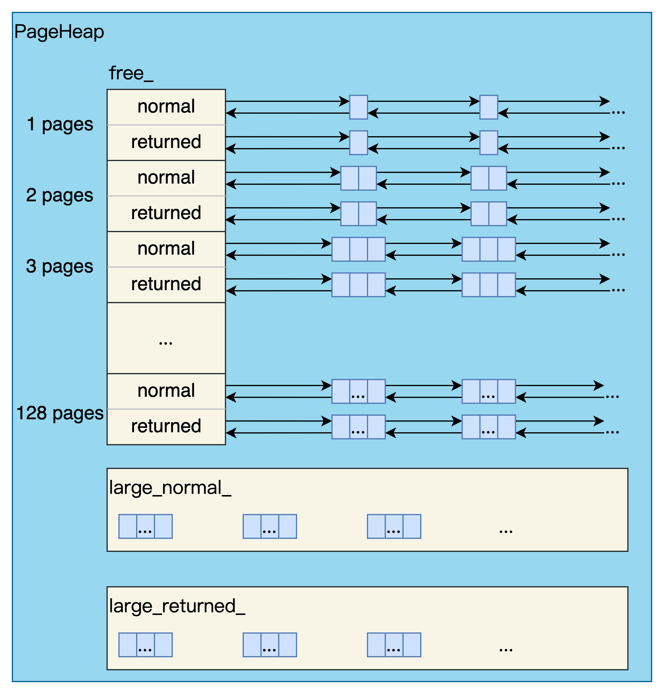


#### Pagemap and Spans

所有被TCMalloc从操作系统被申请到的内存会被划分成编译时就被确认好的Page大小,

pagemap用于查找一个page所属的Span，或标识给定对象的Size-class(例如一个大对象被分配了多个Page的Span,或者一个Span被拆分成Size-class大小后分配给小对象)。 TCMalloc使用2级或3级基数树来映射所有申请到的内存.

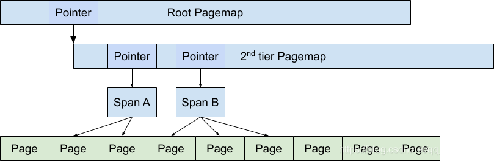


### 1.2 Front-End (ThreadCache)

是一个内存缓存

程序需要内存时首先向Front-End申请

提供快速分配和重新分配内存给应用的功能


可以基于线程分配(per-thread cache) 或者 基于CPU分配(per-cpu cache) 内存

当申请的内存小于 `kMaxSize` 时，直接由前端分配内存，前端对申请的内存大小进行映射到对应的 `Size-Class`(如12KB映射到16KB)，然后将Size-Class分配给对象。

当申请的内存大于 `kMaxSize`时，会交给后端直接分配 `Span` 给大对象


前端高速缓存一次只能由单个线程(CPU)访问，因此无需加锁，分配和释放内存很快


### 1.3 Middle-End (CentralHeap)

如果前端已缓存适当大小的内存,它可以满足大部分的请求。但是如果某种特定大小的缓存为空，则前端将向中端(Middle-End)请求一批内存以重新填充缓存。 中间端包括Central Free List和Transfer Cache。


#### Transfer Cache(传输缓存)

当前端请求内存或返回内存时，它将到达传输缓存。

传输缓存包含一个指向可用内存的指针数组，可以快速将对象移动到该数组中，或者代表前端从该数组中获取对象。

传输缓存的存在是由于**一个线程正在分配由另一个线程释放的内存的情况**。 传输缓存允许内存在两个不同线程之间快速流动。

如果传输缓存无法满足内存请求，或者没有足够的空间容纳返回的对象，它将访问Central Free List


#### Central Free List

Central Free List是当Front-End内存不足时,提供内存供其使用

Central Free List 以Span为基础管理内存,当需要内存时,会从不同的Span中提取内存.

当对象返回到Central Free List时，每个对象都将映射到它所属的Span（使用pagemap，然后**释放到该Span中。如果驻留在特定Span中的所有对象都返回给它，则整个Span 返回到后端**）

如果中端已用尽，将请求后端分配Page填充到中端. 后端也称为PageHeap.

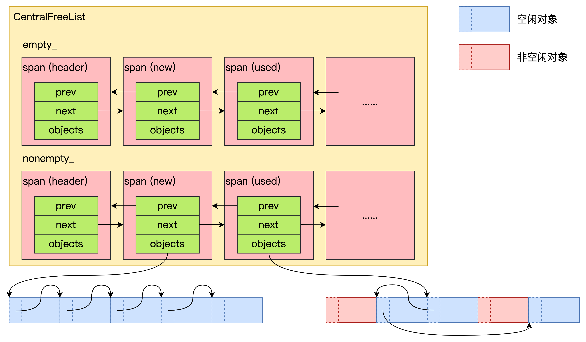

### 1.4 Back-End (PageHeap)

TCMalloc的后端有三个任务:

- 管理未使用的内存。
- 当没有合适大小的可用内存来满足分配请求时, 它负责从操作系统获取内存。
- 将不需要的内存返回给操作系统。

TCMalloc有两个类型的后端:

- Legacy Pageheap

用于管理一定大小的Span.

- Hugepage Aware Allocator

用于管理大对象,通常超过2MB

当中端内存不够的请求来到后端时,后端会返回对应Span的内存给中端


### 1.5 TCMalloc的内存分配和回收

TCMalloc的定义：

1. 小对象大小：0~256KB
2. 中对象大小：257~1MB
3. 大对象大小：>1MB

小对象的分配流程：ThreadCache -> CentralCache -> PageHeap，大部分时候，ThreadCache缓存都是足够的( FreeList非空 )，不需要去访问CentralCache和HeapPage，无锁分配加无系统调用，分配效率是非常高的。

中对象分配流程：直接在PageHeap中选择适当的大小即可，128 Page的Span所保存的最大内存就是1MB。

大对象分配流程：从large span set选择合适数量的页面组成span，用来存储数据


应用程序调用free()或delete一个小对象时，仅仅是将其插入到ThreadCache中其size class对应的FreeList中而已，不需要加锁，因此速度也是非常快的。

只有当满足一定的条件时，ThreadCache中的空闲对象才会重新放回CentralCache中，以供其他线程取用。同样的，当满足一定条件时，CentralCache中的空闲对象也会还给PageHeap，PageHeap再还给系统。


## 2. Golang内存管理

宏观来看，[Go的内存管理](https://draveness.me/golang/docs/part3-runtime/ch07-memory/golang-memory-allocator/)就是下图的样子，重点在于堆内存的部分

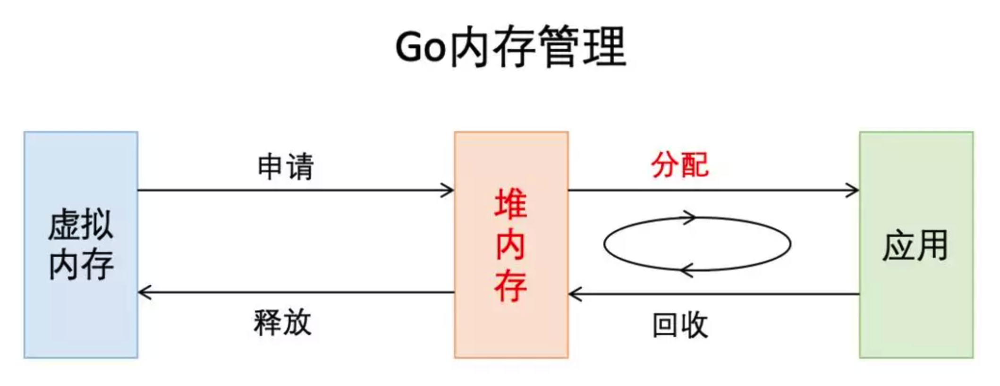

Go这门语言抛弃了C/C++中的开发者管理内存的方式：主动申请与主动释放，增加了逃逸分析和GC，将开发者从内存管理中释放出来，让开发者有更多的精力去关注软件设计，而不是底层的内存问题。这是Go语言成为高生产力语言的原因之一


栈内存和堆内存的几点区别：

1. 栈的内存管理简单，分配比堆上快。
2. 栈的内存不需要回收，而堆需要，无论是主动free，还是被动的垃圾回收，这都需要花费额外的CPU。
3. 栈上的内存有更好的局部性，堆上内存访问就不那么友好了，CPU访问的2块数据可能在不同的页上，CPU访问数据的时间可能就上去了。

当我们说内存管理的时候，主要是指**堆内存的管理**，栈内存管理不需要程序去操心。

### 2.1 内存分配的设计

两种内存分配方式：

#### 1. 线性分配

线性分配非常高效。**只需要维护一个指向内存特定位置的指针**，当用户程序申请内存时，分配器检查剩余空闲内存，返回分配的内存区域并修改指针位置（移动指针）

优点：实现简单，执行高效

缺陷：当已分配内存被回收后，单靠单个指针没有办法继续分配前面空闲的区域(红色区域)

适用场景：适合拷贝的垃圾回收算法，像标记整理、标记复制等算法，因为他们会整理对象位置，将空闲内存合并。

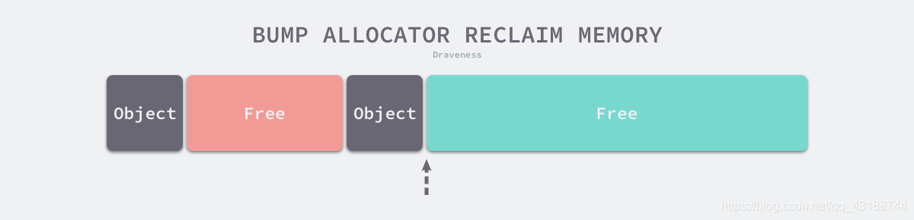


#### 2. 空闲链表分配

重用已经被释放的内存，在内部维护一个空闲链表。用户程序申请内存时，一次遍历空闲链表，找到足够大的内存，然后分配给用户，修改链表


常见的空闲链表分配方法：

- 首次适应：每次从头开始，找到第一个匹配的就返回
- 循环首次适应：从上一次结束位置开始遍历
- 最优适应：遍历整个链表，选择最合适的内存块
- **隔离适应(Golang采用的方法)**：将内存分隔成多个链表，每个链表内部的内存块大小相同，链表彼此管理不同大小的内存块，申请内存时先找到满足条件的链表，再从链表中选择合适的内存块

优点：可以重用被使用的内存，而且无需整理和复制

缺点：分配内存时需要遍历链表

#### 3. Golang内存分配

Golang的内存分配法和隔离适应算法类似，并且借鉴了TCMalloc的设计实现高速的内存分配。核心理念是**使用多级缓存将对象根据大小分类，按照类别实施不同的分配策略**

对象被分为三种大小：

- 小于16B：微对象
- 16KB到32KB：小对象
- 大于32KB：大对象

其中微对象和小对象优先分配到线程缓存中，大对象直接分配到堆中

Go语言也采用了TCMalloc的**多级缓存策略**，并且采用的是 `Per-Thread Cache` 模式，每个线程都有独立的缓存（即每个P）

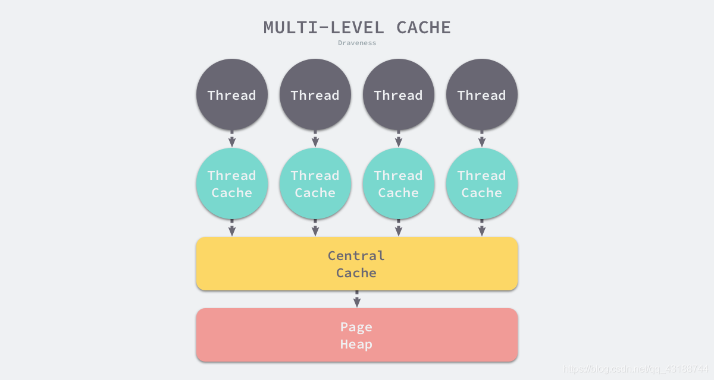


### 2.2 Go内存布局

#### 内存布局的演变

Go1.10及以前采用线性分配的方式，管理简单，堆内存都是连续的（都是虚拟内存）。

spans区域存储了指向内存管理单元的`runtime.mspan`的指针，每个mspan管理几页的内存空间

bitmap用于标识arena区域中哪些地址保存了对象

area是真正的堆区，运行时8KB为一页，最大为512GB

对于任意地址，通过arena的基地址可以计算出该地址所在页，然后通过spans数组获得管理该页的mspan对象（多个连续的页可以对应一个mspan）。这一系列操作的前提是堆区arena必须是连续的

- 优点：垃圾回收可以根据指针地址判断对象是否在堆中，内存管理简单方便
- 缺点：需要预留大块的内存空间，可能申请大块内存空间却不使用。如果不预留大块空间，某些场景又会OOM


1.11之后，转为了稀疏内存管理（基于隔离适应的空闲链表管理）

- 优点：解决了堆大小的上限
- 缺点：失去了内存的连续性，使内存管理变得非常复杂，增加了一点垃圾回收的成本

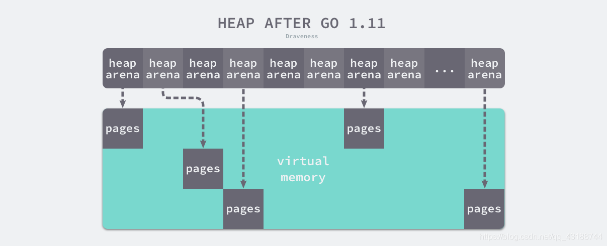

详细的内存布局图如下：


#### heapArena

稀疏内存管理主要是通过一个二维的 `runtime.heapArena` 数组对内存进行管理，每个heapArena管理64MB的内存空间，整个堆区最多可以管理256TB内存，比之前的512GB多多了

```go
type heapArena struct {
	// 前两者与线性分配中的bitmap以及spans对应,用于映射内存地址与Span.
	bitmap [heapArenaBitmapBytes]byte
	spans [pagesPerArena]*mspan
	
	// 一个位图用于表示在当前heapArena管理的Span中,哪些Span是正在被使用的.
	// 只使用了每个Span的第一个Page(Span可以由多页构成) 并且读写是原子性的
	pageInUse [pagesPerArena / 8]uint8
	
	// 与pageInUse类似,也是一个位图,用于表示哪些Span上有被标记的对象,用于垃圾回收.
	pageMarks [pagesPerArena / 8]uint8
	
	// 这个指针指向的是整个heapArena结构管理的首地址,通过CAS的方式进行修改
	zeroedBase uintptr
}
```


#### mspan

```go
type mspan struct {
    next *mspan		// 双链表
    prev *mspan
    
	startAddr uintptr // 所管理内存的起始地址
	npages    uintptr // 所管理内存的页数
    freeindex uintptr // 页中空闲对象的初始索引(快速分配)

	allocBits  *gcBits  // 内存分配的位图
	gcmarkBits *gcBits	// gc标志的位图
	allocCache uint64   // allocBits的补码，用于快速查找内存中未被使用的内存
	
    state mSpanStateBox  // span的状态，空闲(堆中)、inuse(被分配了)、manual。。。
    
    spanclass spanClass  // mspan的跨度类
}
```


mspan是内存管理单元（内存管理的基本单位），是双向链表，prev和next分别指向前后的`runtime.mspan`，最后使用runtime.mspanList存储了双向链表的头节点和尾节点，在**线程缓存mcache和中心缓存mcentral中使用**

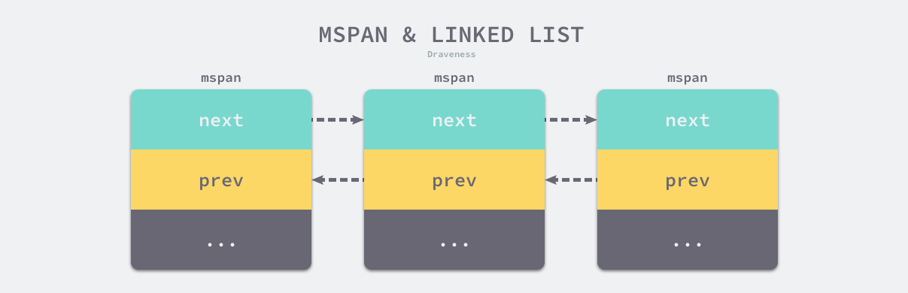

**一组连续的Page组成1个Span**，一个mspan的大小从8B到到32KB (sizeClass)

`startAddr`和`npages`确定了该mspan结构体管理的多个页所在的内存（一个mspan管理一段连续的页空间）

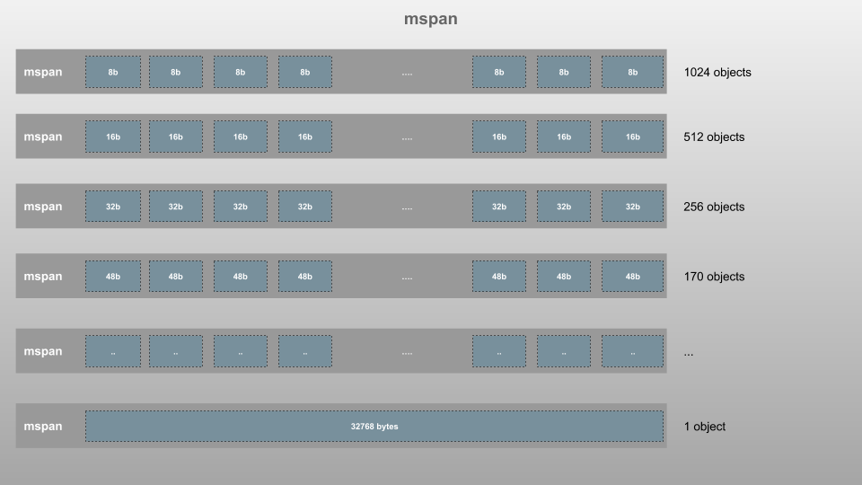

`spanClass`是跨度类，它决定了mspan中存储的对象的大小和个数（按spanClass的大小进行内存对齐）

Go一共有67种跨度类（size class），每个跨度类都对应特定大小的对象(obj size)，以及对应span的大小(span size)，通过计算可以得出该跨度类所对应span可以存储的objects的数量(num of object)，以及浪费的空间

此外还有一个类别为0的跨度类，它能够管理大于32KB的特殊对象（大对象分配的时候使用）

**一个sizeClass对应两个spanClass**，所以spanClass有134个，从0到133，每个span class指向一个span，也就是说，每个mcache有134个mspan链表

> ```go
> numSpanClasses = _NumSizeClasses << 1
> _NumSizeClasses = 68
> ```


size转换是没有固定的计算规律的，直接进行了硬编码，通过查表得到：

`size-class`：从1到66(从8B到32KB)，一共有66个，加上未使用的 size class 0，实际上有67个

`span-class`：一个sizeClass对应两个span-class，所以span-class有134个，从0到133，每个span class指向一个span，也就是说，每个mcache有最多134个 span class 链表


当用户程序向runtime.mspan申请内存时，它会使用`allocCache`字段**以对象为单位(object size)**在管理的内存中快速查找待分配的空间

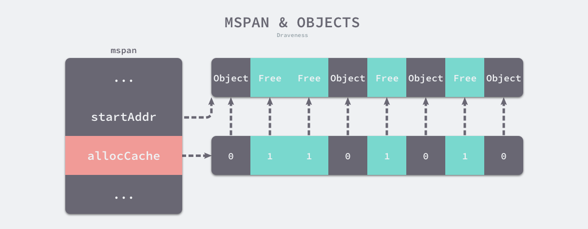

当mspan管理的内存不足以完成新对象的分配时，runtime会**以页为单位向mheap申请内存**


#### mcache

mcache与TCMalloc中的ThreadCache类似，按spanClass划分，每个线程（P）持有 67 * 2 = 134 个`runtime.mspan`，mcache可以无锁访问，**微对象和小对象(<=32KB)直接从mcache管理的mspan分配内存**。mcache依然是属于堆的一部分，用于动态数据

runtime在初始化P时，会调用runtime.allocmcache初始化线程缓存，会在系统栈中使用`runtime.mheap`的线程缓存分配器初始化出一个新的`runtime.mcache`

`runtime.mcache.refill(spc spanClass)`会为mcache获取一个指定跨度类的mspan，替换掉自己这个跨度类本来的mspan，被替换的mspan不能包含空闲空间，获取的mspan必须至少包含一个空闲空间用于对象分配


mcache中还有用于分配微对象的字段，专门管理**16B以下的非指针类型的对象**

```go
type mcache struct {
    alloc [numSpanClasses]*mspan // 按spanClass分类的mspan，numSpanClasses = _NumSizeClasses << 1 = 67 << 1
    
    
    // 微对象分配相关
	tiny             uintptr	// 内存的起始地址
	tinyoffset       uintptr	// 下一个空闲内存的偏移量
	local_tinyallocs uintptr	// 分配的对象个数
}
```


#### mcentral

mcentral与TCMalloc中的CentralCache类似，**是所有线程共享的缓存，需要加锁访问**

mspan按自己管理的spanClass跨度类进行归类，由对应的mcentral进行管理，所以也有 134 个 mcentral

```go
type mcentral struct {
	spanclass spanClass		// 所管理的mspan的spanClass
    
    
    // Go115之后
	partial  [2]spanSet		// 有空闲对象的spans：包含扫描过的和未扫描的
	full     [2]spanSet		// 无空闲对象的spans：包含扫描过的和未扫描的
    
    // Go115之前
    nonempty mSpanList // list of spans with a free object, ie a nonempty free list
	empty    mSpanList // list of spans with no free objects (or cached in an mcache)
}
```

当mcache的某个级别mspan的内存不够分配时，它会向mcentral申请1个对应spanClass的mspan：

- 首先从**有空闲空间的、清扫过的**spanSet中查找可以使用的内存管理单元
- 然后从**有空闲空间的、未清扫的**spanSet中查找可以使用的内存管理单元
- 然后从**无空闲空间的、未清扫的**spanSet中获取内存管理单元，并清理他的内存空间
- 如果以上均失败，则调用`runtime.mcentral.grow`从堆中申请新的内存管理单元，堆根据**npages和sizeClass**为mcentral分配新的mspan

无论哪一步成功，获取到mspan之后，最后都更新mspan中的allocBits和allocCache等字段，让runtime在分配内存时可以快速找到空闲对象


> Go115之前，mcache是**为mspan维护2个链表**，这**和mcache申请内存有关**
>
> - `empty`：empty链表存放的是没有空闲对象的当前sizeclass的mspan，当此处的**mspan被释放时**，会被移动到 `non-empty` 链表
> - `non-empty`：有空闲对象的链表，当从mcentral申请新的span时，首先从该链表中获取span，然后移入 `empty`链表


#### mheap

mheap是内存分配的核心结构体，Go语言程序将其作为全局变量存储，堆上初始化的对象都有该结构体统一进行管理

mheap包含了长度为134的`mcentral`的列表，以及管理堆区内存的`arenas`

```go
type mheap struct {
    central [numSpanClasses]struct {		// 134个mcentral
		mcentral mcentral
		pad      [cpu.CacheLinePadSize - unsafe.Sizeof(mcentral{})%cpu.CacheLinePadSize]byte
	}
	arenas [1 << arenaL1Bits]*[1 << arenaL2Bits]*heapArena  // heapArena
}
```

每个heapArea管理64MB的内存(64位非windows平台)

mheap与TCMalloc中的PageHeap类似，**它是堆内存的抽象，把从OS申请出的内存页组织成Span，并保存起来**。当mcentral的Span不够用时会向mheap申请，mheap的Span不够用时会向OS申请，向OS的内存申请是按页来的，然后把申请来的内存页按span的sizeclass生成Span组织起来，同样也是需要加锁访问的。


为了防止内存的大量占用和堆增长，在向OS申请内存页时，要先调用`runtime.mheap.reclaim`方法回收一部分内存，随后通过`mheap.allocSpan`分配mspan：

- 首先**在堆上分配npages数量的内存页**
- 如果堆上分配npages的内存页失败，才会**向OS申请内存页**(`runtime.mheap.grow`)
- 然后将这些内存页初始化为`mspan`返回。


mheap里保存了2棵**二叉排序树**，按span的page数量进行排序：

1. `free`：free中保存的span是空闲并且非垃圾回收的span。
2. `scav`：scav中保存的是空闲并且已经垃圾回收的span。

如果是垃圾回收导致的span释放，span会被加入到`scav`，否则加入到`free`，比如刚从OS申请的的内存也组成的Span。


当mheap没有足够的内存时，mheap会向OS申请内存，把申请的内存页保存到span，然后把span插入到`free`树 。

在32位系统上，mheap还会预留一部分空间，当mheap没有空间时，先从预留空间申请，如果预留空间内存也没有了，才向OS申请。


### 2.3 对象大小转换

> ```go
> numSpanClasses = _NumSizeClasses << 1
> _NumSizeClasses = 68
> ```
>
> 


size转换是没有固定的计算规律的，直接进行了硬编码，通过查表得到：

`size-class`：从1到66(从8B到32KB)，一共有66个，加上未使用的 size class 0，实际上有67个

`span-class`：一个sizeClass对应两个span-class，所以span-class有134个，从0到133，每个span class指向一个span，也就是说，每个mcache有最多134个 span class 链表


### 2.4 Go内存分配


Go中的内存分类并不像TCMalloc那样分成小、中、大对象，但是它的小对象里又细分了一个Tiny对象，Tiny对象指大小在1Byte到16Byte之间并且不包含指针的对象。小对象和大对象只用大小划定，无其他区分。

小对象是在mcache中分配的，而大对象是直接从mheap分配的

#### 微对象的分配

**微对象(<16B，不可以是指针类型)**：直接在微分配器分配，只有16字节的内存块。如图如果分配了12字节，下一个微对象小于4字节才会分配到剩余部分，否则当成小对象分配了

微对象主要是：**小字符串和逃逸的微小对象**（未逃逸直接栈上分配了）


#### 小对象的分配

**小对象(<32KB)**：首先确定对象大小以及跨度类(spanClass)，然后在mspan中进行分配：


随着内存的分配，span中的对象内存块，有些被占用，有些未被占用，比如上图，整体代表1个span，蓝色块代表已被占用内存，绿色块代表未被占用内存。当分配内存时，只要快速找到第一个可用的绿色块(通过位图)，并计算出内存地址即可，如果需要还可以对内存块数据清零。

分配完之后更新allocCache和freeindex等字段。


在mspan中分配时，有两个分配方法：`nextFreeFast`和`nextFree`

- `nextFreeFast`会直接在当前mspan中通过allocCache位图查找到空闲位，计算对应地址，进行分配。如果没有找到空闲内存，就要调用nextFree了
- `nextFree`负责找到新的内存管理单元：调用`refill`去mcentral中为mcache分配新的mspan，然后在进行分配


#### 大对象的分配

**大对象(>32KB)**：会单独处理，不会从mcache和mcentral中获取mspan，而是直接调用`runtime.mcache.allocLarge`分配大片内存

该方法会计算分配该对象所需要的页数，然后按照8KB的倍数在堆上申请内存，申请时创建一个**跨度类为0的spanClass**，并分配一个mspan管理这个跨度类


### 2.5 对象释放

Go使用垃圾回收收集不再使用的span，调用`mspan.scavenge()`把span释放给OS（并非真释放，只是告诉OS这片内存的信息无用了，如果你需要的话，收回去好了），然后交给mheap，mheap对span进行span的合并，把合并后的span加入`scav`树中，等待再分配内存时，由mheap进行内存再分配


注意，GC只是给内核提供一个建议：**这个内存地址区间的内存已经不再使用，可以回收。但内核是否回收，以及什么时候回收，这就是内核的事情了**。如果内核真把这片内存回收了，当Go程序再使用这个地址时，内核会重新进行虚拟地址到物理地址的映射。所以在内存充足的情况下，内核也没有必要立刻回收内存


## 3. GoGC

传统编程语言(c/c++)需要手动释放内存，存在内存泄漏或者误释放内存的问题。后来的变成需要都引入了语言层面的自动内存管理，内存的释放由`虚拟机(VM)`或者`运行时(runtime)`自动进行


### 3.1 常见GC算法和GoGC

- **标记清除：** 从根对象出发，将确定存活的对象进行标记，并清除可以回收的对象。简单快速，但会造成内存碎片，导致大对象创建不了。
- **复制算法：** 内存分为大小相同的两块，只使用一块，互相复制。解决了碎片问题，但是浪费资源，且移动耗费时间，效率低
- **标记整理：** 为了解决内存碎片问题而提出，在标记过程中，将对象尽可能整理到一块连续的内存上。性能低。
- **分代式：** 将对象根据存活时间的长短进行分类，存活时间小于某个值的为年轻代，存活时间大于某个值的为老年代，永远不会参与回收的对象为永久代。并根据分代假设（如果一个对象存活时间不长则倾向于被回收，如果一个对象已经存活很长时间则倾向于存活更长时间）对对象进行回收。
- **引用计数：** 根据对象自身的引用计数来回收，当引用计数归零时立即回收。计数频繁更新会带来很多额外开销，无法解决循环引用问题。


**GC的难点**在于，无法预料程序是否是暂停时间敏感的(批处理作业还是交互式程序)，在这种情况下为了平衡，最好使用一种吞吐量最大化的算法，即有用工作与用于垃圾回收的时间之比。没有一种垃圾回收算法是各方面都完美的。


Go程序通常是请求/响应处理，如HTTP服务器，表现出强烈的分代收集行为，但是Go并没有采用分代，而是用了古老的标记清除。这样做的好处是可以获得**非常短的暂停时间**。但是每轮GC都需要大量工作，吞吐量会降低。而且为了避免出现**并发模式故障**(垃圾生产速度大于GC清理速度)，Go默认堆开销为100%，使程序所需内存增加一倍。


目前Go语言使用的是：**无分代、不整理、并发** 的三色标记算法

无分代：Go 的编译器会通过**逃逸分析**将**大部分新生对象存储在栈上**（当 goroutine 死亡后栈也会被直接回收），只有那些需要长期存在的对象才会被分配到需要进行垃圾回收的堆中。分代会消耗额外的赋值器时间，Go团队认为下一个10年内存会比CPU增长快的多，所以不允许消耗一点CPU。

不整理：整理是为了解决内存碎片问题以及“允许”使用顺序内存分配器。但 Go 运行时的分配算法基于 **tcmalloc**，基本上没有碎片问题。这个问题对于Go来讲一点都不需要担心


### 3.2 三色标记法原理

三色标记算法：

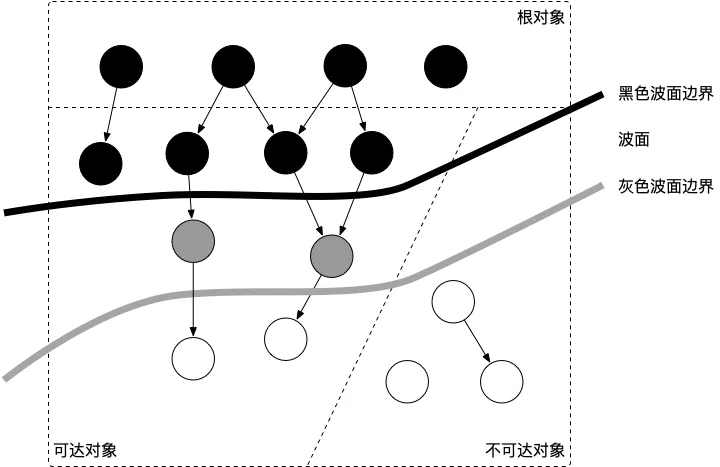

- **黑色对象：确定存活的对象**，已被回收器访问到的对象，其中所有的字段都已被扫描！黑色对象中的任何一个指针都不可能直接指向白色对象
- **灰色对象：波面，已被回收器访问到的对象**，但是回收器还得对其中的指针进行扫描，因为这些指针可能指向当前的某些白色对象
- **白色对象：未被回收器访问到的对象**，回收开始时所有对象都是白色，等标记结束后，白色对象就是不可达的垃圾对象

垃圾回收的过程可以理解为波面不断前进的过程。垃圾回收**开始时只有白色对象**，当**一个节点的所有子节点扫描完后，该节点会变成黑色节点**。等堆遍历完成后，只有黑色节点与白色节点，黑色为可到达对象，即存活，白色为不可到达对象，即死亡。

1. 开始：所有对象都是白色
2. 从根对象出发，扫描所有可达对象，标记为灰色，放入待处理队列
3. 从待处理队列取出灰色对象，将其引用的对象也标记为灰色并放入待处理队列中，完成后将自身标记为黑色
4. 重复3，直到待处理队列空，此时的白色对象即为不可达的垃圾

>根对象在垃圾回收的术语中又叫做根集合，它是垃圾回收器在标记过程时最先检查的对象，包括： 
>
>（1）全局变量：程序在编译期就能确定的那些存在于程序整个生命周期的变量。 
>
>（2）执行栈：每个 goroutine 都包含自己的执行栈，这些执行栈上包含栈上的变量及指向分配的堆内存区块的指针。 
>
>（3）寄存器：寄存器的值可能表示一个指针，参与计算的这些指针可能指向某些赋值器分配的堆内存区块


### 3.3 屏障机制

#### 1. 没有STW存在的问题

垃圾回收原则是不出现对象的丢失，不错误回收不需要回收的对象。

> 如果满足下面两个条件，**会破坏垃圾回收原则**，出现对象丢失
>
> 1. 赋值器修改对象图，导致一黑色对象突然引用白色对象(白色被挂在黑色下)
> 2. 从灰色对象出发，到达白色对象且未经访问的路径被赋值器破坏(灰色同时丢了该白色)


**没有STW的例子：**

假设灰色对象2(未被扫描)引用了白色对象3

此时黑色对象4(已扫描完毕)引用对象3的同时，灰色对象2删除了对对象3的引用

那么白色对象3就不会被扫描到，导致最后对象3是白色，被误当做垃圾清除


可能的解决办法：整个过程STW，浪费资源且对用户程序影响大，所以引入了**屏障机制**

把回收器视为对象，把赋值器视为影响回收器这一对象的实际行为（即影响 GC 周期的长短），从而引入赋值器的颜色：

- 黑色赋值器：已经由回收器扫描过，不会再次对其进行扫描。
- 灰色赋值器：尚未被回收器扫描过或尽管已经扫描过，但仍需要重新扫描。


#### 2. 强弱三色不变式

**强三色不变式：** 黑色对象不能指向白色对象，只能指向灰色或黑色对象

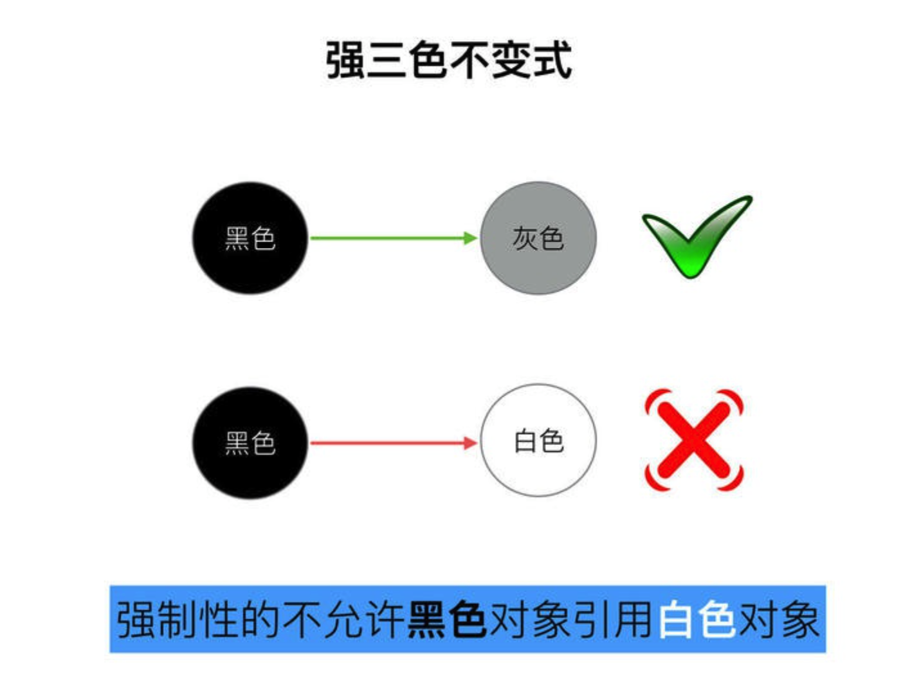

**弱三色不变式：** 黑色对象可以指向白色对象，但此白色对象链路的上游中必须有一个灰色对象(白色对象必须被灰色对象"保护")

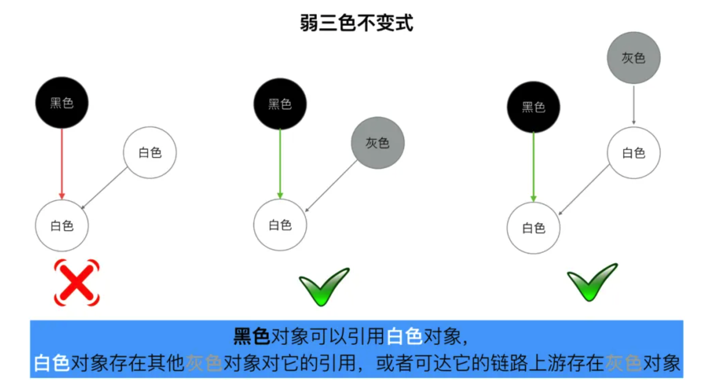


为了遵循上述的两个方式,Golang团队初步得到了如下具体的两种屏障方式“插入屏障”, “删除屏障”.


#### 3. 插入写屏障(Dijkstra)-灰色赋值器

>  Dijkstra 必须**为栈上的对象增加写屏障**或者**在标记阶段完成重新对栈上的对象进行扫描**，这两种方法各有各的缺点，前者会大幅度增加写入指针的额外开销，后者重新扫描栈对象时需要暂停程序，垃圾收集算法的设计者需要在这两者之间做出权衡。

GO V1.5 采用的方法 (GO V1.3是普通标记清除，整个过程STW，效率极低)

**具体操作**: 在A对象引用B对象的时候，B对象被标记为灰色。(将B挂在A下游，B必须被标记为灰色)

**满足**: **强三色不变式**. (不存在黑色对象引用白色对象的情况了， 因为白色会强制变成灰色)

>  破坏条件1（ 赋值器修改对象图，导致某一黑色对象引用白色对象；）因为在对象A 引用对象B 的时候，B 对象被标记为灰色


黑色对象的内存槽有两种位置, `栈`和`堆`. 栈空间的特点是容量小,但是**要求响应速度快**,因为函数调用弹出频繁使用, 所以“插入屏障”机制,在**栈空间的对象操作中不使用**. 而仅仅使用在堆空间对象的操作中


Dijkstra 插入屏障的好处在于可以立刻开始并发标记。但存在两个缺点：

- 由于 Dijkstra 插入屏障的“**保守**”（将可能存活的对象都标记为了灰色，例如上图B对象最后没有被回收），在一次回收过程中可能会残留一部分对象没有回收成功，只有在下一个回收过程中才会被回收；
- 在标记阶段中，每次进行**指针赋值操作**时，都需要**引入写屏障**，这无疑会增加大量性能开销；为了避免造成性能问题，Go 团队在最终实现时，**没有为栈上的指针的写操作启用写屏障**，而是当发生栈上的写操作时，将栈标记为灰色，但此举产生了**灰色赋值器**，将会**需要在标记终止阶段 STW** 时对这些栈进行**重新扫描**。


但是如果栈不添加,当全部三色标记扫描之后,栈上有可能依然存在白色对象被引用的情况(如上图的对象9). 所以要对栈重新进行三色标记扫描, 但这次为了对象不丢失, 要对本次标记扫描启动STW暂停. 直到栈空间的三色标记结束

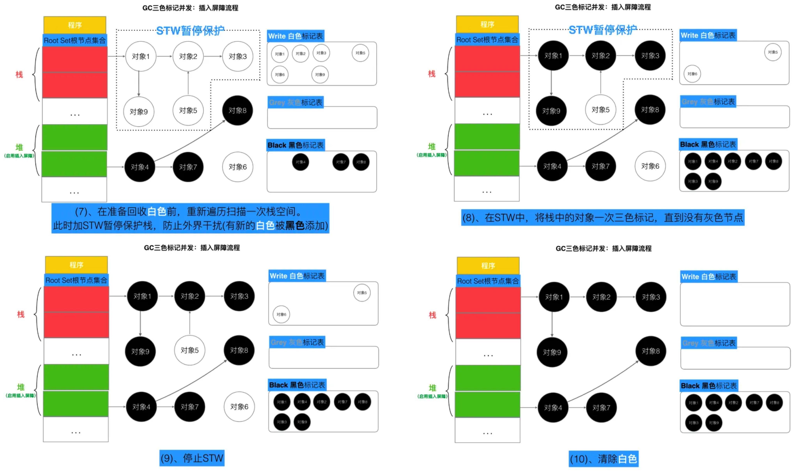

#### 4. 删除写屏障(Yuasa)-黑色赋值器

**具体操作**: 被删除的对象，如果自身为灰色或者白色，那么被标记为灰色。

**满足**: **弱三色不变式**. (保护灰色对象到白色对象的路径不会断)

> 破坏条件2（从灰色对象出发，到达白色对象的、未经访问过的路径被赋值器破坏），因为被删除对象，如果自身是灰色或者白色，则被标记为灰色

例如A->B的引用被删除触发删除写屏障，B变为灰色（本来就是灰色）

B->C的引用被删除触发删除写屏障，C由白色变为了灰色

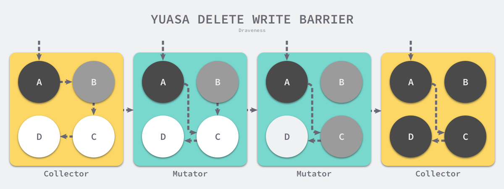

**特点**：标记结束不需要STW，但是回收精度低(**一个对象即使被删除了最后一个指向它的指针也依旧可以活过这一轮，在下一轮GC中才会被清理掉**)，容易产生“冗余”扫描；

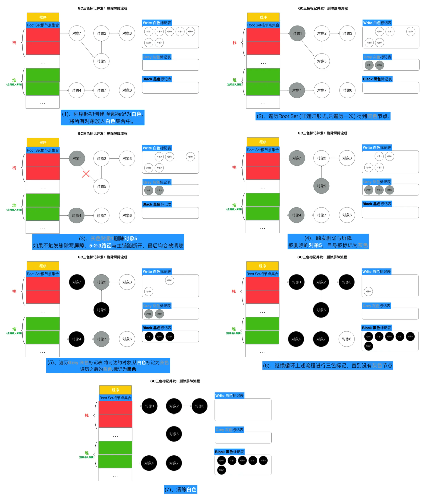

#### 4. 混合写屏障

Go V1.8 新增的混合写屏障机制，**大大缩短了STW时间**

- **插入写屏障短板**：结束时需要STW来重新扫描栈，标记栈上引用的白色对象的存活；
- **删除写屏障短板**：基于起始快照，回收精度低，GC开始时STW扫描堆栈来记录初始快照，这个过程会保护开始时刻的所有存活对象。


混合写屏障机制整体流程：

- GC 开始将**栈上**的对象全部扫描并标记为**黑色** (之后不再进行第二次重复扫描，无需STW)
- GC mark期间，任何在**栈上或堆上**创建的新对象，均为**黑色**
- 对堆对象进行混合写屏障
- 对栈对象不适用混合写屏障


**写屏障代码触发点**

重点：

1. 写屏障的代码在编译期间生成好，之后不会再变化；
2. 堆上对象赋值才会生成写屏障；
3. 哪些对象分配在栈上，哪些分配在堆上？也是编译期间由编译器决定，这个过程叫做“逃逸分析”；

在合适的位置，编译器给你程序添加的指令函数 `runtime·gcWriteBarrier`，这个就是入口，每次堆对象赋值，如果开启了垃圾回收开关，都会去里面转一圈。

实现伪代码如下：

```go
if runtime.writeBarrier.enabled {
    runtime.gcWriteBarrier(ptr, val)
} else {
    *ptr = val
}
```

注意参数 `gcWriteBarrier` 传值在 golang 里是个特例，这里用的是寄存器（ golang 的惯例是用栈来传递的，但是考虑性能原因，这里必须用寄存器了），

`runtime·gcWriteBarrier` 函数干啥的：

1. 先把slot和ptr入队 `wbBuffer`
2. 如果 `wbBuffer` 满了就调用 `runtime.wbBufFlush` 进行批量置灰，然后赋值；否则就只是入队，然后赋值
3. 然后赋值 `*slot = ptr`

那为什么上面 `gcWriteBarrier` 这个函数怎么复杂？

其实是做的一个优化处理，每次触发写屏障的时候（ hook ），我们当然可以直接shade（ptr），但是我们知道，毕竟这段写屏障的代码是比业务多出来的，这些都是开销，我们能快就快，每次这样做太零散，我们可以攒一批，一批队列满了，一批去入队，置灰色。这样效率更高。`一般情况下，只需要简单入队就行了，buf 满了之后，才 flush 去批量置灰，这样写屏障对业务的影响就更小了，wbBuffer 就是这个队列的实现。`


**对象置灰**：

这个函数 `wbBufFlush` 是 golang 实现的，在文件 `src/runtime/mwbbuf.go` 里。本质上是封装调用 wbBufFlush1 ，这个函数才是 hook 写操作想要做的事情，这个函数做两个事情：

1. 批量循环处理 buf 队列里的值；
2. shade（这个值）；

说了这么久“置灰色”，那么到底写屏障是怎么置灰色的？实现如何。其实本质下就下面一行代码，在文件 `src/runtime/mwbbuf.go` 的函数 `wbBufFlush1`：

```go
// Enqueue the greyed objects.
gcw.putBatch(ptrs[:pos])
```

在 golang 里面，到底什么样的是灰色对象？

1. 只要在扫描队列中的对象，就是灰色的。

其实，白，灰，黑 三色这个是我们认为抽象出来的概念，也就是所谓的三色标记法，那么这个概念落到实处，又是怎么样的实现。

golang 内部对象并没有保存颜色的属性，三色只是对他们的状态的描述，是通过一个队列 + 掩码位图 来实现的：

- 白色对象：对象所在 span 的 gcmarkBits 中对应的 bit 为 0，不在队列；
- 灰色对象：对象所在 span 的 gcmarkBits 中对应的 bit 为 1，且对象在扫描队列中；
- 黑色对象：对象所在 span 的 gcmarkBits 中对应的 bit 为 1，且对象已经从扫描队列中处理并摘除掉；


**满足**：变形的弱三色不变式

这里我们注意， **屏障技术是不在栈上应用的，因为要保证栈的运行效率**

Golang 中的混合屏障结合了删除写屏障和插入写屏障的优点，**只需要在开始时并发扫描各goroutine的栈，使其变黑并一直保持，标记结束后，因为栈空间在扫描后始终是黑色的，无需进行re-scan**，减少了STW 的时间。

另外注意：混合写屏障是GC的一种屏障机制，所以只是当程序执行GC的时候才会触发这种机制

**GC开始：** 扫描栈区，将栈区可达的对象全部标记为**黑色**（STW全部标记）

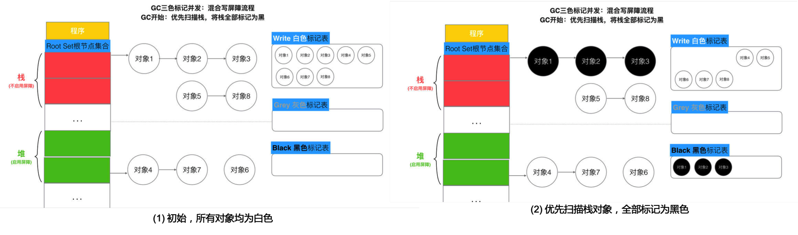


**场景一：对象被一个堆对象删除引用，成为了栈对象的下游**

由于屏障的作用，对象7不会被误删除

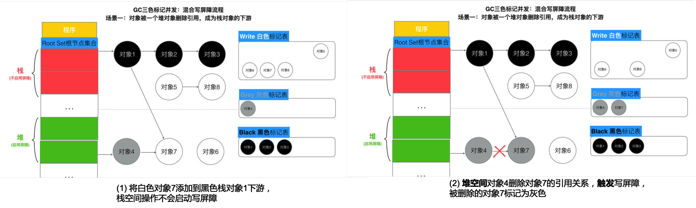


**场景二：对象被一个栈对象删除引用，成为栈对象的下游**

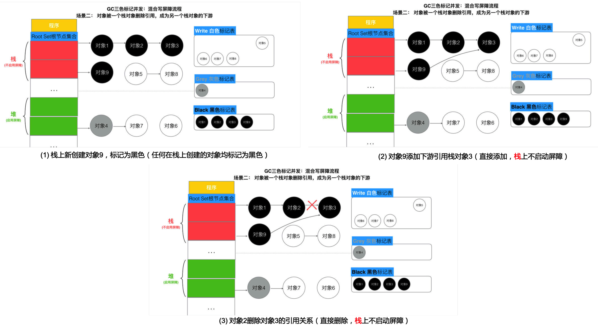


**场景三：对象被一个堆对象删除引用，成为堆对象的下游**

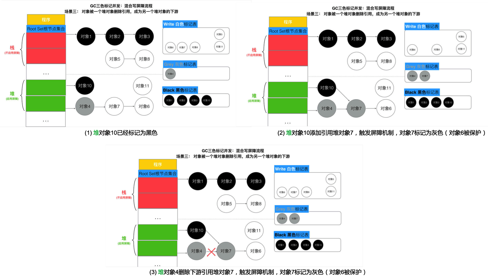


**场景四：对象被一个栈对象删除引用，成为另一个堆对象的下游**

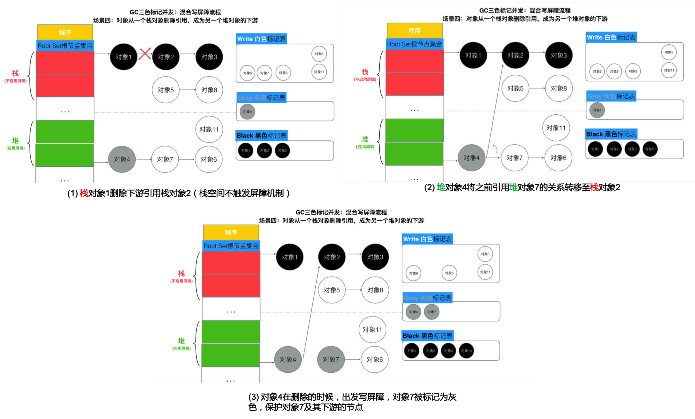

### 3.4 GoGC-标记清除算法

1.5版本及之后的GC主要分四个阶段，其中标记和清理都是并发执行的，但是标记前后需要STW来做**GC的准备工作和栈的rescan**


**GC触发：**
| 阶段             | 说明                                                         | 赋值器状态 |
| ---------------- | ------------------------------------------------------------ | ---------- |
| SweepTermination | 清扫终止阶段，进入安全点，处理上一次GC还未被清理的内存管理单元 | STW        |
| Mark             | 扫描标记阶段，写屏障开启，根对象入队，恢复程序执行，开始扫描(扫描G栈时会暂停当前G的P) | 并发       |
| MarkTermination  | 标记终止阶段，关闭辅助标记的用户程序，清理处理器上的线程缓存 | STW        |
| GCoff            | 内存清扫阶段，开始清理，关闭写屏障，恢复用户程序的执行，后台并发清理所有内存管理单元 | 并发       |

- `申请内存`：当进行 `mallocgc`时如果用到了mcentral 之后的缓存，就尝试调用 `gcTrigger{kind: gcTriggerHeap}.test()` 进行检查。当前分配的内存达到一定**阈值**（上一次gc时内存的2倍）时触发，这个阈值在每次GC过后都会根据堆内存的增长情况和CPU占用率来调整（目前唯一**可以调整的参数GCPercent, 以后可能会有MaxHeap**）runtime.mallocgc，微对象、小对象、大对象的创建都可能会触发新的垃圾收集循环
    - `nextFree()`从mcentral或者mheap获取新的mspan时可能会触发垃圾收集
    - 分配大对象的时候，一定会尝试触发垃圾收集
- `runtime.forcegcperiod`: 由  `sysmon` 循环检查，当一定时间没有执行过GC就强制触发GC（2分钟）
- `runtime.GC()`: 手动触发


```go
// 尝试垃圾回收
func (t gcTrigger) test() bool {
	if !memstats.enablegc || panicking != 0 || gcphase != _GCoff {
		return false
	}
	switch t.kind {
	case gcTriggerHeap:
		return memstats.heap_live >= memstats.gc_trigger	// 堆空间超过设定的阈值
	case gcTriggerTime:
		if gcpercent < 0 {
			return false
		}
		lastgc := int64(atomic.Load64(&memstats.last_gc_nanotime))
		return lastgc != 0 && t.now-lastgc > forcegcperiod	// 超过2分钟没有垃圾回收了
	case gcTriggerCycle:
		return int32(t.n-work.cycles) > 0		// 没有开启垃圾收集则触发新的循环
	}
	return true
}
```


#### 1. SweepTermination(STW)

1. **暂停程序**，所有的处理器在这时会进入安全点（Safe point）；
2. 如果当前垃圾收集循环是强制触发的，我们还需要处理还未被清理的内存管理单元；

#### 2. Mark(并发标记)

1. 将状态切换至 `_GCmark`、开启写屏障、用户程序协助（Mutator Assists）并将根对象入队；
2. 恢复执行程序，标记进程和用于协助的用户程序会开始并发标记内存中的对象，写屏障会将被覆盖的指针和新指针都标记成灰色，而所有新创建的对象都会被直接标记成黑色；
3. 开始扫描根对象，包括所有 Goroutine 的栈、全局对象以及不在堆中的运行时数据结构，扫描 Goroutine 栈期间会暂停当前处理器；
4. 依次处理灰色队列中的对象，将对象标记成黑色并将它们指向的对象标记成灰色；
5. 使用分布式的终止算法检查剩余的工作，发现标记阶段完成后进入标记终止阶段；

#### 3. MarkTermination(STW)

1. **暂停程序**、将状态切换至 `_GCmarktermination` 并关闭辅助标记的用户程序；
2. 清理处理器上的线程缓存；

Go1.7是 Dijkstra写屏障(插入写屏障)，只监控堆中指针变动，所以需要**再次扫描全局变量和栈**

Go1.8之后是混合写屏障，也不监控栈上指针变动，但是这个策略可以**无需再扫描栈和全局变量**，但是仍需要STW进行一些检查


#### 4. GCoff

1. 将状态切换至 `_GCoff` 开始清理阶段，初始化清理状态并关闭写屏障；
2. 恢复用户程序，所有新创建的对象会标记成白色；
3. 后台并发清理所有的内存管理单元，当 Goroutine 申请新的内存管理单元时就会触发清理；

负责清扫垃圾的goroutine 是 **应用程序启动后就立即创建的一个后台goroutine**，并且立刻进入睡眠，等待被唤醒后执行垃圾清理，把白色对象挨个清理掉，清扫goroutine 和 应用 goroutine 是并发进行的，清扫完成后再次进入睡眠状态，等待下次被唤醒

最后执行一些数据统计和状态修改的工作，设置好下一轮GC的阈值，把GC状态设置为 off


### 3.5 内存的清理

垃圾收集的清理包含**对象回收器**和**内存单元回收器**

- 对象回收器在mspan中查找并释放未被标记的对象（白色对象），如果所有对象都没有被标记，那么整个单元都会被直接回收

- 内存单元回收器会在内存中查找所有对象都未被标记的mspan


# 十四、GMP调度器

## 1. cpu和协程

### 1.1 CPU

物理cpu：主板上实际插入的 cpu 数量

cpu核心数：单块cpu上面能处理数据的芯片数量，例如双核、四核

逻辑cpu数：一般逻辑cpu数=物理cpu数×每颗的核数，如果不相等，说明cpu支持超线程技术，提高了系统性能，此时逻辑cpu数=物理cpu数×每颗cpu的核心数×2


多核 CPU 的每一个核心拥有自己**独立的运算单元、寄存器、L1核L2缓存**，所有核心**共用同一条内存总线**，同一段内存。


### 1.2 协程

在多进程/多线程的操作系统中，一个进程阻塞，cpu可以立即切换到其他进程中去执行，这样从宏观来看，似乎多个进程是在同时被运行

但新的问题就又出现了，进程拥有太多的资源，进程的创建、切换、销毁，都会占用很长的时间，CPU虽然利用起来了，但如果进程过多，**CPU有很大的一部分都被用来进行进程调度**

为了解决这个问题，就出现了用户态线程，一个用户态线程必须要绑定到一个内核态线程，但是cpu并不知道有用户态线程的存在，它只知道它在运行的是一个内核态线程。和内核线程(`thread`)不同，用户态线程叫做**协程**(`co-routine`)

下面统一用线程指代内核线程，协程指代用户线程


协程和线程的映射关系有三种：

**协程：线程 = N : 1，N个协程绑定1个线程**

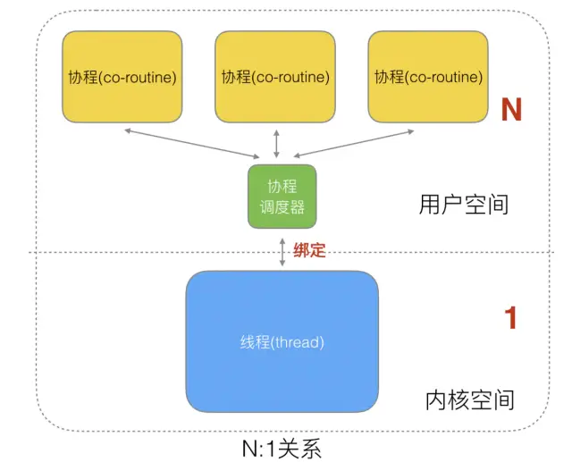

- 优点：协程在用户态线程完成了切换，不会陷入内核态，所以**切换轻量快速**
- 缺点：1个进程的所有协程都绑定在1个线程上，进程**用不了硬件的多核加速能力**，**一旦某个协程阻塞就会造成线程阻塞**，本进程的其他协程都无法执行了，没有了并发能力


**协程：线程 = 1 : 1，1个协程绑定1个线程**

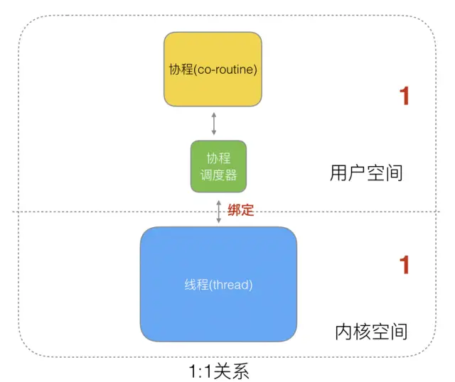

- 优点：最容易实现，协程的调度都由CPU完成了，不存在N:1的缺点
- 缺点：协程的创建、删除、切换的代价都由CPU完成，代价略显昂贵


**协程：线程 = M : N，M个协程绑定N个线程**

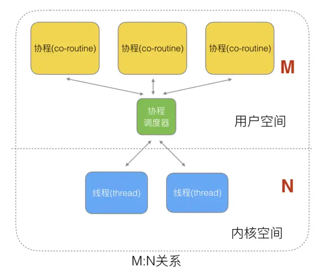

这种模型克服了前面两种模型的缺点，但是实现起来最为复杂


### 1.3 Goroutine

goroutine来自协程的概念，一组协程运行在一个线程之上，即使有协程阻塞，该线程的其他协程也可以被`runtime`调度，转移到其他可运行的线程上。最关键的是，程序员看不到这些底层的细节，这就降低了编程的难度，提供了更容易的并发。 

goroutine非常轻量，一个goroutine只占几KB，并且这几KB就足够goroutine运行完，这就能在有限的内存空间内支持大量goroutine，支持了更多的并发。虽然一个goroutine的栈只占几KB，但实际是**可伸缩的**，如果需要更多内容，`runtime`会自动为goroutine分配。

特点：

- 占用内存更小：几KB
- 调度更灵活：runtime调度


### 1.4 GMP概念

G：goroutine

M：worker thread， or machine，即OS线程（对应了创建的线程数）

P：processor，处理器，包含了运行goroutine的资源（对应了可以同时运行的线程总数的最大值）

如果线程M想运行goroutine，必须先获取P，P中包含了可运行的G队列，从队列中获得G


## 2. 早期的GM调度器

Go1.1版本之前就是用的GM模型

除了G和M之外，还有一个**全局协程队列**，存放的是多个处于**可运行状态的G**，M如果想要运行G，就必须访问全局队列

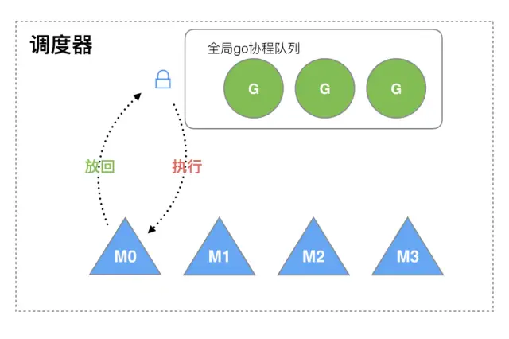

M想要执行、放回G都必须访问**全局G队列**，并且M有多个，即多线程访问同一资源需要加锁进行保证互斥/同步，所以**全局G队列是有互斥锁进行保护的**。当并发量比较大的时候，这把大锁就成了性能瓶颈


缺点：

1. 创建、销毁、调度G都需要每个M获取锁，这就形成了**激烈的锁竞争**。

2. M转移G会造成**延迟和额外的系统负载**。比如当G中包含创建新协程的时候，M创建了G’，为了继续执行G，需要把G’交给M’执行，也造成了很差的局部性，因为G’和G是相关的，最好放在M上执行，而不是其他M'。

3. 系统调用(CPU在M之间的切换)导致频繁的线程阻塞和取消阻塞操作**增加了系统开销**。


## 3. GMP调度器

老的调度器存在诸多不足，于是就弃用了，Golang重新设计了调度器，在GM之间引进了`P`

P的加入，还带来了一个**本地协程队列**，跟前面的**全局队列**类似，也是用于存放可运行的G，M想要运行G的时候，会优先从本地队列拿，访问本地队列当然是无需加锁了。全局协程队列依然是存在的，但是功能被弱化了，不到万不得已的时候是不会去全局队列里拿G的

> **M想要运行G，就得先获取P，然后从P的本地队列获取G**

最终形成了GMP模型：


1. **全局队列**：存放等待运行的 G。
2. **P 的本地队列**：同全局队列类似，存放的也是等待运行的 G，存的数量有限，` 不超过 256 个`。新建 G’时，G’优先加入到 P 的本地队列，如果本地队列满了，则会`把G'加入到全局队列(Go1.13)`。
3. **P 列表**：**所有的 P 都在程序启动时创建，并保存在数组中，最多有 GOMAXPROCS(可配置) 个**。 `allp []*p`
4. **M**：线程想运行任务就得获取 P，从 P 的本地队列获取 G，P 队列为空时，M 也会尝试从全局队列拿一批 G 放到 P 的本地队列，或从其他 P 的本地队列偷一半放到自己 P 的本地队列。M 运行 G，G 执行之后，M 会从 P 获取下一个 G，不断重复下去

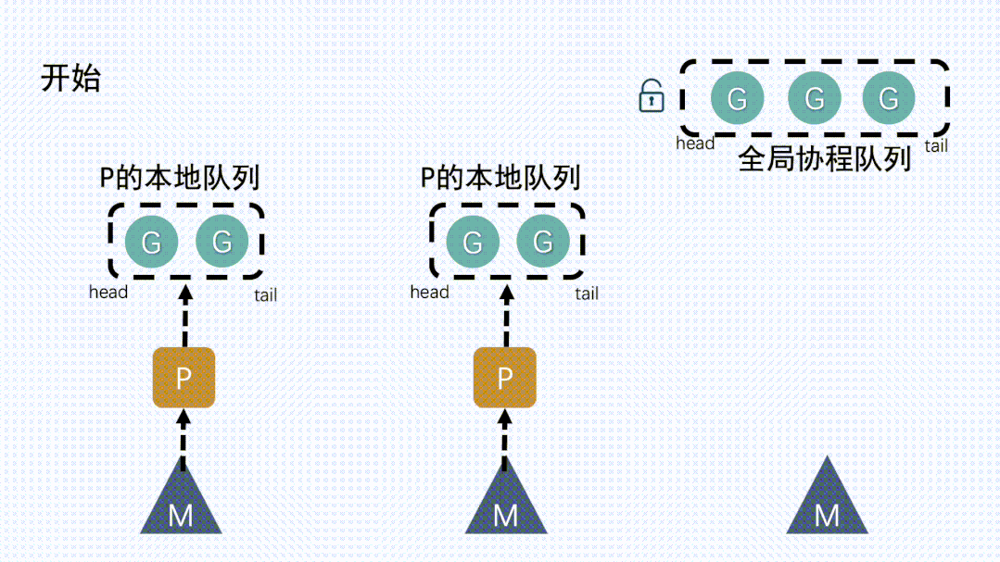


**新建G时**，G会优先加入到P的本地队列，如果本地队列满了，则会把本地队列中一半的G移动到全局队列。当P的本地队列为空的时候，就从全局队列去拿G：

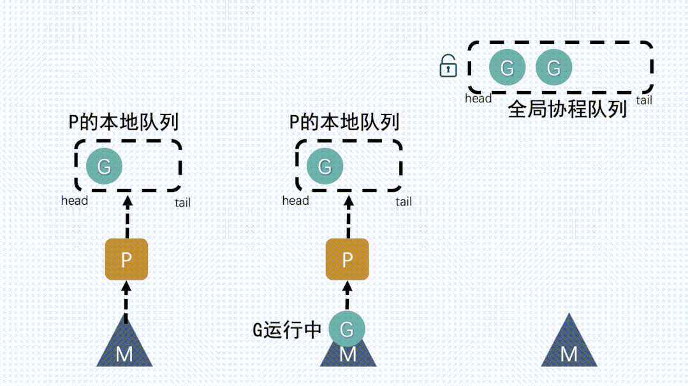


如果**全局队列也为空**，M会从其他P的本地队列**偷(stealing)一半G**放到自己P的本地队列：

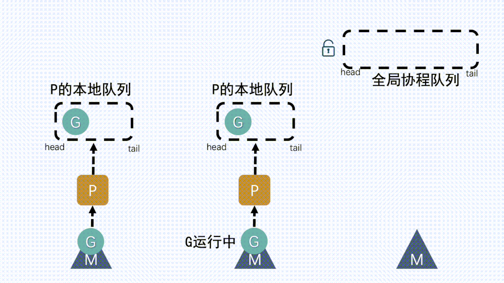


M运行G，当G执行之后，M会从P获取下一个G，不断重复下去


### 3.1 P和M的个数

**P的数量：**

启动时，由环境变量`GOMAXPROCS`或者是由 runtime 的方法 `GOMAXPROCS()` 决定。

这意味着在程序执行的任意时刻都只有 `GOMAXPROCS` 个 goroutine 在同时运行


**M的数量**

go语言的限制：go程序启动的时候，会设置M的最大值为10000，但是内核很难支持这么多线程，这个限制可忽略

runtime/debug中的 `SetMaxThreads` 函数，设置M的最大数量

**一个M阻塞了，可能会创建新的M**


**M的数量和P的数量没有绝对关系**，一个M阻塞，Ｐ就会取创建或者切换到另一个Ｍ，所以，即使Ｐ的数量是１，也有可能创建很多个M出来


### 3.2 P和M的创建时机

在确定了P的最大数量n后，runtime会根据这个值直接创建n个P出来

如果没有足够的M来关联P以运行G。**比如所有的M阻塞了，P还有就绪任务G或者有GC worker等，就会为P寻找空闲的M，如果没有空闲的，就会创建新的M**


### 3.3 调度器的设计策略

**复用线程**： 避免频繁的创建和销毁线程，而是直接对线程的复用

1. `work stealing机制`：当M**没有G可运行时**，会依次按照以下规则来窃取，而不是销毁线程

   `runtime.schedule` 函数会从下面几个地方查找待执行的 Goroutine：

   1. 为了保证公平，当全局运行队列中有待执行的 Goroutine 时，通过 `schedtick` 保证有一定几率会从全局的运行队列中查找对应的 Goroutine；
   2. 从处理器本地的运行队列中查找待执行的 Goroutine；
   3. 如果前两种方法都没有找到 Goroutine，会通过 `runtime.findrunnable`进行阻塞地查找 Goroutine；

   `runtime.findrunnable`的实现非常复杂，这个 300 多行的函数通过以下的过程获取可运行的 Goroutine：

   1. 从本地运行队列、全局运行队列中查找；
   2. 从网络轮询器中查找是否有 Goroutine 等待运行；
   3. 通过 `runtime.runqsteal`尝试从其他随机的处理器中窃取待运行的 Goroutine，该函数还可能窃取处理器的计时器；

2. `hand off机制`：当本线程的**G阻塞时**，会释放绑定的P，将P转移为其他空闲的线程执行

   系统调用封装成`entrysyscall->INVOKE_SYSCALL->exitsyscall`，在进入真正的系统调用 `INVOKE_SYSCALL` 之前，会在`entrysyscall` 里面进行一些准备工作，然后调用`handoffp`，该函数会看P本地队列上或全局队列上是否有可运行的G或者可运行的GC worker等，如果有就调用 `startm(p, false)`，尝试获取空闲的M或者创建新的M，并绑定该P，这样就能实现一个M因为G阻塞时，不至于该P上的所有G都阻塞

   

例如下面的例子，main函数在P1上运行并创建goroutine，当第一批goroutine进入P1的本地队列的时候，P0正在寻找任务。然而它的本地队列，全局队列和网络轮询器都是空的，所以最后就从P1中窃取任务，从这7个goroutine中偷走了4个，其中一个立马在P0执行了，剩余的3个放到P0的本地队列

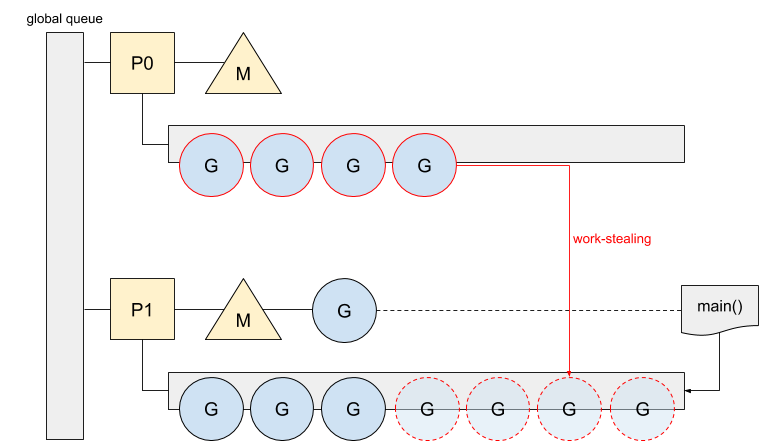

**利用并行**：`GOMAXPROCS` 设置 P 的数量，最多有 GOMAXPROCS 个线程分布在多个 CPU 上同时运行。GOMAXPROCS 也限制了并发的程度，比如 GOMAXPROCS = 核数/2，则最多利用了一半的 CPU 核进行并行


**抢占：** 在coroutine中要等待一个协程主动让出cpu才执行下一个协程。在go中，**一个goroutine最多占用CPU 10ms**，防止其他goroutine被饿死，这就是goroutine不同于coroutine的一个地方


**全局G队列**：在新的调度器中依然有全局G队列，但是功能被弱化了，当M执行work stealing 从其他P偷不到G时，它可以从全局队列中获取G


### 3.4 go func()调度流程

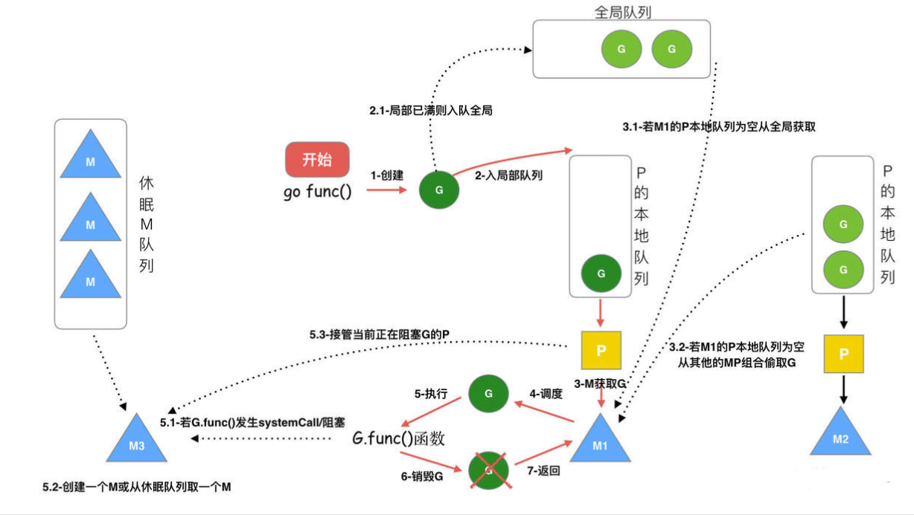

1. go func() 创建一个 goroutine
2. 新创建的G会优先保存到P的本地队列中，如果本地队列满了则会保存到全局队列
3. G只能运行在M中，一个M必须持有P才能运行P中的G，P的本地队列为空的时候就会触发`work stealing`机制
4. 一个M调度G执行的过程是循环的，不断的从P中取出G执行
5. 如果M执行某一个Ｇ的时候发生了系统调用或其他阻塞操作，**M会阻塞，runtime会把这个M从P中摘除，然后去取出一个空闲的Ｍ来服务这个P (如果没有空闲M则创建M)**
6. 当M的系统调用完成后，会**尝试获取一个空闲的P，把G加入到P的本地队列。如果获取不到P，那么这个M就会休眠，加入到M的空闲队列，然后这个G会被放入全局队列中**

当系统调用结束后，会调用退出系统调用的函数 `runtime.exitsyscall`为当前 Goroutine 重新分配资源，该函数有两个不同的执行路径：

1. 调用 `runtime.exitsyscallfast`；
2. 切换至调度器的 Goroutine 并调用 `runtime.exitsyscall0`；

这两种不同的路径会分别通过不同的方法查找一个用于执行当前 Goroutine 处理器 P，快速路径 `runtime.exitsyscallfast`中包含两个不同的分支：

1. 如果 Goroutine 的原处理器处于 `_Psyscall` 状态，会直接调用 `wirep` 将 Goroutine 与处理器进行关联；
2. 如果调度器中存在闲置的处理器，会调用 `runtime.acquirep`使用闲置的处理器处理当前 Goroutine；

另一个相对较慢的路径 `runtime.exitsyscall0`会将当前 Goroutine 切换至 `_Grunnable` 状态，并移除线程 M 和当前 Goroutine 的关联：

1. 当我们通过 `runtime.pidleget`获取到闲置的处理器时就会在该处理器上执行 Goroutine；
2. 在其它情况下，我们会将当前 Goroutine 放到全局的运行队列中，等待调度器的调度；

### 3.5 调度的生命周期，M0和G0

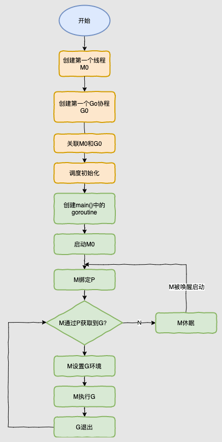

**M0**：`M0`是go程序启动后的编号为0的主线程，这个M对应的实例在全局变量 `runtime.m0` 中，不需要在heap上分配，M0负责执行初始化操作和启动第一个G，即`G0`，之后M0就和其他M一样了

**G0**：`G0`是每次启动一个M都会第一个创建的goroutine，`G0仅用于负责调度G`，不指向任何可执行的 函数，**每个M都会有一个自己的G0**。在调度或者系统调用的时候会使用G0的栈空间，全局变量的G0是属于M0的G0


### 3.6 调度循环

- `schedule()`：找到可用的g，然后调用 `execute()`

- `execute()`：设置该g的初始状态，然后调用`gogo`
- `gogo`：用汇编实现，先把 `goexit` 的PC值压栈，然后执行当前g，等g的函数返回时，就获取到 `goexit` 的起始地址弹出到PC中，开始执行 `goexit`
- `goexit()`：该函数会将 Goroutine 转换会 `_Gdead` 状态、清理其中的字段、移除 Goroutine 和线程的关联并调用 [runtime.gfput](https://draveness.me/golang/tree/runtime.gfput) 重新加入处理器的 Goroutine 空闲列表 `gFree`。最后调用 `schedule` 进行新一轮的调度

## 4. Go调度器场景解析

### 4.1 创建G

P 拥有 G1，M1 获取 P 后开始运行 G1，G1 使用 `go func()` 创建了 G2，为了局部性 G2 优先加入到 P1 的本地队列。


### 4.2 本地切换G

G1 运行完成后 (函数：`goexit`)，M 上运行的 goroutine 切换为 **G0**，**G0 负责调度时协程的切换**（函数：`schedule`）。从 P 的本地队列取 G2，从 G0 切换到 G2，并开始运行 G2 (函数：`execute`)。实现了线程 M1 的复用。

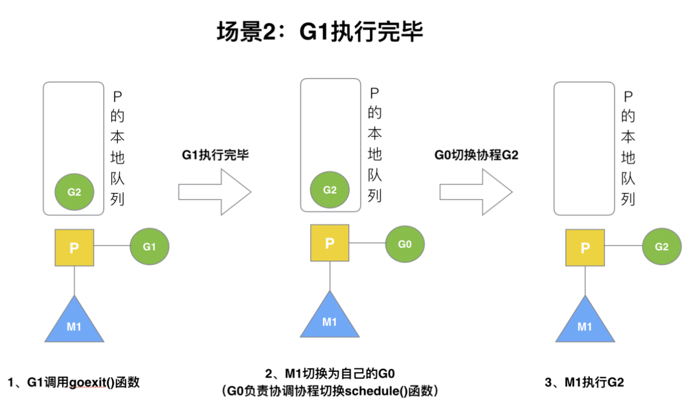


### 4.3 本地队列满了

G2想要创建6个G，假设P1的本地队列只能存放4个G，这时候，G3，G4，G5，G6都成功放下了，G7加入的时候发现P1的本地队列满了，于是执行**负载均衡，把P1中本地队列中的`前一半的G打乱顺序`，还有新创建的`G7`一起转移到全局队列**

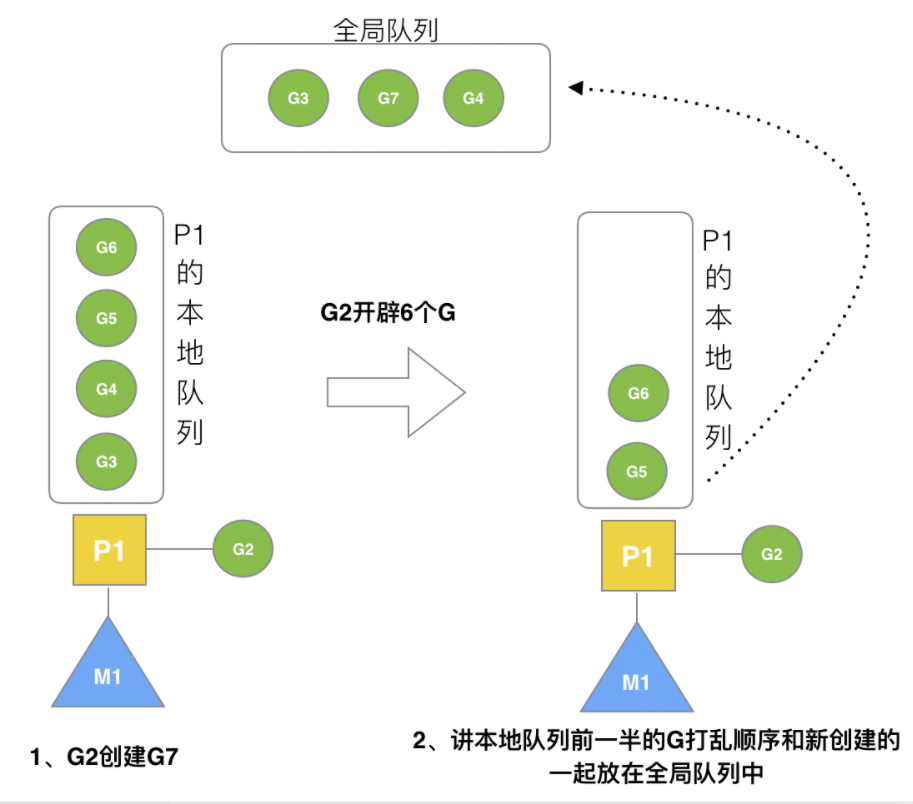

这时候，G2还要创建G8，**G8这时候P1的本地队列已经不满了**，于是直接加入到了P1的本地队列！！！

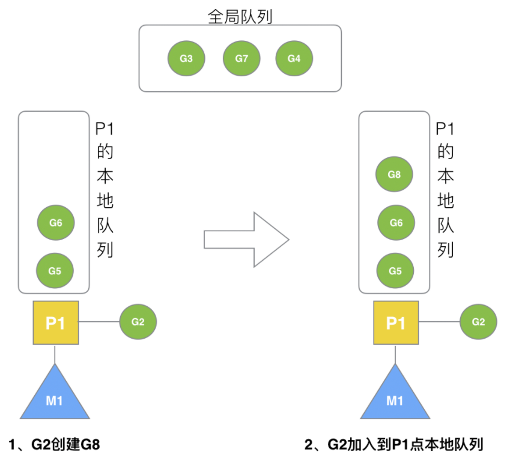

### 4.4 创建G会唤醒MP

规定：**在创建 G 时，运行的 G 会尝试唤醒其他空闲的 P 和 M 组合去执行**。

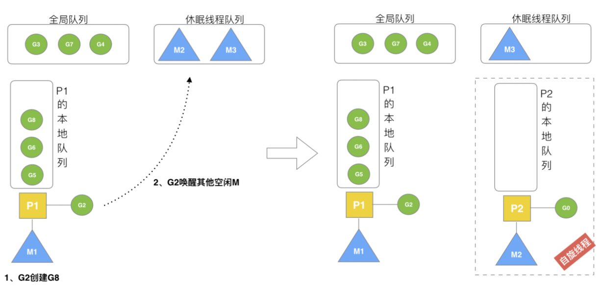

假设G2唤醒了M2，M2绑定了P2，开始运行G0，但是P2本地队列没有G，M2此时为自旋线程，不断的寻找G


### 4.5 从全局队列取G

由于`work stealing`机制，M2 尝试从全局队列 (简称 “GQ”) 取一批 G 放到 P2 的本地队列（函数：`findrunnable()`）。M2 从全局队列取的 G 数量符合下面的公式：

```go
n = min(len(GQ)/GOMAXPROCS + 1, len(GQ/2))
```

即：至少要从全局队列取出1个G，但是每次不要从全局队列移动太多的G到P的本地队列(不超过一半)，要给其他P留点，这时从全局队列到P本地队列的负载均衡

假设一共有4个P（`GOMAXPROCS=4`），那么我们允许最多能有4个P供M使用。所以M2只能从全局队列取出1个G移动到P2，然后完成从G0到G3的切换，运行G3

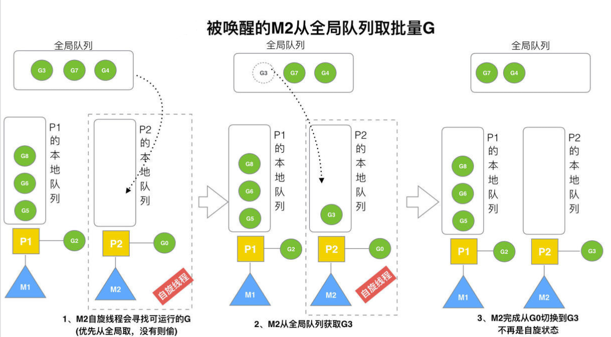


### 4.6 从其他P窃取G

假设 G2 一直在 M1 上运行，经过 2 轮后，M2 已经把 G7、G4 从全局队列获取到了 P2 的本地队列并完成运行，全局队列和 P2 的本地队列都空了，如下图的左半部分

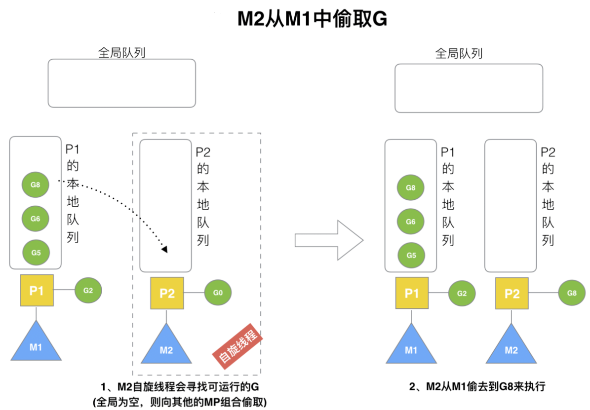

全局队列已经没有 G，那 m 就要执行 work stealing (偷取)：从其他有 G 的 P 那偷取一半 G 过来，放到自己的 P 本地队列。P2 从 P1 的本地队列**尾部取一半的 G**，本例中一半则只有 1 个 G8，放到 P2 的本地队列并执行


### 4.7 自旋线程数量的限制

G1 本地队列 G5、G6 已经被其他 M 偷走并运行完成，当前 M1 和 M2 分别在运行 G2 和 G8，M3 和 M4 没有 goroutine 可以运行，M3 和 M4 处于自旋状态，它们不断寻找 goroutine

为什么要让 m3 和 m4 自旋，自旋本质是在运行，线程在运行却没有执行 G，就变成了浪费 CPU. 为什么不销毁现场，来节约 CPU 资源。因为创建和销毁 CPU 也会浪费时间，我们希望当有新 goroutine 创建时，立刻能有 M 运行它，如果销毁再新建就增加了时延，降低了效率。当然也考虑了过多的自旋线程是浪费 CPU，所以系统中**最多有 GOMAXPROCS 个自旋的线程** (当前例子中的 GOMAXPROCS=4，所以一共 4 个 P)，多余的没事做线程会让他们休眠（`notesleep()`）

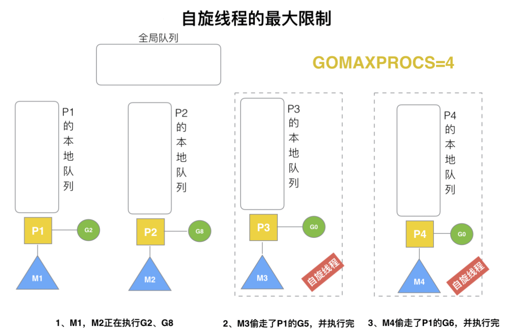


### 4.8 G阻塞的情况

假定当前除了 M3 和 M4 为自旋线程，还有 M5 和 M6 为空闲的线程 (没有得到 P 的绑定，注意我们这里**最多就只能够存在 4 个 P，所以 P 的数量应该永远是 P<=M**, 大部分都是 **M 在抢占需要运行的 P**)

G8 创建了 G9，G8 进行了阻塞的系统调用，**M2 和 P2 立即解绑**，P2 会执行以下判断：如果 P2 本地队列有 G 或全局队列有 G 或有空闲的 M，P2 都会立马唤醒 1 个 M 和它绑定，否则 P2 则会加入到空闲 P 列表，等待 M 来获取可用的 P。

本场景中，P2 本地队列有 G9，可以和其他空闲的线程 M5 绑定

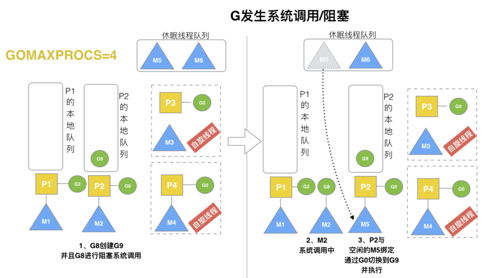


### 4.9 非阻塞的系统调用

G8 创建了 G9，假如 G8 进行了**非阻塞系统调用**。(CGo会是这种方式，见`cgocall()`)

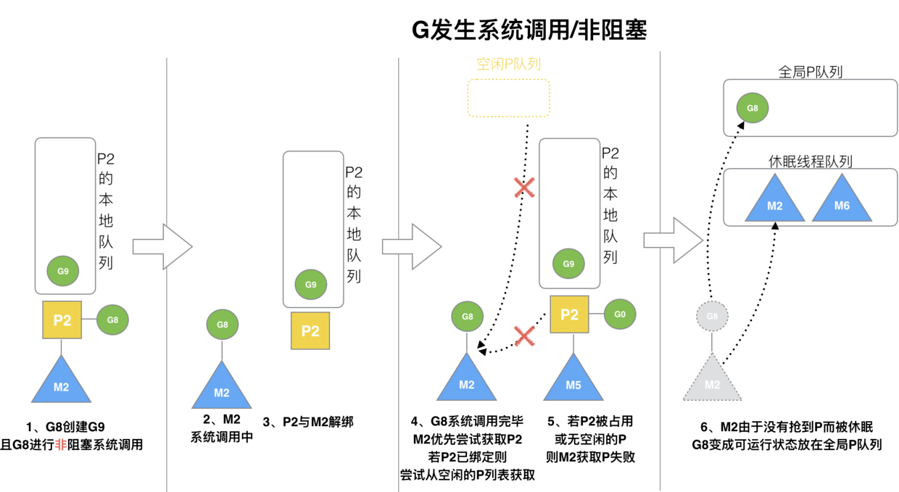

 M2 和 P2 会解绑，但 M2 会记住 P2，然后 G8 和 M2 进入系统调用状态。当 G8 和 M2 退出系统调用时，会尝试获取 P2，如果无法获取，则获取空闲的 P，如果依然没有，G8 会被记为可运行状态，并加入到全局队列，M2 因为没有 P 的绑定而变成休眠状态 (长时间休眠等待 GC 回收销毁)。

### 4.10 柔和抢占

假设有下面的Go代码，程序执行之初将P设置为1，开两个goroutine，一个是main，一个是执行死循环的匿名函数

```go
package main

import (
    "fmt"
    "runtime"
    "time"
)

func main() {
    runtime.GOMAXPROCS(1)

    fmt.Println("The program starts ...")

    go func() {
        for {
        }
    }()

    time.Sleep(time.Second)
    fmt.Println("I got scheduled!")
}
```

在go1.12前，goroutine是协作式调度，所以main在sleep的时候让出执行权给匿名goroutine执行，匿名goroutine死循环出不去，又无法被抢占，就会使得程序陷入无限循环，不会结束


Go调度在go1.14实现了抢占，应该更精确的称为**基于系统信号的异步抢占调度**，因为go调度器的抢占很柔和，不会说时间片到了或者更高优先级的任务到了就直接执行抢占调度，**go的抢占柔和到只给goroutine发送1个抢占请求，至于goroutine何时停下来，那就不管了**

发出抢占请求需要满足两个条件之一：

1. 当前G进行系统调用超过20us
2. G运行时间超过10ms

调度器在启动的时候会启动一个单独的线程`sysmon`，它负责所有的监控工作，其中一项就是 `抢占`，发现满足抢占条件的G时，就会向当前线程发出抢占信号


## 5. goroutine栈切换


`g0` 栈用于执行调度器的代码，执行完之后，要跳转到执行用户代码的地方，如何跳转？这中间涉及到栈和寄存器的切换。要知道，函数调用和返回主要靠的也是 CPU 寄存器的切换。`goroutine` 的切换和此类似。


# 面试题


## 1. slice, map, array 和 string


## 2. select 和 chan


## 3. defer, panic 和 recover


## 4. 接口和反射


## 5. make 和 new


## 6. context 和 unsafe

[标准库 - 《Go 语言问题集(Go Questions)》 - 书栈网 · BookStack](https://www.bookstack.cn/read/qcrao-Go-Questions/stdlib.md)

## 7. 内存分配和GC


## 8. GMP


## 9. sync包

##


