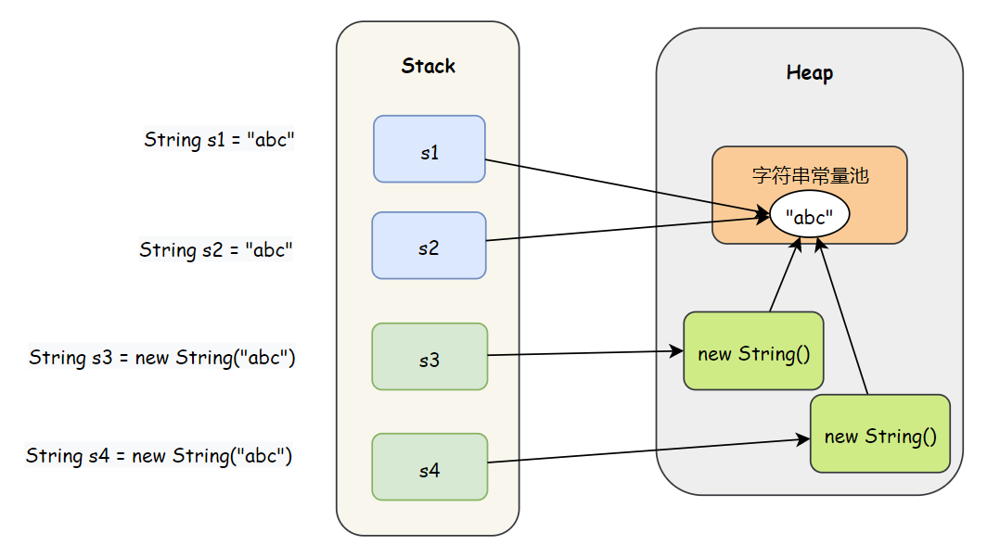

# java内存划分   
## 1. 栈：存放方法的局部变量
局部变量：方法的参数和方法内部的变量    
作用域：超出作用域，立刻从栈内存中消失   
## 2. 堆：new出来的东西，成员变量
堆内存里的东西都有一个地址值：16进制   
堆内存里的数据都有默认值，规则：  
    整数（0）   浮点数（0.0）   字符（'\u0000'）    布尔(false)       引用类型（null）

## 3.方法区(Method area)：存储.class相关信息，包含方法的信息
## 4.本地方法栈(Native method stack)：与操作系统相关
## 5.寄存器(pc Register)：CPU

# Scanner 中的坑
- `nextInt, nextDouble, nextFloat` : 获取一个指定类型的数据，遇到结束符不再获取
- `next()` : 不能得到带空格的字符串，一定要读取到有效字符后才可以结束，结束条件是非有效字符(空格、tab、回车\r)      
- `nextLine()` : 以回车为结束符，返回回车之前的所有字符，可以获得空白，但是可能会获得上一次输入后的回车键而直接结束       


​          
~~~java
        Scanner sc = new Scanner(System.in);
        int a = sc.nextInt();
        String s1 = sc.next();
        String s2 = sc.nextLine();
        System.out.println("a:"+a);
        System.out.println("s1:"+s1);
        System.out.println("s2:"+s2);
~~~
输入输出：
~~~java
    11111			123you		jkk
a:11111
s1:123you
s2:		jkk
~~~

Scanner是一个扫描器，它扫描数据都是去内存中一块缓冲区中进行扫描并读入数据的，而我们在控制台中输入的数据也都是被先存入缓冲区中等待扫描器的扫描读取。这个扫描器在扫描过程中判断停止的依据就是“结束符”，空格，回车，tab 都算做是结束符
可以看到 `nextInt` 和 `next` 并不会获取到空格，全部自动跳过，而且会把这些结束符留在缓冲区中(nextDouble、nextFloat同理)，当 `nextLine` 读取的时候就会读取到

~~~java
    int a = sc.nextInt();
    String s = sc.nextLine();
    System.out.println("a:"+a);
    System.out.println("s:"+s);
~~~

此时，因为第一次输入完后回车了，不管第二次输入什么，s 的值都将为""值，因为s一开始就读取到了结束符  
解决的办法是使用一个 `nextLine()` 把回车吸收掉      

~~~java
    int a = sc.nextInt();
    sc.nextLine();//提前吞掉空格，防止后面吞掉
    String s = sc.nextLine();
~~~

所以如果不是必须要获得空格和tab，尽量不要使用 `nextLine()`

# Java基础知识

## 1. Java核心机制

* **java虚拟机**：解释型语言，.java编译成.class 提供给各个平台的java虚拟机翻译。**一次编译，随处运行**

* **垃圾收集机制**：java有自己的垃圾收集器，自动进行，程序员无法精确控制和干预。**提供了程序的健壮性**

## 2. J2SDK和JRE

* J2SDK:Software Development Kit(软件开发包)。**开发需要JDK**
* JRE:Java Runtime Environment(JAVA运行环境)。**用户需要JRE运行环境**

## 3. java程序结构

* Java源文件是.java。源文件的的基本组成是类(class)
* **一个源文件最多只能有一个public类。** 其他类的个数不限，一个类对应一个.class文件。**源文件名必须和public类名一致。**
* **java程序执行的入口是main()方法。** 格式：**public static void main(String args[]){...}**,args是变量名，不固定
* **java语言严格区分大小写**
* java方法有一条条语句构成，每个语句以分号结束。

## 4. 安装与配置

* UltraEdit,jdk,eclipse,MarkdownPad
* **系统环境变量的配置**：copy jdk/bin文件夹目录(里面有javac.exe java.exe)，放path里的前面(系统找的时候从前往后)
* **查看javac版本**：cmd中输入javac -version
* path:windows系统执行命令时要搜寻的路径
* classpath:java在编译和运行时要找的class所在的路径
* UltraEdit->设置->文件处理:不备份  去掉.bak文件
  ##编译和运行
* 编译:  D:\>cd java   javac HelloWorld.java
* 运行:  D:\java>java HelloWorld

----

# Java基础语法

* 包：全部小写
* 类或接口：每个单词首字母大写
* 方法或变量：从第二个单词开始首字母大写
* 常量：每个字母大写，单词用_隔开

## 1. 标识符

* 标识符由字母，下划线，美元符或者数字组成
* 标识符以字母，下划线，美元符开头
* Java标识符对大小写敏感，长度无限制
* Java标识符不能与Java语言的关键字重名

## 2. Java常量

* 整型常量int，实型常量float，字符常量char(`a`)，逻辑常量(true false)，字符串常量string("asas") ,final(值不能改变的量)

## 3. Java变量

* 变量使用前必须声明
* 本质上，变量是内存的一小块区域，使用变量名来访问这块区域
* **double d1,d2,d3=0.123; 表示d3=0.123，d1,d2并没有赋值**
* **程序执行过程中的内存管理**:

1. code segment：存放代码
2. data segment：存放静态变量、字符串常量
3. stack(栈)：存放局部变量
4. heap(堆)：存放new出来的东西

### Java变量的分类

* 按声明的位置划分：**局部变量**(方法或语句块内部定义的变量)、**成员变量**(方法外部、类的内部定义的变量)。
**类外面不能有变量的声明**。  
**变量作用域只在它所在的那个大括号里**

* 按所属的数据类型划分：基本数据类型、引用数据类型  

### Java的数据类型

* 基本数据型
    - 数值型：整数类型(byte,short,int,long)、浮点类型(float,double)
    - 字符型(char)
    - 布尔型(boolean)

* 引用数据型
  * 类(class)
  * 接口(interface)
  * 数组  

* 整数类型  

  1. **三种表示形式**：  
     十进制整数：12  
       八进制整数：以0开头，如012。  
       十六进制整数：以0x或0X开头，如0x12。
  2. **整形常量默认为int类型，声明long时必须在常量后加'l'或者'L'如：int i1=600;long i2=88888888l;**
  3. **byte 8位1个字节(最大128-1)  short 2字节(最大32768-1)  int 4字节  long 8字节皆表示带符号的数**

* 浮点类型  

  1. **两种表示形式**：  
     十进制数：  
       科学计数法：3.14e2
  2. **浮点数默认为double型,float型后面加f或者F。double d=12345.6;  float f=12.3f;**  
     **float占4字节,double占8字节**

### 数据类型的转换  

* boolean类型不可以转换为其他的数据类型

* 整形，字符型，浮点型的数据在混合运算中相互转换。  
  byte,short,char->int->long->float->double  
  **byte,short,char之间不会相互转换，计算时首先会转换成int**    
  容量大的往容量小的转换时要加强制转换符，但可能会使精度降低或溢出。
  多种类型混合运算时，系统先将所有数据转换成最大的哪一种数据类型运算  

* 强制转换:   
  **注意自动转换对变量和对常量的区别**   

  ~~~java
  int i = 1,j = 2;  
  float f1 = (float)((i + j)*1.2)      
  byte b1 = 1;       
  byte b2 = 2;     
  byte b3 = (byte)(b1+b2);//系统自动将byte转换为int,  需要强制转换符  
  byte b1 += 1; //没有错，扩展的赋值运算符其实隐含了一个强制类型转换(b+=1不等价于b = b +1 而是等价于b = (b的类型)(b+1))</pre>  
  ~~~

  但是如 byte a = 3+4;编译器先做3+4算出来的结果若不溢出则直接赋予a，而不会自动转换，溢出则报错。

* 强制转换时，大转小，直接丢弃高位，低位按有符号数的补码算。如  
  byte a = (bayte) 130;  00000000 00000000 00000000 10000010 变为10000010[补] 即11111110[原] = -126 

## 4. 字符串和字符串常量池
- String是常量，不可变，为了效率和安全


- 字符串的分配，和其他的对象分配一样，耗费高昂的时间与空间代价，作为最基础的数据类型，大量频繁的创建字符串，极大程度地影响程序的性能

- JVM为了提高性能和减少内存开销，在实例化字符串常量的时候进行了一些优化

  - 为字符串开辟一个字符串常量池，类似于缓存区
  - 创建字符串常量时，**首先检查字符串常量池是否存在该字符串** 
  - 存在该字符串，返回引用实例，不存在，实例化该字符串并放入池中

- 实现的基础
  - 实现该优化的基础是因为字符串是不可变的，可以不用担心数据冲突进行共享
  - 运行时实例创建的全局字符串常量池中有一个表，总是为池中每个唯一的字符串对象维护一个引用,这就意味着它们一直引用着字符串常量池中的对象，所以，在常量池中的这些字符串不会被垃圾收集器回收
  
- **jdk1.8的String底层采用char数组，jdk1.9开始用byte数组**，因为大多数字符都是Latin1(ISO-8859-1，8位编码，向下兼容ASCII码)，用一个字节存储即可，增加了一位标志位，对于Latin1以外的字符，使用两个字节存储

- **String的String Pool是一个固定大小的HashTable(无重复)**，默认大小是1009(jdk6)、60013(jdk7)。放入String Pool的String非常多时就会Hash冲突严重，链表很长，调用String.intern()时性能大幅下降

### 4.1 字符串常量池的布局
**jdk1.8开始，把永生代换成了元空间，字符串常量池从方法区移到了Java堆中**
- jdk1.8取消了永生代，设立了元空间(详细见JVM篇)，由于永生代内存经常不够用，可能会发生OOM。


~~~java
String str1 = "abc";
String str2 = "abc";
String str3 = new String("abc");
String str4 = new String("abc");

System.out.println(str1 == "abc" ); //true
System.out.println(str1 == str2 ); //true
System.out.println(str2 == str3 ); //false
System.out.println(str3 == str4 ); //false
~~~
- **直接赋值创建String对象** 会直接在常量池中创建对象
- **使用构造器new的是在常量池中的字符串对象时：** 字符串常量池中已经存在相同内容的字符串常量，所以会在堆中创建该字符串对象的引用，然后将这个引用指向常量池中已经存在的字符串，str4!=str5的原因是比较的实际上是堆上的地址，当然不同了。
- **使用构造器new的是不在常量池中的字符串对象时：** new创建的字符串也会被放到字符串常量池中，实际上创建了2个对象



### 4.2 字符串拼接


- jdk1.8的编译器对于字符串常量的拼接做了优化，**常量与常量的拼接结果在常量池，只要有一个是变量，结果就在堆中(非常量池区域)**

~~~java
String s1 = "abc";
final String s2 = "ab";
String s3 = s2 + "c";
System.out.println(s1 == s3);  //true
~~~
- final 修饰的依然是常量，编译器依然可以像上面一样进行优化


~~~java
String s1 = "abc";
String s2 = "ab";
String s3 = s2 + "c";
System.out.println(s1 == s3);  //false
~~~
- 非字符串常量的拼接无法优化，实际上是以s2未基础创建一个StringBuilder对象，调用append方法来进行拼接，再用toString方法在堆中创建一个String对象的，并把这个String对象的引用赋给s3

### 4.3 intern方法
- String.intern()是一个Native方法，它的作用是，**如果字符串常量池已经包含一个equals此String对象的字符串，则返回字符串常量池中这个字符串的引用，否则将当前String对象的引用地址(堆中)添加到字符串常量池中并返回。**

- **intern() 确保字符串在内存中只有一份拷贝，节约内存空间，加快字符串操作任务的执行速度**：`String s = new String("abc").intern()` 这样字符串对象就可以被gc回收，只留下常量池中的字符串

1. 字符串常量池中已经存在该字符串
~~~java
String s1 = new String("abcc");    //在Heap中创建对象，在常量池中添加 "abcc"
String s2 = s1.intern();           //s1的值在常量池中，返回常量池中"abcc"的引用地址
System.out.println(s1 == s2);      //false  s1是Heap中对象的地址，s2是常量池中字符串的地址 

String s3 = "abcc";  
System.out.println(s2 == s3);      //true   都是常量池中字符串的引用地址
~~~

2. 字符串常量池中不存在该字符串
~~~java
String s1 = new String("ab")+"cc"; //常量池中只有ab 和 cc
String s2 = s1.intern();           //常量池中不存在abcc，将堆中String对象的引用地址添加到常量池中
System.out.println(s1 == s2);      //true

String s3 = "abcc";                //常量池中存在abcc了，是s1的引用地址
System.out.println(s2 == s3);      //true
System.out.println(s1 == s3);      //true

String s4 = new String("abcc");
String s5 = s4.intern();           //s5还是s1的引用地址
System.out.println(s4==s5);        //false
~~~

- **在jdk1.6中，String.intern()方法调用后，如果String Table中没有该字符串，就会把该对象复制一份，放入String Table，返回String Table中的对象地址**
- **在jdk1.7中，如果String Table中没有该字符串，会把对象的引用地址复制一份，放入String Table，并返回String Table中的引用地址**

### 4.4 String相关类
- 当有少量连接操作时，使用String
- 当单线程下有大量连接操作时，使用StringBuilder
- 当多线程下有大量连接操作时，使用StringBuffer

**循环中拼接，使用StringBuilder，避免使用 “+” 频繁的创建StringBuilder对象，避免在字符串常量池产生大量无用的中间字符串，而且可以通过构造函数直接指定底层数组的大小，避免扩容**
~~~java
    @Test
    public void test(){
        long time1 = System.currentTimeMillis();

        String s = "";
        for (int i = 0; i < 100000; i++) {
            s+="a";
        }

        long time2 = System.currentTimeMillis();
        System.out.println(time2-time1); //4263
    }

    @Test
    public void test2(){
        long time1 = System.currentTimeMillis();

        StringBuilder sb = new StringBuilder(10000);
        for (int i = 0; i < 100000; i++) {
            sb.append("a");
        }

        long time2 = System.currentTimeMillis();
        System.out.println(time2-time1); //5
    }
~~~

### 4.5 面试题

1. `String s = new String("a")` 和 `String s = new String("a") + new String("b")` 分别创建了几个对象？


2. **intern() 的执行结果**
~~~java
        String s = new String("1");
        s.intern(); //本来String Table就存在1，这句没用
        String s2 = "1";
        System.out.println(s==s2);

        String s3 = new String("1") + new String("1"); //返回的是new String()，常量池不存在11
        s3.intern();
        String s4 = "11";
        System.out.println(s3==s4);
~~~

s.intern() 由于new String("1")本来就会在字符串常量池中生成"1"，所以这句没用。s是堆中string对象，两个肯定不等

在jdk6中，s3.intern() 相当于常量池中创建了一个新的对象"11"，也就有了新的地址，所以结果是false
在jdk7中，s3.intern() 常量池没有创建对象“11”，而是创建了一个指向对空间中 new String("11") 的引用。所以结果是true

# 数组
## 1. 初始化  
~~~java
    int[] a = new int[10];  //动态初始化，指定长度
    int[] b = new int[]{1,2,3}; //静态初始化，指定内容
    int[] c = {1,2,3,4};  //静态初始化，省略格式
~~~
## 2. 数组长度
~~~java
    a.length
~~~

# 面向对象
## 1. 类  
### 1.1 访问控制
- **private:** 类内部
- **default:** 类内部、同一个包
- **protected:** 类内部、同一个包、不同包的子类
- **public:** 类内部、同一个包、不同包的子类、不同包无关类 
- **对class的修饰权限只可以用public和default(public类可以在任意地方被访问，default类只可以被同一个包内部的类访问)** 

- 外部类可以用public/default   
  成员内部类用public/protected/default/private    
  **局部内部类什么都不能写**（但并不是default）


### 1.2 构造方法

- 格式：public 类名称(参数)
- 名字必须和类完全一样，没有返回值，可以重载
~~~java
    public class Student {
        public Student(int age, String name){
            this.age = age;
            this.name = name;
        }

        public Student(String name){
            this.name = name;
        }
        
        public Student(){

        }
    }
~~~

- 没有编写构造方法时，编译器会产生默认构造方法，没有参数，但是一旦写了构造方法，编译器便不会再自动产生构造方法
### 1.3 标准类
- 所有成员变量使用private修饰
- 为每一个成员变量编写一对儿get/set方法
- 编写一个无参构造和一个全参构造

### 1.4 J2SDK中主要的包
- java.lang 包含java语言的核心类，如String、Math、Integer、System和Thread，提供常用功能
- java.awt 包含构成抽象窗口工具集的多个类，用来构建和管理应用程序的图形用户界面(GUI)  
- java.applet 包含applet运行所需的一些类  
- java.net 包含执行与网络相关的操作的类  
- java.io 包含能提供多种输入/输出功能的类  
- java.util 包含一些实用工具，如系统特性，使用与日期日历相关的函数  
- **java.lang中的类使用时不需要引入，其他需要引入！**


### 1.5 String类


1. 字符串是常量，一旦创建，不能改变
2. 3+1种创建方式

~~~java
    String s1 = new String();     //空字符串

    char[] c = new char[]{'a','b','q'};
    String s2 = new String(c);    //根据字符数组创建

    byte[] b = {97, 99, 98};
    String s3 = new String(b);    //根据byte数组创建
    
    String s4 = "hello";          //直接创建
~~~

3. **字符串常量池**：

- 字符串常量池在堆内存中，保存的是byte值
~~~java
    String s1 = "abc";
    String s2 = "abc";
    char[] c = {'a','b','c'};
    String s3 = new String(c);
    System.out.println(s1 == s2);          //true
    System.out.println(s1 == s3);          //false
    System.out.println(s2 == s3);          //false
    System.out.println(s1.equals(s3));     //true
~~~
4. 常用方法  
~~~java
    //截取
    String s1 = "java";
    String s2 = "hellooooasoaosa";
    System.out.println(s1.length());     //获取长度//2
    System.out.println(s1.concat(s2));   //拼接//java
    System.out.println(s1.charAt(1));    //获取指定索引的字符//'a'
    System.out.println(s1.indexOf('j')); //获取字符第一次出现的索引//0
    System.out.println(s1.substring(1,3)); // [1,3)
    
    //替换
    char[] c = s1.toCharArray();          //字符串拆分为字符数组返回
    byte[] b = s1.getBytes();             //获得底层字节数组
    String s3 = s2.replace("o","*");      //内容替换//hell****as*a*sa

    //分割
    String[] s4 = s2.split("o");    //返回字符数组,按正则匹配切分
~~~
### 1.6 说明书和工具类
* **工具类**： 只提供方法的类， **把构造方法定义为静态**，则只能通过类名调用工具类的方法    
* 从java文件提取说明书的格式(帮助文档)：

~~~java
javadoc -d 目录 -author -version Xxx.java   
~~~
* 说明书的制作：
~~~java
/**
* 这是针对数组进行操作的工具类
* @author 作者
* @version V.10
*/
public class ArrayTool {

    //把构造方法私有，外界就不能在创建对象了
    /**
    * 这是私有构造
    */
    private ArrayTool(){}

    /**
    * 这是遍历数组的方法，遍历后的格式是：元素1, 元素2, 元素3, ...
    * @param arr 这是要被遍历的数组
    */
    public static void printArray(int[] arr) {
    ....
    }

    /**
    * 获取指定元素在数组中第一次出现的索引，如果元素不存在，就返回-1
    * @param arr 被查找的数组 
    * @param value 要查找的元素
    * @return 返回元素在数组中的索引，如果不存在，返回-1
    */
    public static int getIndex(int[] arr,int value) {
    ...
    }
}   
~~~


### 1.7 Arrays数组工具类
- public static String toString(数组)：将参数数组变成字符串（格式：[元素1，元素2，元素3...]）
- public static void sort(数组)：将数组升序排序（在原数组修改）

~~~java
    int[] a = {20, 30, 10};
    String s = Arrays.toString(a);   //将数组元素变为字符串
    System.out.println(s);

    Arrays.sort(a);                 //升序排序
    System.out.println(Arrays.toString(a));

运行结果：
[20, 30, 10]
[10, 20, 30]
~~~

### 1.8 Math数学工具类
- public static double abs(double num)   //绝对值
- public static double ceil(double num)  //向上取整
- public static double floor(double num) //向下取整
- public static long round(double num)   //四舍五入

## 2. 局部变量和成员变量   

- 局部变量作用域在方法内，没有默认值，存放在**栈内存**里，随着方法出栈消失  
- 成员变量作用域在整个类，有默认值，存放在**堆内存**里，随着对象被垃圾回收而消失
- static不能修饰局部变量：**没有静态局部变量** 
- **为什么main前面要加static**：static关键字，告知编译器main函数是一个静态函数。也就是说main函数中的代码是存储在静态存储区的，静态方法在内存中的位置是固定的，即当定义了类以后这段代码就已经存在了。如果main()方法没有使用static修饰符，那么编译不会出错，但是如果你试图执行该程序将会报错，提示main()方法不存在。**因为包含main()的类并没有实例化（即没有这个类的对象）**。而使用static修饰符则表示该方法是静态的，不需要实例化即可使用。
### 2.1 静态成员变量
在类中，用static声明的成员变量为静态成员变量，它是该类的公用变量，也称为**类变量**(成员变量又称为实例变量，对象变量)，在第一次使用时被初始化，**对于该类的所有对象来说，static成员变量只有一份，被所有对象共享，可以通过类名调用！！（main方法被虚拟机直接用过类名调用），保存在方法区的静态区**
### 2.2 静态方法
static声明的方法为静态方法，**不需要创建对象就可以加载静态方法**，调用时，不会将对象的引用传递给它，所以**在static方法中不可访问非static的变量和方法**（静态比对象先存在，this随着对象的创建而存在，所以static函数中不能有this关键字）  
* **静态方法不能重写**，方法随类加载，父类和子类中含有的其实是两个没有关系的方法，它们的行为也并不具有多态性  
* 可以通过对象引用或类名访问静态成员

- **静态代码块：** 属于所在类，随类加载

- **执行顺序：** 静态代码块、构造代码块、构造函数
~~~java
public class HelloA {
    public HelloA(){//构造函数
        System.out.println("A的构造函数");    
    }
    {//构造代码块
        System.out.println("A的构造代码块");    
    }
    static {//静态代码块
        System.out.println("A的静态代码块");        
    }
    public static void main(String[] args) {
        HelloA a=new HelloA();
        HelloA b=new HelloA();
    }

}

运行结果：
A的静态代码块
A的构造代码块
A的构造函数
A的构造代码块
A的构造函数

~~~

### 2.3 内部类
- 外部类权限可以用public/default   
  成员内部类权限用public/protected/default/private    
  **局部内部类什么都不能写**（但并不是default）
1. 成员内部类: 

- 内用外可以随意使用，外用内需要有内部类的对象
- 可以在外部类的方法中创建内部类的对象调用内部类方法，实现通过外部类的方法调用内部类的方法
- 直接访问： 外部类.内部类 = new 外部类().new 内部类()
~~~java
修饰符 class 类名称{    //外部类
    private int num = 10;
    修饰符 class 类名称{   //成员内部类
        num = 20
        ...
    }
    ...
}
~~~

~~~java

public class OuterClass {
    int num = 10;
    public class Inner{
        int num = 20;
        public void method(){
            int num = 30;
            System.out.println(num); //30
            System.out.println(this.num); //20
            System.out.println(OuterClass.this.num); //10
        }
    }
}
~~~

2. 局部内部类（包含匿名内部类）:定义在方法中
- 只有当前所属的方法才能使用它
- 局部内部类如果要访问所在方法的局部变量，那么这个局部变量必须是**有效final的**（java8开始final可以省略不写），因为**局部变量在栈内存中，方法结束后就消失了，局部内部类的对象在堆内存中持续存在直到垃圾回收消失，为了避免冲突，局部内部类copy了一份局部变量，必须保证局部变量不会变。**
~~~java
修饰符 class 类名称{    //外部类

    修饰符 返回值类型 方法名(参数){

        class 类名称{  //局部内部类，定义在方法中
            ...
        }
    }
    ...
}
~~~


3. **匿名内部类**（和匿名对象概念区分开）

- 定义格式
~~~java
接口名称 对象名 = new 接口名称(){
    //重写接口的所有抽象方法
};  //最后一定要加;

~~~
- {...} 这些内容才是匿名内部类的内容
- 匿名内部类在创建对象时，只能使用一次，需要多次定义对象时必须单独定义实现类
- 匿名对象只能调用一次方法
- Lambda表达式子本质上还是匿名内部类

- 例子
~~~java
public interface NoName {
    abstract void method();
}

public class NoNameDemo {
    public static void main(String[] args) {
        NoName a = new NoName() {
            @Override
            public void method() {
                System.out.println("匿名内部类实现了方法");
            }
        };
        a.method();    //可以少定义一个类，使用其方法
    }
}
~~~


~~~java
public interface NoName {
    abstract void method1();
    abstract void method2();
}

public class NoNameDemo {
    public static void main(String[] args) {
        NoName a = new NoName() {  //匿名内部类
            @Override
            public void method1() {
                System.out.println("匿名内部类实现了方法1");
            }

            @Override
            public void method2() {
                System.out.println("匿名内部类实现了方法2");
            }

        };
        a.method1();
        a.method2();

        new NoName(){  //匿名对象，只能调用一次方法
            @Override
            public void method1() {
                System.out.println("匿名对象实现了方法1");
            }

            @Override
            public void method2() {
                System.out.println("匿名对象实现了方法2");
            }
        }.method1();
    }
}

~~~


内部类可能会引用外部的三种参数：
1. 外部类的成员变量
2. 外部方法或作用域内的局部变量
3. 外部方法的参数

**内部类使用到的外部方法或作用域内的局部变量和外部方法的参数必须是有效final的** (外部类的成员变量不用)

- 当我们创建匿名内部类的那个方法调用运行完毕之后，因为局部变量的生命周期和方法的生命周期是一样的，当方法弹栈，这个局部变量就会消亡了，但内部类对象可能还存在。 此时就会出现一种情况，就是我们调用这个内部类对象去访问一个不存在的局部变量，就可能会出现空指针异常
- jdk1.8以前的解决办法：使用 final 修饰的局部变量会在类加载的时候进入常量池，即使方法弹栈，常量池的常量还在，也可以继续使用，JVM 会持续维护这个引用在回调方法中的生命周期
- **jdk1.8开始的解决办法：** 内部类将传进来的参数通过自己的构造器**备份到了自己的内部**，自己内部的方法调用的实际是自己的属性而不是外部类方法的参数，所以1.8开始不再需要加final修饰，只需要保证变量是有效final的(即从第一次赋值后便不再进行改变)

### 2.4 静态内部类(嵌套类)    
1. 内部静态类不需要有指向外部类的引用，但非静态内部类需要有对外部类的引用    
2. 非静态内部类能够访问外部类的静态和非静态成员(包括私有)，**静态内部类只能访问外部类的静态成员**，不能访问外部类的非静态成员，但是自身的成员函数可以是静态的也可以是非静态的     
3. 外部类访问内部类必须通过对象访问   
4. 一个非静态内部类不能脱离外部类的对象被创建，一个非静态内部类可以访问外部类的数据和方法，因为他就在外部类里面   
5. **一般来说，内部类用private或public static修饰，private保证数据安全性，不让外界直接访问，static让数据访问更方便**    
6. **局部内部类 访问局部变量，需要局部变量是有效final变量**        
7. 非静态内部类和静态内部类的创建    
~~~java
    //静态内部类的创建，不能通过外部类的对象创建，而只能通过外部类创建内部对象
    OuterClass.StaticInnerClass inner1 = new OuterClass.StaticInnerClass();

    //为了创建非静态内部类，我们需要外部类的实例  
    OuterClass outer = new OuterClass();
    OuterClass.InnerClass inner2 = outer.new InnerClass();

    //也可以一步创建非静态内部类
    OuterClass.InnerClass inner3 = new OuterClass().new InnweClass();
~~~


## 3. 三大特征
### 3.1 封装
- 隐藏细节信息，对外界不可见
1. 方法就是一种封装
2. 关键字private也是一种封装

### 3.2 继承

- 继承是多态的前提，没有继承就没有多态

### 3.3 多态

## 4. 继承
- **继承时private可以继承，但是无法访问**
### 4.1 重名变量
1. 直接通过子类对象访问成员变量：就近原则，子类没有就去父类找
2. 间接通过成员方法访问成员变量：方法属于谁就优先用谁，没有则向上找
3. this关键字，super关键字
### 4.2 方法的重写
- **必须要保证子类的方法参数列表和父类完全一样，返回值只能变为更小(或一样)的范围**
- @override 可以检测是否是正确的重写
- **重写方法的权限必须比父类原方法松(或相等)**
- 子类构造方法中可以**重载**父类的构造函数，重载语句必须是子类构造函数的第一个语句。**不重载时默认调用父类的无参构造。如果父类没有无参构造，必须通过super重载父类构造。**

### 4.3 super关键字的用法
1. 子类的成员方法中访问父类的成员变量和成员方法
2. 子类构造方法中访问父类的构造方法
3. 操作父类的成员，但super不是父类的引用
### 4.4 this关键字
1. 在类的方法定义中使用的this关键字代表使用该方法的对象的引用
2. 当必须指出当前使用方法的对象是谁时要用this
3. 有时使用this可以处理方法中成员变量和参数重名的情况
4. this可以看作是一个变量，它的值是当前对象的引用 

### 4.5 final关键字(c++中的const)  
1. final修饰的**变量不能被重新赋值**，因为这个变量其实是常量！
2. final修饰的**成员变量在初始化时不会被自动赋予初值**，要直接赋值或通过构造函数赋值  
3. final修饰的**方法不能够被重写**
4. final修饰的**类不能够被继承** 
5. final修饰**引用类型时，不能修改它所指向的地址值**，但是该对象堆内存的值是可以改变的！
6. abstract和final不能同时修饰类，互相矛盾

### 4.6 继承中的构造方法
1. **子类的所有构造方法都会自动调用其父类的无参构造方法**    
  - 因为子类继承父类的数据，可能还会使用父类数据，所以子类初始化前一定要先完成父类数据的初始化。    
  - 若父类没有无参构造方法，子类创建对象时会报错。这时子类可以通过super(argument_list)调用父类的带参构造方法，使父类初始化，或者使用this去调用本类的其他成功调用父类构造方法的本类构造方法。 
2. this(...) 表示调用本类构造方法，this.成员方法调用本类成员方法
3. super(...)表示调用父类构造方法，super.成员方法调用父类的成员方法
4. **this(...)或者super(...)，必须写在子类构造方法的第一行** ，否则可能对父类数据进行多次初始化
5. **若一个类的构造方法私有或被final修饰，则该类无法被继承**  
6. 当new一个子类对象时，会调用子类的构造函数,在子类的构造函数中，第一条语句默认会执行**super();**这条语句**调用父类的无参构造函数** (因为会继承父类的变量,所以有必要调用其构造函数,因为有可能构造函数内会对其变量进行初始化)，如果父类的无参构造函数不存在就会出现编译时错误(如果父类手动重写了一个有参构造函数，那么就不存在默认的无参构造函数了，也需要再显示写一个)。但是可以**手动写super(参数...)
* 若子类直接继承父类，而父类定义中把带参构造函数相关的变量定义为私有，如   
~~~java
		class Person{			
			private String name;
			private int age;
			public Person(){}
			public Person(String name, int age){
				this.name = name;
				this.age = age;
			}
		}
~~~
这时，子类不能访父类的成员，则不能直接使用父类的带参构造：
~~~java
		class Student extends Person{
			public Student(){}
			public Student(String name, int age){
				ths.name = name;
				this.age = age;   //不能访问父类的私有成员，报错
			}
		}
~~~
应该写成如下形式才能使用带参构造：      
~~~java
		class Student extends Person{
			public Student(){}
			public Student(String name, int age){
				super(name, age); //显示调用父类的构造方法
			}
		}
~~~

### 4.7 执行顺序小结
1.无继承时，初始化类的执行顺序：    

    1. 静态成员变量
    2. 静态代码块
    3. 普通成员变量
    4. 构造代码块
    5. 构造方法  

2.有继承时，初始化类的执行顺序：    

    1. 父类的静态成员变量
    2. 父类的静态代码块
    3. 子类的静态成员变量
    4. 子类的静态代码块
    5. 父类的成员变量
    6. 父类的构造代码块
    7. 父类的构造方法
    8. 子类的成员变量
    9. 子类的构造代码块
    10. 子类的构造方法

~~~java
		class Fu {
			static {
				System.out.println("静态代码块Fu");
			}
			{
				System.out.println("构造代码块Fu");
			}
			public Fu() {
				System.out.println("构造方法Fu");
			}
		}
		
		class Zi extends Fu {
			static {
				System.out.println("静态代码块Zi");
			}
			{
				System.out.println("构造代码块Zi");
			}
			public Zi() {
				System.out.println("构造方法Zi");
			}
		}
		
		class ExtendsTest2 {
			public static void main(String[] args) {
				Zi z = new Zi();
			}
		}
		
		/*结果是：
		静态代码块Fu  (加载子类先加载父类，加载父类class则执行静态代码块，对类进行初始化)
		静态代码块Zi  (加载子类则执行子类的静态代码块，初始化子类)
		构造代码块Fu  (子类加载完则创建子类对象，子类对象构造则先进行父类对象构造)
		构造方法Fu    (对象构造时先执行构造代码块，后执行构造方法)
		构造代码块Zi  (父类构造完，进行子类对象构造)
		构造方法Zi    (静态代码块>构造代码块>构造方法)
		*/
~~~


* 例题
~~~java
		class X {
			Y b = new Y();
			X() {
				System.out.print("X");
			}
		}
		
		class Y {
			Y() {
				System.out.print("Y");
			}
		}
		
		public class Z extends X {
			Y y = new Y();
			Z() {
				//super();
				System.out.print("Z");
			}
			public static void main(String[] args) {
				new Z(); 
			}
		}
		
		/*
		结果是YXYZ
		虽然子类构造方法默认有一个super()
		初始化的时候不是按照那个顺序进行的
		而是按照分层初始化进行的
		它仅仅表示要先初始化父类数据，再初始化子类数据
		*/
~~~

- 例：this溢出问题

~~~java
public class ThisEscape {	
	public ThisEscape() {
		System.out.println("ThisEscape ");
		// 在构造方法中其调用了非final和private的方法
		Say();
	}

	public void Say() {
		System.out.println("ThisEscape .Say()");
	}

	public static void main(String[] args) {
		new ThisEscapeSon();
		new ThisEscapeSon("Hello World");
	}
}

class ThisEscapeSon extends ThisEscape {
	private final String name;

	public ThisEscapeSon() {
		this.name = "Hello Word";
		System.out.println("ThisEscapeSon");
	}

	public ThisEscapeSon(String name) {
		this.name = name;
		System.out.println("ThisEscapeSon");
	}

	/*
	 * 在子类中重写Say方法
	 */
	@Override
	public void Say() {
		System.out.println("ThisEscapeSon.Say()-->" + name);
	}
}


/*
ThisEscape
ThisEscapeSon.Say()-->null
ThisEscapeSon
ThisEscape
ThisEscapeSon.Say()-->null
ThisEscapeSon
*/
~~~
实例化子类的时候，首先会调用父类无参构造 super()        
执行到父类ThisEscape构造器中执行Say()方法时，此时由于子类已经重写了Say()方法，他就会调用子类的Say()方法     
实际上，在这里就可以预见this溢出的后果了，由于子类中的this.name语句还没有执行，所以，执行Say()方法时name成员变量并没有被赋值，所以会打印null值

- 修改方式：
  - 将ThisEscape的Say()方法改成`private`作用域，那么，子类ThisEscapeSon就不能重写该方法，而只是重新定义了Say()方法，此时，只会调用ThisEscape的Say()方法完成相应的功能。
  - 将ThisEscape的Say()方法改成`final`作用域，那么，如果子类定义Say()，就会报编译器错误，从而防止类似不可以预见性事件的发生
### 4.8 对象转型
* 一个基类的引用类型变量可以指向其子类的对象
* 基类的引用不可以访问其子类对象新增加的属性和方法  
* 可以使用  **引用变量 instanceof 类名** 来判断该引用型变量所指向的对象是否属于该类或该类的子类
* 子类的对象可以当作基类的对象来使用称作向上转型，反之称为向下转型


## 5. 多态
- 多态：一个对象，在不同时刻表现出来的不同状态     

        父类名称 对象名 = new 子类名称();

### 5.1 多态的前提：

1. 要有继承关系
2. 要有方法重写
3. 要有父类引用指向子类对象 fu f = new zi();

### 5.2 多态的成员访问特点

1. **成员变量：编译看左边(不能访问父类没有的变量)，运行看左边(访问的仍然是父类成员)**
2. **构造方法：创建子类对象的时候，访问父类的构造方法，对父类的数据进行初始化**
3. **成员方法：编译看左边(不能访问父类没有的方法)，运行看右边(父类方法被子类重写了)**
4. 静态方法：编译看左边，运行看左边(静态方法不能重写，所以访问的还是左边的)，静态成员是类的成员存放在栈中，类可以直接调用；实例成员是对象的成员，存放在堆中，只能被对象调用。 重写的目的在于根据创造对象的所属类型不同而表现出多态。因为静态方法无需创建对象即可使用。没有对象，重写所需要的“对象所属类型” 这一要素不存在，因此无法被重写。

- **其实，由于只有成员方法存在方法重写，所以它运行看右边**

### 5.3 多态的弊端

- 不能使用子类的特有方法！但是可以通过对象转型将父类引用强转为子类引用，赋值给子类的引用
~~~java
    Fu f = new Zi(); 
    Zi z = (Zi)f; 
    z.show(); //子类父类均含有show() 
    z.method(); //method()是子类特有的
~~~
### 5.4 对象转型
1. 向上转型(多态写法)：向上转型一定是安全的
~~~java
    Fu f = new Zi();  
~~~
2. 向下转型：其实是**还原**，必须要转型前使用向上转型创建的，将父类对象还原成为原本的子类对象
~~~java
    Zi z = (Zi)f; //要求该f必须是能够转换为Zi的
~~~


## 6. 抽象类
- 在java中，一个没有方法体的方法应该定义为抽象方法，而类中如果有抽象方法，该类就必须被定义为抽象类，用abstract修饰

~~~java
    public abstract void eat();
~~~
- 抽象类中不一定有抽象方法，但是有抽象方法的类一定要定义为抽象类
- **抽象类不能实例化，必须被继承再使用，抽象方法必须全部重写**
- 抽象类的子类可以是抽象类也可以是具体类：如果不重写抽象方法，该子类必须定义为抽象类，重写所有的抽象方法后，子类才是一个具体的类
~~~java
  abstract class Animal{
  	public abstract void eat(){} //空方法体，报错
  	public abstract void run(); //没有方法体，正确的写法
  	public Animal(){}  //抽象类的构造方法
  }  
~~~
- abstract不能和下列关键字共存

    1. private (private修饰的方法是私有方法，不能被子类访问，不能重写)
    2. final	(final也不能被重写)
    3. static	(无意义，静态方法可以直接被类名访问，而抽象方法是没有方法体的)

## 7. 接口
1. 接口是**抽象方法和常量值**(java8以上还有默认方法和静态方法，java9以上可以有私有方法)的集合，是多个类的公共规范。
- **一个类可以实现多个接口，如果实现的多个接口存在重名抽象方法，必须重写一次。(子接口只需要重写重名的default方法，重名的抽象方法可以不重写)**
- **如果父类和接口中存在重名的方法，会优先用父类的方法**
~~~java
    interface Inter{
        public static final int STUDENT_ID = 1;//常量名称全部大写
        int STUDENT_AGE = 10;  //public static final可以省略，必须初始化
        public abstract void eat();
        void sleep();  //public abstract可以省略
    }
    class InterImpl implements Inter{   //接口的实现，重写全部抽象方法
        public void eat(){...}
        public void sleep(){...}
    }
~~~

2. 本质上讲，接口是一种特殊的抽象类，只包含常量(final)和方法的定义（全是抽象方法,不用加abstract），而没有变量和方法的实现，且**没有构造方法和静态代码块**，成员方法均默认为抽象方法，不能有方法体

3. **java8新增的默认方法用于接口升级**，在接口的实现类里面不需要重写默认方法（也可以重写）
~~~java
    interface Inter{
        void eat();
        void sleep();
        public default void learn(){ //升级接口，不需要修改接口的实现了，否则还要在每个实现类里面重写抽象方法
            System.out.println("learn....")
        } 
    }
    class InterImpl implements Inter{   //接口的实现，重写全部抽象方法
        public void eat(){...}
        public void sleep(){...}
    }
~~~

4. **java8接口中可以定义静态方法**，但是只能通过接口调用，实现类不能调用！
~~~java
    interface Inter{
        public static void methodStatic(){
        }
    }
    public class InterImpl implements Inter{   
    //接口里没有抽象方法，不需要重写
    }
    public class Demo{
        public static void main(String[] args){
            InterImpl impl = new InterImpl();
            //impl.methodStatic(); 错误，不能通过实现类调用接口的静态方法
            Inter.methodStatic(); //直接通过接口调用
        }
    }
~~~

5. **java9接口中允许定义私有方法**
- 普通私有方法可以解决多个默认方法之间重复代码的问题 private void 方法名(){...}
- 静态私有方法可以解决多个静态方法之间重复代码的问题 private static void 方法名(){...}

~~~java 
public interface MyInterface {
    public static void methodS1(){
        System.out.println("静态方法1");
        methodSCommon();
    }
    public static void methodS2(){
        System.out.println("静态方法2");
        methodSCommon();
    }
    private static void methodSCommon(){
        System.out.println("静态方法共有的部分代码");
    }
    
    public default void methodD1(){
        System.out.println("默认方法1");
    }
    public default void methodD2(){
        System.out.println("默认方法2");
    }
    private void methodDCommon(){
        System.out.println("默认方法共有的部分代码");
    }
}
~~~

## 8. Object类
- 是所有类的根基类，每个类都直接或间接继承自Object类
### 8.1 toString() 方法

~~~java
public String toString(); //返回对象的字符串表示形式
//等价于
getClass().getName() + '@' + Integer.toHexString(hashCode());  
~~~

- 可以根据需要在用户自定义类型中重写toString()方法：把该类的所有成员变量值组成返回即可

- 要进行String与其它类型数据的连接操作时(如System.out.println("info"+person))，或者直接打印该对象，将自动调用该对象的toString()方法

- IDEA可以自动生成toString()的重写代码

### 8.2 equals() 方法

- \=\=比较的是对象的引用(引用的地址，比较是否指向同一对象)，equals可以比较对象的内容(**需要重写，否则和\=\=等价**)

~~~java
    public boolean equals(Object o) {
        if (this == o) return true;
        if (o == null || getClass() != o.getClass()) return false;
        Person person = (Person) o;
        return age == person.age &&
                Objects.equals(name, person.name);   //空指针安全
    }
~~~

### 8.3 clone()方法和深浅拷贝

- **浅拷贝**：被复制对象的所有变量都含有与原来的对象**相同的值**,而所有的对其他对象的**引用仍然指向原来的对象**.换言之,浅拷贝仅仅复制所考虑的对象,而不复制它所引用的对象。`Object.clone()`方法默认就是浅拷贝
- **深拷贝**：被复制对象的所有变量都含有与原来的对象相同的值.而那些引用其他对象的变量将指向被复制过的新对象.而不再是原有的那些被引用的对象.换言之.深拷贝把要复制的对象所引用的对象都复制了一遍.  通过重写`Object.clone()`方法来进行深拷贝  
- **序列化实现深拷贝**：序列化的方式属于深拷贝

## 9. 时间相关类

### 9.1 Date类: java.util.Date

- 时间原点：1970年1月1日00：00：00(中国+8小时)

1. `System.currentTimeMillis()` 计算当前时间到原点经历的毫秒数   
2. 无参构造:当前系统时间
3. `toLocalString()`方法：按当地习惯打印时间
~~~java
    Date date = new Date();
    System.out.println(date);//打印当前时间Tue Jul 28 20:57:42 CST 2020
~~~
4. 带参数构造：传入相对原点的毫秒，打印其对应时间
~~~java
    Date date = new Date(0L);
    System.out.println(date); //Thu Jan 01 08:00:00 CST 1970
    Date date1 = new Date(System.currentTimeMillis());
    System.out.println(date1); //Tue Jul 28 21:02:32 CST 2020
~~~

5. `long getTime(Date)` 把Date类型的日期转换为毫秒，无参数时相当于System.currentTimeMillis() 

### 9.2 DateFormat类: java.text.DateFormat
- 是一个抽象类。继承自Format抽象类。
- 可以使用它的子类：**SimpleDateFormat类**
- 格式化日期为文本、解析文本为日期
1. `String format(Date date)`: 按照指定模式把日期解析为文本
2. `Date parse(String source)`: 把符合标准的字符串解析为Date日期
3. `SimpleDateFormat`中   
    |符号|含义|
    |----|----|
    |y|年|
    |M|月|
    |d|日|
    |H|时|
    |m|分|
    |s|秒|

    如："yyyy-MM-dd HH:mm:ss", "yyyy年MM月dd日 HH时mm分ss秒"
~~~java
    SimpleDateFormat simpleDateFormat = new SimpleDateFormat("yyyy-MM-dd HH:mm:ss");
    Date date= new Date();  //得到当前时间
    String standardDate = simpleDateFormat.format(date);
    System.out.println(standardDate);  //2020-07-28 21:24:36

    date = simpleDateFormat.parse(standardDate);   //必须和构造方法中的格式一样
    System.out.println(date);   //Tue Jul 28 21:28:38 CST 2020
~~~

### 9.3 Calendar类: java.util.calendar
- 是一个抽象类，提供了很多操作日历字段的方法

- **无法直接创建对象，里面有一个getInstance()方法返回一个Canlendar类的子类对象**

- `public int get(int field)`: 返回给定日历字段的值
- `public void set(int field , int value)`: 将给定的日历字段设置为给定值
- `public abstract void add(int field, int amount)`: 根据日历规则，给日历字段增减指定的时间量
- `public Date getTime()`: 返回表示此Calendar时间毫秒数的Date对象


|字段值|含义|
|----|----|
|YEAR|年|
|MONTH|月(从0开始，+1使用)|
|DAY_OF_MONTH|几号|
|HOUR|12小时制|
|HOUR_OF_DAY|24小时制|
|MINUTE|分|
|SECOND|秒|


~~~java
    Calendar c = Calendar.getInstance();  //返回Calendar类的子类对象，多态
    int year = c.get(Calendar.YEAR);    //2020，YEAR是常量1，是field
    int month = c.get(Calendar.MONTH);  //6
    int date = c.get(Calendar.DATE);    //28
    System.out.println(year+"-"+(month+1)+"-"+date);  //2020-7-28
~~~

~~~java
    Calendar c = Calendar.getInstance();  //返回Calendar类的子类对象，多态

    c.set(Calendar.YEAR, 2222);       //单独设置某个字段
    c.set(3333, 11,12);               //全部一起设置
    year = c.get(Calendar.YEAR);
    month = c.get(Calendar.MONTH);
    date = c.get(Calendar.DATE);
    System.out.println(year+"-"+(month+1)+"-"+date);  //3330-12-12
~~~

~~~java
    Date ddate = c.getTime();
    System.out.println(ddate);   //Tue Dec 12 22:48:25 CST 3330
~~~

## 10. System类: java.lang.System
- 含有大量的静态方法
- `public static long currentTimeMillis()`: 返回以毫秒为单位的当前时间
- `public static void arraycopy(Object src, int srcPos, Object dest, int destPos, int length)`: 将数组中指定数据拷贝到另一个数组

~~~java
    long startTime = System.currentTimeMillis();
    demo01();
    long endTime = System.currentTimeMillis();
    System.out.println("\n"+"demo01执行了："+(endTime-startTime)+"ms");
~~~

~~~java
    int[] a = {1,2,3,4,5};
    int[] b = {6,7,8,9,10};
    System.arraycopy(a,1,b,0,3);
    System.out.println("a:"+ Arrays.toString(a)+"\nb:"+Arrays.toString(b));
    /*
    a:[1, 2, 3, 4, 5]
    b:[2, 3, 4, 9, 10]
    */
~~~

## 11. StringBuilder类(字符串缓冲区)： java.lang.StringBuilder
- String类的底层定义的是被final修饰的byte数组，创建后不能改变，字符串操作后，内存中会存在大量的空间浪费，效率低下
- StringBuilder可以提高字符串的操作效率，底层数组没有被final修饰
- 构造方法： 无参(空字符串)，带参（传入字符串）
- `public StringBuilder append(...)`: 参数可以是任意类型，返回当前对象自身，无需接受返回值
- `public StringBuilder reverse()`： 反转内容
- `String toString()`: 将缓冲区内容转换为字符串
~~~java
    StringBuilder s1 = new StringBuilder();
    StringBuilder s2 = new StringBuilder("abc");
    StringBuilder s3 = s1.append(s2);  //返回当前对象自身
    System.out.println(s1+"\n"+(s1==s3));

    s1.append(1).append(true).append('啊');
    System.out.println(s1);

    s1.reverse();
    String s4 = s1.toString().toUpperCase();
    System.out.println(s4);
    /*
    abc
    true
    abc1true啊
    啊EURT1CBA
    */
~~~

## 12. 包装类 java.lang
- 基本数据类型的包装类，使基本数据类型像对象一样操作，提供更多的功能
### 12.1 装箱与拆箱
1. 装箱：基本类型->包装类
- 使用构造方法(过时)    
    ~~Integer(int value)~~  
    ~~Integer(String s)~~      //s必须是基本数据类型的字符串
- 使用静态方法  
    `static Integer valueOf(int i)`  
    `static Integer valueOf(String s)`
2. 拆箱  
- 使用成员方法  
    int intValue()
~~~java
    Integer in1 = new Integer(10); //方法过时了
    Integer in2 = new Integer("10"); //方法过时了
    System.out.println(in1+"\n"+in2);

    Integer in3 = Integer.valueOf(1);   //使用静态方法
    int i = in3.intValue();
~~~

### 12.2 自动装箱与拆箱
- 基本类型与包装类之间自动相互转换(jdk1.5)
~~~java
    Integer in = 1  ///自动装箱
    in = in + 2 //自动拆箱后+2，再自动装箱
~~~

- ArrayList集合无法直接存储整数，可以存储Integer包装类，传入整数的时候其实就发生了自动装箱

### 12.3 基本类型和字符串之间的转换
1. 字符串转基本类型
- `public static byte parseByte(String s)`: 字符串转byte
- `public static short parseShort(String s)`: 字符串转short
- `public static int parseInt(String s)`: 字符串转int
...

**除了Character类外**，其他所有包装类都有parseXxx静态方法将字符串转换为对应基本类型

2. 基本类型转字符串
- 基本类型+""：直接与空字符串连接   
- `static toString(基本类型数据)`：包装类的toString()方法，要用对应的包装类
- `static valueOf(基本类型数据)`：String类的静态方法，重载了很多个，不管传入什么基本类型都可以
~~~java
    int i1 = Integer.parseInt("123");
    String s1 = i1+"";
    String s2 = Integer.toString(i1);
    String s3 = String.valueOf(i1);
~~~


# 容器


java容器可分为两大类：
- Collection 
    - List
        - ArrayList
        - LinkedList
        - ~~Vector~~
    - Set
        - HashSet
            - LinkedHashSet
        - TreeSet
- Map
    - HashMap
        - LinkedHashMap
    - TreeMap
    - ConcurrentHashMap
    - ~~Hashtable~~


## 1. Collection集合
- java提供的一种容器，可以存储多个数据，长度可变，存储的都是对象(数组只能存储基本数据类型)
- Collection继承自Iterable接口，Iterable接口允许对象成为for each循环的目标
- `Collection` 三大接口: List,  Set (两种接口), Queue     


`List` ：有序，元素可重复，有索引

- `ArrayList`：底层由数组实现，查询快，增删慢
- `LinkedList`：底层由链表实现，查询慢，增删快
- `Vector`：   


`Set` : 无序，元素不可重复，无索引

- `TreeSet` : 底层由二叉树实现，一般用于排序
- `HashSet` : 底层由哈希表和红黑树实现
- `LinkedHashSet` : 底层由哈希表和链表实现，可以保证存取顺序


`Queue` ： 除Collection基本操作外，提供队列操作

- `Deque` : 
- `PriorityQueue` : 

### Collection常用功能
1.1 添加

- `boolean add(Object o)` :  向集合中添加元素
- `boolean addAll(Collection c)` : 添加一个集合的元素  

1.2 删除
- `boolean remove(O o)` : 从集合中删除元素(最先查找到的，只删除一次)
- `boolean removeAll(Collection c)` : 移除一个集合的元素(至少移除一个元素则true)  
- `void clear()` : 清空集合

1.3 判断
- `boolean contains(O o)` : 是否含有某个元素
- `boolean containsAll(Collection c)` : 是否包含一个集合的所有元素 
- `boolean isEmpty()` : 判断集合是否为空      

1.4 其他
- `int size()` : 获取集合长度
- `object[] toArray` : 集合转数组
- `Iterator<E> iterator()` ： 获取该集合的迭代器对象

~~~java
    Collection<String> coll = new ArrayList<>();
    coll.add("小明");
    coll.add("小芳");
    coll.add("小明");
    coll.remove("小明");
    System.out.println(coll); //[小芳, 小明]  重写了toString()方法
~~~


## 2. Iterator迭代器接口和for each循环
- Collection通用的集合元素获取方式，取出元素前判断是否为空    
- Iterator也是接口，在具体集合中以内部类的方式实现，该集合给出返回Iterator实现类对象的方法   
常用方法：
- `public E next()` : 返回迭代的下一个元素
- `public boolean hasNext()` : 是否还有元素可以迭代
- `Iterator<E> Collection.iterator()` : 返回一个在此集合上的迭代器

~~~java
    //使用迭代器遍历
    Collection<String> coll = new HashSet<>();
    coll.add("小明");
    coll.add("小红");
    coll.add("小芳");
    coll.add("小王");
    Iterator<String> iter = coll.iterator(); //迭代器元素类型必须和集合一样
    while(iter.hasNext()){
        System.out.println(iter.next());
    }
    /*
    小明
    小王
    小红
    小芳
    */
~~~


~~~java
    //使用for each循环遍历(底层也是iterator迭代器)
    for (String s : coll) {
        System.out.println(s);

    }
~~~

## 3. 泛型
- 将数据类型参数化，如 `ArrayList` 定义的时候使用泛型，可以放入指定的任意引用类型   
### 3.1 含有泛型的类和接口
~~~java
public class 类名<E>{
    private E 成员变量名;
    public E 成员方法名(){
        ...
    }
    ...
}
~~~
### 3.2 含有泛型的方法   
`修饰符 <泛型> 返回值类型 方法名(参数列表(含泛型)){}`
~~~java
    public <E> void method(int i, E e){
        for(j = 0; j < i; j++>){
            System.out.println(e)
        }
    }
~~~

### 3.3 泛型通配符
- ？ 代表任意的数据类型，不能创建对象时使用，只能作为方法的参数使用(当参数是含有泛型的类的对象时，增强通用性)
- 因为泛型是不能向上转型的，需要使用泛型通配符
~~~java
    //遍历ArrayList
    public void printArrayList(ArrayList<?> list){       //不知道具体使用时传入的泛型类型
        Iterator<?> iter = list.iterator();
        while(iter.hasNext()){
            System.out.println(iter.next());
        }
    }
~~~
- 泛型上下限的限定：   
`? extends E` : 上限限定，使用的泛型只能是E类型的子类和自身   
`? super E` : 下限限定，使用的泛型只能是E类型的父类和自身   

### 3.4 类型擦除

Java的泛型是伪泛型，这是因为Java在编译期间，所有的泛型信息都会被擦掉

如在代码中定义`List<Object>`和`List<String>`等类型，在编译后都会变成`List`，JVM看到的只是List，而由泛型附加的类型信息对JVM是看不到的

- 例1：在这个例子中，我们定义了两个`ArrayList`数组，不过一个是`ArrayList<String>`泛型类型的，只能存储字符串；一个是`ArrayList<Integer>`泛型类型的，只能存储整数，最后，我们通过`list1`对象和`list2`对象的`getClass()`方法获取他们的类的信息，最后发现结果为`true`。说明泛型类型`String`和`Integer`都被擦除掉了，只剩下原始类型

~~~java
public class Test {
    public static void main(String[] args) {
        ArrayList<String> list1 = new ArrayList<String>();
        list1.add("abc");
        ArrayList<Integer> list2 = new ArrayList<Integer>();
        list2.add(123);

        System.out.println(list1.getClass() == list2.getClass());
    }
}
~~~


- 例2：通过反射添加其它类型元素，在程序中定义了一个`ArrayList`泛型类型实例化为`Integer`对象，如果直接调用`add()`方法，那么只能存储整数数据，不过当我们利用反射调用`add()`方法的时候，却可以存储字符串，这说明了`Integer`泛型实例在编译之后被擦除掉了，只保留了原始类型

~~~java
public class Test {
    public static void main(String[] args) throws Exception {
        ArrayList<Integer> list = new ArrayList<Integer>();
        list.add(1);  //这样调用 add 方法只能存储整形，因为泛型类型的实例为 Integer
        list.getClass().getMethod("add", Object.class).invoke(list, "asd");

        for (int i = 0; i < list.size(); i++) {
            System.out.println(list.get(i));
        }
    }
}
~~~


### 3.5 类型擦除引起的问题

Q: 既然说类型变量会在编译的时候擦除掉，那为什么我们往 `ArrayList<String>` 创建的对象中添加整数会报错呢？不是说泛型变量String会在编译的时候变为Object类型吗？为什么不能存别的类型呢？既然类型擦除了，如何保证我们只能使用泛型变量限定的类型呢？

A: Java编译器是通过先检查代码中泛型的类型，然后在进行类型擦除，再进行编译


在Java中，像下面形式的引用传递是不允许的:

~~~java
ArrayList<String> list1 = new ArrayList<Object>(); //编译错误  
ArrayList<Object> list2 = new ArrayList<String>(); //编译错误
~~~


我们先看第一种情况，将第一种情况拓展成下面的形式：

~~~java
ArrayList<Object> list1 = new ArrayList<Object>();  
list1.add(new Object());  
list1.add(new Object());  
ArrayList<String> list2 = list1; //编译错误
~~~

实际上，在第4行代码的时候，就会有编译错误。那么，我们先假设它编译没错。那么当我们使用`list2`引用用`get()`方法取值的时候，返回的都是`String`类型的对象（上面提到了，类型检测是根据引用来决定的），可是它里面实际上已经被我们存放了`Object`类型的对象，这样就会有`ClassCastException`了。所以为了避免这种极易出现的错误，Java不允许进行这样的引用传递。（这也是泛型出现的原因，就是为了解决类型转换的问题，我们不能违背它的初衷）。

再看第二种情况，将第二种情况拓展成下面的形式：

~~~java
ArrayList<String> list1 = new ArrayList<String>();  
list1.add(new String());  
list1.add(new String());

ArrayList<Object> list2 = list1; //编译错误
~~~

没错，这样的情况比第一种情况好的多，最起码，在我们用`list2`取值的时候不会出现`ClassCastException`，因为是从`String`转换为`Object`。可是，这样做有什么意义呢，泛型出现的原因，就是为了解决类型转换的问题。我们使用了泛型，到头来，还是要自己强转，违背了泛型设计的初衷。所以java不允许这么干。再说，你如果又用`list2`往里面`add()`新的对象，那么到时候取得时候，我怎么知道我取出来的到底是`String`类型的，还是`Object`类型的呢？

**所以，要格外注意，泛型中的引用传递的问题。**


## 4. Collections工具类

不属于Java框架继承树上的内容，是单独的分支，只包含静态方法，操作或返回 `Collection` 

### 4.1 包装
- 将自动同步(线程安全)添加到任意集合    
`public static Collection synchronizedCollection(Collection c);`   
`public static Set synchronizedSet(Set s);`    
`public static List synchronizedList(List list);`   
`public static <K,V> Map<K,V> synchronizedMap(Map<K,V> m);`   
`public static SortedSet synchronizedSortedSet(SortedSet s);`   
`public static <K,V> SortedMap<K,V> synchronizedSortedMap(SortedMap<K,V> m);`          

- 不可修改的包装，使集合不可变     
`public static Collection unmodifiableCollection(Collection<? extends T> c);`   
`public static Set unmodifiableSet(Set<? extends T> s);`   
`public static List unmodifiableList(List<? extends T> list);`    
`public static <K,V> Map<K, V> unmodifiableMap(Map<? extends K, ? extends V> m);`     
`public static SortedSet unmodifiableSortedSet(SortedSet<? extends T> s);`     
`public static <K,V> SortedMap<K, V> unmodifiableSortedMap(SortedMap<K, ? extends V> m);`   

### 4.2 工具
- 调用一个空List,Set,Map  
`public static final List EMPTY_LIST = new EmptyList<>();`   
`public static final Map EMPTY_MAP = new EmptyMap<>();`   
`public static final Set EMPTY_SET = new EmptySet<>();`

- addAll:向指定的集合c中加入多个特定的元素elements   
`public static <T> boolean addAll(Collection<? super T> c, T… elements)`    

~~~java
    //例如
    Collections.addAll(list, "s5","s7",null,"s9");
~~~

- 二分查找指定的元素binarySearch   
`public static <T> int binarySearch(List<? extends Comparable<? super T>> list, T key)`     

- 排序sort   
`public static <T extends Comparable<? super T>> void sort(List<T> list) `

- 置乱shuffle   
`public static void shuffle(List<?> list）`

- 反转reverse    
`public static void reverse(List<?> list)`

## 5. List
- 有序，元素可重复，有索引
### 5.1 List中带索引的方法
- List的共有方法   
`public void add(int index, E element)`      
`public E set(int index, E element)`   
`public E get(int index)` ： 返回旧值    
`public E remove(int index)` ： 删减数组元素不会改变数组的容量，可以调用 `trimToSIze()`修改  

### 5.2 ArrayList
- List接口实现的大小可变的动态数组    
- 两种`add`方法，直接添加到尾部(底层自动判断溢出和扩容)，或者指定位置(插入，未溢出时直接复制位置之后的元素到下一个位置)
- `newCapacity = oldCapacity + (oldCapacity >> 1);` 每次扩容增加50%，扩容之后调用`copyOf()`方法复制到新数组， `copyOf`调用了`System.arraycopy()`   
- 可以完全替代Vector，只是ArryList线程不安全，多线程使用Vector或使用`Collections.synchronizedList`来实现同步   
~~~java
    List list = Collections.synchronizedList(new ArrayList(...));
~~~
- `private static final int DEFAULT_CAPACITY=10;` 初始容量为10
- 查询快，增删慢，但并不是绝对，在中间位置和尾部增删依然比LinkedList快

### 5.3 Vector      
- 所有单列集合的父类   
- 每次扩容增加一倍(与ArrayList不同)     
- 是同步的，线程安全的容器，对内部每个方法都上锁，开销大，效率远低于ArrayList


### 5.4 LinkedList
- List接口实现的**双向链表**，可以存储任何元素(包括null)，非线程安全   
- 多线程要使用`List list = Collections.synchronizedList(new LinkedList(...));`   
- LinkedList实现了`Deque`接口，可以像**队列和栈**一样操作LinkedList   
- 构造方法： 
    `public LinkedList()` : 建立一个空链表
    `public LinkedList(Collection<? extends E> C)` ： 从集合创建链表(其实就是使用Collection的`addAll`方法)
- 特有方法：    
    `public void addFirst(E e)`     
    `public void addLast(E e)`      
    `public void push(E e)` ： 将元素压栈到列表所表示的栈
    `public E getFirst()`       
    `public E getLast()`        
    `public E removeFirst()` : 返回被删掉的头节点值     
    `public E removeLast()`  
    `public E get(int index)` : 根据index选择从头或尾开始遍历    
    `public E set(int index, E element)` : 遍历阶段同上  
    `public E pop()`        
    `public boolean isEmpty()`


### 5.5 Stack和Deque

- Stack继承自Vector类，提供了`push`和`pop`操作，以及栈顶的`peek`方法，`empty`方法，搜寻与栈顶元素距离的`search`方法 
- 需要注意的是`push`、`pop`、`peek`失败时均会抛出异常
- Stack类一般不建议使用，因为继承自Vector，vector是动态数组，所以**Stack可以对栈内任意位置的元素进行添加删除操作**，违背了栈设计的初衷，破坏了栈的结构，引发安全问题
- 所以基于Vector的栈应该手动进行实现
~~~java
public class Stack<E>{
    private Vector<E> v = new Vector<E();
    //实现栈的相关方法
}
~~~

- 可靠的栈操作由`Deque`接口和它的实现类提供，Deque是双端队列，能在两端进行插入和删除，当然也能在一端进行插入删除操作  
~~~java
    Deque<Integer> stack = new ArrayDeque<Integer>();
~~~
- 然而，我们声明的仍然**是一个Deque**，可以在两端进行插入和删除！！
- 目前java官方只做到这个份上。一般用Deque，为了更安全可以自己再封装一层

<center>


</center>

### 5.6 Queue和Deque、ArrayDeque
#### 5.6.1 Queue
- 队列(queue)是一种常用的数据结构，可以将队列看做是一种特殊的线性表，该结构遵循的先进先出原则。
- Queue接口提供了添加元素操作`offer`、删除并返回第一个元素`poll`、返回第一个元素`peek`
- **注意：** `add`、`remove`、`element`也可以实现上述功能，但是对于空和满的状态**会抛出异常**，所以一般使用offer系列操作
~~~java
public interface Queue<E> extends Collection<E> {
    
    boolean add(E e);       //往队列插入元素，如果出现异常会抛出异常 
    E remove();             //移除队列元素，如果出现异常会抛出异常    
    E element();            //获取队列头部元素，如果出现异常会抛出异常

    boolean offer(E e);     //往队列插入元素，如果出现异常则返回false
    E poll();               //移除并返回队列元素，如果出现异常则返回null
    E peek();               //获取队列头部元素，如果出现异常则返回null
}
~~~

#### 5.6.2 Deque
- 双向队列(Deque),是Queue的一个子接口，双向队列是指该队列两端的元素既能入队(offer)也能出队(poll),如果将Deque限制为只能从一端入队和出队，则可实现栈的数据结构
- Java中，**LinkedList实现了Deaue接口，Deque继承自Queue**, 因为LinkedList进行插入、删除操作效率较高
~~~java
public interface Deque<E> extends Queue<E> {
    void addFirst(E e);     //插入头部，异常会报错
    boolean offerFirst(E e);//插入头部，异常返回false

    E getFirst();           //获取头部，异常会报错
    E peekFirst();          //获取头部，异常不报错
    
    E removeFirst();        //移除头部，异常会报错
    E pollFirst();          //移除头部，异常不报错
    
    void addLast(E e);      //插入尾部，异常会报错
    boolean offerLast(E e); //插入尾部，异常返回false
    
    E getLast();            //获取尾部，异常会报错
    E peekLast();           //获取尾部，异常不报错
    
    E removeLast();         //移除尾部，异常会报错
    E pollLast();           //移除尾部，异常不报错
}
~~~
- 一般直接使用LinkedList
~~~java
    Deque<String> deque = new LinkedList<String>();
~~~

#### 5.6.3 ArrayDeque 

- ArrayDeque也实现了Deque，拥有队列或者栈特性的接口
- 实现了Cloneable，拥有克隆对象的特性
- 实现了Serializable，拥有序列化的能力
~~~java
public class ArrayDeque<E> extends AbstractCollection<E>
                       implements Deque<E>, Cloneable, Serializable{}
~~~

- ArrayDeque 底层使用数组存储元素，同时还使用head和tail来表示索引，但注意tail不是尾部元素的索引，而是尾部元素的下一位，即下一个将要被加入的元素的索引
- 对于只操作头尾的情况，ArrayDeque的性能要优于LinkedList，尤其是对于数据量比较大的时候


### 5.7 PriorityQueue优先级队列
- AbstractQueue的实现类，元素自然排序或通过构造函数时期提供的Comparator排序，不允许null元素
- 优先级队列底层通过堆实现 **(完全二叉树实现的小顶堆)**
- 队列的头是指定顺序的最后一个元素 poll, remove, peek, element访问的都是队列头部
- 队列使用场景： Top K 问题、维护数据流中的中位数  

默认是小顶堆，可以传入Comparator变成大顶堆：

```java
		PriorityQueue<Integer> q = new PriorityQueue<>((o1, o2)->o2-o1);
        q.offer(1);
        q.offer(5);
        q.offer(3);
        System.out.println(q.poll());  // 5
```


## 6. Set
- 无序，元素不可重复，无索引，不可用带索引的方法
- 使用迭代器Iterator或者for each遍历

1. HashSet：无序，允许为null，底层是HashMap(散列表+红黑树)，非线程同步
2. TreeSet：有序，不允许为null，底层是TreeMap(红黑树),非线程同步
3. LinkedHashSet：迭代有序，允许为null，底层是HashMap+双向链表，非线程同步

**Set如何区分重复元素？==还是equals？**
看hashMap的源码
~~~java
    // 1. 如果key 相等  
    if (p.hash == hash &&
        ((k = p.key) == key || (key != null && key.equals(k))))
        e = p;
    // 2. 修改对应的value
     if (e != null) { // existing mapping for key
            V oldValue = e.value;
            if (!onlyIfAbsent || oldValue == null)
                e.value = value;
            afterNodeAccess(e);
            return oldValue;
       }
~~~
所以两者都有使用，只要满足一个条件，就认为是重复元素

### 6.1 HashSet
- jdk1.8之前，哈希冲突用链表解决，1.8之后超过长度8的链表转为红黑树来处理哈希冲突
- `HashSet` 是 `HashMap` 的一个实例(实际上就是HashMap)，**不保证集合的迭代顺序**，实现了`Set接口`
- 这个实现不是线程安全的，多线程应该使用`Collections.synchronizedSet()`方法重写
- **集合元素可以是null,但只能放入一个null**
- HashSet集合判断两个元素相等的标准是两个对象的hashCode()方法返回值相等，并且两个对象通过`equals方法`比较相等或者`==`相等,**所以在重写了equals方法之后也应该重写hashCode方法，equals返回true时，hashCode也应该相同**
- `HashSet` 底层实际上是一个 `HashMap` 实例，`value` 是一个 `Object` ，所有 `key` 的 `value` 都是它     
~~~java
private static final Object PRESENT = new Object();  //value...
~~~

### 6.2 TreeSet
- 维护了一个`TreeMap`
- 基于`TreeMap`的`NavigableSet`实现，使用自然排序或创建时提供的Comparator进行排序   
- 是`SortedSet`接口的唯一实现类，确保集合元素处于排序状态
- 为基本操作`add`、`remove`、`contains`提供了**logn**的时间复杂度
- 这个实现不是线程安全的。多线程使用`SortedSet s = Collections.synchronizedSortedSet(new TreeSet(...));`
- `TreeSet` 底层实际上是一个 `TreeMap` 实例， `value` 也是 `Object` 

### 6.3 LinkedHashSet

- 使用hashCode决定元素位置，同时使用链表维护元素次序，所以在遍历的时候性能比HashSet好，但是插入时不如HashSet
- 迭代次数不受容量影响，选择过高的初始容量的开销比HashSet小
- 底层实际上是 `HashMap` 和双向链表实现，其实就是 `LinkedHashMap` 

## 7. Map
- 元素是 key : value 的键值对，一个 key 只能对应最多一个 value，多个 key 可以对应相同的 value
- key 是唯一的， value 可以重复
### 7.1 Map集合的功能
- 添加：
- `V put(K key, V value)` ： 添加元素，如果 key 是第一次存储，返回null，否则替换并返回以前的 value 

- 删除：
- `void clear()`   
- `V remove(Object key)` : 根据 key 删除对应 value， 并返回 value

- 判断：
- `boolean containsKey(Object key)`   
- `boolean containsValue(Object value)`
- `boolean isEmpty`  

- 获取：
- `Set<Map.Entry<K key, V value>> entrySet()` : 返回此映射中包含的映射关系的Set视图，Map.Entry表示映射关系，entrySet()：迭代后可以通过e.getKey()，e.getValue()取key和value。返回的是Entry接口 。
- `V get(Object key)` : 根据 key 获得 value       
- `Set<K> keySet()` : 获取集合中所有 key 的集合 //key是唯一的，所以用Set
- `Collection<V> values()` : 获取集合中所有 value 的集合  //value不是唯一的，所以用Collection   

- `entrySet` 方式遍历 Map 的性能比 `keySet` 好


- 长度：
- `int size()`

- 遍历：

~~~java
//keySet方式遍历
    Map<String,String> map = new HashMap<String,String>();
                
    map.put("01", "zhangsan");
    map.put("02", "lisi");
    map.put("03", "wangwu");
            
    Set<String> keySet = map.keySet();//先获取map集合的所有键的Set集合

    Iterator<String> it = keySet.iterator();//有了Set集合，就可以获取其迭代器。
            
    while(it.hasNext()){
        String key = it.next();
        String value = map.get(key);//有了键可以通过map集合的get方法获取其对应的值。        
        System.out.println("key: "+key+"-->value: "+value);//获得key和value值
    }


//entrySet方式遍历
    Map<String,String> map = new HashMap<String,String>();
                
    map.put("01", "zhangsan");
    map.put("02", "lisi");
    map.put("03", "wangwu");

    //通过entrySet()方法将map集合中的映射关系取出（这个关系就是Map.Entry类型）
    Set<Map.Entry<String, String>> entrySet = map.entrySet();

    //将关系集合entrySet进行迭代，存放到迭代器中                
    Iterator<Map.Entry<String, String>> it2 = entrySet.iterator();
                
    while(it2.hasNext()){
        Map.Entry<String, String> me = it2.next();//获取Map.Entry关系对象me
        String key2 = me.getKey();//通过关系对象获取key
        String value2 = me.getValue();//通过关系对象获取value
                        
        System.out.println("key: "+key2+"-->value: "+value2);
    }

    //或者使用 for each 更方便
    for (Map.Entry<String, String> entry : map.entrySet()) {
        String s = "key: " + entry.getKey() + "---->value: " + entry.getValue();
        System.out.println(s);
    }


~~~


### 7.2 HashMap 

- 特点： 无序，允许null，非同步   
- 底层是: 数组+散列表+红黑树   
- **数组是Entry的数组**，Entry里存放：`key,value,hashcode,next`

jdk1.7的头插法结构如下：


- 初始容量为16，最大容量 2^30， 默认装载因子为 0.75
- `TREEIFY_THRESHOLD = 8` ： 控制桶中链表最多的节点数，超出则转为树形结构，默认为 8
- `UNTREEIFY_THRESHOLD = 6` ： 树形结构转链表的阈值，默认为 6
- `MIN_TREEIFY_CAPARITY = 64` ： 转树形结构的最小散列表容量

构造方法：
- `public HashMap(int initialCapacity, float loadFactor)`       
- `public HashMap()`

~~~java
public class HashMap<K,V> extends AbstractMap<K,V>
    implements Map<K,V>, Cloneable, Serializable {

    private static final long serialVersionUID = 362498820763181265L;
    static final int DEFAULT_INITIAL_CAPACITY = 1 << 4; //初始容量16
    static final int MAXIMUM_CAPACITY = 1 << 30;    //最大的阈值容量
    static final float DEFAULT_LOAD_FACTOR = 0.75f;
    static final int TREEIFY_THRESHOLD = 8;     //树化单表阈值
    static final int UNTREEIFY_THRESHOLD = 6;   //表化阈值
    static final int MIN_TREEIFY_CAPACITY = 64;   //树化总阈值

    static class Node<K,V> implements Map.Entry<K,V> {
        final int hash;
        final K key;
        V value;
        Node<K,V> next; //链表结构
        ...
    }

    transient Node<K,V>[] table;

    public HashMap() {
        this.loadFactor = DEFAULT_LOAD_FACTOR; // all other fields defaulted
    }

    public HashMap(int initialCapacity, float loadFactor) {
        ...
        this.loadFactor = loadFactor;
        this.threshold = tableSizeFor(initialCapacity); //扩容阈值
    }
    static final int tableSizeFor(int cap) {//返回一个大于输入值的最小的2的次幂
        int n = cap - 1;
        n |= n >>> 1;
        n |= n >>> 2;
        n |= n >>> 4;
        n |= n >>> 8;
        n |= n >>> 16;
        return (n < 0) ? 1 : (n >= MAXIMUM_CAPACITY) ? MAXIMUM_CAPACITY : n + 1;
    }

    public HashMap(int initialCapacity) {this(initialCapacity, DEFAULT_LOAD_FACTOR);}
~~~
#### 7.2.1 哈希Map的设计中需要解决的几个问题
- 索引id的计算时，使用hashcode值和数组长度进行位与操作，这就需要数组长度是2的倍数，那么这个数组大小如何初始化？
- 数组越小碰撞越多，数组越大碰撞越少，如何进行时间和空间的取舍？
- 碰撞时的链表如何进行优化？
- 随着元素的添加，数组长度不足需要扩容，怎么把原来的元素拆分到新的位置上去？

#### 7.2.2 扰动函数
- HashMap存放元素时有一个预处理，也就是hash值的扰动函数，将哈希值右移16位(长度的一半)后与原哈希值进行异或，得到新的哈希值。**扰动函数使用了哈希值的高半区和低半区做异或，混合原始哈希码的高位和低位，以此来加大低位区的随机性**
- 此处 `>>>` 表示无符号右移，高位补0
~~~java
static final int hash(Object key) {
    int h;
    return (key == null) ? 0 : (h = key.hashCode()) ^ (h >>> 16);
}
~~~
- 然后再将扰动后的哈希值与数组长度进行取模(与操作)


#### 7.2.2 初始化容量
- 散列数组需要一个 $2^n-1$ 的长度，才能在减1的时候出现 $011111111$ 这样的值，**方便取模（因为 % 和 / 比 & 慢了10倍左右）**
- 首先计算阈值，就是要寻找比初始值大的，最接近的2的幂
~~~java
static final int tableSizeFor(int cap) {
    int n = cap - 1;
    n |= n >>> 1;
    n |= n >>> 2;
    n |= n >>> 4;
    n |= n >>> 8;
    n |= n >>> 16;
    return (n < 0) ? 1 : (n >= MAXIMUM_CAPACITY) ? MAXIMUM_CAPACITY : n + 1;
}
~~~
- 当各位都被1填充后，再加1就是所求的2的幂了


#### 7.2.3 负载因子
- 默认负载因子为 0.75
~~~java
static final float DEFAULT_LOAD_FACTOR = 0.75f;
~~~
- 负载因子是0.75的时候，空间利用率比较高，而且避免了相当多的Hash冲突，使得底层的链表或者是红黑树的高度比较低，提升了空间效率
- 同时0.75对于容量16来说计算结果刚好是整数，之后扩容后也是，同时接近理论值 $ln2$

#### 7.2.4 扩容
~~~java
    void addEntry(int hash, K key, V value, int bucketIndex) {
        if ((size >= threshold) && (null != table[bucketIndex])) {
            //当size大于等于某一个阈值threshold的时候且该桶并不是一个空桶；
            //因为size 已经大于等于阈值了，说明Entry数量较多，哈希冲突严重
            //若该Entry对应的桶不是一个空桶，这个Entry的加入必然会把原来的链表拉得更长，因此需要扩容
            //若对应的桶是一个空桶，那么此时还没有必要扩容。
            resize(2 * table.length);//将容量扩容为原来的2倍
            hash = (null != key) ? hash(key) : 0;
            bucketIndex = indexFor(hash, table.length);//扩容后的，该hash值对应的新的桶位置
        }

        createEntry(hash, key, value, bucketIndex);//在指定的桶位置上，创建一个新的Entry
    }
~~~
- **扩容时机：** 当map中包含的`Entry`的数量大于等于`threshold = loadFactor * capacity`的时候，**且新建的Entry刚好落在一个非空的桶上**，此刻触发扩容机制，将其容量扩大为2倍(2倍保持长度可以与哈希值进行与操作来计算位置，因为 % 和 / 比 & 慢了10倍左右)
- **扩容算法：** 扩容时计算出新的容量和阈值 `newCap, newThr`，newCap用于创建新的数组桶 `new Node[newCap]`，随着扩容后，原来那些因为哈希碰撞存放成链表和红黑树的元素，都需要进行拆分存放到新的位置中。

#### 7.2.5 put操作
1. 进行哈希值的扰动，获取新的哈希值
2. 判断table 是否为空，或者长度是否为0，是则 resize 扩容，这次resize只是起一个初始化的作用
3. 根据哈希值计算再table中的索引`i = (n - 1) & hash`，如果 `table[i]==null` 则直接添加新的节点到tbale[i]
4. 如果 `table[i]!=null` ，则判断 table[i] 的头节点是否与插入节点相同，有则直接覆盖value
5. 如果table[i]中没有相同节点，则判断是不是红黑树节点，如果是红黑树节点，则在红黑树中添加此Entry
6. 如果不是红黑树，遍历链表，统计长度，同时判断每个节点是否和欲插入节点相同，是则直接覆盖，否则插入到尾部，然后判断链表长度是否超过8，如果超过8则转为红黑树存储
7. 最后判断是否超过阈值`threshold`，超过则扩容
8. `treeifyBin`,是一个链表转树的方法，**但不是所有的链表长度为8后都会转成树**，还需要判断桶长度是否大于64 `MIN_TREEIFY_CAPACITY`。如果小于则扩容，扩容后链表上的数据会被拆分散列的相应的桶节点上，也就把链表长度缩短了

- 关于插入，**在java8之前是头插法**，新来的值取代原有的值，原有的值直接被顺推到链表中去了，因为作者觉得后来的值被查找的可能性更大一些，以此提升查找的效率     
但是**java8开始都采用尾部插入**了，原因是要扩容（当长度达到Capacity*loadFactor时，插入引起碰撞则扩容），扩容需要新建一个2倍于原数组长度的数组，再遍历Entry数组，把每个Entry重新Hash到新的数组。但是**采用头插的话，resize时链表刚好翻转，且形成环状**，使用尾插则可以一直保持链表的形状不变，且可以避免形成环
- **为什么重写equals后必须重写hashcode方法：** 因为HashMap放入元素的时候是根据hashCode方法来定位数组的位置的，如果两个元素equals相等，没有重写hashCode方法，那么就会被认为是不同的key，都放到HashMap里，这样实际上就存放了重复元素


#### 7.2.6 链表和红黑树的互转
- JDK1.8以前的设计只是采用链表的方式处理冲突，链表越长性能越差，JDK1.8开始**当链表长度大于8，并且桶容量大于64时**，将链表转为红黑树结构，以此让定位元素的时间复杂度接近O(logn)。
- **链表转红黑树的过程中，记录了原有链表的顺序**，这样当红黑树转链表时直接把TreeNode转换为Node即可，转换条件是红黑树节点数少于6
- 关于更多红黑树的信息见算法和数据结构

#### 7.2.7 get操作
- 扰动函数
- 计算下标
- 确定桶组下标的位置，接下来就是对红黑树和链表进行查找和遍历操作了


#### 7.2.8 HashMap的遍历顺序
KeySet是遍历是无序的，但每次使用不同方式遍历包括keys.iterator()，它们遍历的结果是固定的     
遍历顺序主要有三种：链表的顺序，红黑树的顺序，红黑树降为链表的顺序

- 全链表时，按链表顺序依次访问

- 当链表过长转为红黑树时，树根会移动到数组头部，但其他顺序依然按链表顺序

- 当红黑树退化为链表后，根节点回到原本位置


### 7.3 HashTable 
- 和HashMap实现基本相同，但线程安全，不允许 key 和 value 为 null，过时的类，需要线程安全时用`ConcurrentHashMap`即可

**HashMap和HashTable的对比**
从存储结构和实现来讲基本上都是相同的。它和HashMap的最大的不同是**它是线程安全的**，另外**它不允许key和value为null**。Hashtable是个过时的集合类，不建议在新代码中使用，不需要线程安全的场合可以用HashMap替换，需要线程安全的场合可以用ConcurrentHashMap替换


### 7.4 LinkedHashMap       
~~~java
public class LinkedHashMap<K,V>
    extends HashMap<K,V>  //继承了HashMap
    implements Map<K,V>
{...}
~~~
- 特点：插入有序，允许null，不同步    
- 底层是散列表和双向链表
- 构造方法：
- `public LinkedHashMap(int initialCapacity, float loadFactor)`
- `public LinkedHashMap()`
- `public LinkedHashMap(Map<? extends K, ? extends V> m)`
- `public LinkedHashMap(int initialCapacity, float loadFactor, boolean accessOrder)`
- `accessOrder`：the ordering mode， true for access-order, false for insertion-order 默认均为false，按插入的顺序遍历
- 在access-order的情况下，使用get方法就会导致结构性修改，最常用的放在最后面，**可以让我们直接实现LRU算法**
- `removeEldestEntry(Map.Entry<K,V> eldest)` 重写以实现删除最久未被使用的元素
~~~java
protected boolean removeEldestEntry(Map.Entry<K,V> eldest) {
    return false;
}
~~~


- get的实现方式：每次查询之后就把该节点放到链表末尾


### 7.5 TreeMap 
- TreeMap 实现了`NavigableMap` 接口，而 `NavigableMap` 接口继承自 `SortedMap` 接口，所以TreeMap是有序的  
- TreeMap 底层是红黑树，时间复杂度logn    
- 非同步
- 使用 `Comparator` 或者 `Comparable` 比较 key 是否相等和排序
- **TreeMap 的所有的 key 必须实现 Comparable 接口**，当compatator==null时使用key的compatable接口实现自然排序
- **TreeMap 的key 不能为null**
- 构造方法：
- `public TreeMap()` : 
- `public TreeMap(Comparator<? super K> comparator)` ：传入比较器  
- `public TreeMap(Map<? extends K, ? extends V> m)` : 使用 putAll 将 Map 转 TreeMap   
- `public TreeMap(SortedMap<K, ? extends V> m)`  
- 如果 `Comparator` 不为 `null`，则使用 `Comparator.compare()` 比较，否则使用 `key` 作为比较器进行比较，但是 `key` 必须实现 `Comparable` 接口

~~~java

    //构造时传入Comparator的例子
    TreeMap<Student, String> map = new TreeMap<Student, String>(new Comparator<Student>() {
        @Override
        public int compare(Student o1, Student o2) {
            int num = o1.getAge() - o2.getAge();
            return (num == 0) ? o1.getName().compareTo(o2.getName()) : num;
        }
    });

    Student s1 = new Student("小明", 13);
    Student s2 = new Student("小红", 10);
    map.put(s1, "一班");
    map.put(s2, "二班");

    //map.put(null, "一班");   使用compareTo 比较，不能传入 null 的 key

    //遍历集合
    for ( Map.Entry<Student, String> entry : map.entrySet()) {
        System.out.println(entry.getKey() + "--->" + entry.getValue());
    }
~~~

- TreeMap的put：注意


### 7.6 ConcurrentHashMap
- jdk1.5新增juc包，包含线程安全的集合类，允许迭代时修改集合。原utils包下的集合是fail-fast的，会抛出ConcurrentModificationException，但juc下的集合不会
- ConcurrentHashMap的底层是：数组+散列表+红黑树，与HashMap是一样的
- **ConcurrentHashMap不允许key和value为null**
- 检索方法不用加锁，get方法是非阻塞的

JDK1.7的底层是**segment数组+HashEntry数组+链表**        
Segment继承了`ReentrantLock`,每个片段都有了一个锁，叫做“分段锁”

ConcurrnetHashMap 由很多个 Segment 组合，而每一个 Segment 是一个类似于 HashMap 的结构，所以每一个 HashMap 的内部可以进行扩容。但是 Segment 的个数一旦**初始化就不能改变**，默认 Segment 的个数是 16 个，可以认为 ConcurrentHashMap 默认支持最多 16 个线程并发


JDK1.8的底层是数组+散列表+红黑树，并发访问的时候只对单独的桶进行加锁，锁的粒度更细

使用table数组来存储Node

#### 7.6.1 构造方法
- `public ConcurrentHashMap()`
- `public ConcurrentHashMap(int initialCapacity)`
- `public ConcurrentHashMap(Map<? extends K, ? extends V> m)`
- `public ConcurrentHashMap(int initialCapacity, float loadFactor)`


#### 7.6.2 node节点
- value 和 next 设置了多线程可见 volatile
]
#### 7.6.3 put方法和table初始化


- initTable() 初始化table表，保证只让一个线程对散列表进行初始化
`sizeCtl`是一个用于同步多个线程的共享变量，如果它的当前值为负数，则说明table正在被某个线程初始化或者扩容(`-1代表正在初始化，-N代表有N-1个线程正在进行扩容，正数代表要引发扩容的阈值`)，所以，如果某个线程想要`初始化table`或者`对table扩容`，需要去竞争`sizeCtl`这个共享变量，获得变量的线程才有许可去进行接下来的操作，没能获得的线程将会一直自旋来尝试获得这个共享变量，所以获得sizeCtl这个变量的线程在完成工作之后需要设置回来，使得其他的线程可以走出自旋进行接下来的操作
- ConcurrentHashMap 延迟创建table到put第一个元素时


#### 7.6.4 扩容


#### 7.6.5 get方法
- get不用加锁，是非阻塞的


#### 7.6.6 ConcurrentHashMap 和 HashTable的区别
- HashTable 无论key还是value都不能为null，线程安全
- HashMap 可以存储null键和null值，线程不安全
- ConcurrentHashMap 不可以存储null键和null值，线程安全
- Hashtable 之所以效率低主要是使用了 `synchronized` 关键字对 put 等操作进行加锁，而 synchronized 关键字加锁是对整张 Hash 表的，即**每次锁住整张表让线程独占**，致使效率低下
- `ConcurrentHashMap`使用`synchronized`和`CAS`来实现轻量级的同步：
  - **使用volatile保证当Node中的值变化时对于其他线程是可见的**
  - **使用table数组的头结点作为synchronized的锁来保证写操作的安全**
  - **当头结点为null时，使用CAS操作来保证数据能正确的写入**


**线程安全时(HashTable和ConcurrentHashMap)为什么不允许null值：** 在并发的map容器里面，调用map.get(key)方法得到的值是null，则无法判断这个key是在map里面映射为null，还是这个key在map里面根本就不存在。这种情况下，在非并发安全的map中，你可以通过map.contains(key)的方法来判断。但是在考虑并发安全的map中，在两次调用的过程中，这个值是有可能被改变的

## 8. CopyOnWriteArrayList和CopyOnWriteArraySet
- juc中类似ArrayList和Set的线程安全的容器类
- Hashtable、Vector加锁的粒度大(直接在方法声明处使用synchronized)
- ConcurrentHashMap、CopyOnWriteArrayList加锁粒度小(用各种的方式来实现线程安全，比如我们知道的ConcurrentHashMap用了cas锁、volatile等方式来实现线程安全..)
- JUC下的线程安全容器在遍历的时候不会抛出ConcurrentModificationException异常
### 8.1 Vector和SynchronizedList
- Vector几乎在每个**方法的声明处**都加了synchronized，以此来保证线程安全
- 如果使用`Collections.synchronizedList(new ArrayList())`来使ArrayList变成是线程安全的话，也是几乎都是每个方法都加上synchronized关键字的，只不过它不是加在方法的声明处，而是**方法的内部**


- vector 和 synchronizedList可能出现的问题：
~~~java
    public static void deleteLast(Vector list) {
        int lastIndex = list.size() - 1;
        list.remove(lastIndex);
    }
~~~
多线程环境下，虽然`list.size()`是线程安全的，但是执行-1操作后再对lastIndex进行remove并不安全，可能导致空指针异常(获取size后被其他线程删除最后节点)
那这时如果直接对`deleteLast()`加锁，就可以实现删除操作的线程安全，但是保证不了修改vector长度时的线程安全：
~~~java
    for (int i = 0; i < vector.size(); i++) {
        new Thread(() -> vector.clear()).start();
        System.out.println(vector.get(i));  //ArrayIndexOutOfBoundsException
    }
~~~
所以为了安全还得在遍历容器的时候加锁。非常的麻烦

### 8.2 CopyOnWriteArrayList
- `CopyOnWrite`：如果有多个调用者（callers）同时请求相同资源（如内存或磁盘上的数据存储），他们会共同获取相同的指针指向相同的资源，直到某个调用者试图修改资源的内容时，系统才会真正复制一份专用副本（private copy）给该调用者，而其他调用者所见到的最初的资源仍然保持不变。优点是如果调用者没有修改该资源，就不会有副本（private copy）被建立，因此多个调用者只是读取操作时可以共享同一份资源

#### 8.2.1 基本结构
- 用到了可重入锁ReentrantLock


#### 8.2.2 常用方法的实现

- `add()`方法的实现：添加时上锁，复制到新的数组，添加操作在新数组上完成，最后将array指向新数组，然后解锁
~~~java
    public boolean add(E e) {
        // 加锁
        final ReentrantLock lock = this.lock;
        lock.lock();
        try {   
            // 得到原数组的长度和元素
            Object[] elements = getArray();
            int len = elements.length;
      
            // 复制出一个新数组
            Object[] newElements = Arrays.copyOf(elements, len + 1);
      
            // 添加时，将新元素添加到新数组中
            newElements[len] = e;
      
            // 将volatile Object[] array 的指向替换成新数组
            setArray(newElements);
            return true;
        } finally {
            lock.unlock();
        }
    }
~~~
- `set()`方法和`add()`方法类似，上锁->复制到新的数组->修改新数组->引用指向新数组
- `size()`和`get()`等读方法直接进行，不需要上锁

#### 8.2.3 写操作的同步原理
为什么写操作加了锁了还要复制一遍数组再修改?? 
1. JAVA中“=”操作只是将引用和某个对象关联，假如同时有一个线程将引用指向另外一个对象，一个线程获取这个引用指向的对象，那么他们之间不会发生ConcurrentModificationException，他们是在虚拟机层面阻塞的，而且速度非常快，几乎不需要CPU时间。
2. JAVA中两个不同的引用指向同一个对象，当第一个引用指向另外一个对象时，第二个引用还将保持原来的对象

基于以上两点原因。CopyOnWriteArrayList 在列表有更新时直接将原有的列表复制一份，并再新的列表上进行更新操作，完成后再将引用移到新的列表上（java的第一个特性，速度快）。旧列表如果仍在使用中(比如遍历)则继续有效。如此一来就**不会出现修改了正在使用的对象的情况**(读（老对象）和写（新复制的对象）分别发生在两个对象上，第二个特性，读写分离)，同时**读操作也不必等待写操作的完成**，免去了锁的使用加快了读取速度。

**CopyOnWriteArrayList在使用迭代器遍历的时候，操作的都是原数组**

#### 8.2.4 缺点总结
- **内存占用：** 如果CopyOnWriteArrayList经常要增删改里面的数据，经常要执行add()、set()、remove()的话，那是比较耗费内存的，这些增删改操作都要复制一个数组出来。
- **数据一致性：** CopyOnWrite容器只能保证数据的**最终一致性**，不能保证数据的实时一致性。

### 8.3 CopyOnWriteArraySet
- `CopyOnWriteArraySet`就是用`CopyOnWriteArrayList`来实现的
~~~java
    private final CopyOnWriteArrayList<E> al;
​
    public CopyOnWriteArraySet() {
        al = new CopyOnWriteArrayList<E>();
    }
~~~

# 异常  


## 1. Throwable 
- `Throwable` 类是Java所有 `Error` 和 `Exception` 的父类，只有 `Throwable` 的子类才可以被抛出    

- `uncheckedException` : 包含 `RuntimeException` 和 `errors`，指的是程序的瑕疵或逻辑错误，并且在运行时无法恢复，包括系统异常，语法上不需要声明抛出异常，不处理异常也能通过编译，JVM 会自行处理。

- checkedException：代表程序不能直接控制的无效外界情况（如用户输入，数据库访问，网络异常，文件访问和丢失等），除了Error和RuntimeException及其子类之外的异常， 需要try catch处理或throws声明抛出异常。

- 异常和错误的区别：异常能被程序本身处理，错误是无法处理

###  常用的Throwable方法
1. 抛出异常的详细信息  
`public string getMessage();`    
`public string getLocalizedMessage();`    
`public Throwable getCause();`   返回一个Throwable 对象代表异常原因。

2. 返回异常发生时的简要描述   
   `public public String toString();`    
   
3. 打印异常信息到标准输出流   
`public void printStackTrace();`   打印错误输出流   

4. 记录栈帧的当前状态   
`public synchronized Throwable fillInStackTrace();`

## 2. Exception   
- `Exception` 继承自 `Throwable`， 有两种异常 `RuntimeException` 和 `CheckedException`

### 2.1 常见的 RuntimeException 举例  
- 程序的瑕疵或逻辑错误，并且在运行时无法恢复。      
`ArrayIndexOutOfBoundsException`   
`IndexOutOfBoundsException`        
`NullPointerException`   
`IllegalArgumentException` : 非法参数     
`NegativeArraySizeException` : 数组长度为负     
`IllegalStateException`     
`ClassCastException` : 类型转换异常
`ArithmeticException` : 算数异常，如除0错误

### 2.2 常见的 CheckedException 举例
- 程序不能直接控制的无效外界情况(用户输入，数据库问题，网络异常，文件丢失等)，需要`try...catch`处理或`throws`声明抛出    
  `NoSuchFieldException` : 请求的变量不存在     
  `NoSuchMethodException` : 请求的方法不存在      
  `IllegalAccessException` : 不允许访问某个类的异常      
  `ClassNotFoundException` ： 应用程序试图加载类时，找不到相应的类，抛出该异常    
  `InterruptedException` : 一个线程被另一个线程中断时抛出该异常    
  `ServletException`    
  `SQLException`      
  `IOException`

  `FileNotFoundException`

### 2.3 throws和throw关键字   
- `throws` 在方法尾部，声明该方法会抛出这种类型的异常，使它的调用者知道要捕获这个异常     
- `throw` 在方法体内，表示抛出异常的具体动作，抛出一个异常的实例   
- 一个方法尾部可以声明抛出多个异常
- 如果我们不通过 `try…catch` 来处理该异常，那么我们就不得不在函数声明中通过 `throws` 标明该函数会抛出异常
~~~java
   public static void method() throws ArrayIndexOutOfBoundsException,IndexOutOfBoundsException{
        int i = new Random().nextInt(1);
        if (i == 0){
            throw new ArrayIndexOutOfBoundsException();
        }
        else{
            throw new IndexOutOfBoundsException();
        }
    }
~~~

### 2.4 try和catch关键字
- 使用 try 和 catch 关键字可以捕获异常。try/catch 代码块放在异常可能发生的地方。try/catch 代码块中的代码称为保护代码

- catch 语句包含要捕获异常类型的声明。当保护代码块中发生一个异常时，try 后面的 catch 块就会被检查。如果发生的异常包含在 catch 块中，异常会被传递到该 catch 块，这和传递一个参数到方法是一样。
~~~java
    public static void method(){   //使用try...catch 之后可以不再声明函数会抛出异常
        int[] a = {1,2};
        try{
            System.out.println(a[2]);
        }
        catch(Exception e){
            System.out.println("出错了：" + e);   //打印异常信息
            e.printStackTrace();                 //打印错误输出流
            throw e;                             //打印错误输出流并停止程序
        }
    }
~~~
- `throw` 是抛出异常给虚拟机处理，虚拟机处理的方式是打印异常，并在异常处终止程序的运行   
- 程序使用catch捕捉异常时，不能随心所欲地捕捉所有的异常，**程序可在任意想捕捉的地方捕捉RuntimeException异常、Exception**,但是**对于其他Checked异常，只能当try块可能抛出异常单时(try块中调用的某个方法声明抛出了该Checked异常),catch块才能捕捉该checked异常**

### 2.5 finally关键字

- `try...finally` 表示一段代码不管执行情况如何，都会执行finally中的代码    
- `try...catch...finally` 表示捕获一场之后再执行finally中的代码
- try 代码后不能既没 catch 块也没 finally 块
- 即使 catch 里面有 `return` 语句，finally中的代码依然会被执行
~~~java
    try{
        //待捕获代码
    }catch（Exception e）{
        System.out.println("catch is begin");
        return 1 ；
    }finally{
        System.out.println("finally is begin");   //先执行catch里面的代码后执行finally里面的代码最后才return
    }
    /*
    catch is begin
    finally is begin 
    */
~~~
- `finally` 中的代码均在 `catch` 中的 `return` 前执行
~~~java
    try{
    //待捕获代码    
    }catch（Exception e）{
        System.out.println("catch is begin");
        return 1 ；
    }finally{
        System.out.println("finally is begin");
        return 2 ;
    }
    //最后返回的是 2
~~~


### 2.6 自定义异常
- 所有异常都必须是 `Throwable` 的子类
- 如果希望写一个检查性异常类，则需要继承 `Exception` 类
- 如果你想写一个运行时异常类，那么需要继承 `RuntimeException` 类

# 反射    

## 1. 基本概念

### 1.1 动态语言和静态语言   
- 动态编程语言(Dynamic Programming Language) ： 是指程序在运行时可以改变其结构，新的函数可以引进，已有的函数可以被删除等结构上的变化，如增删函数、对象、代码等(JavaScript、Objective-C、Ruby、Python等)     
- 静态编程语言(StaticProgramming Language) : 在运行时不能改变其结构，尽管静态语言可以通过复杂的手段实现动态语言的特性，但是动态语言提供了直接的方法实现语言的动态性(C、C++) 
~~~javascript
    //动态语言举例（javascript）
    function Person(name, age, job)
    {
    this.name = name;
    this.age = age;
    this.job = job
    this.hello = function(name){
        alert("Hello, " + name);
    };

    person = new Person("Eric", 28, 'worker');
    alert(person.name + '' + person.age + '');
    person.hello("Alice");
    //为对象添加方法
    person.work = function(){
    alert('I am working');
    }
    person.work();

    //删除方法
    delete person.work;
    person.work();
~~~

- 动态类型语言(Dynamically Typed Language) ： 运行时才做数据类型检查的语言(JavaScript、Ruby、Python)       
- 静态类型语言(Statically Typed Language) : 编译时进行数据类型检查，写程序时必须声明变量的数据类型(JAVA, C, C++, C#, Golang) 
- 强类型语言，一个变量不经过强制转换，它永远是这个数据类型，不允许隐式的类型转换。没有强制类型转换前，不允许两种不同类型的变量相互操作。举个例子：如果你定义了一个double类型变量a,不经过强制类型转换那么程序int b = a无法通过编译。典型代表是Java、Python、Golang
- 弱类型语言：它与强类型语言定义相反,允许编译器进行隐式的类型转换，典型代表C/C++  
~~~python
    #动态类型语言python
    def sum(a, b):
        return a + b;
    print sum(1,2);
    print sum("Hello ", "Word")
~~~
```
// 弱类型
> "1"+2
'12'
```


   

</center>    

### 1.2 反射
- 反射机制：    
Java 反射机制是指在运行状态中，对于任意一个类都能够知道这个类所有的属性和方法；并且对于任意一个对象，都能够调用它的任意一个方法；这种动态获取信息以及动态调用对象方法的功能成为 Java 语言的反射机制。**其实就是将类的各个组成部分封装为其他对象**  

- 反射机制提供的功能    
    1. 运行时判断任意一个对象所属的类
    2. 运行时构造任意一个类的对象
    3. 运行时知道任意一个类的所有成员变量和方法   
    4. 运行时调用任意一个对象的方法

- Java通过反射机制，可以在程序运行时加载，探知和使用编译期间完全未知的类，并且可以生成相关类对象实例，从而可以调用其方法或者改变某个属性值。所以JAVA也可以算得上是一个半动态的语言

### 1.3 反射的应用场景：
- Java中很多对象都有两种类型：编译时类型和运行时类型，编译时类型由声明对象时的类型决定，运行时类型由实际赋值给对象的类型决定，例如：    
~~~java
    Person p = new Student();
    //编译时类型类Person，运行时类型为Student
~~~
- 所以程序需要在运行时找到类和对象的真实信息，但是编译时是无法知道的，只能依靠运行时信息，于是便需要反射机制    
### 1.4 Java代码在计算机中运行的三个阶段

1. 源代码阶段    
- `.java` 文件通过 `javac` 命令被编译为 `.class` 字节码文件，按照**成员变量**，**构造方法**和**成员方法**分为三个区域。        
2. Class类对象阶段     
- 通过类加载器 `ClassLoader` 将 `.class` 加载到内存中     
- 内存中通过 `Class` 类对象描述字节码文件:    
成员变量被封装为 `Field` 对象(Field[] fields)     
构造方法被封装为 `Constructor` 对象(Constructor[] cons)     
成员方法被封装为 `Method` 对象(Method[] methods)
3. Runtime运行时阶段   
- 通过Class类对象创建原本的类的对象


## 2. Class类
- **Class类没有公共的构造方法**，Class对象是在类加载的时候由Java虚拟机以及通过调用类加载器中的 defineClass 方法自动构造的，因此不能显式地声明一个Class对象
### 2.1 获取Class对象   
1. 调用对象的 getClass()方法  
~~~java
    Person p = new Person();
    Class clazz = p.getClass();
~~~
2. 调用类的class属性
~~~java
    Class clazz = Person.class;
~~~
3. 使用Class类的 `forName()` 静态方法 **(最安全，性能最好)**   
~~~java
    Class clazz = Class.forName("java.lang.Thread"); //类的全路径 
~~~
### 2.2 Class类的方法
1. `String toString()` ：将对象转换为字符串
~~~java
    public String toString() {
        return (isInterface() ? "interface " : (isPrimitive() ? "" : "class "))
            + getName();
    }
~~~

2. `String toGenericString()` : 返回类的全限定名称，包括修饰符和类型参数信息
~~~java
    Class clazz = Class.forName("java.util.Random");
    System.out.println(clazz);  //class java.util.Random
    System.out.println(clazz.toGenericString());  //public class java.util.Random
~~~

3. `static Class<?> forName(String className)` : 根据类名获得一个Class对象，加载类   
~~~java
    Class t = Class.forName("java.lang.Thread"); //加载Thread类，获得Class对象
~~~

4. `T newInstance()` : 创建一个类的实例，代表这个类的对象， `forName()`对类进行初始化，`newInstance()`对类进行实例化,将Class类中的forName和newInstance配合使用，可以根据存储在字符串中的类名创建一个对象，但是**只能使用无参构造创建对象**
~~~java
    String s = "java.util.Date";
    Object m = Class.forName(s).newInstance();
~~~

5. `Method[] getDeclaredMethods()` : 获取类的所有方法信息   
6. `Method getDeclaredMethod(String name, Class<?>... parameterTypes)` : 获取某个方法
7. `Method[] getMethods()` : 获得该类所有公有方法
8. `Method getMethod(String name, Class<?>... parameterTypes)` : 获得该类某个共有方法
9. `Class<?>[] getDeclaredClasses()` : 获得类的所有类和接口(其他同上) 
10. `Field[] getDeclaredFields()` ： 获得类的所有属性(其他同上) 
11. `Constructor[] getDeclaredConstructors()` ： 获得类的所有构造方法信息(其他同上) 
12. `Annotation[] getDeclaredAnnotations()` ： 获得类的所有注解(其他同上)  


- 抛出错误     
`NoSuchMethodException `  原因：没有找到所要查询的Method对象      
`NullPointerException`   原因：所要查询的Method对象的名称为null    
`SecurityException`    原因：调用的类或其父类没有调用权限
~~~java
    //看看成员变量
    Class clazz = Class.forName("cn.reflect.Student");
    Field[] fieldsAll = clazz.getDeclaredFields();  //获取所有成员变量
    for(Field field:fieldsAll){
        System.out.println(field);
    }
    /*
    public java.lang.String cn.reflect.Student.id
    private java.lang.String cn.reflect.Student.name
    private java.lang.String cn.reflect.Student.sex
    public java.lang.String cn.reflect.Student.address
    */

    Field[] fields = clazz.getFields();          //获取public成员变量
    for(Field field:fields){
        System.out.println(field);
    }
    /*
    public java.lang.String cn.reflect.Student.id
    public java.lang.String cn.reflect.Student.address
    */


    //看看构造
    Constructor[] constructors = clazz.getConstructors();
    for(Constructor constractor:constructors){
        System.out.println(constractor);
    }
    /*
    public cn.reflect.Student()
    public cn.reflect.Student(java.lang.String,java.lang.String,java.lang.String,java.lang.String)
    */


    //创建对象
    Constructor constructor = clazz.getConstructor(String.class, String.class, String.class, String.class);
    Object student1 = constructor.newInstance("11S11111", "小明", "男", "深圳");

~~~

## 3. Field类  
- 提供类或接口中单独字段的信息，以及对单独字段的动态访问   
1. `equals(Object obj)` ： 属性与 obj 相等则返回 true
2. `get(Object obj)` ： 获得 obj 中对应的属性值   
3. `set(Object obj, Object value)` : 设置 obj 中对应的属性值  
4. 通过 `setAccessible(true)` 暴力反射，忽略权限修饰符，可以访问和设置私有成员(私有构造，私有方法同理)


~~~java
    
	//修改public的成员变量
    Field address = clazz.getDeclaredField("address");
    Object value = address.get(student1);
    System.out.println(value);    //深圳
    address.set(student1, "北京");
    System.out.println(student1);  //Student{id='11S111111', name='小明', sex='男', address='北京'}


    //暴力反射，获取修改私有成员
    Field sex = clazz.getDeclaredField("sex");
    System.out.println(sex);  //private java.lang.String cn.reflect.Student.sex
    //sex.get(s1);            //IllegalAccessException
    sex.setAccessible(true);  //暴力反射,忽略权限修饰符
    sex.set(student1, "女");
    System.out.println(student1);  //Student{id='11S111111', name='小明', sex='女', address='北京'}
~~~

## 4. Method类  
1. `invoke(Object obj, Object... args)` : 传递obj对象及参数调用该对象对应的方法  
2. `String getName()` : 获取方法名称
- 抛出错误   
`IllegalAccessException` 原因：Method对象强制Java语言执行控制 或 无权访问obj对象   
`IllegalArgumentException` 原因：方法是实例化方法，而指定需要调用的对象并不是实例化后的类或接口   

~~~java
	//调用一下like方法
    Method method1 = clazz.getMethod("like", String.class);
    System.out.println(method1);  //public void cn.reflect.Student.like(java.lang.String)
    System.out.println(method1.getName());   // like  
    method1.invoke(student1, "小红");     //小明喜欢小红
~~~


# Lambda表达式和Stream流   


## 1. Lambda表达式(jdk1.8)
- 函数式编程的思想    
- 把代码赋值给变量，在java8之前是做不到的，java8可以利用Lambda表达式的特性做：
~~~java
    printFunction = public void print(String s){
        System.out.println(s);
    }
~~~
- 这里面有很多多余的内容：`public`, `void`(编译器自动判断返回值类型), `print`(函数名已经赋值给printFunction), `{ }`在一行代码时不必写    
再加上一个`->`，于是得到表达式：`printFunction = (String s) -> System.out.println(s);`    
- 在 java8 里 `printFunction` 的类型是 `Interface` ，所以 Lambda 表达式**其实是一个接口的实现**，但是Lambda表达式只能重写一个方法，把这种只有一个接口函数需要实现的接口类型成为 **函数式接口**， 加上@FunctionalInterface   
- @FunctionalInterface注解,是对函数式接口的标识，他的作用是对接口进行编译级别的检查，如果一个接口使用了这个注解，但是写了两个抽象方法，会出现编译错误  

### 1.1 Lambda格式   
- `(parameters) -> expression`
- `(parameters) -> {statements;}`
- 可以显式声明参数类型，也可以由编译器自动从上下文推断参数类型
- 表达式正文如果只有一条语句，可以不加 { }
- 一个参数可以不加 ( ) :  `a -> a*a`
### 1.2 基本用法
~~~java
    // 接受2个参数,并返回他们的差值
    (x, y) -> x * y

    //接收2个int型整数,返回他们的和
    (int x, int y) -> x + y

    //接受一个 String 对象,打印
    (String s) -> System.out.print(s)

    //创建一个比较器
    Comparator c = (Person p1, Person p2) -> p1.getAge().compareTo(p2.getAge())
    //或者使用类型推断
    Comparator c = (p1, p2) -> p1.getAge().compareTo(p2.getAge())
~~~

- 容器中的例子，当方法的参数需要传入函数式接口对象时：
~~~java
    //TreeMap中的例子，构造时需要传入Comparator的实现类
    //按匿名内部类的做法，需要创建对象重写方法：
    TreeMap<Student, String> map = new TreeMap<Student, String>(new Comparator<Student>() {
        @Override
        public int compare(Student o1, Student o2) {
            int num = o1.getAge() - o2.getAge();
            int num2 = (num == 0) ? o1.getName().compareTo(o2.getName()) : num;
            return num2;
        }
    });

    
    //使用Lambda表达式：
    TreeMap<Student, String> map = new TreeMap<Student, String>((o1, o2) -> {
        int num = o1.getAge() - o2.getAge();
        int num2 = (num == 0) ? o1.getName().compareTo(o2.getName()) : num;
        return num2;
    });


    Student s1 = new Student("小明", 13);
    Student s2 = new Student("小红", 10);
    map.put(s1, "一班");
    map.put(s2, "二班");

    //map.put(null, "一班");   使用compareTo 比较，不能传入 null 的 key

    //遍历集合
    for ( Map.Entry<Student, String> entry : map.entrySet()) {
        System.out.println(entry.getKey() + "--->" + entry.getValue());
    }    
~~~
- Lambda表达式不会创建匿名内部类的 .class文件，节省了空间

### 1.3 函数式接口包 java.util.function.*  
- 在实际使用时，Java8为我们提供了丰富的函数式接口包，并不需要我们每次使用 Lambda 表达式就去定义一个 Interface 
1. `Consumer<T>` 消费型接口   
该接口的抽象方法是 `void accept(T t)`，是单参数无返回值的方法，参数是泛型类   
~~~java
    Consumer consumer = (a) -> System.out.println("this is " + a);
    consumer.accept("123");  //this is 123
~~~
2. `Supplier<T>` 供给型接口   
该接口的抽象方法是 `T get()`，无参数返回泛型类
~~~java
    Supplier<String> supplier = () -> "abc";
    String result = supplier.get();
    System.out.println(result);   //abc
~~~
3. `Predicate<T>` ，抽象方法 `boolean test(T t)` 接受一个参数，返回布尔值
4. `Function<T, R>` , 抽象方法 `R apply(T t)` 接收一个参数，返回一个参数  
5. `UnaryOperator<T>` , 接收和返回一个同类型参数   

6. `BiConsumer<T, U>` , 接收两个参数的消费型接口
7. `BiPredicate<T, U>`
8. `BiFunction<T, U, R>`   
9. `BooleanSupplioer`  

- `Consumer` 可以调用 `andThen` 方法进行两次消费：`con1.andThen(con2).accept(t)`，con1先消费，con2再消费   
- `Predicate` 可以调用 `and`、`or`、`negate`方法，进行判断的逻辑组合: `pre1.and(pre2).test(t)`    
- `Function` 也可以调用 `andThen` 方法    

### 1.4 Lambda表达式的延迟执行特性
- 使用 Lambda 表达式的主要原因是：将代码的执行延迟到一个合适的时间点，即调用的时候   
​所有的 Lambda 表达式都是延迟执行的，**因为匿名内部类的方法都是要等到调用的时候才会执行**   
~~~java
    public static void main(String[] args) {
        String s1 = "hello ";
        String s2 = "java";
        String s3 = "!";
        myFunction(new Random().nextInt(2), s1+s2+s3);   //无论int是否为1都会执行拼接

        myFunction(new Random().nextInt(2), ()->s1+s2+s3);   //只有当int为1才调用 get() 方法拼接字符串
    }

    static void myFunction(int i, String s){
        if(i == 1){
            System.out.println(s);
        }
    }
    static void myFunction(int i, Supplier<String> s){
        if(i == 1){
            System.out.println(s.get());
        }
    }
~~~

## 2. 方法引用
- 当我们使用 `Lambda` 表达式的时候，如果我们指定的操作方案，已经在其他地方被实现了，就没必要写重复逻辑，只需要引用对应的方法即可   
- 双冒号（::）操作符是 Java 中的方法引用。 当们使用一个方法的引用时，目标引用放在 :: 之前，目标引用提供的方法名称放在 :: 之后，即 `目标引用::方法`  
~~~java
    Comparator c = Comparator.comparing(Person::getAge);
~~~
- 方法引用结合Stream流可以让代码更优雅 

### 方法引用的使用

- 通过对象名引用成员方法   
- 通过类名引用静态成员方法
- 通过`super`直接引用父类方法
- 通过`this`引用本类方法
~~~java
    Stream<Integer> stream1 = Stream.of(1,2,3,4,5);
    stream1.map(new Random()::nextInt).forEach(System.out::print);
~~~

- 类的构造器引用  
~~~java
    @FunctionalInterface
    public interface StudentBuilder {
        //定义根据传递的姓名、年龄、性别创建Student对象的方法
        Student buildStudent(String name, int age, String sex);
    }
    public class Demo {
        public static void printStudent(String name, int age, String sex, StudentBuilder sb){
            Student s = sb.buildStudent(name, age, sex);
            System.out.println(s);
        }
        public static void main(String[] args) { 

            //传入Lambda表达式
            printStudent("小明",12,"男",(String name, int age, String sex)->new Student(name, age, sex));
            
            //传入方法引用
            printStudent("小红",13,"女",Student::new);
        }
    }

~~~


## 3. Stream流    
### 3.1 Stream流思想
- 几乎所有的集合都支持遍历，但是循环再循环，每次都要手动 `for each` 或使用 `Iterator` 迭代。 `Stream` 可以让这个过程更优雅，`Stream` 开启后可以直接对单个元素进行操作   
- `Stream.filter(Predicate<T>)` 需要传入一个`Predicate`函数式接口判断进行过滤  

~~~java
    List<Student> students = Arrays.asList(
            new Student("张小明", 10, "男"),
            new Student("刘小明", 13, "男"),
            new Student("陈小明", 15, "男"),
            new Student("张小红", 13, "女"),
            new Student("刘小红", 12, "女"),
            new Student("陈小红", 16, "女"),
            new Student("张小芳", 14, "女"),
            new Student("刘小芳", 11, "女"),
            new Student("陈小芳", 12, "女"));
    students.stream().filter(student->student.getName().startsWith("张"))
    .filter(student->student.getAge()>12)
    .filter(student->student.getSex()=="女")
    .forEach(System.out::println);
    /*
    Student{name='张小红', age=13, sex='女'}
    Student{name='张小芳', age=14, sex='女'}
    */
~~~
- 集合元素处理时是对模型进行操作，集合元素并未改变，只有终结方法执行的时候(需要使用模型中数据)，整个模型才会按照指定的策略执行操作，这得益于 `Lambda` 的延迟执行特性     
- `Stream` 流是一个集合元素的函数模型，并不是集合，也不是数据结构，**其本身并不会存储任何元素和元素地址**，`Stream` 流的元素只有在需求的时候才进行迭代计算，用户仅仅从流中提取到需要的值，所以只能使用 `for each` 循环遍历一次 `stream`，再次遍历会抛出异常   
- 流的数据来源可以是集合 `Collection` 、数组 `Array` 等

### 3.2 流的获取   
- 所有的 `Collection` 都可以通过自身的 `stream()` 方法获取流
- `public static<T> Stream<T> of(T... values)` : 通过`Stream` 接口的静态方法 `of` 可以获取数组对应的流，但是`Stream.of()`参数是泛型，**必须传入包装类的数组**(自动装箱只对基本类型，虽然Array存的是int，但是传的是Array本身，并不是基本类型，不能自动装箱)     
~~~java
    Integer[] a = {1,2,3,4,5};    //Stream.of()参数是泛型，必须传入包装类的数组
    Stream<Integer> stream1 = Stream.of(a);
    Stream<String> stream2 = Stream.of("a", "b", "c");

~~~
- `Map` 可以通过 `keySet`、 `values` 或者 `entrySet` 调用 `stream()`   

### 3.1 常用方法   
1. 延迟方法：返回值仍然是 `Stream` 接口自身类型，支持链式调用    
- `Stream<T> filter(Predicate<? super T> predicate)` : 利用 `filter` 进行谓词筛选，传入一个`Predicate` 
- `Stream<T> distinct()` : 利用`distinct()`可以进行去重   
- `Stream<T> limit(long maxSize)` : 截短流，只获取流中前 `maxSize` 个元素  
- `Stream<T> skip(long n)` : 跳过元素流中前 `n` 个元素     
- `<R> Stream<R> map(Function<? super T, ? extends R> mapper)` : 映射， `map()` 传入一个`Function`把一个对象转换为另一个   
~~~java  
    Stream<String> stream2 = Stream.of("1", "2", "3");
    stream2.map(s2i->Integer.parseInt(s2i)+100).forEach(System.out::println);
~~~

- `static <T> Stream<T> concat(Stream<? extends T> a, Stream<? extends T> b)` : 通过`Stream.concat()`静态方法把两个流合并为一个流，流中元素类型不必相同   
- `Stream<T> sorted()` : 排序
- `Stream<T> sorted(Comparator<? super T> comparator)` : 传入比较器排序  

~~~java
    Stream<Integer> stream1 = Stream.of(1,2,3,4,5);
    Stream<String> stream2 = Stream.of("上山", "打", "老虎");
    Stream.concat(stream1, stream2).forEach(System.out::print);
~~~
- `T reduce(T identity, BinaryOperator<T> accumulator)` : 聚合 
- `Optional<T> reduce(BinaryOperator<T> accumulator)` 

~~~java
    System.out.println("给定个初始值，求和");
    System.out.println(Stream.of(1, 2, 3, 4).reduce(100, (sum, item) -> sum + item));
    System.out.println(Stream.of(1, 2, 3, 4).reduce(100, Integer::sum));
    System.out.println("给定个初始值，求min");
    System.out.println(Stream.of(1, 2, 3, 4).reduce(100, Integer::min));
    System.out.println("给定个初始值，求max");
    System.out.println(Stream.of(1, 2, 3, 4).reduce(100, Integer::max));

    // 注意返回值，上面的返回是T,泛型，传进去啥类型，返回就是啥类型。
    // 下面的返回的则是Optional类型
    System.out.println("无初始值，求和");
    System.out.println(Stream.of(1, 2, 3, 4).reduce(Integer::sum).orElse(0));
    System.out.println("无初始值，求max");
    System.out.println(Stream.of(1, 2, 3, 4).reduce(Integer::max).orElse(0));
    System.out.println("无初始值，求min");
    System.out.println(Stream.of(1, 2, 3, 4).reduce(Integer::min).orElse(0));

    /*
    给定个初始值，求和
    110
    110
    给定个初始值，求min
    1
    给定个初始值，求max
    100
    无初始值，求和
    10
    无初始值，求max
    4
    无初始值，求min
    1
    */
~~~

2. 终结方法：返回值类型不再是 Stream接口自身类型，一旦调用终结方法，整个模型就会按照指定策略执行操作  
- `long count()` : 统计Stream流中的元素个数  
- `void forEach(Consumer<? super T> action)` ：    
~~~java   
    stream1.forEach(s1i->System.out.print(s1i));
    //或者使用方法引用
    stream1.forEach(System.out::print);
~~~
- `R collect(Collector<? super T, A, R> collector)` : 收集   
~~~java
    //收集到List
    stream.collect(Collectors.toList())

    //收集到Set
    stream.collect(Collectors.toSet())

    //收集到数组
    stream.toArray()
~~~


# IO    

- 在Java中，I/O流分为字节流和字符流，分类如下：


- 根据操作对象主要分为：


## 1. 字节流  
字节流可以传输任意文件数据，在操作流的时候，无论使用什么样的流对象，底层传输的始终都是二进制数据   

### 1.1 字节输出流抽象类 OutputStream   
`OutputStream`是`Object`的直接子类，此抽象类是表示输出字节流的所有类的父类，输出流接受输出字节并将这些字节发送到某个接收器。  
- **成员方法 ：**    
`void close()` : 关闭此输出流，释放相关的所有系统资源      
`void flush()` ： 刷新此输出流，并强制任何缓冲的输出字节被写出          
`void write(byte[] b)` ： 将 b.length 字节从指定的字节数组写入此输出流          
`void write(byte[] b, int off, int len)` ： 从偏移量 off 开始写入 len 字节到输出流      
`abstract void write(int b)` ： 将指定的字节输出流     

### 1.2 字节输入流抽象类 InputStream      
- **成员方法 ：**     
`int available ()` : 返回可读字节数量       
`abstract int read()` ：读取数据     
`int read(byte[] b, int off, int len)` : 读取指定长度到byte数组       
`long skip(long n)` ： 跳过指定个数字节       
`boolean markSupported()` : 是否支持 mark()/reset()         
`synchronized void mark(int readlimit)` : mark一个位置      
`synchronized void reset()` ： 重置位置为上次mark的位置         
`void close()` ： 关闭流，释放资源 

### 1.3 文件字节流

#### 1.3.1 文件字节输出流类 FileOutputStream   

- **构造方法：**   
`FileOutputStream(String name)` ： 创建一个向指定名称的文件中写入数据的文件输出流     
`FileOutputStream(File file)` ： 创建一个向指定 File 对象表示的文件中写入数据的文件输出流    
`FileOutputStream(String name, boolean append)` : 可以进行追加写        
`FileOutputStream(File file, boolean append)`      

- 构造方法的作用：  
创建`FileOutputStream`对象，根据构造方法中的文件路径/文件创建一个空的文件，把`FileOutputStream`对象指向创建好的文件    

- 写入数据的原理：    
java程序 --> JVM ---> OS ---> OS调用写数据的方法 ---> 将数据写入到文件中    

- 一次写入单个字符
~~~java
    //创建FileOutputStream对象，传入文件
    FileOutputStream fos = new FileOutputStream("D:\\a.txt");
    //写入数据
    fos.write('b');
    //释放资源
    fos.close();
~~~

- 一次写入多个字符   
如果第一个字节是正数(0-127)，直接查询 ASCII 表，如果第一个字节是负数，那么前两个字节组合，查询 GBK 表   
~~~java
    //使用字符串转字节数组写入
    byte[] in1 = "大家好才是真的好".getBytes();
    fos.write(in1,0,21);   //大家好才是真的，UTF-8编码
    fos.close();
~~~

- 换行符号    
Windows: \r\n    
Linux: /n   
MacOS: /r   

#### 1.3.2 文件字节输入流 FileInputStream      
- **构造方法：**    
`FileInputStream(String name)`      
`FileInputStream(File file)`         

- 按单个字节读入：     
`int read()`返回读取到的字节的`int`值
~~~java
    FileInputStream fis = new FileInputStream("D:\\a.txt");
    int readByte = 0;
    while((readByte = fis.read())!=-1){     //java中赋值语句会返回该值，读取到结束标记时read()会返回-1
        System.out.println(readByte);
    }
    fis.close();
~~~

- 一次读取多个字节：    
此处的 bytes 起到缓冲作用，存储每次读取到的多个字节，数组的长度定义为 1024 即可一次读取 1KB   
`int read(byte[])` 返回的是每次读取到的**有效字节个数**
~~~java
    FileInputStream fis = new FileInputStream("D:\\a.txt");    //a中存放abcde
    byte[] bytes = new byte[2];
    int len = 0;
    while(len>=0) {
        len = fis.read(bytes);
        System.out.println("len="+len+",bytes="+new String(bytes, 0, len));    //String的构造方法，从byte[]数组创建String
        //使用 String(bytes, 0, len)保证只把有效读取的字符转换为字符串~~~
    }
    fis.close();
    /*
    len=2,bytes=ab
    len=2,bytes=cd
    len=1,bytes=ed       //只读取到一个e,覆盖掉c
    len=-1,bytes=ed      //读取到结束标记，返回-1
    */
~~~


## 2. 字符流   
字节流读取中文字符的时候，由于中文一个字符可能占用多个字节存储，可能不会显示完整字符，所以java提供了字符流，以字符为单位读写数据，专门处理文本文件,**底层也是字节流**   

### 2.2 字符输入流抽象类 Reader     
- **成员方法：**  
`boolean ready()`     
`int read()` ：读取单个字符，可读返回读取的整型数，遇到文件末尾返回-1     
`int read(char[] cbuf)  ` : 读取到char数组       
`abstract int read(char[] cbuf, int off, int len)`    
`void reset()`         
`long skip(long n)`               
`abstract void close()`    

### 2.1 字符输出流抽象类 Writer
- **成员方法：**   
`abstract void flush()`    
`void write(int c)`   
`void write(char[] cbuf)`   
`abstract void write(char[] cbuf, int off, int len)`      
`void write(String str)`    
`void write(String str, int off, int len)`    

### 2.3 文件字符流   
`java.io.FileReader` extends `InputStreamReader` extends `Reader`   
`java.io.FileWriter` extends `OutputStreamWriter` extends `writer`
#### 2.3.1 文件字符输入流 FileReader  
- **构造方法：**    
`FileReader(File file)`   
`FileReader(String fileName)`   
- read 读取到的是字符的编码，需要转换为 char  
#### 2.3.2 文件字符输出流 FileWriter   
- **构造方法：**   
`FileWriter(String fileName)`    
`FileWriter(String fileName, boolean append)`        
`FileWriter(File file)`      
`FileWriter(File file, boolean append)`      
字符流输出的时候，write方法先把数据**写入到内存缓冲区中**，字符转换为字节，再利用flush刷新内存缓冲区中的数据，把数据写入到文件中，释放资源也会自动把内存缓冲区中的数据刷新到文件中  

- 字节输出流即使不调用`close()`方法，也会把数据写入到文件中，但是字符传输流如果不调用`close()`或者`flush()`，数据不会写入到文件，只在内存缓冲区中，程序运行结束时便消失了   

- 与 try catch 结合使用
~~~java
    FileWriter fw = null;      //提高变量作用域，使finally中可以使用
                     // 必须给初值，否则new出现异常无法执行finally
    try {
        fw = new FileWriter("D:\\a.txt");
        fw.write(97);   //写入int的ASCII码

        char[] chs = {'a', 'b', 'c', '\r', '\n'};
        fw.write(chs);    //写入字符数组

        String s = "写入字符串了\r\n";
        fw.write(s);    //写入字符串
        fw.write(s, 0, 5);

    } catch (IOException e) {
        e.printStackTrace();
    } finally {
        if (fw != null) {   //不为null时才close，否则会出现空指针异常
            try {           //close()的异常再次进行捕获
                fw.close();
            } catch (IOException e) {
                e.printStackTrace();
            }
        }
    }
~~~

## 3. 异常的处理   

### 3.1 jdk7新特性
- 在jdk7之后，`try`之后可以加`()`，**在括号中定义流对象**，此流对象作用域只在try中有效，try中代码执行完毕自动释放流对象**不需要再写finally**    

~~~java   
    public static void main(String[] args) {
        try (   //在try中创建流对象
                FileInputStream fis = new FileInputStream("D:\\lena.bmp");
                FileOutputStream fos = new FileOutputStream("D:\\lena_copy.bmp");
        ) {   
            byte[] bytes = new byte[1024];
            int len = 0;
            while ((len = fis.read(bytes)) != -1) {
                fos.write(bytes, 0, len);
            }                                       //try中代码执行完之后自动释放流对象
        } catch (IOException e) {
            e.printStackTrace();
        }
    }
~~~

### 3.2 jdk9新特性
- 可以在 **try之前定义流对象**，在try的括号中引入流对象的名称，try的代码执行完毕之后，流对象也可以自动释放，不用写finally释放流对象    
~~~java
    public static void main(String[] args) throws FileNotFoundException {
        FileInputStream fis = new FileInputStream("D:\\lena.bmp");
        FileOutputStream fos = new FileOutputStream("D:\\lena_copy.bmp");
        try (fis;fos) {
            byte[] bytes = new byte[1024];
            int len = 0;
            while ((len = fis.read(bytes)) != -1) {
                fos.write(bytes, 0, len);
            }
        } catch (IOException e) {
            System.out.println("出错了" + e);
            e.printStackTrace();
        }
    }

~~~
## 4. File类   
- **构造函数：**    
`File(String directoryPath)`     
`File(String directoryPath, String filename)` : 操作同目录多个文件时比较方便      
`File(File dirObj, String filename)`        

- **常用方法：**   
`String getName()`      
`String getParent()` ： 返回父路径名    
`String getPath()` ： 路径名转字符串    
`boolean isFile()` : 此路径名是表示的文件是否是标准文件     
`boolean equals()`      
`String[] list()` ： 返回目录中所有文件和文件夹名的字符串数组
`boolean mkdir()` ： 创建路径对应的目录
`String getAbsolutePath()` ： 返回绝对路径名
`boolean exist()` 

~~~java
    File file = new File("D:\\b.txt");
    file.createNewFile(); //创建对应的文件
    System.out.println(File.pathSeparator);  //路径分隔符，Windows是;  linux是:
    System.out.println(File.separator);     //路径名称分隔符，Windows是\ linux是/

    if(file.exists()){      //删除文件
        file.delete();
    }


    //也可以对文件夹操作
    String fileName = "D" + File.separator + "aabb";
    File file1 = new File(fileName);
    file.mkdir();       //创建文件夹
    file.listFiles();   //列出所有文件，包括隐藏文件
    file.isDirectory();  //判断指定路径是否是目录
~~~

## 5. Properties集合    
- `Properties extends Hashtable<k, v> implements Map<k, v>`
- Properties 类表示了一个持久的属性集，是唯一和IO流相结合的集合，可以保存在流中或者从流中加载   
- Properties 集合的 key 和 value 默认都是字符串      
`Object setProperities(String key, String value)` : 调用 Hashtable 的 put 方法      
`String getPreperities(String key)` : 通过 key 找到对应 value       
`Set<String> ProperityNames()` : 返回所有的key的集合，相当于 Map.keySet()    
- 写    
`void store(Writer writer, String comments)` : 使用字符输出流输出(中文用字符流), comments是注解(unicode)，用中文会输出unicode         
`void store(OutputStream out, String comments)` ： 使用字节输出流输出，输出中文会得到unicode码       
- 读    
`synchronized void load(Reader reader)`           
`synchronized void load(InputStream inStream)`    
读取的时候，key和value的连接符可以是等号=，空格，以及其他符号      
存储的文件中可以使用 # 对键值对进行注释，被注释的键值对不再读取      
键值都是字符串，不用再加 ""

~~~java
    Properties pp = new Properties();
    pp.setProperty("11201209120","小明");
    pp.setProperty("11201209121","小红");
    pp.setProperty("11201209122","小蓝");
    pp.setProperty("11201209123","小绿");
    Set<String> keys= pp.stringPropertyNames();   //得到keys(names)
    System.out.println(keys);

    try(FileWriter fw = new FileWriter("D:\\a.txt");){   //字符流写入
        pp.store(fw,"中文some coments...");
    } catch (IOException e) {
        e.printStackTrace();
    }

    try(FileOutputStream fos = new FileOutputStream("D:\\b.txt");){  //字节流写入
        pp.store(fos, "中文some coments...");
    } catch (IOException e) {
        e.printStackTrace();
    }

    /*结果 

    a.txt
    #\u4E2D\u6587some coments...
    #Sun Aug 02 20:25:39 CST 2020
    11201209122=小蓝
    11201209121=小红
    11201209123=小绿
    11201209120=小明


    b.txt
    #\u4E2D\u6587some coments...
    #Sun Aug 02 20:25:39 CST 2020
    11201209122=\u5C0F\u84DD
    11201209121=\u5C0F\u7EA2
    11201209123=\u5C0F\u7EFF
    11201209120=\u5C0F\u660E            

    */
~~~
接下来加载一下文件到集合：
~~~java
    pp.clear();
    try(FileReader fr = new FileReader("D:\\b.txt")){
        pp.load(fr);
    } catch (IOException e) {
        e.printStackTrace();
    }
    for(Map.Entry<Object, Object> entry : pp.entrySet()){
        System.out.println(entry.getKey()+"--->"+entry.getValue());
    }
~~~

## 6. 缓冲流(高效流)
- 上面的字节流和字符流在每次读写数据时，都要经过jvm，os，读写文件，效率低下       
- 缓冲流给基本的输入输出流增加一个缓冲区(数组)，提高基本的字符输入流的读取效率     

### 6.1 字节缓冲流    
- 字节缓冲流：              
BufferedInputStream extends InputStream            
BufferedOutputStream extends OutputStream
- **构造方法：**    
`BufferedInputStream(InputStream in)`           
`BufferedInputStream(InputStream in, int size)` : 指定缓冲区的大小           
`BufferedOutputStream(OutputStream out)`            
`BufferedOutputStream(OutputStream out, int size)`            
~~~java
    long start = System.currentTimeMillis();
    try (
            BufferedInputStream bis = new BufferedInputStream(new FileInputStream("D:\\lena.bmp"));
            BufferedOutputStream bos = new BufferedOutputStream(new FileOutputStream("D:\\lena_copy.bmp"));
    ) {
        byte[] bytes = new byte[1024];
        int len = 0;
        while((len = bis.read(bytes))!=-1){
            bos.write(bytes, 0, len);
            bos.flush();
        }
    } catch (IOException e) {
        e.printStackTrace();
    }
    long end = System.currentTimeMillis();
    System.out.println("用时"+(end-start)+"ms");   // 3ms
~~~

### 6.2 字符缓冲流  
- 字符缓冲流        
BufferedWriter extends Writer           
BufferedReader extends Reader       
- **构造方法：**  
`BufferedReader(Reader in)`           
`BufferedReader(Reader in, int size)` : 指定缓冲区的大小           
`BufferedWriter(Writer out)`            
`BufferedWriter(Writer out, int size)`    
- 其他方法：   
`String readLine()` : 读取一行，不会读取换行符，到达文件末尾时返回 `null`          
`void newLine()` : 根据不同系统，写入一个行分割符(println也是调用的newLine)   
~~~java
    String line = null;
    while((line = br.readLine())!=null){
        System.out.println(line);
    }
~~~
- 注意：第一行直接回车，也能读取到换行符，并不会返回null结束读取

## 7. 转换流   
- 之前的`FileReader`和`FileWriter`只能按UTF-8编码        
**InputStreamReader** : 字节流向字符的桥梁，是FileReader的父类，可以指定编码方式      
**OutputStreamWriter** ： 是FileWriter的父类，可以指定编码方式写入      
- **构造方法：**            
`OutputStreamWriter(OutputStream out, String charsetName)`          
`OutputStreamWriter(OutputStream out, Charset cs)`     
`InputStreamReader(InputStream in, String charsetName)`         
`InputStreamReader(InputStream in, Charset cs)`

~~~java   
    //以GBK编码格式写入和读取
    try (BufferedWriter bw = new BufferedWriter(new OutputStreamWriter(new FileOutputStream("D:\\a.txt"), Charset.forName("GBK")))) {
        bw.write("缓冲的带格式的写入方法".toCharArray());
        bw.flush();
    } catch (IOException e) {
        e.printStackTrace();
    }

    try (BufferedReader br = new BufferedReader(new InputStreamReader(new FileInputStream("D:\\a.txt"), Charset.forName("GBK")))) {
        String line = br.readLine();
        System.out.println(line);
    } catch (IOException e) {
        e.printStackTrace();
    }
~~~

## 8. 对象序列化          
### 8.1 序列化操作      
`ObjectOutputStream` extends `OutputStream`              
`ObjectInputStream` extends `InputStream`           
- 写对象，可以把对象转换为字节序列，写入到文件(序列化)，或者把文件中的对象读出来(反序列化)            
- 类必须实现 `Serializable` 接口，才能被序列化            
- **构造方法：**    
`ObjectOutputStream(OutputStream out)`      
`ObjectInputStream(InputStream in)`         

~~~java
    //序列化对象
    try (ObjectOutputStream oos = new ObjectOutputStream(
        new FileOutputStream(new File("D:" + File.separator + "a.txt")));
    ) {
        Student s1 = new Student("小明", 12, "男");     //Student必须实现Serializable接口
        oos.writeObject(s1);
    } catch (IOException e) {
        e.printStackTrace();
    }

    //反序列化  
    try(ObjectInputStream ois = new ObjectInputStream(new FileInputStream(new File("D:" + File.separator + "a.txt")))){
        Object s1 = ois.readObject();
        System.out.println(((Student)s1).getName());
        System.out.println(s1);
    } catch (ClassNotFoundException e) {
        e.printStackTrace();
    }   
~~~

### 8.2 瞬态关键字 transient
- 只要实现了`Serilizable`接口，对象就可以被序列化，但是有时候为了安全起见，类的一些敏感属性不希望被序列化后传输，这事就需要瞬态关键字                      
- 在对象序列化的时候，`transient`修饰的成员变量不能被序列化，**生命周期仅存在于调用者的内存中**，不会写到磁盘里持久化       
- `transient` 只能修饰变量，不能修饰方法和类
- `stastic`变量属于类，不管是否被`transient`修饰，都不能被序列化    
- 需要用两个进程分别测试序列化和反序列化，否则jvm已经把类加载进来了，可以读取到类的static变量信息   
测试：
~~~Java
    public class Student implements Serializable {
        private String name;
        private static int age;
        private transient String sex;
        constructor...getter and setter....
    }

    //序列化
    public class DemoObjectOutputStream {
        public static void main(String[] args) {
            try (ObjectOutputStream oos = new ObjectOutputStream(new FileOutputStream(
                new File("D:" + File.separator + "a.txt")));
            ) {
                Student s1 = new Student("小明", 12, "男");
                oos.writeObject(s1);

            } catch (IOException e) {
                e.printStackTrace();
            }
        }
    }

    //反序列化
    public class DemoObjectInputStream {
        public static void main(String[] args) {
            try(ObjectInputStream ois = new ObjectInputStream(new FileInputStream(
                new File("D:" + File.separator + "a.txt")))){
                Object s1 = ois.readObject();
                System.out.println(s1);
            } catch (ClassNotFoundException | IOException e) {
                e.printStackTrace();
            }
        }
    }

    // 结果：
    // Student{name='小明', age=0, sex='null'}

~~~

### 8.3 InvalidClassException           
- 当我们反序列化时，如果对应的 class 和序列化时相比已经发生了变化，就会出现`InvalidClassException`，class文件和序列化文件的`SerialVersionUID`不匹配
- 如果我们想修改class之后不让`SerialVersionUID`不发生变化，可以在类中通过显示声明`Static final long SerialVersionUID = ...` 定义自己的`SerialVersionUID`  
- IDEA也可以自动生成`serialVersionUID`，settings -> Editor -> Inspections -> Serialization issues -> Serialization class without 'serialVersionUID' 打上勾即可

### 8.4 writeObject()与readObject()    

- 对于被transient修饰的字段，除了将transitive关键字去掉之外，还可以在类中添加两个方法：writeObject()与readObject()，如下所示：
~~~java
//学生类，添加writeObject()和readObject()方法
public class Student implements Serializable {
    private static final long serialVersionUID = 1686151893029100782L;
    private String name;
    private static int age;
    private transient String sex;

    Constructor...

    private void writeObject(ObjectOutputStream oos) throws IOException {   //添加writeObject方法
        oos.defaultWriteObject();
        oos.writeChars(sex);
    }
    private void readObject(ObjectInputStream ois) throws IOException, ClassNotFoundException { //添加readObject方法
        ois.defaultReadObject();
        sex = String.valueOf(ois.readChar());
    }

    getter and setter...
}

public class DemoObjectOutputStream {
    public static void main(String[] args) throws IOException {
        try (ObjectOutputStream oos = new ObjectOutputStream(new FileOutputStream(new File("D:" + File.separator + "a.txt")));
        ) {
            Student s1 = new Student("小明", 12, "男");
            oos.writeObject(s1);

        } catch (IOException e) {
            e.printStackTrace();
        }
    }
}

public class DemoObjectInputStream {
    public static void main(String[] args) {
        try(ObjectInputStream ois = new ObjectInputStream(new FileInputStream(new File("D:" + File.separator + "a.txt")))){
            Object s1 = ois.readObject();
            System.out.println(s1);
        } catch (ClassNotFoundException | IOException e) {
            e.printStackTrace();
        }
    }
}

//结果
//Student{name='小明', age=12, sex='男'}
//成功的写入了。。。。
~~~

​      

## 9. 一点小问题
可以看到，java字节流和字符流的输入，都是在遇到文件末尾的时候返回-1，那如果我们直接往文件中写入-1的话，会发生什么情况呢？会不会读取不到之后的信息呢？   

~~~java
    FileOutputStream fos = new FileOutputStream("D:\\a.txt");
    fos.write(-1);
    fos.write(97);
    fos.write((97-256));
    fos.close();

    FileInputStream fis = new FileInputStream("D:\\a.txt");
    int len = 0;
    byte[] chs = new byte[10];
    len = fis.read(chs);
    System.out.println(Arrays.toString(chs));
    System.out.println(new String(chs, 0, len));
    fis.close();

    FileInputStream fis2 = new FileInputStream("D:\\a.txt");
    int value = 0;
    while((value=fis2.read())!=-1){
        System.out.print(value+"  ");
    }
    //最后得到的结果是
    //[-1, 97, 97, 0, 0, 0, 0, 0, 0, 0]
    //�aa
    //255  97  97  
~~~
可以看到，当我们以byte数组接收的时候，接收到的仍然是-1，以int接受的时候返回的是255，这是怎么回事呢？

原来，在java中，`byte`以一个字节表示的是有符号整数，也就是[-128,127]      
当我们传入-1的时候(1000 0001)b，存储的是-1的补码(1111 1111)b    
在`int`形式输出的时候，`int`是32位，自然就是255了，而`read()`方法返回值就是`int`啊，所以写入-1，实际上读取到的是`int`的255，所以不会停止读入    
而在用`byte[]`接收的时候又进行了`int`转`byte`，`byte`接收到(11111111)b，自然就输出-1了


我们如果按下面的方式读取，就不会读到任何东西了
~~~java
    FileInputStream fis2 = new FileInputStream("D:\\a.txt");
    byte value = 0;
    while((value=(byte)fis2.read())!=-1){
        System.out.print(value+"  ");
    }
~~~

