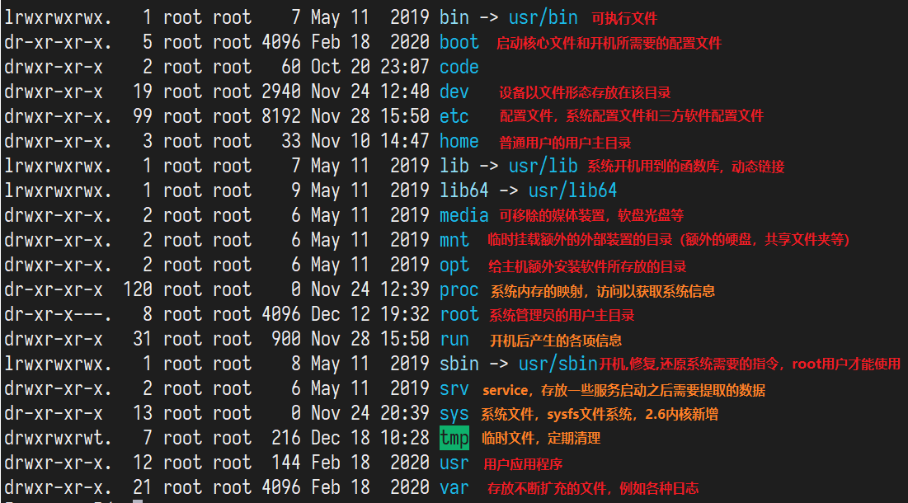
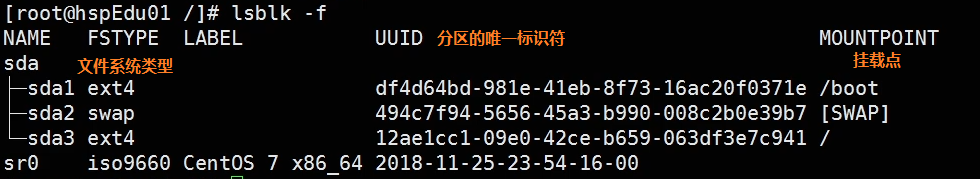
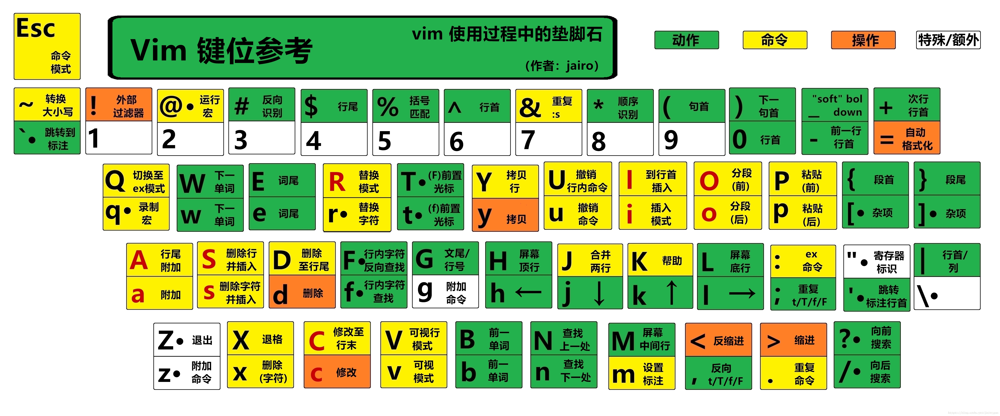
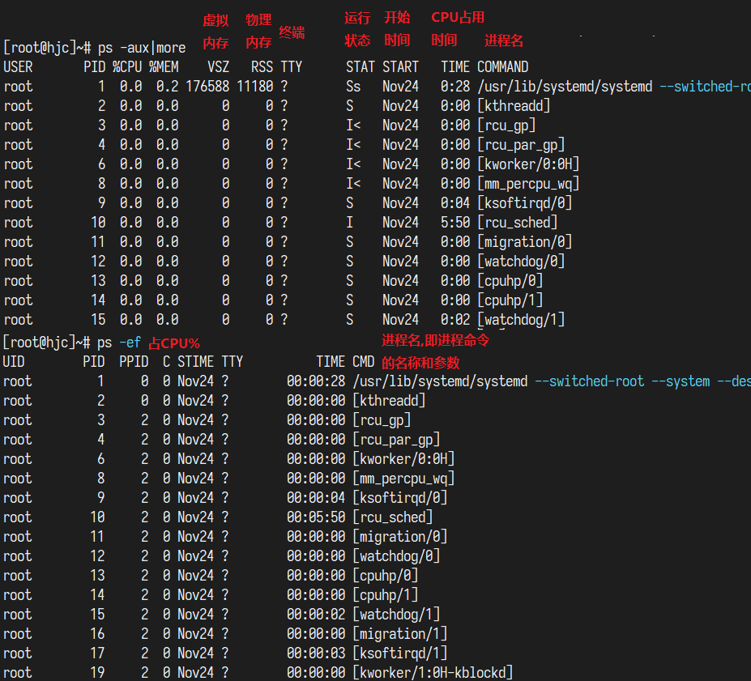
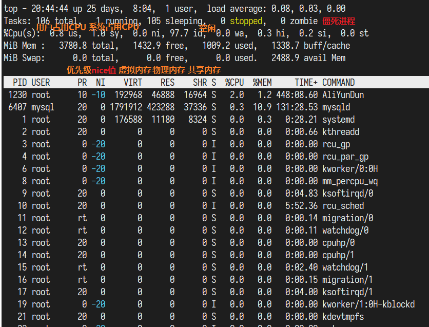
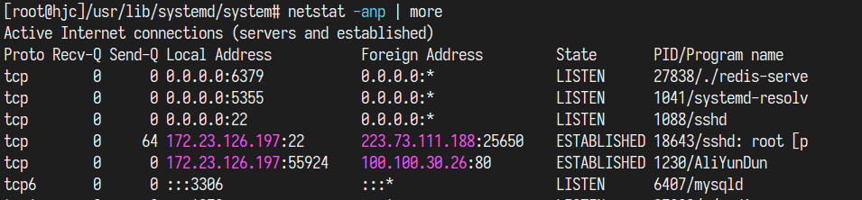

# 0.  用户，开关机，帮助

`shutdown -h now ` ,  `shutdwon -r now` 立即关机

`shutdown -h 1` 1分钟后关机

`halt` 关机

`reboot` 重启

`sync` 把内存数据同步到磁盘。**关机和重启之前一定要sync**

`su root` 切换到root用户  ， `logout`切换回上一个用户 

`useradd 用户名` 添加用户

`userdel 用户名` 删除用户，保留用户的home目录。。。。`userdel -r 用户名` 删除用户以及其home下的目录

`passwd 用户名`  设置给定用户的密码 

`who am i` 显示第一次登录的用户信息，不管怎么切换用户都是显示第一次登录的用户


用户管理：

- `/etc/passwd` 文件，用户：口令：用户标识：组标识：描述：主目录：登录Shell
- `/etc/shadow` 文件，登录名：加密口令：最后一次修改时间：最小间隔时间：最大间隔时间：警告信息：不活动时间：失效时间：标志，**登录验证的时候是和这个加密口令进行比对**
- `/etc/group` 文件，存放组的配置文件。组名：口令：组标识号：组内用户列表


组管理：


运行级别： 使用 `init [0123456]` 来切换运行级别，使用`systemctl get-default`查看当前运行级别

- 0：关机
- 1：单用户
- 2：多用户无网络服务
- **3：多用户有网络服务**
- 4：系统未使用，保留给用户
- 5：图形界面
- 6：系统重启


**找回root密码**： 切换到单用户


**帮助命令**：

`man 指令`

`help 指令`


# 1. 文件与目录

## 1.1 文件权限  
dr-xr-xr-x.   5 root root 4096 Feb 18  2020 boot           
- 第一个字符代表文件类型，7种：其中 b c s p 是伪文件，不占用磁盘空间  
  - `d : 目录`
  - `- : 文件`，分为纯文本文档(ASCII)、二进制文件(binary)、数据格式文件(data)
  - `l : link file`，链接文件
  - `b : block 区块设备文件`，装置文件(device)里面的可供储存的接口设备(可随机存取装置，如**硬盘**、软盘)       
  - `c : character 字符设备`文件，装置文件里面的串行端口设备，例如键盘、鼠标(一次性读取装置)
  - `s : sockets 套接字文件`
  - `p : pipe 管道文件`
- 接下来的字符三个一组，分别表示拥有者权限、群组权限、其他人权限


|权限|对文件的作用|
|:---:|:--|
|r|可读取文件中的实际内容，可对文件执行cat、more、less、head、tail等命令查看|
|w|可编辑、新增、修改文件内容，可使用vim、echo等修改，但不能删除文件|
|x|文件具有被系统执行的权限，文件能否执行由x权限决定，跟后缀名没有必然的关系|

|权限| 对文件夹的作用                                               |
|:---:|---|
|r|可读取目录结构列表的权限，可以使用ls命令查看目录中的内容|
|w|可以在此目录下新建、删除、移动、更名文件和文件夹，可使用touch、rm、cp、mv等命令|
|x|可以进入目录，也就是说可以使用cd命令，没有x权限的目录无法进入|
  - rwx分别为 4 2 1分
  - 操作所需最低权限：**读取文件内容 r**、**修改文件内容 rw**、**执行文件 rx**、**删除文件，需要文件所在目录具有 wx**
- 第二栏表示表示有多少名连接到此节点
- 第三栏是文件的拥有者账号
- 第四栏是所属群组
- 第五栏是文件的容量大小，默认单位是Bytes
- 第六栏是最近修改时间，时间太久会只显示年，要显示详细时间可以用`ls -l --full-time`
- 最后一栏就是文件的名字了，带 . 表示隐藏文件

## 1.2 权限变更
- `chgrp` 改变所属群组，可选参数 -R 递归变更
- `chown` 改变拥有者(所属用户)
- `chmod` 改变文件的权限

~~~
把群组改为users
[root@study ~]# chgrp users initial-setup-ks.cfg   
[root@study ~]# ls -l
-rw-r--r--. 1 root users 1864 May 4 18:01 initial-setup-ks.cfg

把拥有者改为bin
[root@study ~]# chown bin initial-setup-ks.cfg     
[root@study ~]# ls -l
-rw-r--r--. 1 bin users 1864 May 4 18:01 initial-setup-ks.cfg

将 initial-setup-ks.cfg 的拥有者与群组改回为 root：chown [-R] 账号名称:组名 文件或目录
[root@study ~]# chown root:root initial-setup-ks.cfg
[root@study ~]# ls -l
-rw-r--r--. 1 root root 1864 May 4 18:01 initial-setup-ks.cfg
~~~

- 修改权限命令：`chmod 777 .bashrc` 即改为-rwxrwxrwx；而-rwxr-xr-x 就是 755，其他人只能读不能写
- 还可以使用 u、g、o、a（a代表all） 和 +、-、= 来设定，如 `chmod u=rwx,go=rx .bashrc`就设定了一个755
- 只有r没有x权限的目录，仅能查询到目录下的文件名列表，其他信息均不可见，一般也不会这么设置，没什么意义
- 有意义的三种**目录权限**：**0(---)， 5(r-x)， 7(rwx)**，**最常用755**，严谨一点可以**750或者700**
- 对**普通文件**而言，**最常用644**， 严谨一点可以**640或者600**
- 对**可执行文件**而言，**最常用754或755**，严谨一点可以**750，740，700**
- 文件所有者必须为6或者7，不然就傻逼了
~~~

[dmtsai@study tmp]$ ls -l testing/
ls: cannot access testing/testing: Permission denied
total 0
?????????? ? ? ? ? ? testing
[dmtsai@study tmp]$ cd testing/
-bash: cd: testing/: Permission denied
~~~

## 1.3 文件名和文件扩展名
- 文件是否具有可执行能力由x权限决定，但是能不能执行成功就得看文件的实际内容了。于是以适当的扩展名表示文件的种类：
- .sh ： 脚本或者批处理文件
- Z, .tar, .tar.gz, .zip, .tgz : 打包和压缩文件
- .html, .php : 网页相关的文件
- linux文件名限制为255Bytes

## 1.4 目录和分区

**目录结构：**




**分区机制**：

对linux来说，无论有几个分区，无论分给哪个目录使用，归根结底就只有一个根目录，不同的分区只是挂载到了唯一的文件目录下，**将一个分区和一个目录联系起来**，访问对应的目录即是访问相应的分区

对于IDE硬盘。sda3表示第一块硬盘的第三个分区。  sdb1表示第二块硬盘的第一个分区




**增加硬盘的步骤：**

开始分区命令：`fdisk /dev/sdb`

m  显示命令列表

p 显示磁盘分区，同 fdisk -l 

**n 新增分区**

d 删除分区

w 写入并退出

开始分区后，输入n新增分区，然后选择p，分区类型为主分区。最后输入w写入并退出，若不保存退出则输入q

格式化磁盘：`mkfs -t ext4 /dev/sdb1`

挂载：`mount /dev/sdb1  /mynewdisk`，即将 sdb1 挂载到 /mynewdisk 目录


卸载：`umount /dev/sdb1`或者`umount /mynewdisk`


**需要注意的是，命令行挂载，挂载关系是临时的，重启后便会失效，但是里面的文件是不会丢失的**


**永久挂载方法：**

`vim /etc/fstab` 修改该文件即可。。。系统启动的时候会检查该文件，进行自动挂载


**查看磁盘使用情况（disk free）**： `df -h`

~~~shell
[root@hjc]~# df -h
Filesystem      Size  Used Avail Use% Mounted on
devtmpfs        1.9G     0  1.9G   0% /dev
tmpfs           1.9G     0  1.9G   0% /dev/shm
tmpfs           1.9G  488K  1.9G   1% /run
tmpfs           1.9G     0  1.9G   0% /sys/fs/cgroup
/dev/vda1        40G  4.4G   36G  11% /
tmpfs           379M     0  379M   0% /run/user/0
~~~


**查询指定目录的磁盘占用情况（disk usage）**：`du -ah 目录路径`， `du -ash`， `tmp# du -ah --max-depth=1`

-s 进行汇总， -h 带计量单位，  -a 含文件 ， -c 列出明细的同时，增加汇总值

可以指定子目录深度 --max-depth=1


**统计文件夹下文件的数量：**

~~~shell
// 统计 /root 目录下一共有多少文件
[root@hjc]/usr# ls -l /root | grep "^-" | wc -l

// 统计 /usr 及其子目录下，一共有多少文件夹
[root@hjc]/usr# ls -lR /usr | grep "^d" | wc -l
11502
~~~


## 1.5 环境变量

- 查看环境变量：`echo $PATH`
- 新增环境变量：`PATH="${PATH}:/root"` 将/root加入到环境变量中
- 配置环境变量：`vi /etc/profile`，修改完之后需要重新加载：`source /etc/profile`
~~~
配置java的环境变量
JAVA_HOME=/usr/local/jdk/jdk1.8.0_261
CLASSPATH=.:$JAVA_HOME/lib.tools.jar
PATH=$JAVA_HOME/bin:$PATH
export JAVA_HOME CLASSPATH PATH 
~~~


## 1.6 文件变动的时间
- modification time **(mtime)：** 当该文件的『内容数据』变更时，就会更新这个时间！内容数据指的是文件的内容，而不是文件的属性或权限
- status time (**ctime**)：当该文件的『状态 (status)』改变时，就会更新这个时间，举例来说，像是权限与属性被更改了，都会更新这个时间
- access time (**atime)**：当『该文件的内容被取用』时，就会更新这个读取时间 (access)。举例来说，我们使用 cat 去读取/etc/man_db.conf ， 就会更新该文件的 atime 了
- 默认情况下显示的是mtime
- 完全复制`cp -a`，仅仅复制了mtime和atime，而ctime则是新建文件的当前时间 
~~~
[root@study ~]# date; ls -l /etc/man_db.conf ; ls -l --time=atime /etc/man_db.conf ; \
> ls -l --time=ctime /etc/man_db.conf # 这两行其实是同一行喔！用分号隔开
Tue Jun 16 00:43:17 CST 2015 # 目前的时间
-rw-r--r--. 1 root root 5171 Jun 10 2014 /etc/man_db.conf # 在 2014/06/10 建立的内容(mtime)
-rw-r--r--. 1 root root 5171 Jun 15 23:46 /etc/man_db.conf # 在 2015/06/15 读取过内容(atime)
-rw-r--r--. 1 root root 5171 May 4 17:54 /etc/man_db.conf # 在 2015/05/04 更新过状态(ctime)
~~~

## 1.7 文件预设权限：umask
- 目前用户在建立文件或目录的时候权限的默认值
- 建立文件的默认最高权限：-rw-rw-rw- 即666
- 建立文件夹默认最高权限：drwxrwxrwx 即777
- umask表示减去一定的权限，如：023表示建立的文件为644，文件夹为754

~~~
[root@iZwz91j9t2admw7xtplq6bZ ~]# umask 002
[root@iZwz91j9t2admw7xtplq6bZ ~]# touch test_file
[root@iZwz91j9t2admw7xtplq6bZ ~]# mkdir test_dir
[root@iZwz91j9t2admw7xtplq6bZ ~]# ll -d test*
drwxrwxr-x 2 root root 6 Sep  7 16:29 test_dir
-rw-rw-r-- 1 root root 0 Sep  7 16:29 test_file
~~~

## 1.8 常见打包和压缩格式
- `*.Z`     compress 程序压缩的文件(过时)；
- `*.zip`   zip 程序压缩的文件；
- `*.gz`    gzip 程序压缩的文件(取代compress)；
- `*.bz2`   bzip2 程序压缩的文件(取代gzip)；
- `*.xz`    xz 程序压缩的文件(更优秀的压缩比)；
- `*.tar`   tar 程序打包的数据，并没有压缩过；
- `*.tar.gz` tar 程序打包的文件，其中并且经过 gzip 的压缩
- `*.tar.bz2` tar 程序打包的文件，其中并且经过 bzip2 的压缩
- `*.tar.xz` tar 程序打包的文件，其中并且经过 xz 的压缩

# 2. vim
- 三种模式：一般命令模式、编辑模式、底行命令模式
## 2.1 一般命令模式
- 移动光标

|命令|含义|
|---|---|
|`移动光标`     |h←， j↓， k↑， l→，可以使用nj nk|
|翻页         |Ctrl+f 向下翻页   Ctrl+b 向上翻页|
|切行         |+ 移动到非空格的下一行， - 移动到非空格的上一行|
|n\<space>    |如20 空格， 光标向后移动20个字符|
|0或Home      |移动到列首|
|$或End       |移动到列尾|
|`G`            |光标移动到`最后一行`|
|n + G |光标移动到第n行|
|`gg`           |光标移动到`第一行`|
|n\<Enter>    |光标向下移动n行|

- 删除与复制粘贴

|命令|含义|
|---|---|
|`x,X`|x删除后继字符，相当于del，X删除前一个字符，相当于backspace|
|`dd`|删除一行|
|ndd|向下删除n行|
|`yy`|复制游标所在行|
|nyy|向下复制n行|
|`p P`|p 粘贴到光标所在列的下一列， P粘贴到光标所在列的上一列|
|`u`|复原前一个动作|
|`Ctrl+r`|重做上一个动作，与u配合使用。。即向前向后撤销|
|`.`|重复上一个动作|

## 2.2 编辑模式

|命令|含义|
|---|---|
|i,I|进入插入模式，从光标所在处插入，I为从非空格字符处插入|
|a,A|进入插入模式，从光标所在处的下一个字符开始插入，A为在该列尾插入|
|o,O|进入插入模式，从光标所在列的下一列插入新列，O为在上一列插入新列|
|r,R|进入取代模式，r只取代光标所在的字符一次，R会一直取代光标所在字符直到ESC|

## 2.3 底行命令模式
|命令|含义|
|---|---|
|:w|保存到硬盘|
|:w!|若文件为只读时，强制写入。不过能不能写入还要看文件权限|
|:q|离开vi|
|`:q!`|不保存，强制离开|
|`:wq`|存储后离开|
|ZZ|若文件未更改则不存储离开，已更改则存储后离开|
|:w filename|另存为|
|`set nu`|显示行号显示行号|
|`set nonu`|不显示行号|

- 查找与替换

| 命令                   | 含义                                                      |
| ---------------------- | --------------------------------------------------------- |
| `/word`                | 向光标之下寻找名称为word的字符串，查找到之后按`n`到下一个 |
| `?word`                | 向上查找                                                  |
| :n1,n2s/word1/word2/g  | 在n1和n2行之间查找word1并替换为word2                      |
| :n1,n2s/word1/word2/gc | 在n1和n2行之间查找word1并替换为word2，并提示确认          |



# 3. Linux上软件安装

详见 [Linux系统中安装软件的几种方式:https://blog.csdn.net/qq_36119192/article/details/82866329](https://blog.csdn.net/qq_36119192/article/details/82866329)
1. 二进制发布包：软件已经针对具体平台编译打包发布，只需要解压修改配置即可，但是个平台不兼容
2. RPM方式：软件按redhat的包管理工具规范RPM进行打包发布，需要获取到相应软件RPM发布包，然后用RPM命令安装，该方式不会为软件安装所需的依赖包
3. Yum在线安装：软件以RPM规范打包，发布在网络服务器上，可用yum在线安装服务器上的rpm软件，并且自动解决安装过程中的库依赖问题
4. 源码编译安装：软件以源码方式发布，需要获取到源码工程后用相应的开发工具进行编译打包部署

## 3.1 常用rpm命令
|命令|含义|
|---|---|
|rpm -qa|查询所有已安装软件的rpm包信息，列出包的版本|
|rpm  -ivh  包.rpm|i表示安装，v表示显示安装过程，h表示以‘#’作为进度，显示安装进度|
|rpm -e --nodeps 包名|卸载|

## 3.2 常用yum命令


| 指令 | 含义 |
|----|----|
|yum  clean all     |          清空缓存信息|
|yum  list              |          列出所有包的信息|
|yum  list  httpd       |          查看 httpd 是否安装|
|yum  info httpd        |          显示 httpd 包的详细具体信息|
|yum install httpd   -y |          安装 httpd 包|
|yum remove httpd  -y   |          卸载 httpd 包|
|yum search 关键词         |      根据关键词，在已发现的repo源中搜索包含关键词的rpm包|
|yum provides 命令        |         根据命令，在已发现的repo源中搜索安装指令的rpm包|
|yum history  list/info/undo/redo number|   history可以列出，查看，重装，反安装对应的包，但是是以yum指令的操作顺序为依据的，所以需要加指定的数字执行|
|yum update -y    |                    升级所有包同时也升级软件和系统内核|
|yum upgrade  -y  |                   只升级所有包，不升级软件和系统内核|


## 3.3 yum安装mysql
- `yum list|grep mysql`
- `yum install mysql-server`
- `service mysqld start` 注意，启动mysql服务器是用mysqld
- `mysql -uroot` 登录，初始没有密码
- 设置远程访问权限
~~~sql
mysql> CREATE USER 'root'@'%' IDENTIFIED BY 'root';
mysql> GRANT ALL PRIVILEGES ON *.* TO 'root'@'%' WITH GRANT OPTION;
mysql> flush privileges;
~~~
- aliyun主机中记得手动设置开放的端口，安全组中增加3306端口

## 3.4 源码安装redis
- 安装gcc-c++：`yum install gcc-c++`
- 下载解压redis
- cd 到 redis-6.0.7 执行 make 命令
- 安装：`make PREFIX=/usr/local/redis install`
- 复制redis-6.0.7下的 redis.conf 配置文件到 bin 目录：`[root@iZw bin]# cp ../redis-6.0.7/redis.conf ./`
- 在bin中启动redis服务端：`./redis-server redis.conf`


# 4. JavaEE环境搭建

需要安装tomcat，mysql，jdk

## 4.1 jdk安装

1. mkdir /opt/jdk
2. 下载jdk
3. cd /opt/jdk
4. tar -zxvf jdk-8u261-linux-x64.tar.gz
5. mkdir /usr/local/java
6. mv /opt/jdk/jdk1.8.0_261   /usr/local/java
7. 配置环境变量  vim  /etc/profile
8. export  JAVA_HOME=/usr/local/java/jdk1.8.0_261
9. `export  PATH=$JAVA_HOME/bin:$PATH`
10. 环境变量生效  source /etc/profile


## 4.2 tomcat安装

1. 下载，解压到 /opt/tomcat
2. 进入解压目录/bin，启动 tomcat   ./startup.sh
3. 开放端口8080


## 4.3 MySQL5.7安装

1. 新建文件夹/opt/mysql，并cd进去

2. 运行wget http://dev.mysql.com/get/mysql-5.7.26-1.el7.x86_64.rpm-bundle.tar，下载mysql安装包

   PS：centos7.6自带的类mysql数据库是mariadb，会跟mysql冲突，要先删除。

3. 运行tar -xvf mysql-5.7.26-1.el7.x86_64.rpm-bundle.tar 

4. 运行rpm -qa|grep mari，查询mariadb相关安装包

5. 运行rpm -e --nodeps mariadb-libs，卸载

6. 然后开始真正安装mysql，依次运行以下几条

   ​	rpm -ivh mysql-community-common-5.7.26-1.el7.x86_64.rpm

   ​	rpm -ivh mysql-community-libs-5.7.26-1.el7.x86_64.rpm

   ​	rpm -ivh mysql-community-client-5.7.26-1.el7.x86_64.rpm

   ​	rpm -ivh mysql-community-server-5.7.26-1.el7.x86_64.rpm

7. 运行systemctl start mysqld.service，启动mysql

8. 然后开始设置root用户密码

   Mysql自动给root用户设置随机密码，运行grep "password" /var/log/mysqld.log可看到当前密码

9. 运行mysql -u root -p，用root用户登录，提示输入密码可用上述的，可以成功登陆进入mysql命令行

10. 设置root密码，对于个人开发环境，如果要设比较简单的密码（**生产环境服务器要设复杂密码**），可以运行

set global validate_password_policy=0; 提示密码设置策略（validate_password_policy默认值1，）

11. set password for 'root'@'localhost' =password('hspedu100');
12. 运行flush privileges; 使密码设置生效


# 5. Shell编程

sh脚本需要以 #!/bin/bash 开头，并且给与执行权限x

如果没有x权限，也可以使用 `sh` 命令直接执行


**`注意区别$()  ${}  $[] 等等`**

- `$()和` ``，用于做命令替换。
  - 例如`VERSION=$(uname -r)`得到内核版本号
- `${}`用于变量的替换，一般情况下 `$VAR` 和 `${VAR}`没有区别，但是语义更明确
- `$(( )) 和 $[ ]`用于做运算
- `[ ]`用于condition，是test命令的另一种写法


## 5.1 Shell变量

**系统变量：** 使用set命令可以查看所有的系统变量

~~~shell
$HOME  $PWD  $SHELL  $USER
~~~

**自定义变量：**  `变量=值`，通过 `unset 变量` 来撤销变量，静态变量：`readonly变量`，**静态变量不能unset**

**定义变量的时候，等号两侧不允许有空格！！！！！**

**将指令返回的结果赋值给变量**：

~~~
C=`date` 或者 C=$(date)
~~~

**多行注释：** 

~~~shell
:<<!   
被注释的内容
!
~~~


**获取时间**

~~~shell
[root@hjc]/tmp# echo $(date)
Sun Dec 20 16:57:42 CST 2020
[root@hjc]/tmp# echo $(date +%Y)
2020
[root@hjc]/tmp# echo $(date +%Y-%m-%d)
2020-12-20
[root@hjc]/tmp# echo $(date +%Y-%m-%d_%H:%M:%S)
2020-12-20_16:58:19
~~~


例子：

~~~shell
#!/bin/bash
#定义变量A
A=100
echo A=${A}
echo "A=${A}"
#撤销变量A
unset A
echo A=${A}
#定义静态变量
readonly B=2
echo B=${B}
unset B
echo B=${B}
#将指令返回的结果赋值给变量
C=`date`
D=$(date)
echo "C=${C}"
echo "D=${D}"


[root@hjc]/tmp# ./my.sh
A=100
A=100
A=
B=2
./my.sh: line 12: unset: B: cannot unset: readonly variable
B=2
C=Sun Dec 20 14:42:05 CST 2020
D=Sun Dec 20 14:42:05 CST 2020
~~~


## 5.2 设置环境变量

环境变量的文件： /etc/profile

1. `export 变量名=变量值` ，将shell变量输出为环境变量/全局变量
2. `source 配置文件`， 让修改后的配置信息立即生效
3. `echo $变量名`，查询环境变量的值 

~~~shell
[root@hjc]/tmp# vim /etc/profile

# vim中定义环境变量
export JAVA_HOME=/usr/local/jdk/jdk1.8.0_261
ecport PATH=$JAVA_HOME/bin:$PATH

# 生效，检查
[root@hjc]/tmp# source /etc/profile
[root@hjc]/tmp# echo $JAVA_HOME
/usr/local/jdk/jdk1.8.0_261
~~~


## 5.3 位置参数

例如执行shell脚本时，希望获取到命令行的参数信息，使用位置参数变量，如`./my.sh 100 200`

基本语法：

1. `$n`：`$0`代表命令本身，`$1-$9`可以分别获取第1到第9个参数，10以上要使用`${10}`

2. `$*`：代表命令行中的所有参数，即把所有的参数看成是一个整体
3. `$@`：也代表命令行中的所有参数，但是会把每隔参数区分对待
4. `$#`：命令行中参数的个数

~~~shell
[root@hjc]/tmp# vim my2.sh
#!/bin/bash
echo "$0"
echo "$1"
echo "$*"
echo "$@"
echo "$#"

[root@hjc]/tmp# sh my2.sh 1 2 3
my2.sh
1
1 2 3
1 2 3
3
~~~


## 5.4 预定义变量

shell设计者预先定义好的变量，可以直接在shell脚本中使用

1. `$$`， 获取当前线程的PID
2. `$!`，后台运行的最后一个进程的PID
3. `$?`，最后一次执行的命令的返回状态。0代表上一个命令正确执行，非0则说明上一个命令执行不正确


## 5.5 运算符

1. `$((运算式))`或者`$[运算式]`
2. `expr 运算式子`，乘法的*需要转义\，每次一步运算，**运算符和数字要有空格**

~~~shell
#!/bin/bash
RES1=$(((2+3)*4))
echo "res1=$RES1"
RES2=$[(2+3)*4]
echo "res2=$RES2"
RES3=`expr 2+3`
echo "res3=$RES3"
# expr 式子 要用 `` 包裹
TEMP=`expr 2 + 3`
RES4=`expr $TEMP \* 4`
echo "temp=$TEMP"
echo "res4=$RES4"

[root@hjc]/tmp# sh myop.sh
res1=20
res2=20
res3=2+3
temp=5
res4=20
~~~


## 5.6 条件语句if和case

**if语法**

基本语法：

~~~shell
if [ condition ]
then
	...
elif [ condition ]
then
	...
else
	...
fi
~~~


`[ condition ]`，**注意condition前后要有空格，非空返回true，可以使用$?验证(0为true，>1为false)**

1. `=`字符串比较
2. 两个整数比较：`-lt小于， -le小于等于， -eq等于， -gt大于， -ge大于等于， -ne不等于`
3. 按照文件权限判断：`-r有读权限， -w有写权限， -x有执行权限`
4. 按照文件类型判断：`-f文件存在且是常规文件， -e文件存在， -d文件存在且是目录`

~~~shell
#!/bin/bash
if [ "ok" = "ok" ]
then
        echo "equals"
fi

if [ 22 -gt 22 ]
then
       echo "大于"
elif [ 22 -lt 22 ]
then
        echo "小于"
else
        echo "等于"
fi

if [ -x ./if.sh ]
then
        echo "有执行权限"
else
        echo "没有执行权限"
fi


[root@hjc]/tmp# sh if.sh
equals
等于 
没有执行权限
~~~


**case语法**

~~~shell
case $变量名 in
"值1")
如果值1满足时执行...
;;
"值2")
如果值2满足时执行...
;;
...
*)
如果都不满足时执行...
;;
esac
~~~

例如：

```shell
#!/bin/bash
case $1 in
"6")
        echo "周六放假"
;;
"7")
        echo "周日放假"
;;
*)
        echo "不放假"
;;
esac


[root@hjc]/tmp# sh case.sh 4
不放假
[root@hjc]/tmp# sh case.sh 6
周六放假
```


## 5.7 循环控制

**for循环1**

~~~shell
for 变量 in 值1 值2 值3...
do
循环的逻辑代码
done
~~~


**for循环2**：注意括号和括号里的内容要有空格

~~~shell
for (( 初始值; 循环控制条件; 变量变化 ))
do
循环的逻辑代码
done
~~~


**while循环**

~~~shell
while [ 条件判断式 ]
do
循环的逻辑代码
done
~~~


## 5.8 获取输入

`read (选项) (变量)` 读取控制台的输入到指定的变量中

~~~shell 

read -t 输入的限制时间(秒)  -p "输入的提示信息" NUM1
~~~


## 5.9 函数

**系统函数**：

1. `basename [pathname] [suffix]` 返回完整路径最后 / 之后的部分，常用于获取文件名。suffix为后缀，如果制定了suffix，basename会将pathname中的suffix去掉

~~~shell
[root@hjc]/tmp# basename /home/aaa/test.txt
test.txt
[root@hjc]/tmp# basename /home/aaa/test.txt .txt
test
~~~

2. `dirname [pathname]` 返回路径

~~~shell
[root@hjc]/tmp# dirname /home/aaa/test.txt
/home/aaa
~~~


**自定义函数**：

语法

~~~shell
[ function ] funcname[()]
{
	Action;
	[return int;]
}
~~~

例如定义一个sum函数

~~~shell
function getSum()
{
        SUM=$[$n1+$n2]
        echo "和是: $SUM"
}

read -p "请输入第一个数n1=" n1
read -p "请输入第一个数n2=" n2

getSum $n1 $n2


[root@hjc]/tmp# sh sum.sh
请输入第一个数n1=10
请输入第一个数n2=20
和是: 30
~~~


## 5.10 实现数据库自动备份

每天凌晨2：30备份数据库mydb到/data/backup/db，备份开始和结束给出信息，备份后的文件以备份时间为文件名打包成.tar.gz，备份后检查是否有10天前的备份文件，有就删除

~~~shell
#!/bin/bash
BACKUP=/data/backup/db
DATETIME=$(date +%Y-%m-%d_%H%M%S)
HOST=localhost
DB_USER=root
DB_PW=root
DATABASE=mydb

#创建备份目录
[ ! -d "${BACKUP}/${DATETIME}" ] && mkdir -p "${BACKUP}/${DATETIME}"

#备份数据库,-R导出存储过程,-q导出时不加载到缓存而是直接输出，默认就是启用状态
mysqldump -u${DB_USER} -p${DB_PW} --host=${HOST} -q -R --databases ${DATABASE} | gzip > ${BACKUP}/${DATETIME}/${DATETIME}.sql.gz
#打包日期文件夹到.tar.gz
cd ${BACKUP}
tar -zcvf ${DATETIME}.tar.gz ${DATETIME}
#删除这个文件夹
rm -rf ${BACKUP}/${DATETIME}

#删除10天前的文件的固定写法
find ${BACKUP} -mtime +10 -name "*.tar.gz" -exec rm -rf {} \;
echo "备份数据库${DATABASE}完成"
~~~

创建定时任务

~~~shell
[root@hjc]/data/backup# crontab -e
30 2 * * * /usr/sbin/mysql_db_backup.sh
~~~


# 6. 日志管理

## 6.1 系统常用日志

`/var/log/boot.log`，系统启动日志

`/var/log/cron`，系统定时任务相关日志

`/var/log/lastlog`，所有用户最后一次登录时间的日志，是二进制文件，要用`lastlog`命令直接查看

`/var/log/maillog`，记录邮件信息的日志

`var/log/message`，记录系统重要消息的日志。系统出问题时，首先要检查的就是这个日志

`/var/log/secure`，记录验证和授权信息，涉及账户和密码的程序都会记录到该日志

`/var/tun/ulmp`，记录当前已经登录的用户的信息，随着用户登录注销不断变化，只记录当前登录的用户的信息，不能使用vi查看，要使用`w`，`who`，`users`等命令直接查看


## 6.2 日志管理服务 rsyslogd

CentOS7.6的日志服务是rsyslogd，之前的日志服务是syslogd

查看rsyslogd服务是否开启`ps aux | grep "tsyslog" | grep -v "grep"`

查看rsyslogd服务是否开机自启`systemctl list-unit-files | grep rsyslog`

rsyslogd服务根据`/etc/rsyslog.conf`文件的配置来进行日志的维护

配置文件中编辑文件的格式为： `*.*     存放日志文件位置`

第一个`*`代表的是日志类型：

- auth， pam 产生的日志
- authpriv， ssh、ftp等登录信息的验证信息
- cron， 时间任务相关
- kern ， 内核
- lpr， 打印
- mail， 邮件
- mark(syslog)-rsyslog， 服务内部的信息，时间标识
- news，新闻组
- user，用户程序产生的相关信息
- uucp，unix to nuix copy主机之间相关的通信
- local 1-7， 自定义的日志设备

第二个`*`代表的是日志记录的级别：从上到下级别越来越高，记录的信息越来越少

- debug，有调试信息的
- info，一般信息日志，最常用
- notice，最具有重要性的普通条件的信息
- warning，警告级别
- err，错误，阻止某个功能或者模块不能正常工作的信息
- crit，严重级别，阻止整个系统或者整个软件不能正常工作的信息
- alert，需要立即修改的信息
- emerg，内核崩溃等重要信息
- none，什么都不记录

~~~shell
[root@hjc]/var/log# cat /etc/rsyslog.conf
#### MODULES ####

module(load="imuxsock"    # provides support for local system logging (e.g. via logger command)
       SysSock.Use="off") # Turn off message reception via local log socket;
                          # local messages are retrieved through imjournal now.
module(load="imjournal"             # provides access to the systemd journal
       StateFile="imjournal.state") # File to store the position in the journal

#### GLOBAL DIRECTIVES ####

# Where to place auxiliary files
global(workDirectory="/var/lib/rsyslog")

# Use default timestamp format
module(load="builtin:omfile" Template="RSYSLOG_TraditionalFileFormat")

# Include all config files in /etc/rsyslog.d/
include(file="/etc/rsyslog.d/*.conf" mode="optional")

#### RULES ####

# Log all kernel messages to the console.
# Logging much else clutters up the screen.
#kern.*                                                 /dev/console

# Log anything (except mail) of level info or higher.
# Don't log private authentication messages!
*.info;mail.none;authpriv.none;cron.none                /var/log/messages

# The authpriv file has restricted access.
authpriv.*                                              /var/log/secure

# Log all the mail messages in one place.
mail.*                                                  -/var/log/maillog


# Log cron stuff
cron.*                                                  /var/log/cron

# Everybody gets emergency messages
*.emerg                                                 :omusrmsg:*

# Save news errors of level crit and higher in a special file.
uucp,news.crit                                          /var/log/spooler

# Save boot messages also to boot.log
local7.*                                                /var/log/boot.log
~~~

## 6.3 日志轮替

日志轮替就是把旧的日志文件移动并改名，同时建立新的空日志文件，当九日至文件超出保存范围之后，就会进行删除

- 日志轮替的管理由`logrotate`负责，修改日志轮替文件名字可以通过配置`/etc/logrotate.conf`的`dateext`参数

- 如果配置文件中有dateext参数，日志会用**日期**来作为日志文件的后缀
- 如果没有dateext参数，就需要进行改名，当第一次进行日志轮替时，当前的secure日志会自动改名为`secure.1`，然后新建secure日志，用来保存新的日志，当第二次日志轮替时，secure.1会自动更名为secure.2，当前secure被改名为secure.1，然后创建新的secure日志，以此类推


## 6.4 内存日志

通过`journalctl`可以查看内存日志

`journalctl -n 3` ，查看最新的3条内存日志

`journalctl --since 19:00 --until 19:10`，查看一段时间内的内存日志

`journalctl -p err`，查看报错日志

**内存日志重启后就会被清空**


# 指令大全

显示历史指令  `history`

显示最近10条历史指令  `history 10`

指令编号为10的历史指令  `!10`

## 1. 目录和文件
|指令|含义|
|---|---|
|cd         |cd ~ 回到用户home目录(root用户回/root)<br>cd - 回到上一次访问的目录|
|pwd [-P]   |显示当前目录<br> pwd -P 显示确切路径，而非link路径|
|`mkdir` [-mp]|建立新的空目录<br>`-m 配置文件权限：`mkdir -m 755 test<br>`-p 递归建立`所需上层目录：mkdir -p test1/test2/test3/test4|
|`rmdir` [-p] |删除一个**`空目录`**<br>`-p 将上层空目录`一起删除：rmdir -p test1/test2/test3/test4|
|ls [-aAdfFhilnrRSt]|`-a 显示全部文件，包括隐藏文件`<br>-A 显示全部文件，包括隐藏文件，但不包括.和..这两个目录<br>-d 仅列出目录本身，不列出目录内的文件数据<br>-F 在列出的文件名称后加一符号；例如可执行档则加 `*`, 目录则加 "/"<br>`-h 将文件容量以人类较易读的方式(例如 GB, KB 等等)`列出来<br>`-i 列出 inode 号码`<br>`-l 展示详情列表`，将文件型态、权限、拥有者、文件大小等资讯详细列出<br>-R 连同子目录内容一起列出来，等于该目录下的所有文件都会显示出来<br>-S 以文件容量大小排序，而不是用档名排序<br>`-t 将文件依建立时间之先后次序列出`<br>--full-time 以完整时间模式 (包含年、月、日、时、分) 输出|
|`cp` [-adfilprsu]|复制，还可以建立链接，比对文件新旧进行更新，以及复制整个目录<br>-a 相当于-dr --preserve=all 完全复制，完全一样<br>-i 若目标文件已经存在，会在覆盖时先询问动作的进行<br>`-p 连同文件的属性(权限、用户、时间)一起复制`，常用于备份<br>`-r 递归持续复制，用于目录的复制`<br>`\cp命令` 强制覆盖所有同名文件，不再一个一个的询问<br>复制到当前目录`cp /var/log/wtmp .`用.即可|
|`mv` [-fiu]|移动，也可用作`更名`<br>-f 强制，目标文件已经存在则直接覆盖，不询问<br>-i 目标文件已经存在时会进行询问<br>-u 目标文件已经存在，且source比目标文件新时才会更新(update)<br>更名：`mv mvtest mvtest2`|
|`rm` [-fir]|删除(无需文件夹为空)<br>`-f 强制删除`，忽略不存在的文件，不会出现警告信息<br>-i 删除前询问<br>`-r 递归删除`|
|basename|取得文件的最后文件名|
|dirname|取得文件的目录名|
|touch [-acdmt]|修改文件时间或建立新文件<br>-a 仅修改access time(atime)<br>-c 仅修改ctime，若文件不存在则新建文件<br>-d 后面可以接日期而不使用当前日期<br>-m 仅修改mtime<br>-t (同时修订mtime和atime为目标值，而ctime则是记录当前时间) 后面可以接日期而不使用当前日期，格式为YYYYMMDDhhmm|
|chgrp [-R]| 改变所属群组 -R 递归变更|
|chown| 改变拥有者(所属用户)|
|chmod| 改变文件的权限|
|file|查看文件类型|
|`echo`|输出内容到控制台<br>例如：`echo $PATH`输出环境变量<br>`echo "hello world"`<br>`echo "hello world" > hello.txt`输出重定向( >表示覆盖写，>>表示追加写 )|
|ln [-s]|创建一个硬链接<br>`-s：创建一个软链接`，例如`ln -s /root/  /home/myroot`|

## 2. 查看文件内容

|指令|含义|
|---|---|
|`cat`|从第一行开始显示文件所有内容<br>-A 显示特殊字符而不是空白，可以区分开空格和tab，显示结尾的断行字符$<br>-b 显示行号(仅对非空白行显示，空白行不标行号)<br>`-n 显示行号`，连同空白行也显示<br>-T 将tab以^I 显示 |
|`tac`|从最后一行开始，反过来显示文件内容|
|nl|显示内容的时候，一并显示行号，并对行号样式进行设计|
|`more`|一页一页显示文件内容<br>`空格：向下翻一页`<br>`Enter：向下翻一行`<br>`/字符串：向下搜寻`字符串这个关键字<br>q：退出<br>`Ctrl + f ：向下翻页`<br>`Ctrl + b：向上翻页`<br>`b ：往回翻页`<br>`:f   输出当前文件名和行号`|
|`less`|比more更强大，动态的读取，可以往前翻页！使用pageup和pagedown翻页，或者Ctrl+f，Ctrl+b<br>/字符串：向下搜寻<br>?字符串：向上搜寻<br>|
|`head` [-n]|只看头几行<br>-n 显示前n行，默认显示前10行`head -n 20 /man_db.conf`，负数表示不包括后n行|
|`tail` [-nf]|只看尾几行<br>查看man_db.conf的11-20行：`head -n 20 /man_db.conf | tail -n 10`<br>`-f 实时追踪该文件的所有更新`|
|od [-t TYPE]|查看非文本文件<br>-t 后面可以跟上各种TYPE的输出：<br>-t a 使用默认字符输出<br>-t c 使用ASCII字符输出<br>-t d[size] 使用十进制输出数据，每个整数占用size个bytes<br>-t f[size]， -t o[size]， -t x[size]<br>找到password的ASCII对照：`echo password | od -t oCc`|

## 3. 文件搜索
|指令|含义|
|---|---|
|`which` [-a]|`搜索指令脚本的完整文件名`<br>-a 将所有PATH目录中可以找到的指令均列出，而不止第一个找到的指令|
|whereis [-bmsu]|搜索文件或目录名的完整名称，速度比find快，因为只搜索几个特定目录(-l查看)<br>-l 查看whereis搜索的目录列表<br>-b 只搜索binary文件<br>-m 只找在man路径下的文件<br>-s 只找source来源文件<br>-u 搜索不再在述三个项目当中的其他特殊文件|
|`locate` [-ir] keyword|根据keyword查找文件和目录的`完整名称`<br>**用locate之前需要先用updatedb更新数据库**，之后都是从数据库中检索<br>-i 忽略大小写<br>-c 仅计算查找到的文件数量，不输出文件名<br>-r 后面可以接正则表达式|
|`find` [PATH] [option] [action]|`find /home -user dmtsai` 搜寻 /home 底下属于 dmtsai用户的文件<br>`find / -name passwd` 全盘搜索名为passwd的文件<br>`find / -name "*passwd*"` 搜索包含passwd关键字的文件<br>`find / -size +200M` 全盘查找指定大小大于200Ｍ的文件，－表示小于，不写表示等于|
|`grep` [option] pattern [file]|在file中使用pattern进行正则匹配搜索内容<br>`-i 不区分大小写`<br>-l 只列出匹配的文件名<br>-w 只进行完整匹配<br>`-v 排除某些模式`|

## 4. 文件压缩
|指令|含义|
|---|---|
|`gzip` [-cdtv#]|gzip压缩文件或者文件夹，**`默认情况下压缩后源文件不再存在`**<br>-c 把压缩后的文件输出到标准输出设备，保留原始文件`gzip -c aaa > aaa.gz`<br>`-d 解压缩到指定目录`，会删除原.gz文件<br>-v 显示压缩比等信息<br>-# #是数字，压缩等级，1最快，9最慢但压缩比最好，默认6<br>使用`gunzip命令解压`|
|zcat、zmore、zless|查看.gz文件的源文件内容(文本文件)|
|bzip2 [-cdkzv#]|bzip压缩，比gzip压缩比更好，用法几乎相同<br>-d 解压缩<br>-k 保留原始文件|
|bzcat|查看.bz2文件的文本文件内容|
|tar [-zjJ][cv][-f name] file|打包指令<br>`-z 通过gzip的支持进行压缩/解压缩`，文件名.tar.gz<br>`-j 通过bzip2进行压缩/解压缩`，文件名.tar.bz2<br>-J 通过xz进行压缩/解压缩<br>`-c 建立打包文件`<br>-v 在压缩/解压缩时显示正在处理的文件名<br>-f 被处理的文件名(将要建立的压缩文件名或将要解压缩的文件名)<br>-p 保留备份数据的原本权限和属性，常用于备份重要的配置文件<br>-P 保留绝对路径，即允许备份数据中含有根目录存在<br>--exclude=xx/xx/xx 打包时排除某些文件<br>常用压缩：`tar -jcvf *.tar.bz2 文件名`|
|tar [-zjJ][tv][-f name]|查看压缩文件<br>-t 查看打包文件的内容，包含哪些文件名<br>常用查询：`tar -jtvf *.tar.bz2`|
|tar [-zjJ][xv][-f name][-C 目录]|解压缩<br>`-x 解压缩或解打包`<br>`-C 目录：解压缩到指定的目录`<br>常用解压缩：`tar -jxvf *.tar.bz2 -C 解压目录`|
- 解压缩单一文件的方法：


## 5. 进程和服务管理

### 进程管理

|命令|含义|
|---|---|
|`ps -ef`|查看所有进程<br>-e：显示所有进程<br>-f：全格式显示(uid，pid)|
|`ps -aux`|显示所有进程，跟ps -ef差不多<br>-a ：显示当前终端的所有进程信息<br>-u ：以用户的格式显示进程信息<br>-x ：显示后台进程运行的参数|
|ps -ef \| grep name|查找name名的进程|
|`pstree [-pu]`|查看进程树<br>-p：显示进程的PID<br>-u：显示进程的所属用户|
|kill 2869|结束2869编号的进程|
|`kill -9 2869`|强制结束2869进程|
|`killall 进程名`|结束所有该进程name的进程，例如`killall vim`|
|`top [-di]`|动态监控进程<br>-d：每隔几秒刷新，默认3秒<br>-i：使top不显示任何闲置或者僵尸进程|

**ps命令：**



进程运行状态说明：

- S：睡眠
- s：会话的先导进程
- N：该进程拥有比普通优先级更低的优先级
- R：正在运行
- D：短期等待
- Z：僵死进程，需要定期清理
- T：被跟踪或者被停止等等


**top命令：**

PR是实时优先级，nice值越小优先级越高，默认启动一个进程的nice值是0



**P：按cpu使用率排序**

**M：按内存使用率排序**

u：输入username，查看指定用户的进程

k：输入pid，结束指定pid的进程


### 服务管理

**服务 service和systemctl指令**

`service [start | stop | restart | reload | status]`

CentOS 7.0 之后，只有`/etc/init.d/`下的服务被service管理，其他都被`systemctl`管理


`systemctl [start | stop | restart | reload | status]`，管理`/usr/lib/systemd/system/`下的服务

`systemctl list-unit-files` 查看服务启动状态

`systemctl enable 服务名` 设置服务开机自启动，disable关闭自启动，is-enabled 查询是否开机自启动


关闭和重启服务：

- `kill sshd的pid`
- `/bin/systemctl  start  sshd.service`


### 防火墙管理

systemctl status firewalld

systemctl stop firewalld         systemctl disable firewalld  关闭防火墙，不再自启动

`firewall-cmd --permanent --add-port=端口/协议` 打开对应端口

`firewall-cmd --permanent --remove-port=端口/协议` 关闭对应端口

`firewall-cmd --reload` 重新载入以生效

`firewall-cmd --query-port=端口/协议` 查询端口是否开放


### 网络管理

`netstat -anp`  -an可以显示网络情况，按一定顺序排列输出。    -p可以显示哪个进程在调用



## 6. 定时任务


**重复的定时任务：**

chrond可以进行定时任务的调度，让系统在某个时间执行特定的命令或者程序。例如对mysql的备份

`crontab` 设置定时任务

- `-e` ：编辑crontab定时任务
- `-l` ：查询crontab任务
- `-r` ：删除当前用户所有的crontab任务

- `*`的占位符：
  - `*`代表任何时间，第一个 `*` 就表示一小时中每分钟都执行
  - `,`代表不连续的时间，例如 `1 8,12,16 * * *` 表示每天8:01，12:01，16:01执行
  - `-`代表连续的时间范围，例如`0 5 * * 1-6` 表示周一到周六的5:00执行
  - `*/n` 表示隔多久执行一次，例如`*/10 * * * *`表示每隔10分钟执行一次


例如：`crontab -e */1 * * * * ls -l /etc/ > /tmp/to.txt`

~~~shell
[root@hjc]~# crontab -e
no crontab for root - using an empty one
crontab: installing new crontab
[root@hjc]~# cd /tmp
[root@hjc]/tmp# ls
to.txt
[root@hjc]/tmp# rm to.txt
[root@hjc]/tmp# ls
//每分钟都会创建文件
[root@hjc]/tmp# ls
to.txt
~~~


`crontab`定时执行脚本

~~~shell
//写一个sh脚本
[root@hjc]/tmp# vim my.sh
date >> /tmp/1
cal >> /tmp/1

//将脚本设置为可执行
[root@hjc]/tmp# ll
total 20
-rw------- 1 root root    29 Dec 18 22:40 my.sh
-rw-r--r-- 1 root root 13166 Dec 18 22:39 to.txt
[root@hjc]/tmp# chmod 755 my.sh

//每隔一分钟执行一次
[root@hjc]/tmp# crontab -e
*/1 * * * * /tmp/my.sh
no crontab for root - using an empty one
crontab: installing new crontab
~~~


**单次的定时任务：**

`at命令`是一次性定时计划任务，at的`守护进程atd`会以后台模式运行，检查作业队列来运行，默认每隔60秒检查作业队列，时间匹配则执行。**使用at命令的时候要保证atd进程启动**

at的时间定义方式：

- 具体时间，例如  04:00 2021-03-01
- 相对计时，例如  now + 5 minutes
- 模糊时间，例如  today、tomorrow、midnight、noon

启动atd进程：`service `

at命令：`at [选项] [时间]`

查询系统中的定时任务：`atq`

删除指定编号的定时任务：`atrm 任务编号`

~~~shell
[root@hjc]~# at 10pm + 3 days
warning: commands will be executed using /bin/sh
at> /bin/ls  /home<EOT>   //输入Ctrl+D
job 3 at Tue Dec 22 22:00:00 2020
[root@hjc]~# atq
1       Mon Dec 21 17:00:00 2020 a root
2       Tue Dec 22 05:00:00 2020 a root
3       Tue Dec 22 22:00:00 2020 a root
[root@hjc]~# atrm 2
[root@hjc]~# atq
1       Mon Dec 21 17:00:00 2020 a root
3       Tue Dec 22 22:00:00 2020 a root
~~~

单次任务执行后会自动删除


## 7. 网络配置

|命令|含义|
|---|---|
|`hostname`|查看主机名，也可以修改主机名(临时修改，重启失效)<br>永久生效需要修改`/etc/sysconfig/network`文件中的HOSTNAME字段|
|ipconfig|查看ip地址，也可以修改主机ip地址(临时修改)<br>永久修改：/etc/sysconfig/network-scripts/ifcfg-eth0 文件|
|`域名映射`|修改`/etc/hosts` 文件<br>windows则修改C:/Windows/System32/drivers/etc/hosts|
|service network status|查看指定服务的状态|
|service network stop|停止指定服务|
|service network start|启动指定服务|
|service network restart|重启指定服务|
|service --status-all|查看系统中所有后台服务|
|netstat -nltp|查看系统中网络进程的端口监听情况|
|service iptables status/start/stop/off|防火墙状态/启动/关闭/禁止启动<br>注意：CentOS7,RHEL7,Fedora中防火墙由firewalld来管理<br>停止firewalld：`systemctl stop firewalld`<br>禁用firewalld：`systemctl mask firewalld`<br>开启firewalld：`systemctl unmask firewalld`<br>安装iptables：`yum install iptables-services`|

**Linux网络环境配置：**

1. DHCP自动获取(不适合于服务器)：

2. 固定ip：`vim  /etc/sysconfig/network-scripts/ifcfg-ens33`

   然后重启网络服务 `service network restart`  或者重启主机

~~~shell
BOOTPROTO="static"
#IP地址
IPADDR=192.168.200.130
#网关
GATEWAY=192.168.200.2
#DNS
DNS1=192.168.200.2
~~~


## 8. rpm包管理


|命令|含义|
|---|---|
|`rpm -qa`|查询`所有已安装软件`的rpm包信息，列出包的版本|
|`rpm -qi 软件名`|查询`已安装的某软件`的安装时间、大小、版本等所有信息|
|rpm  -ql  软件名|查看 该软件 所包含的文件|
|`rpm -qf 路径名`|查询`该路径是由哪个rpm包安装时生成的`|
|`rpm -ivh rmp文件`|i表示安装，v表示显示安装过程，h表示以‘#’作为进度，显示安装进度|
|`rpm -e  包名`|卸载，如果有其他软件依赖该软件会删除失败。强制删除加上 --nodeps 参数|
|whereis  httpd  |  查看httpd的安装路径和可执行文件路径|


## 9. yum包管理

yum是一个Shell前端软件包管理器，基于RPM包管理，从指定的服务器自动下载rpm包并且安装，并自动处理依赖关系，一次性安装所有的软件依赖包
|命令|含义|
|---|---|
|`yum list | grep xx`|查询yum服务器是否有需要安装的软件|
|yum [-y] install|安装，-y可以自动y应答|
|yum list installed|查询所有已安装的软件包|
|`yum remove` tomcat|卸载指定的软件|
|yum deplist tomcat|查询指定软件的依赖包|
|yum update [name]|升级所有软件包，指定了name则升级指定的软件包|


# 常问面试题

## 1. 查看进程的所有线程

首先通过 `ps -ef | grep "process_name" | grep -v "grep"` 查找进程的pid

```shell
ps -eLf | grep <process_name>   # e显示全部进程，L显示线程，f全格式输出
pstree -p <pid>      #显示进程树，不加pid显示所有
top -Hp <pid>		#实时显示，H表示显示线程
top -Hp <pid> -n 1	#显示快照（只显示一行，就是一次）
ps -Tp <pid>		#T显示线程
```


