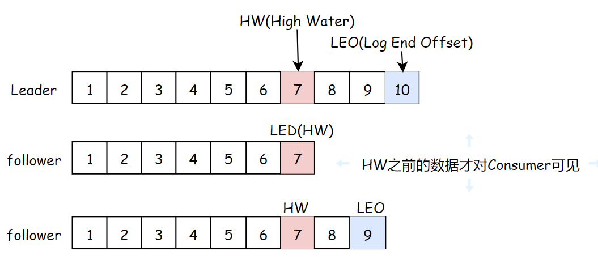

# 消息队列

##  1. 消息队列的两种模式

1. 点对点模式：一对一，消费者主动拉取数据，消息收到后消息清除。速度由客户端控制，需要客户端自己监控队列
2. 发布订阅模式：一对多，速度由发送方控制，无需客户端自己监控队列。**可以队列主动推送或者消费者自己主动拉取**，消费者消费数据之后不会立即清除消息


## 2. 消息队列的优缺点

### **优点：**

**解耦**

扩展性

灵活性，峰值处理(**削峰**)

可恢复性：消息处理的进程挂掉，加入队列的消息仍然可以在系统恢复后被处理

顺序保证

缓冲：解决生产消息和消费消息的速度不一致的情况

**异步通信**


### 缺点：

系统**可用性降低**(MQ宕机对业务造成影响，如何保证高可用？)

系统**复杂度变高**(如何解决消息丢失？消息重复处理？保证消息的顺序？越来越复杂)

**一致性问题**：如何让保证消息数据处理的一致性(使用分布式事务)

## 3. 如何保证消息队列的高可用

### RabbitMQ：使用普通集群

1. 在多台机器上分别启动RabbitMQ实例
2. 多个实例之间可以相互通信
3. 创建的Queue只会放在一个RabbitMQ上，其他的实例都去同步元数据(元数据不是真正的实际数据，而只是实际数据的"引用")
4. 消费的时候，如果连接的实例没有Queue，则取queue所在的实例拉取数据

缺点：

没有真正做到高可用（如果真正存放queue的集群挂了，数据就丢失了）

有数据拉取的开销和单实例的瓶颈（所有的数据都要从主实例拉取，有性能瓶颈）


### RabbitMQ：使用镜像集群

1. 每次生产者写消息到queue的时候，都会自动把消息同步到多个实例的queue上，每个RabbitMQ的节点上都有queue的消息数据和元数据，某个节点宕机，其他节点依然保存了完整的数据，不影响消费者的消费


### RocketMQ：双主双从

1. 生产者通过Name Server发现Broker
2. 生产者发送队列消息到2个Broker主节点
3. Broker主节点分别和各自从节点同步数据
4. 消费者从主节点或者从节点订阅消息

数据真正存储在Broker中，Name Server记录了Broker的地址。因为生产者并不知道哪个主节点可用，所以要去Name Server询问


## 4. 如何保证消息不丢失

**消息丢失的原因：**

1. 生产者没有成功发送到MQ
2. 消息发送给MQ之后，MQ还没来得及持久化，MQ的Broker宕机，导致内存中的消息数据丢失了

3. 消费者获取到消息，但是消费者还没有来得及处理就宕机了，此时MQ的消息已经删除，消费者重启之后不能再消费之前的消息了            

**确保消息不丢失的方案**

1. 消息发送给MQ之后，MQ给生产者**确认收到**，否则生产者应重试
2. MQ收到消息之后进行消息的**持久化**
3. 消费者收到消息**处理完毕之后进行ack确认**，MQ收到ack之后才删除持久化的消息

## 5. 如何保证消息不被重复消费

**重复消息产生的原因**：

生产者发送消息，MQ应答的时候由于网络原因应答失败，生产者就会发送重复消息

消费者消费完成后，ack由于网络原因没有被MQ接收到，此时消费者就会收到两条相同的消息


**如何保证不被重复消费/保证消息的幂等性**

1. 消息发送者发送消息的时候携带一个全局唯一id
2. 消费者获取消息后先根据id在redis中查询是否存在消费记录
3. 如果没有消费过就正常消费，消费完后写入redis
4. 如果消息已经消费，就应该直接舍弃

## 6. 如何保证消息消费的顺序性

**顺序性消费**：

例如一笔订单产生了3条消息：订单创建，订单付款和订单完成，消费的时候要按照顺序依次消费才有意义

**但是多笔订单之间又是可以并行消费的**


**首先要保证消息顺序到达MQ，还要保证消息被顺序消费？** 生产者：MQ Server：消费者=1：1：1


但是这样效率太低了。。。多笔订单之间不能并行消费。。。。怎么进行并行消费呢

1. **生产者根据消息ID将同一组消息发送到一个queue中**

2. 多个消费者同时获取queue中的消息进行消费

3. **MQ使用分段锁，锁住该queue，保证单个queue中的有序消费**，当M1被消费完后，**消费者1回复ack，这时候MQ才释放该queue的锁**，这时候M2才能被消费


## 7. 基于MQ的分布式事务

分布式事务：用户提交订单，库存服务操作库存DB减库存，订单服务操作订单DB生成订单数据。库存服务和订单服务要么同时成功，要么同时失败。。分布式事务就是为了保证不同数据库的数据的一致性

基于MQ的分布式事务是一个异步模型，将两个服务方解耦了


## 8. 几种MQ的对比

| 特性       | ActiveMQ           | RabbitMQ                 | RocketMQ               | Kafka                                                        |
| ---------- | ------------------ | ------------------------ | ---------------------- | ------------------------------------------------------------ |
| 开发语言   | java               | erlang                   | java                   | scala                                                        |
| 单机吞吐量 | 万级               | 万级                     | **十万级**             | **十万级**                                                   |
| 时效性     | ms级               | **us级**                 | ms级                   | ms级以内                                                     |
| 可用性     | 高(主从架构)       | 高(主从架构)             | **非常高(分布式架构)** | **非常高(分布式架构)**                                       |
| 功能特性   | 文档多，协议支持好 | 并发能力强，延迟低性能好 | 功能完善，扩展性好     | 只支持主要的MQ功能，消息查询、<br>消息回溯等功能没有提供，大数据领域应用广泛 |

RabbitMQ，如果不考虑二次开发的话，追求稳定性和性能可以考虑使用

RocketMQ是java开发的，稳定性和性能都不错，还方便二次开发，推荐使用

Kafka一般在大数据领域用的多


## 9. Kafka原理

Kafka是`分布式`的基于`发布订阅`模式的`消息队列`，对消息保存时根据Topic进行归类，kafka集群有多个kafka实例，每个实例被称为一个broker

无论是kafka集群还是consumer，都依赖于`zookeeper`集群保存一些meta信息，来保证系统的可用性

### 9.1 Kafka的设计原则和使用场景

设计原则：

- `高吞吐、低延迟`：kakfa 最大的特点就是收发消息非常快，kafka 每秒可以处理几十万条消息，它的最低延迟只有几毫秒
- `高伸缩性`： 每个主题(topic) 包含多个分区(partition)，主题中的分区可以分布在不同的主机(broker)中
- `持久性、可靠性`： Kafka 能够允许数据的持久化存储，消息被持久化到磁盘，并支持数据备份防止数据丢失
- `容错性`： 允许集群中的节点失败，某个节点宕机，Kafka 集群能够正常工作
- `高并发`： 支持数千个客户端同时读写


使用场景：

- `活动跟踪`：Kafka 可以用来跟踪用户行为，比如我们经常回去淘宝购物，你打开淘宝的那一刻，你的登陆信息，登陆次数都会作为消息传输到 Kafka ，当你浏览购物的时候，你的浏览信息，你的搜索指数，你的购物爱好都会作为一个个消息传递给 Kafka ，这样就可以生成报告，可以做智能推荐，购买喜好等。
- `传递消息`：Kafka 另外一个基本用途是传递消息，应用程序向用户发送通知就是通过传递消息来实现的，这些应用组件可以生成消息，而不需要关心消息的格式，也不需要关心消息是如何发送的。
- `度量指标`：Kafka也经常用来记录运营监控数据。包括收集各种分布式应用的数据，生产各种操作的集中反馈，比如报警和报告。
- `日志记录`：Kafka 的基本概念来源于提交日志，比如我们可以把数据库的更新发送到 Kafka 上，用来记录数据库的更新时间，通过kafka以统一接口服务的方式开放给各种consumer，例如hadoop、Hbase、Solr等。
- `流式处理`：流式处理是有一个能够提供多种应用程序的领域。
- `限流削峰`：Kafka 多用于互联网领域某一时刻请求特别多的情况下，可以把请求写入Kafka 中，避免直接请求后端程序导致服务崩溃。

### 9.2 Kafka整体结构

一个典型的 Kafka 集群中包含若干Producer，若干broker（Kafka支持水平扩展，一般broker数量越多，集群吞吐率越高），若干Consumer Group，以及一个Zookeeper。Kafka通过Zookeeper管理集群配置，`选举leader`，以及在Consumer Group发生变化时进行`rebalance`。

Producer使用push模式将消息发布到broker，Consumer使用pull模式从broker订阅并消费消息


- `follower副本机制`：一个Topic的一个partition可以创建副本，放到其他的Broker里面，防止leader partition宕机，集群中节点故障时可以进行故障转移，保证高可用。**leader对外提供服务，follower只是被动跟随**
- `多个Partition`：提高并发量
- `多个Topic`：分类消息
- `消费者组`：提高消费能力
- `Offset`：每个Record发布到broker后，分配一个offset，offset在单个partition中是有序递增的
- `Record`：消息、记录，包含key, value, timestamp
- **Broker是物理概念**，指服务于Kafka的一个node
- **Topic是逻辑概念**，作为消息的分类标识
- **Partition是物理概念**，同一个topic的数据，会被分散的存储到多个partition中，这些partition可以在同一台机器上，也可以是在多台机器上。单个partition中的数据有序，但整个topic是无法保证有序的。每个partition都对应一个log文件，log文件存储的就是producer生产的数据，不断追加到log文件的末尾，每条数据都有自己的offset
  - 在实现上都是以每个Partition为基本实现单元的
  - 消费时，**每个消费线程最多只能使用一个partition**
  - 一个topic中partition的数量，就是每个user group中消费该topic的**最大并行度数量**
- 消费者：一个消费者/消费者组按 Topic 进行消费
- **消费者组Consumer Group**也是逻辑概念，是Kafka实现单播和广播两种消息模型的手段。同一个topic的数据，会广播给不同的group；同一个group中的worker，只有一个worker能拿到这个数据。组中的每个消费者都会实时记录自己消费到哪个offset了，以便出错恢复时，从上次的位置继续消费
  - **重平衡 Rebalance**： 消费者组内某个消费者实例挂掉后，其他消费者实例自动重新分配订阅主题分区的过程。Rebalance 是 Kafka 消费者端实现高可用的重要手段
- **同一个Topic的同一个partition只能被一个消费者组中的一个消费者消费**。consumer group是kafka提供的可扩展且具有容错性的消费者机制。既然是一个组，那么组内必然可以有多个消费者或消费者实例(consumer instance，是一个线程或者一个进程)，它们共享一个公共的group ID。组内的所有消费者协调在一起来消费订阅主题(subscribed topics)的所有分区(partition)。当然，每个分区只能由同一个消费组内的一个consumer来消费。最好让partition的数量等于被消费的组中的消费者数量，这样正好一个partition被一个消费者消费

### 9.3 Kafka文件存储

涉及了磁盘IO，Kafka为什么依然那么快呢？

1. 消息是`顺序读写`到磁盘的，为了提高速度。。顺序磁盘IO的速度甚至快于随机内存访问
2. Kafka实现了`零拷贝`来快速移动数据，避免内核之间的切换
3. `消息压缩` Kafka生产者和消费者都会进行消息的压缩，使消息发的更快一些。最后由Consumer进行解压缩。压缩的算法是随着key、value一起发送过去的
4. `分批发送`


- 为了防止log文件过大导致数据定位效率低下，Kafka采用**分片**和**索引**机制，每个partition分为多个segment，每个segment对应两个文件：.log和.index，这些文件位于一个文件夹：topic名+分区号
- **而.log和.index文件命名以`当前segment中的第一条消息`的offset命名**：00000000000000239430.log


### 9.4 Kafka生产者

分区的原因：方便在集群中扩展，可以提高并发(可以以Partition为单位读写)

`ProducerRecord对象的结构`：**Topic + Partition + Key + Value**

- 首先键值对对象由`序列化器`转化为字节数组，以便在网络上传输，然后到达分区器
- 分区器分区的原则：
  - 如果ProducerRecord指定了有效的分区号，`分区器`便分配到对应Partition
  - 否则将**key的hash值与topic的partition数进行取模**得到partition值
  - 没有partition也没有key，round-robin算法生成随机的partition值。(**第一个partition随机，后续就轮询了**)
- ProducerRecord 还有关联的时间戳，如果用户没有提供时间戳，则使用当前时间

写入Broker失败后，会返回一个错误，成功后则返回Topic，Partition，Offset


**数据的可靠性**：

- Topic的**全部follower**与leader全部同步完成后，才发送ack给生产者：`延迟高`，容忍n台故障需要n+1个副本

- Topic的**半数以上follower**与leader全部同步完成后，才发送ack给生产者：`延迟低`，容忍n台故障需要2n+1个副本

1. **Kafka采用全部follower同步才发送ack的方案，但进行了优化**，但是Leader维护了一个`ISR`(in-sync replica set)，即和leader保持同步的follower集合。只要ISR中的follower完成同步后，leader就给follower发送ack，**如果follower长时间**(replica.lag.time.max.ms)**未向leader同步数据**，**该follower将被踢出ISR**。Leader发生故障之后，会从ISR中选举新Leader
2. **ack应答机制，三种级别，`acks`参数**：
   - 0：**producer不等待broker的ack**，最低延迟，最大吞吐，但是可能丢失数据，类似UDP
   - 1：**producer等待broker的ack**，**partition的leader落盘成功就返回ack**，如果follower同步之前leader故障，会丢失数据。同时消息的发送也可以选择同步或者异步，异步使用回调函数通知生产者
   - -1：**producer等待broker的ack，pritition的leader和ISR的所有follower全部落盘才返回ack**，但是follower同步完成后，broker返回ack前若leader故障，可能造成数据重复。最强可靠性

**数据的一致性：故障处理**

- LEO：每个副本的最后一个offset
- HW：所有副本最小的LEO
- **消费一致性：HW之前的数据才对Consumer可见**
- **存储一致性**：出现故障，重新选举Leader，会保证其他follower与HW一致，然后**同步新leader中到其LEO的数据**




### 9.5 Kafka消费者

KafkaConsumer对象订阅主题并消费

当生产者生产速度超过了消费者的消费速度，就需要多个消费者共同参与该主题的消费(消费者组)


如果生产者产生的消息依然很多，让消费者吃不消，就继续增加消费者


此时如果再向消费者组中增加消费者已经不起作用了，因为一个分区只能被消费者组中的一个消费者消费(**消费者组中的消费者数量应该≤该主题的分区数**)。所以**创建主题的时候要考虑使用比较多的分区数**，这样可以再消费负载高的情况下增加消费者来提高性能


**消息只需一次写入，就可支持任意多的应用读取这个消息**，也就是说，**每个应用都可以读取到全量的消息**。


**两种消费方式：**

1. `点对点模式`：一个消费者群组消费一个主题中的消息，点对点的消费方式又被称为`消息队列`
2. `发布-订阅模式`：一个主题中的消息被多个消费者群组共同消费


**消费者重平衡(rebalance)**: 最初是一个消费者订阅一个主题并消费其全部分区的消息，后来有一个消费者加入群组，随后又有更多的消费者加入群组，而新加入的消费者实例`分摊`了最初消费者的部分消息，这种把分区的所有权通过一个消费者转到其他消费者的行为称为`重平衡`

重平衡为消费者群组带来了`高可用性` 和 `伸缩性`，使得我们可以放心的添加和移除消费者

消费者通过向`组织协调者`（Kafka Broker）发送心跳来维护自己是消费者组的一员并确认其拥有的分区。只要消费者定期发送心跳，就会认为消费者是存活的并处理其分区中的消息。当消费者检索记录或者提交它所消费的记录时就会发送心跳。如果过了一段时间未收到心跳，会话（Session）就会过期，组织协调者就会认为这个 Consumer 已经死亡，就会触发一次`重平衡`。

重平衡的过程对消费者组有极大的影响。因为每次重平衡过程中都会导致万物静止(STW)


**poll()轮询**

`max.partition.fetch.bytes`参数：该属性指定了服务器从每个分区里返回给消费者的`最大字节数`。它的默认值时 1MB，也就是说，`KafkaConsumer.poll()` 方法从每个分区里返回的记录最多不超过 max.partition.fetch.bytes 指定的字节。在为消费者分配内存时，可以给它们多分配一些，因为如果群组里有消费者发生崩溃，剩下的消费者需要处理更多的分区。max.partition.fetch.bytes 的值必须比 broker 能够接收的最大消息的字节数(通过 max.message.size 属性配置)大，**否则消费者可能无法读取这些消息，导致消费者一直挂起重试**。 在设置该属性时，另外一个考量的因素是消费者处理数据的时间。消费者需要频繁的调用 poll() 方法来避免会话过期和发生分区再平衡，如果单次调用poll() 返回的数据太多，消费者需要更多的时间进行处理，可能无法及时进行下一个轮询来避免会话过期。如果出现这种情况，可以把 max.partition.fetch.bytes 值改小，或者延长会话过期时间


**偏移量**

消费者在每次调用`poll()` 方法进行定时轮询的时候，会向一个叫做 `_consumer_offset` 的特殊主题中发送消息，这个主题会保存每次所发送消息中的分区偏移量，这个主题的主要作用就是消费者触发重平衡后记录偏移使用的。正常情况下不触发重平衡，这个主题是不起作用的，当触发重平衡后，消费者停止工作，每个消费者可能会分到对应的分区，这个主题就是让消费者能够继续处理消息所设置的

1. 如果提交的偏移量小于客户端最后一次处理的偏移量，那么位于两个偏移量之间的消息就会被重复处理


2. 如果提交的偏移量大于最后一次消费时的偏移量，那么处于两个偏移量中间的消息将会丢失


**偏移量的提交方式：**

1. 自动提交：`enable.auto.commit`，每过 5s，消费者会自动把从 poll() 方法轮询到的最大偏移量提交上去，消费者里的其他东西一样，自动提交也是在轮询中进行的。消费者在每次轮询中会检查是否提交该偏移量了，如果是，那么就会提交从上一次轮询中返回的偏移量
2. 提交当前偏移量：使用 `commitSync()` 提交偏移量，由`poll()`返回最新偏移量。
3. 异步提交：异步提交 `commitAsync()` 与同步提交 `commitSync()` 最大的区别在于异步提交不会进行重试，同步提交会一致进行重试
4. **同步和异步组合提交：** 一般情况下，针对偶尔出现的提交失败，不进行重试不会有太大的问题，因为如果提交失败是因为临时问题导致的，那么后续的提交总会有成功的。但是如果在关闭消费者或再均衡前的最后一次提交，就要确保提交成功


# 分布式搜索引擎

Lucene是迄今为止最先进、性能最好、功能最全的搜索引擎库，但是配置复杂，只支持java，不易用

ElasticSearch解决了Lucene的缺点

## 1. ES和Solr

- 单纯的对已有数据进行搜索时，Solr更快
- 当实时建立索引时, Solr会产生io阻塞，查询性能较差, Elasticsearch具有明显的优势
- Solr 利用 Zookeeper 进行分布式管理，而Elasticsearch 自身带有分布式协调管理功能
- Solr 支持更多格式的数据，比如JSON、XML、CSV，而 Elasticsearch 仅支持json文件格式
- Solr 在传统的搜索应用中表现好于 Elasticsearch，但在处理实时搜索应用时效率明显低于 Elasticsearch
- Solr 是传统搜索应用的有力解决方案，但 Elasticsearch更适用于新兴的实时搜索应用


## 2. Lucene全文检索框架

**全文检索**是指：

- 通过一个程序扫描文本中的每一个单词，针对单词建立索引，并保存该单词在文本中的位置、以及出现的次数
- 用户查询时，通过之前建立好的word索引来查询，将索引中单词对应的文本位置、出现的次数返回给用户，因为有了具体文本的位置，所以就可以将具体内容读取出来了


## 3. ES的一些基本概念

**索引 `Index`**

索引库，相当于关系型数据库的`Database`

一个索引就是一个拥有几分相似特征的文档的集合。比如说，可以有一个客户数据的索引，另一个产品目录的索引，还有一个订单数据的索引

一个索引由一个名字来标识(必须全部是小写字母的)，并且当我们要对对应于这个索引中的文档进行索引、搜索、更新和删除的时候，都要使用到这个名字


**映射 `mapping`**

ElasticSearch中的**映射(Mapping)用来定义一个文档**

mapping是处理数据的方式和规则方面做一些限制，如某个字段的数据类型、默认值、分词器、是否被索引等等，这些都是映射里面可以设置的


**字段 `Field`**

相当于是数据表的字段|列


**字段类型 `Type`**

每一个字段都应该有一个对应的类型


**文档 `Document`**

一个文档是一个可被索引的基础信息单元，类似一条记录。文档以JSON(Javascript Object Notation)格式来表示


集群 cluster

一个集群就是由一个或多个节点组织在一起，它们共同持有整个的数据，并一起 提供索引和搜索功能


节点 node

一个节点是集群中的一个服务器，作为集群的一部分，它存储数据，参与集群的索引和搜索功能


**分片和副本 shards&replicas**

分片：将索引划分成多份。每个分片本身也是一个功能完善并且独立的“索引”，这个“索引”可以被放置 到集群中的任何节点上

允许水平分割/扩展你的内容容量 

允许在分片之上进行分布式的、并行的操作，进而提高性能/吞吐量

副本：故障转移机制

在分片/节点失败的情况下，提供了高可用性

扩展搜索量/吞吐量，因为搜索可以在所有的副本上并行运行


# ZooKeeper

ZooKeeper是一个分布式协调组件，相当于一个解决分布式一致性问题的分布式数据库，拥有文件系统特点，具有发布订阅功能。

可以用ZooKeeper来做：注册中心、配置中心、统一命名服务、分布式锁、集群管理

核心机制：

- Leader选举算法
- 2PC两阶段提交
- 过半机制
- 同步机制

ZK和客户端之间以socket形式进行双向通讯，并且支持事件watch机制

ZK满足了CAP理论的CP，牺牲了高可用的A，存储能力有限

ZK服务器节点越多，读性能越好，但写性能越差，**ZK服务器节点不宜过多，因为每个节点和其他节点之间要进行p2p的连接。**

## 1. 数据结构和基本操作


ZooKeeper的数据结构，跟Unix文件系统非常类似，可以看做是一颗**树**，每个节点叫做**Znode**。每一个节点可以通过**路径**来标识

Znode节点类型：

- **持久（PERSISTENT）节点** ：一旦创建就一直存在即使 ZooKeeper 集群宕机，直到将其删除。
- **临时（EPHEMERAL）节点** ：临时节点的生命周期是与 **客户端会话（session）** 绑定的，**会话消失则节点消失** 。并且，临时节点 **只能做叶子节点** ，不能创建子节点。
- **持久顺序（PERSISTENT_SEQUENTIAL）节点** ：除了具有持久（PERSISTENT）节点的特性之外， 子节点的名称还具有顺序性。比如 `/node1/app0000000001` 、`/node1/app0000000002` 。
- **临时顺序（EPHEMERAL_SEQUENTIAL）节点** ：除了具备临时（EPHEMERAL）节点的特性之外，子节点的名称还具有顺序性。


基本操作：

```
create /Java/zk 123   //创建节点名为/Java/zk , value为 数字 123
set  /Java/zk "aaa"   //更新节点数据内容， value为 字符串 "aaa"
get /Java/zk          //获取节点内容
delete /Java/zk		  //删除节点，删除一个节点的条件是该节点必须没有子节点

ls /Java			  //查看该目录下的节点
stat  /Java			  //查看节点状态
ls2  /Java			  //查看节点的子节点列表和节点状态，相当于 ls + stat
```


## 2. 监听器

- 监听Znode节点的**数据变化**
- 监听子节点的**增减变化**

ZK的事件有传递机制，**子节点的增删改触发的事件会向上层依次传播**，所有的父节点都可以收到子节点的数据变更事件，所以层次太深/子节点太多会给服务器的事件系统带来压力

Java通过Watcher实现的，可以在节点变化后**自定义回调操作**

Go是通过Event实现的，道理都是一样的

 ```go
 func main() {
 	// 连接zk
 	conn, _, err := zk.Connect(hosts, time.Second*5)
 	defer conn.Close()
 	if err != nil {
 		fmt.Println(err)
 		return
 	}
 
 	// 开始监听path
 	_, _, event, err := conn.ExistsW(path)
 	if err != nil {
 		fmt.Println(err)
 		return
 	}
 
 	// 协程调用监听事件
 	go watchZkEvent(event)
 
 	// 触发创建数据操作
 	create(conn, path, data)
 
 }
 
 // zk 回调函数
 func watchZkEvent(e <-chan zk.Event) {
 	event := <-e
 	fmt.Println("###########################")
 	fmt.Println("path: ", event.Path)
 	fmt.Println("type: ", event.Type.String())
 	fmt.Println("state: ", event.State.String())
 	fmt.Println("---------------------------")
 }
 
 // 创建数据
 func create(conn *zk.Conn, path string, data []byte) {
 	_, err := conn.Create(path, data, flags, acls)
 	if err != nil {
 		fmt.Printf("创建数据失败: %v\n", err)
 		return
 	}
 	fmt.Println("创建数据成功")
 }
 ```


## 3. 领导者选举

领导者选举的触发机制：`集群启动时`、`Leader挂掉时`、`Follower挂掉超过一半时`

领导者选举期间，集群是不能对外提供服务的


术语说明：

`ZXID`：高32位是epoch，表示Leader的周期，单增；低32位是Leader产生的propose编号，在一个epoch内单调递增，epoch变更后从0开始

`SID`：服务器ID，用来唯一标识一台ZooKeeper集群中的服务器，每台机器都不能重复，和myid一致

`vote_sid`：接收到的投票信息中所推举的Leader服务器的SID

`vote_zxid`：接收到的投票信息中所推举的Leader服务器的ZXID

`self_sid`：当前服务器自己的SID

`self_zxid`：当前服务器自己的ZXID

`electionEpoch`：当前服务器的选举轮次


- 每个zk节点收到客户端请求时，首先就会**生成并持久化一条日志和`zxid`(自增)**，然后发送日志给其他服务器，收到半数以上ack后，再去**更新数据(内存)**，返回成功。所以zxid越大的zk节点的数据就越新。（由于一致性保证，大多数情况下zxid都是一样的）
- 处理投票：
  - 先比较ZXID，ZXID比较大的节点优先作为Leader
    - 如果收到的`vote_zxid > self_zxid`，就认可收到的投票，改投
    - 如果收到的`vote_zxid < self_zxid`，就坚持自己的投票，不做变更
  - 如果ZXID相同，则比较myid，myid大的节点作为Leader
    - 如果收到的`vote_sid > self_sid`，就认可收到的投票，改投
    - 如果收到的`vote_sid < self_sid`，就坚持自己的投票，不做变更
- 投票统计：如果有一个节点得到了过半的票数，那么得到过半票数的机器就作为Leader，终止投票，否则重新进入下一轮选举


每个zk节点都有一个自己的投票箱，一开始都是投给自己`{投票者myid, 投票目标的myid, 目标的zxid}`。之后每个节点都会把自己的投票信息发送出去

例如下图：一开始都是投给自己，然后zk1将自己的投票发给zk2，zk2首先比较zxid相同，然后发现投出者zk1的myid小于自己，于是不更新。而zk1收到zk2的投票信息后，发现投出者myid更大，于是跟投{1,2,100}

**只要Leader节点不挂掉，是不会产生新的Leader的，即使新来的节点的zxid更大或者myid更大**

如果有新来的zxid=101，虽然zxid更大，但是这些更大的zxid只有日志，没有进行两阶段的提交(否则过半节点都有101的zxid)，这些更大的请求是无效的

所以zk3虽然发出了{3,3,101}选票，但是会收到{1,2,100},{2,2,100}两条leader信息，所以直接取同步zk2


## 4. 简化2PC机制

Zab协议简化了2PC，不需要所有的Follower都响应成功，只要过半即可


- WAL：先写日志，确保可以收到过半的ACK后才进行提交
- 第一阶段提交：收到过半的ACK(加上Leader自己的ACK)，本地内存提交
- 第二阶段提交：异步将commit命令发送到一个队列(异步，只保证**最终一致性**)，发送之后便响应客户端成功。Follower异步地消费队列，更新内存


## 5. 实现分布式锁

锁服务可以分为两类：

1. 保持独占锁：所有试图来获取这个锁的客户端，**最终只有一个可以成功获得这把锁**。通常的做法是把zk上的一个znode看做是一把锁，通过`create znode`的方式来实现。所有客户端都去创建`/distribute_lock`节点，最终**成功创建的那个客户端也即拥有了这把锁**
2. 控制时序锁：所有试图来获取这个锁的客户端，最终都是会被安排执行，只是有个全局时序了。与保持独占锁的做法类似，不同点是`/distribute_lock`已经预先存在，客户端在它下面创建临时有序节点（可以通过节点控制属性控制：`CreateMode.EPHEMERAL_SEQUENTIAL`来指定）。zk的父节点(/distribute_lock)维持一份sequence，保证子节点创建的时序性，从而形成每个客户端的全局时序


系统A、B、C都去访问`/locks`节点

访问的时候会**创建带顺序号的临时/短暂**(`EPHEMERAL_SEQUENTIAL`)节点，比如，系统A创建了`id_000000`节点，系统B创建了`id_000002`节点，系统C创建了`id_000001`节点


接着，拿到`/locks`节点下的所有子节点(id_000000,id_000001,id_000002)，**判断自己创建的是不是最小的那个节点**

- 如果是，则拿到锁。

- - 释放锁：执行完操作后，把创建的节点给删掉

- 如果不是，则**监听**比自己要小1的节点变化

当比自己小1的节点释放锁后(节点删除)，自己就成为了最小的节点，于是顺利拿到锁


## 6. Zab协议详解

Zab协议 的全称是 Zookeeper Atomic Broadcast （Zookeeper原子广播）。Zookeeper 是通过 Zab 协议来保证分布式事务的最终一致性

https://houbb.github.io/2018/10/30/zab


**ZAB协议核心：**

Zab 协议需要确保那些**已经在 Leader 服务器上提交（Commit）的事务最终被所有的服务器提交**

Zab 协议需要确保**丢弃那些只在 Leader 上被提出而没有被提交的事务**


针对这个要求,如果让leader选举算法能够保证新选举出来的Leader服务器拥有集群中所有机器**最高的ZXID事务proposal**，就可以保证这个新选举出来的Leader一定具有所有已经提交的提案，也可以省去Leader服务器检查proposal的提交与丢弃的工作


### 6.1 数据一致性

ZooKeeper从以下几点保证了数据的一致性


#### 顺序一致性

来自任意特定客户端的更新都会按其发送顺序被提交。

也就是说，如果一个客户端将Znode z的值更新为a，在之后的操作中，它又将z的值更新为b，则没有客户端能够在看到z的值是b之后再看到值a（如果没有其他对z的更新）。


#### 原子性

每个更新要么成功，要么失败。这意味着如果一个更新失败，则不会有客户端会看到这个更新的结果。


#### 单一系统映像

一个客户端无论连接到哪一台服务器，它看到的都是同样的系统视图。

这意味着，如果一个客户端在同一个会话中连接到一台新的服务器，它所看到的系统状态不会比在之前服务器上所看到的更老。

**当一台服务器出现故障，导致它的一个客户端需要尝试连接集合体中其他的服务器时，所有滞后于故障服务器的服务器都不会接受该连接请求，除非这些服务器赶上故障服务器**。


#### 持久性

一个更新一旦成功，其结果就会持久存在并且不会被撤销。

这表明更新不会受到服务器故障的影响。


### 6.2 两种模式

Zab 协议包括两种基本的模式：崩溃恢复 和 消息广播


**模式转换：**当整个集群启动过程中，或者当 Leader 服务器出现网络中断、崩溃退出或重启等异常时，Zab协议就会 进入**崩溃恢复模式**，选举产生新的Leader。 当选举产生了新的 Leader，同时集群中有过半的机器与该 Leader 服务器完成了状态同步（即数据同步）之后，Zab协议就会退出崩溃恢复模式，进入**消息广播模式**。 这时，如果有一台遵守Zab协议的服务器加入集群，因为此时集群中已经存在一个Leader服务器在广播消息，那么该新加入的服务器自动进入**恢复模式**：找到Leader服务器，并且完成数据同步。同步完成后，作为新的Follower一起参与到消息广播流程中

**消息有序：**在整个消息广播中，Leader会将每一个事务请求转换成对应的 proposal 来进行广播，并且在广播事务 Proposal 之前，Leader服务器会首先为这个事务Proposal分配一个全局单递增的唯一ID，称之为事务ID（即zxid），由于Zab协议需要保证每一个消息的严格的顺序关系，因此**必须将每一个proposal按照其zxid的先后顺序进行排序和处理**


### 6.3 广播模式：数据同步

在zookeeper集群中，数据副本的传递策略就是采用消息广播模式。

zookeeper中数据副本的同步方式与二段提交相似，但是却又不同。

二段提交要求协调者必须等到所有的参与者全部反馈ACK确认消息后，再发送commit消息。要求所有的参与者要么全部成功，要么全部失败。二段提交会产生严重的阻塞问题

Zab协议中 Leader 等待 Follower 的ACK反馈消息是指“只要半数以上的Follower成功反馈即可，不需要收到全部Follower反馈”


**新加节点：**

广播模式下，当一个Server加入到ZooKeeper集群中时，它会**以恢复模式启动**，发现Leader，并和Leader进行状态同步，等同步结束后进入消息广播模式


**解除广播模式：**

当Leader崩溃，或者Leader失去了大部分Follower的支持，ZooKeeper服务便会进入到崩溃恢复模式


**投票：**

广播模式类似于分布式事务的2PC，Leader提出决议前会为proposal分配一个单增的唯一id(即zxid)，然后Leader向所有Follower广播该决议（广播到一个FIFO信道/队列，通过信道发送到Follower，以保证有序性），由Follower进行投票，Leader最后对投票结果进行计算，决定决议是否通过。

