# 1. 基本概念          
## 1.1 并发和并行
- 并发：同一时间段发生        
- 并行：同一时刻发生             
## 1.2 进程和线程      
1. 进程：**进程就是内存中运行的应用程序，包括了指令和数据**，每个进程都有独立的内存空间，一个应用程序可以同时运行多个进程，进程是系统运行程序时资源分配的基本单位，是程序的一次执行过程(进程的创建、运行、销毁)         
- **是资源分配的单位**      
- 开销：每个进程有独立的代码和数据空间(进程上下文)，进程之间的切换有较大的开销  
- 所处环境：在操作系统中能同时运行多个任务(程序)        
- 分配内存：系统在运行时为每个进程分配不同的内存区域    
- 包含关系：没有线程的进程可以看作单线程，进程中的多个线程是同时执行的            

2. 线程：进程中的一个执行单元，负责当前进程中程序的执行。
- **是资源调度的基本单位和程序执行的基本单元**        
- 开销：同一类线程共享代码和数据空间，每个线程有独立的运行栈和程序计数器，线程切换开销小        
- 所处环境：在同一应用程序中多个顺序流同时执行      
- 分配内存：线程使用所属进程的资源，线程组只能共享资源
- 包含关系：线程是进程的一部分              

3. 进程实现多处理机环境下的进程调度，分派，切换时， 都需要花费较⼤的时间和空间开销，引⼊线程主要是为了提⾼系统的执⾏效率，减少处理机的空转时间和调度切换的时间，以及便于系统管理。 使OS具有更好的并发性
4. **程序执行过程：** CPU取指令(从内存取到PC，然后PC+1)->译码->执行->访存->回写(寄存器/主存)->取下一条指令循环

5. **线程如何调度：** OS根据不同的线程调度策略来进行线程的调度(负责CPU中PC的值)，线程切换需要保护现场->执行新线程->恢复现场->继续执行原线程

6. **Java中每个JVM线程就对应了一个内核线程**，所以太多的线程会导致创建销毁线程开销大。Go语言中协程的概念，多个go协程对应一个内核线程，一个队列中的多个go协程按顺序执行，减少了很多的创建销毁线程的开销。

## 1.3 线程的调度       
- 非抢占式调度：将CPU分配给特定的进程执行后，必须先执行完它，然后再执行另一个
- 抢占式调度：按优先级调度，优先级高的线程先使用CPU，同优先级随机选择，Java使用抢占式调度       

## 1.4 主线程   
- 执行main方法的线程    

## 1.5 阿姆达尔定律
使用多核CPU对系统进行优化，优化效果取决于CPU的数量以及系统中串行化程序所占的比例。
当CPU趋近于无穷的时候，优化后执行时间就是串行化部分程序所占用的时间

# 2. 线程的创建和终止        

## 2.1 继承Thread类创建线程
1. 自定义一个类，继承`Thread`类，重写`run`方法      
2. 创建该类的对象，通过对象调用 `start` 方法执行线程    
- 结果是当前线程(main)和创建的新线程并发运行，多次启动同一线程是非法的，尤其是线程结束后，不能再启动        
- 调用`start`和`run`方法的区别：`run`方法在主线程的栈内存中直接调用，`start`方法会开辟新的栈空间由JVM来调用执行`run`方法，各个栈空间互不影响         
- 缺点：单继承，继承了Thread不能再继承其他类了

**构造方法：**          
`public Thread()` : 分配一个新的线程对象            
`public Thread(String name)` ： 分配一个指定名字的新线程对象            
`public Thread(Runnable target)` ： 带有指定目标的新线程           
`public Thread(Runnable target, String name)`           
`public Thread(ThreadGroup group, String name)`

**常用方法：**          
`public final String getName()`         
`public void start()`           
`public void run()`         
`public static void sleep(long millis)`             
`public static Thread currentThread()`          

## 2.2 实现Runnable接口创建线程
1. 自定义一个类，实现`Runnabel`接口的`run`方法
2. 传入该`Runnable`创建`Thread`对象，调用`start`方法(Runnable本身没有start方法)         
- 好处：由于java是单继承的，实现Runnable还可以继承其他类，增强了程序扩展性，降低耦合性(设置线程任务和开启线程分离)，**将并发运⾏任务和运⾏机制解耦**        

~~~java
//定义一个实现Runnable接口的类，设置线程的任务
public class RunnableImpl implements Runnable{
    @Override
    public void run() {
        String name = Thread.currentThread().getName();
        for (int i = 0; i < 10; i++) {
            System.out.println(name+",执行第"+(i+1)+"次");
        }

    }
}

//将该类的对象用来构造Thread
public class DemoCreateThread {
    public static void main(String[] args) {
        Runnable runnable = new RunnableImpl();
        Thread t1 = new Thread(runnable,"线程1");
        Thread t2 = new Thread(runnable,"线程2");
        t2.start();
        t1.start();
    }
}
~~~

- 也可以直接传入匿名内部类或者Lambda表达式的方式(只能执行一次了)

~~~java
    public static void main(String[] args) {
        Thread t1 = new Thread(()-> {
            String name = Thread.currentThread().getName();
            for (int i = 0; i < 10; i++) {
                System.out.println(name + ",执行第"+(i+1)+"次");
            }
        }, "线程1");
        t1.start();
    }
~~~

## 2.3 实现Callable接口创建线程  
- Runnable没有返回值，不能抛出异常，而**Callable可以获得返回值,可以抛出异常！！**
- Callable线程需要用`FutureTask`封装后才能被`Thread`执行
- 或者直接使用线程池，就不需要用`FutureTask`进行封装，直接传入Callable即可(线程池底层一样使用了FutureTask来封装)
- Callable的call方法返回值是`Future接口`类型，通过get方法获得返回值
- get方法具有阻塞性，提交任务之后主线程本来是继续运行了，运行到 `FutureTask.get()` 时便则阻塞住了，等待返回值
- `FutureTask`实现了`Runnable`接口！FutureTask中重写run方法，调用Callable的call()方法，用一个成员变量保存了call方法的结果，通过get方法返回（阻塞）

~~~java
        //造一个Callable 泛型是String，所以调用时返回的Future里的类型也是String
        Callable<String> myThread = new Callable() {
            @Override
            public Object call() throws Exception {
                return "RETURN SOME VALUE";
            }
        };

        //使用FutureTask进行封装
        FutureTask<String> myThreadTask = new FutureTask<>(myThread);

        new Thread(myThreadTask).start();

        try {
            String value = myThreadTask.get();    //get()方法获得返回值
            System.out.println(value);
        } catch (InterruptedException e) {
            e.printStackTrace();
        } catch (ExecutionException e) {
            e.printStackTrace();
        }
~~~

## 2.4 run和start的区别
- `run()` : 仅仅是封装被线程执行的代码，直接调⽤是普通⽅法      
- `start()` : ⾸先启动了线程，然后再由jvm去调⽤该线程的run()⽅法      

## 2.5 终止线程
一般来说，线程执行完毕就会结束，无需手动关闭，如果我们要手动关闭一个正在运行的线程，可以调用`Thread.stop()`方法，该方法直接强制立即结束，**已经被废弃，不推荐使用了**，而应该使用**线程中断**

## 2.6 线程中断
线程中断并不会使线程立即退出，而是给线程一个通知，告知线程希望线程退出，至于目标线程如何处理，完全由目标线程自己决定

Thread提供了三个中断线程相关的方法：
- `public void interrupt()` 通知中断线程（仅仅是通知，不保证中断）
- `public boolean isInterrupted()` 判断线程是否被中断
- `public static boolean interrupted()` 判断线程是否被中断，**并清除当前中断状态**
如果**阻塞线程**调用了interrupt()方法，会**抛出异常**，**重新设置中断标志为false**，同时该线程退出阻塞，抛出异常，所以还需要在异常处理中再次中断，将中断标志位再次设为true

注意interrupt的使用，尝试以下：
~~~java
    public static void main(String[] args) throws InterruptedException {
        Thread thread1 = new Thread(new Runnable() {
            @Override
            public void run() {
                System.out.println(Thread.currentThread().getName()+"启动");
                try {
                    Thread.sleep(1000000);
                } catch (InterruptedException e) {
                    //Thread.currentThread().interrupt();
                    e.printStackTrace();
                }
                if(Thread.currentThread().isInterrupted()){
                    System.out.println(Thread.currentThread().getName()+"要退出了");
                }
            }
        }, "线程1");
        thread1.start();

        System.out.println("主线程睡1秒");
        Thread.sleep(1000);

        thread1.interrupt();
    }
/*
主线程睡1秒
线程1启动
主线程睡1秒
java.lang.InterruptedException: sleep interrupted
	at java.lang.Thread.sleep(Native Method)
	at test.Test$1.run(Test.java:13)
	at java.lang.Thread.run(Thread.java:748)
*/
~~~
发现线程sleep被打断，但并没有执行后面的if语句，这是因为sleep抛出异常后，线程的中断标志被清除了(被置为false)，所以还要在异常捕获中进行再一次打断，设置中断标志位，就可以正常执行if语句退出了

# 3. 线程安全和锁   
- 解决线程安全的几种方法：同步代码块，同步方法，Lock锁
## 3.1 synchronized同步     

### 3.1.1 同步代码块
- `synchronized` 关键字可以对用于某个方法中的某个区块，表示对这个区块资源实行互斥访问         
- 获取的是指定对象的锁
~~~java
    synchronized(Object 锁对象){
        需要同步操作的代码
    }
~~~
**同步锁：**            
- 锁对象可以是任意类型      
- 多个线程对象要使用同一把锁        
- 未获得锁的线程进入 BLOCKED 状态等待

### 3.1.2 同步方法  
- 使用 synchronized 修饰的方法就是同步方法，同一时刻只能有一个线程进入该方法       
- 获取的是当前对象的锁，相当于`synchronized(this)`  
- 如果是静态方法，相当于锁住的类 `synchronized(Xxx.class)`     
~~~java
    public synchronized void method(){
        可能产生线程安全问题的代码
    }
~~~
**同步方法中的同步锁：**
- 对于非static方法，同步锁就是实现类对象，也就是 this
- 对于static方法，使用的是当前方法所在类的Class对象            
- 获取了类锁和获取了对象锁的线程是不冲突的      

**锁的释放时机：**
- 当方法执行完毕后会自动释放锁，不需要任何的操作
- 当一个线程的代码出现异常时，其持有的锁会自动释放
- 不会由于异常出现导致死锁现象

**对象锁和实例锁：**

- 对象锁加在对象上，可以锁住`非静态变量，非静态方法，this对象`。只有使用同一个实例的线程才会受锁的影响，多个实例调用同一个方法是不会受锁的影响的
- 类锁是加在类上的，是所有线程共享的，可以锁住`静态变量，静态方法，xxx.class`。是所有线程共享的锁，统一时间只能由一个线程使用加了锁的代码段，不管是不是同一个实例

~~~java
public class DemoSynchronized {
    public synchronized void method() throws InterruptedException {//非静态方法
        for (int i = 0; i < 3; i++) {
            Thread.sleep(1000);
            System.out.println("method running");
        }
    }

    public static synchronized void staticMethod() throws InterruptedException { //静态方法
        for (int i = 0; i < 3; i++) {
            Thread.sleep(1000);
            System.out.println("static method running");
        }
    }

    public static void main(String[] args) {
        new Thread(()-> {
            try {
                staticMethod();
            } catch (InterruptedException e) {
                e.printStackTrace();
            }
        }).start();

        new Thread(()->{
            try {
                new DemoSynchronized().method();
            } catch (InterruptedException e) {
                e.printStackTrace();
            }
        }).start();
    }
}
/* 结果互不影响
method running
static method running
method running
static method running
method running
static method running
*/
~~~

### 3.1.3 synchronized锁和MarkWord，Hashcode，IdentityHashcode
- 一开始的synchronized效率特别低，全部采用重量级锁，jdk1.5带来了Lock锁，性能比synchronized好
- jdk1.6之前的synchronized，竞争失败的线程全部阻塞进入等待队列，所以是重量级锁，涉及到线程切换，上下文切换的操作
- 但从jdk1.6开始synchronized就进行了各种优化(适应自旋锁，消除锁，锁粗化，轻量级锁，偏向锁)。所以现在二者差别不大，大多数时候用synchronized锁就好了。

**对象头(Header)**：对于普通对象，**对象头中记录了markword和类型指针**(数组对象还记录了数组长度)，markword记录了对象的**hashcode、gc相关数据，锁的信息**(锁状态，当前哪个线程持有锁，偏向线程id)

32位jvm下的markword存储结构如下：

64位jvm下的markword存储结构如下：

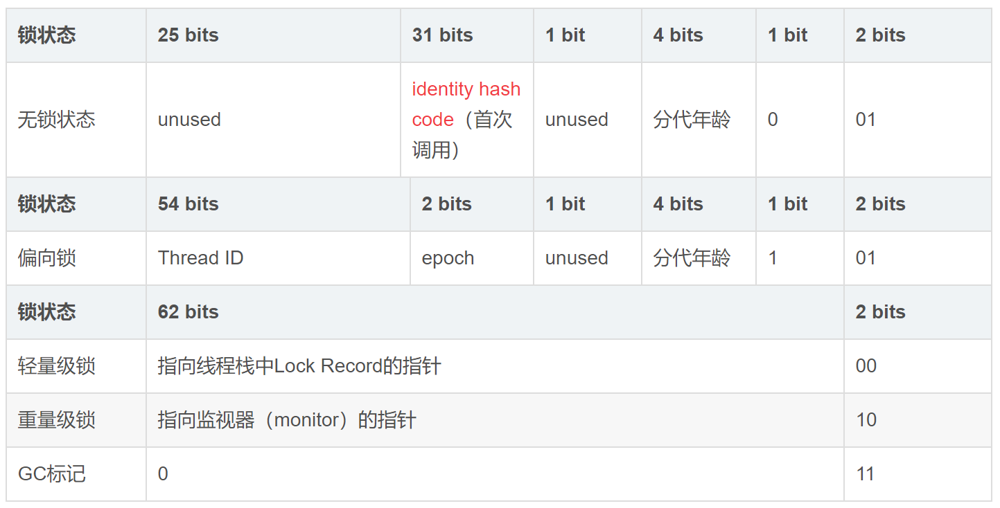

**无锁状态时**：markword存储的是对象的`identity hashcode`，**当用户没有重写hashcode()方法时，**对象的hashcode()方法第一次调用，jvm会调用`System.identityHashcode()`生成对应的identity hashcode，并存储到markword中，后续如果对象的hashcode()再调用，就不会再通过jvm计算得到，而是直接从mark word获取，保证多次获得到的identity hashcode是相同的

- 否则，修改对象的属性后，重新计算的hashcode会变化，就不能保证hashcode是不变的了

~~~java
public static void main(String[] args) {
    String str1 = new String("abc");
    String str2 = new String("abc");
    System.out.println("str1 hashCode: " + str1.hashCode());
    System.out.println("str2 hashCode: " + str2.hashCode());
    System.out.println("str1 identityHashCode: " + System.identityHashCode(str1));
    System.out.println("str2 identityHashCode: " + System.identityHashCode(str2));

    User user = new User("test", 1);	//User重写了hashcode方法
    System.out.println("user hashCode: " + user.hashCode());
    System.out.println("user identityHashCode: " + System.identityHashCode(user));
    user.age=2;
    System.out.println("user hashCode: " + user.hashCode());
    System.out.println("user identityHashCode: " + System.identityHashCode(user));
}

/*
str1 hashCode: 96354
str2 hashCode: 96354	//String重写了hashcode，所以相等
str1 identityHashCode: 2133927002
str2 identityHashCode: 1836019240
user hashCode: 110252400
user identityHashCode: 325040804
user hashCode: 110252401	//修改后自定义的hashcode重新计算，变了，identityhashcode没变
user identityHashCode: 325040804
*/
~~~

- 当对象状态为偏向锁时：mark word存储偏向线程的threadId和epoch的值，**会覆盖identityHashcode字段，所以一旦一个对象已经调用过非自定义的hashcode方法，也就是markword的identityHashcode字段有效了，就不能再进入偏向锁状态**，否则就可能造成同一个对象前后两次调用hashcode方法结果不一致
- 当对象状态为轻量级锁：mark word存储栈中 Lock Record（Displaced Mark Word） 的指针，而Displaced Mark Word中可以包含identityHashcode，所以轻量级锁可以和identityHashcode共存
- 当对象状态为重量级锁：mark word为指向堆中monitor对象的指针，Monitor类中同样字段可以记录非加锁状态的markword，其中也可以存储identityHashcode，所以重量级锁也可以和identityHashcode共存

HotSpot 的锁实现机制是：

- **当一个对象已经计算过identity hash code，它就无法进入偏向锁状态**
- 当一个对象当前正**处于偏向锁状态**，并且需要计算其identity hash code的话，则它的偏向锁会被撤销，并且锁会**膨胀为轻量级锁或者重量锁**
- 轻量级锁的实现中，会通过线程栈帧的锁记录存储Displaced Mark Word；重量锁的实现中，ObjectMonitor类里有字段可以记录非加锁状态下的mark word，其中可以存储identity hash code的值

### 3.1.4 偏向锁
对于轻量级锁，每次加锁解锁都有一次CAS操作，为了提高不存在竞争时的性能，引入了偏向锁。
- 对象创建的时候是默认开启偏向锁模式的，mark word是**可偏向状态**，thread id为0，也叫**匿名偏向**
- 当一个线程**第一次**访问同步代码块，如果是匿名偏向状态，会通过**CAS操作**将对象头的mark word中的锁记录里**偏向的线程ID**设置为自己的id，**之后该线程再次访问**同步代码块的时候，看到偏向的线程id是自己，就**不需要CAS了**

- 其他线程访问同步代码块时，发现对象已经有偏向的线程了，就会进入到**撤销偏向锁**的逻辑里，在`safepoint`中查看偏向的线程是否存活，存活且还在同步代码块中，还需要持有锁，则偏向锁升级为轻量级锁，原偏向锁线程获得轻量级锁，锁对象的Lock Record指针指向原获得偏向锁的线程，然后唤醒该线程，继续执行。如果原线程已经不存活或者不在同步代码块，则直接将对象头的mark word修改为无锁状态，之后再升级为轻量级锁

**偏向锁解锁不会恢复对象头的thread id那块字段**，**一个对象只有一次机会获得偏向锁**

### 3.1.5 轻量级锁
在很多情况下，Java程序运行时，同步代码块中的代码都是不存在竞争的，不同线程交替执行同步代码块中的代码，这种情况下用重量级锁是没必要的，因此JVM引入了轻量级锁的概念

线程执行同步代码块之前，JVM会先在当前线程的 **栈帧中** 创建一个`Lock Record`，其中包括了一个用于存储对象头的`displaced mark word`和一个指向锁对象的指针，将其指向锁对象。拷贝对象头的mark word到Lock Record中，然后通过CAS将锁对象头的`mark word`中的锁记录指针(`Lock Record 指针`)**指向当前线程栈帧中的锁记录**`Lock Record`
- 如果成功，则获得锁，失败则尝试使用自旋来获得锁。**自旋有次数限制，超过限制就要升级为重量级锁**。如果自旋的时候有第三个线程来访，也会升级为重量级锁

解锁时，遍历线程栈，找到所有obj字段(指向锁对象的指针)等于当前锁对象的Lock Record，如果displaced mark word是null，说明是重入（重入的时候，由于mark word已经被修改过，所以displaced mark word为null），将obj设置为null，代表一次解锁，如果不为null，则利用CAS再将`displaced mark word`设置到锁对象头的`mark word`中。如果CAS成功，则成功解锁，失败则表示有锁竞争，升级为重量级锁

### 3.1.6 重量级锁
重量级锁就是传统意义上的锁，利用操作系统底层的同步机制去实现java中的线程同步。重量级锁的状态下，**对象的markword为指向堆中monitor对象的指针**。monitor对象包含：**EntrySet，WaitSet，owner**
当一个线程尝试获得锁，如果锁已经被占用，就将该线程封装成ObjectWaiter对象，移动到EntrySet，阻塞，当持有锁的线程归还锁后，随机唤醒EntrySet中的线程
当获得锁的线程运行中调用object.wait()方法后，就将线程移动到WaitSet中，释放锁，调用notify()后在WaitSet中随机唤醒一个线程进入EntrySet中，一同参与锁竞争
需要注意的是，**当调用一个锁对象的wait或notify方法时，如当前锁的状态是偏向锁或轻量级锁则会先膨胀成重量级锁**

### 3.1.7 锁升级过程

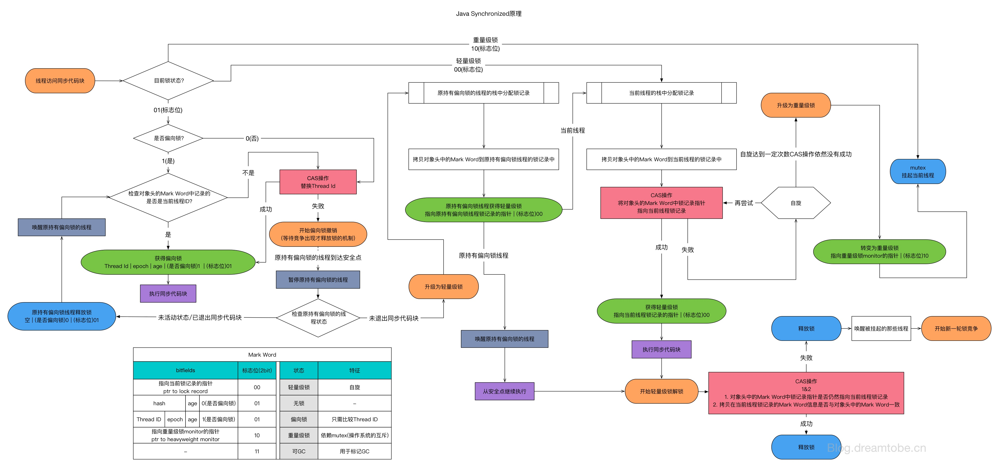

### 3.1.4 wait-notify
Java提供了线程间合作的机制，即Object.wait()方法、Object.notify()和Object.notifyAll()方法                   
`Object.wait()`：使当前线程阻塞，等待其它线程调用notify()方法，释放当前获取的锁       
`Object.notify()` ：唤醒一个等待着的线程，这个线程唤醒之后尝试获取锁，其它线程继续等待        
`Object.notifyAll()` ：唤醒所有等待着的线程尝试获取锁，这些线程排队等待锁     

他们必须在同步代码块中(synchronized)使用

**当调用一个锁对象的wait或notify方法时，如当前锁的状态是偏向锁或轻量级锁则会先膨胀成重量级锁**

## 3.2 关于锁的一些概念
|锁的类型|简介|应用|
|---|---|---|
|乐观锁| |CAS|
|悲观锁| |synchronized、vector、HashTable|
|自旋锁| |CAS|
|可重入锁| |synchronized、ReentrantLock、Lock|
|读写锁| |ReentrantReadWriteLock、CopyOnWriteArrayList、CopyOnWriteArraySet|
|公平锁|队列 |ReentrantLock(True)|
|非公平锁|抢占式 |synchronized、ReentrantLock(False)默认方式|
|共享锁|多线程共享读锁，和乐观锁、读写锁同义 |ReentrantReadWriteLock中读锁|
|独占锁|只有一个线程能获得锁，悲观锁、互斥锁|synchronized、vector、HashTable、ReentrantReadWriteLock中写锁|
|分段锁|锁住操作的段，而不是锁住整个对象|concurrentHashMap|
|互斥锁|悲观锁、独占锁|synchronized|
|同步锁|互斥锁 |synchronized|

### 3.2.1 自旋锁，轻量级锁，重量级锁
- 自旋锁就是轻量级锁，未获得锁的线程原地等待(while)，需要消耗CPU资源，直到锁释放       
- 重量级锁，未获得锁的线程进入队列等待，不消耗资源，直到OS的调度      

轻量级锁不一定效率就比重量级锁高，如果有多个线程自旋，消耗CPU资源

### 3.2.2 偏向锁
**偏向锁事实上不算一种锁**   
比轻量级锁还轻，省去了锁竞争机制(第一个线程直接进入)

### 3.2.3 乐观锁和悲观锁
- 乐观锁：假定当前环境读多写少，遇到并发写的概率比较低，读时认为别的线程不会正在修改，写时判断一下此期间数据是否有被更改(使用版本号或者CAS)，没被更改则更新，否则拒绝。如果冲突频率大，乐观锁会需要多次重试才能成功，代价比较大，改用悲观锁
- 悲观锁：假定当前环境写多读少，遇到并发写的概率很高，每次读写都认为其他线程会修改，所以读写都上锁

### 3.2.4 公平锁和非公平锁

- **公平锁**中，多个线程抢锁时，获取到锁的线程一定是同步队列中等待时间最长的线程。
- **非公平锁**中，多个线程抢锁时，获取锁的线程不一定是同步队列中等待时间最长的线程，有可能是同步队列之外的线程先抢到锁

## 3.3 Lock显式锁 
- **synchronized的局限性：**
  - 尝试获取锁的线程如果获取不到锁会一直**阻塞**，用户无法控制
  - 持有锁的线程只有**执行完代码块、或发生异常、或进入WAITING态**，才会释放锁
  - 持有锁的线程如果等待io，sleep了也不会释放锁，其他线程只能等着，极大影响执行效率
- java.util.locks.lock 接口, Lock锁提供了比 synchronized 代码块和 synchronized 方法更广泛的锁定操作，除了具备前两者的功能外，还有更强大的功能，更能体现面向对象的思想     
- Lock锁更灵活，但必须手动释放锁。synchronized加锁更方便，出错少
- synchronized 在发生异常时，会自动释放线程占有的锁，因此不会导致死锁现象发生；而 Lock 在发生异常时，如果没有主动通过 unLock()去释放锁，则很可能造成死锁现象，因此**使用 Lock 时必须要在 finally 块中释放锁**
- **Lock 可以让等待锁的线程响应中断**，而 **synchronized 却不行**，使用synchronized 时，等待的线程会一直等待下去，不能够响应中断
- Lock锁的加锁和释放锁进行方法化了：        
`public void lock()`        
`public void unlock()`      

### 3.3.1 AQS同步器
- `juc` : java.util.concurrent， 并发包     
- `AQS：AbstractQueuedSynchronizer` 类，即抽象队列同步器，位于`juc.locks`下，AQS是 ReentrantReadWriteLock 和 ReentrantLock 的基础，这两种 Lock 锁默认的实现都是在内部类Syn中，⽽**Syn是继承AQS的**，所以是通过AQS实现的锁           
- AQS是一个**可以实现锁的框架**，内部实现依靠**`CLH队列`**和**`state状态`**
  - state就是**加锁的状态**，初始为0，加锁时为1        
  - AQS内还有一个**记录当前加锁线程**的变量，初始为null
  - **当线程调用lock()的时候，实际上就是通过CAS操作将state值从0变为1**
  - 可重入的实现方法就是，每次加锁的时候判断当前加锁的线程是不是自己，是的话就可以**继续加锁，将state+1**，每解锁一次就把state-1
  - 若线程2来，CAS的时候发现state已经为1，判断一下加锁的线程不是自己（被线程1加了锁），则没办法加锁了，**将线程2封装成一个Node节点加入到CLH队列中，阻塞**，等待锁的分配
  - 线程1释放锁后，会唤醒CLH的后继节点，即线程2

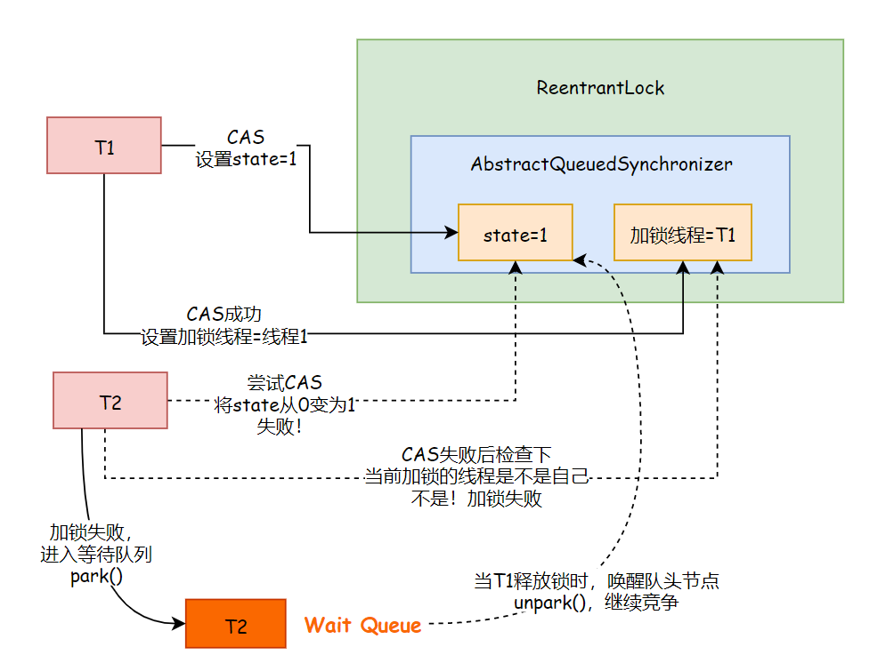

AQS对资源的共享方式：

1. **Exclusive(独占)**：只有一个线程能执行，例如ReentrantLock，又可以分为公平锁和非公平锁
   - 公平锁：按照线程在队列中的先后顺序，先到先得
   - 非公平锁：当线程要获取锁的时候，无视队列顺序，谁抢到就是谁的
2. **Share(共享)**：多个线程可以同时执行，例如CountDownLatch、Semaphore、ReadWriteLock

~~~java
//同步状态，实现线程可见性
private volatile int state;
protected final int getState() {return state;}
protected final void setState(int newState) {state = newState;}
~~~
~~~java
//队列
static final class Node {
        //共享锁模式
        static final Node SHARED = new Node(); 
        //独占锁模式
        static final Node EXCLUSIVE = null;

        /** waitStatus value to indicate thread has cancelled */
        static final int CANCELLED =  1;
        /** waitStatus value to indicate successor's thread needs unparking */
        static final int SIGNAL    = -1;
        /** waitStatus value to indicate thread is waiting on condition */
        static final int CONDITION = -2;
        /**
         * waitStatus value to indicate the next acquireShared should
         * unconditionally propagate
         */
        static final int PROPAGATE = -3;
        ...
}
~~~

#### 独占锁Acquire

获取锁：

~~~java
//获取锁，获取失败就将线程插入等待队列
public final void acquire(int arg) {
    if (!tryAcquire(arg) &&  // tryAcquire尝试获取锁，可以由具体的子类实现自己公平/非公平锁的获取锁方法
        acquireQueued(addWaiter(Node.EXCLUSIVE), arg)) // 获取锁失败，将线程加入队列尾部，阻塞获取资源，返回自己有没有被中断
        selfInterrupt();	// 阻塞直到获取到资源之后，如果被设置了中断，则进行自我中断，取消获取锁
}

//释放锁，唤醒后继节点
public final boolean release(int arg) {
    if (tryRelease(arg)) {
        Node h = head;
        if (h != null && h.waitStatus != 0)
            unparkSuccessor(h);
        return true;
    }
    return false;
}
~~~

将线程入队，然后阻塞获取资源：

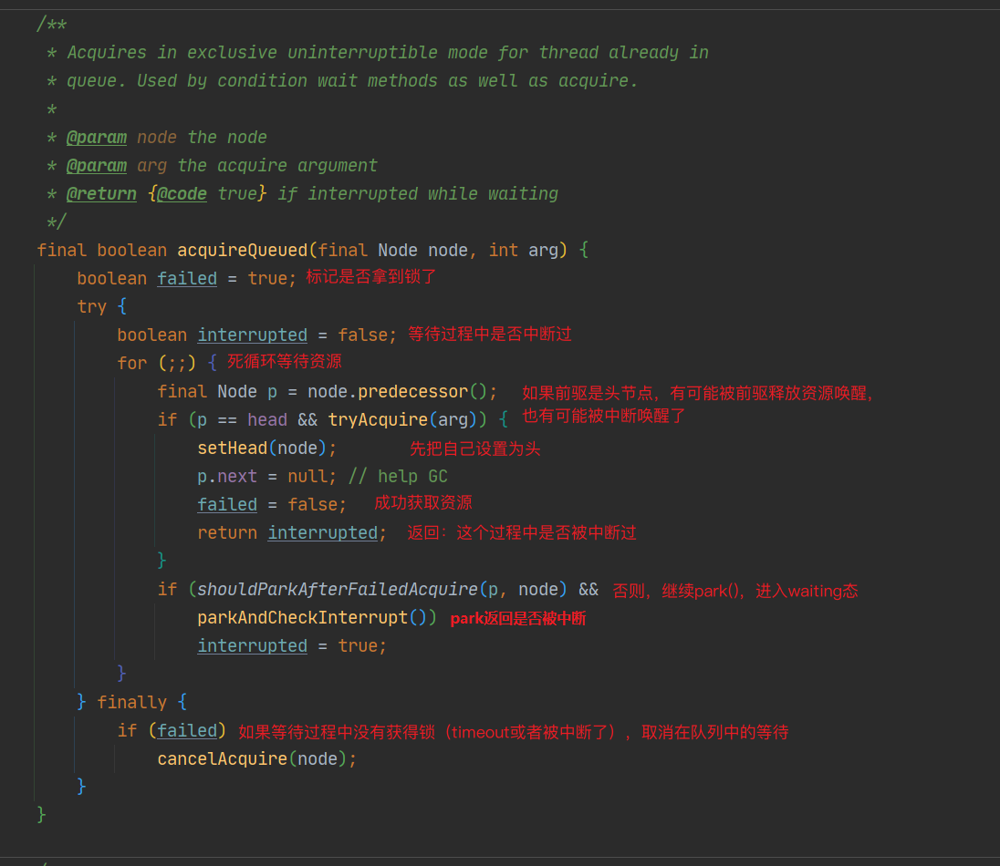

`shouldParkAfterFailedAcquire()`方法就是说，检查下自己是否可以去休息：

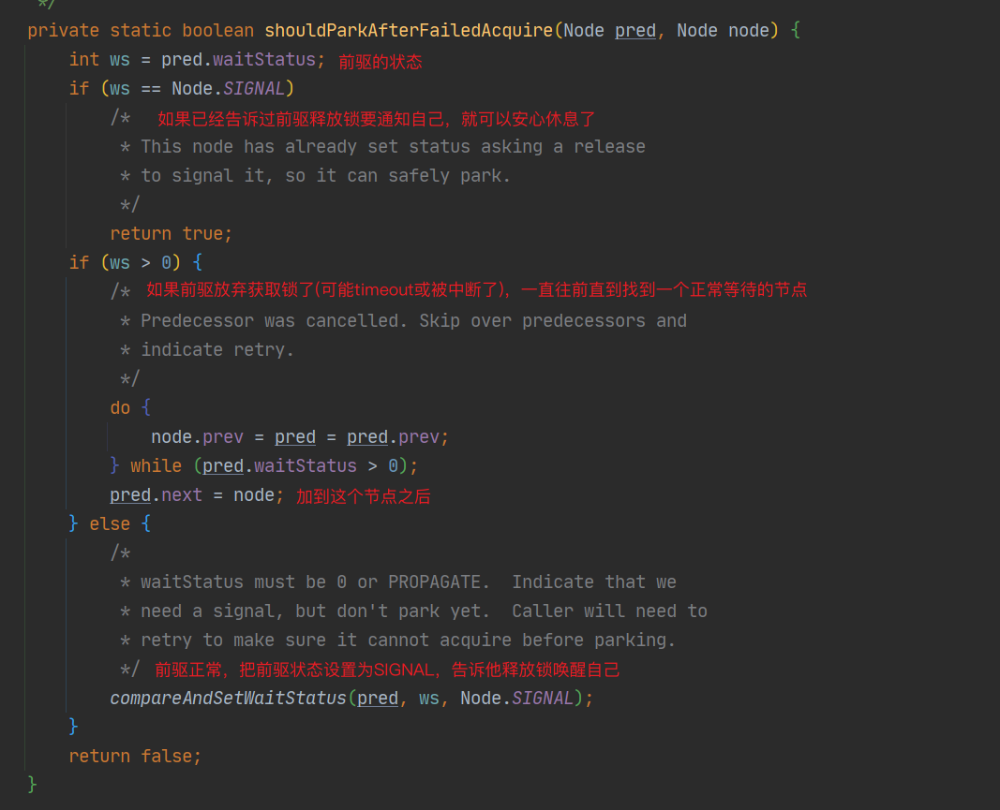

`parkAndCheckInterrupt()`更简单了，就是调用`LockSupport.park()`进入`waiting`态，如果被唤醒，检查自己是不是被中断的

**Acquire流程总结：**

#### 独占锁Release

release首先调用子类实现的`tryRelease`方法，产看是否释放成功

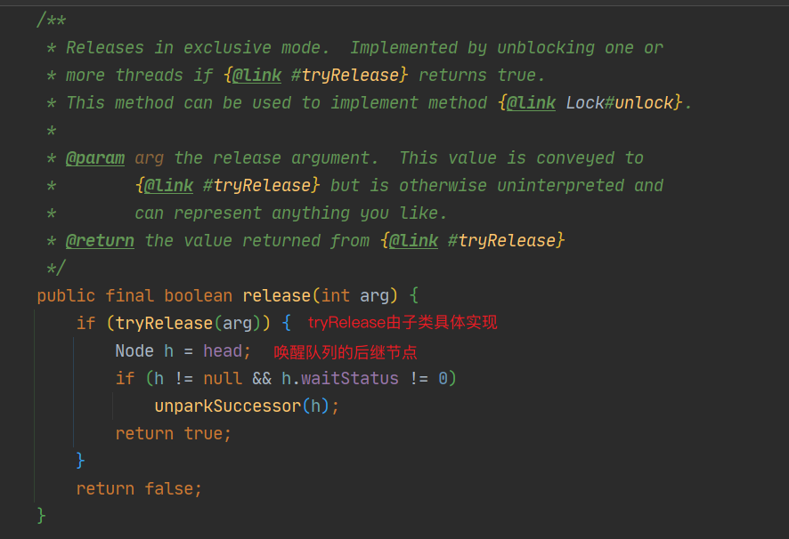

`unparkSuccessor()`方法负责唤醒后继节点：

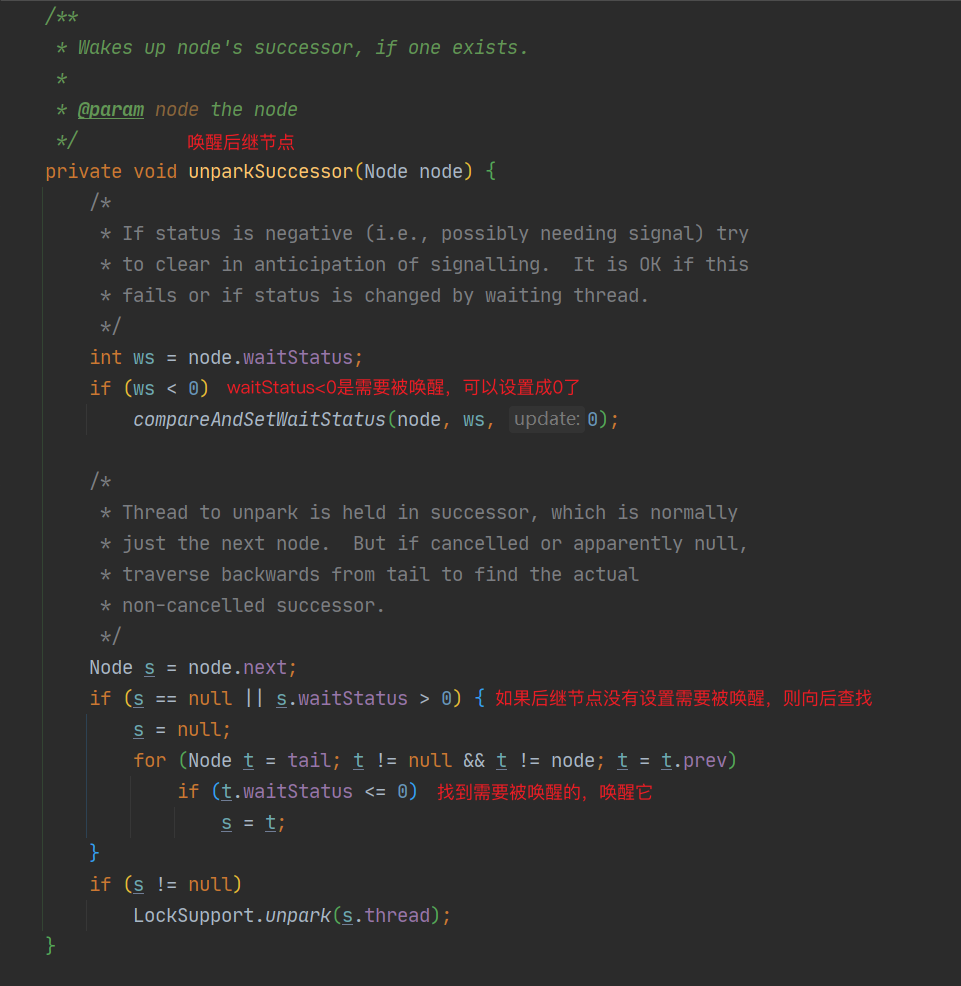

#### 共享锁Acquire

共享锁通过`acquireShared()`获取锁，子类自己实现`tryAcquireShared`方法

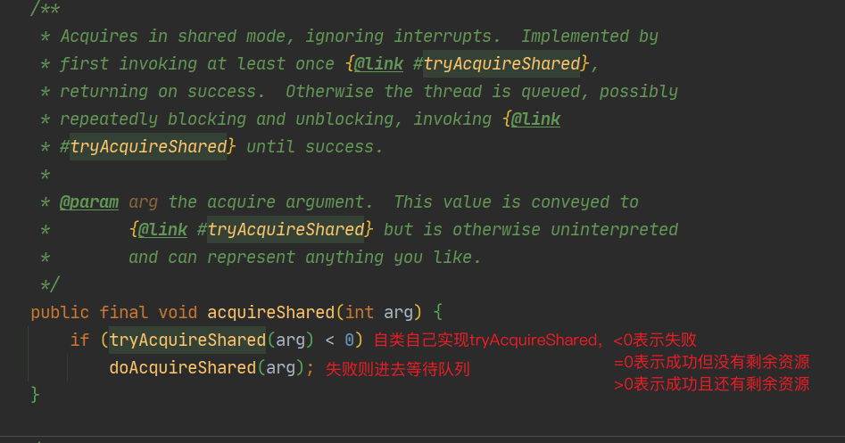

`doAcquireShared()`方法将当前线程加入队列尾部休息，直到其他线程释放资源唤醒自己，自己拿到相应量的资源后才返回，和独占锁的逻辑差不多

唯一的区别是：如果自己是头节点的后继，被唤醒后拿资源，**如果资源还有剩余还会唤醒自己的后继**

如果资源不够自己用，但是够自己的后继用，也不会给后继，要按顺序来

#### 共享锁Release

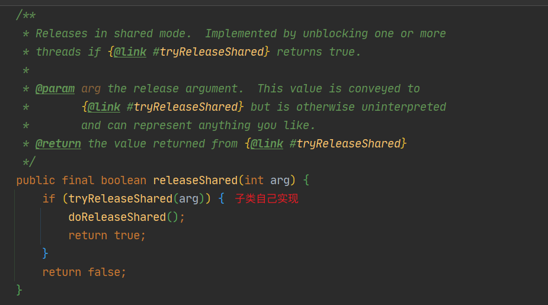

共享锁Release也跟独占锁差不多

**释放资源后唤醒后继**

独占锁要完全释放资源(state=0)才唤醒其他线程，因为要考虑到可重入锁

而共享锁没有这种要求，只要释放了资源就尝试唤醒，后继自己判断自己的资源够不够运行，不够就继续等待

#### 实现锁的模板方法

**AQS 底层使用了模板方法模式**，自定义同步器时需要重写下面几个 AQS 提供的模板方法：

~~~java
isHeldExclusively()//该线程是否正在独占资源。只有用到condition才需要去实现它。
tryAcquire(int)//独占方式。尝试获取资源，成功则返回true，失败则返回false。
tryRelease(int)//独占方式。尝试释放资源，成功则返回true，失败则返回false。
tryAcquireShared(int)//共享方式。尝试获取资源。负数表示失败；0表示成功，但没有剩余可用资源；正数表示成功，且有剩余资源。
tryReleaseShared(int)//共享方式。尝试释放资源，成功则返回true，失败则返回false。
~~~

### 3.3.2 重入锁ReentrantLock     

`java.util.concurrent.locks.ReentrantLock` implements `Lock`        
- 加锁和释放锁都在方法里进行，可以自由控制，比synchronized更灵活方便，还可以多重加锁
- 释放锁必须在finally里，否则可能导致锁不能正常被释放，卡死后续访问该锁的线程    
- ReentrantLock锁上使⽤的是state来表示同步状态(也可以表示重⼊的次数)       
- 默认**非公平锁**，也可以实现**公平锁**(synchronized只有非公平锁)，使用公平锁的话，内部需要维护一个**优先级队列**，成本更高，**性能低**一些

创建锁：`ReentrantLock lock = new ReentrantLock()`
获取锁：`lock.lock()`
获取超时锁：`boolean lock.trylock(long timeout, TimeUnit unit)` 返回true表示获取锁成功，false表示获取锁失败
获取可中断锁：`lockInterruptibly()`
释放锁：`lock.unlock()`
判断当前线程是否持有RL锁：`isHeldByCurrentThread()`

- **重入锁lock了几次就必须要释放几次**
- **synchronized也是重入锁：**          
如下所示，两个方法都是synchronized修饰，add方法可以成功获取到当前线程operation方法已经获取到的锁        

~~~java
    public synchronized void operation(){
        add();
    }
    public synchronized void add(){

    }
~~~

#### 公平性

- 通过构造方法指定公平锁或者非公平锁
~~~java
    public ReentrantLock() {    //默认使用非公平锁
        sync = new NonfairSync();
    }
    
    public ReentrantLock(boolean fair) {    //传入true可以构建公平锁
        sync = fair ? new FairSync() : new NonfairSync();
    }
~~~

- 基本使用方法
~~~java
    private final ReentrantLock lock = new ReentrantLock();
    // ...
    public void m() {
        lock.lock();  // block until condition holds
        try {
        // ... method body
        } finally {
        lock.unlock()
        }
    }   
~~~

非公平锁比公平锁的性能更好，假设线程一是队列中的第一个，线程二是想要插队的线程，当占用锁的线程释放了锁时JVM有两种选择：
阻塞线程二，启动线程一，或者线程一的状态维持不变继续阻塞，线程二的状态也维持不变继续运行。线程状态的切换是耗费时间的，因此方案二的性能更好

#### 获取锁过程可中断
- **ReentrantLock获取锁的过程是可中断的**，而对于synchronized，**获取锁失败只能一直等待，无法中断，直到有线程释放锁**
利用这个机制，ReentrantLock可以解决下面所示的死锁问题。而对于synchronized，非sleep是无法被中断的
~~~java
    private static ReentrantLock lock1 = new ReentrantLock();
    private static ReentrantLock lock2 = new ReentrantLock();

    public static class T implements Runnable {
        int lock;

        public T(int lock) {
            this.lock = lock;
        }

        @Override
        public void run() {
            Thread t = Thread.currentThread();

            try {
                if (lock == 1) {
                    lock1.lockInterruptibly();
                    System.out.println(t.getName() + "获得第一把锁");
                    TimeUnit.SECONDS.sleep(1);
                    lock2.lockInterruptibly();
                    System.out.println(t.getName() + "获得第二把锁");
                } else {
                    lock2.lockInterruptibly();
                    System.out.println(t.getName() + "获得第二把锁");
                    TimeUnit.SECONDS.sleep(1);
                    lock1.lockInterruptibly();
                    System.out.println(t.getName() + "获得第一把锁");
                }
            } catch (InterruptedException e) {
                System.out.println(t.getName() + "被中断，中断标志为" + t.isInterrupted());
                t.interrupt();
                e.printStackTrace();
            } finally {
                if (lock1.isHeldByCurrentThread()) lock1.unlock();
                if (lock2.isHeldByCurrentThread()) lock2.unlock();
            }
        }
    }

    public static void main(String[] args) throws InterruptedException {
        Thread t1 = new Thread(new T(1), "thread1");
        Thread t2 = new Thread(new T(2), "thread2");
        t1.start();
        t2.start();
        Thread.sleep(2000);
        t2.interrupt();
    }

/*
thread1获得第一把锁
thread2获得第二把锁
thread2被中断，中断标志为false
thread1获得第二把锁
java.lang.InterruptedException
*/
~~~
ReentrankLock中必须使用实例方法 `lockInterruptibly()`获取锁时，在线程调用interrupt()方法之后，才会引发 `InterruptedException`异常
**线程调用interrupt()之后，线程的中断标志会被置为true
触发InterruptedException异常之后，线程的中断标志会被清空，即置为false
所以当线程调用interrupt()引发InterruptedException异常，中断标志的变化是:false->true->false**

上述代码换成synchronized则程序变成死锁，互相等待，**synchronized获取锁的过程无法中断**。synchronized**可以中断sleep状态的线程**

#### 超时等待机制

- **获取锁限时等待trylock**：ReentrantLock提供了获取锁限时等待的方法，超过时间未获得锁，则。而对于synchronized是无法设置超时时间的。
~~~java
if(lock1.tryLock(3, TimeUnit.SECONDS)){
    System.out.println("获取锁1成功");
}
~~~

#### Condition
Object有wait和notify机制，是与**对象监视器**配合完成线程间的等待/通知机制的，是java底层级别
而Condition是与**Lock**配合完成等待通知机制，是语言级别，具有更高的**可控制性和可扩展性**

1. Condition能够支持**不响应中断**，Object方式不支持
2. Condition能够支持**多个等待队列**(多个Conditon对象)，而Object只有一个
3. Condition能够支持**超时时间设置**，Object不支持

Condition由ReentrantLock对象创建，并且可以同时创建多个，Condition接口在使用前必须**先调用ReentrantLock的lock()方法获得锁**，之后调用Condition接口的`await()`将释放锁，并且**在该Condition上等待**，直到有其他线程调用Condition的`signal()`方法唤醒线程，使用方式和wait()、notify()类似
**同一个锁支持创建多个Condition**

~~~java
/**
 * 实现一个阻塞队列
 */
public class BlockingQueueDemo<E> {
    int size;//阻塞队列最大容量
    ReentrantLock lock = new ReentrantLock();
    LinkedList<E> list = new LinkedList<E>();//队列底层实现
    Condition notFull = lock.newCondition();//队列满时的等待条件
    Condition notEmpty = lock.newCondition();//队列空时的等待条件

    public BlockingQueueDemo(int size) {
        this.size = size;
    }

    public void enqueue(E e) throws InterruptedException {
        lock.lock();
        try {
            while (list.size() == size)//队列已满,在notFull条件上等待
                notFull.await();
            list.add(e);//入队:加入链表末尾
            System.out.println("入队：" + e);
            notEmpty.signal(); //通知在notEmpty条件上等待的线程
        } finally {
            lock.unlock();
        }
    }

    public E dequeue() throws InterruptedException {
        E e;
        lock.lock();
        try {
            while (list.size() == 0)//队列为空,在notEmpty条件上等待
                notEmpty.await();
            e = list.removeFirst();//出队:移除链表首元素
            System.out.println("出队：" + e);
            notFull.signal();//通知在notFull条件上等待的线程
            return e;
        } finally {
            lock.unlock();
        }
    }

    public static void main(String[] args) {
        BlockingQueueDemo<Integer> queue = new BlockingQueueDemo<>(2);
        for (int i = 0; i < 100; i++) {
            int data = i;
            new Thread(new Runnable() {
                @Override
                public void run() {
                    try {
                        queue.enqueue(data);
                    } catch (InterruptedException e) {
                    }
                }
            }).start();
        }

        for (int i = 0; i < 100; i++) {
            new Thread(new Runnable() {
                @Override
                public void run() {
                    try {
                        Integer data = queue.dequeue();
                    } catch (InterruptedException e) {
                        e.printStackTrace();
                    }
                }
            }).start();
        }
    }
}
~~~

#### 非公平锁的实现

详解锁的实现：https://www.cnblogs.com/waterystone/p/4920797.html

**加锁：直接抢占就完事了**

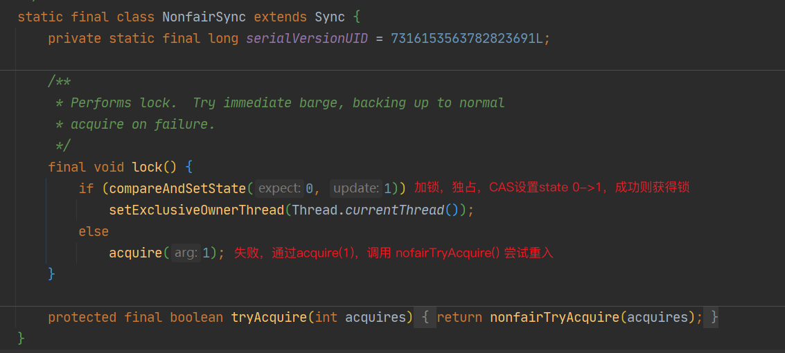

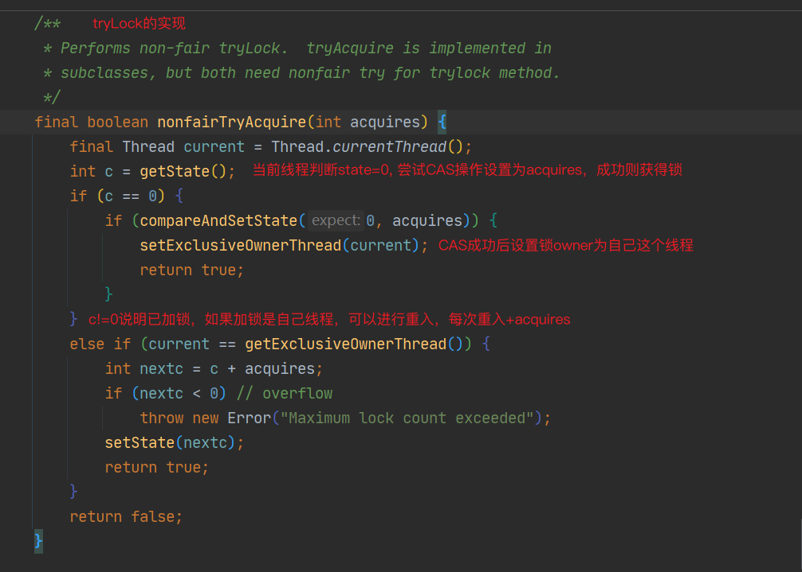

**解锁：**

#### 公平锁的实现

**加锁：必须要自己是等待队列的头节点才可以获取锁**

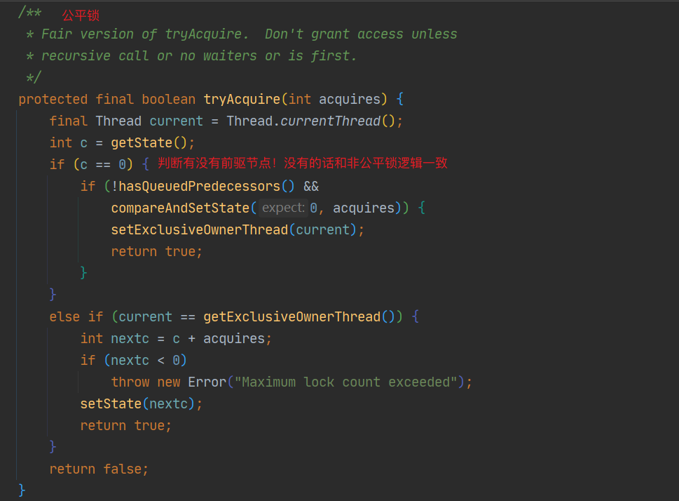

### 3.3.3 读写锁ReentrantReadWriteLock   
synchronized锁和ReentrantLock都是互斥锁(一次只能有一个线程进入被锁定区域)       
ReentrantReadWriteLock是读写锁，实现了ReadWriteLock接口 
- 读取数据的时候，可以多个线程同时进入到临界区(被锁定区域)      
- 写入数据的时候，无论读线程还是写线程都是互斥的
- 读锁不能升级为写锁，写锁可以降级为读锁    
`acquire(1)` : 获取写锁             
`acquireShared(int arg)` ： 获取读锁

读写锁将state的32位int分成了两部分，高16位表示读锁，低16位表示写锁

> - 假设锁当前的状态值为S，将S和16进制数`0x0000FFFF`进行`与运算`，将运算结果记为c，那么c表示的就是**写锁的数量**。如果**c等于0就表示还没有线程获取写锁**；如果c不等于0，就表示有线程获取到了锁，c等于几就代表写锁重入了几次。
>
> - 将S`无符号右移16位`（S>>>16），得到的结果就是**读锁的数量**。当S>>>16得到的结果不等于0，且c也不等于0时，就表示当前线程既持有了写锁，也持有了读锁。
> - 当成功获取到读锁时，如何对读锁进行加1呢？S +（1<<16）得到的结果，就是将对锁加1。释放读锁是，就进行S - (1<<16)运算。
> - 当成功获取到写锁时，令S+1即表示写锁状态+1；释放写锁时，就进行S-1运算。
> - 由于读锁和写锁的状态值都只占用16位，所以读锁的最大数量为 $2^{16}$-1，写锁可被重入的最大次数为$2^{16}$-1。

写锁是**独占锁**，所以获取和释放的逻辑和`ReentrantLock`获取锁几乎一摸一样

读锁是**共享锁**，要简单判断一下：

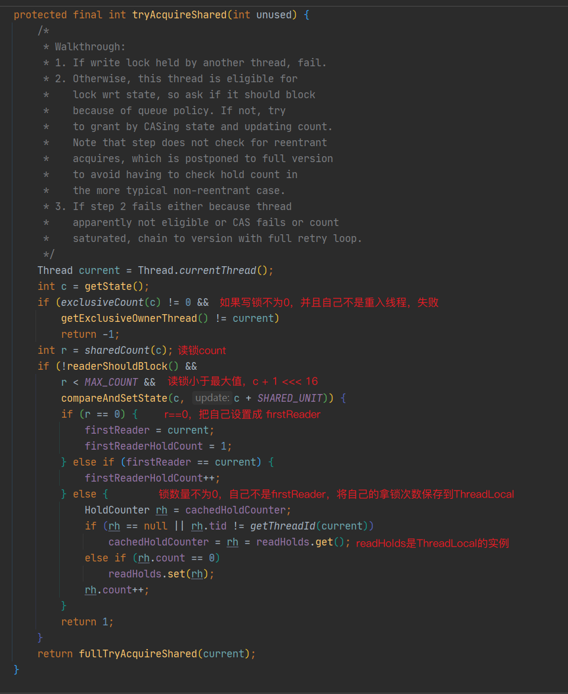

`fullTryAcquireShared()`就是将自己加入到队列等待，直到锁的状态是读锁（**等待写锁释放锁**）

### 3.3.4 LockSupport
- **Object和Condition的局限性**
  - 两种方式让线程等待和唤醒的方法的使用前提都是**必须要先获取锁**！
  - **唤醒方法必须要在等待方法之后调用**，线程才能被唤醒
- LockSupport类可以阻塞当前线程以及唤醒指定的被阻塞的线程，主要是通过`park()`和`unpark()`实现阻塞和唤醒线程的
> 每个线程都有一个许可permit, permit的值只能是0和1，默认0
> 1. 当调用`unpark(thread)`方法，就**将permit设为1**。(多次调用不累加)
> 2. 调用`park()`方法，如果当前线程的**permit是1，就设置为0**，并立即返回。如果是**0就会阻塞**当前线程，直到别的线程将permit设置为1，**park方法被唤醒，将permit再次设置为0**，然后返回

**阻塞线程**
`void park()` 阻塞当前线程，如果**调用unpark或者当前线程被中断**，就能从park方法中返回。**只阻塞当前线程，不会释放锁资源资源**
`void park(Object blocker)` 传入阻塞对象
`void parkNanos(long nanos)` 超时阻塞
`void parkUntil(long deadline)` 超时阻塞到绝对时间(毫秒格式)

**唤醒线程**
`void unpark(Thread thread)` 唤醒处于阻塞状态的指定线程

~~~java
    //根本不需要手动获取锁
    public static void main(String[] args) throws InterruptedException {
        Thread t1 = new Thread(()->{
            LockSupport.park();
            System.out.println("end");
        });
        t1.start();
        TimeUnit.SECONDS.sleep(5);
        LockSupport.unpark(t1);
    }
~~~

~~~java
    //甚至可以在等待方法之前告知唤醒，这用Object和Condition都是无法做到的
    public static void main(String[] args) {
        Thread t1 = new Thread(()->{
            
            try {
                TimeUnit.SECONDS.sleep(5);  //子线程里睡5秒
            } catch (InterruptedException e) {
                e.printStackTrace();
            }
            
            LockSupport.park();
            System.out.println("end");
        });
        t1.start();
        LockSupport.unpark(t1);
    }
~~~

- **park方法可以响应线程中断**：并且不会清除中断标志
~~~java
    public static void main(String[] args) throws InterruptedException {
        Thread t1 = new Thread(() -> {
            System.out.println("park()之前中断标志：" + Thread.currentThread().isInterrupted());
            LockSupport.park();
            System.out.println("park()之后中断标志：" + Thread.currentThread().isInterrupted());
        });
        t1.setName("t1");
        t1.start();
        //休眠5秒
        TimeUnit.SECONDS.sleep(5);
        t1.interrupt();
    }
/*
park()之前中断标志：false
park()之后中断标志：true
*/
~~~

- 所以调用LockSupport.park()方法的线程被唤醒有两种方式：**unpark()**和**interrupt()**

### 3.3.5 Object、Condition、LockSupport对比

||Object|Condition|LockSupport|
|---|---|---|---|
|使用条件|synchronized同步代码块中|先获Lock锁|**无**|
|无限wait|支持|支持|支持|
|超时wait|支持|支持|支持|
|wait到将来某个时间返回|不支持|支持|支持|
|wait/park时释放锁|释放|释放(先释放再调用LockSupport.park)|**不释放**|
|响应线程中断|能|能|能|
|线程中断是否清除中断标志|是|是|**否**|
|支持等待状态不响应中断|不支持|**支持**|不支持|
|支持唤醒先于等待|不支持|不支持|**支持**|
|获取锁的过程可中断|否|是||
|等待队列个数|1个|多个||
|精准唤醒某一线程|不支持|不支持|**支持**|

- **Thread.sleep()和Object.wait()的区别**：sleep()不会释放锁资源，wait会释放锁资源
- **Condition.await()和LockSupport.park()**：Condition.awati()底层就是调用的LockSupport.park()来实现阻塞当前线程的。但是把当前线程添加到条件队列后，还进行了"完全"释放锁的操作，将state状态变量变为0，然后调用LockSupport.park()阻塞当前线程。而LockSupport.park()本身是不会释放锁资源的

## 3.4 信号量
synchronized和Lock这两种锁一次都只能允许一个线程访问一个资源，而信号量可以控制有多少个线程可以访问特定的资源

`Semaphore(int permits)`：构造方法，表示允许的许可证数量
`Semaphore(int permits,boolean fair)`：默认是非公平的
`void acquire()` ：**获取一个许可，信号量-1**
`void acquire(int permits)`：获取多个许可，信号量减少相应个数
`void acquireUninterruptibly(int permits)`：不响应中断
`boolean tryAcquire(int permits)`：尝试获取，立即返回
`boolean tryAcquire(long timeout, TimeUnit unit)`：尝试获取，超时返回
`void release()`：**释放一个许可，信号量+1**
`void release(int permits)`：释放多个许可
`int availablePermits()`：当前可用信号量的数量

- 需要注意的是，释放信号量必须要在finally里，**避免漏释放**
- 还要加一个标志位，避免获取信号量失败，**避免多释放**

~~~java
public class Demo1 {
    static Semaphore semaphore = new Semaphore(2);

    static class Task implements Runnable{

        @Override
        public void run() {
            boolean acquireSuccess = false;
            try {
                semaphore.acquire();
                acquireSuccess = true;
                System.out.println(Thread.currentThread().getName()+"获取了一个信号量，剩余"+semaphore.availablePermits());
                TimeUnit.SECONDS.sleep(2);

            } catch (InterruptedException e) {
                e.printStackTrace();
            } finally{  //避免漏释放
                if (acquireSuccess) {   //避免多释放
                    semaphore.release();
                    System.out.println(Thread.currentThread().getName()+"释放了一个信号量，剩余"+semaphore.availablePermits());
                }
            }
        }
    }

    public static void main(String[] args) throws InterruptedException {
        for (int i = 0; i < 10; i++) {
            new Thread(new Task()).start();
            Thread.sleep(100);
        }
    }
}
~~~

## 3.5 原子性、可见性、有序性      

比如要在多线程任务里实现一个变量的自增，按照上面的方法，我们加上synchronized锁即可，但是对这种简单的操作用没必要用锁，这会使得别的线程在执行的时候当前线程只能等待
- 原子性是指某个操作，要么一次执行完，要么就不执行            
~~~java
public class DemoAtomic {
    public static void main(String[] args) throws InterruptedException {
        ExecutorService service = Executors.newCachedThreadPool();
        Count count = new Count();
        // 100个线程对共享变量进行加1
        for (int i = 0; i < 100; i++) {
            service.execute(() -> count.increase());
        }
        // 等待上述的线程执行完
        service.shutdown();
        service.awaitTermination(1, TimeUnit.DAYS);
        System.out.println(count.getCount());
    }

    static class Count {
        // 共享变量
        private AtomicInteger count = new AtomicInteger(0);

        public AtomicInteger getCount() {
            return count;
        }

        public synchronized void increase() {
            count.incrementAndGet();    //返回新值
            //count.getAndIncrement();  返回旧值
        }
    }
}
~~~
相比锁机制，会有不错的性能提升      

### 3.5.1 CAS(compare and swap)
CAS即比较并交换，是实现并发算法时常用到的技术。CAS是一种原子操作，用于在多线程编程中实现不被打断的数据交换，从而避免多线程同时改写某一数据时由于执行顺序不确定性以及中断的不可预知性产生的数据不一致问题   
- **CAS实际上是自旋锁的一种实现方式** 
- **Java并发包(juc)的很多类都使用了CAS技术**

**CAS的实现方式：**
- CAS有3个操作数：旧的内存预期值E，要修改的新值V，当前实际内存值N。如果N与E相等，则将内存值改为V，否则一直重试(**自旋锁**)          

**CAS的缺点：**
CAS虽然很高效的解决了原子操作的问题，但是仍然存在几个问题：
- **循环时间长开销很大：** 如果CAS失败会循环进行CAS操作(循环的同时将期望更新为最新的)，长时间不成功的话会给CPU带来极大的开销(这种循环也成为**自旋**)，解决办法是**限制自旋的次数，防止进入死循环**      
- **只能保证一个共享变量的原子操作：** 对多个变量操作时，CAS无法保证操作的原子性，这时候可以用加锁的方式保证原子性，或者把多个共享变量合并成一个共享变量进行CAS操作  
- **CAS操作的原子性问题：** 判断原内存值未改变后，在修改为新值前，被别的线程进行了修改(CAS操作本身的原子性问题)。 **解决办法：** CAS 在 Unsafe 中调用了 Atomic::cmpxchg 方法，最终在汇编语言的实现：cmpxchg=cas，`lock cmpxchg`指令，lock锁住了缓存行/总线，作用是比较并交换操作数(Compare and Exchange)    
- **ABA问题：**       

ABA问题：线程1准备用CAS将变量的值由A替换为B，在此之前，线程2将变量的值由A替换为C，又由C替换为A，然后线程1执行CAS时发现变量的值仍然为A，所以CAS成功。但实际上这时的现场已经和最初不同了，尽管CAS成功，但可能存在潜藏的问题。
Java并发包为了解决这个问题，提供了一个带有标记的原子引用类“AtomicStampedReference”，它可以**通过控制变量值的版本来保证CAS的正确性**(boolean变量，时间戳等方式)。因此，在使用CAS前要考虑清楚“ABA”问题是否会影响程序并发的正确性，如果需要解决ABA问题，改用传统的互斥同步可能会比原子类更高效

ABA问题举例：      
现有一个用单向链表实现的堆栈，栈顶为A，这时线程T1已经知道A.next为B，然后希望用CAS将栈顶替换为B      
在T1执行上面这条指令之前，线程T2介入，将A、B出栈，再pushD、C、A，而对象B此时处于游离状态        
此时轮到线程T1执行CAS操作，检测发现栈顶仍为A，所以CAS成功，栈顶变为B，但实际上B.next为null          
其中堆栈中只有B一个元素，C和D组成的链表不再存在于堆栈中，平白无故就把C、D丢掉了 

**CAS的应用：**         
CAS操作并不会锁住共享变量，也就是一种**非阻塞**的同步机制，CAS就是乐观锁的实现      

- 乐观锁：乐观锁总是假设最好的情况，每次去操作数据都认为不会被别的线程修改数据，所以在每次操作数据的时候都不会给数据加锁，即在线程对数据进行操作的时候，别的线程不会阻塞仍然可以对数据进行操作，只有在需要更新数据的时候才会去判断数据是否被别的线程修改过，如果数据被修改过则会拒绝操作并且返回错误信息给用户

- 悲观锁：悲观锁总是假设最坏的情况，每次去操作数据时候都认为会被的线程修改数据，所以在每次操作数据的时候都会给数据加锁，让别的线程无法操作这个数据，别的线程会一直阻塞直到获取到这个数据的锁。这样的话就会影响效率，比如当有个线程发生一个很耗时的操作的时候，别的线程只是想获取这个数据的值而已都要等待很久

### 3.5.2 原子类           
Java中对变量的读取和赋值都是原子操作，但long、double类型除外，只有使用volatile修饰之后long、double类型的读取和赋值操作才具有原子性。除此之外Java还提供了几个常用的原子类，原子类的方法是具有原子性的方法，可以保证在执行操作的过程中不会被打断  

java.util.concurrent.atomic
- 基本类型：
    - AtomicBoolean：布尔型
    - AtomicInteger：整型(可以进行原子操作`incrementAndGet()`)
    - AtomicLong：长整型

- 数组：
    - AtomicIntegerArray：数组里的整型
    - AtomicLongArray：数组里的长整型
    - AtomicReferenceArray：数组里的引用类型

- 引用类型：
    - AtomicReference：引用类型
    - AtomicStampedReference：带有版本号的引用类型
    - AtomicMarkableReference：带有标记位的引用类型

- 对象的属性：
    - AtomicIntegerFieldUpdater：对象的属性是整型
    - AtomicLongFieldUpdater：对象的属性是长整型
    - AtomicReferenceFieldUpdater：对象的属性是引用类型

- JDK8新增DoubleAccumulator、LongAccumulator、DoubleAdder、LongAdder
    - 是对AtomicLong等类的改进。比如LongAccumulator与LongAdder在高并发环境下比AtomicLong更高效。

从原理上概述就是：Atomic包的类的实现绝大调用Unsafe的方法，而Unsafe底层实际上是调用C代码，C代码调用汇编，最后生成出一条CPU指令完成操作。这也就为啥CAS是原子性的，因为它是一条CPU指令，不会被打断     
~~~java
    // 共享变量(使用AtomicInteger来替代Synchronized锁)
    private AtomicInteger count = new AtomicInteger(0);
    
    public Integer getCount() {
        return count.get();
    }
    public void increase() {
        count.incrementAndGet();
    }
~~~

### 3.5.3 可见性和缓存一致性协议

#### MESI协议

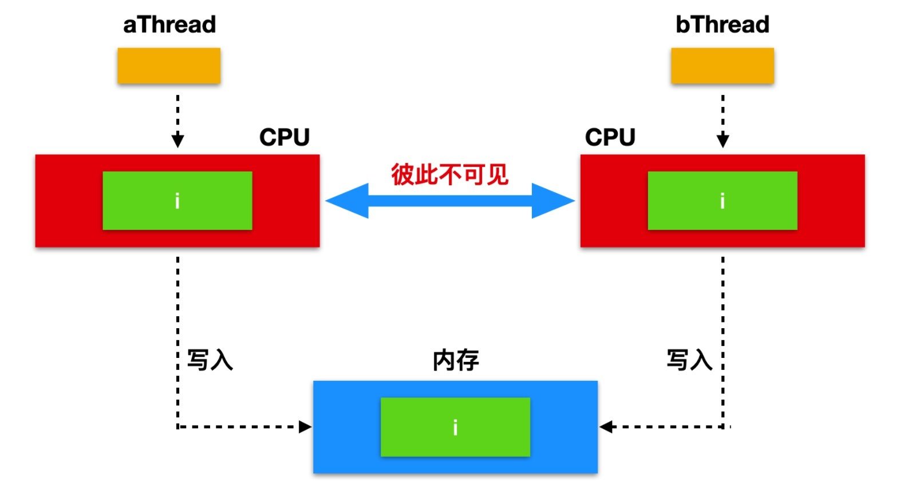

- 缓存：多核cpu，为了同步CPU速度和内存速度，避免浪费CPU，在二者之间设计了高速缓存。**每个核心都有自己寄存器的L1和L2缓存，但是多个核共享L3缓存**，这样CPU就不用直接和内存交互了，直接和高速缓存交互就行
- 程序运行时，会将运算需要的数据**从主存复制一份到CPU的高速缓存中**，CPU进行计算时，直接从高速缓存读取数据，再将高速缓存的数据刷新到主存中
- 根据空间局部性原理，每次去内存中取数据时都会**成块的读取(缓存行 Cache line)**，这样可以提高性能。目前缓存行的大小多用**64字节**(折衷)
- 多核cpu，并行计算，**如果某一个核中数据发生改变，就需要更新到主存，其他操作该数据的核必须重新读取**
- 缓存一致性协议：缓存行的状态有4个：Invalid(已失效), Shared(只能读取不能写入), Exclusive(独占，其他处理器如果持有该缓存行，则立即变为Invalid), Modified(被修改，只有处于Exclusive才能被修改)，多核数据同步总线使用**MESI协议**进行数据同步
  - **M修改(Modified)**：该Cache line有效，由于CPU的本地写操作导致数据被修改，**和内存中的数据不一致**，**数据只存在于本Cache中**，也就是说最新的数据目前是被执行写操作的CPU的cache line独占的。所以当前cache要对数据负责，要传递给其他cpu cache或者写回到内存，并且这些操作都需要**在reuse cache line之前完成**
  - **E独占(Exclusive)**： 该Cache line有效，**数据和内存中的数据一致**(CPU还没有修改cache line数据)，**数据只存在于本Cache中**。所以可以不对exclusive状态的cache line执行写回操作而直接reuse cache line
  - **S共享(Shared)**： 该Cache line有效，数据和内存中的数据一致，**数据存在于多个Cache中**。此时由于共享，不能直接修改cache line中的数据，而是要先通知其他cpu cache。和exclusive一样，由于数据和内存一致，可以直接reuse
  - **I无效(Invalid)**： 该Cache line 无效。新数据进入cache会优先选择invalid的cache line

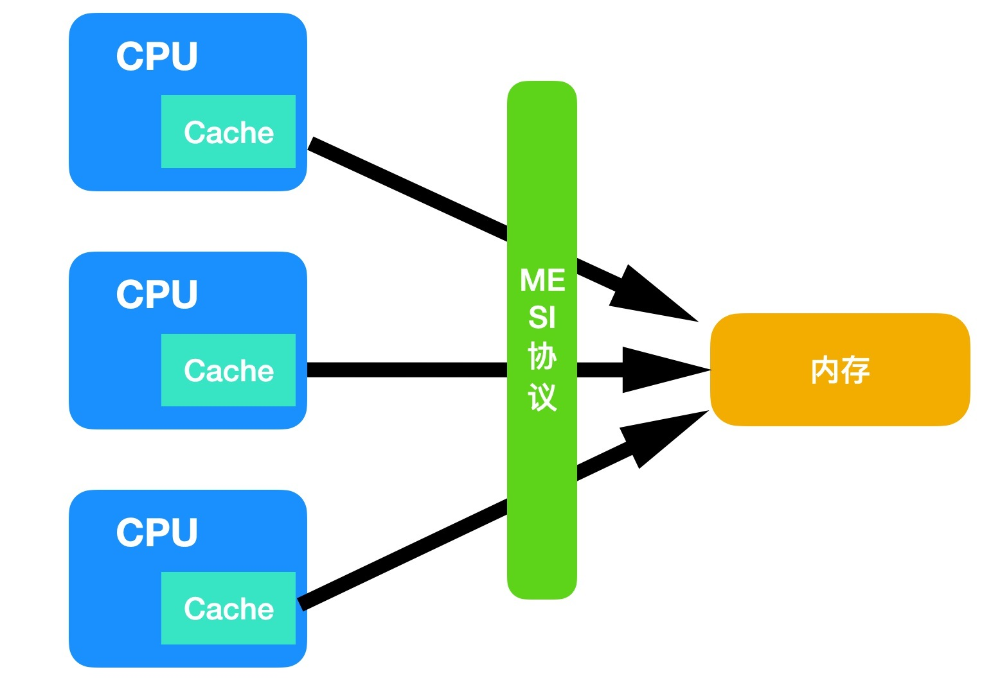

> **MESI协议消息：**
>
> 1. `Read`。"read" 消息用来获取指定物理地址上的 cache line 数据。
> 2. `Read Response`。该消息携带了 “read” 消息所请求的数据。read response 可能来自于 memory 或者是其他 CPU cache。
> 3. `Invalidate`。该消息将其他 CPU cache 中指定的数据设置为失效。该消息携带物理地址，其他 CPU cache 在收到该消息后，必须进行匹配，发现在自己的 cache line 中有该地址的数据，那么就将其从 cahe line 中移除，并响应 Invalidate Acknowledge 回应。
> 4. `Invalidate Acknowledge`。该消息用做回应 Invalidate 消息。
> 5. `Read Invalidate`。该消息中带有物理地址，用来说明想要读取哪一个 cache line 中的数据。这个消息还有 Invalidate 消息的效果。其实该消息是 read + Invalidate 消息的组合，发送该消息后 cache 期望收到一个 read response 消息。
> 6. `Writeback`。 该消息带有地址和数据，该消息用在 modified 状态的 cache line 被置换时发出，用来将最新的数据写回 memory 或其他下一级 cache 中。

> **MESI状态转换：**
>
> 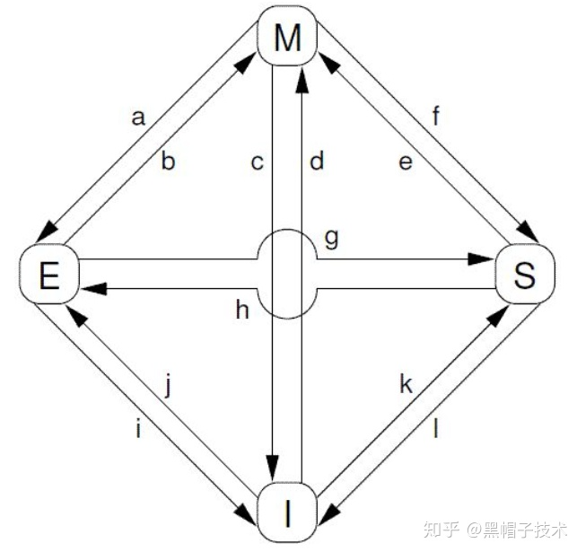
>
> a. cache 通过 writeback 将数据回写到 memory 或者下一级 cache 中。这时候状态由 modified 变成了 exclusive 。
>
> b. cpu 直接将数据写入 cache line ，导致状态变为了 modified 。
>
> c. CPU 收到一个 read invalidate 消息，此时 CPU 必须将对应 cache line 设置成 invalid 状态 , 并且响应一个 read response 消息和 invalidate acknowledge 消息。
>
> d. CPU 需要执行一个原子的 readmodify-write 操作，并且其 cache 中没有缓存数据。这时候 CPU 就会在总线上发送一个 read invalidate 消息来请求数据，并试图独占该数据。CPU 可以通过收到的 read response 消息获取到数据，并等待所有的 invalidate acknowledge 消息，然后将状态设置为 modifie 。
>
> e. CPU需要执行一个原子的readmodify-write操作，并且其local cache中有read only的缓存数据（cacheline处于shared状态），这时候，CPU就会在总线上发送一个invalidate请求其他cpu清空自己的local copy，以便完成其独自霸占对该数据的所有权的梦想。同样的，该cpu必须收集所有其他cpu发来的invalidate acknowledge之后才能更改状态为 modified。
>
> f. 在本cpu独自享受独占数据的时候，其他的cpu发起read请求，希望获取数据，这时候，本cpu必须以其local cacheline的数据回应，并以read response回应之前总线上的read请求。这时候，本cpu失去了独占权，该cacheline状态从Modified状态变成shared状态（有可能也会进行写回的动作）。
>
> g. 这个迁移和f类似，只不过开始cacheline的状态是exclusive，cacheline和memory的数据都是最新的，不存在写回的问题。总线上的操作也是在收到read请求之后，以read response回应。
>
> h. 如果cpu认为自己很快就会启动对处于shared状态的cacheline进行write操作，因此想提前先霸占上该数据。因此，该cpu会发送invalidate敦促其他cpu清空自己的local copy，当收到全部其他cpu的invalidate acknowledge之后，transaction完成，本cpu上对应的cacheline从shared状态切换exclusive状态。还有另外一种方法也可以完成这个状态切换：当所有其他的cpu对其local copy的cacheline进行写回操作，同时将cacheline中的数据设为无效（主要是为了为新的数据腾些地方），这时候，本cpu坐享其成，直接获得了对该数据的独占权。
>
> i. 其他的CPU进行一个原子的read-modify-write操作，但是，数据在本cpu的cacheline中，因此，其他的那个CPU会发送read invalidate，请求对该数据以及独占权。本cpu回送read response”和“invalidate acknowledge”，一方面把数据转移到其他cpu的cache中，另外一方面，清空自己的cacheline。
>
> j. cpu想要进行write的操作但是数据不在local cache中，因此，该cpu首先发送了read invalidate启动了一次总线transaction。在收到read response回应拿到数据，并且收集所有其他cpu发来的invalidate acknowledge之后（确保其他cpu没有local copy），完成整个bus transaction。当write操作完成之后，该cacheline的状态会从Exclusive状态迁移到Modified状态。
>
> k. 本CPU执行读操作，发现local cache没有数据，因此通过read发起一次bus transaction，来自其他的cpu local cache或者memory会通过read response回应，从而将该 cache line 从Invalid状态迁移到shared状态。
>
> l. 当cache line处于shared状态的时候，说明在多个cpu的local cache中存在副本，因此，这些cacheline中的数据都是read only的，一旦其中一个cpu想要执行数据写入的动作，必须先通过invalidate获取该数据的独占权，而其他的CPU会以invalidate acknowledge回应，清空数据并将其cacheline从shared状态修改成invalid状态。

#### 缓存一致性协议

MESI是缓存一致性协议的一种

这类协议还有： MSI，MOSI，Synapse，Firefly，Dragon Protocol等

**不同架构的物理机器可以有用不一样的内存模型**

所以《Java虚拟机规范》中试图定义一种 `Java内存模型(JMM)` 来**屏蔽各种硬件和操作系统的内存访问差异**，以实现让Java程序在各种平台下都能达到一致的内存访问效果。（例如C++直接使用物理硬件和操作系统的内存模型，由于平台内存模型的差异，导致在某一平台正常，到另一平台却经常出错）

#### JMM

- **缓存一致性协议可以让失效的内存区域去更新**，不同硬件的实现方式不一样

~~~java
private static class T{
    public long p1, p2, p3, p4, p5, p6, p7;
    public volatile long x=0L;
    public long q1, q2, q3, q4, q5, q6, q7;
}
private t1 = new T();
private t2 = new T();
//使用两个线程修改两个t1,t2的x，由于x和前后pq不管怎么组合，两个t中x都不会在一个缓存行中，避免频繁通知的低效率
//不使用pq的话，两个x在同一个缓存行，t1中的x修改后要通知到另一个线程，去重新读取缓存行(因为缓存行中数据发生改变了)
~~~

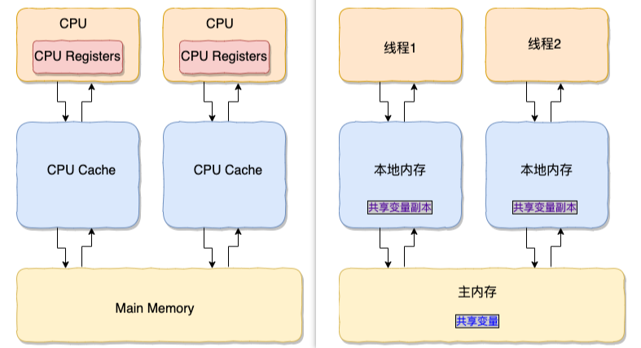

如果一个变量同时在多个线程的工作内存中存在副本，那么这个变量就叫共享变量。如果一个线程对共享变量值的修改，能够及时的被其他线程看到，叫做共享变量的可见性。            

Java内存模型的主要目的是：**定义程序中各种变量的访问规则**

首先来看Java内存模型：

- 每个Thread有一个属于自己的工作内存，是主内存的副本
- 所有Thread共用一个主内存
- 线程对共享变量的所有操作必须在工作内存中进行，不能直接操作主内存
- 不同线程间不能访问彼此的工作内存中的变量，线程间变量值的传递都必须经过主内存          

如果一个线程1对共享变量x的修改对线程2可见的话，需要经过下列步骤：       

a.线程1将更改x后的值更新到主内存        

b.主内存将更新后的x的值更新到线程2的工作内存中x的副本    

**JMM主内存和工作内存的交互（下面的操作都是原子的）：**

1. read：从主内存读取数据到工作内存
2. load：将主内存读取的数据写入工作内存
3. use：从工作内存读取数据来计算
4. assign：将计算好的值重新赋值给工作内存
5. store：将工作内存的数据写入主内存
6. write：将store过去的变量赋值给主内存中的变量
7. lock：将主内存变量加锁，标识为线程独占状态
8. unlock：将主内存变量解锁，解锁后其他线程可以锁定该变量

#### java解决缓存不一致-synchronized

**synchronized实现可见性：**      

- 某一个线程进入synchronized代码块前后，执行过程入如下：          
a.线程获得互斥锁        
b.**`清空工作内存`**      
c.从主内存拷贝共享变量最新的值到工作内存成为副本        
d.执行代码      
e.**将修改后的副本的值刷新回主内存中**      
f.线程释放锁        

随后，其他代码在进入synchronized代码块的时候，所读取到的工作内存上共享变量的值都是上一个线程修改后的最新值。

这种方式的本质是使用了**总线锁**，也就是在总线上声言`LOCK#`信号，这种方式可以有效的阻塞其他CPU对于总线的访问，从而使得只能有一个CPU访问变量所在的内存，等待该CPU访问**执行完毕并将结果应用到内存后**总线锁才会解开，其他CPU才能继续访问内存中的变量，再继续执行代码，这样就解决了缓存不一致的问题

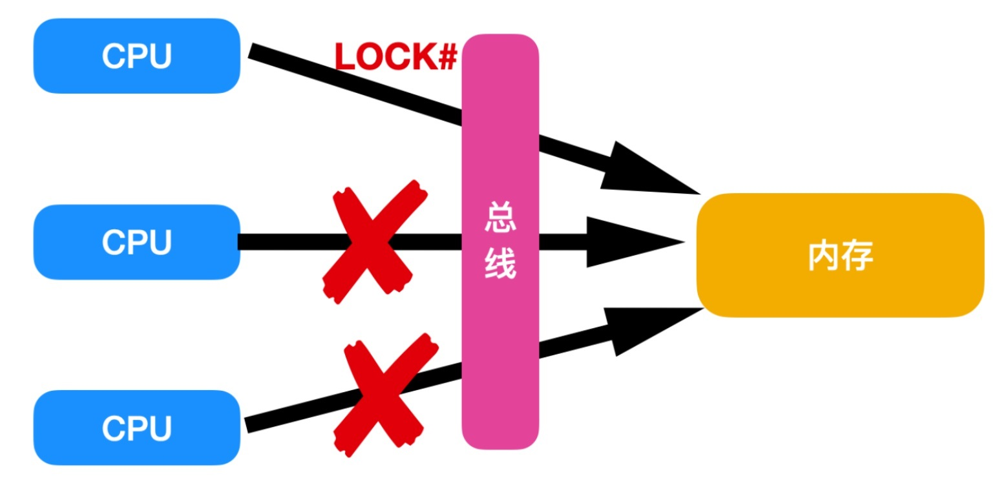

这种方式的问题是：锁住总线期间，其他CPU就无法访问内存了，导致**效率低下**

JDK1.6优化了synchronized声言`LOCK#`的方式，不再对总线进行锁定，转而采用了**对CPU缓存行进行锁定**，优化后synchronized的性能不再成为并发问题的瓶颈了

#### java解决缓存不一致-volatile

**volatile实现可见性：**    

**volatile变量每次被线程访问时，都会去主内存中读取共享变量的最新值，复制到工作内存。而线程一旦修改了工作内存中的变量副本，都会立马 刷新到主内存**。这样一来，不同的线程都能及时的看到该变量的最新值，**volatile实际上就是利用了缓存一致性协议**          

volatile变量不会被缓存在寄存器或其他对处理器不可见的地方，因此在读取volatile类型的变量时总会返回最新写入的值

- volatile保证变量对所有线程的可见性，但不能保证原子性：        
比如number++，这个操作实际上是三个操作的集合（读取number，number加1，将新的值写回number），volatile只能保证每一步的操作对所有线程是可见的，但是假如两个线程都需要执行number++，那么这一共6个操作集合，之间是可能会交叉执行的，那么最后导致number 的结果可能会不是所期望的
- 所以对于number++这种非原子性操作，推荐用synchronized      

一般来说，volatile大多用于标志位上(判断操作),满足下面的条件才应该使用volatile修饰变量：
- 修改变量时不依赖变量的当前值(因为volatile是不保证原子性的)
- 该变量不会纳入到不变性条件中(该变量是可变的)
- 在访问变量的时候不需要加锁(加锁就没必要使用volatile这种轻量级同步机制了)      

通常volatile用做保存某个状态的boolean值       

**需要注意的是，System.out.println() 内部会进行内存同步。。**

volatile 有两条实现原则，一种是**总线锁**的方式，总线锁的方式开销比较大，所以后面设计人员做了优化，采用了**锁缓存**的方式。另外一种是 **缓存一致性协议 **的方式。

- 在 IA-32 架构软件开发者的手册中，有一种 Lock 前缀指令，这种指令能够声言 LOCK# 信号，在最近的处理器中，LOCK# 信号用于锁缓存，等到指令执行完毕后，会把缓存的内容写回内存，这种操作一般又被称为**缓存锁定**。
- 当缓存写回内存后，IA-32 和 IA-64 处理器会使用 MESI 协议控制内部缓存和其他处理器一致。IA-32 和 IA-64 处理器能够嗅探其他处理器访问系统内部缓存，当内存值修改后，处理器会从内存中重新读取内存值进行新的缓存行填充。

#### 内存屏障

**JVM规定的JSR内存屏障规范：**
JSR内存屏障分为4种：

- LoadLoad屏障(`load1; loadload; load2;`)：在Load2以及后续读取操作要读取的数据被访问前，保证Load1要读的数据被读取完毕
- StoreStore屏障：在Store2以及后续写入操作执行前，保证Store1的写入操作对其他处理器可见
- LoadStore屏障：在Store2及后续写入操作执行前，保证Load1要读取的数据被读取完毕
- StoreLoad屏障：在Load2及后续所有读取操作执行前，保证Store1的写入对所有处理其可见

**volatile的读写的内存屏障在JVM层面的实现：**

- `StoreStoreBarrier` --> volatile写入 --> `StoreLoadbarrier` ：即，前面的Store执行完才能写入，volatile写入完才能读取，避免volatile写入操作和前面的写操作，后面的读操作重排序
- volatile读取 --> `LoadLoadBarrier` -->  `LoadStoreBarrier` : 即，volatile读完之后后面才能读和写，避免volatile读取操作和后面的读写操作重排序
- 

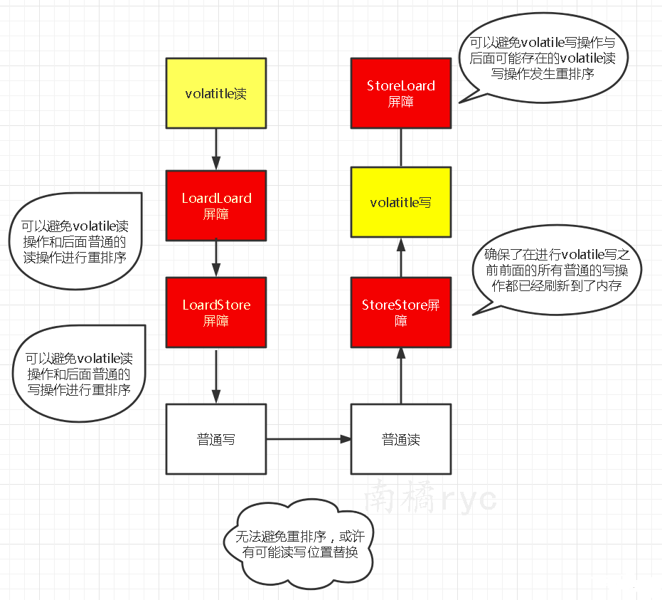

**HotSpot对内存屏障的实现方式：**
- `lock: addl`：lock锁缓存行/总线(cpu到内存只有一条通道)，用于在多处理器中执行指令时对共享内存的独占使用。能够**将当前处理器对应缓存的内容刷新到内存**，并且**使其他处理器对应的缓存失效**，另外还提供了**有序的指令无法越过这个内存屏障**的作用
- HotSpot没有针对不同的cpu优化，用锁缓存行/总线的方式，效率低下

#### happens-before

**as-if-serial:**

用了volatile关键字，程序的运行速度必然会受到影响，那么除了volatile关键字以外什么时候不会发生重排序呢？这里就要引入as-if-serial语义

as-if-serial语义的意思是：**不管怎么重排序（编译器和处理器为了提供并行度），（单线程）程序的执行结果不能被改变**

重排序可以分为两类：会改变程序执行结果的重排序，不会改变程序执行结果的重排序。

JMM对这两种不同性质的重排序，采取了不同的策略：

- 对于会改变程序执行结果的重排序，JMM要求编译器和处理器必须禁止这种重排序。
- 对于不会改变程序执行结果的重排序，JMM对编译器和处理器不做要求（JMM允许进行优化重排序）

**happens-before:**

happens-before 是比 **指令重排、内存屏障**这些概念更上层的东西，是语言层面给我们的承诺。我们没有办法穷举在所有计算机架构下重排序会如何发生，也没办法为重排序定义该在什么时候插入屏障来阻止重排序、刷新 cache 的顺序，这个是无法做到的事情。

happens-before表示的是**前一个操作的结果对于后续操作是可见的**，它表达了**多个线程之间对于内存的可见性**，本质上是一种偏序关系，所以满足传递性

> 为什么要有happens-before原则：
>
> 如果Java、Go语言提供内存屏障操作，让开发者自己决定何时插入屏障，那么并发代码的开发将很难写，易出错(C就是)
>
> 对于编译器和CPU来说，这些内存屏障，优化屏障都是约束，让底层无法随心所欲进行优化，这些约束肯定越少越好

happens-before像是几条公理，只有我们开发的时候遵守这些规则，才能保证正确的语义，满足正确的可见性

我们可以认为在JMM中，如果一个操作执行的结果需要对另一个操作可见，那么这两个操作必须要存在happens-before关系

happens-before的具体定义：

- 如果一个操作happens-before另一个操作，那么第一个操作的执行结果将对第二个操作可见，而且第一个操作的执行顺序排在第二个操作之前
- 两个操作之间存在happens-before关系，并不意味着Java平台的具体实现必须要按照happens-before关系指定的顺序来执行。如果重排序之后的执行结果，与按happens-before关系来执行的结果一致，那么这种重排序并不非法（也就是说，JMM允许这种重排序）

happens-before的8条规则

1. `程序顺序规则`：一个线程中的每个操作，happens-before于该线程中的任意后续操作。（在一个线程内一段代码的执行结果是有序的）
2. `监视器锁规则`：对一个锁的解锁，happens-before于随后对这个锁的加锁。(先加锁后解锁)
3. `volatile变量规则`：对于volatile修饰的变量的写的操作，一定happen-before后续对于volatile变量的读操作。(读写不会重排序，写操作的结果一定对读的这个线程可见)
4. `传递性`：如果A happens-before B，且B happens-before C，那么A happens-before C
5. `start()规则`：如果线程A执行操作ThreadB.start()（启动线程B），那么A线程的ThreadB.start()操作happens-before于线程B中的任意操作
6. `Join()规则`：如果线程A执行操作ThreadB.join()并成功返回，那么线程B中的任意操作happens-before于线程A从ThreadB.join()操作成功返回
7. `程序中断规则`：对线程interrupted()方法的调用先行于被中断线程的代码检测到中断时间的发生
8. `对象finalize规则`：一个对象的初始化完成（构造函数执行结束）先行于发生它的finalize()方法的开始

这里记录一下我遇到的一个坑      
首先看没有volatile修饰的情况            

示例一：
~~~java
public class DemoVolatile {
    static class Task implements Runnable {
        public static long value;

        public void run() {
            while (DemoVolatile.flag) {
                value++;
            }
            System.out.println(num);
        }
    }

    public static boolean flag = true;
    public static int num;
    public static void main(String[] args) throws InterruptedException {
        new Thread(new Task()).start();
        Thread.sleep(1000);
        flag = false;
        //Thread.sleep(1000);
        num = 120;
        System.out.println("flag: " + flag);
        System.out.println("value: " + Task.value);
        Thread.sleep(1500);
        System.out.println("value: " + Task.value);
    }
}
/*
run: false
value: 831286841
value: 2064104499
*/
~~~
显然我们会想到，没有volatile修饰，主线程中 flag 的改变对子线程不可见，所以子线程会陷入死循环
结果也是如此    

接下来我们把flag修改为volatile修饰，我们期待子线程可以获得修改之后的flag，并跳出循环        

示例二：
~~~java
public class DemoVolatile {
    static class Task implements Runnable {
        public static long value;

        public void run() {
            while (DemoVolatile.flag) {
                value++;
            }
            System.out.println(num);
        }
    }

    public static volatile boolean flag = true;
    public static int num;
    public static void main(String[] args) throws InterruptedException {
        new Thread(new Task()).start();
        Thread.sleep(1000);
        flag = false;
        //Thread.sleep(1000);
        num = 120;
        System.out.println("flag: " + flag);
        System.out.println("value: " + Task.value);
        Thread.sleep(1500);
        System.out.println("value: " + Task.value);
    }
}

/*
120
flag: false
value: 839587639
value: 839587639
*/
~~~
没错，也按我们的预想输出了          

接下来，我们把flag的volatile去掉，转而把 value加上volatile，我们预想的是，value对主进程即时可见，而主进程修改flag对子进程依然不可见     
示例三：
~~~java
public class DemoVolatile {
    static class Task implements Runnable {
        public static volatile long value;

        public void run() {
            while (DemoVolatile.flag) {
                value++;
            }
            System.out.println(num);
        }
    }

    public static boolean flag = true;
    public static int num;
    public static void main(String[] args) throws InterruptedException {
        new Thread(new Task()).start();
        Thread.sleep(1000);
        flag = false;
        //Thread.sleep(1000);
        num = 120;
        System.out.println("flag: " + flag);
        System.out.println("value: " + Task.value);
        Thread.sleep(1500);
        System.out.println("value: " + Task.value);
    }
}

/*
120
flag: false
value: 172291888
value: 172291888

*/
~~~
怎么回事？ 子进程居然也获取到了主进程修改的 flag            

其实转而想想前面的 num， 为什么示例二、三的子进程都可以获得修改后的num呢？      
这个问题在JAVA并发编程实践一书中有提到：
> **volatile变量对可见性的影响所产生的价值远远高于变量本身，线程A向volatile变量写入值之后，线程B读取该变量，所有A执行写操作前可见的变量的值，在B读取了volatile变量后，成为了对B也是可见的。所以从内存可见性的角度看，写入volatile变量就像退出同步块，读取volatile变量就像进入同步块。**             

所以其实在一个线程访问volatile变量的时候，去主内存更新的数据并不只有 volatile修饰的变量！！！子线程在修改value之后，把value值同步给主线程，这时候也把主线程中的num给读了回去       

接下来，我们让主线程中的flag改变后，主线程睡一下，就会发现其实num的值在子线程里还是0            

示例四：
~~~java
public class DemoVolatile {
    static class Task implements Runnable {
        public static volatile long value;

        public void run() {
            while (DemoVolatile.flag) {
                value++;
            }
            System.out.println(num);
        }
    }

    public static boolean flag = true;
    public static int num;
    public static void main(String[] args) throws InterruptedException {
        new Thread(new Task()).start();
        Thread.sleep(1000);
        flag = false;
        Thread.sleep(1);
        num = 120;
        System.out.println("flag: " + flag);
        System.out.println("value: " + Task.value);
        Thread.sleep(1500);
        System.out.println("value: " + Task.value);
    }
}
/*
0
flag: false
value: 172842201
value: 172842201
*/
~~~

如果没有volatile修饰，就一定不可见吗？接下来再考虑下面的例子          
示例五：        
~~~java
public class DemoVolatile {
    static class Task implements Runnable {
        public static long value;

        public void run() {
            while (DemoVolatile.flag) {
                value++;
            }
            System.out.println(num);
        }
    }

    public static boolean flag = true;
    public static int num;
    public static void main(String[] args) throws InterruptedException {
        new Thread(new Task()).start();
        Thread.sleep(1);
        flag = false;
        num = 120;
        System.out.println("flag: " + flag);
        System.out.println("value: " + Task.value);
        Thread.sleep(1500);
        System.out.println("value: " + Task.value);
    }
}
~~~

如果没有Thread.sleep(1)，我们很明显想到flag的值在子线程读取的时候就修改为了false，不会进入while循环，输出的value值明显是0，那现在的情况的输出是什么样的呢？我们来看看           
~~~java
120
flag: false
value: 59771
value: 59771
~~~
这又是怎么回事？进入了while循环，并且成功的循环一段时间后出来了！！！
经过实验后发现当主线程停顿时间很极短（1～2ms）时，可以跳出循环，当主线程停顿时间较长时，无法跳出循环，尝试修改子线程循环一次的时间，发现**子线程循环次数少的时候可以跳出循环，循环次数多的时候无法跳出循环**，代码的执行结果居然跟循环次数有关？            

这与JIT即时编译优化有关。           
>关于JIT
当虚拟机发现某个方法或代码块运行特别频繁时，就会把这些代码认定为“Hot Spot Code”（热点代码），为了提高热点代码的执行效率，在运行时，虚拟机将会把这些代码编译成与本地平台相关的机器码，并进行各层次的优化，完成这项任务的正是 JIT 编译器。
运行过程中会被即时编译器编译的“热点代码”有两类：
1）被多次调用的方法。
2）被多次调用的循环体。

JIT优化后，只在进入循环之前读取了flag变量的值，后面无论flag怎么变化都不管了，JAVA内存模型中不能保证没有线程安全的字段将会看到更新，这个规定允许JIT进行这样的优化     

### 3.5.4 有序性   
JMM允许编译器和处理器对指令重排序的，使用volatile关键词，可以禁止指令重排序，可以确保程序的“有序性”。
~~~java
public class Singleton {
    private Singleton() {}  //私有构造函数
    private volatile static Singleton instance = null;  //单例对象
    //静态工厂方法
    public static Singleton getInstance() {
        if (instance == null) {      //双重检测机制
            synchronized (Singleton.class){  //同步锁
                if (instance == null) {     //双重检测机制，避免第一次判空的线程拿到锁后new出对象
                    instance = new Singleton();
                }
            }
        }
        return instance;
      }
}
~~~
- **volatile防止该变量初始化时指令重排**，确保引用指向内存前实例初始化完毕，而可见性已经由synchronized保证了(https://blog.csdn.net/FU250/article/details/79721197)     
- 其实`instance = new Singleton()` 可以拆分成三部分：
 - a.`new #2 <T>`分配对象的内存空间，**半初始化**对象(java中申请内存就会进行默认初始化)
 - b.`invokespecial #3 <T.<init>>` 初始化，调用了构造方法
 - c.`astore_1` 建立关联，将引用指向对象的地址        
- a—>b—>c顺序执行不会有什么问题，但是如果JVM和CPU把指令顺序优化为a—>c—>b，当执行完a,c后，可能另一个线程在第一次判断singleton=null，但此时不为空了(已被赋予默认值)，不用进入synchroniezd，于是就**将未初始化完毕的instance对象返回**了(JVM部分有讲解)
- **静态方法，应该使用该类的锁**，锁住的是Singleton.class对象

**this溢出问题：**

~~~java
public class T{
    private int num = 0;
    public T(){
        new Thread(()->Syststem.out.println(this.num));
    }
    public static void main(String[] args){
        new T();
        System.in.read();
    }
}
~~~
- 不要在构造方法中启动线程
- 这会导致在完全构造对象之前，对象的引用逃逸，导致各种奇怪的行为

# 4. 线程池        
- 线程池为任务分配空闲的线程，任务执行完成后回到线程池等待下次任务(而不是销毁)，这样就实现了线程的重用      
- 线程池的好处：不必为每个请求都开一个新的线程，因为线程生命周期的开销非常高，创建和销毁线程所花费的时间和资源可能比处理任务花费更多，还会导致某些空闲线程占用资源，程序的稳定性和健壮性会下降，每个请求开一个线程，受到恶意攻击或过多请求容易内存不足，程序崩溃。      
- 工作流程：

## 4.1 Executors框架
Executors框架包含任务执行机制的核心接口Executor和异步计算的Future接口        
- `Executor` 提供了一种将任务提交和任务执行分离的机制，通过execute(Runnable able)提交任务       
- `ExecutorService` 接口继承自Executor，提供了线程池生命周期(运行、关闭、终止)管理的办法     
- `ThreadPoolExecutor` 类，是用的最多的线程池类            
- `ScheduledThreadPoolEcecutor` 额外提供了定时和周期执行功能，主要用来延迟执行任务        
- `ForkJoinPool` jdk1.7新增，采用工作窃取算法，所有线程会 找到并执行已被提交到线程池或被其他线程创建的任务，这样很少有线程处于空闲状态，非常高效  
- `Executors`类，提供一系列工厂方法用于创建线程池      

~~~java
public class MyCallable implements Callable<String> {
    private int number;
    public MyCallable(int number) {
        this.number = number;
    }

    @Override
    public String call() throws Exception {
        int sum = 0;
        for (int i = 0; i < number; i++) {
            sum+=i;
        }
        return String.valueOf(sum)+"\t"+Thread.currentThread().getName();
    }
}

public class DemoCallable {
    public static void main(String[] args) throws ExecutionException, InterruptedException {
        ExecutorService pool = Executors.newFixedThreadPool(2);

        Future<String> submit1 = pool.submit(new MyCallable(200));
        Future<String> submit2 = pool.submit(new MyCallable(100));
        //打印返回值
        System.out.println(submit1.get());
        System.out.println(submit2.get());
        //结束
        pool.shutdown();
    }
}
~~~

## 4.2 ThreadPoolExecutor

- `corePoolSize` : 运行线程数小于corePoolSize时，**创建新线程来处理请求，即使其他线程是空闲的**
- `maximumPoolSize` : 运行线程数介于corePoolSize和maximumPoolSize之间时，则**仅当队列满时才创建新的线程**，最大线程数小于核心线程数会直接抛出异常         
- `keepAliveTime` ： **线程数大于核心线程的时候**，如果线程空闲时间大于该值，就会销毁，可以使用方法修改该值    
- `workQueue`：**工作队列**，用于缓存待处理的阻塞队列，有四种
  - **ArrayBlockingQueue**：基于数组结构的阻塞队列
  - **LinkedBlockingQueue**：基于链表结构的阻塞队列，吞吐量高于数组，FixedThreadPool采用
  - **SynchronousQueue**：不存储元素的阻塞队列，CachedThreadPool采用
  - **PriorityBlockingQueue**：优先级队列
- `threadFactory`：线程池中创建线程的工厂   
- `handler`：饱和策略，当线程池无法处理新来的任务时，按饱和策略处理，默认有四种策略，还可以自定义饱和策略
  - **AbortPolicy**：直接抛出异常
  - **CallerRunsPolicy**：在调用者的线程中运行任务，即谁丢来的任务就自己去处理
  - **DiscardOldestPolicy**：丢弃队列中最老的一个任务(头部任务)，加入队列
  - **DiscardPolicy**：不处理，直接丢弃任务
- 运行的线程少于核心线程数时，新任务会直接开线程，多于核心线程数时，则放入阻塞队列中，如果队列满了，会先开一个线程处理该任务，除非超过最大线程数，这样的话就直接拒绝该请求  

- **拒绝任务的情况**：线程池关闭 or 线程数量满了且队列饱和了            
- 四种拒绝任务的策略：直接抛出异常(默认)、在调用者所在的线程来执行任务、直接丢弃掉该任务、丢弃最旧的一个任务        

**线程池的状态：**
- RUNNING：可以接受新任务，可以对新添加的任务进行处理      
- SHUTDOWN：不可以接受新任务，可以对已添加任务进行处理，不再添加新任务
- STOP：不接受新任务，不处理已添加的任务，中断正在处理的任务        
- TIDYING：当所有任务已终止，ctl记录的任务数为0，线程变为TIDYING状态，执行钩子函数terminated()，是空的，用户想在TIDYING状态处理时，可以重载terminated()函数来实现       
- TERMINATED：线程池彻底终止的状态          

            

|状态|COUNT_BITS高三位|工作队列workers中的任务|阻塞队列workQueue中的任务|未添加的任务|
|---|:----:|:----:|:----:|:-----:|
|RUNNING|111|继续处理|继续处理|添加|
|SHUTDOWN|000|继续处理|继续处理|不添加|
|STOP|001|尝试中断|不处理|不添加|
|TIDYING|010|处理完成|SHUTDOWN->TIDYING是处理完了，STOP->TIDYING是不处理|不添加|
|TERMINATED|011|处理完成|同上|不添加|

### 4.2.1 常见的实现池   
**newFixedThreadPool**      
- 固定线程数的线程池，返回一个**corePoolSize 和 maximumPoolSize 相等**的线程池      
- 当需要运行的线程数量大体上变化不大时，适合使用这种线程池,一次性支付高昂的创建线程的开销，之后再使用的时候就不再需要这种开销       
~~~java
   public static ExecutorService newFixedThreadPool(int nThreads) {
        return new ThreadPoolExecutor(nThreads, nThreads,
                                      0L, TimeUnit.MILLISECONDS,
                                      new LinkedBlockingQueue<Runnable>());
    }
~~~
**newCachedThreadPool**     
- 非常有弹性的线程池，对于新任务，如果线程池没有空闲线程，线程池会**毫不犹豫的创建新线程**去处理，如果一个线程60秒之内没有被使用过，这个线程就会被销毁，通用性强，遇事不决，用缓存线程池        
~~~java
    public static ExecutorService newCachedThreadPool() {
        return new ThreadPoolExecutor(0, Integer.MAX_VALUE,
                                      60L, TimeUnit.SECONDS,
                                      new SynchronousQueue<Runnable>());
    }
~~~

**SingleThreadExecutor**
- 使用**单个worker线程**的Executor
~~~java
    public static ExecutorService newSingleThreadExecutor() {
        return new FinalizableDelegatedExecutorService
            (new ThreadPoolExecutor(1, 1,
                                    0L, TimeUnit.MILLISECONDS,
                                    new LinkedBlockingQueue<Runnable>()));
    }
~~~
### 4.2.2 线程池的使用         
- 对于 `Runnable` 任务，使用 `execute()` 方法执行
- 对于 `Callable` 任务，使用 `submit()` 方法执行(submit也重载了接收Runnable的方法，两者都可以)
- 最后不要忘了调用 `shutdown()` 方法关闭线程池          
`submit()` 方法还有一个`Future`类型的返回值，`Future`用于获取线程的返回值，`Future`是一个有泛型的类，泛型的类型与`Callable`的泛型相同，调用Future的 `get()` 方法可以获得返回的值       

~~~java
    //execute执行Runnable的例子
    ExecutorService cachedTP = Executors.newCachedThreadPool();
    cachedTP.execute(new ExampleThread());      //ExampleThread实现了Runnable接口
    cachedTP.shutdown();

    //造一个Callable 泛型是String，所以调用时返回的Future类型也是String
    class ExampleThread implements Callable<String> {
        @Override
        public String call() {
            return "Some Value";
        }
    }

    //执行一下
    ExecutorService cachedTP = Executors.newCachedThreadPool();
    Future<String> future = cachedTP.submit(new ExampleThread());   //submit返回的是Future
    try {
        String value = future.get();    //get()方法获得返回值
    } catch (InterruptedException e) {
        e.printStackTrace();
    } catch (ExecutionException e) {
        e.printStackTrace();
    }
    cachedTP.shutdownNow();
~~~
- `future.get()` 方法会阻塞当前线程，等到线程池里相应的线程执行结束。因此**get()方法要在不得不用返回值的时候才调用**，否则会影响程序运行的效率
- `V get(long timeout, TimeUnit unit)` 还可以进行超时获取
还可以通过**cnacel**取消正在执行的任务，通过**isCancelled**判断任务是否被取消，通过**isDone**判断是否执行完毕

### 4.2.3 线程池的关闭
`ThreadPoolExecutor` 提供了 `shutdown()` 和 `shutdownNow()` 两个方法来关闭线程池

- `shutdown()` ：锁定，设置线程池状态为**SHUTDOWN**并调用**空闲线程**的interrupt()方法发送中断信号，**正在执行的线程执行完才中断**，不可以再 submit 新的task，**已提交的任务会处理完毕**                    
- `shutdownNow()` :  加锁，设置线程池状态为**STOP**并调用**所有线程**的interrupt()方法发送中断信号，正在执行的线程任务被停止，**等待队列中未处理的任务被移除**，返回没被执行完的 task 列表      
- 如果线程内部无法响应中断信号，可能无法终止
- 调用任意一个方法后，`isShutdown`就返回true，但是当所有线程都关闭后`isTerminated`才返回true

#### 4.2.4 构造方法(自定义线程池)   

《阿里巴巴 Java 开发手册》中强制线程池不允许使用 Executors 去创建，而是通过 ThreadPoolExecutor 的方式，这样的处理方式让写的同学更加明确线程池的运行规则，规避资源耗尽的风险

- **FixedThreadPool 和 SingleThreadExecutor** ： 允许请求的队列长度为 Integer.MAX_VALUE ，可能堆积大量的请求，从而导致 OOM。
- **CachedThreadPool 和 ScheduledThreadPool** ： 允许创建的线程数量为 Integer.MAX_VALUE ，可能会创建大量线程，从而导致 OOM。

~~~java
    public ThreadPoolExecutor(int corePoolSize,     
                              int maximumPoolSize,  
                              long keepAliveTime,   
                              TimeUnit unit,       
                              BlockingQueue<Runnable> workQueue,    
                              ThreadFactory threadFactory,         
                              RejectedExecutionHandler handler) {   
                              /*
                              corePoolSize 指定核心线程数量
                              maximumPoolSize 指定最大线程数量
                              keepAliveTime 允许线程空闲时间，超时则进行销毁
                              unit 时间对象，keepAliveTime的时间单位
                              workQueue 阻塞队列，达到核心线程数后新任务加入workQueue
                              threadFactory 线程工厂
                              handler 任务拒绝策略（饱和策略）
                              */
        if (corePoolSize < 0 ||
            maximumPoolSize <= 0 ||
            maximumPoolSize < corePoolSize ||
            keepAliveTime < 0)
            throw new IllegalArgumentException();
        if (workQueue == null || threadFactory == null || handler == null)
            throw new NullPointerException();
        this.corePoolSize = corePoolSize;
        this.maximumPoolSize = maximumPoolSize;
        this.workQueue = workQueue;
        this.keepAliveTime = unit.toNanos(keepAliveTime);
        this.threadFactory = threadFactory;
        this.handler = handler;
    }
~~~

# 5. 线程的状态和控制
## 5.1 Java线程的六种状态
由于JVM的跨平台特性，不同操作系统对线程状态的定义不同，JVM抽象出了6种状态，这6种状态在不同的系统中的实现有所不同

- **初始态(NEW)：** 创建Thread对象，但还未调用start启动线程，线程处于初始态       
- **运行态(RUNNABLE)：** 包括就绪态(ready)和运行中(running)两种状态       
    - 就绪态(READY)： 获得了执行所需的所有资源，只要CPU分配执行权就能运行，所有就绪态线程存放在就绪队列中     
- **运行中(RUNNING)：** 获得CPU执行权，正在执行，同一个CPU同一时刻只能有一个运行态线程        
- **阻塞态(BLOCKED)：** 请求排它锁失败时的状态        
- **等待态(WAITING)：** 当前线程调用 `wait`, `join`, `park` 函数时，线程进入无限等待态，释放CPU执行权，释放资源(如锁)，等待被其他线程调用 `notify` 方法显示唤醒       
- **超时等待态(TIMED_WAITING)：** 当运行中的线程调用 sleep(time), wait, join, parkNanos, parkUtil 时，进入该状态，释放CPU执行权和占有资源，与等待态的区别：无需等待被唤醒，到时间会由系统自动唤醒      
- 终止态(TERMINATED)： 运行结束  

 

## 5.2 线程的控制        
`isAlive()` : 线程是否终止          
`getPriority()`
`setPriority()`
`Thread.sleep()` ： 当前线程进入**TIME_WAIT状态**，但不释放对象锁，milis后自动苏醒进入READY状态，给其他线程执行机会的最佳方式     
`join()` : 将当前线程与该线程合并，当前线程进入**等待状态**，等待该线程结束再恢复当前线程到就绪状态         
`yield()` ： 让出CPU，线程进入就绪队列等待调度，**就绪态**，不会释放锁资源      
`wait()` ： 当前线程进入对象的 wait pool            
`notify()/notifyAll()` : 唤醒对象的wait pool中的一个/所有等待线程       
`interrupt()` : 请求终止线程(只是请求，设置一个中断标志，需要被通知的线程自己处理)，这样可以安全的终止线程，阻塞线程调用interrupt方法会抛出异常     

- 如果阻塞线程调用了interrupt()方法，会抛出异常，设置中断标志为false，同时该线程退出阻塞，抛出异常  

`suspend和resume`：线程挂起和继续执行，不建议使用，不会释放锁，suspend()后处于RUNNABLE状态

~~~java
    public static void main(String[] args) {
        Demo main = new Demo();
        // 创建线程并启动
        Thread t = new Thread(main.runnable);
        t.start();
        try {
            Thread.sleep(3000);     //main睡3秒
        } catch (InterruptedException e) {
            System.out.println("In main");
            e.printStackTrace();
        }
        t.interrupt();      //中断t
    }

    Runnable runnable = () -> {
        int i = 0;
        try {
            while (i < 1000) {
                Thread.sleep(500);
                System.out.println(i++);
            }
        } catch (InterruptedException e) {
            // 判断该阻塞线程是否还在
            System.out.println(Thread.currentThread().isAlive());
            // 判断该线程的中断标志位状态
            System.out.println(Thread.currentThread().isInterrupted());
            System.out.println("In Runnable");
            e.printStackTrace();
        }
    };
    /*
    0
    1
    2
    3
    4
    true
    false
    In Runnable
    java.lang.InterruptedException: sleep interrupted
    */
~~~
## 5.3 线程的终结     
- **只有在运行和阻塞状态时才有被终结的机会，其它状态时都无法终结**
- 停止线程的执行，可以通过volatile变量设置标志，除了这种简单粗暴的方法外，还可以使用中断信号来停止正在运行的线程。
- 中断信号只是一个线程发给另一个线程的请求信号而不是命令，需要接方自己去处理        
- 可以通过 submit 返回的 **Future对象** 来发送中断信号 `Future.cancel(true)`
~~~java
class InterruptableThread implements Runnable {
    private int value;
    public void run() {
        Thread currentThread = Thread.currentThread();
        while(!currentThread.isInterrupted()) {     //没有收到中断信号执行循环
            value++;
        }
        System.out.println("Interrupted value = "+value); //收到中断信号打印
    }
}
class AlwaysRunThread implements Runnable {
    public void run() {     //不处理中断信号
        while(true) {
            try {
                Thread.currentThread().sleep(1000);
            } catch (InterruptedException e) {
                e.printStackTrace();
            }
            System.out.println("Running");
        }
    }
}
public class InterruptRunningTest {
    public static void main(String[] args) {
        ExecutorService exec = Executors.newCachedThreadPool();
        Future interruptableFuture= exec.submit(new InterruptableThread());
        Future alwaysRunFuture= exec.submit(new AlwaysRunThread());
        exec.shutdown();
        interruptableFuture.cancel(true);   //Future调用 cancel(true) 方法向线程发送中断信号
        alwaysRunFuture.cancel(true);
    }
}
/*
java.lang.InterruptedException: sleep interrupted
Running
Interrupted value = 48768
Running
Running	//并没有停止，，，，cancel只是发送中断信号，并不强制中断
*/
~~~

## 5.4 守护线程和用户线程
守护线程是一种特殊的线程，在后台完成一些系统性的服务，比如**垃圾回收线程**、**JIT线程**都是守护线程，与之相对应的是**用户线程**
当用户线程全部结束了，系统就会退出。即**系统只剩下守护线程的时候，java虚拟机会自动退出**

- `daemon`属性为true表示守护线程，false表示用户线程

~~~java
    public static void main(String[] args) {
        Thread t1 = new Thread(()->{
                System.out.println(Thread.currentThread().isDaemon()?"守护线程":"用户线程");
                while(true);
            });
        //t1.setDaemon(true);
        t1.start();
        System.out.println("主线程结束");
    }
~~~
当未设置t1为守护线程的时候，程序无法正常结束，因为还有用户线程在运行。设置之后主线程结束便不再有用户线程，java虚拟机就自动退出了
**设置守护线程需要在start()之前进行**，否则异常

Thread的init()方法
~~~java
Thread parent = currentThread();
this.daemon = parent.isDaemon();    //默认子线程和父线程是一样的Daemon
~~~

# 6. 线程通信和同步容器      
多线程并发执行的时候，不同的线程执行的内容可能存在一些依赖关系，比如线程A执行某一步需要线程B里的某方法的结果
一个简单粗暴的办法是设置监控的布尔变量，缺点是等待依赖的条件的时候线程处于**忙等待**状态(运行状态，占用cpu时间)，却没有做有意义的事情，更好的办法是将其阻塞，**阻塞状态不占用CPU的时间**，从而提高CPU的利用率             
Java提供了线程间合作的机制，即Object.wait()方法、Object.notify()和Object.notifyAll()方法                   
`Object.wait()`：使当前线程阻塞，等待其它线程调用notify()方法，释放当前获取的锁       
`Object.notify()` ：唤醒一个等待着的线程，这个线程唤醒之后尝试获取锁，其它线程继续等待        
`Object.notifyAll()` ：唤醒所有等待着的线程尝试获取锁，这些线程排队等待锁       

- 如果一个线程调用了object.wait()方法，那么这个线程就进入到这个object对象的**等待队列**，因为系统可能运行多线线程同时等待某一个对象，当notify()被调用后，就会从这个队列中随机挑选一个线程唤醒，这个选择是**不公平**的，是随机的
- 如果**在非同步代码块中调用wait/notify会直接报错**

**锁的调度：**      
- java中对象锁的模型：JVM会为一个使用内部锁（synchronized）的对象维护两个集合，`Entry Set` 和 `Wait Set` (锁池和等待池)     
- **Entry Set：** 如果线程A已经持有了对象锁，此时如果有其他线程也想获得该对象锁的话，它只能进入Entry Set，并且处于线程的BLOCKED状态。当对象锁被释放的时候，JVM会随机唤醒处于Entry Set中的某一个线程，这个线程的状态就从BLOCKED转变为RUNNABLE          
- **Wait Set：** 如果线程A调用了 wait() 方法，那么线程A会释放该对象的锁，进入到Wait Set，并且处于线程的WAITING状态。当对象的notify()方法被调用时，JVM会唤醒处于Wait Set中的某一个线程，这个线程的状态就可以和EntrySet的线程一起竞争锁了；或者当notifyAll()方法被调用时，Wait Set中的全部线程都可以竞争锁资源。
- **notify()只负责唤醒，不释放锁，所以notify之后必须还要释放锁**，每当对象的锁被释放后，那些所有处于RUNNABLE状态的线程会共同去竞争获取对象的锁，最终会有一个线程（**具体哪一个取决于JVM实现**，队列里的第一个？随机的一个？）真正获取到对象的锁，而其他竞争失败的线程继续在Entry Set中等待下一次机会

**java中wait和sleep方法的不同**
1. 最大的不同是 wait 会释放锁，而 sleep 一直持有锁。
2. Wait 通常被用于线程间交互，sleep通常被用于暂停执行。
3. wait()方法会释放 CPU执行权和占有的锁。
4. **sleep(long)方法仅释放CPU使用权，锁仍然占用**；线程被放入超时等待队列，与Thread.yield() 相比，它会使线程较长时间得不到运行。
5. Thread.yield() 方法仅释放CPU执行权，锁仍然占用，线程会被放入就绪队列，会在短时间内再次执行。
6. wait 和 notify、notifyAll 必须配套使用，即必须使用同一把锁调用；
7. wait和notify必须放在一个同步块中调用，wait和notify的对象必须是他们所处同步块的锁对象

## 6.1 生产者消费者问题        
**等待方(消费者)和通知方(生产者)**   
~~~java
//等待方：
synchronized(obj){
	while(条件不满足){
 	    obj.wait();
    }
    消费;
}

//通知方：
synchronized(obj){
	改变条件;
	obj.notifyAll();
}

~~~
- `wait` 和 `notiy` 方法必须由同一个锁调用，`notify` 只能唤醒使用同一个锁对象调用 `wait` 方法的线程     
- 锁对象可以是任意对象，`wait` 和 `notify` 方法是 `Object` 类的方法         
- `wait` 和 `notify` 方法必须在同步代码块或同步方法中使用(要通过锁对象调用) 
- 当线程从wait方法中被唤醒时，它在重新请求锁时不具有任何特殊的优先性，而要与其他尝试进入同步代码块的线程一起正常地在锁上进行竞争        
- **每当线程从wait中唤醒时，都必须再次测试条件谓词**，在线程被唤醒到wait重新获取锁的这段时间里，可能有其他线程已经获取了这个锁，并修改了对象的状态。

### 6.1.1 锁池和等待池
Java中，每个对象都有一个唯一与之对应的内部锁（Monitor）。Java虚拟机会为每个对象维护两个“队列”（姑且称之为“队列”，尽管它不一定符合数据结构上队列的“先进先出”原则）：一个叫**Entry Set（入口集、锁池）**，另外一个叫**Wait Set（等待集、等待池）**。对于任意的对象objectX，objectX的**Entry Set用于存储等待获取objectX对应的内部锁的所有线程**。objectX的**Wait Set用于存储执行了objectX.wait()/wait(long)的线程**    
- **锁池(Entry Set)：** 假设线程A已经拥有了某个对象(注意:不是类)的锁，而其它的线程想要调用这个对象的某个synchronized方法(或者synchronized块)，由于这些线程在进入对象的synchronized方法之前必须先获得该对象的锁的拥有权，但是该对象的锁目前正被线程A拥有，所以这些线程就进入了该对象的锁池中

- **等待池(Wait Set):** 假设一个线程A调用了某个对象的wait()方法，线程A就会释放该对象的锁(因为wait()方法必须出现在synchronized中，这样自然在执行wait()方法之前线程A就已经拥有了该对象的锁)，同时线程A就进入到了该对象的等待池中。如果另外的一个线程调用了相同对象的notifyAll()方法，那么处于该对象的等待池中的线程就会全部进入该对象的锁池中，准备争夺锁的拥有权。如果另外的一个线程调用了相同对象的notify()方法，那么仅仅有一个处于该对象的等待池中的线程(随机)会进入该对象的锁池

### 6.1.2 notify 和 notifyAll的问题：
- 一个生产者两个消费者的情况：一开始三个线程都在Entry Set中竞争锁，两个消费者先后拿到锁并进入了Wait Set，此时生产者拿到锁并生产，然后唤醒消费者1，自己进入到Wait Set，消费者1拿到锁消费后进入Wait Set，并唤醒了消费者2(此时唤醒生产者是没有问题的，但是恰恰唤醒的是消费者2)，此时消费者2拿到锁，无法消费，进如Wait Set，至此，所有线程都进入到了Wait Set，死锁就发生了

- 考虑两个消费者和生产者的场景：如果我们代码中使用了notify()而非notifyAll()，假设消费者线程1拿到了锁，判断buffer为空，那么wait()，释放锁；然后消费者2拿到了锁，同样buffer为空，wait()，也就是说此时Wait Set中有两个线程；然后生产者1拿到锁，生产，buffer满，notify()了，那么可能消费者1被唤醒了，但是此时还有另一个线程生产者2在Entry Set中盼望着锁，并且最终抢占到了锁，但因为此时buffer是满的，因此它要wait()；然后消费者1拿到了锁，消费，notify()；这时就有问题了，此时生产者2和消费者2都在Wait Set中，buffer为空，如果唤醒生产者2，没毛病；但如果唤醒了消费者2，因为buffer为空，它会再次wait()，这就尴尬了，万一生产者1已经退出不再生产了，没有其他线程在竞争锁了，只有生产者2和消费者2在Wait Set中互相等待，那传说中的死锁就发生了     

## 6.2 阻塞队列
阻塞队列可以让我们在任何时刻向队列内扔一个对象，如果队列满了则当前线程阻塞；在任何时刻都可以从队列中取出一个对象，如果队列为空则当前线程阻塞。阻塞队列是线程安全的，使用它时无需加锁。此外其内部是使用显示锁实现的同步，使用Condition实现的线程阻塞。阻塞队列的接口是`BlockingQueue`

`BlockingQueue.put(Object obj)`：入队
`BlockingQueue.take()`：出队

BlockingQueue的常用实现类如下：               
- `ArrayBlockingQueue`：**有界阻塞队列**，底层使用数组实现的队列，有固定长度，调用其构造方法时必须提供队列的最大长度    
~~~java
//capacity表示容量大小，默认内部采用非公平锁
public ArrayBlockingQueue(int capacity)
//capacity：容量大小，fair：内部是否是使用公平锁
public ArrayBlockingQueue(int capacity, boolean fair)
~~~
- `LinkedBlockingQueue`：底层使用链表实现的队列，理论上讲是没有最大长度的，使用时不用提供队列长度；但实际上这个队列的长度不能超过Integer.MAX_VALUE，建议指定容量，否则插入速度大于删除速度可能会OOM   
~~~java
//默认构造方法，容量大小为Integer.MAX_VALUE
public LinkedBlockingQueue();
//创建指定容量大小的LinkedBlockingQueue
public LinkedBlockingQueue(int capacity);
//容量为Integer.MAX_VALUE,并将传入的集合丢入队列中
public LinkedBlockingQueue(Collection<? extends E> c);
~~~

- `PriorityBlockingQueue`：**支持优先级排序的无界阻塞队列**，进入队列的元素按优先级排序，可以传入比较器
~~~java
//默认构造方法，默认初始化容量是11
public PriorityBlockingQueue();
//指定队列的初始化容量
public PriorityBlockingQueue(int initialCapacity);
//指定队列的初始化容量和放入元素的比较器
public PriorityBlockingQueue(int initialCapacity,Comparator<? super E> comparator);
//传入集合放入来初始化队列，传入的集合可以实现SortedSet接口或者PriorityQueue接口进行排序，如果没有实现这2个接口，按正常顺序放入队列
public PriorityBlockingQueue(Collection<? extends E> c);
~~~

- `SynchronousQueue`：同步阻塞队列，不存放元素，每个put都要等待take操作
- `DelayQueue`：支持延时获取元素的**无界阻塞队列**，如果没有元素到期，是无法take元素的，泛型的E需要实现Delayed接口
~~~java
public class DelayQueue<E extends Delayed> extends AbstractQueue<E> implements BlockingQueue<E>
~~~

- 食堂打饭的例子：
~~~java
class Student implements Runnable {
	private Object wan = new Object();
	public void run() {
		try {
			System.out.println("学生：取到了一个碗");
			BlockingQueueTest.wanQueue.put(wan);
			System.out.println("学生：阿姨帮忙盛饭");
			wan = BlockingQueueTest.wanWithFanQueue.take();
			System.out.println("学生：吃饭");
		} catch (InterruptedException e) {}
	}
}
class CafeteriaWorker implements Runnable {
	public void run() {
		try {
			Object wan = BlockingQueueTest.wanQueue.take();
			System.out.println("阿姨：给学生盛饭");
			BlockingQueueTest.wanWithFanQueue.put(wan);
		} catch (InterruptedException e) {}
	}
}
public class BlockingQueueTest {
	public static BlockingQueue wanQueue = new LinkedBlockingQueue();
	public static BlockingQueue wanWithFanQueue = new LinkedBlockingQueue();
	public static void main(String[] args) {
		ExecutorService exec = Executors.newCachedThreadPool();
		exec.execute(new Student());
		exec.execute(new CafeteriaWorker());
		exec.shutdown();
	}
}
/*
学生：取到了一个碗
学生：阿姨帮忙盛饭
阿姨：给学生盛饭
学生：吃饭
*/
~~~

## 6.3 管道通讯
管道方式实现线程通信和阻塞队列类似，管道内没有数据的时候如果某个线程尝试读取数据就会被阻塞      
通过PipedWriter 和 Pipedreader 来实现对管道数据的读写，与阻塞队列不同点在于，阻塞队列中不同线程都是操作队列的同一种对象，管道可以让不同的线程使用不同的对象，只要他们注册为一个管道即可           
~~~java
class Sender implements Runnable {
    private PipedWriter writer;
    Sender(PipedWriter writer) {
        this.writer = writer;
    }
    public void run() {
        String str1 = new String("I love you\n");
        String str2 = new String("Do you love me\n");
        try {
            writer.write(str1.toCharArray());
            writer.write(str2.toCharArray());
        } catch (IOException e) {}
    }
}
class Receiver implements Runnable {
    private PipedReader reader;
    public Receiver(PipedReader reader) {
        this.reader = reader;
    }
    public void run() {
        try {
            while(true) {
                char c = (char)reader.read();
                System.out.print(c);
            }
        } catch (IOException e) {}
    }
}
public class PipeCommunicationTest {
    public static void main(String[] args) throws Exception {
        PipedReader reader = new PipedReader();
        PipedWriter writer = new PipedWriter(reader);
        ExecutorService exec = Executors.newCachedThreadPool();
        exec.execute(new Sender(writer));
        exec.execute(new Receiver(reader));
        Thread.sleep(1000);
        exec.shutdownNow();
    }
}
~~~

我们在主方法里先定义了一个PipedReader对象，然后将这个对象作为PipedWriter的构造方法的参数传给PipedWriter对象，这样就实现两个输入输出流的绑定，分别将两个流对象传给两个线程对象，主线程sleep一秒后调用了shutdownNow()方法，这个方法向所有运行着的线程发送中断信号，程序运行一秒后就退出了，我们可以看出中断信号打断了Receiver的阻塞状态，由此得出结论：**管道类阻塞可以被中断信号打断**，普通的IO是不能被interrupt中断的

## 6.4 同步Map
**ConcurrentHashMap**

- 功能和HashMap基本一致，内部使用数组+链表/红黑树实现的
- key和value都不为空

**ConcurrentSkipListMap**

- 内部使用跳表实现，放入的元素会进行**排序**
- 排序方法可以通过构造传入Comparator或者放入的元素实现Comparable接口
- 迭代结果和存入顺序不一致
- key和value都不为空

## 6.5 同步List
可以使用`Collections.synchronizedList`方法对ArrayList和LinkedList包装为线程安全的List，不过性能都不高，juc提供了：
**CopyOnWriteArrayList**
- 内部使用数组存储数据
- 并行操作"写写"时才会导致其他线程阻塞，其他读写读读情况都不会阻塞，所系效率很高
- 元素可以为空，无界
- 原理：写入的时候进行一次自我复制，**修改的是复制的内容**（其他调用者所见到的最初的资源仍然保持不变），然后用副本替换原来的数组
- **数据一致性：** CopyOnWrite容器只能保证数据的**最终一致性**，不能保证数据的实时一致性
- 适用于**读多写少**
- `add()`方法的实现：添加时上锁，复制到新的数组，添加操作在新数组上完成，最后将array指向新数组，然后解锁
~~~java
    public boolean add(E e) {
        // 加锁
        final ReentrantLock lock = this.lock;
        lock.lock();
        try {   
            // 得到原数组的长度和元素
            Object[] elements = getArray();
            int len = elements.length;
      
            // 复制出一个新数组
            Object[] newElements = Arrays.copyOf(elements, len + 1);
      
            // 添加时，将新元素添加到新数组中
            newElements[len] = e;
      
            // 将volatile Object[] array 的指向替换成新数组
            setArray(newElements);
            return true;
        } finally {
            lock.unlock();
        }
    }
~~~
- `set()`方法和`add()`方法类似，上锁->复制到新的数组->修改新数组->引用指向新数组
- `size()`和`get()`等读方法直接进行，不需要上锁

## 6.6 同步Set
**ConcurrentSkipListSet**
- 基于ConcurrentSkipListMap实现的**有序Set**，放入的元素会进行排序
- 指定排序方法，和ConcurrentSkipListMap一样
- 元素不重复，不为空，无界

**CopyOnWriteArraySet**
- 基于CopyOnWriteArrayList实现

## 6.7 Queue
**ConcurrentLinkedQueue**

- 链表实现的高效并发队列

**ConcurrentLinkedDeque**

- 链表实现的高效并发双端队列

**阻塞队列**

# 7. 死锁      
造成死锁的原因：
- 当前线程拥有其他线程需要的资源
- 当前线程等待其他线程已拥有的资源
- 都不放弃自己拥有的资源

## 7.1 顺序死锁    
- 线程A --> 锁住left --> 尝试锁住right --> 永久等待      
- 线程B --> 锁住right --> 尝试锁住left --> 永久等待     

线程A调用leftRight()方法，得到left锁，同时线程B调用rightLeft()方法，得到right锁。线程A和线程B都继续执行，此时线程A需要right锁才能继续往下执行，线程B需要left锁才能继续往下执行。但是：线程A的left锁并没有释放，线程B的right锁也没有释放。所以他们都只能等待，而这种等待是无期限的-->永久等待-->死锁

## 7.2 动态顺序死锁        
- 由于方法入参由外部传递而来，方法内部虽然对两个参数按照固定顺序进行加锁，但是由于外部传递时顺序的不可控，而产生锁顺序造成的死锁，即动态锁顺序死锁      
~~~java
public static void transferMoney(Account fromAccount,
                                 Account toAccount,
                                 DollarAmount amount)
        throws InsufficientFundsException {
    synchronized (fromAccount) {
        synchronized (toAccount) {
            if (fromAccount.getBalance().compareTo(amount) < 0)
                throw new InsufficientFundsException();
            else {
                fromAccount.debit(amount);
                toAccount.credit(amount);
            }
        }
    }
}
~~~

如果线程A从X账户向Y账户转账，同时线程B从Y账户向X账户转账，就会发生死锁

**解决办法**：固定加锁的顺序，可以使用对象的hash值比较来按hash值大小顺序进行加锁

## 7.3 协作对象之间的死锁
~~~java
public class ThreadDeadLockTest{

    class Taxi{  
        private Point location,destination;  
        private final Dispatcher dispatcher;  
        public Taxi(Dispatcher dispatcher) {  
            this.dispatcher=dispatcher;  
        }  
        public synchronized Point getLocation(){ //获取同步锁 
            return location;  
        }  
        //获取Taxi同步锁，同时还会获取Dispatcher的同步锁
        public synchronized void setLocation(Point location){  
            this.location=location;  
            if(location.equals(destination))  
                dispatcher.notifyAvailable(this);  
        }  
    } 

    class Dispatcher{

        private final Set<Taxi> taxis;
        private final Set<Taxi> availableTaxis;

        public Dispatcher() {
            taxis = new HashSet<Taxi>();
            availableTaxis = new HashSet<Taxi>();
        }
        public synchronized void notifyAvailable(Taxi taxi) {//获取同步锁
            availableTaxis.add(taxi);
        }
        //获取同步锁，同时还会获取Taxi的同步锁
        public synchronized Image getImage() {
            Image image = new Image();
            for(Taxi t : taxis) {
                image.drawer(t.getLocation());
            }
            return image;
        }
    }
}
~~~

setLocation 和 getImage 方法都会获取两个锁。假如一个线程调用了 setLocation 方法，那么首先会获取到一个 Taxi 的锁，然后嵌套调用了 notifyAvailable，或获取到 Dispatcher 的锁。同样，另外一个线程调用了 getImage 方法，首先他会获取 Dispatcher 的锁，然后获取 Taxi 的锁。所以两个线程会以不同的顺序占用锁，那么就会产生死锁的情况
- 线程A --> Taxi的锁 --> Dispatcher 的锁
- 线程B --> Dispatcher的锁 --> Taxi 的锁            

**解决办法：** 开放调用(调用某个方法时不需要持有锁)，减少synchronized的范围，只保护那些调用共享状态的操作，避免死锁

~~~java
        //缩小锁的范围，不会同时去获取两个锁
        public void setLocation(Point location) {
            boolean isReached = false;
            //缩小锁的范围
            synchronized (this) {
                this.location = location;
                isReached = location.equals(destination);
            }
            if(isReached) {
                dispatcher.notifyAvailable(this);
            }
        }

        //缩小锁的范围，不会同时去获取两个锁
        public Image getImage() {
            Set<Taxi> copy;
            //缩小锁的范围
            synchronized(this) {
                copy = new HashSet<Taxi>(taxis);
            }
            Image image = new Image();
            for(Taxi t : copy) {
                image.drawer(t.getLocation());
            }
            return image;
        }
~~~
## 7.4 死锁的解决办法      
- **固定加锁顺序：** 针对顺序死锁
- **开放调用：** 针对协作对象之间造成的死锁
- **使用定时锁：** tryLock()， 如果等待获取锁超时，则抛出异常而不是一直等待

# 8. Unsafe
Unsafe是sun.misc包下的一个类，juc中大部分类都是依赖于Unsafe来实现的，主要用到了Unsafe中的CAS，线程挂起，线程恢复等相关功能
Unsafe类提供了一些**执行底层、不安全操作**的方法，如直接访问系统内存资源、自主管理内存资源等方法

Unsafe提供的API如下：

~~~java
public final class Unsafe {
  // 单例对象
  private static final Unsafe theUnsafe;

  private Unsafe() {
  }
  @CallerSensitive
  public static Unsafe getUnsafe() {
    Class var0 = Reflection.getCallerClass();
    // 仅在引导类加载器`BootstrapClassLoader`加载时才合法
    if(!VM.isSystemDomainLoader(var0.getClassLoader())) {    
      throw new SecurityException("Unsafe");
    } else {
      return theUnsafe;
    }
  }
}
~~~

**通过反射获取Unsafe实例**
~~~java
public class Demo1 {
    static Unsafe unsafe;

    static {
        try {
            Field field = Unsafe.class.getDeclaredField("theUnsafe");
            field.setAccessible(true);
            unsafe = (Unsafe) field.get(null);
        } catch (Exception e) {
            e.printStackTrace();
        }
    }

    public static void main(String[] args) {
        System.out.println(unsafe);
    }
}
~~~

## 8.1 CAS的应用
CAS即比较并交换，是实现并发算法时常用到的技术。CAS是一种原子操作，用于在多线程编程中实现不被打断的数据交换，从而避免多线程同时改写某一数据时由于执行顺序不确定性以及中断的不可预知性产生的数据不一致问题   

juc的atomic相关类、java AQS、并发集合等都有应用CAS

~~~java
    public final boolean compareAndSet(int expect, int update) {
        return unsafe.compareAndSwapInt(this, valueOffset, expect, update);
    }
    public final int getAndIncrement() {
        return unsafe.getAndAddInt(this, valueOffset, 1);
    }
    public final int getAndDecrement() {
        return unsafe.getAndAddInt(this, valueOffset, -1);
    }
    public final int getAndAdd(int delta) {
        return unsafe.getAndAddInt(this, valueOffset, delta);
    }
~~~

## 8.2 线程调度
juc中的LockSupport类是通过Unsafe的unpark和park方法实现的
~~~java
//阻塞线程,isAbsolute：是否是绝对时间，如果为true，time是一个绝对时间，如果为false，time是一个相对时间，time表示纳秒
public native void park(boolean isAbsolute, long time);

//取消阻塞线程
public native void unpark(Object thread);

//获得对象锁（可重入锁）
@Deprecated
public native void monitorEnter(Object o);

//释放对象锁
@Deprecated
public native void monitorExit(Object o);

//尝试获取对象锁
@Deprecated
public native boolean tryMonitorEnter(Object o);
~~~

# 9. ThreadLocal
ThreadLocal提供了线程的局部变量，每个线程都可以通过 set() 和 get() 来对这个局部变量进⾏操作，但不会和其他线程的局部变量进⾏冲突， 实现了线程的数据隔离

## 9.1 ThreadLocal的典型应用场景
1. 最典型的是**管理数据库的Connection**： 当时在学JDBC的时候，为了⽅便操作写了⼀个简单数据库连接池，需要数据库连接池的理由也很简单，频繁创建和关闭Connection是⼀件⾮常耗费资源的操作，因此需要创建数据库连接池
数据库连接池的连接是交由ThreadLocal来进⾏管理。因为 ThreadLocal能够实现**当前线程的操作都是⽤同⼀个Connection**，保证了事务

~~~java
//为不同的线程管理连接
private static ThreadLocal<Connection> local;

//把Connection放进ThreadLocal⾥⾯
local.set(connection);

//从线程中拿到Connection对象
Connection connection = local.get();
~~~

1. 还可以避免一些参数传递

## 9.2 实现原理
- ThreadLocalMap是ThreadLocal的⼀个内部类，Thread为每个线程维护了ThreadLocalMap，⽤Entry类来进⾏存储，我们的值都是存储到这个Map上的。**ThreadLocalMap的key是当前线程的ThreadLocal对象，value是存储的数据**
~~~java
public void set(T value) {
    // 得到当前线程对象
    Thread t = Thread.currentThread();
    // 这⾥获取ThreadLocalMap
    ThreadLocalMap map = getMap(t);
    // 如果map存在，则将当前线程对象t作为key，要存储的对象作为value存到map⾥⾯去
    if (map != null)
    map.set(this, value);
    else
    createMap(t, value);
}
~~~

## 9.3 ThreadLocal的内存泄漏问题

**为什么用弱引用**：当方法结束后ThreadLocalRef弹栈就消失了，但是ThreadLocal对象还被Key强引用着，没有办法被回收，所以ThreadLocal对象就会造成内存泄漏。使用弱引用时，当Ref消失后ThreadLocal就能被gc回收了

**但是**如果ThreadLocalRef消失了，ThreadLocal对象就会被gc，之后就会存在一个`key为null的value`，无法访问
如果这个Map积攒越来越多，还是会造成内存泄漏
所以ThreadLocal里面的对象不用了之后，务必要remove掉

~~~java
ThreadLocal<T> t1 = new ThreadLocal<>();
t1.set(new M());
t1.remove;

//Thread'Local
public void remove() {
    ThreadLocalMap m = getMap(Thread.currentThread());
    if (m != null)
        m.remove(this);
}
~~~

# 10. 获取线程执行结果的办法
## 10.1 Thread.join
- 使用全局变量存储结果，主线程等待子线程执行完毕后获取结果

~~~java
public class Demo1 {

    //用于封装结果
    static class Result<T> {
        T result;

        public T getResult() {return result;}
        public void setResult(T result) {this.result = result;}
    }

    public static void main(String[] args) throws ExecutionException, InterruptedException {

        //用于存放子线程执行的结果
        Result<Integer> result = new Result<>();
        //创建一个子线程
        Thread thread = new Thread(() -> {
            try {
                TimeUnit.SECONDS.sleep(3);
                result.setResult(10);
            } catch (InterruptedException e) {
                e.printStackTrace();
            }
        });
        thread.start();
        //让主线程等待thread线程执行完毕之后再继续，join方法会让当前线程阻塞
        thread.join();

        //获取thread线程的执行结果
        Integer rs = result.getResult();
        System.out.println(rs);
    }
}
~~~

## 10.2 FutureTask
- futureTask.get()会阻塞当前线程，直到futureTask执行完毕

~~~java
public class Demo5 {
    public static void main(String[] args) throws ExecutionException, InterruptedException {
        System.out.println(System.currentTimeMillis());
        //创建一个FutureTask
        FutureTask<Integer> futureTask = new FutureTask<>(() -> 10);
        //将futureTask传递一个线程运行
        new Thread(() -> {
            try {
                TimeUnit.SECONDS.sleep(3);
            } catch (InterruptedException e) {
                e.printStackTrace();
            }
            futureTask.run();
        }).start();
        System.out.println(System.currentTimeMillis());
        //futureTask.get()会阻塞当前线程，直到futureTask执行完毕
        Integer result = futureTask.get();
        System.out.println(System.currentTimeMillis() + ":" + result);
    }
}
~~~