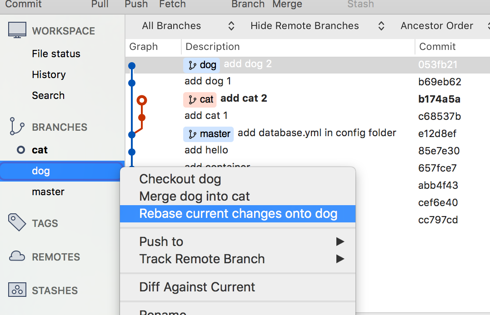
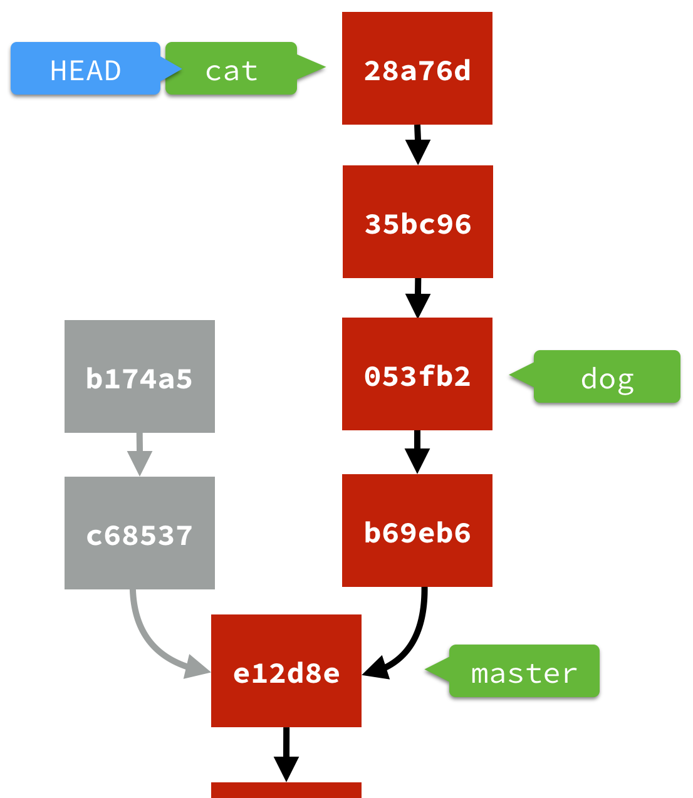
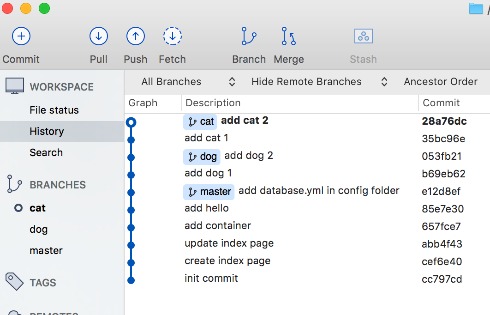
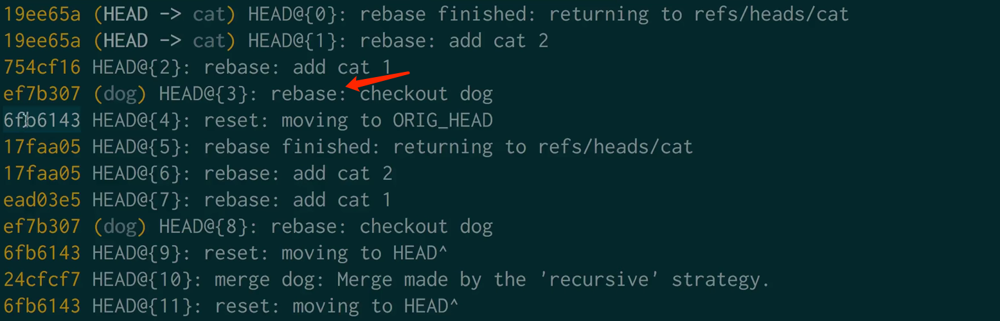

# Maven
- 依赖管理：
- 项目的一键构建：编译、测试、运行、打包、安装、部署 整个过程都交给maven来进行管理。

## 1. 基础知识
安装配置全过程见：https://blog.csdn.net/a805814077/article/details/100545928
- 环境变量中添加 MAVEN_HOME=D:\Program Files\apache-maven-3.6.3
- Path 中添加 %MAVEN_HOME%\bin
- 默认本地仓库位置：`Default: ${user.home}/.m2/repository`，本地仓库没有时去中央仓库寻找


- 修改本地仓库：`<localRepository>D:\maven_repository</localRepository>`
- maven项目结构：核心代码、配置文件、测试代码、测试配置文件
- 标准目录结构
  - `src/main/java` : 核心代码
  - `src/main/resources` : 配置文件
  - `src/test/java` : 测试代码
  - `src/test/resources` : 测试配置文件
  - `src/main/webapp` : 页面资源，js，css，图片等
## 2. 常用命令
- `mvn compile` : 编译src/main 放置在target中
- `mvn clean` : 清除本地编译信息，删除target目录
- `mvn test` : 编译**src/test和src/main**
- `mvn package` : 打包项目成.var(根据pom中`<packaging>war</packaging>`)，放置在target目录中
- `mvn install` : 将改项目编译，打包，并安装到本地仓库
- 整个项目构建过程：**清除项目编译信息(clean)、编译(compile)、测试(test)、打包(package)、安装(insatall)、发布(deploy)** 均有对应命令
- 生命周期：清理生命周期(clean)、**默认生命周期(compile->deploy)**、站点生命周期

## 3. maven 概念模型


## 4. maven 的一些配置

- IDEA maven配置：Maven->Runner->VM Options:`-DarchetypeCatalog=internal`
- maven换源：推荐第一个

~~~xml
 <!-- 阿里云仓库 -->
        <mirror>
            <id>alimaven</id>
            <mirrorOf>central</mirrorOf>
            <name>aliyun maven</name>
            <url>http://maven.aliyun.com/nexus/content/repositories/central/</url>
        </mirror>
     或者
      <mirror>
		<id>nexus-aliyun</id>
		<mirrorOf>*</mirrorOf>
        <name>Nexus aliyun</name>
        <url>http://maven.aliyun.com/nexus/content/groups/public</url>
	 </mirror>
~~~
- 坑：`java: 程序包org.springframework.boot不存在` 新版IDEA需要在Setting里将 delegate IDE build/run actions to Maven勾选上即可
- 使用骨架创建web工程：Maven->Create from archtype->maven-archetype-webapp
- **jdk1.8以上需要运行tomcat7以上版本！！！！(默认是6)** ， 使用 `mvn tomcat7:run` 运行
~~~xml
        <plugin>
          <groupId>org.apache.tomcat.maven</groupId>
          <artifactId>tomcat7-maven-plugin</artifactId>
          <version>2.2</version>
          <configuration>
            <uriEncoding>UTF-8</uriEncoding>
            <path>/</path>
            <port>8080</port>
          </configuration>
        </plugin>
~~~
- **jar包冲突**：tomcat中有servlet和servlet.jsp包，所以冲突，解决办法：设置scope作用范围为 `provided`

~~~xml
  <dependencies>
    <dependency>
      <groupId>junit</groupId>
      <artifactId>junit</artifactId>
      <version>4.11</version>
      <scope>test</scope>
    </dependency>
    <dependency>
      <groupId>javax.servlet</groupId>
      <artifactId>servlet-api</artifactId>
      <version>2.5</version>
      <scope>provided</scope>
    </dependency>
    <dependency>
      <groupId>javax.servlet.jsp</groupId>
      <artifactId>jsp-api</artifactId>
      <version>2.0</version>
      <scope>provided</scope>
    </dependency>
  </dependencies>
~~~
- **最后记得配置web.xml中的servlet映射：**

~~~xml
  <servlet>
    <servlet-name>MyServlet</servlet-name>
    <servlet-class>com.jj.servlet.MyServlet</servlet-class>
  </servlet>
  <servlet-mapping>
    <servlet-name>MyServlet</servlet-name>
    <url-pattern>/MyServlet</url-pattern>
  </servlet-mapping>
~~~

## 5. 常见的scope作用域例子

| 依赖范围     | 编译classpath有效 | 测试classpath有效 | 运行时classpath有效 | 例子                                                           |
| ------------ | :---------------: | :---------------: | :-----------------: | -------------------------------------------------------------- |
| compile      |         Y         |         Y         |          Y          | spring-core                                                    |
| test         |         -         |         Y         |          -          | Junit                                                          |
| **provided** |         Y         |         Y         |          -          | **servlet-api**                                                |
| **runtime**  |         -         |         Y         |          Y          | **JDBC驱动**                                                   |
| system       |         Y         |         Y         |          -          | 本地的，Maven仓库之外的类库<br>显示提供本地jar路径，一般不使用 |


# Git

## 1. 本地仓库命令

### 1.1 基础命令

- 配置git：`git config --global user.name "sssss"`  
`git config --global user.email 123456@qq.com` 
- **创建本地仓库**： `git init`
- **查看本地仓库状态**：`git status`
- **将文件同步到暂存区**：`git add file`，可以使用`git add .` 将所有修改的文件进行添加
- **删除工作区文件**：`git rm file`
- 提交到本地仓库：`git commit -m “提交描述” file`，提交指定的文件
- **将所有修改提交**：`git commit -am “提交描述”`，将工作区所有文件添加到暂存区并提交
- 撤销commit：`git reset --soft HEAD^`，`HEAD^`等价于`HEAD~1`，两次commit都想撤销可以使用`HEAD~2`
  - 可选参数：
  - --mixed：不删除工作空间改动代码，撤销commit，并且撤销 git add 操作，为默认参数
  - --soft： 不删除工作空间改动代码，撤销commit，不撤销git add 操作
  - --hard： 删除工作空间改动代码，撤销commit，撤销git add ，恢复工作空间到上一次commit的**状态**
  - **回退到某个确定版本号的版本**：`git reset --hard HEAD~版本号`
  - **回退到某个确定log号的版本**：`git reset --hard 9922250`
- 展示日志信息(提交的版本)：`git log --pretty=oneline`（一行展示，比git log 好看点）
- **展示日志信息和回到历史版本的索引**：`git reflog`
- **将工作区恢复到指定索引的版本号**：`git reset --hard 索引`，同步修改暂存区和工作区。
- **比较工作区和暂存区文件差异**：`git diff [文件名]`，不指定文件名则对比全部文件
- **比较工作区和本地仓库文件差异**：`git diff 索引 [文件名]`，和本地仓库指定索引版本的文件比较差异
- 完整克隆远程仓库：`git clone git@github.com:xxxx.git`，完整克隆，可以直接看到修改记录(=init + clone + remote origin)


### 1.2 分支命令

- 创建branch1分支：`git branch branch1`, `git checkout -b branch1`
- 显示分支列表：`git branch`
- **切换到branch1分支**：`git checkout branch1`
- **将branch1合并到master**：`git merge branch1`
- 合并后删除branch1分支：`git branch -d branch1`
- 合并后可能会有冲突，需要解决冲突后重新提交


### 1.3 撤销与补提交

**撤销更改：**

- **撤销更改(未add到暂存区时)**：`git checkout -- filename` 。也可以撤销所有更改`git checkout .`。也就是将文件同步到暂存区的状态(add时的状态)
- **撤销更改(已经add到暂存区)**：`git reset HEAD filename`。也可以放弃所有暂存区文件`git reset HEAD .`。该命令只会放弃暂存区的修改缓存(放弃git add操作)，本地的修改不会丢失
- **撤销更改(已经commit)**：`git reset --hard HEAD^`回退到上一次commit的状态，也可以回退到任意版本`git reset --hard commitID` 


**补充提交/重新提交：**

- 第一次提交后发现还有更改需要提交，可以使用`git commit --amend`，该命令既可以对上次提交的内容进行修改，也可以修改提交说明
- 首先将补充的更改add到暂存区，然后使用 git commit --amend命令，就可以将暂存区文件覆盖最近一次提交，并且可以直接修改最近一次提交的说明。但是这个命令会修改提交的校验码


### 1.4 merge和rebase

**merge和rebase的区别**

https://gitbook.tw/chapters/branch/merge-with-rebase.html

现在有两个分支 cat 和 dog，都是从master的同一个提交拉出来的分支，分别开发



`git merge`，合并分支，产生一个**额外的merge提交commit**来合并两个分支

`git rebase branchA`更像是将branchA复制并重新计算SHA-1值，复制然后拼接到当前分支之后去(从两者的分界点base基准开始)，看起来就像是在同一个分支上依次提交的，**不会产生一个额外的提交**。而复制后，原本的cat的那些无用提交(下图灰色提交)，就要等待之后git来回收


merge之后，由于merge是一次commit，使用 `git reset HEAD^`可以撤销掉merge，**merge是一个操作**

rebase之后，使用`git reset HEAD^`其实是在新的git路线(合并后的路线)上回退一步，而**不会回退到rebase之前**



谁rebase谁，造成结果的**先后顺序是有差别的**，在dog分支执行rebse cat，意思是将cat分支复制到 dog 分支上，并放在dog的当前提交之后！！



rebase如何撤销？



1. reflog记录了rebase的过程，只要在reflog里找到rebase操作，将HEAD回退到这rebase之前的一步即可。`git reset --hard 6fb6143`

2. 还有一种办法是使用`ORIG_HEAD`,**当我们做rebase或者其他危险操作的时候(分支合并，reset等)，git会把之前的HEAD保存在ORIG_HEAD中**，所以直接使用`git reset --hard ORIG_HEAD`即可


rebase时机？

还没有push的提交，可以使用rebase来整理，再push

rebase等于是修改了历史，已经push的分支尽量不要rebase了，这会对其他人带来困扰


**pull时的注意事项 `--rebase`参数：**

不使用rebase参数的时候，pull下来的代码会在本地提交之后再额外进行提交，导致提交混乱

使用rebase参数，pull下来的代码中的提交不会再重复的进行本地提交，本地提交会添加到之前提交的结尾处

log中也不会多出来很多无用的commit
https://www.cnblogs.com/wangiqngpei557/p/6056624.html


### 1.5 强制覆盖

**使用远程分支强制覆盖本地分支：**

1.  `git fetch --all`
2.  `git reset --hard origin/master` 
3.  `git pull` 


### 1.6 git diff

可以对比两次commit之间的差异，例如：

```c
$ git diff e37078e d4d8d9d   //比较两次commit的差异
```

如果只给一个SHA-1参数，就表示对比当前HEAD所在的commit和该commit之间的差异

如果不给参数，就表示对比当前**工作目录和暂存区的差异**

```c
$ git diff   //比较工作区和暂存区的差异
```

如果已经使用 `git add`将改动添加到暂存区，可以使用 --cached参数，表示对比 **暂存区与HEAD所在commit的差异**

```c
$ git diff --cached
```


## 2. 本地仓库推送到远程https
- 查看远程连接：`git remote -v`
- **建立远程连接**：`git remote add origin https://github.com/xxxx.git`，把远程仓库地址起别名为origin
- **完整克隆远程仓库**：`git clone git@github.com:xxxx.git`，完整克隆，可以直接看到修改记录(=init + clone + remote origin)
- **push推送**：`git push [-u] origin master`，推送本地仓库的master分支到远程仓库的master分支(**必须加入团队才能push成功**)
- **pull拉取**：`git pull --rebase origin master`，拉取分支的操作，相当于`fetch + merge`
  - git fetch origin master，只是将远程仓库内容下载下来，**并未添加到工作区**，可以通过`git checkout origin/master`查看下载的内容
  - git merge branch/master，进行合并。处理冲突
- **如果push失败，有冲突，需要先pull拉取，人为解决冲突之后**再`git commit -m `，解决冲突之后**再次pull无冲突才push**

push操作的本质，是把本地的xx分支内容推一份到origin上，**并且在origin上建立一个xx分支**

```c
git push origin master:cat     表示将本地master分支的内容推送到origin上，并在origin上建立一个cat分支
```


## 3. 本地仓库推送到远程ssh
- ssh方式使用密钥认证，不用输入账号密码了
- **生成ssh密钥**：`ssh-keygen -t rsa -C xxxx@github.com`，输入github账号邮箱，默认ssh生成位置为：`C:\Users\xxx\.ssh`，将公钥复制到github个人的SSH and GPG keys
- **建立远程连接**：`git remote add origin git@github.com:xxxx.git`
- pull：`git pull --rebase origin master`
- push：`git push -u origin master`

## 4. 服务器搭建私有Git
- 安装Git
- 创建Git目录：`adduser -r -c 'git version control' -d /home/git -m git` 用户名为git
- 修改密码：`passwd xxx`
- 切换用户为git：`su git`
- 在home/git 下 创建一个新的仓库文件夹:`mkdir -p /home/git/myrepo/`
- 初始化本地仓库(没有工作目录的纯版本仓库)：`git init --bare`
- 将本地仓库推送到服务器：URL:`ssh://git@47.xxx.xxx.xxx/home/git/myrepo`
- 当然也可以再克隆下来


  