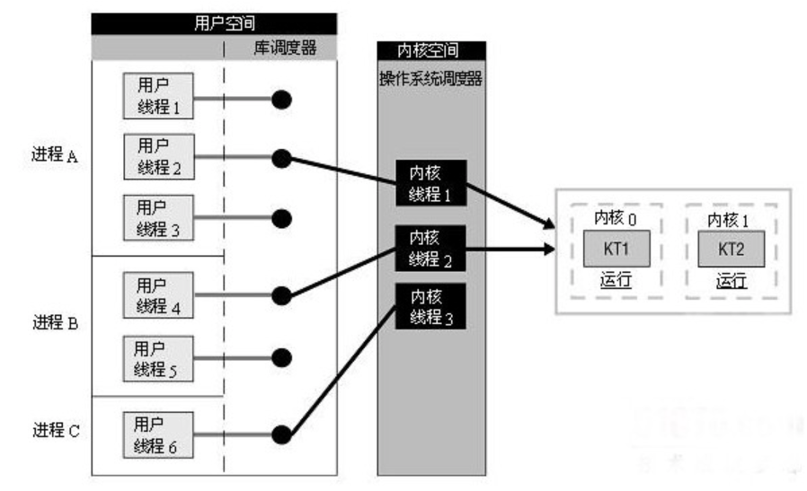
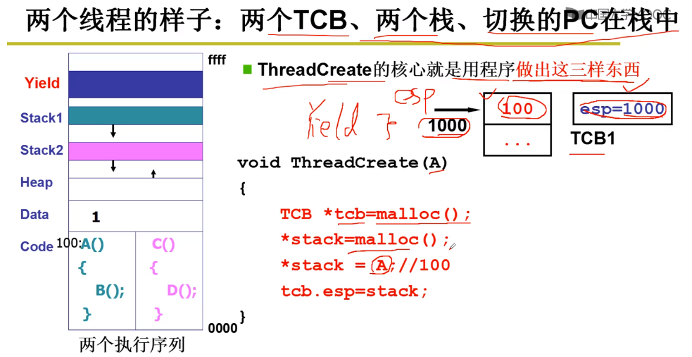
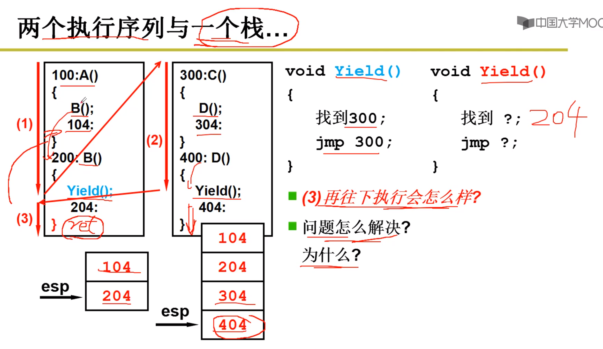
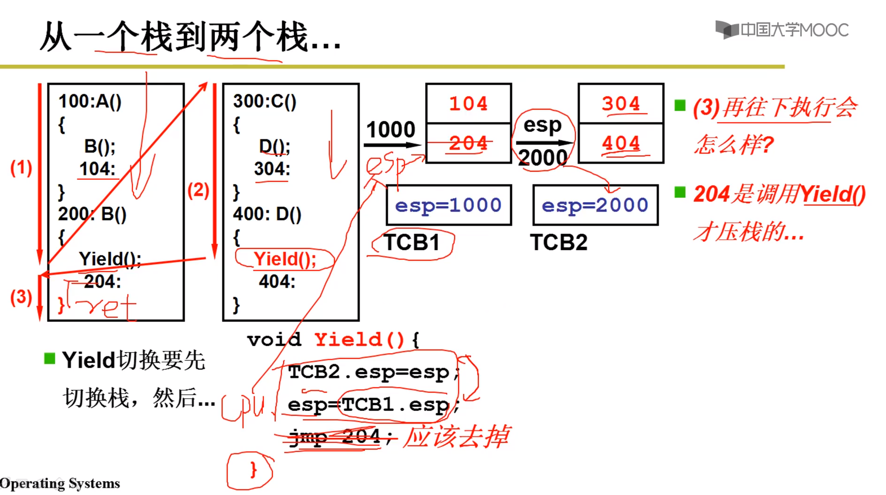
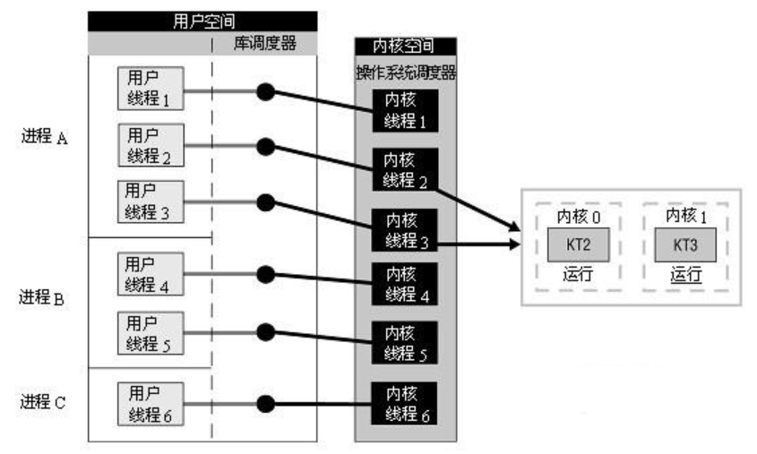
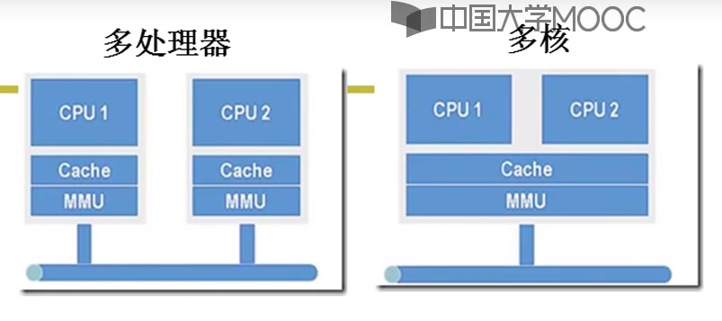
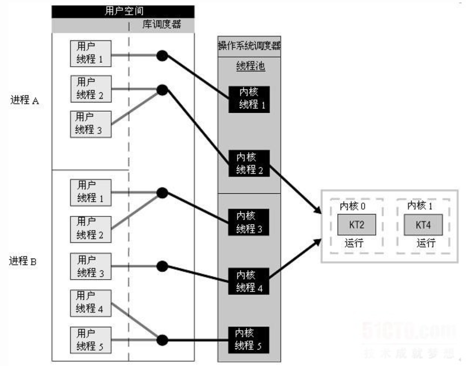
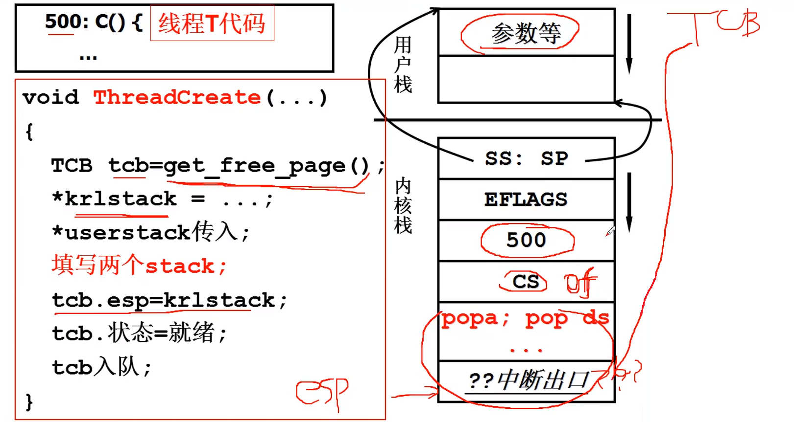
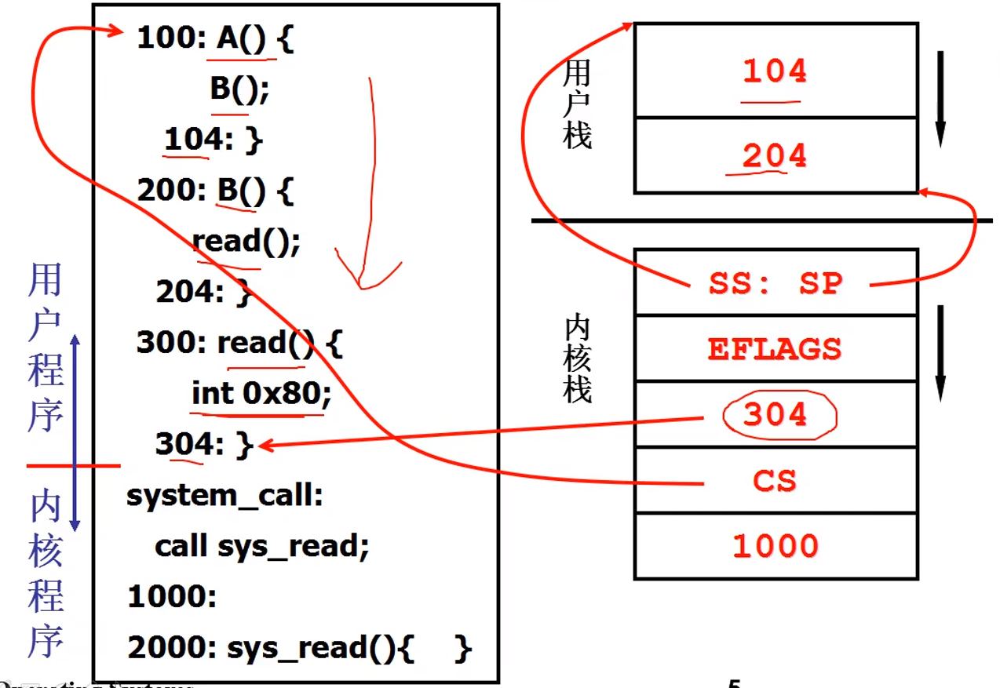
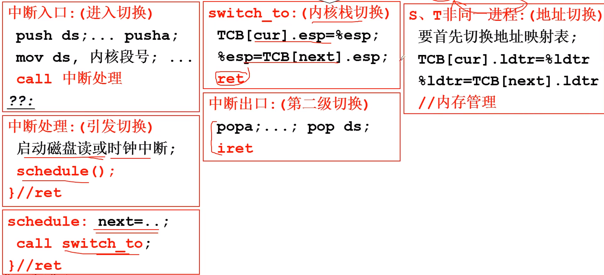

# 1. 基础知识
- 计算机的执行过程：取指(PC)执行
- 操作系统的功能：**处理器资源分配、存储管理、设备管理、文件管理、提供用户接口**

## 1.1 操作系统定义

> **计算机硬件**和**应用软件**之间的一层软件；用来管理软硬件资源，调度各类作业从而方便用户使用的**程序集合**；使得只认识机器语言的硬件更好的被控制


**操作系统Kernel特点**：

1. **并发**
   - 计算机系统中同时存在**多个运行的程序**，需要OS管理和调度
2. **共享**
   - **宏观上“同时”访问**
   - **微观上互斥共享**
3. **虚拟**
   - 利用多道程序设计技术，让每个用户都感觉有一个计算机专门为自己服务
4. **异步**
   - **程序的执行不是一贯到底，而是走走停停，向前推进的速度不可预知**
   - **只要运行环境相同，OS需要保证程序运行的结果也要相同**


## 1.2 x86-32硬件

> **运行模式**：
>
> **实模式**、**保护模式**、SMM模式和虚拟8086模式

- **实模式**：在计算机上面，实模式存在的时间非常之短，所以一般我们是感觉不到它的存在的。CPU复位（reset）或加电（power on）的时候就是以实模式启动，在这个时候处理器以实模式工作，不能实现权限分级，也不能访问20位以上的地址线，也就是只能访问1M内存（**物理地址 = 段基址<<4 + 段内偏移**）。之后一般就加载操作系统模块，进入保护模式。

- **保护模式**
  1. 支持**内存分页**机制，提供了对**虚拟内存**的良好支持
  2. 保护模式下80386支持**多任务**，还支持**优先级机制**，不同的程序可以运行在不同的优先级上。优先级分为0-3 4各级别，操作系统运行在最高的优先级0上，应用程序运行在较低的级别上。配合良好的检查机制，既可以在任务间实现数据的安全共享也可以很好地隔离各个任务。

- **通用寄存器**
  - EAX：累加器
  - EBX：基址寄存器
  - ECX：计数器
  - EDX：数据寄存器
  - ESI：源地址指针寄存器
  - EDI：目的地址指针寄存器
  - EBP：基址指针寄存器
  - ESP：堆栈指针寄存器
- **段寄存器**
  - CS：代码段
  - DS：数据段
  - ES：附加数据段
  - SS：堆栈段
  - FS/GS：附加段
- **指令寄存器**
  - EIP：EIP的低16位就是8086的IP，它存储下一 条要执行的指令的内存地址，在分段指令转换中，表示指令的段内偏移地址（CS: IP）
- **标志寄存器**
  - EFLAGS：可以存放IF（中断允许标志位），CF，PF，ZF等标志

## 1.3 计算机启动过程

- 刚开机时CPU处于实模式(和保护模型对应，实模式的CS:IP和保护模式不一样)
- 开机： `CS=0xFFFF, IP=0x0000` (CS是x86的**代码段寄存器**，IP是**指令指针寄存器**，CPU会从`CS<<4+IP`的内存地址开始读取指令并执行)
- 寻址`0xFFFF0`（ROM BIOS映射区 Basic Input Ouput System）
- 检查RAM，键盘，显示器，软硬磁盘
- 将磁盘0磁道0扇区（操作系统的引导扇区，512B）读入`0x7c00`处（0x7c00处存放的语句是 `mov ax, #BOOTSEG   mov ds, ax`，其中BOOTSEG=0x07c0）
- 设置`CS=0x07c0，IP=0x0000`（CS<<4+IP=0x7c00）

## 1.4 操作系统的接口

- **操作系统的接口**表现为函数调用，又由系统提供，所以称为**系统调用(System Call)**

### 系统调用
- 用户不能随意调用内核数据，不能随意jmp （否则可以看到root密码，修改等。。）
- 处理器的硬件隔离设计：通过**内核态和用户态**将内核程序和应用程序隔离，CS:IP是当前指令，用**CS的最低两位来区分内核态和用户态**：0是内核态，3是用户态。当 `DPL >= CPL` 和  `DPL >= RPL` 时才能实现调用和跳转。**为了避免用户程序错误地使用特权指令，保护操作系统不被用户程序破坏**
  - **`CPL`**：**当前进程的特权级(Current Privilege Level)**。它被存储在*CS寄存器的低两位*上。通常情况下，CPL代表代码所在的段的特权级。当程序转移到不同特权级的代码段时，处理器将改变CPL。只有0和3两个值，分别表示内核和用户态
  - **`DPL`**：**目标段的特权级(Descriptor Privilege Level)**。它被存储在*段描述符或者门描述符的DPL字段*中，当当前代码段试图访问一个段或者门（这里大家先把门看成跟段一样，下面我们会介绍），DPL将会和CPL以及段或者门选择子的RPL相比较，根据段或者门类型的不同，DPL将会区别对待
  - **`RPL`**：**进程对段访问的特权级(Request Privilege Level)**。它被存储在*段选择子的低两位*上。每个段选择子有自己的RPL，它说明的是进程对段访问的请求权限，有点像函数参数。而且RPL对每个段来说不是固定的，两次访问同一段时的RPL可以不同。RPL可能会削弱CPL的作用，例如当前CPL=0的进程要访问一个数据段，它把段选择子中的RPL设为3，这样它对该段仍然只有特权为3的访问权限。
  - 当进程访问一个段时，需要进程特权级检查，一般要求 `DPL >= max {CPL, RPL}`
    下面打一个比方，中国官员分为6级国家主席1、总理2、省长3、市长4、县长5、乡长6，假设我是当前进程，级别总理（CPL=2）,我去聊城市(DPL=4)考察,我用省长的级别(RPL=3 这样也能吓死他们:-))去访问,可以吧，如果我用县长的级别，人家就不理咱了(你看看电视上的微服私访，呵呵)，明白了吧！为什么采用RPL，是考虑到安全的问题，就好像*你明明对一个文件用有写权限，为什么用只读打开它*呢，还不是为了安全！

 

- 内核态可以访问任何数据，用户态不可以访问内核数据(通过比较CPL和DPL)
- 系统调用通过`陷阱机制(Trap)`完成。系统调用是中断的一种。中断是用户态进入内核态的唯一方式
- 当应用程序需要操作系统的某些操作时，比如读写文件，它就会执行系统调用，**将控制权传递给内核**，然后**内核执行被请求的操作并返回应用程序**


### 中断

*怎么*访问内核：**系统调用**，而系统调用是通过**中断**实现的，例如Linux下中断号 `int 0x80` 就是进行系统调用的

- 调用 `int 0x80`指令就能*进入内核*并调用 `system_call` 执行系统调用

  > **int 0x80中断的处理**
  >
  > 在进行`sched_init`初始化时，会调用`set_system_gate(0x80, &system_call)`设置中断号 `0x80` 中断处理：
  >
  > - 将 `idt[0x80]` 的对应表项的设置为*DPL = 3*，则能够从用户态调用 `int 0x80`
  > - 将表项中的段选择符(CS)置为8，即*CPL = 0*，将处理函数入口点偏移(IP)置为 `&system_call`。这样就能够以足够的特权级跳到 `system_call` 去执行系统调用

- 在 `system_call`中会根据**系统调用号** `NR_write`查表 `_sys_call_table`（**存放了各个系统调用函数入口地址的数组**） 找到对应的系统调用处理函数的入口 `sys_write`

  > **_sys_call_table全局函数数组**
  >
  > `fn_ptr sys_call_table[] = {sys_setup, sys_exit, sys_fork, sys_read, sys_write,...};`
  >
  > `typedef int (fn_ptr*) ();`


## 1.5 操作系统的抽象

操作系统有两个功能：防止硬件被失控的应用程序滥用；向应用程序提供简单一致的机制来控制复杂而又通常大不相同的低级硬件设备。操作系统通过下面三个抽象的概念来实现这两个功能：

文件是对IO设备的抽象、虚拟内存是对程序存储器的抽象、进程是对一个正在运行的程序的抽象、虚拟机是对整个计算机的抽象

1. **`进程`**：进程使得操作系统产生一种假象，**就像操作系统上只有这个程序在运行**。**程序看上去也是独占的使用处理器、内存和IO设备**。处理器看上去像是在不间断地一条一条执行程序中的指令，该程序的代码和数据是系统内存中途唯一的对象

2. **`虚拟内存`**：虚拟内存为每个进程提供一个假象，**就像每个进程都在独占的使用主存**，每个进程看到的内存都是一致的，`称为虚拟地址空间`。

   地址空间最上面的区域是保留给操作系统中的代码和数据的，地址空间底部存放用户进程定义的代码和数据。（从下到上是地址增大的）

   **地址空间的顶部区域是为内核保留的，不允许应用程序读写这个区域的内容或者直接调用内核代码定义的函数**，它们必须调用内核来执行这些操作

   

3. **`文件`**：文件就是字节序列，每个IO设备（磁盘、键盘、显示器、网络）都可以看成是文件，操作系统所有输入输出都是通过Unix IO的系统函数调用读写文件来实现的。**文件向应用程序提供了一个统一的视图，来看待系统中各种各样的IO设备**，一切皆文件

## 1.6 并发和并行

### 1.6.1 线程级并发

传统意义上的并发是一台计算机在它正在执行的进程间快读切换来模拟出来的，这时单核处理器系统，大多数实际的计算都是由一个处理器完成的

多处理器系统将多个`CPU(核)`继承到一个芯片上，**每个核都有自己的L1核L2高速缓存**

L1高速缓存分为两个部分：指令、数据


- **超线程**：又称为同时多线程(simultaneous multi-threading)，是一项允许一个CPU执行多个控制流的技术。它是基于CPU的某些硬件有多个备份来实现的，比如程序计数器和寄存器文件，而其他硬件部分只有一份，比如ALU，假设一个线程必须等待某些数据被装载到高速缓存，就可以去转而执行另一个线程。比如Intel的4核8线程，可以让每个核心执行两个线程。

  虽然采用超线程技术能够同时执行两个线程，当两个线程同时需要某个资源时，其中一个线程必须让出资源暂时挂起，直到这些资源空闲以后才能继续。因此，超线程的性能并不等于两个CPU的性能

- 超线程的出现，使得程序可以利用硬件进行线程级别的并行，使得程序的执行允许有更多的并行


### 1.6.2  指令级并行

现代处理器同时执行多条指令的属性就称为`指令级并行`，例如流水线技术。将执行一条指令所需要的活动划分为不同的步骤，有些步骤可以进行并行操作

大多数线代处理器都支持`超标量`操作：超标量就是比一个周期一条指令更快的执行速率


### 1.6.3 单指令、多数据并行

基于硬件的实现，可以**允许一条指令产生多个可以并行执行的操作**，这种方式称为单指令、都哟数据，即SIMD并行。最新的Intel和AMD处理器都具有并行对8对单精度浮点数做加法的指令


## 1.7 程序和数据

机器对于数据的存放有两种：最低有效字节在最前面的称为小段法，最高有效字节在前面的称为大端法

例如对于0x01234567，最低有效字节是67，那么两种存放方式分别是：


**大部分Intel兼容机都使用了小端法存放数据**，而ARM处理器的硬件可以按小端或大端两种模式操作，但是Android和IOS都只能运行在小端模式


# 2. 进程和线程

进程的引入，只要是为了实现多道程序交替执行(并发)，所以需要在切换任务的时候修改PC寄存器的值，同时保存原程序的各种信息（从而引入了PCB）

## 2.1 进程
- **进程(Process)** 本质上就是操作系统执行的一个程序
- 计算机以**字节**作为`寻址的内存单位`，机器级程序将内存视为一个非常大的字节数组，称为`虚拟内存`，每个字节都有一个唯一的数字标识作为地址，所有可能的地址集合就成为`虚拟地址空间`。虚拟地址的范围取决于**`机器字长`**，例如32位字长机器的虚拟地址范围是  $0 到 2^{32} - 1$，因为虚拟地址空间是以字长来进行编码的
- 与每个进程相关的是`地址空间(address space)`，在这个地址空间中，进程可以进行读写操作，地址空间中存放了可执行程序，程序所需要的指令和数据
- 与一个进程有关的所有信息，除了进程自身地址空间的内容外，均存放在操作系统的一张表中，成为`进程表(process table)`，进程表是数组或者链表结构，每个进程都要占据其中一项
- 一个挂起的进程包括：进程的地址空间 和 对应的进程表项
- **地址空间：** 为了防止应用程序之间相互干扰，需要一些保护机制，虽然机制是在硬件中实现的，但是由操作系统进行控制。现代操作系统利用`虚拟内存`计数可以把部分地址空间装入内存，部分留在磁盘，来运行超过计算机主存的地址空间的进程

内存中的进程：

1. `只读的代码和数据`：代码从同一固定地址开始。进程一开始就被指定了大小
2. `运行时堆`：堆在运行时动态的扩展和收缩（malloc和free）
3. `用户栈`：编译器用栈来实现函数的调用，和堆一样在执行期间可以动态扩展和收缩，每次调用函数的时候栈就会增长，从一个函数返回的时候栈就会收缩


- 以 32 位机器为例，地址总线是32位，可寻址的最⼤内存空间是 $2^{32}$Bytes，即4GBytes。每⼀个运⾏的进程都可以获得⼀个4GB的逻辑地址空间，这个空间被分成两个部分： 内核空间和⽤户空间，其中⽤户空间分配到从0x00000000到0xC0000000共3GB的地址，⽽内核空间分配了0xC0000000到0xFFFFFFFF⾼位的1GB地址


### 2.1.1 进程模型
- 在进程模型中，所有计算机上运行的软件，包括操作系统，被组织为若干`顺序进程(sequential process)`，简称为进程。一个进程就是一个正在执行的程序的实例
- 从概念上来说，每个进程都有自己的虚拟CPU(实际上是CPU在各个进程之间进行来回切换)。**进程包括程序计数器、寄存器和变量当前值**


### 2.1.2 进程创建

**系统启动的时候，会创建一个1号进程，是所有其他进程的祖先，直到关机才被终止**

进程创建的四种方式：
1. **系统初始化(init)：** 启动操作系统时，通常会创建若干个进程。前台进程，后台进程，守护进程。`ps`可以查看正在运行的进程
2. **系统调用创建：** 一个正在运行的进程通过`系统调用(如fork)`来创建一个或多个新进程来帮助其完成工作
3. **用户请求创建：** 启动程序
4. **批处理创建：** 在`大型的批处理系统`中，用户提交批处理作业，操作系统创建一个新的进程并从其中的输入队列中运行下一个作业

UNIX和Win32的系统调用表


- **fork()函数有返回值：** 如果创建子进程成功，对于父进程的返回值是子进程的pid，对于子进程的返回值是0，创建失败则返回-1
- 父进程如果wait子进程，直接结束，子进程就变成孤儿进程，被pid=1的进程接管
~~~c
int main(int argc, char const* argv[])
{
  pid_t pid;  //父进程pid
  pid_t cid;  //子进程pid
  printf("我是父进程，我的pid是:%d\n", getpid());
  
  cid = fork();
  if(cid==0){ //子进程执行
    printf("我是子进程，我的pid是%d，我看到的fork返回值是%d\n", getpid(), cid);
  }else{
    printf("我是父进程，我的pid是%d, 我看到的fork返回值是%d\n", getpid(), cid);
  }
  pause();
  return 0;
}

//我是父进程，我的pid是:18619
//我是父进程，我的pid是18619, 我看到的fork返回值是18620
//我是子进程，我的pid是18620，我看到的fork返回值是0

~~~

- 进程创建之后，**父进程和子进程有各自不同的地址空间**，如果其中一个进程在其地址空间修改了一个词，这个修改对另一个进程是不可见的
- 在UNIX中，**子进程的地址空间是父进程的一个拷贝**，**但是却是两个不同的地址空间**。**不可写的内存区域是共享的**。或者子进程共享父进程的所有内存，但是是通过`写时复制(copy-on-write)`共享的，一旦某个进程要修改部分内存，这块内存首先就要被复制，以确保修改发生在私有内存区域。**可写的内存是不能被共享的**。
- 在Windows中，从一开始父进程的地址空间和子进程的地址空间就是不同的

### 2.1.3 进程终止
1. **正常退出(自愿)：** 由于完成工作而终止，当编译器完成所给定程序的编译后，会执行一个系统调用告诉操作系统它完成了任务。UNIX中是`exit`，Windows中是`ExitProcess`
2. **错误退出(自愿)：** 执行时遇到错误，声明错误并退出
3. **严重错误(非自愿)：** 执行时遇到严重错误，操作系统终止进程 
4. **被其他进程杀死(非自愿)：** 其他进程执行系统调用告诉操作系统杀死某个进程。UNIX中是`kill`，Windows中对应函数是`TerminateProcess`(不是系统调用)

**UNIX进程体系：** 进程和它的所有子进程以及子进程的子进程共同组成一个进程组。如UNIX启动后，整个操作系统中所有的进程都隶属于一个以`init`为根的进程树

### 2.1.4 进程的状态
- 一般而言，每个进程至少应处于三种基本状态之一：就绪态(Ready)、运行态(Running)、阻塞态(Block)

1. 运行态：进程实际占用cpu时间片运行时
2. 就绪态：可运行，但是因为其他进程正在运行而处于就绪态
3. 阻塞态：除非某种事件时间发生，否则进程不能运行。**阻塞是运行时的进程主动进行的**

### 2.1.5 进程切换时机

**进程何时离开cpu（进程切换时机）：**

1. 内部事件：主动放弃(`yield`)CPU，进入到`阻塞/终止`状态。例如使用IO设备，或者(非)正常结束
2. 外部事件：进程被剥夺CPU的使用权，进入到`就绪`态，这个动作叫`抢占(preempt)`。例如时间片用完，高优先权进程到达


- 进程切换时，会将原进程的数据保存到`进程控制块(Process Control Block)`中 **（进程状态，PID，PC，寄存器，内存管理相关数据，文件相关数据等）**


- **进程队列是PCB的队列，而不是整个进程上下文**
- 进程上下文(Process Context)


**进程调度** 指的是，**决定哪些进程优先被运行和运行多久**，由操作系统的`调度器(scheduler)`执行
]

### 2.1.6 进程的切换过程
操作系统为了执行进程间的切换，会维护一张`进程表(Process Table)`，每个进程占用一个表项，表项包括了进程状态的重要信息：**程序计数器、堆栈指针、内存分配状况、所打开文件的状态、账号、调度信息、其他由运行态转换到阻塞或就绪态所需要保存的信息**，从而保证改进程随后能再次启动，就像没有中断过一样


- **进程切换的时机：** `主动`(启动IO设备)，`被动`(高优先级进程，CPU时间片用完)。进程切换时会发出中断信号，进行用户态到内核态的切换，执行中断处理程序，再切换回用户态执行另一个进程。
- **进程切换过程：** 
  1. 修改当前进程PCB的`状态值`，保存执行现场到PCB
  2. 将被中断进程PCB加入到**相应的状态队列** 
  3. 通过调度算法，调度新的进程并恢复它的上下文信息（修改现场为新PCB中的值）


### 2.1.8 关于中断


- **中断：** CPU在正常执行程序时，由于内部/外部事件的触发或由程序预先设定而引起的CPU暂时中止当前正在执行的程序，保存当前程序相关信息到栈中，转而执行中断服务子程序，待执行完中断服务子程序后，CPU再获取被保存到栈中的被中断程序的信息，从而继续执行被中断程序的过程
- **外中断(Interrupt)：** 来自外部事件触发的中断。如**键盘中断，外围设备中断**。外部中断均是`异步中断(随机中断)`
- **内中断(Exception)：** 来自内部事件触发的中断，就是异常。如硬件异常(掉电)，**程序异常**(非法操作，除0等)，**系统调用**。内部中断都是`同步中断`
- **模式切换：** 不管是外中断还是内中断都会进行用户态到内核态的切换，用户态到内核态的切换也只能通过`中断`进行。内核态到用户态通过`LPSWS指令`(恢复现场)切换
- **中断向量：** 中断服务程序的入口地址
- **中断向量表：** 中断类型码到对应中断向量的映射表
- **中断处理过程：** 请求中断→响应中断→关中断→保护断点→中断源识别→保护现场→开中断→中断服务程序→关中断→恢复现场→开中断→中断返回

中断处理和调度的过程：
1. 硬件压入堆栈：程序计数器、程序状态字、寄存器值
2. 硬件从中断向量装入新的程序计数器
3. 汇编语言过程：保存寄存器的值
4. 汇编语言过程：设置新的堆栈
5. C中断服务器运行(典型的读和缓存写入)
6. 调度器决定下面哪个程序先运行
7. C过程返回值汇编代码
8. 汇编语言过程：开始执行新的当前程序

## 2.2 线程
- 创建子进程即使是完成很小的任务，也要完全拷贝进程上下文，浪费了资源。于是有了线程

- 多线程之间会**共享同一块地址空间和所有可用数据**，这时进程所不具备的
- 线程比进程更轻量级，创建线程比创建进程快10-100倍
- 进程切换开销较大(保存和恢复现场)
- 线程间通信比进程间通信效率更高
- 对CPU密集型任务，多线程并不能获得性能上的增强，反而会因为过多的多任务切换降低效率，所以计算密集型任务同时进行的数量应当等于CPU核心数。但是对I/O密集型任务，多线程能在活动中彼此重叠进行，加快应用程序的执行速度

IO密集型任务执行期间，99%的时间都花在IO上，花在CPU上的时间很少，因此，用运行速度极快的C语言替换用Python这样运行速度极低的脚本语言，完全无法提升运行效率。对于IO密集型任务，最合适的语言就是开发效率最高（代码量最少）的语言，脚本语言是首选，C语言最差

### 2.2.1 经典线程模型
- 同一个线程中的所有线程都会有完全一样的地址空间，这意味着他们也共享同样的全局变量。一个线程可以读取、写入甚至擦除另一个线程的堆栈。线程之间出了共享同一内存空间外，还具有如下不同的内容：


传统进程有一个单独的线程
多线程时，每个线程都有自己的堆栈


线程的系统调用：
线程通常从当前的某个单线程开始，通过调用库函数`thread_create`来创建新的线程，指定线程名称   
当线程完成工作之后，调用函数`thread_exit`退出，紧接着而线程消失，状态变为终止，不能再调度。某些线程运行过程中可以通过调用`thread_join`来阻塞线程，直到等待的另一个线程退出。还可以通过`thread_yeild`自动放弃CPU，让其他线程运行。


### 2.2.2 用户线程和内核线程

- M:1模型（用户线程），只是方便管理线程，并不能利用多核性能
- 1：1模型(NPTL，内核现成)，缺点是用户线程较多时，频繁创建内核线程开销大
- M:M模型(NGPT，混合)，节省了内核的开销，相当于线程池的思想，直接复用内核线程。但是实现复杂，需要进行ULT到KLT的分发管理 


1. **在用户空间中实现线程(User Level Thread)：** 线程在`运行时系统(Runtime System)`之上运行，每个进程需要有专用的`线程表(thread table)`，用来跟踪该进程中的线程。**在用户态运行，它的管理无需内核支持**
   - 优势：切换线程时，保存线程的状态和调度程序都是`本地过程`，所以**启动他们比进行内核调用效率更高，不需要切换到内核，不需要上下文切换，不需要对内存高速缓存进行刷新，调度便捷，效率高。同时还允许每个进程有自己定制的调度算法**
2. **在内核空间中实现线程(Kernel Level Thread)：** 无需运行时环境，每个进程中也没有线程表。在内核中会有用来记录系统中所有线程的线程表，创建或撤销线程通过系统调用实现。**在内核态运行，由操作系统支持与管理**
    - 由于在内核中创建或者销毁线程的开销比较大，所以某些系统会采用可循环利用的方式来回收线程。当某个线程被销毁时，就把他标志位不可运行状态，稍后必须创建新的线程时，就会重新启用旧线程，标志为可用状态

### 2.2.3 用户级线程

> **用户级线程（User-Level Thread, ULT）**：有关线程管理的所有工作都由**应用程序**完成，内核意识不到线程的存在。应用程序可以通过使用**线程库**设计成多线程程序。任意给定时刻每个进程只能够有*一个线程*在运行，而且只有*一个处理器内核*会被分配给该进程。库调度器从进程的多个线程中选择一个线程，然后该线程和该进程允许的一个内核线程关联起来。内核线程将被操作系统调度器指派到处理器内核。用户级线程是一种“***多对一***”的线程映射。

- **优点**：
  1. 线程的调度不需要内核直接参与，控制简单
  2. 可以在不支持线程的操作系统中实现
  3. 创建和销毁线程、线程切换代价等**线程管理的代价比内核线程小得多**, 因为保存线程状态的过程和调用程序都只在用户态完成，无需用户态与内核态切换
  4. 允许每个进程**定制自己的调度算法**，线程管理比较灵活。这就是必须自己写管理程序，与内核线程的区别
- **缺点**：
  1. 因为内核无法感知多线程的存在，**一个用户级线程的阻塞将会引起整个进程的阻塞**
  2. 资源分配按照进程进行，多个处理机下，**同一个进程中的线程只能在同一个处理机下分时复用**




**创建用户级线程**：`ThreadCreate`的核心就是创建出 **TCB、栈、栈中PC值**




**用户级线程的切换**：通过 `Yield()`函数切换，它是一个**用户态函数**

- :negative_squared_cross_mark: ​**两个线程和一个栈**：在第二个线程中 `Yield()` 之后，跳到第一个线程 `204` 处执行，然后遇到 `}` 就 `ret` 弹栈并置 `PC = 404` ，结果有跳到第二个线程中去执行了，而本应该到 `104`去执行。***所以线程必须有自己的调用栈***。

  

- :white_check_mark:**两个线程和两个栈**：`Yield()`做两件事（一定不能有 `jmp 204`，否则会跳到 `204` 两次）

  - **切换栈**：1）**ESP寄存器**$\longrightarrow$**当前线程TCB的esp字段**中： `TCB2.esp = esp`  ；2）**下个线程TCB的esp字段**$\longrightarrow$**ESP寄存器**： `esp = TCB1.esp`

  - **弹栈**：跳到 `204` 执行

    

  


### 2.2.4 内核级线程

> **内核级线程（Kernal-Level Thread, KLT）**：内核线程建立、切换和销毁都是由**操作系统内核**负责、通过**系统调用**完成的。应用程序没有进行线程管理的代码，只有一个到内核级线程的编程接口，即**轻量级进程（Light Weight Process , LWP）**。有了内核线程，每个用户线程被映射或绑定到一个内核线程。用户线程在其生命期内都会绑定到该内核线程。一旦用户线程终止，两个线程都将离开系统。这被称作“***一对一***”线程映射。
>
> 
>
> 操作系统内核对线程能否感知，把线程分为**用户级线程**和**内核级线程**。
>
> **相比用户级线程只有一个用户栈，内核级线程多了一个与*用户栈*关联的*内核栈***。 

- **优点**：
  1. 如果进程中的一个线程被阻塞，**能够切换同一进程内的其他线程继续执行**（用户级线程的一个缺点）
  2. 当有多个处理机时，一个进程的**多个线程可以同时执行**

- **缺点**：
  1. 线程在用户态的运行，而线程的调度和管理在内核实现，在**控制权从一个线程传送到另一个线程需要用户态到内核态再到用户态的模式切换**，比较占用系统资源



为什么需要内核级线程：**只有内核级线程才能充分发挥多核的价值**

- **多进程无效**：因为多核共用一套内存管理单元**MMU**，即在同一时刻只有一套映射，而不同的进程地址空间需要相互独立，需要不同的映射，所以多进程无效（**Intel core可以，每个核心都有一个MMU**）

- **用户级线程无效**：因为*内核无法感知用户级线程*，只能给它分配一个CPU，所以用户级线程也无效

  

**内核级线程与用户级线程的实现主要不同之处**：内核级线程拥有两个栈（用户栈 + 内核栈）

**内核栈**：linux一但创建进程就会立刻分配8K，两个页框用来存放内核栈和 thread_info。当进程在用户空间运行时，堆栈寄存器的内容就是用户堆栈地址，反之是内核堆栈地址。

- **进程用户栈和内核栈的切换**：当进程由于`中断`或`系统调用`从用户态转换为内核态时，进程所使用的**栈也要从用户栈切换到内核栈**。系统调用实质就是通过指令产生中断（软中断）。进程由于中断而陷入到内核态，进程进入内核态之后，首先**把用户态的堆栈地址保存在内核态堆栈中**，然后**设置堆栈寄存器地址为内核栈地址**，这样就从用户栈转换成内核栈。

- **进入内核态时，去哪里找内核栈指针**：首先我们需要明确一点：*每当进程从用户态切换到内核态时，内核栈总是空的*。当进程在用户态执行时，使用的是用户栈，切换到内核态运行时，内核栈保存的是进程在内核中运行的相关信息。重回到用户态时，内核栈中保存的信息全部恢复，因此，进程从用户态切换到内核态时，内核栈总是空的。

  弄清楚了每次进程切换到内核态时内核栈总是空的，那上述问题就很好解决了，用户态切换到内核栈时，因为内核栈是空的，只需**将栈寄存器值设置成内核栈栈顶指针**即可，那么下边我们通过内核栈的实现来理解如何获得内核栈的栈顶指针。


### 2.2.5 混合型线程

> **混合型线程**：在一些系统中，使用**组合方式的多线程实现**, *线程创建完全在用户空间中完成*，*线程的调度和同步也在应用程序中进行*。 一个应用程序中的多个用户级线程被映射到一些（小于或等于用户级线程的数目）内核级线程上。

下图说明了用户级与内核级的组合实现方式, 在这种模型中，*每个内核级线程有一个可以轮流使用的用户级线程集合*。



POSIX 引入了一个**线程调度竞争范围(thread-scheduling contention scope)**的概念，这个概念赋予了程序员一些控制权，使它们可以控制怎样将内核实体映射为线程。线程的Contention Scope属性可是 `PTHREAD_SCOPE_PROCESS` ,也可以是 `PTHREAD_SCOPE_SYSTEM` 。带有 `PTHREAD_SCOPE_PROCESS` 属性的线程与它所在的进程中的其他线程竞争处理器资源。带有 `PTHREAD_SCOPE_SYSTEM` 属性的线程很像内核级线程，他们在全系统的范围内竞争处理器资源。POSIX的一种映射方式将 `PTHREAD_SCOPE_SYSTEM` 线程和内核实体之间绑定起来。

内核级线程创建时先设置线程属性 `PTHREAD_SCOPE_SYSTEM`，代码如下：

```c
pthread_attr_t attr;

pthread_attr_init(&attr);
pthread_attr_setscope(&attr, PTHREAD_SCOPE_SYSTEM); //设置内核级的线程,以获取较高的响应速度
//创建线程

ret = pthread_create(&iAcceptThreadId, &attr, AcceptThread, NULL);
```


### 2.2.6 内核级线程的创建和切换

内核级线程创建，需要再内核中创建 **TCP、内核栈**，才能进行内核级线程的切换



> 内核线程的切换与用户级线程相似，内核级线程的切换主要也是*切换TCB*，*从TCB中找到esp切换栈*。不过**内核级线程的TCB是内核可感知的，并且直接切换的栈是内核栈**，用户栈通过跟内核栈相关联而间接切换。

**用户栈与内核栈的切换**：



**内核中的切换：**

1. **中断入口**：`fork()` $\longrightarrow$ `int 0x80`  $\longrightarrow$ `system_call` $\longrightarrow$ **2**
2. **中断处理**：`sys_fork` $\longrightarrow$ `判断是否应该切换（阻塞或时间片到）`$\longrightarrow$ 3
3. **调度**：`next = ...` $\longrightarrow$ **4**
4. **切换**：`切换TCB`$\longrightarrow$ `切换内核栈` $\longrightarrow$  **5**
5. **中断出口：**`iret弹栈`$\longrightarrow$ 回到用户态执行 




### 2.2.7 线程库

1. POSIX Pthreads：可以创建用户线程库和内核线程库
2. Windows Threads：内核线程库
3. Java Threads：根据所依赖的操作系统而定。。在windows上就是内核线程，在unix上看具体实现

- POSIX是IEEE的标准，为了使程序可移植。线程被定义为`Pthreads`，大部分的UNIX系统都支持它。
> POSIX线程 （通常称为pthreads）是一种独立于语言而存在的执行模型，以及并行执行模型。它 允许程序控制时间上重叠的多个不同的工作流程。每个工作流程都称为一个线程，可以通过调用 POSIX Threads API来实现对这些流程的创建和控制。可以把它理解为线程的标准。

|线程调用|描述|
|----|---|
|pthread_create|创建线程|
|pthread_exit|结束线程|
|pthread_join|等待一个特定线程退出|
|pthread_yield|释放CPU，给其他线程运行机会|
|pthread_attr_init|创建并初始化一个线程的属性结构|
|pthread_attr_destory|删除一个线程的属性结构|

观察join的作用：
~~~cpp
void* threadFunc(void* arg){
        printf("in new thread\n");
}

int main(){
        pthread_t tid;
        pthread_create(&tid, NULL, threadFunc, NULL);
        
        // 等待指定线程结束
        pthread_join(tid, NULL); 
        printf("in main thread\n");
        return 0;
}
//in new thread
//in main thread
~~~

~~~cpp
void* threadFunc(void* arg){
        printf("in new thread\n");
}

int main(){
        pthread_t tid;
        pthread_create(&tid, NULL, threadFunc, NULL);
        //pthread_join(tid, NULL);
        printf("in main thread\n");
        return 0;
}

// [root@iZwz91j9t2admw7xtplq6bZ code]# ./pi
// in main thread
// in new thread
// in new thread
// [root@iZwz91j9t2admw7xtplq6bZ code]# ./pi
// in main thread
~~~

多线程计算个圆周率
~~~cpp

void* calculate_pi(void* arg){
    unsigned seed = time(NULL);
    int circle_points = 0;
    int square_points = 0;
    int intervals = *((int*)arg); //参数的传递

    for(int i = 0; i<intervals*intervals; ++i){
        double rand_x = (double)rand()/RAND_MAX;
        double rand_y = (double)rand()/RAND_MAX;
        if(rand_x*rand_x + rand_y*rand_y<=1){
                circle_points++;
        }
          square_points++;
    }
    double pi = ((double)circle_points)/square_points*4.0;
    printf("cirle_points=%d, square_points=%d, pi=%lf\n",circle_points, square_points,((double)circle_points)/square_points*4.0);

    pthread_exit(0); //结束线程
}

int main(int argc, char const *argvp[]){
    pthread_t calculate_pi_threads[10];

    int args[10];

    for(int i = 0; i<10; ++i){
        args[i] = 1000*(i+1);
        pthread_create(calculate_pi_threads+i, NULL, calculate_pi, args+i);
    }
    for(int i = 0; i<10; ++i){
        pthread_join(calculate_pi_threads[i], NULL);
    }
    return 0;
}
~~~

## 2.3 调度算法
- 操作系统有一个程序叫做`调度程序(scheduler)`，当多个线程竞争CPU时间片时，调度程序来选择具体执行哪个线程，该程序使用的算法叫做`调度算法(scheduling algorithm)`

### 2.3.1 调度介绍

**CPU密集型和I/O密集型进程**

- 大多数进程需要的cpu时间都很少
- `CPU密集型(CPU-bound)`或`计算密集型(compute-bound)` 占用CPU时间片长，IO频率低
- `I/O密集型(I/O-bound)` 占用cpu时间片短，IO频率高


**何时调度**：

1. **创建新进程**：需要决定运行父进程还是子进程
2. **进程退出**：必须做出调度策略
3. **进程阻塞**：进程在I/O和信号量上或由于其他原因阻塞时，必须选择另一个进程运行
4. **I/O中断**：必须做出调度策略

5. **时钟中断**：在每个或每k个时钟中断时做出调度策略。根据如何处理时钟中断，可以把调度算法分为两类：
   - **非抢占式调度**：挑选一个进程获得CPU资源，进程会一直占用到**终止或者阻塞状态**。这样在时钟中断发生时不会进行调度
   - **抢占式调度**：挑选一个进程运行某个固定时段的**最大值**。如果在该时段结束时，该进程仍在运行，它就被挂起，而调度程序挑选另一个进程运行。这样**需要在时间间隔的末端发生`时钟中断`**，以便把CPU控制返回给调度程序。如果没有可用的时钟，非抢占式调度就是唯一的选择


**调度算法的目标**：

- **吞吐量**：系统每小时完成的作业数量
- **周转时间**：从一个作业提交时刻开始直到该作业完成时刻为止的统计平均时间
- **响应时间**：从发出命令到得到响应之间的时间


**如何做到均衡性**：调度算法应该做到*折中*和*综合*，同时还应该尽量*简单*

- 吞吐量和响应时间的矛盾：响应时间小 — 切换次数多 — 系统内耗大 — 吞吐量小

- 前台任务和后台任务关注点不同：前台任务往往更关注响应时间，而后台时间往往更关注周转时间

- IO约束型任务和CPU约束型任务关注点不同


### 2.3.2 调度策略
- 没有最好最坏，寻求的是一个平衡
- 长程调度(Program到Process)，短程调度(Process到CPU)，中程调度(虚拟内存)
- 很多长程调度策略和短程调度是类似的
#### 先来先服务 

First-Come, First-Served(FCFS)

- 通过就绪队列来实现
- FCFS意味着一个程序会一直运行到结束(尽管其中会出现等待I/O的情况)

特点：`简单易行`，但是短作业处在长作业后面会导致等待时间很长

#### 最短作业优先 

Shortest Job First(SJF)

- 每次选择所需CPU时间最短的进程
- 非抢占式
- 也可以修改位抢占式(最短剩余时间优先)

#### 最短剩余时间优先 

Shortest Remaining Time First(SRTF)

- 抢占式

SJF和SRTF特点：总是将短进程移到长进程之前，`平均等待时间最少`，被证明是**最优的**。但是会导致饥饿现象(长进程可能长时间无法获得CPU)，不公平。
该算法很难实现！因为很难预测作业需要的CPU时间！

#### 时间片轮转 

Round-Robin(RR)

- 每个进程都可以得到相同的CPU时间片，当时间片到达，进程被剥夺CPU，并加入到就绪队列的尾部
- 是`抢占式`调度算法

特点：`公平`，将固定的时间片设置得太短会导致过多的进程切换并降低CPU效率，但设置太长会导致一个短请求很长时间得不到响应。一般切换时间是10-100ms之间，上下文切换时间是0.1~1ms(约1%的开销)。当时间片取值无穷大时变退化为FCFS

#### 优先级调度 

Priority

- 每个进程被赋予一个**优先级**
- Linux中，0为最高优先级
- 下一次调度总是选择**优先级最高的可运行进程**运行，为了防止低优先级进程产生饥饿现象，需要偶尔**对进程优先级进行调整**：
  - 每个时钟中断降低当前进程的优先级
  - 给每个进程额外赋予一个允许运行的最大时间片，时间片到了之后次高优先级的进程便获得了运行机会
- SJF是优先级调度的一个特例(时间越短优先级越高)
- 可以是抢占式，也可以是非抢占式
- **静态优先级：** 优先级保持不变，会出现饥饿现象(不公平)
- **动态优先级：** 随着进程占用CPU时间的增加，优先级慢慢降低。或者随着进程在就绪队列中等待的时间增加，优先级慢慢提高


## 2.4 Linux进程调度

### 2.4.1 基本概念

#### 1. 进程和线程

- 在Linux内核中，进程和线程都使用`struct task_struct`结构来进行抽象描述
- 进程的虚拟地址空间分为用户虚拟地址空间和内核虚拟地址空间，所有进程共享内核虚拟地址空间，没有用户虚拟地址空间的进程称为内核线程

Linux内核使用`task_struct`结构来抽象，该结构包含了进程的各类信息及所拥有的资源，比如进程的状态、打开的文件、地址空间信息、信号资源等等。`task_struct`结构很复杂，下边只针对与调度相关的某些字段进行介绍。


```c
struct task_struct {
    
    /* 进程状态 */
    volatile long			state;

    /* 调度优先级相关，策略相关 */
	int				prio;			//动态优先级，范围为100~139，与静态优先级和补偿(bonus)有关
	int				static_prio;    //静态优先级，static_prio = 100 + nice + 20 (nice值为-20~19,所以static_prio值为100~139)
	int				normal_prio;    //没有受优先级继承影响的常规优先级，具体见normal_prio函数，跟属于什么类型的进程有关
	unsigned int	rt_priority;    //实时进程优先级
    unsigned int	policy;
    
    /* 调度类，调度实体相关，任务组相关等 */
    const struct sched_class	*sched_class;
	struct sched_entity		se;
	struct sched_rt_entity		rt;
#ifdef CONFIG_CGROUP_SCHED
	struct task_group		*sched_task_group;
#endif
	struct sched_dl_entity		dl;
    
    /* 进程之间的关系相关 */
	struct task_struct __rcu	*real_parent;

	/* Recipient of SIGCHLD, wait4() reports: */
	struct task_struct __rcu	*parent;

	/*
	 * Children/sibling form the list of natural children:
	 */
	struct list_head		children;
	struct list_head		sibling;
	struct task_struct		*group_leader;
    
    /* ... */
}
```


#### 2. 进程状态

- Linux中的`就绪态`和`运行态`对应的都是`TASK_RUNNING`标志位，`就绪态`表示进程正处在队列中，尚未被调度；`运行态`则表示进程正在CPU上运行；


#### 3. 调度器、调度策略、调度实体


**内核默认提供了5个调度器类：**

1. `Stop调度器， stop_sched_class`：优先级最高的调度类，**可以抢占其他所有进程，不能被其他进程抢占**；
2. **`Deadline调度器`**， dl_sched_class：使用红黑树，把进程**按照绝对截止期限进行排序**，**选择截止时间最早的进程进行调度运行**（Earliest Deadline First， EDF算法）
3. **`RT调度器`**， rt_sched_class：实时调度器，为每个优先级维护一个队列；
4. **`CFS调度器`**， cfs_sched_class：完全公平调度器，采用完全公平调度算法，引入虚拟运行时间概念；
5. `IDLE-Task调度器， idle_sched_class`：空闲调度器，每个CPU都会有一个idle线程，当**没有其他进程可以调度时，调度运行idle线程**；

Linux内核提供了一些调度策略供用户程序来选择调度器，其中`Stop调度器`和`IDLE-Task调度器`，仅由内核使用，用户无法进行选择

Linux内核抽象了一个调度器类`struct sched_class`，在实例化各个调度器的时候，根据具体的调度算法具体实现


----------------------------------------------------------------------->   优先级依次降低


**6种调度策略：**

1. `SCHED_NORMAL`和`SCHED_BATCH`，对于**非实时进程（普通进程）**，采用CFS调度策略
2. `SCHED_FIFO`、`SCHED_RR`和`SCHED_DEADLINE`，对于**实时进程**，分别采用不同的策略调度
3. `SCHED_IDLE`，系统空闲时调用idle进程

因为**实时进程只要求尽快的被响应**，所以根据重要程度赋予不同优先级，调度器每次都选择最高优先级执行即可，低优先级不可能抢占高优先级，因此FIFO或者RR调度策略即可满足实时进程的需求

而**普通进程(非实时进程)**就比较麻烦了，不能简单的只看优先级，必须公平的占有CPU，否则很容易出现进程饥饿，这种情况下用户会感觉操作系统很卡，响应慢，因此linux总是希望寻找一个最接近完美的调度策略来公平快速的调度进程


**3个调度实体：**

调度器不局限于调度进程，还可以调度更大的实体，例如组调度，`一般要求调度器不直接操作进程，而是操作调度实体`，因此通过一个通用数据结构描述这个调度实体`sched_entity`，可以作为一个进程，也可以作为一个进程组

linux针对当前可调度实体是实时还是非实时，定义了3种调度实体：

1. `sched_dl_entity`，采用 EDF 算法调度的实时调度实体（EDF算法，即`Earliest Deadline First`）
2. `sched_rt_entity`，采用 RR 或者 FIFO 算法调度的实时调度实体

3. `sched_entity`，采用 CFS 算法调度的普通非实时的调度实体


#### 4. run_queue 运行队列


- **每个CPU都有一个对应的运行队列 rq**，此外**task_group结构中也会为每个CPU再维护一个CFS运行队列**
- `cfs_rq`：CFS调度器的运行队列，该结构中包含了`rb_root_cached`红黑树，用于调度实体`sched_entity`
- 分配给CPU的 `task`，作为**调度实体**加入到运行队列中。`task_struct`是任务的描述符，包含了**进程的所有信息**，该结构中包含了`sched_entity`，用于参与调度
- task首次运行时，如果可能，尽量将它加入到父task所在的运行队列中（分配给相同的CPU，缓存affinity会更高，性能会有改善）

```c
struct rq {
	/* runqueue lock: */
	raw_spinlock_t lock;

	/*
	 * nr_running and cpu_load should be in the same cacheline because
	 * remote CPUs use both these fields when doing load calculation.
	 */
	unsigned int nr_running;
    
    /* 三个调度队列：CFS调度，RT调度，DL调度 */
	struct cfs_rq cfs;
	struct rt_rq rt;
	struct dl_rq dl;

    /* stop指向迁移内核线程， idle指向空闲内核线程 */
    struct task_struct *curr, *idle, *stop;
    
    /* ... */
}    

```


#### 5. task_group 任务组

- 利用任务分组机制，可以设置或者限制任务组对CPU的利用率。例如将某些任务限制在某区间，从而不去影响其他任务的执行效率

- 引入`task_group`后，调度器的调度对象不仅仅是进程了，Linux内核抽象出了`sched_entity/sched_rt_entity/sched_dl_entity`描述调度实体，调度实体可以是**进程或`task_group`**
- 使用数据结构`struct task_group`来描述任务组，任务组在每个CPU上都会维护一个`CFS调度实体、CFS运行队列，RT调度实体，RT运行队列`


#### 6. 调度程序

调度程序依靠几个函数来完成调度工作的

1. **主动调度：schedule()**

schedule()是进程调度的核心函数，大体流程如下：选择另外一个进程来替换当前进程。进程选择是通过进程所使用的调度器中的`pick_next_task`函数实现的，进程的替换是通过`context_switch`函数实现的


2. **周期调度：schedule_tick()**

时钟中断处理程序处理时，检查当前进程的执行时间是否超额，超额需要设置重新调度标志，中断函数返回时，被中断的进程如果实在用户模式下运行，则检查是否有重新调度标志，有则调用`schedule_tick`函数


3. **高精度时钟：hrtick()**

与周期性调度类似，不同点是周期调度精度为ms级，高精度为ns级，需要对应硬件支持

4. **进程唤醒时调度：wake_up_process()**

唤醒进程时调用`wake_up_process()`函数，被唤醒的进程可能抢占当前的进程


### 2.4.2 进程的切换

怎么通过抢占来实现进程的切换？进程切换时切换的到底是什么？

#### 1. 用户态抢占切换进程

**抢占触发点：**

当进程**时间片耗尽、等待资源、优先级改变**等时机出现时，可以**触发抢占点**。

Linux内核通过设置 `TIF_NEED_RESCHED`标志来对进程标记，表示**需要进行调度切换**，实际的切换将在抢占执行点来完成。

内核提供了 `set_tsk_need_reshced()`函数来将 `thread_info` 中的 `flag`字段设置成 `TIF_NEED_RESCHED`！！，设置后，表示**需要发生抢占调度**

```c
struct task_struct {                                   // task_struct 用于描述任务
#ifdef CONFIG_THREAD_INFO_IN_TASK
	/*
	 * For reasons of header soup (see current_thread_info()), this
	 * must be the first element of task_struct.
	 */
	struct thread_info		thread_info;               // thread_info 结构体在 task_struct中
#endif
        ...
}

/*
 * low level task data that entry.S needs immediate access to.
 */
struct thread_info {
	unsigned long		flags;		/* low level flags */    // flags 字段，用于设置 TIF_NEED_RESCHED
	mm_segment_t		addr_limit;	/* address limit */
#ifdef CONFIG_ARM64_SW_TTBR0_PAN
	u64			ttbr0;		/* saved TTBR0_EL1 */
#endif
	int			preempt_count;	/* 0 => preemptable, <0 => bug */   // 用于控制抢占
};

#include <asm/current.h>
#define current_thread_info() ((struct thread_info *)current)   //通过该宏可以直接获取thread_info的信息
#endif
```


**抢占执行点：**

用户抢占表示抢占发生在进程处于用户态的时候，抢占实际执行时，最明显的标志就是调用了 `schedule()`函数来完成任务切换

**用户态执行抢占在以下几种情况出现：**

1. 异常处理后返回用户态
2. 中断处理后返回用户态
3. 系统调用后返回用户态

用户程序在执行过程中，遇到**异常或中断**后，将会跳到`ENTRY(vectors)`向量表处开始执行，返回用户空间进行标志位判断，如果设置了`TIF_NEED_RESCHED`则需要进行调度切换，如果没有，则检查是否有收到`信号`，有信号未处理的话，还需要进行信号的处理操作


#### 2. 内核态抢占切换进程

Linux内核态有三种内核抢占模型：

- CONFIG_PREEMPT_NONE：**不支持抢占**，中断退出后，需要等到低优先级任务主动让出CPU才发生抢占切换；
- CONFIG_PREEMPT_VOLUNTARY：**自愿抢占**，代码中增加抢占点，在中断退出后遇到抢占点时进行抢占切换；
- CONFIG_PREEMPT：**抢占**，当中断退出后，如果遇到了更高优先级的任务，立即进行任务抢占；


**抢占触发点：**

- 在内核中抢占触发点，也是设置`struct thread_info`的`flag`字段，设置`TIF_NEED_RESCHED`表明需要请求重新调度。
- 抢占触发点的几种情况，在用户抢占中已经分析过，不管是用户抢占还是内核抢占，触发点都是一致的；


**抢占执行点：**

内核抢占：抢占执行发生在进程处于内核态。

1. 中断执行完毕后进行抢占调度
2. 主动调用 `preemp_enable` 或 `schedule`等接口的地方进行抢占调度


#### 3. 使用preemp_count控制抢占

- Linux内核中使用`struct thread_info`中的`preempt_count`字段来控制抢占。
- `preempt_count`的低8位用于控制抢占，当大于0时表示不可抢占，等于0表示可抢占。
- `preempt_enable()`会将`preempt_count`值减1，并判断是否需要进行调度，在条件满足时进行切换；
- `preempt_disable()`会将`preempt_count`值加1；

此外，`preemt_count`字段还用于判断进程处于各类上下文以及开关控制等


#### 4. 进程上下文的切换

- 进程上下文：包含**CPU的所有寄存器值、进程的运行状态、堆栈中的内容等**，相当于进程某一时刻的快照，包含了所有的软硬件信息；
- 进程切换时，完成的就是上下文的切换，**进程上下文的信息会保存在每个`struct task_struct`结构体中，以便在切换时能完成恢复工作；**

进程上下文切换的入口就是`__schedule()`，主要逻辑：

1. 根据CPU获取运行队列，进而得到运行队列当前的`task`，也就是切换前的`prev`;

2. 根据`prev`的状态进行处理，比如`pending`信号的处理等，如果该任务是一个`worker线程`还需要将其睡眠，并唤醒同CPU上的另一个`worker线程`;

3. 根据调度类来选择需要切换过去的下一个`task`，也就是`next`；

4. `context_switch`完成进程的切换；


`context_switch()`函数的主要逻辑包含两个部分：

1. `进程的地址空间切换`：切换的时候要判断切入的进程是否为内核线程，1）所有的用户进程都共用一个内核地址空间，而拥有不同的用户地址空间；2）内核线程本身没有用户地址空间。在进程在切换的过程中就需要对这些因素来考虑，涉及到页表的切换，以及`cache/tlb`的刷新等操作。

2. `寄存器的切换`：包括CPU的通用寄存器切换、浮点寄存器切换，以及ARM处理器相关的其他一些寄存器的切换；


### 2.4.3 CFS调度器

**普通进程(非实时进程)** 调度比较麻烦，不能简单的只看优先级，必须公平的占有CPU，否则很容易出现进程饥饿，这种情况下用户会感觉操作系统很卡，响应慢，因此linux总是希望寻找一个最接近完美的调度策略来公平快速的调度进程

#### 1. 概述

- `Completely Fair Scheduler`，完全公平调度器，用于Linux系统中普通进程的调度

- `CFS`采用了红黑树算法来管理所有的调度实体`sched_entity`，算法效率为`O(log(n))`。`CFS`跟踪调度实体`sched_entity`的虚拟运行时间`vruntime`，平等对待运行队列中的调度实体`sched_entity`，将执行时间少的调度实体`sched_entity`排列到红黑树的左边

- 调度实体`sched_entity`通过`enqueue_entity()`和`dequeue_entity()`来进行红黑树的出队入队
- 该红黑树也是一颗根据 `vruntime`  排序的二叉排序树


1. 每个`sched_latency`周期内，根据各个任务的权重值，可以计算出运行时间`runtime`
2. 运行时间`runtime`可以转换成虚拟运行时间`vruntime`
3. 根据虚拟运行时间的大小，插入到CFS红黑树中，虚拟运行时间少的调度实体放到左边
4. 在下一次任务调度的时候，选择虚拟运行时间少的调度实体来运行


#### 2. 数据结构


- 每个CPU都有一个运行队列`rq`
- rq中的`cfs_rq`作为CFS运行队列，包含了`rb_root_cached`红黑树，用于链接调度实体`sched_entity`，此外每个`task_group`结构也会为每个CPU再维护一个CFS运行队列
- `task_struct`是任务描述符，包含了进程的所有信息，该结构中的`sched_entity`用于参数CFS的调度
- `task_group`也包含了`sched_eneity`作为调度实体，此外还为每个CPU分配了`cfs_rq`运行队列
- `sched_entity`是调度实体，也是CFS调度管理的对象了


#### 3. 负荷权重

在CFS调度器中，将进程优先级这个概念弱化，而是强调进程的权重。一个进程的权重越大，则说明这个进程更需要运行，因此它的虚拟运行时间就越小，这样被调度的机会就越大

**负荷权重**用struct `load_weight` 数据结构来表示, 保存着进程权重值weight：

```c
struct load_weight {
    unsigned long weight;           /*  存储了权重的信息  */
    u32 inv_weight;                 /*   存储了权重值用于重除的结果 weight * inv_weight = 2^32  */
};
```


`sched_entity` 调度实体中内置了 load_weight 结构，保存当前调度实体的权重信息：

```c
struct sched_entity {
    struct load_weight      load;           /* for load-balancing */
    /*  ......  */
};
```


进程可以作为调度实体，其内部通过存储`sched_entity`而间接存储了其`load_weight`信息：

```c
struct task_struct
{
    /*  ......  */
    struct sched_entity se;
    /*  ......  */
}
```


#### 4. nice值和进程优先级

内核使用一些简单的数值范围0~139表示内部优先级, **数值越低, 优先级越高**

从0~99的范围专供**实时进程**使用, nice的值`[-20,19]`则映射到范围100~139，供**非实时进程使用**


```c
struct task_struct
{
    /* 进程优先级
     * prio: 动态优先级，范围为100~139，与静态优先级和补偿(bonus)有关
     * static_prio: 静态优先级，static_prio = 100 + nice + 20 (nice值为-20~19,所以static_prio值为100~139)
     * normal_prio: 没有受优先级继承影响的常规优先级，具体见normal_prio函数，跟属于什么类型的进程有关
     */
    int prio, static_prio, normal_prio;
    /* 实时进程优先级 */
    unsigned int rt_priority;
}
```

1. `static_prio`: 用于保存**静态优先级**, 是进程启动时分配的优先级, 可以通过nice和sched_setscheduler系统调用来进行修改, 否则在进程运行期间会一直保持恒定
2. `prio`: 保存进程的动态优先级
3. `normal_prio`: 表示基于进程的静态优先级static_prio和调度策略计算出的优先级. 因此即使普通进程和实时进程具有相同的静态优先级, 其普通优先级也是不同的, 进程分叉(fork)时, 子进程会继承父进程的普通优先级

4. `rt_priority`: 用于保存实时优先级


**一般而言，进程每降低一个nice值(优先级提升)，则多获得10%的CPU时间，每升高一个nice值，则放弃10%的CPU时间**

为了执行该策略，内核需要先将优先级转换为权重值，并提供了一张 **优先级->权重** 的转换表`sched_prio_to_weight`，此外还维护了负荷重除后的结果，即`sched_prio_to_wmult`数组，这两个数组的数据是一一对应的。

$$ sched\_prio\_to\_weight[i] * sched\_prio\_to\_wmult[i] = 2^{32} $$

此外，还有两个宏定义，表示的是`SCHED_IDLE`调度的进程的负荷权重信息

```c
#define WEIGHT_IDLEPRIO                3              /*  SCHED_IDLE进程的负荷权重  */
#define WMULT_IDLEPRIO         1431655765   /*  SCHED_IDLE进程负荷权重的重除值  */


const int sched_prio_to_weight[40] = {
/* -20 */     88761,     71755,     56483,     46273,     36291,
/* -15 */     29154,     23254,     18705,     14949,     11916,
/* -10 */      9548,      7620,      6100,      4904,      3906,
/*  -5 */      3121,      2501,      1991,      1586,      1277,
/*   0 */      1024,       820,       655,       526,       423,
/*   5 */       335,       272,       215,       172,       137,
/*  10 */       110,        87,        70,        56,        45,
/*  15 */        36,        29,        23,        18,        15,
};

/*
* Inverse (2^32/x) values of the sched_prio_to_weight[] array, precalculated.
*
* In cases where the weight does not change often, we can use the
* precalculated inverse to speed up arithmetics by turning divisions
* into multiplications:
*/
const u32 sched_prio_to_wmult[40] = {
/* -20 */     48388,     59856,     76040,     92818,    118348,
/* -15 */    147320,    184698,    229616,    287308,    360437,
/* -10 */    449829,    563644,    704093,    875809,   1099582,
/*  -5 */   1376151,   1717300,   2157191,   2708050,   3363326,
/*   0 */   4194304,   5237765,   6557202,   8165337,  10153587,
/*   5 */  12820798,  15790321,  19976592,  24970740,  31350126,
/*  10 */  39045157,  49367440,  61356676,  76695844,  95443717,
/*  15 */ 119304647, 148102320, 186737708, 238609294, 286331153,
};
```


各个权重之间的乘积因子是`1.25`，这个数值是为了增减10%的CPU时间。例如AB进程一开始都是nice0，获得的CPU份额都是1024/2048=50%，这时候B的nice值加1，B的权重变为 1024/1.25=820，这时候A的份额为：1024/(1024+820)=0.55，正好增加10%


#### 5. runtime与vruntime

CFS调度器没有时间片的概念了，而是根据实际运行时间和虚拟运行时间来对任务进行排序，从而进行调度的，虚拟运行时间的计算方法如下：


$$
理想实际运行时间_k = 调度延迟 * (weight_k / \sum_{i=1}^{n}weight_i)\\
vruntime_k = 实际运行时间_k * (NICE\_0\_LOAD / weight_k)
$$


> 如果一个进程得以执行，随着时间的增长（也就是一个个tick的到来），其vruntime将不断增大。**没有得到执行的进程vruntime不变**。而调度器总是选择**vruntime最小的进程**来执行，这就是所谓的“完全公平”。为了区别不同优先级的进程，**优先级高的进程权重越大，vruntime增长得越慢**，以至于它在相同的实际运行时间的前提下**vruntime会越小**，因此会得到更多的运行机会。

CFS通过每个进程的**虚拟运行时间(vruntime)**来衡量哪个进程最值得被调度. CFS中的就绪队列是一棵以vruntime为键值的红黑树，虚拟时间越小的进程越靠近整个红黑树的最左端。因此，调度器每次选择位于红黑树最左端的那个进程，该进程的vruntime最小.

在CFS调度器中，将进程优先级这个概念弱化，而是强调进程的权重。一个进程的权重越大，则说明这个进程更需要运行，因此它的虚拟运行时间就越小，这样被调度的机会就越大。而，CFS调度器中的权重在内核是对用户态进程的优先级nice值, 通过prio_to_weight数组进行nice值和权重的转换而计算出来的

键值较小的结点, 在CFS红黑树中排序的位置就越靠左, 因此也更快地被调度. 用这种方法, 内核实现了下面两种对立的机制

在程序运行时, 其vruntime稳定地增加, 他在红黑树中总是向右移动的.

因为越重要的进程vruntime增加的越慢, 因此他们向右移动的速度也越慢, 这样其被调度的机会要大于次要进程, 这刚好是我们需要的

如果进程进入睡眠, 则其vruntime保持不变. 因为每个队列min_vruntime同时会单调增加, 那么当进程从睡眠中苏醒, 在红黑树中的位置会更靠左, 因为其键值相对来说变得更小了


**调度实体中记录了虚拟时钟等信息**

```c
struct sched_entity
{
    struct load_weight      load;           /* for load-balancing负荷权重，这个决定了进程在CPU上的运行时间和被调度次数 */
    struct rb_node          run_node;
    unsigned int            on_rq;          /*  是否在就绪队列上  */

    u64                     exec_start;         /*  上次启动的时间*/

    u64                     sum_exec_runtime;			// 记录真实消耗CPU时间
    u64                     vruntime;					// 记录虚拟时钟
    u64                     prev_sum_exec_runtime;		// 进程撤销时将sum_exec_runtime保存到prev_sum_exec_runtime
    /* rq on which this entity is (to be) queued: */
    struct cfs_rq           *cfs_rq;
    ...
};
```


**cfs_rq就绪队列记录了虚拟时钟信息**

```c
struct cfs_rq
{
    struct load_weight load;   /*所有进程的累计负荷值*/
    unsigned long nr_running;  /*当前就绪队列的进程数*/

    // ========================
    u64 min_vruntime;  //  队列的虚拟时钟, 
    // =======================
    struct rb_root tasks_timeline;  /*红黑树的头结点*/
    struct rb_node *rb_leftmost;    /*红黑树的最左面节点*/

    struct sched_entity *curr;      /*当前执行进程的可调度实体*/
        ...
};
```


**调度延迟：**

> 调度延迟就是**保证每一个可运行进程都至少运行一次的时间间隔**。例如，每个进程都运行10ms，系统中总共有2个进程，那么调度延迟就是20ms。如果有5个进程，那么调度延迟就是50ms。
>
> 
>
> CFS调度器的调度延迟时间的设定并不是固定的。当系统处于**就绪态的进程少于一个定值**（默认值8）的时候，**调度延迟也是固定一个值不变**（默认值6ms），这时候实际运行时间就是理想实际运行时间，一个调度延迟后，所有进程的 vruntime 都一样大。
>
> 当系统**就绪态进程个数超过这个值**时，我们保证每个进程至少运行一定的时间才让出cpu。这个“至少一定的时间”被称为**最小粒度时间**。在CFS默认设置中，最小粒度时间是0.75ms。就是说一次实际运行时间都是0.75ms，但是vruntime的增长就完全取决于权重了

- Linux内核默认的调度延迟`sysctl_sched_latency`是6ms，这个值用户态可设。`sched_period`用于保证所有可运行任务在该时间间隔内都能至少运行一次

- 当可运行任务大于8个的时候，`sched_period`的计算则需要根据任务个数乘以最小调度颗粒值(默认为0.75ms)

- 每个任务的运行时间计算，是用`sched_period`值，去乘以该任务在整个CFS运行队列中的权重占比；


#### 6. CFS调度tick

CFS调度器中的tick函数为`task_tick_fair`，系统中每个调度tick都会调用到，此外如果使用了`hrtimer`，也会调用到这个函数。
流程如下：


主要的工作包括：

- 更新运行时的各类统计信息，比如`vruntime`， 运行时间、负载值、权重值等；
- 检查是否需要抢占，主要是比较运行时间是否耗尽，以及`vruntime`的差值是否大于运行时间等；


#### 7. 任务出队入队

- 当任务进入可运行状态时，需要将调度实体放入到红黑树中，完成入队操作；
- 当任务退出可运行状态时，需要将调度实体从红黑树中移除，完成出队操作；
- CFS调度器，使用`enqueue_task_fair`函数将任务入队到CFS队列，使用`dequeue_task_fair`函数将任务从CFS队列中出队操作。

- 出队与入队的操作中，核心的逻辑可以分成两部分：
  - 1）更新运行时的数据，比如负载、权重、组调度的占比等等；
  - 2）将sched_entity插入红黑树，或者从红黑树移除；


#### 8. 任务选择

每当进程任务切换的时候，也就是`schedule`函数执行时，调度器都需要选择下一个将要执行的任务。

在CFS调度器中，是通过`pick_next_task_fair`函数完成的，流程如下：


- 当需要进程任务切换的时候，`pick_next_task_fair`函数的传入参数中包含了需要被切换出去的任务，也就是`pre_task`；
- 当`pre_task`不是普通进程时，也就是调度类不是CFS，那么它就不使用`sched_entity`的调度实体来参与调度，因此会执行`simple`分支，通过`put_pre_task`函数来通知系统当前的任务需要被切换，而不是通过`put_prev_entity`函数来完成；
- 当`pre_task`是普通进程时，调用`pick_next_entity`来选择下一个执行的任务，这个选择过程实际是有两种情况：当调度实体对应task时，`do while()`遍历一次，当调度实体对应`task_group`是，则需要遍历任务组来选择下一个执行的任务了。
- `put_prev_entity`，用于切换任务前的准备工作，更新运行时的统计数据，并不进行`dequeue`的操作，其中需要将CFS队列的`curr`指针置位成NULL；
- set_next_entity，用于设置下一个要运行的调度实体，设置CFS队列的`curr`指针；
- 如果使能了`hrtimer`，则将`hrtimer`的到期时间设置为调度实体的剩余运行时间；


## 2.4 同步
并发进程之间可能`独立`也可能有`交互`，有交互时就会产生`竞争`和`协作`，需要进行同步
- **同步技术(Synchronization)** 用于维护交互进程的数据一致性。通过`互斥锁`来解决竞争关系的进程，通过`信号量`来解决协作关系的进程
- **临界区(critical section)：** 进程操作公共数据的区域。不允许有两个进程同时进入临界区，以达到`互斥(Mutex)`的目的
- **进程进出临界区协议：** 进入临界区前在entry section要请求许可，离开临界区后在exit section要归还许可

**进程同步有两种方式**：互斥锁`mutex`，信号量`semaphore`

### 2.4.1 互斥锁
- `互斥锁(Mutex Lock)` 是操作系统提供的解决临界区问题的工具
- `原子操作(Atomic operation)` 原子操作不会被打断。如 `test_and_set()`, `compare_and_swap()`，均是硬件指令(比系统调用还底层，一个周期内完成，不会被中断)

基于test_and_set的锁的实现
~~~cpp
bool test_and_set(bool* target){//示意代码，实际是原子的
  bool result = *target;
  *target = false;
  return result;
}

bool available = true; //unlock
lock(){
  while(!test_and_set(&available))
    do nothing;
}

unlock(){
  available = false;
}
~~~

#### 自旋锁
- `忙式等待(Busy Waiting)`是指占用CPU执行空循环实现等待，这种类型的互斥锁成为`自旋锁`。如上面实现的基于test_and_set的锁

- pthread提供的自旋锁：`pthread_mutex_t`
~~~cpp
pthread_mutex_t lock = PTHREAD_MUTEX_INITIALIZER; //创建锁
pthread_mutex_lock(&lock);  //上锁
pthread_mutex_unlock(&lock);  //开锁
~~~
- 缺点：浪费CPU周期
- 优点：进程在等待时**没有上下文切换**，对于使用锁的时间不长的进程，或者多处理器系统中，优势明显。很常用    


### 2.4.2 信号量与PV操作
- `信号量(Semaphore)`是一种比互斥锁更强大的同步工具，提供更高级的方法来同步并发进程。**信号量的值除了在初始化时被赋值外，只能通过P和V操作进行修改**
- `二值信号量(binary semaphore)` 只能是0或1，通常初始化为1，用于实现互斥锁的功能
- `一般信号量(counting semaphore)` 可以取值任意数值，控制并发进程对共享资源的访问

 
~~~cpp
//二值信号量
semaphore mutex = 1;  //mutex=1 解决竞争问题
process pi(){
  P(mutex); //将mutex变为0，等价于lock

  critical section

  V(mutex); //将mutex变为1，等价于unlock
} 
~~~

~~~cpp
//一般信号量
semaphore mutex = 2;  //mutex>1 控制同时进入临界区的进程数量：可用资源数量
process pi(){
  P(mutex); //将mutex-1，当mutex<=0时等待

  critical section

  V(mutex); //将mutex+1
} 
~~~

linux中，信号量的实现：
- 包含头文件`<semaphore.h>`
- `sem_t` 信号量的数据类型
- `int sem_init(sem_t *sem, int pshared, unsigned int val)` 信号量指针，信号量类型(0表示进程内所有线程可用，其他表示不同进程的线程可用)，初始值
- `int sem_wait(sem_t *sem)` P操作，申请信号量，当没有信号量可用时等待，有信号量时对信号量值减1
- `int sem_post(sem_t *sem)` V操作，释放一个信号量，信号量值加1
- `int sem_destory(sem_t *sem)` 销毁信号量

### 2.4.3 信号量实现同步

- 同步问题实质就是将异步的并发进程按照某种顺序执行
- 解决同步的本质就是找到并发进程的交互点，利用P操作的等待特点来调节进程的执行速度

#### 司机售票员
  

#### 生产者消费者问题
- 生产者P和消费者C共用一个缓冲区buffer，生产者不能往满的缓冲区放产品，消费者不能从空的缓冲区中取产品

单缓冲解决方案
~~~cpp
Semaphore empty=1;
Semaphore full=0;

Producer{
  while(true){
    make a product;
    P(empty);
    put into buffer;
    V(full);
  }
}

Comsumer{
  while(true){
    P(full);
    pick product from buffer;
    V(empty);
    comsume the product;    
  }
}
~~~

多缓冲解决方案
~~~cpp
Semaphore empty=k;
Semaphore full=0;
Semaphore mutex=1;
item B[k];
int in=0, out=0;

Process producer_i{
    make a product;
    P(empty); //同步信号量：PV不在同一个进程，用于同步
    
    P(mutex); //互斥信号量：PV在同一个进程中，用于解决竞争
    B[in]=product;
    in=(in+1)%k;
    V(mutex);
    
    V(full);
}

Process comsumer_i{
    P(full);

    P(mutex);
    product = B[out];
    out=(out+1)%k;
    V(mutex);
    
    V(empty);
    comsume a product;
}
~~~

#### 苹果橘子问题
盘子一次放一个水果，爸爸放苹果，妈妈放橘子，女儿吃苹果，儿子吃橘子


#### 读者写者问题
Reader和Writer之间是竞争关系，Writer和Writer竞争，Reader和Reader共享


#### 理发师问题
理发店有几个等待座位，没人要理发时理发师就睡觉，有人在理发，座位没坐满时顾客就坐下，否则离开


#### 哲学家就餐问题


### 2.4.4 管程实现同步

- 信号量功能强大，但是使用时对信号量的操作分散，难以控制，读写和维护困难，于是有了一种集中式同步进程--**管程**。**基本思想就是将共享变量和对他们的操作集中在一个模块中**，操作系统或并发程序就是由这样的模块构成。这样模块之间联系清晰，便于维护和修改，易于保证正确性


**管程的特性：**

- 模块化：管程是一个基本单位，可以单独编译
- 抽象数据类型：管程中不仅有数据，还有对数据的操作
- 信息掩蔽和封装性：管程中定义的共享变量的所有操作都局限在管程中，外部只能通过调用管程的某些函数来间接访问这些变量但是函数的具体实现对外部是不可见的
- 互斥访问：管程是互斥的，某个时刻只能允许一个进程或线程访问共享资源
- 管程中必须有等待队列和响应的等待和唤醒的操作
- 必须有一种方法使进程无法继续运行时被阻塞(wait)


**管程是用于管理资源的**，因此管程中有进程等待队列和响应的等待和唤醒操作。在管程入口有一个`入口等待队列`，一个进程进入管程的等待队列就会**释放管程的互斥使用权**，当已进入管程的一个进程唤醒另一个进程时，两者必须有一个退出或停止使用管程。管程内部由于执行唤醒signal操作，可能存在多个等待进程(等待使用管程)，称为`紧急等待队列(管程内部的进程执行了wait)`，它的**优先级高于入口等待队列**。也就是：如果紧急队列有进程，则唤醒紧急队列的进程，否则才唤醒入口队列的进程

进程离开管程的时候要释放使用权


**java的monitor其实就是一种管程模型**


## 2.5 进程间通信方式

由于进程的用户地址空间都是独立的，一般是不能互相访问的，但是内核空间是每个进程都共享的，所以进程之间要进行通信必须要通过内核

### 2.5.1 管道

Linux的 `|` 就是一个管道，功能是将前一个命令的输出作为后一个命令的输入，**管道传输数据是单向的**，如果要相互通信需要创建两个管道

`|` 这种没有名字的管道称为**匿名管道**，用完了就销毁

有名字的管道称为**命名管道**，也被叫做`FIFO`，使用命名管道前要通过`mkfifo`命令创建，指定管道的名字

#### 命名管道

~~~
[root@hjc]/tmp/temp# mkfifo mypipe
[root@hjc]/tmp/temp# ll
total 0
prw-r--r-- 1 root root 0 Dec  5 13:12 mypipe	//可以看到文件类型是pipe
[root@hjc]/tmp/temp# echo "hello aaa">mypipe
//这时就阻塞住了，等待管道里的数据被读取

[root@hjc]/tmp/temp# cat<mypipe		//读取mypipe里的内容
hello aaa

//读取完毕之后上面的echo命令就正常退出了
~~~

管道通信的方式效率低，不适合进程间频繁的交换数据，好处就是简单，也很容易得知管道中的数据被其他进程读取了

#### 匿名管道

匿名管道的创建需要通过系统调用`int pipe(int fd[2])`

创建一个匿名管道，需要两个文件描述符，一个是管道的读取端的描述符`fd[0]`，一个是管道的写入端`fd[1]`

匿名管道是特殊的文件，**只存在于内存，不存在于文件系统中**


**从管道的一端写入数据，其实就是`缓存在内核中`**，另一端读取，也就是从内核中读取这段缓存

通过fork创建子进程，然后关闭父进程的读取fd[0]，关掉子进程的写入fd[1]，就实现了父进程向子进程写入数据通信，要实现双端通信应该建立两个管道，使用一个管道，父子都能读写会造成混乱


- 对于shell中的`A|B` ，A进程和B进程都是shell创建出来的子进程，A和B之间不会存在父子关系，他们俩的父进程都是shell
- shell里通过`|`将多个命令连接在一起，实际上就是创建多个子进程，所以一般一个管道可以搞定的事情就不要用多个管道了，减少系统创建子进程的系统开销


#### 匿名管道和命名管道总结

匿名管道的通信范围是**存在父子关系的进程**。因为管道没有实体，没有管道文件，只能**通过fork来复制子进程fd文件描述符**，来达到通信的目的

命名管道可以用于不相关的进程间的相互通信，因为创建了管道类型的文件，使用这个文件的进程就可以相互通信

同时，管道都是遵循先进先出的，不支持lseek之类的文件定位操作


### 2.5.2 消息队列

管道通信方式效率低，不适合进程间频繁地交换数据

**消息队列**就可以解决。A进程把数据放在对应的消息队列后就正常返回，B进程需要的时候再去读取数据就可以了


**消息队列保存的是内核中的消息链表**，通信双方提前约定好消息体的数据类型（固定大小），之后通信的数据被分为一个一个的消息体（数据块）。所以每个消息体都是固定大小的存储块，而不是管道那种无格式的字节流数据。当有进程从消息队列中读取了消息体，内核就把这个消息体删除


**生命周期**：消息队列的生命周期**随内核**，只要没有关闭操作系统，消息队列会一直存在，而**管道的生命周期随进程**的创建而创建，随进程的结束而销毁


**缺点**：**通信不及时**，**大小有限制**，不适合比较大数据的传输，不光每个消息体有大小限制`MSGMAX`，一个队列所包含的全部消息体的总长度也是有上限的`MSGMNB`。另外，消息队列**通信过程中存在用户态和内核态之间的数据拷贝开销**，进程写入数据到内核，另一个进程从内核中读取消息，都会发生用户态和内核态之间的切换


### 2.5.3 共享内存

共享内存的方式主要就是解决消息队列需要用户态和内核态状态切换的问题

基于虚拟内存技术，每个进程都有自己独立的虚拟内存空间，不同进程的虚拟内存映射到不同的物理内存中，所以即使进程A和B的虚拟地址是一样的，他们所访问的物理内存地址也是不一样的

**共享内存技术**就是拿出**一块虚拟地址空间，映射到相同的物理内存中**，这样这个进程写入的数据就可以被另一个进程看到了，不需要拷贝过来拷贝过去，大大提高了进程间通信的速度


### 2.5.4 信号量

共享内存方式带来的新问题就是：如果多个进程同时修改一个共享内存就会发生冲突。

为了防止多进程竞争共享资源造成数据错乱，引入了**信号量**来实现共享内存的互斥访问

和进程同步的方式差不多，引入PV操作

### 2.5.5 信号

上面的进程通信方式都是在常规工作模式，对于**异常情况下的工作模式**，就需要**信号**的方式来通知进程。

通过`kill -l`命令可以查看所有的信号

~~~
$ kill -l
1) SIGHUP     2) SIGINT     3) SIGQUIT     4) SIGILL     5) SIGTRAP
6) SIGABRT     7) SIGBUS     8) SIGFPE     9) SIGKILL    10) SIGUSR1
11) SIGSEGV    12) SIGUSR2    13) SIGPIPE    14) SIGALRM    15) SIGTERM
16) SIGSTKFLT    17) SIGCHLD    18) SIGCONT    19) SIGSTOP    20) SIGTSTP
21) SIGTTIN    22) SIGTTOU    23) SIGURG    24) SIGXCPU    25) SIGXFSZ
26) SIGVTALRM    27) SIGPROF    28) SIGWINCH    29) SIGIO    30) SIGPWR
31) SIGSYS    34) SIGRTMIN    35) SIGRTMIN+1    36) SIGRTMIN+2    37) SIGRTMIN+3
38) SIGRTMIN+4    39) SIGRTMIN+5    40) SIGRTMIN+6    41) SIGRTMIN+7    42) SIGRTMIN+8
43) SIGRTMIN+9    44) SIGRTMIN+10    45) SIGRTMIN+11    46) SIGRTMIN+12    47) SIGRTMIN+13
48) SIGRTMIN+14    49) SIGRTMIN+15    50) SIGRTMAX-14    51) SIGRTMAX-13    52) SIGRTMAX-12
53) SIGRTMAX-11    54) SIGRTMAX-10    55) SIGRTMAX-9    56) SIGRTMAX-8    57) SIGRTMAX-7
58) SIGRTMAX-6    59) SIGRTMAX-5    60) SIGRTMAX-4    61) SIGRTMAX-3    62) SIGRTMAX-2
63) SIGRTMAX-1    64) SIGRTMAX
~~~

例如 Ctrl+C就产生了`SIGINT`信号，表示终止退出该进程。Ctrl+Z就产生了`SIGSTOP`信号，表示中止执行该进程，但还未结束

如果进程在后台运行，可以通过`kill`命令发送信号，如`kill -9 pid`表示发送`SIGKILL`信号给pid的进程

信号是进程间通信机制中**唯一的异步通信机制**，因为可以在任何时候发送信号给某一个进程，一旦有信号产生，用户进程就需要进行处理：三种方式

1. 执行默认操作：linux对每种信号都规定了默认操作
2. 捕捉信号：为信号定义一个信号处理函数，当信号发生时执行相应的信号处理函数

3. 忽略信号：可以忽略某些不想处理的信号，但是`SIGKILL`和`SEGSTOP`是无法捕捉和忽略的，可以在任何时候中断或者结束某一进程


### 2.5.6 Socket

**跨网络的不同主机上的进程之间的通信**

~~~
//socket的系统调用
int socket(int domain, int type, int protocal)
~~~

- domain：指定协议族，如AF_INET 用于 IPV4、AF_INET6 用于 IPV6、AF_LOCAL/AF_UNIX 用于本机
- type：指定通信的特性，如SOCK_STREAM 表示字节流(TCP)、SOCK_DGRAM 表示数据报(UDP)、SOCK_RAW 表示的是原始套接字
- protocal：原本用于指定通信协议，现作废，前面已经指定了，写成0即可

实现TCP字节流通信的socket类型：`AF_INET`和`SOCK_STREAM`

实现UDP数据报通信的socket类型：`AF_INET`和`SOCK_DGRAM`

实现本地进程通信的socket类型：`AF_LOCAL/AF_UNIX`和`SOCK_STREAM/SOCK_DGRAM`


需要注意的是，服务端调用 `accept` 时，连接成功了会返回一个已完成连接的 socket，后续用来传输数据。

所以，监听的 socket 和真正用来传送数据的 socket，是「**两个**」 socket，一个叫作**监听 socket**，一个叫作**已完成连接 socket**。

成功连接建立之后，双方开始通过 read 和 write 函数来读写数据，就像往一个文件流里面写东西一样


## 2.6 再看多进程和多线程

- **数据共享和通信**：多进程间拥有独立的地址空间，数据独立不共享，因此数据共享复杂，通信需要使用`IPC(Inter Process Communication)`，借助管道、消息队列、共享内存、信号量、信号、socket等方式实现通信。而多线程是共享同一个进程的地址空间的，因此共享简单，使用该进程下的全局变量、静态变量等数据就可以实现通信
- **同步**：多进程相互独立，通常不需要考虑锁和同步资源的问题，而多线程访问进程的共享内存区域，需要经常考虑到同步问题(互斥锁、条件变量、读写锁、信号量)
- **内存和CPU**：多进程占用内存多，切换复杂，CPU利用率低。多线程占用内存少，切换简单，CPU利用率高
- **创建、销毁、切换开销**：进程开销大
- **编程调试**：多进程编程简单，多线程复杂
- **可靠性**：进程间互不影响。而多线程的方式只要一个线程挂掉，就会导致整个进程挂掉
- **分布式**：多进程方式扩展到多台机器比较简单


应用场景：

- 需要频繁创建和销毁的场景优先使用多线程：例如web服务器，来一个连接创建一个线程，断了就销毁线程，代价小
- 需要大量CPU计算的优先使用多线程：消耗CPU多，切换频繁，用多线程合适
- 弱相关处理适合多进程：web server的消息接发和消息处理
- 强相关处理适合多线程：消息处理的消息解码，业务处理等
- 分布式：多机分布适合用多进程，多核分布适合用多线程


## 2.7 死锁

### 2.7.1 死锁的介绍
- `饥饿`：进程长时间的等待
- `死锁(DEADLOCK)` 并发进程竞争有限的资源，循环等待，出现永远等待的现象。例如哲学家就餐问题每个人拿到一根筷子
- 避免哲学家就餐的死锁：
  - 允许最多4个哲学家同时吃
  - 奇数号哲学家先取左手筷子，偶数号先取右手的筷子
  - 每个哲学家取到手边的两根筷子菜开始吃，否则一根也不拿
- **产生死锁的四个必要条件：**
  - `互斥使用`：一个时刻一个资源只能被一个进程占用
  - `不可抢占`：除了占有资源的进程主动释放资源外，其他进程都不可以抢夺其资源
  - `占有和等待`：一个进程请求的资源得不到满足时，不会释放已占有的资源
  - `循环等待`：上面三个条件同时存在产生的结果，每个进程分别等待另一个进程所占有的资源

- **处理死锁的策略**
  - 破坏死锁条件：破坏死锁产生的四个必要条件之一，防止死锁的发生
  - 避免死锁：允许四个必要条件存在，但是仔细分配资源来避免死锁
  - 检测恢复：死锁发生时对其进行检测，采取行动解决，解除死锁
  - 忽略死锁：`鸵鸟算法(ostrich algorithm)` 把头埋在沙子里，假装问题没有发生。。。

### 2.7.2 破坏死锁条件
`死锁的防止(Prevention)`：破坏四个必要条件之一
- ~~破坏互斥使用~~：允许资源同一时刻被共享使用。不现实，很多资源是不可以被共享使用的
- ~~破坏不可抢占~~：使资源可以被抢夺。CPU可以被抢夺，但是对打印机等设备不应该被抢夺
- 破坏占有和等待： 可以！当一个进程获取不到所有资源时就放弃全部资源。缺点会降低资源的利用率，效果不好
- 破坏循环等待：可以！对资源按优先级排序编号，进程在请求某个资源时，必须获得之前的所有资源，那么资源分配之间就不会出现环。但是编号顺序难以确定，效果也不好 

**可操作性太复杂，资源利用率太低**

### 2.7.3 死锁的避免
`死锁的避免(Avoidance)`：允许四个必要条件存在，在并发进程中做出妥善安排来避免死锁的发生

- 银行家算法
- `安全状态(Safe State)`：系统按可以按一定顺序把资源分配给每个进程，并且能够避免死锁。即安全状态就是说存在一个安全序列。没有安全序列的系统状态就是不安全状态
- 安全状态一定可以避免死锁，但是不安全状态不一定会导致死锁

银行家算法的优缺点：
- 优点：允许死锁必要条件同时存在
- 缺点：缺乏实用价值。很难在运行程序前知道所需资源的最大数量，而且要求进程间无关，若考虑同步会打乱安全序列。要求进入系统的进程个数和资源数固定

### 2.7.4 死锁的检测和恢复
`死锁的检测和恢复(Detection & Recovery)` 允许死锁的发生，系统及时检测死锁并解除它

#### 死锁的检测
检测时机：
1. 当系统开销大，很多进程等待时检测死锁
2. 定时检测
3. 系统资源利用率下降时检测死锁

**检测算法：** 
通过资源分配图来检测死锁


资源分配图简化：消除申请边和分配边
`(R1->P2)`，`(R2->P4)` 都可以消去
之后P3可以申请到R2，消去`(P3->R2)`，`(R1->P3)`
再接着就可以消去`(P1->R1)`，`(R2->P1)`
之后所有进程都变成了`孤立节点`(进程的所有请求边和分配边都被消去)


- `可完全简化`：资源分配图中所有的进程都可以简化为孤立节点
- **死锁定理：** 系统为死锁状态的充分条件是：当且仅当该状态的`进程-资源分配图`是`不可完全简化的`

#### 死锁的解除
- `中止进程，强制回收资源`：哲学家问题(杀死一个哲学家)
- `剥夺资源，不中止进程`
- `进程回滚(Roll Back)`：哲学家问题(让一个哲学家放下一把叉子)
- `重新启动`：最有效但是是最终解决办法

**操作系统的办法：** 尽管发生死锁会导致进程占用的资源一直得不到释放，越来越多进程请求的资源无法分配，最终导致系统重启，但是死锁发生的概率很低，所以**大多数操作系统都是直接忽略死锁**


# 3. 内存管理

- `内存(Main Memory)`由许多字节的序列组成，每个字节都有它自己的地址
- **CPU根据指令寄存器PC的值去从内存中获取指令**，这些指令可能也会导致去内存中额外的读写操作
- **指令周期：**
  - `取指令`：根据PC值所示地址去内存取出对应指令到指令寄存器IR，PC+1
  - `解释指令`：将IR中的指令译成机器语言
  - `执行指令`
  - `存储结果`
- **分层存储体系：**
顶层存储器速度最快，但是相对容量最小，成本非常高


- 操作系统中管理内存层次结构的部分成为`内存管理器(memory manager)`，主要工作是有效的管理内存，记录哪些内存是正在使用的，在进程需要时分配内存以及在进程完成时回收内存

## 3.1 地址空间
- `地址空间`创建了一种抽象内存供程序使用。地址空间是进程可以用来寻址内存的地址集合。每个进程都有自己的地址空间，独立于其他进程的地址空间

- **保护操作系统和用户进程：** 用户进程不可以访问操作系统内存数据，用户进程空间之间不能呼响影响。这是通过硬件实现的，因为操作系统不干预CPU对内存的访问
  - `基址寄存器`：base register，存储程序在内存中的起始位置
  - `变址寄存器`：limit register，存储应用程序的长度
  - 这两个寄存器的值只能被操作系统的`特权指令`加载(内核模式)，于是隔离了各个进程空间

- **逻辑地址和物理地址：** 逻辑地址面向程序，总是从0开始编址，就是相对于第一条指令的偏移量吗，所以也叫`相对地址`或者`虚拟地址`。物理地址是内存单元看到的实际地址，也成为`绝对地址`
- **逻辑地址空间和物理地址空间：** 所有逻辑地址的集合称为`逻辑地址空间`，这些逻辑地址对应的所有物理地址集合成为`物理地址空间`
- **逻辑地址转换为物理地址的时机：** 如果在编译时转换，则运行时不再允许移动。如果在加载时转换，也不能在运行时移动。所以是**在运行时转换**的，执行到哪条指令就把那条指令的逻辑地址换算成物理地址。这个转换由`内存管理单元(Memory-Management Unit)`通过`重定位寄存器(基址寄存器)`来完成

## 3.2 连续内存的分配
- 连续内存的分配可以采用`固定分区`方案和`可变分区`的方案
- 两种方式的地址转换方案都是相似的：物理地址=基址+逻辑地址
- 地址保护策略：与限长limit进行比较
- 两种方案都会产生`碎片`，碎片越来越小，难以被再利用
- **现代操作系统一般不采用连续内存分配**
### 3.2.1 固定分区
每个分区只能容纳一个进程，容易造成内存浪费，大内存进程可能没有可用的分区


### 3.2.2 可变分区
会形成孔洞。并且随着时间的推移，孔洞越来越多，大小也不固定
- 首次适应和最佳适应在空间利用率和执行效率上都优于最坏适应


### 3.2.3 紧凑技术
- `内存紧缩(memory compaction)`可以解决碎片问题，将所有空闲区尽可能向下移动合并成一个大的空闲区
- 但是必须要保证程序的逻辑地址到物理地址的转换是在运行时，才能实施紧凑技术，同时该技术需要消耗很多的cpu时间，所以该技术通常不会使用

## 3.3 分段和分页技术
- 前提：**允许进程的地址空间不连续**
- **需要额外空间存储段表/页表，记录每个段/页的起始地址和限长**

### 3.3.1 分段技术
- 逻辑地址发生了改变，`逻辑地址=段号+段内地址`
- 分段的硬件，`段表：段号，段基址，段限长`
- 首先根据逻辑地址的段号去段表找对应段号，**比较段内地址是否超过段限长**，未超过则用段基址加上段内地址，得到物理地址
- **原理和连续内存的可变分区类似，虽然内存分的更细了，但是段和段之间依然会产生外部碎片**


### 3.3.2 分页技术
- 和固定分区类似，将内存分为很多个**大小相等**的分区`(页框/帧 fram)`，将进程分为多个和页框相等的`页(page)`，离散的存放到页框中
- linux的页框大小/页面大小为4KB： `getconf PAGESIZE命令`
- linux页面大小4KB占12位，64位系统而言，实际上现在只用了48位，所以页号48-12=36位
- `PTBR(page-table base register)`寄存器存放了当前进程的页表所在位置，进程切换的时候只需要修改PTBR的值就完成了页表的切换，减少了开销，但是需要访问两次内存！(第一次获得页表，第二次获得物理地址)


<center>

|分段|分页|
|---|---|
|信息的逻辑单位|信息的物理单位|
|段长是任意的|页长由系统确定|
|段的起始地址可以从主存任一地址开始|页框起始地址只能以页框大小的整数倍开始|
|(段号，段内位移)构成了二维地址空间|(页号，页内位移)构成了一维地址空间|
|**会产生外部碎片**|**消除了外部碎片，但会出现内部碎片**|
</center>

### 3.3.3 加速分页
**快表：**
- 缓存的思想
- `TLB(Translation Look-aside Buffer)`是一个缓存，TLB包含了一部分页表的内容(不止一个进程的)，CPU先检查TLB是否有该逻辑地址，未命中才去访问内存
- TLB中的页表项就是`快表`
- 缓存的依据是程序的`局部性原理`：
  - `时间局部性：`某信息被访问，不久的将来极可能被访问多次
  - `空间局部性：`某信息被访问，和它相邻的信息也极有可能被访问
  - `内存局部性：`访问内存时，大概率会访问连续块(空间局部性在内存的体现)
  - `分支局部性：`大部分指令都是顺序执行的。顺序：非顺序 ≈ 5：1
  - `等距局部性：`某位置被访问，和它相邻等距离的连续地址极有可能被访问
- 缓存被修改后需要保持与内存的一致性：
  - `直接写(Write through)`：修改缓存数据的同时修改内存数据
  - `回写(Write back)`：只修改缓存(dirty data)，直到缓存中该数据要被清除时才把dirty data回写到内存

**多级页表：**
- 页表过大时，对连续的页表进行再页表


### 3.3.4 页的保护和共享
- 页的保护：为了防止地址转换时出现异常，可以在页表的每个条目设置一个`valid/invalid`比特位，用于表示该页的有效性。还可以扩展为表示可读、可写、可执行等

- 页的共享：页框为多个进程共享。只有只读的text代码区才能共享，数据区data是不能共享的

### 3.3.5 虚拟内存
- 虚拟内存技术允许进程执行时不需要全部装入内存
- 程序可以比物理内存更大
- 将主内存抽象为了一个及其大的以字节为单位的存储器，将物理内存和逻辑内存分离开来，不用再去关心物理内存的限制
- 虚拟内存技术会导致缺页，执行缺页中断，去磁盘中调页，而这将会花费几十倍的时间。如果调页时发现内存中已经没有空闲的页框可用，就要采用`页面置换算法`

<center>


</center>

### 3.3.6 页面置换算法
- 当进程在执行过程中发生了缺页，在请求调页时发现内存中已经没有空闲页框可用，操作系统就会做`页面置换` 
- 页面置换算法和Cache-memory的置换方法都类似的

#### FIFO
- 淘汰最先进入内存的页面，因为它在内存中待的时间最久

#### LRU
- 淘汰最近最少使用的页面，近似的最优页面置换算法


#### 最优页面置换算法
- 总是淘汰最长时间不会再使用的页面
- 无法实现。。。。。

#### 二次机会页面置换算法
- 基于FIFO，检查最老页面的标志位，如果是0，说明经过一轮之后依然没有被使用，直接淘汰并插入新页面，如果是1，置0并重新像新的一样加入到队列尾部，重复
- 缺点：链表中移动页面降低了效率

#### 时钟页面置换算法
- 改进的二次机会页面置换算法
- 将所有页面保存在环形链表中，一个指针指向最老的页面
- 当发生缺页错误时，检查指针指向的页面，如果是0，淘汰并插入新页面，如果是1，修改为0，并让指针前进一位，直到找到R位为0的页面


### 3.3.7 抖动
- 如果进程运行时需要进行页面置换，而被置换的页面接下来也要被使用，这样高频率的调入调出称为`抖动`，抖动时进程花在调页的时间比执行时间还长
- 抖动的原因：并发进程数量过多，进程页框的分配不合理
- 抖动的结局方案：根据进程的抖动频率来动态的调节分配给进程的页框数量

# 4. 文件系统
## 4.1 文件

## 4.1.1 文件
- `文件`是信息的逻辑存储单位，提供了一种方式用来存储不同类型的信息以及在后面进行读取
- 文件是`按名存取`的：文件名，文件类型，位置，大小，时间和用户标识，保护
- 文件占用磁盘的空间比文件本身的大小要大一点
- `UNIX文件区分大小写`，`MS-DOS系统不区分大小写`
- 一般地，操作系统至少要能解释`文本文件`和`二进制可执行文件`
- 文件系统包含两个部分：`文件`和`目录`
- 文件打包之后再存入硬盘的sector，读取的时候一次也要读取一个sector，然后进行拆包


## 4.1.2 文件的访问方法
- `顺序访问`：文件信息按顺序排序，读取/写入当前文件信息后，将文件指针移向下一个邻接区域
- `直接访问`：若文件的`逻辑记录(logical record)`长度固定，就可以允许在访问文件信息时按任意顺序进行快速读取和写入。如要访问从起始位置第N个逻辑记录：`文件地址=文件起始位置+N*逻辑记录大小`


## 4.1.3 链接
- 链接分为`硬链接(hard link)`和`软连接/符号链接(symbol link)`
- 创建硬链接`ln filename linkname`
- 创建软连接`ln -s filename linkname`
- **硬链接的inode和原文件是一样的，会增加Links属性值**，作用是允许一个文件拥有多个有效路径名，防止误删。**删除的只是一个连接**，并不影响文件本身和其他链接，只有当**最后一个连接被删除后**，文件的数据块及目录的连接才会被释放，**文件才会被真正删除**。`完全等同原文件`
- **软链接的inode和原文件是不一样的**，实际上是相当于是快捷方式，对软连接的修改相当于对原文件修改，原文件删除之后软连接访问就报错了。`相当于快捷方式`
- 硬链接不能跨文件系统(分区)，不能链接目录，用的比较少


## 4.2 目录 

- 文件系统通常提供`目录(directories)`或者`文件夹(folders)`用于记录文件的位置
- 根目录和层次目录系统：


- 文件访问控制：基于身份的控制
  - 用户类型：Owner/Group/Other
  - 三种访问权限：r, w, x
  - 每个文件的`访问控制列表(ACL)`有9bits来标识访问控制权限
- 低级格式化(出厂)：划分磁道和扇区
- 高级格式化(用户)：构建一个文件系统

### 4.2.1 引导块
- 整个引导块占4KB，从磁盘上的字节偏移量0开始，引导块可用于启动操作系统


**MBR**
- 磁盘可以划分出多个`磁盘分区`，每个分区都有独立的文件系统，每个分区的文件系统可以不同。磁盘的0号分区成为`主引导记录(Master Boot Record, MBR)`，用来引导计算机。 `MBR`是硬盘驱动器上的第一个扇区，包含了`引导程序代码(440B)`和`其他信息(6B)`

**超级块**
- 超级块4KB，从磁盘上的字节的偏移4096开始，超级块包含文件系统的所有关键参数：`文件系统的大小`、`文件系统的数据块数`、`指示文件系统状态的标志`、`分配组大小`
- 在计算机启动或者文件系统首次使用时超级块会被读入内存

**空闲空间块**
- 文件系统中的`空闲块`的信息。可以用位图或者指针列表的形式给出
- BitMap位图：每个位对应一个磁盘块，为1表示是一个空闲块，为0表示是已分配块
- 链表：将空闲块链接在一起，一个空闲块包含指向下一个空闲块的指针

**inode**
- `inode(index node)`也成为索引节点。是一个数组的结构，每个文件都有一个inode，说明了文件的各方面信息，可以使用`ls -lai`查看。inode节点主要包括了以下信息：`文件类型`，`权限`，`硬链接数`，`所有者id`，`group id`，`文件大小`，`15个block地址的数组`，`最后访问时间atime`，`内容修改时间mtime`，`inode修改时间ctime`

**根目录**
- 存放文件系统目录树的根部

最后，磁盘的其他部分存放了其他所有的目录和文件

## 4.3 文件系统的实现
常见的基于磁盘的文件系统：
- UNIX：UFS
- Windows：FAT, FAT32, NTFS
- Linux：ext3, ext4
- maxOS：AFS

**文件系统实现的需求**


### 4.3.1 文件目录的实现
- 文件系统通过`文件控制块(File Control Block)`来维护文件结构，FCB包含有关文件的信息：所有者，权限，文件位置等 
- 每个文件目录项对应一个FCB

**Linux文件目录的实现：**
- UFS中的FCB被成为索引节点 inode，每个inode对应一个唯一的编号
- inode包含：`文件类型`，`权限`，`硬链接数`，`所有者id`，`group id`，`文件大小`，`15个block地址的数组`，`最后访问时间atime`，`内容修改时间mtime`，`inode修改时间ctime`
- **inode中不包含文件名**
- **UFS的entry包含文件名和inode number**，目录项长度固定，简洁，根据文件名获得inode编号，读取inode


### 4.3.2 磁盘空间分配方法
- `连续分配`：每个文件在磁盘上占用连续的物理块。 简单便于计算，但是会产生外部碎片，而且文件内容的增加不方便
- `链接分配`：文件所占物理分块分散在磁盘的不同位置，通过指针将它们连接起来。 这样没有碎片，但是会导致一部分的空间浪费(存储head，tail，next)，而且有断链风险，只支持顺序访问


- `簇(Cluster)`：一组物理块的集合，以簇为单位分配block，可以节省指针占用的空间比例。
- `索引分配`：将文件占用的所有物理块号按逻辑顺序保存在索引表中，存有索引表的物理块称为索引块。可以实现随机访问，但是索引块占用空间，造成空间的浪费，而且不好提前预知索引块需要多少的空间


### 4.3.3 空闲空间管理
可以用位图或者指针列表的形式给出
- BitMap位图：每个位对应一个磁盘块，为1表示是一个空闲块，为0表示是已分配块
- 链表：将空闲块链接在一起，一个空闲块包含指向下一个空闲块的指针

# 5. I/O

## 5.1 I/O设备
- `总线(Bus)`：一组线路和通过线路传输信息的一个协议。`并行总线(Multiple Lane)`，`串行总线(Single Lane)`。PCIe总线，USB总线是串行总线   

- `设备控制器(Controller)`：设备控制器是处理CPU传入和传出信号的系统，可以操控一个端口，从连接的设备处接收数据，并将其存储在控制器内部的一些特殊目的寄存器也就是本地缓冲区中
- 每个设备控制器都有一个应用程序与之对应，设备控制器通过应用程序(驱动)的接口通过中断与操作系统进行通信。


- `I/O地址`：控制寄存器的地址
- `编址方式`：
  - `I/O独立编址`：使用独立的I/O指令，如IN，OUT
  - `内存映射编址`：画出一块内存地址，将I/O端口地址映射进来，这样就可以使用访问内存指令对控制寄存器进行读写

## 5.2 I/O控制方式
- `轮询`：`忙式等待`，重复测试控制器中的状态寄存器的busy位，直到为0，然后设置控制寄存器为工作位，设置状态位ready，执行操作，清除状态位。
- `中断`：


- `直接内存访问DMA`：真正的异步
  
  当DMA和CPU竞争内存总线时的：
  - 周期窃取：CPU暂时停止访问内存。DMA窃取一个总线周期

## 5.3 内核I/O结构的设计
主要目标：`高效率`，`通用性`


- `缓冲和缓存`：缓冲解决速度不匹配问题，并不会提高访问速度，缓存可以提高访问速度，而且修改之后需要回写

