# 1. 基础知识

- 计算机的执行过程：取指(PC)执行
- 操作系统的功能：**处理器资源分配、存储管理、设备管理、文件管理、提供用户接口**

## 1.1 操作系统定义

> **计算机硬件**和**应用软件**之间的一层软件；用来管理软硬件资源，调度各类作业从而方便用户使用的**程序集合**；使得只认识机器语言的硬件更好的被控制

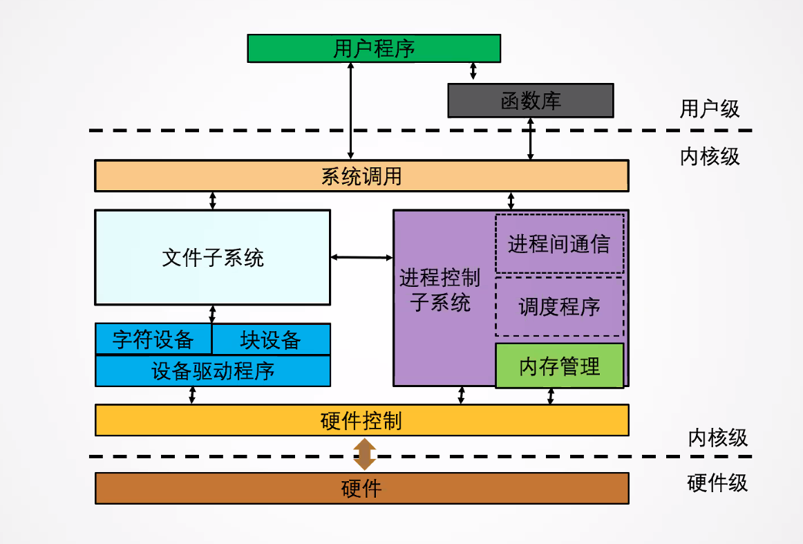


**操作系统Kernel特点**：

1. **并发**
   - 计算机系统中同时存在**多个运行的程序**，需要OS管理和调度
2. **共享**
   - **宏观上“同时”访问**
   - **微观上互斥共享**
3. **虚拟**
   - 利用多道程序设计技术，让每个用户都感觉有一个计算机专门为自己服务
4. **异步**
   - **程序的执行不是一贯到底，而是走走停停，向前推进的速度不可预知**
   - **只要运行环境相同，OS需要保证程序运行的结果也要相同**


## 1.2 x86-32硬件

> **运行模式**：
>
> **实模式**、**保护模式**、SMM模式和虚拟8086模式

- **实模式**：在计算机上面，实模式存在的时间非常之短，所以一般我们是感觉不到它的存在的。CPU复位（reset）或加电（power on）的时候就是以实模式启动，在这个时候处理器以实模式工作，不能实现权限分级，也不能访问20位以上的地址线，也就是只能访问1M内存（**物理地址 = 段基址<<4 + 段内偏移**）。之后一般就加载操作系统模块，进入保护模式。

- **保护模式**
  1. 支持**内存分页**机制，提供了对**虚拟内存**的良好支持
  2. 保护模式下80386支持**多任务**，还支持**优先级机制**，不同的程序可以运行在不同的优先级上。优先级分为0-3 4各级别，操作系统运行在最高的优先级0上，应用程序运行在较低的级别上。配合良好的检查机制，既可以在任务间实现数据的安全共享也可以很好地隔离各个任务。

- **通用寄存器**
  - EAX：累加器
  - EBX：基址寄存器
  - ECX：计数器
  - EDX：数据寄存器
  - ESI：源地址指针寄存器
  - EDI：目的地址指针寄存器
  - EBP：基址指针寄存器
  - ESP：堆栈指针寄存器
- **段寄存器**
  - CS：代码段
  - DS：数据段
  - ES：附加数据段
  - SS：堆栈段
  - FS/GS：附加段
- **指令寄存器**
  - EIP：EIP的低16位就是8086的IP，它存储下一 条要执行的指令的内存地址，在分段指令转换中，表示指令的段内偏移地址（CS: IP）
- **标志寄存器**
  - EFLAGS：可以存放IF（中断允许标志位），CF，PF，ZF等标志

## 1.3 计算机启动过程

- 刚开机时CPU处于实模式(和保护模型对应，实模式的CS:IP和保护模式不一样)
- 开机： `CS=0xFFFF, IP=0x0000` (CS是x86的**代码段寄存器**，IP是**指令指针寄存器**，CPU会从`CS<<4+IP`的内存地址开始读取指令并执行)
- 寻址`0xFFFF0`（ROM BIOS映射区 Basic Input Ouput System）
- 检查RAM，键盘，显示器，软硬磁盘
- 将磁盘0磁道0扇区（操作系统的引导扇区，512B）读入`0x7c00`处（0x7c00处存放的语句是 `mov ax, #BOOTSEG   mov ds, ax`，其中BOOTSEG=0x07c0）
- 设置`CS=0x07c0，IP=0x0000`（CS<<4+IP=0x7c00）

## 1.4 系统调用和中断

- **操作系统的接口**表现为函数调用，又由系统提供，所以称为**系统调用(System Call)**

### 1.4.1 系统调用
- 用户不能随意调用内核数据，不能随意jmp （否则可以看到root密码，修改等。。）
- 处理器的硬件隔离设计：通过**内核态和用户态**将内核程序和应用程序隔离，CS:IP是当前指令，用**CS的最低两位来区分内核态和用户态**：0是内核态，3是用户态。当 `DPL >= CPL` 和  `DPL >= RPL` 时才能实现调用和跳转。**为了避免用户程序错误地使用特权指令，保护操作系统不被用户程序破坏**
  - **`CPL`**：**当前进程的特权级(Current Privilege Level)**。它被存储在**段寄存器的低两位**上。通常情况下，CPL代表代码所在的段的特权级。当程序转移到不同特权级的代码段时，处理器将改变CPL。只有0和3两个值，分别表示内核和用户态
  - **`DPL`**：**目标段的特权级(Descriptor Privilege Level)**。它被存储在**段描述符(GDT，LDT表项)或者门描述符的DPL字段**中，当当前代码段试图访问一个段或者门（这里大家先把门看成跟段一样，下面我们会介绍），DPL将会和CPL以及段或者门选择子的RPL相比较，根据段或者门类型的不同，DPL将会区别对待
  - **`RPL`**：**进程对段访问的特权级(Request Privilege Level)**。它被存储在**段选择子的低两位**上。每个段选择子有自己的RPL，它说明的是进程对段访问的请求权限，有点像函数参数。而且RPL对每个段来说不是固定的，两次访问同一段时的RPL可以不同。RPL可能会削弱CPL的作用，例如当前CPL=0的进程要访问一个数据段，它把段选择子中的RPL设为3，这样它对该段仍然只有特权为3的访问权限。
  - 当进程访问一个段时，需要进程特权级检查，一般要求 `DPL >= max {CPL, RPL}`
    下面打一个比方，中国官员分为6级国家主席1、总理2、省长3、市长4、县长5、乡长6，假设我是当前进程，级别总理（CPL=2）,我去聊城市(DPL=4)考察,我用省长的级别(RPL=3 这样也能吓死他们:-))去访问,可以吧，如果我用县长的级别，人家就不理咱了(你看看电视上的微服私访，呵呵)，明白了吧！为什么采用RPL，是考虑到安全的问题，就好像*你明明对一个文件用有写权限，为什么用只读打开它*呢，还不是为了安全！

 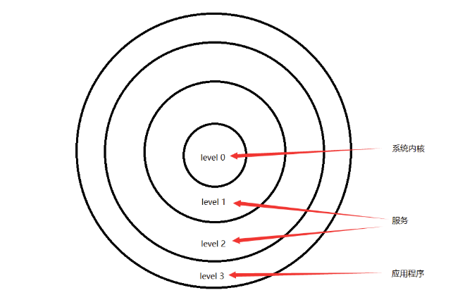

- 内核态可以访问任何数据，用户态不可以访问内核数据(通过比较CPL和DPL)
- 系统调用通过`陷阱机制(Trap)`完成。系统调用是中断的一种。中断是用户态进入内核态的唯一方式
- 当应用程序需要操作系统的某些操作时，比如读写文件，它就会执行系统调用，**将控制权传递给内核**，然后**内核执行被请求的操作并返回应用程序**


#### 系统调用的实现

*怎么*访问内核：**系统调用**，而系统调用是通过**中断**实现的，例如Linux下中断号 `int 0x80` 就是进行系统调用的

- 首先把系统调用号存放到`%eax`寄存器中

- 调用 `int 0x80`指令，该系统调用能*进入内核*并调用对应的 `system_call` 执行系统调用

  > **int 0x80中断的处理**
  >
  > 在进行`sched_init`初始化时，会调用`set_system_gate(0x80, &system_call)`设置中断号 `0x80` 中断处理：
  >
  > - 将 `idt[0x80]` 的对应表项的设置为`DPL = 3`，则**能够从用户态调用** `int 0x80`
  > - 将表项中的段选择符(CS)置为8，即*CPL = 0*，将处理函数入口点偏移(IP)置为 `&system_call`。这样就能够以足够的特权级跳到 `system_call` 去执行系统调用

- 在 `system_call`中会根据**系统调用号** `NR_write`查表 `_sys_call_table`（**存放了各个系统调用函数入口地址的数组**） 找到对应的系统调用处理函数的入口 `sys_write`

  > **_sys_call_table全局函数数组**
  >
  > `fn_ptr sys_call_table[] = {sys_setup, sys_exit, sys_fork, sys_read, sys_write,...};`
  >
  > `typedef int (fn_ptr*) ();`


### 1.4.2 中断


**整个操作系统就是一个中断驱动的死循环**，所有事情都是由操作系统提前注册的中断机制和其对应的中断处理函数完成的，当没有任何需要操作系统处理的事件时，他就停在死循环里


#### 硬中断的分类

有两种可以中断(动词)程序运行的办法：`中断(interrupts), 异常(exceptions)`。其中异常又可以分为：`故障(fault)、陷阱(trap)、中止(abort)`

**中断(interrupt)**：是一个 `异步事件`，通常由IO设备触发，比如点击鼠标、键盘

**异常(exception)**：异常是一个 `同步事件`，是CPU在执行指令时检测到的反常条件。比如除法异常、错误指令异常、缺页异常等

这两种机制殊途同归，**都是让CPU收到一个中断号**，然后处理

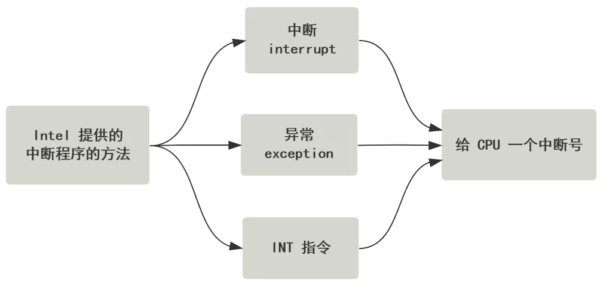

中断的三种方式：

1. **通过中断控制器给CPU的INTR引脚发送信号**，并且允许CPU从中断控制器的一个端口上读取中断信号，比如按下键盘一个按键，最终给CPU一个 0x21 的中断号

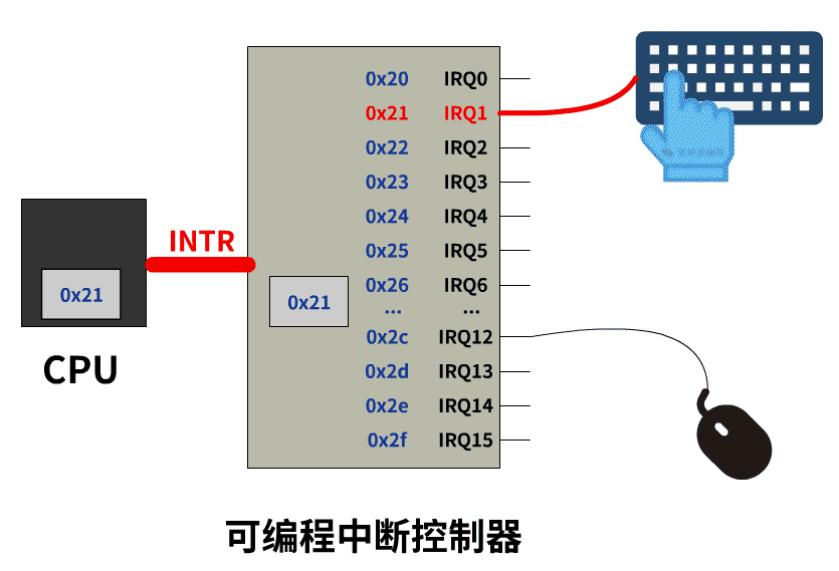


2. **CPU执行指令时发生了异常**，会自己触发并给自己一个中断号，比如收到了无效指令，CPU会给自己一个 0x06 中断号
3. **执行 INT n 指令**，会直接给CPU一个中断号 n，比如触发Linux系统调用，实际上就是执行了 `INT 0x80` 指令，那么CPU收到的就是一个 0x80 中断号

前两种通常又称为 **硬件中断**，第三种称为 **软件中断**


#### 硬中断的处理

CPU收到一个中断号 `n` 之后，就去 中断向量表 (`中断描述符表IDT`,IDTR寄存器中存放了IDT表的起始地址)中寻找第 n 个 `中断描述符`，从中断描述符中找到 `段选择子和段内偏移`，根据段选择子去 `全局描述符表GDT` 中寻找段描述符，从中取出`段基址`，根据段基址和段内偏移得到 `中断处理程序的入口地址`，从而执行（当然如果开启了分页，这个地址还要经过分页机制的转换才是最终的物理地址）

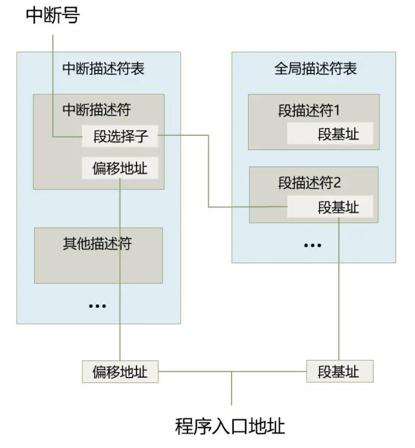

`中断描述符表IDT` 就是长度256的中断描述符的数组(中断描述符表)，对应 256 个中断号

```c
struct desc_struct idt_table[256] = { {0, 0}, };
struct desc_struct {
    unsigned long a,b;
};

// 初始化中断描述符表
void __init trap_init(void) {
    set_trap_gate(0, &divide_error);    // 除法异常
    ...
    set_trap_gate(6, &invalid_op);		// 非法指令异常
    ...
    set_intr_gate(14, &page_fault);		// 缺页异常
    ...
    set_system_gate(0x80, &system_call); // 系统调用
}
```


中断描述符具体还分好几个种类（ Linux 中几乎不用 Task Gate ）：

- `Task Gate`：任务门描述符
- `Interrupt Gate`：中断门描述符
- `Trap Gate`：陷阱门描述符

**中断门描述符和陷阱门描述符的区别仅仅是是否允许中断嵌套**

CPU如果收到中断号对应的是一个中断门描述符，就修改IF标志位，在中断处理程序执行期间 **屏蔽中断**，防止中断嵌套(也可以忍受设置IF标志打开中断，使得可以响应中断)。

而陷阱门不会修改这个标志位(保持IF位不变)，如果原来IF位是1，通过陷阱门转移到处理程序之后就允许进行中断的嵌套。

因此 **中断门最适合处理中断，陷阱门适合处理异常**


如果发生了用户态到内核态的变化，内核执行中断处理程序前，需要将用户栈的栈指针、寄存器、错误码等信息压入内核栈（方便中断处理程序执行结束后返回原来的代码），然后执行中断处理程序


#### 软中断

**硬件中断(INTR引脚触发，CPU自己触发)和软件中断(INT)都是硬中断**，是通过 CPU 这个硬件实现的中断机制（指的是实现机制，不是触发机制，触发可以通过外部硬件，也可以通过外部软件）

> 硬中断的原理就是 CPU 在每一个**指令周期的最后**，都会去检查以下是否有 **中断** 产生，有就把中断号取出，去中断向量表中寻找中断处理程序入口地址，然后执行

软中断是指，**纯粹由软件实现的一种类似中断的机制**，实际上是模仿硬件，在内存中由一个地方存储着软中断的标志位，然后由内核的一个线程不断轮询这些标志位，如果由哪个标志位有效，就再去寻找这个软中断对应的中断处理程序

> 软中断的原理是，有一个 **单独的守护进程**，不断 **轮询一组标志位**，如果哪个标志位有值了，就去这个标志位对应的 **软中断向量表数组** 的相应位置，找到 **软中断处理函数**，然后跳转过去


Linux启动后，会启动内核软中断处理的守护进程，这个进程就是不断的遍历 `pending` 这个软中断标志位的每一位，如果是1，就从 h 软中断向量表中找到对应元素，执行 `action` 方法，对应不同的软中断处理函数

```c
// 这就是软中断处理函数表（软中断向量表）
// 和硬中断的中断向量表一样
static struct softirq_action softirq_vec[32];

asmlinkage void do_softirq(void) {
    // h = 软中断向量表起始地址指针
    h = softirq_vec;
    // 这个是软中断标志位们，一次性拿到所有的软中断标志位
    pending = local_softirq_pending();
    do {
        // 此时的软中断标志位有值（说明有软中断）
        if (pending & 1) {
            // 去对应的软中断向量表执行对应的处理函数
            h->action(h);
        // 软中断向量表指针向后移动
        h++;
        // 同时软中断处理标志位也向后移动
        pending >>= 1;
    } while (pending);
}
```


#### 软中断的设置

只需要把 `local_softirq_pending()` 对应的标志位改成 1 就相当于触发了软中断了

```c
#define __raise_softirq_irqoff(nr) \
do { local_softirq_pending() |= 1UL << (nr); } while (0)   // 将该位置置1

static inline void __netif_rx_schedule(struct net_device *dev) {
    list_add_tail(&dev->poll_list, &__get_cpu_var(softnet_data).poll_list);
    // 发出软中断
    __raise_softirq_irqoff(NET_RX_SOFTIRQ);
}
```


软中断 **就是一组一位一位的软中断标志位，对应着软中断向量表中一个一个的中断处理函数，然后有个内核守护进程不断去循环判断调用**

然后由各个子系统调用 `open_softirq` 负责把软中断向量表赋值（函数地址放进去）

再由各个需要触发软中断的地方调用 `raise_softirq_irqoff(nr)` 修改对应中断标志位的值，表示设置中断

后面的工作就交给内核的软中断守护进程了，该进程遍历软中断标志位，找到对应的中断处理函数执行

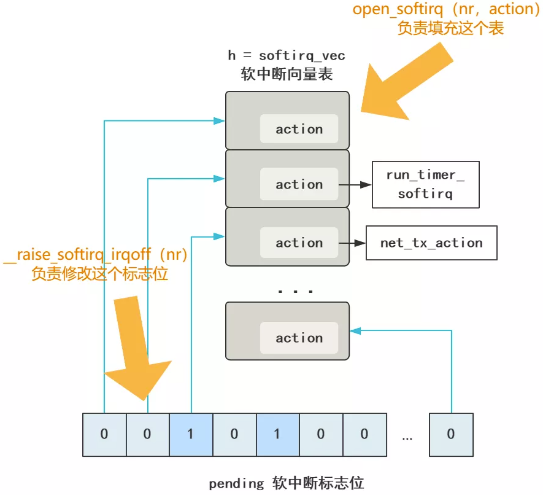


#### 软中断和硬中断的比较

**软中断是 Linux 处理一个中断的下半部的主要方式**，比如 Linux 某网卡接收了一个数据包，此时会触发一个 **硬中断**，由于处理数据包的过程比较耗时，而硬中断资源又非常宝贵，如果占着硬中断函数不返回，会影响到其他硬中断的响应速度，比如点击鼠标、按下键盘等。

所以一般 Linux 会把中断分成**上下两半部**分执行，上半部分处理最简单的逻辑，下半部分直接丢给一个软中断异步处理。


比如网卡收到了一个数据包，假如这个网卡型号是 e1000，那对应的硬中断处理函数是，**e1000_intr**

这个硬中断处理函数后面直接 `__raise_softirq_irqoff` 丢给软中断就不管了

```c
static irqreturn_t e1000_intr(int irq, void *data, struct pt_regs *regs) {
   __netif_rx_schedule(netdev);
}

static inline void __netif_rx_schedule(struct net_device *dev) {
    list_add_tail(&dev->poll_list, &__get_cpu_var(softnet_data).poll_list);
    __raise_softirq_irqoff(NET_RX_SOFTIRQ);
}
```


## 1.5 操作系统的抽象

操作系统有两个功能：防止硬件被失控的应用程序滥用；向应用程序提供简单一致的机制来控制复杂而又通常大不相同的低级硬件设备。操作系统通过下面三个抽象的概念来实现这两个功能：

文件是对IO设备的抽象、虚拟内存是对程序存储器的抽象、进程是对一个正在运行的程序的抽象、虚拟机是对整个计算机的抽象

1. **`进程`**：进程使得操作系统产生一种假象，**就像操作系统上只有这个程序在运行**。**程序看上去也是独占的使用处理器、内存和IO设备**。处理器看上去像是在不间断地一条一条执行程序中的指令，该程序的代码和数据是系统内存中途唯一的对象

2. **`虚拟内存`**：虚拟内存为每个进程提供一个假象，**就像每个进程都在独占的使用主存**，每个进程看到的内存都是一致的，`称为虚拟地址空间`。

   地址空间最上面的区域是保留给操作系统中的代码和数据的，地址空间底部存放用户进程定义的代码和数据。（从下到上是地址增大的）

   **地址空间的顶部区域是为内核保留的，不允许应用程序读写这个区域的内容或者直接调用内核代码定义的函数**，它们必须调用内核来执行这些操作

   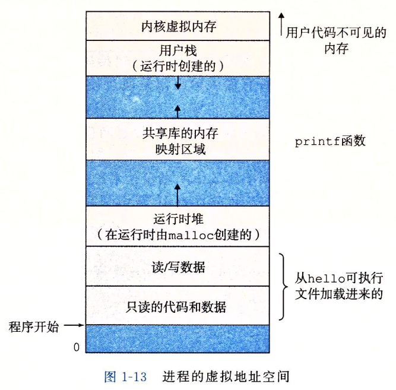

3. **`文件`**：文件就是字节序列，每个IO设备（磁盘、键盘、显示器、网络）都可以看成是文件，操作系统所有输入输出都是通过Unix IO的系统函数调用读写文件来实现的。**文件向应用程序提供了一个统一的视图，来看待系统中各种各样的IO设备**，一切皆文件

## 1.6 并发和并行

### 1.6.1 线程级并发

传统意义上的并发是一台计算机在它正在执行的进程间快读切换来模拟出来的，这是单核处理器系统，大多数实际的计算都是由一个处理器完成的

多处理器系统将多个`CPU(核)`集成到一个芯片上，**每个核都有自己的L1核L2高速缓存**

L1高速缓存分为两个部分：指令、数据

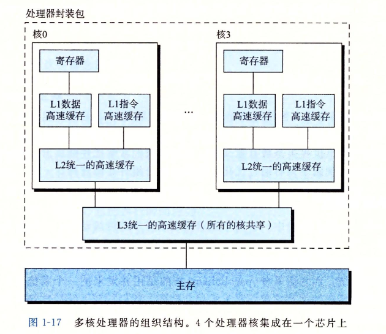

- **超线程**：又称为同时多线程(simultaneous multi-threading)，是一项允许一个CPU执行多个控制流的技术。它是基于CPU的某些硬件有多个备份来实现的，比如程序计数器和寄存器文件，而其他硬件部分只有一份，比如ALU，假设一个线程必须等待某些数据被装载到高速缓存，就可以去转而执行另一个线程。比如Intel的4核8线程，可以让每个核心执行两个线程。

  虽然采用超线程技术能够同时执行两个线程，当两个线程同时需要某个资源时，其中一个线程必须让出资源暂时挂起，直到这些资源空闲以后才能继续。因此，超线程的性能并不等于两个CPU的性能

- 超线程的出现，使得程序可以利用硬件进行线程级别的并行，使得程序的执行允许有更多的并行


### 1.6.2  指令级并行

现代处理器同时执行多条指令的属性就称为`指令级并行`，例如流水线技术。将执行一条指令所需要的活动划分为不同的步骤，有些步骤可以进行并行操作

大多数线代处理器都支持`超标量`操作：超标量就是比一个周期一条指令更快的执行速率


### 1.6.3 单指令、多数据并行

基于硬件的实现，可以**允许一条指令产生多个可以并行执行的操作**，这种方式称为单指令、都哟数据，即SIMD并行。最新的Intel和AMD处理器都具有并行对8对单精度浮点数做加法的指令


## 1.7 程序和数据

机器对于数据的存放有两种：最低有效字节在最前面的称为小段法，最高有效字节在前面的称为大端法

例如对于0x01234567，最低有效字节是67，那么两种存放方式分别是：


**大部分Intel兼容机都使用了小端法存放数据**，而ARM处理器的硬件可以按小端或大端两种模式操作，但是Android和IOS都只能运行在小端模式


# 2. 进程和线程

进程的引入，只要是为了实现多道程序交替执行(并发)，所以需要在切换任务的时候修改PC寄存器的值，同时保存原程序的各种信息（从而引入了PCB）

## 2.1 进程
- **进程(Process)** 本质上就是操作系统执行的一个程序
- 计算机以**字节**作为`寻址的内存单位`，机器级程序将内存视为一个非常大的字节数组，称为`虚拟内存`，每个字节都有一个唯一的数字标识作为地址，所有可能的地址集合就成为`虚拟地址空间`。虚拟地址的范围取决于**`机器字长`**，例如32位字长机器的虚拟地址范围是  $0 到 2^{32} - 1$，因为虚拟地址空间是以字长来进行编码的
- 与每个进程相关的是`地址空间(address space)`，在这个地址空间中，进程可以进行读写操作，地址空间中存放了可执行程序，程序所需要的指令和数据
- 与一个进程有关的所有信息，除了进程自身地址空间的内容外，均存放在操作系统的一张表中，成为`进程表(process table)`，进程表是数组或者链表结构，每个进程都要占据其中一项
- 一个挂起的进程包括：进程的地址空间 和 对应的进程表项
- **地址空间：** 为了防止应用程序之间相互干扰，需要一些保护机制，虽然机制是在硬件中实现的，但是由操作系统进行控制。现代操作系统利用`虚拟内存`计数可以把部分地址空间装入内存，部分留在磁盘，来运行超过计算机主存的地址空间的进程
- 进程的虚拟地址空间分为用户虚拟地址空间和内核虚拟地址空间，**所有进程共享内核虚拟地址空间**，没有用户虚拟地址空间的进程称为内核进程

内存中的进程：

1. `只读的代码和数据`：代码从同一固定地址开始。进程一开始就被指定了大小
2. `运行时堆`：堆在运行时动态的扩展和收缩（malloc和free）
3. `用户栈`：编译器用栈来实现函数的调用，和堆一样在执行期间可以动态扩展和收缩，每次调用函数的时候栈就会增长，从一个函数返回的时候栈就会收缩


- 以 32 位机器为例，地址总线是32位，可寻址的最⼤内存空间是 $2^{32}$Bytes，即4GBytes。每⼀个运⾏的进程都可以获得⼀个4GB的逻辑地址空间，这个空间被分成两个部分： 内核空间和⽤户空间，其中⽤户空间分配到从0x00000000到0xC0000000共3GB的地址，⽽内核空间分配了0xC0000000到0xFFFFFFFF⾼位的1GB地址


### 2.1.1 进程模型
- 在进程模型中，所有计算机上运行的软件，包括操作系统，被组织为若干`顺序进程(sequential process)`，简称为进程。一个进程就是一个正在执行的程序的实例
- 从概念上来说，每个进程都有自己的虚拟CPU(实际上是CPU在各个进程之间进行来回切换)。**进程包括程序计数器、寄存器和变量当前值**


### 2.1.2 进程创建/子进程

**系统启动的时候，会创建一个1号进程，是所有其他进程的祖先，直到关机才被终止**

进程创建的四种方式：
1. **系统初始化(init)：** 启动操作系统时，通常会创建若干个进程。前台进程，后台进程，守护进程。`ps`可以查看正在运行的进程
2. **系统调用创建：** 一个正在运行的进程通过`系统调用(如fork)`来创建一个或多个新进程来帮助其完成工作
3. **用户请求创建：** 启动程序
4. **批处理创建：** 在`大型的批处理系统`中，用户提交批处理作业，操作系统创建一个新的进程并从其中的输入队列中运行下一个作业

UNIX和Win32的系统调用表


#### 子进程


- **fork()函数有返回值：** 如果创建子进程成功，对于父进程的返回值是子进程的pid，对于子进程的返回值是0，创建失败则返回-1
- 父进程如果不wait子进程，直接结束，子进程就变成孤儿进程，被pid=1的进程接管
~~~c
int main(int argc, char const* argv[])
{
  pid_t pid;  //父进程pid
  pid_t cid;  //子进程pid
  printf("我是父进程，我的pid是:%d\n", getpid());
  
  cid = fork();
  if(cid==0){ //子进程执行
    printf("我是子进程，我的pid是%d，我看到的fork返回值是%d\n", getpid(), cid);
  }else{
    printf("我是父进程，我的pid是%d, 我看到的fork返回值是%d\n", getpid(), cid);
  }
  pause();
  return 0;
}

//我是父进程，我的pid是:18619
//我是父进程，我的pid是18619, 我看到的fork返回值是18620
//我是子进程，我的pid是18620，我看到的fork返回值是0

~~~

- 进程创建之后，**父进程和子进程有各自不同的地址空间（数据空间是独立的拷贝，代码空间是相同的）**，如果其中一个进程在其地址空间修改了一个值，这个修改对另一个进程是不可见的
- 在UNIX中，**子进程的地址空间是父进程的一个拷贝**，**但是却是两个不同的地址空间**。**不可写的内存区域是共享的**。或者子进程共享父进程的所有内存，但是是通过`写时复制(copy-on-write)`共享的，一旦某个进程要修改部分内存，这块内存首先就要被复制，以确保修改发生在私有内存区域。**可写的内存是不能被共享的**。
- 在Windows中，从一开始父进程的地址空间和子进程的地址空间就是不同的


#### 写时复制 copy-on-write

父进程P1调用fork函数创建一个子进程P2，Linux子进程完全复制了父进程的地址空间，复制了页表，但是没有复制物理页面（共享的）。

父子共享的页面会标记为**只读**(类似mmap的private方式)，如果子进程P2要对共享的页面执行**写操作**，这时内核会复制一个物理页面给P2使用，同时修改页表，把原来的只读页标记为**可写**，留给P1使用。这就是**写时复制**


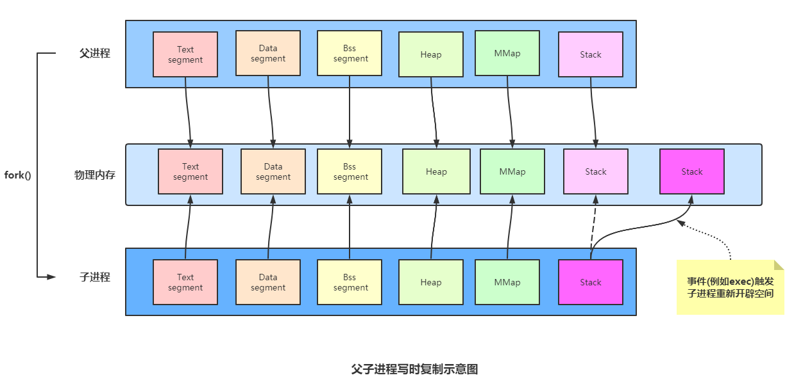


**内核一般会优先调度fork出来的子进程**，这时因为很多情况下fork子进程是要马上执行`exec`，会清空栈、堆 这些和父进程共享的空间，加载新的代码段。这就避免了写时复制拷贝共享页面的机会。如果父进程先调度，很可能写共享页面，会产生写时复制的无用功。所以一般都是子进程先调度


### 2.1.3 进程终止
1. **正常退出(自愿)：** 由于完成工作而终止，当编译器完成所给定程序的编译后，会执行一个系统调用告诉操作系统它完成了任务。UNIX中是`exit`，Windows中是`ExitProcess`
2. **错误退出(自愿)：** 执行时遇到错误，声明错误并退出
3. **严重错误(非自愿)：** 执行时遇到严重错误，操作系统终止进程 
4. **被其他进程杀死(非自愿)：** 其他进程执行系统调用告诉操作系统杀死某个进程。UNIX中是`kill`，Windows中对应函数是`TerminateProcess`(不是系统调用)

**UNIX进程体系：** 进程和它的所有子进程以及子进程的子进程共同组成一个进程组。如UNIX启动后，整个操作系统中所有的进程都隶属于一个以`init`为根的进程树

### 2.1.4 进程的状态
- 一般而言，每个进程至少应处于三种基本状态之一：就绪态(Ready)、运行态(Running)、阻塞态(Block)

1. 运行态：进程实际占用cpu时间片运行时
2. 就绪态：可运行，但是因为其他进程正在运行而处于就绪态
3. 阻塞态：除非某种事件时间发生，否则进程不能运行。**阻塞是运行时的进程主动进行的**

### 2.1.5 进程切换时机

**进程何时离开cpu（进程切换时机）：**

1. 内部事件：主动放弃(`yield`)CPU，进入到`阻塞/终止`状态。例如使用IO设备，或者(非)正常结束
2. 外部事件：进程被剥夺CPU的使用权，进入到`就绪`态，这个动作叫`抢占(preempt)`。例如时间片用完，高优先权进程到达


- 系统调用触发中断时，进程用户态的栈就保存在系统栈中，进入内核态处理完后再恢复用户态的栈。如果是因为时钟中断导致进程被切换，进程的现场就保存在PCB中

- 进程切换时，会将原进程的数据保存到`进程控制块(Process Control Block)`中 ，PCB主要包含下面的内容：
  - **进程状态**
  - **进程优先级**
  - **进程标识符**PID
  - **程序和数据对应地址**
  - **进程打开的资源列表(io设备，文件等)**
  - **CPU现场信息(寄存器)**
  - 进程所在状态PCB队列的**下一个进程PCB首地址**
  - 其他信息：占用CPU时间等等

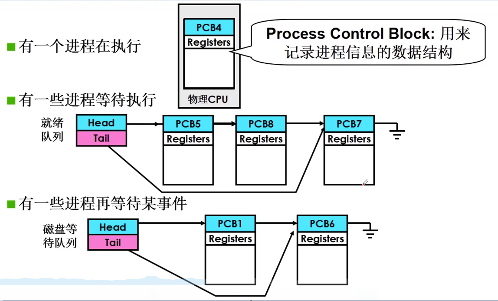

- **进程队列是PCB的队列，而不是整个进程上下文**
- 进程上下文(Process Context)：


**PCB中的信息：**

进程标识符：标识一个进程(内核pid和用户pid)


**进程调度** 指的是，**决定哪些进程优先被运行和运行多久**，由操作系统的`调度器(scheduler)`执行
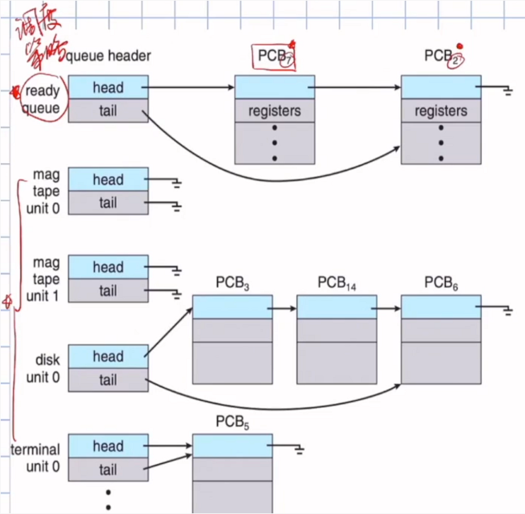]

### 2.1.6 进程的切换过程
操作系统为了执行进程间的切换，会维护一张`进程表(Process Table)`，每个进程占用一个表项，表项包括了进程状态的重要信息：**程序计数器、堆栈指针、内存分配状况、所打开文件的状态、账号、调度信息、其他由运行态转换到阻塞或就绪态所需要保存的信息**，从而保证改进程随后能再次启动，就像没有中断过一样

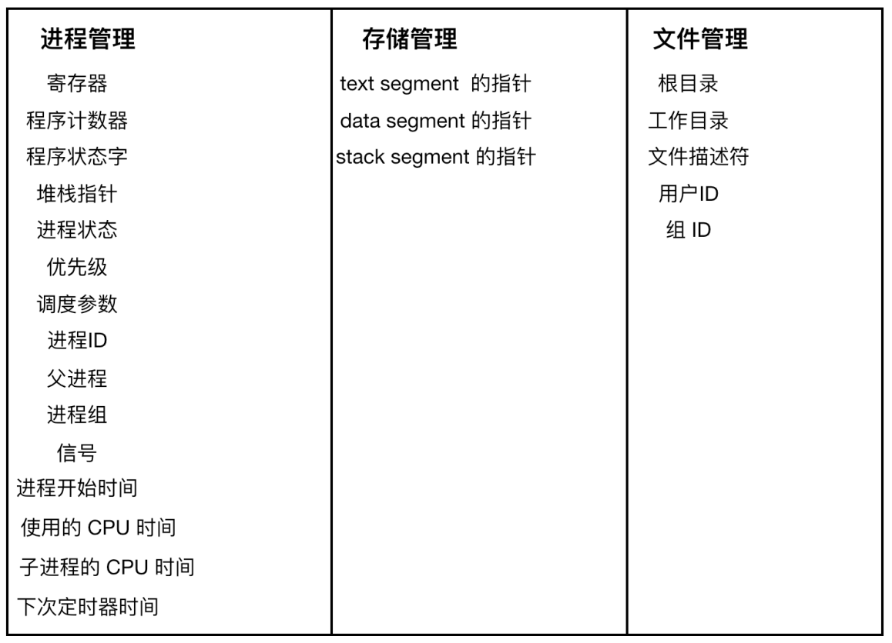


- **进程切换的时机：** `主动`(启动IO设备)，`被动`(高优先级进程，CPU时间片用完)。进程切换时会发出中断信号，进行用户态到内核态的切换，执行中断处理程序，再切换回用户态执行另一个进程。
- **进程切换过程：** 
  1. 修改当前进程PCB的`状态值`，保存执行现场到PCB
  2. 将被中断进程PCB加入到**相应的状态队列** 
  3. 通过调度算法，调度新的进程并恢复它的上下文信息（修改现场为新PCB中的值）


### 2.1.8 关于中断


- **中断：** CPU在正常执行程序时，由于内部/外部事件的触发或由程序预先设定而引起的CPU暂时中止当前正在执行的程序，保存当前程序相关信息到栈中，转而执行中断服务子程序，待执行完中断服务子程序后，CPU再获取被保存到栈中的被中断程序的信息，从而继续执行被中断程序的过程
- **外中断(Interrupt)：** 来自外部事件触发的中断。如**键盘中断，外围设备中断**。外部中断均是`异步中断(随机中断)`
- **内中断(Exception)：** 来自内部事件触发的中断，就是异常。如硬件异常(掉电)，**程序异常**(非法操作，除0等)，**系统调用**。内部中断都是`同步中断`
- **模式切换：** 不管是外中断还是内中断都会进行用户态到内核态的切换，用户态到内核态的切换也只能通过`中断`进行。内核态到用户态通过`LPSWS指令`(恢复现场)切换
- **中断向量：** 中断服务程序的入口地址
- **中断向量表：** 中断类型码到对应中断向量的映射表
- **中断处理过程：** 请求中断→响应中断→关中断→保护断点→中断源识别→保护现场→开中断→中断服务程序→关中断→恢复现场→开中断→中断返回

中断处理和调度的过程：
1. 硬件压入堆栈：程序计数器、程序状态字、寄存器值
2. 硬件从中断向量装入新的程序计数器
3. 汇编语言过程：保存寄存器的值
4. 汇编语言过程：设置新的堆栈
5. C中断服务器运行(典型的读和缓存写入)
6. 调度器决定下面哪个程序先运行
7. C过程返回值汇编代码
8. 汇编语言过程：开始执行新的当前程序


### 2.1.9 孤儿进程和僵尸进程

在unix/linux中，正常情况下，子进程是通过父进程创建的，子进程再创建新的进程。子进程的结束和父进程的运行是一个异步过程,即父进程永远无法预测子进程 到底什么时候结束。 当一个 进程完成它的工作终止之后，内核释放该进程所有的资源,包括打开的文件,占用的内存等。 但是**仍然为其保留一定的信息**(包括`进程号`the process ID,`退出状态`the termination status of the process,`运行时间`the amount of CPU time taken by the process等)，直到它的父进程需要调用`wait()`或者`waitpid()`系统调用取得子进程的终止状态时才释放。这就是引入僵死状态的原因：尽管从技术上来说进程已死，但必须保存它的描述符，直到父进程得到通知。 

**如果进程不调用wait / waitpid的话，** **那么保留的那段信息就不会释放，其进程号就会一直被占用**

如果该子进程退出的时候父进程已经结束了，就不会变成僵尸进程。因为每个进程结束的时候，系统都会扫描当前系统中所运行的所有进程，看看有没有哪个 进程是刚刚结束的这个进程的子进程，如果是的话，就由Init进程来接管他，成为他的父进程，从而保证每个进程都会有一个父进程。而Init进程会自动 wait其子进程，因此被Init接管的所有进程都不会变成僵尸进程。


**孤儿进程**：一个父进程退出，而它的一个或多个子进程还在运行，那么那些子进程将成为孤儿进程。孤儿进程将被init进程(进程号为1)所收养，即称为init进程的子进程，然后由init进程对它们完成状态收集工作。

- 孤儿进程是没有父进程的进程，孤儿进程的回收交给init进程，init负责善后，init会循环地`waite()`它已经退出的子进程。因此孤儿进程不会有什么危害

**僵尸进程**：一个进程使用fork创建子进程，如果子进程退出，而父进程并没有调用wait或waitpid获取子进程的状态信息，那么子进程的进程描述符仍然保存在系统中。这种进程称之为僵尸进程。

- **任何一个子进程(init除外)在exit()之后，并非马上就消失掉，而是留下一个称为僵尸进程(Zombie)的数据结构，等待父进程处理**
- 如果子进程在exit()之后，父进程没有来得及处理，这时用ps命令就能看到子进程的状态是“Z”。如果父进程能及时 处理，可能用ps命令就来不及看到子进程的僵尸状态，但这并不等于子进程不经过僵尸状态
- 如果父进程在子进程结束之前退出，则子进程将由init接管。init将会以父进程的身份对子进程进行处理
- **如果父进程不调用wait / waitpid的话，** 那么系统保留的子进程那段相关信息就不会释放，其进程号就会一直被占用，但是系统所能使用的进程号是有限的，如果大量的产生僵死进程，将因为没有可用的进程号而导致系统不能产生新的进程. 此即为僵尸进程的危害，应当避免


当系统中出现了僵尸进程时，我们是**无法通过 kill 命令把它清除掉**的。但是我们**可以杀死它的父进程**，让它变成孤儿进程，并进一步被系统中管理孤儿进程的进程收养并清理。


## 2.2 线程
- 创建子进程即使是完成很小的任务，也要完全拷贝进程上下文，浪费了资源。于是有了线程
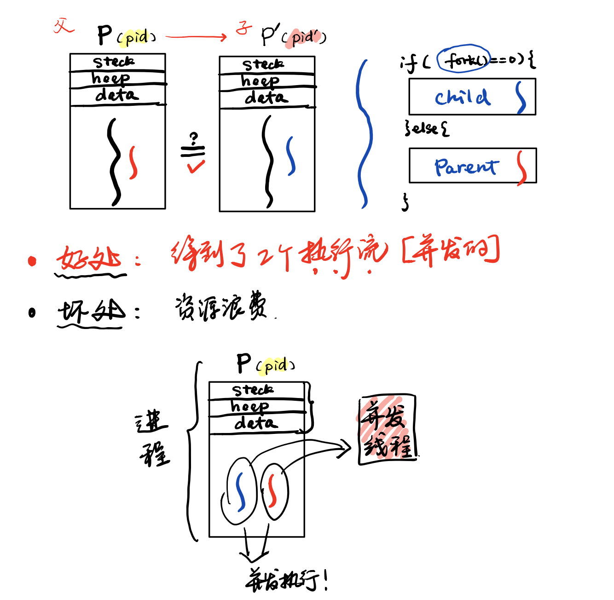
- 多线程之间会**共享同一块地址空间和所有可用数据**，这是进程所不具备的
- 线程比进程更轻量级，创建线程比创建进程快10-100倍
- 进程切换开销较大(保存和恢复现场)
- 线程间通信比进程间通信效率更高
- 对CPU密集型任务，多线程并不能获得性能上的增强，反而会因为过多的多任务切换降低效率，所以计算密集型任务同时进行的数量应当等于CPU核心数。但是对I/O密集型任务，多线程能在活动中彼此重叠进行，加快应用程序的执行速度

IO密集型任务执行期间，99%的时间都花在IO上，花在CPU上的时间很少，因此，用运行速度极快的C语言替换用Python这样运行速度极低的脚本语言，完全无法提升运行效率。对于IO密集型任务，最合适的语言就是开发效率最高（代码量最少）的语言，脚本语言是首选，C语言最差

### 2.2.1 经典线程模型
- 同一个进程中的所有线程都会有完全一样的地址空间，这意味着他们也共享同样的全局变量。一个线程可以读取、写入甚至擦除另一个线程的堆栈。线程之间除了共享同一内存空间外，还具有如下不同的内容：


传统进程有一个单独的线程


多线程时，**每个线程独有的**：栈、寄存器、线程状态、程序计数器、线程优先级

多线程时，**多个线程共享的**：地址空间、代码段、数据段、堆、打开的文件


线程的系统调用：
线程通常从当前的某个单线程开始，通过调用库函数`thread_create`来创建新的线程，指定线程名称   
当线程完成工作之后，调用函数`thread_exit`退出，紧接着而线程消失，状态变为终止，不能再调度。某些线程运行过程中可以通过调用`thread_join`来阻塞线程，直到等待的另一个线程退出。还可以通过`thread_yeild`自动放弃CPU，让其他线程运行。


### 2.2.2 在用户空间实现线程

> 在**早期**的操作系统中，所有的线程都是在用户空间下实现的，操作系统只能看到线程所属的进程，而不能看到线程。
>
> 在这种模型下，我们需要**自己定义线程的数据结构、创建、销毁、调度和维护等**，这些线程运行在操作系统的某个**进程**内，然后**操作系统直接对进程进行调度**

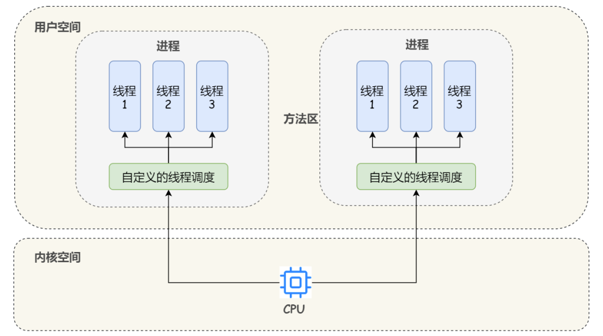

- **优点**：
  1. **无需内核支持**，即使操作系统不支持线程，我们也可以通过库函数来支持线程
  3. 创建和销毁线程、线程切换代价等**线程管理的代价比内核线程小得多**, 因为保存线程状态的过程和调用程序都只在用户态完成，无需用户态与内核态切换
  4. 允许每个进程**定制自己的调度算法**，线程管理比较灵活。这就是必须自己写管理程序，与内核线程的区别
- **缺点**：
  1. 因为**内核无法感知多线程的存在**，一个用户级线程的阻塞将会引起整个进程的阻塞（或者执行耗时长的操作，也有这个问题）
  2. 资源分配按照进程进行，多个处理机下，**同一个进程中的线程只能在同一个处理机下分时复用**，不能利用多核性能


### 2.2.3 在内核空间实现线程

> 所谓**内核级线程就是运行在内核空间的线程**， 直接由内核负责，只能由内核来完成线程的调度。
>
> 几乎所有的**现代**操作系统，包括 Windows、Linux、Mac OS X 和 Solaris 等，都支持内核线程。

每个内核线程可以视为内核的一个分身，这样操作系统就有能力同时处理多件事情，**支持多线程的内核就叫做多线程内核**（Multi-Threads Kernel）

我们可以直接使用操作系统中已经内置好的线程，**线程的创建、销毁、调度和维护等，都是直接由操作系统的内核来实现**，我们只需要使用系统调用就好了，不需要像用户级线程那样自己设计线程调度等。

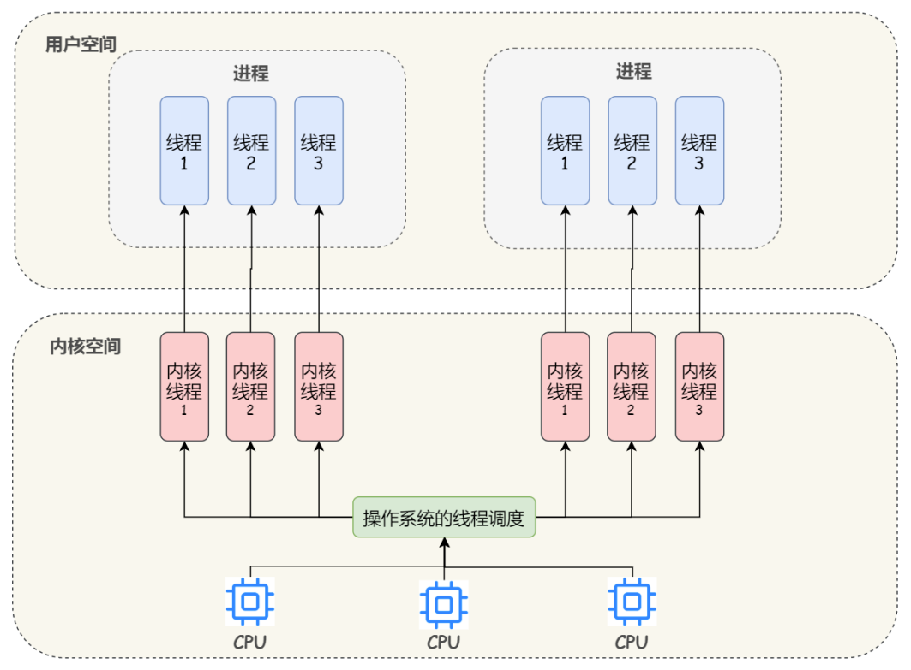

上面这个图是 1：1 的线程模型，所谓线程模型，就是用户线程和内核线程的关联方式


#### 多对一模型

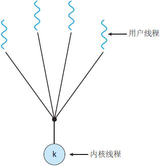

- 多个用户线程映射到某一个内核线程上
- **线程管理和调度由用户空间中的线程库处理**
- 如果进行了阻塞系统调用，那么会导致整个进程**阻塞**
- 单个内核线程只能在单个CPU运行，所以多对一模型**不能利用多核性能**

多对一模型虽然允许开发人员创建任意多的用户线程，但是内核一次只能调度一个线程，所以并没有增加并发性，现在几乎没有使用这个模型了


#### 一对一模型

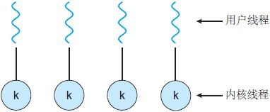

- 又叫 **内核级线程**
- 一个用户线程对应一个内核线程，**内核负责每个线程的调度**，可以调度到其他处理器上
- 管理 **开销大**，限制了可以创建的线程数

虽然一对一模型提供了更大的并发性，但是开发人员也不能在应用程序内创建太多的线程，因为管理一对一模型的开销很大。

Windows和Linux都实现了线程的一对一模型


#### 多对多模型

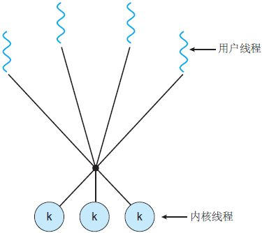

- 又叫 **两级线程模型**，它是博采众长之后的产物，充分吸收了前两种模型的优点，且尽量规避了他们的缺点
- 用户线程和内核线程是 `M:N`（通常 M >= N）的映射模型，**用户可以创建任意多的线程**
- **一个进程可以与多个内核线程关联** ，进程内的多个用户线程可以绑定不同的内核线程（类似一对一模型）
- 进程内的用户线程并不与内核线程一一绑定，而是可以**动态绑定内核线程**！当某个内核线程因为绑定的用户线程的阻塞操作被内核调度让出CPU时，其关联的进程中其余用户线程可以重新与其他内核线程绑定运行，所以阻塞的系统调用不会阻塞整个进程

所以多对多模型既不是多对一模型那种完全靠自己调度的也不是一对一模型完全靠操作系统调度的，而是 **中间态（自身调度与系统调度协同工作）**，因为这种模型的高度复杂性，操作系统内核开发者一般不会使用，所以更多时候是`作为第三方库的形式出现`


#### 线程库

**线程库就是为开发人员提供创建和管理线程的一套API**

线程库不仅可以在用户空间中实现，还可以在内核空间中实现

用户空间实现的线程库，没有内核的支持

内核空间实现的线程库涉及系统调用，也就是说调用库中的一个API函数会导致对内核的系统调用，并且需要具有线程库支持的内核


线程库：

1. POSIX Pthreads：可以作为用户或内核库提供，作为POSIX标准的扩展
2. Win32线程：用于Windows操作系统的内核级线程库
3. Java线程：Java线程API通常采用宿主系统的线程库来实现。也就是说在win系统上，Java线程API采用Win API实现；在Unix类系统上，采用Pthread来实现

> 事实上，**在 JDK 1.2 之前**，Java 线程是基于称为 "绿色线程"（Green Threads）的用户级线程实现的，也就是说程序员大佬们为 JVM 开发了自己的一套线程库或者说线程管理机制。
>
> 而**在 JDK 1.2 及以后**，JVM 选择了更加稳定且方便使用的**操作系统原生的内核级线程**，通过系统调用，将线程的调度交给了操作系统内核。而对于不同的操作系统来说，它们本身的设计思路基本上是完全不一样的，因此它们各自对于线程的设计也存在种种差异，所以 JVM 中明确声明了：**虚拟机中的线程状态，不反应任何操作系统中的线程状态**。
>
> 现今 Java 中线程的本质，其实**就是操作系统中的线程**，其线程库和线程模型很大程度上依赖于操作系统（宿主系统）的具体实现，比如在 Windows 中 Java 就是基于 Wind32 线程库来管理线程，且 Windows 采用的是一对一的线程模型


- POSIX是IEEE的标准，为了使程序可移植。线程被定义为`Pthreads`，大部分的UNIX系统都支持它。

> POSIX线程 （通常称为pthreads）是一种独立于语言而存在的执行模型，以及并行执行模型。它 允许程序控制时间上重叠的多个不同的工作流程。每个工作流程都称为一个线程，可以通过调用 POSIX Threads API来实现对这些流程的创建和控制。可以把它理解为线程的标准。

| 线程调用             | 描述                           |
| -------------------- | ------------------------------ |
| pthread_create       | 创建线程                       |
| pthread_exit         | 结束线程                       |
| pthread_join         | 等待一个特定线程退出           |
| pthread_yield        | 释放CPU，给其他线程运行机会    |
| pthread_attr_init    | 创建并初始化一个线程的属性结构 |
| pthread_attr_destory | 删除一个线程的属性结构         |


#### 用户栈和内核栈

**内核级线程与用户级线程的实现主要不同之处** ：内核级线程拥有 **两个栈** `（用户栈 + 内核栈）`

**内核栈**：linux一但创建进程就会立刻分配8K，两个页框用来存放内核栈和 thread_info。当进程在用户空间运行时，堆栈寄存器的内容就是用户堆栈地址，反之是内核堆栈地址。

- **进程用户栈和内核栈的切换**：当进程由于`中断`或`系统调用`从用户态转换为内核态时，进程所使用的**栈也要从用户栈切换到内核栈**。系统调用实质就是通过指令产生中断（软件中断）。进程由于中断而陷入到内核态，进程进入内核态之后，首先**把用户态的堆栈地址保存在内核态堆栈中**，然后**设置堆栈寄存器地址为内核栈地址**，这样就从用户栈转换成内核栈。

- **进入内核态时，去哪里找内核栈指针**：首先我们需要明确一点：**每当进程从用户态切换到内核态时，内核栈总是空的**。当进程在用户态执行时，使用的是用户栈，切换到内核态运行时，内核栈保存的是进程在内核中运行的相关信息。重回到用户态时，内核栈中保存的信息全部恢复，因此，进程从用户态切换到内核态时，内核栈总是空的。

  弄清楚了每次进程切换到内核态时内核栈总是空的，那上述问题就很好解决了，用户态切换到内核栈时，因为内核栈是空的，只需**将栈寄存器值设置成内核栈栈顶指针**即可。
  
- 当进程从内核态恢复到用户态时，**把内核中保存的用户态堆栈的地址恢复到堆栈指针寄存器即可**。这样就实现了内核栈到用户栈的转换。


> 注意：陷入内核栈时，如何知道内核栈的地址呢？ 进程由用户栈到内核栈转换时，进程的内核栈总是空的。每次从用户态陷入内核时，得到的内核栈都是空的，所以在进程陷入内核时，直接把内核栈顶地址给堆栈指针寄存器即可。

## 2.3 调度算法
- 操作系统有一个程序叫做`调度程序(scheduler)`，当多个线程竞争CPU时间片时，调度程序来选择具体执行哪个线程，该程序使用的算法叫做`调度算法(scheduling algorithm)`

### 2.3.1 调度介绍

**CPU密集型和I/O密集型进程**

- 大多数进程需要的cpu时间都很少
- `CPU密集型(CPU-bound)`或`计算密集型(compute-bound)` 占用CPU时间片长，IO频率低
- `I/O密集型(I/O-bound)` 占用cpu时间片短，IO频率高


**何时调度**：

1. **创建新进程**：需要决定运行父进程还是子进程
2. **进程退出**：必须做出调度策略
3. **进程阻塞**：进程在I/O和信号量上或由于其他原因阻塞时，必须选择另一个进程运行
4. **I/O中断**：必须做出调度策略

5. **时钟中断**：在每个或每k个时钟中断时做出调度策略。根据如何处理时钟中断，可以把调度算法分为两类：
   - **非抢占式调度**：挑选一个进程获得CPU资源，进程会一直占用到**终止或者阻塞状态**。这样在时钟中断发生时不会进行调度
   - **抢占式调度**：挑选一个进程运行某个固定时段的**最大值**。如果在该时段结束时，该进程仍在运行，它就被挂起，而调度程序挑选另一个进程运行。这样**需要在时间间隔的末端发生`时钟中断`**，以便把CPU控制返回给调度程序。如果没有可用的时钟，非抢占式调度就是唯一的选择


**调度算法的目标**：

- **吞吐量**：系统每小时完成的作业数量
- **周转时间**：从一个作业提交时刻开始直到该作业完成时刻为止的统计平均时间
- **响应时间**：从发出命令到得到响应之间的时间


**如何做到均衡性**：调度算法应该做到**折中**和**综合**，同时还应该尽量**简单**

- 吞吐量和响应时间的矛盾：响应时间小 — 切换次数多 — 系统内耗大 — 吞吐量小

- 前台任务和后台任务关注点不同：前台任务往往更关注响应时间，而后台时间往往更关注周转时间

- IO约束型任务和CPU约束型任务关注点不同


### 2.3.2 调度策略
- 没有最好最坏，寻求的是一个平衡
- 长程调度(Program到Process)，短程调度(Process到CPU)，中程调度(虚拟内存)
- 很多长程调度策略和短程调度是类似的

#### 抢占 vs 协作

调度可以分为抢占式和协作式

**非抢占式：** 一旦将调度资源分配给某个任务后，便让该任务一直执行，直到该任务完成或阻塞或主动让出CPU，非抢占调度又叫**协作式调度**，实现简单，对共享资源的访问更加安全，如FIFO，SJF

**抢占式：** 抢占式允许调度程序根据某种规则，剥夺当前进程的调度资源，将其分配给其他进程。常见的抢占策略有：基于**时间片**、基于**优先级**、**轮转和优先级抢占结合**（相同优先级使用轮转，不同优先级使用优先级）


#### 先来先服务 

First-Come, First-Served(FCFS)

- 通过就绪队列来实现
- FCFS意味着一个程序会一直运行到结束(尽管其中会出现等待I/O的情况)

特点：`简单易行`，但是短作业处在长作业后面会导致等待时间很长

#### 最短作业优先 

Shortest Job First(SJF)

- 每次选择所需CPU时间最短的进程
- 非抢占式
- 也可以修改位抢占式(最短剩余时间优先)

#### 最短剩余时间优先 

Shortest Remaining Time First(SRTF)

- 抢占式

SJF和SRTF特点：总是将短进程移到长进程之前，`平均等待时间最少`，被证明是**最优的**。但是会导致饥饿现象(长进程可能长时间无法获得CPU)，不公平。
该算法很难实现！因为很难预测作业需要的CPU时间！

#### 时间片轮转 

Round-Robin(RR)

- 每个进程都可以得到相同的CPU时间片，当时间片到达，进程被剥夺CPU，并加入到就绪队列的尾部
- 是`抢占式`调度算法

特点：`公平`，将固定的时间片设置得太短会导致过多的进程切换并降低CPU效率，但设置太长会导致一个短请求很长时间得不到响应。一般切换时间是10-100ms之间，上下文切换时间是0.1~1ms(约1%的开销)。当时间片取值无穷大时变退化为FCFS

#### 优先级调度 

Priority

- 每个进程被赋予一个**优先级**
- Linux中，0为最高优先级
- 下一次调度总是选择**优先级最高的可运行进程**运行，为了防止低优先级进程产生饥饿现象，需要偶尔**对进程优先级进行调整**：
  - 每个时钟中断降低当前进程的优先级
  - 给每个进程额外赋予一个允许运行的最大时间片，时间片到了之后次高优先级的进程便获得了运行机会
- SJF是优先级调度的一个特例(时间越短优先级越高)
- 可以是抢占式，也可以是非抢占式
- **静态优先级：** 优先级保持不变，会出现饥饿现象(不公平)
- **动态优先级：** 随着进程占用CPU时间的增加，优先级慢慢降低。或者随着进程在就绪队列中等待的时间增加，优先级慢慢提高

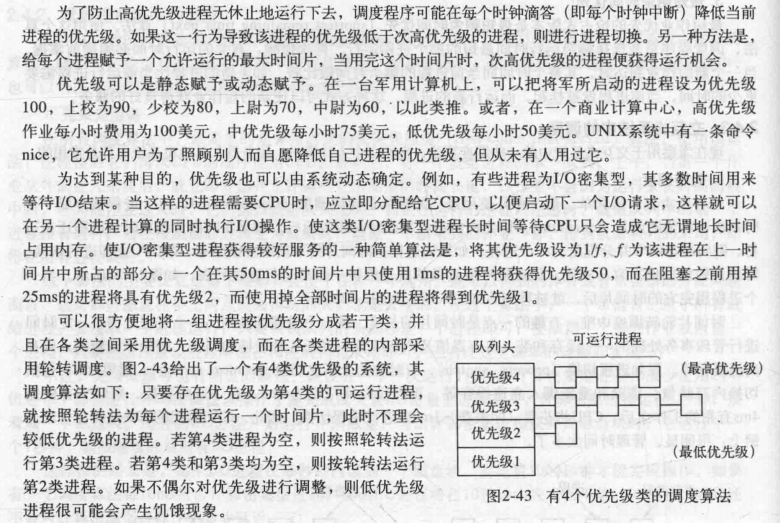

## 2.4 Linux进程调度

### 2.4.1 基本概念

#### 1. 进程和线程

- 在Linux内核中，进程和线程都使用`task_struct`结构来进行抽象描述
- 进程的虚拟地址空间分为用户虚拟地址空间和内核虚拟地址空间，**所有进程共享内核虚拟地址空间**，没有用户虚拟地址空间的进程称为内核进程

Linux内核使用`task_struct`结构来抽象，该结构包含了进程的各类信息及所拥有的资源，比如进程的状态、打开的文件、地址空间信息、信号资源等等。`task_struct`结构很复杂，下边只针对与调度相关的某些字段进行介绍。

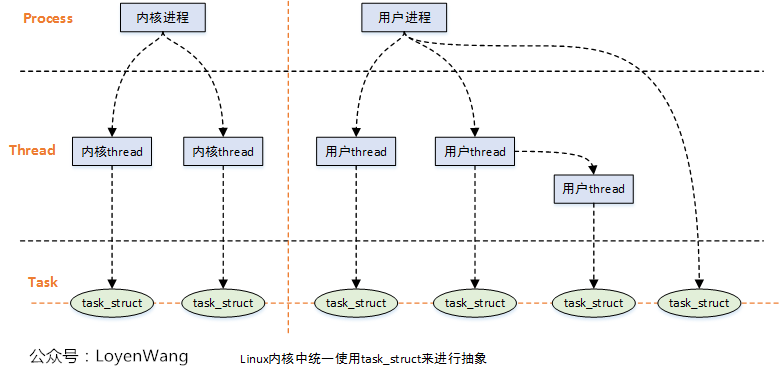

```c
struct task_struct {
    
    /* 进程状态 */
    volatile long			state;

    /* 调度优先级相关，策略相关 */
	int				prio;			//动态优先级，范围为100~139，与静态优先级和补偿(bonus)有关
	int				static_prio;    //静态优先级，static_prio = 100 + nice + 20 (nice值为-20~19,所以static_prio值为100~139)
	int				normal_prio;    //没有受优先级继承影响的常规优先级，具体见normal_prio函数，跟属于什么类型的进程有关
	unsigned int	rt_priority;    //实时进程优先级
    unsigned int	policy;
    
    /* 调度类，调度实体相关，任务组相关等 */
    const struct sched_class	*sched_class;
	struct sched_entity		se;
	struct sched_rt_entity		rt;
#ifdef CONFIG_CGROUP_SCHED
	struct task_group		*sched_task_group;
#endif
	struct sched_dl_entity		dl;
    
    /* 进程之间的关系相关 */
	struct task_struct __rcu	*real_parent;

	/* Recipient of SIGCHLD, wait4() reports: */
	struct task_struct __rcu	*parent;

	/*
	 * Children/sibling form the list of natural children:
	 */
	struct list_head		children;
	struct list_head		sibling;
	struct task_struct		*group_leader;
    
    /* ... */
}
```


#### 2. 进程状态

- Linux中的`就绪态`和`运行态`对应的都是`TASK_RUNNING`标志位，`就绪态`表示进程正处在队列中，尚未被调度；`运行态`则表示进程正在CPU上运行；

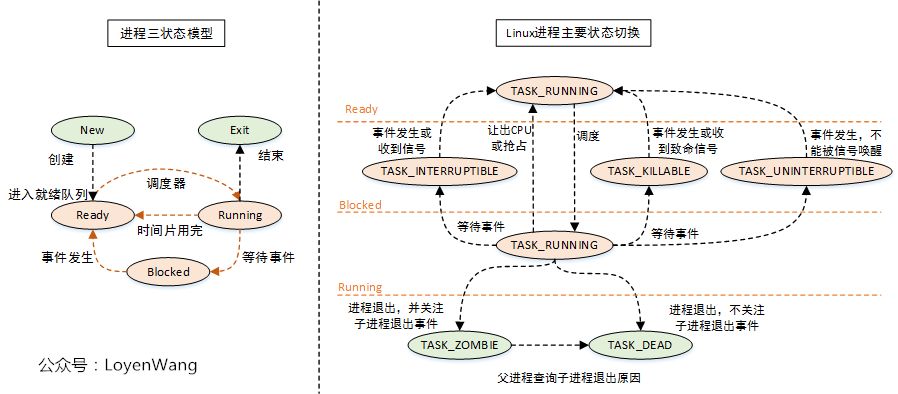

#### 3. 调度器、调度策略、调度实体

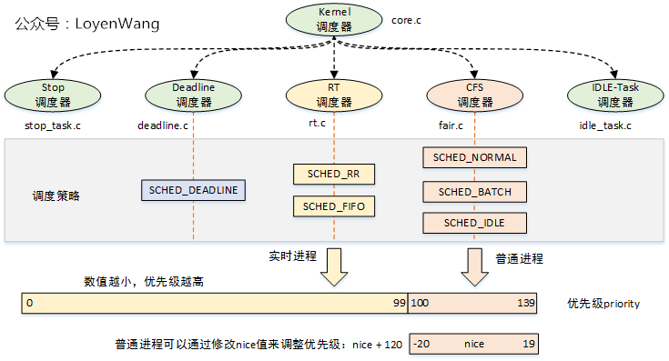

**内核默认提供了5个调度器类：**

1. `Stop调度器， stop_sched_class`：优先级最高的调度类，**可以抢占其他所有进程，不能被其他进程抢占**；
2. **`Deadline调度器`**， dl_sched_class：使用红黑树，把进程**按照绝对截止期限进行排序**，**选择截止时间最早的进程进行调度运行**（Earliest Deadline First， EDF算法）
3. **`RT调度器`**， rt_sched_class：实时调度器，为每个优先级维护一个队列；
4. **`CFS调度器`**， cfs_sched_class：完全公平调度器，采用完全公平调度算法，引入虚拟运行时间概念；
5. `IDLE-Task调度器， idle_sched_class`：空闲调度器，每个CPU都会有一个idle线程，当**没有其他进程可以调度时，调度运行idle线程**；

Linux内核提供了一些调度策略供用户程序来选择调度器，其中`Stop调度器`和`IDLE-Task调度器`，仅由内核使用，用户无法进行选择

Linux内核抽象了一个调度器类`struct sched_class`，在实例化各个调度器的时候，根据具体的调度算法具体实现


----------------------------------------------------------------------->   优先级依次降低


**6种调度策略：**

1. `SCHED_NORMAL`和`SCHED_BATCH`，对于**非实时进程（普通进程）**，采用CFS调度策略
2. `SCHED_FIFO`、`SCHED_RR`和`SCHED_DEADLINE`，对于**实时进程**，分别采用不同的策略调度
3. `SCHED_IDLE`，系统空闲时调用idle进程

因为**实时进程只要求尽快的被响应**，所以根据重要程度赋予不同优先级，调度器每次都选择最高优先级执行即可，低优先级不可能抢占高优先级，因此FIFO或者RR调度策略即可满足实时进程的需求

而**普通进程(非实时进程)**就比较麻烦了，不能简单的只看优先级，必须公平的占有CPU，否则很容易出现进程饥饿，这种情况下用户会感觉操作系统很卡，响应慢，因此linux总是希望寻找一个最接近完美的调度策略来公平快速的调度进程


**3个调度实体：**

调度器不局限于调度进程，还可以调度更大的实体，例如组调度，`一般要求调度器不直接操作进程，而是操作调度实体`，因此通过一个通用数据结构描述这个调度实体`sched_entity`，可以作为一个进程，也可以作为一个进程组

linux针对当前可调度实体是实时还是非实时，定义了3种调度实体：

1. `sched_dl_entity`，采用 EDF 算法调度的实时调度实体（EDF算法，即`Earliest Deadline First`）
2. `sched_rt_entity`，采用 RR 或者 FIFO 算法调度的实时调度实体

3. `sched_entity`，采用 CFS 算法调度的普通非实时的调度实体


#### 4. run_queue 运行队列

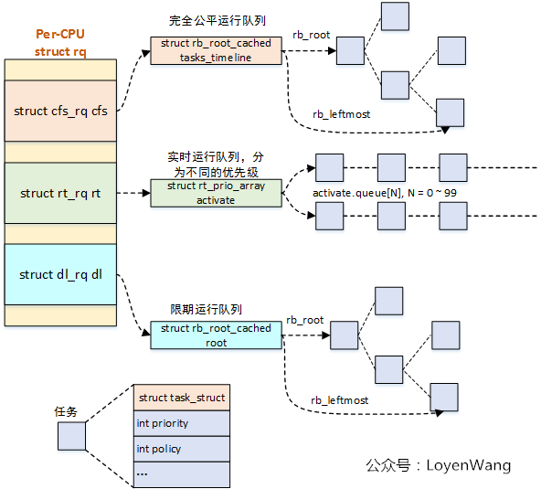

- **每个CPU都有一个对应的运行队列 rq**，此外**task_group结构中也会为每个CPU再维护一个CFS运行队列**
- `cfs_rq`：CFS调度器的运行队列，该结构中包含了`rb_root_cached`红黑树，用于调度实体`sched_entity`
- 分配给CPU的 `task`，作为**调度实体**加入到运行队列中。`task_struct`是任务的描述符，包含了**进程的所有信息**，该结构中包含了`sched_entity`，用于参与调度
- task首次运行时，如果可能，尽量将它加入到父task所在的运行队列中（分配给相同的CPU，缓存affinity会更高，性能会有改善）

```c
struct rq {
	/* runqueue lock: */
	raw_spinlock_t lock;

	/*
	 * nr_running and cpu_load should be in the same cacheline because
	 * remote CPUs use both these fields when doing load calculation.
	 */
	unsigned int nr_running;
    
    /* 三个调度队列：CFS调度，RT调度，DL调度 */
	struct cfs_rq cfs;
	struct rt_rq rt;
	struct dl_rq dl;

    /* stop指向迁移内核线程， idle指向空闲内核线程 */
    struct task_struct *curr, *idle, *stop;
    
    /* ... */
}    

```


#### 5. task_group 任务组

- 利用任务分组机制，可以设置或者限制任务组对CPU的利用率。例如将某些任务限制在某区间，从而不去影响其他任务的执行效率

- 引入`task_group`后，调度器的调度对象不仅仅是进程了，Linux内核抽象出了`sched_entity/sched_rt_entity/sched_dl_entity`描述调度实体，调度实体可以是**进程或`task_group`**
- 使用数据结构`struct task_group`来描述任务组，任务组在每个CPU上都会维护一个`CFS调度实体、CFS运行队列，RT调度实体，RT运行队列`

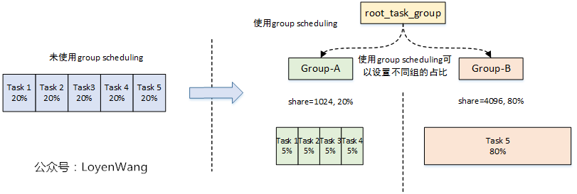

#### 6. 调度程序

调度程序依靠几个函数来完成调度工作的

1. **主动调度：schedule()**

schedule()是进程调度的核心函数，大体流程如下：选择另外一个进程来替换当前进程。进程选择是通过进程所使用的调度器中的`pick_next_task`函数实现的，进程的替换是通过`context_switch`函数实现的

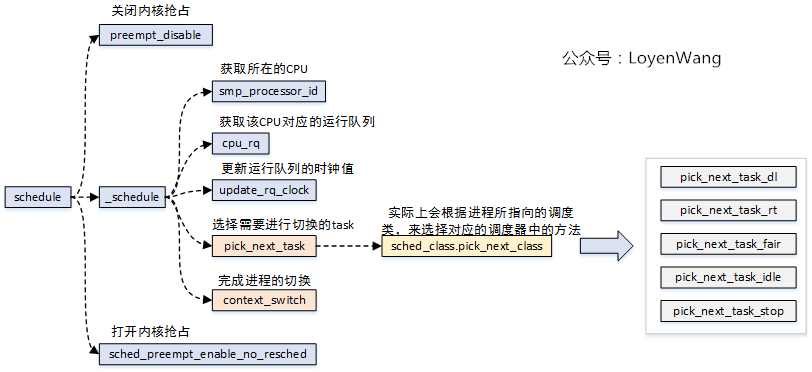

2. **周期调度：schedule_tick()**

时钟中断处理程序处理时，检查当前进程的执行时间是否超额，超额需要设置重新调度标志，中断函数返回时，被中断的进程如果是在用户模式下运行，则检查是否有重新调度标志，有则调用`schedule_tick`函数

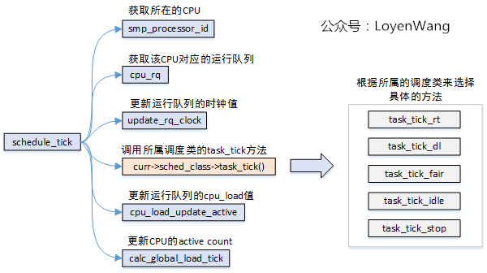

3. **高精度时钟：hrtick()**

与周期性调度类似，不同点是周期调度精度为ms级，高精度为ns级，需要对应硬件支持

4. **进程唤醒时调度：wake_up_process()**

唤醒进程时调用`wake_up_process()`函数，被唤醒的进程可能抢占当前的进程

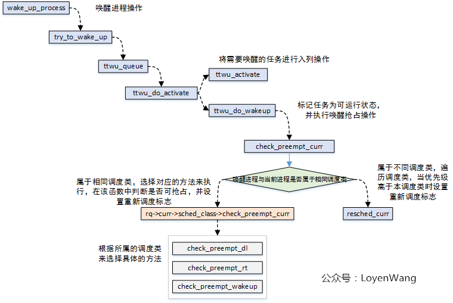


### 2.4.2 进程的切换

怎么通过抢占来实现进程的切换？进程切换时切换的到底是什么？

#### 1. 用户态抢占切换进程

**抢占触发点：**

当进程**时间片耗尽、等待资源、优先级改变**等时机出现时，可以**触发抢占点**。

Linux内核通过设置 `TIF_NEED_RESCHED`标志来对进程标记，表示**需要进行调度切换**，实际的切换将在抢占执行点来完成。

内核提供了 `set_tsk_need_reshced()`函数来将 `thread_info` 中的 `flag`字段设置成 `TIF_NEED_RESCHED`！！，设置后，表示**需要发生抢占调度**

```c
struct task_struct {                                   // task_struct 用于描述任务
#ifdef CONFIG_THREAD_INFO_IN_TASK
	/*
	 * For reasons of header soup (see current_thread_info()), this
	 * must be the first element of task_struct.
	 */
	struct thread_info		thread_info;               // thread_info 结构体在 task_struct中
#endif
        ...
}

/*
 * low level task data that entry.S needs immediate access to.
 */
struct thread_info {
	unsigned long		flags;		/* low level flags */    // flags 字段，用于设置 TIF_NEED_RESCHED
	mm_segment_t		addr_limit;	/* address limit */
#ifdef CONFIG_ARM64_SW_TTBR0_PAN
	u64			ttbr0;		/* saved TTBR0_EL1 */
#endif
	int			preempt_count;	/* 0 => preemptable, <0 => bug */   // 用于控制抢占
};

#include <asm/current.h>
#define current_thread_info() ((struct thread_info *)current)   //通过该宏可以直接获取thread_info的信息
#endif
```


**抢占执行点：**

用户抢占表示抢占发生在进程处于用户态的时候，抢占实际执行时，最明显的标志就是调用了 `schedule()`函数来完成任务切换

**用户态执行抢占在以下几种情况出现：**

1. 异常处理后返回用户态
2. 中断处理后返回用户态
3. 系统调用后返回用户态

用户程序在执行过程中，遇到**异常或中断**后，将会跳到`ENTRY(vectors)`向量表处开始执行，返回用户空间进行标志位判断，如果设置了`TIF_NEED_RESCHED`则需要进行调度切换，如果没有，则检查是否有收到`信号`，有信号未处理的话，还需要进行信号的处理操作


#### 2. 内核态抢占切换进程

Linux内核态有三种内核抢占模型：

- CONFIG_PREEMPT_NONE：**不支持抢占**，中断退出后，需要等到低优先级任务主动让出CPU才发生抢占切换；
- CONFIG_PREEMPT_VOLUNTARY：**自愿抢占**，代码中增加抢占点，在中断退出后遇到抢占点时进行抢占切换；
- CONFIG_PREEMPT：**抢占**，当中断退出后，如果遇到了更高优先级的任务，立即进行任务抢占；


**抢占触发点：**

- 在内核中抢占触发点，也是设置`struct thread_info`的`flag`字段，设置`TIF_NEED_RESCHED`表明需要请求重新调度。
- 抢占触发点的几种情况，在用户抢占中已经分析过，不管是用户抢占还是内核抢占，触发点都是一致的；


**抢占执行点：**

内核抢占：抢占执行发生在进程处于内核态。

1. 中断执行完毕后进行抢占调度
2. 主动调用 `preemp_enable` 或 `schedule`等接口的地方进行抢占调度


#### 3. 使用preemp_count控制抢占

- Linux内核中使用`struct thread_info`中的`preempt_count`字段来控制抢占。
- `preempt_count`的低8位用于控制抢占，当大于0时表示不可抢占，等于0表示可抢占。
- `preempt_enable()`会将`preempt_count`值减1，并判断是否需要进行调度，在条件满足时进行切换；
- `preempt_disable()`会将`preempt_count`值加1；

此外，`preemt_count`字段还用于判断进程处于各类上下文以及开关控制等


#### 4. 进程上下文的切换

- 进程上下文：包含**CPU的所有寄存器值、进程的运行状态、堆栈中的内容等**，相当于进程某一时刻的快照，包含了所有的软硬件信息；
- 进程切换时，完成的就是上下文的切换，**进程上下文的信息会保存在每个`struct task_struct`结构体中，以便在切换时能完成恢复工作；**

进程上下文切换的入口就是`__schedule()`，主要逻辑：

1. 根据CPU获取运行队列，进而得到运行队列当前的`task`，也就是切换前的`prev`;

2. 根据`prev`的状态进行处理，比如`pending`信号的处理等，如果该任务是一个`worker线程`还需要将其睡眠，并唤醒同CPU上的另一个`worker线程`;

3. 根据调度类来选择需要切换过去的下一个`task`，也就是`next`；

4. `context_switch`完成进程的切换；


`context_switch()`函数的主要逻辑包含两个部分：

1. `进程的地址空间切换`：切换的时候要判断切入的进程是否为内核线程，1）所有的用户进程都共用一个内核地址空间，而拥有不同的用户地址空间；2）内核线程本身没有用户地址空间。在进程在切换的过程中就需要对这些因素来考虑，涉及到页表的切换，以及`cache/tlb`的刷新等操作。

2. `寄存器的切换`：包括CPU的通用寄存器切换、浮点寄存器切换，以及ARM处理器相关的其他一些寄存器的切换；


### 2.4.3 CFS调度器

**普通进程(非实时进程)** 调度比较麻烦，不能简单的只看优先级，必须公平的占有CPU，否则很容易出现进程饥饿，这种情况下用户会感觉操作系统很卡，响应慢，因此linux总是希望寻找一个最接近完美的调度策略来公平快速的调度进程

#### 1. 概述

- `Completely Fair Scheduler`，完全公平调度器，用于Linux系统中普通进程的调度

- `CFS`采用了红黑树算法来管理所有的调度实体`sched_entity`，算法效率为`O(log(n))`。`CFS`跟踪调度实体`sched_entity`的虚拟运行时间`vruntime`，平等对待运行队列中的调度实体`sched_entity`，将执行时间少的调度实体`sched_entity`排列到红黑树的左边

- 调度实体`sched_entity`通过`enqueue_entity()`和`dequeue_entity()`来进行红黑树的出队入队
- 该红黑树也是一颗根据 `vruntime`  排序的二叉排序树

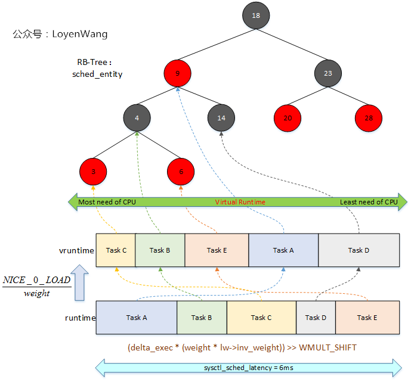

1. 每个`sched_latency`周期内，根据各个任务的权重值，可以计算出运行时间`runtime`
2. 运行时间`runtime`可以转换成虚拟运行时间`vruntime`
3. 根据虚拟运行时间的大小，插入到CFS红黑树中，虚拟运行时间少的调度实体放到左边
4. 在下一次任务调度的时候，选择虚拟运行时间少的调度实体来运行


#### 2. 数据结构


- 每个CPU都有一个运行队列`rq`
- rq中的`cfs_rq`作为CFS运行队列，包含了`rb_root_cached`红黑树，用于链接调度实体`sched_entity`，此外每个`task_group`结构也会为每个CPU再维护一个CFS运行队列
- `task_struct`是任务描述符，包含了进程的所有信息，该结构中的`sched_entity`用于参数CFS的调度
- `task_group`也包含了`sched_eneity`作为调度实体，此外还为每个CPU分配了`cfs_rq`运行队列
- `sched_entity`是调度实体，也是CFS调度管理的对象了


#### 3. 负荷权重

在CFS调度器中，将进程优先级这个概念弱化，而是强调进程的权重。一个进程的权重越大，则说明这个进程更需要运行，因此它的虚拟运行时间就越小，这样被调度的机会就越大

**负荷权重**用struct `load_weight` 数据结构来表示, 保存着进程权重值weight：

```c
struct load_weight {
    unsigned long weight;           /*  存储了权重的信息  */
    u32 inv_weight;                 /*   存储了权重值用于重除的结果 weight * inv_weight = 2^32  */
};
```


`sched_entity` 调度实体中内置了 load_weight 结构，保存当前调度实体的权重信息：

```c
struct sched_entity {
    struct load_weight      load;           /* for load-balancing */
    /*  ......  */
};
```


进程可以作为调度实体，其内部通过存储`sched_entity`而间接存储了其`load_weight`信息：

```c
struct task_struct
{
    /*  ......  */
    struct sched_entity se;
    /*  ......  */
}
```


#### 4. nice值和进程优先级

内核使用一些简单的数值范围0~139表示内部优先级, **数值越低, 优先级越高**

从0~99的范围专供**实时进程**使用, nice的值`[-20,19]`则映射到范围100~139，供**非实时进程使用**


```c
struct task_struct
{
    /* 进程优先级
     * prio: 动态优先级，范围为100~139，与静态优先级和补偿(bonus)有关
     * static_prio: 静态优先级，static_prio = 100 + nice + 20 (nice值为-20~19,所以static_prio值为100~139)
     * normal_prio: 没有受优先级继承影响的常规优先级，具体见normal_prio函数，跟属于什么类型的进程有关
     */
    int prio, static_prio, normal_prio;
    /* 实时进程优先级 */
    unsigned int rt_priority;
}
```

1. `static_prio`: 用于保存**静态优先级**, 是进程启动时分配的优先级, 可以通过nice和sched_setscheduler系统调用来进行修改, 否则在进程运行期间会一直保持恒定
2. `prio`: 保存进程的动态优先级
3. `normal_prio`: 表示基于进程的静态优先级static_prio和调度策略计算出的优先级. 因此即使普通进程和实时进程具有相同的静态优先级, 其普通优先级也是不同的, 进程分叉(fork)时, 子进程会继承父进程的普通优先级

4. `rt_priority`: 用于保存实时优先级


**一般而言，进程每降低一个nice值(优先级提升)，则多获得10%的CPU时间，每升高一个nice值，则放弃10%的CPU时间**

为了执行该策略，内核需要先将优先级转换为权重值，并提供了一张 **优先级->权重** 的转换表`sched_prio_to_weight`，此外还维护了负荷重除后的结果，即`sched_prio_to_wmult`数组，这两个数组的数据是一一对应的。

$$ sched\_prio\_to\_weight[i] * sched\_prio\_to\_wmult[i] = 2^{32} $$

此外，还有两个宏定义，表示的是`SCHED_IDLE`调度的进程的负荷权重信息

```c
#define WEIGHT_IDLEPRIO                3              /*  SCHED_IDLE进程的负荷权重  */
#define WMULT_IDLEPRIO         1431655765   /*  SCHED_IDLE进程负荷权重的重除值  */


const int sched_prio_to_weight[40] = {
/* -20 */     88761,     71755,     56483,     46273,     36291,
/* -15 */     29154,     23254,     18705,     14949,     11916,
/* -10 */      9548,      7620,      6100,      4904,      3906,
/*  -5 */      3121,      2501,      1991,      1586,      1277,
/*   0 */      1024,       820,       655,       526,       423,
/*   5 */       335,       272,       215,       172,       137,
/*  10 */       110,        87,        70,        56,        45,
/*  15 */        36,        29,        23,        18,        15,
};

/*
* Inverse (2^32/x) values of the sched_prio_to_weight[] array, precalculated.
*
* In cases where the weight does not change often, we can use the
* precalculated inverse to speed up arithmetics by turning divisions
* into multiplications:
*/
const u32 sched_prio_to_wmult[40] = {
/* -20 */     48388,     59856,     76040,     92818,    118348,
/* -15 */    147320,    184698,    229616,    287308,    360437,
/* -10 */    449829,    563644,    704093,    875809,   1099582,
/*  -5 */   1376151,   1717300,   2157191,   2708050,   3363326,
/*   0 */   4194304,   5237765,   6557202,   8165337,  10153587,
/*   5 */  12820798,  15790321,  19976592,  24970740,  31350126,
/*  10 */  39045157,  49367440,  61356676,  76695844,  95443717,
/*  15 */ 119304647, 148102320, 186737708, 238609294, 286331153,
};
```


各个权重之间的乘积因子是`1.25`，这个数值是为了增减10%的CPU时间。例如AB进程一开始都是nice0，获得的CPU份额都是1024/2048=50%，这时候B的nice值加1，B的权重变为 1024/1.25=820，这时候A的份额为：1024/(1024+820)=0.55，正好增加10%


#### 5. runtime与vruntime

CFS调度器没有时间片的概念了，而是根据实际运行时间和虚拟运行时间来对任务进行排序，从而进行调度的，虚拟运行时间的计算方法如下：


$$
理想实际运行时间_k = 调度延迟 * (weight_k / \sum_{i=1}^{n}weight_i)\\
vruntime_k = 实际运行时间_k * (NICE\_0\_LOAD / weight_k)
$$


> 如果一个进程得以执行，随着时间的增长（也就是一个个tick的到来），其vruntime将不断增大。**没有得到执行的进程vruntime不变**。而调度器总是选择**vruntime最小的进程**来执行，这就是所谓的“完全公平”。为了区别不同优先级的进程，**优先级高的进程权重越大，vruntime增长得越慢**，以至于它在相同的实际运行时间的前提下**vruntime会越小**，因此会得到更多的运行机会。

CFS通过每个进程的**虚拟运行时间(vruntime)**来衡量哪个进程最值得被调度. CFS中的就绪队列是一棵以vruntime为键值的红黑树，虚拟时间越小的进程越靠近整个红黑树的最左端。因此，调度器每次选择位于红黑树最左端的那个进程，该进程的vruntime最小.

在CFS调度器中，将进程优先级这个概念弱化，而是强调进程的权重。一个进程的权重越大，则说明这个进程更需要运行，因此它的虚拟运行时间就越小，这样被调度的机会就越大。而，CFS调度器中的权重在内核是对用户态进程的优先级nice值, 通过prio_to_weight数组进行nice值和权重的转换而计算出来的

键值较小的结点, 在CFS红黑树中排序的位置就越靠左, 因此也更快地被调度. 用这种方法, 内核实现了下面两种对立的机制

在程序运行时, 其vruntime稳定地增加, 他在红黑树中总是向右移动的.

因为越重要的进程vruntime增加的越慢, 因此他们向右移动的速度也越慢, 这样其被调度的机会要大于次要进程, 这刚好是我们需要的

如果进程进入睡眠, 则其vruntime保持不变. 因为每个队列min_vruntime同时会单调增加, 那么当进程从睡眠中苏醒, 在红黑树中的位置会更靠左, 因为其键值相对来说变得更小了


**调度实体中记录了虚拟时钟等信息**

```c
struct sched_entity
{
    struct load_weight      load;           /* for load-balancing负荷权重，这个决定了进程在CPU上的运行时间和被调度次数 */
    struct rb_node          run_node;
    unsigned int            on_rq;          /*  是否在就绪队列上  */

    u64                     exec_start;         /*  上次启动的时间*/

    u64                     sum_exec_runtime;			// 记录真实消耗CPU时间
    u64                     vruntime;					// 记录虚拟时钟
    u64                     prev_sum_exec_runtime;		// 进程撤销时将sum_exec_runtime保存到prev_sum_exec_runtime
    /* rq on which this entity is (to be) queued: */
    struct cfs_rq           *cfs_rq;
    ...
};
```


**cfs_rq就绪队列记录了虚拟时钟信息**

```c
struct cfs_rq
{
    struct load_weight load;   /*所有进程的累计负荷值*/
    unsigned long nr_running;  /*当前就绪队列的进程数*/

    // ========================
    u64 min_vruntime;  //  队列的虚拟时钟, 
    // =======================
    struct rb_root tasks_timeline;  /*红黑树的头结点*/
    struct rb_node *rb_leftmost;    /*红黑树的最左面节点*/

    struct sched_entity *curr;      /*当前执行进程的可调度实体*/
        ...
};
```


**调度延迟：**

> 调度延迟就是**保证每一个可运行进程都至少运行一次的时间间隔**。例如，每个进程都运行10ms，系统中总共有2个进程，那么调度延迟就是20ms。如果有5个进程，那么调度延迟就是50ms。
>
> 
>
> CFS调度器的调度延迟时间的设定并不是固定的。当系统处于**就绪态的进程少于一个定值**（默认值8）的时候，**调度延迟也是固定一个值不变**（默认值6ms），这时候实际运行时间就是理想实际运行时间，一个调度延迟后，所有进程的 vruntime 都一样大。
>
> 当系统**就绪态进程个数超过这个值**时，我们保证每个进程至少运行一定的时间才让出cpu。这个“至少一定的时间”被称为**最小粒度时间**。在CFS默认设置中，最小粒度时间是0.75ms。就是说一次实际运行时间都是0.75ms，但是vruntime的增长就完全取决于权重了

- Linux内核默认的调度延迟`sysctl_sched_latency`是6ms，这个值用户态可设。`sched_period`用于保证所有可运行任务在该时间间隔内都能至少运行一次

- 当可运行任务大于8个的时候，`sched_period`的计算则需要根据任务个数乘以最小调度颗粒值(默认为0.75ms)

- 每个任务的运行时间计算，是用`sched_period`值，去乘以该任务在整个CFS运行队列中的权重占比；


#### 6. CFS调度tick

CFS调度器中的tick函数为`task_tick_fair`，系统中每个调度tick都会调用到，此外如果使用了`hrtimer`，也会调用到这个函数。
流程如下：


主要的工作包括：

- 更新运行时的各类统计信息，比如`vruntime`， 运行时间、负载值、权重值等；
- 检查是否需要抢占，主要是比较运行时间是否耗尽，以及`vruntime`的差值是否大于运行时间等；


#### 7. 任务出队入队

- 当任务进入可运行状态时，需要将调度实体放入到红黑树中，完成入队操作；
- 当任务退出可运行状态时，需要将调度实体从红黑树中移除，完成出队操作；
- CFS调度器，使用`enqueue_task_fair`函数将任务入队到CFS队列，使用`dequeue_task_fair`函数将任务从CFS队列中出队操作。

- 出队与入队的操作中，核心的逻辑可以分成两部分：
  - 1）更新运行时的数据，比如负载、权重、组调度的占比等等；
  - 2）将sched_entity插入红黑树，或者从红黑树移除；


#### 8. 任务选择

每当进程任务切换的时候，也就是`schedule`函数执行时，调度器都需要选择下一个将要执行的任务。

在CFS调度器中，是通过`pick_next_task_fair`函数完成的，流程如下：


- 当需要进程任务切换的时候，`pick_next_task_fair`函数的传入参数中包含了需要被切换出去的任务，也就是`pre_task`；
- 当`pre_task`不是普通进程时，也就是调度类不是CFS，那么它就不使用`sched_entity`的调度实体来参与调度，因此会执行`simple`分支，通过`put_pre_task`函数来通知系统当前的任务需要被切换，而不是通过`put_prev_entity`函数来完成；
- 当`pre_task`是普通进程时，调用`pick_next_entity`来选择下一个执行的任务，这个选择过程实际是有两种情况：当调度实体对应task时，`do while()`遍历一次，当调度实体对应`task_group`是，则需要遍历任务组来选择下一个执行的任务了。
- `put_prev_entity`，用于切换任务前的准备工作，更新运行时的统计数据，并不进行`dequeue`的操作，其中需要将CFS队列的`curr`指针置位成NULL；
- set_next_entity，用于设置下一个要运行的调度实体，设置CFS队列的`curr`指针；
- 如果使能了`hrtimer`，则将`hrtimer`的到期时间设置为调度实体的剩余运行时间；


## 2.4 线程同步

**只有进程需要通信，同一进程中的线程是共享进程的地址空间的，没有通信的必要，但是需要做好同步，保护共享的全局变量**

并发进程之间可能`独立`也可能有`交互`，有交互时就会产生`竞争`和`协作`，需要进行同步
- **同步技术(Synchronization)** 用于维护交互进程的数据一致性。通过`互斥锁`来解决竞争关系的进程，通过`信号量`来解决协作关系的进程
- **临界区(critical section)：** 进程操作公共数据的区域。不允许有两个进程同时进入临界区，以达到`互斥(Mutex)`的目的
- **进程进出临界区协议：** 进入临界区前在entry section要请求许可，离开临界区后在exit section要归还许可

**进程同步有两种方式**：互斥锁`mutex`，信号量`semaphore`

### 2.4.1 互斥锁
- `互斥锁(Mutex Lock)` 是操作系统提供的解决临界区问题的工具
- `原子操作(Atomic operation)` 原子操作不会被打断。如 `test_and_set()`, `compare_and_swap()`，均是硬件指令(比系统调用还底层，一个周期内完成，不会被中断)

基于test_and_set的锁的实现
~~~cpp
bool test_and_set(bool* target){//示意代码，实际是原子的
  bool result = *target;
  *target = false;
  return result;
}

bool available = true; //unlock
lock(){
  while(!test_and_set(&available))
    do nothing;
}

unlock(){
  available = false;
}
~~~

#### 自旋锁
- `忙式等待(Busy Waiting)`是指占用CPU执行空循环实现等待，这种类型的互斥锁成为`自旋锁`。如上面实现的基于test_and_set的锁

- pthread提供的自旋锁：`pthread_mutex_t`
~~~cpp
pthread_mutex_t lock = PTHREAD_MUTEX_INITIALIZER; //创建锁
pthread_mutex_lock(&lock);  //上锁
pthread_mutex_unlock(&lock);  //开锁
~~~
- 缺点：浪费CPU周期
- 优点：进程在等待时**没有上下文切换**，对于使用锁的时间不长的进程，或者多处理器系统中，优势明显。很常用    


### 2.4.2 信号量与PV操作
- `信号量(Semaphore)`是一种比互斥锁更强大的同步工具，提供更高级的方法来同步并发进程。**信号量的值除了在初始化时被赋值外，只能通过P和V操作进行修改**
- `二值信号量(binary semaphore)` 只能是0或1，通常初始化为1，用于实现互斥锁的功能
- `一般信号量(counting semaphore)` 可以取值任意数值，控制并发进程对共享资源的访问

 
~~~cpp
//二值信号量
semaphore mutex = 1;  //mutex=1 解决竞争问题
process pi(){
  P(mutex); //将mutex变为0，等价于lock

  critical section

  V(mutex); //将mutex变为1，等价于unlock
} 
~~~

~~~cpp
//一般信号量
semaphore mutex = 2;  //mutex>1 控制同时进入临界区的进程数量：可用资源数量
process pi(){
  P(mutex); //将mutex-1，当mutex<=0时等待

  critical section

  V(mutex); //将mutex+1
} 
~~~

linux中，信号量的实现：
- 包含头文件`<semaphore.h>`
- `sem_t` 信号量的数据类型
- `int sem_init(sem_t *sem, int pshared, unsigned int val)` 信号量指针，信号量类型(0表示进程内所有线程可用，其他表示不同进程的线程可用)，初始值
- `int sem_wait(sem_t *sem)` P操作，申请信号量，当没有信号量可用时等待，有信号量时对信号量值减1
- `int sem_post(sem_t *sem)` V操作，释放一个信号量，信号量值加1
- `int sem_destory(sem_t *sem)` 销毁信号量

### 2.4.3 信号量实现同步

- 同步问题实质就是将异步的并发进程按照某种顺序执行
- 解决同步的本质就是找到并发进程的交互点，利用P操作的等待特点来调节进程的执行速度

#### 司机售票员
  

#### 生产者消费者问题
- 生产者P和消费者C共用一个缓冲区buffer，生产者不能往满的缓冲区放产品，消费者不能从空的缓冲区中取产品

单缓冲解决方案
~~~cpp
Semaphore empty=1;
Semaphore full=0;

Producer{
  while(true){
    make a product;
    P(empty);
    put into buffer;
    V(full);
  }
}

Comsumer{
  while(true){
    P(full);
    pick product from buffer;
    V(empty);
    comsume the product;    
  }
}
~~~

多缓冲解决方案
~~~cpp
Semaphore empty=k;
Semaphore full=0;
Semaphore mutex=1;
item B[k];
int in=0, out=0;

Process producer_i{
    make a product;
    P(empty); //同步信号量：PV不在同一个进程，用于同步
    
    P(mutex); //互斥信号量：PV在同一个进程中，用于解决竞争
    B[in]=product;
    in=(in+1)%k;
    V(mutex);
    
    V(full);
}

Process comsumer_i{
    P(full);

    P(mutex);
    product = B[out];
    out=(out+1)%k;
    V(mutex);
    
    V(empty);
    comsume a product;
}
~~~

#### 苹果橘子问题
盘子一次放一个水果，爸爸放苹果，妈妈放橘子，女儿吃苹果，儿子吃橘子


#### 读者写者问题
Reader和Writer之间是竞争关系，Writer和Writer竞争，Reader和Reader共享


#### 理发师问题
理发店有几个等待座位，没人要理发时理发师就睡觉，有人在理发，座位没坐满时顾客就坐下，否则离开


#### 哲学家就餐问题


### 2.4.4 管程实现同步

- 信号量功能强大，但是使用时对信号量的操作分散，难以控制，读写和维护困难，于是有了一种集中式同步进程--**管程**。**基本思想就是将共享变量和对他们的操作集中在一个模块中**，操作系统或并发程序就是由这样的模块构成。这样模块之间联系清晰，便于维护和修改，易于保证正确性


**管程的特性：**

- 模块化：管程是一个基本单位，可以单独编译
- 抽象数据类型：管程中不仅有数据，还有对数据的操作
- 信息掩蔽和封装性：管程中定义的共享变量的所有操作都局限在管程中，外部只能通过调用管程的某些函数来间接访问这些变量但是函数的具体实现对外部是不可见的
- 互斥访问：管程是互斥的，某个时刻只能允许一个进程或线程访问共享资源
- 管程中必须有等待队列和响应的等待和唤醒的操作
- 必须有一种方法使进程无法继续运行时被阻塞(wait)


**管程是用于管理资源的**，因此管程中有进程等待队列和响应的等待和唤醒操作。在管程入口有一个`入口等待队列`，一个进程进入管程的等待队列就会**释放管程的互斥使用权**，当已进入管程的一个进程唤醒另一个进程时，两者必须有一个退出或停止使用管程。管程内部由于执行唤醒signal操作，可能存在多个等待进程(等待使用管程)，称为`紧急等待队列(管程内部的进程执行了wait)`，它的**优先级高于入口等待队列**。也就是：如果紧急队列有进程，则唤醒紧急队列的进程，否则才唤醒入口队列的进程

进程离开管程的时候要释放使用权


**java的monitor其实就是一种管程模型**


## 2.5 进程间通信方式

由于进程的用户地址空间都是独立的，一般是不能互相访问的，但是内核空间是每个进程都共享的，所以进程之间要进行通信必须要通过内核

### 2.5.1 管道

Linux的 `|` 就是一个管道，功能是将前一个命令的输出作为后一个命令的输入，**管道传输数据是单向的**，如果要相互通信需要创建两个管道

`|` 这种没有名字的管道称为**匿名管道**，用完了就销毁

有名字的管道称为**命名管道**，也被叫做`FIFO`，使用命名管道前要通过`mkfifo`命令创建，指定管道的名字

#### 命名管道

~~~c
[root@hjc]/tmp/temp# mkfifo mypipe
[root@hjc]/tmp/temp# ll
total 0
prw-r--r-- 1 root root 0 Dec  5 13:12 mypipe	//可以看到文件类型是pipe
[root@hjc]/tmp/temp# echo "hello aaa">mypipe
//这时就阻塞住了，等待管道里的数据被读取

[root@hjc]/tmp/temp# cat<mypipe		//读取mypipe里的内容
hello aaa

//读取完毕之后上面的echo命令就正常退出了
~~~

管道通信的方式效率低，不适合进程间频繁的交换数据，好处就是简单，也很容易得知管道中的数据被其他进程读取了

实现一个命名管道实际上就是实现一个FIFO文件。命名管道一旦建立，之后它的读、写以及关闭操作都与普通管道完全相同。**虽然FIFO文件的inode节点在磁盘上，但是仅是一个节点而已，文件的数据还是存在于`内存缓冲页中`**，和普通管道相同。

#### 匿名管道

匿名管道的创建需要通过系统调用`int pipe(int fd[2])` ，fd[2]是大小为2的文件描述符数组，其中fd[0]表示读端，fd[1]表示写端


创建一个匿名管道，需要两个文件描述符，一个是管道的读取端的描述符`fd[0]`，一个是管道的写入端`fd[1]`

匿名管道是特殊的文件，**只存在于内存，不存在于文件系统中**

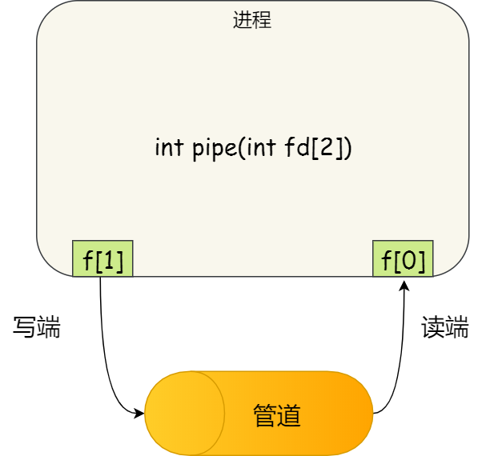

**从管道的一端写入数据，其实就是`缓存在内核中`**，另一端读取，也就是从内核中读取这段缓存

子进程和父进程间描述符指向是相同的。通过fork创建子进程。

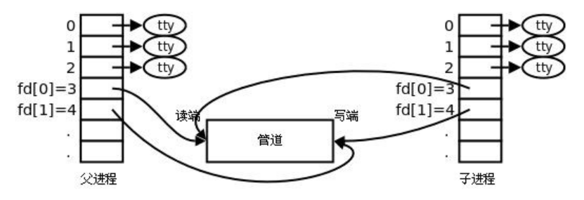

然后关闭父进程的读取fd[0]，关掉子进程的写入fd[1]，就实现了父进程向子进程写入数据通信，要实现双端通信应该建立两个管道，使用一个管道，父子都能读写会造成混乱


```c
int main()
{
  int pipefd[2] = {0};
  int ret = pipe(pipefd);
  if(ret==-1)
  { perror("pipe"); return 1;
  } pid_t id = fork();
  if(id < 0)
  { perror("fork"); return 1;
  }
  //父进程读取
  if(id > 0)
  { 
      //父进程关闭写文件描述符 
      close(pipefd[1]); 
      char buf[64]; 
      while(1) { 
          ssize_t s = read(pipefd[0],buf,sizeof(buf)-1); 
          if(s > 0) { 
              buf[s] = 0; 
              printf("father get a msg:%s\n",buf); 
              sleep(1); 
          } 
      }
  } 
  //子进程写入i am child
  if(id == 0)
  { 
      //子进程关闭读文件描述符 
      close(pipefd[0]); 
      const char *msg = "i am child"; 
      while(1) { 
          write(pipefd[1],msg,strlen(msg));
          sleep(1); 
      }
  } 
  return 0;
}
```


- 对于shell中的`A|B` ，A进程和B进程都是shell创建出来的子进程，A和B之间不会存在父子关系，他们俩的父进程都是shell
- shell里通过`|`将多个命令连接在一起，实际上就是创建多个子进程，所以一般一个管道可以搞定的事情就不要用多个管道了，减少系统创建子进程的系统开销

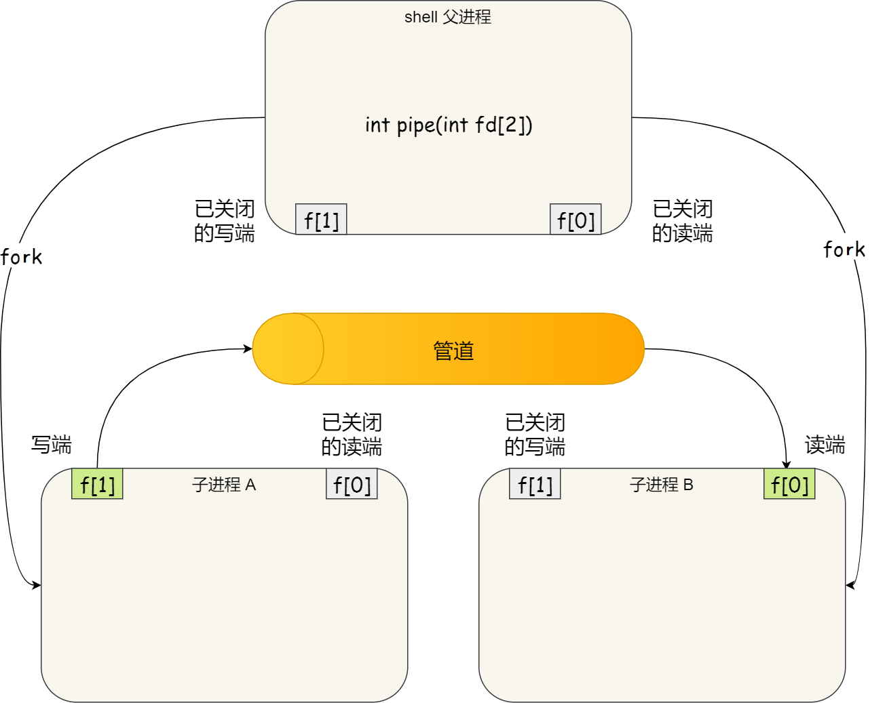


#### 匿名管道和命名管道总结

匿名管道的通信范围是**存在亲缘关系的进程**。因为管道没有实体，没有管道文件，只能**通过fork来复制子进程fd文件描述符**，来达到通信的目的

命名管道和命名管道都只能进行半双工通信

命名管道可以用于不相关的进程间的相互通信，因为创建了管道类型的文件，使用这个文件的进程就可以相互通信

命名管道是一种特殊的文件，存在于文件系统，使用完不删除的话会依然存在。匿名管道只存在于内存，无法在文件系统中查看

同时，管道都是遵循先进先出的，不支持lseek之类的文件定位操作


### 2.5.2 消息队列

管道通信方式效率低，不适合进程间频繁地交换数据

**消息队列**就可以解决。A进程把数据放在对应的消息队列后就正常返回，B进程需要的时候再去读取数据就可以了


**消息队列保存的是内核中的消息链表**，通信双方提前约定好消息体的数据类型（固定大小），之后通信的数据被分为一个一个的消息体（数据块）。所以每个消息体都是固定大小的存储块，而不是管道那种无格式的字节流数据。当有进程从消息队列中读取了消息体，内核就把这个消息体删除


**生命周期**：消息队列的生命周期**随内核**，只要没有关闭操作系统，消息队列会一直存在，而**管道的生命周期随进程**的创建而创建，随进程的结束而销毁


**缺点**：**通信不及时**，**大小有限制**，不适合比较大数据的传输，不光每个消息体有大小限制`MSGMAX`，一个队列所包含的全部消息体的总长度也是有上限的`MSGMNB`。另外，消息队列**通信过程中存在用户态和内核态之间的数据拷贝开销**，进程写入数据到内核，另一个进程从内核中读取消息，都会发生用户态和内核态之间的切换


### 2.5.3 共享内存

共享内存的方式主要就是解决消息队列需要用户态和内核态状态切换的问题

基于虚拟内存技术，每个进程都有自己独立的虚拟内存空间，不同进程的虚拟内存映射到不同的物理内存中，所以即使进程A和B的虚拟地址是一样的，他们所访问的物理内存地址也是不一样的

**共享内存技术**就是拿出**一块虚拟地址空间，映射到相同的物理内存中**，这样这个进程写入的数据就可以被另一个进程看到了，不需要拷贝过来拷贝过去，**相较于其它方式少了两步内核态与用户态之间的数据拷贝因此速度最快**

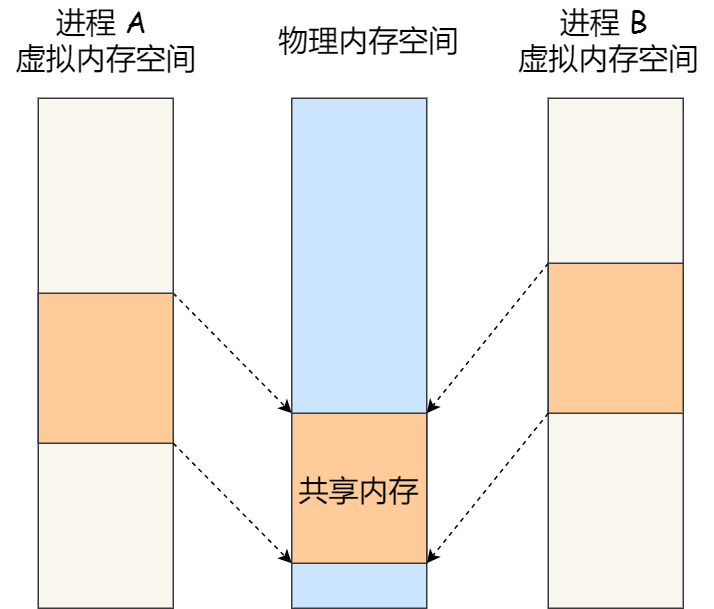


### 2.5.4 信号量

共享内存方式带来的新问题就是：**如果多个进程同时修改一个共享内存就会发生冲突**。

为了防止多进程竞争共享资源造成数据错乱，引入了**信号量**来实现共享内存的互斥访问

和进程同步的方式差不多，引入PV操作

### 2.5.5 信号

上面的进程通信方式都是在常规工作模式，对于**异常情况下的工作模式**，就需要**信号**的方式来通知进程。

通过`kill -l`命令可以查看所有的信号

~~~
$ kill -l
1) SIGHUP     2) SIGINT     3) SIGQUIT     4) SIGILL     5) SIGTRAP
6) SIGABRT     7) SIGBUS     8) SIGFPE     9) SIGKILL    10) SIGUSR1
11) SIGSEGV    12) SIGUSR2    13) SIGPIPE    14) SIGALRM    15) SIGTERM
16) SIGSTKFLT    17) SIGCHLD    18) SIGCONT    19) SIGSTOP    20) SIGTSTP
21) SIGTTIN    22) SIGTTOU    23) SIGURG    24) SIGXCPU    25) SIGXFSZ
26) SIGVTALRM    27) SIGPROF    28) SIGWINCH    29) SIGIO    30) SIGPWR
31) SIGSYS    34) SIGRTMIN    35) SIGRTMIN+1    36) SIGRTMIN+2    37) SIGRTMIN+3
38) SIGRTMIN+4    39) SIGRTMIN+5    40) SIGRTMIN+6    41) SIGRTMIN+7    42) SIGRTMIN+8
43) SIGRTMIN+9    44) SIGRTMIN+10    45) SIGRTMIN+11    46) SIGRTMIN+12    47) SIGRTMIN+13
48) SIGRTMIN+14    49) SIGRTMIN+15    50) SIGRTMAX-14    51) SIGRTMAX-13    52) SIGRTMAX-12
53) SIGRTMAX-11    54) SIGRTMAX-10    55) SIGRTMAX-9    56) SIGRTMAX-8    57) SIGRTMAX-7
58) SIGRTMAX-6    59) SIGRTMAX-5    60) SIGRTMAX-4    61) SIGRTMAX-3    62) SIGRTMAX-2
63) SIGRTMAX-1    64) SIGRTMAX
~~~

例如 Ctrl+C就产生了`SIGINT`信号，表示终止退出该进程。Ctrl+Z就产生了`SIGSTOP`信号，表示中止执行该进程，但还未结束

如果进程在后台运行，可以通过`kill`命令发送信号，如`kill -9 pid`表示发送`SIGKILL`信号给pid的进程

信号是进程间通信机制中**唯一的异步通信机制**，因为可以在任何时候发送信号给某一个进程，一旦有信号产生，用户进程就需要进行处理：三种方式

1. 执行默认操作：linux对每种信号都规定了默认操作
2. 捕捉信号：为信号定义一个信号处理函数，当信号发生时执行相应的信号处理函数

3. 忽略信号：可以忽略某些不想处理的信号，但是`SIGKILL`和`SIGSTOP`是无法捕捉和忽略的，可以在任何时候中断或者结束某一进程


### 2.5.6 Socket

**跨网络的不同主机上的进程之间的通信**

~~~
//socket的系统调用
int socket(int domain, int type, int protocal)
~~~

- domain：指定协议族，如AF_INET 用于 IPV4、AF_INET6 用于 IPV6、AF_LOCAL/AF_UNIX 用于本机
- type：指定通信的特性，如SOCK_STREAM 表示字节流(TCP)、SOCK_DGRAM 表示数据报(UDP)、SOCK_RAW 表示的是原始套接字
- protocal：原本用于指定通信协议，现作废，前面已经指定了，写成0即可

实现TCP字节流通信的socket类型：`AF_INET`和`SOCK_STREAM`

实现UDP数据报通信的socket类型：`AF_INET`和`SOCK_DGRAM`

实现本地进程通信的socket类型：`AF_LOCAL/AF_UNIX`和`SOCK_STREAM/SOCK_DGRAM`


需要注意的是，服务端调用 `accept` 时，连接成功了会返回一个已完成连接的 socket，后续用来传输数据。

所以，监听的 socket 和真正用来传送数据的 socket，是「**两个**」 socket，一个叫作**监听 socket**，一个叫作**已完成连接 socket**。

成功连接建立之后，双方开始通过 read 和 write 函数来读写数据，就像往一个文件流里面写东西一样


## 2.6 再看多进程和多线程

- **数据共享和通信**：多进程间拥有独立的地址空间，数据独立不共享，因此数据共享复杂，通信需要使用`IPC(Inter Process Communication)`，借助管道、消息队列、共享内存、信号量、信号、socket等方式实现通信。而多线程是共享同一个进程的地址空间的，因此共享简单，使用该进程下的全局变量、静态变量等数据就可以实现通信
- **同步**：多进程相互独立，通常不需要考虑锁和同步资源的问题，而多线程访问进程的共享内存区域，需要经常考虑到同步问题(互斥锁、条件变量、读写锁、信号量)
- **内存和CPU**：多进程占用内存多，切换复杂，CPU利用率低。多线程占用内存少，切换简单，CPU利用率高
- **创建、销毁、切换开销**：进程开销大
- **编程调试**：多进程编程简单，多线程复杂
- **可靠性**：进程间互不影响。而多线程的方式只要一个线程挂掉，就会导致整个进程挂掉
- **分布式**：多进程方式扩展到多台机器比较简单


应用场景：

- 需要频繁创建和销毁的场景优先使用多线程：例如web服务器，来一个连接创建一个线程，断了就销毁线程，代价小
- 需要大量CPU计算的优先使用多线程：消耗CPU多，切换频繁，用多线程合适
- 弱相关处理适合多进程：web server的消息接发和消息处理
- 强相关处理适合多线程：消息处理的消息解码，业务处理等
- 分布式：多机分布适合用多进程，多核分布适合用多线程


## 2.7 死锁

### 2.7.1 死锁的介绍
- `饥饿`：进程长时间的等待
- `死锁(DEADLOCK)` 并发进程竞争有限的资源，循环等待，出现永远等待的现象。例如哲学家就餐问题每个人拿到一根筷子
- 避免哲学家就餐的死锁：
  - 允许最多4个哲学家同时吃
  - 奇数号哲学家先取左手筷子，偶数号先取右手的筷子
  - 每个哲学家取到手边的两根筷子菜开始吃，否则一根也不拿
- **产生死锁的四个必要条件：**
  - `互斥使用`：一个时刻一个资源只能被一个进程占用
  - `不可抢占`：除了占有资源的进程主动释放资源外，其他进程都不可以抢夺其资源
  - `占有和等待`：一个进程请求的资源得不到满足时，不会释放已占有的资源
  - `循环等待`：上面三个条件同时存在产生的结果，每个进程分别等待另一个进程所占有的资源

- **处理死锁的策略**
  - 破坏死锁条件：破坏死锁产生的四个必要条件之一，防止死锁的发生
  - 避免死锁：允许四个必要条件存在，但是仔细分配资源来避免死锁
  - 检测恢复：死锁发生时对其进行检测，采取行动解决，解除死锁
  - 忽略死锁：`鸵鸟算法(ostrich algorithm)` 把头埋在沙子里，假装问题没有发生。。。

### 2.7.2 破坏死锁条件
`死锁的防止(Prevention)`：破坏四个必要条件之一
- ~~破坏互斥使用~~：允许资源同一时刻被共享使用。不现实，很多资源是不可以被共享使用的
- ~~破坏不可抢占~~：使资源可以被抢夺。CPU可以被抢夺，但是对打印机等设备不应该被抢夺
- 破坏占有和等待： 可以！当一个进程获取不到所有资源时就放弃全部资源。缺点会降低资源的利用率，效果不好
- 破坏循环等待：可以！对资源按优先级排序编号，进程在请求某个资源时，必须获得之前的所有资源，那么资源分配之间就不会出现环。但是编号顺序难以确定，效果也不好 

**可操作性太复杂，资源利用率太低**

### 2.7.3 死锁的避免
`死锁的避免(Avoidance)`：允许四个必要条件存在，在并发进程中做出妥善安排来避免死锁的发生

- 银行家算法
- `安全状态(Safe State)`：系统按可以按一定顺序把资源分配给每个进程，并且能够避免死锁。即安全状态就是说存在一个安全序列。没有安全序列的系统状态就是不安全状态
- 安全状态一定可以避免死锁，但是不安全状态不一定会导致死锁

银行家算法的优缺点：
- 优点：允许死锁必要条件同时存在
- 缺点：缺乏实用价值。很难在运行程序前知道所需资源的最大数量，而且要求进程间无关，若考虑同步会打乱安全序列。要求进入系统的进程个数和资源数固定

### 2.7.4 死锁的检测和恢复
`死锁的检测和恢复(Detection & Recovery)` 允许死锁的发生，系统及时检测死锁并解除它

#### 死锁的检测
检测时机：
1. 当系统开销大，很多进程等待时检测死锁
2. 定时检测
3. 系统资源利用率下降时检测死锁

**检测算法：** 
通过资源分配图来检测死锁
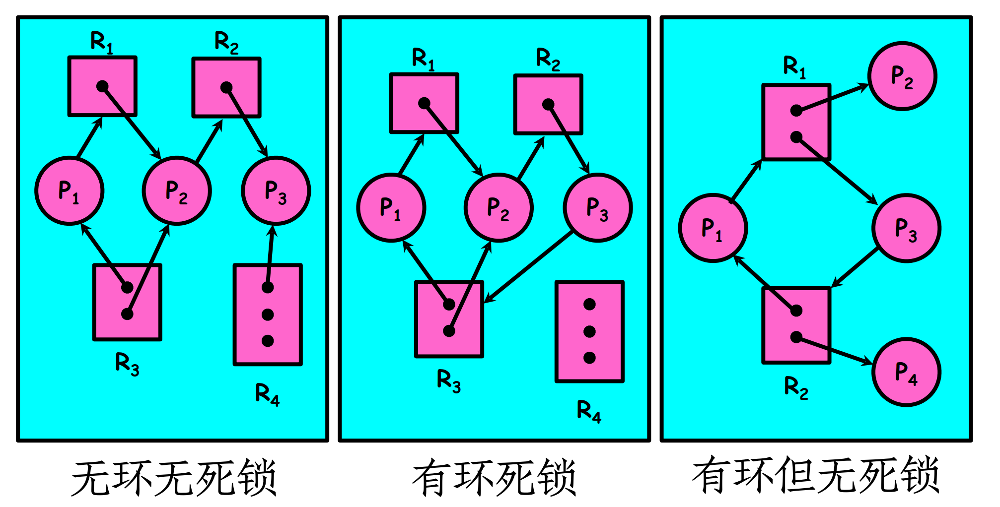

资源分配图简化：消除申请边和分配边
`(R1->P2)`，`(R2->P4)` 都可以消去
之后P3可以申请到R2，消去`(P3->R2)`，`(R1->P3)`
再接着就可以消去`(P1->R1)`，`(R2->P1)`
之后所有进程都变成了`孤立节点`(进程的所有请求边和分配边都被消去)
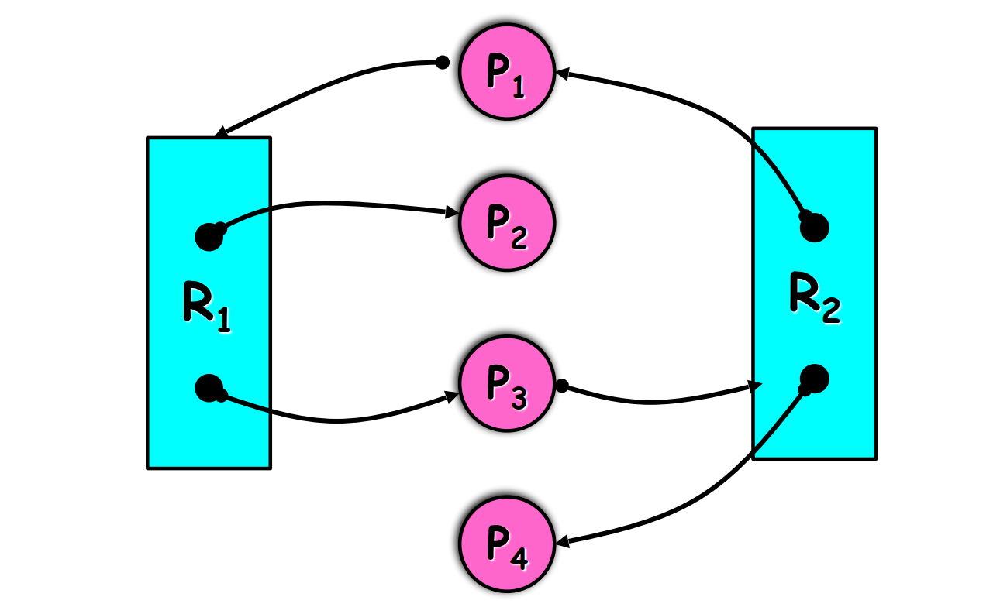

- `可完全简化`：资源分配图中所有的进程都可以简化为孤立节点
- **死锁定理：** 系统为死锁状态的充分条件是：当且仅当该状态的`进程-资源分配图`是`不可完全简化的`

#### 死锁的解除
- `中止进程，强制回收资源`：哲学家问题(杀死一个哲学家)
- `剥夺资源，不中止进程`
- `进程回滚(Roll Back)`：哲学家问题(让一个哲学家放下一把叉子)
- `重新启动`：最有效但是是最终解决办法

**操作系统的办法：** 尽管发生死锁会导致进程占用的资源一直得不到释放，越来越多进程请求的资源无法分配，最终导致系统重启，但是死锁发生的概率很低，所以**大多数操作系统都是直接忽略死锁**


# 3. 内存管理

- `内存(Main Memory)`由许多字节的序列组成，每个字节都有它自己的地址
- **CPU根据指令寄存器PC的值去从内存中获取指令**，这些指令可能也会导致去内存中额外的读写操作
- **指令周期：**
  - `取指令`：根据PC值所示地址去内存取出对应指令到指令寄存器IR，PC+1
  - `解释指令`：将IR中的指令译成机器语言
  - `执行指令`
  - `存储结果`
- **分层存储体系：**
顶层存储器速度最快，但是相对容量最小，成本非常高
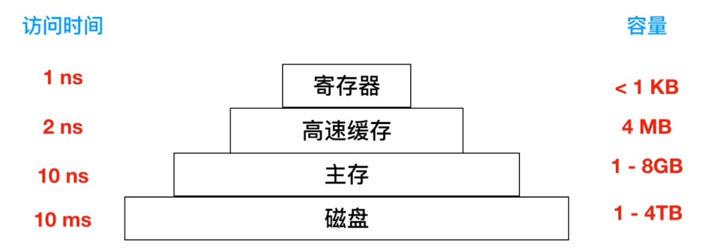

- 操作系统中管理内存层次结构的部分成为`内存管理器(memory manager)`，主要工作是有效的管理内存，记录哪些内存是正在使用的，在进程需要时分配内存以及在进程完成时回收内存

## 3.1 虚拟内存
- `地址空间`：一个非负整数地址的有序集合。如果地址空间中的整数是连续的，就称为`线性地址空间`。在带虚拟内存的系统中，生成的线性地址空间就是`虚拟地址空间`
- `虚拟地址空间`创建了一种抽象内存供程序使用。虚拟地址空间是进程可以用来寻址内存的虚拟地址集合。每个进程都有自己的虚拟地址空间，独立于其他进程的虚拟地址空间
- 一个包含 `2^n` 个地址的虚拟地址空间就叫做一个 `n` 位的地址空间 (现代操作系统通常是32位或64位)
- 虚拟地址以 `字节` 作为寻址的基本单位


- **保护操作系统和用户进程：** 用户进程不可以访问操作系统内存数据，用户进程空间之间不能互相影响。
  - `基址寄存器`：base register，存储程序在内存中的起始位置
  - `变址寄存器`：limit register，存储应用程序的长度
  - 这两个寄存器的值只能被操作系统的`特权指令`加载(内核模式)，于是隔离了各个进程空间


### 3.1.1 各种地址

- **逻辑地址**是在有地址变换功能的计算机中,访存指令给出的地址 (操作数) 叫逻辑地址,也叫`相对地址`，逻辑地址`面向程序`，也就是机器语言指令中，用来指定一个操作数或是一条指令的地址。要经过寻址方式的计算或变换才得到内存储器中的实际有效地址即物理地址。一个逻辑地址由两部份组成，`段标识符: 段内偏移量`。段标识符是由一个16位长的字段组成，称为段选择符。其中前13位是个索引号，后面3位包含一些硬件细节 
- **线性地址（虚拟地址）**是逻辑地址到物理地址变换之间的中间层。在分段部件中逻辑地址是段中的偏移地址，然后加上基地址就是线性地址。是一个32位无符号整数，可以用来表示高达4GB的地址，也就是，高达4294967296个内存单元。线性地址通常用十六进制数字表示，值得范围从0x00000000到0xfffffff）程序代码会产生逻辑地址，通过逻辑地址变换就可以生成一个线性地址。如果启用了分页机制，那么线性地址可以再经过变换以产生一个物理地址。如果没有启用分页机制，那么线性地址直接就是物理地址。
- **物理地址**是CPU地址总线传来的地址，由硬件电路控制（现在这些硬件是可编程的了）其具体含义。物理地址中很大一部分是留给内存条中的内存的，但也常被映射到其他存储器上（如显存、BIOS等）。在没有使用虚拟存储器的机器上，虚拟地址被直接送到内存总线上，使具有相同地址的物理存储器被读写；而在使用了虚拟存储器的情况下，虚拟地址不是被直接送到内存地址总线上，而是送到`存储器管理单元MMU`，把虚拟地址映射为物理地址。
- **逻辑地址空间和物理地址空间：** 所有逻辑地址的集合称为`逻辑地址空间`，这些逻辑地址对应的所有物理地址集合成为`物理地址空间`
- **逻辑地址转换为物理地址的时机：** 如果在编译时转换，则运行时不再允许移动。如果在加载时转换，也不能在运行时移动。所以是**在运行时转换**的，执行到哪条指令就把那条指令的逻辑地址换算成物理地址。这个转换由`内存管理单元(Memory-Management Unit)`通过`重定位寄存器(基址寄存器)`来完成，**每次换出换入都会改变PCB中的基址base**(每个进程有各自的基地址)

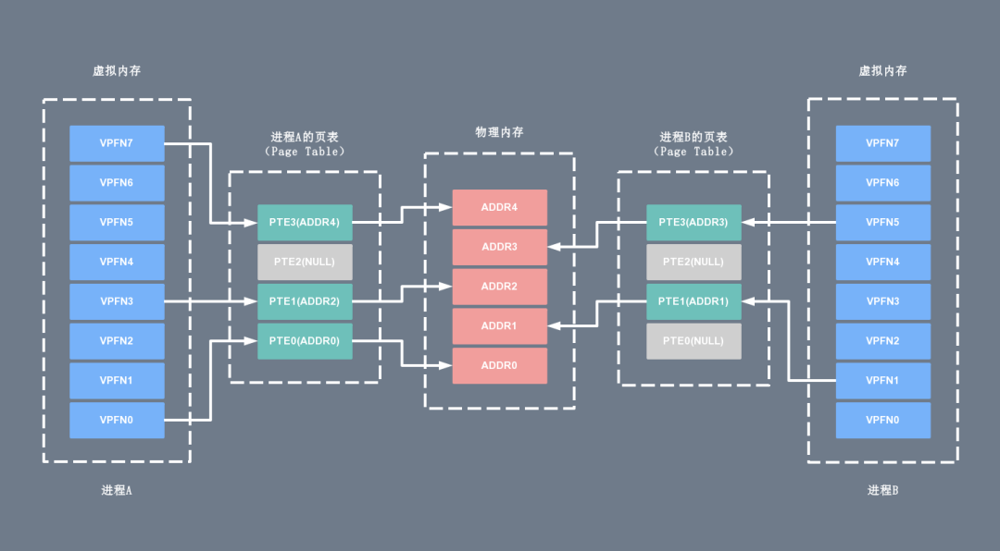

### 3.1.2 虚拟内存的划分

虚拟内存的作用：

- **地址空间：**提供更大的地址空间，并且虚拟地址空间是**连续的**，使得程序编写、链接更加简单。

- **进程隔离：**不同进程的虚拟地址之间没有关系，所以一个进程的操作不会对其他进程造成影响。

- **数据保护：**每块虚拟内存都有相应的读写属性，这样就能保护程序的代码段不被修改，数据块不能被执行等，增加了系统的安全性。

- **内存映射：**有了虚拟内存之后，可以直接映射磁盘上的文件（可执行文件或动态库）到虚拟地址空间。

  这样可以做到物理内存延时分配，只有在需要读相应的文件的时候，才将它真正的从磁盘上加载到内存中来，而在内存吃紧的时候又可以将这部分内存清空掉，提高物理内存利用效率，并且所有这些对应用程序都是透明的。

- **共享内存：**比如动态库只需要在内存中存储一份，然后将它映射到不同进程的虚拟地址空间中，让进程觉得自己独占了这个文件。

  进程间的内存共享也可以通过映射同一块物理内存到进程的不同虚拟地址空间来实现共享。

- **物理内存管理：**物理地址空间全部由操作系统管理，进程无法直接分配和回收，从而系统可以更好的利用内存，平衡进程间对内存的需求。


虚拟内存又分为内核空间和用户空间

**虚拟内存中的内核空间部分总是驻留在内存中的**

- 内核空间中有一部分内存是进程私有的（每个进程都有单独的内核栈、页表、task_struct、mem_map等）

- 有一部分空间是进程共享的（物理存储器、内核数据、内核代码等）


每个普通的用户进程都有一个单独的**用户空间**，处于用户态的进程不能访问内核空间中的数据，也不能直接调用内核函数的 ，因此要进行系统调用的时候，就要将进程切换到内核态才行。用户空间包含：代码段、数据段、bss段、堆、内存映射区、栈

其中**代码段、数据段、bss段、栈 的大小是在编译期确定的，运行时不能改变**

而堆的大小由`start_brk`和`brk`决定，可以使用系统调用`sbrk()`或`brk()`增加brk的值，达到增大堆空间的额效果。


### 3.1.3 运行时栈

由编译器自动释放，**存放函数的参数值，局部变量和方法返回值**等。每当一个函数被调用时，该函数的返回类型和一些调用的信息被存储到栈顶，调用结束后调用信息会被弹出并释放掉内存。

栈区是从高地址位向低地址位增长的，是一块连续的内在区域，最大容量是由系统预先定义好的，申请的栈空间超过这个界限时会提示溢出，用户能从栈中获取的空间较小。


### 3.1.4 内存映射段和mmap

#### 内存映射段和内存映射

内存映射段被映射到所有 `进程共享的物理页面`

- 例如每个运行Linux shell程序bash的进程都有相同的代码区域
- 每个C程序都需要来自标准C库的诸如 `printf` 这样的函数

如果每个进程都在物理内存中保持这些常用代码的副本，就会造成很大的重复浪费。**内存映射** 就是用来实现多进程共享对象的技术


**内存映射（mmap）**是内存映射文件的方法，将一个磁盘上的文件或者其他对象映射到进程的虚拟内存，以初始化这个虚拟内存区域的内容，实现**文件磁盘地址和进程一段虚拟地址的一一映射关系**。

映射后，进程就可以采用指针的方式读写操作这一段内存，而系统会自动回写脏页到对应的磁盘文件上，**应用程序处理映射部分如同访问主存**


#### 虚拟内存的两种映射方式

虚拟内存区域可以映射到两种类型的对象：

```c
#include <sys/mman.h>
void *mmap(void *addr, size_t length, int prot, int flags, int fd, off_t offset);   // mmap 申请内存
// flags 参数：
// fd = -1, flags = MAP_ANONYMOUS | MAP_PRIVATE   私有匿名映射：例如glibc分配大块内存(>128KB)
// fd = -1, flags = MAP_ANONYMOUS | MAP_SHARED    共享匿名映射：例如父子进程通信(这种机制fork不会采用写时复制，而是完全共享物理内存)
// fd != -1, flags = MAP_PRIVATE                  私有文件映射：例如加载动态共享库
// fd != -1, flags = MAP_SHARED					  共享文件映射：例如读写文件，进程通信


int munmap(void *addr, size_t length);		// mmap 释放内存
```

- mmap第一种用法是映射 **`Linux中的磁盘文件`** 到虚拟内存
- 第二种用法是映射到 **`匿名文件`**，匿名映射不映射磁盘文件，而是 **向映射区申请一块内存**

1. **映射普通文件**：例如映射一个可执行目标文件到一段连续的虚拟地址。映射完成后，这些虚拟页面没有实际交换进物理内存！知道CPU第一次引用到页面（CPU访问的虚拟地址落到这段映射区域内），发生缺页异常，操作系统调页，更新页表，这时候才通过页表建立了虚拟页面到物理页面的映射
2. **映射匿名文件**：一段内存映射的虚拟地址区域也可以映射到匿名文件，匿名文件是由内核创建的，包含的全是二进制的0。CPU第一次引用这个一个区域内的虚拟页面时，内核就在物理内存找到一个合适页，用二进制0覆盖该页的内容，然后更新页表。注意：**这种方式并没有磁盘到内存之间的数据传输**，因为这个原因，映射到匿名文件区域的页面也叫做`请求二进制零的页`


#### mmap的原理

1. **进程启动映射过程，并在虚拟地址空间中为映射创建虚拟映射区域**
   - 用户空间调用库函数`mmap`，线程启动映射过程
   - 在当前进程的虚拟地址空间中寻找一段空闲的满足要求的连续的虚拟地址作为内存虚拟映射区域
   - 对此区域初始化，并插入到进程的虚拟地址区域链表或树中
2. **调用内核空间的系统调用函数mmap（不同于用户空间函数），通过设备驱动，实现文件物理地址(磁盘)和进程虚拟地址的一一映射关系**
   - 系统在内核空间调用`mmap`，实现文件物理地址和进程虚拟地址之间的一一映射关系
   - 在文件描述符表中找到待映射文件的文件描述符，加入到内核的已打开文件表中
   - 内核mmap函数通过虚拟文件系统inode模块定位到磁盘的物理地址
   - `修改进程页表`，将文件地址和虚拟地址区域建立映射关系
3. **进程发起对这片映射空间的访问，引发缺页异常，实现文件内容到物理内存（主存）的拷贝**
   - 前两个阶段仅在于创建虚拟内存和文件的地址映射，并没有将文件拷贝到主存，真正读写的时候才会
   - 进程开始访问这片映射空间：进程读写用户空间的这段虚拟地址，查询页表，发现这段地址不在内存的物理页（虽然建立了映射，但是还没有将文件从磁盘移动到内存）
   - 发生缺页中断，内核请求磁盘调页，将缺失的页从磁盘装入主存
   - 之后进程会对其做读写操作，若写操作改变了页的内容，一段时间后操作系统会自动回写脏页到磁盘（不会立即更新，可以调用fsync强制更新）

**对比常规文件操作：**

1. 进程发起读文件请求
2. 内核通过查找该进程的文件描述符表，找到inode
3. 判断请求的文件也是否在页缓存中，如果在，直接返回这片文件页的内容
4. 如果不存在，通过inode定位到文件磁盘地址，**将数据从磁盘拷贝到页缓存，再从页缓存拷贝到用户进程**


对于没有mmap的常规文件的访问，**总共需要两次复制**。mmap的优势在于，把磁盘文件与进程的虚拟地址做了映射，这样就可以跳过page cache，**只使用一次数据拷贝**


**对于大文件的操作:**

只要进程地址空间足够大，可以直接把这个大文件映射到你的进程地址空间中，即使该文件大小超过物理内存也可以

如果系统是32位的话，进程的地址空间就只有4G，这其中还有一部分预留给操作系统，因此在32位系统下可能不足以在进程地址空间中找到一块连续的空间来映射该文件

在64位系统下则无需担心地址空间不足的问题


#### mmap的映射方式

mmap可以分为文件映射和匿名映射，以及共享方式和私有方式

一个对象可以被映射到虚拟内存的一个区域，要么作为共享对象，要么作为私有对象。

- **共享对象**：假设两个进程的虚拟内存区域(虚拟地址不一定相同)都映射到同一个共享对象，那么其中 **一个进程对该虚拟内存区域的写操作对于另一个进程也是可见的**，同时也会**反映在磁盘上**

- **私有对象**：使用 `copy-on-write` 技术，映射到了虚拟内存。两个进程将同一块物理内存作为私有对象映射到自己的虚拟内存，即共享同一个物理副本，**一个进程对该虚拟内存区域的写操作对于另一个进程而言是不可见的**，并且进程对该区域做出的写操作**不会反映在磁盘对象中**。对于每个映射私有对象的进程，私有区域的页表条目都被标记为 `只读`，区域结构被标记为写时复制。如果一个进程试图写私有区域的内容，就会在物理内存中创建一个页面的新副本，更新页表，然后恢复这个页面的写权限。这时候再次执行写操作就可以正常执行了

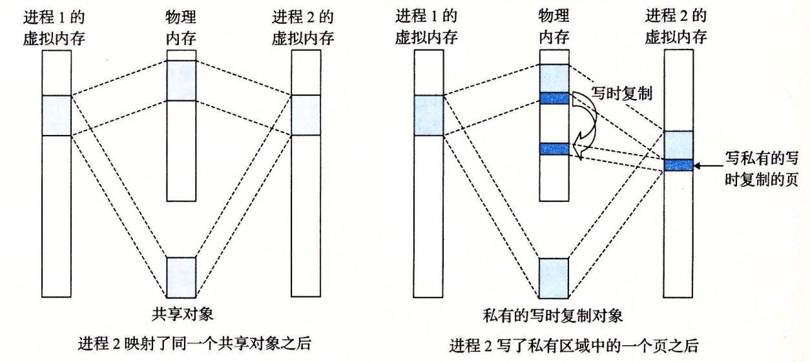


**四种映射方式：**

1. `fd = -1, flags = MAP_ANONYMOUS | MAP_PRIVATE`   **私有匿名映射：** 例如glibc分配大块内存(>128KB)
2. `fd = -1, flags = MAP_ANONYMOUS | MAP_SHARED`    **共享匿名映射：** 例如父子进程通信(这种机制fork不会采用写时复制，而是完全共享物理内存)
3. `fd != -1, flags = MAP_PRIVATE`                 **私有文件映射：** 例如加载动态共享库
4. `fd != -1, flags = MAP_SHARED`                  **共享文件映射：** 例如读写文件，进程通信


#### 再看execve

```c
execve("a.out", NULL, NULL);
```

`execve` 函数在当前进程中加载并运行包含在可执行目标文件 a.out 中的程序，用 a.out 中的程序有效替代了当前程序，加载并运行a.out需要以下步骤：

1. **删除已存在的用户区域**：删除当前进程虚拟地址的用户部分中的已存在的区域结构
2. **映射私有区域**：为新程序的 `代码段、数据段、bss段、堆、栈` 区域创建新的区域结构，所有这些新的区域都是私有的、写时复制的。
   - `代码段和数据段` 被映射为 a.out 文件中的 .text 和 .data 区
   - `bss段和堆、栈` 是请求二进制零的
3. **映射共享区域**：如果 a.out 程序于 `共享对象链接`，比如标准C库 libc.so，那么这些对象都是动态链接到这个程序的，然后再映射到用户虚拟地址空间中的共享区域
4. **设置程序计数器PC**：execve做的最后一件事就是设置当前进程上下文中的PC，使之指向代码区域的入口点

下次调度这个进程时，他将从这个入口点开始执行。Linux根据需要换入代码和数据页面

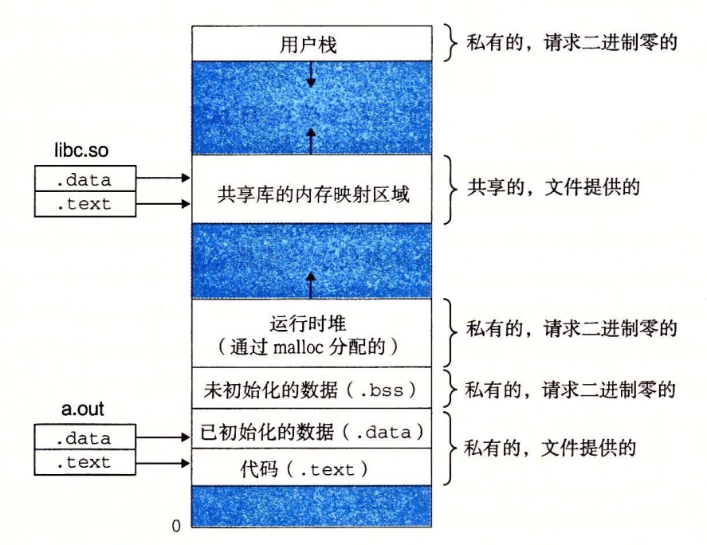


### 3.1.5 运行时堆和动态内存分配

运行时堆用于存放**进程运行中被动态分配的内存段**，位于 BSS 和栈中间的地址位。由开发人员申请分配（malloc）和释放（free）。堆是从低地址位向高地址位增长，采用链式存储结构，大小不固定。

频繁地 malloc/free 造成内存空间的不连续，产生大量碎片。当申请堆空间时，库函数按照一定的算法搜索可用的足够大的空间。因此堆的效率比栈要低的多。

堆区域从`start_brk`开始到`brk`结束，使用`malloc`动态分配内存的时候，实际上就是通过系统调用`brk()`来向上增长堆。当堆的上限已经达到内存映射段时，再调用`brk()`就会失败，堆的大小就无法继续增长了，这时候`start_brk`和`brk`之间的内存就是堆的**最大可用内存空间**

当new和malloc把所有的堆空间都申请完，并且通过系统调用`brk()`也无法扩展堆空间时，new和malloc函数申请内存就会失败（c会抛出异常，c++程序会退出）

此外，系统调用`brk()`通常是以页为单位申请扩展堆的，不是每次new就会触发系统调用brk()


#### brk() 和 sbrk()

由前面分析知道，要增加一个进程实际的可用堆大小，就需要将break指针向高地址移动，即使用Linux的`brk()`和`sbrk()`系统调用

```c
#include <unistd.h>
int brk(void *addr);
void *sbrk(intptr_t increment);
```

- `brk()` 调用将break指针直接设置为某个地址，成功返回0，否则返回-1并设置errno为`ENOMEM`

- `sbrk()` 将break指针从当前位置移动到 `increment` 所指定的增量，成功则返回break指针移动前的地址，失败返回`(void*)-1`
  - 如果将**increment设置为0**，则可以获取当前break的地址
  - 如果将**increment设置为负数**，可以缩小堆

Linux是按页进行内存映射的，如果break被设置为没有按页大小对齐，系统实际上会在最后映射一个完整的页，从而实际上已映射的内存会比break指向的地方大一些，但是使用break之后的地址是很危险的


进程所面对的虚拟内存地址空间，只有按页映射到物理内存地址，才能真正使用。受物理内存容量的限制，`整个堆空间不可能全部映射到实际的物理内存`，因此每个进程有一个 `rlimit` 表示当前进程可用的资源上限。这个限制可以通过`getrlimit()`系统调用得到


#### malloc

```c
#include <stdlib.h>
void *malloc(size_t size);
```

`malloc` 函数返回一个指针，指向 **大小至少为size字节** 的内存块，这个内存块会做内存对齐操作。（32位返回地址是8的倍数，64位返回地址是16的倍数）

如果malloc遇到问题：申请的内存大于虚拟内存剩余空间，就会返回 `NULL`，并设置 `errno`

**malloc不会初始化它返回的内存**。想要已初始化的动态内存可以使用 `calloc`，它会将分配的内存初始化为0。想要改变已分配块的大小可以使用`realloc`函数

malloc可以让我们动态分配内存：

```c
int main(){
    int *arr, i, n;
    
    scanf("%d", &n);
    arr = (int*)Malloc(n * sizeof(int));
    for(i = 0; i < n; i++)	scanf("%d", &arr[i]);
    free(arr);
    exit(0);
}
```


#### 内存碎片

造成堆利用率很低的主要原因是内存碎片，当虽然有未使用的内存，单不能用来满足分配请求时，就会发生这种现象。

内存碎片分为两种：内部碎片、外部碎片

**内部碎片：** 例如分配器增加块大小以满足对齐约束，或者对已分配块强加一个小的大小值

**外部碎片：** 空闲内存加起来满足一个分配请求，但是没有一个单独的空闲块足够大可以来处理这个请求

由于外部碎片难以量化，无法预测（取决于未来请求内存的大小），所以分配器通常试图维持 **少量的大空闲块**，而不是大量的小空闲块


#### 隐式空闲链表

任何实际的分配器都需要一个数据结构来区别块的边界，以及区别已分配块和空闲块，大多数分配器都将这些信息嵌入块本身，例如：

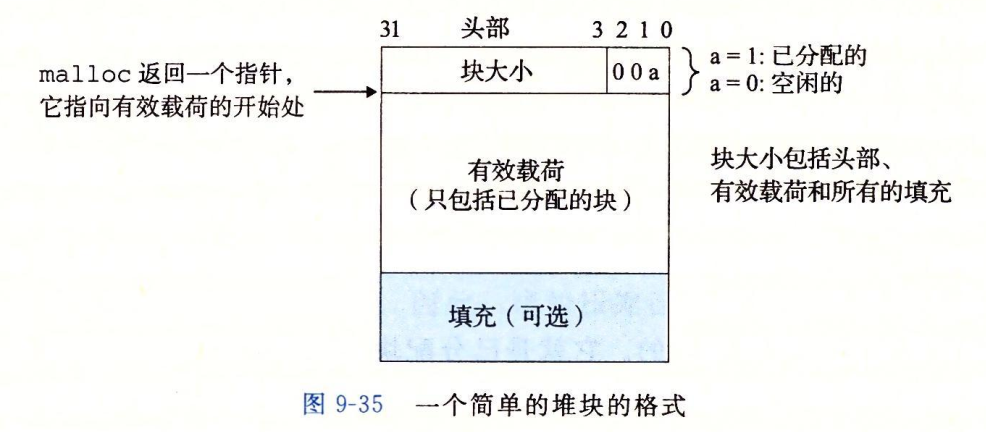

一个块由：一个字的 `头部、有效载荷、可能的填充` 组成

- 头部编码了这个块的大小，由于按字对齐（假设字长8字节），所有最后三位总是0，可以用来标识分配情况

- 有效载荷是一片不使用的填充块，大小可以任意
- 填充的目的主要是对付外部碎片以及内存对齐

将堆组织为一个连续的已分配块和空闲块的序列的结构，就称为 `隐式空闲链表`。

因为空闲块是通过头部中的大小字段隐含的连接着的，分配器必须通过 **遍历堆中的块，来寻找空闲块**

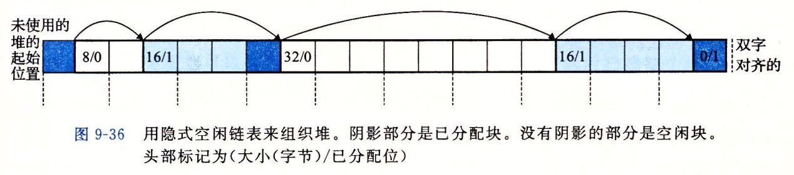

优点简单；缺点遍历开销大，以及由于对齐和头的存在，对于小内存的分配会浪费较大比例的空间


**寻找空闲块的策略**

1. **首次适配**：从头遍历找到第一个合适的空闲块。（倾向于把大的空闲块保留在链表后面，但是在靠近链表起始处留下许多碎片，从而增大较大块的搜索时间）
2. **下次适配**：从上次结束位置开始找到第一个合适的空闲块。（速度更快，但是内存利用率低）
3. **最佳适配**：遍历整个空闲链表，找到最小的符合条件的空闲块。（速度慢，但是内存利用率高）


**分割空闲块**

一旦找到匹配的空闲块，就要进行分配了

虽然选用整个空闲块的方式简单快捷，但是会造成 `内部碎片`

所以一般将这个空闲块 `分割` 成两个部分。第一部分变成 `分配块`，第二部分变成 `新的空闲块`


**合并空闲块**

当分配器释放一个已分配块时，可能有其他空闲块与这个新释放的空闲块相邻，需要合并起来利用以提供更大内存分配的可能

`立即合并`：每次释放一个块的时候，就合并所有的相邻的块

`推迟合并`：等到稍晚的时候再合并，例如等某个分配请求失败，然后扫描整个堆，合并所有的空闲块，如果 `合并失败`，说明堆空间不够分配了，这时候就要调用 `sbrk()` 向内核申请额外的堆内存


#### 显示空闲链表

隐式空闲链表的缺点：分配开销和堆块总数成正比，堆块越多分配越慢

一种更好的办法是将空闲块组织为显示数据结构，例如将堆组织成双向空闲链表，每个空闲块中包含一个 `pred` 和 `succ` 指针：

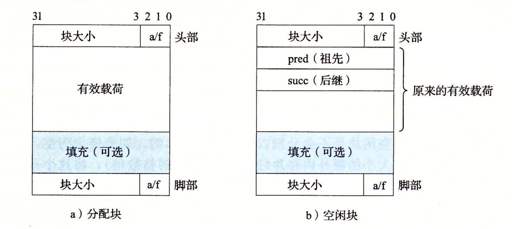

使用双向空闲链表而不是隐式空闲链表，使得首次适配的时间从块总数的线性时减少到了空闲块数量的线性时间。


**分离的空闲链表：**

类似TCMalloc的组织方式，维护多个空闲链表，每个链表中的块由相等的大小(size class)


**malloc分配内存的过程：**

- 当空闲链表够用时，直接分配，否则
- 当申请小内存时，malloc使用 `sbrk` 分配内存
- 当申请大内存时，使用 `mmap` 函数申请内存
- 这只是分配了虚拟内存，还没映射到物理内存，当访问申请的内存时，才会因为缺页异常，内核分配物理内存页

由于 `brk/sbrk/mmap` 属于系统调用，如果每次 `malloc` 申请内存都调用这三个函数中的一个，那么每次都会产生系统调用的开销，非常影响性能；

其次，这样申请的内存容易产生**内存碎片(chunk)**；

鉴于此，**malloc采用的是内存池的实现方式**：

malloc线申请一大块内存，然后将内存分成不同大小的内存块，用户申请内存时，直接从内存池中选择一块相近的内存块即可，内存池保存了各个大小的`空闲内存链表`组成的数组，数组 bins 长度128（每个元素都是双向链表），类似TCMalloc


**mmap映射区向下扩展，堆向上扩展，两者相对扩展，直到耗尽虚拟地址空间中的内存区域**


### 3.1.6 代码段和数据段

- `未初始化的数据段（BSS段）`：存放**未初始化的全局变量**，BSS 的数据在程序开始执行之前被初始化为 0 或 NULL（置0）

- `已初始化的数据段`：存放已初始化的**全局变量，静态局部变量，常量**
- `代码段`：存放 CPU 可以执行的机器指令，该部分内存`只能读不能写`，防止运行时被非法修改。通常代码区是共享的，即其他执行程序可调用它。假如机器中有数个进程运行相同的一个程序，那么它们就可以使用同一个代码段。


## 3.2 交换技术：连续内存分配

连续内存分配是直接将连续的物理内存分配给进程

- 连续内存的分配可以采用`固定分区`方案和`可变分区`的方案
- 两种方式的地址转换方案都是相似的：物理地址=基址+逻辑地址
- 地址保护策略：与限长limit进行比较
- 两种方案都会产生`碎片`，碎片越来越小，难以被再利用
- **现代操作系统一般不采用连续内存分配，都用了一层虚拟内存**
### 3.2.1 固定分区
每个分区只能容纳一个进程，容易造成内存浪费，大内存进程可能没有可用的分区
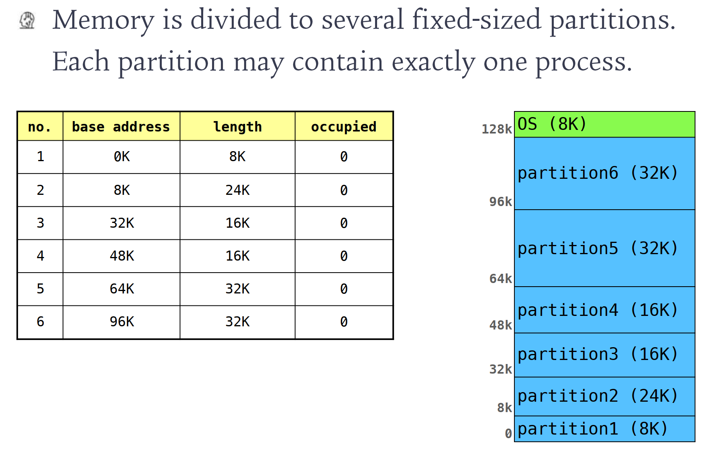


### 3.2.2 可变分区
会形成孔洞。并且随着时间的推移，孔洞越来越多，大小也不固定
- 首次适应和最佳适应在空间利用率和执行效率上都优于最坏适应
- 最坏适应可以使得新的空闲区比较大，继而可以继续使用


### 3.2.3 紧凑技术
- `内存紧缩(memory compaction)`可以解决碎片问题，将所有空闲区尽可能向下移动合并成一个大的空闲区
- 但是必须要保证程序的逻辑地址到物理地址的转换是在运行时，才能实施紧凑技术，同时该技术需要消耗很多的cpu时间，所以该技术通常不会使用


### 3.2.4 空闲内存的管理

动态分配内存时，操作系统必须对其进行管理

一般而言有两种管理办法：**位图** 和 **空闲链表**


位图用于管理一段连续的空间。分配的单元越小，位图就越大。在决定把一个占k个分配单元的进程调入内存时，存储管理器必须搜索位图，找到k个连续的0，耗时很长，这是位图的缺点


## 3.3 分段和分页技术

好文：[内存分页不就够了？为什么还要分段？还有段页式？](https://segmentfault.com/a/1190000038810428)


- 前提：**允许进程的地址空间不连续**
- **需要额外空间存储段表/页表，记录每个段/页的起始地址和限长**

### 3.3.1 分页技术


#### 分页

> **分页**机制的作用主要是提供**连续的线性地址**到**不连续的物理地址**的映射，以及用**大小相等的页**代替**大小不等的段**。由于**分页机制建立在分段机制之上**，即使在分页机制下也要先经过逻辑上的分段才行。
>
> 每加载一个进程，操作系统按照进程中各段的起始范围，在进程自己的4GB虚拟地址空间中寻找可用空间分配内存段。接着操作系统开始为这些虚拟内存分配真实的物理内存页，它查找物理内存中可用的页，然后在**页表**中登记这些物理页地址，这样就完成了分页机制下虚拟页到物理页的映射，每个进程都以为自己独享4GB地址空间。
>
> 
>
> - 在**没有虚拟内存**的计算机上，系统直接将虚拟地址送到**内存总线**上
>
> - 在**有虚拟内存**的计算机上，虚拟地址被送到**内存管理单元MMU**上，MMU负责把虚拟地址映射为物理地址

- 和固定分区类似，将**物理内存**分为很多个**大小相等**的分区`(页框/帧 fram)`，将进程虚拟地址分为多个和页框相等的`页(page)`，离散的存放到页框中

在任意时刻，虚拟内存页的集合都分为三份：

1. 未分配的：未分配的块没有任何数据和他们相关联，不占用任何磁盘空间
2. 缓存的：已缓存在物理内存中的已分配页
3. 未缓存的：未缓存在物理内存中的已分配页


虚拟内存系统必须要由某种方法来判断一个已分配的虚拟页是否缓存在物理内存的某个地方。如果是，还要确定在哪个物理页。如果不在，系统必须判断这个虚拟页存放在磁盘的什么位置，并在物理内存中选择牺牲页，将虚拟页从磁盘复制到物理内存中，替换掉这个牺牲页。

这些功能需要 `操作系统、MMU、以及存放在物理内存中的页表` 来共同完成。


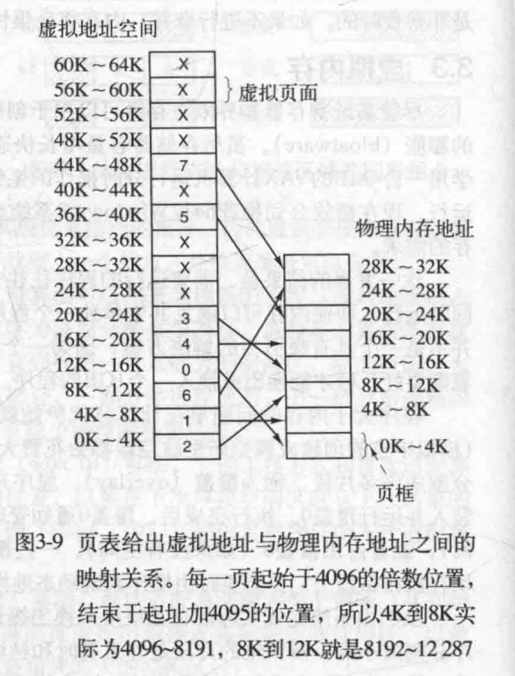

- 页表存放在物理内存中，负责记录**虚拟内存的页(page)**到**物理内存的页框(page frame)**的映射关系，**每次将虚拟地址转换为物理地址时都会读取页表**。虚拟内存页和物理内存页框的大小通常是一样的，例如上图都是4KB，实际操作系统中也有支持不同大小页混用的，x86-64架构的处理器支持 4KB、2MB和1GB大小的页
- 当访问 `虚拟地址 20500` 时，MMU看到虚拟地址落在虚拟地址的页面 5 (20K~24K)，根据其页表的映射结果，查找到页框号是 3(12K~16K)，于是把虚拟地址变为物理地址 12K + 20 = 12308，将这个物理地址送到总线即可
- 当访问一个`没有映射的虚拟地址`，例如访问地址 32K+12 ，MMU注意到该页面没有被映射，于是使CPU陷入`缺页中断(page fault)`，操作系统通过页面置换算法**换出一个页框**（把该页框中的内容写入磁盘），然后把需要访问的页面读到刚才回收的页框中，**修改页表的映射关系**（需要做两处修改，把被换出页框对应的页的映射改为X，把换入的页的映射改为换出的页框）
- 使用**页号**作为**页表(page table)**的索引，以得出对应于该虚拟页面的**页框号**，增加一个在/不在物理内存的标志位。如果该标志位是1，则将页表中查到的页框号复制到寄存器的高三位中，再加上输入虚拟地址中的低12位偏移量就得到了15位的物理地址。输出寄存器的内容即可作为物理地址送到内存总线

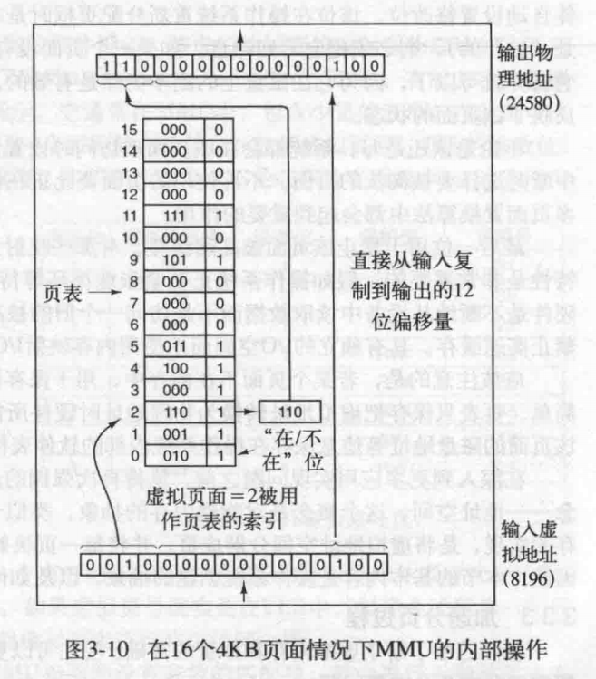

#### 页表

> 虚拟地址到物理地址的映射可以概括如下：
>
> 虚拟地址被分为 **虚拟页号(高位)** 和 **偏移量(低位)** 两部分
>
> 虚拟页号可以作为**页表的索引**，以找到该虚拟页面对应的 **页表中的项**，然后找到 **页框号**
>
> 将 **页框号** 拼接到 **偏移量** 的高位，就形成了物理地址，送往内存

- linux的页框大小/页面大小为4KB： `getconf PAGESIZE命令`
- linux页面大小4KB占12位，64位系统而言，实际上现在只用了48位，所以页号48-12=36位
- `PTBR(page-table base register)`寄存器存放了**当前进程的页表所在位置**，进程切换的时候只需要修改PTBR的值就完成了页表的切换，减少了开销，但是需要访问两次内存！(**第一次获得页表，第二次获得物理地址**)

一个典型的页表项如下：


最重要的是页框号，指示了物理页框的地址

**在/不在位(有效位)**，指示了当前虚拟页是否有对应的物理页框（在不在物理内存中）

**高速缓存禁止位**，有时候要保证数据是读取的最新的，而不是高速缓存的副本

**访问位**，当进行访问的时候(读/写)会设置访问位，缺页中断的时候没在访问的页面要优先淘汰

**修改位/dirty 位**，页面被修改过时，该位标记表示该页是脏页，脏页在被换出前必须写回磁盘

**保护位** 指出一个页允许什么类型的访问（例如0表示读写，1表示只读，还可以用多位表示执行等类型）


#### 分页过程


**如果页面命中，CPU硬件执行步骤如下：**

1. 处理器生成一个虚拟地址，并传送给MMU
2. MMU生成PBE地址，并从高速缓存/主存请求，得到该地址
3. 高速缓存/主存向MMU返回PTE
4. MMU构造物理地址，并把它传送给高速缓存/主存
5. 高速缓存/主存返回所请求的数据字给处理器

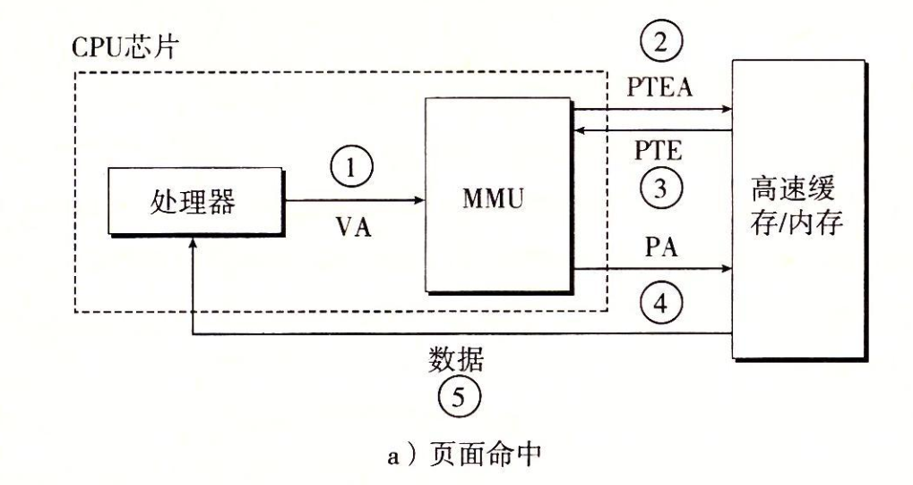


**如果页面未命中，CPU硬件执行步骤如下：**

1. 处理器生成一个虚拟地址，并传送给MMU
2. MMU生成PBE地址，并从高速缓存/主存请求，得到该地址
3. 高速缓存/主存向MMU返回PTE
4. PTE的有效位是0，所以MMU触发一次缺页异常，传递CPU中的控制到操作系统内核中的缺页异常处理程序
5. 缺页处理程序确定出物理内存中的置换页，如果这个置换页已经被修改了，则把它换出到磁盘
6. 缺页处理程序调入新的页面，并更新内存中的PTE

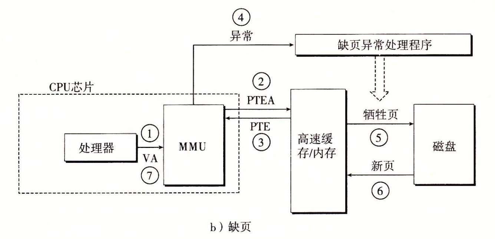


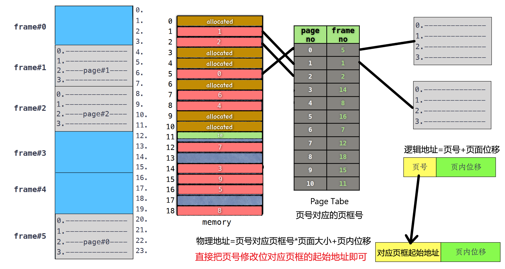


<center>

|分段|分页|
|---|---|
|信息的逻辑单位|信息的物理单位|
|段长是任意的|页长由系统确定|
|段的起始地址可以从主存任一地址开始|页框起始地址只能以页框大小的整数倍开始|
|(段号，段内位移)构成了二维地址空间|(页号，页内位移)构成了一维地址空间|
|**会产生外部碎片**|**消除了外部碎片，但会出现内部碎片**|


### 3.3.2 加速分页（快表和多级页表）

【**问题**】为了提高内存空间的利用率，页应该尽量小（4K），但是这样页表项就会越多造成页表占用很大的内存空间。例如4G的虚拟内存空间有 4G / 4K = $2^{20}$ 个页面，一个页表项占4字节，则一个进程的页表大小为 4M。如果同时存在10个进程，页表就会占用40M的内存空间，造成资源的浪费。而且页表太大的话，上下文切换的时候代价页特别大。**实际上对于一个进程来说大部分的虚拟（线性）地址根本就不会用到**


#### 转换检测缓冲区/相联存储器/快表

假设一条1字节指令要把一个寄存器中的数据复制到另一个寄存器，不分页的情况下，这条指令只需要访问一次内存，即从内存中取指令

有了分页机制之后，因为访问页表引起了多次的内存访问，需要两次访问内存了

人们观察到**大多数程序总是对少量的页面进行多次的访问**，因此只有很少的页表项会被反复读取，其他页表项很少被访问

于是设计出了 **转换检测缓冲区(TLB)** (也叫做相联存储器/快表)。TLB 通常在 MMU 中，只包含了少量的表项，每个表项记录了一个页面的相关信息

`虚拟页号`可以不必放在页表中，因为页表按虚拟地址高位就可以算出页号，但是在快表中必须存放`虚拟页号`。其他字段都跟页表相同

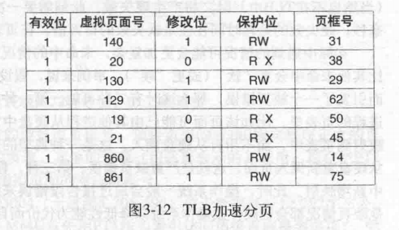

缓存的依据是程序的`局部性原理`


工作原理：

1. 当MMU收到虚拟地址时，首先通过**硬件**将虚拟页号和TLB中所有表项同时进行匹配（并行）

2. 如果虚拟页号在TLB中，并且有效，访问操作不违反保护位，则将页框号直接从TLB取出，**不必再访问页表**
3. 如果虚拟页号不在TLB，进行正常的页表查询，然后**从TLB中淘汰一个表项**，用新找到的页表项替代它


#### 多级页表


- 页表过大时，对连续的页表进行再页表	
- 多级页表的引入，可以**避免把全部页表一直保存在内存中**，特别是那些从不需要的页表（例如数据段上方和堆栈段下方有大量的未使用的空闲区）
- **多级页表能够节省存储空间**的原因是，如果一级页表中的PTE为空，那么二级页表就根本不需要建立，这是一种巨大的节约。例如如果一个进程只用到了三个页目录号，其页表所占内存大小为 16K = 页目录表（4K）+ 3 * 页表（4K）
- **只有一级页表才需要常驻内存**，虚拟内存系统可以在需要时创建、调入调出二级页表，这就减少了内存的压力，只有最经常使用的二级页表才需要缓存在主存中

例如 32位虚拟地址 被划分为 `10位的PT1域`， `10位的 PT2 域`， `12位的 Offset 域`。因为偏移量是12位，所以页大小是 4KB，共有 2^20 个页面

1. 顶级页表有1024个表项，对应于10位的PT1域。当虚拟地址送到MMU后，MMU首先提取出PT1，把该值作为访问顶级页表的索引。顶级页表中的每一项都表示一个 `4GB/1024 = 4MB` 的块地址范围
2. 索引顶级页表，得到表项中含有的二级页表的地址。
3. 把PT2域作为访问二级页表的索引，找到该虚拟页面对应的页框号。判断该页表项的"在/不在"位，是否产生缺页中断
4. 根据页框号计算出页框的起始物理地址，加上偏移量，得到真实的物理地址，访问

这样也可以扩充到三级、四级或更多级的页表

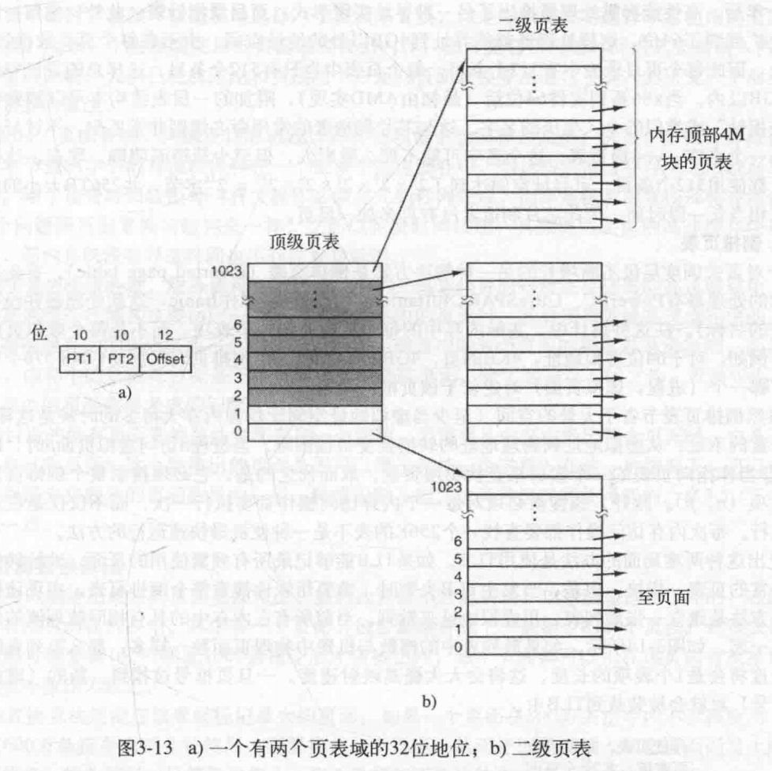

#### 倒排页表


### 3.3.3 分段技术

>在程序员眼中，一个进程由若干部分（**段**）组成，每个段都有自己的特点和用途，例如代码段，数据段，堆栈段等等。因此为了使用户可以独立考虑每个段，需要将各个部分划分为逻辑上独立的地址空间，即**分段**。

分页的情况下，虚拟地址是一维的，从0到最大地址，一个接着一个。但是对许多问题来说，有**两个或者多个独立的地址空间**可能比一个要好得多。比如一个编译器在编译过程中会建立许多表，其中可能包括：

1. 源程序正文
2. 符号表，包含变量的名字和属性
3. 用到的所有整性量和浮点常量的表
4. 语法分析树
5. 编译器内部过程调用使用的堆栈

前四个表随着编译的进行不断增长，最后一个表在编译过程中以一种不可预期的方式增长缩小，在一维存储器中，这5个表只能被分配到虚拟地址空间中连续块中，如图所示

但是有碰撞的风险。这时候就得采用分段，提供一个二维的地址，一个段号和一个段内地址

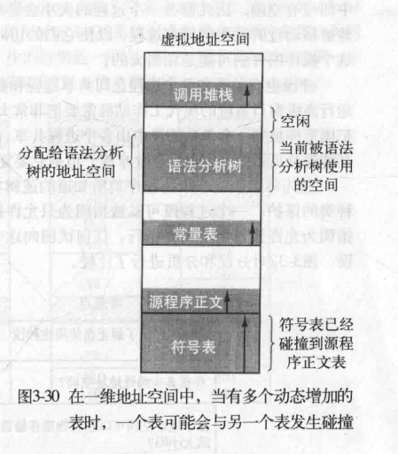


在分段的情况下，定位具体指令或数据的方式为：**<段选择子，段内偏移>**，例如 CS，IP

分段和分页的实现本质上的区别是：页面是定长的，而段不是

- 逻辑地址发生了改变，`逻辑地址=段号+段内地址`

- 分段的硬件，`段表：段号，段基址，段限长`

- 首先根据逻辑地址的段号去段表找对应段号，**比较段内地址是否超过段限长**，未超过则用段基址加上段内地址，得到物理地址

- **原理和连续内存的可变分区类似，虽然内存分的更细了，但是段和段之间依然会产生外部碎片**

  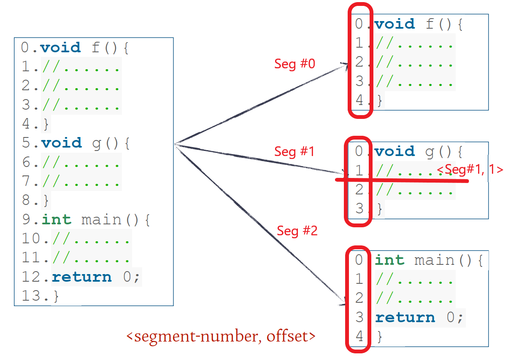


**线性地址（虚拟地址）**：

在**保护模式**下编程，访问内存时，需要在程序中给出**段基址**和**偏移量**，因为**分段是保护模式的基本特征之一**。传统上，段基址和偏移地址称为**逻辑地址**，偏移地址叫做**有效地址**，在指令中给出有效地址的方式叫做**寻址方式**。

段的管理是由处理器的**段部件**负责进行的，段部件将段基址和偏移地址相加，得到访问内存的地址。如果没有开启分页功能，段部件产生的地址就是物理地址，否则就是**线性地址**。

在分段模型下，内存的分配是不定长的，时间长了，内存空间就会碎片化，就有可能出现一种情况：内存空间是有的，但都是小块，无法分配给某个任务。为了解决这个问题，在支持分页功能后，分页功能将物理内存空间划分成逻辑上的页。页的大小是固定的，一般为 4KB，通过使用页，可以简化内存管理。


### 3.3.4 分段和分页结合

如果一个段比较大，把它整个保存在内存中可能不方便或者放不下，因此产生了对它进行分页的想法。

这样，只有那些真正需要的页面才会被调入内存。

> 在段页结合的机制下，寻址步骤为：**逻辑地址** —（段部件）— **线性地址** —（页部件）— **物理地址**

x86处理器有16K个独立的段，每个段可以容纳最多10亿个32位字。从x86-64起，分段机制已经被认为是过时的且不再被支持

x86处理器中虚拟内存的核心是两张表，即 `LDT(Local Descriptor Table，局部描述符表)` 和 `GDT(Global Descriptor Table，全局描述符表)`

每个程序都有自己的 **LDT**，但是同一台计算机上**所有程序共享GDT**。

- LDT描述每个**程序的局部段**，包括其代码段，数据段，堆，栈等。
- GDT描述**系统段**，包括操作系统本身


#### 获取段基址相关信息

段是实现 `逻辑地址` 到 `线性地址` 转换机制的基础。在保护方式下，段的特征有以下三个：`段基址，段限长，段属性`。这三个特征存储在 `段描述符`（segment descriptor）之中，用以实现从逻辑地址到线性地址的转换。段描述符存储在 `段描述符表`（全局描述符表`GDT` 和局部描述符表 `LDT`）之中，通常，我们使用段选择子定位段描述符在这个表中的位置。每个逻辑地址由 **16位的段选择子 + 32位的偏移量**组成。

- **段基址**规定线性地址空间中段的开始地址。在保护模式下，段基地址长32位。因为基地址长度与寻址地址的长度相同，所以段基地址可以是 0～4GB 范围内的任意地址，而不像实方式下规定的边界必须被16整除。不过，还是建议应当选取那些 16 字节对齐的地址。尽管对于 Intel 处理器来说，允许不对齐的地址，但是，对齐能够使程序在访问代码和数据时的性能最大化。

- **段界限**规定段的大小。在保护模式下，段界限用20位表示，而且段界限可以是以字节为单位或以4K字节为单位。偏移量是从 0 开始递增，段界限决定了偏移量的最大值。对于向下扩展的段，如堆栈段来说， 段界限决定了偏移量的最小值。


#### 段选择子

为了访问一个段，x86程序先把 `段选择子（selector）` **装入机器的6个`段寄存器`中的某一个中**（CS寄存器保存代码段的选择子，DS保存数据段的选择子，其他不太重要），每个段选择子是一个 **16位的数**

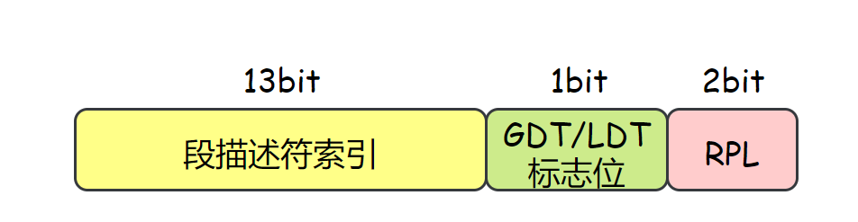

- **描述符索引**：表示所需要的段的描述符在描述符表（`GDT` 或 `LDT`）的索引编号，由这个位置再根据在`GDTR`中存储的**描述符表GDT的基址**就可以找到相应的描述符
- **TI**：TI = 0 表示描述符在 GDT 中；TI = 1 表示描述符在 LDT 中
- **RPL**：请求特权级，值大于等于 **CPL**


#### 段描述符

**段选择子装入段寄存器后**，就可以从LDT/GDT取到对应的段描述符，段描述符被装入 `微程序寄存器` 中，以便快速访问

一个段描述符由8字节构成，包括段的基址、段大小和其他信息：

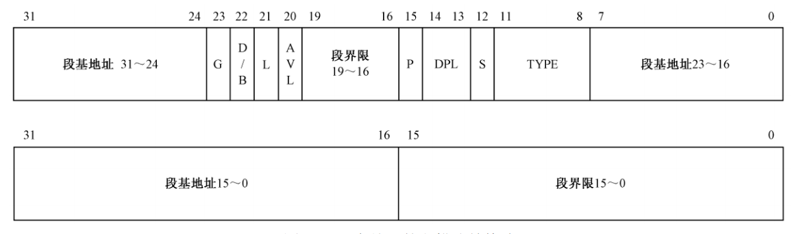

- 段描述符存放在段描述符表(`GDT`,  `LDT`)中
- **DPL**：描述符的特权级
- **段基址**：用于生成线性地址


#### GDT和LDT、IDT

和一个段有关的信息需要 8 个字节来描述，这就是**段描述符**（ Segment Descriptor），每个段都需要一个描述符。为了存放这些描述符，需要在内存中开辟出一段空间。在这段空间里，所有的描述符都是挨在一起，集中存放的，这就构成一个**描述符表**。描述符表的长度可变，最多可以包含*8K*个这样的描述符（*为什么呢？因为段选择子是16位的，其中的13bit用来作index*）

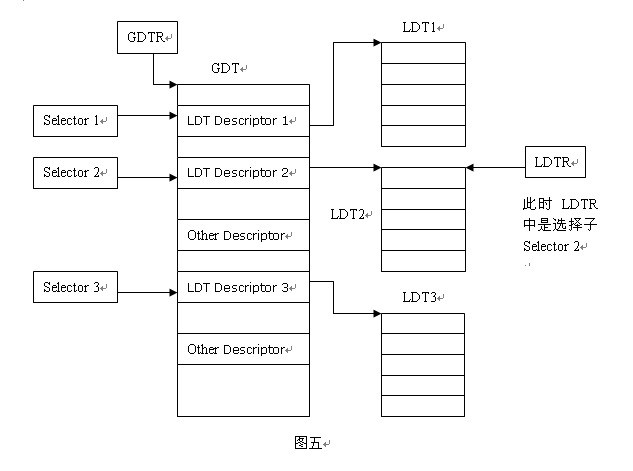

- **GDT**：在整个系统中，全局描述符表GDT只有**一张(一个处理器对应一个GDT)**，*它不是一个段，而是一个数据结构*。GDT可以被放在内存的任何位置，但**CPU必须知道GDT的基地址**，其存放在 `GDTR` 中，包括*GDT的基地址和表界限*(能被**多任务共享的内存区域**就是通过GDT完成的)

- **LDT**：局部描述符表可以有若干张，**每个任务可以有一张**，任务也可以没有局部描述符表，*它也是一个段*。我们可以这样理解GDT和LDT：GDT为一级描述符表，LDT为二级描述符表。`LDTR` 中存放的是*LDT的段选择子*的索引

  当TI=1时表示段描述符在LDT中，如上图所示：

  ①先从GDTR寄存器(48位,其中前32位base+16位长度)中获得GDT**基址**。

  ②从LDTR寄存器中获取LDT所在段的位置**索引**(LDTR高13位)。

  ③以这个位置索引在GDT中**得到LDT段描述符从而得到LDT段基址**（通过GDT表找到LDT表入口）。

  ④用段选择器高13位位置索引值从LDT段中得到段描述符。

  ⑤段描述符符包含段的基址、限长、优先级等各种属性，这就得到了段的起始地址（基址），再以基址加上偏移地址yyyyyyyy才得到最后的线性地址。

- **IDT**：中断描述符表，和GDT一样，只有一个，中断描述符表内存放256个描述符，对应256个中断。


在保护模式下，**段寄存器** 存的内容不是段值，而是 **段选择子**，选择子指示描述符在上面的三个表中的位置，所以选择子实际上就是索引值


#### 段页式内存地址转换过程


1. 首先有逻辑地址`<段选择子，段偏移量>`，将段选择子装入对应的段寄存器
2. 微程序知道具体要使用哪个段寄存器后，就根据 GDT/LDT 标识位，从对应的表中找到`段描述符`的表项
3. 从段描述符中，得到 `段基址` 和 `段限长`，如果偏移量在限长范围内，就把 32位的基地址和`段偏移量`相加成为 `线性地址`

4. 如果禁止分页，线性地址就被解释为物理地址，送到存储器用于读写操作（纯分段方案）
5. 如果允许分页，线性地址就被解释为`虚拟地址`，通过页表映射到物理地址
   - 每个运行程序都有1024个32位表组成的`页目录`（顶级页表），它可以通过`全局寄存器`定位。
   - 页目录中的每个目录都指向一个包含1024个32位表项的`页表`，页表项指向了`页框`
6. 线性地址被解释为 `<目录号，页号，偏移量>`。目录号作为索引在页目录中找到指向正确的页表的指针，随后页号被用作索引在页表中找到页框的物理地址，最后偏移量加到页框的地址上得到真正需要的字节或字的`物理地址`
   - 一个页表有描述1024个4KB页框的表项，一个页表可以处理 4MB 的内存，小于4MB的段的页目录将只有一个表项，指向唯一的页表

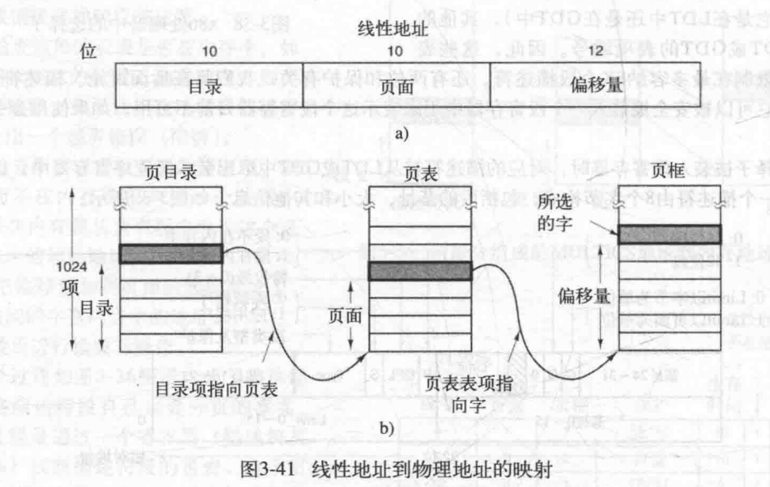


### 3.3.5 缺页中断
- 虚拟内存技术允许进程执行时不需要全部装入内存
- 程序可以比物理内存更大
- 将主内存抽象为了一个及其大的以字节为单位的存储器，将物理内存和逻辑内存分离开来，不用再去关心物理内存的限制
- 虚拟内存技术会导致缺页，执行缺页中断，去磁盘中调页，而这将会花费几十倍的时间。如果调页时发现内存中已经没有空闲的页框可用，就要采用`页面置换算法`


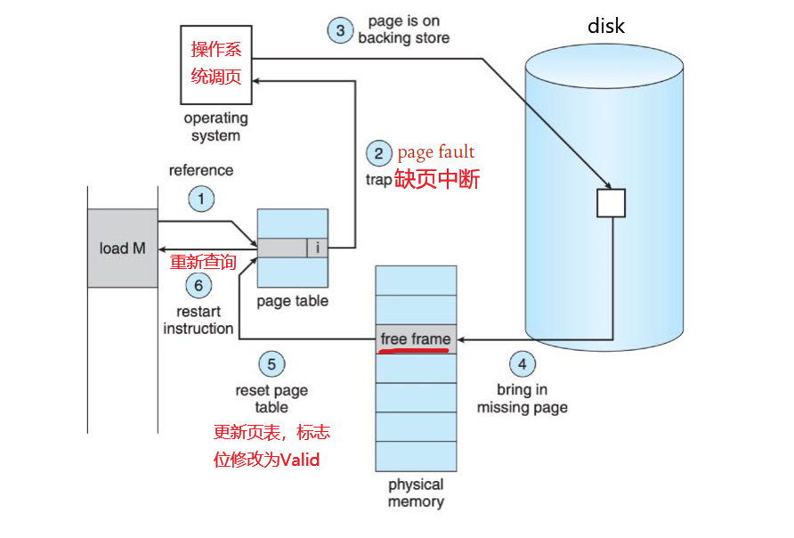

**Linux缺页异常处理：**

假设MMU在试图翻译某个虚拟地址A时，触发了一个缺页。这个异常导致控制转移到 `内核的缺页中断处理程序`，处理程序随后执行下面的步骤：

1. **判断虚拟地址A是否合法**：`task_struct`中保存了用于描述虚拟内存状态的结构`mm_struct`，其中的`mmap`字段指向了`vm_area_struct`结构体。搜索这个链表，把A和每个区域结构中的`vm_start`和`vm_end`做比较，如果这个指令是不合法的，就触发一个段错误，终止进程。（①）
   - 实际上由于虚拟内存很大，遍历链表开销很大，Linux实现时在链表上建立了一棵树，在树上进行的查找
2. **判断内存访问是否合法：** 判断进程是否有读、写、执行这个区域内存页面的权限（例如对只读页面进行写操作，或者用户态进程试图从内核的虚拟地址读取字，就会造成异常，从而重视这个进程，②）
3. 此时内核知道缺页是由于对合法虚拟地址进行合法操作造成的。于是进行缺页处理：
   1. 检查是否有空闲页框，如果有直接分配
   2. 如果没有空闲页框，按页面置换算法将物理内存中的一个页置换出去(如果是脏页，淘汰前还要回写磁盘)，换入新的页面，并 `更新页表`
   3. 缺页处理程序返回，**CPU重新启动引起缺页的指令，这条指令再次发送A地址到MMU**，这次MMU就能正常翻译虚拟地址A了，不会再产生缺页中断了


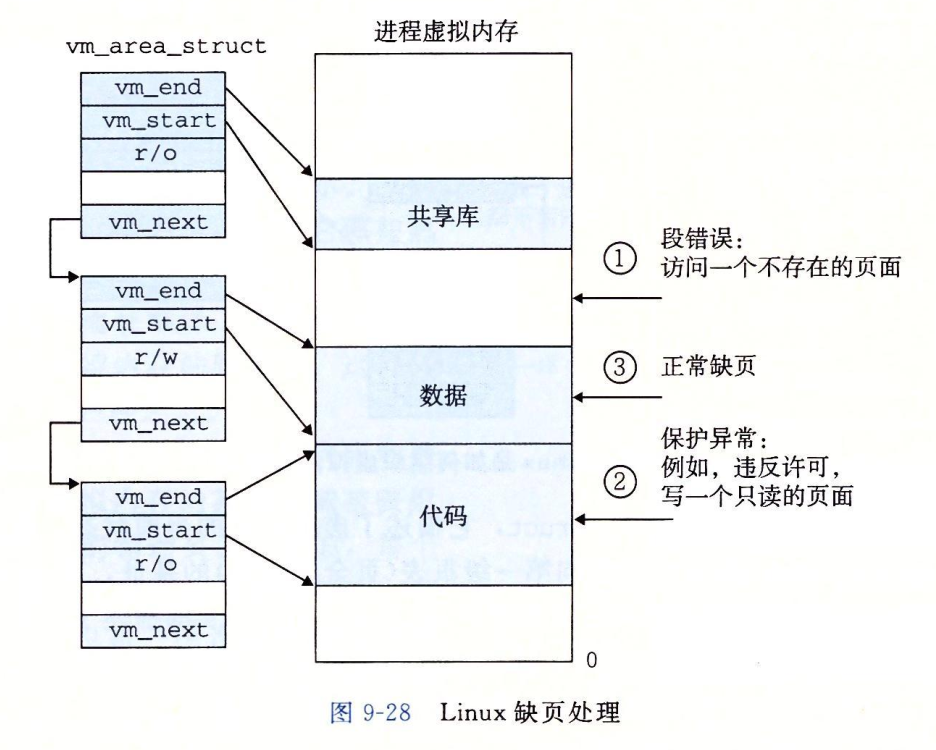


### 3.3.6 页面置换算法
> 当一个逻辑地址转换为线性地址后，通过**查页表发现所访问的页面在页表中没有映射**时（即没有加载到内存中），就会产生**缺页中断**，由页错误处理程序处理

- 当进程在执行过程中发生了缺页中断，就会**获取物理页中的空闲页，然后把对应的数据从磁盘中读取到空闲页**，然后增加页表项的映射
- 由于内存大小有限，不能无限的换入内存，发生缺页中断时如果发现**内存中已经没有空闲页框可用**，操作系统就会做`页面置换` ，需要把某一页从内存中换出以腾出空间。同时，如果**换出页面在内存驻留期间已经修改过**，就必须**重新写回磁盘**以更新该页面在磁盘上行的副本。如果没有修改过，那么就不需要回写，直接用换入的页面覆盖换出的页面即可
- 页面置换算法和Cache-memory的置换方法都类似的

#### FIFO
- 淘汰最先进入内存的页面，因为它在内存中待的时间最久

#### LRU
- 淘汰最近最少使用的页面，近似的最优页面置换算法


#### 最优页面置换算法
- 总是淘汰将来最长时间不会再使用的页面
- 无法实现。。。。。无法知道将来发生的事情

#### 二次机会页面置换算法
- 基于FIFO，FIFO可能会把经常使用的页面置换出去，为了避免，对该算法进行了一个简单的修改
- 检查头部最老页面的标志位R，如果是0，说明经过一轮之后依然没有被使用，可以立刻置换掉。如果是1，就置0并重新像新加入的一样加入到队列尾部，然后继续搜索
- 二次机会算法实际上就是寻找一个在最近的时钟间隔内没有被访问过的页面。如果所有的页面都被访问过了，该算法就退化为FIFO
- 缺点：链表中经常移动页面降低了效率

#### 时钟页面置换算法
- 改进的二次机会页面置换算法
- 将所有页面保存在环形链表中，一个指针指向最老的页面
- 当发生缺页错误时，检查指针指向的页面，如果是0，淘汰并插入新页面，如果是1，修改为0，并让指针前进一位，直到找到R位为0的页面
- 如果缺页很少，可能会所有的R都是1，这时候就退化为FIFO了
- 如果记录了太长的历史信息，

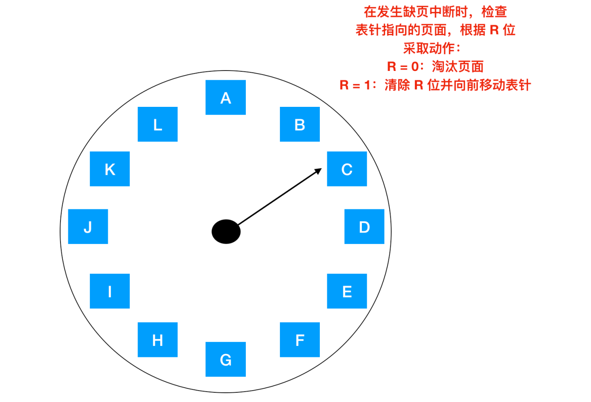


#### 工作集（Denning）页面置换

> - 某个时刻，一个进程不可能同时使用所有的页面，把*一个进程当前正在使用的页面的集合*叫做它的**工作集**，它随时间变化而变化。
> - 工作集可以用*在过去的 x 秒内实际运行时间中进程访问过的页面的集合*来近似表示：如果R = 0时，一个页面的生存时间大于 x，则说明它不再工作集中，反之在工作集中
>
> - 如果每执行几条指令程序就发生一次缺页中断，那么就称这个程序发生了**颠簸**
>
> - 不少分页系统都会跟踪进程的工作集，以确保在让进程运行之前，它的工作集就已经在内存中了，即**工作集模型**
> - 在程序运行前就预先装入其工作集页面也称为**预先调页**；而页面在需要时才被调入，而不是预先装入的做法叫做**请求调页**，这个方式在程序运行初期会出现大量的缺页中断。
> - 当发生缺页中断时，淘汰一个不在工作集中的页面，叫做**工作集页面置换算法**


### 3.3.7 抖动
根据 `局部性` 原理，虽然在整个运行过程中程序引用的不同页面的总数可能超出物理内存的总大小，但是局部性原则保证了在任意时刻，程序将趋向于在一个较小的 `活动页面(active page)` 集合上工作，这个集合就叫做 `工作集(working set)` 或者 `常驻集合(redident set)`，初始将工作集页面调度到内存后，接下来对这个工作集的引用都会命中，不会产生内存缺页导致访问磁盘

但并不是所有的程序都有良好的局部性。如果工作集的大小超出了物理内存的大小，那么程序就会产生一种不幸的状态：`抖动(thrashing)`，这时候页面将不断的换进换出。

- 如果进程运行时需要进行页面置换，而被置换的页面接下来也要被使用，这样高频率的调入调出称为`抖动`，抖动时进程花在调页的时间比执行时间还长
- 抖动的原因：并发进程数量过多，进程页框的分配不合理
- 抖动的解决方案：根据进程的抖动频率来动态的调节分配给进程的页框数量


# 4. 文件系统

> 在**Linux**中，**一切皆文件**。文件在CPU访问IO设备时的重要性：通过**显示器**对应的文件的文件描述符可以得到显示器的相关信息（设备类型，设备号等等）；通过**磁盘上的文件**的文件描述符可以得到该文件在磁盘上的盘块号，从而进行文件的读写。
>
> 那么如何建立从文件描述符到不同的IO设备的映射—**文件系统**的实现

## 4.1 文件

### 4.1.1 文件
- `文件`是信息的逻辑存储单位，提供了一种方式用来存储不同类型的信息以及在后面进行读取
- 文件是`按名存取`的：文件名，文件类型，位置，大小，时间和用户标识，保护
- 文件占用磁盘的空间比文件本身的大小要大一点
- `UNIX文件区分大小写`，`MS-DOS系统不区分大小写`
- 一般地，操作系统至少要能解释`文本文件`和`二进制可执行文件`
- 文件系统包含两个部分：`文件`和`目录`
- 文件打包之后再存入硬盘的sector，读取的时候一次也要读取一个sector，然后进行拆包

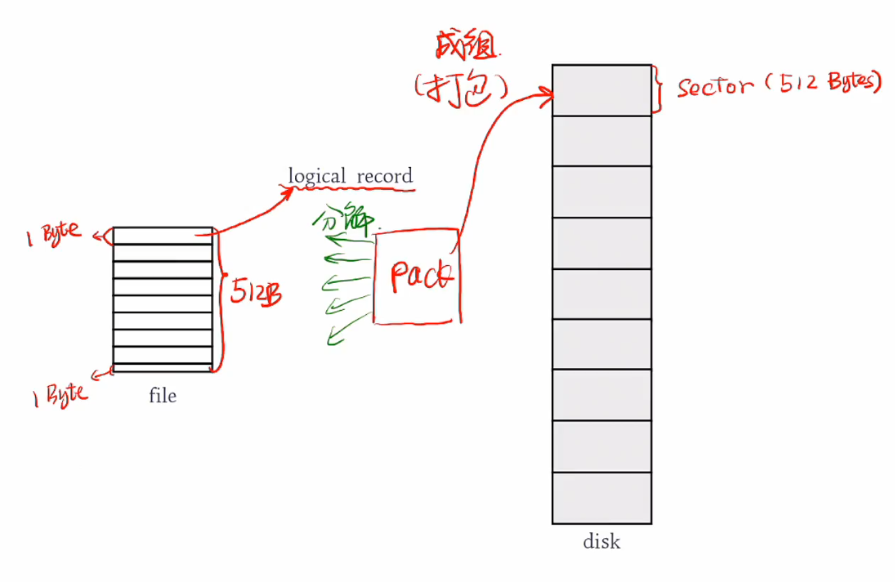

### 4.1.2 文件的实现方式

> 文件存储实现的关键问题就是记录**每个文件分别用到了哪些磁盘块**

1. **连续结构**：把文件作为一连串连续的数据块存储在磁盘上

2. **链式结构**：为每个文件构造磁盘块链表

3. **文件分配表FAT**：如果磁盘空间非常大，会造成该表占用很大的内存

4. **索引节点inode**

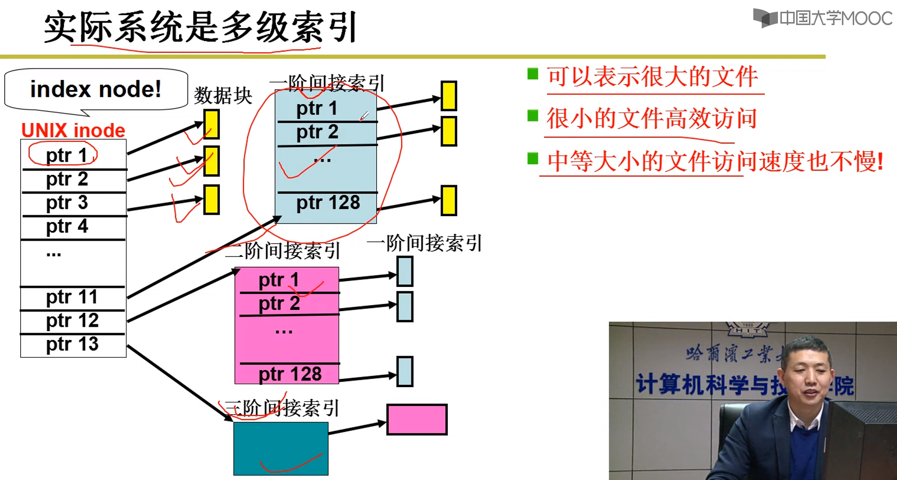


  通过文件使用磁盘：

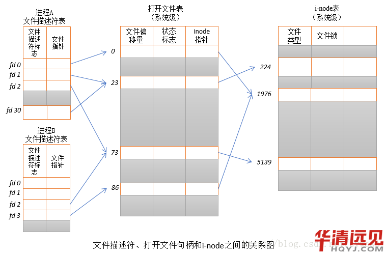

inode可以找到盘块号，用盘块号、buf等形成request，通过电梯算法放入请求队列，请求队列通过磁盘控制器最终写入到磁盘

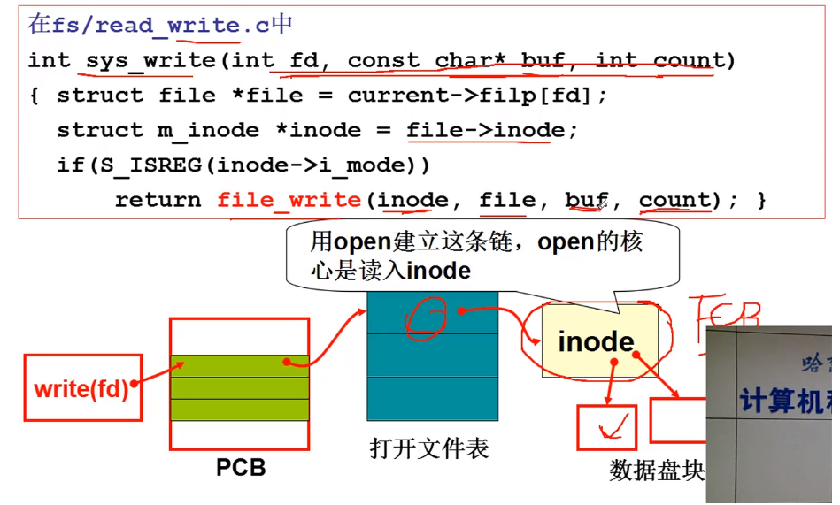

### 4.1.2 文件的访问方法
- `顺序访问`：文件信息按顺序排序，读取/写入当前文件信息后，将文件指针移向下一个邻接区域
- `直接访问`：若文件的`逻辑记录(logical record)`长度固定，就可以允许在访问文件信息时按任意顺序进行快速读取和写入。如要访问从起始位置第N个逻辑记录：`文件地址=文件起始位置+N*逻辑记录大小`


### 4.1.3 软链接/硬链接、dirent
- 链接分为`硬链接(hard link)`和`软连接/符号链接(symbol link)`
- 创建硬链接`ln filename linkname`
- 创建软连接`ln -s filename linkname`
- **软链接是一个全新的链接类型文件，会创建新的inode，有自己的block，内容是path路径，指向源文件**，实际上是相当于是快捷方式，对软连接的修改相当于对原文件修改，原文件删除之后软连接访问就报错了。`相当于快捷方式`。也正式因为存储的是源文件的path，所以软连接是**可以跨文件系统创建**的

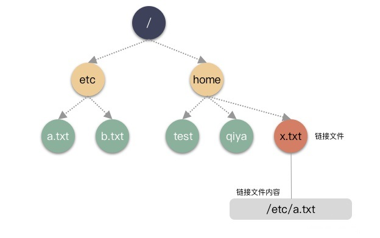

- **硬链接的inode和block都跟原文件是一样的，只是新建了dirent，增加了Links属性值**，作用是允许一个文件拥有多个有效路径名，防止误删。**删除的只是一个连接**，并不影响文件本身和其他链接，只有当**最后一个连接被删除后**，文件的数据块及目录的连接才会被释放，**文件才会被真正删除**。`完全等同原文件`

其实就是修改了当前目录所在的目录文件，增加了一个dirent，这个dirent用一个新的name名字指向原来的inode number

关于`dirent`：目录文件的inode所指向的block块中，是一个个目录条目，内核的名字缩写为 `dirent`，一个dirent本质就是一个文件名字到inode编号的映射，所以找到目录就可以找到目录下的所有文件和其inode

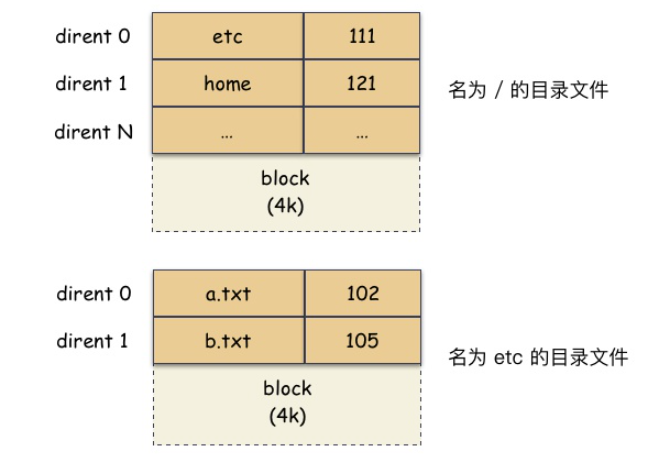

比如我们在`home`目录下创建一个 /home/test.txt 文件的硬链接文件 xxx.txt，相当于在home目录的 block 块中插入一个dirent，它**对应的inode和源文件相同**：

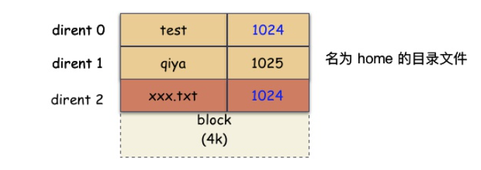

由于新旧两个dirent都是指向同一个inode，那么就导致一个限制：**硬链接不能跨文件系统**，因为**不同文件系统的inode是独立的**


### 4.1.4 fd和文件

每个进程都有自己打开的文件的字段:

```c
struct task_struct {
    // ...
    /* Open file information: */
    struct files_struct     *files;
    // ...
}
```


`files_struct`结构体用来管理进程的所有打开的文件，实际上就是存储在一个数组里，`fd`就是这个数组的索引，通过fd就可以访问到具体的`file`结构

**files_struct是各个进程独有的，管理着自己进程的打开的文件**

```c
struct files_struct {
    // 读相关字段
    atomic_t count;
    bool resize_in_progress;
    wait_queue_head_t resize_wait;

    // 打开的文件管理结构
    struct fdtable __rcu *fdt;
    struct fdtable fdtab;					// 一个动态数组，存储打开的文件的file结构，静态数组用完后使用动态数组

    // 写相关字段
    unsigned int next_fd;
    unsigned long close_on_exec_init[1];
    unsigned long open_fds_init[1];
    unsigned long full_fds_bits_init[1];
    struct file * fd_array[NR_OPEN_DEFAULT];  // 一个静态数组，存储打开的文件的 file 结构
};
```


`fdtable`中存储了 file 的指针的数组：

```c
struct fdtable {
    unsigned int max_fds;
    struct file __rcu **fd;      /* current fd array */
};
```


`file`的结构如下，**fd的本质就是数组的索引，数组元素是file结构体的指针**：

**file结构是系统级别的，是可以多个不同进程共享的**，比如fork的时候，父进程打开文件，fork出子进程，就会共享file

**多个fd也可以指向同一个file结构**，实际上`dup`函数就是这么做的(创建一个新的文件描述符指向参数的文件描述符所指向的文件)

```c
struct file {
    // ...
    struct path                     f_path;		//文件名
    struct inode                    *f_inode;	//文件的vfs类型的inode
    const struct file_operations    *f_op;

    atomic_long_t                    f_count;
    unsigned int                     f_flags;
    fmode_t                          f_mode;
    struct mutex                     f_pos_lock;
    loff_t                           f_pos;		//当前文件的偏移，控制着write/read的位置
    struct fown_struct               f_owner;
    // ...
}
```

每次完成write操作后，文件的 `f_pos` 就会增加所写入的字节数，如果着导致当前文件偏移量超出了文件长度，就会把 inode 的当前长度设置为当前文件的偏移量（也就是文件变长）

多个进程写同一个文件时，由于一个文件最后落在一个全局的 inode 上，这种并发场景则可能会产生不可预期的结果

### 4.1.5 inode和vfs

`struct file`结构体里的 `inode` 并没有直接指向具体文件系统的inode，而是操作系统抽象出来的一层虚拟文件系统，叫做 **VFS(Virtual File System)**

在VFS之下才是真正的文件系统，例如ext4之类的

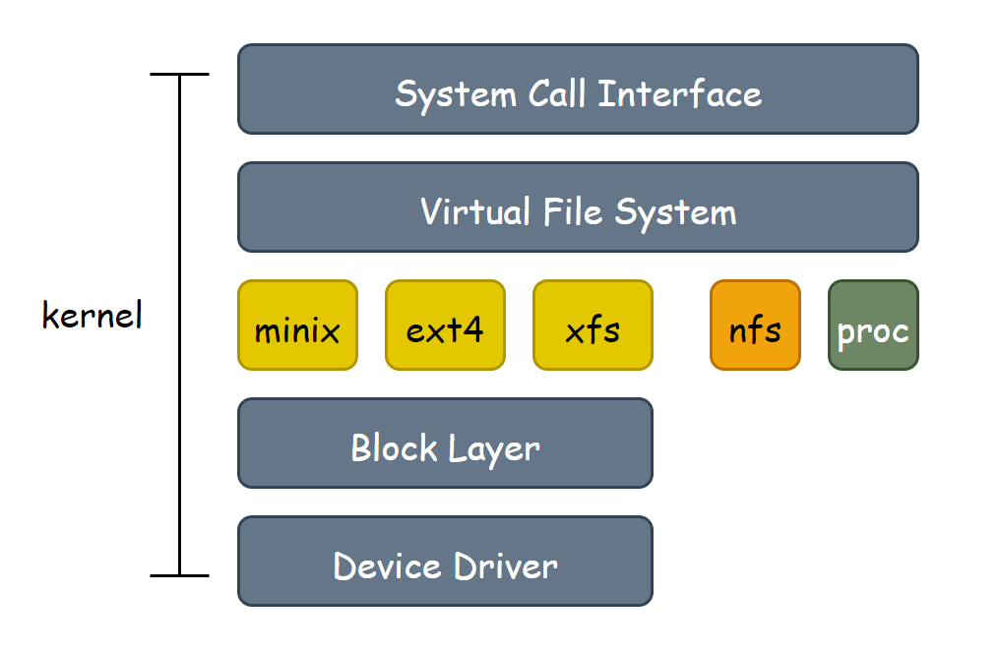

vfs存在的目的就是解耦

如果让 `struct file` 直接和 `struct ext4_inode` 这样的文件系统对接，会导致 struct file 的处理逻辑非常复杂，因为对接每个具体的文件系就要考虑一种实现。所以操作系统把底层的文件系统屏蔽掉，对外提供统一的 inode 概念，对下定义好接口进行回调注册。**Unix一切皆文件的基础就来源于此**


vfs层的inode结构如下：

```c
struct inode {
    // 文件相关的基本信息（权限，模式，uid，gid等）
    umode_t             i_mode;
    unsigned short      i_opflags;
    kuid_t              i_uid;
    kgid_t              i_gid;
    unsigned int        i_flags;
    
    // 回调函数
    const struct inode_operations   *i_op;
    struct super_block              *i_sb;
    struct address_space            *i_mapping;
    
    // 文件大小，atime，ctime，mtime等
    loff_t              i_size;
    struct timespec64   i_atime;
    struct timespec64   i_mtime;
    struct timespec64   i_ctime;
    
    // 回调函数
    const struct file_operations    *i_fop;
    struct address_space            i_data;
    
    // 指向后端具体文件系统的特殊数据
    void    *i_private;     /* fs or device private pointer */
};
```

iop回调函数在构造inode的时候，就注册成了后端的文件系统函数，比如ext4等


实际上 vfs 的 inode 是 ext4_inode_info 的一部分，固定偏移64位，给上层 vfs 时只需要将这个地址强转为 inode 类型即可


整个结构如下：

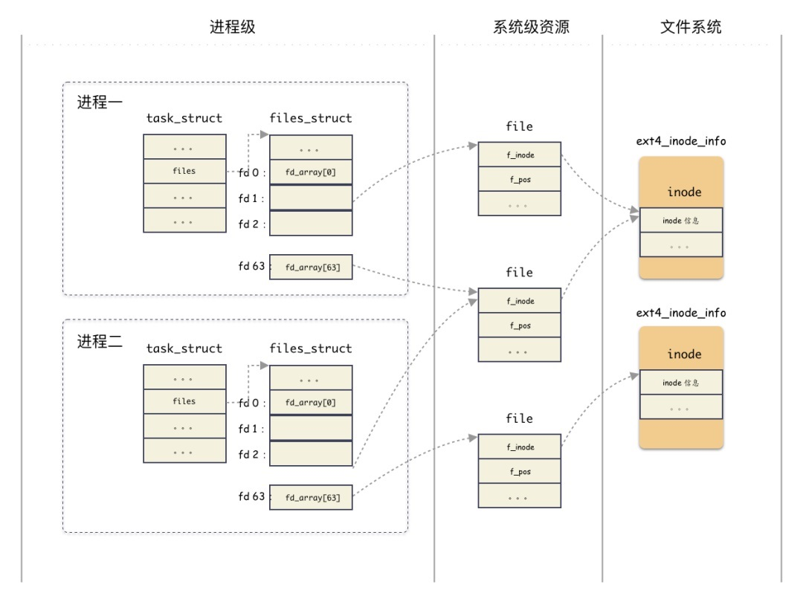


### 4.1.6 cp, mv, ln 的区别

#### cp

cp是真正的数据拷贝命令

#### mv

mv分两种情况，看**源文件和目的文件是否在同一个文件系统**

如果源和目的在同一个文件系统，mv命令的核心操作其实就是调用`rename`，只涉及到元数据的操作，只涉及到`dirent`的增删改。通常操作是删除源文件所在目录文件中的`dirent`，然后在目标目录文件中添加一个新的`dirent`项。**inode number 不变！！ 所以数据完全没有拷贝！**

如果源和目的不在同一个文件系统中，会先 `copy` 再 `remove`。copy是真正的拷贝了，读取源文件，写入到目标位置，生成全新的目标文件副本，然后删除源文件


#### ln

软连接是创建了一个新的连接文件 inode，block中存放源文件的路径，可以跨文件系统

硬连接只是在目标目录新增 `dirent` 项目，对应的 inode 还是源文件的 inode


## 4.2 目录 

- 文件系统通常提供`目录(directories)`或者`文件夹(folders)`用于记录文件的位置
- 根目录和层次目录系统：

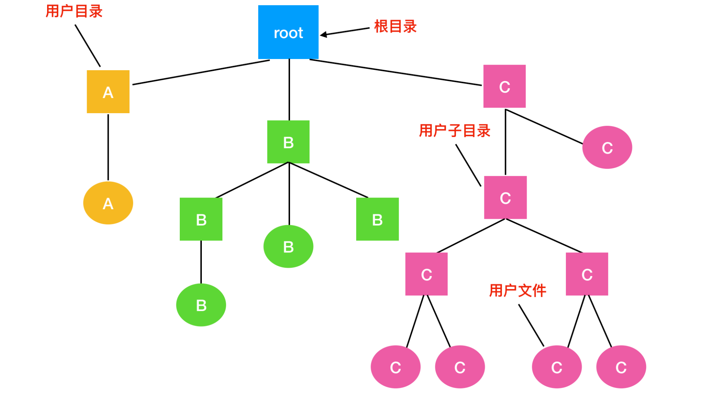

目录怎么实现：为了实现目录这种树状结构，需要在目录（也可以看作是文件）对应的磁盘块中存放`<文件名, inode号>`的映射，其中根目录的inode号固定


- 文件访问控制：基于身份的控制
  - 用户类型：Owner/Group/Other
  - 三种访问权限：r, w, x
  - 每个文件的`访问控制列表(ACL)`有9bits来标识访问控制权限
- 低级格式化(出厂)：划分磁道和扇区
- 高级格式化(用户)：构建一个文件系统

### 4.2.1 引导块
- 整个引导块占4KB，从磁盘上的字节偏移量0开始，引导块可用于启动操作系统

  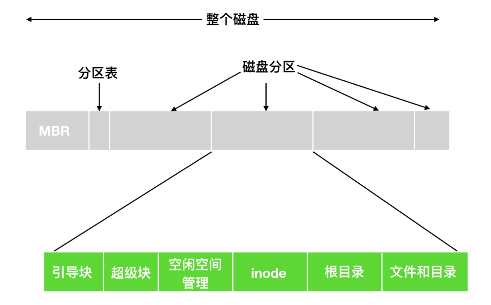

**MBR**
- 磁盘可以划分出多个`磁盘分区`，每个分区都有独立的文件系统，每个分区的文件系统可以不同。磁盘的0号分区成为`主引导记录(Master Boot Record, MBR)`，用来引导计算机。 `MBR`是硬盘驱动器上的第一个扇区，包含了`引导程序代码(440B)`和`其他信息(6B)`

**超级块**
- 超级块4KB，从磁盘上的字节的偏移4096开始，超级块包含文件系统的所有关键参数：`文件系统的大小`、`文件系统的数据块数`、`指示文件系统状态的标志`、`分配组大小`
- 在计算机启动或者文件系统首次使用时超级块会被读入内存

**空闲空间块**
- 文件系统中的`空闲块`的信息。可以用位图或者指针列表的形式给出
- BitMap位图：每个位对应一个磁盘块，为1表示是一个空闲块，为0表示是已分配块
- 链表：将空闲块链接在一起，一个空闲块包含指向下一个空闲块的指针

**inode区**

- `inode(index node)`也称为索引节点。是一个数组的结构，存放了所有文件的inode。每个文件都有一个inode，说明了文件的各方面信息，可以使用`ls -lai`查看。inode节点主要包括了以下信息：`文件类型`，`权限`，`硬链接数`，`所有者id`，`group id`，`文件大小`，`15个block地址的数组`，`最后访问时间atime`，`内容修改时间mtime`，`inode修改时间ctime`

**根目录**
- 存放文件系统目录树的根部

最后，磁盘的其他部分存放了其他所有的目录和文件

## 4.3 文件系统的实现
常见的基于磁盘的文件系统：
- UNIX：UFS
- Windows：FAT, FAT32, NTFS
- Linux：ext3, ext4
- maxOS：AFS

**文件系统实现的需求**


### 4.3.1 文件目录的实现
- 文件系统通过`文件控制块(File Control Block)`来维护文件结构，FCB包含有关文件的信息：所有者，权限，文件位置等 
- 每个文件目录项对应一个FCB

**Linux文件目录的实现：**
- UFS中的FCB被称为索引节点 inode，每个inode对应一个唯一的编号
- inode包含：`文件类型`，`权限`，`硬链接数`，`所有者id`，`group id`，`文件大小`，`15个block地址的数组`，`最后访问时间atime`，`内容修改时间mtime`，`inode修改时间ctime`
- **inode中不包含文件名**
- **UFS的entry包含文件名和inode number**，目录项长度固定，简洁，根据文件名获得inode编号，读取inode

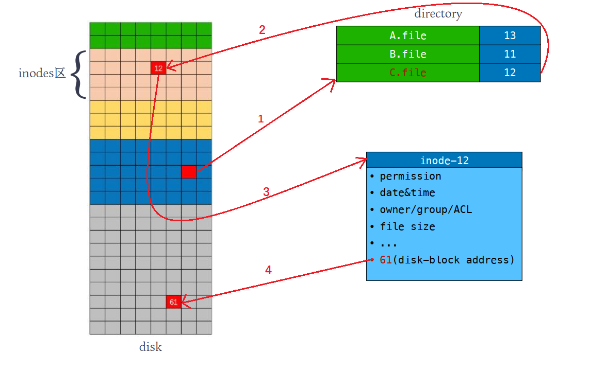

### 4.3.2 磁盘空间分配

#### 连续分配

`连续分配`：每个文件在磁盘上占用连续的物理块。 简单便于计算，但是会产生外部碎片，而且文件内容的增加不方便

#### 链接分配

`链接分配`：文件所占物理分块分散在磁盘的不同位置，**通过指针将它们连接起来**。 这样没有碎片，但是会导致一部分的空间浪费(存储head，tail，next)，而且**有断链风险**，只支持顺序访问


#### 簇

`簇(Cluster)`：一组物理块的集合，以簇为单位分配block，可以节省指针占用的空间比例。

#### 索引分配

- 数据在磁盘上按 `Block` 存储，可能一个 Block 放不下，所以我们还需要一个存放该文件所有block的**索引表**
- 写文件的时候，先按 Block 的粒度存储到磁盘的各个离散的位置，再写入 inode 的索引中

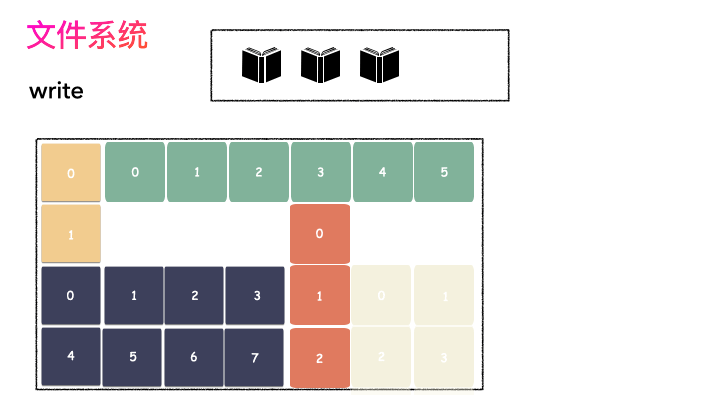

- 取文件的时候，对照 inode 这个 block 索引表，把所有的block按顺序取出来，恢复出一个完整的文件给到用户程序

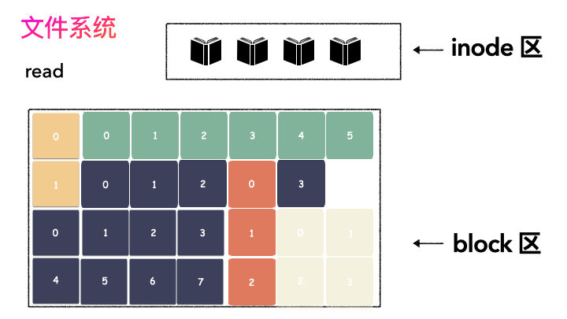

文件系统中，磁盘按照 `Block` 的力度划分空间，存储数据的区域都是 `Block`，我们叫做**数据区域**，每个Block大小固定（一般4KB）

文件存储不是连续存储在磁盘上，所以需要记录元数据，元数据记录在 `inode` 中，一个 `inode` 唯一对应一个文件。通过 inode 就可以找到 block


这也存在一个问题：每个inode都要为自己的每个block存储元信息，当**文件很大**，block数量很多的时候，inode的内存分配不灵活了，例如100G文件，按4K切，需要100M的空间来存储索引。。。解决办法就是把**索引存磁盘**，100M对于内存来说很大，对于磁盘来说却很小

我们需要用一个 **索引block** 来存储这个文件所有的 block 块所在的标号，当读取数据的时候，首先找到 索引block，再通过里面存储的用户数据所在的 block 编号找到用户数据所在的block，然后去读取数据。这就是**间接索引**，可以根据跳转次数分类成一级索引、二级索引、三级索引

例如 `ext2` ，它的 `inode->i_block[15]`数组，前12个槽存储的是直接索引，第13个存储1级索引，14个存储2级索引，第15个存储3级索引。

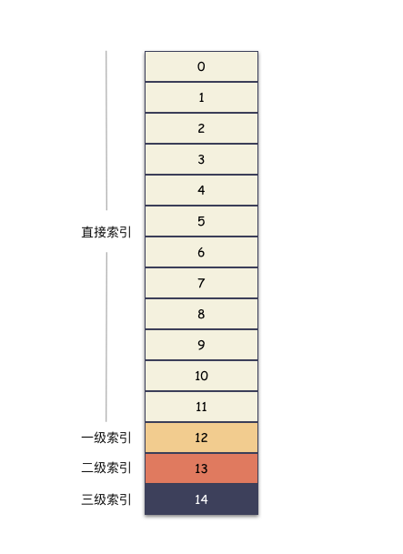

通过直接索引，可以索引 12 个block编号，所以可以存储 12 * 4KB = 48KB 以内的文件

通过一级索引，可以存储一个 4KB 的索引块，每个索引元素4B，可以索引1024个 block，所以可以寻址：4MB（1024*4KB）

同理，二级索引可以寻址 4GB

三级索引可以寻址 4TB

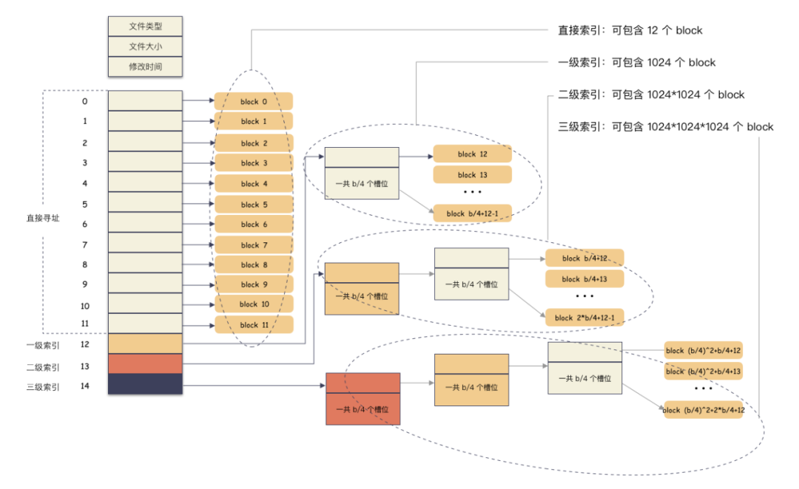

通过这种方式，ext2文件系统最大可以支撑的文件大小是：4KB + 4MB + 4GB + 4TB，约等于4T

文件系统最大支撑`16T空间`，因为一个索引号是 4B，那么最大索引就是 2^32，每个索引对应 4KB，所以就是 16TB

这时候访问一个大文件需要多次读盘！最多需要5次：inode、一级索引、二级索引、三级索引、数据块


#### 文件的稀疏语义

为什么要支持稀疏语义？

以上面1T的文件为例，如果这1T文件只有首尾写了 4KB 数据，而文件系统却要分配 1T 的物理空间，这将带来巨大的浪费。

可以等用户存了数据的时候再分配，实际数据有多少，才去分配多少的 block，而不用着急去预分配


**对于稀疏文件空洞的地方，不占用物理空间，但要保证读的时候返回全0的语义**

使用`truncate` 命令再 ext4 的文件系统创建一个文件

使用ls查看是100M, 使用du查看是0字节，使用stat查看 size是对的 block是0

```shell
$ truncate -s 100M test.txt
$ ls -lh ./test.txt
-rw-rw-r-- 1 alexander alexander 100M 8月  16 14:03 ./test.txt
$ du -sh ./test.txt
0       ./test.txt
$ stat ./test.txt
  File: ./test.txt
  Size: 104857600       Blocks: 0          IO Block: 4096   regular file
Device: 804h/2052d      Inode: 30807102    Links: 1
Access: (0664/-rw-rw-r--)  Uid: ( 1000/alexander)   Gid: ( 1000/alexander)
Access: 2021-08-16 14:03:00.266153116 +0800
Modify: 2021-08-16 14:03:00.266153116 +0800
Change: 2021-08-16 14:03:00.266153116 +0800
 Birth: -
```

这就是一个典型的稀疏文件，size只是文件的逻辑大小，实际的物理空间占用还得看 Blocks 这个数值


### 4.3.3 空闲空间管理

inode 区 和 block 区 都是初始化就构造好的，存储一个文件的时候，需要一个**空闲的 inode**，然后把数据切分成4KB大小存储到**空闲的block上**

那么怎么区分空闲的和已经在使用的 inode 和 block 呢？


可以用位图或者指针列表的形式给出
- BitMap位图：每个位对应一个磁盘块，为1表示是一个空闲块，为0表示是已分配块
- 链表：将空闲块链接在一起，一个空闲块包含指向下一个空闲块的指针


以bitmap为例：

**inode 区和 block 区分别需要另一张表，用来表示 inode 是否在用，block 是否在用，这个表的名字我们叫做 bitmap 表**。bitmap 是一个 bit 数组，用 0 表示空闲，1 表示在用，如下：

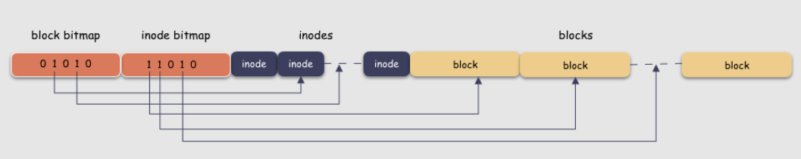

每次写新文件的时候，就要从bitmap中找到空闲的 inode 和 block，进行分配


## 4.4 从文件系统看文件的读写过程

`inode`指示了文件在磁盘扇区中的位置

每个`task_struct` 用来表示单个进程，其中维护了一个进程的所有信息，其中包括`files`的指针指向`files_struct`，其中包含了文件描述符表和打开的文件对象信息


**进程 vs 文件列表 vs inode**

1. 多个进程可以同时打开一个文件对象(文件列表表项)，例如父子进程共享文件对象
2. 一个进程可以多次打开一个文件，生成不同的文件描述符，指向不同的文件列表表项，由于是同一个文件，所以这些文件列表表项都指向了同一个inode。


**I/O缓冲区**

和高速缓冲(cache)产生的原理类似，IO中磁盘速度相对内存慢很多，所以为了加速，需要将读取过的数据缓存在内存的高速缓冲区(buffer cache)


**读文件的流程：**

1. 进程调用库函数向内核发起读文件请求
2. 内核通过检查进程的文件描述符定位到虚拟文件系统的一打开文件列表的表项，调用该文件的系统调用函数`read()`
3. `read()`通过文件表项连接到目录项的模块，找到该文件的inode
4. 在inode中，通过文件内容偏移量，计算出要读取的页
5. 通过inode找到文件对应的页缓存
   1. 如果页缓存命中，直接返回文件内容
   2. 如果页缓存未命中，产生缺页异常，创建一个页缓存，通过inode找到文件该页的磁盘地址，读取到页缓存 page cache


**写文件的流程：**

1. 先读取文件到 page cache
2. 修改页缓存的数据，然后改页被标记为脏页，写文件结束，这时候文件修改位于页缓存，并没有回写磁盘
3. 回写
   1. 手动调用sync() 或者 fsync() 系统调用把脏页写回磁盘
   2. 等pdflush进程定时把脏页写回磁盘

需要注意的是：脏页不能被置换出内存，如果脏页正在被写回，那么会被设置写回标记，改页就被上锁，其他写请求被阻塞直到锁释放


# 5. I/O

## 5.1 I/O设备
- `总线(Bus)`：一组线路和通过线路传输信息的一个协议。`并行总线(Multiple Lane)`，`串行总线(Single Lane)`。PCIe总线，USB总线是串行总线   

- `设备控制器(Controller)`：设备控制器是处理CPU传入和传出信号的系统，可以操控一个端口，从连接的设备处接收数据，并将其存储在控制器内部的一些特殊目的寄存器也就是本地缓冲区中
- 每个设备控制器都有一个应用程序与之对应，设备控制器通过应用程序(驱动)的接口通过中断与操作系统进行通信。


- `I/O地址`：控制寄存器的地址
- `编址方式`：
  - `I/O独立编址`：使用独立的I/O指令，如IN，OUT
  - `内存映射编址`：画出一块内存地址，将I/O端口地址映射进来，这样就可以使用访问内存指令对控制寄存器进行读写

## 5.2 I/O控制方式
- `轮询`：`忙式等待`，重复测试控制器中的状态寄存器的busy位，直到为0，然后设置控制寄存器为工作位，设置状态位ready，执行操作，清除状态位。
- `中断`：


- `直接内存访问DMA`：真正的异步
  
  当DMA和CPU竞争内存总线时的：
  - 周期窃取：CPU暂时停止访问内存。DMA窃取一个总线周期

## 5.3 内核I/O结构的设计
主要目标：`高效率`，`通用性`


- `缓冲和缓存`：缓冲解决速度不匹配问题，并不会提高访问速度，缓存可以提高访问速度，而且修改之后需要回写


## 5.4 传统I/O

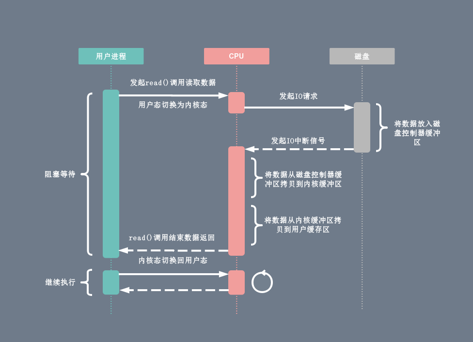

每次用户进程读取磁盘数据时，都需要 CPU 中断，然后发起 I/O 请求等待数据读取和拷贝完成，**每次的 I/O 中断都导致 CPU 的上下文切换**


## 5.5 DMA方式

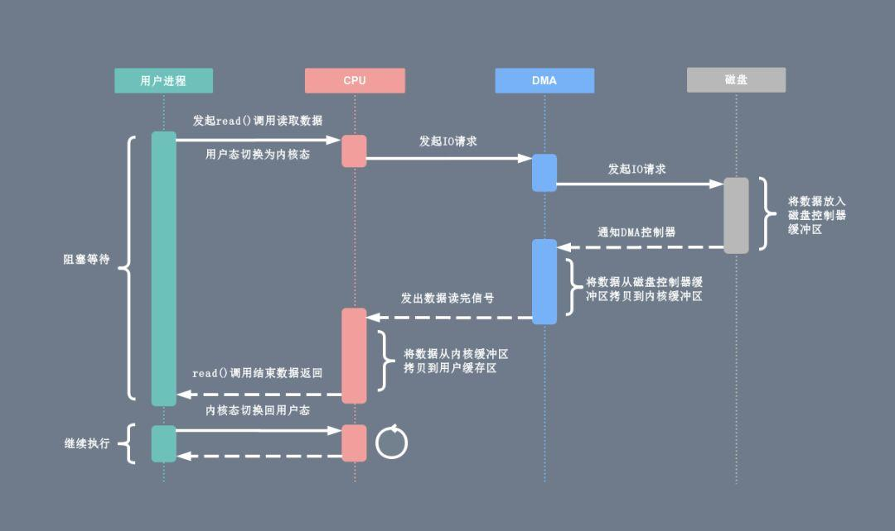

- 用户进程向 CPU 发起 read 系统调用读取数据，由用户态切换为内核态，然后一直阻塞等待数据的返回。
- CPU 在接收到指令以后对 DMA 磁盘控制器发起调度指令。
- DMA 磁盘控制器对磁盘发起 I/O 请求，将磁盘数据先放入磁盘控制器缓冲区，CPU 全程不参与此过程。
- 数据读取完成后，DMA 磁盘控制器会接受到磁盘的通知，**DMA将数据从磁盘控制器缓冲区拷贝到内核缓冲区**。
- DMA 磁盘控制器向 CPU 发出数据读完的信号，由 **CPU 负责将数据从内核缓冲区拷贝到用户缓冲区**。
- 用户进程由内核态切换回用户态，解除阻塞状态，然后等待 CPU 的下一个执行时间钟。


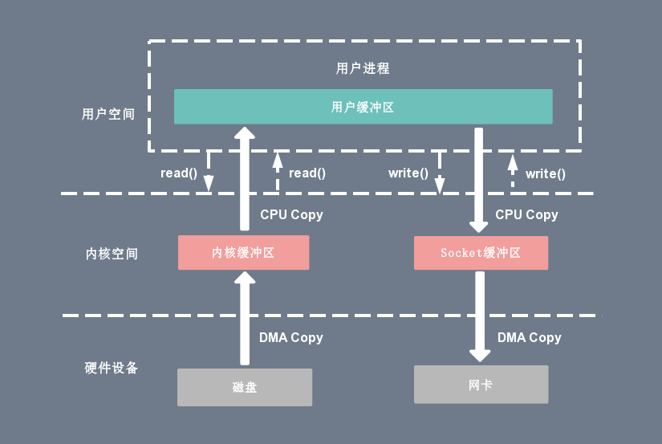


- **上下文切换：**当用户程序向内核发起系统调用时，CPU 将用户进程从用户态切换到内核态；当系统调用返回时，CPU 将用户进程从内核态切换回用户态。
- **CPU 拷贝：**由 CPU 直接处理数据的传送，数据拷贝时会一直占用 CPU 的资源。
- **DMA 拷贝：**由 CPU 向DMA磁盘控制器下达指令，让 DMA 控制器来处理数据的传送，数据传送完毕再把信息反馈给 CPU，从而减轻了 CPU 资源的占有率。

读和写均会有2次上下文切换，1次CPU拷贝，1次DMA拷贝


## 5.6 零拷贝

https://www.javazhiyin.com/46561.html

在 Linux 中零拷贝技术主要有 3 个实现思路：

- **用户态直接 I/O：**应用程序可以直接访问硬件存储，操作系统内核只是辅助数据传输。

  这种方式依旧存在用户空间和内核空间的上下文切换，硬件上的数据直接拷贝至了用户空间，不经过内核空间。因此，直接 I/O 不存在内核空间缓冲区和用户空间缓冲区之间的数据拷贝。

- **减少数据拷贝次数：**在数据传输过程中，避免数据在用户空间缓冲区和系统内核空间缓冲区之间的 CPU 拷贝，以及数据在系统内核空间内的 CPU 拷贝，这也是当前主流零拷贝技术的实现思路。

- **写时复制技术：**写时复制指的是当多个进程共享同一块数据时，如果其中一个进程需要对这份数据进行修改，那么将其拷贝到自己的进程地址空间中，如果只是数据读取操作则不需要进行拷贝操作。


### 5.6.1 用户态直接IO

> 用户态直接 I/O 使得应用进程或运行在用户态（user space）下的库函数直接访问硬件设备。
>
> 数据直接跨过内核进行传输，内核在数据传输过程除了进行必要的虚拟存储配置工作之外，不参与任何其他工作，这种方式**能够直接绕过内核，极大提高了性能。**


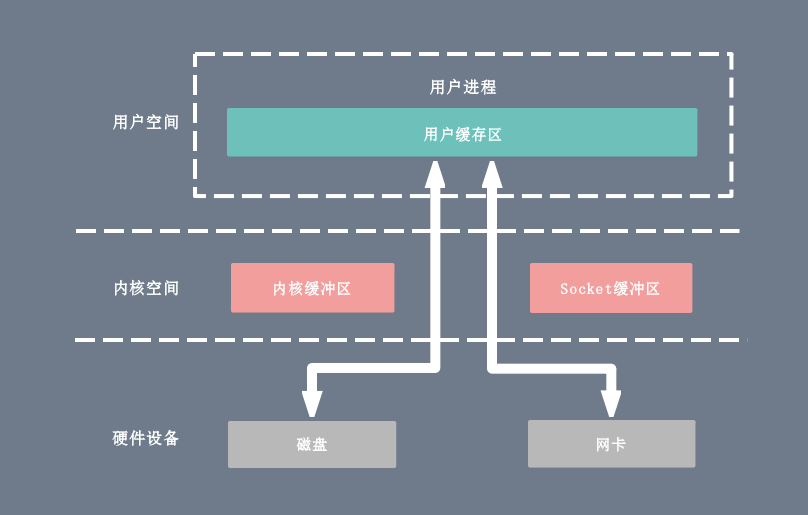


用户态直接 I/O 只能适用于不需要内核缓冲区处理的应用程序，这些应用程序通常在进程地址空间有自己的数据缓存机制，称为自缓存应用程序，如数据库管理系统就是一个代表。

其次，这种零拷贝机制会直接操作磁盘 I/O，**由于 CPU 和磁盘 I/O 之间的执行时间差距，会造成大量资源的浪费，解决方案是`配合异步 I/O 使用`。**


### 5.6.2 mmap+write

> 一种零拷贝方式是使用 mmap+write 代替原来的 read+write 方式，减少了 1 次 CPU 拷贝操作。
>
> mmap 是 Linux 提供的一种内存映射文件方法

`void *mmap(void *start, size_t length, int prot, int flags,int fd, off_t offset)`

mmap返回被映射区域的指针，该指针就是需要映射的内核空间在用户空间的虚拟地址

```c
fd = open(name, flag, mode)
tmp_buf = mmap(NULL, len, PROT_READ|PROT_WRITE, MAP_SHARED, fd, 0);
write(socket_fd, tmp_buf, len);
```


mmap实现了内核缓冲区与应用程序内存的共享，**省去了将数据从内核读缓冲区（read buffer）拷贝到用户缓冲区（user buffer）的过程**。


mmap映射文件后到虚拟内存后，直接操作这段虚拟地址就可以对文件进行读写，不需要再调用read，write了，但是直接对该段内存写入时**不会写入超过当前文件大小的内容**


然而拷贝文件的时候，内核读缓冲区（read buffer）仍需将数据拷贝到内核写缓冲区（socket buffer），大致的流程如下图所示：

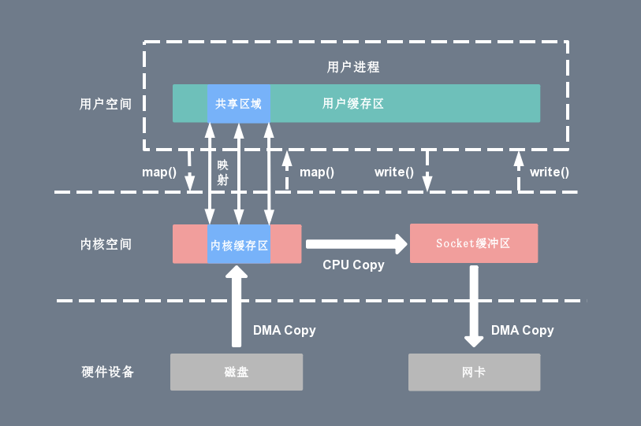

基于 mmap+write 系统调用的零拷贝方式，整个拷贝过程会发生 **4 次上下文切换**，1 次 CPU 拷贝和 2 次 DMA 拷贝

> **整个过程如下：**
>
> 1. 用户进程通过 `mmap()` 函数向内核（kernel）发起系统调用，上下文从用户态（user space）切换为内核态（kernel space）。
> 2. 将用户进程的内核空间的读缓冲区（read buffer）与用户空间的缓存区（user buffer）进行内存地址映射。
> 3. CPU 利用 DMA 控制器将数据从主存或硬盘拷贝到内核空间（kernel space）的读缓冲区（read buffer）。
> 4. 上下文从内核态（kernel space）切换回用户态（user space），mmap 系统调用执行返回。
> 5. 用户进程通过 `write()` 函数向内核（kernel）发起系统调用，上下文从用户态（user space）切换为内核态（kernel space）。
> 6. CPU 将读缓冲区（read buffer）中的数据拷贝到网络缓冲区（socket buffer）。
> 7. CPU 利用 DMA 控制器将数据从网络缓冲区（socket buffer）拷贝到网卡进行数据传输。
> 8. 上下文从内核态（kernel space）切换回用户态（user space），write 系统调用执行返回。


mmap 主要的用处是**提高 I/O 性能，特别是针对大文件**。对于小文件，内存映射文件反而会导致碎片空间的浪费(因为内存映射总是要对齐页边界，最小单位是 4 KB，一个 5 KB 的文件将会映射占用 8 KB 内存，也就会浪费 3 KB 内存)


**缺点**：当 mmap 一个文件时，如果这个文件被另一个进程所截获，那么 write 系统调用会因为访问非法地址被 SIGBUS 信号终止，SIGBUS 默认会杀死进程并产生一个 coredump，服务器可能因此被终止


### 5.6.3 Sendfile

> Sendfile 系统调用在 Linux 内核版本 2.1 中被引入，目的是简化通过网络在两个通道之间进行的数据传输过程。不仅减少了 CPU 拷贝的次数，还减少了上下文切换的次数


```c
sendfile(socket_fd, file_fd, len);   //z
```


通过 Sendfile 系统调用，数据可以**直接在内核空间内部进行 I/O 传输**，从而省去了数据在用户空间和内核空间之间的来回拷贝。

与 mmap 内存映射方式不同的是， **Sendfile 调用中 I/O 数据对用户空间是完全不可见的**。也就是说，这是一次完全意义上的数据传输过程

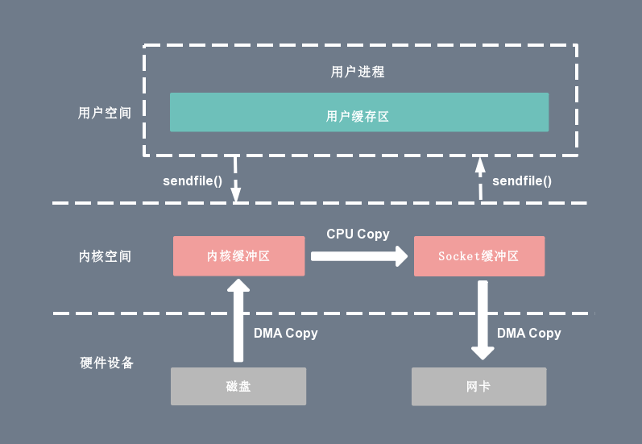

基于 Sendfile 系统调用的零拷贝方式，整个拷贝过程会发生 **2 次上下文切换**，1 次 CPU 拷贝和 2 次 DMA 拷贝。

> **整个过程如下：**
>
> 1. 用户进程通过 `sendfile()` 函数向内核（kernel）发起系统调用，上下文从用户态（user space）切换为内核态（kernel space）。
> 2. CPU 利用 DMA 控制器将数据从主存或硬盘拷贝到内核空间（kernel space）的读缓冲区（read buffer）。
> 3. CPU 将读缓冲区（read buffer）中的数据拷贝到的网络缓冲区（socket buffer）。
> 4. CPU 利用 DMA 控制器将数据从网络缓冲区（socket buffer）拷贝到网卡进行数据传输。
> 5. 上下文从内核态（kernel space）切换回用户态（user space），Sendfile 系统调用执行返回。

相比较于 mmap 内存映射的方式，Sendfile 少了 2 次上下文切换，但是仍然有 1 次 CPU 拷贝操作。


**缺点**：Sendfile 存在的问题是用户程序不能对数据进行修改，而只是单纯地完成了一次数据传输过程。


### 5.6.4 Sendfile + DMA gather copy

> Linux 2.4 版本的内核对 Sendfile 系统调用进行修改，为 DMA 拷贝引入了 gather 操作。
>
> 它**将内核空间（kernel space）的读缓冲区（read buffer）中对应的数据描述信息（内存地址、地址偏移量、数据长度）记录到相应的网络缓冲区（ socket buffer）中**，由 **DMA 根据内存地址、地址偏移量将数据批量地从读缓冲区（read buffer）拷贝到网卡设备中**


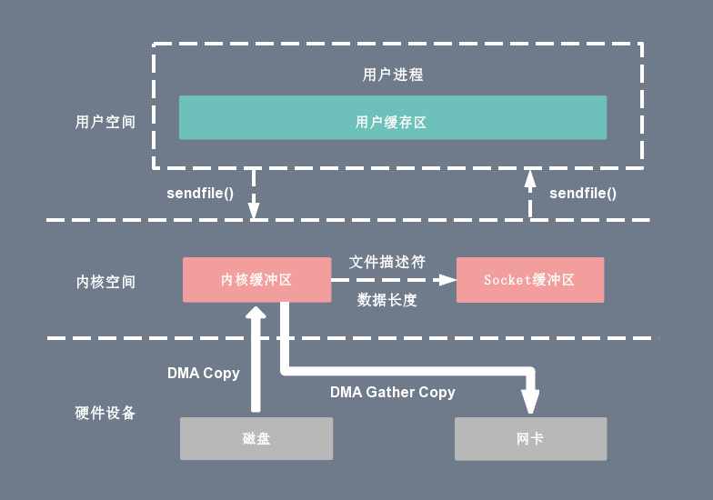

基于 Sendfile+DMA gather copy 系统调用的零拷贝方式，整个拷贝过程会发生 **2 次上下文切换、0 次 CPU 拷贝以及 2 次 DMA 拷贝**。

> **整个过程如下：**
>
> 1. 用户进程通过 `sendfile()` 函数向内核（kernel）发起系统调用，上下文从用户态（user space）切换为内核态（kernel space）。
> 2. CPU 利用 DMA 控制器将数据从主存或硬盘拷贝到内核空间（kernel space）的读缓冲区（read buffer）。
> 3. CPU 把读缓冲区（read buffer）的`文件描述符（file descriptor）`和`数据长度`拷贝到网络缓冲区（socket buffer）。
> 4. 基于已拷贝的文件描述符（file descriptor）和数据长度，CPU 利用 DMA 控制器的 gather/scatter 操作直接批量地将数据从内核的读缓冲区（read buffer）拷贝到网卡进行数据传输。
> 5. 上下文从内核态（kernel space）切换回用户态（user space），Sendfile 系统调用执行返回。


**缺点：**Sendfile+DMA gather copy 拷贝方式同样存在用户程序不能对数据进行修改的问题，而且**本身需要硬件和驱动的支持**，它**只适用于将数据从文件拷贝到 socket 套接字上的传输过程**。


### 5.6.5 Splice

Sendfile 只适用于将数据从文件拷贝到 socket 套接字上，同时需要硬件的支持，这也限定了它的使用范围。

> Linux 在 2.6.17 版本引入 Splice 系统调用，不仅**不需要硬件支持**，还**实现了两个文件描述符之间的数据零拷贝**。
>
> Splice要求两个文件描述符中必须**有一个是管道文件描述符**
>
> splice可以将一个文件的内容读入到管道，再从管道读出到另一个文件


```c
splice(fd_in, off_in, fd_out, off_out, len, flags);
```


Splice 系统调用可以在**内核空间的读缓冲区（read buffer）**和**网络缓冲区（socket buffer）**之间建立管道（pipeline），从而避免了两者之间的 CPU 拷贝操作

// 不太对？需要有一个是管道文件！应该是两次splice

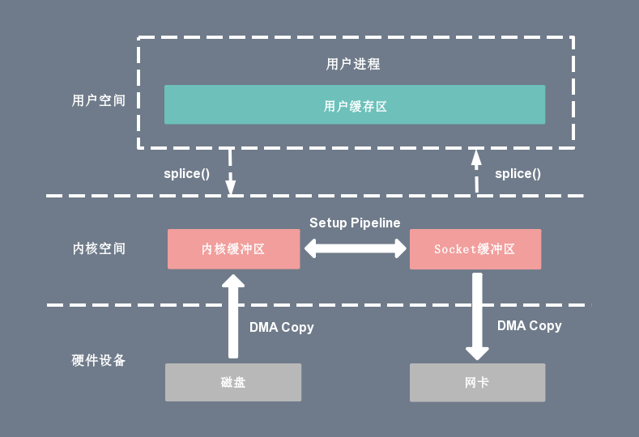

基于 Splice 系统调用的零拷贝方式，整个拷贝过程会发生 **2 次上下文切换，0 次 CPU 拷贝以及 2 次 DMA 拷贝**。


> **整个过程如下：**
>
> 1. 用户进程通过 `splice()` 函数向内核（kernel）发起系统调用，上下文从用户态（user space）切换为内核态（kernel space）。
> 2. CPU 利用 DMA 控制器将数据从主存或硬盘拷贝到内核空间（kernel space）的读缓冲区（read buffer）。
> 3. CPU 在内核空间的读缓冲区（read buffer）和网络缓冲区（socket buffer）之间`建立管道（pipeline）`。
> 4. CPU 利用 DMA 控制器将数据从网络缓冲区（socket buffer）拷贝到网卡进行数据传输。
> 5. 上下文从内核态（kernel space）切换回用户态（user space），Splice 系统调用执行返回。


Splice 拷贝方式也同样存在用户程序**不能对数据进行修改的问题**。除此之外，它使用了 Linux 的管道缓冲机制，可以用于任意两个文件描述符中传输数据，但是**它的两个文件描述符参数中有一个必须是管道设备**。


### 5.6.6 写时复制

在某些情况下，内核缓冲区可能被多个进程所共享，如果某个进程想要这个共享区进行 write 操作，由于 write 不提供任何的锁操作，那么就会对共享区中的数据造成破坏，写时复制的引入就是 Linux 用来保护数据的。


写时复制指的是当多个进程共享同一块数据时，如果其中一个进程需要对这份数据进行修改，那么就需要将其拷贝到自己的进程地址空间中。


这样做并不影响其他进程对这块数据的操作，每个进程要修改的时候才会进行拷贝，所以叫写时拷贝。


这种方法在某种程度上能够降低系统开销，如果某个进程永远不会对所访问的数据进行更改，那么也就永远不需要拷贝。


### 5.6.7 缓冲区共享

缓冲区共享方式完全改写了传统的 I/O 操作，因为传统 I/O 接口都是基于数据拷贝进行的，要避免拷贝就得去掉原先的那套接口并重新改写。

所以这种方法是比较全面的零拷贝技术，目前比较成熟的一个方案是在 Solaris 上实现的 fbuf（Fast Buffer，快速缓冲区）。

fbuf 的思想是**每个进程都维护着一个缓冲区池**，这个缓冲区池**能被同时映射到用户空间（user space）和内核态（kernel space）**，内核和用户共享这个缓冲区池，这样就避免了一系列的拷贝操作。


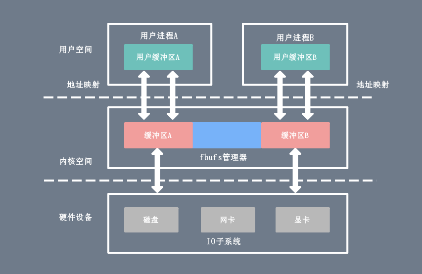

缓冲区共享的难度在于管理共享缓冲区池需要应用程序、网络软件以及设备驱动程序之间的紧密合作，而且如何改写 API 目前还处于试验阶段并不成熟


### 5.6.8 对比

无论是传统 I/O 拷贝方式还是引入零拷贝的方式，**2 次 DMA Copy 是都少不了的**，因为两次 DMA 都是依赖硬件完成的。

下面从 CPU 拷贝次数、DMA 拷贝次数以及系统调用几个方面总结一下上述几种 I/O 拷贝方式的差别：


### 5.6.9 RocketMQ和KafKa的零拷贝

RocketMQ 选择了 mmap+write 这种零拷贝方式，适用于业务级消息这种小块文件的数据持久化和传输。

而 Kafka 采用的是 Sendfile 这种零拷贝方式，适用于系统日志消息这种高吞吐量的大块文件的数据持久化和传输。

但是值得注意的一点是，Kafka 的索引文件使用的是 mmap+write 方式，数据文件使用的是 Sendfile 方式。

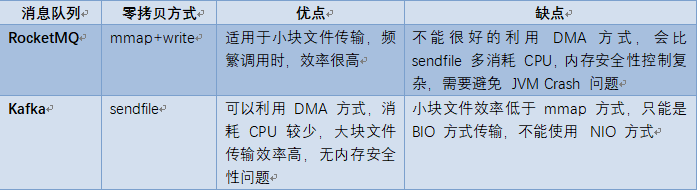

