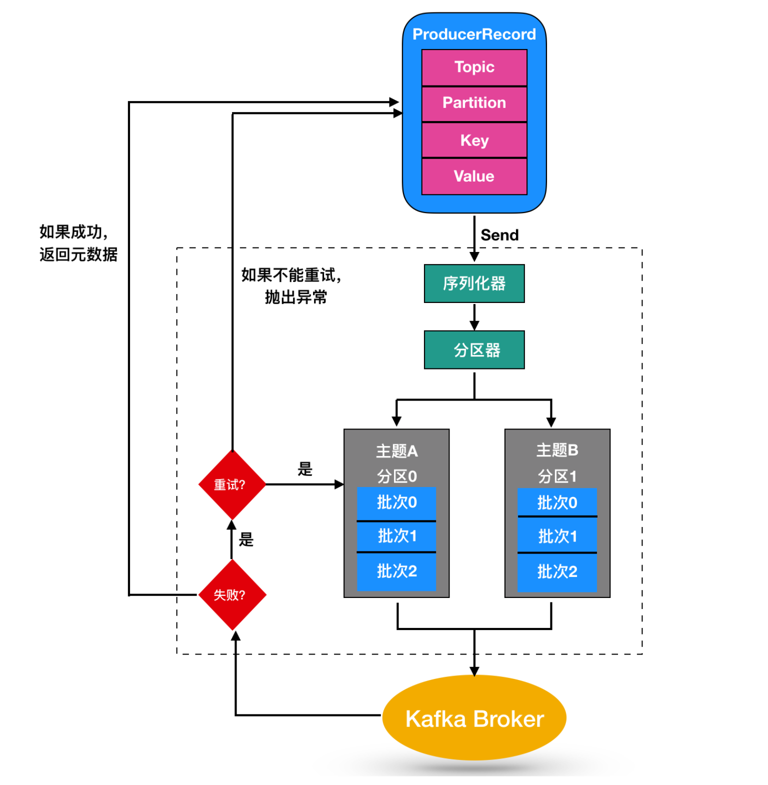
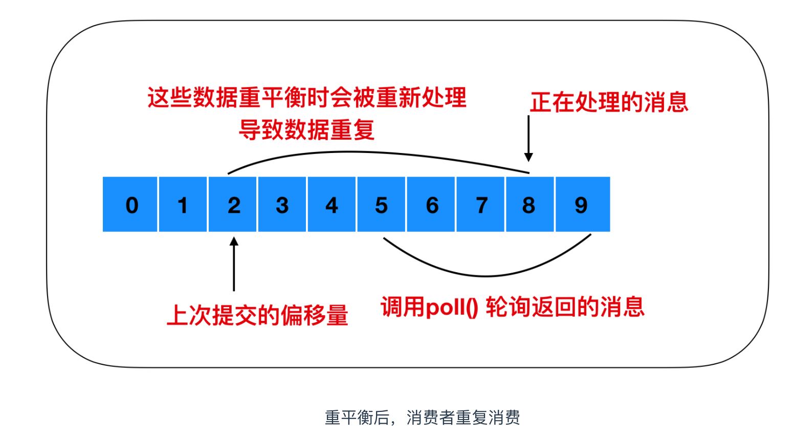
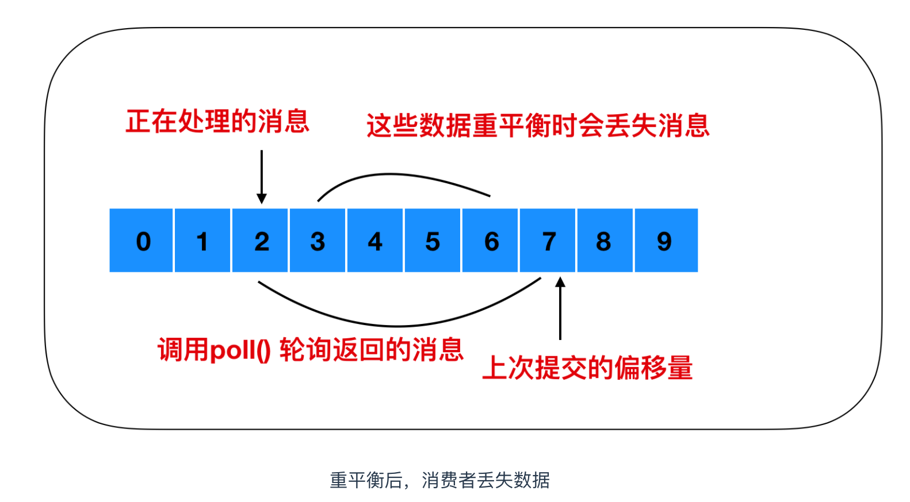

# 1. 消息队列

##  1.1 消息队列的两种模式

1. 点对点模式：一对一，消费者主动拉取数据，消息收到后消息清除。速度由客户端控制，需要客户端自己监控队列
2. 发布订阅模式：一对多，速度由发送方控制，无需客户端自己监控队列。**可以队列主动推送或者消费者自己主动拉取**，消费者消费数据之后不会立即清除消息

## 1.2 消息队列的优缺点

### **优点：**

**解耦**

扩展性

灵活性，峰值处理(**削峰**)

可恢复性：消息处理的进程挂掉，加入队列的消息仍然可以在系统恢复后被处理

顺序保证

缓冲：解决生产消息和消费消息的速度不一致的情况

**异步通信**

### 缺点：

系统**可用性降低**(MQ宕机对业务造成影响，如何保证高可用？)

系统**复杂度变高**(如何解决消息丢失？消息重复处理？保证消息的顺序？越来越复杂)

**一致性问题**：如何让保证消息数据处理的一致性(使用分布式事务)

## 1.3 如何保证消息队列的高可用

### RabbitMQ：使用普通集群

1. 在多台机器上分别启动RabbitMQ实例
2. 多个实例之间可以相互通信
3. 创建的Queue只会放在一个RabbitMQ上，其他的实例都去同步元数据(元数据不是真正的实际数据，而只是实际数据的"引用")
4. 消费的时候，如果连接的实例没有Queue，则取queue所在的实例拉取数据

缺点：

没有真正做到高可用（如果真正存放queue的集群挂了，数据就丢失了）

有数据拉取的开销和单实例的瓶颈（所有的数据都要从主实例拉取，有性能瓶颈）

### RabbitMQ：使用镜像集群

1. 每次生产者写消息到queue的时候，都会自动把消息同步到多个实例的queue上，每个RabbitMQ的节点上都有queue的消息数据和元数据，某个节点宕机，其他节点依然保存了完整的数据，不影响消费者的消费

### RocketMQ：双主双从

1. 生产者通过Name Server发现Broker
2. 生产者发送队列消息到2个Broker主节点
3. Broker主节点分别和各自从节点同步数据
4. 消费者从主节点或者从节点订阅消息

数据真正存储在Broker中，Name Server记录了Broker的地址。因为生产者并不知道哪个主节点可用，所以要去Name Server询问

## 1.4 如何保证消息不丢失

**消息丢失的原因：**

1. 生产者没有成功发送到MQ
2. 消息发送给MQ之后，MQ还没来得及持久化，MQ的Broker宕机，导致内存中的消息数据丢失了

3. 消费者获取到消息，但是消费者还没有来得及处理就宕机了，此时MQ的消息已经删除，消费者重启之后不能再消费之前的消息了            

**确保消息不丢失的方案**

1. 消息发送给MQ之后，MQ给生产者**确认收到**，否则生产者应重试
2. MQ收到消息之后进行消息的**持久化**
3. 消费者收到消息**处理完毕之后进行ack确认**，MQ收到ack之后才删除持久化的消息

## 1.5 如何保证消息不被重复消费

**重复消息产生的原因**：

生产者发送消息，MQ应答的时候由于网络原因应答失败，生产者就会发送重复消息

消费者消费完成后，ack由于网络原因没有被MQ接收到，此时消费者就会收到两条相同的消息

**如何保证不被重复消费/保证消息的幂等性**

1. 消息发送者发送消息的时候携带一个全局唯一id
2. 消费者获取消息后先根据id在redis中查询是否存在消费记录
3. 如果没有消费过就正常消费，消费完后写入redis
4. 如果消息已经消费，就应该直接舍弃

## 1.6 如何保证消息消费的顺序性

**顺序性消费**：

例如一笔订单产生了3条消息：订单创建，订单付款和订单完成，消费的时候要按照顺序依次消费才有意义

**但是多笔订单之间又是可以并行消费的**

**首先要保证消息顺序到达MQ，还要保证消息被顺序消费？** 生产者：MQ Server：消费者=1：1：1

但是这样效率太低了。。。多笔订单之间不能并行消费。。。。怎么进行并行消费呢

1. **生产者根据消息ID将同一组消息发送到一个queue中**

2. 多个消费者同时获取queue中的消息进行消费

3. **MQ使用分段锁，锁住该queue，保证单个queue中的有序消费**，当M1被消费完后，**消费者1回复ack，这时候MQ才释放该queue的锁**，这时候M2才能被消费

## 1.7 基于MQ的分布式事务

分布式事务：用户提交订单，库存服务操作库存DB减库存，订单服务操作订单DB生成订单数据。库存服务和订单服务要么同时成功，要么同时失败。。分布式事务就是为了保证不同数据库的数据的一致性

基于MQ的分布式事务是一个异步模型，将两个服务方解耦了

## 1.9 几种MQ的对比

| 特性       | ActiveMQ           | RabbitMQ                 | RocketMQ               | Kafka                                                        |
| ---------- | ------------------ | ------------------------ | ---------------------- | ------------------------------------------------------------ |
| 开发语言   | java               | erlang                   | java                   | scala                                                        |
| 单机吞吐量 | 万级               | 万级                     | **十万级**             | **十万级**                                                   |
| 时效性     | ms级               | **us级**                 | ms级                   | ms级以内                                                     |
| 可用性     | 高(主从架构)       | 高(主从架构)             | **非常高(分布式架构)** | **非常高(分布式架构)**                                       |
| 功能特性   | 文档多，协议支持好 | 并发能力强，延迟低性能好 | 功能完善，扩展性好     | 只支持主要的MQ功能，消息查询、 消息回溯等功能没有提供，大数据领域应用广泛 |

RabbitMQ，如果不考虑二次开发的话，追求稳定性和性能可以考虑使用

RocketMQ是java开发的，稳定性和性能都不错，还方便二次开发，推荐使用

Kafka一般在大数据领域用的多

# 2. Kafka

Kafka是`分布式`的基于`发布订阅`模式的`消息队列`，对消息保存时根据Topic进行归类，kafka集群有多个kafka实例，每个实例被称为一个broker

无论是kafka集群还是consumer，都依赖于`zookeeper`集群保存一些meta信息，来保证系统的可用性

## 2.1 Kafka架构

### 2.1.1 Kafka的设计原则和使用场景

设计原则：

- `高吞吐、低延迟`：kakfa 最大的特点就是收发消息非常快，kafka 每秒可以处理几十万条消息，它的最低延迟只有几毫秒
- `高伸缩性`： 每个主题(topic) 包含多个分区(partition)，主题中的分区可以分布在不同的主机(broker)中
- `持久性、可靠性`： Kafka 能够允许数据的持久化存储，消息被持久化到磁盘，并支持数据备份防止数据丢失
- `容错性`： 允许集群中的节点失败，某个节点宕机，Kafka 集群能够正常工作
- `高并发`： 支持数千个客户端同时读写

使用场景：

- `活动跟踪`：Kafka 可以用来跟踪用户行为，比如我们经常回去淘宝购物，你打开淘宝的那一刻，你的登陆信息，登陆次数都会作为消息传输到 Kafka ，当你浏览购物的时候，你的浏览信息，你的搜索指数，你的购物爱好都会作为一个个消息传递给 Kafka ，这样就可以生成报告，可以做智能推荐，购买喜好等。
- `传递消息`：Kafka 另外一个基本用途是传递消息，应用程序向用户发送通知就是通过传递消息来实现的，这些应用组件可以生成消息，而不需要关心消息的格式，也不需要关心消息是如何发送的。
- `度量指标`：Kafka也经常用来记录运营监控数据。包括收集各种分布式应用的数据，生产各种操作的集中反馈，比如报警和报告。
- `日志记录`：Kafka 的基本概念来源于提交日志，比如我们可以把数据库的更新发送到 Kafka 上，用来记录数据库的更新时间，通过kafka以统一接口服务的方式开放给各种consumer，例如hadoop、Hbase、Solr等。
- `流式处理`：流式处理是有一个能够提供多种应用程序的领域。
- `限流削峰`：Kafka 多用于互联网领域某一时刻请求特别多的情况下，可以把请求写入Kafka 中，避免直接请求后端程序导致服务崩溃。

### 2.1.2 Kafka整体结构

一个典型的 Kafka 集群中包含若干Producer，若干broker（Kafka支持水平扩展，一般broker数量越多，集群吞吐率越高），若干Consumer Group，以及一个Zookeeper。Kafka通过Zookeeper管理集群配置，`选举leader`，以及在Consumer Group发生变化时进行`rebalance`。

Producer使用push模式将消息发布到broker，Consumer使用pull模式从broker订阅并消费消息

- `follower副本机制`：一个Topic的一个partition可以创建副本，放到其他的Broker里面，防止leader partition宕机，集群中节点故障时可以进行故障转移，保证高可用。**leader对外提供服务，follower只是被动跟随**
- `多个Partition`：提高并发量
- `多个Topic`：分类消息
- `消费者组`：提高消费能力
- `Offset`：每个Record发布到broker后，分配一个offset，offset在单个partition中是有序递增的
- `Record`：消息、记录，包含key, value, timestamp
- **Broker是物理概念**，指服务于Kafka的一个node
- **Topic是逻辑概念**，作为消息的分类标识
- **Partition是物理概念**，同一个topic的数据，会被分散的存储到多个partition中，这些partition可以在同一台机器上，也可以是在多台机器上。单个partition中的数据有序，但整个topic是无法保证有序的。每个partition都对应一个log文件，log文件存储的就是producer生产的数据，不断追加到log文件的末尾，每条数据都有自己的offset
  - 在实现上都是以每个Partition为基本实现单元的
  - 消费时，**每个消费线程最多只能使用一个partition**
  - 一个topic中partition的数量，就是每个user group中消费该topic的**最大并行度数量**
- 消费者：一个消费者/消费者组按 Topic 进行消费
- **消费者组Consumer Group**也是逻辑概念，是Kafka实现单播和广播两种消息模型的手段。同一个topic的数据，会广播给不同的group；同一个group中的worker，只有一个worker能拿到这个数据。组中的每个消费者都会实时记录自己消费到哪个offset了，以便出错恢复时，从上次的位置继续消费
  - **重平衡 Rebalance**： 消费者组内某个消费者实例挂掉后，其他消费者实例自动重新分配订阅主题分区的过程。Rebalance 是 Kafka 消费者端实现高可用的重要手段
- **同一个Topic的同一个partition只能被一个消费者组中的一个消费者消费**。consumer group是kafka提供的可扩展且具有容错性的消费者机制。既然是一个组，那么组内必然可以有多个消费者或消费者实例(consumer instance，是一个线程或者一个进程)，它们共享一个公共的group ID。组内的所有消费者协调在一起来消费订阅主题(subscribed topics)的所有分区(partition)。当然，每个分区只能由同一个消费组内的一个consumer来消费。最好让partition的数量等于被消费的组中的消费者数量，这样正好一个partition被一个消费者消费

### 2.1.3 Kafka文件存储

涉及了磁盘IO，Kafka为什么依然那么快呢？

1. 消息是`顺序读写`到磁盘的，为了提高速度。。顺序磁盘IO的速度甚至快于随机内存访问
2. Kafka实现了`零拷贝`来快速移动数据，避免内核之间的切换
3. `消息压缩` Kafka生产者和消费者都会进行消息的压缩，使消息发的更快一些。最后由Consumer进行解压缩。压缩的算法是随着key、value一起发送过去的
4. `分批发送`

- 为了防止log文件过大导致数据定位效率低下，Kafka采用**分片**和**索引**机制，每个partition分为多个segment，每个segment对应两个文件：.log和.index，这些文件位于一个文件夹：topic名+分区号
- **而.log和.index文件命名以`当前segment中的第一条消息`的offset命名**：00000000000000239430.log

### 2.1.4 Kafka生产者

分区的原因：方便在集群中扩展，可以提高并发(可以以Partition为单位读写)

`ProducerRecord对象的结构`：**Topic + Partition + Key + Value**

- 首先键值对对象由`序列化器`转化为字节数组，以便在网络上传输，然后到达分区器
- 分区器分区的原则：
  - 如果ProducerRecord指定了有效的分区号，`分区器`便分配到对应Partition
  - 否则将**key的hash值与topic的partition数进行取模**得到partition值
  - 没有partition也没有key，round-robin算法生成随机的partition值。(**第一个partition随机，后续就轮询了**)
- ProducerRecord 还有关联的时间戳，如果用户没有提供时间戳，则使用当前时间

写入Broker失败后，会返回一个错误，成功后则返回Topic，Partition，Offset

**数据的可靠性**：

- Topic的**全部follower**与leader全部同步完成后，才发送ack给生产者：`延迟高`，容忍n台故障需要n+1个副本

- Topic的**半数以上follower**与leader全部同步完成后，才发送ack给生产者：`延迟低`，容忍n台故障需要2n+1个副本

1. **Kafka采用全部follower同步才发送ack的方案，但进行了优化**，但是Leader维护了一个`ISR`(in-sync replica set)，即和leader保持同步的follower集合。只要ISR中的follower完成同步后，leader就给follower发送ack，**如果follower长时间**(replica.lag.time.max.ms)**未向leader同步数据**，**该follower将被踢出ISR**。Leader发生故障之后，会从ISR中选举新Leader
2. **ack应答机制，三种级别，`acks`参数**：
   - 0：**producer不等待broker的ack**，最低延迟，最大吞吐，但是可能丢失数据，类似UDP
   - 1：**producer等待broker的ack**，**partition的leader落盘成功就返回ack**，如果follower同步之前leader故障，会丢失数据。同时消息的发送也可以选择同步或者异步，异步使用回调函数通知生产者
   - -1：**producer等待broker的ack，pritition的leader和ISR的所有follower全部落盘才返回ack**，但是follower同步完成后，broker返回ack前若leader故障，可能造成数据重复。最强可靠性

**数据的一致性：故障处理**

- LEO：每个副本的最后一个offset
- HW：所有副本最小的LEO
- **消费一致性：HW之前的数据才对Consumer可见**
- **存储一致性**：出现故障，重新选举Leader，会保证其他follower与HW一致，然后**同步新leader中到其LEO的数据**

### 2.1.5 Kafka消费者

KafkaConsumer对象订阅主题并消费

当生产者生产速度超过了消费者的消费速度，就需要多个消费者共同参与该主题的消费(消费者组)

如果生产者产生的消息依然很多，让消费者吃不消，就继续增加消费者

此时如果再向消费者组中增加消费者已经不起作用了，因为一个分区只能被消费者组中的一个消费者消费(**消费者组中的消费者数量应该≤该主题的分区数**)。所以**创建主题的时候要考虑使用比较多的分区数**，这样可以再消费负载高的情况下增加消费者来提高性能

**消息只需一次写入，就可支持任意多的应用读取这个消息**，也就是说，**每个应用都可以读取到全量的消息**。

**两种消费方式：**

1. `点对点模式`：一个消费者群组消费一个主题中的消息，点对点的消费方式又被称为`消息队列`
2. `发布-订阅模式`：一个主题中的消息被多个消费者群组共同消费

**消费者重平衡(rebalance)**: 最初是一个消费者订阅一个主题并消费其全部分区的消息，后来有一个消费者加入群组，随后又有更多的消费者加入群组，而新加入的消费者实例`分摊`了最初消费者的部分消息，这种把分区的所有权通过一个消费者转到其他消费者的行为称为`重平衡`

重平衡为消费者群组带来了`高可用性` 和 `伸缩性`，使得我们可以放心的添加和移除消费者

消费者通过向`组织协调者`（Kafka Broker）发送心跳来维护自己是消费者组的一员并确认其拥有的分区。只要消费者定期发送心跳，就会认为消费者是存活的并处理其分区中的消息。当消费者检索记录或者提交它所消费的记录时就会发送心跳。如果过了一段时间未收到心跳，会话（Session）就会过期，组织协调者就会认为这个 Consumer 已经死亡，就会触发一次`重平衡`。

重平衡的过程对消费者组有极大的影响。因为每次重平衡过程中都会导致万物静止(STW)

**poll()轮训**

`max.partition.fetch.bytes`参数：该属性指定了服务器从每个分区里返回给消费者的`最大字节数`。它的默认值时 1MB，也就是说，`KafkaConsumer.poll()` 方法从每个分区里返回的记录最多不超过 max.partition.fetch.bytes 指定的字节。在为消费者分配内存时，可以给它们多分配一些，因为如果群组里有消费者发生崩溃，剩下的消费者需要处理更多的分区。max.partition.fetch.bytes 的值必须比 broker 能够接收的最大消息的字节数(通过 max.message.size 属性配置)大，**否则消费者可能无法读取这些消息，导致消费者一直挂起重试**。 在设置该属性时，另外一个考量的因素是消费者处理数据的时间。消费者需要频繁的调用 poll() 方法来避免会话过期和发生分区再平衡，如果单次调用poll() 返回的数据太多，消费者需要更多的时间进行处理，可能无法及时进行下一个轮询来避免会话过期。如果出现这种情况，可以把 max.partition.fetch.bytes 值改小，或者延长会话过期时间

**偏移量**

消费者在每次调用`poll()` 方法进行定时轮询的时候，会向一个叫做 `_consumer_offset` 的特殊主题中发送消息，这个主题会保存每次所发送消息中的分区偏移量，这个主题的主要作用就是消费者触发重平衡后记录偏移使用的。正常情况下不触发重平衡，这个主题是不起作用的，当触发重平衡后，消费者停止工作，每个消费者可能会分到对应的分区，这个主题就是让消费者能够继续处理消息所设置的

1. 如果提交的偏移量小于客户端最后一次处理的偏移量，那么位于两个偏移量之间的消息就会被重复处理

2. 如果提交的偏移量大于最后一次消费时的偏移量，那么处于两个偏移量中间的消息将会丢失

**偏移量的提交方式：**

1. 自动提交：`enable.auto.commit`，每过 5s，消费者会自动把从 poll() 方法轮询到的最大偏移量提交上去，消费者里的其他东西一样，自动提交也是在轮询中进行的。消费者在每次轮询中会检查是否提交该偏移量了，如果是，那么就会提交从上一次轮询中返回的偏移量
2. 提交当前偏移量：使用 `commitSync()` 提交偏移量，由`poll()`返回最新偏移量。
3. 异步提交：异步提交 `commitAsync()` 与同步提交 `commitSync()` 最大的区别在于异步提交不会进行重试，同步提交会一致进行重试
4. **同步和异步组合提交：** 一般情况下，针对偶尔出现的提交失败，不进行重试不会有太大的问题，因为如果提交失败是因为临时问题导致的，那么后续的提交总会有成功的。但是如果在关闭消费者或再均衡前的最后一次提交，就要确保提交成功