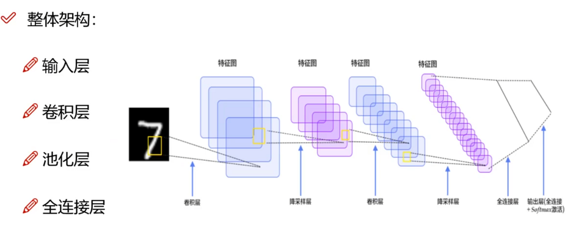
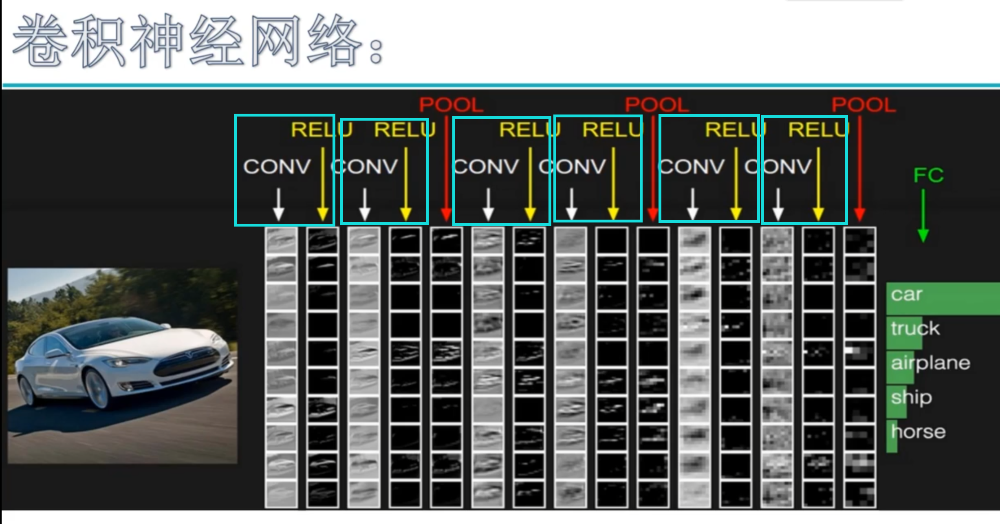
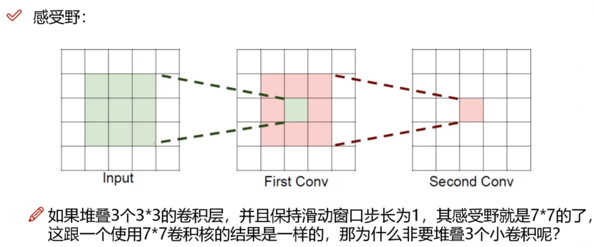
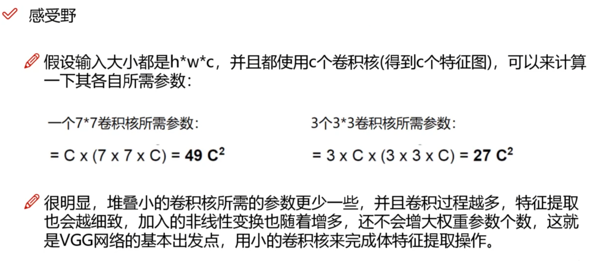
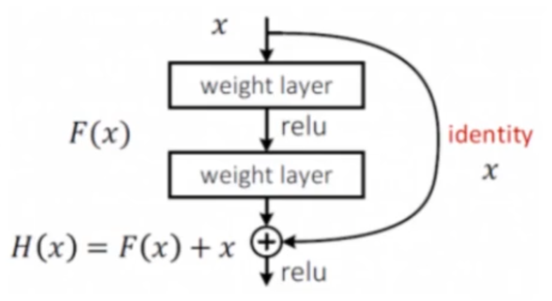

# CNN

## 整体结构

- 卷积层：提取特征，堆叠卷积层，可以进一步提取特征
- 池化层：压缩特征
- 全连接层：

## 特征提取：卷积和池化

下图所示7层CNN (只有带参数计算的才算层数，也就是只有卷积层和全连接层算层数)

**卷积层都跟RELU激活函数搭配在一起使用，两次卷积一次池化**，不断的卷积，不断的池化

之后再用**全连接层**，转化为**特征向量**

### 卷积层参数

- 滑动窗口的步长：步长变大之后特征图变小，步长变短之后计算复杂，图像处理一般选择步长1
- 卷积核尺寸：卷积核越小越细腻，一般选择3*3
- 边缘填充：用0填充，避免卷积后对结果产生影响
- 卷积核个数：每个卷积核里面参数都不一样，就会得到不同的特征图个数

### 池化层参数

压缩 h 和 w

- 最大池化：只选择一个块儿里的最大值，一般都用最大池化，效果好一些
- 平均池化：选择一个块儿的平均值
- 没有 w 和 b，仅仅是简单筛选

## 感受野

## 残差网络：Resnet，经典效果好

人们发现，简单的增加网络层数不一定会产生更好的效果，16层的VGG网络效果好于30层，于是有了解决方案

判断该层是否会效果变好，如果效果变差，则把这层参数置0，相当于这层跳过

## 草稿

许多基于CNN的图像降噪器，例如DnCNN [34]，U-Net [26]，RED [20]，MemNet [28]和SGN [10]，都具有优于传统降噪器的性能。 但是，基于CNN的降噪器在很大程度上依赖于大量的噪声清洁图像对进行训练

- SGN: Shuhang Gu, Yawei Li, Luc Van Gool, and Radu Timofte. Self-guided network for fast image denoising. In2019IEEE/CVF International Conference on Computer Vision, pages 2511–2520, 2019
- RED: Xiaojiao Mao,  Chunhua Shen,  and Yu-Bin Yang.   Image restoration using very deep convolutional encoder-decoder networks with symmetric skip connections.   InAdvances in Neural Information Processing Systems,volume 29, pages 2802–2810, 2016
- U-Net: Olaf Ronneberger,  Philipp Fischer,  and Thomas Brox.   U-net:  Convolutional networks for biomedical imagesegmentation.  InInternational Conference on Medical Image Computing and Computer-Assisted Intervention,pages 234–241. Springer, 2015
- MemNet: Ying Tai, Jian Yang, Xiaoming Liu, and Chunyan Xu. Memnet: A persistent memory network for image restora-tion. In2017 IEEE International Conference on Computer Vision, pages 4549–4557, 2017
- DnCNN: Kai Zhang, Wangmeng Zuo, Yunjin Chen, Deyu Meng, and Lei Zhang.  Beyond a gaussian denoiser:  Residuallearning of deep cnn for image denoising.IEEE Transactions on Image Processing, 26(7):3142–3155, 2017.

