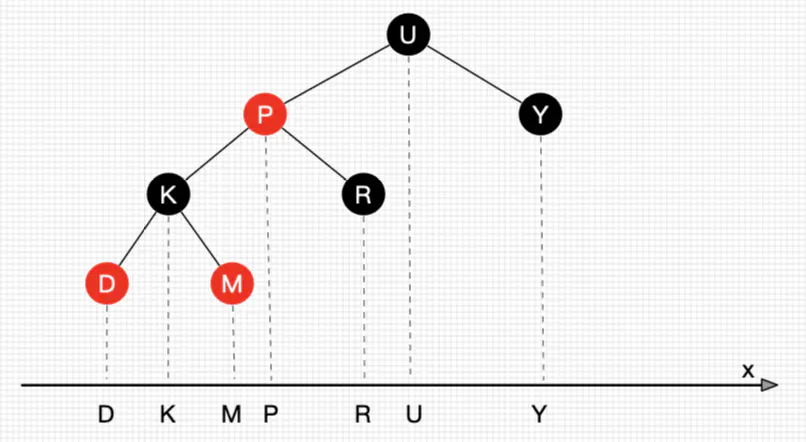
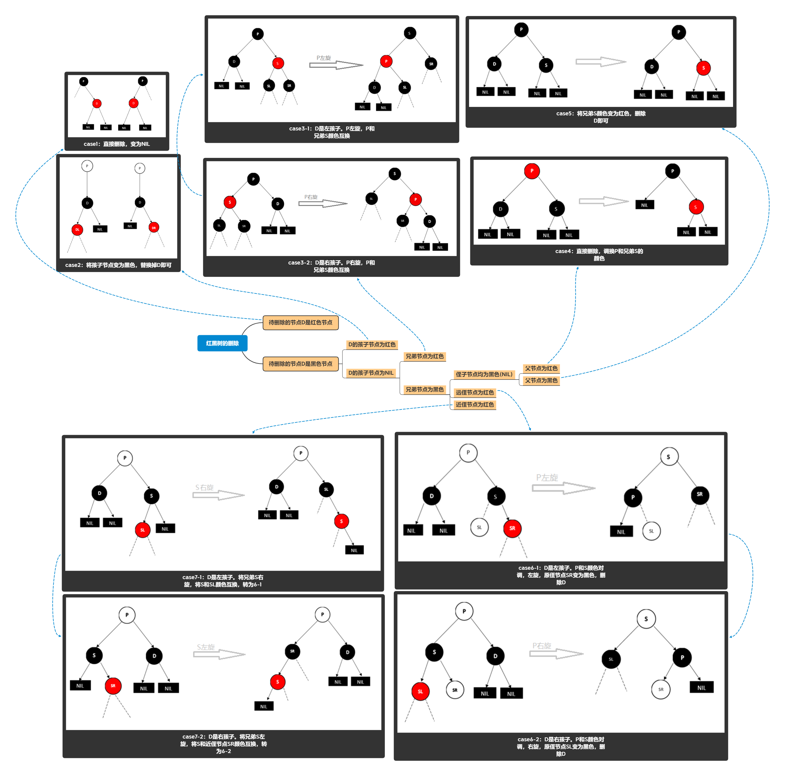
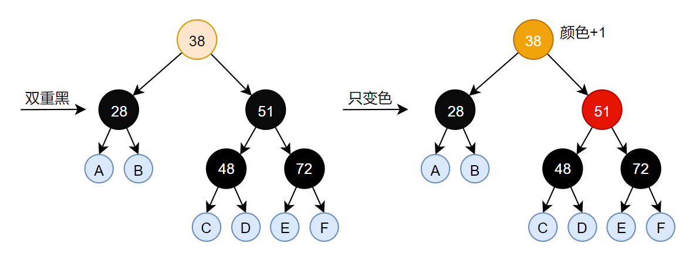
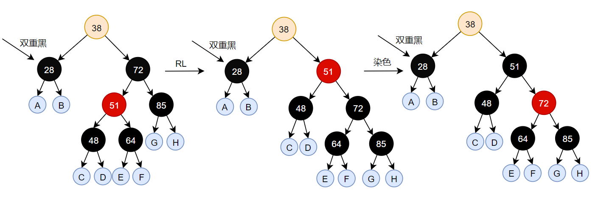
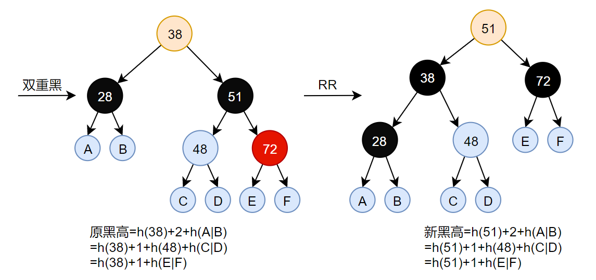

# java基本数据结构的实现

## 1. 队列
<center>

</center>

- 队列(queue)是一种常用的数据结构，可以将队列看做是一种特殊的线性表，该结构遵循的先进先出原则。
- Queue接口提供了添加元素操作`offer`、删除并返回第一个元素`poll`、返回第一个元素`peek`
- **注意：** `add`、`remove`、`element`也可以实现上述功能，但是对于空和满的状态**会抛出异常**，所以一般使用offer系列操作
~~~java
public interface Queue<E> extends Collection<E> {
    
    boolean add(E e);       //往队列插入元素，如果出现异常会抛出异常 
    E remove();             //移除队列元素，如果出现异常会抛出异常    
    E element();            //获取队列头部元素，如果出现异常会抛出异常

    boolean offer(E e);     //往队列插入元素，如果出现异常则返回false
    E poll();               //移除队列元素，如果出现异常则返回null
    E peek();               //获取队列头部元素，如果出现异常则返回null
}
~~~

## 2. 双端队列
- 双向队列(Deque),是Queue的一个子接口，双向队列是指该队列两端的元素既能入队(offer)也能出队(poll),如果将Deque限制为只能从一端入队和出队，则可实现栈的数据结构
- Java中，**LinkedList实现了Deaue接口，Deque继承自Queue**, 因为LinkedList进行插入、删除操作效率较高
~~~java
public interface Deque<E> extends Queue<E> {
    void addFirst(E e);     //插入头部，异常会报错
    void addLast(E e);      //插入尾部，异常会报错
    E getFirst();           //获取头部，异常会报错
    E getLast();            //获取尾部，异常会报错
    E removeFirst();        //移除头部，异常会报错
    E removeLast();         //移除尾部，异常会报错

    boolean offerFirst(E e);//插入头部，异常返回false
    boolean offerLast(E e); //插入尾部，异常返回false
    E peekFirst();          //获取头部，异常不报错
    E peekLast();           //获取尾部，异常不报错
    E pollFirst();          //移除头部，异常不报错
    E pollLast();           //移除尾部，异常不报错
}
~~~
- 一般直接使用LinkedList
  
~~~java
    Deque<String> deque = new LinkedList<String>();
~~~


## 3. 栈
- Stack类一般不建议使用，因为继承自Vector，vector是动态数组，所以**Stack可以对栈内任意位置的元素进行添加删除操作**，违背了栈设计的初衷，破坏了栈的结构，引发安全问题
- 可靠的栈操作由`Deque`接口和它的实现类提供，Deque是双端队列，能在两端进行插入和删除，当然也能在一端进行插入删除操作  
~~~java
    Deque<Integer> stack = new ArrayDeque<Integer>();
    Deque<Integer> stack = new LinkedList<Integer>();
~~~
- 然而，我们声明的仍然**是一个Deque**，可以在两端进行插入和删除！！
- 目前java官方只做到这个份上。一般用Deque，为了更安全可以自己再封装一层
- 常用方法：`push`，`pop`，`peak`，`isEmpty`
~~~java
public void push(E e) {addFirst(e);}    //异常报错
public void addFirst(E e) {
    if (e == null)
        throw new NullPointerException();   //抛出异常
    elements[head = (head - 1) & (elements.length - 1)] = e;
    if (head == tail)
        doubleCapacity();
}
~~~

~~~java
public E pop() {return removeFirst();}  //异常报错
public E removeFirst() {
    E x = pollFirst();
    if (x == null)
        throw new NoSuchElementException();
    return x;
}
~~~

~~~java
public E peek() {return peekFirst();}   //异常不会报错
public E peekFirst() {
    return (E) elements[head];  // elements[head] is null if deque empty
}
~~~

~~~java
public boolean isEmpty() {return head == tail;}
~~~


# 回溯算法
- 回溯就是通过不同的尝试来生成问题的解，有点类似于穷举，但是和穷举不同的是回溯会 **“剪枝”**，剪枝的意思也就是说对已经知道错误的结果没必要再枚举接下来的答案了，比如一个有序数列1,2,3,4,5，我要找和为5的所有集合，从前往后搜索我选了1，然后2，然后选3的时候发现和已经大于预期，那么4,5肯定也不行，这就是一种对搜索过程的优化

## 1. 回溯与DFS
- 回溯搜索是深度优先搜索（DFS）的一种。对于某一个搜索树来说（搜索树是起记录路径和状态判断的作用），回溯和DFS，其主要的区别是，回溯法在求解过程中不保留完整的树结构，而深度优先搜索则记下完整的搜索树。  

## 2. 回溯算法框架
~~~java
result = []
def backtrack(路径, 选择列表):
    if 满足结束条件:
        result.add(路径)
        return

    for 选择 in 选择列表:
        //做选择
        backtrack(路径, 选择列表)
        //撤销选择
~~~

## 3. 全排问题（LeetCode46）
- 输入一组不重复的数字，返回它们的全排列
~~~java
List<List<Integer>> res = new LinkedList<>();

/* 主函数，输入一组不重复的数字，返回它们的全排列 */
List<List<Integer>> permute(int[] nums) {
    // 记录「路径」
    LinkedList<Integer> track = new LinkedList<>();
    backtrack(nums, track);
    return res;
}

// 路径：记录在 track 中
// 选择列表：nums 中不存在于 track 的那些元素
// 结束条件：nums 中的元素全都在 track 中出现
void backtrack(int[] nums, LinkedList<Integer> track) {
    // 触发结束条件
    if (track.size() == nums.length) {
        res.add(new LinkedList(track));
        return;
    }

    for (int i = 0; i < nums.length; i++) {
        // 排除不合法的选择
        if (track.contains(nums[i]))
            continue;
        // 做选择
        track.add(nums[i]);
        // 进入下一层决策树
        backtrack(nums, track);
        // 取消选择
        track.removeLast();
    }
}
~~~
- 不管怎么优化，都符合回溯框架，而且时间复杂度都不可能低于 O(N!)，因为穷举整棵决策树是无法避免的。这也是回溯算法的一个特点，不像动态规划存在重叠子问题可以优化，回溯算法就是纯暴力穷举，复杂度一般都很高

## 4. N皇后问题（LeetCode51）
-  N×N 的棋盘，放置 N 个皇后，使得它们不能互相攻击。皇后可以攻击同一行、同一列、左上左下右上右下在一条直线上的任意单位

~~~java
    private List<List<String>> result = new LinkedList<>();
    public List<List<String>> solveNQueens(int n) {
        backtrack(n, 0, new int[n]);    //int[n]存放解
        return result;
    }
    private void backtrack(int n, int row, int[] position){
        if(row==n){
            //记录结果
            List<String> list = new LinkedList<>();
            for(int x:position){
                StringBuilder sb = new StringBuilder();
                for (int i = 0; i < n; i++)
                    sb.append(i!=x?".":"Q");
                list.add(sb.toString());
            }
            result.add(list);
            return ;  //递归出口
        }
        for (int col = 0; col < n; col++) {   //对一个位置，验证
            //尝试选择
            position[row]=col;
            //验证
            if(!isValid(row,position))
                continue;
            //进入下一行决策
            backtrack(n, row+1, position);
            //撤销选择
        }
    }
    private boolean isValid(int row, int[] position){
        if(row==0) return true;
        for (int row_i = 0; row_i < row; row_i++) {
            if(position[row_i]==position[row] || position[row_i]==(position[row]+row-row_i)||position[row_i]==(position[row]-(row-row_i)))
                return false;
        }
        return true;
    }

    public static void main(String[] args) {
        List<List<String>> lists = new Demo51().solveNQueens(4);
        System.out.println(lists);
    }
~~~

# BFS   
- BFS 的核心思想就是把一些问题抽象成图，从一个点开始，向四周开始扩散。一般来说，我们写 BFS 算法都是用「队列」这种数据结构，每次将一个节点周围的所有节点加入队列
- BFS 相对 DFS 的最主要的区别是：BFS 找到的路径一定是最短的，但代价就是空间复杂度比 DFS 大很多

## 1. BFS算法框架
~~~java
// 计算从起点 start 到终点 target 的最近距离
int BFS(Node start, Node target) {
    Queue<Node> q; // 核心数据结构
    Set<Node> visited; // 避免走回头路

    q.offer(start); // 将起点加入队列
    visited.add(start);
    int step = 0; // 记录扩散的步数

    while (q not empty) {
        /* 将当前队列中的所有节点向四周扩散 */
        for (int i = 0; i < q.size; i++) {
            Node cur = q.poll();
            /* 划重点：这里判断是否到达终点 */
            if (cur is target)
                return step;
            /* 将 cur 的相邻节点加入队列 */
            for (Node x : cur.adj())
                if (x not in visited) {
                    q.offer(x);
                    visited.add(x);
                }
        }
        /* 划重点：更新步数在这里 */
        step++;
    }
}
~~~

# 二分查找  

- 总结：全部使用闭区间

## 1. 二分查找框架
- 计算 mid 时需要防止溢出，代码中 left + (right - left) / 2 就和 (left + right) / 2 的结果相同，但是有效防止了 left 和 right 太大直接相加导致溢出
- 分析二分查找的一个技巧是：不要出现 else，而是把所有情况用 else if 写清楚，这样可以清楚地展现所有细节
- ... 标记的部分，就是可能出现细节问题的地方

~~~java
int binarySearch(int[] nums, int target) {
    int left = 0, right = ...;

    while(...) {
        int mid = left + (right - left) >> 1;
        if (nums[mid] == target) {
            ...
        } else if (nums[mid] < target) {
            left = ...
        } else if (nums[mid] > target) {
            right = ...
        }
    }
    return ...;
}
~~~

## 2. 二分查找目标值的索引
- 查找到返回索引，未查找到返回-1
~~~java
int binarySearch(int[] nums, int target) {
    int left = 0; 
    int right = nums.length - 1; // 注意

    while(left <= right) {
        int mid = left + ((right - left) >> 1);  //注意：移位运算优先级低于加减乘除
        if(nums[mid] == target)
            return mid; 
        else if (nums[mid] < target)
            left = mid + 1; 
        else if (nums[mid] > target)
            right = mid - 1; 
    }
    return -1;
}
~~~
- 细节1：`left <= right`，因为搜索区间是 [left, right]，全部搜索完未找到的结束条件自然是 [right+1, right] 
- 细节2：`left = mid + 1`，正是因为搜索区间是闭区间，**mid 已经搜索过了**，所以排除mid

- 查找到返回索引，未查找到返回应该插入的index位置
~~~java
int binarySearchIndex(int[] arr, int target){
    int left = 0;
    int right = arr.length-1;
    while(left<=right){
        int mid = left+((right-left)>>1);
        if(arr[mid]==target) return mid;
        else if(arr[mid]<target) left = mid+1;
        else right = mid-1;
    }
    return left;
    //理解：返回left，left是第一个大于target的点
    //所以对于[3]数组中插入1，会返回0，插入4会返回1，所以返回端还需要进行越界处理
    //不过也可以判断一下，如果越界就直接返回最大 length-1 好了
}
~~~


## 3. 二分查找侧边界

- 查找左边界：即查找等于target的第一个数

~~~java
int left_bound(int[] nums, int target) {
    int left = 0, right = nums.length - 1;
    // 搜索区间为 [left, right]
    // 出循环的条件是 left=right+1
    while (left <= right) {     
        int mid = left + (right - left) >> 1;
        if (nums[mid] < target) {
            // 搜索区间变为 [mid+1, right]
            left = mid + 1;
        } else if (nums[mid] > target) {
            // 搜索区间变为 [left, mid-1]
            right = mid - 1;
        } else if (nums[mid] == target) {
            // 收缩右侧边界
            right = mid - 1;
        }
    }
    // 检查出界情况
    if (left >= nums.length || nums[left] != target)
        return -1;
    return left;
}
~~~

- 查找右边界

~~~java
int right_bound(int[] nums, int target) {
    int left = 0, right = nums.length - 1;
    while (left <= right) {
        int mid = left + (right - left) >> 1;
        if (nums[mid] < target) {
            left = mid + 1;
        } else if (nums[mid] > target) {
            right = mid - 1;
        } else if (nums[mid] == target) {
            // 这里改成收缩左侧边界即可
            left = mid + 1;
        }
    }
    // 这里改为检查 right 越界的情况，见下图
    if (right < 0 || nums[right] != target)
        return -1;
    return right;
}
~~~

# 树
## 1. 二叉树的常见算法

## 1.1 先序非递归遍历
1. 首先**弹栈访问**
2. 如果有右孩子，压入栈
3. 如果有左孩子，压入栈
~~~java
    public List<TreeNode> preOrder(TreeNode root){
        List<TreeNode> list = new ArrayList<>();
        if(root==null) return list;
        TreeNode p = root;
        Deque<TreeNode> stack = new ArrayDeque<>();
        stack.push(p);        //根节点入栈
        while(!stack.isEmpty()){       //循环至栈空
            list.add(p=stack.pop());    //弹栈访问
            if(p.right!=null)   stack.push(p.right);    //右孩子入栈
            if(p.left!=null)    stack.push(p.left);     //左孩子入栈
        }
        return list;
    }
~~~

## 1.2 中序非递归遍历
1. 整条左边界(非空)依次入栈
2. 遇到空，则**弹栈访问**，指针移动到右孩子
~~~java
    public List<TreeNode> inOrder(TreeNode root){
        List<TreeNode> list = new ArrayList<>();
        TreeNode p = root;
        Deque<TreeNode> stack = new ArrayDeque<>();
        while (!stack.isEmpty()||p!=null) {
            if(p!=null){
                stack.push(p);
                p = p.left;
            } else {
                p = stack.pop();
                list.add(p);
                p = p.right;    //注意此处一定不要加if(p!=null)，
                //否则会来回入栈，p为null正好是弹栈了
            }
        }
        return list;
    }
~~~

## 1.3 后序非递归遍历
### 1.3.1 基于先序遍历，需要额外空间
修改先序的左右孩子入栈顺序：先左入栈，后右入栈，则整体访问顺序为：头右左
将结果反过来遍历就是左右头，即后序遍历
~~~java
    public List<TreeNode> postOrder(TreeNode root){
        List<TreeNode> list = new ArrayList<>();
        if(root==null) return list;
        TreeNode p = root;
        Deque<TreeNode> stack = new ArrayDeque<>();
        Deque<TreeNode> tempStack = new ArrayDeque<>(); //辅助栈
        stack.push(p);        //根节点入栈
        while(!stack.isEmpty()){       //循环至栈空
            tempStack.push(p=stack.pop());    //弹栈，进入结果的辅助栈
            if(p.left!=null)    stack.push(p.left);     //左孩子入栈
            if(p.right!=null)   stack.push(p.right);    //右孩子入栈
        }
        while(!tempStack.isEmpty()){
            list.add(tempStack.pop());
        }
        return list;
    }
~~~

### 1.3.2 基于中序遍历，无需额外空间

~~~java
    public List<TreeNode> postOrder2(TreeNode root){
        List<TreeNode> list = new ArrayList<>();
        TreeNode pre = root;
        if(pre==null) return list;
        Deque<TreeNode> stack = new ArrayDeque<>();
        stack.push(pre);
        while (!stack.isEmpty()) {
            TreeNode temp = stack.peek();
            if(temp.left!=null && pre!=temp.left && pre!=temp.right){ //左右孩子均不是上次访问过的节点
                stack.push(temp.left); //左孩子入栈
            } else if(temp.right!=null && pre!=temp.right){ //左孩子空了或访问了，右孩子不是上次访问过的节点，入栈
                stack.push(temp.right);
            } else{ //左右孩子都已经访问或空，可以访问这个节点了
                list.add(stack.pop());
                pre = temp; //p记录上次访问的节点
            }
        }
        return list;
    }
~~~


## 1.4 Morris遍历
常规的二叉树的递归和非递归都需要O(N)的时间和O(H)的空间，而Morris遍历可以把空间优化到O(1)

Morris遍历的流程：结束条件是`cur==null`
1. 若当前节点cur无左孩子，`cur=cur.right`
2. 若cur有左孩子，找到左孩子的最右节点mostright   
   - 若mostright的右指针指向null，则`mostright.right=cur, cur=cur.left`
   - 若mostright的右指针指向cur，则`mostright.right=null, cur=cur.right`

**有左孩子的节点必访问两次**(第一次建索引，第二次取消索引)，第一次访问节点建立索引后访问其左树，左树访问完成后回到节点第二次访问，将索引置为null。**修改cur节点的mostright右指针的目的就是为了知道cur节点是第一次访问还是第二次访问！**
~~~java
while(cur!=null){ //循环至cur为null
    if(cur.left==null)  //左孩子为空，cur指向右孩子
        cur=cur.right;
    else{ //左孩子不为空，找到左树最右节点
        mostright = findMostRight(cur.left);
        if(mostright.right==null){ //左树最右节点为空，则指向cur
            mostright.right = cur;  
            cur = cur.left; //cur向左移动
        } else {                   //左树最右节点不为空(为cur)，则指回null
            mostright.right = null;     
            cur = cur.right;  //cur向右移动 
        }
            
    }
}
~~~


### 1.4.1 Morris遍历顺序
- Morris遍历
~~~java
    public void morris(TreeNode root) {
        if (root == null) return;
        TreeNode cur = root;
        TreeNode mostRight = null;
        while (cur != null) {
            if ((mostRight = cur.left) != null) {
                //找到mostRight
                while (mostRight.right != null && mostRight.right != cur) {
                    mostRight = mostRight.right;
                }
                if (mostRight.right == null) {  //第一次访问
                    mostRight.right = cur;
                    cur = cur.left;     //左移
                    continue;   //左移之后就不要右移了
                } else {
                    mostRight.right = null;
                }
            }
            cur = cur.right; //右移
        }
    }
~~~

### 1.4.2 Morris遍历实现中序遍历
- Morris遍历实现中序：左子树不为空的节点在第二次访问时打印，左子树为空的节点直接打印
~~~java
    public void morrisInOrder(TreeNode root) {
        if (root == null) return;
        TreeNode cur = root;
        TreeNode mostRight = null;
        while (cur != null) {
            if ((mostRight = cur.left) != null) {   //左树不为空
                //找到mostRight
                while (mostRight.right != null && mostRight.right != cur) {
                    mostRight = mostRight.right;
                }
                if (mostRight.right == null) {  //第一次访问
                    mostRight.right = cur;
                    cur = cur.left;     //左移
                    continue;   //左移之后就不要右移了
                } else {    //mostRight.right=cur,是第二次访问
                    mostRight.right = null;
                }
            }
            System.out.print(cur.val+"  ");   //左树不为空的节点第二次访问打印，左树为空直接打印
            cur = cur.right; //右移
        }
    }
~~~

### 1.4.3 Morris遍历实现先序遍历
- Morris遍历实现先序：左子树不为空的节点在第一次访问时打印，左子树为空的节点直接打印
~~~java
    public void morrisPreOrder(TreeNode root) {
        if (root == null) return;
        TreeNode cur = root;
        TreeNode mostRight = null;
        while (cur != null) {
            if ((mostRight = cur.left) != null) {   //左树不为空
                //找到mostRight
                while (mostRight.right != null && mostRight.right != cur) {
                    mostRight = mostRight.right;
                }
                if (mostRight.right == null) {    //第一次访问
                    mostRight.right = cur;
                    System.out.print(cur.val+"  ");   //左树不为空，第一次访问的时候打印
                    cur = cur.left;     //左移
                    continue;   //左移之后就不要右移了
                } else {
                    mostRight.right = null;
                }
            }else
                System.out.print(cur.val+"  ");     //左树为空，只访问一次，也要打印

            cur = cur.right; //右移
        }
    }
~~~


### 1.4.4 Morris遍历实现后序遍历
后序遍历的本质就是如下，从左到右同色节点从下到上按顺序打印
Morris后序遍历的思想就是，**对于第二次访问的节点(左子树不为空)，逆序打印左子树的右边界(同色节点)**，最后再逆序打印整棵树的右边界

~~~java
    public void morrisPostOrder(TreeNode root){
        if (root == null) return;
        TreeNode cur = root;
        TreeNode mostRight = null;
        while (cur != null) {
            if ((mostRight = cur.left) != null) {   //左树不为空
                //找到mostRight
                while (mostRight.right != null && mostRight.right != cur) {
                    mostRight = mostRight.right;
                }
                if (mostRight.right == null) {  //第一次访问
                    mostRight.right = cur;
                    cur = cur.left;     //左移
                    continue;   //左移之后就不要右移了
                } else {    //mostRight.right=cur,是第二次访问
                    mostRight.right = null;
                    printEdge(cur.left);  //左树不为空的节点第二次访问时逆序打印左孩子的右边界
                }
            }
            cur = cur.right; //右移
        }
        printEdge(root); //逆序打印根节点的右边界
    }

    private void printEdge(TreeNode node) { //逆序打印右边界
        TreeNode tail = reverseEdge(node);
        TreeNode p = tail;
        while(p!=null){
            System.out.print(p.val+"  ");
            p = p.right;
        }
        reverseEdge(tail);
    }

    private TreeNode reverseEdge(TreeNode node){ //反转链表！！
        TreeNode p = node;
        TreeNode pre = null;
        TreeNode temp=null;
        while(p!=null){
            temp = p.right;
            p.right = pre;
            pre = p;
            p = temp;
        }
        return pre;
    }
~~~

### 1.4.5 Morris判断搜索二叉树
判断一棵树是否是搜索二叉树，只需要使用Morris中序遍历，比较上一个节点和现在的节点是否满足排序规则即可

~~~java
    public boolean isBST(TreeNode root) {
        TreeNode cur = root;
        TreeNode mostRight = null;
        Integer pre = null;
        while (cur != null) {
            mostRight = cur.left;
            if (mostRight != null) {
                while (mostRight.right != null && mostRight.right != cur) {
                    mostRight = mostRight.right;
                }
                if (mostRight.right == null) {
                    mostRight.right = cur;
                    cur = cur.left;
                    continue;
                } else {
                    mostRight.right = null;
                }
            }
            
            if(pre!=null&&cur.val<=pre){    //小于等于中序前驱，不是二叉树
                return false;
            }
            pre = cur.val;  //更新pre
            
            cur = cur.right;
        }
        return true;
    }
~~~


## 2. 2-3树和红黑树
### 2.1 BST树存在的问题
- BST的特点是 左孩子 < 根 < 右孩子
- BST只要求有序，不一定平衡，最坏情况的复杂度为O(n)
- 我们希望插入数据后保持树的特点，O(logn)的新功能，就需要对节点进行调整

### 2.2 2-3树-解决平衡问题
#### 2.2.1 2-3树的定义
如果一个内部节点拥有**一个数据元素、两个子节点**，则此节点为2节点。
如果一个内部节点拥有**两个数据元素、三个子节点**，则此节点为3节点。
当且仅当以下叙述中有一条成立时，T为2–3树：
- T 为空
- T 为拥有数据元素 a 的 2 节点，左孩子 L，右孩子 R，则：
  - L 和 R 都是**等高**的非空2-3树
  - a 大于 L 中的所有数据元素
  - a 小于 R 中的所有数据元素
- T为拥有数据元素 a 和 b 的 3 节点，其中a < b。若T的左孩子为L、中孩子为M、右孩子为R，则：
  - L、M、和 R 是**等高**的非空2–3树
  - a大于L中的所有数据元素，并且小于等于M中的所有数据元素
  - b大于M中的所有数据元素，并且小于等于R中的所有数据元素


2-3树允许在一个节点中存在两个元素，等元素数量等于3个的时候再进行调整，通过这种方式来保证整个二叉搜索树的平衡性


#### 2.2.2 2-3树的性质
- **2-3树的所有子叶节点都在同一层**
- 1个节点可以有1到2个数据，如果达到3个就要进行调整
- 1个节点存放一个数据时，有两个孩子节点
- 1个节点存放两个数据时，有三个孩子节点，中间子节点是介于两个节点之间的值

### 2.3 红黑树
#### 2.3.1 红黑树的定义
1. 一个节点要么是红色要么是黑色
2. 根节点是黑色
3. 所有叶子节点都是黑色(**叶子节点是NIL节点**)
4. 红色节点的两个孩子一定是黑色节点
5. 任意节点到每个叶节点的路径包含相同的黑节点数目(黑高)


红黑树并不是一个完美平衡的二叉查找树，只是任意节点到子节点路径包含相同的黑色节点数目，所以也叫红黑树的这种平衡为**黑色完美平衡**
**红黑树从根到叶节点的最长路径不会超过最短路径的2倍**
#### 2.3.2 2-3树到红黑树的转换
- 红黑树是2-3树和2-3-4树的另一种表现形式，更利于编码实现，比较也更方便            
- 2-3-4树转红黑树主要需要考虑这三种不同节点的转换，如下图。其中正式由于3叉节点有两种情况，导致了转换成的红黑树产生左倾和右倾


- 具体的转换例子如下：


#### 2.3.3 红黑树的平衡
为了让红黑树保持平衡状态，有染色和左右旋转两种方法，这两个方法都是从2-3树演化来的
- 左旋转：逆时针旋转红黑树的两个节点，使得父节点被自己的右孩子取代，而自己成为自己的左孩子

- 右旋转：顺时针旋转红黑树的两个节点，使得父节点被自己的左孩子取代，而自己成为自己的右孩子


#### 2.3.4 红黑树的插入
对于插入而言，可分为5种情况
- case1：新节点N位于树的根上，没有父节点，这时我们把它重绘为黑色以满足性质2
~~~java
public void insert_case1(Node n){
    if(n.parent==null)
        n.color = BLACK;
    else
        insert_case2(n);
}
~~~

- case2：新节点的父节点是黑色，这时由于插入节点是红色，并不违背性值，直接插入即可
~~~java
public void insert_case2(Node n){
    if(n.parent.color==BLACK)
        return;
    else
        insert_case3(n);
}
~~~

- case3：新节点的父节点P 和叔父节点 U 都是红色，插入节点为P的左孩子时。可以直接将父节点P和叔父节点U变为黑色，再把祖父节点G变为红色。此时如果祖父节点G是根节点，或者G的父亲也是红色，就违背了定义规则，需要进行递归调整，把G当作是新加入的节点来进行检查

~~~java
public void insert_case3(Node n){
    if(uncle(n)!=null && uncle(n).color==RED){
        n.parent.color=BLACK;
        uncle(n).color=BLACK;
        grandparent(n).color=RED;
        insert_case1(grandparent(n));
    }
    else
        insert_case4(n);
}
~~~

- case4：父节点P是红色，而叔父节点U是黑色或缺失，并且(新加入节点N是父节点P的右孩子，父节点P是祖父节点G的左孩子)或者(新加入节点N是父节点P的左孩子，父节点P是祖父节点G的右孩子)。此时需要把P节点进行一次（左旋转）（右旋转），转换为case5

~~~java
public void insert_case4(Node n){
    if(n==n.parent.right && n.parent==grandparent(n).left){
        rotate_left(n);
        n = n.left
    }else if(n==n.parent.left && n.parent==grandparent(n).right){

    }
}
~~~

- case5：父节点P是红色，而叔父节点U是黑色或确实，并且(新加入节点N是父节点P的左孩子，父节点P是祖父节点G的左孩子)或者(新加入节点N是父节点P的右孩子，父节点P是祖父节点G的右孩子)。此时需要将父节点P变为黑色，祖父节点G变为红色，并对祖父节点G进行一次(右旋转)(左旋转)

~~~java
public void insert_case5(Node n){
    n.parent.color = BLACK;
    grandparent(n).color=RED;
    if(n==n.parent.left && n.parent=grandparent(n).left){
        routate_right(n.parent);
    } else if(n==n.parent.right && n.parent==grandparent(n).right){
        routate_left(n.parent);
    }
}
~~~
- 插入过程举例


#### 2.3.5 红黑树的删除

- 首先对于BST而言，删除左右孩子均非空的节点可以复制它的中序前驱或者中序后继的值覆盖本身的值，然后删除掉原本的中序前驱或者中序后继即可。那么它的中序前驱或者中序后继必然只有至多一个孩子，直接使用其孩子替代它即可。红黑树中亦是这种思想，只复制其中序前驱或者中序后继的值，而不复制颜色(保留原本的颜色)

**一个找前驱和后继的直观方法：** 把二叉树的所有结点投射在x轴上，所有节点都是从左到右排序好的，如下图所示


**红色树的删除情况：**
对于需要删除的节点有两个孩子时，均可找到其中序后继，拷贝值到待删除节点，递归删除中序后继，从而转换为以下的几种情况之一(**下述请情况均是被删除节点至多含有一个孩子的情况**)：


- case1：**待删除节点是红色节点**。直接用NIL替换即可。注意，待删除的红色节点一定是排序树概念上的叶子节点，否则若其还有红色子节点或黑色子节点，均会违背红黑树的定义。

- case2：**待删除节点是黑色节点，其孩子节点是红色节点**。将孩子节点颜色变为黑色，然后替换掉待删除节点即可。注意，待删除节点是黑色节点时，其孩子节点不可能是黑色节点


- case3：**待删除节点是黑色节点，其孩子节点均为NIL，其兄弟节点为红色**。
如果待删除节点是其父亲的左节点，则对其父节点进行一次左旋，如果待删除节点是其父亲的右节点，则对其父节点进行一次右旋。之后再将父节点颜色和兄弟节点颜色互换，使红黑树保持平衡，然后转换为case4


- case4：**待删除的节点是黑色节点，其孩子节点均为NIL，父节点为红色，兄弟节点为黑色，两个侄子节点均为黑色(必为NIL)时**。这时需要将父节点和兄弟节点颜色对调，然后删除掉待删除节点即可


- case5：**待删除的节点是黑色节点，其孩子节点均为NIL，父节点为黑色，兄弟节点为黑色，两个侄子节点均为黑色(必为NIL)时**。这时需要将兄弟节点修改为红色，删除掉待删除节点即可完成平衡


- case6：**待删除的节点是黑色节点，其孩子节点均为NIL，兄弟节点为黑色，远侄节点为红色时**。这时P和SL的颜色随意，但是SL为黑色时必为NIL，调整过程：            
若D是父节点的左孩子，将P和S颜色对调，然后进行左旋，最后把SR变为黑色，删除D即可

若D是父节点的右孩子，将P和S颜色对调，然后进行右旋，最后把SL变为黑色，删除D即可


- case7：**待删除的节点是黑色节点，其孩子节点均为NIL，兄弟节点为黑色，近侄节点为红色，远侄节点为NIL时**。
D为父节点的左孩子，将兄弟节点进行右旋，S和SL颜色互换，于是转换为case6

D为父节点的右孩子，将兄弟节点进行左旋，S和SR颜色互换，于是转换为case6


**总之一句话：删除时，先看待删除的节点的颜色，再看孩子节点颜色，再看兄弟节点的颜色，再看侄子节点的颜色（侄子节点先看远侄子再看近侄子），最后看父亲节点的颜色**


#### 2.3.6 红黑树的插入2

插入调整站在**祖父节点**向下看，插入调整主要就是为了解决**双红**的情况

删除调整站在**父节点**向下看，删除调整主要就是为了解决**双重黑**的情况


**情况一：有红色的叔叔节点，只需要修改小帽子** ，祖父节点和(父节点，叔叔节点)反色


**情况二：没有红色的叔叔节点，按AVL树的旋转后修改小帽子** ，LL型(LR型，RR型，RL型)，大右旋(LR旋，RR旋，RL旋)，调整小帽子的颜色（调整成黑红红或者红黑黑都是可以的）：红色下沉、红色上浮


#### 2.3.7 红黑树的删除2

插入调整站在**祖父节点**向下看，插入调整主要就是为了解决**双红**的情况

删除调整站在**父节点**向下看，删除调整主要就是为了解决**双重黑**的情况


删除调整的前提：删除度为2的节点可以转化为删除度为1和度为0的节点

**度为1的黑色节点的唯一子孩子一定是红色**

**度为0的黑色节点删除后会变成双重黑色的nil，保证"黑高"不变**


**情况一：双重黑节点的兄弟节点是黑色，兄弟节点的两个孩子也都是黑色**，只需要把兄弟调整为红色，当前节点减少一重黑色，父节点增加一重黑色




**情况二： 双重黑节点的兄弟是黑色，兄弟的异侧孩子是红色（RL或者LR）**，转化为RR或者LL类型的情况三的子情况



**情况三：双重黑节点的兄弟是黑色，兄弟的同侧孩子是红色(RR或者LL类型)**， 将父节点旋转(左或者右)，由于无法确定48的颜色，所以38只能改成黑色，51改成38的颜色（以防止38是黑色时，简单把51修改为红色虽然暂时平衡，但是减少了黑高），最后72改为黑色。。双黑变为单黑



**情况四：双重黑节点的兄弟节点是红色，旋转染色，转化为一二三的情况**


#### 2.3.8 红黑树go语言实现

```go
package important

import "fmt"

const (
	RED          = 0
	BLACK        = 1
	DOUBLE_BLACK = 2
)

type node struct {
	val         int
	left, right *node
	color       int //红色0，黑色1，双重黑色2
}

func newNode(val int) *node {
	return &node{
		val:   val,
		left:  NilNode,
		right: NilNode,
		color: 0,
	}
}

var NilNode *node = &node{
	val:   0,
	left:  nil,
	right: nil,
	color: 1,
}

func Clear(p **node) {
	*p = NilNode
}

func (root *node) Insert(value int) *node {
	root = root.__insert(value)
	root.color = BLACK //强制把根节点染色成黑色
	return root
}

func (root *node) __insert(value int) *node {
	if root == NilNode {
		return newNode(value)
	}
	if root.val == value {
		return root
	}
	if root.val < value {
		root.right = root.right.__insert(value)
	} else {
		root.left = root.left.__insert(value)
	}
	return root.insertMaintain() //递归修改
}

func (root *node) insertMaintain() *node {
	if root.left.color == RED && root.right.color == RED { //第一种情况，只需要调整帽子

	} else if left := root.left; left.color == RED && left.hasRedChild() { //第二种情况：左子树中发生冲突
		if left.right.color == RED {
			root.left = left.leftRotate()
		}
		root = root.rightRotate()
	} else if right := root.right; right.color == RED && right.hasRedChild() { //第二种情况：右子树中发生冲突
		if right.left.color == RED {
			root.right = right.rightRotate()
		}
		root = root.leftRotate()
	} else { //不需要调整
		return root
	}
	root.color, root.left.color, root.right.color = RED, BLACK, BLACK //两种情况最后都需要调整root帽子的颜色
	return root
}

func (root *node) Delete(value int) *node {
	root = root.__delete(value)
	root.color = BLACK
	return root
}

func (root *node) __delete(value int) *node {
	if root == NilNode {
		return NilNode
	}
	if value < root.val {
		root.left = root.left.__delete(value)
	} else if value > root.val {
		root.right = root.right.__delete(value)
	} else {

		if root.left == NilNode || root.right == NilNode { //度为0或者度为1的节点的删除
			var temp *node
			if temp = root.left; temp == NilNode {
				temp = root.right
			}
			temp.color += root.color
			root = nil //删除root
			return temp
		} else {
			temp := root.predecessor()
			root.val = temp.val
			root.left = root.left.__delete(temp.val)
		}
	}
	return root.deleteMaintain()
}

func (root *node) deleteMaintain() *node {
	if root.left.color != DOUBLE_BLACK && root.right.color != DOUBLE_BLACK { //没有双重黑色节点，无需调整
		return root
	}
	if root.hasRedChild() { //4。有双重黑节点,双重黑节点的兄弟是红色节点，旋转至没有红色子节点的情况
		root.color = RED            //原黑色根节点变为红色
		if root.left.color == RED { //左子树是红色
			root = root.rightRotate()
			root.color = BLACK //新的红根节点变为黑色
			root.right = root.right.deleteMaintain()
		} else { //右子树是红色
			root = root.leftRotate()
			root.color = BLACK //新的红根节点变为黑色
			root.left = root.left.deleteMaintain()
		}
		return root
	}

	if root.left.color == DOUBLE_BLACK && !root.right.hasRedChild() ||
		root.right.color == DOUBLE_BLACK && !root.left.hasRedChild() { //1. 双重黑的兄弟黑，且兄弟的两个孩子都是黑色
		root.left.color -= 1
		root.right.color -= 1
		root.color += 1
		return root
	}

	if root.left.color == DOUBLE_BLACK {
		if right, rright := root.right, root.right.right; right.right.color != RED { //2。情况二 RL
			right = right.rightRotate()
			right.color, rright.color = rright.color, right.color
		}

		root.leftRotate()            //RR
		root.color = root.left.color //新根节点颜色变为原来根节点的颜色
	} else {
		if left, lleft := root.left, root.left.left; lleft.color != RED { //2。情况二 LR
			left = left.leftRotate()
			left.color, lleft.color = lleft.color, left.color
		}

		root.rightRotate()            //LL
		root.color = root.right.color //新根节点颜色变为原来根节点的颜色
	}
	root.left.color, root.right.color = BLACK, BLACK
	return root
}

func (root *node) predecessor() *node { //寻找中序前驱节点:左子树的最右孩子
	temp := root.left
	for temp != NilNode && temp.right != NilNode {
		temp = temp.right
	}
	return temp
}

func (root *node) hasRedChild() bool {
	return root.left.color == RED || root.right.color == RED
}

func (root *node) leftRotate() *node {
	temp := root.right
	root.right = temp.left
	temp.left = root
	return temp
}

func (root *node) rightRotate() *node {
	temp := root.left
	root.left = temp.right
	temp.right = root
	return temp
}

func (root *node) ToString() {
	if root == NilNode {
		return
	}
	root.print()
	root.left.ToString()
	root.right.ToString()
}
func (root *node) print() {
	fmt.Printf("%d | %d, l : %d, r: %d\n", root.color, root.val, root.left.val, root.right.val)
}

func Test() {
	var op, val int
	root := NilNode
	fmt.Println("=============RED_BLACK_TREE_TEST===============")

	for {
		fmt.Print("\n->")
		fmt.Scanf("%d %d", &op, &val)
		switch op {
		case 1: //插入
			root = root.Insert(val)
		case 0: //删除
			root = root.Delete(val)
		case -1:
			break
		case 2:
			Clear(&root)
		default:
			continue
		}
		root.ToString()
	}
}

```


## 3. 二叉树与递归的关系，树型DP

### 3.1 二叉树递归套路
1. 假设以x为头节点，假设**可以向x的左右子树要任何信息**
2. 在1的假设下，讨论以x为头节点的树，得到答案的可能性(最重要)，**常用的可能性分类就是与x无关的和与x有关的**
3. 列出所有可能性后，确定到底需要向左右子树要什么信息
4. **求左右子树信息的全集**，就是左右子树都要返回的信息s
5. 递归函数都返回s，每棵子树都这么要求
6. 考虑如何将左右子树信息整合出整棵树的信息


### 3.2 求一棵二叉树是否平衡
~~~java
    class Info{ //需要的全部信息
        boolean isBalanced;
        int height;
        public Info(boolean isBalanced, int height) {
            this.isBalanced = isBalanced;
            this.height = height;
        }
    }
    
    public boolean isBalancedTree(TreeNode root){
        return isBlancedTree2(root).isBalanced;
    }
    
    public Info isBlancedTree2(TreeNode root){  //所有节点都返回需要的信息
        if(root == null)    return new Info(true, 0);
        Info leftInfo = isBlancedTree2(root.left);  //左右子树都可以返回需要的信息
        Info rightInfo = isBlancedTree2(root.right);
        
        int height = Math.max(leftInfo.height, rightInfo.height)+1;
        boolean isBalanced = true;
        if(!leftInfo.isBalanced || !rightInfo.isBalanced || Math.abs(leftInfo.height-rightInfo.height)>1){
            isBalanced = false;
        }
        return new Info(isBalanced, height);    //按规定的要求返回
    }
~~~

### 3.3 求一棵树中所有两两节点间的最大距离
最大距离：max(左子树上最大距离，左子树上最大距离，离x最远的左树上节点到x的距离 + 离x最远的右子树上节点到x的距离)
= max(左子树上最大距离， 右子树上最大距离， 左子树高度+右子树高度+1)
需要的信息：一棵树的最大距离和高度
~~~java
    class Info{ //需要的信息
        int maxLength;
        int height;
        public Info(int maxLength, int height) {
            this.maxLength = maxLength;
            this.height = height;
        }
    }

    public int findMaxDistanceOfBiTree(TreeNode root){
        return findMaxDistanceOfBiTree2(root).maxLength;
    }

    private Info findMaxDistanceOfBiTree2(TreeNode root) {
        if(root==null)  return new Info(0,0);
        Info leftInfo = findMaxDistanceOfBiTree2(root.left);
        Info rightInfo = findMaxDistanceOfBiTree2(root.right);
        int height = Math.max(leftInfo.height, rightInfo.height)+1;
        int maxLength = Math.max(leftInfo.maxLength, Math.max(rightInfo.maxLength, leftInfo.height+rightInfo.height+1));
        return new Info(maxLength, height);
    }
~~~


### 3.4 求一棵树的节点最多的搜索二叉子树
满足的条件：max(左子树上最大的搜索二叉子树，右子树最大的搜索二叉子树，头节点为根的二叉搜索树)
需要的信息：一棵树的最大搜索二叉子树，是否是二叉搜索树，最大值，最小值
~~~java
    class Info{
        public boolean isBST;
        public TreeNode maxSubBST;
        public int maxSubBSTSize;
        public int max;
        public int min;
        public Info(boolean isBST, TreeNode maxSubBST, int maxSubBSTSize, int max, int min) {
            this.isBST = isBST;
            this.maxSubBST = maxSubBST;
            this.maxSubBSTSize = maxSubBSTSize;
            this.max = max;
            this.min = min;
        }
    }

    public Info maxSubBST(TreeNode root){
        if(root == null) return null;

        Info leftInfo = maxSubBST(root.left);
        Info rightInfo = maxSubBST(root.right);

        boolean isBST = false;
        TreeNode maxSubBST = null;
        int maxSubBSTSize=0;
        int max = root.val;
        int min = root.val;

        if(leftInfo!=null){     //先把max和min确定下来，比较好确定
            max = Math.max(leftInfo.max, max);
            min = Math.min(leftInfo.min, min);
        }
        if(rightInfo!=null){
            max = Math.max(rightInfo.max, max);
            min = Math.min(rightInfo.min, min);
        }

        if((leftInfo==null||(leftInfo.isBST && leftInfo.max<root.val))   &&
                (rightInfo==null||(rightInfo.isBST && rightInfo.min>root.val))){  //root本身是二叉搜索树
            isBST = true;
            maxSubBSTSize = (leftInfo==null?0:leftInfo.maxSubBSTSize) + (rightInfo==null?0: rightInfo.maxSubBSTSize) +1;
            maxSubBST = root;
        } else {    //左右孩子至少有一个非空，分别处理
            if(leftInfo!=null){ //更新为左子树的最大BST
                maxSubBSTSize = leftInfo.maxSubBSTSize;
                maxSubBST = leftInfo.maxSubBST;
            }
            if(rightInfo!=null && rightInfo.maxSubBSTSize>maxSubBSTSize){ //判断是否要更新为右子树的最大BST
                maxSubBSTSize = rightInfo.maxSubBSTSize;
                maxSubBST = rightInfo.maxSubBST;
            }
        }
        return new Info(isBST, maxSubBST, maxSubBSTSize, max, min);
    }

    public TreeNode findMaxSubBST(TreeNode root){
        return maxSubBST(root).maxSubBST;
    }
~~~

### 3.5 员工快乐值问题
员工节点定义如下
~~~java
class Employee{
    public int happy; //员工带来的快乐值
    List<Employee> subordinates; //该员工的直接下级
}
~~~
派对要给公司的人发请柬，要求给一名员工发了请柬该员工必须来，同时该员工的直接下级就不能发请柬也不能来，求最大的快乐值

- 满足的条件：x来的情况下=x.happy + sum(x的每棵子树的根节点不来的情况下，该子树的最大快乐值)
- x不来的情况下=sum(x的每棵子树根节点不管来不来的最大快乐值)
~~~java
public class Info{
    public int yes; //根节点来的情况下的最大happy
    public int no; //根节点不来的情况下的最大happy
    public Info(int yes, int no){
        this.yes = yes;
        this.no = no;
    }
}
~~~


---

# 排序算法


- 关于测试方法：
~~~java
    //产生随机数的数组
    public static int[] generateRandomArray(){
        Random r = new Random();
        int[] arr = new int[10000];

        for(int i = 0; i<arr.length; i++)
            arr[i] = r.nextInt(10000);
        return arr;
    }

    public static void main(String[] args) {
        int[] arr = RandomArray.generateRandomArray();
        int[] arr2 = new int[arr.length];
        System.arraycopy(arr, 0, arr2, 0, arr.length);
        selectSort(arr);
        Arrays.sort(arr2);
        System.out.println(Arrays.toString(arr).equals(Arrays.toString(arr2)));
    }
~~~
## 1. 选择排序
- 不用。。时间复杂度高，而且不稳定，不稳定的原因在于交换的时候没有保持原本的相对顺序
~~~java
public void selectionSort(int[] arr){
    for(int i = 0; i<arr.length; i++){
        int minIndex = i;
        for(int j=i; j<arr.length; j++){    //从后面选择出最小的值
            if(arr[j]<arr[minIndex])    minIndex=j;
        }
        //交换
        arr[i] = arr[i] + arr[minIndex];
        arr[minIndex] = arr[i] - arr[minIndex];
        arr[i] = arr[i] - arr[minIndex];
    }
}
~~~

## 2. 冒泡排序
- 不用，太慢
~~~java
public void bubbleSort(int[] arr){
    boolean flag = false;
    for(int i = arr.length-1; i>0; i--){    //每次冒泡的结束处
        flag = false;
        for (int j = 0; j < i; j++) {   //交换冒泡
            if(arr[j]>arr[j+1]){
                arr[j]+=arr[j+1];
                arr[j+1] = arr[j]-arr[j+1];
                arr[j]-=arr[j+1];
                flag = true;
            }
        }
        if(flag == false) return;   //无交换直接返回
    }
}
~~~

## 3. 插入排序
- 样本小且基本有序的时候效率比较高
~~~java
public void insertionSort(int[] arr){
    for(int i = 1; i<arr.length; i++){
        int temp = arr[i];  //记录当前值
        int j = i-1;    
        while(j>=0 && arr[j]>temp){ //往后挪
            arr[j+1]=arr[j];
            j--;
        }
        arr[j+1] = temp;
    }
}
~~~
## 4. 堆排序和时间复杂度

有两种建堆的方法：

### 自顶向下建堆

这种建堆的方法具有`O(nlogn)`的时间复杂度。从根节点开始，一个个的把节点插入堆中。当把一个新的节点插入到堆中时，需要对节点进行调整，以保证插入节点后依然保持堆的特性。

由于第k层最多有 2^k 个节点，每个节点比较最多k次，所以总共复杂度：
$$
\begin{aligned}
S=& \sum_{k=0}^{h} k \cdot 2^{k}=\sum_{k=1}^{h} k \cdot 2^{k} \\
2 S=& \sum_{k=0}^{h} k \cdot 2^{k+1}=\sum_{k=1}^{h+1}(k-1) \cdot 2^{k}=\sum_{k=1}^{h}(k-1) \cdot 2^{k}+h \cdot 2^{h+1} \\
2 S-S &=h \cdot 2^{h+1}-\sum_{k=1}^{h} 2^{k} \\
&=h \cdot 2^{h+1}-2\left(2^{k}-1\right)=(k-1) \cdot 2^{h+1}+2 \\
&=\mathrm{O}(N \log N)
\end{aligned}
$$

### 自底向上建堆

这种建堆的方法具有`O(n)`的时间复杂度。从第一个非叶子节点开始，进行判断该子树是否满足堆的性值，如果满足就继续判断下一个节点。否则，如果子树里面某个子节点有最大元素，则交换他们，并依次递归判断其子树是否仍然满足堆的性质
$$
\begin{aligned}
S=& \sum_{k=0}^{h} (h-k) \cdot 2^{k}=h\sum_{k=0}^{h} 2^{k}-\sum_{k=0}^{h} k \cdot 2^{k} \\
&=h \cdot (2^{h+1}-1)-(h-1) \cdot2^{h+1} + 2 \\
&=h \cdot 2^{h+1}-h - h\cdot2^{h+1} +h \cdot 2^{h+1} + 2 \\
&= 2^{h+1}-h+2 \\
&=O(n)
\end{aligned}
$$


## 5. 希尔排序
- 改进的插入排序。间隔大的时候移动次序少，间隔小的时候移动距离短。不稳定
- 常用的序列：
~~~java
public static void shellSort(int[] arr){
    //起始间隔
    int gap = (int)Math.floor(Math.sqrt(arr.length));
    while(gap>=1){
        //该段间隔的每个起始排序数
        for(int i = 0; i<gap; i++){
            //开始插入排序
            for(int j = i+gap; j<arr.length; j+=gap){
                int temp = arr[j];
                int k = j-gap;
                while(k>=0 && arr[k]>temp){
                    arr[k+gap]=arr[k];
                    k-=gap;
                }
                arr[k+gap] = temp;
            }
        }
        gap/=2;
    }
}
~~~

## 6. 归并排序
- java中`Arrays.sort()`的**对象排序**采用了一种名为`TimSort`的排序算法，就是归并排序的优化版本，**因为对象排序需要稳定**
- 每次合并操作的平均时间复杂度为O(n)，而完全二叉树的深度为|log2n|。总的平均时间复杂度为O(nlogn)。而且，归并排序的最好，最坏，平均时间复杂度均为O(nlogn)
~~~java
public void mergeSort(int[] arr){
    int[] temp = new int[arr.length];   //排序前建立临时数组，避免递归中频繁开辟空间
    mergeSort(arr, 0, arr.length-1, temp);
}

private void mergeSort(int[] arr, int left, int right, int[] temp) {
    if(left>=right)  return;    //递归出口
    int mid = (left+right)/2;
    mergeSort(arr, left, mid, temp);    //递归排序左边
    mergeSort(arr, mid+1, right, temp); //递归右边
    merge(arr, left, mid, right, temp); //归并
}

private void merge(int[] arr, int left, int mid, int right, int[] temp) {
    int index = left;
    int i = left;
    int j = mid+1;
    while(i<=mid&&j<=right){
        // 一定要 <= 才能保证是稳定排序
        temp[index++] = arr[i]<=arr[j] ? arr[i++] : arr[j++];
    }
    while(i<=mid)   temp[index++]=arr[i++];
    while(j<=right) temp[index++]=arr[j++];
    // 将当前temp拷贝到原数组
    System.arraycopy(temp, left, arr, left, right-left+1);
}
~~~

## 7. 快速排序
- 单轴快排：最简单的划分方式，直接两两交换
~~~java
public void quickSort(int[] arr){
    quickSort(arr, 0, arr.length-1);
}

private void quickSort(int[] arr, int left, int right) {
    if(left>=right) return;
    int pivot = partition(arr, left, right);
    quickSort(arr, left, pivot-1);
    quickSort(arr, pivot+1, right);
}

private int partition(int[] arr, int left, int right) {
    int temp = arr[(left+right)/2];
    while(left<=right){  //小于或者小于等于均可
        while(left<=right&&arr[left]<=temp)    left++;
        while(left<=right&&arr[right]>=temp)    right--;
        if(left<right){
            swap(arr, left, right);
            left++; right--;
        }
    }  
    swap(arr, oriLeft, right);
    return right;
}
~~~

- **优化快排：减少一半递归次数**
~~~java
private static void quickSortLessRec(int[] arr, int head, int tail){
    while(head<tail){
        int l = head, r = tail, temp = arr[(head+tail)/2];
        while(l<=r){
            while(l<=r && arr[l]<temp) l++;
            while(l<=r && arr[l]>temp) r--;
            if(l<=r){
                swap(arr, l, r);
                l++; r--;
            }
        }
        quickSortLessRec(arr, head, r);
        head = l;
    }
}
~~~


- 单轴快排：挖坑填数的思想(https://blog.csdn.net/man_sion/article/details/70138747)
~~~java
private int partition(int[] arr, int left, int right){
    int temp = arr[left];
    while(left<right){
        //一定要先看右边，因为左边第一位是坑，必须要先填，填了之后右边又形成坑
        while(left<right && arr[right]>=temp)    right--;
        if(left<right)  arr[left++] = arr[right];
        while(left<right && arr[left]<=temp)   left++;
        if(left<right)  arr[right--] = arr[left];
    }
    arr[left] = temp; //此时left==right，用哪个都无所谓
    return left;
}
~~~

- 单轴快排的优化：**三分单向扫描**，针对相等元素较多时。**荷兰国旗划分**

~~~java
private void div3QuickSort(int[] arr, int left, int right) {
    if(left>=right) return;
    int pivot = arr[left];
    int i = left, j = right, k=left+1;
    while(k<=j){
        if(arr[k]<pivot)  swap(arr, i++, k++);
        else if(arr[k]>pivot)   swap(arr, j--, k);	//这里k不要加了，要进行判断移过来的数
        else k++;
    }
    quickSort(arr, left, i-1);
    quickSort(arr, j+1, right);
}
~~~

- 双轴快排：Arrays.sort底层使用的方式
~~~java
public static void dualPivotQuickSort2(int[] arr, int left, int right) {
    if (left >= right) return;
    if (arr[left] > arr[right]) {
        swap(arr, left, right);
    }
    int pivot1 = arr[left], pivot2 = arr[right];
    int i = left, j = right, k = left + 1;
    while (k < j) {
        if (arr[k] < pivot1) {
            swap(arr, ++i, k++);
        } else if (arr[k] <= pivot2) {
            k++;
        } else {
            while (k < j && arr[--j] > pivot2);
            if(k>=j)    break;
            swap(arr, j, k);
        }
    }
    swap(arr, left, i);
    swap(arr, right, j);

    dualPivotQuickSort(arr, left, i - 1);
    dualPivotQuickSort(arr, i + 1, j - 1);
    dualPivotQuickSort(arr, j + 1, right);
}
~~~

- 时间：

|排序方法|10000个分散的随机数序列|1000个low range的随机数序列|
|---|:---:|:---:|
|单轴快排1|6595ms|5775ms|
|单轴快排2|6510ms|5989ms|
|三分单向扫描|1660ms|1669ms|
|双轴快排|6263ms|8444ms|
|Arrays.sort()|5042ms|2995ms|
三分最快？？或者是10000个数还没到双轴快排的发力点？

## 8. 计数排序
- 适用于数据量比较大，但是数据的范围比较小
- 非比较排序
- 使用一个count数组记录每个数的个数，再重构数据即可

~~~java
public void countSort(int[] arr){
    int min = arr[0];
    int max = arr[1];
    for(int i = 0; i < arr.length; i++){ //求最大最小值
        if(arr[i]<min) min = arr[i];
        else if(arr[i]>max) max = arr[i];
    }

    int[] count = new int[max-min+1];  //计数数组
    for(int i = 0; i<arr.length; i++) count[arr[i]-min]++;

    for(int i = 0, j=0; i<count.length; i++){ //重构
        int value = min + i;
        while(count[i]-- >0) arr[j++]=value;
    }
}
~~~

- 稳定计数排序的实现方式

~~~java
public static int[] countSortWithStable(int[] arr){
    int min = arr[0];
    int max = arr[0];
    for(int i = 0; i < arr.length; i++){ //求最大最小值
        if(arr[i]<min) min = arr[i];
        else if(arr[i]>max) max = arr[i];
    }

    int[] count = new int[max-min+1];  //计数数组
    for(int i = 0; i<arr.length; i++) count[arr[i]-min]++;
    for(int i = 1; i<count.length; i++) count[i]+=count[i-1]; //记录的是该数最后位置

    int[] result = new int[arr.length];
    for(int i = arr.length-1; i>=0; i--){ //重构
        result[--count[arr[i]-min]] = arr[i];
    }
    return result;
}
~~~

## 9. 基数排序
- 基于稳定的计数排序
- 对按顺序对每一位进行计数排序即可
~~~java
public static void radixSort(int[] arr){
    int maxBits = getMaxBits(arr);  //最大数的位数
    int[] result = new int[arr.length];
    int[] count = new int[10];  //每一位计数从0-9

    //对所有数，按10进制位依次进行计数排序
    for(int i =0; i<maxBits; i++){
        int division = (int)Math.pow(10, i);

        //对第i位进行稳定的计数排序
        for(int j = 0; j<arr.length; j++){
            count[arr[j]/division%10]++;
        }
        for(int j = 1; j< count.length; j++)   count[j]+=count[j-1];
        for(int j = arr.length-1; j>=0; j--){
            result[--count[arr[j]/division%10]] = arr[j];
        }

        //复原count，将结果保存到arr
        Arrays.fill(count, 0);
        System.arraycopy(result, 0, arr, 0, arr.length);
    }
}

private static int getMaxBits(int[] arr) {
    int max = arr[0];
    for (int i = 0; i < arr.length; i++) {
        if(arr[i]>max) max=arr[i];
    }
    int maxBits = 0;  //最大位数
    while(max>0){
        max/=10;
        maxBits++;
    }
    return maxBits;
}
~~~


## 10. 桶排序
- 计数排序和基数排序都是桶排序的思想
- 使用链表比较费时间。遍历装桶，再对每个桶进行桶内的排序
- 最好的时间复杂度是使用n个桶，最坏的时间复杂度是使用一个桶


# 单调栈

# 滑动窗口


# 字符串匹配

## 1. KMP基础

~~~java
    /**
     * 求一个字符串的next数组，next[i]就是看0~i-1的前后缀最大匹配数，即是i处失败后的下一个匹配处
     *  a   b   a   b   c   a   e   a   f
     * -1   0   0   1   2   0   1   0   1
     */
    protected int[] getNext(char[] chs) {
        int[] next = new int[chs.length];
        next[0] = -1; // next数组中next[0]为-1
        int i = 0;
        int j = -1;
        while (i < chs.length - 1) {
            if (j == -1 || chs[i] == chs[j])
                next[++i] = ++j;
            else
                j = next[j];
        }
        return next;
    }

    public int kmp(String str, String pattern){
        int[] next = getNext(pattern);
        int i = 0, j=0;
        while(i<str.length() && j<pattern.length()){
            if(j==-1||str.charAt(i)==pattern.charAt(j)){
                i++; j++;
            } else{
                j=next[j];
            }
        }
        if(j==pattern.length())     return i-j;
        else return -1;
    }
~~~

## 2. KMP应用
### 2.1 判断子树问题
判断一棵树small是否是另一棵树big的子树

将两棵树先序序列化，如果small是big的子字符串，则说明是子树

### 2.2 BFPRT算法


## 3. Shift-And算法

核心思想是**利用掩码D来记录模式串的前缀匹配情况**


初始化**辅助表dict，记录每个字符在哪些地方出现过**，例如 a 在T[0],T[3] 处出现，dict['a'] = 001001.


D 是一个m 位的无符号整数：D[m-1, m-2, ..,1,0] （注意D仅仅是一个整数，D[m-1] 表示其最高位bit），m也就是模式串T的长度

数组索引i 控制S 串的扫描，当扫描到字符S[i] 时，**D 的第j 位D[j] = 1 当且仅当T[0..j] 是S[0..i] 的一个后缀**


假设当前处理到S[i]，需要对D 进行更新。由于D[j] (0<j<n) 标识T[0..j] 是否是S[0..i] 的后缀，所以**D[j]=1 当且仅当更新前的D[j-1]=1 并且S[i]=T[j]**；D[0] 是边界情况，**D[0]=1 当且仅当S[i]=T[0]**。
所以，`D = (D << 1 | 1) & positions[S[i]] `，即让原本D中匹配的位置(=1)左移之后再看 dict[S[i]] 该位置是否为1


显然，当D[n-1]=1 时，表示T[0..n-1] 是S[0..i] 的后缀，此时找到一个T的完全匹配


```go
func shiftAnd(s string, t string) (res []int) { // s是目标串，t是模式串
	positions := make(map[int32]uint)
	mask := uint(1) << (len(t) - 1)
	shift, D := uint(1), uint(0)
	for _, c := range t {
    //辅助map记录每个字符出现的位置，如a在T[0],T[3]处出现，positions['a'] = 001001.
		positions[c] |= shift 
		shift <<= 1
	}
	for i, c := range s {
    if D=(D<<1 | 1)& positions[c]; D&mask > 0 { //t[0..j]是s[0..i]的后缀，则D[j]=1(从低到高第j位)
			res = append(res, i-len(t)+1)
		}
	}
	return res
}
```


# 动态规划

## 1. 从左往右尝试模型

- 从左往右尝试，其中一项选择或者不选择

[leetcode-91, 解码方法](https://leetcode-cn.com/problems/decode-ways/)

背包问题

[leetcode-486,预测赢家](https://leetcode-cn.com/problems/predict-the-winner/)


# 其他

## 1. 关于括号序列

`括号序列合法`等价于下面的条件：

- 括号序列的所有前缀和>=0，并且总和=0。(左括号代表1，右括号代表-1)