# 1. 基础知识

## 1.1 OSI模型
OSI模型把网络通信的工作分为7层，分别是物理层、数据链路层、网络层、传输层、会话层、表示层和应用层
1. 物理层       
物理层处于OSI的最底层，是整个开放系统的基础。物理层涉及通信信道上传输的原始比特流(bits)，它的功能主要是为数据端设备提供传送数据的通路以及传输数据  

2. 数据链路层               
数据链路层的主要任务是实现计算机网络中相邻节点之间的可靠传输，把原始的、有差错的物理传输线路加上数据链路协议以后，构成逻辑上可靠的数据链路。需要完成的功能有链路管理、成帧、差错控制以及流量控制等。其中成帧是对物理层的原始比特流进行界定，数据链路层也能够对帧的丢失进行处理

3. 网络层       
网络层涉及源主机节点到目的主机节点之间可靠的网络传输，它需要完成的功能主要包括路由选择、网络寻址、流量控制、拥塞控制、网络互连等        

4. 传输层           
传输层起着承上启下的作用，涉及源端节点到目的端节点之间可靠的信息传输。传输层需要解决跨越网络连接的建立和释放，对底层不可靠的网络，建立连接时需要三次握手，释放连接时需要四次挥手        

5. 会话层       
会话层的主要功能是负责应用程序之间建立、维持和中断会话，同时也提供对设备和结点之间的会话控制，协调系统和服务之间的交流，并通过提供单工、半双工和全双工3种不同的通信方式，使系统和服务之间有序地进行通信

6. 表示层       
表示层关心所传输数据信息的格式定义，其主要功能是把应用层提供的信息变换为能够共同理解的形式，提供字符代码、数据格式、控制信息格式、加密等的统一表示  

7. 应用层       
应用层为OSI的最高层，是直接为应用进程提供服务的。其作用是在实现多个系统应用进程相互通信的同时，完成一系列业务处理所需的服务     

## 1.2 TCP/IP模型
OSI参考模型的初衷是提供全世界范围的计算机网络都要遵循的统一标准，但是由于存在模型和协议自身的缺陷，迟迟没有成熟的产品推出。TCP/IP协议在实践中不断完善和发展取得成功，作为网络的基础     
TCP/IP即Transmission Control Protocol/Internet Protocol     
TCP/IP参考模型采用4层的层级结构，每一层都呼叫它的下一层所提供的协议来完成自己的需求，这4个层次分别是：数据链路层层、网络层(IP层)、传输层(TCP层)、应用层

1. 网络接口层       
TCP/IP协议对网络接口层没有给出具体的描述，数据链路层对应着物理层和数据链路层    

2. 网络层(IP层)             
互联网层是整个TCP/IP协议栈的核心。它的功能是把分组发往目标网络或主机。同时，为了尽快地发送分组，可能需要沿不同的路径同时进行分组传递。因此，分组到达的顺序和发送的顺序可能不同，这就需要上层必须对分组进行排序。互联网层除了需要完成路由的功能外，也可以完成将不同类型的网络（异构网）互连的任务。除此之外，互联网层还需要完成拥塞控制的功能

3. 传输层(TCP层)        
TCP层负责在应用进程之间建立端到端的连接和可靠通信，它只存在与端节点中。TCP层涉及两个协议，TCP和UDP。其中，TCP协议提供面向连接的服务，提供按字节流的有序、可靠传输，可以实现连接管理、差错控制、流量控制、拥塞控制等。UDP协议提供无连接的服务，用于不需要或无法实现面向连接的网络应用中

4. 应用层       
应用层为Internet中的各种网络应用提供服务        
  

## 1.3 IP和端口号       
端口号是一个逻辑端口编号，OS为网络软件分配一个随机的端口号，**端口号由两个字节组成(0~65535)**，1024之前的端口号被系统分配给了一直的网络软件，不能使用       
常用端口号：        

1. 80端口 ： 网络端口
2. 数据库 ： mysql:3306   oracle:1521       
3. Tomcat服务器 ： 8080


## 1.4 数据在各个层之间的传递过程
**在向下的过程中，需要添加下层协议所需要的首部或者尾部**，在向上的过程中不断的拆开首部和尾部
路由器只有物理层，数据链路层，网络层这三层，因为不需要为进程或者应用程序提供服务，不需要传输层和应用层


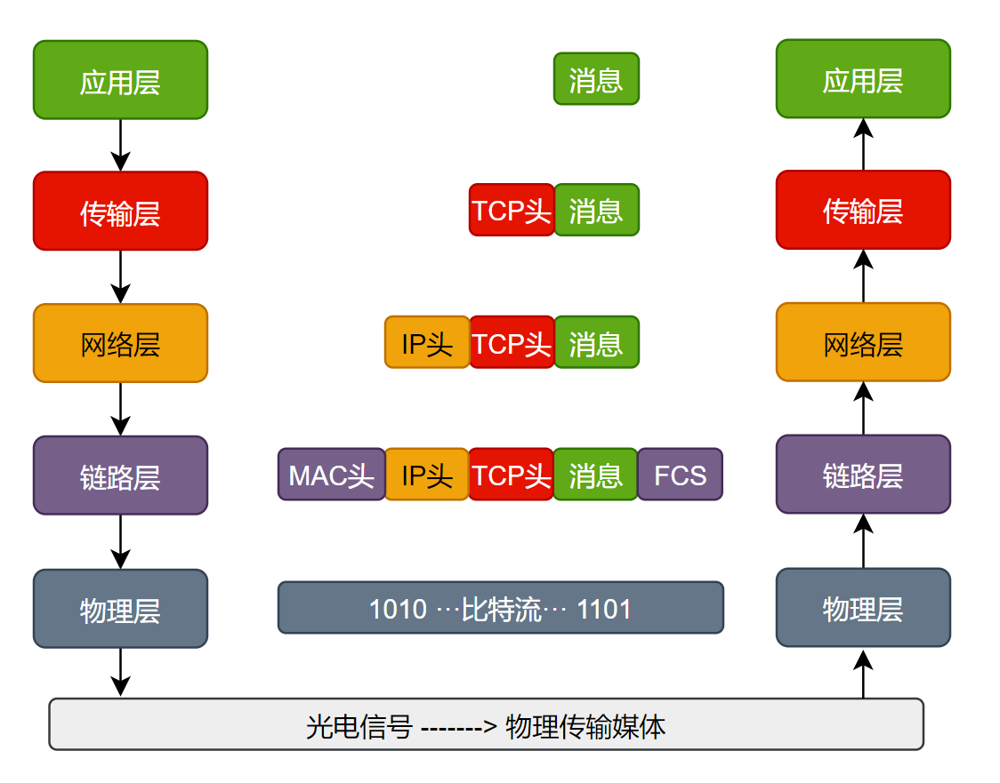

- **应用层：** 是网络应用程序及他们的应用层协议存留的地方。包括许多协议，例如HTTP，SMTP，FTP，DNS。应用层协议分布在多个端系统上，一个端系统上的应用程序使用应用层协议和另一个端系统中的应用程序交换信息，应用层交换的分组信息称为`报文(message)`

- **传输层：** 传输层**在应用程序端点之间传送应用层报文**。TCP和UDP协议。传输层的分组称为`报文段(segment)`
- **网络层：** 网络层负责网络层分组(`数据报(datagram)`)从一台主机移动到另一台主机。源主机的传输层(TCP/UDP)向网络层递交报文段和目的地址。
- **链路层：** 为了将分组从一个节点移动到另一个节点，网络层必须依靠链路层的服务。在每个节点，网络层将数据报下传给链路层，链路层沿着路径将数据包传递给下一个节点，在下一个节点，链路层再将数据包上交给网络层。链路层提供包括以太网、WiFi和电缆接入网的DOCSIS协议。一个数据包可能会经过不同链路层，所以可能会在不同链路中被不同的链路层协议所处理。链路层的分组称为`帧(frame)`
- **物理层：** 物理层的任务是将链路层的帧中的一个个比特从一个节点移动到下一个节点。物理层协议与链路相关，如关于双绞铜线的，关于同轴电缆的，关于光纤的协议等


## 1.5 相关概念

- **端系统/主机**：PC，手机等等一切联网的设备
- **通信链路**：即网线
- **分组交换机**：路由器，链路层交换机
- **传输速率**：把一个分组从路由器传输到链路上的速率，注意区分**传播速率**
- **分组**：每一层形成的信息包（本层的**首部**+来自上层的**有效荷载**）
- **路由**：从发送端系统到接收端系统，一个分组所经历的一系列通信链路和分组交换机形成的路径
- **ISP**：因特网服务提供商，它是由多个分组交换机和多段通信链路组成的网络，它能够使端系统接入因特网
- **网络协议的组成要素**：语法、语义、同步


# 2. 物理层

通信方式：单工，半双工，全双工

数字信号到模拟信号的转换


## 2.1 集线器Hub

集线器是物理层设备，是一种"共享"设备，集线器本身不能识别目的地址，当同一个局域网的A主机发送数据给B主机时，数据包在集线器上是**以广播的方式传输**的，由每台终端通过验证数据包头的地址信息来确定是否接收

集线器一个时钟周期内只能传输一组信息，所以一台集线器的机器数目过多，同时通信就会导致功能效率很差（集线器有数据传输的时候，其他主机想通过集线器发送数据只能先等待），发生堵塞、碰撞等

半双工

主要作用：由于非屏蔽双绞线（中继器）传输信号时信号功率会逐渐衰减，所以需要集线器将衰减的信号重新整理，重新产生出完整的信号再继续传送


## 2.2 集线器的特点

集线器作为一个中间设备，所有的网线都接到集线器上即可通信，减少了网线数量(避免每台电脑都得和其他所有电脑物理连接)

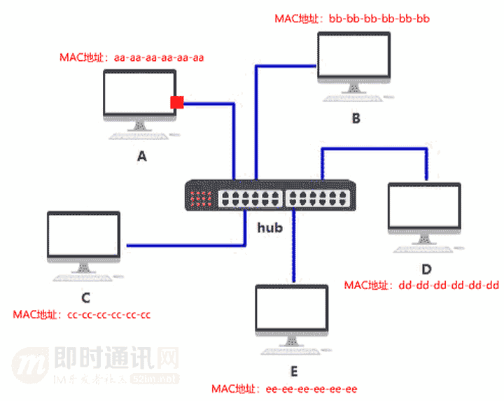

但是集线器没有智商，将所有接收到的数据都**以广播方式转发到除接收端口以外的所有端口**，由**接收方根据包头的MAC地址判断是否是发给自己的**，不是则丢弃。。。带来的问题就是浪费网络资源，于是我们想要一个可以只发给目标MAC地址指向的那台电脑的中间设备，这就有了链路层的交换机


## 2.3 电路交换和分组交换

电路交换，例如传统电话网络，通信双方必须有一条实体连接，资源预留，发送方和接收方之间路径上的交换机都将为该连接维护连接状态，这就是一条电路。预留了恒定的传输速率。

分组交换中，资源不是预留的，所以需要等待(排队)接入通信线路。如果此时其他分组也需要经过链路传输，可能就会出现拥塞，但单分组传输的时候可以使用到完整的速率。更高效。


# 3. 链路层-帧(frame)
## 3.1 主要职责
1. **封装成帧**：将网络层传下来的分组添加首部和尾部，用于标记帧的开始和结束
    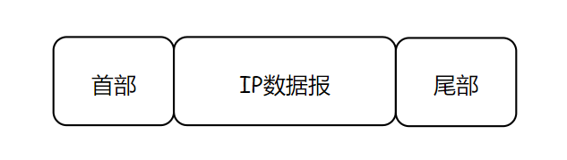

  

2. **透明传输**：帧使用首部尾部进行界定，如果帧中有首尾部相同内容需要进行转义，如果有与转移字符相同内容，需要再次转义，接受端可以进行数据还原。整个过程透明，用户察觉不到转移字符的存在

3. **差错检测**：使用循环冗余检测(CRC)来检查比特差错
   - CRC：将二进制数据流(bit)作为多项式系数， 和密码的除数做多项式除法，得到的余数多项式的系数作为校验位

## 3.2 信道
信道的分类：
1. **广播信道**：一对多通信，一个节点发送的数据能被整个广播信道上的所有节点接收到。为了避免碰撞，使用信道复用技术和CSMA/CD协议控制
2. **点对点信道**：不会碰撞，使用PPP协议控制

### 3.2.1 信道复用
**信道复用技术**： 频分复用、时分复用、波分复用、码分复用

**码分复用**：为每个用户分配 m bit的码片，不同码片相互正交 $\frac{1}{m} \vec{S} \cdot \vec{T}=0$ ，用户发送1时即发送自己的码片值，发送0即发送码片的反码。接受端使用相同码片进行计算，值为1表示是该用户发送的1，值为-1表示是该用户发送的0，值为0表示是其他用户发送的数据。**码分复用的缺点是需要发送m倍的原始数据！** 

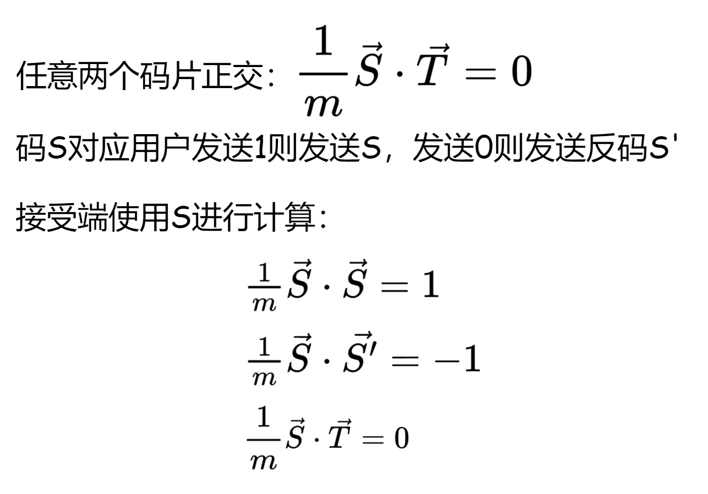

### 3.2.2 CSMA/CD协议

`CSMA/CS协议`：载波监听多点接入/碰撞检测
多点接入：总线型网络，许多主机以多点方式连接到总线上
载波监听：每个主机不停的监听信道。发送前监听到信道正在使用就必须等待。多站点同时发送时电压变化幅度增大(叠加)，检测电压以监听
碰撞检测：发送中监听到信道已有其他主机在发送数据，则发生碰撞。虽然发送前监听到了空闲，但是发送时状态可能发生变化了
一旦监听到发生冲突，则立即停止发送数据，等待一段随机时间后再次发送
碰撞最迟需要2t时间才能检测到
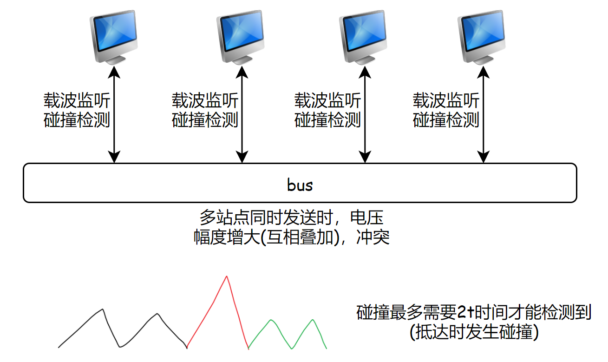

### 3.2.3 PPP协议
>  互联网用户需要连接到某个**ISP(运营商)**后才能接入互联网，PPP协议是用户**计算机和ISP进行通信**时使用的链路层协议

点到点的，不会发生碰撞。一个PPP网络只能包含两个PPP接口。PPP在同一个广播域中只能有两个节点，无法加入第三个节点，**所以也并不需要MAC地址**。
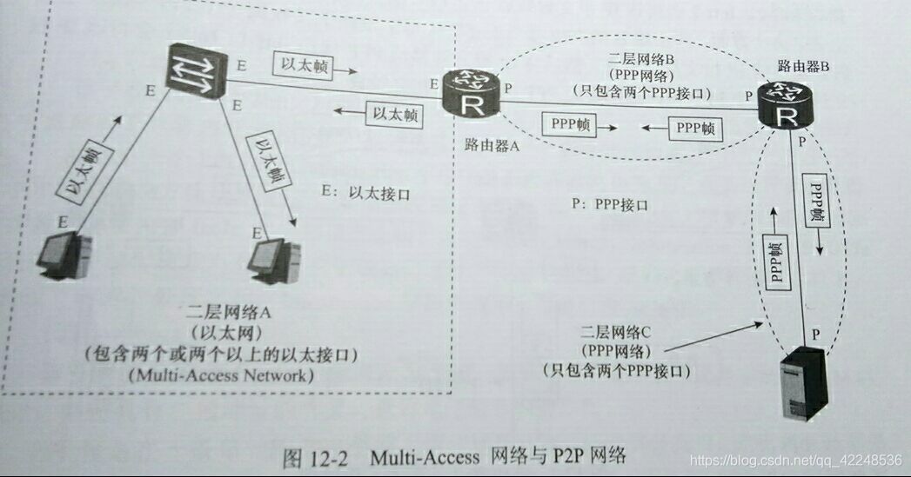
如图，二层网络A是一个以太网，二层网络B是一个PPP网络，二层网络C也是一个PPP网络
路由器A有两个接口，一个是以太口，一个是PPP接口。如图所示：路由器A的以太口从以太链路上接收到一个以太帧后，会将这个以太帧中的IP报文提取出来，再将IP报文转移到PPP接口。PPP接口会将这个IP报文封装成一个PPP帧，然后将其PPP帧发送至PPP链路上。另外，路由器A的PPP接口从PPP链路上接收到一个PPP帧后，会将这个PPP帧中的IP报文提取出来，然后将这个IP报文转移到以太口。以太口会将这个IP报文封装成一个以太帧，然后将此帧发送到以太网链路上

## 3.3 MAC地址
mac地址是链路层地址，长度为`6字节(48bit)`，**用于唯一标识网络适配器(网卡)**
一台主机有多少个网络适配器就有多少MAC地址。例如有无线网卡和有线网卡就有两个MAC地址

### 为什么有了IP地址唯一区分主机，还要MAC地址？

- 首先功能不一样，IP地址为了确定终点的地址，而MAC地址用于确定下一跳的地址
- 局域网是为任意网络层设计的，而不只是用于 IP 和因特网。如果适配器识别的是 IP 地址而不是 MAC 地址的话，将不能够很方便地支持其他网络层协议
- IP地址具有地域性，而MAC地址是分配给厂家的，厂家的产品遍布全球，不具有地域性。
- 网络上希望路由的转发规则尽量简单，所以一般要用ip地址前多少位而不是整个ip地址做转发，mac地址是没法做汇聚的


### MAC地址不需要全球唯一

MAC 地址由 **6** 个字节组成。前 3 个字节表示**厂商识别码**，每个网卡厂商都有特定唯一的识别数字。后 3 个字节由厂商给每个网卡进行分配。厂商可以保证生产出来的网卡不会有相同 MAC 地址的网卡。

MAC地址

现在可以通过软件修改 MAC 地址，虚拟机使用物理机网卡的 MAC 地址，并不能保证 MAC 地址是唯一的。但是**只要保证 MAC 地址在局域网中唯一就不会造成网络问题**，不同局域网中的 MAC 地址可以相同


## 3.4 局域网LAN（以太网）
局域网(`Local Area Network`)是一种典型的广播信道，主要特点是网络为一个单位所拥有，地理范围和站点数目有限
主要有以太网、令牌环网、ATM等技术，目前以太网为主

**以太网的核心是一个交换机**

**以太网帧**：`星型拓扑结构的局域网`，使用`交换机`(链路层设备，根据MAC地址转发，无碰撞)连接
以太网帧：
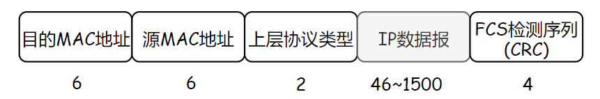

**交换机**：具有自学习能力，学习的是交换表，存储着MAC地址到接口的映射。每次发送数据首先查找表，表中没有对应MAC地址主机的表项则进行广播，其他主机收到会丢弃，目标主机收到后回应，交换机添加主机到映射表


**局域网内使用MAC地址作为地址标识符进行通信**


## 3.5 分组交换机(packet switch)、存储转发

端系统彼此交换**报文（message）**，为了从源端系统向目的端系统发送一个报文，源将长报文划分为较小的数据块，称为**`分组`(packet)**。在源和目的地之间，每个分组都要经过**分组交换机(packet switch)**

分组交换机有两种：**路由器(router)**和**链路层交换机(link-layer switch)**，我们通常说的交换机一般指的是链路层交换机。


交换机也叫交换式集线器，**在数据链路层使用MAC地址转发数据**（通过引入路由功能，一些交换机也可以在网络层转发数据，称为三层交换机或者多层交换机）。从它的一条入通信链路接收到达的分组，从它的一条出通信链路转发该分组。

`交换机自己没有 MAC 地址`，`对主机和路由器是透明的`，即主机和路由器并不知道交换机会接收该帧并进行转发

**链路层交换机实现了物理层和链路层**，所以是不能识别ip地址的。而路由器实现了前三层，到网络层，所以可以识别ip地址

**存储转发机制：** 交换机在转发该分组的第一个比特前，必须接收到整个分组！缓存后再依次转发该分组的比特

**输出缓存/输出队列：** 每台分组交换机有多条链路与之相连，对于每条相连的链路，分组交换机具有一个输出缓存，用于存储路由器准备发往该链路的分组。所以分组需要承受**存储转发时延**和分组转发的**排队时延**。缓存大小有限，当网络拥塞到一定程度，缓存充满，就会出现**分组丢失**，即**`丢包`(packet loss)**，到达的分组或者排队的分组将会被丢弃。

**传输时延和传播时延的比较：** 传输时延是分组被推上链路所需要的时间，与分组长度和链路带宽有关。传播时延是分组在链路中传播的时间，与链路的长度和材料有关，一般接近光速


**交换机转发的过程**：

1. 如果MAC表中**没有**目的MAC地址的表项，就**广播**该帧
2. 如果MAC表中对应的表项中的端口 **==** 该帧进来的端口，就直接**丢弃**该帧（如果不丢弃会导致收到两条消息，如下图）
3. 如果MAC表中对应的表项中的端口 **!=** 该帧进来的端口，就**单播**到相应的端口

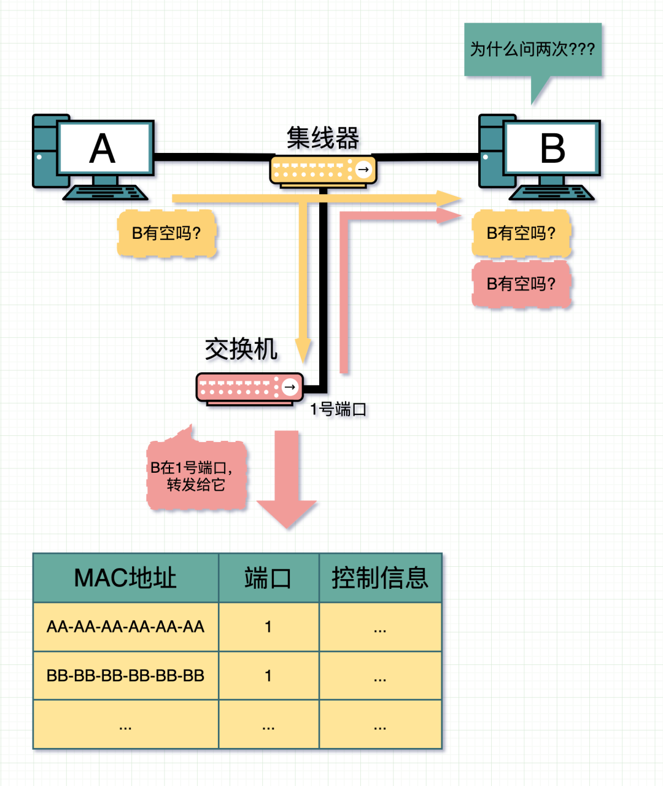


**交换机的自学习**：

1. MAC表初始为空
2. 对于从每个接口进来的帧，都在MAC表中存储相应的表项（**只记录进来的帧的源地址**）
3. 在一段时间后，如果交换机没有接受到以该地址为源地址的帧，就在表中删除这个地址

也可以手动在交换机的MAC表中添加**静态条目**，静态添加的MAC地址条目优先于动态条目进行转发，静态条目没有老化时间，会一直保存在交换机的MAC地址表中


交换机会在每个端口成功连接时，通过**将MAC地址和端口对应，形成一张`MAC表`**。在今后的通讯中，**发往该MAC地址的数据包将`仅送往其对应的端口，而不是所有的端口`**。因此**交换机可用于划分数据链路层广播**，即**冲突域**；但它**不能划分网络层广播**，即**广播域**

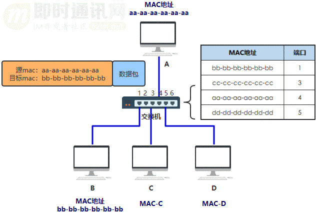

交换机对数据包的转发是**建立在MAC地址——物理地址基础之上的**，对于IP网络协议来说，它是透明的，即交换机在转发数据包时，不知道也无须知道源IP和目的IP地址，只需知其物理地址，然后**根据MAC表查找到该物理地址对应端口，从该端口转发出去即可**

**`这便组成了小范围的以太网`**


### 交换机和网桥的区别

网桥其实就是两个网线口的交换机，正好可以把两台电脑连接起来，也叫桥接

而交换机则是多网线口的网桥，可以把堕胎电脑给连接起来

其他功能方面都是差不多的


### 二层交换机、三层交换机

三层交换机其实就是路由器


## 3.6 转发表(MAC表)工作原理

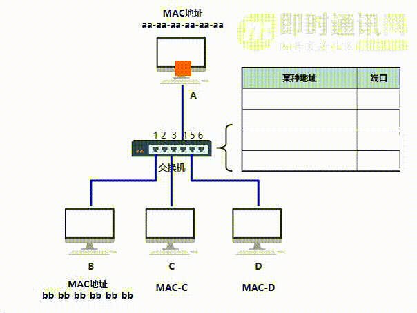


## 3.7 交换机级联

当机器越来越多的时候，交换机的端口不够用了，于是要将多个交换机连接起来

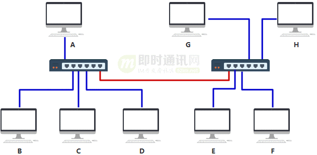

学习完后，交换机的MAC地址表如下：

注意，二层交换机工作本身没有要求需要MAC地址。（虽然真实的产品一般都有MAC）。

交换机(左)

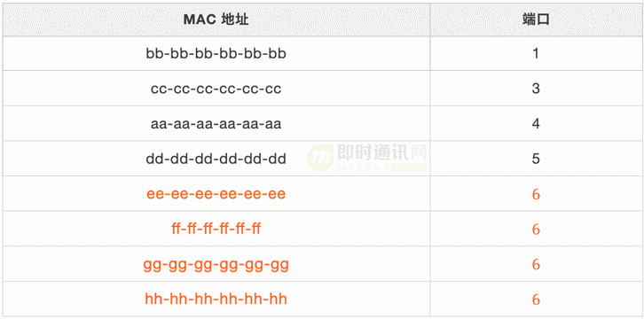

交换机(右)

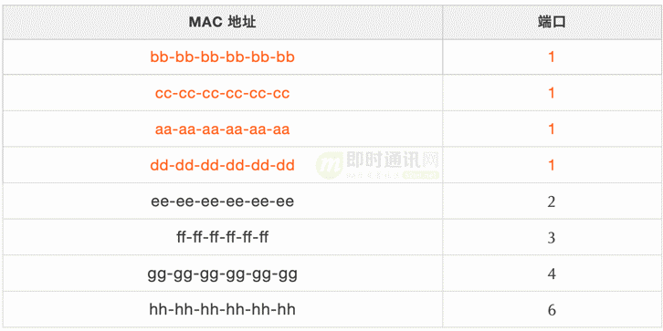


当局域网中存在多个交换机的时候

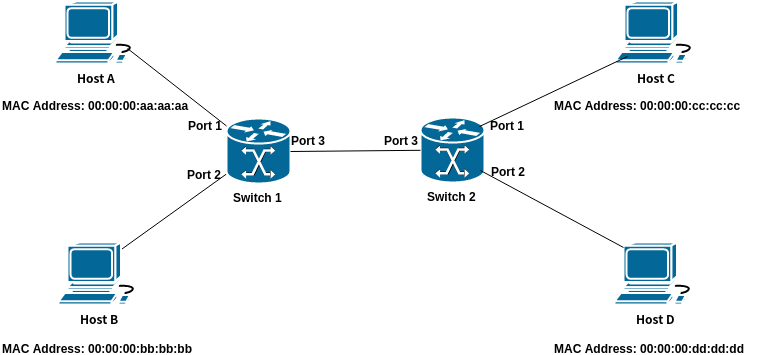

**假设主机A与主机C进行通信**：

1. 首先主机A通过ARP请求，获得主机C的IP对应的MAC地址
2. 主机A将一个源MAC地址为本机网卡物理地址，**目的MAC地址为主机C网卡物理地址**的数据帧发送给交换机1
3. 交换机1收到此数据帧后，会**学习源MAC地址**，并检查MAC地址表，发现没有目的MAC地址的记录，则会将数据帧广播出去，**主机B和交换机2都会收到此数据帧**
4. 交换机2收到此数据帧后也会将数据帧中的**源MAC地址和对应的端口**记录到MAC地址表中，并检查自己的MAC地址表，发现没有目的MAC地址的记录，则会**广播此数据帧**，主机C和主机D都会收到此数据帧
5. 主机C收到数据帧后，会响应这个数据帧，并回复一个源MAC地址为本机网卡物理地址的数据帧，该帧最终会送往主机A，这时**交换机1和交换机2都会将主机C的MAC地址记录到自己的MAC地址表中**，并且以单播的形式将此数据帧发送给主机A
6. 这时，主机A和主机C再通信，就可以**以单播的形式传输数据帧**了，A与D、B与C及B与D的通信与上述过程一样，因此交换机2的MAC地址表中记录着主机A和主机B的MAC地址都对应其`端口3`


## 3.8 交换机级联的问题

交换机虽然可以级联，但是级联的设备越来越多，导致**MAC表越来越大**！

于是就有了路由器，**路由跟电脑一样拥有自己独立的MAC地址**，同时还能帮忙将数据包做一次转发

**路由器的每个端口都有独立的MAC地址**

对于交换机来说，路由器也是一台电脑，只需要在MAC表中增加一条路由的MAC地址和端口的映射关系，就可以成功的把数据**交给路由器`对应端口`**了

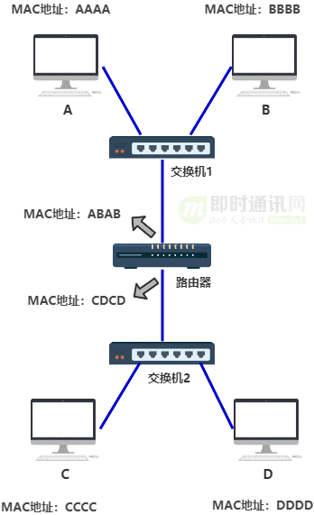

现在唯一的问题就是：A和B如何把发给C和D等的数据包，统统先发给路由器呢？？

这就是需要`ip地址和子网掩码`，来判断目的地址是否属于同一个子网了，同时还要配置`默认网关`


## 3.9 广播域和VLAN

VLAN即`Virtual Local Area Network`，虚拟局域网

**广播域**是交换机的广播帧可以到达的区域。换句话说，由多个交换机和主机组成的网络就是一个广播域

网络规模越大，广播域就越大，泛洪流量也越来越大，降低通信效率。在一个广播域内的任意两台主机之间可以任意进行通信，通信属于由被窃听的风险

为了解决广播域扩大带来的性能问题和安全性问题，VLAN技术诞生了

VLAN能够在逻辑上**把一个物理局域网分隔为多个广播域**，每个广播域称为一个**虚拟局域网(VLAN)**

每台主机只能属于一个VLAN，同属一个VLAN的主机通过二层交换机直接通信，而不属于同一个VLAN的主机只能通过路由功能才能进行通信

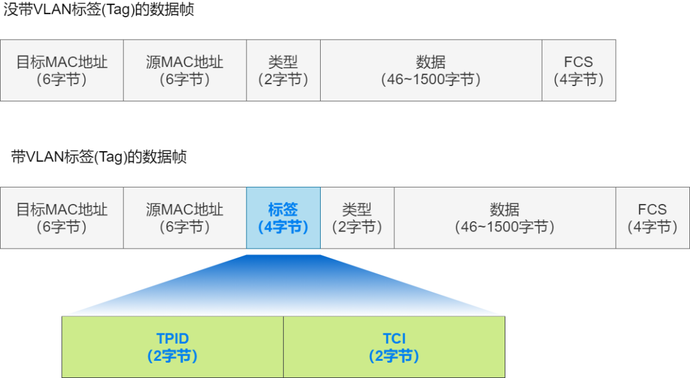

VLAN技术通过给数据帧插入`VLAN TAG`的方式，让交换机能够分辨出各个数据帧所属的VLAN

交换机收到带VLAN标签的数据帧后，只会将这个数据帧在相同的VLAN的端口进行广播

划分VLAN后，如果是不同VLAN的主机，即使交换机MAC表中存放了对方的MAC地址，也不会转发该帧，必须通过三层机器才能通信


https://mp.weixin.qq.com/s/EUHyfg-LAOj8FfkF4F1uug


# 4. 网络层-数据报(datagram)
因为网络层是整个互联网的核心，因此应当让网络层尽可能简单。**网络层向上只提供简单灵活的、无连接的、尽最大努力交付的数据报服务**     
使用 IP 协议，可以把异构的物理网络连接起来，使得在网络层看起来好像是一个统一的网络          


与 IP 协议配套使用的还有三个协议：
- 地址解析协议 ARP（Address Resolution Protocol）
- 网际控制报文协议 ICMP（Internet Control Message Protocol） 
- 网际组管理协议 IGMP（Internet Group Management Protocol）

IPv4和IPv6：IPv4以`4字节`32位作为IP地址，IPv6以`16字节`128位作为IP地址

## 4.1 IP数据报格式      

- `版本号` : 有 4（IPv4）和 6（IPv6）两个值
- `首部长度` : 4位，四字节为单位，所以最长64字节，最短就是可变部分全都没有，只有20字节，也就是该值最小为5（如果可变部长度不是4的字节的整数倍，就用尾部的填充部分来填充）             
- `服务类型` ： 8位，一般不用(00H)，只有在网络提供分区服务(DiffServ)时使用
- `总长度` ： 16位，一个字节为单位，包括首部长度和数据部分的长度，最大IP分组长度65535B，IP分组可以封装的最大数据为65535-20=65515B    
- `标识` ： 数据报长度过长而发生分片时，相同的数据包的不同分片具有相同的标识      
- `标志位` ： [保留位，DF，MF]，DF=1表示禁止分片， MF=1表示非最后一片                
- `片偏移` ： 片偏移的单位是8字节，和标识符结合使用，记录数据报片的第一个字节的报文偏移量

- `生存时间` : TTL，以路由器跳数为单位，防止无法交付的数据报在互联网中不断兜圈子，当TTL为0时就丢弃该数据包        
- `协议` : 指出携带的数据应该上交给哪个协议进行处理，如ICMP，TCP(6)，UDP(17)等
- `首部校验和` : 数据包每经过一个路由器都要重新计算校验和，对IP分组首部进行差错检测，计算时全部置0，反码算数运算求和，和的反码作为首部检验和字段          
- `源和目的IP地址` ： 各16位
- `选项字段` ： 1~40B之间，可以携带时间戳、路由记录等，实际很少使用       
- `填充字段` ： 1~3B，目的是补齐整个首部为4B的整数倍

## 4.2 IP地址的编址方式  
IP地址编址经历三个历史阶段：分类，子网划分，无分类
1. 分类：`IP地址::={<网络号>,<主机号>}`

2. 子网划分：`IP地址::={<网络号>,<子网号>,<主机号>}`，要使用子网，就必须要配置子网掩码
3. 无分类编址CIDR：`IP地址::={<网络前缀号>,<主机号>}`消除了传统ABC类地址即划分子网的概念。如128.14.35.7/20 表示前 20 位为网络前缀

CIDR可以把多个网段聚合到一起，生成更大的网段，从而汇总路由表的IP地址，分担路由表压力：

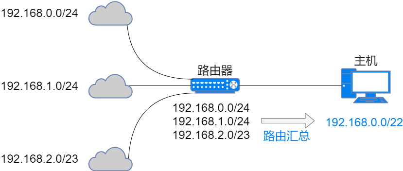


计算子网地址：例如主机号有 7 位，网络号则有 32 - 7 = 25 位，也就是**C类地址 222.222.222.0/24** 向主机位借了一位作为子网位，那么子网掩码也就是 255.255.255.128 。可分配 222.222.222.0/25 使用。

子网中最后一个可用主机号是：1111 110， 因为全1是作为广播的IP使用的

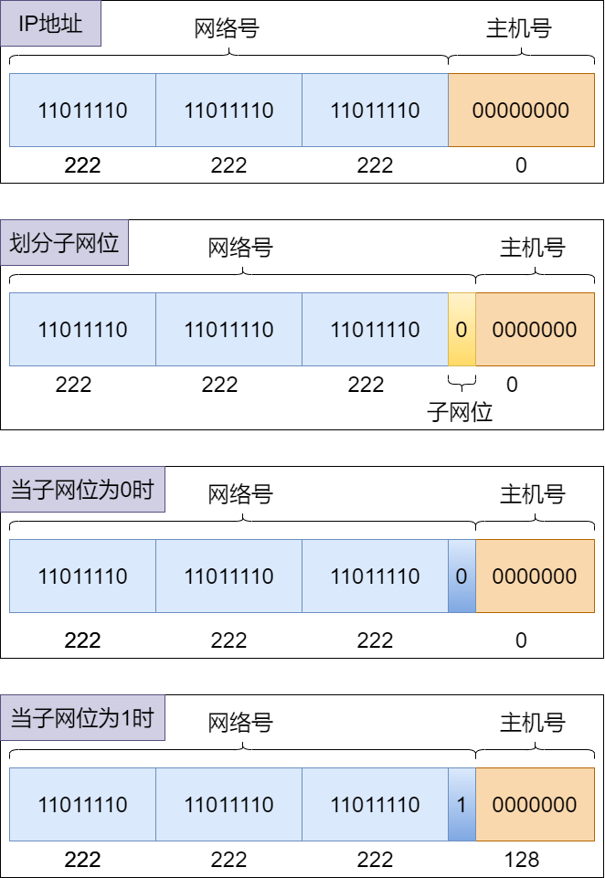


**对于电脑来说，访问同网段的目标和访问不同网段的目标是不同的**，访问不同网段（通过子网掩码计算判断是不是同一个网段）的目标主机，**需要通过网关进行转发**，而访问同网段内的主机直接进行通信就可以了


### 公网IP和私网IP

IP 地址分为 公网地址和私网地址。公网地址是在互联网上使用的，私有地址是在局域网中使用的。

**公网地址**由 Internet NIC 负责分配，通过它直接访问互联网，在互联网范围内是唯一的。

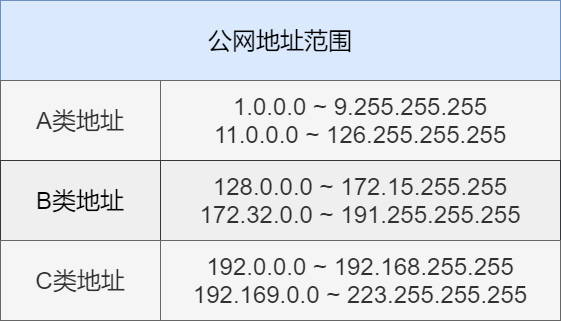


**私有地址**是一段保留的 IP 地址。只在局域网中使用，无法在互联网上使用。但是私有地址可以通过 NAT 技术，将私有地址转换为公网地址接入互联网。私有地址只要在同一个局域网内唯一即可，在不同局域网内出现相同的私有IP不会影响使用。

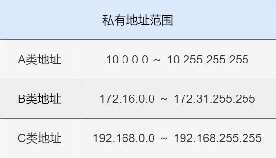


## 4.3 ARP地址解析协议

ARP协议在OSI模型中属于链路层协议，在TCP/IP模型中属于网络层协议（毕竟要IP地址嘛）


网络层实现主机之间的通信，而链路层实现具体每段链路之间的通信。因此在通信过程中，IP 数据报的源地址和目的地址始终不变，而 MAC 地址随着链路的改变而改变


**ARP协议实现由IP地址到MAC地址的映射**：每个`主机`都有一个`ARP高速缓存`，存放了本局域网的各个**主机和路由器的IP地址到MAC地址的映射表**

例如A想知道B某个IP的MAC地址，就发起一个ARP广播，询问局域网内的所有机器，谁的IP是与B的一致，当B收到后，发现目的IP是自己，于是把自己的MAC地址作为应答返回给A，这时A就知道了B的MAC地址，并记录在本地的ARP表中，下次就可以直接查表了


## 4.4 ICMP网际控制报文协议
由于**IP层只提供无连接的、尽最大努力交付的服务**，这就意味着**无法进行流量控制和差错控制**，因此IP数据包的传输过程中，出现各种错误是在所难免的，这就需要出现错误的时候通知源主机IP数据报传输中遇到了什么问题，这就是通过ICMP协议完成的，可以用于主机和路由器之间沟通网络层信息。


ICMP 是为了更有效地转发 IP 数据报和提高交付成功的机会。

ICMP报文像TCP/UDP报文一样，**封装在 IP 数据报中**，但是ICMP不属于高层协议，应该把它当作网络层协议
两个应用：一方面是**测试网络连接是否畅通**，另一方面如果丢包了，IP协议并不能通知传输层是否丢包及丢包原因，这就需要ICMP协议来进行**差错报告**

ICMP报文分为**差错报告报文**和**查询报文**

**查询报文**：如`ping命令`，`子网掩码查询`，`时间戳查询`等情况，都会发送查询报文

**差错报文**：当对应路由器或者终端设备`收到查询报文后，产生一系列问题`，把出现的问题`回复给发起者`的报文就是差错报文

但是考虑到网络整体资源的占用，下列情况不会产生差错报文：

1. 差错报文不会产生差错报文，防止ICMP无限产生和传送差错报文
2. 目的地址是广播或者多播的IP数据包
3. 链路层广播的数据报
4. 不是IP分片的第一片不会产生差错报文，因为IP只是尽力交付，不需要可靠性
5. 源地址不是某个主机的数据包


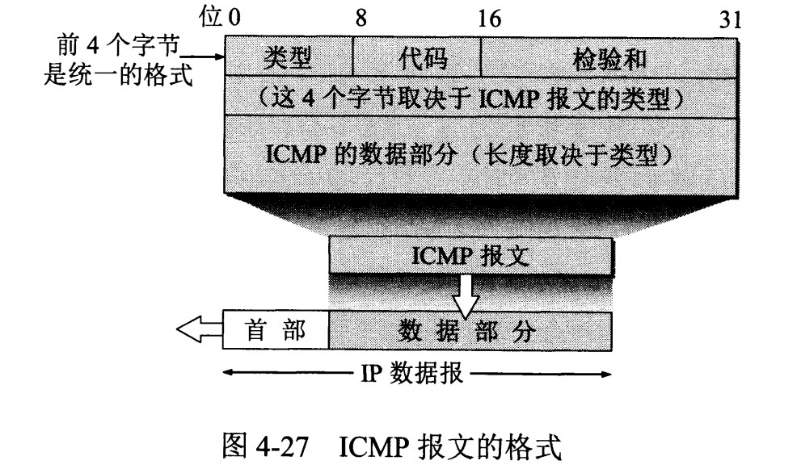

ICMP头：

| Type | code | Description                                 |
| ---- | ---- | ------------------------------------------- |
| 0    | 0    | Echo 回复报文，如 Ping 命令的回复报文。     |
| 3    | 0    | 网络不可达                                  |
| 3    | 1    | 主机不可达                                  |
| 3    | 2    | 协议不可达                                  |
| 3    | 3    | 端口不可达                                  |
| 3    | 4    | **需要分片**                                |
| 3    | 6    | 目的网络未知                                |
| 3    | 7    | 目的主机未知                                |
| 8    | 0    | Echo 请求报文，如 **Ping 命令的请求报文**。 |
| 11   | 0    | **TTL过期**                                 |
| 13   | 0    | 时间戳请求报文                              |


**如何知道主机A发送到主机B的数据包在网络中都经过了哪些路由呢？**

**当IP数据包在路由中出错时，路由器会向发送源发送一个ICMP错误报文，发送端从该ICMP错误报文中，可以得到该路由的IP**。要得到从主机A到目标主机B之间的所有路由的IP，那么我们必须让IP数据包在每个路由器中都出错一次

可以**为数据包分配一个目标主机几乎不可能监听的端口**，从而，当IP数据包到达目标主机后，目标主机会回复相应的”不可到达、端口不可到达”的ICMP错误信息，从而，我们可以确认IP数据包已经到达了目标主机

综上，我们可以：源主机A发送IP数据包，IP为目标主机B，port为几乎不可能监听的port，TTL从1开始每次往上增加1，直到收到来自主机B的ICMP 不可到达（端口不可到达）信息

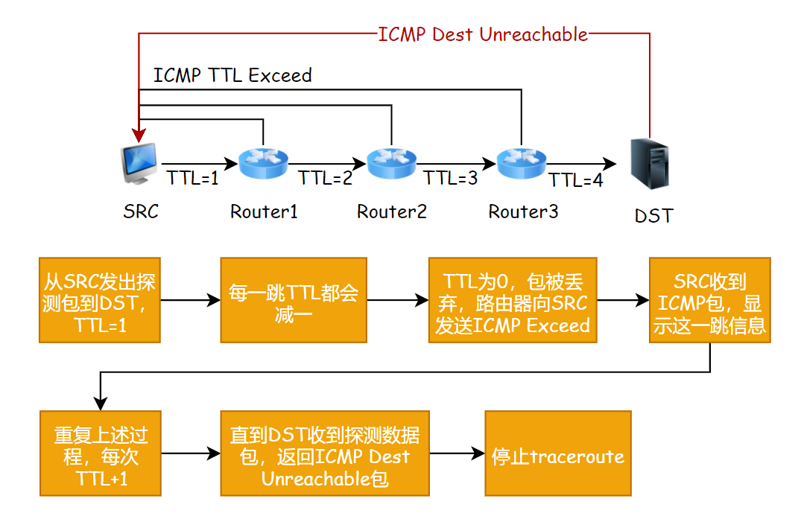

Traceroute 命令就是实现这样功能的一个程序。我们可以通过tracerouter ip来调用此功能


## 4.5 NAT协议

> **在互联网中的所有路由器，对目的地址是私用IP地址的数据报一律不进行转发**。
>
> 这样私网上的主机访问互联网就会出现问题：能把包发出去 但是互联网上的服务器无法把包返回至私网 解决办法就是采用**网络地址转换 NAT**
>
> 需要在专用网连接到互联网的路由器上安装 NAT 软件。装有 NAT 软件的路由器叫做 **NAT路由器**，`它至少有一个有效的外部全球IP地址`。
>
> 所有使用本地地址的主机在和外界通信时，都要在 NAT 路由器上将其本地地址转换成全球 IP 地址，才能和互联网连接。  
>
> NAT是将 `协议、源地址、源端口、目的地址、目的端口`的五元组进行映射，所以很难出现端口不够用的情况

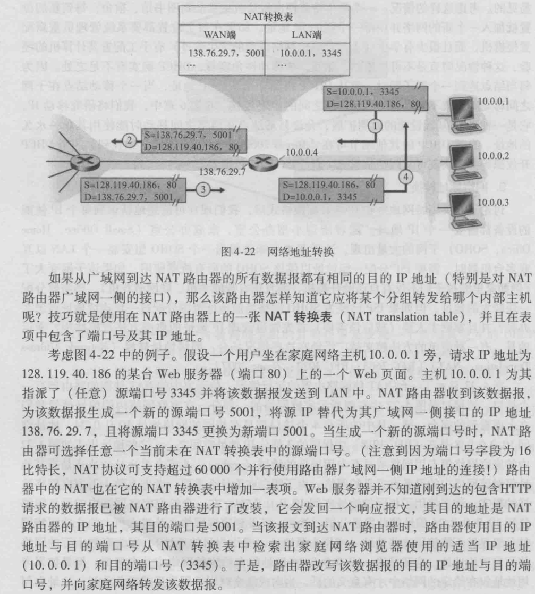

**内网穿透**：实现不同局域网内的主机之间通过互联网进行通信的技术叫内网穿透

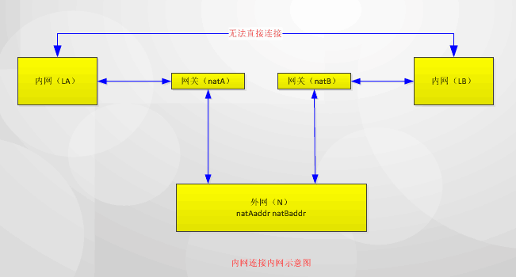

内网 LA、LB 网关 natA,natB 外网 N，LA 要连 LB。LA先通过网关ntaA连接N，LB通过网关ntaB也连接到N。然后 LA在N那里得到了LB的地址（实际上就是natB的地址）。但是直接给natB发东西不行的。

因为一个socket只能给一个socket发东西，而这时natB是在跟N发东西的。于是这时候LA就给N说，你让LB来连接我吧！

然后N对LB说，你再开一个连接出来，于是N就有了LB的另一个地址LBADDR，然后告诉LA。LA这下就可以连接LB了，因为LBADDR是一个外网地址，也就是natB的地址。而natB是知道这个地址是要转发给LB的。


## 4.6 路由器

路由器功能：路由选择，分组转发

路由器由**输入接口**、**输出接口**、**交换结构**和**路由选择**处理器组成，其中维护着一张**路由表**和**转发表**。

路由表根据**路由选择协议**生成，记录了经过该路由器的路由状态，提供路由选择，是一个全局性的表；而转发表是根据路由表生成的，记录了应该从哪个接口转发数据报

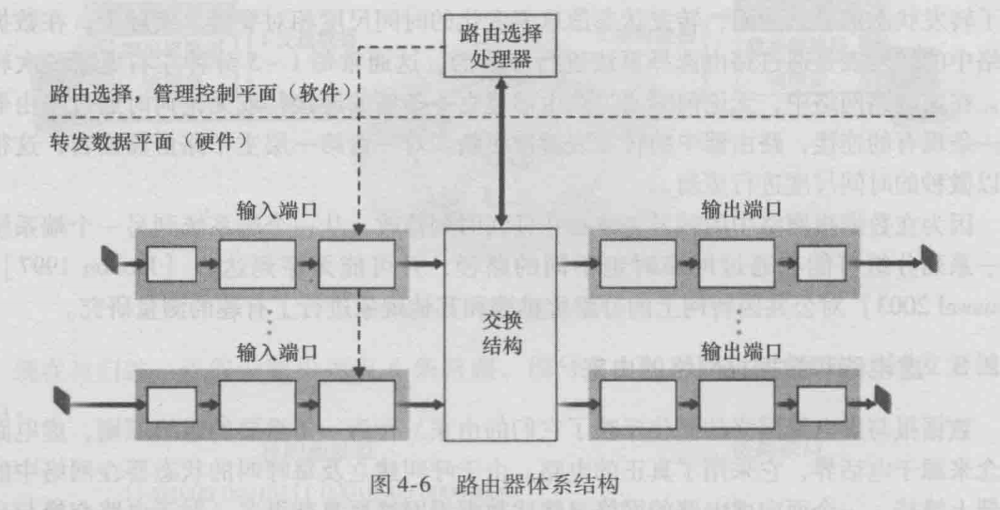


### 4.6.1 路由器转发过程

1. **完成接收包后的操作丢弃MAC头**：

   完成包接收操作之后，路由器就会丢弃包开头的 MAC 头部。

   MAC 头部的作用就是将包送达路由器，其中的接收方 MAC 地址就是路由器端口的 MAC 地址。

   因此，当包到达路由器之后，MAC 头部的任务就完成了，于是 MAC 头部就会被丢弃。

2. **根据最长匹配原则，通过IP头部查询路由表**

   如下图所示，假设地址为 10.10.1.101 的计算机要向地址为 192.168.1.10 的服务器发送一个包，这个包先到达图中的路由器。（**0.0.0.0是默认路由，网关是默认网关（网关指的是要到达目标地址下一跳的IP地址）**）

   然后根据包的接收方 IP 地址查询路由表中的目标地址栏，以找到相匹配的记录。

   这个匹配并不是匹配全部 32 个比特，而是根据子网掩码列中的值判断网络号的比特数，并匹配相应数量的比特。

   按照这样的规则，第3、4、5行都可以匹配。其中，路由器首先寻找网络号比特数最长的一条记录。

   网络号比特数越长，说明主机号比特数越短，子网中可能存在的主机数量越少，这一规则的目的是尽量缩小范围，所以根据这条记录判断的转发目标就会更加准确。这就是**最长匹配原则**

   相比服务器所属的子网来说，直接指定服务器本身的地址时范围更小，因此这里应该选择第 4 行作为转发目标。

   按照最长匹配原则筛选后，如果只剩一条候选记录，则按照这条记录的内容进行转发。

3. **根据跃点值筛选网络号相同的记录**

   有时候路由表中会存在网络号长度相同的多条记录，例如考虑到路由器或网线的故障而设置的备用路由就属于这种情况。

   这时需要根据跃点计数的值来进行判断。跃点计数越小说明该路由越近，因此应选择跃点计数较小的记录。

4. **无法匹配记录的包直接丢弃**

   如果在路由表中无法找到匹配的记录，路由器会丢弃这个包，并通过**ICMP消息**告知发送方。

   因为交换机根据以太网协议可以将包发送到所有的端口上，而路由器工作的网络环境就是互联网，连接设备远大于交换机。

   如果产生大量的网络包会造成网络拥塞，所以路由器遇到不知道该转发到哪里的包，就会直接丢弃。

5. **根据找到的网关通过ARP协议找到对应的MAC地址，然后封装成帧，发送到对应的端口上**


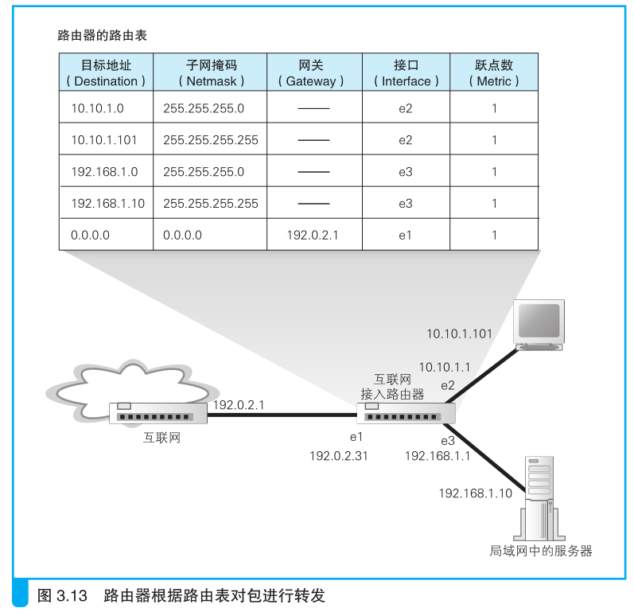


## 4.7 默认网关

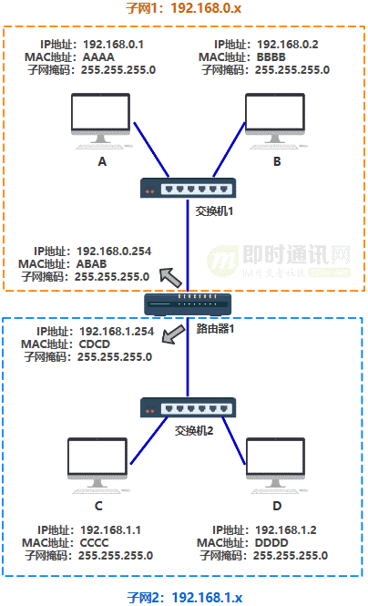


**如果A发送数据给B**，那么A直接发送如下数据包即可，交换机负责广播，网络层没有体现作用：

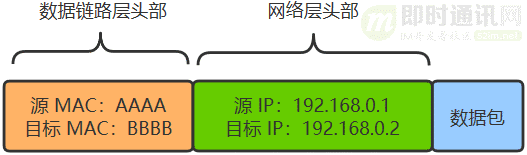


**如何知道是否要经过路由器转发**：通过子网掩码，判断源IP和目的IP是否处于同一个子网，是则交给交换机广播出去，不是则交给路由器去处理

**如果A发送数据给C**，那么A判断和C不在同一个子网，就需要把包`发给路由器(其实是发给默认网关)`，之后怎么转发，A就不用操心了：

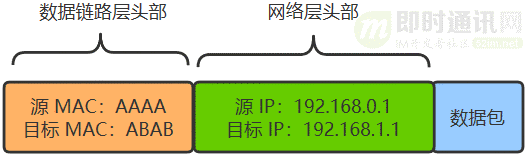

然后路由器再转交给C(具体过程见路由表一节)：

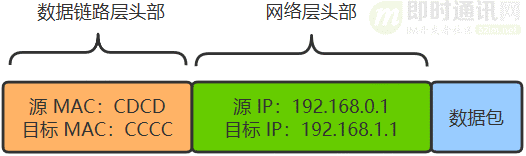

A如何知道哪个设备是路由器呢？这就需要在A上设置默认网关

对于A来说，A只能**直接**把包发给处于**同一个子网下的某个 IP** ，所以发给路由器还是发给某个电脑，对 A 来说也不关心，只要这个设备有个 IP 地址就行

**`默认网关其实就是A电脑里配置的一个IP地址`**，在A的目的IP与A不处于同一子网时，A就将这个包交给**默认网关**

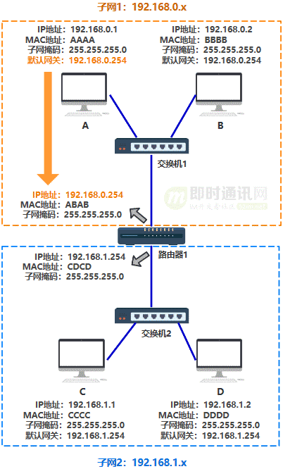

## 4.8 路由表

路由器收到来自A的数据包后，怎么知道该从自己的哪个端口出去，才能直接或者间接的到达最终目的地C呢？

这就需要路由表

类似MAC表将MAC地址和端口进行映射，路由表便是将`IP地址/子网掩码和端口`进行映射

路由表记录一个个的网段，就不用像MAC表一样每台主机都做记录了

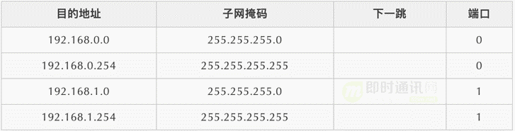


路由器收到包后，查询路由表，知道从哪个端口发出，然后路由器查询自己的ARP缓存中是否有主机C的IP和MAC的对应关系，没有则会发送ARP请求，请求的目标IP是`C的IP`，请求的MAC地址是`MAC层的广播地址FF:FF:FF:FF:FF:FF`。。C收到之后就会回复自己的MAC地址，然后路由器便将MAC地址组装在链路层数据头部，然后从端口1发出，然后交换机收到后通过查询MAC表，找到对应的端口转发出去即可

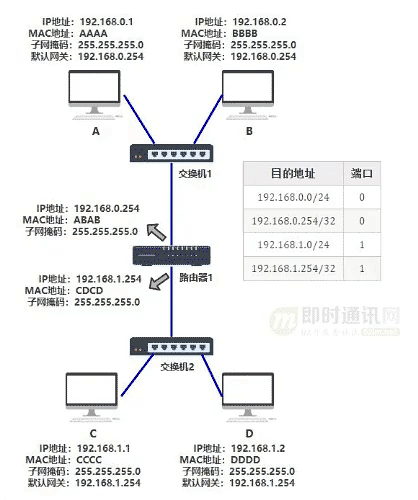


路由表的生成方式有两种：手动配置（静态路由），路由之间通过路由选择协议交换信息自动刷新（动态路由）

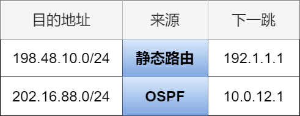

### 4.8.1 默认路由、主机路由、回环地址

**默认路由**是指路由表中任何一个地址都能与之匹配的条目。所有的数据包都可以使用默认路由进行数据转发。

默认路由为 `0.0.0.0/0` 或 `default`

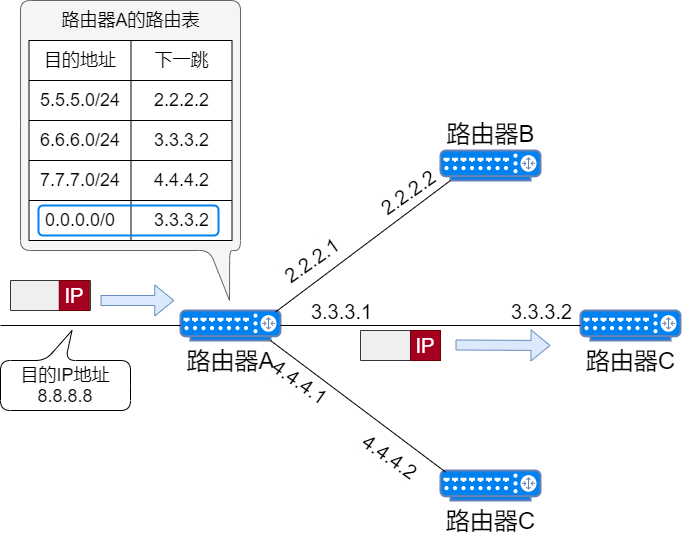


**主机路由**是指整个IP地址的所有位都参与路由的条目，这种路由表条目指向了单个IP地址或主机名。例如`192.168.153.15/32`


**回环地址**是指以`127`开头的IP地址，其所在的回环接口可以理解为虚拟网卡。**使用回环地址时，数据包会被主机的IP层获取，而不经过链路层，也不会流向网网络**。一般用来检查主机上运行的网络服务是否正常。


### 4.8.2 路由汇总

路由汇总主要是为了减少路由条目，把可以聚合的路由汇聚成一个大网络

路由表越大，查找所需要的内存和cpu资源越多，时间越长，导致转发ip数据包的性能下降。如果要规模大性能好的网络，就需要尽可能小的路由表


### 4.8.3 MTU与IP报分片

每种数据链路的最大传输单元MTU不同，IP层是数据链路层的上层，IP通过分片来屏蔽数据链路层的差异，实现不同数据链路的互通

当遇到IP数据包大于链路层MTU时，主机或路由器就会对IP数据包进行分片，分片后的IP数据包只会在目标主机上进行重组，中途经过路由器时不会再进行重组（有可能再分片）

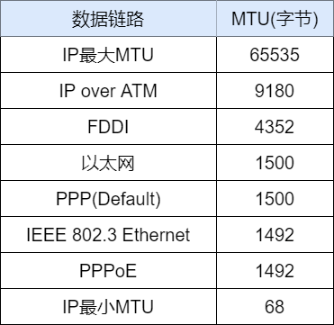

分片机制有两点不足：

- 增大了**路由器的开销**
- 分片传输中，**一旦某个分片丢失，会造成整个IP数据包作废**


为了解决这个问题，要使用**路径MTU发现技术**（`Path MTU Discovery`）。路径MTU就是路径中的所有数据链路中最小的MTU。发送端主机按照路径MTU的值将数据报分片后进行发送，就可以避免中途的路由器进行分片处理。


Path MTU Discovery的原理：

发送端主机发送IP数据包时将头部的 ***禁止分片标志位*** 设置为1。这样途中路由器即使收到需要分片的大包也不会进行分片，而是直接将包丢弃，之后通过发送一个ICMP不可达消息将 ***链路层的MTU值*** 发给发送端主机

发送端主机根据收到的MTU设置IP数据包长度，再次设置禁止分片，直到没有收到任何ICMP不可达消息

如果是TCP的话，根据MTU计算MSS，然后根据这些信息进行数据包的发送，则IP层不用再分片了


## 4.9 多路由工作情况

A要给F发送数据：

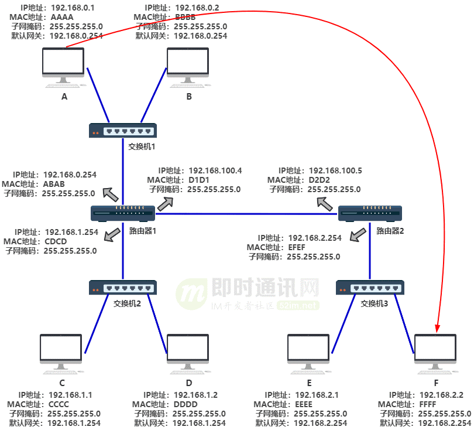

1. 首先 A（*192.168.0.1*）通过子网掩码（*255.255.255.0*）计算出自己与 F（*192.168.2.2*）并不在同一个子网内，于是决定发送给`默认网关`（192.168.0.254）
2. A 通过 `ARP` 找到 默认网关 *192.168.0.254* 的 MAC 地址
3. A 将源 MAC 地址（*AAAA*）与网关 MAC 地址（*ABAB*）封装在数据链路层头部，又将源 IP 地址（*192.168.0.1*）和目的 IP 地址（*192.168.2.2*）（**注意：**从始至终这个数据包的两个 IP 地址都是不变的，只有 MAC 地址在不断变化）封装在网络层头部，然后发包
4. 交换机 1 收到数据包后，发现目标 MAC 地址是 *ABAB*，查询`MAC表`，按相应端口转发给路由器1
5. 数据包来到了路由器 1，发现其目标 IP 地址是 *192.168.2.*2，查看其`路由表`，发现了下一跳的地址是 *192.168.100.5*

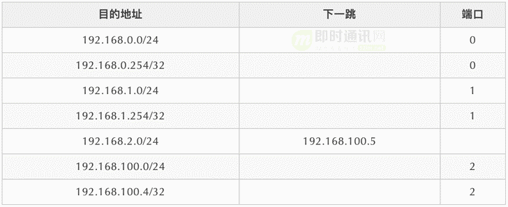

6. 此时路由器 1 需要通过ARP获得下一跳的IP(*192.168.100.5*)对应的`MAC地址`，并且需要`再次匹配路由表`，发现匹配到了`端口为 2`，于是将目的MAC地址封装到数据链路层，最后把包从 *2 号口*发出去
7. 路由器 2 收到了数据包，看到其目的地址是 *192.168.2.2*，查询其路由表，匹配到端口号为 1
8. 路由器 2 还需要知道 *192.168.2.2* 的 MAC 地址，于是查看其 `arp 缓存`(没有则发ARP请求)，找到其 MAC 地址为 *FFFF*，将其封装在数据链路层头部，并从 *1 号端口*把包发出去
9. 交换机 3 收到了数据包，发现目的 MAC 地址为 *FFFF*，查询其 MAC 地址表(没有则广播出去)，发现应该从其 *6 号端口*出去，于是从 *6 号端口*把数据包发出去
10. 最终F收到了数据包，发现目的MAC地址就是自己，于是收下了

## 4.10 分组转发

分组转发：从数据报首部提取目的主机IP地址和目的网络地址。如果目的网络与此路由直接相连，则交付，否则若路由表中有含有目的地址的特定主机路由，则把数据报传送给表中指明的下一跳路由，否则若有默认路由则转给默认路由，否则报告转发分组出错


## 4.11 路由选择协议

一个`自治系统AS`(Autonomous System)由多个路由器组成，由一个组织管辖，如移动、联通、电信，AS内部使用内部网关协议IGP(RIP/OSPF)，AS之间使用外部网关协议BGP


`内部网关协议RIP`：**距离向量算法**，实现简单，开销小，但最大距离为15跳(16表示不可达)，限制了网络规模，且要**经过比较长的时间才能将此消息传送到所有路由**。距离向量(如果路由1和某个网络C以及路由2直接相连，则向路由2通知网络C的路径时将跳数+1，以此类推)。**只知道相邻节点，对更远处节点不了解。**一旦中途某个路径断了就挂掉了
`内部网关协议OSPF`：使用**Dijkstra的最短路径算法**，为了克服RIP的缺点。**每个路由都有自己相邻路由的链路状态**，向本自治系统中所有路由发送自己的相邻路由的链路状态，只有链路状态发生变化时，路由器才会发送信息。更新很快！**每个节点都有整个网络的拓扑结构。**而且一旦某个路径断了，可以及时选择其他链路，对通信影响小
`外部网关协议BGP`：选择比较好的而不是最佳路由线路。每个AS都必须配置BGP发言人，通过再相邻BGP发言人之间建立TCP连接来交换路由信息


## 4.12 三层网络工作原理总结

[网络编程入门从未如此简单(一)：假如你来设计网络，会怎么做？](https://zhuanlan.zhihu.com/p/348790517)

[71张图详解IP 地址、IP 路由、分片和重组、三层转发、ARP、ICMP](https://zhuanlan.zhihu.com/p/363651969)


## 路由器和光猫

不管是交换机还是路由器，前面都是提到网口输入的是**电信号**。但现在流行的是**光纤传输**，传输的是**光信号**。

而**光猫**（modem），是一种调制解调器，其实就是用于**光电信号转换**的设备。

接收数据时，可以将光纤里的**光信号转化为电信号**，发给路由器，路由器内部再转成数字信号，并在此基础上做各种处理。

相反，也会把路由器传来的**电信号转为光信号**，发到光纤，并进入互联网。

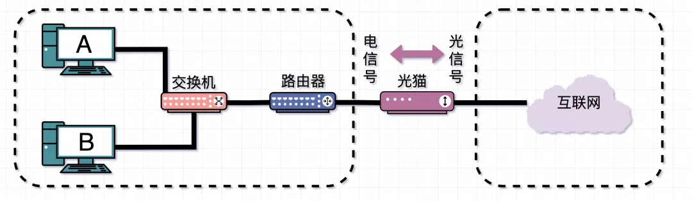


## 集线器，交换机，路由器的区别总结

集线器工作在物理层，半双工工作，所有端口共享带宽，不能识别目的地址，没有智商，接收到的所有数据都广播给除接口端口以外的所有端口，由终端通过验证包头的MAC信息来确定是接收还是丢弃这个包，所以非常浪费网络资源。（链路层交换机才能将数据包发给指定的终端）


二层交换机工作在链路层，全双工工作，每个端口都有一条独占带宽。交换机收到数据包后查MAC表，根据目的MAC地址对应端口进行存储转发，可能由于该链路分组的排队时延而丢包，如果MAC表没有该地址则进行广播，如果MAC表查到的端口等于该帧进来的端口就丢弃，可以自学习来更新MAC表。（交换机级联导致MAC表越来越大，采用路由器划分，MAC表就只需要记录自己局域网的信息了），交换机没有MAC地址，所以收到数据不校验是不是给自己的，全都存储转发。


路由器工作在网络层，将较大的网络划分为一个个VLAN（虚拟局域网），VLAN之间的通信就必须得通过路由器的帮助，路由器可以使两个不同结构的局域网连接到一起，以构成更大的局域网或广域网。路由器收到数据包后，根据目的IP查路由表找到对应下一跳MAC。**路由器的每个网口下都有一个MAC地址和IP地址**，正因为路由器有MAC地址，所以收到的数据包要进行校验，不是自己MAC地址的包会丢弃。如果找不到转发的目的地址，路由器会丢弃这个包，发送ICMP不可达消息给发送方。


集线器和交换机在工作时都是通过硬件直接实现信号的传输，而路由器实际上是一台特殊的计算机，它有CPU、内存、操作系统(互联网际操作系统)等


# 5. 传输层-报文段(segment)

前三层协议只把分组发送到`目的主机`，但是真正通信的并不是主机而是主机中的**进程**。传输层提供了**进程间的逻辑通信**，传输层向高层用户屏蔽了下面网络层的核心细节，使应用程序看起来像是在两个传输层实体之间有一条端到端的逻辑通信信道。传输层需要在报文上增加**传输层头部**(包括`源端口号和目的端口号`)

不同主机之间常常要建立可靠的、像管道一样的连接，但是IP层不提供这样的流机制

- TCP：面向连接，提供可靠的交付，有流量控制和拥塞控制，全双工通信，面向字节流，一对一
- UDP：无连接的，尽最大可能交付，没有流量控制和拥塞控制，面向报文，全双工通信，支持一对一、一对多、多对一、多对多

进程和运输层之间的接口是套接字，那么主机是如何把一个到达的运输层报文段定向到适当的套接字中，实现多路分解和多路复用的？

- **多路分解**：将运输层报文段中的数据交付到正确的套接字中
- **多路复用**：源主机从不同的套接字中收集数据块，并为每个数据块封装上首部字段从而生成报文段，然后将报文段传递到网络层

为了实现`多路复用`和`多路分解`，需要给每个套接字绑定一个**端口号 port**，根据端口号就可以定位到相应的进程。

> **端口**用一个 16 位端口号进行标志，其大小在 0 ~ 65535 之间，0 ~ 1023 称为**周知端口号**，不能随意使用。端口号只具有本地意义，即可能不同计算机上相同端口代表的服务是不同的。


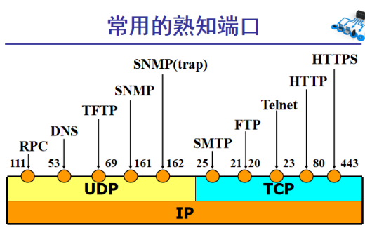


## 5.1 UDP报文格式  

​    

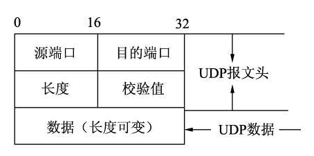

UDP 报文段的首部字段只有 8 个字节，由 4 个字段组成，每个字段的长度都是 2 个字节。各字段：

- **源端口**：源端口号，在需要对方回信时选用，不需要时可用全0。
- **目的端口**：目的端口号，这在终点交付报文时必须要使用到。

- **长度：** UDP用户数据包的长度，单位是字节，`最小值是8`(只有首部)
- **校验值：** 检测数据包在传输过程中是否有错，有错就丢弃   


为什么许多链路层协议提供了差错检验，传输层仍然要提供差错检验？

- 可能某条链路使用的是没有差错检验的协议
- 即使帧能够通过链路正确传输，但是当拆开后存在某台路由器的内存中时，也可能引入比特差错

## 5.2 UDP协议

UDP协议是提供与IP一样的不可靠，无连接的交付服务，UDP报文可能出现丢失，重复或者乱序到达等现象        

UDP协议在IP协议上增加了复用、分用和差错检测功能。UDP的特点：
- **无连接：** 相比于TCP协议，UDP协议在传送数据前不需要建立连接，当然也就没有释放连接
- **尽最大努力交付：** UDP协议无法保证数据能够准确的交付到目的主机。也不需要对接收到的UDP报文进行确认
- **面向报文：** UDP协议将应用层传输下来的数据封装在一个UDP包中，不进行拆分或合并。因此，运输层在收到对方的UDP包后，会去掉首部后，将数据原封不动的交给应用进程   
- **没有拥塞控制：** 因此UDP协议的发送速率不受网络的拥塞度影响
- UDP支持一对一、一对多、多对一和多对多的交互通信
- UDP的头部占用较小，只占用8个字节      


**如何实现可靠的 UDP** ：
众所周知 UDP 通信协议是不可靠的通信协议，其可靠性必须由`上层应用`实现。一般都会采用`消息重传`来实现其可靠性，采用消息重传的时候有两种方式，一种是发送者发起，另一种是接收者发起。

对于发送者发起的方式，一般情况下接收者会发送一个消息包的确认。发送者维护一个计时器并重传那些在某个确定的时间段里没有收到确认的消息包。这一类型的协议容易引起发送者溢出，因为要确认每一个发送的消息包。这种溢出现象被称为发送者（或者 ACK）内爆。

对于接收者发起的方式，通信双方的接收者负责错误检测。在这个方式里，序列号被用于检测消息包丢失。当检测到消息包丢失，接收者请求发送者重传消息包。采用这种方法，如果消息包没有到达任何一个接收者，发送者容易因 NACK 溢出。这会引起发送者的负载过高和过多的重传。这种现像被称为 NACK内爆。Ramakrishnan et al.在 1987 年提出可以使用定时器来限制消息包重传，从而避免 NACK 内爆。在现实应用中这种方式使用得较多。


## 5.3 可靠数据传输

> [**可靠数据传输RDT**](https://blog.csdn.net/hernofogot/article/details/88382944)： 现实中很多信道是不可靠的，很可能会发生分组的**丢失**、**比特差错**、**失序**等错误，所以我们需要使用技术手段来使传输变得可靠。 
>
> 要解决这个问题，唯一的方法就是出现了问题就重传，基于重传机制的可靠数据传输协议称为**自动重传请求 ARQ** (Automatic Repeat Request)

### 5.3.1 停止等待ARQ

ARQ要解决的问题：

- 如何知道接收方是否已经接收到分组(ACK)
- 发送方对一个ACK应该等待多长时间？
- ACK丢失了怎么办？(ACK丢失了，发送方区分不了是ACK丢失还是原分组丢失，所以重传，接收方必须准备好处理这种情况)
- 接收到收到的分组是否与之前发送的一致？（使用校验和，当接收方收到含有差错的分组时，不ACK）

**停等协议**，即发送一个分组就停下来直到确认该分组已被接收方正确接收。`这种方式的信道利用率非常低！！`，因此引入了**流水线 ARQ**。

### 5.3.2 流水线ARQ

> **流水线 ARQ**：为了提高性能，可以让发送方发送多个分组而无需等待确认。
>
> 这种方式也对可靠数据传输协议带来了如下的影响：
>
> 1. 必须增加序号范围
> 2. 发送方和接收方需要缓存多个分组：**发送方至少应该缓存那些已发送但是没有确认的分组**；**接收方需要缓存那些已经正确接收的分组**
> 3. 差错恢复：**回退 N 步**（GBN）和**选择重传**（SR），[参考链接](https://blog.csdn.net/qq_22238021/article/details/80325285)

#### 回退N步协议

**发送方**：维护`大小为N的滑动窗口`、`最早发送未确认的序号 base`、`下一个应该发送的序号 nextseqnum`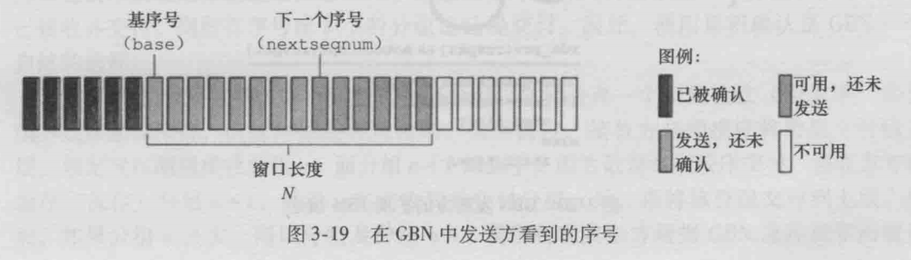

1. **上层的调用**：如果 nextseqsum 滑动窗口在滑动窗口内，就发送产生的分组并更新变量；否则告知上层滑动窗口已满

2. **收到ACK**：采用**累计确认**的方式，对一个序号为 n 的分组的确认表示接收方已正确收到了序号为 n 以及小于 n 的所有分组

3. **超时**：定时器只为最早已发送但未确认的分组设置，发生超时则重传所有已发送但是没有确认的分组

   

**接收方**：维护`期待的下一个按序接收的分组的序号 expectedseqsum`，不需要窗口

1. 正确收到的分组的序号 `n` 等于 `expectedseqsum`，就为分组 `n` 发送一个 ACK，并提交给上层
2. 其他任何情况都直接丢弃分组，并为最近按序收到的分组 `expectedseqsum - 1` 发送 ACK

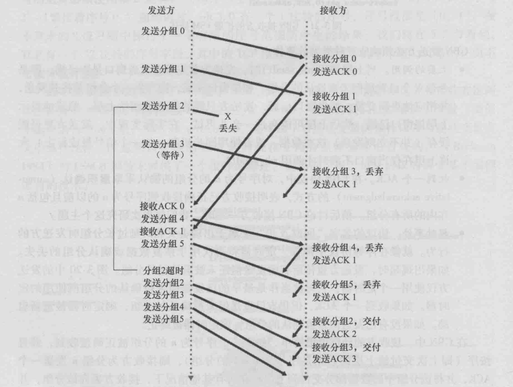

#### 选择重传协议

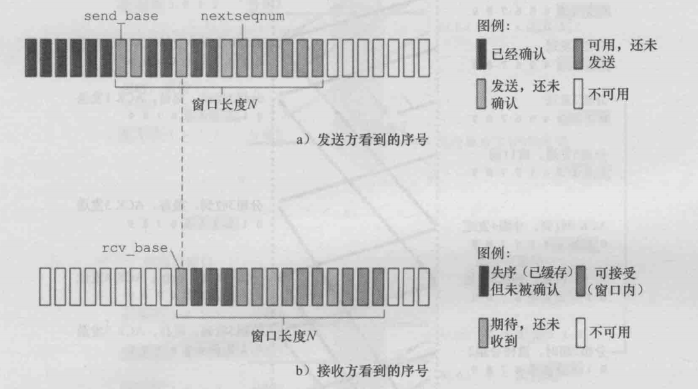

**发送方**：

1. **上层的调用**：如果 nextseqsum 滑动窗口在滑动窗口内，就发送产生的分组并更新变量；否则告知上层滑动窗口已满
2. **收到ACK**：采用**逐个确认**的方式，如果该 ACK 序号在窗口内，就把该序号标记为已确认。如果该序号等于 `send_base`·，可以移动窗口至具有最小序号的未确认分组处。如果移动后有落在窗口内的未发送分组，就发送这些分组
3. **超时**：每个分组都有自己的逻辑计时器，发生超时后就重传对应的一个分组


**接收方**：发送方与接收方的窗口是不同步的

1. **序号在 [rcv_base, rcv_base + N - 1] 内的分组被正确收到**：在此情况下，收到的分组落在接收方的窗口内，一个选择 ACK 被回送给发送方。如果该分组以前没收到过，则缓存该分组。如果该分组的序号等于接收端的基序号（rcv_base），则该分组以及以前缓存的序号连续的（起始于 rcv_base 的）分组交付给上层。然后，接收窗口按向前移动分组的编号向上交付这些分组
2. **序号在 [rcv_base-N, rcv_base-1] 内的分组被正确收到**：在此情况下，必须产生一个 ACK，即使该分组是接收方以前确认过的分组。否则发送方无法确认该分组时候已被正确收到，将不断超时重传该分组
3. **其他情况**：忽略该分组

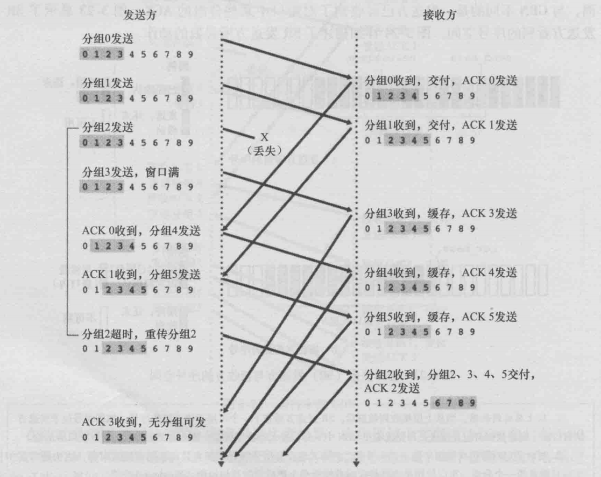


『 **SR 窗口大小** 』

SR 窗口不能太大，`窗口长度必须小于或等于序号空间大小的一半`。否则会导致序号重叠，接收方无法判断接受到的分组是新来的还是重传的，如图：

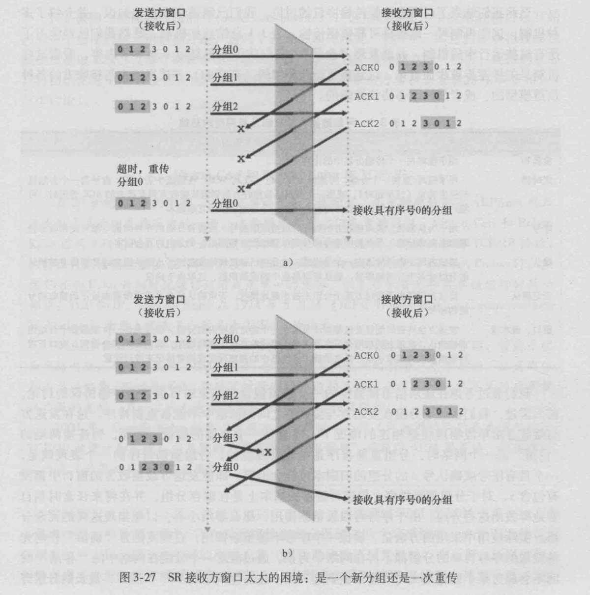


## 5.4 TCP报文段格式      

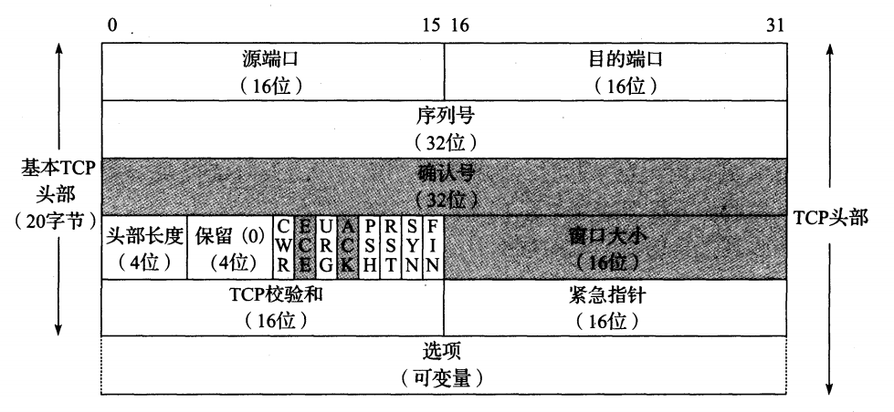


- `端口号(port)` ： 16位(65535)，除去 0~1023
- `序号(seq)` ： TCP是面向字节流的。在一个TCP连接中传送的字节流中的每一个字节都按顺序编号。整个要传送的字节流的起始序号必须在连接建立时设置。首部中的序号字段值则是指的是**本报文段所发送的数据的第一个字节的序号**。长度32位的无符号整数,序号到达2^32 - 1后又从0开始
- `确认号(ack)` ： 发送确认的一端期望收到的下一个序号(确认端成功接收的数据的最后一个字节的序号加1，只有标志位ACk为1时确认序号才有效)     
- `数据偏移`  ： 4字节为单位，即是首部长度   
- `保留(reserve)` : 4位保留位为日后使用，目前应置0
- `CWR`  : 拥塞窗口减（发送方降低它的发送速率）
- `ECE`  : ECN 回显（发送方接收到了一个更早的拥塞通告）
- `紧急URG` : 本报文段发送的数据是否包含紧急数据，为1表示包含，**紧急指针字段只有URG=1时才有效**
- `确认ACK` ： 前面的确认号字段是否有效，ACK=1时前面的确认号字段才有效，**TCP规定建立连接后ACK必须为1**
- `推送PSH` ： 告诉对方收到数据后**是否应该把数据立即推送给上层而不是缓存起来**，为1表示有效
- `复位RST` ： RST为1表示TCP连接中出现了严重错误，必须释放连接，然后**重新建立连接**，也用来拒绝非法报文段或拒绝打开一个连接。需要注意的是，并不是RST发送后，一定会终止连接，而是要RST的Seq在接收方的接收窗口之内才行，否则会被认为是不合法的序号，从而被Linux内核无视 
- `同步SYN` ： **建立连接时用来同步序号**，SYN=1，ACK=0，表明是请求连接的报文，若对方同意连接则响应中SYN=1，ACK=1       
- `终止FIN` : 释放一个连接，FIN=1表示此报文段发送的数据已发送完毕，要求释放传输层的连接      
- `窗口大小` ： 指的是发送本报文段的一方的**接收窗口，窗口大小是给对方用的**，从确认号开始算起，目前允许对方一次发送的数据量(字节为单位)，受接收方的数据缓存空间所限制，最大限制了窗口大小为 65535 字节，从而限制了TCP的吞吐量性能        
- `校验和` ： 计算时要在报文前加上12字节的伪首部
- `紧急指针` ： URG=1时生效，指示紧急数据的字节数(紧急数据结束后就是普通数据)     
- `选项` ： 长度可变。最常见的选项字段就是 **最大段大小** `MSS`，连接双方建立连接时发送的第一个报文段上指定这个选项，表示希望接收到的报文段的最大值 

**首部总长20字节**

## 5.5 TCP协议      

>  **传输控制协议 TCP**（Transmission Control Protocol）是一种`面向连接的`、`可靠的`、`基于字节流的`、`全双工的`、`一对一的`传输层通信协议，连接状态只保留在两个主机中。每次建立连接都会为 TCP 分配`接收缓冲区`，`发送缓冲区`和`变量`。

连接：三次握手之后建立。确认机制保证了可靠性
四次挥手之后，释放资源(套接字)


**TCP发送缓存和接收缓存**：

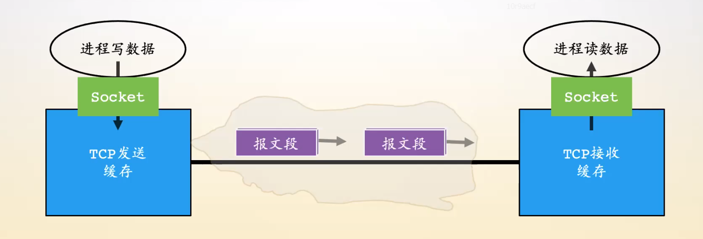


### 5.5.1 三次握手

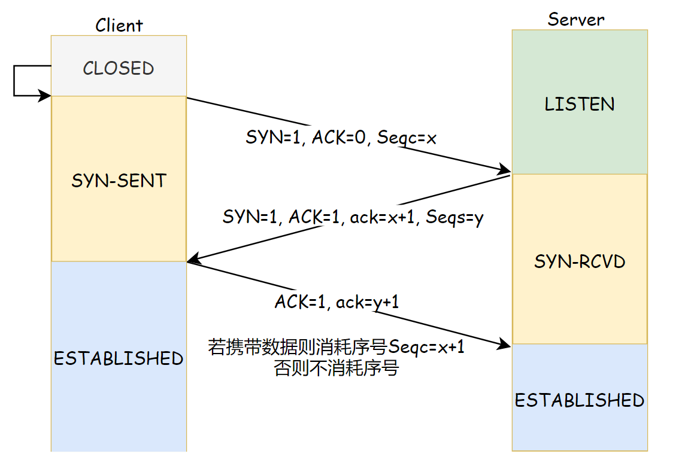

**为什么要握手？**

- TCP 是可靠通信协议， 而 UDP 是不可靠通信协议。
- TCP 的可靠性含义： 接收方收到的数据是完整， 有序， 无差错的。
- UDP 不可靠性含义： 接收方接收到的数据可能存在部分丢失， 顺序也不一定能保证        

TCP 协议为了实现可靠传输， 通信双方需要判断自己已经发送的数据包是否都被接收方收到， 如果没收到， 就需要重发。 为了实现这个需求， 很自然地就会引出序号（sequence number） 和 确认号（acknowledgement number） 的使用

握手不仅仅是让通信双方知道一个连接正在建立，判断链路是否通常，还在于利用数据包交换初始序列号


**三次握手的过程**

一开始服务器处于监听(LISTEN)状态，等待客户的连接请求

1. 第一次：client发送建立连接请求，SYN=1，seqc=x,      

   TCP规定：**SYN=1的报文段不携带数据，但是要消耗掉一个序号**：seqc=x。正是因为SYN消耗了序列号，所以**丢失会被重传**的。（ACK不消耗序列号，所以不能被重传）  

   此时，client进入到`SYN-SENT(同步已发送)`状态

2. 第二次：service同意建立连接，SYN=1，ACK=1，确认号 ack=seqc+1=x+1     

   同时携带自己的初始化，用于认证的信息，SYN=1的报文同理不能携带数据，但是消耗掉一个序号：seqs=y，**丢失会被重传**        

   此时，service进入到`SYN-RCVD(同步已接收状态) `    

3. 第三次：client收到service的确认信息后，向service再次发送确认，ACK=1，确认号ack=y+1   

   TCP规定**ACK报文可以携带数据**，但是如果不携带数据则不消耗序号，这时下一数据报文的序号仍是seqc=x+1，**ACK报文不会被重传**

   client在收到第二次握手信息后进入`ESTABKISHED状态(已建立连接)`，service在收到第三次握手信息后进入`ESTABLISH状态`


**初始seq序号为什么要随机？**   
**源IP是可以伪造的**，如果初始序号从0开始，就只需要两次握手就可以了，但是这样上次连接相同序号的失效报文延迟到达容易**扰乱本次连接**，序号随即就可以降低这种情况的发生。

同时还可以**防止中间人攻击**：

中间人FC不在S和C的路径上：FC假冒客户端C（使用同一个IP），发送一个seq，伪造的seq不在合法范围内（不在接收窗口中），S就会直接丢弃掉这个包。如果不是随机的，FC就可以推测到真实的seq，可以模拟一个ACK给服务器，这样FC就和S建立了连接，C传递数据就会产生严重的安全问题，FC直接发送伪造的数据。甚至 FC 还可以直接发 RST 报文，让服务器直接关闭和C的连接

如果FC在S和C之间的路径上，还可以捕获到A、B的IP包，随便伪造

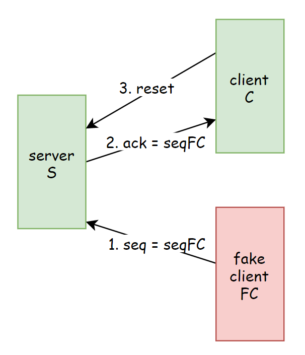


**为什么要三次握手**        

无效的重复请求，资源浪费，序号的确认。      

服务端和客户端的随机序号都要得到确认，所以需要三次握手      

如果只有两次握手，在第二次握手消息发出之后服务端就认为已经建立连接了，这时候如果客户端没收到第二次握手信息，服务端开始发送数据(全双工通信)，客户端是区分不了这是哪个TCP连接的第几个数据包的(一个客户端和一个服务端可以建立多个TCP连接)，因为没有第二次握手的序号信息。需要注意的是，对于TCP全双工通信，连接建立之后，客户端是可以完全沉默的，两次握手服务器一直发送信息就是得不到确认的，连接是不可靠的。所以如果只是单向通信的话，是可以只两次握手的(然而TCP通信是全双工)                 

我们来分析一种特殊情况，假设客户端请求建立连接，发给服务器SYN包等待服务器确认，服务器收到确认后，如果是两次握手就可以建立连接，假设服务器给客户端在第二次握手时发送数据，数据从服务器发出，服务器认为连接已经建立，但在发送数据的过程中数据丢失，客户端认为连接没有建立，会进行重传。假设每次发送的数据一直在丢失，客户端一直SYN，服务器就会产生多个无效连接，占用资源，这个时候服务器可能会挂掉。这个现象就是我们听过的“SYN的洪水攻击”。 

**总结**：第三次握手是为了防止：如果客户端迟迟没有收到服务器返回确认报文，这时会放弃连接，重新启动一条连接请求，但问题是：服务器不知道客户端没有收到，所以他会收到两个连接，浪费连接开销。如果每次都是这样，就会浪费多个连接开销


#### 握手异常

**向一个不存在的服务器握手**

不存在指的是没有该ip对应的机器，首先需要该ARP表，增加一个表项，防止ARP请求直接收到"无法到达主机"的错误消息后退出

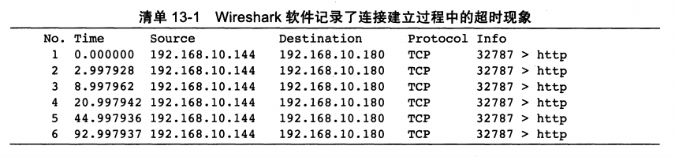

客户端TCP为了建立连接，会频繁的发送SYN报文段，第一个报文后间隔3秒再次发送第二个，第二个报文后间隔6秒，12秒，24秒。。。

这一行为被称为**指数回退**，每次回退数值都是上次的两倍，linux系统中，系统配置变量 `/proc/sys/net/ipv4/tcp_syn_retries` 表示了主动建立连接重试SYN报文的最大次数，通常选择5次。同理 `/proc/sys/net/ipv4/tcp_synack_retries` 表示在响应对方的 `SYN+ACK` 报文的最大重试次数


**向服务器不存在/未监听的端口握手**

当一个连接请求到达，本地却没有相关的进程在该端口监听，就会产生一个 `重置报文段 RST`

（如果是UDP，则会生成一个ICMP目的地不可达的消息）

**一个RST报文，它的ACK位必须被置位，并且ACK号字段数值必须在正确窗口范围内**，这样有助于防止攻击（任何野人都能够生成一个与相应连接相匹配的RST报文段，从而扰乱这个连接）


**最后一个ACK丢失**
如果此时ACK在网络中丢失，那么Server端该TCP连接的状态为 `SYN_RECV`，并且依次等待3秒、6秒、12秒后**重新发送SYN+ACK包，以便Client重新发送ACK包**。 Server重发SYN+ACK包的次数，可以通过设置`/proc/sys/net/ipv4/tcp_synack_retries`修改，默认值为5。如果重发指定次数后，仍然未收到ACK应答，那么一段时间后，Server自动关闭这个连接。**但是Client认为这个连接已经建立，如果Client端向Server写数据，Server端将以RST包(用于强制关闭tcp连接)响应，这时候客户端方能感知到Server的错误**。


#### 可选字段

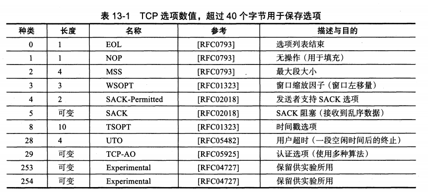

**1. MSS最大报文段长度**

最大段大小MSS是在协议规定的可选字段中，指示了TCP协议允许的从对方接收到的**最大报文段的长度**

MSS只记录**TCP数据的字节数目**，不包括TCP与IP头

建立TCP连接时，双方的SYN报文会携带MSS的可选字段，说明自己允许的最大段大小（MSS协商）。如果没有实现指明，则按照`536`设置（因为MTU最小576）

IPv4中典型的 MSS 的大小是 1460，对应了以太网 MTU 1500


**2. SACK选择确认**

`SACK`即选择确认，有两个字段：**SACK-Permitted** 和 **SACK**

通过接收 `SYN` 或者 `SYN+ACK` 报文段中的 `SACK-Permitted` 选项，TCP通信方会了解到自身具有发布 SACK 信息的能力

当接收到乱序的数据时，他就能提供 SACK 选项来描述这些乱序的数据，从而帮助对方**有效的进行重传**

SACK信息保存在 `SACK选项` 中，包含了接受对方已经成功接收到的数据块的序列号范围，每个范围都是一个 **SACK 块**，由 **一对32位序列号** 表示，一个SACK选项包含了多个SACK块

由于TCP头部的可选字段空间有限，一个报文段中最多发送 3个 SACK块


**3. 窗口缩放因子**

TCP头固定选项中的窗口大小只有16位，限制了最大发送窗口大小为65535字节，缩放因子 `s` 是一个16位数值的比例因子，使得发送窗口大小左移 `s` 位，即使窗口大小扩大 `2^s` 倍

s 的值允许从 0 到 14，所以最大窗口为 $2^{16} × 2^{14} = 2^{30} = 1GB$

因此，TCP使用了 32位 的值来维护这个 真实 的窗口大小

**这个选项只能出现在SYN报文中**，所以建立连接之后，**缩放比例是固定的！！！**

发送窗口的大小是TCP协议根据缓存的大小自动选取的，缓存的大小是由系统设定的，但是应用程序具有改变缓存大小的能力。当TCP协议被用于在大带宽、高延迟网络上提供海量数据传输服务时，窗口缩放选项就非常有意义


**4. 时间戳选项**

时间戳选项允许发送方针对每一个接收到的ACK估算TCP连接的**往返时间**

估算往返时间主要是为了设置 **重传超时** 的时间


**5. 认证选项**

用于增强连接的安全性，使用加密散列算法


### 5.5.2 四次挥手

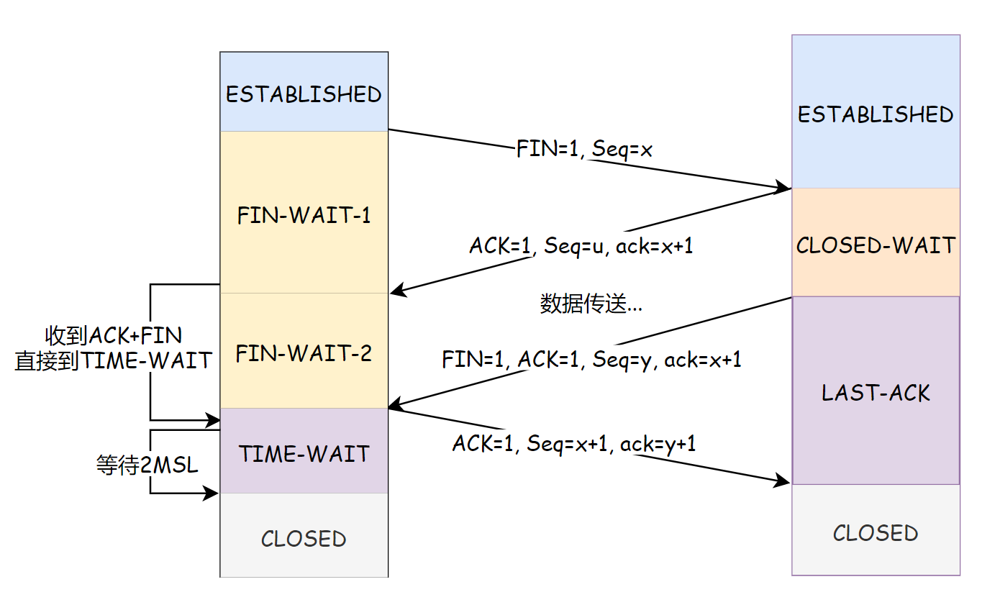

**四次挥手的过程**      

1. 第一次：主动方发送 FIN=1 请求关闭数据传输，指明希望对方看到的自己档期那的序号，同时还包含了ACK确认对方最近一次发来的数据(可选)

2. 第二次：被动方发送 ACK=1 确认           

   此时被动方依然可以向主动方发送未发送完的信息，主动方不再发送信息，称为 `半关闭状态`

   **被动方的上层应用会被告知对方已经提出了关闭的请求，通常，这将会使应用程序发起自己的关闭操作**

3. 第三次：被动方发送 FIN=1 请求关闭数据传输

4. 第四次：主动方发送 ACK=1 确认关闭       

**如果FIN出现丢失的情况，那么发送FIN的一方会重传直到收到ACK为止**


**四次挥手能不能变成三次挥手呢？**
答案是可能的。TCP 是全双工通信，Cliet 在自己已经不会在有新的数据要发送给 Server 后，可以发送 FIN 信号告知 Server，这边已经终止 Client 到对端 Server 那边的数据传输。但是，这个时候对端 Server 可以继续往 Client 这边发送数据包。于是，两端数据传输的终止在时序上是独立并且可能会相隔比较长的时间，这个时候就必须最少需要 2+2= 4 次挥手来完全终止这个连接。但是，如果 Server 在收到 Client 的 FIN 包后，在也没数据需要发送给 Client 了，那么对 Client 的 ACK 包和 Server 自己的 FIN 包就可以合并成为一个包发送过去，这样四次挥手就可以变成三次了


#### TCP状态机

**挥手过程中的状态变化**

- **FIN_WAIT：** 第一次挥手发出后主动方进入 FIN_WAIT_1 状态，当收到第二次挥手的确认报文后进入 FIN_WAIT_2 状态，此时TCP 是半连接状态
- **CLOSE_WAIT:** 当第二次挥手后被动方进入到 CLOSE_WAIT 状态，当被动方接收到FIN 时会立刻回复ACK 给主动方，接下来就进入到CLOSE_WAIT 状态，等需要发送给主动方的数据发送完毕之后就发送一个FIN，请求关闭连接
- **TIME_WAIT：** 第三次挥手后，主动方发送ACK报文确认，进入TIME_WAIT状态，这个状态就是等待 2MSL 就可以进入CLOSED 状态了，如果主动方在 FIN_WAIT_1 状态收到被动方的 FIN+ACK (两边同时发送FIN) 可以直接跳过 FIN_WAIT_2 直接进入 TIME_WAIT        
- **LAST_ACK：** 被动方发送第三次挥手后进入 LAST_ACK 状态，等待最后的 ACK报文，收到ACK报文就可以进入CLOSED 状态了       
- **CLOSED：** 连接关闭   


**整个TCP过程状态机如下：**

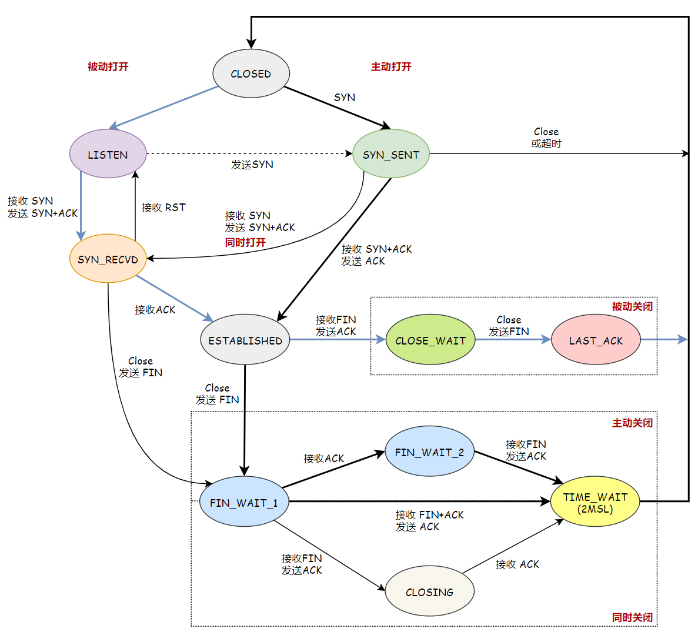

#### FIN_WAIT2

主动关闭方发送FIN，收到ACK后进入FIN_WAIT2，这时候如果被动方不发送FIN，那么主动方将会永远保持FIN_WAIT2状态，被动方也会永远保持CLOSE_WAIT

目前有许多方法都能够防止连接进入`FIN_WAIT2`的无限等待状态：

- 如果负责关闭的应用程序执行的是完全关闭操作，而不是用一个半关闭来指明它还期望接收数据，那么就会设置一个计时器，当计时器超时的时候连接还是空闲的，TCP连接就会转移到CLOSED状态

Linux中可以通过调整变量 `net.ipv4.tcp_fin_timeout` 的数值来设置


#### TIME_WAIT

TIME_WAIT状态也称为2MSL等待状态，在该状态中，TCP将会等待两倍的**最大段生存时间**(MSL)。每个实现都必须位最大段生存时间选择一个数值，它代表了任何报文段在被丢弃前在网络中被允许存在的最长时间

因为TCP报文是以IP数据包形式传输，IP数据包用于`TTL字段`和`跳数限制字段`，这两个字段限制了 **IP数据报的有效生存时间**

而MSL，通常设置为 30秒，1分，2分，可以修改。例如Linux中 `net.ipv4.tcp_fin_timeout` 的数值可以设置 2MSL 状态的等待时间（单位秒）


**为什么需要TIME_WAIT？**       

1. 如果没有TIME_WAIT，主动方在发送第四次挥手信息后就直接进入了CLOSED，此时如果最后一次ACK 丢失，被动方就会由于ACK超时 **重传FIN请求**，而主动方已关闭连接，收到不正常的包会回复RST，被动方就会收到一个错误，不能正常关闭。所以需要主动方等待**2MSL(两个报文最大生命周期)**，等待的这段时间如果收到了重发的FIN， 可以进行最后一次的 ACK 回复。**让在网络中延迟的FIN/ACK数据都消失在网络中**，不会对后续连接造成影响
2. 在 2MSL 期间，通信双方将该连接（四元组）定义为**不可重新使用**，只有等2MSL结束（或者新连接的初始序列号超过了该连接使用的最大序列号，或者允许使用时间戳来区分之前连接的实例的报文段以避免混淆时，看协议的具体实现），这条连接才能被再次使用。主要是为了防止网络中**已断开连接的延迟FIN/ACK对后续新的连接造成影响**
3. **`需要注意的是TIME_WAIT时如果收到了新的FIN(ACK丢失)，进行ACK，又需要继续等待2MSL`**


**为什么TIME_WAIT的时间是2MSL？**       

A并不知道B是否接到自己的ACK，A是这么想的：

1）如果B没有收到自己的ACK，会超时重传FIN，那么A再次接到重传的FIN，会再次发送ACK

2）如果B收到自己的ACK，也不会再发任何消息，包括ACK

无论是1还是2，A都需要等待，要取这两种情况等待时间的最大值，**以应对最坏的情况发生**，正常应该等**B的timeout+FIN的传输时间**，但是保守起见取了：去向ACK消息最大存活时间（MSL) + 来向FIN消息的最大存活时间(MSL)。这恰恰就是**2MSL( Maximum Segment Life)**：

1. 为了保证客户端发送的最后一个ACK报文段能够到达服务器。因为这个ACK有可能会丢失，从而导致处在LAST-ACK状态的服务器收不到对FIN-ACK的确认报文。服务器会超时重传这个FIN-ACK，接着客户端再重传一次确认，重新启动时间等待计时器。最后客户端和服务器都能正常的关闭。假设客户端不等待2MSL，而是在发送完ACK之后直接释放关闭，一但这个ACK丢失的话，服务器就无法正常的进入关闭连接状态

2. 他还可以防止已失效的报文段干扰。客户端在发送最后一个ACK之后，再经过经过2MSL，就可以使本链接持续时间内所产生的所有报文段都从网络中消失。从保证在关闭连接后不会有还在网络中滞留的报文段去骚扰服务器


**TIME_WAIT带来的问题** 

作为服务器，短时间关闭大量Client连接，会造成服务器上大量的TIME_WAIT连接，严重消耗服务器的资源。作为客户端，短时间大量的短链接会大量消耗Client机器的端口，毕竟只有65535个端口号，被耗尽之后就无法再发起新的连接了

如果是客户端主动关闭，进入2MSL，再立即重新启动同一个客户端，通常问题不大，因为客户端的端口是操作系统分配的临时端口，一般不会和上次的重复。

而如果是服务端主动关闭，进入2MSL，再立即重新启动同一个服务端，服务器不能为该程序的通信分配对应端口号（bind出错，因为服务器的端口通常是固定的，该**端口已经被2MSL占用了**），**服务器需要花费1~4分钟等待2MSL结束后才能重新启动**

可以使用 `SO_REUSEADDR` 套接字选项，通过该方法，即使处于 2MSL 等待状态，它的端口仍然能够被服务器绑定


**时间等待错误**

TIME_WAIT期间可能会收到来自这条连接的一些报文段，那么TIME_WAIT的状态可能会被破坏，提前结束

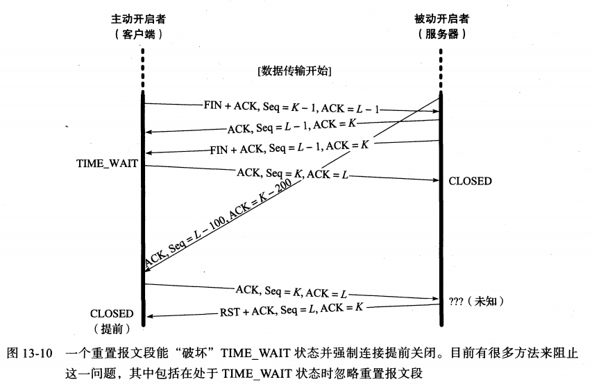

许多系统规定，当处于 `TIME_WAIT` 状态时，不会重置报文做出反应，从而避免了上述问题


#### 有序释放和终止释放

终止一条连接的正常方法是通信一方发送 `FIN`，这种方法被称为是 **有序释放**，因为 FIN 是在之前所有排队的数据都已经发送后才被发送出去！通常不会出现丢失数据的情况

然而有时候我们可以通过 `RST` 替代 FIN 来终止连接，这种方法称为 **终止释放**，这时候**任何排队的数据都将被丢弃**，RST报文会被立即发送出去


#### 半开连接

在未告知另一端的情况下，通信的一段关闭或终止了连接，那么就认为该条TCP连接处于 **半开状态**

这种情况一般发生在通信一方的 **主机崩溃** 或者 **断电** 的情况下（非正常关机）

只要不尝试通过半开连接传输数据，正常工作的一端**不会察觉出另一端已经崩溃**！！ 直到开始传输数据，会收到对端的 `RST` 报文

如果服务器上有很多半开连接，会占用很多不必要的资源，可以通过设置 `keepalive` 选项来进行检测和关闭


### 5.5.3 确认和重传机制

#### 延迟ACK

延迟确认：按照 TCP 协议，**确认机制是累积的**，也就是确认号 X 的确认指示的是所有 X 之前但不包括 X 的数据已经收到了。**确认号(ACK)本身就是不含数据的分段**，因此大量的确认号消耗了大量的带宽，虽然大多数情况下，ACK 还是可以和数据一起捎带传输的，但是如果没有捎带传输，那么就只能单独回来一个 ACK，如果这样的分段太多，网络的利用率就会下降。为缓解这个问题，RFC 建议了一种延迟的 ACK，也就是说，**ACK 在收到数据后并不马上回复，而是延迟一段可以接受的时间**，延迟一段时间的目的是**看能不能和接收方要发给发送方的数据一起回去**，因为 TCP 协议头中总是包含确认号的，如果能的话，就将数据一起捎带回去，这样网络利用率就提高了。

- Linux 实现中，有 `延迟 ACK` 和 `快速 ACK`，并根据当前的包的收发情况来在这两种 ACK 中切换。一般情况下，ACK 并不会对网络性能有太大的影响，延迟 ACK 能减少发送的分段从而 **节省了带宽**，而快速 ACK 能及时通知发送方丢包，**避免滑动窗口停等，提升吞吐率**。


接收方确认方法：

- **接收方期望的序号到达，且之前的序号都已确认**：`延迟ACK`，等待最多500ms，超过该时间就发送ACK
- **接收方期望的序号到达，且前一个按序报文等待ACK传输**：立即发送一个`累计ACK`，确认两个按序到达的报文
- **接收方收到比期望序号大的失序报文**： 立即发送`冗余ACK`，指示下一个期待报文的序号
- **接收方收到能部分或者完全填充接收到数据间隔的报文段到达**：如果该报文段起始于间隔底端，则立即发送`累计ACK`


当然，TCP不能任意时长的延迟ACK，实践中时延一般最大取 **200ms**

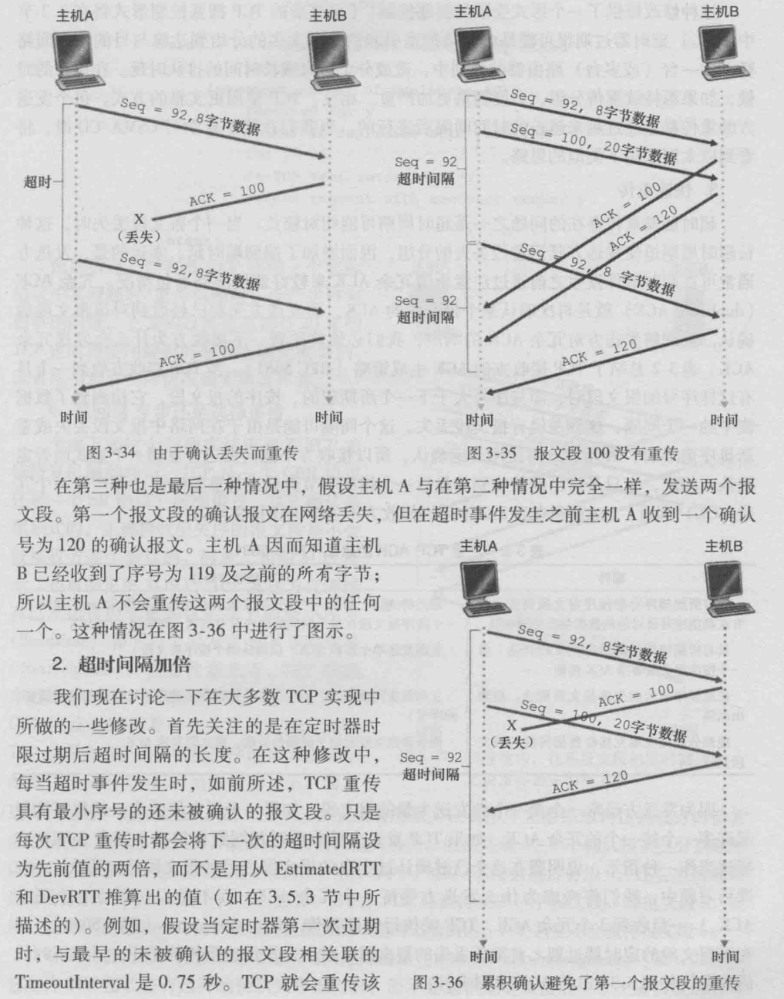

#### Nagle算法

`Nagele` 算法要求，当一个TCP连接中有在传数据时（即哪些已发送但还未确认的数据），小的报文段（长度小于SMSS）就不能被发送，直到所有的在传数据都收到ACK。并且在收到ACK后，TCP需要搜集这些小数据，将其整合到一个报文段中发送。

这种算法迫使TCP循环停等：只有等收到所有在传数据的ACK后才能继续发送

**优点：** 实现了自时钟控制，ACK返回越快，数据传输越快。在延迟高的广域网中，可以减少微型报文的数目，使得单位时间发出的报文段数目更少。也就是说 **RTT自动控制着发包速率**

缺点：对于实时性要求比较高的场景，例如 `ssh`，使用Nagle和延迟ACK会导致较高的时延，这种场景一般就不会使用Nagle

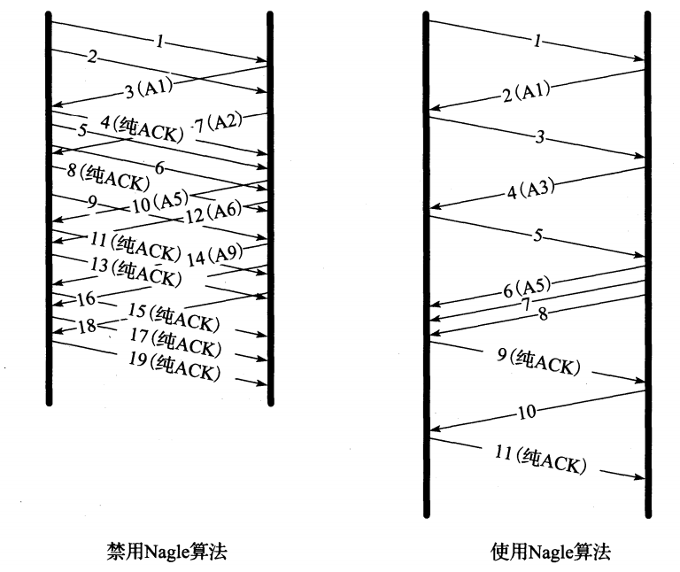


#### 超时重传

TCP在发送数据时，会设置一个重传计时器，若计时器超时仍未收到ACK，则会引发响应的`超时`或`基于计时器的重传`操作，计时器超时称为 **重传超时 RTO**（Retransmission Timeout）。如果收到ACK，那么该报文的计时器就会取消。因此每个TCP连接的发送端不断地设定和取消一个重传计时器

如果发送的包一直没收到 ACK 确认，等太长时间的话，数据包都丢了很久了才重发，没有效率，性能差；等太短时间的话，可能 ACK 还在路上快到了，这时候却重传了，造成浪费，同时过多的重传会造成网络拥塞，进一步加剧数据的丢失。所以需要随着网络的状态变化去计算**重传超时的时间 （RTO，超时时间间隔）**，一般根据**RTT(传输往返时间，从发出报文到接收到确认的时间， Round-Trip Time)**来自适应调整 


对相同报文每次重传的时间间隔加倍（二进制指数退避），同时需要设置最大重传次数 R1


**怎么根据RTT设置RTO？**

- 复杂，略过，反正是动态计算 RTT ，从而调整RTO

- RTO应有一个下界，同时还有一个上界


#### 快速重传

快速重传不需要等重传计时器超时，快重传是为了更加及时有效的修复丢包情况

在接受端接收到 **失序** 的报文段时，TCP需要 **立即生成确认信息（重复ACK）**，表明中间出现了空缺，发送端的工作就是尽快地、高效的填补空缺

但是发送端无法判断，重复ACK是由于网络中分组失序了（延迟到达），还是包丢失了，所以需要进行衡量，需要等待**一定数目的重复ACK**后，才触发快速重传

一般是收到3个重复ACK后就开始快速重传


#### 选择重传

TCP接受端可以提供 `SACK` 功能，通过TCP头部的累计ACK号字段来描述其接收到的数据

TCP发送端的任务是重传丢失的数据来填补接受端缓存中的空缺，但是同时也要尽可能保证 **不重传接受端已正确接收的数据**

所以很多时候合理使用 SACK 信息能更快的实现空缺填补，减少不必要的重传。一个SACK可以包含三四个告知失序数据的SACK信息

> `SACK`即选择确认，有两个字段：**SACK-Permitted** 和 **SACK**
>
> 通过接收 `SYN` 或者 `SYN+ACK` 报文段中的 `SACK-Permitted` 选项，TCP通信方会了解到自身具有发布 SACK 信息的能力
>
> 当接收到乱序的数据时，他就能提供 SACK 选项来描述这些乱序的数据，从而帮助对方**有效的进行重传**
>
> SACK信息保存在 `SACK选项` 中，包含了接受对方已经成功接收到的数据块的序列号范围，每个范围都是一个 **SACK 块**，由 **一对32位序列号** 表示，一个SACK选项包含了多个SACK块
>
> 由于TCP头部的可选字段空间有限，一个报文段中最多发送 3个 SACK块


接受端在 **TCP建立连接期间收到SACK许可选项** 即可生成SACK，每当缓存中存在失序数据，就可以生成SACK

发送端根据收到的 SACK 进行选择重传，并且对于 SACK 的块（表示对面收到了）进行标记


### 5.5.4 流量控制：滑动窗口

#### 滑动窗口

窗口是缓存的一部分，用来暂存字节流，发送方和接收方各有一个窗口（接收缓存和发送缓存），**通过TCP报文头的窗口大小字段告诉对方自己的窗口大小**，发送方根据窗口大小和其他信息设置自己的窗口大小


**发送窗口**：当发送窗口左部字节已经**全部发送且全部被确认**，则可以向右滑动到左边第一个字节不是已发送且确认的状态

**接收窗口**：左部字节已经**`全部确认且应用程序已经读取了`**，则向右滑动窗口。**接收窗口只会对窗口内`最后一个按序到达的字节进行确认`**

注意：TCP是以 `字节`（而非包）为单位维护其窗口结构的


对ACK的再认识，ack通常被理解为收到数据后给出的一个`确认ACK`，ACK包含两个非常重要的信息：

- **期望接收到的下一字节的序号n**，该n代表接收方已经接收到了前n-1字节数据，此时如果接收方收到第n+1字节数据而不是第n字节数据,接收方是不会发送序号为n+2的ACK的，而是继续发送n的冗余ACK

- **当前的接收窗口大小rwnd**，如此发送方在接收到ACK包含的这两个数据后就可以计算出还可以发送多少字节的数据给对方，假定当前发送方已发送到第x字节，则可以发送的字节数就是 $y=rwnd-(x-n)$ 。这就是滑动窗口控制流量的基本原理


当接收方应用程序处理较慢时，到来的数据返回ACK后，就要排队等待被读取。这种状况持续，会使得接收窗口越来越小，回复给发送方的报文的窗口值字段也越来越小，最后可能就会导致窗口设置为0，使得发送端暂停发送新数据

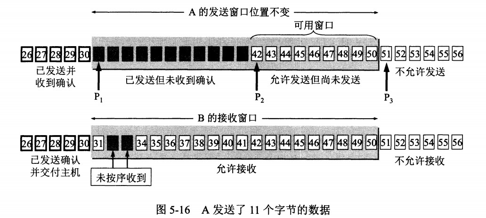


#### 接收窗口

接收窗口实际上就是一个buffer缓冲区，每个连接都分配了一个接收缓存，用`RcvBuffer`表示其大小，接收方主机的应用程序不时的从该缓存中读取数据：

- `LastByteRead`：主机上的应用进程从缓存读出的数据流的最后一个字节的编号
- `LastByteRcvd`：从网络中到达的，并且已经放入缓存的数据流的最后一个字节编号

TCP不允许已分配的缓存溢出，也就是说： $LastByteRcvd - LastByteRead <= RcvBuffer$

而接收窗口的大小rwnd就可以计算出来了：$rwnd = RcvBuffer - (LastByteRcvd - LastByteRead)$

所以接收窗口大小`rwnd`是**随着时间变化的，动态的**

初始的时候 $rwnd = RcvBuffer$​ ，这个值在握手的时候会传递给对方

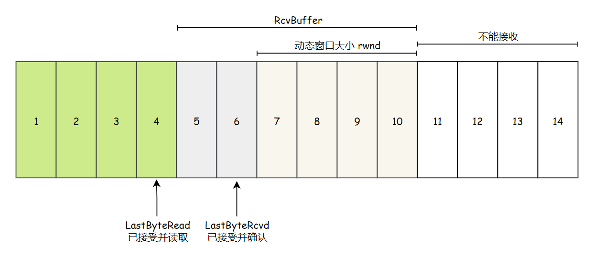

如果收到的报文序列号小于窗口的左边界(`LastByteRcvd+1`)，则认为是重复数据，直接丢弃

如果收到的报文序列号超出窗口的右边界(`LastByteRead+Rcvbuffer`)，则超出处理范围，也会直接丢弃

对于**累计确认**TCP来说，只有收到的数据序列号`等于左边界`时，数据才不会被丢弃，窗口左边界才能右滑动

对于**选择确认**TCP来说，使用`SACK`选项，窗口内的其他报文段也可以被接收确认，但只有在接收到等于左边界的序列号数据时，窗口左边界才能右滑动


对于零窗口情况，当接受端重新获得可用空间时，会给发送端传输一个 `窗口更新`，告知其可以继续发送数据。但是这个窗口更新的报文不包含数据(纯ACK)，所以不能保证其传输的可靠性(没有重传机制)，因此TCP必须有相应措施处理这类丢包

如果一个包含窗口更新的ACK丢失，通信双方就会一致处于等待状态：接收方等待接收数据，发送方等待窗口更新为非0值。

为了防止这种死锁的发生，发送端会采用一个持续计时器间歇性的查询接受端，看其窗口是否已增长，即**窗口探测**，窗口探测包 **强制要求接受端返回ACK**，窗口探测包**包含一个字节的数据**，所以可以依靠TCP进行可靠传输


#### 发送窗口

6字节已经被确认了，而接收方提供的窗口大小 `rwnd = 4`，这时候78已经发出去了

发送窗口维护了发送端提供的窗口大小 rwnd，已发送且确认的的字节序号，已发送但还未确认的字节序号

每个TCP报文段都包含ACK号和接收窗口大小rwnd。发送端可以据此调节窗口结构

当左右边界相等时，称之为**零窗口**，这时候不能再发送新数据，这种情况下TCP发送端开始探测对方窗口，伺机增大窗口

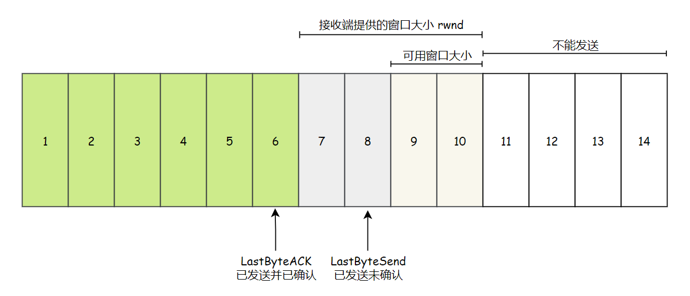


### 5.5.5 拥塞控制

>  路由器无法处理高速到达的数据而被迫丢弃数据的现象叫做**拥塞**。
>
> **TCP流量控制**是为了平衡一个连接中接收方和发送方的速度匹配问题，当发送方发现发送速度大于接收方的接收速度时动态调整发送速度，是**端到端的问题**。
>
> 但是成千上万的TCP链接共享着整个网络基础设施，当网络上这些TCP都在传输数据时，网络有可能就会拥塞，**TCP的拥塞控制**就是在传输自己数据的同时实时掌握整个网络的负载，然后基于整个网络的负载来动态调整自己的发送速度，是**全局性的问题**。

如果网络拥塞，报文段可能会会丢失，发送方就会重传，导致拥塞程度更高。因此拥塞时应控制发送方速率。
**与流量控制的区别**：都是去控制发送方的发送速率，但是流量控制是为了让接收方能来得及接收，拥塞控制是为了降低整个网络的拥塞程度

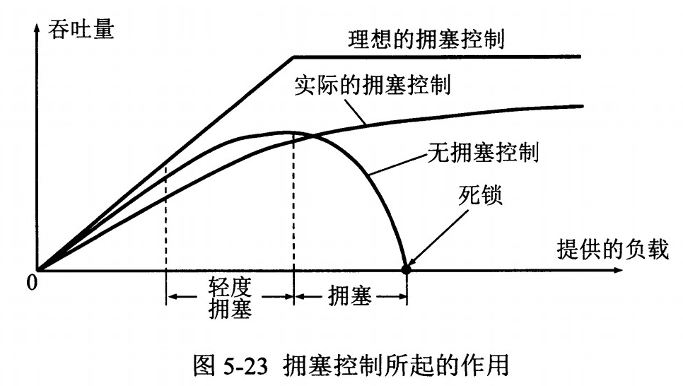

**TCP拥塞控制的方法**：TCP拥塞控制属于端到端的控制方法，其核心便是观察感知网络的拥塞状态，然后调整发送速度。在TCP拥塞控制中引入了`拥塞窗口（cwnd：congestion window）`，流量控制中引入了`接收窗口（rwnd：receive window）`。最终TCP的发送窗口为 `min{cwnd，rwnd}`。
$$
LastByteSent - LastByteAcked \leq min\{cwnd, rwnd\}
$$

TCP主要通过四个算法来进行拥塞控制：慢开始和拥塞避免、快重传和快恢复
发送方需要维护一个`拥塞窗口(cwnd)`的状态变量(**拥塞窗口只是一个状态变量**，实际决定发送方能发送多少数据的还是发送方的滑动窗口)

#### 慢启动和拥塞避免

慢开始(slow start)和拥塞避免(congestion avoidance)：基于ACK超时来检测

**慢开始**：新建立的连接或者检测到超时丢包时，执行慢开始，` cwnd=1MSS(max segment size)`，所以初始可用窗口大小也是1MSS，假如没有丢包，收到确认后将cwnd加倍：2，4，8...增长非常快，当`cwnd>=ssthresh`(慢开始阈值)，进入拥塞避免。慢开始指数增长看似很快，但是于一开始就以最大可用速率（接收方通知的窗口大小）发送相比，仍显缓慢

**拥塞避免**：拥塞避免阶段，每收到一个ACK`只将cwnd加1`，如果出现**超时**，将`ssthresh=cwnd/2  cwnd=1`，重新执行慢开始


#### 快重传和快恢复

快重传和快恢复：基于ACK重复来检测
判断网络拥塞的办法：ack超时或者多个重复的ack。**慢开始和拥塞避免是等到ack超时才进行重传和慢开始算法**。而快重传机制收到三个重复ack就直接重传，不用等超时，所以有效避免了拥塞

**快重传**：发送端接收到 **3个连续的重复ACK则重传**，不需要等重传定时器溢出
**快恢复**：在这种情况下只是丢失个别报文段，而不是网络拥塞，所以快恢复。令`ssthresh=cwd/2, cwd=ssthresh`直接进入到拥塞避免阶段


### 5.5.6 流量控制+拥塞控制

上述流量控制时假设了网络好，不拥塞，拥塞控制时假设了接收方缓冲区无限大。
实际综合考虑时，只需要将`接收方的窗口rwnd`和`拥塞窗口cwnd`放在一起比较，取较小者即可
$$发送方窗口上限值=min\{rwnd, cwnd\}$$
当 $rwnd<cwnd$ 说明是接收方的接收能力限制了发送方窗口的最大值
当 $cwnd<rwnd$ 说明是网络的拥塞限制了发送方窗口的最大值


### 5.5.7 TCP保活机制

https://niyanchun.com/tcp-keepalive-howto.html

正常情况下，TCP连接建立之后，即使中间路由器重启，或者数据线断开再连接，只要连接两端的主机没有被重新启动(或者更改IP地址)，那么他们将会保持连接状态

TCP保活机制是一种在不影响数据流内容的情况下探测对方的方式，它是由一个`保活计时器`实现的。当计时器被激发，连接一端将会发送一个 **保活探测报文**，另有但接收报文的同时会发送一个ACK响应


保活机制不是TCP规范的一部分，因为：

1. 出现短暂的网络错误的时候，保活机制会使一个好的连接断开
2. 保活机制会占用不必要的带宽
3. 按流量计费的情况会在互联网上花费更多的钱

然而，大部分的实现都提供了保活机制，一般是为服务器应用程序提供的，服务器希望通过应用程序直到客户主机是否崩溃或离开


**保活时间(keepalive time)：** 如果在保活时间的间隔内，连接时钟处于非活动状态，开启保活功能的一端就会发送保活探测报文

**保活间隔时间(keepalive interval)：** 如果保活探测报文没有收到响应，得等待保活间隔时间后，会继续发送保活探测报文

**保活探测次数(keepalive probe)：** 如果发送保活探测报文的次数达到保活探测次数，这时候对方主机将会被确认为不可达，**连接将被中断**


**保活探测报文：** 为空报文或者1字节报文，**它的序列号等于对方主机发送的ACK报文的最大序列号减一**。因为这个序列号已经被成功接收！所以不会对到达的报文段造成影响，但是探测报文返回的响应可以确定连接是否仍在工作。探测和响应报文都不包含任何新的有效数据（它是垃圾数据），当他们丢失时也不会进行重传，所以仅凭一个探测报文没有响应，是不能判断连接是否已停止工作的。

(早期的一些TCP实现不会响应那些不包含垃圾数据的保活探测报文)

tcp的keepalive机制用于在双方**长时间未通讯时**，探测**对方是否还活着**。如果对方还活着，就会发送响应，收到响应后就刷新保活定时器。如果没收到响应，就会间隔一定时间后重发，直到收到响应，或者探测次数达到上限则认为对端不可达，将连接关闭。在探测过程中，对端主要处于下面四种状态之一：

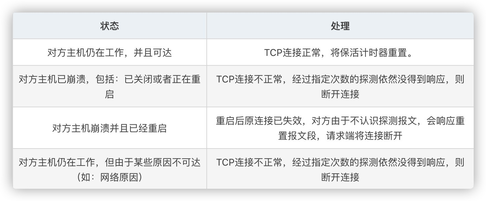


当**系统正常关机**时，所有的应用进程也会终止，这会使得对方的TCP发送一个`FIN`。


### 5.5.8 相关问题

**什么是 TCP 的自连接，如何解决** 
tcp 自连接，就是出现源 ip 和源端口通目的 ip 和目的端口完全相同的情况

原因：客户端与服务端connect建立连接的时候，如果客户端socket没有`bind`端口号，系统会随机分配一个当前未被使用的端口 `ephemeral port`。所以**有可能分配到和目的端口一样的数字**，此时由于`connect`，该端口是打开的，可以接收到SYN，对于tcp来说三次握手整个阶段都合法，所以自然可以建立连接（客户端一台机器，自己和自己建立了连接）

如何解决：**服务端的监听端口避免使用客户端的 ephemeral port**(/proc/sys/net/ipv4/ip_local_port_range里设置)


**TCP/IP的分片粘包过程**
https://blog.csdn.net/jinxinliu1/article/details/80609272


**tcp传输对包的大小有限制吗？**
https://blog.csdn.net/caoshangpa/article/details/51530685


**TCP 封包和拆包** 

封包就是给一段数据加上包头，这样一来数据包就分为包头和包体两部分内容了。包头其实上是个大小固定的结构体，其中有个结构体成员变量表示包体的长度，这是个很重要的变量，其他的结构体成员可根据需要自己定义。根据包头长度固定以及包头中含有包体长度的变量就能正确的拆分出一个完整的数据包。

拆包就是根据包头以及包头中表示包长的结构体的变量，去掉包头的过程。大概过程描述如下:

1. 为每一个连接动态分配一个缓冲区,同时把此缓冲区和 SOCKET 关联,常用的是通过结构体关联.
2. 当接收到数据时首先把此段数据存放在缓冲区中.
3. **判断缓存区中的数据长度是否够一个包头的长度,如不够,则不进行拆包操作.**
4. 根据包头数据解析出里面代表包体长度的变量.
5. 判断缓存区中除包头外的数据长度是否够一个包体的长度,如不够,则不进行拆包操作.
6. 取出整个数据包.这里的"取"的意思是不光从缓冲区中拷贝出数据包,而且要把此数据包**从缓存区中删除掉.删除的办法就是把此包后面的数据移动到缓冲区的起始地址.**


**TCP 中已有 SO_KEEPALIVE 选项，为什么还要在应用层加入心跳包机制？**  

应用层加入心跳主要是因为 TCP 协议中的 SO_KEEPALIVE 有几个致命的缺陷：

1. keepalive 只能检测连接是否存活，不能检测连接是否可用。比如服务器因为负载过高导致无法响应请求但是双方的连接仍然存在，此时 keepalive 无法判断该连接是否可用。

2. 如果 TCP 连接中的另一方因为停电突然断网等非正常断开的现象，由于服务器端（被动连接/断开的一方）并不知道客户端已断开连接，此时若服务器正在发送数据，那么会导致数据发送失败并进行数据重传，由于**重传包的优先级要高于 keepalive 的数据包，因此 keepalive 的数据包无法及时发送出去**。

3. 当重传超过一定次数，TCP 协议会发送 keepalive 探测包到客户端，一旦探测包没有返回，服务器端会以 keep_alive_interval 的频率继续发送探测包，经过若干次重试，若服务器一直没有收到应答就会认为该 TCP 连接已经断开（默认时长是 2 小时），而 2 小时以内这个连接一直不会断开，浪费系统资源。 

   保活的必要性：

   - 许多防火墙等会自动关闭空闲的 socket 连接，TCP 保活可以防止某些短时间的空闲 socket 不会被关闭；
   - 对于一些非正常断开的连接，如断电，服务器端并不能检测到，为了回收资源，必须提供一种检测机制；

   

   保活的两种方式：

   - TCP 协议自带的 KeepAlive
   - 应用层面的心跳包


**TCP 协议下 socket 有可能丢包吗？** 
有可能。

TCP 是一种可靠的、面向连接的字节流服务，可靠的服务是指，在网络连接正常的情况下，保证用户数据能够按照顺序的完整到达。但是，TCP 是基于不可靠的网络来实现可靠的传输，肯定也会存在丢包的情况，一般在通信中发现缺少数据或者发生丢包，很可能是由于程序在发送或者接收的过程中出现了问题。

举例 1：客户端 A 与服务器 B 建立 TCP 连接，A 到 B 的传输过程中，A 发送的字节流按顺序完整的到达B，但是由于 B 在对数据处理的过程中，导致数据的部分丢失（例如 A 发送大量的数据，且频率很高，B接收数据的时候可能由于缓冲区溢出、多线程同步等问题），那么 B 收到的数据就比理论上应该收到的少，产生丢包现象。

附上知乎上的一个讨论帖：https://www.zhihu.com/question/53960871


**time_wait close_wait 产生的原因（keepalive 机制）** 
TCP 协议规定，对于已经建立的连接，网络双方要进行四次握手才能成功断开连接，如果缺少了其中某个步骤，将会使连接处于假死状态，连接本身占用的资源不会被释放。网络服务器程序要同时管理大量连接，所以很有必要保证无用连接完全断开，否则大量僵死的连接会浪费许多服务器资源。在众多 TCP 状态中，最值得注意的状态有两个：CLOSE_WAIT 和 TIME_WAIT。

`TIME_WAIT` 是主动关闭链接时形成的，等待 2MSL(Max Segment Lifetime)时间，约 4 分钟。主要是防止最后一个 ACK 丢失。由于 TIME_WAIT 的时间会非常长，因此 **server 端应尽量减少主动关闭连接**。

为什么 TIME_WAIT 状态停留 2MSL（max segment lifetime）时间也就是 TCP/IP 设计者本来是这么设计的主要有两个原因：

1. 防止上一次连接中的包，迷路后重新出现，影响新连接（经过 2MSL，上一次连接中所有的重复包都会消失）；
2. 可靠的关闭 TCP 连接。在主动关闭方发送的最后一个 ack(fin)，有可能丢失，这时被动方会重新发 fin, 如果这时主动方处于 CLOSED 状态 ，就会响应 rst 而不是 ack。所以主动方要处于 TIME_WAIT 状态，而不能是 CLOSED 。

`CLOSE_WAIT` 是被动关闭连接是形成的。根据 TCP 状态机，服务器端收到客户端发送的 FIN，则按照 TCP实现发送 ACK，因此进入 CLOSE_WAIT 状态。但如果服务器端不执行 close()，就不能由 CLOSE_WAIT 迁移到 LAST_ACK，则系统中会存在很多 CLOSE_WAIT 状态的连接。此时，可能是系统忙于处理读、写操作，而未将已收到 FIN 的连接，进行 close。此时，recv/read 已收到 FIN 的连接 socket，会返回 0。

解决 CLOSE_WAIT 的方法: 

1. 一般原因都是 TCP 连接没有调用关闭方法。需要应用来处理网络链接关闭。
2. 对于 Web 请求出现这个原因，经常是因为 Response 的 BodyStream 没有调用 Close. 比如 Widnows 下:使用 HttpWebRequest 一定要保证 GetRequestStream 和 GetResponse 对象关闭，否则容易造成连接处于CLOSE_WAIT 状态。
3. TCP 的 KeepLive 功能，可以让操作系统替我们自动清理掉 CLOSE_WAIT 的连接。但是 KeepLive 在 Windows 操作系统下默认是 7200 秒，也就是 2 个小时才清理一次。往往满足不了要求。可以调小该数值。

Close_Wait 引发的问题: 

Close_Wait 会占用一个连接，网络可用连接小。数量过多，可能会引起网络性能下降，并占用系统非换页内存。尤其是在有连接池的情况下(比如 HttpRequest)会耗尽连接池的网络连接数，导致无法建立网络连接。


**当应用程序调用 Send 之后怎么判断对方是否成功接收**
要应用层发送一个确认。

**TCP 的 ACK 表示对方的协议栈已经收到了你发的数据，不代表对方的应用程序收到了你发的消息。**


## 5.6 TCP的分段和IP的分片

### 5.6.1 MTU和MSS

`MTU`：最大传输单元，是**`链路层`中的网络对数据帧的限制**，为了告诉上层IP层自己的传输能力有多大，这样IP层就会根据这个数值进行数据包的切分

- 以**以太网**为例，MTU为`1500`个字节，也就是说一个IP数据报在以太网中传输，如果长度超过MTU的值，就会进行**IP数据报的分片传输**，使得么个数据报的长度小于MTU。
- 分片传输的IP数据报不一定按顺序到达，但是IP首部的信息可以让这些数据报片按顺序组装，IP数据报的分片和重组是在网络层中进行的

- 使用 `ifconfig`命令可以查看到MTU的值，一般每个网卡对应的MTU也不同


**`MSS = MTU - TCP/UDP Header - IP Header`**

`MSS(Maximum Segment Size)`：**TCP层交给IP层的的最大分段大小，不包含TCP的Header和Option，主要用来限制应用层最大的发送字节数**

- TCP报文段大于MSS就要进行分段传输。一般MSS的大小是`MTU的值减去两个首部大小(IP数据包头的20字节+TCP数据报头的20字节)`
- 例如MTU=1500byte，那么MSS=1460byte，如果应用层有2000byte的数据发送，那么就要切片，第一个TCP切片发送1460字节的Payload，第二个TCP切片发送540字节的Payload
- TCP报文段的分段和重组是在传输层完成的。**控制了TCP报文段不超过MSS，就可以保证IP数据包不用在网络层再分片了**
- 所以如果链路层是以太网，MSS的值往往是`1460(1500-20-20)`。
- `Internet上标准的最小MTU是576`，如果不设置，默认的MSS就是536。
- 当初设计MSS这个参数只是为了**考虑双方TCP协议栈的buffer大小的**，所以客户和服务器端可以分别针对自己buffer大小设置自己的MSS。但是在协议栈实现中，要考虑因为MSS过大导致在IP层分片的情况，于是MSS就被实现成到了MTU减去包头大小。这样实际上MSS不光是TCP本身的一个参数，还要考虑下面的网络层和链路层情况了

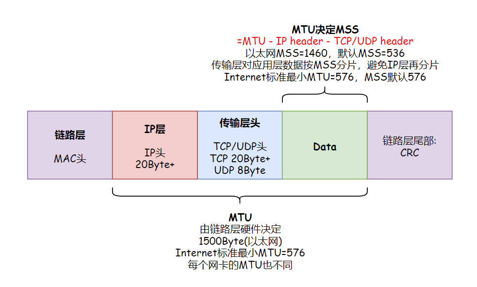

### 5.6.2 MSS协商

TCP协议建议在**建立连接的时候双方协商好MSS的值(SYN报文的Option可选项中，这个值不包含TCP和IP报文首部！)**

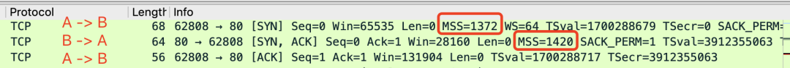

比如上图中，A将自己的MSS发送给B，建议B在发数据给A的时候，采用`MSS=1372`进行分段。而B在发数据给A的时候，同样会带上`MSS=1420`。两者在对比后，一般会采用**小的**那个值（1372）作为通信的`MSS值`，这个过程叫`MSS协商`。

同一个路径上，**MTU不一定是对称的**，也就是说A到B和B到A，两条路径上的MTU可以是不同的，对应的MSS也不一样


### 5.6.3 MSS是变化的

考虑一个问题，虽然发送方和接收方网络的MTU都是1500，数据包以1500封装，然而传输过程中可能遇到一段X.25网段，它的MTU是576，那么就会发生分片，如果恰好IP数据包设置了不允许分片，那么数据包就直接被丢弃了，然后收到`ICMP`不可达差错，告诉你需要分片

另外，**每次执TCP发送消息的函数时，会重新计算一次MSS，再进行分段操作**。

一般情况下，对端都会传 MSS，作为TCP Header的可选项，但是也有可能就没传，毕竟是可选项，`如果没收到对端TCP的MSS，本端TCP默认采用 MSS=536Byte`


### 5.6.4 为什么IP层分片了，TCP依然要分段

1. 由于本身IP层就会做分片这件事情。**就算TCP不分段**，到了IP层，数据包也会被分片，数据也能**正常传输**。

2. 假设有一份**TCP数据较大**，且在TCP层不分段，如果这份数据在发送的过程中出现**丢包**现象，TCP会发生重传，那么重传的就是这一大份数据（虽然IP层会把数据切分为MTU长度的N多个小包，但是**TCP重传的单位却是那一大份数据**）

3. 如果TCP把这份数据，分段为N个小于等于MSS长度的数据包，到了IP层后加上IP头和TCP头，还是小于MTU，那么IP层也不会再进行分包。此时在传输路上发生了丢包，那么TCP重传的时候也只是重传那一小部分的MSS段。效率会比TCP不分段时更高

**总结：数据在TCP分段，就是为了在IP层不需要分片，同时发生重传的时候只重传分段后的小份数据**


另外，对于UDP数据报，由于**UDP自己不会进行分段**，因此当长度超过MTU的时候，就会在网络层进行IP分片


**TCP分段了，IP层就一定不会分片了吗？**

上面提到了，在发送端，TCP分段后，IP层就不会再分片了。但是整个传输链路中，**可能还会有其他网络层设备，而这些设备的MTU可能小于发送端的MTU**。此时虽然数据包在发送端已经**分段**过了，但是在IP层就还会再分片一次。

所以如果链路上还有设备有**更小的MTU**，那么还会再分片，最后所有的分片都会在**接收端**处进行组装。


### 5.6.5 PMTU

**基于TCP协议的IP层如何能做到不分片？**

容易想到，我们将MTU设置为整个链路上最小的MTU即可

**整条链路上最小的MTU，叫`PMTU（path MTU）`**。有一个获得这个PMTU的方法，叫 **`Path MTU Discovery`**。

```
$cat /proc/sys/net/ipv4/ip_no_pmtu_disc
0     //默认为0，意思是开启PMTU发现的功能。现在一般机器上都是开启的状态
```

原理比较简单，首先我们先回去看下IP的数据报头

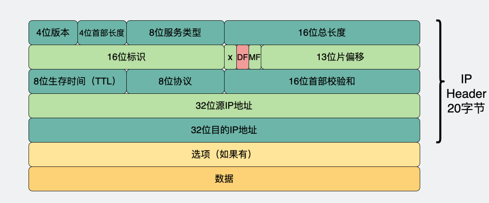

这里有个标红的标志位`DF`（Don't Fragment），当它置为1，意味着这个IP报文不分片。

当链路上某个路由器，收到了这个报文，当IP报文长度大于路由器的MTU时，路由器会看下这个IP报文的`DF`

- 如果为`0`（允许分片），就会分片并把分片后的数据传到下一个路由器
- 如果为`1`，就会把数据丢弃，同时返回一个`ICMP包`给发送端，并告诉它*"达咩!"*数据不可达，需要分片，同时带上当前机器的MTU


**PMTU发现**的实现方式

- 应用通过TCP正常发送消息，传输层**TCP分段**后，到**网络层**加上IP头，**DF置为1**，消息再到更底层执行发送
- 此时链路上有台**路由器**由于各种原因**MTU变小了**
- IP消息到这台路由器了，路由器发现消息长度**大于自己的MTU**，且消息自带**DF不让分片**。就把消息丢弃。同时返回一个`ICMP`错误给发送端，同时带上自己的`MTU`
- 发送端收到这个ICMP消息，会更新自己的MTU，同时记录到一个**PMTU表**中
- 因为TCP的可靠性，会尝试重传这个消息，同时**以这个新MTU值计算出MSS进行分段**，此时新的IP包就可以顺利被刚才的路由器转发
- 如果路径上还有更小的MTU的路由器，那上面发生的事情还会再发生一次


## 5.7 TCP粘包拆包

由于TCP是面向连接的，所以发送方可以将数据分1次或多次发送(**字节流太长时必须拆分，字节流太短时TCP会等待缓冲区的字节流到达一定数量再构成报文发送出去**)，接收方可以任意将数据分多次或1次读取(只要缓冲区足够大，可以一次性接收)，因为有连接可以确认数据都是同一台主机发出的！只要保证数据有序到达就行了，怎么读是随意的


而UDP是无连接的，任何主机都可以向接收端发送数据，报文传输的方式是由应用程序控制的，**应用层交给UDP多长报文，UDP就会照样发送，即一次发送一个报文**，接收方必须一个报文一个报文的接收，这时候如果一次能读取超过一个报文的数据就会乱套，可能会有多个报文合并在一起，这样的数据是没有意义的


### TCP粘包拆包问题

TCP是流协议，是没有界限的一串数据，TCP底层根据TCP缓冲区的实际情况进行包的划分，所以一个完整的应用层包可能会被TCP拆分成多个包进行发送，也有可能把多个小的包封装成一个大的数据包发送，这就是所谓的TCP粘包和拆包问题

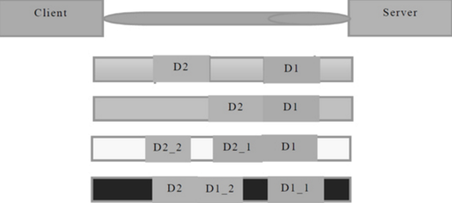

假设客户端分别发送了两个数据包D1和D2给服务端，由于服务端一次读取到的字节数是不确定的：

1. 服务端分两次读取到了两个独立的数据包，分别是D1和D2，没有粘包和拆包
2. 服务端一次接收到了两个数据包，D1和D2粘合在一起，被称为TCP粘包
3. 服务端分两次读取到了两个数据包，第一次读取到了完整的一个包和另一个包的部分内容，第二次读取到另一个包的剩余内容，这被称为TCP拆包

### 解决办法

由于底层的TCP无法理解上层的业务数据，所以在底层是无法保证数据包不被拆分和重组的，这个问题只能通过上层的应用协议栈设计来解决，根据业界的主流协议的解决方案，可以归纳如下。

1. **消息定长**，例如每个报文的大小为固定长度200字节，如果不够，补空格
2. 在包尾增加**回车换行符**进行分割，例如FTP协议
3. **将消息分为消息头和消息体**，消息头中包含表示消息总长度（或者消息体长度）的字段，通常设计思路为消息头的第一个字段使用int32来表示消息的总长度
4. 更复杂的应用层协议。


## 5.8 TCP相关攻击

### SYN泛洪

SYN泛洪是指，客户端产生一系列SYN报文（通常会采用伪造的源IP），服务器会为每个连接分配资源，最终导致半连接队列溢出，服务器无法接受新的连接


**SYN cookies 技术**

当一个SYN到达时，这条连接存储的大部分信息都会被编码并保存到 SYN+ACK 报文段的`序列号`中。这样就不需要分配半连接队列的资源了，只有第三次握手的ACK收到后，验证对方的ack序列号满足条件，服务器才会真正分配内存，直接设置为 ESTABLISHED 状态

例如Linux中，收到SYN的序列号后，服务器会根据下面规则计算初始序列号：

- 首5位是 t mod 32 的结果（t是一个32位计数器，每隔64秒加1）
- 接着3位是对服务器最大段大小的编码值（8种情况，三位）
- 余24位保存 4元组 与 t 的散列值（通过服务器选定的散列加密算法得到）

在接收到ACK后，如果根据当前t值，计算出与加密的散列值相同的结果，那么服务器就会建立连接，否则拒绝

**该技术的缺陷**：由于对最大段大小进行了编码，所以不能使用任意大小的报文段。其次由于计数器会回绕，连接建立过程会因为周期非常长（长于64秒）而无法正常工作

所以这一功能没有作为默认设置


### PMTU攻击

攻击者伪造一个 `ICMP PTB` 消息，该消息包含一个非常小的MTU值（例如68字节），这样就迫使受害者的TCP尝试采用非常小的数据包来填充数据，从而大大降低它的性能


解决办法是接收到ICMP PTB消息后，如果最大传输单元小于 576 字节，则禁用PMTU功能


# 6. 应用层-报文(message) 

## 套接字

**进程通信：** 客户端和服务器进程一般在不同的端系统上，进程间通过叫**`套接字`(socket)**的软件接口向网络发送和接收报文

**套接字**是建立网络应用程序的可编程接口，所以也被称为应用程序和网络之间的**应用程序编程接口(API)**。应用程序可以控制套接字在应用层端的一切，但是对于套接字的传输层端几乎没有控制权

套接字包括了IP地址和端口号，**可以对其进行像文件一样的打开，读写和关闭操作**

应用程序对传输层的控制：选择传输层协议；设定一些参数(最大缓存，最大报文段长度等)


应用层可以使用的传输层服务：**TCP、UDP**，套接字工作流程如下：

**基于TCP协议的套接字工作流程：** 需要建立双向连接通道

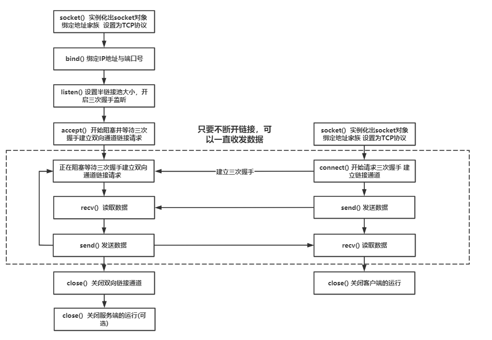


**基于UDP协议的套接字工作流程：** 无需建立双向连接通道

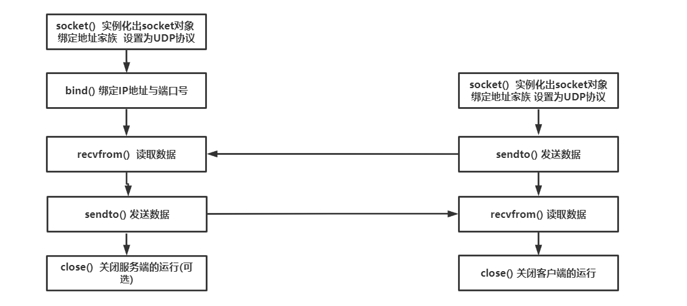


应用程序对服务的要求主要有：可靠性(TCP)、吞吐量、定时、安全性(SSL加强的TCP)。

## 6.1 DNS协议
**域名系统(DNS)**是一个分布式数据库，提供了主机名和ip地址之间的转换服务。分布式数据库是指**每个站点都只保留了它自己的那部分数据**

域名具有层次结构：根域名、顶级域名、二级域名。  例如www.baidu.com，其中com是一级域名(企业)，baidu是二级域名(公司名)，www是三级域名

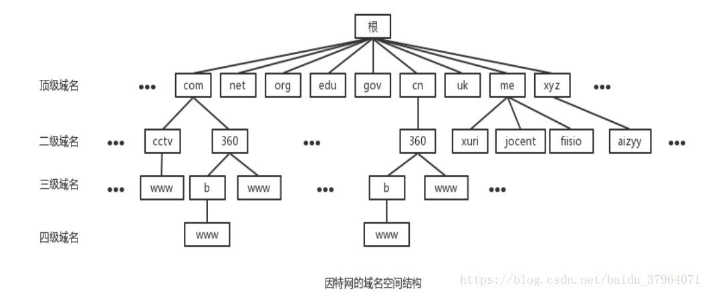


### DNS服务器

**DNS 服务器**实际上就是装有域名系统的主机。如果采用集中式设计的话，会存在`单点故障`、`通信容量大`、`时延高`、`维护不易的问题`的问题，因此 DNS 是一个**分布式数据库系统**。由高向低进行层次划分，可分为以下几大类：

| 分类                  | 作用                                                         |
| --------------------- | ------------------------------------------------------------ |
| 根域名服务器          | 最高层次的域名服务器，**本地域名服务器解析不了的域名就会向其求助**，全世界13个根域名服务器 |
| 顶级（TLD）域名服务器 | 负责管理**在该顶级域名服务器下注册的二级域名的IP地址**       |
| 权威域名服务器        | 负责一个区的域名解析工作                                     |
| 本地域名服务器        | 每个ISP都有一台本地DNS服务器，当一个主机发出DNS查询请求时，这个查询请求首先发给本地域名服务器。例如电信、联通、谷歌、阿里等的本地DNS服务 |


权威域名服务器可以根据不同的策略来进行分区，具体怎么分区是公司根据域名多少、访问量等情况综合规定的，**各个权威域名服务器是同等地位的**

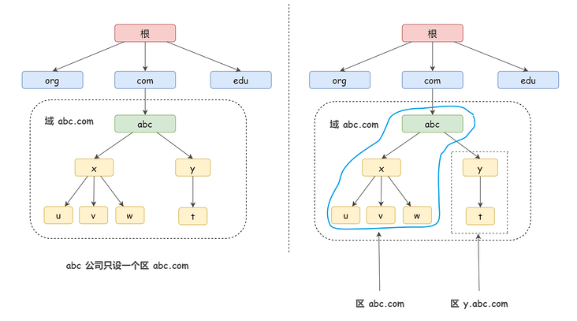

每个因特网服务提供者或一所大学，甚至一所大学中的各个系，都可以拥有一个本地域名服务器。**当一台主机发出 DNS 查询请求时，这个查询请求报文就发送给该主机的本地域名服务器**。**本地域名服务器管理本地域名的解析和映射，并且能够向上级域名服务器进行查询**


### 域名解析过程

**域名和 IP 的对应关系保存在一个叫hosts文件中**。最初，通过互联网信息中心来管理这个文件，如果有一个新的计算机想接入网络，或者某个计算IP变更都需要到信息中心申请变更hosts文件。其他计算机也需要定期更新，才能上网。但是这样太麻烦了，就出现了DNS系统。

当在浏览器中访问域名时，系统会默认**先访问自己主机上的hosts文件**查看是否存在访问域名的映射关系，如果不存在时，才将请求的域名发送给**DNS系统**进行解析获取对应的ip地址。

一般来说**域名服务器之间的查询使用迭代查询方式，以免根域名服务器的压力过大**

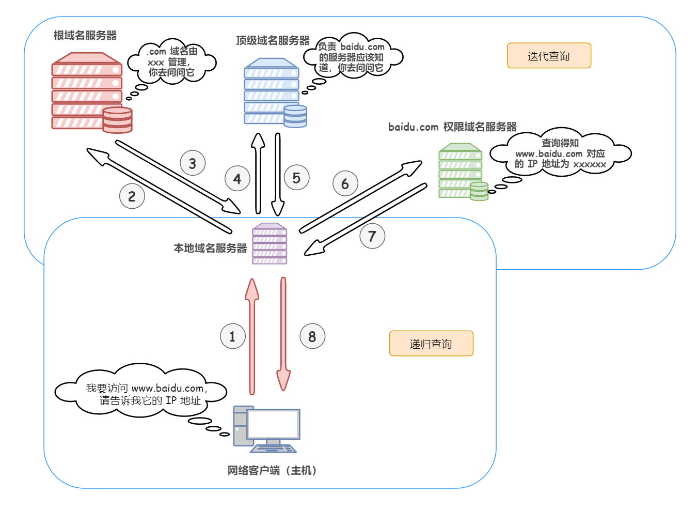

1. `主机`先向`本地域名服务器`进行**递归查询**（只发一次请求，要求对方给出最终结果）
2. 本地域名服务器如果没有命中缓存，则采用**迭代查询**，向一个`根域名服务器`查询该域名。（迭代：根据上次查询结果不断重复的查询）
3. 根域名服务器不会直接指明这个域名的ip，而是返回这个域名对应的`顶级域名服务器`的IP地址
4. 本地域名服务器向顶级域名服务器进行查询
5. 顶级域名服务器不会直接指明这个域名的ip，而是返回这个域名对应的`权威域名服务器`的IP地址
6. 本地域名服务器向权威域名服务器进行查询
7. 权威服务器告诉本地域名服务器所查询的域名的`IP地址`
8. 本地域名服务器最后把查询结果告诉主机

然而由于

 **DNS 缓存**的大量存在，这个查询过程中的很多步骤往往可以跳过，例如当本地 DNS 服务器缓存了顶级 DNS 服务器的 IP 地址时，本地 DNS 服务器就可以绕过查询链中的根 DNS 服务器。为保持高速缓存中的内容正确，域名服务器应为每项内容设置计时器（通常设置为两天），并丢弃超时的缓存信息。


[超详细DNS协议解析](https://segmentfault.com/a/1190000039039275)


### DNS欺骗

> DNS 欺骗就是攻击者冒充域名服务器的一种欺骗行为。 原理：如果可以冒充域名服务器，然后把查询的IP地址设为攻击者的IP地址，这样的话，用户上网就只能看到攻击者的主页，而不是用户想要取得的网站的主页了，这就是DNS欺骗的基本原理。DNS欺骗其实并不是真的“黑掉”了对方的网站，而是冒名顶替、招摇撞骗罢了。

1. **hosts文件篡改**：
   Hosts文件是一个用于存储计算机网络中节点信息的文件，它可以将主机名映射到相应的IP地址，实现DNS的功能，它可以由计算机的用户进行控制。

   有很多网站不经过用户同意就将各种各样的插件安装到你的计算机中，其中有些说不定就是木马或病毒。对于这些网站我们可以利用Hosts把该网站的域名映射到错误的IP或本地计算机的IP，这样就不能访问了。如图：

   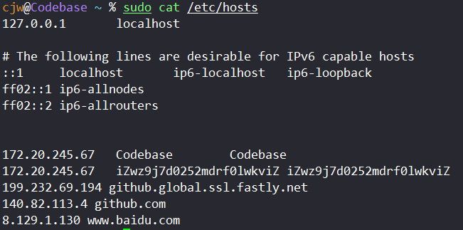

2. **本机DNS劫持**：
   DNS劫持又称域名劫持，是指在劫持的网络范围内**拦截域名解析的请求**，分析请求的域名，把审查范围以外的请求放行，否则返回假的IP地址或者什么都不做使请求失去响应，其效果就是对特定的网络不能反应或访问的是假网址。

   简单的说就是把你要去的地址拦截下来，给你一个错误的地址，或者告诉你你要去的地方去不了，人为的导致你无法到达目的地，一般用于对一些不良网站的封杀或是一些黑客行为。


### DNS的传输层协议

DNS可以使用UDP或者TCP传输，端口为`53`，一般使用UDP，**使用UDP就得要求域名解析器和域名服务器都必须自己处理超时重传从而保证可靠性**。

- 两种情况使用TCP进行传输：
  - 返回的响应超过512字节(DNS规定UDP最大只支持512字节的数据)
  - 区域传输(主域名服务器向辅助域名服务器传送变化的那部分数据)

**区域传输：**DNS的规范规定了2种类型的DNS服务器，主DNS服务器和辅助DNS服务器。在一个区中主DNS服务器从自己本机的数据文件中读取该区的DNS数据信息，而辅助DNS服务器则从区的主DNS服务器中读取该区的DNS数据信息。当一个辅助DNS服务器启动时（启动后也会定时同步最新数据，一般3小时一次），它需要**与主DNS服务器通信，并同步主服务器的数据信息**，这就叫做区传送（zone transfer）。**区域传输是DNS的事务，对准确性要求比较高，而且会产生大于512字节的数据包，因此使用TCP协议**

## 6.2 FTP文件传送协议
FTP使用**TCP**进行连接，需要**两个TCP连接来传送一个文件**
- **控制连接**：服务器打开端口`21`等待客户端的连接，客户端(端口随机)主动建立连接后，使用这个连接进行命令和应答的传送，只用来发送连接/传送请求（**持续连接**）
- **数据连接**：用来传送文件的数据（**非持续连接**）。

根据**数据连接**是否是服务器端主动建立起来的，FTP可以分为主动模式和被动模式。
- **主动模式(PORT)：** 服务器端口`20`，客户端端口随机，向FTP服务器发送PORT命令，告知服务器该客户端用于传输数据的临时端口号，需要传输数据时，`服务器主动建立数据连接`，需要配置客户端的防火墙。在建立数据连接的过程中，由服务器主动发起连接，因此被称为主动方式。
- **被动模式(PASV)：** 客户端向FTP服务器发送PASV命令，告诉服务器进入被动模式，**服务器临时选择端口号**并告知客户端，需要传输数据时`由客户端主动建立数据连接`，无需客户端配置防火墙，但**会导致服务器安全性减弱，因为开放了过多的端口号**。由于服务器总是被动接收客户端的数据连接，因此称为被动方式。
- 主动模式对于FTP服务器的管理有利，但是对客户端管理不利，因为FTP服务器企图与客户端的高位随机端口建立连接，而这个端口很可能被客户端的防火墙阻塞掉。被动模式对FTP客户端管理有利，但是对服务端的管理不利。FTP管理员需要他们的服务器由最多的客户连接的话，就必须得支持被动模式，可以指定一个有限的端口范围来减小服务端高位端口的暴露，这样服务端防火墙只阻塞不在该范围的端口，大大减少了危险。

## 6.3 DHCP动态主机配置协议
`DHCP(Dynamic Host Configuration Protocol)`提供了即插即用的连接方式，用户不再需要手动配置IP地址等信息，**基于UDP协议**
当我们将客户端主机IP设置为**动态获取**方式时,DHCP服务器就根据DHCP协议为客户端配置IP，使客户端利用这个IP上网
**DHCP配置**的不仅仅是   **IP地址**，还包括 **子网掩码**、 **网关IP地址**
工作过程如下(`四次广播`)：

1. **DHCP DISCOVER** ：客户端不知道 DHCP 服务器的 IP 地址，因此生成包含 **DHCP 发现报文**的 IP 数据包，并使用广播目的地址 `255.255.255.255:67` 和源地址 `0.0.0.0:68` ，然后通过链路层`广播`到同一个子网的所有主机上。如果该子网内不存在 DHCP 服务器，那么就需要通过 **DHCP 中继代理**（通常是一台路由器）进行中转，这个代理知道用于该网络的 DHCP 服务器的 IP 地址。

   > 并不是每个网络上都有 DHCP 服务器，这样会使 DHCP 服务器的数量太多。现在是每一个网络至少有一个 **DHCP 中继代理**，它配置了 DHCP 服务器的 IP 地址信息。
   >
   > 当 DHCP 中继代理收到主机发送的发现报文后，就以单播方式向 DHCP 服务器转发此报文，并等待其回答。收到 DHCP 服务器回答的提供报文后，DHCP 中继代理再将此提供报文发回给主机。


2. **DHCP OFFER** ：DHCP服务器收到Discover报文后，发送 **DHCP 提供报文**给客户端。该报文包含有`收到的 Discover 报文的事务 ID`，`向客户推荐的 IP地址`，`子网掩码`以及 `IP 地址租用期`等信息。因为客户端可能收到多个DHCP服务器提供的信息，因此客户端需要进行选择。

   > DHCP 服务器分配给 DHCP 客户的 IP 地址是**临时的**，因此 DHCP 客户只能在一段有限的时间内使用这个分配到的 IP 地址，DHCP 协议称这段时间为**租用期**。租用期的数值应由 DHCP 服务器自己决定；DHCP 客户也可在自己发送的报文中（例如，发现报文）提出对租用期的要求。


3. **DHCP REQUEST** ：客户端从一个或多个服务器提供中选择一个，并向选中的服务器发送一个 **DHCP 请求报文**进行响应，回显配置参数
4. **DHCP ACK**：DHCP服务器收到后，发送**DHCP ACK报文**，证实所要求的参数，表示客户端此时可以使用提供给它的信息。一旦客户收到  DHCP ACK 后，交互便完成了，并且该客户可以在租用期内使用 DHCP 分配的 IP 地址。


## 6.4 Ping命令


### 1. Ping发送数据和TCP发送数据的区别

ping 是**应用层命令**。 ping 作为一个小软件，它的功能比较简单，就是**尝试**发送一个小小的消息到目标机器上，判断目的机器是否**可达**，其实也就是判断目标机器网络是否能连通。

**ping命令是应用层直接使用网络层ICMP协议，它没有通过传输层的TCP/UDP**

虽然ICMP协议和IP协议**都属于网络层协议**，但其实**ICMP也是利用了IP协议进行消息的传输**

一般情况下，我们使用TCP进行网络数据传输，ping和TCP的区别如下：

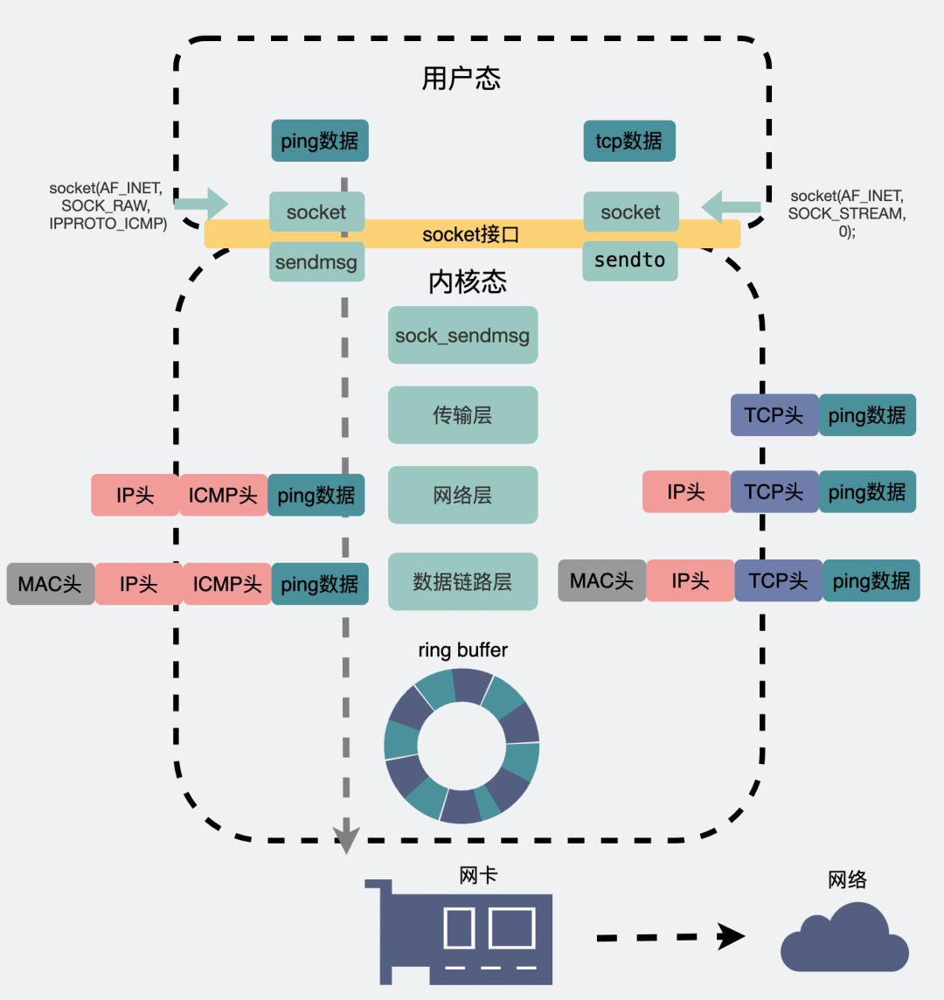

**TCP**

在 TCP 传输中，socket创建的方式是  `socket(AF_INET, SOCK_STREAM, 0);`，其中 `AF_INET` 表示将使用 IPV4 里 **host:port** 的方式去解析待会你输入的网络地址。`SOCK_STREAM` 是指使用面向字节流的 TCP 协议，**工作在传输层**。

创建好了 `socket` 之后，就可以愉快的把要传输的数据写到这个文件里。调用 socket 的`sendto`接口的过程中进程会从**用户态进入到内核态**，最后会调用到 `sock_sendmsg` 方法。

然后进入传输层，带上`TCP`头。网络层带上`IP`头，数据链路层带上 `MAC`头等一系列操作后。进入网卡的**发送队列 ring buffer** ，顺着网卡就发出去了。


**Ping**

`ping` ， 整个过程也基本跟 `TCP` 发数据类似，差异的地方主要在于，创建 `socket` 的时候用的是  `socket(AF_INET,SOCK_RAW,IPPROTO_ICMP)`，`SOCK_RAW` 是原始套接字 ，**工作在网络层**， 所以构建`ICMP`（网络层协议）的数据，是再合适不过了。ping 在进入内核态后最后也是调用的  `sock_sendmsg` 方法，进入到网络层后加上**ICMP和IP头**后，数据链路层加上**MAC头**，也是顺着网卡发出。因此 本质上ping 跟 普通应用发消息 在程序流程上没太大差别


`ping`**命令实际上发送的是一个ICMP的询问报文(类型8)，对方如果回送的数值是0，则证明两者是联通的**


### 2. 127.0.0.1

首先，这是一个 `IPV4`地址

127开头的都属于**回环地址**，是`IPV4`规定的特殊地址，127.0.0.1是众多回环地址中的一个

127.0.0.1 回环地址对应的 IPV6 地址是 `::1`

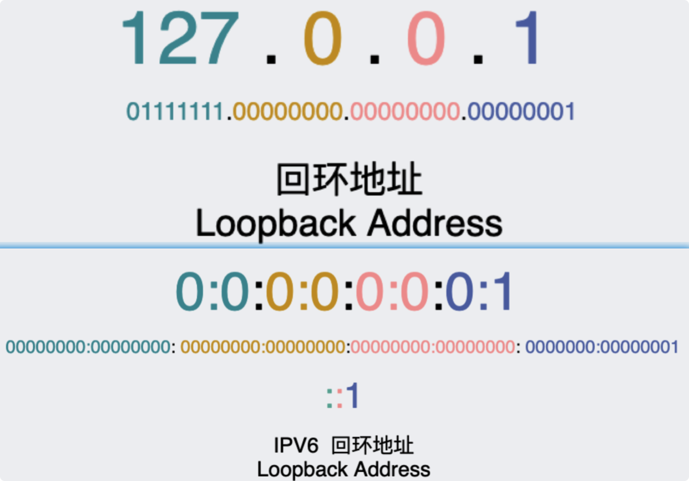

> 在IPV4下用的是 **ping 127.0.0.1** 命令。在IPV6下用的是 **ping6  ::1** 命令


#### 为什么断网还能ping通127.0.0.1 

ping最后是通过**网卡**将数据发送出去，断网的时候，网卡已经不工作了，ping回环地址却一切正常

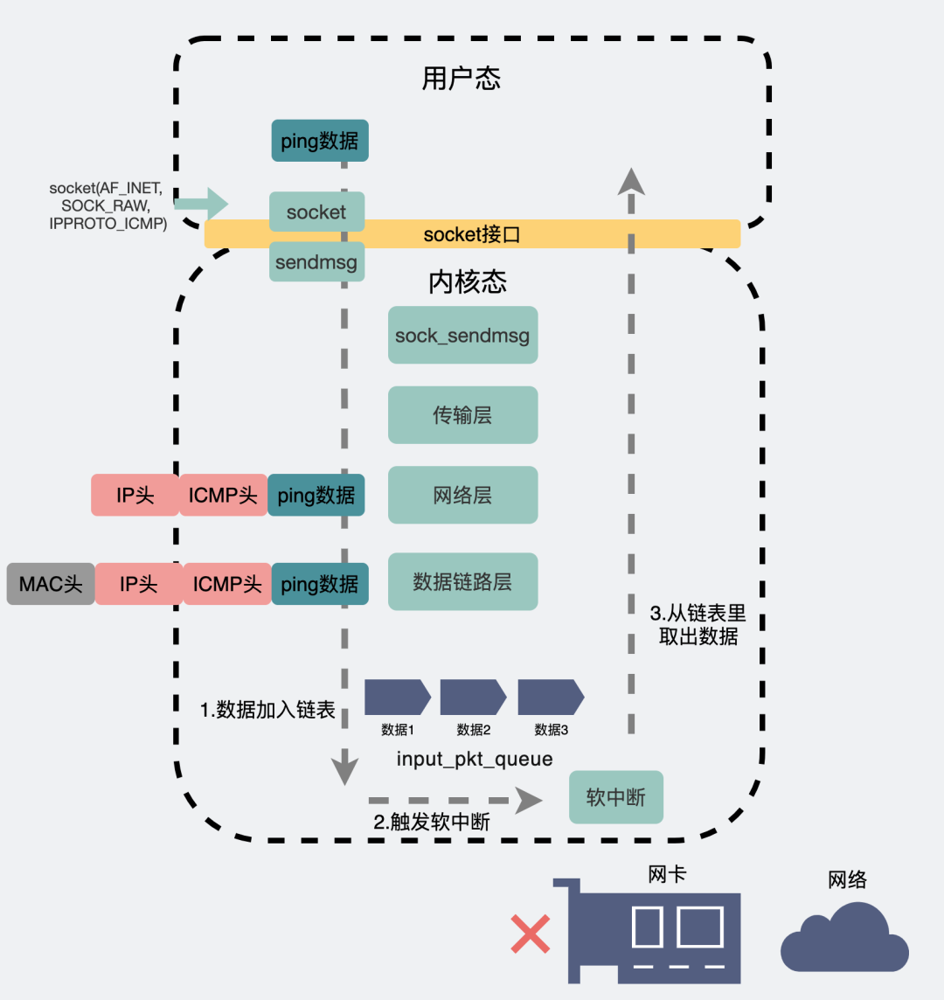

从应用层到传输层再到网络层。这段路径跟ping外网的时候是几乎是一样的。到了网络层，系统会根据目的IP，在路由表中获取对应的**路由信息**，而这其中就包含选择**哪个网卡**把消息发出。

当发现**目标IP是外网IP**时，会从"真网卡"发出。

当发现**目标IP是回环地址**时，就会选择**本地网卡**。**使用回环地址时，数据包会被主机的IP层获取，而不经过链路层，也不会流向网网络。**

本地网卡，其实就是个**"假网卡"**，它不像"真网卡"那样有个`ring buffer`什么的，"假网卡"会把数据推到一个叫 `input_pkt_queue` 的 **链表** 中。这个链表，其实是所有网卡共享的，上面挂着发给本机的各种消息。消息被发送到这个链表后，会再触发一个**软中断**。

专门处理软中断的工具人**"ksoftirqd"** （这是个**内核线程**），它在收到软中断后就会立马去链表里把消息取出，然后顺着数据链路层、网络层等层层往上传递最后给到应用程序。

ping 回环地址和**通过TCP等各种协议发送数据到回环地址**都是走这条路径。整条路径从发到收，都没有经过"真网卡"。**之所以127.0.0.1叫本地回环地址，可以理解为，消息发出到这个地址上的话，就不会出网络，在本机打个转就又回来了。**所以断网，依然能 `ping` 通 `127.0.0.1`。

```c
$ ifconfig
lo0: flags=8049<UP,LOOPBACK,RUNNING,MULTICAST> mtu 16384
    inet 127.0.0.1 netmask 0xff000000
	  inet6 ::1 prefixlen 128
    ...
en0: flags=8863<UP,BROADCAST,SMART,RUNNING,SIMPLEX,MULTICAST> mtu 1500
    inet 192.168.31.6 netmask 0xffffff00 broadcast 192.168.31.255
    ...
```

这里的 `lo0`就是本地回环接口对应的地址，127.0.0.1

`eth0`表示本地第一块网卡，对应的IP地址是192.168.31.6，叫本机IP

#### ping回环地址和本机地址

除了回环地址，还有个本机的IP地址，ping本机IP是否会通过"真网卡"发出到路由又发回来呢？

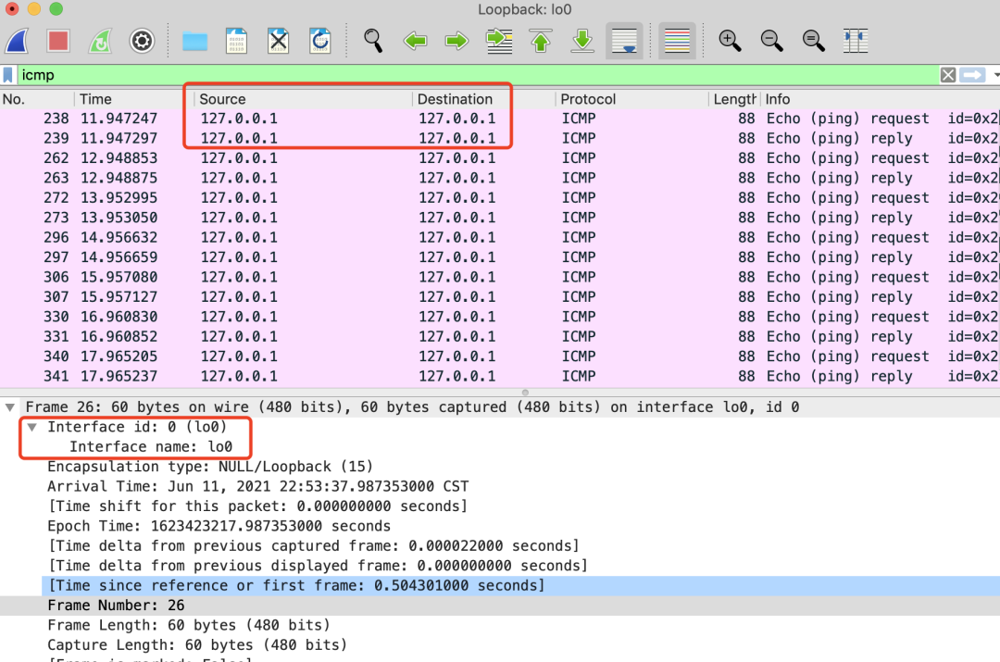

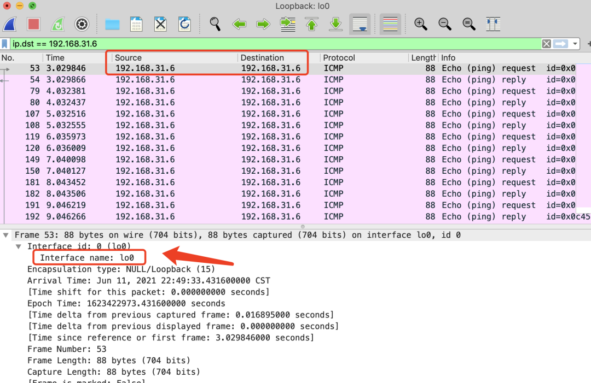

可以看到 ping 本机IP 跟 ping 回环地址一样，相关的网络数据，都是走的  **lo0**，本地回环接口，也就是前面提到的**"假网卡"**。

只要走了本地回环接口，那数据都不会发送到网络中，在本机网络协议栈中兜一圈，就发回来了。因此 **ping回环地址和ping本机地址没有区别**


### 3. 127.0.0.1 和 localhost 及 0.0.0.0

`localhost`不是IP，它其实是一个域名，只不过会默认解析为`127.0.0.1`，可以在 `etc/hosts` 文件下进行修改

所以默认情况下，使用localhost和使用127.0.0.1没有区别

```c
$ cat /etc/hosts
##
# Host Database
#
# localhost is used to configure the loopback interface
# when the system is booting.  Do not change this entry.
##
127.0.0.1	localhost
255.255.255.255	broadcasthost
::1             localhost
```


执行 ping 0.0.0.0 是会失败的，因为 它在 `IPV4`中表示的是**无效的目标地址**，

```c
$ ping 0.0.0.0
PING 0.0.0.0 (0.0.0.0): 56 data bytes
ping: sendto: No route to host
ping: sendto: No route to host
```

但它还是很有用的，我们启动服务器的时候，一般会listen一个ip和端口，等待客户端连接，当我们listen的是 `0.0.0.0`，就表示**本机上的所有IPV4地址**

例如，上面的 127.0.0.1 和 192.168.31.6，都是本机的IPV4地址，如果监听 0.0.0.0，那么上面两个地址都可以访问到这个服务器


## 6.5 Web页面请求过程

### 1. URL解析
首先判断输入是否是合法的URL，如果合法，判断对应协议，如果不合法，浏览器使用搜索引擎搜索关键字

### 2. 查询缓存
查询浏览器中是否有对应网页的缓存(Expires或Cache-Control未过期)，如果或有缓存且未过期则直接使用缓存文件

### 3. DNS查询获取IP
通过DNS获取URL对应的IP地址
首先查看**浏览器和操作系统中是否有对应缓存**，如果没有就需要向本地DNS发起请求
本地DNS缓存也不能直接将域名转换为IP地址，就需要进行迭代查询


### 4. 建立TCP连接

三次握手，建立连接

### 5. 发送HTTP请求
用已经建立的TCP连接把HTTP请求报文发送给客户端
如果是HTTPS，还需要经过SSL/TLS层加密

### 6. 获取HTTP响应结果
服务器返回HTTP响应报文
如果是HTTPS，还需要先用密钥解密
### 7. 浏览器解析渲染页面


---
# 7. HTTP协议  
HTTP，超文本传输协议，英文全称是Hypertext Transfer Protocol，它是互联网上应用最为广泛的一种网络协议。HTTP是一种应用层协议，它是基于TCP协议之上的请求/响应式的协议，即一个客户端与服务器建立连接后，向服务器发送一个请求；服务器接到请求后，给予相应的响应信息。HTTP协议默认的端口号为80    

HTTP协议定义了客户端和服务端通讯的数据格式          

- DNS : 负责解析域名，将域名和IP地址相互映射为一个分布式数据库，查询数据库将域名解析为主机的IP地址      
- HTTP ： 产生请求报文数据      
- TCP协议 : 分割 HTTP 数据，保证数据的准确运输
- IP协议 ： 传输数据包，找到通信的目的地址。IP地址可能会变换，可以使用ARP协议将IP地址反映射为MAC地址

## 7.1 HTTP 简介
### 7.1.1 告知服务器请求的意图
POST、GET、Input、Delete、OPTIONS等方法，告知服务器该客户端想进行的操作

GET：命令服务器返回指定资源

HEAD：与GET类似，但只返回响应头

POST：命令服务器将保温中的数据传递给URI指定的资源

PUT：命令服务器将报文主体中的数据设置为URI指定的资源，如果该位置已有数据，会进行覆盖

DELETE：删除指定资源

TRACE：命令服务器返回请求本身，通过这个方法，客户端可以知道介于它和服务器之间的其他服务器是如何处理请求的

OPTIONS：命令服务器返回它支持的HTTP方法列表

CONNECT：命令服务器与客户端简历一个网络连接，常用语设置SSL隧道以开启HTTPS功能

PATCH：命令服务器使用报文主体中的数据对URI指定的资源进行修改

**HTML不支持GET和POST意外的其他HTTP方法**，h5曾支持过PUT和DELETE，后又删除了，但用户可以用过`XMLHttpRequest(XHR)`来获得对PUT和DELETE的支持


#### get和post的区别

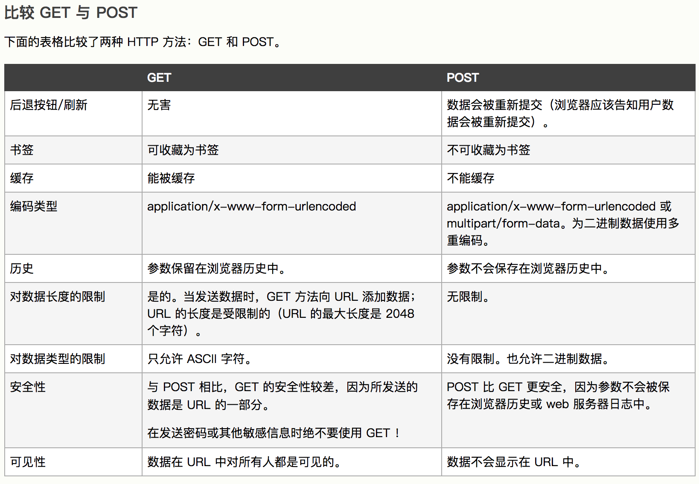


**安全的请求方法：**

如果一个HTTP方法只要求服务器提供信息，而不会对服务器的状态进行任何修改，那这个方法就是安全的。例如：`GET`, `HEAD`, `OPTIONS`, `TRACE`

相反的，`POST`, `PUT`, `DELETE`都能对服务器状态进行修改，因此是不安全的


**幂等的请求方法：**

如果一个HTTP方法在使用相同数据进行第二次调用的时候，不会对服务器的状态造成任何改变，这个方法就是`幂等的(idempotent)`，所以所有安全的方法都是幂等的，PUT和DELETE虽然是不安全的，但是却是幂等的，因为他们第二次调用的时候不会改变服务器的状态。（第二次PUT重复PUT，第二次DELETE会返回错误），而重复的POST是否改变服务器状态是根据服务器具体的实现来决定的，因此**POST是不安全的不幂等的**

POST相当于添加/创建数据，PUT相当于更新数据（提交的是一整个更新后的实体，所以幂等）


### 7.1.2 无状态协议，cookie和session

首先说有状态的协议：有状态的协议要求双方通信前进行握手，进行身份验证，然后交换数据，退出。通信双方必须要时刻记住当前连接的状态，不同状态下能接受的命令是不同的！

HTTP的每个请求都是完全独立的，每个请求包含了处理这个请求所需要的完整数据，发送请求不设计状态变更，**HTTP协议不会对通信状态进行保存**，即使是HTTP1.1同一个连接可以传输多个HTTP请求的情况下，某个请求出错了也不会影响后面的请求，这种就是无状态的协议。

简单说：第二次请求的时候，服务端无法识别这个客户端是否请求过


**优点**：无状态协议的结构比有状态的协议更加简单，实现也更简单，不需要使用状态机。

**缺点**：无状态协议要求单个请求需要的所有信息都要包含在请求中，一次性的发送到服务端，这就导致单个消息的结构比较复杂，必须能够支持大量的数据，因此HTTP消息的解析要复杂得多。而且会有很多重复传输的元数据，降低协议的效率

> 有状态：
> A：你今天中午吃的啥？
> B：吃的大盘鸡。
> A：味道怎么样呀？
> B：还不错，挺好吃的。
>
> 无状态：
> A：你今天中午吃的啥？
> B：吃的大盘鸡。
> A：味道怎么样呀？
> B：？？？啊？啥？啥味道怎么样？
>
> 所以需要cookie这种东西：
> A：你今天中午吃的啥？
> B：吃的大盘鸡。
> A：你今天中午吃的大盘鸡味道怎么样呀？
> B：还不错，挺好吃的。

服务器想知道访问的客户端是哪一个，就给客户端一个`Cookie`，客户端保存到硬盘，之后每次访问服务器的时候，浏览器自动把客户端的Cookie传过去，服务端就知道两次请求是否是同一个客户端发出的。如用来保持用户的登录状态，Cookie使得基于无状态的HTTP协议记录稳定的状态信息成为了可能

而Cookie最大只能保存4KB的数据，于是就有了Session，服务器保存了客户端的Session，Cookie用于保存SessionID。这样就把HTTP协议改造成了有状态的协议        

使用Cookie和Session的HTTP可以认为是有状态的


Cookie：

- Cookie存储在客户端，如果未设置有效期则存在内存中，设置了有效期就存储在硬盘中，不够安全。

- 如果不设置有效期，则生命周期为一次会话（会话Cookie），浏览器窗口关闭，cookie就消失
- Cookie不能跨浏览器，新开的窗口会重新创建新的Cookie
- 有最大大小限制：4KB


Session：

- Session的创建是第一次访问服务器时创建
- Session存放在服务器上
- 默认有效期是30min，也可以手动配置


网站访问量很大，每个客户端的Session都要保存一个较长的时间，造成巨大的内存消耗，甚至**Session存不下**，怎么解决？

1. **使用cookie**：这种访问量很大的网站，设计之初的原则就应该是尽量减少session的使用，能不用session就不用session，优先使用cookie（包括加密cookie）来解决

2. **修改Nginx的负载均衡策略**：使用请求者的IP做Hash，这样相同的用户就可以分到相同的机器上，彼此服务器只存访问自己的客户端的session，不需要服务器彼此之间传递session。还可以根据userID，loginID等等来做hash，方便水平扩展。这种方式的缺点是服务端重启，内存的session会消失，这部分用户会重新登录。另外加减服务器实例的时候会导致一部分用户hash到不同的机器（即使使用一致性hash也存在这个问题）
3. **集中存储Session**：使用Redis存储session，为了防止redis压力过高，还可以做集群扩展，根据key来进行路由


**HTTP1.1支持keep-alive了，还是无状态的嘛？**

答案是是的。虽然HTTP 1.1为了效率，支持了keep-alive，但是这个keep-alive是有时间限制的。这个时间可以通过设置HTTP进程的配置文件来修改，这个时间很短，是以秒来计算的，例如10秒。因此在这10秒内的HTTP请求是使用同一个TCP连接，但是10秒后又重新进行连接。这个时间可以被认为是无状态的。例如用户刚登录，不可能10s内的HTTP请求无需密码来验证，首先这个时间很短，并且还得记录每次HTTP请求的时间是否在10秒内，这样记录的方式和Session又有什么区别。


### 7.1.3 持久连接(短链接/长连接)        
浏览器访问一个包含多张图片的html页面，除了请求html页面资源，还要请求图片资源，如果每次http通信都要建立tcp连接，开销就会很大。长连接允许以此tcp连接进行多次http通信

HTTP1.0 默认**短连接**，每一次进行HTTP通信就会断开一次连接，一个网页往往有多个HTTP请求，**需要多次TCP连接**，浪费资源。`Connection:close`          
HTTP1.1 默认是**长连接/持久连接**，一次HTTP连接能够处理多个请求。`Connection:Keep-Alive`

**虽然支持了 长连接，HTTP依然是无状态的**，因为长连接的时间很短，例如10秒，10秒内的HTTP请求是使用同一个TCP连接，但是10秒后有重新进行连接。这个时间可以被认为是无状态的


## 7.2 HTTP报文
### 7.2.1 Request 请求报文
在请求中，HTTP报文由方法、URL、HTTP版本、HTTP首部字段等组成         
<center>


</center>

- **请求行：** 描述客户端的**请求方式(GET,POST,HEAD)、请求的资源名称**，以及使用的**HTTP协议版本号**
- **首部字段：** 描述客户端请求**哪台主机**，以及客户端的一些环境信息等     
- **空行：** 最后一个请求头之后是一个空行，发送回车符和换行符，通知服务器以下不再有请求头    
- **请求数据：** 请求数据不在GET方法中使用，而是在POST方法中使用。POST方法适用于需要客户填写表单的场合。与请求数据相关的最常使用的请求头是Content-Type和Content-Length

**请求方式**
- **GET：** 最常见，当客户端要从服务器中读取文档时，当点击网页上的链接或者通过在浏览器的地址栏输入网址来浏览网页的，使用的都是GET方式，使用GET方法时，**请求参数和对应的值附加在URL后面(在请求行中)**，利用一个问号（"?"）代表URL的结尾与请求参数的开始，传递参数长度受限制，一般不超过1024个字符，**不适合传输隐私数据或者数据量比较大的数据**      
- **POST：** 对于GET不适合的情况，可以使用POST方式，**POST方法将请求参数封装在HTTP请求体中，以名称/值的形式出现**，可以传输大量数据，这样POST方式对传送的数据大小没有限制，而且也不会显示在URL中，POST方式大多用于页面表单中   
- **HEAD：** HEAD就像GET，只不过服务端接受到HEAD请求后只返回响应头，而不会发送响应内容。当我们只需要查看某个页面的状态的时候，使用HEAD是非常高效的，因为在传输的过程中省去了页面内容     
- **DELETE, PUT,  TRACE**


**请求头：**            
请求头部由字段/值对组成，每行一对，关键字和值用英文冒号“:”分隔。请求头部通知服务器有关于客户端请求的信息        

- **Content-Type：** 请求的与实体对应的MIME信息
- **User-Agent：** 产生请求的浏览器类型           
- **Accept：** 客户端可识别的内容类型列表（如：Accept: text/html,image/*    【浏览器告诉服务器，它支持的数据类型】）     
- **Host：** **请求的主机名，允许多个域名同处一个IP地址，即虚拟主机**    
- **Cookie：** 浏览器告诉服务器，带来的Cookie


**请求体：**

请求体就是我们发送的body，一堆key value对，现在一般使用 `json`


### 7.2.2 Response 响应报文


- HTTP响应也由三个部分组成，分别是：状态行、消息报头、响应正文  
- 在响应中唯一真正的区别在于第一行中用**状态信息**代替了请求信息。状态行（status line）通过提供一个状态码来说明所请求的资源情况 

#### 1 状态行            
状态行格式：HTTP-Version Status-Code Reason-Phrase CRLF             
HTTP-Version表示服务器HTTP协议的版本；Status-Code表示服务器发回的响应状态代码；Reason-Phrase表示状态代码的文本描述。状态代码由三位数字组成，第一个数字定义了响应的类别，且有五种可能取值。

**响应状态码**    

- 1xx：**请求正在被处理**--表示请求已接收客户端消息，但没有接收完成，需要继续处理(客户端继续发送等)
  - `100 Continue` 请求已经接受，客户端应当继续发送请求的其余部分
  - 101 Switching Protocols，服务器将遵从客户端的请求转换到另一种协议


- 2xx：**请求处理成功**--表示请求已被成功接收、理解、接受
  - `200 OK` 正常处理，有时候服务器内部错误也会返回200，通过响应体约定的code表示，在msg中说明错误原因        
  - 202 Accepted，已经接收请求，但处理尚未完成
  - `204 No Content`, 成功处理，但服务器没有新数据返回，一般用作正式请求的预请求        
  - `206 Partial Content`，对服务器进行范围请求（Range），只返回范围内的这部分数据


- 3xx：**需要附加操作**--要完成请求必须进行更进一步的操作
  
  - 300 Multiple Choices，客户端的请求可以在多个位置找到，这些位置都在响应体中列出，如果服务器提出了优先选择，则应该在Location应答头指明
    
  - `301 Moved Permanently 永久重定向`，请求的资源已分配了新的URI，原URL地址改变了，以后应使用新的URL访问，常用作域名跳转，这种情况的响应头的Location字段一般会返回新的地址                
  
  - `302 Found 临时重定向`，请求的资源临时分配了新的URI中，原URL地址没变，常用作临时跳转如未登录访问用户中心跳转登录页  

    > 301与302：用户都可以看到url替换为了一个新的，都根据服务器返回的location进行二次请求，但是301是可以缓存的，在抓取新的内容的同时也将旧的网址替换为了重定向之后的网址，但是302是暂时的，抓取新内容也保留旧的地址        
  
  - `303 See Other`，与302很像，但是除了返回Location外，还会要求访问Location时采用GET请求方式 
  
    > 实际的浏览器在处理301和302时，默认就会把原先的POST请求改为GET请求，所以实际上使用303的意义，单纯只是让语义化更清晰点。303表示服务器**明确告诉**客户端，你要使用GET方法访问location，如果是302，就是仅仅告诉客户端要访问location,不限制方法，但是实际上客户端自己也会用`GET`
  
  - `304 Not Modified`，访问的是未更改(未过期)的本地缓存资源        
  
  - `307 Temporary Redirect`，与302类似，但不会把POST请求变成GET。由于浏览器默认会采用GET方式去请求重定向的location，而若是307，则严格限制了**不允许从post转变为get**      


- 4xx：**客户端错误**--请求有语法错误或请求无法实现
  - `400 Bad Request` 请求报文语法错误了      
  - `401 Unauthorized` 请求未经授权，需要认证身份。一般用户登录之后会获得一个身份认证信息，放在请求头的Authorization字段中发给服务端，如果没有发送该字段或者字段有误，就会返回401        
  - `403 Forbidden` 服务器收到，但是拒绝提供服务，客户端没有权限访问           
  - `404 Not Found` 请求的资源不存在    
  - `405 Method not allowed` 请求方式(GET,POST,HEAD,DELETE,PUT等)对指定的资源不适用 


- 5xx：**服务器端错误**--服务器未能实现合法的请求        
  
  - `500 Internal Server Error` 服务器内部出错
  - `502 Bad GateWay` 代理或者网关服务器尝试执行请求时，从上游服务器接收到了无效的响应
  
  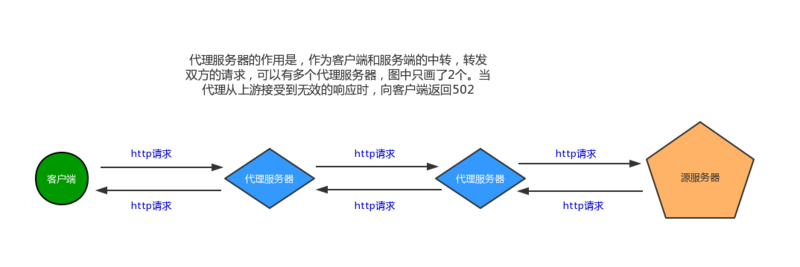
  
  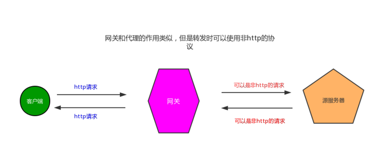
  
  - `503 Service Unavailable` 服务器正忙，不能处理客户请求，可能是维护或者升级，一段时间后恢复服务
  - `504 Gateway Timeout` 作为网关或者代理工作的服务器访问超时
  - `505  HTTP Version Not Supported`，服务器不支持请求指明的HTTP版本

~~~http
HTTP/1.1 200 OK
Date: Sat, 31 Dec 2005 23:59:59 GMT
Content-Type: text/html;charset=ISO-8859-1
Content-Length: 122

<html>
<head>
<title>Wrox Homepage</title>
</head>
<body>
<!-- body goes here -->
</body>
</html>
~~~

#### 2 响应头   
- 请求头格式：`头部字段：值`  
- **Content-Type**: text/html;charset=utf-8 ： content-type 服务器告诉客户端本次响应体数据格式以及编码格式
- **Content-disposition**: in-line ： 服务器告诉客户端以什么格式打开响应体数据(in-line默认值表示在当前页面打开，**attachment表示以附件形式打开响应体如文件下载**时)         
- **location**： 重定向时，指明重定向的资源路径     

#### 3 响应空行   

#### 4 响应体      
- 传输的数据   


## 7.3 各个版本Http的情况
Http0.9（1991） → Http1.0（1996） → Http1.1（1997） → Http2.0（2015） → Http3.0（2018）

### 7.3.1 Http 0.9
只支持GET方式的请求，因此客户端向服务端发送的数据信息非常有限       
不支持请求头header，服务端只能返回HTML字符串
响应即关闭：服务端响应之后就关闭TCP连接

### 7.3.2 Http 1.0
**请求方式**：新增POST，DELETE，PUT，HEADER等，提高了发送信息的量级
**添加请求头和响应头**：添加各种header信息
**扩展了传输内容**：图片，音视频，二进制
**链接复用性差**：一个TCP链接只能发送一次Http请求，建立连接成本高，基于拥塞控制开始时发送数据慢
**无状态无连接的弊端**：每次请求都要建立tcp连接，不能复用，相应到达之后才能发送下一次请求

### 7.3.3 Http 1.1

Http1.1最大的变化就是**长连接和流水线**


**增加长连接**：keep-alive，一个TCP连接可以进行多次Http请求，但是**Service端只有处理完一个回应才进行下一个回应**，要是前面回应慢，后面就会有许多请求排着队等着，存在`队头阻塞问题`

**流水线**：支持**流水线**（pipeline）网络传输，**只要第一个请求发出去了，不必等其返回，就可以发第二个请求出去**，可以减少整体的响应时间。

**更多的请求方式**：PUT、PATCH、OPTIONS等

**host字段**：（域名）在HTTP1.0中认为每台服务器都绑定一个唯一的IP地址，因此，请求消息中的URL并没有传递主机名（hostname）。但随着虚拟主机技术的发展，在一台物理服务器上可以存在多个虚拟主机（Multi-homed Web Servers），并且它们共享一个IP地址，也就是说一个ip地址会有多个域名host。HTTP1.1的请求消息和响应消息都应支持Host头域，且请求消息中如果没有Host头域会报告一个错误（400 Bad Request）。

### 7.3.4 Http 2.0

Http2.0最大的变化是：**二进制格式，头部压缩，解决队头阻塞的问题**

Http1.1提出了流水线理论，但是仅限于理论阶段，功能默认是关闭了的（因为在数据量较大或者速度较慢的响应会阻碍排在它后面的请求，而且很多软硬件不能很好的支持流水线，所以一直没有得到实施）


**二进制格式**：全面采用二进制格式，分帧进行传输，，头信息帧和数据帧。。虽然降低了可读性，但是对计算机更友好，直接解析二进制报文，无需再将明文报文转成二进制

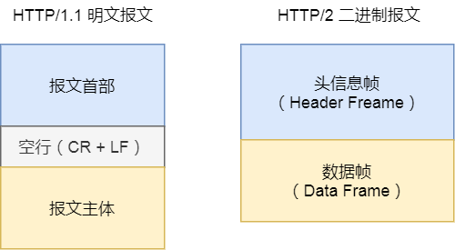

**多路复用**：解决队头阻塞问题。即连接共享，TCP连接建立之后，后续的request以stream流的方式进行发送，每一个stream流包含了多个frame（二进制帧），客户端和服务器可以把HTTP消息分解成互不依赖的帧，然后乱序发送，最后再在另一端进行重新组合。

- 一个连接里包含了多个帧，可能属于不同的request或者response，**一个request对应一个唯一的id，这样一个连接上可以有多个request**，各个request可以随机的混杂在一起，接收方可以根据request的 id将request包再归属到各自不同的服务端请求里面。从而实现TCP链路的多路复用
- 

**头部压缩**：压缩算法对头部进行压缩，减少了请求的大小，提高效率。HTTP2.0可以维护一个字典，差量更新HTTP头部，大大降低因头部传输产生的流量。。也就是同时发送多个请求，投不是相似的，协议会消除重复部分

**服务端推送**：对客户端的一个请求，发送多个响应。可以推送额外的资源，无需客户端明确的接收也可以推送

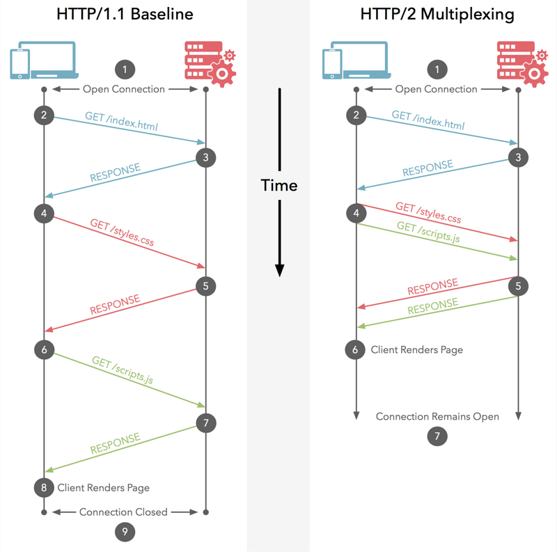


### 7.3.5 QUIC协议和Http 3.0

HTTP2.0的多个HTTP请求复用一个TCP连接，下层的TCP协议不知道有多少个HTTP请求，一旦丢包就会触发TCP重传，这样一个TCP连接里所有的HTTP请求都必须等待这个丢了的包的重传

此外TCP建立连接太慢！谷歌基于UDP开发了新一代Http协议

UDP无连接，没有建立连接和关闭连接的成本，UDP数据包没有队头阻塞问题，改造成本小

**队头阻塞问题的解决**：一个数据包影响了一堆数据包。。源头是TCP协议。Http2.0的多路复用只解决了Http的队头阻塞，没有解决TCP的队头阻塞问题。QUIC是基于UDP的，多个数据流之间互不影响，当一个数据流出现丢包影响的范围非常小，从而解决了队头阻塞的问题

**ORTT建链**：衡量网络建链的畅通指标是RTT(数据包一个来回的时间)，包括三个部分：**往返传播时延、链路中网络设备排队时间、应用程序处理时间**，HTTPS需要TCP握手和TLS握手，至少需要2-3个RTT。**QUIC协议可以实现第一个包就包含有效的应用数据**（对于第一次交互的B和S不可以，非首次连接可以）


**连接迁移**：TCP使用`五元组（IP:PORT,IP:PORT,传输层协议）`唯一标识连接，从4G网络切换wifi时要重新建立TCP连接。而**QUIC使用64位随机数作为连接ID**，wifi和4g的切换、不同基站之间的切换都不会重连

**可靠传输、流量控制、拥塞控制**迁移到了用户态来实现

UDP 是不可靠传输的，但基于 UDP 的 **QUIC 协议** 可以实现类似 TCP 的可靠性传输。

- QUIC 有自己的一套机制可以保证传输的可靠性的。当某个流发生丢包时，只会阻塞这个流，**其他流不会受到影响**。
- TLS3 升级成了最新的 `1.3` 版本，头部压缩算法也升级成了 `QPack`。
- HTTPS 要建立一个连接，要花费 6 次交互，先是建立三次握手，然后是 `TLS/1.3` 的三次握手。QUIC 直接把以往的 TCP 和 `TLS/1.3` 的 6 次交互**合并成了 3 次，减少了交互次数**。

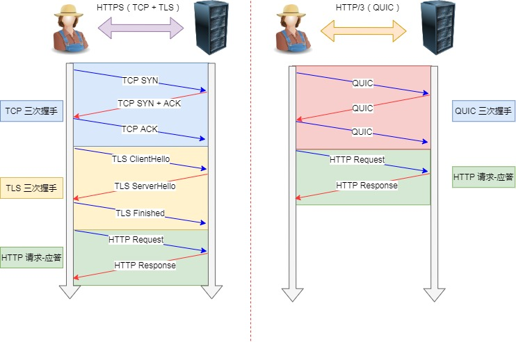

所以， QUIC 是一个在 UDP 之上的**伪**TCP + TLS + HTTP/2 的多路复用的协议。

QUIC 是新协议，对于很多网络设备，根本不知道什么是 QUIC，只会当做 UDP，这样会出现新的问题。所以 HTTP/3 现在普及的进度非常的缓慢，不知道未来 UDP 是否能够逆袭 TCP。


## 7.10 HTTPS
HTTP存在安全问题：
- 使用明文进行通信，内容可能被窃听
- 不验证通信方的身份，身份可能遭遇伪装
- 无法证明报文的完整性，报文可能被篡改

HTTPS并不是新的协议，而是**先让HTTP和SSL(Secure Sockets Layer)通信，再由SSL和TCP通信**。

**SSL只是加强后的TCP**，而不是一种新的传输层协议，这种加强是在应用层完成的。SSL有它自己的套接字API，**应用程序首先向`SSL套接字`传递明文数据**，然后**SSL加密数据后传递给`TCP套接字`**。加密后数据经因特网传递到接收进程的TCP套接字，然后传递给SSL套接字进行解密，之后传递给接收进程

也就是说HTTPS使用了隧道进行通信。通过使用SSL，HTTPS具有了加密(防窃听)、认证(防伪装)、完整性保护(防篡改)


Https使用443端口，而Http使用80端口。。

443端口不能修改

1. 浏览器发现是https请求，则直接向`443端口`发送请求，所以不能修改，改了之后浏览器不知道向哪个端口发送请求

2. 验证通过之后浏览器最终还是向`80端口`获取http数据

### 7.10.1 加密(防窃听)

**加密方式**：混合加密(对称加密+非对称加密)
对称加密的方式，加密解密使用同一个密钥，运算快，但无法安全地将密钥传输给对方。如AES、DES

非对称加密的方式，加密解密必须使用不同的密钥，运算慢，但是安全。如RSA、DSA

对称加密一般使用**简单的位运算**，而非对称加密一般比较复杂，涉及**大数乘法、大数取模**等运算

1. 服务器首先将自己的非对称加密的公钥传给客户端
2. 客户端使用公钥加密自己的对称加密的`Session key`
3. 服务器使用私钥解密，获得了对称加密的`Session key`
4. 双方可以通过对称加密的方式进行通信了
这时既使用对称加密保证了效率，又使用非对称加密保证了安全

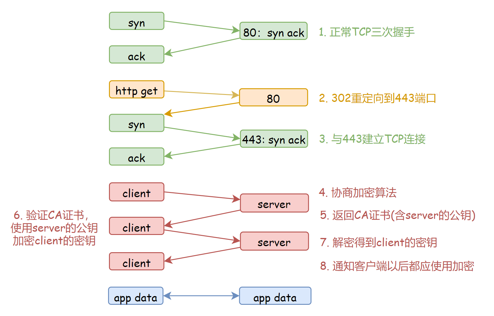


### 7.10.2 认证(防伪装)
通过使用 **证书** 来对通信方进行认证。`数字证书认证机构(CA)`是客户端和服务器双方都可以信赖的第三方机构

服务器的运营人员向 CA 提出公开密钥的申请，CA 在判明提出申请者的身份之后，会对已申请的公开密钥做数字签名，然后分配这个已签名的公开密钥，并将该公开密钥放入公开密钥证书后绑定在一起。

进行 HTTPS 通信时，**服务器会把证书发送给客户端。客户端取得其中的公开密钥之后，先使用数字签名进行验证，如果验证通过，就可以开始通信了**

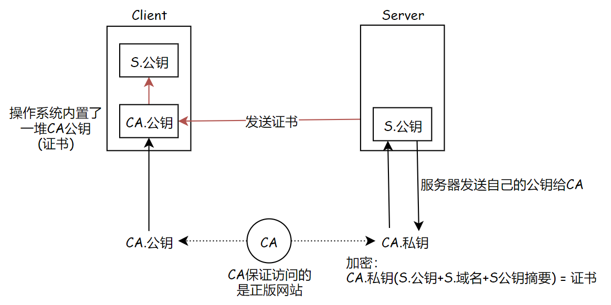


浏览器发起HTTPS请求时，服务器会返回网站的SSL证书，浏览器需要对证书做以下验证：

1. 验证域名、有效期等信息是否正确。证书上都有包含这些信息，比较容易完成验证；
2. 判断证书来源是否合法。每份签发证书都可以根据验证链查找到对应的根证书，操作系统、浏览器会在本地存储权威机构的根证书，利用本地根证书可以对对应机构签发证书完成来源验证；
3. 判断证书是否被篡改。需要与CA服务器进行校验；
4. 判断证书是否已吊销。通过CRL（Certificate Revocation List 证书注销列表）和 OCSP（Online Certificate Status Protocol 在线证书状态协议）实现，其中 OCSP 可用于第3步中以减少与CA服务器的交互，提高验证效率。


### 7.10.3 完整性保护
SHA-2，MD5等

服务器发送：**数据+摘要+算法**。客户端使用相同的算法计算数据，得到的摘要和服务器发送的摘要相同即完整


### 7.10.4 关于公钥私钥加解密

**加密：** 加密是为了不希望别人知道消息，所以只有特定的一个人可以解密。于是采用公钥加密，私钥解密

**签名：** 签名是为了不希望别人冒充，只有自己可以发送这个签名，于是采用私钥加密，公钥解密


### 7.10.5 中间人攻击

HTTPS 使用了 SSL 加密协议，是一种非常安全的机制，目前并没有方法直接对这个协议进行攻击，一般都是在建立 SSL 连接时，拦截客户端的请求，利用中间人获取到 CA证书、非对称加密的公钥、对称加密的密钥；有了这些条件，就可以对请求和响应进行拦截和篡改。


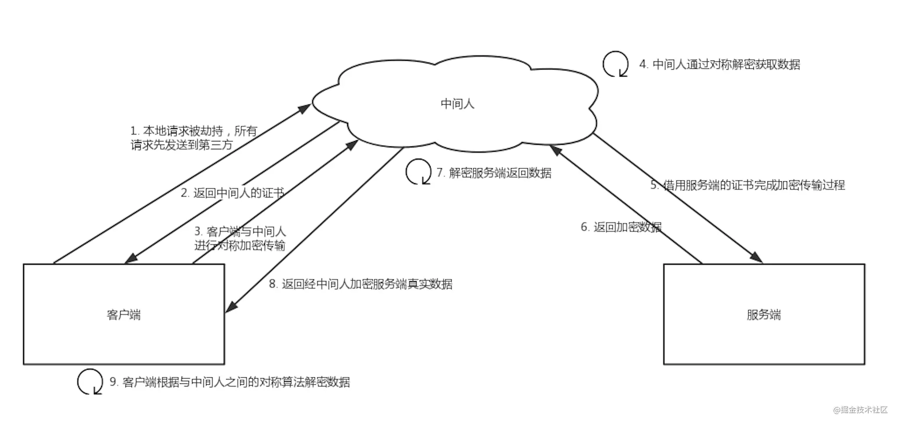

过程原理：

1. 本地请求被劫持（如DNS劫持等），所有请求均发送到中间人的服务器
2. 中间人服务器返回中间人自己的证书
3. 客户端创建随机数，通过中间人证书的公钥对随机数加密后传送给中间人，然后凭随机数构造对称加密对传输内容进行加密传输
4. 中间人因为拥有客户端的随机数，可以通过对称加密算法进行内容解密
5. 中间人以客户端的请求内容再向官方网站发起请求
6. 因为中间人与服务器的通信过程是合法的，官方网站通过建立的安全通道返回加密后的数据
7. 中间人凭借与官方网站建立的对称加密算法对内容进行解密
8. 中间人通过与客户端建立的对称加密算法对官方内容返回的数据进行加密传输
9. 客户端通过与中间人建立的对称加密算法对返回结果数据进行解密


# 8. I/O

要想客户端和服务端能够网络通信，就必须要使用Socket编程，创建Socket的时候，可以指定网络层使用的是IPv4还是IPv6，传输层使用TCP还是UDP

## 8.1 I/O和网络编程

IO过程分为两步：

1. 等待I/O数据准备好. 这取决于IO目标返回数据的速度, 如网络IO时看网速和数据本身的大小
2. 数据从内核缓冲区拷贝到进程内


**阻塞IO和非阻塞IO都是同步调用IO**，因为read调用时，内核将数据从内核空间拷贝到用户空间的过程都是需要等待的，如果拷贝效率不高，read调用就会在这个同步过程中等待比较长的时间

- **阻塞IO：** 用户执行read()，线程会被阻塞，一直到**内核数据准备好，并把数据从内核缓冲区拷贝到应用程序缓冲区**，拷贝完成后read才会返回
- **非阻塞IO：** 非阻塞IO，read请求在数据未准备好的情况下会立即返回，可以继续往下执行，应用程序不断轮询内核，直到数据准备好，这时候**等待内核将数据拷贝到应用程序缓冲区(同步过程，要等待)**，read调用才可以获取到结果并返回


**异步IO：**

内核数据准备好 和 数据从内核态拷贝到用户态 这两个过程都不需要等待，发起`aio_read()`后，立即返回，内核自动将数据准备好后从内核空间拷贝到用户空间，然后通知应用进程处理


对于一个套接字上的输入操作，第一步通常涉及等待数据从网络中到达。当所等待数据到达时，它被复制到内核中的某个缓冲区。第二步就是把数据从内核缓冲区复制到应用进程缓冲区


### socket套接字

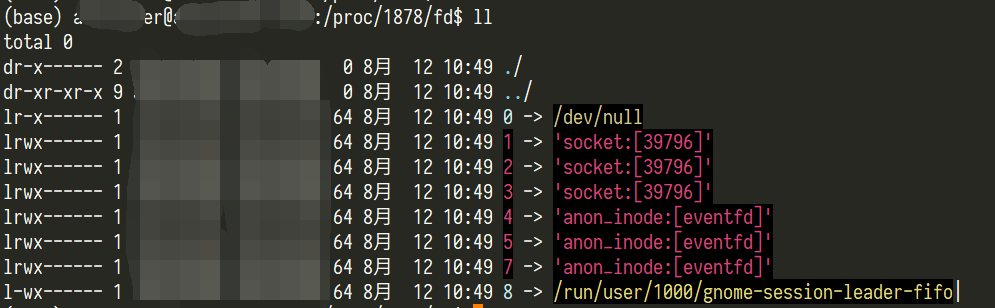

普通文件对应到一个路径

socket文件对应到一个端口

对socket文件的读写操作就相当于是对网络连接的IO操作


**socket还分为监听套接字和普通套接字**：

监听套接字是由`listen()`把socket fd转化而成

监听套接字不走数据流，只管连接的建立。accept将从全连接队列获取一个三次握手完成后的socket

对于连接套接字而言，**可读事件就是全连接队列非空或者连接被关闭**

对于数据类型套接字而言，可读写事件就是 sk buffer 有可读写的数据或者连接被关闭


**vfs 层用的时候给 inode 字段的地址，socket 层的时候给 socket 字段的地址。不同抽象层面对于同一个内存块的理解不同，强制转化类型，然后各自使用**，这样就实现了对socket的文件抽象

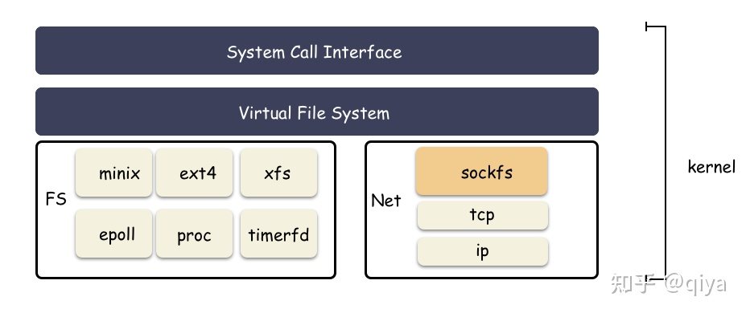


### 8.1.1 BIO和Socket编程

`阻塞式 I/O`：BIO，应用进程被阻塞，直到数据从内核缓冲区复制到应用进程缓冲区后才返回。**由于read阻塞，无法再响应新的连接请求，多个连接的时候只能使用多线程，每个连接使用一个单独的线程**


1. 服务端首先调用`socket()`函数，创建网络协议为IPv4，传输协议为TCP的Socket，接着调用`bind()`函数，给这个socket绑定一个IP地址和端口。绑定之后就可以调用`listen()`函数监听，我们判断一个服务器中的一个网络程序有没有启动就可以通过netstate命令查看对应端口是否有被监听。监听之后调用`accept()`函数，从内核获取客户端的连接，如果没有客户端连接，就会阻塞到客户端的连接到来

2. 客户端在创建好Socket之后，调用`connect()`函数发起连接，指定服务端的IP和端口，开始三次握手
3. 当服务端的TCP全连接队列不空时，服务端的`accept()`函数就会从内核中的TCP全连接队列中拿出一个已经完成连接的Socket返回给应用程序，后续的数据传输都使用这个Socket
4. **注意**：**监听的Socket 和 真正用来数据传输的Socket是两个，一个是监听Socket，一个是已连接Socket**
5. 建立连接后，客户端和服务端就可以开始互传数据了，双方都可以通过`read()`和`write()`函数来读写数据了


**内核Socket情况：**

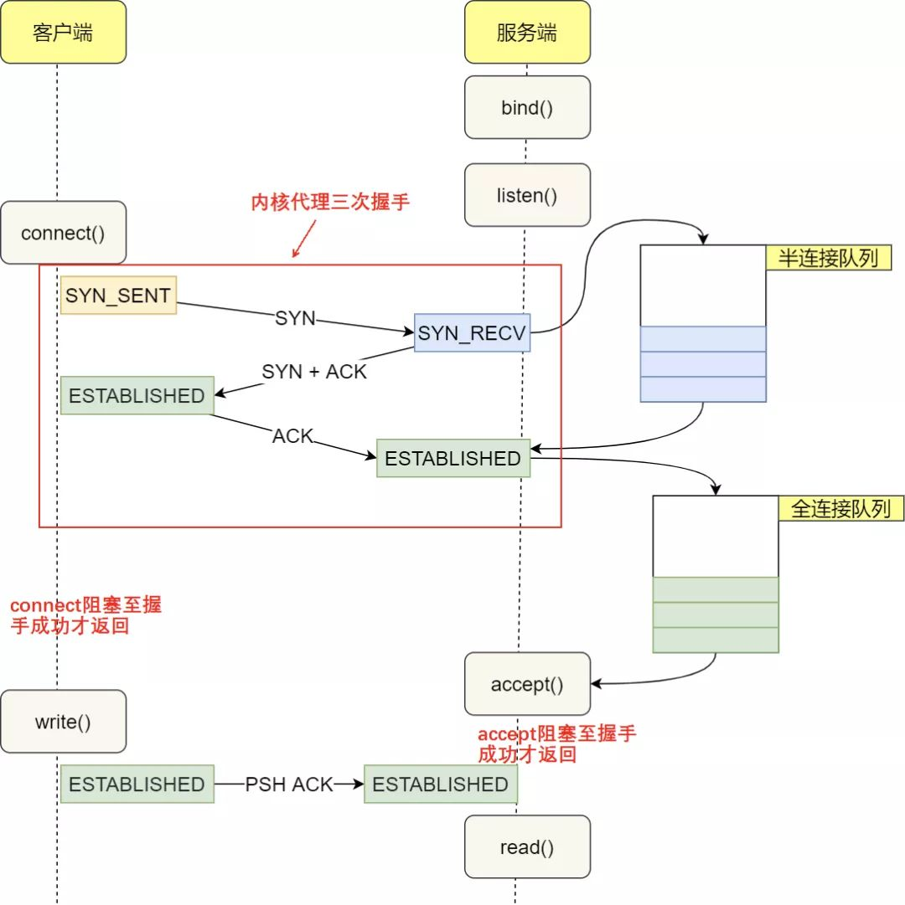

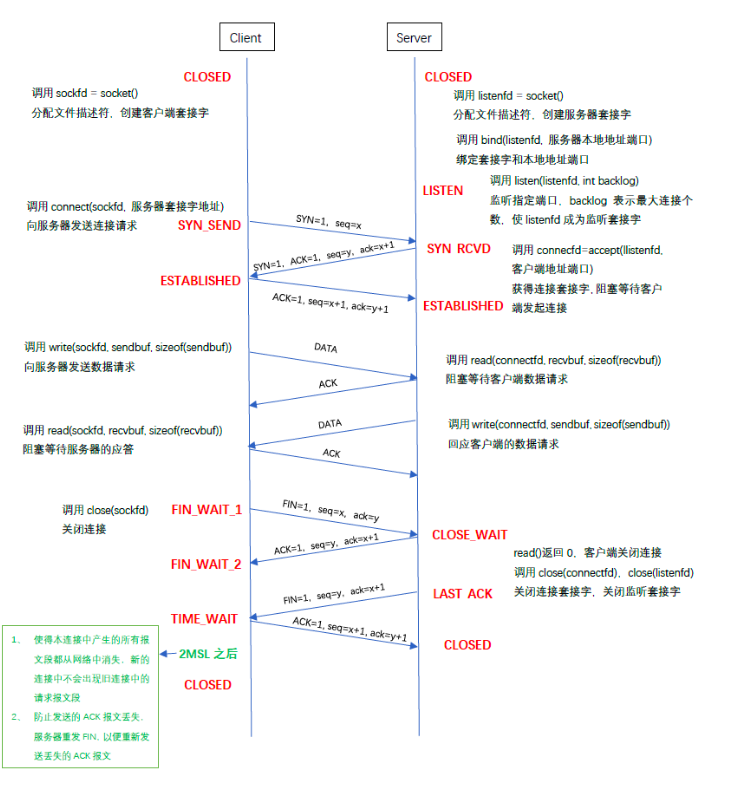

在Linux中，一般情况下都是内核代理三次握手的，也就是说，当client端调用 `connect()` 之后内核负责发送SYN，接收SYN-ACK，发送ACK。然后 connect() 系统调用才会返回，客户端侧握手成功。

而服务端的Linux内核会在收到SYN之后负责回复SYN-ACK再等待ACK之后才会让 `accept()` 返回，从而完成服务端侧握手。于是Linux内核就需要引入`半连接队列`（用于存放收到SYN，但还没收到ACK的连接）和`全连接队列`（用于存放已经完成3次握手，但是应用层代码还没有完成 accept() 的连接）两个概念，用于存放在握手中的连接

**问题的关键是**：如果上层的accept()调用不及时（应用层压力大，在干别的），那么客户端同时来建立连接时，**全连接队列是有可能会满的**。

linux3.10内核，当全连接满了之后，客户端会认为连接成功了，因为客户端的`connect()`函数已经返回了，但服务器却没有连接成功，客户端无法感知，只有等到第一次发送数据才知道对端连接丢失了

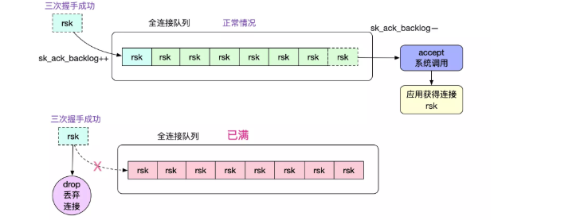

linux4.9版本内核可以避免这种情况，客户端的connect()系统调用不会成功，会一直阻塞

**半连接队列：** 队列大小由`/proc/sys/net/ipv4/tcp_max_syn_backlog` 控制，linux默认1024，当服务器发送SYN_ACK后将会开启一个定时器，如果超时没有收到客户端的ACK，就会重发SYN_ACK，重发次数由`/proc/sys/net/ipv4/tcp_synack_retries`控制，默认5次

**全连接队列：** 全连接队列大小通过`/proc/sys/net/core/somaxconn`指定，使用listen函数时根据传入的`backlog`参数与系统的somaxconn，二者取较小的值


~~~c
// domain参数传入通信域ipv4/ipv6/本地socket  type表示协议TCP/UDP   返回值是创建的套接字的文件描述符，失败则为-1
int socket(int domain, int type, int protocol);

// 检查端口有没有被占用，然后将socket的文件描述符socketfd和ip和端口进行绑定，这样才能使socket监听该地址和端口
int bind(int sockfd, const struct sockaddr *addr, socklen_t addrlen);

// listen针对服务器，listen函数将服务器套接字变成被动监听的状态，等待客户端连接
// ****** backlog 参数设置内核的全连接队列长度******
// listen函数非阻塞的
int listen(int sockfd, int backlog);

// accept函数，从全连接队列的头部取出一个连接，然后在服务器创建一个新的套接字，并返回该套接字的文件描述符
// 如果全连接队列空，就会阻塞住，如果服务器不能及时调用accept，导致全连接队列满了
// addr 也是传出参数，是链接客户端的地址信息：ip 端口
// addrlen 传入调用者缓冲区addr长度避免缓冲区溢出，传出的是客户端地址结构体的实际长度
int accept(int sockfd, struct sockaddr *addr, socklen_t *addrlen);

//  connect参数和bind参数一致，客户端需要调用connect来与服务器建立连接
int connect(int sockfd, const struct socketaddr *addr, socklen_t addrlen);

// 向TCP连接的另一端发送数据，第一个参数是socket的文件描述符，第二个参数是应用程序发送数据缓冲区，第三个参数是实际要发送的字符数，第四个参数一般置0 此时等同于write
// 也可以用write和read，因为套接字本身也是文件描述符，但是write不是专门针对套接字的，会有很多局限性，send可以由额外功能，主要体现在flag参数上，为0和write一样，还可以控制使用非阻塞、不将数据包路由出本地网络、发送数据后关闭套接字发送端等等
int send(socket s,const char* buf,int len,int flags);

// recv和read相似，但是recv可以指定标志来控制如何接收数据，例如可以启动非阻塞接收
ssize_t reccv(int sockfd, void *buf, size_t nbytes, int flags);

// 返回成功为0，出错为-1.
int close(int sockfd);

// 返回成功为0，出错为-1.
int shutdown(int sockfd,int howto); 
~~~


`listen`之后，会将当前socket加入全局的listen hash表，这样就可以在SYN包到来的时候快速找到对应的listen socket了

还可以**使用不同的socket去listen监听同一个端口**，这样可以在内核进行创建连接的负载均衡，性能大大提高

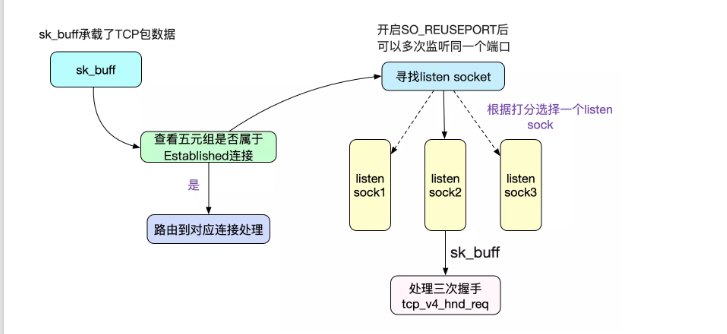


**close与shutdown的区别主要表现在：**

- `close`函数会关闭套接字ID，如果有其他的进程共享着这个套接字，那么它仍然是打开的，这个连接仍然可以用来读和写，并且有时候这是非常重要的 ，特别是对于多进程并发服务器来说。
- 而`shutdown`会切断进程共享的套接字的所有连接，不管这个套接字的引用计数是否为零，那些试图读得进程将会接收到EOF标识，那些试图写的进程将会检测到SIGPIPE信号，同时可利用shutdown的第二个参数选择断连的方式


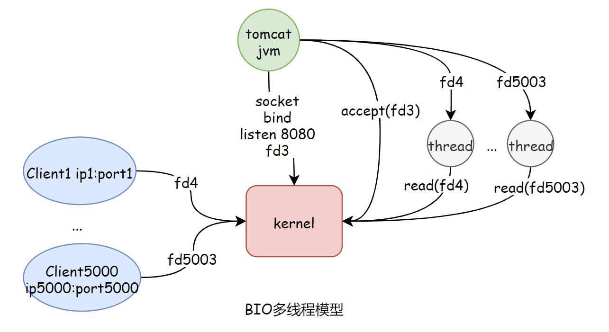


Socket实际上就是文件，有对应的文件描述符

关于文件描述符：每个进程都有一个`task_struct`结构体，结构体中有一个**指向文件描述符数组的成员指针**，该数组中列出了这个进程打开的所有文件描述符，内核可以通过文件描述符找到对应打开的文件。每个文件都有一个inode，**Socket文件的inode指向了内核中的Socket结构**，这个结构体有两个队列，分别是发送队列和接收队列，两个队列都有链表形式的`struck sk_buff`，可以表示各个层的数据包。

- 当接收报文时，从网卡驱动开始，通过协议栈层层网上传送数据报，逐步剥离协议首部
- 当发送报文的时候，创建`sk_buff`，数据缓存区的头部预留足够空间，用来填充各层首部，在经过各下层协议时，逐渐增加协议首部


**多进程模型：**


如果服务器要支持多个客户端，比较传统的方式就是使用多进程模型，为每个客户端分配一个进程来处理请求

服务器的主进程负责监听客户端的连接，一旦与客户端建立连接，`accept()`函数就立马返回一个已连接的Socket，这时就通过`fork()`创建一个子进程（把父进程东西复制一份），根据返回值来区分是父进程还是子进程，返回0就是子进程，返回其他整数就是父进程。因为子进程复制了父进程的文件描述符，于是可以直接使用已连接的Socket和客户端通信了

父进程只负责监听Socket，子进程只负责已连接的Socket

另外，当子进程退出时，实际上内赫里还会保留该进程的一些信息，不做好回收就会变成僵尸进程，耗费系统资源。有两种方式可以在子进程退出后回收资源，分别是调用`wait()`和`waitpid()`函数

但是客户端多的时候依然是扛不住的，进程会占据非常多的系统资源，进程切换代价也很大


**多线程模型：**


当服务端与客户TCP连接建立后，通过`pthread_create()`函数创建线程，然后将已连接的Socket的文件描述符传递给线程函数，接着在线程里和客户端进行通信，从而达到并发处理的目的

当然这里可以使用线程池，避免频繁的创建和销毁线程

需要注意的是，已连接的Socket队列是全局的，**为了避免多线程竞争**，在多线程操作队列的时候要加锁


### 8.1.2 NIO

`非阻塞式 I/O`：NIO，应用进程执行系统调用后，内核返回一个错误码，**应用进程可以继续执行**，但是要**不断执行系统调用获知IO是否完成**，`轮询(polling)`。CPU处理了很多的系统调用，CPU利用率低。**缺点**：每次都要轮询所有连接，而且都要通过系统调用来获知数据是否准备好，系统调用消耗了大量的资源


**非阻塞socket：**

对于阻塞的socket，当socket的接收缓冲区没有数据时，read调用会一直阻塞住直到有数据到来。当socket缓冲区数据量小于期望读取的数据量时，返回实际读取的字节数，当socket缓冲区数据大于期望读取的字节数时，读取期望读取的字节数并返回该数目

对于非阻塞socket，**socket缓冲区中有没有数据，read调用都会立即返回**。接收缓冲区中有数据时与非阻塞情况一致，没有数据则返回错误`EWOULDBLOCK`表示该操作本来应该阻塞，但是由于该socket非阻塞，因此立即返回，这时可以尝试下次接着去读取

非阻塞recv返回值ret：=0表示socket已断开，close掉socket； <0要判断错误类型，如果是非阻塞没有取到数据的错误应该继续循环读，其他类型是连接断开了； >0就是正常读写


**关于DMA**

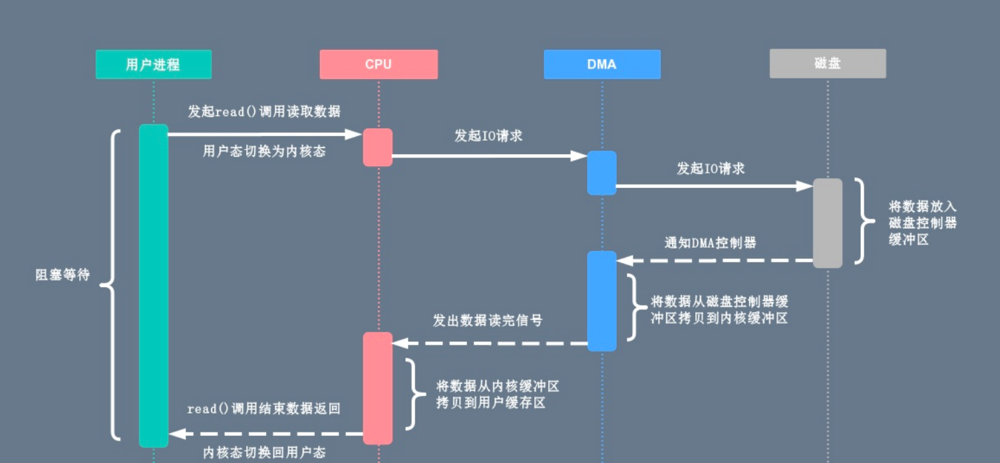

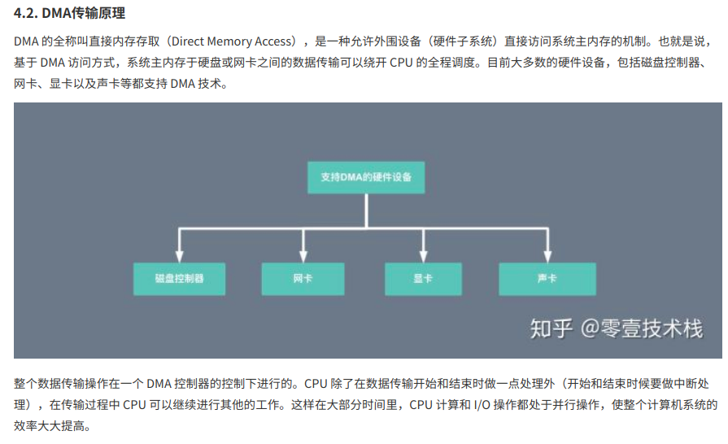


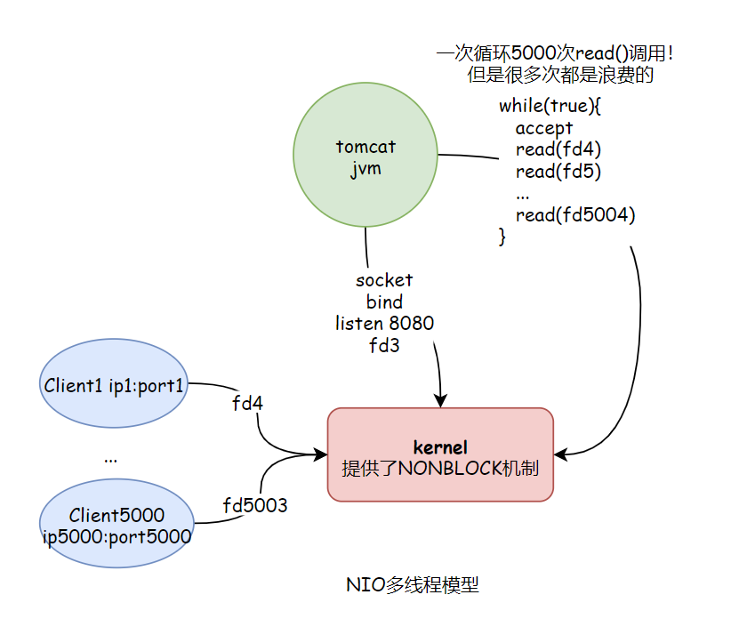

### 8.1.3 IO多路复用

`I/O 复用（select，poll和epoll）`：
使用`select`来等待数据，并且可以等待多个套接字中的任何一个变为可读（等待事件）。**等待数据阶段也需要阻塞**，可读后再调用recvfrom把数据从内核复制到进程。实现单进程具有处理多个IO事件的能力，所以又叫**事件驱动I/O**。如果一个服务器没有IO复用，那么每个socket连接都需要创建一个线程去处理，并发量大时内存不够用。**只在有事件的连接上进行系统调用，通过select监控多个文件描述符**

~~~c
//每次只需要调用select，把所有的文件描述符作为参数传递给kernel
int select(int nfds, fd_set *readfds, fd_set *writefds, fd_set *exceptfds, struct timeval *timeout);

DESCRIPTION
       select()  and  pselect()  allow  a program to monitor multiple file descriptors, 
       waiting until one or more of the file descriptors become "ready" for
        some class of I/O operation (e.g., input possible). 
~~~

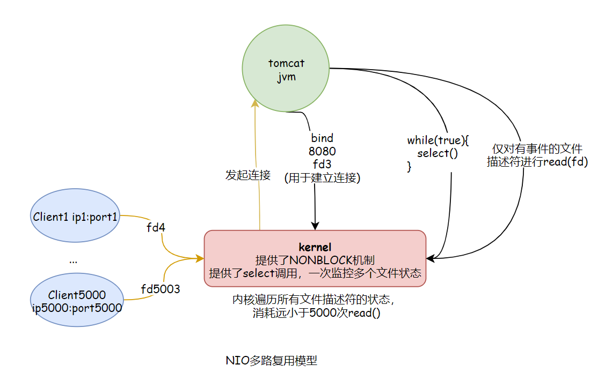

### 8.1.4 信号驱动式IO

`信号驱动式 I/O（SIGIO）`：**等待数据阶段是非阻塞的**，**数据准备好了后内核发送信号**，应用进程调用recvfrom从内核复制数据到引用进程


### 8.1.5 AIO

`异步 I/O（AIO）`：应用进程执行aio_read系统调用后会立即返回，应用进程继续执行，内核会在**数据复制到应用进程完成之后才向应用进程发送信号**(比信号驱动式晚了一些)，全程非阻塞


五种IO的比较


**同步和异步**：同步都需要调用者自己去读写数据(read, recv)，

## 8.2 I/O多路复用

**多路复用器仅仅是返回一个文件的状态，如果程序自己读取IO，还是属于同步的IO**

实际注册到多路复用器的文件描述符可以是阻塞的也可以是非阻塞的

> **一个 socket 是否设置为阻塞模式，只会影响到 connect/accept/send/recv 等四个 socket API 函数，不会影响到 select/poll/epoll_wait 函数，后三个函数的超时或者阻塞时间是由其函数自身参数控制的。**

windows的IOCP是内核有线程，负责拷贝到程序的内存空间，不需要程序自己去读取IO，是异步IO


最朴实的方式自己实现多路复用：**多路复用就是用一个线程处理多个句柄**嘛，如下：

```
while True:
    for each 句柄数组 {
        read/write(fd, /* 参数 */)
    }
    sleep(1s)
```

只要使用非阻塞的fd进行read/write就不会产生阻塞了，否则程序可能会卡死在第三行

这种方式存在的问题是：while循环每次都要睡，吞吐能力极差！不睡的话又及其浪费cpu！

我们的目标是，这一个**线程要把所有的时间都用在处理句柄的IO上，不能有空转，sleep的时间浪费**，这种需求只能靠**内核**提供的机制来满足


Linux提供了三种多路复用器：select（垃圾）-> poll（小垃圾） -> epoll (牛逼)

这三种多路复用器都可以管理fd的可读写时间，在**所有fd不可读不可写的时候，可以阻塞线程，切走cpu。fd一旦有情况，能够唤醒线程**

### 8.2.1 select
~~~c
//每次只需要调用select，把fd_set文件描述符集传给内核
// nfds 表示三个集合中，最大文件描述符的值加1
// fd_set *readfds, *writefds, *exceptfds 分别表示读/写/异常 文件描述符集，每个集合都要从用户态拷贝到内核态，内核修改后又从内核态拷贝到用户态，指出哪些文件描述符状态改变了
// 当 readfds 中文件可读了，就会返回可读文件数量，当writefds中文件可写了就会返回可写文件数量，当exceptfds中文件异常，就会返回异常文件数量

// 返回值：负数表示select错误，正值表示有文件可读写或异常，0表示等待超时，没有满足条件的文件
int select(int nfds, fd_set *readfds, fd_set *writefds, fd_set *exceptfds, struct timeval *timeout);

void FD_SET(int fd, fd_set *fdset);   // 设置文件描述符集fdset中对应于文件描述符fd的位(设置为1)
void FD_CLR(int fd, fd_set *fdset);   // 清除文件描述符集fdset中对应于文件描述符fd的位(设置为0)
void FD_ISSET(int fd, fd_set *fdset); // 检测文件描述符集fdset中对应于文件描述符fd的位是否被设置
void FD_ZERO(fd_set *fdset); // 清除文件描述符集fdset中的所有位(既把所有位都设置为0)

DESCRIPTION
       select()  and  pselect()  allow  a program to monitor multiple file descriptors, 
       waiting until one or more of the file descriptors become "ready" for
        some class of I/O operation (e.g., input possible). 

//recv和send 支持非阻塞模式发送和接收数据
recv(sockfd, buff, buff_size,MSG_WAITALL); //阻塞模式接收        
send(scokfd, buff, buff_size,MSG_WAITALL); //阻塞模式发送
recv(sockfd, buff, buff_size,MSG_DONTWAIT); //非阻塞模式接收        
send(scokfd, buff, buff_size,MSG_DONTWAIT); //非阻塞模式发送


//select编程例子
while(1)   {    
	FD_ZERO(&fds); //每次循环都要将所有的文件描述符对应位清0   
	FD_SET(connfd,&readfds); //添加描述符，每轮都要把要监听的文件描述符集传给内核    
	FD_SET(connfd,&exceptionfds); //同上    
	maxfdp=sock>fp?sock+1:fp+1; //描述符最大值加1    
	switch(select(maxfdp,&readfds,NULL,&exceptionfds,&timeout)){  //select使用      
		case -1: exit(-1);break; //select错误，退出程序    
		case 0:break; //再次轮询    
		default:    
            if(FD_ISSET(connfd,&readfds)){ //检测文件描述符集中对应fd是否发生了事件
                ret = recvfrom(connfd,buffer,sizeof(buff)-1,0);//接受网络数据
                if(ret<=0)	break;
            }                           
            if(FD_ISSET(connfd,&exceptionfds)){ //测试文件是否异常    
                ret = recv(connfd,buff,sizeof(buff)-1,MSG_OOB);
								if(ret <= 0)	break;   
            }
            buffer清空;      
	}// end switch    
}//end while 
~~~
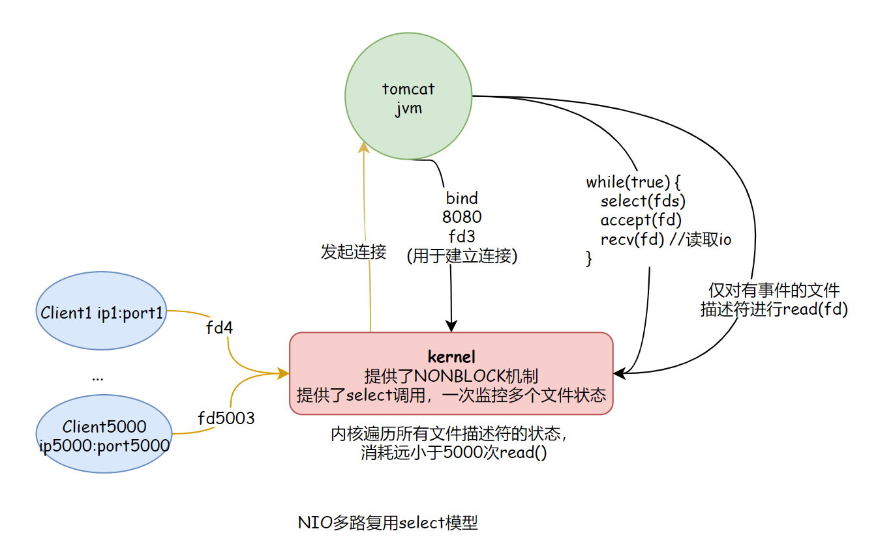

> select实现方式：将已连接的Socket都放到一个**文件描述符集合**，然后调用`select()` 函数将文件描述符集合**拷贝到内核里**，让内核来检查是否有网络事件，内核检查的方式简单粗暴，就是**遍历文件描述符集合**，当检查到有事件产生后，就将此Socket标记为可读/写，**修改对应文件描述符**，接着再将**整个文件描述符集合拷贝回用户态**，**用户态还需要遍历来找到可读/写的Socket**，然后进行处理。
>
> 
>
> `select()`调用时，遍历 所有 nfds 个文件描述符，如果有满足条件的，内核根据状态修改文件描述符集，并返回有事件发生的描述符的个数。此时描述符集合 fdset 中的描述符被修改了，集合中都是有事件发生的


select 允许应用程序监视一组文件描述符，等待一个或者多个描述符成为就绪状态，从而完成 I/O 操作。

- fd_set 使用`bit数组 (BitsMap)`实现，数组大小使用 FD_SETSIZE 定义，所以`只能监听少于 FD_SETSIZE 数量的描述符`。`readfds`、`writefds`、`exceptfds`，分别对应读、写、异常条件的描述符集合，当某个文件描述符可读写，就`把对应bit设置为1`。**三个集合都需要从用户态拷贝到内核态，内核修改后又从内核态拷贝到用户态**，指出哪些文件描述符的状态改变了。
- timeout 为超时参数，调用 select 会一直阻塞直到有描述符的事件到达或者等待的时间超过 timeout。
- 成功调用返回结果大于 0 (**返回三个集合中有事件的文件描述符总数**)，出错返回结果为 -1，超时返回结果为 0。
- **select函数只返回有事件的文件描述符数量，返回大于0后还需要遍历fdset来找到就绪的描述符**


> 对文件描述符集的理解：
>
> 理解 select 的关键在于理解 `fd_set`，为说明方便，取 fd_set 长度为 1 字节，fd_set 中的每一 bit 可以对应一个文件描述符 fd，则 1 字节长的 fd_set 最大可以对应 8 个 fd。select 的调用过程如下：
>
> 1. 执行 FD_ZERO(&set), 则 set 用位表示是 `0000,0000`
> 2. 若 fd＝5, 执行 FD_SET(fd, &set); 后 set 变为 `0001,0000`(第 5 位置为 1)
> 3. 再加入 fd＝2, fd=1，则 set 变为 `0001,0011`
> 4. 执行 select(6, &set, 0, 0, 0) 阻塞等待
> 5. 若 fd=1, fd=2 上都发生可读事件，则 select 返回，此时 set 变为 `0000,0011` (注意：没有事件发生的 fd=5 被清空)


**select优点：**

虽然还是同步阻塞模型，但是实现了**在一个线程内同时处理了多个socket的IO请求**，这在同步阻塞模型中必须使用多线程的方式才能达到目的。此外还具有**良好的跨平台支持**


**select存在的弊端**：

1. 每次调用 select()，都需要把 **fd_set 从用户态拷贝到内核态**，这个开销在 fd 很多时会很大，需要维护一个用来存放大量fd的数据结构，这样会使得用户空间和内核空间在传递该结构时复制开销大。同时每次调用 select() 都需要在**内核遍历传递进来的所有 fd**，这个开销在 fd 很多时也很大。 
2. **单个进程能够监视的文件描述符的数量存在最大限制`sizeof(fd_set)`**，在 Linux 上一般最多监听 1024 个文件描述符，可以通过修改宏定义甚至重新编译内核的方式提升这一限制，但是这样也会造成效率的降低 
3. 由于select返回后会清空没有事件的fd所在的位，所以select函数在**每次调用之前都要对参数进行重新设定**，这样做比较麻烦，而且会降低性能
4. 对socket进行扫描时是**线性扫描，即采用轮询的方法，效率较低**。当套接字比较多的时候，每次select()都要通过遍历FD_SETSIZE个Socket来完成调度，**不管哪个Socket是活跃的，都遍历一遍**。这会浪费很多CPU时间。如果能给套接字注册某个回调函数，当他们活跃时，自动完成相关操作，那就避免了轮询，这正是epoll与kqueue做的。

5. 其实select还是**同步阻塞**的模型，**在select设定的时间timeval内，进程会阻塞在select那条语句上**，此时**内核在遍历select所监管的套接字上**。在此期间只要有一个套接字就就绪了(客户端connect过来，或者客户端send数据过来了 ) select就会返回停止阻塞，然后调用read /accept同步读写或者建立连接；或者在内核遍历期间没有套接字就绪 select会超时返回  然后通过while进入下一轮的select遍历 


### 8.2.2 poll
~~~c
// select 使用三个fds 指针分别描述读写异常的文件描述符集合
// 而poll全都在一个集合中 pollfd *fds
int poll(struct pollfd *fds, unsigned int nfds, int timeout);

// pollfd 中定义了文件要监视的event和发生的event
struct pollfd {
               int   fd;         /*  文件描述符  */
               short events;     /* 监视的event */
               short revents;    /* 发生的event */
};
~~~

poll 的功能与 select 类似，也是等待一组描述符中的一个成为就绪状态。不过**poll没有监管文件描述符个数的限制**，除此之外和select在本质上没有多大差别，管理多个文件描述符也是轮询，根据描述符状态进行处理

**select的pollfd中，就定义了要监视的event和实际发生的event**，如果不再监控某个文件描述符，可以把pollfd结构中的fd设置为-1，poll就不再监控该pollfd，下次返回时会把revents设置为0

监控的events事件可以是`POLLIN`, `POLLOUT`, `POLLERR`，可以通过或运算指定多个事件

和select函数一样，poll()返回后，需要轮询pollfd来获取就绪的描述符，查看pollfd中的revents标志，就知道监视的事件是否发生，所以不需要修改文件描述符


**select和poll比较**

1. poll**不再需要计算最大描述符加1的大小**。
2. select 的描述符类型使用数组实现，`FD_SETSIZE 大小默认为 1024`，因此默认`只能监听少于 1024 个描述符`。如果要监听更多描述符的话，需要修改 FD_SETSIZE 之后重新编译；而poll的**描述符类型使用链表实现**， `poll 没有描述符数量的限制`
3. poll在应付大数目的文件描述符的时候速度相比select更快

4. 调用函数简单，只需要对参数进行一次设置就好


- **共同优势：** select和poll将fds的遍历转移到内核进行，相比于NIO，**减少了系统调用的次数**。没有了最大连接数的限制
- **共同缺点：** select 和 poll 速度都比较慢，**循环中的每次调用select/poll都需要将要监听的全部描述符从应用进程缓冲区复制到内核缓冲区**，解决办法：内核开辟空间！保留fd，无需每次都传入所有fd → epoll

- **共同缺点：select和poll都需要在`函数返回后`，通过`遍历fdset或者pollfd来获取已经就绪的socket`，但是实际上同时连接的大量客户端同一个时刻可能只有少量处于就绪状态，因此效率很低**


### 8.2.3 epoll
~~~c
// 创建epoll对象，返回一个epoll的文件描述符,size告诉内核这个文件描述符监听的数目一共有多大，并不是限制监听的描述符的最大个数，只是对内核初始分配内部数据结构的一个建议
// 函数返回一个epoll的 fd，使用完epoll之后必须调用close()关闭，否则可能导致fd被耗尽
int epoll_create(int size);
		/*    struct eventpoll{
		 *	  	struct rb_root rbr;      // 红黑树的根节点，红黑树存储了所有添加到epoll的需要监控的事件
		 *	  	struct list_head rdlist; // 双链表存放着将要通过epoll_wait返回给用户的满足条件的文件描述符
		 *   }
		 */
//传入epoll的文件描述符epfd和要注册的文件描述符fd，向内核注册文件描述符。
//op参数表示添加、删除、修改对fd的监听事件，event是传入的监听事件
int epoll_ctl(int epfd, int op, int fd, struct epoll_event *event);

//每次循环调用的是epoll_wait，内核无需遍历fds，内核通过中断事件机制把有事件的fd放入到相应的就绪链表。
//没有时间的时候开睡，让出cpu，有事的时候就会被唤醒
//epoll_wait返回就绪链表的文件描述符个数(事件数量)，同时将就绪链表中的事件复制到用户态的events数组中。
//最多返回maxevents个事件
int epoll_wait(int epfd, struct epoll_event * events, int maxevents, int timeout);
~~~

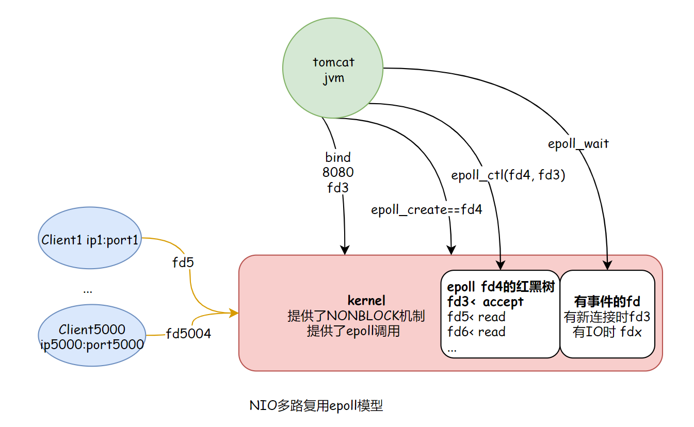

select和poll错误的估计了一件事：当数十万并发连接存在的时候，可能每一毫秒只有数百个活跃的连接。select和poll每次调用都需要复制所有的fd，这是一个高频调用，使得文件描述符被反复拷贝。而epoll的高频调用epoll_wait无需传递文件描述符的，epoll_ctl传递的时候也使得每个文件描述符只会被传递一次，从而提高了效率，节省了资源。

所以epoll的性能不会像 select&poll 那样随着监听的 fd 数量增加而出现线性衰减，是一个非常高效的 I/O 事件驱动技术


epoll高效的秘诀：红黑树，回调唤醒，就绪链表

- `epoll_ctl()` 用于**向内核注册新的socket文件描述符**或者是改变某个文件描述符的状态。已注册的描述符在内核中会被维护在一棵**红黑树**上，重复添加的事件可以通过红黑树高效的识别出来（**增删改fd都非常快**，就算不断的增删改epoll池的fd，也能保持非常稳定的查找性能）。**所有添加到epoll的事件都会与设备(网卡)驱动建立回调关系**（也就在是内核的中断处理程序为它注册一个回调函数）。当fd相应的事件就绪时（中断触发，设备就绪），内核就会调用这个`回调函数`，把发生事件的fd加入到对应事件的`就绪链表`中管理，并且**唤醒阻塞在 `epoll_wait()` 的线程**（转为就绪态等待内核调度） 
- **内核无需遍历fds**，内核通过`中断事件机制`，调用`回调函数`，把有事件的fd放入到就绪链表
- 从上面的描述可以看出，**epoll 只需要在epoll_ctl时将描述符从进程缓冲区向内核缓冲区拷贝一次**，并且进程**不需要通过轮询来获得事件完成的描述符**。
- `epoll_wait()` 阻塞调用，通过检查就绪链表rdlist看是否有事件发生，即检查是否有epitem元素。如果rdlist空，就挂起当前线程，如果rdlist不空，就把就绪的事件复制到用户态的`events`数组中，同时函数返回事件的数量。
- epoll 仅适用于 Linux，跨平台性不好
- epoll 比 select 和 poll 更加灵活而且没有描述符数量限制。
- epoll 对多线程编程更有友好，一个线程调用了 epoll_wait() 另一个线程关闭了同一个描述符也不会产生像 select 和 poll 的不确定情况。

两种工作模式：
- **LT 模式**：默认模式，当 epoll_wait() 检测到描述符事件到达时，将此事件通知进程，进程可以不立即处理该事件，下次调用 epoll_wait() 会再次通知进程。**只要这个fd还有数据可读，每次epoll_wait都会返回它的事件，提醒用户程序去操作**。是默认的一种模式，并且同时支持 Blocking 和 No-Blocking
- **ET 模式**：高速模式，和 LT 模式不同的是，通知之后进程必须立即处理事件，下次再调用 epoll_wait() 时不会再得到事件到达的通知。**只提示一次，无论下次epoll_wait时fd中是否还有剩余数据可读，直到下次再有数据流入fd时才提示**。很大程度上减少了 epoll 事件被重复触发的次数，因此效率要比 LT 模式高。**只支持 No-Blocking**，以避免由于一个文件句柄的阻塞读/阻塞写操作把处理多个文件描述符的任务饿死
- 以读操作为例，这是因为ET模式只在socket描述符状态发生变化时才触发事件，如果不一次把socket内核缓冲区的数据读完，会导致socket内核缓冲区中即使还有一部分数据，该socket的可读事件也不会被触发，所以必须要开循环读。若ET模式下使用阻塞IO，则程序一定会阻塞在最后一次write或read操作，因此说ET模式下一定要使用非阻塞IO。非阻塞模式下数据被读完后read就返回了，然后将errno设置成`EAGAIN`错误并退出while（把缓冲区处理完）。如果是阻塞，程序无法知道数据什么时候被读完，因为读完时会卡在while里面的read，一直在等待数据，永远退不出while。而LT模式就不用了，一次读一下就好了，没读完的话下次epoll_wait还是会通知的
- listenfd最好还是使用非阻塞的：https://mp.weixin.qq.com/s/nacUx_qQr93_y-CsVxkejA

ET模式的优点：如果系统中有大量不需要读写的就绪文件描述符，在默认的LT模式下每次调用epoll_wait都会返回，大大降低了系统效率，而ET模式下就不会，只通知一次直到该文件描述符上出现第二次可读写事件时才再次通知。**避免系统充斥大量用户不关心的就绪文件描述符**


### 8.2.4 总结和各自应用场景

||select|poll|epoll|
|---|---|---|---|
|事件集合|用户通过三个参数传入要监控的可读、可写及异常等事件，内核通过在线修改这些参数来反馈其中的就绪事件，这使得用户每次调用select都要重置这三个参数|统一处理所有的事件类型，因此只需要一个事件集参数。用户通过pollfd.events传入感兴趣的事件，内核通过pollfd.events反馈其中就绪的事件|内核通过一个事件表直接管理用户感兴趣的所有事件。因此每次调用epoll_wait无需反复传入用户感兴趣的事件，epoll_wait的参数events仅用来反馈就绪的事件|
|操作方式|遍历|遍历|回调|
|底层实现|bit数组|链表|红黑树+链表|
|内核效率|线性遍历O(n)|线性遍历O(n)|回调机制，将就绪fd放入rdllist，O(1)|
|最大fd数|默认1024(x86)或2048(x64)|65535|65535|
|fd拷贝|每次调用select，都将fd集合从用户态拷贝到内核态|每次调用poll，都将fd集合从用户态拷贝到内核态|调用epoll_ctl时拷贝进内核并保存，之后每次epoll_wait不拷贝|
|工作模式|LT|LT|LT ET|


**select 应用场景**

select 的 timeout 参数精度为微秒，而 poll 和 epoll 为毫秒，因此 select 更加适用于实时性要求比较高的场景，比如核反应堆的控制
select 可移植性更好，几乎被所有主流平台所支持

**poll 应用场景**
poll 没有最大描述符数量的限制，如果平台支持并且对实时性要求不高，应该使用 poll 而不是 select。

**epoll 应用场景**
只需要运行在 Linux 平台上，需要**监听大量的描述符**，但是**活动的连接较少**的情况

在连接数少并且连接都十分活跃的情况下，select和poll的性能可能比epoll好，毕竟**epoll的通知机制需要很多函数回调**

需要监控的描述符状态变化多，而且都是非常短暂的，也没有必要使用 epoll。因为 epoll 中的所有描述符都存储在内核中，造成**每次需要对描述符的状态改变都需要通过 epoll_ctl() 进行系统调用**，频繁系统调用降低效率。并且 epoll 的描述符存储在内核，不容易调试。


## 8.3 NIO与零拷贝---见操作系统

零拷贝（Zero-copy）技术指在计算机执行操作时，CPU **不需要先将数据从一个内存区域复制到另一个内存区域**，从而可以减少上下文切换以及 CPU 的拷贝时间。它的作用是在数据报从网络设备到用户程序空间传递的过程中，**减少数据拷贝次数，减少系统调用，实现 CPU 的零参与**，彻底消除 CPU 在这方面的负载

主要技术：DMA，内存映射


DMA：本质上，DMA技术就是我们在主板上放⼀块独立的芯片。在进行内存和I/O设备的数据传输的时候，我们不再通过CPU来控制数据传输，而直接通过 DMA控制器（DMA Controller，简称DMAC）。这块芯片，我们可以认为它其实就是一个协处理器（Co-Processor）)


**内存映射技术：**

**虚拟内存中的内核空间部分总是驻留在内存中的：**

- 内核空间中有一部分内存是进程私有的（每个进程都有单独的内核栈、页表、task_struct、mem_map等）

- 有一部分空间是进程共享的（物理存储器、内核数据、内核代码等）

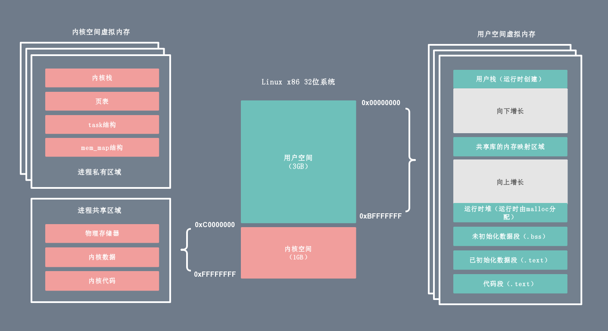


#### 1. 传统拷贝技术

当应用程序访问某块数据时，操作系统首先会检查，是不是最近访问过此文件，**文件内容是否缓存在内核缓冲区**，如果是，操作系统则直接根据read系统调用提供的buf地址，**将内核缓冲区的内容拷贝到buf所指定的用户空间缓冲区中**去。如果不是，操作系统则首先将磁盘上的数据拷贝到内核缓冲区，这一步目前主要依靠`DMA`来传输，然后再把内核缓冲区上的内容拷贝到用户缓冲区中。
接下来，write系统调用再把用户缓冲区的内容拷贝到网络堆栈相关的内核缓冲区中，最后socket再把内核缓冲区的内容发送到网卡上

- **一共需要四次数据拷贝！！**


#### 2. mmap方式优化
**在进程的非堆内存开辟一块内存空间，与OS的内核空间的一块内存进行映射，这样这块内核空间的内存可以直接供用户空间访问，这样用户态数据可以直接保存到内核的buffer，再由DMA写入磁盘即可，不用再拷贝到一次kernel**

**通过mmap，进程像读写硬盘一样读写内存（当然是虚拟机内存）**


磁盘上的数据首先通过DMA拷贝到内核缓冲区
由于**操作系统把这段内核缓冲区与应用程序共享了**，这样就不需要把内核缓冲区的内容向用户空间拷贝(**内存映射，将文件映射到内核缓冲区**)
应用程序调用write()时，操作系统直接将内核缓冲区的内容拷贝到socket缓冲区中，这一切都发生在内核态，最后socket缓冲区再把数据发送到网卡

- **减少了一次拷贝，但不算真正的零拷贝。没有减少用户态和内核态的切换次数**


#### 3. sendFile方式优化
~~~c
//没有了到用户态的过程
ssize_t sendfile(int out_fd, int in_fd, off_t *offset, size_t count);
~~~
Linuix2.1版本的sendFile，数据不经过用户态，**直接从内核缓冲区到SocketBuffer，和用户态无关，减少了一次用户态和内核态的切换**


Linux2.4版本做了修改，避免了从内核缓冲区拷贝到SocketBuffer的操作，**直接从内核缓冲区通过DMA拷贝到协议栈**，再次减少了数据拷贝。(内核缓冲区到SocketBuffer拷贝的信息极少，只需要拷贝length、offset等)


## 8.4 Java BIO

java中实现BIO通信的两个类：

- 客户端：`java.net.Socket` ，创建 Soket 对象，向服务端发送连接请求，服务端响应请求，两者建立连接开始通信
- 服务端：`java.net.ServerSocket` ，创建 ServerSocket 对象，相当于开启一个服务，并等待客户端的连接      

客户端和服务端的连接中包含IO对象(字节流对象)            
服务端使用客户端的字节输入流读取客户端数据，使用客户端的字节输出流给客户端写回数据      

**Socket类** 

实现客户端套接字(包含IP和端口号)        

**构造方法：**  

- `Socket(String host, int port)` ：服务器的IP和端口创建Socket        

**常用方法：**

- `OutputStream getOutputStream()` : 返回此套接字的输出流           
- `OutputStream getInputStream()` : 返回此套接字的输入流    
- `void close()` : 关闭此套接字


**ServerSocket类**

**构造方法：**

- `ServerSocket(int port)`      


**常用方法：**

- `Socket accept()` : 侦听并接收到此套接字的连接

**socket实际上是一个四元组，对应操作系统的一个文件描述符** 


~~~java
public class BIOClient {
    public static void main(String[] args) {
        Socket socket=null;
        try {
            socket = new Socket("localhost", 6666);
            OutputStream outputStream = socket.getOutputStream();
            while(true) {
                String s = new Scanner(System.in).nextLine();
                outputStream.write(s.getBytes());
            }
        } catch (IOException e) {
            e.printStackTrace();
        } finally{
            if(socket!=null){
                try {
                    socket.close();
                } catch (IOException e) {
                    e.printStackTrace();
                }
            }
        }
    }
}


public class BIOServer {
    public static void main(String[] args) {
        ExecutorService threadPool = Executors.newCachedThreadPool();
        try {
            ServerSocket serverSocket = new ServerSocket(6666);
            while(true){
                Socket socket = serverSocket.accept();
                System.out.println("有新的客户端连接"+socket.getInetAddress()+",启动新的线程处理：");
                threadPool.execute(new Runnable() {
                    @Override
                    public void run() {
                        try {
                            InputStream inputStream = socket.getInputStream();
                            byte[] bytes = new byte[1024];
                            int len = 0;
                            while((len=inputStream.read(bytes))!=-1){
                                System.out.println(new String(bytes,0,len));
                            }
                        } catch (IOException e) {
                            e.printStackTrace();
                        } finally{
                            try {
                                socket.close();
                            } catch (IOException e) {
                                e.printStackTrace();
                            }
                        }
                    }
                });
            }
        } catch (IOException e) {
            e.printStackTrace();
        }
    }
}
~~~


### 8.4.1 BIO存在的问题

- 服务端第一次阻塞：`serverSocket.accept()`，等待连接。可以阻塞
- 服务端第二次阻塞：`inputStream.read()`，阻塞读取。不好
- 多个服务端请求连接发送消息时，只有第一个服务端成功连接，只有第一个服务端发送完成后才能接收到其他服务端的消息，可以使用多线程解决这个办法。

但是如果并发量很大，对于32位系统，一个线程对象默认最大需要320KB内存，64位系统默认最大需要1M内存，业务对象还需要内存，内存不够用。过多的线程还需要OS频繁切换，大大影响性能

这时可以使用**线程池**，虽然解决了资源占用问题，但是并发量解决不了
于是就有了NIO


## 8.5 Java NIO

**事件驱动的非阻塞IO**
**NIO的三个核心**：`Channel、Buffer、Selector`

一个线程对应一个Selector
一个Selector可以被多个Channel注册
一个Channel唯一对应一个Buffer，Buffer底层是一个数组
**程序切换到哪个Channel是由事件决定的**，Selector根据不同的事件，在各个通道上切换


BIO中，线程阻塞在read()，而NIO中线程不会阻塞，当一个通道有事件时就去处理，当所有通道都没有事件时，线程可以去处理其其他任务

BIO是以`流`的方式处理数据(**单向的，输入流或者输出流**)，而NIO是以`块`的方式处理数据块(**双向的，可以读也可以写，但是要flip**)

### 8.5.1 Buffer

#### 1. Buffer的简单使用

~~~java
        //创建buffer：存放5个int的buffer
        IntBuffer intBuffer = IntBuffer.allocate(5);

        //存放数据
        for(int i = 0; i<intBuffer.capacity(); i++){
            intBuffer.put(i*i);
        }

        //反转（重置指针到初始位置）
        intBuffer.flip();

        while(intBuffer.hasRemaining()){
            System.out.println(intBuffer.get());
        }
~~~

#### 2. Buffer的子类

**Buffer的子类**：`CharBuffer`、`FloatBuffer`、`IntBuffer`、`DoubleBuffer`、`ShortBuffer`、`LongBuffer`、`ByteBuffer`。没有boolean，其他基本数据类型都有
Buffer的本质是一个**可读写的内存块**，是个含有数组的容器，提供了对内存块的操作方法。缓冲区内置机制可以跟踪和记录缓冲区的状态变化情况，**Channel提供从文件、网络读写数据的通道，但是读写数据都必须要经过Buffer**

#### 3. Buffer的属性和方法

- Buffer的属性：`mark`，`position`，`limit`(当前数据量)，`capacity`(buffer的容量)
  

**mark的说明**：调用`mark()`会将mark设置为当前position的值，以后调用reset()会将position属性设置为mark。
总有`0<=mark<=position<=limit<=capacity`


- **Buffer的常用方法：**
  **转为只读buffer**：`buffer.asReadOnlyBuffer()`


**clear()，flip()，rewind()的区别**：

- `clear()`： **limit设为capacity**，将position设为0，mark设为-1，**一般在数据写入buffer前调用**
- `flip()` ： **limit设为当前position**，将position设为0，mark设为-1，**一般在从buffer中读出数据前调用**
- `rewind()` ：**limit不变**，将position设为0，mark设为-1，**一般把数据重写入buffer前调用**


### 8.5.2 Channel

Channel可以实现异步读写数据，流只能读或者写

#### 1. 常用Channel

**常用的Channel的子接口:**

- `FileChannel` 文件数据读写
  - public int `read(ByteBuffer dst)` ，读取通道的数据，并放到缓冲区中
  - public int `write(ByteBuffer src)` ，把缓冲区的数据写到通道中
  - public long `transferFrom(ReadableByteChannel src, long position, long count)`，从目标通道中复制数据到当前通道
  - public long `transferTo(long position, long count, WritableByteChannel target)`，把数据从当前通道复制给目标通道
- `DatagramChannel` UDP数据读写
- `ServerSocketChannel` TCP数据读写
- `SocketChannel` TCP数据读写

#### 2. ServerSocketChannel方法

`public static ServerSocketChannel open()`，得到一个 ServerSocketChannel 通道
`public final ServerSocketChannel bind(SocketAddress local)`，设置服务器端端口号
`public final SelectableChannel configureBlocking(boolean block)`，设置阻塞或非阻塞模式，取值 false 表示采用非阻塞模式
`public SocketChannel accept()`，接受一个连接，返回代表这个连接的通道对象
`public final SelectionKey register(Selector sel, int ops)`，注册一个选择器并设置监听事件

#### 3. SocketChannel方法

`public static SocketChannel open()`  得到一个 SocketChannel 通道
`public final SelectableChannel configureBlocking(boolean block)`  设置阻塞或非阻塞模式，取值 false 表示采用非阻塞模式
`public boolean connect(SocketAddress remote)` 连接服务器
`public boolean finishConnect()`  如果上面的方法连接失败，接下来就要通过该方法完成连接操作
`public int write(ByteBuffer src)`  往通道里写数据
`public int read(ByteBuffer dst)`  从通道里读数据
`public final SelectionKey register(Selector sel, int ops, Object att)` 注册一个选择器并设置监听事件，最后一个参数可以设置共享数据
`public final void close()` 关闭通道

#### 4. FileChannel实例

~~~java
//file写
public static void main(String[] args) throws Exception {
    String s = "hello啊";
    //创建buffer
    ByteBuffer byteBuffer = ByteBuffer.allocate(1024);
    //将string写入到buffer
    byteBuffer.put(s.getBytes());
    //反转
    byteBuffer.flip();

    FileOutputStream fileOutputStream = new FileOutputStream("D:\\a.txt");
    //通过fileOutputStream获取Channel
    FileChannel fileChannel = fileOutputStream.getChannel();
    //向channel中写入缓冲区数据
    fileChannel.write(byteBuffer);

    fileOutputStream.close();
}

//file读
public static void main(String[] args) throws IOException {
    FileInputStream fileInputStream = new FileInputStream("D:\\a.txt");
    FileChannel channel = fileInputStream.getChannel();

    ByteBuffer byteBuffer = ByteBuffer.allocate(1024);

    while(channel.read(byteBuffer)!=-1){
        //获取byteBuffer的字节数组，按字符串输出
        System.out.println(new String(byteBuffer.array()));
    }

    fileInputStream.close();
}

//transforFrom进行文件拷贝
public static void main(String[] args) throws IOException {
    FileInputStream fileInputStream = new FileInputStream("D:\\a.txt");
    FileOutputStream fileOutputStream = new FileOutputStream("D:\\b.txt");
    FileChannel fromChannel = fileInputStream.getChannel();
    FileChannel toChannel = fileOutputStream.getChannel();
    toChannel.transferFrom(fromChannel, 0, fromChannel.size());

    fromChannel.close();
    toChannel.close();
    fileInputStream.close();
    fileOutputStream.close();
}
~~~

#### 5. MappedByteBuffer

可以在内存(堆外内存)中直接对文件进行修改。操作系统不需要再拷贝一次

~~~java
    public static void main(String[] args) throws IOException {
        RandomAccessFile randomAccessFile = new RandomAccessFile("D:\\a.txt","rw");
        FileChannel channel = randomAccessFile.getChannel();

        //使用读写模式，直接修改的起始位置是0，映射5字节的内存(可修改的范围)
        MappedByteBuffer mappedByteBuffer = channel.map(FileChannel.MapMode.READ_WRITE, 0, 5);

        mappedByteBuffer.put(0, (byte)'*');
        mappedByteBuffer.put(1, (byte)'&');
        mappedByteBuffer.put(3, (byte)'@');

        randomAccessFile.close();
    }
~~~

#### 6. Scattering和Gathering

Scattering：将数据写入到buffer时，可以采用buffer数组，依次写入[分散]
Gathering：从buffer数组读取数据
通道可以直接读写buffer数组

~~~java
    public static void main(String[] args) throws IOException {
        //channel
        ServerSocketChannel serverSocketChannel = ServerSocketChannel.open();

        //绑定端口到socket
        InetSocketAddress inetSocketAddress = new InetSocketAddress(7000);
        serverSocketChannel.socket().bind(inetSocketAddress);

        //buffer数组
        ByteBuffer[] byteBuffers = new ByteBuffer[2];
        byteBuffers[0] = ByteBuffer.allocate(5);
        byteBuffers[1] = ByteBuffer.allocate(3);

        //等待客户端连接
        SocketChannel socketChannel = serverSocketChannel.accept();

        int messageLen = 8;

        //循环读取
        while (true) {
            int byteCountRead = 0;
            while (byteCountRead < messageLen) {
                byteCountRead += socketChannel.read(byteBuffers);
                System.out.println("已读取" + byteCountRead + "个字节");
                Arrays.asList(byteBuffers).stream().map(buffer -> "positon=" +
                        buffer.position() + ",limit=" + buffer.limit()).forEach(System.out::println);
            }
            //将buffer反转
            Arrays.asList(byteBuffers).forEach(buffer -> buffer.flip());

            //回显到客户端
            int byteCountWrite = 0;
            while(byteCountWrite<messageLen){
                byteCountWrite += socketChannel.write(byteBuffers);
            }

            //buffer进行clear
            Arrays.asList(byteBuffers).forEach(buffer -> buffer.clear());

            System.out.println("一共读取了"+byteCountRead+",一共写入"+byteCountWrite);
        }
    }
~~~


### 8.5.3 Selector

**Selector可以检测多个注册的通道上是都有事件发生**，如果有事件发生，便获取事件，然后针对每个事件进行相应的处理。这样就可以只用一个单线程去管理多个通道
只有在通道有读写事件时才会进行读写，大大减少了系统开销，不必为每个连接都创建一个线程，同时减少了多线程之间上下文切换的开销

- Selector特点
  - Netty的IO线程`NioEventLoop`聚合了`Selector`，可以同时并发处理成百上千个客户端连接
  - 当线程从某个客户端Socket通道进行读写数据时，**若没有数据可用了，线程可以去执行其他任务**
  - 线程通常将**非阻塞I/O的空闲时间用于在其他通道上执行IO操作**，所以单独的线程可以管理多个输入和输出通道

#### 1. Selector类相关方法

- `public static Selector open();`//得到一个选择器对象
- `public int select(long timeout);`//监控所有注册的通道，当其中有 IO 事件时，将需要IO操作的通道的 **SelectionKey** 加入到内部集合中并返回，参数用来设置超时时间
- `public Set<SelectionKey> selectedKeys();`//返回publicSelectedKeys集合，所有有事件的key
- `public Set<SelectionKey> keys();`	//返回publicKeys集合，所有key
- `select()`方法是**阻塞监控直到有IO事件发生**，`select(long timeout)`是阻塞一定时间，**到了超时时间也还没有事件就直接返回**，`selectNow()`是非阻塞的，不管有没有事件**都会立即返回**。`selector.wakeup()`可以唤醒阻塞的selector

#### 2. SelectionKey和相关方法

**SelectionKey**：
public static final int OP_READ = 1 << 0;   【读操作】
public static final int OP_WRITE = 1 << 2;  【写操作】
public static final int OP_CONNECT = 1 << 3;    【连接已经建立】
public static final int OP_ACCEPT = 1 << 4;   【有新的网络连接可以 accept】
方法：
`public abstract Selector selector();`  得到与之关联的 Selector 对象
`public abstract SelectableChannel channel();` 得到与之关联的通道
`public final Object attachment();` **得到与之关联的共享数据**
`public abstract SelectionKey interestOps(int ops);` 设置或改变监听事件
`public final boolean isAcceptable();`   是否可以 accept
`public final boolean isReadable();`  是否可以读
`public final boolean isWritable();`  是否可以写

#### 3. NIO的编程流程和原理

需要注意的是，Selector首先就会被ServerSocketChannel注册OP_ACCEPT事件，所以没有客户端连接时selector.keys()已经为1


~~~java
public class Demo7_NIOServer {
    public static void main(String[] args) throws IOException {
        ServerSocketChannel serverSocketChannel = ServerSocketChannel.open();
        Selector selector = Selector.open();

        //1. 绑定端口，设置非阻塞
        serverSocketChannel.socket().bind(new InetSocketAddress(6666));
        serverSocketChannel.configureBlocking(false);

        //2. serverSocketChannel的连接事件注册到selector
        serverSocketChannel.register(selector, SelectionKey.OP_ACCEPT);

        //3. 循环等待客户端的连接
        while(true){
            if(selector.select(1000)==0){
                System.out.println("服务器阻塞等待了一秒，无事发生");
                continue;
            }
            //4. 获取有事件的selectionKeys集合，并获得对应Channel
            Set<SelectionKey> selectionKeys = selector.selectedKeys();
            Iterator<SelectionKey> iterator = selectionKeys.iterator();
            while(iterator.hasNext()){
                SelectionKey selectionKey = iterator.next();
                if(selectionKey.isAcceptable()){ //是连接事件，说明有新的客户端来连接

                    // accept不会阻塞了，因为确实有连接事件来了！！而不是BIO的一直等待连接
                    SocketChannel socketChannel = serverSocketChannel.accept();
                    System.out.println("客户端连接成功 生成了一个 socketChannel " + socketChannel.hashCode());
                    socketChannel.configureBlocking(false); //设置非阻塞
                    // 注册到selector，关联一个buffer
                    socketChannel.register(selector, SelectionKey.OP_READ, ByteBuffer.allocate(1024));
                    System.out.println("该客户端连接后 ，目前注册的selectionkey 数量=" + selector.keys().size()); //2,3,4..
                }else if(selectionKey.isReadable()){
                    //获取OP_READ事件的channel
                    SocketChannel channel = (SocketChannel) selectionKey.channel();
                    //获取之间注册时关联的buffer
                    ByteBuffer buffer = (ByteBuffer)selectionKey.attachment();
                    if(channel.read(buffer)>0){
                        String msg = new String(buffer.array()).trim();
                        System.out.println("收到客户端消息"+ msg);
                        channel.write(ByteBuffer.wrap("OK".getBytes())); //避免关闭客户端循环读问题
                    }else{
                        System.out.println("客户端关闭连接");
                        selectionKey.channel();
                    }
                }
                //移除key，防止重复操作
                iterator.remove();
            }
        }
    }
}


public class Demo7_NIOClient {
    public static void main(String[] args) throws IOException, InterruptedException {
        SocketChannel socketChannel = SocketChannel.open();
        socketChannel.configureBlocking(false);
        InetSocketAddress inetSocketAddress = new InetSocketAddress("127.0.0.1", 6666);
        if(!socketChannel.connect(inetSocketAddress)){
            while(!socketChannel.finishConnect()){
                System.out.println("因为连接需要时间，客户端不会阻塞，可以做其他事情");
                Thread.sleep(100);
            }
        }

        String s = "hello,NIO";
        //wrap直接根据字符串大小创建对应大小的ByteBuffer，不需要手动指定大小
        ByteBuffer byteBuffer = ByteBuffer.wrap(s.getBytes());

        socketChannel.write(byteBuffer);
        socketChannel.close();
    }
}
~~~

### 8.5.4 NIO实现群聊系统

编写一个 NIO 群聊系统，实现服务器端和客户端之间的数据简单通讯（非阻塞）
实现多人群聊
服务器端：可以监测用户上线，离线，并实现消息转发功能
客户端：通过channel 可以无阻塞发送消息给其它所有用户，同时可以接受其它用户发送的消息(有服务器转发得到)


# 9. 高性能网络模型

**Reactor和Proactor这两个高性能网络模型都是基于事件分发的，区别在于Reactor模式是基于待完成的IO事件，Proactor是基于已完成的IO事件**

市面上很多开源软件都采用了Reactor方案，例如Redis，Nginx，Netty等

## 9.1  基本概念

**同步和异步**是针对应用程序和内核的交互而言的

- 同步指的是用户进程触发IO操作并**等待**或者轮询的**去查看IO操作是否就绪**
- 异步是指用户进程触发IO操作以后便开始做自己的事情，而当IO操作已经完成的时候会**得到IO完成的通知**（异步的特点就是通知）

**阻塞和非阻塞**是针对于进程在访问数据的时候，根据IO操作的就绪状态来采取的不同方式，说白了是一种读取或者写入操作函数的实现方式

- 阻塞方式下读取或者写入函数将一直等待
- 非阻塞方式下，读取或者写入函数会立即返回一个状态值


**Reactor模式应用于同步I/O的场景。以读操作为例来看看Reactor中的具体步骤：**

> 1. 应用程序注册读**就绪事件**和相关联的**事件处理器**
> 2. 事件分离器**`等待事件的发生`**
> 3. 当发生读就绪事件的时候，事件分离器调用第一步注册的事件处理器
> 4. **事件处理器首先执行实际的读取操作**，然后根据读取到的内容进行进一步的处理


**Proactor模式中读取操作的过程：**

> 1. 应用程序初始化一个异步读取操作，然后注册相应的事件处理器，此时事件处理器不关注读取就绪事件，而是**关注读取完成事件**，这是区别于Reactor的关键。
> 2. 事件分离器**`等待读取操作完成事件`**
> 3. 在事件分离器等待读取操作完成的时候，操作系统调用内核线程完成读取操作（异步IO都是操作系统负责将数据读写到应用传递进来的缓冲区供应用程序操作，操作系统扮演了重要角色），并将读取的内容放入用户传递过来的缓存区中。这也是区别于Reactor的一点，Proactor中，应用程序需要传递缓存区。
> 4. 事件分离器捕获到读取完成事件后，激活应用程序注册的事件处理器，事件处理器**直接从缓存区读取数据，不需要进行实际的读取操作**

## 9.2 传统BIO服务模型

阻塞式IO，每个连接都需要独立的线程处理，并发数量大时会创建大量线程，占用很大的系统资源。连接创建后如果当前线程没有数据可读，会阻塞在read()上， 造成线程资源浪费 

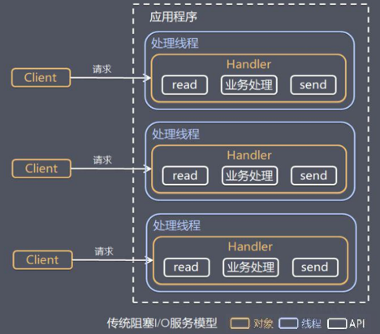

## 9.3 Reactor模型--同步IO

**基于IO复用模型**，多个连接共用一个阻塞对象，应用程序只需要在一个阻塞对象等待，无需阻塞等待所有的连接，当某个连接有新的数据可以处理时，操作系统通知应用程序，线程从阻塞状态返回，开始业务处理 基于线程池复用线程资源，M:N 

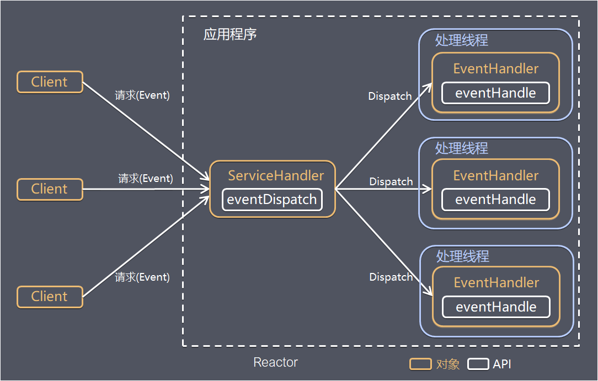

Reactor的时序图如下：

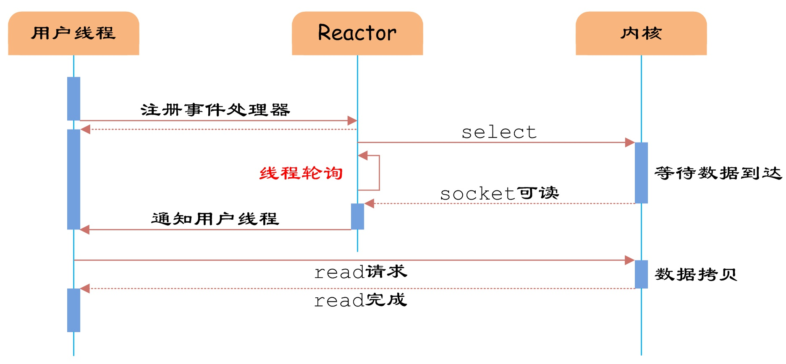


**Reactor负责监听和分发事件**（连接事件、读写事件），再由**处理资源池来负责处理事件**（read-> 业务逻辑 -> send）


根据 Reactor 的数量和处理资源池线程的数量不同，有 3 种典型的实现


方案具体使用进程还是线程，要看具体使用的编程语言和平台。

- java语言一般使用线程，因为java程序是运行在jvm这个进程上面的，在jvm中创建线程。比如Netty
- C语言使用进程和线程都可以，例如Nginx使用的是进程，Memcache使用的是线程。主要使用的是进程，因为C语言编写的程序，运行后就是独立的进程，不需要再在进程中创建线程


### 9.3.1 单 Reactor 单线程/进程

**单 Reactor 单线程**：实现一个阻塞对象监听多路连接请求。

1. Reactor对象通过`select()`监听客户端事件，收到事件后通过`dispatch`进行分发

2. 如果是连接事件就交给Acceptor对象，调用`accept()`获取连接，并创建一个`Handler`对象来处理事件
3. 否则分发调用连接对应的Handler对象来处理，Handler会完成 `read() → 业务处理 → send()` 的完整业务流程。


优点：该方案的全部工作都在同一个进程内完成，所以实现起来比较简单，不需要考虑进程间通信，不用担心多进程竞争

缺点：无法充分利用多核CPU性能，Handler处理时，整个进程无法处理其他连接事件，如果业务处理时间太长，就会造成响应的延迟。所以不适合计算密集型场景，只适用于业务处理非常快速的场景


**客户端数量有限，且业务处理时间很短的情况可以使用，如Redis**，因为redis主要业务处理实在内存中完成，操作的速度很快，性能瓶颈不再cpu，所以redis对于命令的处理是单进程的方案

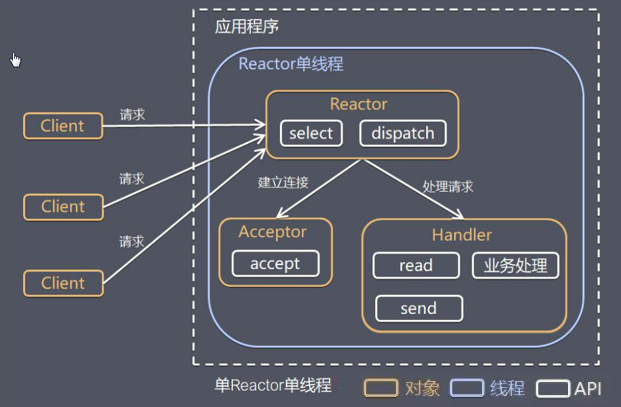


### 9.3.2 单Reactor多线程/进程

**单 Reactor 多线程**：

1. Reactor对象通过`select()`监听客户端事件，收到事件后通过`dispatch`进行分发

2. 如果是连接事件就交给Acceptor对象，调用`accept()`获取连接，并创建一个`Handler`对象来处理事件
3. 否则分发调用连接对应的Handler对象来处理
4. Handler对象不再负责业务处理，只负责数据到的接收和发送(即`read()和send()`系统调用)，读取数据后再将数据发给子线程里的Processor对象进行业务处理
5. 子线程里的Process对象处理完业务逻辑之后，将结果传给主线程的Handler对象，Handler对象调用send()将响应结果发给client


优点：能**充分利用多核CPU的性能**

缺点：带来了多线程竞争资源的问题，例如子线程处理完业务逻辑后，要把结果传递给主线程的Reactor，这里涉及到共享资源的竞争，就要在操作共享资源前加上互斥锁。保证任意时间只有一个线程操作共享资源，释放锁后其他线程才有机会操作共享数据


单Reactor多进程实现起来更复杂，进程间通信比线程间通信复杂得多，因此实际用的不多


 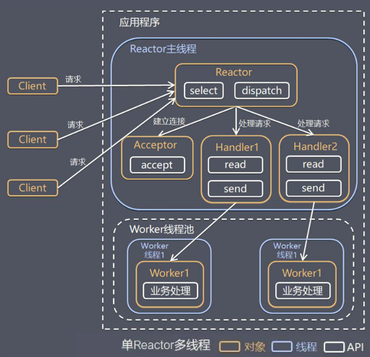


### 9.3.3 多Reactor多线程/进程

1. MainReactor对象通过`select()`监听连接事件，收到连接请求交给Reactor主线程的Acceptor对象的`accept()`处理
2. 子线程中的SubReactor对象将MainReactor对象分配的连接加入select继续监听，并创建Handler对象用于处理连接的响应事件
3. 如果有新的事件发生，SubReactor对象会调用当前连接对应的Handler对象来响应
4. Handler对象调用Worker线程池进行业务处理


**父子Reactor线程交互简单，职责明确，MainReactor只需要接收新连接，SubReactor处理读写事件，业务逻辑还是由Worker线程池处理**

**主线程和子线程交互简单，主线程只需要把新连接传给子线程，子线程无须返回数据，直接就可以在子线程将处理的结构或发送给客户端**


大名鼎鼎的两个开源软件 Netty 和 Memcache 都采用了「多 Reactor 多线程」的方案

采用了「多 Reactor 多进程」方案的开源软件是 Nginx，不过方案与标准的多 Reactor 多进程有些差异

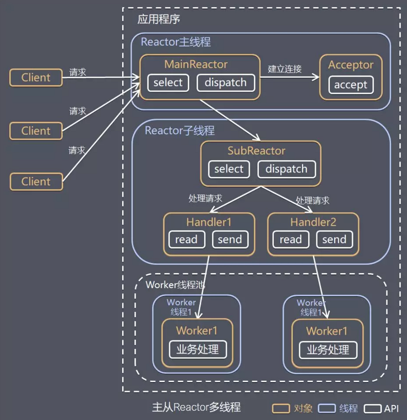


## 9.4 Proactor模式--异步IO

Reactor和Proactor模式的主要区别就是**真正的读取和写入操作是有谁来完成的**，`Reactor`中需要**应用程序自己读取或者写入数据**，而`Proactor`模式中，应用程序**不需要进行实际的读写过程**，它只需要从缓存区读取或者写入即可，**操作系统会读取缓存区或者写入缓存区到真正的IO设备**


- **Reactor 是同步网络模式，感知的是就绪可读写事件**。在每次感知到有事件发生（比如可读就绪事件）后，就需要应用进程主动调用 read 方法来完成数据的读取，也就是要应用进程主动将 socket 接收缓存中的数据读到应用进程内存中，这个过程是同步的，读取完数据后应用进程才能处理数据。

- **Proactor 是异步网络模式， 感知的是已完成的读写事件**。在发起异步读写请求时，需要传入数据缓冲区的地址（用来存放结果数据）等信息，这样系统内核才可以自动帮我们把数据的读写工作完成，这里的读写工作全程由操作系统来做，并不需要像 Reactor 那样还需要应用进程主动发起 read/write 来读写数据，操作系统完成读写工作后，就会通知应用进程直接处理数据。

因此，**Reactor 可以理解为「来了事件操作系统通知应用进程，让应用进程来处理」**，而 **Proactor 可以理解为「来了事件操作系统来处理，处理完再通知应用进程」**。这里的「事件」就是有新连接、有数据可读、有数据可写的这些 I/O 事件这里的「处理」包含从驱动读取到内核以及从内核读取到用户空间

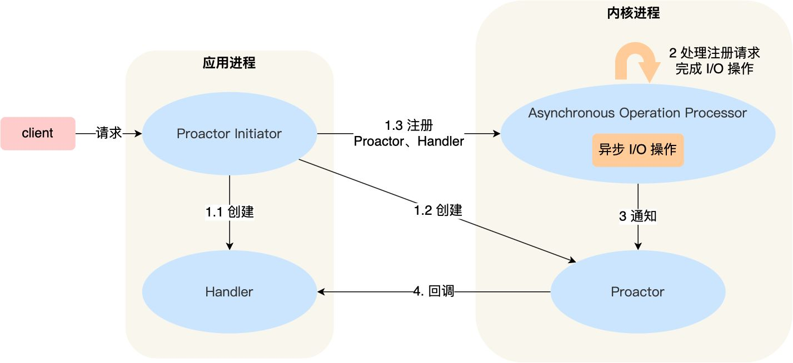

工作流程：

1. Proactor Initiator 负责创建 Proactor 和 Handler 对象，并将 Proactor 和 Handler 都通过 Asynchronous Operation Processor 注册到内核

2. Asynchronous Operation Processor 负责处理注册请求，并处理 I/O 操作

3. Asynchronous Operation Processor 完成 I/O 操作后通知 Proactor
4. Proactor 根据不同的事件类型回调不同的 Handler 进行业务处理
5. Handler 完成业务处理


可惜的是，在 Linux 下的异步 I/O 是不完善的， `aio` 系列函数是由 POSIX 定义的异步操作接口，不是真正的操作系统级别支持的，而是在用户空间模拟出来的异步，并且仅仅支持基于本地文件的 aio 异步操作，网络编程中的 socket 是不支持的，这也使得基于 Linux 的高性能网络程序都是使用 Reactor 方案。

而 Windows 里实现了一套完整的支持 socket 的异步编程接口，这套接口就是 `IOCP`，是由操作系统级别实现的异步 I/O，真正意义上异步 I/O，因此在 Windows 里实现高性能网络程序可以使用效率更高的 Proactor 方案。


# 10. Netty
Netty是一个**异步的，基于事件驱动的网络应用**框架。主要针对TCP协议下，面向Clients端的高并发应用

Java一共支持三种网络编程模型：BIO、NIO、AIO

## 10.1 Netty入门


### 10.1.1 网络模型


### 10.1.2 Netty的网络模型

- Netty抽象出两组线程池：
  - `BossGroup`：负责接收客户端连接
  - `WorkerGroup`：负责网络的读写
  - 他们的类型都是`NioEventLoopGroup`，相当于一个事件循环组，这个组中有**多个事件循环**，每个事件循环都是`NioEventLoop`
  - NioEventLoop是一个不断循环的执行处理任务的线程，**每个NioEventLoop都有一个**`Selector`，用于监听绑定在它上面的socket的事件
- Boss的NioEventLoop**处理accept事件**，与client建立**连接**，生成`NioSocketChannel`并注册到**Worker下**的一个NioEventLoop上的`Selector`，然后处理任务队列的其他任务 runALLTasks
- Worker的NioEventLoop**轮询read,write的IO事件**，在对应NioSocketChannel处理，完成后再去处理任务队列的其他任务 runALLTasks
- Worker的NioEventLoop处理业务时，会使用pipeline，通过pipeline可以获取对应通道


### 10.1.3 Netty简单案例
~~~java
public class simpleServer {
    public static void main(String[] args) throws InterruptedException {
        //创建bossGroup和WorkerGroup,默认是cpu核心数*2
        NioEventLoopGroup bossGroup = new NioEventLoopGroup(1);   //处理连接
        NioEventLoopGroup workerGroup = new NioEventLoopGroup();    //处理IO的业务

        try {
            //创建服务器端的启动对象，配置参数
            ServerBootstrap bootstrap = new ServerBootstrap();
            bootstrap.group(bossGroup, workerGroup)     //设置两个线程组组
                    .channel(NioServerSocketChannel.class)  //使用NioServerSocketChannel作为通道的实现
                    .option(ChannelOption.SO_BACKLOG, 128)  //设置队列得到连接个数
                    .childOption(ChannelOption.SO_KEEPALIVE, true) //保持连接
                    .childHandler(new ChannelInitializer<SocketChannel>() { //创建通道初始化对象
                        //给Pipeline设置处理器
                        @Override
                        protected void initChannel(SocketChannel socketChannel) throws Exception {
                            socketChannel.pipeline().addLast(new NettyServerHandler()); //传入自己的Handler
                        }
                    });
            System.out.println("服务器 ready...");
            ChannelFuture channelFuture = bootstrap.bind(6666).sync();  //启动服务器

            //对关闭通道进行监听
            channelFuture.channel().closeFuture().sync();
        } catch (InterruptedException e) {
            e.printStackTrace();
        } finally {
            bossGroup.shutdownGracefully();
            workerGroup.shutdownGracefully();
        }
    }
}

public class NettyServerHandler extends ChannelInboundHandlerAdapter {
    @Override
    public void channelRead(ChannelHandlerContext ctx, Object msg) throws Exception {
        System.out.println("server ctx="+ctx);

        //将msg转成buffer（Netty的ByteBuf，比NIO的NettyBuffer性能更高）
        ByteBuf buf = (ByteBuf) msg;
        System.out.println("收到客户端消息:"+buf.toString(Charset.forName("utf-8")));
        System.out.println("客户端地址:"+ctx.channel().remoteAddress());
    }

    @Override
    public void channelReadComplete(ChannelHandlerContext ctx) throws Exception {
        ctx.writeAndFlush(Unpooled.copiedBuffer("hello,客户端",Charset.forName("utf-8")));
    }

    @Override
    public void exceptionCaught(ChannelHandlerContext ctx, Throwable cause) throws Exception {
        cause.printStackTrace();
        ctx.close();
    }
}


public class simpleClient {
    public static void main(String[] args) throws InterruptedException {
        //客户端需要一个事件循环组
        NioEventLoopGroup eventLoopGroup = new NioEventLoopGroup();

        try {
            Bootstrap bootstrap = new Bootstrap();
            bootstrap.group(eventLoopGroup).channel(NioSocketChannel.class)
                    .handler(new ChannelInitializer<SocketChannel>() {
                        @Override
                        protected void initChannel(SocketChannel socketChannel) throws Exception {
                            socketChannel.pipeline().addLast(new NettyClientHandler());
                        }
                    });
            System.out.println("客户端 ready...");

            //启动客户端，连接服务器
            ChannelFuture channelFuture = bootstrap.connect("localhost", 6666).sync();
            //对关闭通道进行监听
            channelFuture.channel().closeFuture().sync();

        } catch (InterruptedException e) {
            e.printStackTrace();
        } finally {
            eventLoopGroup.shutdownGracefully();
        }
    }
}

public class NettyClientHandler extends ChannelInboundHandlerAdapter {
    //通道就绪时触发
    @Override
    public void channelActive(ChannelHandlerContext ctx) throws Exception {
        System.out.println("ctx:"+ctx);
        ctx.writeAndFlush(Unpooled.copiedBuffer("Hello,服务器，我是客户端", Charset.forName("utf-8")));
    }

    //通道有读取事件时触发
    @Override
    public void channelRead(ChannelHandlerContext ctx, Object msg) throws Exception {
        ByteBuf buf = (ByteBuf)msg;
        System.out.println("收到服务器的消息："+buf.toString(Charset.forName("utf-8")));
    }

    @Override
    public void exceptionCaught(ChannelHandlerContext ctx, Throwable cause) throws Exception {
        cause.printStackTrace();
        ctx.close();
    }
}
~~~

### 10.1.4 taskQueue和scheduledTaskQueue
每个NioEvenetLoopGroup中有多个NioEventLoop，**每个NioEventLoop都有一个Selector和一个taskQueue**，而灭个selector上可以注册监听多个NioChannel，每个NioChannel都绑定到唯一的NioEventLoop上

任务队列中的 Task 有 3 种典型使用场景：
- 用户程序自定义的普通任务`ctx.channel().eventLoop().execute()`
- 用户自定义定时任务`ctx.channel().eventLoop().schedule()`
- 非当前 Reactor 线程调用 Channel 的各种方法
例如在推送系统的业务线程里面，根据用户的标识，找到对应的 Channel 引用，然后调用 Write 类方法向该用户推送消息，就会进入到这种场景。最终的 Write 会提交到任务队列中后被异步消费

~~~java
public class NettyServerHandler extends ChannelInboundHandlerAdapter {
    @Override
    public void channelRead(ChannelHandlerContext ctx, Object msg) throws Exception {
        System.out.println("开始执行channelRead()的时间------"+LocalTime.now());

        //***自定义Task加入任务队列***，提交到taskQueue
        ctx.channel().eventLoop().execute(new Runnable() { //提交到ctx的channel的eventLoop的taskQueue中异步执行
            @Override
            public void run() {
                Thread.sleep(5000);     //费时的任务，希望异步
                System.out.println("ok1------"+LocalTime.now());  //第5秒后输出
            }
        });

        //**自定义Task加入任务队列***
        ctx.channel().eventLoop().execute(()->{//有一个费时任务，提交到taskQueue
            Thread.sleep(5000);
            System.out.println("ok2------"+LocalTime.now());  //第10秒后输出
        });  //taskQueue是阻塞队列，是被单线程执行的！！所以一共要休眠10秒

        //***自定义延时任务***，提交到scheduledTaskQueue，并且延迟12秒执行
        ctx.channel().eventLoop().schedule(()->{
            Thread.sleep(5000);
            System.out.println("ok3------"+ LocalTime.now());  //再延迟两秒执行，17秒后输出
        }, 12, TimeUnit.SECONDS); //总共延迟12秒，已经过了10秒，还要延迟2秒

        System.out.println("go on....");   //由于异步处理了，所以可以继续执行

    }
    @Override
    public void channelReadComplete(ChannelHandlerContext ctx) throws Exception { //异步，go on后直接执行
        System.out.println("开始执行channelReadComplete()的时间-----"+LocalTime.now());
        ctx.writeAndFlush(Unpooled.copiedBuffer("hello,客户端",Charset.forName("utf-8")));
    }
}
/*
服务器 ready...
开始执行channelRead()的时间------23:32:53.789
go on....
开始执行channelReadComplete()的时间-----23:32:53.794
ok1------23:32:58.802
ok2------23:33:03.802
ok3------23:33:10.797


客户端 ready...23:32:53.434
收到服务器的消息：hello,客户端23:32:53.803
*/
~~~

### 10.1.5 Netty的异步模型
当异步过程调用发出后，调用者不能立即得到结果，实际处理这个调用的组件在完成操作后，通过状态、通知和回调来通知调用者
Netty的IO操作是异步的，包括`Bind、Write、Connect`等操作，都会简单的返回一个`ChannelFuture`，用户通过Future-Listener机制或者通知机制获得结果（**耗时方法fun在调用时，立即返回Future，后续通过Future去监控方法 fun 的处理过程**，即 ： Future-Listener 机制)）

#### 1. Future-Listener机制


## 10.2 Netty核心模块

### 10.2.1 BootStrap和ServerBootStrap
一个 Netty 应用通常由一个 Bootstrap 开始，主要作用是配置整个 Netty 程序，串联各个组件，Netty 中 Bootstrap 类是客户端程序的启动引导类，ServerBootstrap 是服务端启动引导类

常见的方法有
`public ServerBootstrap group(EventLoopGroup parentGroup, EventLoopGroup childGroup)`，该方法用于服务器端，用来设置两个 EventLoop
`public B group(EventLoopGroup group)` ，该方法用于客户端，用来设置一个 EventLoop
`public B channel(Class<? extends C> channelClass)`，该方法用来设置一个服务器端的通道实现
`public <T> B option(ChannelOption<T> option, T value)`，用来给 ServerChannel 添加配置
`public <T> ServerBootstrap childOption(ChannelOption<T> childOption, T value)`，用来给接收到的通道添加配置
`public ServerBootstrap childHandler(ChannelHandler childHandler)`，该方法用来设置业务处理类（自定义的 handler）
`public ChannelFuture bind(int inetPort)` ，该方法用于服务器端，用来设置占用的端口号
`public ChannelFuture connect(String inetHost, int inetPort)` ，该方法用于客户端，用来连接服务器端


### 10.2.2 Future和ChannelFuture
 Netty 中所有的 IO 操作都是异步的，不能立刻得知消息是否被正确处理。但是可以过一会等它执行完成或者直接注册一个监听，具体的实现就是通过 Future 和 ChannelFutures，他们可以注册一个监听，当操作执行成功或失败时监听会自动触发注册的监听事件

常见的方法有
`Channel channel()`，返回当前正在进行 IO 操作的通道
`ChannelFuture sync()`，等待异步操作执行完毕

### 10.2.3 Channel
Netty 网络通信的组件，能够用于执行网络 I/O 操作。
通过Channel 可获得**当前网络连接的通道的状态**
通过Channel 可获得 网络连接的配置参数 （例如接收缓冲区大小）
Channel 提供异步的网络 I/O 操作(如建立连接，读写，绑定端口)，异步调用意味着任何 I/O 调用都将立即返回，并且不保证在调用结束时所请求的 I/O 操作已完成
调用立即返回一个 `ChannelFuture` 实例，**通过注册监听器到 ChannelFuture 上，可以 I/O 操作成功、失败或取消时回调通知调用方**

支持关联 I/O 操作与对应的处理程序
不同协议、不同的阻塞类型的连接都有不同的 Channel 类型与之对应，常用的 Channel 类型:
`NioSocketChannel`，异步的**客户端 TCP Socket 连接**。
`NioServerSocketChannel`，异步的**服务器端 TCP Socket 连接**。
`NioDatagramChannel`，异步的 **UDP 连接**。
`NioSctpChannel`，异步的**客户端 Sctp 连接**。
`NioSctpServerChannel`，异步的 **Sctp 服务器端连接**，这些通道涵盖了 UDP 和 TCP 网络 IO 以及文件 IO。

### 10.2.4 Selector
Netty 基于 Selector 对象实现 I/O 多路复用，**通过 Selector 一个线程可以监听多个连接的 Channel 事件**。
当向一个 Selector 中注册 Channel 后，Selector 内部的机制就可以自动不断地查询(Select) 这些注册的 Channel 是否有已就绪的 I/O 事件（例如可读，可写，网络连接完成等），这样程序就可以很简单地使用一个线程高效地管理多个 Channel 

### 10.2.5 ChannelHandler 及其实现类
ChannelHandler 是一个接口，处理 I/O 事件或拦截 I/O 操作，并将其转发到其 `ChannelPipeline(业务处理链)`中的下一个处理程序。
ChannelHandler 本身并没有提供很多方法，因为这个接口有许多的方法需要实现，方便使用期间，可以继承它的子类


ChannelInboundHandler 用于处理入站 I/O 事件。
ChannelOutboundHandler 用于处理出站 I/O 操作。

//适配器
ChannelInboundHandlerAdapter 用于处理入站 I/O 事件。
ChannelOutboundHandlerAdapter 用于处理出站 I/O 操作。
ChannelDuplexHandler 用于处理入站和出站事件

我们经常需要自定义一个 Handler 类去继承 ChannelInboundHandlerAdapter，然后通过重写相应方法实现业务逻辑
~~~java
    //通道就绪事件
    public void channelActive(ChannelHandlerContext ctx) throws Exception {
        ctx.fireChannelActive();
    }

    //通道读取数据事件
    public void channelRead(ChannelHandlerContext ctx, Object msg) throws Exception {
        ctx.fireChannelRead(msg);
    }

    //数据读取完毕事件
    public void channelReadComplete(ChannelHandlerContext ctx) throws Exception {
        ctx.fireChannelReadComplete();
    }
~~~

### 10.2.6 Pipeline 和 ChannelPipeline
- **ChannelPipeline 是一个 Handler 的集合**，它负责处理和拦截 `inbound` 或者 `outbound` 的事件和操作，相当于一个贯穿 Netty 的链。(也可以这样理解：ChannelPipeline 是 保存 ChannelHandler 的 List，用于处理或拦截 Channel 的入站事件和出站操作)

- ChannelPipeline 实现了一种高级形式的拦截过滤器模式，使用户可以完全控制事件的处理方式，以及 Channel 中各个的 ChannelHandler 如何相互交互
- 在 Netty 中每个 Channel 都有且仅有一个 ChannelPipeline 与之对应，它们的组成关系如下:**一个 Channel 包含了一个 ChannelPipeline，而 ChannelPipeline 中又维护了一个由 ChannelHandlerContext 组成的双向链表，并且每个 ChannelHandlerContext 中又关联着一个 ChannelHandler**

入站事件和出站事件在一个双向链表中，入站事件会从链表 head 往后传递到最后一个入站的 handler，出站事件会从链表 tail 往前传递到最前一个出站的 handler，两种类型的 handler 互不干扰


`ChannelPipeline addFirst(ChannelHandler... handlers)`，把一个业务处理类（handler）添加到链中的第一个位置
`ChannelPipeline addLast(ChannelHandler... handlers)`，把一个业务处理类（handler）添加到链中的最后一个位置

#### 10.2.7 ChannelHandlerContext

保存 Channel 相关的所有上下文信息，同时关联一个 ChannelHandler 对象
ChannelHandlerContext 中包一个具体的事件处理器 ChannelHandler ，同时ChannelHandlerContext 中也绑定了对应的 pipeline 和 Channel 的信息，方便对 ChannelHandler进行调用

`ChannelFuture close()`，关闭通道
`ChannelOutboundInvoker flush()`，刷新
`ChannelFuture writeAndFlush(Object msg)` ， 将数据写到 ChannelPipeline中当前ChannelHandler 的下一个 ChannelHandler 开始处理（出站）

#### 10.2.8 ChannelOption

ChannelOption 参数如下:

- `ChannelOption.SO_BACKLOG` 对应 TCP/IP 协议 listen 函数中的 backlog 参数，用来初始化服务器可连接队列大小。服务端处理客户端连接请求是顺序处理的，所以同一时间只能处理一个客户端连接。多个客户端来的时候，服务端将不能处理的客户端连接请求放在队列中等待处理，backlog 参数指定了队列的大小
- `ChannelOption.SO_KEEPALIVE`


#### 10.2.9 EventLoopGroup 和其实现类 NioEventLoopGroup
EventLoopGroup 是一组 EventLoop 的抽象，Netty 为了更好的利用多核 CPU 资源，一般会有多个 EventLoop 同时工作，每个 EventLoop 维护着一个 Selector 实例。

EventLoopGroup 提供 next 接口，可以从组里面按照一定规则获取其中一个 EventLoop来处理任务。在 Netty 服务器端编程中，我们一般都需要提供两个 EventLoopGroup，例如：BossEventLoopGroup 和 WorkerEventLoopGroup。

BossEventLoopGroup 通常是一个单线程的 EventLoop，EventLoop 维护着一个注册了ServerSocketChannel 的 Selector 实例BossEventLoop 不断轮询 Selector 将连接事件分离出来。通常是 OP_ACCEPT 事件，然后将接收到的 SocketChannel 交给 WorkerEventLoopGroup

WorkerEventLoopGroup 会由 next 选择其中一个 EventLoop来将这个 SocketChannel 注册到其维护的 Selector 并对其后续的 IO 事件进行处理

`public NioEventLoopGroup()`，构造方法
`public Future<?> shutdownGracefully()`，断开连接，关闭线程

#### 10.2.10 Unpooled

Netty 提供一个专门用来操作缓冲区(即Netty的数据容器)的工具类

`public static ByteBuf copiedBuffer(CharSequence string, Charset charset)` 通过给定的数据和字符编码返回一个ByteBuf对象


